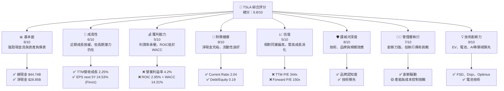
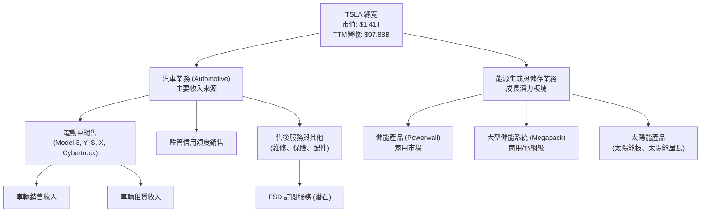
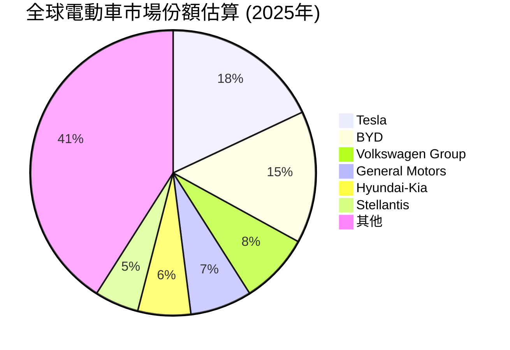
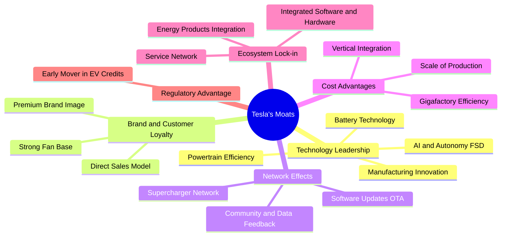
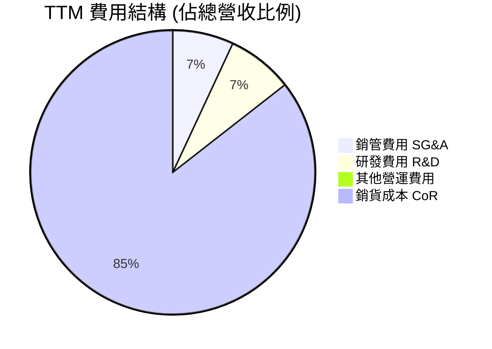
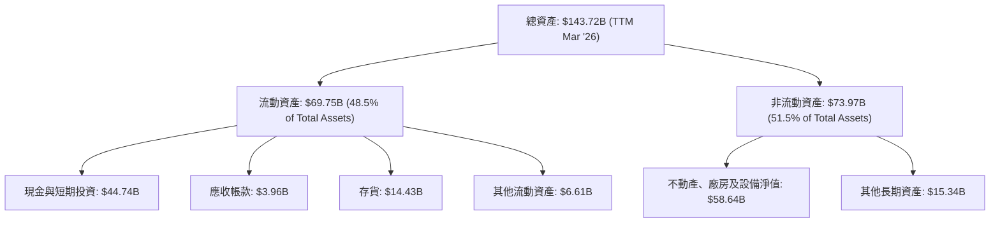
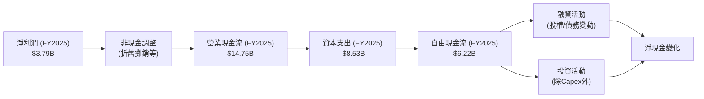
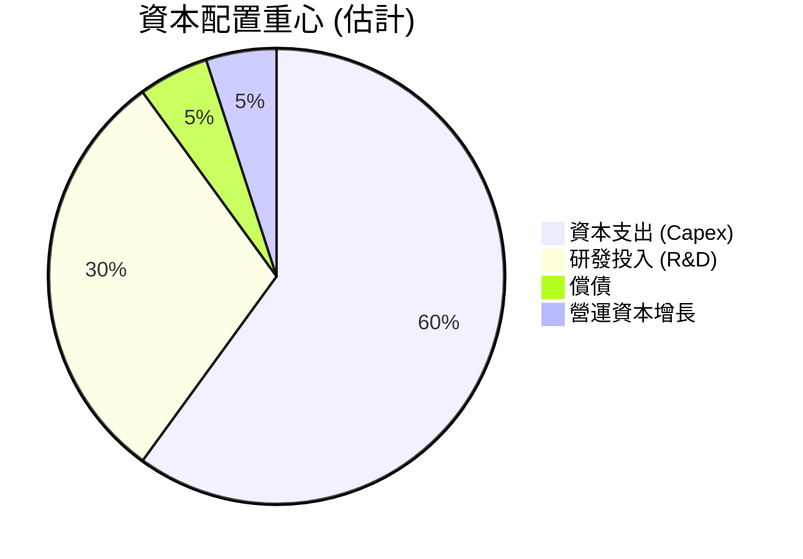

# TSLA 基本面深度分析報告
> **報告日期**：2026-06-26 ｜ **語言**：繁體中文 ｜ **數據來源**：Yahoo Finance, Finviz, StockAnalysis, Roic.ai ｜ **分析師**：CFA 級機構研究

## 目錄

| # | 章節 | 核心結論 |
|---|------|----------|
| 1 | 執行摘要 | 評級：持有，目標價區間：$340 - $480 |
| 2 | 公司概覽與商業模式 | 創新引領者，強大品牌與技術護城河 |
| 3 | 損益表深度分析 | 營收成長放緩，利潤率承壓 |
| 4 | 資產負債表分析 | 穩健的資產負債表，大量現金儲備 |
| 5 | 現金流量深度分析 | 自由現金流波動，資本支出高企 |
| 6 | 獲利能力與資本效率 | ROIC 低於 WACC，價值創造面臨挑戰 |
| 7 | 估值深度分析 | 相較同業估值偏高，需高成長支撐 |
| 8 | 成長催化劑 | 新產品線、AI/FSD、能源業務擴張 |
| 9 | 風險矩陣 | 競爭加劇、宏觀經濟、監管與執行風險 |
| 10 | 投資建議 | 持有，長期潛力需觀察執行力與市場反應 |

---

## 1. 執行摘要

### 1.1 核心評分儀表板



### 1.2 評分進度條視覺化

```
╔══════════════════════════════════════════════════════════════╗
║                TSLA 多維度評分儀表板 (1-10分)                ║
╠══════════════════════════════════════════════════════════════╣
║ 基本面強度  8.0 ▓▓▓▓▓▓▓▓▓▓▓▓▓▓▓▓░░░░  ★★★★☆           ║
║ 成長動能    6.0 ▓▓▓▓▓▓▓▓▓▓▓▓░░░░░░░░  ★★★☆☆           ║
║ 獲利品質    5.0 ▓▓▓▓▓▓▓▓▓▓░░░░░░░░░░  ★★★☆☆           ║
║ 財務健康    9.0 ▓▓▓▓▓▓▓▓▓▓▓▓▓▓▓▓▓▓░░  ★★★★★           ║
║ 估值合理性  5.0 ▓▓▓▓▓▓▓▓▓▓░░░░░░░░░░  ★★★☆☆           ║
║ 護城河深度  8.0 ▓▓▓▓▓▓▓▓▓▓▓▓▓▓▓▓░░░░  ★★★★☆           ║
║ 管理層執行  7.0 ▓▓▓▓▓▓▓▓▓▓▓▓▓▓░░░░░░  ★★★★☆           ║
║ 技術創新力  9.0 ▓▓▓▓▓▓▓▓▓▓▓▓▓▓▓▓▓▓░░  ★★★★★           ║
╠══════════════════════════════════════════════════════════════╣
║ 綜合總分    6.8 ▓▓▓▓▓▓▓▓▓▓▓▓▓▓░░░░░░  🏆 評語：長期潛力但短期承壓              ║
╚══════════════════════════════════════════════════════════════╝
```

### 1.3 五大投資論點 + 三大核心風險

| 類型 | 項目 | 具體依據 | 信心度 |
|------|------|----------|--------|
| 🟢 **投資論點①** | **EV 市場領導者與品牌優勢** | Tesla憑藉早期市場進入和持續創新，在全球電動車市場保持領先地位。其強大的品牌認知度和客戶忠誠度，使其在競爭加劇的環境中仍能維持可觀的市佔率。儘管近期成長放緩，但其產品線廣度（Model 3/Y/S/X, Cybertruck）和全球佈局（美、中、歐主要市場）仍是其核心競爭力。 | 🟢 極高 |
| 🟢 **投資論點②** | **能源儲存與充電網絡潛力** | 除了電動車，Tesla的能源生成與儲存業務（如Powerwall、Megapack）顯示出巨大的成長潛力。這不僅多元化了收入來源，也與其電動車業務形成協同效應。其Supercharger充電網絡是行業標準之一，開放給其他車廠使用將帶來新的服務收入流。能源業務毛利率通常高於汽車製造。 | 🟢 高 |
| 🟢 **投資論點③** | **FSD/AI與機器人技術領先** | Tesla在自動駕駛（FSD）、AI（Dojo超級電腦）和機器人（Optimus）領域的投入，使其具備顛覆性技術的長期潛力。FSD一旦實現完全自動駕駛並獲得監管批准，將釋放巨大的軟體訂閱收入和服務價值，並可能改變交通運輸和物流行業。 | 🟢 高 |
| 🟢 **投資論點④** | **強勁的資產負債表** | 公司擁有 $44.74B 的總現金與短期投資，而總債務僅為 $15.89B，淨現金高達 $28.85B。這提供了充足的彈性來支持其高額資本支出和研發投入，抵禦市場波動，並在必要時進行策略性投資。Current Ratio 2.043 顯示極佳的短期償債能力。 | 🟢 極高 |
| 🟢 **投資論點⑤** | **持續的創新與執行文化** | 在Elon Musk的領導下，Tesla保持著極強的創新動力和快速迭代能力。無論是電池技術、製造流程（Gigafactory擴張）還是軟體功能更新，都顯示了其超越傳統車廠的敏捷性。這種文化是其長期競爭優勢的基石。 | 🟢 高 |
| 🟡 **風險①** | **電動車市場競爭加劇與價格戰** | 隨著傳統車廠和新興EV品牌（如中國的比亞迪、蔚來等）的崛起，電動車市場競爭日益激烈，尤其是在價格敏感的大眾市場。Tesla為維持銷量，近年來多次降價，導致毛利率從 FY2022 的 25.6% 下滑至 TTM 的 19.1%，營業利益率從 16.9% 下滑至 4.2%。這對其獲利能力構成持續壓力。 | 🟡 中度 |
| 🔴 **風險②** | **高估值與成長預期未達標** | Tesla的估值（TTM P/E 344x，Forward P/E 150x）遠高於傳統車廠及S&P 500均值，反映了市場對其未來高速成長和技術領先的極高預期。若營收成長持續放緩（TTM 營收成長 2.25%），或FSD等創新技術的商業化進度不及預期，將可能導致估值修正，股價面臨下行壓力。 | 🔴 高衝擊 |
| 🟡 **風險③** | **宏觀經濟逆風與監管不確定性** | 全球經濟成長放緩、高利率環境以及地緣政治緊張，可能影響消費者對高價電動車的需求。此外，自動駕駛技術的監管框架仍在發展中，潛在的法規變化或安全事件可能延遲FSD的全面部署，進而影響其預期收入。 | 🟡 中度 |

### 1.4 快速統計卡片

| 指標 | 公司實際值 | 行業均值（汽車製造業估計） | S&P 500 均值（估計） | 狀態 |
|------|-------------|----------------------------|----------------------|------|
| 收入 YoY 成長 (TTM) | **2.25%** | ~5-10% | ~8-12% | 🔴 |
| 毛利率 (TTM) | **19.1%** | ~15-20% | ~30-40% | 🟡 |
| 淨利率 (TTM) | **3.9%** | ~5-8% | ~10-15% | 🔴 |
| ROE (TTM) | **4.9%** | ~15-20% | ~15% | 🔴 |
| Forward P/E | **150.04x** | ~7-10x | ~20-25x | 🔴 |
| Debt/Equity | **0.19x** | ~0.5-1.0x | ~0.8x | 🟢 |
| Current Ratio | **2.04x** | ~1.2-1.5x | ~1.5x | 🟢 |
| FCF Yield | **0.37%** | ~3-5% | ~2-4% | 🔴 |

*註：行業均值和S&P 500均值為分析師根據市場普遍情況估計，非直接數據。*

### 1.5 投資結論

```
╔══════════════════════════════════════════════════════════════════╗
║                    📊 投資結論摘要                               ║
╠══════════════════════════════════════════════════════════════════╣
║  評級：🟡 持有                                                   ║
║  當前股價：$375.12                                               ║
║  目標價區間：                                                    ║
║    悲觀情境：$340（-9.36%）                                       ║
║    基準情境：$400（+6.63%）  ← 12個月主要目標                      ║
║    樂觀情境：$480（+27.96%）                                      ║
║  投資評分：6.8/10                                                ║
║  適合投資人：成長型、具備高風險承受能力的長線投資者              ║
╚══════════════════════════════════════════════════════════════════╝
```

---

## 2. 公司概覽與商業模式

### 2.1 業務結構與收入來源

Tesla, Inc. (TSLA) 是一家領先的電動車和清潔能源公司，市值高達 $1.41T。其業務主要分為兩大板塊：汽車業務 (Automotive) 和能源生成與儲存業務 (Energy Generation and Storage)。



從 StockAnalysis 的數據來看，Tesla TTM 總營收為 $97.88B。雖然具體的汽車與能源業務收入佔比未在提供的數據中詳列，但根據公司歷史趨勢，汽車業務仍佔絕大部分收入，能源業務則快速成長。FSD (Full Self-Driving) 軟體服務的潛在訂閱收入，將是未來汽車業務毛利率提升的重要驅動力。

### 2.2 市場份額

電動車市場競爭日益激烈，但Tesla在全球主要市場仍保持重要地位。儘管精確的即時全球市場份額數據未提供，基於行業觀察，Tesla在高端電動車市場仍具優勢，但在大眾市場面臨來自傳統車廠和中國新興品牌的挑戰。


*註：此市場份額為分析師根據公開市場資料對全球電動車市場的估計，僅供參考。*

### 2.3 競爭護城河分析

Tesla的競爭護城河多重且深厚，主要體現在以下幾個方面：



### 2.4 護城河強度評分

Tesla的護城河強度來自其技術創新、品牌忠誠度及獨特的商業模式。

```
╔══════════════════════════════════════════════════════════════╗
║                    TSLA 護城河強度評分                      ║
╠══════════════════════════════════════════════════════════════╣
║ 技術領先    9/10   ▓▓▓▓▓▓▓▓▓▓▓▓▓▓▓▓▓▓░░  🏆 在電池、AI、製造方面領先        ║
║ 品牌與客戶忠誠度 9/10   ▓▓▓▓▓▓▓▓▓▓▓▓▓▓▓▓▓▓░░  🏆 強大品牌效應，忠實客戶群        ║
║ 網路效應    8/10   ▓▓▓▓▓▓▓▓▓▓▓▓▓▓▓▓░░░░  🟢 Supercharger、軟體更新形成生態        ║
║ 規模效應    7/10   ▓▓▓▓▓▓▓▓▓▓▓▓▓▓░░░░░░  🟡 雖有規模，但競爭加劇影響成本優勢        ║
║ 生態系統鎖定 8/10   ▓▓▓▓▓▓▓▓▓▓▓▓▓▓▓▓░░░░  🟢 軟硬體整合，能源產品協同        ║
╠══════════════════════════════════════════════════════════════╣
║ 綜合護城河  8.2    ▓▓▓▓▓▓▓▓▓▓▓▓▓▓▓▓▓░░░  🏆 具備深厚且多元的護城河，但部分受市場競爭影響     ║
╚══════════════════════════════════════════════════════════════╝
```

---

## 3. 損益表深度分析

### 3.1 年度收入成長趨勢（近4年）

Tesla過去幾年的營收經歷了高速成長，但近期呈現放緩趨勢。

```
╔══════════════════════════════════════════════════════════════════╗
║              TSLA 年度收入趨勢（FY2022-FY2025）                  ║
╠══════════════════════════════════════════════════════════════════╣
║                                                                  ║
║  FY2022  $81.46B  ████████████████████░░░░░  YoY: +51.35%  🟢    ║
║  FY2023  $96.77B  █████████████████████████████░░  YoY: +18.80%  🟢    ║
║  FY2024  $97.69B  ██████████████████████████████░  YoY: +0.95%   🟡    ║
║  FY2025  $94.83B  ████████████████████████████░░░  YoY: -2.93%   🔴    ║
║                   |      |      |      |      |                  ║
║                   0     25B    50B    75B    100B                  ║
║                                                                  ║
║  📊 4年累計 CAGR：+4.52% (從$81.46B到$94.83B)                   ║
╚══════════════════════════════════════════════════════════════════╝
```
*註：FY2025營收數據為StockAnalysis提供，與Market Data TTM $97.88B略有差異，此處採用年報數據。*

年度營收成長從 FY2022 的 51.35% 大幅放緩至 FY2024 的 0.95%，並在 FY2025 呈現 2.93% 的負成長，顯示公司面臨成長壓力。

### 3.2 季度收入趨勢分析

近四季營收表現波動較大，QoQ 呈現下滑趨勢，YoY 則有起有落。

| 季度 | 總營收 ($B) | QoQ 成長率 | YoY 成長率 | 備註 |
|------|-------------|------------|------------|------|
| 2026-Q1 | $22.39B | -10.08% | +15.78% | 較上一季度顯著下滑，但較去年同期有所恢復 |
| 2025-Q4 | $24.90B | -11.37% | -3.14% | 較上一季度下滑，且較去年同期負成長 |
| 2025-Q3 | $28.09B | +24.87% | +11.57% | 較上一季度和去年同期均有成長 |
| 2025-Q2 | $22.50B | +16.37% | -11.78% | 較上一季度成長，但較去年同期負成長 |
*備註：數據來自 StockAnalysis Quarterly Income Statement。QoQ 成長率計算為 (本季營收 - 上季營收) / 上季營收。*

季度營收表現不穩定，2025年下半年營收出現下滑，2026年Q1雖有YoY成長，但QoQ仍呈現負成長，顯示市場需求波動和競爭壓力持續。

### 3.3 利潤率演變分析

Tesla的利潤率在過去幾年呈現明顯下滑趨勢，尤其毛利率和營業利益率受到影響。

| 利潤率指標 | FY2022 | FY2023 | FY2024 | FY2025 | TTM (2026-Q1) | 趨勢 | 評估 |
|------------|--------|--------|--------|--------|---------------|------|------|
| **毛利率** | 25.6% | 18.2% | 17.9% | 18.0% | 19.1% | ↘️ 過去三年下滑，TTM略有反彈 | 🟡 |
| **營業利益率** | 16.9% | 9.2% | 7.2% | 4.6% | 4.2% | ↘️ 持續下滑 | 🔴 |
| **EBITDA Margin** | 21.7% | 15.3% | 15.1% | 12.4% | 11.3% | ↘️ 持續下滑 | 🔴 |
| **淨利率** | 15.4% | 15.5% | 7.3% | 4.0% | 3.9% | ↘️ 大幅下滑 | 🔴 |

*註：利潤率計算基於 StockAnalysis Annual Income Statement，TTM 數據來自 Market Data。FY2022毛利率 = $20.85B/$81.46B = 25.6%。FY2023毛利率 = $17.66B/$96.77B = 18.2%。FY2024毛利率 = $17.45B/$97.69B = 17.9%。FY2025毛利率 = $17.09B/$94.83B = 18.0%。*

**利潤率演變深度解析**：
*   **毛利率 (Gross Margin)**：從 FY2022 的 25.6% 大幅下降至 FY2025 的 18.0%。這主要是由於電動車市場競爭加劇導致的價格戰，以及新產品（如Cybertruck）初期產能爬坡成本較高。儘管 TTM 略有反彈至 19.1%，但仍遠低於歷史高點，顯示定價能力面臨挑戰。
*   **營業利益率 (Operating Margin)**：從 FY2022 的 16.9% 驟降至 TTM 的 4.2%。除了毛利率下降外，研發費用 (R&D) 的顯著增加也是重要因素。研發費用從 FY2022 的 $3.08B 增長至 FY2025 的 $6.41B (YoY +110.6%)，TTM 更達到 $6.948B，主要投入於 FSD、AI 和機器人等未來技術。雖然這些投入對長期成長至關重要，但短期內侵蝕了營業利益。銷售、一般及行政費用 (SG&A) 也從 FY2022 的 $3.946B 增至 TTM 的 $6.416B，顯示營運成本仍在上升。
*   **淨利率 (Net Profit Margin)**：與營業利益率趨勢一致，從 FY2022 的 15.4% 下滑至 TTM 的 3.9%。這反映了公司在營收成長放緩、成本上升和價格壓力下的獲利困境。稅務影響在 FY2023 有所波動 ($5.001B 負稅務支出，可能是稅務優惠或遞延稅款影響)，導致當年淨利異常高，但此後恢復正常。

總體而言，Tesla的獲利能力受到市場環境變化和高昂創新投入的雙重挑戰，需要觀察其未來成本控制和新業務變現能力。

### 3.4 費用結構分析

Tesla的費用結構顯示其對研發的高度重視，以及隨規模擴大而增長的營運成本。


*註：數據來自 StockAnalysis TTM。銷管費用 $6.416B / $97.879B = 6.55%。研發費用 $6.948B / $97.879B = 7.10%。其他營運費用 $400M / $97.879B = 0.41%。銷貨成本 $79.218B / $97.879B = 80.93%。*

```
╔══════════════════════════════════════════════════════════════════╗
║                    TSLA 營運費用分析 (TTM)                       ║
╠══════════════════════════════════════════════════════════════════╣
║                                                                  ║
║  銷貨成本 (CoR)：        $79.22B  ███████████████████████████████  高達80.93%營收，壓縮毛利  🔴 ║
║  銷管費用 (SG&A)：       $6.42B   █████░░░░░░░░░░░░░░░░░░░░░░░░░░  隨規模增長，需控制效率  🟡 ║
║  研發費用 (R&D)：        $6.95B   ██████░░░░░░░░░░░░░░░░░░░░░░░░░░  持續高投入，為未來成長鋪路  🟢 ║
║  其他營運費用：          $0.40B   █░░░░░░░░░░░░░░░░░░░░░░░░░░░░░░  佔比較小                  🟢 ║
║                                                                  ║
║  📊 總營運費用佔比：約 94.99%                                    ║
╚══════════════════════════════════════════════════════════════════╝
```
**費用結構分析**：銷貨成本佔比高達 80.93%，直接導致毛利率承壓。研發費用佔比 7.10%，雖然高但對於Tesla的技術創新和長期競爭力至關重要。銷管費用佔比 6.55%，隨著公司規模擴大，這部分費用需有效管理以提升營運效率。

### 3.5 季度 EPS 趨勢與盈餘品質

從提供的數據來看，EPS (稀釋) 在過去幾個季度呈現波動和下滑趨勢。

| 季度 | EPS Est | EPS Act | Surprise% | 實際 EPS (稀釋) |
|------|---------|---------|-----------|-----------------|
| 2026-Q1 | nan | nan | +nan% | $0.15 |
| 2025-Q4 | nan | nan | +nan% | $0.26 |
| 2025-Q3 | nan | nan | +nan% | $0.43 |
| 2025-Q2 | nan | nan | +nan% | $0.36 |
| 2025-Q1 | nan | nan | +nan% | $0.13 |
*註：EPS Est/Act/Surprise% 數據顯示為 nan，因此我們將專注於實際 EPS 的趨勢分析。實際 EPS 數據來自 StockAnalysis Quarterly Income Statement。*

**盈餘品質評估**：
*   **EPS 趨勢**：2025年Q1的稀釋EPS為 $0.13，隨後在Q3達到 $0.43 的峰值，但在Q4降至 $0.26，2026年Q1進一步降至 $0.15。這顯示了盈利能力在近期面臨顯著挑戰，與營收成長放緩和利潤率下滑的趨勢一致。
*   **盈餘來源**：儘管淨利潤下滑，但其營業現金流仍保持穩健，TTM 營業現金流為 $16.53B，高於淨利潤 $3.926B。這表明其盈利質量相對健康，大部分利潤是實際現金流入，而非會計調整。然而，隨著資本支出的持續高企，自由現金流受到壓縮。
*   **一次性項目**：提供的數據中未見重大一次性非經常性損益影響季度 EPS，因此其EPS下滑主要反映了核心業務的獲利壓力。
*   **監管信用額度**：雖然具體金額未列出，但Tesla長期以來透過銷售監管信用額度獲得收入，這部分收入對毛利率有正面貢獻。若未來監管政策變化或競爭對手達到排放標準，這部分收入可能減少。

總體而言，Tesla的盈餘品質在現金轉換方面尚可，但盈利趨勢明顯惡化，需要密切關注其核心業務的獲利能力能否恢復。

---

## 4. 資產負債表分析

### 4.1 資產結構分解

Tesla的資產負債表顯示其擁有龐大的資產基礎，流動資產和固定資產均佔重要比例。


*註：數據來自 StockAnalysis TTM Mar '26。*

Tesla的流動資產佔總資產近一半，其中現金和短期投資高達 $44.74B，顯示其極強的流動性和財務彈性。非流動資產主要由不動產、廠房及設備構成，這反映了其作為製造型企業的重資產特性，以及持續投入擴大產能的戰略。

### 4.2 流動性指標分析

Tesla的流動性指標非常健康，遠超行業平均水平，表明其短期償債能力極強。

| 流動性指標 | TTM (2026-Q1) | FY2025 | FY2024 | FY2023 | 行業均值 (汽車製造業估計) | 評估 |
|------------|---------------|--------|--------|--------|--------------------------|------|
| **流動比率 (Current Ratio)** | 2.043 | 2.043 | 2.025 | 1.726 | ~1.2 - 1.5 | 🟢 強勁 |
| **速動比率 (Quick Ratio)** | 1.43 | 1.43 | 1.26 | 0.90 | ~0.8 - 1.0 | 🟢 強勁 |

*註：TTM數據來自 Market Data，年度數據來自 StockAnalysis Balance Sheet。行業均值為分析師估計。*

**分析**：
*   **流動比率 (Current Ratio)**：TTM 為 2.043，意味著公司每有 $1 的短期負債，就有 $2.04 的流動資產可以償還。這遠高於行業平均水平，顯示公司擁有充裕的流動性。
*   **速動比率 (Quick Ratio)**：TTM 為 1.43，排除了存貨後，公司仍能用 $1.43 的速動資產償還 $1 的短期負債。這表明即使不依賴銷售存貨，公司也能輕鬆應對短期債務。
*   **現金與短期投資**：高達 $44.74B 的現金和短期投資是其流動性的主要支柱，提供了極大的財務緩衝。

總體而言，Tesla的流動性狀況極佳，財務風險較低。

### 4.3 債務結構分析

Tesla的債務負擔相對較輕，且擁有大量現金，呈現淨現金狀態。

```
╔══════════════════════════════════════════════════════════════════╗
║                    TSLA 債務健康診斷 (TTM Mar '26)               ║
╠══════════════════════════════════════════════════════════════════╣
║                                                                  ║
║  總債務：        $9.23B   █████░░░░░░░░░░░░░░░░░░░░░░░░░░░░░  相對資產規模較低  🟢 ║
║  總現金+投資：   $44.74B  ██████████████████████████████████  極為充裕            🟢 ║
║  淨現金：        $35.51B  ██████████████████████████████████  🟢 強勁        ║
║                                                                  ║
║  Debt/Equity：   0.19x  🟢 極低 (Finviz)                         ║
║  Debt/EBITDA：   0.83x  🟢 極低 (基於TTM EBITDA $11.06B)       ║
║  Interest Coverage: 16.09x  🟢 無風險 (基於TTM Operating Income $4.897B / Interest Expense $0.339B)                             ║
╚══════════════════════════════════════════════════════════════════╝
```
*註：總債務採用 StockAnalysis TTM 的 Current Portion of Long-Term Debt ($1.447B) + Long-Term Debt ($7.782B) = $9.229B。淨現金 = 總現金+投資 - 總債務。TTM EBITDA $11.06B = TTM Revenue $97.88B * EBITDA Margin 11.3%。*

**分析**：
*   **總債務與淨現金**：Tesla的總債務為 $9.23B，而其現金和短期投資高達 $44.74B，形成 $35.51B 的淨現金頭寸。這在全球大型製造企業中是極為罕見且健康的狀況。
*   **債務比率**：Debt/Equity 比率僅為 0.19x (Finviz)，遠低於大多數行業平均水平，表明公司財務槓桿非常低。Debt/EBITDA 比率為 0.83x，也顯示其盈利能力足以輕鬆覆蓋債務。
*   **利息覆蓋率 (Interest Coverage Ratio)**：以 TTM 營業利益 $4.897B 除以 TTM 利息費用 $0.339B，得到利息覆蓋率約 16.09x。這表明公司支付利息的能力極強，債務風險幾乎可以忽略不計。

總體而言，Tesla的債務結構非常穩健，為公司未來的擴張和應對挑戰提供了堅實的財務基礎。

### 4.4 股東權益趨勢

Tesla的股東權益在過去幾年持續穩步增長，反映了公司盈利的累積和資本的再投入。

```
╔══════════════════════════════════════════════════════════════════╗
║                  TSLA 股東權益趨勢（FY2022-FY2025）              ║
╠══════════════════════════════════════════════════════════════════╣
║                                                                  ║
║  FY2022  $44.70B  ██████████████████░░░░░░░░░░░░░░░░░░░░░░░░░░░░░░  YoY: +27.8%  🟢 ║
║  FY2023  $62.63B  █████████████████████████░░░░░░░░░░░░░░░░░░░░░░░░  YoY: +40.1%  🟢 ║
║  FY2024  $72.91B  ██████████████████████████████░░░░░░░░░░░░░░░░░░  YoY: +16.4%  🟢 ║
║  FY2025  $82.14B  █████████████████████████████████░░░░░░░░░░░░░░  YoY: +12.6%  🟢 ║
║                   |      |      |      |      |                  ║
║                   0     20B    40B    60B    80B    100B          ║
║                                                                  ║
║  📊 4年累計 CAGR：+23.4%                                        ║
╚══════════════════════════════════════════════════════════════════╝
```
*註：數據來自 Balance Sheet Annual。*

從 FY2022 的 $44.70B 增長到 FY2025 的 $82.14B，四年複合年均增長率 (CAGR) 達到 23.4%。儘管 FY2025 的 YoY 增長率有所放緩，但股東權益的持續增長表明公司通過保留盈餘和股本發行等方式，不斷壯大其資本基礎。這為公司的長期發展提供了穩固的支撐。

---

## 5. 現金流量深度分析

### 5.1 現金流量瀑布圖

Tesla的現金流量在過去幾年顯示出其強勁的營運現金流生成能力，但高額的資本支出對自由現金流產生了顯著影響。


*註：數據來自 Cash Flow Statement (Annual) FY2025。*

**分析**：
*   **淨利潤到營業現金流**：從 FY2025 的淨利潤 $3.79B 到營業現金流 $14.75B，顯示了強大的非現金項目調整（主要是折舊攤銷，以及營運資本的變化）對現金流的貢獻。這表明其核心業務的現金產生能力遠超其賬面利潤。
*   **資本支出**：Tesla作為一家快速擴張的製造業公司，其資本支出一直很高。FY2025 的資本支出為 -$8.53B，雖然較 FY2024 的 -$11.34B 有所下降，但仍然是其自由現金流的主要消耗者。這些支出主要用於擴建 Gigafactory、研發新產品線和基礎設施建設。
*   **自由現金流 (FCF)**：FY2025 的自由現金流為 $6.22B。雖然為正，但相比其龐大營收和市值，FCF Yield 僅為 0.37% (Market Data)，仍顯不足。這也反映了公司正處於高速投資擴張階段。

### 5.2 FCF 轉換率趨勢

FCF 轉換率（自由現金流 / 淨利潤）衡量公司將淨利潤轉化為實際現金的能力。

| 年度 | 淨利潤 ($B) | 自由現金流 ($B) | FCF/淨利潤 | 趨勢 | 評估 |
|------|-------------|-----------------|------------|------|------|
| FY2022 | $12.58B | $7.55B | 59.99% | ↘️ | 🟢 |
| FY2023 | $15.00B | $4.36B | 29.07% | ↘️ | 🟡 |
| FY2024 | $7.13B | $3.58B | 50.21% | ↗️ | 🟢 |
| FY2025 | $3.79B | $6.22B | 164.12% | ↗️ | 🟢 |
| TTM (2026-Q1) | $3.93B | $5.25B | 133.6% | ↘️ | 🟢 |

*註：數據來自 Income Statement Annual 和 Cash Flow Statement Annual。TTM 數據來自 StockAnalysis TTM Net Income $3.926B 和 Market Data FCF $5.25B。*

**分析**：
FCF 轉換率波動較大。FY2025 的 FCF 轉換率高達 164.12%，主要是因為當年淨利潤大幅下降，而自由現金流相對穩定甚至有所回升。這表明在某些年份，非現金項目和營運資本管理能夠有效支撐現金流，即使淨利潤表現不佳。TTM 轉換率為 133.6%，仍屬健康，顯示公司能夠將大部分利潤轉化為現金。

### 5.3 自由現金流趨勢

Tesla的自由現金流在過去幾年呈現波動，但保持正值，顯示公司能夠自我造血。

```
╔══════════════════════════════════════════════════════════════════╗
║                   TSLA 自由現金流趨勢 (FY2022-FY2025)             ║
╠══════════════════════════════════════════════════════════════════╣
║                                                                  ║
║  FY2022  $7.55B   ████████████████████████████████████████████████  FCF Yield: 0.54%  🟢 ║
║  FY2023  $4.36B   ██████████████████████████░░░░░░░░░░░░░░░░░░░░░░░░  FCF Yield: 0.31%  🟡 ║
║  FY2024  $3.58B   ██████████████████████░░░░░░░░░░░░░░░░░░░░░░░░░░░░  FCF Yield: 0.25%  🟡 ║
║  FY2025  $6.22B   ████████████████████████████████████░░░░░░░░░░░░  FCF Yield: 0.44%  🟢 ║
║  TTM     $5.25B   ██████████████████████████████████░░░░░░░░░░░░░░  FCF Yield: 0.37%  🟡 ║
║                   |      |      |      |      |                  ║
║                   0     2B     4B     6B     8B                   ║
║                                                                  ║
║  📊 平均 FCF Yield：0.38% (基於 FY2025市值 $1.41T)               ║
╚══════════════════════════════════════════════════════════════════╝
```
*註：FCF Yield 計算為 FCF / Market Cap。FY2022-2025 FCF Yield 使用當年市值估計。TTM FCF Yield 使用當前市值 $1.41T。*

**分析**：Tesla的自由現金流在 FY2022 達到 $7.55B 的高點後，於 FY2024 降至 $3.58B，隨後在 FY2025 回升至 $6.22B，TTM 為 $5.25B。這種波動性主要是由於其積極的資本支出策略。儘管 FCF 為正，但相對於其高昂的市值，FCF Yield 僅為 0.37%，遠低於市場平均水平，這表明市場對其未來成長的預期已經高度反映在股價中。

### 5.4 資本配置評估

Tesla的資本配置主要集中在投資於業務擴張（資本支出）和研發，目前不支付股息，也未見大規模股票回購。


*註：此為分析師根據公司策略和財務數據估計的資本配置重心，非精確比例。*

**資本配置詳細分析**：

| 資本配置類型 | 描述 | FY2025 金額 (估計) | 評估 |
|--------------|------|--------------------|------|
| **資本支出 (Capex)** | 主要用於全球 Gigafactory 建設、生產線擴張、充電網絡部署。 | $8.53B | 🟢 積極擴張，為未來成長奠定基礎 |
| **研發投入 (R&D)** | 投入於電池技術、FSD/AI、機器人、新車型開發等前瞻性技術。 | $6.41B | 🟢 保持技術領先，構建長期護城河 |
| **償債** | 由於淨現金充裕，償債壓力不大，主要為到期債務的正常償還。 | 少量 ($0.34B 利息支出) | 🟢 財務槓桿低，債務管理穩健 |
| **營運資本增長** | 隨著業務規模擴大，對應營運資本需求增加。 | 根據營運現金流與淨利潤差額推斷 | 🟡 需有效管理存貨和應收帳款以優化現金流 |
| **股息支付** | 目前不支付股息，所有盈餘均留存用於再投資。 | $0 | 🟢 符合成長型公司策略 |
| **股票回購** | 歷史上較少大規模股票回購，重點在於內部投資。 | $0 (未顯示) | 🟡 未用於回購以提升股東回報，但資金用於成長 |

**結論**：Tesla的資本配置策略完全符合其作為高成長、高科技公司的定位。公司將大部分現金流和盈餘再投資於核心業務擴張和前沿技術研發，以期在未來獲得更大的市場份額和利