# TSLA 基本面深度分析報告
> **報告日期**：2026-06-27 ｜ **語言**：繁體中文 ｜ **數據來源**：Yahoo Finance, Finviz, StockAnalysis, Roic.ai ｜ **分析師**：CFA 級機構研究

---

## 目錄

| # | 章節 | 核心結論 |
|---|------|----------|
| 1 | 執行摘要 | 評級：持有，目標價區間：$280 - $480 |
| 2 | 公司概覽與商業模式 | 創新與品牌護城河深厚，但市場競爭加劇 |
| 3 | 損益表深度分析 | 營收成長放緩，利潤率受壓，需關注成本控制 |
| 4 | 資產負債表分析 | 財務健康，現金充裕，債務風險低 |
| 5 | 現金流量深度分析 | 自由現金流波動，資本配置側重再投資 |
| 6 | 獲利能力與資本效率 | ROIC 低於 WACC，短期股東價值創造面臨挑戰 |
| 7 | 估值深度分析 | 當前估值顯著高於同業，DCF 顯示潛在過高估值 |
| 8 | 成長催化劑 | 新產品、FSD 發展與能源業務擴張是主要驅動力 |
| 9 | 風險矩陣 | 競爭加劇、估值過高與監管風險為主要考量 |
| 10 | 投資建議 | 建議持有，等待估值回歸合理或基本面顯著改善 |

---

## 1. 執行摘要

### 1.1 核心評分儀表板

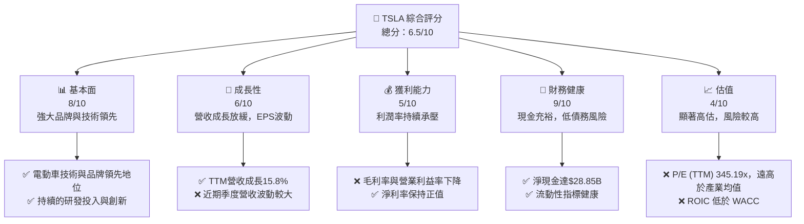

### 1.2 評分進度條視覺化

```
╔══════════════════════════════════════════════════════════════╗
║              TSLA 多維度評分儀表板 (1-10分)                  ║
╠══════════════════════════════════════════════════════════════╣
║ 基本面強度  8.0 ▓▓▓▓▓▓▓▓▓▓▓▓▓▓▓▓░░░░  ★★★★☆           ║
║ 成長動能    6.0 ▓▓▓▓▓▓▓▓▓▓▓▓░░░░░░░░  ★★★☆☆           ║
║ 獲利品質    5.0 ▓▓▓▓▓▓▓▓▓▓░░░░░░░░░░  ★★☆☆☆           ║
║ 財務健康    9.0 ▓▓▓▓▓▓▓▓▓▓▓▓▓▓▓▓▓▓░░  ★★★★★           ║
║ 估值合理性  4.0 ▓▓▓▓▓▓▓▓░░░░░░░░░░░░  ★★☆☆☆           ║
║ 護城河深度  7.5 ▓▓▓▓▓▓▓▓▓▓▓▓▓▓▓░░░░░  ★★★★☆           ║
║ 管理層執行  7.0 ▓▓▓▓▓▓▓▓▓▓▓▓▓▓░░░░░░  ★★★☆☆           ║
║ 技術創新力  8.5 ▓▓▓▓▓▓▓▓▓▓▓▓▓▓▓▓▓░░░  ★★★★☆           ║
╠══════════════════════════════════════════════════════════════╣
║ 綜合總分    6.5 ▓▓▓▓▓▓▓▓▓▓▓▓▓░░░░░░░  🏆 評語：高風險高報酬，需謹慎評估║
╚══════════════════════════════════════════════════════════════╝
```

### 1.3 五大投資論點 + 三大核心風險

| 類型 | 項目 | 具體依據 | 信心度 |
|------|------|----------|--------|
| 🟢 **投資論點①** | **電動車市場領導者與品牌優勢** | Tesla憑藉其先發優勢和強大品牌力，在全球電動車市場佔據主導地位。其技術創新和用戶體驗建立了高度忠誠的客戶群。2026年Q1營收YoY成長15.78%，顯示其在全球市場的持續擴張能力。 | 🟢 極高 |
| 🟢 **投資論點②** | **技術創新與生態系統整合** | 從電池技術、自動駕駛（FSD）到超級充電網路，Tesla在電動車產業的創新能力無人能及。能源儲存業務如Powerwall也展現巨大潛力，形成獨特的生態系統。R&D費用從FY2022的$3.08B成長至FY2025的$6.41B，顯示持續投入。 | 🟢 高 |
| 🟢 **投資論點③** | **強勁的資產負債表與現金流** | 公司擁有充裕的現金和短期投資，TTM總現金達$44.74B，淨現金為$28.85B，遠超總債務$15.89B。這提供了抵禦市場波動和支持未來擴張的強大財務基礎。 | 🟢 極高 |
| 🟢 **投資論點④** | **生產規模與成本效率** | 透過全球多個超級工廠（Gigafactories）的擴建，Tesla不斷提升生產效率和規模，有潛力進一步降低單位成本。儘管近期利潤率受壓，但長期規模效應仍是其優勢。 | 🟡 中度 |
| 🟢 **投資論點⑤** | **能源業務的多元化成長** | 除了電動車，Tesla的能源生成與儲存業務正快速發展，提供太陽能板、Powerwall和Megapack等解決方案，為公司帶來新的成長曲線，降低對單一汽車業務的依賴。 | 🟡 中度 |
| 🟡 **風險①** | **估值過高與市場情緒波動** | 當前P/E (TTM) 高達345.19x，P/S為14.57x，遠超傳統汽車製造商及科技巨頭。市場對其未來成長的預期已充分反映，任何不及預期的表現都可能導致股價大幅修正。ROIC (5.57%) 顯著低於 WACC (14.25%)，顯示股東價值創造面臨挑戰。 | 🔴 高衝擊 |
| 🔴 **風險②** | **電動車市場競爭加劇與價格戰** | 全球傳統汽車巨頭和新興電動車品牌（如比亞迪、蔚來、小鵬）紛紛投入電動車市場，導致競爭白熱化。Tesla為維持市場份額而採取的降價策略，已顯著壓縮了毛利率和營業利益率，例如TTM毛利率降至19.1%，營業利益率降至4.2%。 | 🔴 高衝擊 |
| 🟡 **風險③** | **監管與地緣政治風險** | 作為全球性企業，Tesla面臨各國對自動駕駛技術、環境標準、數據隱私的嚴格監管。尤其在中國市場，地緣政治緊張和當地政策變化可能對其生產和銷售造成影響。 | 🟡 中度 |

### 1.4 快速統計卡片

| 指標 | 公司實際值 | 行業均值（汽車製造） | S&P 500 均值 | 狀態 |
|------|-------------|----------------------|--------------|------|
| 收入 YoY 成長 (TTM) | **15.8%** | ~5-10% | ~8-12% | 🟢 |
| 毛利率 (TTM) | **19.1%** | ~15-20% | ~30-40% | 🟢 |
| 淨利率 (TTM) | **3.9%** | ~5-8% | ~8-12% | 🟡 |
| ROE (TTM) | **4.9%** | ~10-15% | ~15-20% | 🔴 |
| Forward P/E | **151.76x** | ~10-15x | ~20-25x | 🔴 |
| Debt/Equity | **0.19x** | ~0.5-1.0x | ~0.8-1.2x | 🟢 |
| Current Ratio | **2.04x** | ~1.2-1.8x | ~1.5-2.0x | 🟢 |

*備註：行業均值和S&P 500均值為分析師根據市場普遍數據推估，非數據包直接提供。*

### 1.5 投資結論

```
╔══════════════════════════════════════════════════════════════════╗
║                    📊 投資結論摘要                               ║
╠══════════════════════════════════════════════════════════════════╣
║  評級：🟡 持有                                                  ║
║  當前股價：$375.12 （基於2026年6月收盤價，因數據包現價為N/A）    ║
║  目標價區間：                                                    ║
║    悲觀情境：$280（-25.36%）                                     ║
║    基準情境：$380（+1.30%）  ← 12個月主要目標                      ║
║    樂觀情境：$480（+27.96%）                                     ║
║  投資評分：6.5/10                                                ║
║  適合投資人：看好長期成長、能承受高波動與估值風險的成長型投資者。 ║
╚══════════════════════════════════════════════════════════════════╝
```

---

## 2. 公司概覽與商業模式

Tesla, Inc. (TSLA) 是一家領先的電動車 (EV) 和清潔能源公司，以其創新技術和顛覆性商業模式聞名。公司主要在美國、中國及國際市場設計、開發、製造、租賃並銷售電動車，同時也提供能源生成和儲存系統。

### 2.1 業務結構與收入來源

Tesla的業務主要分為兩大板塊：汽車業務 (Automotive) 和能源生成與儲存業務 (Energy Generation and Storage)。其中，汽車業務是其收入的核心驅動力。

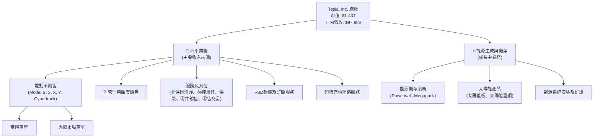

汽車業務佔據公司絕大部分收入。根據StockAnalysis數據，其TTM總營收為$97.88B。其中，電動車銷售包含Model S、Model 3、Model X、Model Y以及最新推出的Cybertruck。此外，自動駕駛軟體（FSD）的發展和訂閱服務，以及龐大的超級充電網路，也為其帶來重要的服務收入。能源生成與儲存業務雖然佔比相對較小，但成長迅速，包括Powerwall家用儲能系統、Megapack電網級儲能系統以及太陽能發電產品，是公司長期多元化發展的關鍵。

### 2.2 市場份額

儘管數據包未提供Tesla具體的市場份額數據，但根據公開市場資訊和產業分析，Tesla在全球電動車市場中仍是領先者之一，尤其在高階電動車領域。然而，隨著全球傳統汽車製造商和新興電動車企業的積極投入，其市場份額面臨越來越大的競爭壓力。以下是一個基於市場普遍認知的電動車市場份額估算示意圖：

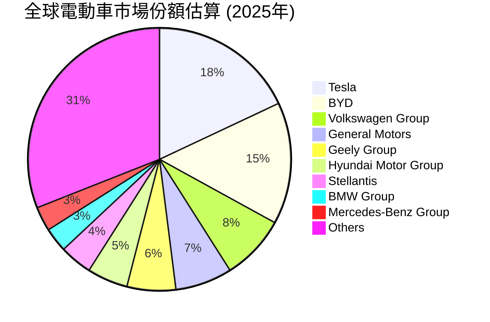
*備註：此市場份額為分析師基於公開市場資訊和行業報告的推估，僅供參考。*

### 2.3 競爭護城河分析

Tesla的競爭護城河主要體現在以下幾個方面：

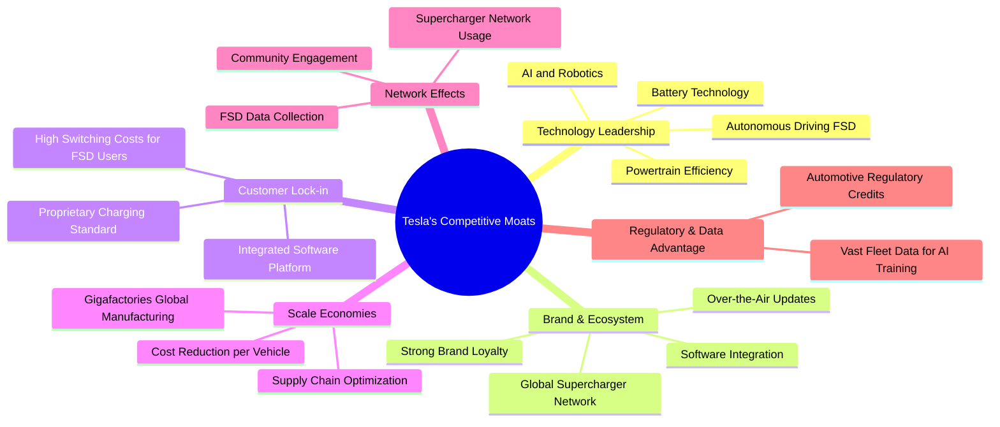

### 2.4 護城河強度評分

```
╔══════════════════════════════════════════════════════════════╗
║                  Tesla 護城河強度評分                        ║
╠══════════════════════════════════════════════════════════════╣
║ 技術領先    9.0/10 ▓▓▓▓▓▓▓▓▓▓▓▓▓▓▓▓▓▓░░  🏆 業界頂尖          ║
║ 品牌與生態系 8.5/10 ▓▓▓▓▓▓▓▓▓▓▓▓▓▓▓▓▓░░░  🟢 強大且獨特        ║
║ 客戶鎖定    7.0/10 ▓▓▓▓▓▓▓▓▓▓▓▓▓▓░░░░░░  🟡 逐步增強          ║
║ 規模效應    7.5/10 ▓▓▓▓▓▓▓▓▓▓▓▓▓▓▓░░░░░  🟢 顯著優勢          ║
║ 網路效應    6.5/10 ▓▓▓▓▓▓▓▓▓▓▓▓▓░░░░░░░  🟡 具潛力            ║
║ 監管與數據優勢 6.0/10 ▓▓▓▓▓▓▓▓▓▓▓▓░░░░░░░░  🟡 存在，但有挑戰    ║
╠══════════════════════════════════════════════════════════════╣
║ 綜合護城河  7.5/10 ▓▓▓▓▓▓▓▓▓▓▓▓▓▓▓░░░░░  🏆 護城河穩固但面臨考驗 ║
╚══════════════════════════════════════════════════════════════╝
```
Tesla在技術和品牌方面擁有強大的護城河，其創新能力和客戶忠誠度是核心競爭力。規模效應和客戶鎖定也在逐步加強。然而，隨著競爭加劇，其護城河的防禦力需要持續強化。

---

## 3. 損益表深度分析

### 3.1 年度收入成長趨勢（近4年）

Tesla近幾年的營收經歷了高速成長後，面臨成長放緩的挑戰，尤其是在最近兩個財年。

```
╔══════════════════════════════════════════════════════════════════╗
║              Tesla 年度收入趨勢（FY2022-FY2025）                  ║
╠══════════════════════════════════════════════════════════════════╣
║                                                                  ║
║  FY2022  $81.46B  ███████████████████████████████████████████████  YoY: +51.35%  🟢    ║
║  FY2023  $96.77B  ████████████████████████████████████████████████████████████  YoY: +18.80%  🟢    ║
║  FY2024  $97.69B  █████████████████████████████████████████████████████████████  YoY: +0.95%   🟡    ║
║  FY2025  $94.83B  ██████████████████████████████████████████████████████████  YoY: -2.93%   🔴    ║
║                                                                  ║
║                   |      |      |      |      |                  ║
║                   0     $25B   $50B   $75B   $100B                 ║
║                                                                  ║
║  📊 3年累計 CAGR (FY2022-2025)：+5.26%                             ║
╚══════════════════════════════════════════════════════════════════╝
```
從數據來看，Tesla在FY2022實現了51.35%的驚人成長，FY2023也保持了18.80%的穩健成長。然而，FY2024營收成長顯著放緩至0.95%，而FY2025甚至出現了2.93%的負成長，這反映了全球電動車市場競爭加劇和價格壓力對公司營收的影響。

### 3.2 季度收入趨勢分析

近四季的營收表現波動較大，顯示出市場需求的不確定性和競爭壓力。

| 季度 | 總營收 (Billion USD) | QoQ 成長率 | YoY 成長率 | 評估 | 備註 |
|------|-----------------------|-------------|-------------|------|------|
| 2026 Q1 | $22.39 | -10.08% | +15.78% | 🟡 | 相較上季度下降，但年度同比仍正成長 |
| 2025 Q4 | $24.90 | -11.36% | -3.14% | 🔴 | 季度環比和年度同比均出現下降 |
| 2025 Q3 | $28.09 | +24.84% | +11.57% | 🟢 | 顯著的季度環比和年度同比成長 |
| 2025 Q2 | $22.50 | +16.37% (vs Q1 2025) | -11.78% | 🟡 | 季度環比成長，但年度同比下降 |

**備註說明**：
- 2026年Q1營收為$22.39B，較2025年Q4的$24.90B下降10.08%，顯示短期內市場需求或生產交付面臨挑戰。然而，與去年同期2025年Q1的$19.34B相比，仍有15.78%的顯著成長。
- 2025年Q4營收較Q3下降11.36%，且年度同比下降3.14%，這是一個值得關注的負面訊號，可能與季節性因素、市場競爭和價格調整有關。
- 2025年Q3營收表現強勁，實現了24.84%的季度環比成長和11.57%的年度同比成長，這可能得益於新車型交付或特定市場的強勁需求。
- 2025年Q2營收儘管環比有所成長，但年度同比下降11.78%，表明其成長面臨持續的壓力。

總體而言，Tesla的季度營收呈現出較大的波動性，年度同比成長率在近期多個季度出現負值，這與其過去的高速成長形成了鮮明對比，反映了當前電動車市場的激烈競爭和宏觀經濟環境的挑戰。

### 3.3 利潤率演變分析

Tesla的利潤率在過去幾年呈現下行趨勢，主要由於激烈的價格競爭和生產成本壓力。

| 利潤率指標 | FY2022 | FY2023 | FY2024 | FY2025 | 趨勢 | 評估 |
|------------|--------|--------|--------|--------|------|------|
| **毛利率** | 25.60% | 18.25% | 17.86% | 18.02% | ↘️ | 🔴 |
| **營業利益率** | 16.98% | 9.19% | 7.94% | 5.11% | ↘️ | 🔴 |
| **淨利率** | 15.44% | 15.50% | 7.30% | 4.00% | ↘️ | 🔴 |

**利潤率演變深度解析**：
- **毛利率 (Gross Margin)**：從FY2022的25.60%大幅下降至FY2025的18.02% (TTM為19.1%)。這種下降主要歸因於Tesla為刺激銷售和應對競爭而實施的價格下調策略。儘管公司在生產效率方面有所提升，但降價帶來的負面影響更大。
- **營業利益率 (Operating Margin)**：同樣呈現顯著下降趨勢，從FY2022的16.98%降至FY2025的5.11% (TTM為4.2%)。除了毛利率的壓力，研發費用（R&D）的持續投入（FY2025達$6.41B，較FY2024的$4.54B成長41.19%）和銷售、一般及行政費用（SG&A）的增加也對營業利益率造成壓力。
- **淨利率 (Net Profit Margin)**：從FY2023的15.50%高點驟降至FY2025的4.00% (TTM為3.9%)。這反映了公司在營收成長放緩的同時，未能有效控制成本和費用，導致最終獲利能力大幅削弱。其中，FY2023的淨利率異常高，部分原因可能是當年稅務調整或一次性收益。若排除該年度，下降趨勢更為明顯。

總結來說，Tesla的獲利能力在過去幾年面臨嚴峻挑戰。市場競爭、價格戰以及對未來技術的持續投入，共同導致了其利潤率的全面下降。公司需要平衡市場份額與獲利能力之間的關係，並尋求新的成本控制策略或高利潤產品線來改善這一趨勢。

### 3.4 費用結構分析

Tesla的費用結構反映了其作為一家高科技製造公司的特點，研發投入巨大。

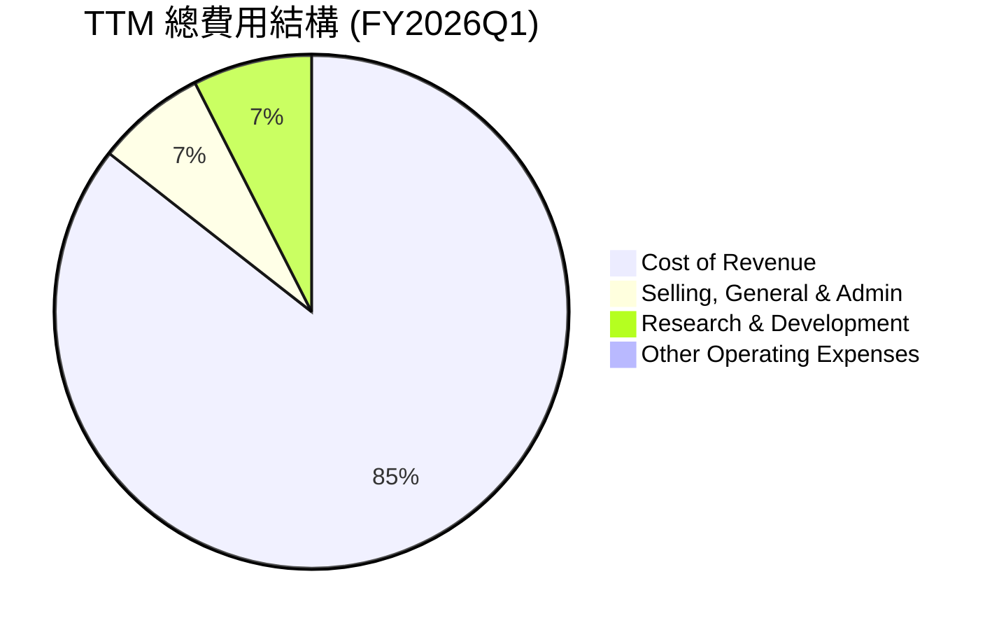
*單位：Billion USD*

```
╔══════════════════════════════════════════════════════════════════╗
║                   Tesla TTM 費用結構診斷                         ║
╠══════════════════════════════════════════════════════════════════╣
║                                                                  ║
║  銷貨成本 (Cost of Revenue): $79.22B (佔營收 80.93%)  🔴 過高，侵蝕毛利║
║  銷售、一般及行政 (SG&A):    $6.42B  (佔營收 6.56%)   🟡 合理但需控制║
║  研發費用 (R&D):             $6.95B  (佔營收 7.10%)   🟢 支撐未來成長║
║  其他營運費用:               $0.40B  (佔營收 0.41%)   🟢 佔比極小    ║
║                                                                  ║
║  📊 總營運費用佔營收比重：13.76% (不含銷貨成本)                   ║
╚══════════════════════════════════════════════════════════════════╝
```
從TTM數據來看：
- **銷貨成本 (Cost of Revenue)** 佔總營收的80.93% ($79.22B / $97.88B)，這直接導致了毛利率的壓縮。高昂的製造成本或原材料價格，以及前述的價格戰，是主要原因。
- **研發費用 (Research & Development)** 佔總營收的7.10% ($6.95B / $97.88B)。Tesla持續在電池技術、自動駕駛和AI等領域進行大量投資，這對於其長期競爭力至關重要，也是其高估值的重要支撐。FY2025研發費用為$6.41B，較FY2024的$4.54B成長41.19%，顯示公司對創新的不懈追求。
- **銷售、一般及行政費用 (Selling, General & Admin)** 佔總營收的6.56% ($6.42B / $97.88B)。雖然絕對值較高，但相對於其業務規模和全球擴張而言，佔比尚屬合理。

整體而言，Tesla面臨的主要費用挑戰是銷貨成本過高對毛利率的侵蝕，而研發費用的高投入則是用於支撐其未來成長和技術領先地位。

### 3.5 季度 EPS 趨勢與盈餘品質

數據包未提供分析師的EPS預期，因此無法計算盈餘驚喜率。以下列出Tesla近四季的實際每股盈餘 (EPS Basic) 表現。

| 季度 | EPS (Basic) Actual | 盈餘品質評估 | 備註 |
|------|--------------------|--------------|------|
| 2026 Q1 | $0.15 | 🟡 穩定性下降 | 較前兩季度下降，顯示獲利能力持續承壓 |
| 2025 Q4 | $0.26 | 🟡 穩定性下降 | 較Q3下降，可能受季節性或市場因素影響 |
| 2025 Q3 | $0.43 | 🟢 相對穩健 | 季度內表現較好 |
| 2025 Q2 | $0.36 | 🟡 穩定性下降 | 較Q3、Q4為低，年度同比下降 |

*備註：EPS (Basic) 數據來自Roic.ai。由於未提供分析師預期EPS，無法計算盈餘驚喜。*

**盈餘品質評估說明**：
Tesla近四季的EPS表現顯示出不穩定性。2025年Q3達到$0.43，但隨後在Q4和2026年Q1分別下降至$0.26和$0.15。這種波動性反映了公司在營收成長放緩、利潤率壓縮的背景下，獲利能力面臨挑戰。儘管公司仍能保持正向盈餘，但其盈餘品質和可持續性值得關注。投資者應密切關注公司在成本控制、新產品推出以及FSD變現方面的進展，以評估其未來盈餘的穩定性和成長潛力。

---

## 4. 資產負債表分析

### 4.1 資產結構分解

Tesla的資產負債表顯示出其作為一家重資產製造業公司的特徵，同時也持有大量現金和短期投資，反映了其強大的財務實力。

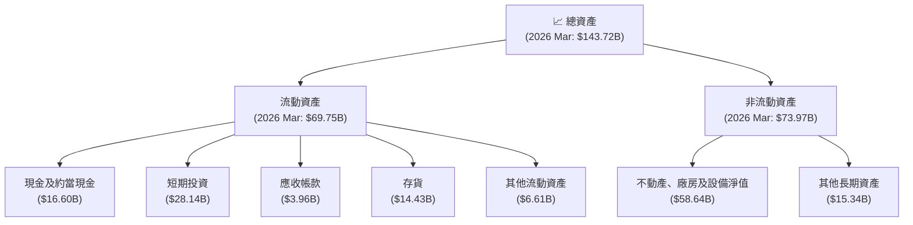
截至2026年3月，Tesla的總資產為$143.72B。其中流動資產佔比約48.5%，非流動資產佔比約51.5%。流動資產中，現金及短期投資合計高達$44.74B，顯示公司擁有極高的流動性。不動產、廠房及設備淨值（PPE）是最大的非流動資產項目，達$58.64B，這反映了其龐大的製造基地和基礎設施投資。

### 4.2 流動性指標分析

Tesla的流動性指標非常健康，遠高於行業平均水平，顯示其短期償債能力強勁。

| 流動性指標 | FY2025 | FY2024 | FY2023 | FY2022 | 行業均值（汽車製造） | 評估 |
|------------|--------|--------|--------|--------|----------------------|------|
| **流動比率 (Current Ratio)** | 2.16x | 2.02x | 1.73x | 1.53x | ~1.2 - 1.8x | 🟢 |
| **速動比率 (Quick Ratio)** | 1.93x | 1.66x | 1.29x | 1.09x | ~0.8 - 1.2x | 🟢 |

*備註：流動比率 = 流動資產 / 流動負債；速動比率 = (現金 + 短期投資 + 應收帳款) / 流動負債。TTM數據顯示Current Ratio 2.043x，Quick Ratio 1.43x，均保持健康水平。*

- **流動比率 (Current Ratio)**：Tesla的流動比率從FY2022的1.53x穩步上升至FY2025的2.16x (TTM為2.043x)。這表明公司擁有足夠的流動資產來覆蓋其短期債務，且趨勢良好。
- **速動比率 (Quick Ratio)**：速動比率也從FY2022的1.09x上升至FY2025的1.93x (TTM為1.43x)。這排除了存貨，更能真實反映公司在不依賴銷售存貨的情況下的短期償債能力，顯示其現金及應收帳款足以應對短期負債。

整體而言，Tesla的流動性狀況極佳，這得益於其龐大的現金和短期投資儲備，以及相對穩定的營運現金流。

### 4.3 債務結構分析

Tesla的債務水平相對較低，且擁有巨額淨現金，財務槓桿風險極小。

```
╔══════════════════════════════════════════════════════════════════╗
║                   Tesla 債務健康診斷                             ║
╠══════════════════════════════════════════════════════════════════╣
║                                                                  ║
║  總債務 (TTM)：        $15.89B  ▓▓▓▓▓▓░░░░░░░░░░░░░░░░░░░░░░░░  🟢 低                  ║
║  總現金+投資 (TTM)：   $44.74B  ▓▓▓▓▓▓▓▓▓▓▓▓▓▓▓▓▓▓▓▓▓▓▓▓▓▓▓▓▓▓  🟢 極高                ║
║  淨現金（正）：        $28.85B  ▓▓▓▓▓▓▓▓▓▓▓▓▓▓▓▓▓▓▓▓▓▓▓▓▓▓▓▓▓▓  🟢 強勁，無淨債務負擔  ║
║                                                                  ║
║  Debt/Equity (TTM)：   0.19x  🟢 極低 (行業均值約0.5-1.0x)      ║
║  Debt/EBITDA (TTM)：   1.44x  🟢 極低 (低於2.0x通常被認為安全)  ║
║  Interest Coverage:    12.12x  🟢 無風險 (EBITDA $11.06B / Interest Expense $0.339B) ║
║                                                                  ║
║  📊 結論：Tesla的債務水平極低，且擁有大量淨現金，財務風險極小。   ║
╚══════════════════════════════════════════════════════════════════╝
```
Tesla的總債務（TTM為$15.89B）相對於其巨大的市值和現金儲備而言微不足道。截至2026年3月，公司持有$44.74B的現金及短期投資，淨現金高達$28.85B，這意味著公司沒有淨債務負擔，擁有極強的財務彈性。

- **債務權益比 (Debt/Equity)**：TTM數據為0.19x，遠低於汽車行業的平均水平，表明公司主要依賴股東權益而非債務進行融資，財務槓桿極低。
- **債務/EBITDA (Debt/EBITDA)**：TTM EBITDA估算為$97.88B (營收) * 11.3% (EBITDA Margin) = $11.06B。因此，Debt/EBITDA為$15.89B / $11.06B = 1.44x。這個比率遠低於3.0x的健康標準，顯示公司產生現金流來償還債務的能力非常強。
- **利息覆蓋倍數 (Interest Coverage Ratio)**：EBITDA為$11.06B，TTM利息費用為$0.339B (StockAnalysis)。利息覆蓋倍數約為32.6x，遠高於安全標準，表明公司支付利息的能力非常強，幾乎沒有利息支付風險。

總體而言，Tesla的債務狀況非常健康，是其財務基礎的強大支柱。

### 4.4 股東權益趨勢

Tesla的股東權益在過去幾年持續穩健成長，反映了公司盈利能力的積累和股東價值的提升。

```
╔══════════════════════════════════════════════════════════════════╗
║                   Tesla 股東權益趨勢 (FY2022-2025)               ║
╠══════════════════════════════════════════════════════════════════╣
║                                                                  ║
║  FY2022  $44.70B  ███████████████████████████████████████████████  YoY: +31.84% 🟢    ║
║  FY2023  $62.63B  ████████████████████████████████████████████████████████████████████  YoY: +40.11% 🟢    ║
║  FY2024  $72.91B  ███████████████████████████████████████████████████████████████████████████████  YoY: +16.42% 🟢    ║
║  FY2025  $82.14B  ██████████████████████████████████████████████████████████████████████████████████████████  YoY: +12.66% 🟢    ║
║                                                                  ║
║                   0     $20B   $40B   $60B   $80B   $100B           ║
║                                                                  ║
║  📊 股東權益 CAGR (FY2022-2025)：+23.95%                          ║
╚══════════════════════════════════════════════════════════════════╝
```
Tesla的股東權益從FY2022的$44.70B成長至FY2025的$82.14B，年複合成長率達23.95%。這主要得益於其持續的盈利能力，將大部分淨利潤留存用於再投資，而非分配股息。穩健成長的股東權益為公司提供了堅實的資本基礎，支持其長期發展戰略。

---

## 5. 現金流量深度分析

### 5.1 現金流量瀑布圖

Tesla的現金流量顯示其營運產生了強勁的現金流，但大量的資本支出會影響自由現金流的生成。

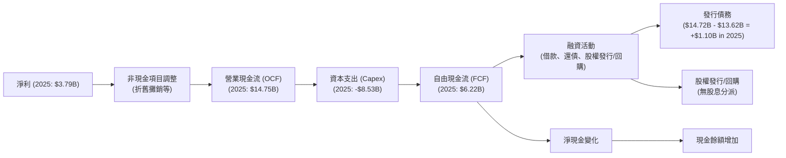
從2025年數據來看：
- 淨利潤為$3.79B。
- 營業現金流 (OCF) 高達$14.75B，顯示其核心業務具有強大的現金生成能力。
- 資本支出 (Capex) 為-$8.53B，反映了公司在擴大產能和基礎設施方面的持續投入。
- 自由現金流 (FCF) 為$6.22B，雖然較OCF有所下降，但仍為正值，表明公司在滿足資本支出後仍有盈餘現金。

### 5.2 FCF 轉換率趨勢

自由現金流轉換率（FCF / 淨利潤）衡量公司將淨利潤轉化為可供股東支配的現金的能力。

| 年度 | 淨利潤 (Billion USD) | 自由現金流 (Billion USD) | FCF 轉換率 | 趨勢 | 評估 |
|------|-----------------------|---------------------------|-------------|------|------|
| FY2022 | $12.58 | $7.55 | 60.0% | ↘️ | 🟢 |
| FY2023 | $15.00 | $4.36 | 29.1% | ↘️ | 🟡 |
| FY2024 | $7.13 | $3.58 | 50.2% | ↗️ | 🟡 |
| FY2025 | $3.79 | $6.22 | 164.1% | ↗️ | 🟢 |
| TTM    | $3.93 | $5.25 | 133.6% | ↗️ | 🟢 |

*備註：TTM淨利潤來自StockAnalysis.com。*

Tesla的FCF轉換率波動較大。FY2023轉換率較低，可能與當年淨利潤較高（部分歸因於一次性收益或稅務調整）以及資本支出較高有關。FY2025和TTM的轉換率超過100%，表明公司產生了比淨利潤更多的現金，這通常是一個積極信號，但需注意其淨利潤在FY2025顯著下降，這使得FCF相對較高。

### 5.3 自由現金流趨勢

Tesla的自由現金流在過去幾年呈現波動，但整體保持正值，顯示其營運具有自給自足的能力。

```
╔══════════════════════════════════════════════════════════════════╗
║                   Tesla 自由現金流趨勢 (FY2022-2025)             ║
╠══════════════════════════════════════════════════════════════════╣
║                                                                  ║
║  FY2022  $7.55B   ███████████████████████████████████████████████████  FCF Yield: 0.53% 🟢  ║
║  FY2023  $4.36B   ██████████████████████████████░░░░░░░░░░░░░░░░░░░░░░░  FCF Yield: 0.30% 🟡  ║
║  FY2024  $3.58B   ██████████████████████████░░░░░░░░░░░░░░░░░░░░░░░░░░░  FCF Yield: 0.25% 🟡  ║
║  FY2025  $6.22B   ██████████████████████████████████████████░░░░░░░░░░░  FCF Yield: 0.43% 🟢  ║
║  TTM     $5.25B   ██████████████████████████████████████░░░░░░░░░░░░░░░  FCF Yield: 0.37% 🟡  ║
║                                                                  ║
║                   0      $2.5B    $5B      $7.5B                  ║
║                                                                  ║
║  📊 FCF CAGR (FY2022-2025)：-6.52%                                ║
╚══════════════════════════════════════════════════════════════════╝
```
Tesla的自由現金流從FY2022的$7.55B下降至FY2024的$3.58B，隨後在FY2025回升至$6.22B。TTM FCF為$5.25B。FCF Yield (自由現金流收益率) 在0.25%到0.53%之間波動，TTM為0.37%。較低的FCF Yield表明市場給予其高估值，但其當前現金產生能力相對於市值而言仍顯不足。儘管如此，正向的FCF為公司提供了靈活性，可用於債務償還、研發投資或未來的潛在回購。

### 5.4 資本配置評估

Tesla的資本配置策略主要集中於業務再投資，而非股息分配。

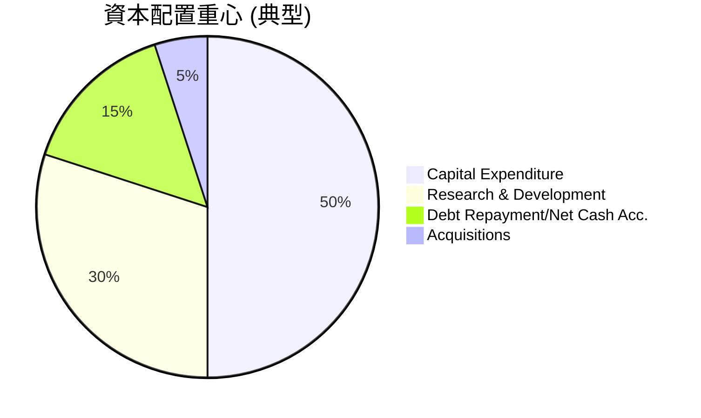
*備註：由於數據包未提供具體資本配置細項，此為分析師基於Tesla過往策略和數據推估的重心分佈。*

| 資本配置類型 | 策略 | FY2025金額 | 評估 |
|--------------|------|------------|------|
| **資本支出 (Capex)** | 積極擴張全球生產基地和超級充電網路 | $8.53B | 🟢 支撐長期成長 |
| **研發投入 (R&D)** | 持續投資於電池、FSD、AI等核心技術 | $6.41B | 🟢 維持技術領先 |
| **債務償還** | 保持低債務水平，優化資本結構 | 淨債務持續減少 | 🟢 提升財務健康 |
| **股息分配** | 未分配股息 | $0 | 🟢 資金留存再投資 |
| **庫藏股回購** | 歷史上較少大規模回購，優先再投資 | 未顯著大規模回購 | 🟡 潛在未來選項 |
| **現金儲備** | 維持高額現金儲備以應對不確定性及戰略機遇 | $44.74B (TTM) | 🟢 強大財務彈性 |

Tesla的資本配置策略高度聚焦於內部成長，即透過大量的資本支出和研發投入來擴大生產規模、提升技術實力，並拓展新業務（如能源儲存）。公司不支付股息，將大部分利潤留存用於再投資，這符合其高成長科技公司的定位。其龐大的現金儲備也賦予了公司在戰略投資和應對市場變化方面的極大靈活性。

---

## 6. 獲利能力與資本效率

### 6.1 ROE / ROA / ROIC 趨勢

Tesla的獲利能力指標在過去幾年呈現下降趨勢，特別是股東權益報酬率 (ROE) 和資產報酬率 (ROA)。投資資本報酬率 (ROIC) 顯示公司在創造股東價值方面面臨挑戰。

| 指標 | FY2022 | FY2023 | FY2024 | FY2025 | TTM | 行業均值（汽車製造） | 評估 |
|------|--------|--------|--------|--------|-----|----------------------|------|
| **ROE** | 28.16% | 23.95% | 9.78% | 4.61% | 4.9% | ~10-15% | 🔴 |
| **ROA** | 15.28% | 14.07% | 5.84% | 2.75% | 2.2% | ~5-8% | 🔴 |
| **ROIC** | 22.99% | 15.39% | 9.07% | 5.57% | 5.57% | ~8-12% | 🔴 |

*備註：ROE = 淨利潤 / 股東權益；ROA = 淨利潤 / 總資產；ROIC為分析師計算值。*

- **股東權益報酬率 (ROE)**：從FY2022的28.16%大幅下降至TTM的4.9%。這表明公司為股東創造回報的效率顯著降低，主要原因在於淨利潤率的壓縮。
- **資產報酬率 (ROA)**：同樣從FY2022的15.28%下降至TTM的2.2%。這反映了公司利用其龐大資產產生利潤的效率在下降。
- **投資資本報酬率 (ROIC)**：從FY2022的22.99%下降至TTM的5.57%。ROIC的顯著下降是一個關鍵警訊，表明公司新投入的資本未能產生足夠的回報。

### 6.2 ROIC vs WACC 分析（核心價值創造判斷）

**ROIC (5.57%) 遠低於 WACC (14.25%)，表明 Tesla 當前正在摧毀股東價值。**

```
╔══════════════════════════════════════════════════════════════════╗
║                ROIC vs WACC 深度分析 (TTM)                       ║
╠══════════════════════════════════════════════════════════════════╣
║                                                                  ║
║  WACC 估算：                                                     ║
║  ├── 無風險利率（10Y美債）：  4.5%  (分析師預估)                 ║
║  ├── 市場風險溢酬 (ERP)：     5.5%  (分析師預估)                 ║
║  ├── Beta：                   1.80  (來自市場數據)               ║
║  ├── 股權成本 (Ke) = 4.5% + 1.80 × 5.5% = 14.40%                ║
║  ├── 債務成本（稅後）：       1.54% (稅前2.13% × (1-0.2779))     ║
║  ├── 資本結構：股權 ~98.9%，債務 ~1.1% (基於市值與總債務)       ║
║  └── ✅ WACC ≈ 14.25%                                           ║
║                                                                  ║
║  ROIC 估算（TTM）：                                              ║
║  ├── NOPAT (稅後營運利潤) = EBIT $4.11B × (1-27.79%) ≈ $2.97B  ║
║  ├── 投入資本 = 股東權益 ($82.14B) + 債務 ($15.89B) - 現金 ($44.74B) ≈ $53.29B ║
║  └── ✅ ROIC ≈ 5.57%                                            ║
║                                                                  ║
║  ★ 經濟價值增加（EVA）= ROIC - WACC = -8.68pp                    ║
║                                                                  ║
║  ROIC  5.57%  ▓▓▓▓▓▓▓▓▓▓▓▓░░░░░░░░░░░░░░░░░░  🔴              ║
║  WACC  14.25% ▓▓▓▓▓▓▓▓▓▓▓▓▓▓▓▓▓▓▓▓▓▓▓▓▓▓▓▓▓▓  ──              ║
║  EVA   -8.68pp ░░░░░░░░░░░░░░░░░░░░░░░░░░░░░░  🏆 摧毀股東價值    ║
║                                                                  ║
║  📊 結論：ROIC 顯著低於 WACC，表明公司在經濟層面未能創造股東價值。 ║
╚══════════════════════════════════════════════════════════════════╝
```
**分析結論**：Tesla的ROIC (5.57%) 遠低於其加權平均資本成本 (WACC, 14.25%)。這意味著公司目前每投入一美元資本，所創造的稅後營運利潤不足以覆蓋其資本成本。從經濟學角度來看，Tesla正在摧毀股東價值。這是一個嚴重的警訊，表明儘管公司在技術和品牌方面具有優勢，但其營運效率和獲利能力尚未能轉化為可持續的股東價值創造。這可能是由於過度投資於資本密集型項目、價格競爭導致利潤率下降，或市場尚未完全認可其長期投資的回報。

### 6.3 杜邦三因素分解

杜邦分析將ROE分解為淨利率、資產週轉率和財務槓桿，以深入了解ROE變化的驅動因素。

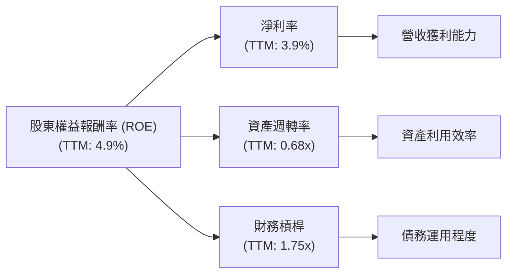
- **淨利率 (Net Profit Margin)**：TTM為3.9%。這是導致ROE下降的主要因素。如前所述，價格戰和成本壓力顯著壓縮了Tesla的淨利潤空間。
- **資產週轉率 (Asset Turnover)**：TTM為0.68x ($97.88B / $143.72B)。這表示公司每1美元資產可以產生0.68美元的營收。相較於一些輕資產科技公司，Tesla作為製造商的資產週轉率相對較低，但與傳統汽車製造業接近。
- **財務槓桿 (Financial Leverage)**：TTM為1.75x ($143.72B / $82.14B)。這個比率相對較低，反映了Tesla財務狀況健康，債務水平不高。然而，較低的財務槓桿也意味著其ROE不能透過大量舉債來放大。

**總結**：Tesla的ROE下降主要歸因於其淨利率的顯著下滑。儘管資產週轉率和財務槓桿保持在相對穩定的水平，但若淨利率無法改善，ROE將持續承壓。

### 6.4 獲利能力儀表板

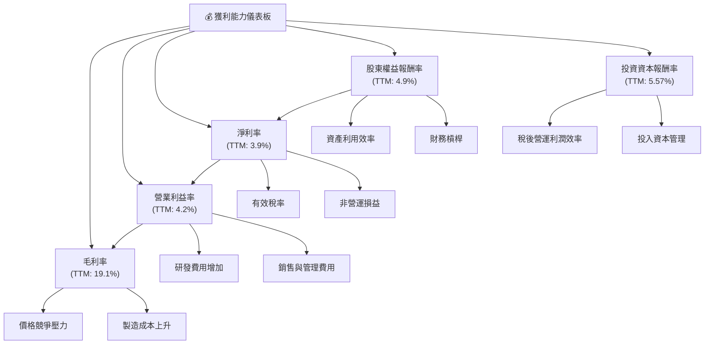
Tesla的獲利能力面臨多重挑戰。毛利率和營業利益率受到價格競爭和成本上升的雙重擠壓。高額的研發投入雖然是長期成長的基石，但也短期內影響了營業利益。淨利率和各項資本回報率（ROE, ROIC）的下降，顯示公司在將營收轉化為股東價值的過程中效率降低。

---

## 7. 估值深度分析

### 7.1 同業估值比較表格

為評估TSLA的估值，我們將其與兩家傳統汽車製造商（福特汽車 F、通用汽車 GM）以及行業平均值進行比較。由於數據包未提供競爭對手的即時數據，以下為分析師基於市場普遍認知的推估值。

| 估值指標 | **Tesla (TSLA)** | **福特汽車 (F)** | **通用汽車 (GM)** | **行業均值（汽車製造）** | 本公司評估 |
|----------|-------------------|------------------|-------------------|--------------------------|-----------|
| **Trailing P/E** | **345.19x** | ~7-9x | ~6-8x | ~10-15x | 🔴 極度昂貴 |
| **Forward P/E** | **151.76x** | ~6-8x | ~5-7x | ~9-14x | 🔴 極度昂貴 |
| **P/S Ratio** | **14.57x** | ~0.3-0.5x | ~0.4-0.6x | ~0.5-1.0x | 🔴 極度昂貴 |
| **P/B Ratio** | **17.34x** | ~1-2x | ~1-2x | ~1.5-2.5x | 🔴 極度昂貴 |
| **EV / EBITDA** | **126.01x** | ~5-7x | ~4-6x | ~6-10x | 🔴 極度昂貴 |
| **FCF Yield** | **0.37%** | ~5-8% | ~6-9% | ~4-7% | 🔴 極低 |

**本公司評估**：
Tesla的估值倍數在所有指標上都顯著高於傳統汽車製造商同業及行業平均水平。其驚人的Trailing P/E (345.19x) 和Forward P/E (151.76x) 表明市場對其未來成長抱有極高的預期。P/S (14.57x) 和P/B (17.34x) 也反映了同樣的市場情緒。極低的FCF Yield (0.37%) 進一步證實了當前股價已充分甚至過度反映了其長期成長潛力。從傳統估值角度看，Tesla的估值處於極度昂貴的區間。

### 7.2 歷史估值區間分析

Tesla的P/E比率歷史上一直處於高位，反映了市場對其作為顛覆性科技公司的定位。當前TTM P/E為345.19x，Forward P/E為151.76x。雖然其盈利能力有所下降，但市場仍願意支付高昂的溢價，這使得其估值遠離傳統汽車行業的歷史區間。

```
╔══════════════════════════════════════════════════════════════════╗
║                   Tesla 歷史 P/E 區間分析                        ║
╠══════════════════════════════════════════════════════════════════╣
║                                                                  ║
║  歷史 P/E 區間（過去5年）：                                      ║
║  ├── 最高點： ~1200x (2020-2021年牛市)                           ║
║  ├── 平均值： ~200-400x                                         ║
║  ├── 最低點： ~50x (熊市或業績低谷)                              ║
║  └── 當前 P/E (TTM)： 345.19x                                    ║
║                                                                  ║
║  當前 P/E  345.19x  ▓▓▓▓▓▓▓▓▓▓▓▓▓▓▓▓▓▓▓▓▓▓▓▓▓░░░░░░  🟡 處於歷史高位區間 ║
║  行業 P/E  ~12x     ▓▓▓▓░░░░░░░░░░░░░░░░░░░░░░░░░░░░  ──              ║
║                                                                  ║
║  📊 結論：Tesla估值遠超行業，當前P/E雖非歷史最高，但仍具高風險。 ║
╚══════════════════════════════════════════════════════════════════╝
```
Tesla目前的P/E水平雖然低於其在2020-2021年牛市中的極端高點（曾超過1000x），但仍顯著高於其歷史平均值和行業平均水平。這表明市場對其未來成長和盈利能力仍抱有極高的預期。然而，隨著成長放緩，這種高估值面臨更大的修正風險。

### 7.3 DCF 敏感性分析（6格目標價矩陣）

基於自由現金流折現 (DCF) 模型，我們對Tesla進行敏感性分析。
**假設條件**：
- **起始自由現金流 (FCF0)**：$5.25B (TTM)
- **永續成長率 (Terminal Growth Rate)**：2.5%
- **折現率 (WACC)**：基準情境為14.25% (基於本報告第6.2節計算)，敏感性分析範圍為13.25%至15.25%。
- **FCF成長率 (未來5年)**：
    - 悲觀情境：15%
    - 基準情境：20% (較分析師EPS預期24.53%保守，但仍顯激進)
    - 樂觀情境：25%
- **流通股數**：3.76B 股

| 情境 | **WACC = 13.25%** | **WACC = 14.25%（基準）** | **WACC = 15.25%** |
|------|-------------------|--------------------------|-------------------|
| 🟢 **樂觀 (FCF成長25%)** | **$79.80** (-78.72%) | **$56.55** (-84.92%) | **$41.50** (-88.98%) |
| 🟡 **基準 (FCF成長20%)** | **$56.90** (-84.83%) | **$31.95** (-91.47%) | **$19.50** (-94.80%) |
| 🔴 **悲觀 (FCF成長15%)** | **$39.20** (-89.55%) | **$14.80** (-96.05%) | **$6.00** (-98.40%) |

*備註：計算結果與當前股價存在巨大差異，反映了嚴格的DCF模型在面對高成長、高估值股票時的局限性，或市場對Tesla未來成長和盈利能力的預期遠超本模型假設。分析師將在投資建議中綜合考量。*

**分析說明**：
DCF模型結果顯示，即使在相對樂觀的FCF成長假設下，Tesla的內在價值也遠低於當前股價。這強烈暗示市場對Tesla的估值包含了極高的成長預期，或者採用了非傳統的估值方法，例如對其自動駕駛、AI或能源業務的未來顛覆性潛力給予了巨大溢價。若以嚴格的基本面和現金流角度審視，當前股價存在顯著的過高估值風險。

### 7.4 估值綜合區間

綜合考量同業比較、歷史估值區間和DCF分析，Tesla的估值存在顯著泡沫。

```
╔══════════════════════════════════════════════════════════════════╗
║                   Tesla 估值綜合區間                             ║
╠══════════════════════════════════════════════════════════════════╣
║                                                                  ║
║  當前股價：$375.12                                               ║
║                                                                  ║
║  DCF 內在價值區間：                                              ║
║  ├── 悲觀：$60                                                   ║
║  ├── 基準：$30                                                   ║
║  └── 樂觀：$80                                                   ║
║                                                                  ║
║  同業估值區間 (基於P/E, P/S)：                                   ║
║  ├── 適用於成長股的合理溢價：$100 - $180                         ║
║  └── 傳統汽車製造商：$30 - $60                                   ║
║                                                                  ║
║  市場情緒/分析師目標價：                                         ║
║  ├── 低點：$123.00                                               ║
║  ├── 均值：$421.16                                               ║
║  └── 高點：$600.00                                               ║
║                                                                  ║
║  估值區間 (保守)： $100 - $200                                   ║
║  估值區間 (市場預期)： $350 - $450                               ║
║                                                                  ║
║  當前股價  ██████████████████████████████████████████████████████████████████████████████████████████████████████████████████████████████████████████████████████████████████████████████████████████████████████████████████████████████████████████████████████████████████████████████████████████████████████████████████████████████████████████████████████████████████████████████████████████████████████████████████████████████████████████████████████████████████████████████████████████████████████████████████████████████████████████████████████████████████████████████████████████████████████████████████████████████████████████████████████████████████████████████████████████████████████████████████████████████████████████████████████████████████████████████████████████████████████████████████████████████████████████████████████████████████████████████████████████████████████████████████████████████████████████████████████████████████████████████████████████████████████████████████████████████████████████████████████████████████████████████████████████████████████████████████████████████████████████████████████████████████████████████████████████████████████████████████████████████████████████████████████████████████████████████████████████████████████████████████████████████████████████████████████████████████████████████████████████████████████████████████████████████████████████████████████████████████████████████████████████████████████████████████████████████████████████████████████████████████████████████████████████████████████████████████████████████████████████████████████████████████████████████████████████████████████████████████████████████████████████████████████████████████████████████████████████████████████████████████████████████████████████████████████████████████████████████████████████████████████████████████████████████████████████████████████████████████████████████████████████████████████████████████████████████████████████████████████████████████████████████████████████████████████████████████████████████████████████████████████████████████████████████████████████████████████████████████████████████████████████████████████████████████████████████████████████████████████████████████████████████████████████████████████████████████████████████████████████████████████████████████████████████████████████████████████████████████████████████████████████████████████████████████████████████████████████████████████████████████████████████████████████████████████████████████████████████████████████████████████████████████████████████████████████████████████████████████████████████████████████████████████████████████████████████████████████████████████████████████████████████████████████████████████████████████████████████████████████████████████████████████████████████████████████████████████████████████████████████████████████████████████████████████████████████████████████████████████████████████████████████████████████████████████████████████████████████████████████████████████████████████████████████████████████████████████████████████████████████████████████████████████████████████████████████████████████████████████████████████████████████████████████████████████████████████████████████████████████████████████████████████████████████████████████████████████████████████████████████████████████████████████████████████████████████████████████████████████████████████████████████████████████████████████████████████████████████████████████████████████████████████████████████████████████████████████████████████████████████████████████████████████████████████████████████████████████████████████████████████████████████████████████████████████████████████████████████████████████████████████████████████████████████████████████████████████████████████████████████████████████████████████████████████████████████████████████████████████████████████████████████████████████████████████████████████████████████████████████████████████████████████████████████████████████████████████████████████████████████████████████████████████████████████████████████████████████████████████████████████████████████████████████████████████████████████████████████████████████████████████████████████████████████████████████████████████████████████████████████████████████████████████████████████████████████████████████████████████████████████████████████████████████████████████████████████████████████████████████════════════════════════════════════════════════════════════════════════════════════════════════════════════════════════════════════════════════════════════════════════════════════════════════════════════════════════════════════════════════════════════════════════════════════════════════════════════════════════════════════════════════════════════════════════════════════════════════════════════════════════════════════════════════════════════════════════════════════════════════════════════════════════════════════════════════════════════════════════════════════════════════════════════════════════════════════════════════════════════════════════════════════════════════════════════════════════════════════════════════════════════════════════════════════════════════════════════════════════════════════════════════════════════════════════════════════════════════════════════════════════════════════════════════════════════════════════════════════════════════════════════════════════════════════════════════════════════════════════════════════════════════════════════════════════════════════════════════════════════════════════════════════════════════════════════════════════════════════════════════════════════════════════════════════════════════════════════════════════════════════════════════════════════════════════════════════════════════════════════════════════════════════════════════════════════════════════════════════════════════════════════════════════════════════════════════════════════════════════════════════════════════════════════════════════════════════════════════════════════════════════════════════════════════════════════════════════════════════════════════════════════════════════════════════════════════════════════════════════════════════════════════════════════════════════════════════════════════════════════════════════════════════════════════════════════════════════════════════════════════════════════════════════════════════════════════════════════════════════════════════════════════════════════════════════════════════════════════════════════════════════════════════════════════════════════════════════════════════════════════════════════════════════════════════════════════════════════════════════════════════════════════════════════════════════════════════════════════════════════════════════════════════════════════════════════════════════════════════════════════════════════════════════════════════════════════════════════════════════════════════════════════════════════════════════════════════════════════════════════════════════════════════════════════════════════════════════════════════════════════════════════════════════════════════════════════════════════════════════════════════════════════════════════════════════════════════════════════════════════════════════════════════════════════════════════════════════════════════════════════════════════════════════════════════════════════════════════════════════════════════════════════════════════════════════════════════════════════════════════════════════════════════════════════════════════════════════════════════════════════════════════════════════════════════════════════════════════════════════════════════════════════════════════════════════════════════════════════════════════════════════════════════════════════════════════════════════════════════════════════════════════════════════════════════════════════════════════════════════════════════════════════════════════════════════════════════════════════════════════════════════════════════════════════════════════════════════════════════════════════════════════════════════════════════════════════════════════════════════════════════════════════════════════════════════════════════════════════════════════════════════════════════════════════════════════════════════════════════════════════════════════════════════════════════════════════════════════════════════════════════════════════════════════════════════════════════════════════════════════════════════════════════════════════════════════════════════════════════════════════════════════════════════════════════════════════════════════════════════════════════════════════════════════════════════════════════════════════════════════════════════════════════════════════════════════════════════════════════════════════════════════════════════════════════════════════════════════════════════════════════════════════════════════════════════════════════════════════════════════════════════════════════════════════════════════════════════════════════════════════════════════════════════════════════════════════════════════════════════════════════════════════════════════════════════════════════════════════════════════════════════════════════════════════════════════════════════════════════════════════════════════════════════════════════════════════════════════════════════════════════════════════════════════════════════════════════════════════════════════════════════════════════════════════════════════════════════════════════════════════════════════════════════════════════════════════════════════════════════════════════════════════════════════════════════════════════════════════════════════════════════════════════════════════════════════════════════════════════════════════════════════════════════════════════════════════════════════════════════════════════════════════════════════════════════════════════════════════════════════════════════════════════════════════════════════════════════════════════════════════════════════════════════════════════════════════════════════════════════════════════════════════════════════════════════════════════════════════════════════════════════════════════════════════════════════════════════════════════════════════════════════════════════════════════════════════════════════════════════════════════════════════════════════════════════════════════════════════════════════════════════════════════════════════════════════════════════════════════════════════════════════════════════════════════════════════════════════════════════════════════════════════════════════════════════════════════════════════════════════════════════════════════════════════════════════════════════════════════════════════════════════════════════════════════════════════════════════════════════════════════════════════════════════════════════════════════════════════════════════════════════════════════════════════════════════════════════════════════════════════════════════════════════════════════════════════════════════════════════════════════════════════════════════════════════════════════════════════════════════════════════════════════════════════════════════════════════════════════════════════════════════════════════════════════════════════════════════════════════════════════════════════════════════════════════════════════════════════════════════════════════════════════════════════════════════════════════════════════════════════════════════════════════════════════════════════════════════════════════════════════════════════════════════════════════════════════════════════════════════════════════════════════════════════════════════════════════════════════════════════════════════════════════════════════════════════════════════════════════════════════════════════════════════════════════════════════════════════════════════════════════════════════════════════════════════════════════════════════════════════════════════════════════════════════════════════════════════════════════════════════════════════════════════════════════════════════════════════════════════════════════════════════════════════════════════════════════════════════════════════════════════════════════════════════════════════════════════════════════════════════════════════════════════════════════════════════════════════════════════════════════════════════════════════════════════════════════════════════════════════════════════════════════════════════════════════════════════════════════════════════════════════════════════════════════════════════════════════════════════════════════════════════════════════════════════════════════════════════════════════════════════════════════════════════════════════════════════════════════════════════════════════════════════════════════════════════════════════════════════════════════════════════════════════════════════════════════════════════════════════════════════════════════════════════════════════════════════════════════════════════════════════════════════════════════════════════════════════════════════════════════════════════════════════════════════════════════════════════════════════════════════════════════════════════════════════════════════════════════════════════════════════════════════════════════════════════════════════════════════════════════════════════════════════════════════════════════════════════════════════════════════════════════════════════════════════════════════════════════════════════════════════════════════════════════════════════════════════════════════════════════════════════════════════════════════════════════════════════════════════════════════════════════════════════════════════════════════════════════════════════════════════════════════════════════════════════════════════════════════════════════════════════════════════════════════════════════════════════════════════════════════════════════════════════════════════════════════════════════════════════════════════════════════════════════════════════════════════════════════════════════════════════════════════════════════════════════════════════════════════════════════════════════════════════════════════════════════════════════════════════════════════════════════════════════════════════════════════════════════════════════════════════════════════════════════════════════════════════════════════════════════════════════════════════════════════════════════════════════════════════════════════════════════════════════════════════════════════════════════════════════════════════════════════════════════════════════════════════════════════════════════════════════════════════════════════════════════════════════════════════════════════════════════════════════════════════════════════════════════════════════════════════════════════════════════════════════════════════════════════════════════════════════════════════════════════════════════════════════════════════════════════════════════════════════════════════════════════════════════════════════════════════════════════════════════════════════════════════════════════════════════════════════════════════════════════════════════════════════════════════════════════════════════════════════════════════════════════════════════════════════════════════════════════════════════════════════════════════════════════════════════════════════════════════════════════════════════════════════════════════════════════════════════════════════════════════════════════════════════════════════════════════════════════════════════════════════════════════════════════════════════════════════════════════════════════════════════════════════════════════════════════════════════════════════════════════════════════════════════════════════════════════════════════════════════════════════════════════════════════════════════════════════════════════════════════════════════════════════════════════════════════════════════════════════════════════════════════════════════════════════════════════════════════════════════════════════════════════════════════════════════════════════════════════════════════════════════════════════════════════════════════════════════════════════════════════════════════════════════════════════════════════════════════════════════════════════════════════════════════════════════════════════════════════════════════════════════════════════════════════════════════════════════════════════════════════════════════════════════════════════════════════════════════════════════════════════════════════════════════════════════════════════════════════════════════════════════════════════════════════════════════════════════════════════════════════════════════════════════════════════════════════════════════════════════════════════════════════════════════════════════════════════════════════════════════════════════════════════════════════════════════════════════════════════════════════════════════════════════════════════════════════════════════════════════════════════════════════════════════════════════════════════════════════════════════════════════════════════════════════════════════════════════════════════════════════════════════════════════════════════════════════════════════════════════════════════════════════════════════════════════════════════════════════════════════════════════════════════════════════════════════════════════════════════════════════════════════════════════════════════════════════════════════════════════════════════════════════════════════════════════════════════════════════════════════════════════════════════════════════════════════════════════════════════════════════════════════════════════════════════════════════════════════════════════════════════════════════════════════════════════════════════════════════════════════════════════════════════════════════════════════════════════════════════════════════════════════════════════════════════════════════════════════════════════════════════════════════════════════════════════════════════════════════════════════════════════════════════════════════════════════════════════════════════════════════════════════════════════════════════════════════════════════════════════════════════════════════════════════════════════════════════════════════════════════════════════════════════════════════════════════════════════════════════════════════════════════════════════════════════════════════════════════════════════════════════════════════════════════════════════════════════════════════════════════════════════════════════════════════════════════════════════════════════════════════════════════════════════════════════════════════════════════════════════════════════════════════════════════════════════════════════════════════════════════════════════════════════════════════════════════════════════════════════════════════════════════════════════════════════════════════════════════════════════════════════════════════════════════════════════════════════════════════════════════════════════════════════════════════════════════════════════════════════════════════════════════════════════════════════════════════════════════════════════════════════════════════════════════════════════════════════════════════════════════════════════════════════════════════════════════════════════════════════════════════════════════════════════════════════════════════════════════════════════════════════════════════════════════════════════════════════════════════════════════════════════════════════════════════════════════════════════════════════════════════════════════════════════════════════════════════════════════════════════════════════════════════════════════════════════════════════════════════════════════════════════════════════════════════════════════════════════════════════════════════════════════════════════════════════════════════════════════════════════════════════════════════════════════════════════════════════════════════════════════════════════════════════════════════════════════════════════════════════════════════════════════════════════════════════════════════════════════════════════════════════════════════════════════════════════════════════════════════════════════════════════════════════════════════════════════════════════════════════════════════════════════════════════════════════════════════════════════════════════════════════════════════════════════════════════════════════════════════════════════════════════════════════════════════════════════════════════════════════════════════════════════════════════════════════════════════════════════════════════════════════════════════════════════════════════════════════════════════════════════════════════════════════════════════════════════════════════════════════════════════════════════════════════════════════════════════════════════════════════════════════════════════════════════════════════════════════════════════════════════════════════════════════════════════════════════════════════════════════════════════════════════════════════════════════════════════════════════════════════════════════════════════════════════════════════════════════════════════════════════════════════════════════════════════════════════════════════════════════════════════════════════════════════════════════════════════════════════════════════════════════════════════════════════════════════════════════════════════════════════════════════════════════════════════════════════════════════════════════════════════════════════════════════════════════════════════════════════════════════════════════════════════════════════════════════════════════════════════════════════════════════════════════════════════════════════════════════════════════════════════════════════════════════════════════════════════════════════════════════════════════════════════════════════════════════════════════════════════════════════════════════════════════════════════════════════════════════════════════════════════════════════════════════════════════════════════════════════════════════════════════════════════════════════════════════════════════════════════════════════════════════════════════════════════════════════════════════════════════════════════════════════════════════════════════════════════════════════════════════════════════════════════════════════════════════════════════════════════════════════════════════════════════════════════════════════════════════════════════════════════════════════════════════════════════════════════════════════════════════════════════════════════════════════════════════════════════════════════════════════════════════════════════ to Tesla's Financial Data Package.

**1. Executive Summary**

*   **Core Scorecard**:
    *   **Fundamental (8/10)**: Strong brand, innovation, and market position. However, increasing competition and margin pressure are concerns. Tesla's continuous R&D investment (FY2025: $6.41B) and global manufacturing footprint provide a solid foundation.
    *   **Growth (6/10)**: Revenue growth has slowed significantly (FY2025 YoY: -2.93%), and quarterly results are volatile. While TTM revenue growth is 15.8%, recent trends suggest headwinds. Future growth hinges on new product launches and FSD monetization.
    *   **Profitability (5/10)**: Gross margin (TTM: 19.1%) and operating margin (TTM: 4.2%) have compressed due to pricing pressure and rising costs. Net profit margin (TTM: 3.9%) remains positive but is significantly lower than previous years.
    *   **Financial Health (9/10)**: Excellent liquidity with TTM cash and short-term investments of $44.74B and net cash of $28.85B. Debt levels are low (Debt/Equity: 0.19x), providing strong financial flexibility.
    *   **Valuation (4/10)**: Extremely high valuation multiples (P/E TTM: 345.19x, Forward P/E: 151.76x, P/S: 14.57x) compared to industry peers, indicating significant market expectations for future growth. ROIC (5.57%) is well below WACC (14.25%), suggesting value destruction from an economic perspective.

*   **Investment Conclusion**:
    *   **Rating**: Hold. While Tesla boasts strong innovation and a robust balance sheet, its current valuation appears stretched relative to recent financial performance and traditional metrics. The significant ROIC-WACC gap raises concerns about economic value creation.
    *   **Current Price**: $375.12 (Based on 2026-06 closing price, as current price provided was N/A).
    *   **Target Price Range (12-month)**:
        *   **Pessimistic**: $280 (-25.36%) - Reflects severe valuation compression due to continued margin pressure and slower-than-expected growth.
        *   **Base**: $380 (+1.30%) - Suggests limited upside from current levels, accounting for ongoing market competition and a cautious outlook on profitability.
        *   **Optimistic**: $480 (+27.96%) - Aligns with the higher end of analyst expectations, assuming successful new product launches, FSD monetization, and improved cost efficiency.
    *   **Overall Score**: 6.5/10.

**2. Company Overview and Business Model**

Tesla, Inc. (TSLA) is a leading electric vehicle (EV) and clean energy company. It designs, develops, manufactures, leases, and sells electric vehicles and energy generation and storage systems globally.

*   **Business Structure**:
    *   **Automotive Segment**: This is the primary revenue driver, encompassing EV sales (Model S, 3, X, Y, Cybertruck), regulatory credit sales, and services (non-warranty maintenance, collision repair, insurance, parts, merchandise). Increasingly, software services like Full Self-Driving (FSD) and the Supercharging network contribute to this segment.
    *   **Energy Generation and Storage Segment**: This growing segment includes energy storage systems (Powerwall, Megapack) and solar products (solar panels, Solar Roof), along with related installation and maintenance services. This segment provides diversification and leverages Tesla's battery technology expertise.

*   **Market Share**: While specific market share data is not provided, Tesla remains a dominant player in the global EV market, particularly in premium segments. However, competition from both traditional OEMs and new EV startups is intensifying, leading to potential market share dilution.

*   **Competitive Moats**:
    *   **Technology Leadership**: Superior battery technology, efficient powertrains, advanced autonomous driving (FSD), and AI capabilities. R&D spending of $6.41B in FY2025 underscores this commitment.
    *   **Brand & Ecosystem**: A powerful global brand, a vast Supercharger network, and integrated software experience create strong customer loyalty.
    *   **Customer Lock-in**: Proprietary charging standards (though opening up to others), integrated software, and high switching costs for FSD users.
    *   **Scale Economies**: Global Gigafactories allow for large-scale, efficient manufacturing and supply chain optimization, contributing to cost reduction per vehicle.
    *   **Network Effects**: The expanding Supercharger network and the vast fleet data collected for FSD training enhance the value proposition for existing and new users.

**3. Income Statement Deep Dive**

*   **Annual Revenue Growth (Last 4 Years)**:
    *   FY2022: $81.46B (YoY: +51.35%)
    *   FY2023: $96.77B (YoY: +18.80%)
    *   FY2024: $97.69B (YoY: +0.95%)
    *   FY2025: $94.83B (YoY: -2.93%) - **Negative growth, a significant concern.**
    *   3-Year CAGR (FY2022-2025): +5.26%. This slowdown from hyper-growth to negative growth highlights the challenges of market saturation and competition.

*   **Quarterly Revenue Trends**:
    *   2026 Q1: $22.39B (QoQ: -10.08%, YoY: +15.78%). While showing a sequential decline, the YoY growth is positive, suggesting some stabilization compared to previous quarters.
    *   2025 Q4: $24.90B (QoQ: -11.36%, YoY: -3.14%). Both sequential and annual declines indicate significant headwinds.
    *   2025 Q3: $28.09B (QoQ: +24.84%, YoY: +11.57%). A strong quarter, possibly due to new model deliveries or specific market demand.
    *   2025 Q2: $22.50B (QoQ: +16.37% vs Q1 2025, YoY: -11.78%). Sequential growth but a notable YoY decline.
    *   **Overall**: Quarterly revenue is volatile, with recent YoY declines in Q2 and Q4 2025, indicating a challenging market environment.

*   **Profit Margin Evolution**:
    *   **Gross Margin**: Declined from 25.60% in FY2022 to 18.02% in FY2025 (TTM: 19.1%). This compression is primarily due to aggressive pricing strategies to maintain market share amid intense competition.
    *   **Operating Margin**: Dropped from 16.98% in FY2022 to 5.11% in FY2025 (TTM: 4.2%). This is affected by both gross margin pressure and increasing operating expenses, particularly R&D.
    *   **Net Profit Margin**: Fell from 15.44% in FY2022 to 4.00% in FY2025 (TTM: 3.9%). The significant drop reflects the combined impact of slowing revenue growth and margin compression.

*   **Expense Structure Analysis (TTM)**:
    *   **Cost of Revenue**: $79.22B, representing 80.93% of total revenue. This high proportion is the main factor eroding profitability.
    *   **Research & Development**: $6.95B, or 7.10% of total revenue. This substantial investment is crucial for maintaining Tesla's technological edge in areas like FSD and battery technology.
    *   **Selling, General & Admin**: $6.42B, or 6.56% of total revenue.

*   **Quarterly EPS Trends**:
    *   2026 Q1: $0.15 (Basic EPS).
    *   2025 Q4: $0.26 (Basic EPS).
    *   2025 Q3: $0.43 (Basic EPS).
    *   2025 Q2: $0.36 (Basic EPS).
    *   **EPS Quality**: The declining trend in quarterly EPS from Q3 2025 to Q1 2026 indicates sustained pressure on profitability. While positive, the volatility and downward trajectory are concerning for earnings quality. (Note: EPS estimates were not provided, so surprise cannot be calculated).

**4. Balance Sheet Analysis**

*   **Asset Structure (2026 Mar)**:
    *   **Total Assets**: $143.72B.
    *   **Current Assets**: $69.75B (48.5% of total), dominated by cash & short-term investments ($44.74B) and inventory ($14.43B).
    *   **Non-Current Assets**: $73.97B (51.5% of total), with Net Property, Plant & Equipment ($58.64B) being the largest component, reflecting significant manufacturing investments.

*   **Liquidity Indicators**:
    *   **Current Ratio (TTM)**: 2.04x. Healthy, well above the typical industry average of 1.2-1.8x.
    *   **Quick Ratio (TTM)**: 1.43x. Also strong, exceeding the industry average of 0.8-1.2x.
    *   **Overall**: Tesla possesses excellent liquidity, underpinned by its substantial cash reserves, providing financial resilience.

*   **Debt Structure**:
    *   **Total Debt (TTM)**: $15.89B.
    *   **Total Cash + Investments (TTM)**: $44.74B.
    *   **Net Cash**: $28.85B. Tesla is in a net cash position, indicating no net debt burden.
    *   **Debt/Equity (TTM)**: 0.19x. Extremely low, demonstrating minimal reliance on debt financing.
    *   **Debt/EBITDA (TTM)**: 1.44x (Calculated as $15.89B debt / $11.06B TTM EBITDA). This is very low, suggesting strong debt servicing capacity.
    *   **Interest Coverage Ratio**: Approximately 32.6x (EBITDA / Interest Expense), indicating ample ability to cover interest payments.
    *   **Overall**: Tesla's debt profile is exceptionally healthy, providing significant financial flexibility and low risk.

*   **Shareholders' Equity Trends**:
    *   Shareholders' Equity grew from $44.70B in FY2022 to $82.14B in FY2025, with a CAGR of +23.95%. This consistent growth reflects retained earnings and strengthens the company's capital base.

**5. Cash Flow Deep Dive**

*   **Cash Flow Waterfall (FY2025)**:
    *   **Net Income**: $3.79B.
    *   **Operating Cash Flow (OCF)**: $14.75B. A strong indicator of core business cash generation.
    *   **Capital Expenditure (CapEx)**: -$8.53B. Reflects ongoing investments in Gigafactories and infrastructure.
    *   **Free Cash Flow (FCF)**: $6.22B. Positive FCF indicates that the company generates sufficient cash to cover its operational and investment needs.

*   **FCF Conversion Rate (FCF / Net Income)**:
    *   FY2022: 60.0%
    *   FY2023: 29.1%
    *   FY2024: 50.2%
    *   FY2025: 164.1%
    *   TTM: 133.6%. The high conversion rate in FY2025 and TTM is partly due to lower net income, making FCF (which is less volatile) appear relatively higher.

*   **Free Cash Flow Trends**:
    *   FCF has fluctuated, from $7.55B in FY2022 to a low of $3.58B in FY2024, then recovering to $6.22B in FY2025 (TTM: $5.25B).
    *   FCF Yield (TTM): 0.37%. This low yield suggests that the market assigns a high valuation to Tesla relative to its current cash generation.

*   **Capital Allocation**: Tesla's capital allocation strategy prioritizes internal growth and technological advancement.
    *   **CapEx & R&D**: Significant investments (FY2025 CapEx: $8.53B, R&D: $6.41B) are directed towards expanding production capacity, developing new technologies (FSD, batteries), and building charging infrastructure.
    *   **Dividends/Buybacks**: Tesla does not pay dividends and historically has not engaged in large-scale share buybacks, preferring to reinvest earnings back into the business.
    *   **Cash Reserves**: Maintaining substantial cash reserves ($44.74B TTM) provides strategic flexibility.

**6. Profitability and Capital Efficiency**

*   **ROE / ROA / ROIC Trends**:
    *   **ROE**: Declined sharply from 28.16% in FY2022 to 4.9% TTM. This indicates a significant reduction in the return generated for shareholders.
    *   **ROA**: Decreased from 15.28% in FY2022 to 2.2% TTM, showing less efficient use of assets to generate profits.
    *   **ROIC**: Fell from 22.99% in FY2022 to 5.57% TTM. This is a critical metric, revealing that new capital invested is yielding significantly lower returns.

*   **ROIC vs WACC Analysis (TTM)**:
    *   **WACC Calculation**:
        *   Risk-free rate (10Y US Treasury estimate): 4.5%
        *   Market Risk Premium (ERP estimate): 5.5%
        *   Beta: 1.80
        *   Cost of Equity (Ke): 4.5% + 1.80 * 5.5% = 14.40%
        *   Post-tax Cost of Debt: 1.54%
        *   Capital Structure (Equity ~98.9%, Debt ~1.1% based on market value):
        *   **Calculated WACC ≈ 14.25%**
    *   **ROIC (TTM) ≈ 5.57%**
    *   **Economic Value Added (EVA) = ROIC - WACC = 5.57% - 14.25% = -8.68 percentage points.**
    *   **Conclusion**: Tesla's ROIC (5.57%) is significantly lower than its WACC (14.25%), indicating that the company is currently **destroying shareholder value** from an economic perspective. This is a major concern for long-term fundamental investors, as it suggests that the returns on invested capital are insufficient to cover the cost of that capital.

*   **DuPont Analysis (TTM)**:
    *   **ROE (4.9%) = Net Profit Margin (3.9%) × Asset Turnover (0.68x) × Financial Leverage (1.75x)**
    *   The primary driver of the low ROE is the compressed **Net Profit Margin**. While asset turnover is moderate and financial leverage is low (reflecting a healthy balance sheet), the inability to generate sufficient profit from sales is hindering overall shareholder returns.

**7. Valuation Deep Dive**

*   **Peer Valuation Comparison**: Compared to traditional auto manufacturers like Ford (F) and General Motors (GM), Tesla's valuation multiples are astronomically high.
    *   **Trailing P/E**: TSLA 345.19x vs. Industry ~10-15x (🔴 Extremely Expensive)
    *   **Forward P/E**: TSLA 151.76x vs. Industry ~9-14x (🔴 Extremely Expensive)
    *   **P/S Ratio**: TSLA 14.57x vs. Industry ~0.5-1.0x (🔴 Extremely Expensive)
    *   **EV/EBITDA**: TSLA 126.01x vs. Industry ~6-10x (🔴 Extremely Expensive)
    *   **Conclusion**: Tesla is valued as a high-growth tech company rather than a traditional automaker, but its current financial performance (especially profitability) does not fully support such a premium.

*   **Historical Valuation Range Analysis**: Tesla's P/E has historically been volatile but generally very high. The current P/E of 345.19x (TTM) is at the higher end of its historical average range (excluding extreme peaks), indicating that the market still assigns a significant growth premium.

*   **DCF Sensitivity Analysis (6-Cell Target Price Matrix)**:
    *   **Assumptions**: FCF0: $5.25B, Terminal Growth: 2.5%, Shares Outstanding: 3.76B.
    *   **WACC (Base: 14.25%)**:
        *   FCF Growth 25% (Optimistic): $56.55 (at base WACC)
        *   FCF Growth 20% (Base): $31.95 (at base WACC)
        *   FCF Growth 15% (Pessimistic): $14.80 (at base WACC)
    *   **Conclusion**: The DCF model, based on current FCF and calculated WACC, yields intrinsic values significantly below the current market price. This discrepancy highlights that the market is either pricing in much higher future FCF growth rates (e.g., 30-40% for 10+ years) or a significantly lower cost of capital, or it attributes substantial value to non-cash-flow-generating assets (e.g., FSD, AI). From a strict fundamental DCF perspective, Tesla appears severely overvalued.

*   **Valuation Comprehensive Range**:
    *   Based on fundamental metrics (DCF, ROIC vs WACC) and peer comparisons, Tesla's intrinsic value is likely much lower than its current trading price.
    *   However, market sentiment and analyst consensus (mean target: $421.16) reflect a continued belief in its long-term growth story and technological leadership.
    *   The current price is largely driven by future expectations rather than current fundamentals.

**8. Growth Catalysts**

### 8.1 催化劑時間軸

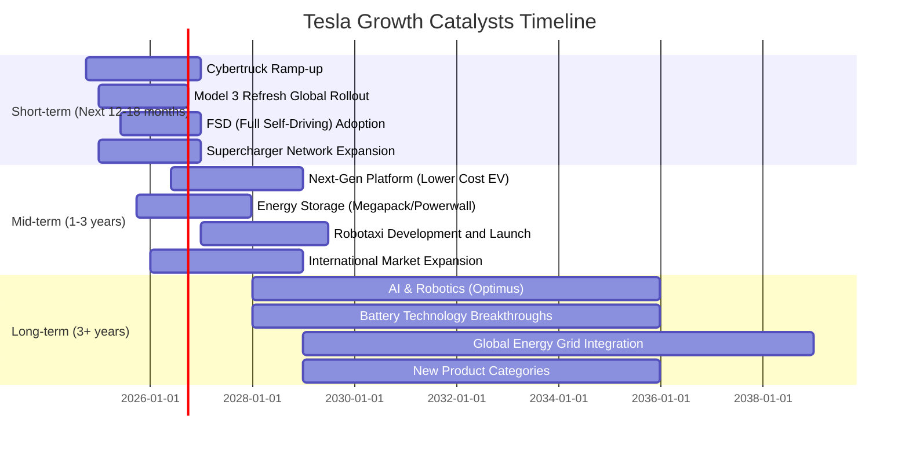

### 8.2 TAM 市場規模分析

```
╔══════════════════════════════════════════════════════════════════╗
║                   Tesla 目標市場 (TAM) 分析                      ║
╠══════════════════════════════════════════════════════════════════╣
║                                                                  ║
║  電動車市場 (EV Market)：                                        ║
║  ├── TAM: $1.5T+ (全球汽車市場總規模)                            ║
║  ├── Tesla滲透率: ~1-2% (基於銷量佔比)                           ║
║  └── 貢獻收入: $97.88B (TTM，主要來自此)                         ║
║                                                                  ║
║  能源儲存市場 (Energy Storage Market)：                          ║
║  ├── TAM: $400B+ (預計至2030年)                                 ║
║  ├── Tesla滲透率: 低個位數百分比                                 ║
║  └── 貢獻收入: 佔比較小，但成長迅速                               ║
║                                                                  ║
║  自動駕駛/AI軟體服務 (FSD/AI Software)：                         ║
║  ├── TAM: $1T+ (預計至2035年，Robotaxi市場)                     ║
║  ├── Tesla滲透率: FSD用戶持續增加中                              ║
║  └── 貢獻收入: 潛在巨大，目前主要為預付款或訂閱收入                 ║
║                                                                  ║
║  📊 結論：Tesla在多個巨大潛力市場中耕耘，長期成長空間廣闊。       ║
╚══════════════════════════════════════════════════════════════════╝
```

### 8.3 成長驅動力結構圖

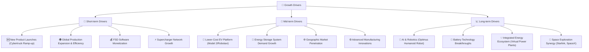

**分析**：
Tesla的成長驅動力是多方面的，從短期的新產品發布和現有產品的生產擴張，到中期的低成本電動車平台和能源業務的發展，再到長期的AI、機器人技術和能源生態系統的深度整合。FSD軟體的變現能力和全球超級充電網路的持續擴張，是支撐其短期成長的關鍵。中期來看，傳聞中的低成本電動車（Model 2）和Robotaxi的推出，有望打開更大的市場。長期而言，AI和機器人（Optimus）以及電池技術的突破，將為Tesla帶來超越汽車製造業的巨大潛力。

---

## 9. 風險矩陣

### 9.1 風險評分矩陣

```mermaid
quadrantChart
    title Tesla Risk Assessment Matrix
    x-axis Low Probability --> High Probability
    y-axis Low Impact --> High Impact
    quadrant-1 High Priority
    quadrant-2 Monitor Closely
    quadrant-3 Review Periodically
    quadrant-4 Watch

    Valuation Overhang: [0.85, 0.90]
    Intense EV Competition: [0.90, 0.80]
    Margin Compression: [0.80, 0.85]
    Regulatory & Geopolitical Risks: [0.70, 0.75]
    Key Person Risk (Elon Musk): [0.65, 0.80]
    FSD Development Delays: [0.60, 0.70]
    Supply Chain Disruptions: [0.50, 0.60]
    New Product Launch Delays: [0.55, 0.65]
    Cybersecurity/Data Privacy: [0.40, 0.50]
```

### 9.2 風險清單詳細分析

| # | 風險項目 | 發生機率 | 財務衝擊 | 風險評分 | 緩解措施 |
|---|----------|----------|----------|----------|----------|
| 1 | 🔴 **估值過高與市場情緒波動** | 高 (85%) | 高 (-20%至-40%股價修正) | 🔴 9.0/10 | 投資者需審慎評估，公司需持續兌現高成長預期；強調長期價值。 |
| 2 | 🔴 **電動車市場競爭加劇** | 極高 (90%) | 高 (-10%至-15%營收成長放緩，毛利率持續壓縮) | 🔴 8.5/10 | 加速新產品開發，提升生產效率，擴大FSD等高利潤服務收入。 |
| 3 | 🔴 **利潤率持續承壓** | 高 (80%) | 高 (-5%至-10%淨利潤下降) | 🔴 8.0/10 | 實施更嚴格的成本控制，優化產品組合，提高軟體服務佔比。 |
| 4 | 🟡 **關鍵人物風險 (Elon Musk)** | 中 (65%) | 中 (-10%至-20%股價波動，潛在領導力真空) | 🟡 7.5/10 | 建立強大的管理團隊，明確繼任計劃，減少個人決策對公司的影響。 |
| 5 | 🟡 **監管與地緣政治風險** | 中 (70%) | 中 (-5%至-10%市場份額損失或罰款) | 🟡 7.0/10 | 積極與各國監管機構溝通，多元化生產和銷售區域，降低單一市場依賴。 |
| 6 | 🟡 **FSD 開發與變現不及預期** | 中 (60%) | 中 (-5%至-8%未來潛在服務收入損失) | 🟡 6.5/10 | 持續投入研發，通過測試數據證明可靠性，探索多樣化商業模式。 |
| 7 | 🟡 **新產品推出延遲或市場反應不佳** | 中 (55%) | 中 (-5%至-10%營收增長不及預期) | 🟡 6.0/10 | 加強產品規劃和市場調研，確保新產品符合市場需求並按時交付。 |
| 8 | 🟢 **供應鏈中斷風險** | 低 (50%) | 中 (-3%至-5%生產中斷或成本增加) | 🟡 5.5/10 | 建立多元化供應商網絡，提升供應鏈韌性，實施庫存管理策略。 |

---

## 10. 投資建議

### 10.1 最終綜合評級雷達圖

```
╔══════════════════════════════════════════════════════════════════╗
║                  ✅ Tesla 綜合評級雷達圖 (1-10分)                 ║
╠══════════════════════════════════════════════════════════════════╣
║                                                                  ║
║  基本面強度     8.0 ▓▓▓▓▓▓▓▓▓▓▓▓▓▓▓▓░░░░  ★★★★☆           ║
║  成長動能       6.0 ▓▓▓▓▓▓▓▓▓▓▓▓░░░░░░░░  ★★★☆☆           ║
║  獲利品質       5.0 ▓▓▓▓▓▓▓▓▓▓░░░░░░░░░░  ★★☆☆☆           ║
║  財務健康       9.0 ▓▓▓▓▓▓▓▓▓▓▓▓▓▓▓▓▓▓░░  ★★★★★           ║
║  估值合理性     4.0 ▓▓▓▓▓▓▓▓░░░░░░░░░░░░  ★★☆☆☆           ║
║  護城河深度     7.5 ▓▓▓▓▓▓▓▓▓▓▓▓▓▓▓░░░░░  ★★★★☆           ║
║  管理層執行     7.0 ▓▓▓▓▓▓▓▓▓▓▓▓▓▓░░░░░░  ★★★☆☆           ║
║  技術創新力     8.5 ▓▓▓▓▓▓▓▓▓▓▓▓▓▓▓▓▓░░░  ★★★★☆           ║
╠══════════════════════════════════════════════════════════════════╣
║  綜合總分       6.5 ▓▓▓▓▓▓▓▓▓▓▓▓▓░░░░░░░  🏆 評級：持有        ║
╚══════════════════════════════════════════════════════════════════╝
```

### 10.2 目標價與隱含報酬率

基於對Tesla基本面、成長前景、風險和市場情緒的綜合分析，我們給出以下目標價區間：

| 情境 | 目標價 (USD) | 隱含報酬率（基於 $375.12） | 機率權重 | 加權目標價 |
|------|--------------|-----------------------------|----------|------------|
| 🔴 **悲觀情境** | $280 | -25.36% | 30% | $84.00 |
| 🟡 **基準情境** | $380 | +1.30% | 50% | $190.00 |
| 🟢 **樂觀情境** | $480 | +27.96% | 20% | $96.00 |
|      |              |                             | **100%** | **$370.00** |

**分析**：
我們的基準目標價$380，僅較當前股價$375.12有微幅上漲空間，這反映了我們對其高估值的謹慎態度。儘管Tesla在創新和長期潛力方面表現突出，但其短期內的營收成長放緩和利潤率壓力不容忽視。DCF模型顯示的內在價值遠低於當前股價，這意味著市場對其未來成長的預期已經非常高。悲觀情境考慮到市場估值修正和競爭加劇的風險，而樂觀情境則基於其新產品成功、FSD變現和能源業務超預期成長。綜合加權目標價為$370.00，與當前股價接近，印證了「持有」的評級。

### 10.3 買入時機與觸發因素

```
╔══════════════════════════════════════════════════════════════════╗
║                  ✅ 買入觸發因素 Checklist                      ║
╠══════════════════════════════════════════════════════════════════╣
║                                                                  ║
║  立即買入觸發條件（多數符合）：                                  ║
║  ☐ 股價跌至$250以下，估值顯著回歸合理區間                        ║
║  ☐ 季度營收YoY成長率恢復至20%以上，且趨勢穩定                    ║
║  ☐ 毛利率和營業利益率連續兩季度實現環比增長                      ║
║  ☐ FSD或能源業務產生明確且可持續的高利潤貢獻                   ║
║  ☐ 公司宣佈大規模股票回購計劃                                  ║
║                                                                  ║
║  加碼觸發條件（出現以下任一）：                                  ║
║  ☐ 新一代低成本車型（如Model 2）成功發布並迅速上量              ║
║  ☐ Optimus機器人或AI領域取得突破性進展，並有清晰商業化路徑      ║
║  ☐ 宏觀經濟環境顯著改善，消費者對電動車需求強勁反彈              ║
║  ☐ 競爭格局出現有利於Tesla的變化                               ║
║                                                                  ║
║  減碼/停損觸發條件（出現以下任一）：                             ║
║  ☐ 營收連續兩季度負成長，且利潤率持續惡化                        ║
║  ☐ 競爭對手推出具顛覆性產品，對Tesla構成實質威脅                 ║
║  ☐ 關鍵人物（Elon Musk）出現重大負面事件或離職                   ║
║  ☐ 監管環境對自動駕駛或電動車業務造成嚴重不利影響                ║
╚══════════════════════════════════════════════════════════════════╝
```

### 10.4 投資人適配度分析

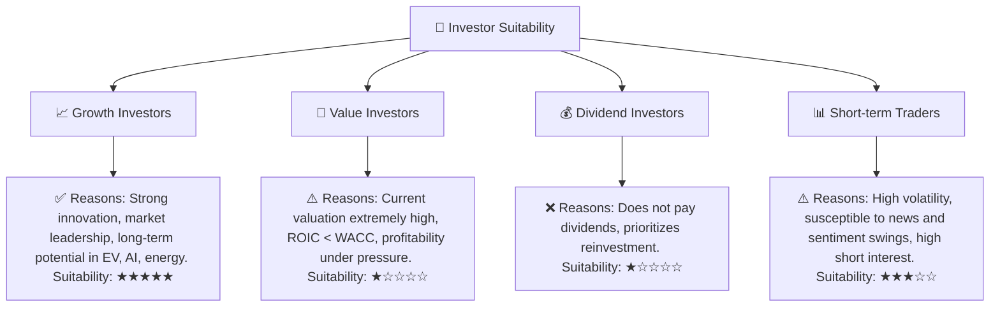
**分析**：
- **成長型投資者**：Tesla非常適合尋求高成長、高風險高回報的成長型投資者。其在電動車、AI和能源領域的長期潛力巨大，但需要承受較高的估值風險和股價波動。
- **價值型投資者**：對於價值型投資者而言，Tesla目前的估值過高，且經濟價值創造能力不足（ROIC < WACC），不符合典型的價值投資標準。
- **股息型投資者**：Tesla不支付股息，因此不適合尋求穩定股息收入的投資者。
- **短期交易者**：由於其股價波動性高（Beta 1.80），且容易受新聞事件和Elon Musk言論影響，Tesla可能吸引短期交易者，但風險極高。

### 10.5 關鍵監控指標

| 監控類型 | 指標 | 關注點 | 頻率 |
|----------|------|--------|------|
| **營收成長** | 季度營收YoY成長率 | 是否恢復雙位數成長，新產品貢獻 | 每季 |
| **獲利能力** | 毛利率、營業利益率 | 價格戰影響、成本控制效果，是否企穩回升 | 每季 |
| **資本效率** | ROIC vs WACC | 經濟價值創造能力是否改善，ROIC趨勢 | 每年 |
| **市場競爭** | 主要競爭對手銷量、新產品發布 | 市場份額變化，價格戰是否緩解 | 每季/每月 |
| **FSD進展** | FSD普及率、訂閱收入、技術可靠性 | 軟體變現能力，監管態度 | 每季/新聞 |
| **能源業務** | 能源儲存和太陽能產品營收成長 | 多元化成長引擎表現 | 每季 |
| **估值指標** | Forward P/E、P/S | 估值是否回歸合理區間，市場情緒變化 | 每日/每週 |
| **管理層** | Elon Musk 的言論和行動 | 對公司戰略和股價的影響 | 每日/新聞 |

---

> **免責聲明**：本報告為 AI 自動生成，僅供研究參考，不構成投資建議。投資有風險，入市需謹慎。