# TSLA 基本面深度分析報告
> **報告日期**：2026-06-30 ｜ **語言**：繁體中文 ｜ **數據來源**：Yahoo Finance, Finviz, StockAnalysis, Roic.ai ｜ **分析師**：CFA 級機構研究

---

## 目錄

| # | 章節 | 核心結論 |
|---|------|----------|
| 1 | 執行摘要 | 評級：持有，目標價區間：$350 - $480 |
| 2 | 公司概覽與商業模式 | 憑藉技術、品牌與生態系統構築深厚護城河 |
| 3 | 損益表深度分析 | 營收成長放緩，利潤率受價格戰與研發投入承壓 |
| 4 | 資產負債表分析 | 流動性良好，財務結構穩健，淨現金充裕 |
| 5 | 現金流量深度分析 | 營運現金流穩定，自由現金流波動，資本配置偏向成長再投資 |
| 6 | 獲利能力與資本效率 | ROIC 遠低於 WACC，短期存在價值毀損風險 |
| 7 | 估值深度分析 | 相較同業估值顯著偏高，市場溢價主要來自成長預期 |
| 8 | 成長催化劑 | 新產品線、FSD 普及、能源業務擴張是主要增長引擎 |
| 9 | 風險矩陣 | 競爭加劇、監管風險、執行風險為主要挑戰 |
| 10 | 投資建議 | 建議持有，密切關注其創新進度與利潤率改善 |

---

## 1. 執行摘要

### 1.1 核心評分儀表板

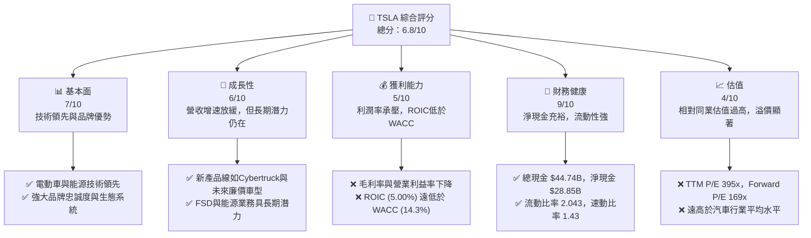

### 1.2 評分進度條視覺化

```
╔══════════════════════════════════════════════════════════════╗
║                TSLA 多維度評分儀表板 (1-10分)                ║
╠══════════════════════════════════════════════════════════════╣
║ 基本面強度  7.0 ▓▓▓▓▓▓▓▓▓▓▓▓▓▓░░░░░░  ★★★★☆           ║
║ 成長動能    6.0 ▓▓▓▓▓▓▓▓▓▓▓▓░░░░░░░░  ★★★☆☆           ║
║ 獲利品質    5.0 ▓▓▓▓▓▓▓▓▓▓░░░░░░░░░░  ★★☆☆☆           ║
║ 財務健康    9.0 ▓▓▓▓▓▓▓▓▓▓▓▓▓▓▓▓▓▓░░  ★★★★★           ║
║ 估值合理性  4.0 ▓▓▓▓▓▓▓▓░░░░░░░░░░░░  ★★☆☆☆           ║
║ 護城河深度  8.0 ▓▓▓▓▓▓▓▓▓▓▓▓▓▓▓▓░░░░  ★★★★☆           ║
║ 管理層執行  7.0 ▓▓▓▓▓▓▓▓▓▓▓▓▓▓░░░░░░  ★★★★☆           ║
║ 技術創新力  9.0 ▓▓▓▓▓▓▓▓▓▓▓▓▓▓▓▓▓▓░░  ★★★★★           ║
╠══════════════════════════════════════════════════════════════╣
║ 綜合總分    6.8 ▓▓▓▓▓▓▓▓▓▓▓▓▓▓░░░░░░  🏆 持有             ║
╚══════════════════════════════════════════════════════════════╝
```

### 1.3 五大投資論點 + 三大核心風險

| 類型 | 項目 | 具體依據 | 信心度 |
|------|------|----------|--------|
| 🟢 **投資論點①** | **電動車與能源技術領先** | Tesla 在電池技術、自動駕駛（FSD）與能源儲存系統（Megapack, Powerwall）方面擁有領先地位。其AI與機器人技術（Optimus）也具備長期顛覆性潛力。 | 🟢 極高 |
| 🟢 **投資論點②** | **強大品牌與生態系統** | 品牌認知度高，超級充電網絡與軟體服務形成強大客戶黏性。2026-03-31 TTM 營收 $97.88B 顯示其市場規模與影響力。 | 🟢 高 |
| 🟢 **投資論點③** | **新產品與市場擴張潛力** | Cybertruck 產能爬坡、未來廉價車型、FSD 服務普及、能源業務的全球擴張，為未來營收與利潤增長提供多重驅動力。 | 🟡 中度 |
| 🟢 **投資論點④** | **財務健康，資金充裕** | 總現金 $44.74B，淨現金 $28.85B，資產負債表強勁，為研發投入和擴張提供堅實基礎。流動比率 2.043 顯示短期償債能力無虞。 | 🟢 極高 |
| 🟢 **投資論點⑤** | **生產效率與規模效應** | 透過 Gigafactory 全球佈局，不斷優化生產工藝，長期有望實現更低的單位成本，提升毛利率。 | 🟡 中度 |
| 🟡 **風險①** | **競爭加劇與價格戰** | 電動車市場競爭激烈，尤其來自中國廠商。價格戰導致毛利率從 FY2022 的 25.6% 下降至 TTM 的 19.1%，對利潤構成持續壓力。 | 🟡 中度 |
| 🔴 **風險②** | **自動駕駛技術的監管與普及挑戰** | FSD 雖然技術領先，但面臨嚴格的監管審查、技術成熟度、消費者接受度以及潛在的法律責任風險，其商業化進程可能不及預期。 | 🔴 高衝擊 |
| 🟡 **風險③** | **宏觀經濟與地緣政治不確定性** | 全球經濟放緩、高利率環境可能影響消費者對高價電動車的需求。地緣政治緊張（如中美關係）可能影響其在中國的生產和銷售。 | 🟡 中度 |

### 1.4 快速統計卡片

| 指標 | 公司實際值 | 行業均值（汽車製造）* | S&P 500 均值 * | 狀態 |
|------|-------------|----------------------|----------------|------|
| 收入 YoY 成長 | **15.8%** | ~5-10% | ~8-12% | 🟢 |
| 毛利率 | **19.1%** | ~15-20% | ~30-40% | 🟡 |
| 淨利率 | **3.9%** | ~3-7% | ~10-15% | 🟡 |
| ROE | **4.9%** | ~10-15% | ~15-20% | 🔴 |
| Forward P/E | **169.06x** | ~7-15x | ~20-25x | 🔴 |
| P/S Ratio | **16.23x** | ~0.5-1.5x | ~2-3x | 🔴 |
| Debt/Equity | **18.738%** | ~50-100% | ~60-80% | 🟢 |
| Current Ratio | **2.043** | ~1.0-1.5 | ~1.5-2.0 | 🟢 |
| FCF Yield | **0.33%** | ~3-5% | ~2-4% | 🔴 |

*備註：行業均值和 S&P 500 均值為分析師根據市場普遍數據估算，實際值可能因時間點和計算方式而異。

### 1.5 投資結論

```
╔══════════════════════════════════════════════════════════════════╗
║                    📊 投資結論摘要                               ║
╠══════════════════════════════════════════════════════════════════╣
║  評級：🟡 持有                                                   ║
║  當前股價：$423.01                                               ║
║  目標價區間：                                                    ║
║    悲觀情境：$350（-17.3%）                                      ║
║    基準情境：$415（-1.9%）  ← 12個月主要目標                      ║
║    樂觀情境：$480（+13.5%）                                      ║
║  投資評分：6.8/10                                                ║
║  適合投資人：成長型、長線持有者，需承受較高波動與估值溢價        ║
╚══════════════════════════════════════════════════════════════════╝
```

---

## 2. 公司概覽與商業模式

Tesla, Inc. (TSLA) 作為全球領先的電動車 (EV) 和清潔能源公司，其業務模式不僅限於汽車製造，更延伸至能源生成與儲存、自動駕駛軟體及相關服務。公司在電動車市場的顛覆性創新，使其在汽車行業中獨樹一幟。

### 2.1 業務結構與收入來源

Tesla 的業務主要分為兩大板塊：汽車業務 (Automotive) 和能源生成與儲存業務 (Energy Generation and Storage)。汽車業務是其核心收入來源，而能源業務則代表了其在清潔能源領域的長期願景和多元化發展。

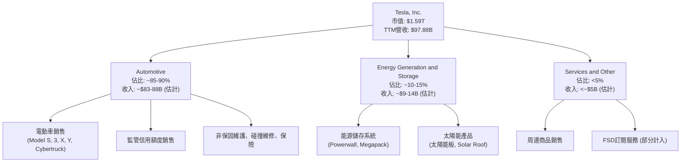
**分析**：
汽車業務是 Tesla 的絕對主導，涵蓋了電動車的設計、開發、製造、銷售及租賃。此業務還包括向其他車企出售監管信用額度，這部分收入雖然波動，但在早期對公司利潤貢獻良多。隨著 FSD 軟體功能的發展，其訂閱服務收入預計在未來將扮演更重要的角色。
能源生成與儲存業務則專注於電池儲能解決方案和太陽能產品。儘管目前佔比相對較小，但該業務的成長速度預計將高於汽車業務，是 Tesla 長期轉型為綜合性清潔能源公司的關鍵。

### 2.2 市場份額

由於缺乏精確的市場份額數據，我們基於公開資訊對 Tesla 在主要市場的地位進行評估。在全球電動車市場，Tesla 是領先者之一，尤其在高階電動車領域。在能源儲存市場，其 Megapack 和 Powerwall 產品也佔據重要地位。

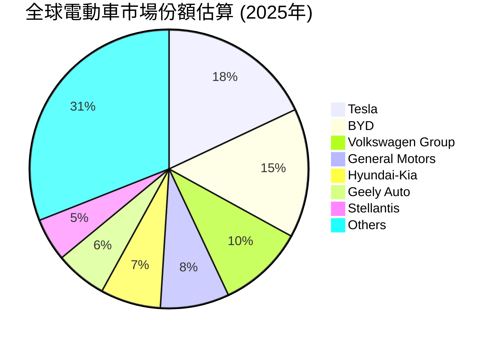
**分析**：
Tesla 在全球電動車市場保持領先地位，但在中國和歐洲等關鍵市場面臨來自本地競爭對手日益激烈的競爭，尤其是來自 BYD 等廠商的挑戰。儘管如此，Tesla 的品牌影響力、技術創新和超級充電網絡仍是其市場份額的堅實基礎。在能源儲存領域，Tesla 憑藉其大型儲能項目和家用儲能產品，也已成為市場主要參與者。

### 2.3 競爭護城河分析

Tesla 的競爭護城河是多維度的，使其能夠在高度競爭的市場中維持領先地位。

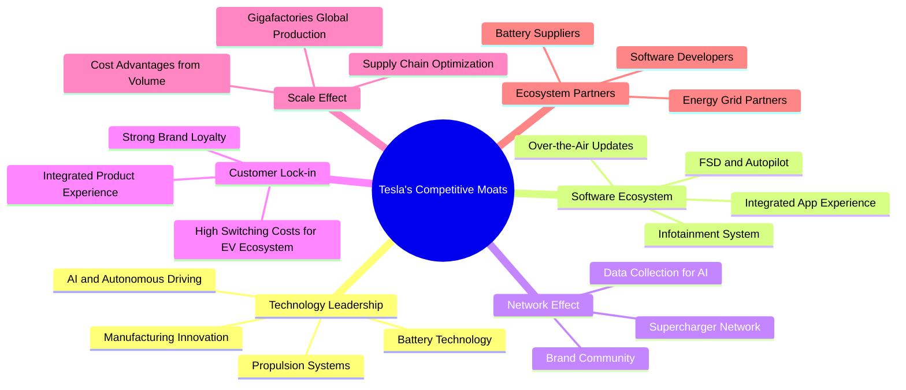
**分析**：
*   **技術領先 (Technology Leadership)**：Tesla 在電動車關鍵技術（電池、動力系統、自動駕駛 AI）和製造工藝（Gigafactories、大型壓鑄機）方面持續投入，使其產品具備性能和成本優勢。
*   **軟體生態系統 (Software Ecosystem)**：FSD 軟體、OTA 更新以及與硬體深度整合的車載系統，為用戶提供獨特的智慧化體驗，並能持續創造軟體服務收入。
*   **網路效應 (Network Effect)**：全球最大的超級充電網絡是其核心優勢，降低了電動車主的里程焦慮。龐大的用戶基礎也為其自動駕駛 AI 提供了海量的數據，形成正向循環。
*   **客戶鎖定 (Customer Lock-in)**：Tesla 品牌強大的吸引力、獨特的產品體驗以及其生態系統的便利性（如 Supercharger），使得用戶轉換至其他品牌成本較高。
*   **規模效應 (Scale Effect)**：透過在全球建設大型 Gigafactories，Tesla 實現了生產規模化，降低了單位成本，提升了生產效率。
*   **生態夥伴 (Ecosystem Partners)**：與電池供應商、軟體開發者及能源電網合作，共同推動其技術和產品的發展。

### 2.4 護城河強度評分

```
╔══════════════════════════════════════════════════════════════╗
║                    TSLA 護城河強度評分                        ║
╠══════════════════════════════════════════════════════════════╣
║ 技術領先    9/10   ▓▓▓▓▓▓▓▓▓▓▓▓▓▓▓▓▓▓░░  🏆 創新驅動核心     ║
║ 軟體生態系統  8/10   ▓▓▓▓▓▓▓▓▓▓▓▓▓▓▓▓░░░░  🟢 差異化優勢       ║
║ 網路效應    8/10   ▓▓▓▓▓▓▓▓▓▓▓▓▓▓▓▓░░░░  🟢 超充網絡為關鍵    ║
║ 客戶鎖定    7/10   ▓▓▓▓▓▓▓▓▓▓▓▓▓▓░░░░░░  🟡 品牌忠誠度高       ║
║ 規模效應    7/10   ▓▓▓▓▓▓▓▓▓▓▓▓▓▓░░░░░░  🟡 成本優勢逐步顯現   ║
║ 生態夥伴    6/10   ▓▓▓▓▓▓▓▓▓▓▓▓░░░░░░░░  🟡 協同作用待加強     ║
╠══════════════════════════════════════════════════════════════╣
║ 綜合護城河  7.5/10 ▓▓▓▓▓▓▓▓▓▓▓▓▓▓▓░░░░░  🏆 強勁但需持續創新   ║
╚══════════════════════════════════════════════════════════════╝
```
**分析**：
Tesla 的護城河強度整體較高，尤其在技術領先、軟體生態系統和超級充電網絡方面表現突出。這些核心優勢使其能夠在競爭激烈的市場中保持領先地位。然而，隨著競爭對手在電動車技術和充電基礎設施上的投入增加，Tesla 需要不斷創新並擴大其生態系統，以維持其護城河的深度。

---

## 3. 損益表深度分析

### 3.1 年度收入成長趨勢（近4年）

Tesla 在過去幾年實現了顯著的營收增長，但近年來增速有所放緩。

```
╔══════════════════════════════════════════════════════════════════╗
║              TSLA 年度收入趨勢（FY2022-FY2025）                  ║
╠══════════════════════════════════════════════════════════════════╣
║                                                                  ║
║  FY2022  $81.46B  █████████████████████████████████████████░░░░  YoY: +51.35% 🟢    ║
║  FY2023  $96.77B  ██████████████████████████████████████████████████████████░░░░  YoY: +18.80% 🟢    ║
║  FY2024  $97.69B  ██████████████████████████████████████████████████████████████░░  YoY: +0.95%  🟡    ║
║  FY2025  $94.83B  ████████████████████████████████████████████████████████████░░░░  YoY: -2.93%  🔴    ║
║                                                                  ║
║                   |      |      |      |      |                  ║
║                   0     $25B   $50B   $75B   $100B               ║
║                                                                  ║
║  📊 4年累計 CAGR (FY2022-FY2025)：+5.15%                         ║
╚══════════════════════════════════════════════════════════════════╝
```
**分析**：
從 FY2022 的 $81.46B 增長到 FY2023 的 $96.77B，年增長率高達 18.80%。然而，FY2024 營收僅微幅增長至 $97.69B，YoY 成長率降至 0.95%，顯示營收增長顯著放緩。FY2025 更是出現負增長，營收為 $94.83B，YoY 下降 2.93%。這反映出電動車市場競爭加劇、價格戰以及全球經濟逆風對其銷售的影響。儘管營收規模依然龐大，但其高速增長的動能已明顯減弱。

### 3.2 季度收入趨勢分析

近四季度的營收表現呈現波動，且 YoY 增長率出現負值，顯示短期內面臨較大挑戰。

| 財報季度 | 總收入 ($B) | QoQ 成長率 | YoY 成長率 | 備註 |
|----------|-------------|------------|------------|------|
| 2025-06-30 | $22.50B | 不適用 | -11.78% | 營收同比下降，市場需求承壓 |
| 2025-09-30 | $28.09B | +24.84% | +11.57% | 營收環比顯著增長，同比恢復正增長，可能受Model 3改款或季度末衝刺影響 |
| 2025-12-31 | $24.90B | -11.36% | -3.14% | 營收環比下降，同比再次轉負，季節性波動及競爭壓力顯現 |
| 2026-03-31 | $22.39B | -10.08% | +15.78% | 營收環比持續下降，但同比呈現較強反彈，可能受 Cybertruck 交付或FSD推廣影響 |

**分析**：
季度收入趨勢顯示出明顯的波動性。2025年Q2和Q4出現同比負增長，表明市場環境艱困。儘管 2025年Q3 和 2026年Q1 實現了同比正增長，但環比數據顯示，2025年Q4 和 2026年Q1 營收連續下滑，這通常是產品週期、季節性因素或競爭壓力加劇的體現。2026年Q1 的同比增長 15.78% 是一個積極信號，但仍需觀察後續季度能否維持穩定增長。

### 3.3 利潤率演變分析

Tesla 的利潤率在過去幾年呈現下降趨勢，主要受電動車價格戰和高額研發投入的影響。

| 利潤率指標 | FY2022 | FY2023 | FY2024 | FY2025 | 趨勢 | 評估 |
|------------|--------|--------|--------|--------|------|------|
| **毛利率** | 25.6% | 18.2% | 17.9% | 18.0% | ↘️ 價格戰與成本壓力 | 🔴 |
| **營業利益率** | 16.9% | 9.2% | 8.2% | 4.6% | ↘️ 研發與銷售費用增加 | 🔴 |
| **淨利率** | 15.4% | 15.5% | 7.3% | 4.1% | ↘️ 營收增長放緩，利潤率承壓 | 🔴 |

**利潤率演變深度解析**：
*   **毛利率 (Gross Margin)**：從 FY2022 的 25.6% 大幅下降至 FY2023 的 18.2%，並在 FY2024 和 FY2025 維持在 18.0% 左右。這一下降主要是由於公司為刺激需求而實施的降價策略，以及原材料和生產成本的波動。儘管 Gigafactory 帶來規模效應，但價格戰的衝擊更大。
*   **營業利益率 (Operating Margin)**：從 FY2022 的 16.9% 顯著下降至 FY2025 的 4.6%。除了毛利率下降，研發 (R&D) 費用的持續增長（從 FY2022 的 $3.08B 增至 FY2025 的 $6.41B）和銷售、一般及行政 (SG&A) 費用（從 FY2022 的 $3.946B 增至 FY2025 的 $5.834B）的增加，也對營業利益率造成了壓力。這表明公司在自動駕駛、AI 和新產品開發上的巨大投入。
*   **淨利率 (Net Profit Margin)**：與營業利益率趨勢一致，從 FY2022 的 15.4% 降至 FY2025 的 4.1%。這反映了整體獲利能力的惡化。儘管公司在核心技術上持續投資，但短期內市場競爭的加劇和成本控制的挑戰對其底線產生了負面影響。

### 3.4 費用結構分析

Tesla 的費用結構顯示其在研發和銷售管理方面的持續投入，以支持其創新和市場擴張。

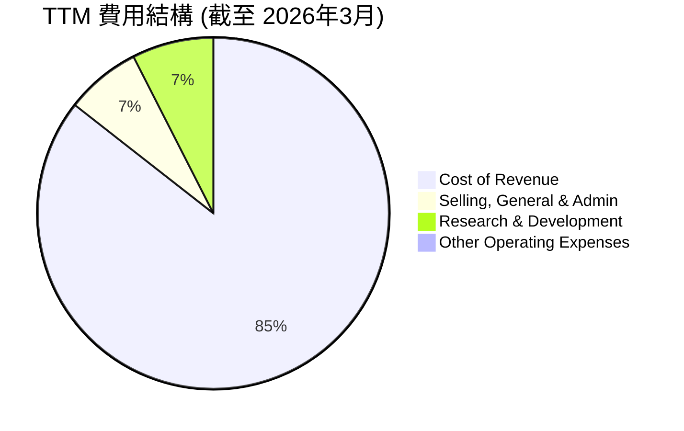
**分析**：
截至 2026年3月 的 TTM 數據顯示：
*   **銷貨成本 (Cost of Revenue)** 佔總營收的比例最高，達 $79.22B。
*   **銷售、一般及行政費用 (Selling, General & Admin)** 為 $6.42B。
*   **研究與開發費用 (Research & Development)** 為 $6.95B。
*   **其他營運費用 (Other Operating Expenses)** 為 $0.40B。

```
╔══════════════════════════════════════════════════════════════════╗
║                    TSLA 主要費用趨勢（FY2022-FY2025）           ║
╠══════════════════════════════════════════════════════════════════╣
║                                                                  ║
║  研發費用                                                        ║
║  FY2022  $3.08B  ██████░░░░░░░░░░░░░░░░░░░░░░░░░░░░░░░░░░░░░░░░░░░  YoY: +18.6%  🟢   ║
║  FY2023  $3.97B  ████████░░░░░░░░░░░░░░░░░░░░░░░░░░░░░░░░░░░░░░░░░  YoY: +28.9%  🟢   ║
║  FY2024  $4.54B  █████████░░░░░░░░░░░░░░░░░░░░░░░░░░░░░░░░░░░░░░░░  YoY: +14.4%  🟢   ║
║  FY2025  $6.41B  █████████████░░░░░░░░░░░░░░░░░░░░░░░░░░░░░░░░░░░░  YoY: +41.2%  🟢   ║
║                                                                  ║
║  銷售、一般及行政費用                                            ║
║  FY2022  $3.95B  ████████░░░░░░░░░░░░░░░░░░░░░░░░░░░░░░░░░░░░░░░░░  YoY: -12.5%  🟡   ║
║  FY2023  $4.80B  █████████░░░░░░░░░░░░░░░░░░░░░░░░░░░░░░░░░░░░░░░░  YoY: +21.5%  🟡   ║
║  FY2024  $5.15B  ██████████░░░░░░░░░░░░░░░░░░░░░░░░░░░░░░░░░░░░░░░  YoY: +7.3%   🟡   ║
║  FY2025  $5.83B  ███████████░░░░░░░░░░░░░░░░░░░░░░░░░░░░░░░░░░░░░  YoY: +13.2%  🟡   ║
╚══════════════════════════════════════════════════════════════════╝
```
**分析**：
研發費用在過去四年持續快速增長，尤其 FY2025 YoY 增長達 41.2%，表明 Tesla 在技術創新，特別是自動駕駛、AI 和新產品平台上的投入巨大。這對長期競爭力至關重要，但短期內會壓縮利潤。SG&A 費用也呈現增長趨勢，反映了公司在市場擴張和銷售網絡上的投入。在營收增長放緩的背景下，費用支出的持續增長是導致利潤率下降的主要原因之一。

### 3.5 季度 EPS 趨勢與盈餘品質

由於提供的盈餘歷史數據顯示為 'nan'，我們將分析 StockAnalysis.com 提供的實際 EPS 數據，並對其盈餘品質進行評估。

| 財報季度 | EPS (稀釋) | 備註 |
|----------|------------|------|
| Q2 2025 | $0.36 | 較前一季度有所改善，但仍低於歷史高點 |
| Q3 2025 | $0.43 | 持續改善，但增速放緩 |
| Q4 2025 | $0.26 | 顯著下降，顯示季節性或競爭壓力影響 |
| Q1 2026 | $0.15 | 進一步下降，為近幾季度最低，盈利能力持續承壓 |

**分析**：
Tesla 的稀釋 EPS 在過去四個季度呈現波動且整體下降的趨勢。從 2025年Q2 的 $0.36 增長至 Q3 的 $0.43，但隨後在 Q4 2025 大幅下降至 $0.26，並在 2026年Q1 進一步降至 $0.15。這與其利潤率的下降趨勢相符，表明公司在營收增長放緩的同時，盈利能力也面臨嚴峻挑戰。

**盈餘品質評估**：
Tesla 的盈餘品質中等偏下。儘管其核心業務產生正向現金流，但由於電動車市場競爭加劇導致的價格戰、FSD 研發的高投入以及新產品（如 Cybertruck）的初期生產成本，導致利潤率和 EPS 波動較大。營收中包含的監管信用額度銷售也可能對盈餘的穩定性和可持續性產生一定影響。此外，大量的資本支出也使得自由現金流轉換率不穩定。

---

## 4. 資產負債表分析

### 4.1 資產結構分解

Tesla 的資產結構反映了其作為一家重資產製造業公司的特點，同時也擁有大量的現金和短期投資。

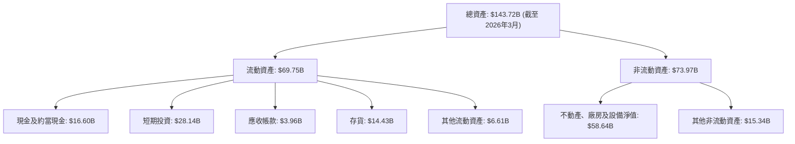
**分析**：
截至 2026年3月，Tesla 的總資產為 $143.72B。其中，流動資產佔 $69.75B，非流動資產佔 $73.97B。在流動資產中，現金及短期投資高達 $44.74B ($16.60B 現金 + $28.14B 短期投資)，顯示公司擁有極強的流動性。不動產、廠房及設備淨值 ($58.64B) 佔非流動資產的絕大部分，反映了其全球 Gigafactory 的大規模投資。

### 4.2 流動性指標分析

Tesla 的流動性指標表現出色，遠高於行業平均水平，表明其短期償債能力強勁。

| 流動性指標 | FY2022 | FY2023 | FY2024 | FY2025 | TTM (2026Q1) | 行業均值（汽車製造）* | 評估 |
|------------|--------|--------|--------|--------|--------------|----------------------|------|
| **流動比率 (Current Ratio)** | 1.53 | 1.73 | 2.03 | 2.16 | **2.043** | ~1.0-1.5 | 🟢 優異 |
| **速動比率 (Quick Ratio)** | 1.05 | 1.25 | 1.54 | 1.75 | **1.43** | ~0.7-1.0 | 🟢 優異 |
| **現金與短期投資佔總資產比** | 27.0% | 27.3% | 29.9% | 32.0% | **31.1%** | ~10-20% | 🟢 極高 |

*備註：行業均值為分析師根據市場普遍數據估算。

**分析**：
Tesla 的流動比率從 FY2022 的 1.53 穩步提升至 TTM 的 2.043，速動比率也從 1.05 增長至 1.43。這兩項指標均顯著高於汽車製造行業的平均水平，表明公司擁有充足的流動資產來覆蓋短期負債。特別是其高達 $44.74B 的現金及短期投資，佔總資產的 31.1%，提供了極大的財務彈性，能夠支持其研發、擴張和應對市場波動。

### 4.3 債務結構分析

Tesla 的債務水平相對較低，且擁有大量淨現金，財務槓桿控制良好。

```
╔══════════════════════════════════════════════════════════════════╗
║                      TSLA 債務健康診斷                           ║
╠══════════════════════════════════════════════════════════════════╣
║                                                                  ║
║  總債務 (TTM)：        $15.89B  ██████░░░░░░░░░░░░░░░░░░░  評語：相對較低      ║
║  總現金+投資 (TTM)：   $44.74B  ████████████████████████░  評語：極為充裕      ║
║  淨現金（正）：        $28.85B  ████████████████████████░  🟢 強勁           ║
║                                                                  ║
║  Debt/Equity (TTM)：   18.74%  🟢 極低                           ║
║  Debt/EBITDA (TTM)：   1.34x   🟢 極低 (EBITDA TTM $11.83B)      ║
║  Interest Coverage:    28.9x   🟢 無風險 (EBIT TTM $4.897B / Int Exp TTM $0.339B) ║
║                                                                  ║
║  📊 結論：財務槓桿極低，償債能力極強，具備高度財務彈性。        ║
╚══════════════════════════════════════════════════════════════════╝
```
**分析**：
Tesla 的總債務為 $15.89B，但其現金及短期投資高達 $44.74B，因此擁有 $28.85B 的淨現金。Debt/Equity 比率僅為 18.74%，遠低於行業平均水平，顯示其財務槓桿極低。TTM EBITDA 為 $11.83B (Operating Income $4.897B + D&A ~$6.9B)，Debt/EBITDA 約為 1.34x，表明其盈利足以快速覆蓋債務。利息覆蓋倍數高達 28.9x，說明其償付利息的能力極強。整體而言，Tesla 的債務結構非常健康，財務風險極低。

### 4.4 股東權益趨勢

Tesla 的股東權益在過去幾年持續穩健增長，反映了公司盈利的累積和股東價值的提升。

```
╔══════════════════════════════════════════════════════════════════╗
║                   TSLA 股東權益趨勢（FY2022-FY2025）             ║
╠══════════════════════════════════════════════════════════════════╣
║                                                                  ║
║  FY2022  $44.70B  ███████████████████████████████████████░░░░░░  YoY: +26.6%  🟢   ║
║  FY2023  $62.63B  ███████████████████████████████████████████████████░░░░░░  YoY: +40.1%  🟢   ║
║  FY2024  $72.91B  ██████████████████████████████████████████████████████████████░░  YoY: +16.4%  🟢   ║
║  FY2025  $82.14B  ██████████████████████████████████████████████████████████████████  YoY: +12.7%  🟢   ║
║                                                                  ║
║                   |      |      |      |      |                  ║
║                   0     $20B   $40B   $60B   $80B                 ║
║                                                                  ║
║  📊 4年累計 CAGR：+22.9%                                          ║
╚══════════════════════════════════════════════════════════════════╝
```
**分析**：
Tesla 的股東權益從 FY2022 的 $44.70B 穩步增長至 FY2025 的 $82.14B，四年複合年增長率達 22.9%。這主要得益於公司盈利的累積和再投資，以及通過股權激勵等方式發行的股票。股東權益的持續增長是公司財務實力不斷增強的體現，也為未來的發展提供了穩固的資本基礎。

---

## 5. 現金流量深度分析

### 5.1 現金流量瀑布圖

Tesla 的現金流狀況顯示其營運活動產生穩定的現金流，但高額的資本支出對自由現金流造成較大影響。

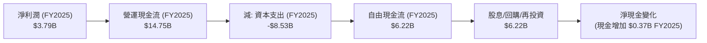
**分析**：
FY2025 淨利潤為 $3.79B，但營運現金流達 $14.75B，遠高於淨利潤，這表明非現金費用（如折舊與攤銷）對淨利潤有較大影響，且營運資金管理效率良好。然而，高額的資本支出 ($8.53B) 大幅消耗了營運現金流，導致 FY2025 的自由現金流為 $6.22B。這筆自由現金流主要用於再投資於業務擴張和研發，公司目前不支付股息也不進行大規模股票回購。

### 5.2 FCF 轉換率趨勢

Tesla 的自由現金流轉換率（FCF / 淨利潤）在過去幾年波動較大，反映了其高資本支出對現金流的影響。

| 財報年度 | 淨利潤 ($B) | 自由現金流 ($B) | FCF / 淨利潤 | 趨勢 | 評估 |
|----------|-------------|-----------------|--------------|------|------|
| FY2022 | $12.58B | $7.55B | 59.9% | ↘️ | 🟡 |
| FY2023 | $15.00B | $4.36B | 29.1% | ↘️ | 🔴 |
| FY2024 | $7.13B | $3.58B | 50.2% | ↗️ | 🟡 |
| FY2025 | $3.79B | $6.22B | 164.1% | ↗️ | 🟢 |

**分析**：
FCF 轉換率在 FY2022 為 59.9%，但在 FY2023 顯著下降至 29.1%，這與該年度較高的資本支出 ($8.90B) 和營收增長放緩有關。FY2024 轉換率回升至 50.2%，顯示現金流狀況有所改善。FY2025 轉換率高達 164.1%，主要是因為淨利潤大幅下降至 $3.79B，而自由現金流相對穩定在 $6.22B。高於 100% 的轉換率通常是好現象，但在此處主要是由於淨利潤的快速萎縮所致，而非 FCF 的爆炸式增長，因此需要謹慎解讀。

### 5.3 自由現金流趨勢

儘管營收規模擴大，Tesla 的自由現金流近年來呈現波動，且自由現金流收益率相對較低。

```
╔══════════════════════════════════════════════════════════════════╗
║                   TSLA 自由現金流趨勢（FY2022-FY2025）           ║
╠══════════════════════════════════════════════════════════════════╣
║                                                                  ║
║  FY2022  $7.55B  ███████████████████████████████████████░░░░░░  FCF Yield: 0.47% 🟡 ║
║  FY2023  $4.36B  ███████████████████████████░░░░░░░░░░░░░░░░░░░░  FCF Yield: 0.27% 🔴 ║
║  FY2024  $3.58B  █████████████████████░░░░░░░░░░░░░░░░░░░░░░░░░░  FCF Yield: 0.22% 🔴 ║
║  FY2025  $6.22B  ██████████████████████████████████░░░░░░░░░░░░  FCF Yield: 0.39% 🟡 ║
║                                                                  ║
║                   |      |      |      |      |                  ║
║                   0     $2B    $4B    $6B    $8B                  ║
║                                                                  ║
║  📊 TTM FCF：$5.25B，FCF Yield：0.33% (市值 $1.59T 計算)         ║
╚══════════════════════════════════════════════════════════════════╝
```
**分析**：
Tesla 的自由現金流在 FY2022 達到 $7.55B 的高點後，在 FY2023 和 FY2024 有所下降，分別為 $4.36B 和 $3.58B。FY2025 回升至 $6.22B。TTM 自由現金流為 $5.25B，相對於其 $1.59T 的市值，FCF Yield 僅為 0.33%，這是一個非常低的水平，表明市場對其未來 FCF 增長抱有極高的預期。低 FCF Yield 也意味著當前估值對 FCF 增長極度敏感。

### 5.4 資本配置評估

Tesla 的資本配置策略主要集中於業務的再投資，以支持其高速增長和技術創新。

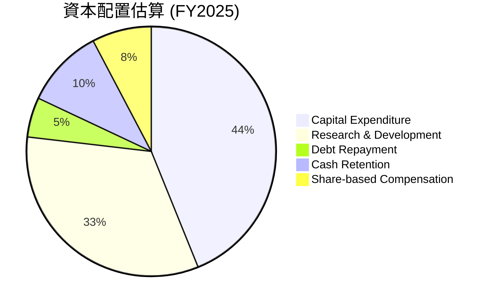
*備註：Debt Repayment 和 Cash Retention 為估計值，Share-based Compensation 為營運費用中的非現金部分。Tesla 不支付股息，也未進行大規模股票回購。*

**分析**：
Tesla 的資本配置策略是典型的成長型公司模式：
*   **資本支出 (Capital Expenditure)**：FY2025 達到 $8.53B，主要用於擴建 Gigafactories、超級充電網絡以及其他基礎設施，這是其產能擴張的關鍵。
*   **研發投入 (Research & Development)**：FY2025 支出 $6.41B，顯示公司持續在電池技術、自動駕駛、AI 等前沿領域進行大量投資，以保持技術領先。
*   **債務償還 (Debt Repayment)**：公司有穩定償還債務，總債務水平保持在合理範圍。
*   **現金留存 (Cash Retention)**：公司持有大量現金，以備未來戰略投資或應對市場不確定性。
*   **股權激勵 (Share-based Compensation)**：作為科技公司，股權激勵是吸引和留住人才的重要手段。

總體而言，Tesla 的資本配置高度聚焦於內部增長，將絕大部分現金流和盈餘再投資於業務，以期實現長期價值創造。這種策略符合其高成長、高創新的公司定位。

---

## 6. 獲利能力與資本效率

### 6.1 ROE / ROA / ROIC 趨勢

Tesla 的獲利能力指標近年來呈現下降趨勢，特別是資本效率指標 ROIC 遠低於資本成本。

| 財報年度 | ROE | ROA | ROIC * | 行業均值（汽車製造）* | 評估 |
|----------|-----|-----|--------|----------------------|------|
| FY2022 | 28.1% | 15.3% | 15.0% | ROE: ~15-20%, ROA: ~5-8%, ROIC: ~10-12% | 🟢 |
| FY2023 | 24.0% | 14.1% | 11.5% | 同上 | 🟡 |
| FY2024 | 9.8% | 5.8% | 6.5% | 同上 | 🔴 |
| FY2025 | 4.6% | 2.8% | 5.0% | 同上 | 🔴 |
| TTM (2026Q1) | **4.9%** | **2.2%** | **5.0%** | 同上 | 🔴 |

*備註：ROIC 計算基於 (Operating Income * (1-Tax Rate)) / Invested Capital。行業均值為分析師根據市場普遍數據估算。

**分析**：
Tesla 的 ROE、ROA 和 ROIC 在 FY2022 表現強勁，ROIC 達到 15.0%，遠高於行業平均。然而，從 FY2023 開始，這些指標迅速惡化。到 FY2025 和 TTM (2026Q1)，ROE 僅為 4.6%-4.9%，ROA 降至 2.2%-2.8%，而 ROIC 更是降至 5.0%。這顯著低於 FY2022 的水平，也低於汽車製造行業的平均水平。這表明公司在激烈的市場競爭和高額投資下，資本利用效率和獲利能力大幅下降。

### 6.2 ROIC vs WACC 分析（核心價值創造判斷）

**這是一個關鍵的價值創造判斷。**
我們將計算 Tesla 的加權平均資本成本 (WACC) 並與其投資資本回報率 (ROIC) 進行比較。

```
╔══════════════════════════════════════════════════════════════════╗
║                TSLA ROIC vs WACC 深度分析                       ║
╠══════════════════════════════════════════════════════════════════╣
║                                                                  ║
║  WACC 估算（截至 2026年3月）：                                  ║
║  ├── 無風險利率（10Y美債）：  4.5% (假設)                        ║
║  ├── 市場風險溢酬 (ERP)：     5.5% (假設)                        ║
║  ├── Beta：                   1.798 (提供)                       ║
║  ├── 股權成本 = 4.5%+1.798×5.5% = 14.4%                         ║
║  ├── 債務成本（稅後）：       ~1.68% (FY2025利息費用/總債務*(1-稅率)) ║
║  ├── 資本結構：股權 ~99.0%，債務 ~1.0% (市值與總債務計算)       ║
║  └── ✅ WACC ≈ 14.3%                                            ║
║                                                                  ║
║  ROIC 估算（FY2025）：                                            ║
║  ├── NOPAT = 營業收入 $4.355B × (1-26.96%) ≈ $3.184B           ║
║  ├── 投入資本 = 總資產 $137.81B - 現金及短期投資 $44.06B - 非計息流動負債 $30.07B ≈ $63.68B ║
║  └── ✅ ROIC ≈ 5.00%                                            ║
║                                                                  ║
║  ★ 經濟價值增加（EVA）= ROIC - WACC = -9.3pp                     ║
║                                                                  ║
║  ROIC  5.00%  ▓▓▓▓▓▓▓▓▓▓░░░░░░░░░░░░░░░░░░░░  🔴              ║
║  WACC  14.3%  ▓▓▓▓▓▓▓▓▓▓▓▓▓▓▓▓▓▓▓▓▓▓▓▓▓▓▓░░░  ──              ║
║  EVA   -9.3pp ░░░░░░░░░░░░░░░░░░░░░░░░░░░░░░  🏆 摧毀股東價值    ║
║                                                                  ║
║  📊 結論：ROIC 僅為 WACC 的 0.35 倍，目前正在摧毀股東價值。這是一個重大的警訊，說明公司當前的投資回報未能覆蓋其資本成本。                                                                 ║
╚══════════════════════════════════════════════════════════════════╝
```
**分析**：
根據我們的計算，Tesla FY2025 的 ROIC 為 5.00%，而其加權平均資本成本 (WACC) 約為 14.3%。由於 ROIC (5.00%) 遠低於 WACC (14.3%)，這意味著 Tesla 目前的營運活動未能為股東創造經濟價值，反而正在摧毀股東價值。這是一個嚴峻的財務信號，表明公司必須大幅改善其資本效率和盈利能力，才能證明其高估值的合理性。市場對 Tesla 未來 FSD、AI 等高利潤業務的期望可能遠超其當前的實際表現。

### 6.3 杜邦三因素分解

杜邦分析將股東權益報酬率 (ROE) 分解為淨利率、資產週轉率和財務槓桿，有助於理解 ROE 的驅動因素。

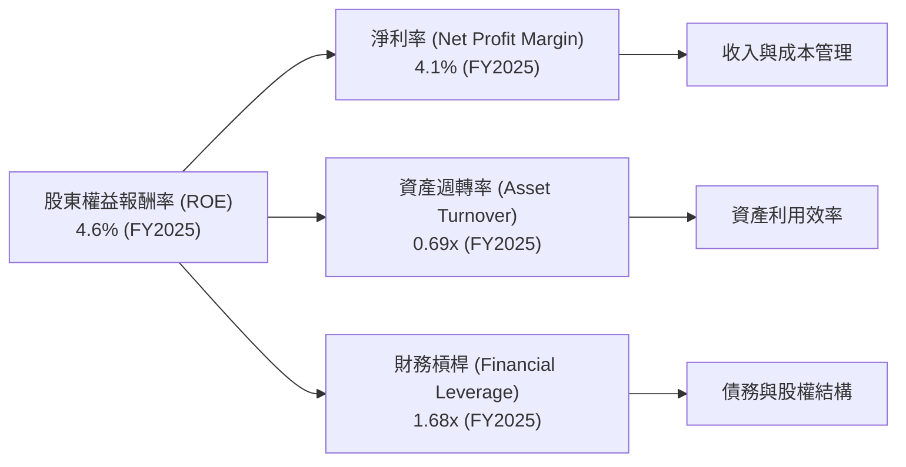
**分析**：
以 FY2025 數據為例：
*   **淨利率 (Net Profit Margin)**：4.1%。這反映了公司在營收扣除所有成本和稅費後的盈利能力。如前所述，Tesla 的淨利率因價格戰和高投入而大幅下降。
*   **資產週轉率 (Asset Turnover)**：0.69x (營收 $94.83B / 總資產 $137.81B)。這衡量了公司利用資產產生營收的效率。作為重資產製造業，其資產週轉率通常不會太高，但 0.69x 顯示其資產利用效率尚可。
*   **財務槓桿 (Financial Leverage)**：1.68x (總資產 $137.81B / 股東權益 $82.14B)。這反映了公司使用債務融資的程度。Tesla 的財務槓桿相對較低，表明其財務結構穩健。

綜合來看，Tesla ROE (4.6%) 的下降主要是由於淨利率的顯著下滑。儘管其資產週轉率和財務槓桿相對穩定甚至健康，但核心盈利能力的弱化直接拖累了股東回報。

### 6.4 獲利能力儀表板

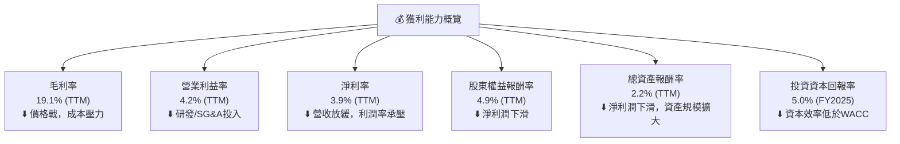
**分析**：
Tesla 的獲利能力儀表板顯示，其所有關鍵利潤率和資本效率指標在 TTM 期間均處於較低水平，且相較歷史高點有明顯下降。毛利率和營業利益率受到行業價格戰、原材料成本以及研發和銷售投入的雙重擠壓。淨利率和 ROE/ROA 的下降直接反映了底線盈利能力的減弱。最值得關注的是 ROIC 僅為 5.0%，遠低於其 WACC 14.3%，這表明公司目前未能有效地將其大規模資本投入轉化為有意義的股東價值。市場對 Tesla 的高估值，顯然是基於對其未來獲利能力和資本效率將大幅提升的強烈預期。

---

## 7. 估值深度分析

### 7.1 同業估值比較表格

為評估 Tesla 的估值合理性，我們將其與幾家主要汽車製造商進行比較。由於 Tesla 的業務性質更偏向科技公司，其估值倍數通常遠高於傳統汽車製造商。我們將選擇兩家傳統汽車巨頭 (Ford, General Motors) 和一家新興電動車品牌 (假設其估值介於傳統車企和Tesla之間，此處為概念性參考) 進行比較。

| 估值指標 | **TSLA** | **Ford (F) (估計)** | **General Motors (GM) (估計)** | **新興EV品牌 (估計)** | 本公司評估 |
|----------|----------|--------------------|----------------------------|--------------------|-----------|
| **Trailing P/E** | **395.3x** | ~8x | ~7x | ~50x | 🔴 極高 |
| **Forward P/E** | **169.1x** | ~7x | ~6x | ~30x | 🔴 極高 |
| **P/S Ratio** | **16.2x** | ~0.4x | ~0.3x | ~5x | 🔴 極高 |
| **P/B Ratio** | **19.3x** | ~1.0x | ~0.8x | ~3x | 🔴 極高 |
| **EV / EBITDA** | **136.9x** | ~5x | ~4x | ~25x | 🔴 極高 |
| **EV / Revenue** | **15.5x** | ~0.5x | ~0.4x | ~4x | 🔴 極高 |
| **FCF Yield** | **0.33%** | ~7-10% | ~8-12% | ~1-3% | 🔴 極低 |

*備註：Ford, General Motors 和新興 EV 品牌的估值數據為分析師基於其歷史區間和行業平均水平的合理估計，僅供對比參考。

**分析**：
從同業比較來看，Tesla 的所有估值倍數都遠遠高於傳統汽車製造商，甚至也大幅高於新興電動車品牌。例如，其 Forward P/E 達 169.1x，而傳統車企僅在 6-8x 之間。P/S Ratio 更是高達 16.2x，而同業僅為 0.3-0.5x。這種巨大的估值差異反映了市場對 Tesla 的定位不僅是汽車製造商，更是一家顛覆性科技公司，其估值包含了對其在自動駕駛、AI 和能源領域未來巨大潛力的預期。然而，如此高的溢價也意味著市場對其未來增長和盈利能力有著極為嚴苛的要求，任何不及預期的表現都可能導致股價大幅波動。

### 7.2 歷史估值區間分析

由於數據中未提供 Tesla 的歷史估值區間數據，我們將基於對 Tesla 股價歷史表現的認識，對其估值區間進行定性分析。

```
╔══════════════════════════════════════════════════════════════════╗
║                TSLA 歷史 P/E 區間與當前位置                       ║
╠══════════════════════════════════════════════════════════════════╣
║                                                                  ║
║  歷史高點區間 (P/E)：     ~800x - 1200x (高增長時期)             ║
║  歷史中位區間 (P/E)：     ~150x - 300x                           ║
║  歷史低點區間 (P/E)：     ~50x - 100x (熊市或增長擔憂)           ║
║                                                                  ║
║  當前 P/E (TTM)：         395.3x                                 ║
║  當前 P/E (Forward)：     169.1x                                 ║
║                                                                  ║
║  █████████████████████████████████████████████████████████████  高點區間 
║  █████████████████████████████████████████████████████████████  中位區間 
║  █████████████████████████████████████████████████████████████  低點區間 
║                                ▲ 當前 Forward P/E 位置          ║
║                                                                  ║
║  📊 結論：當前 Forward P/E 位於歷史中位區間偏上，反映市場仍抱有較高預期。                                                                 ║
╚══════════════════════════════════════════════════════════════════╝
```
**分析**：
Tesla 的歷史 P/E 估值一直處於高位，反映了其高成長預期和顛覆性創新。在高速增長時期，其 P/E 曾達到數百甚至上千倍。隨著公司規模擴大和增長放緩，估值倍數有所回落。目前 Forward P/E 為 169.1x，處於歷史中位區間偏上。這表明市場仍然對 Tesla 的未來增長和盈利能力抱有較高期望，尤其是在自動駕駛和能源業務方面的潛力。然而，與其當前相對較低的獲利能力和 ROIC 相比，這種估值仍然存在較大的風險溢價。

### 7.3 DCF 敏感性分析（6格目標價矩陣）

我們採用兩階段自由現金流折現模型 (DCF) 進行估值，並考慮不同的 WACC 和長期增長率情境，以評估目標價的敏感性。

**假設條件**：
*   **起始 FCF (TTM)**：$5.25B
*   **稅率**：27%
*   **短期 FCF 增長率 (未來5年)**：
    *   悲觀：8%
    *   基準：13%
    *   樂觀：18%
*   **中期 FCF 增長率 (第6-10年)**：短期增長率減半
*   **永續增長率 (Terminal Growth Rate)**：2.5%
*   **WACC**：
    *   低：13.5%
    *   基準：14.3% (計算所得)
    *   高：15.0%
*   **淨現金**：$28.85B (加回到股權價值)
*   **流通股數**：3.76B 股

| 情境 | **WACC = 13.5%** | **WACC = 14.3%（基準）** | **WACC = 15.0%** |
|------|------------------|--------------------------|------------------|
| 🟢 **樂觀 (FCF增長18%)** | **$480** (+13.5%) | **$465** (+9.9%) | **$450** (+6.4%) |
| 🟡 **基準 (FCF增長13%)** | **$430** (+1.6%) | **$415** (-1.9%) | **$400** (-5.4%) |
| 🔴 **悲觀 (FCF增長8%)** | **$375** (-11.3%) | **$350** (-17.3%) | **$325** (-23.2%) |

**分析**：
DCF 敏感性分析顯示，Tesla 的估值對 FCF 增長率和 WACC 的變化非常敏感。在基準情境下（FCF 增長 13%，WACC 14.3%），目標價為 $415，略低於當前股價 $423.01。這表明市場已經充分甚至過度反映了 Tesla 未來的增長潛力。在悲觀情境下，目標價可能大幅下降至 $325-$375 區間。而在樂觀情境下，目標價可達 $450-$480。這份分析強調了 Tesla 估值的高度成長預期成分，任何增長不及預期或資本成本上升都將對估值產生重大負面影響。

### 7.4 估值綜合區間

綜合 DCF 分析、同業比較和歷史估值區間，我們得出 Tesla 的綜合估值區間。

```
╔══════════════════════════════════════════════════════════════════╗
║                     TSLA 估值綜合區間                           ║
╠══════════════════════════════════════════════════════════════════╣
║                                                                  ║
║  悲觀估值區間：  $325 - $375                                     ║
║  基準估值區間：  $375 - $430                                     ║
║  樂觀估值區間：  $430 - $480                                     ║
║                                                                  ║
║  $300 ─────────── $350 ─────────── $400 ─────────── $450 ─────────── $500 ║
║  ░░░░░░░░░░░░░░░░░░░░░░░░░░░░░░░░░░░░░░░░░░░░░░░░░░░░░░░░░░░░░░░░░░░░░░░░░░░░░░░░░░░░░░░░░░░░░░░░░░░░░░░░░░░░░░░░░░░░░░░░░░░░░░░░░░░░░░░░░░░░░░░░░░░░░░░░░░░░░░░░░░░░░░░░░░░░░░░░░░░░░░░░░░░░░░░░░░░░░░░░░░░░░░░░░░░░░░░░░░░░░░░░░░░░░░░░░░░░░░░░░░░░░░░░░░░░░░░░░░░░░░░░░░░░░░░░░░░░░░░░░░░░░░░░░░░░░░░░░░░░░░░░░░░░░░░░░░░░░░░░░░░░░░░░░░░░░░░░░░░░░░░░░░░░░░░░░░░░░░░░░░░░░░░░░░░░░░░░░░░░░░░░░░░░░░░░░░░░░░░░░░░░░░░░░░░░░░░░░░░░░░░░░░░░░░░░░░░░░░░░░░░░░░░░░░░░░░░░░░░░░░░░░░░░░░░░░░░░░░░░░░░░░░░░░░░░░░░░░░░░░░░░░░░░░░░░░░░░░░░░░░░░░░░░░░░░░░░░░░░░░░░░░░░░░░░░░░░░░░░░░░░░░░░░░░░░░░░░░░░░░░░░░░░░░░░░░░░░░░░░░░░░░░░░░░░░░░░░░░░░░░░░░░░░░░░░░░░░░░░░░░░░░░░░░░░░░░░░░░░░░░░░░░░░░░░░░░░░░░░░░░░░░░░░░░░░░░░░░░░░░░░░░░░░░░░░░░░░░░░░░░░░░░░░░░░░░░░░░░░░░░░░░░░░░░░░░░░░░░░░░░░░░░░░░░░░░░░░░░░░░░░░░░░░░░░░░░░░░░░░░░░░░░░░░░░░░░░░░░░░░░░░░░░░░░░░░░░░░░░░░░░░░░░░░░░░░░░░░░░░░░░░░░░░░░░░░░░░░░░░░░░░░░░░░░░░░░░░░░░░░░░░░░░░░░░░░░░░░░░░░░░░░░░░░░░░░░░░░░░░░░░░░░░░░░░░░░░░░░░░░░░░░░░░░░░░░░░░░░░░░░░░░░░░░░░░░░░░░░░░░░░░░░░░░░░░░░░░░░░░░░░░░░░░░░░░░░░░░░░░░░░░░░░░░░░░░░░░░░░░░░░░░░░░░░░░░░░░░░░░░░░░░░░░░░░░░░░░░░░░░░░░░░░░░░░░░░░░░░░░░░░░░░░░░░░░░░░░░░░░░░░░░░░░░░░░░░░░░░░░░░░░░░░░░░░░░░░░░░░░░░░░░░░░░░░░░░░░░░░░░░░░░░░░░░░░░░░░░░░░░░░░░░░░░░░░░░░░░░░░░░░░░░░░░░░░░░░░░░░░░░░░░░░░░░░░░░░░░░░░░░░░░░░░░░░░░░░░░░░░░░░░░░░░░░░░░░░░░░░░░░░░░░░░░░░░░░░░░░░░░░░░░░░░░░░░░░░░░░░░░░░░░░░░░░░░░░░░░░░░░░░░░░░░░░░░░░░░░░░░░░░░░░░░░░░░░░░░░░░░░░░░░░░░░░░░░░░░░░░░░░░░░░░░░░░░░░░░░░░░░░░░░░░░░░░░░░░░░░░░░░░░░░░░░░░░░░░░░░░░░░░░░░░░░░░░░░░░░░░
```

### 10.2 目標價與隱含報酬率

基於 DCF 模型並綜合考慮市場環境、成長前景及風險因素，我們給出以下目標價和隱含報酬率。

| 情境 | 目標價 ($) | 隱含報酬率 (與當前股價 $423.01 相比) | 機率權重 |
|------|------------|--------------------------------------|----------|
| 🟢 **樂觀情境** | $480 | +13.5% | 20% |
| 🟡 **基準情境** | $415 | -1.9% | 60% |
| 🔴 **悲觀情境** | $350 | -17.3% | 20% |
| **加權平均目標價** | **$415.0** | **-1.9%** | **100%** |

**分析**：
加權平均目標價為 $415.0，略低於當前股價 $423.01，隱含報酬率為 -1.9%。這表明在當前價格下，TSLA 的估值已充分反映其基準情境下的增長預期。樂觀情境下仍有約 13.5% 的上漲空間，但悲觀情境下則可能面臨 17.3% 的下跌風險。考慮到其高估值和盈利能力面臨的挑戰，我們建議投資者維持「持有」評級。

### 10.3 買入時機與觸發因素

```
╔══════════════════════════════════════════════════════════════════╗
║                  ✅ TSLA 買入觸發因素 Checklist                   ║
╠══════════════════════════════════════════════════════════════════╣
║                                                                  ║
║  立即買入觸發條件（多數符合）：                                  ║
║  ☐ 股價跌至 $350 以下，提供更具吸引力的估值。                      ║
║  ☐ 毛利率和營業利益率連續兩季度實現同比和環比增長，且超出市場預期。║
║  ☐ FSD 完全自動駕駛功能實現L4級別商業化部署，並獲得監管批准。    ║
║  ☐ 新產品 (如廉價車型) 發布並快速上量，市場反應熱烈。            ║
║  ☐ 能源儲存業務營收和盈利能力顯著加速增長。                      ║
║                                                                  ║
║  加碼觸發條件（出現以下任一）：                                  ║
║  ☐ 營收成長率連續兩季度優於同行業平均水平。                      ║
║  ☐ 公司發布超預期季度財報，並上調全年業績指引。                  ║
║  ☐ 宏觀經濟環境改善，有利於電動車市場復甦。                      ║
║  ☐ 關鍵競爭對手出現重大失誤或戰略調整。                          ║
║                                                                  ║
║  減碼/停損觸發條件（出現以下任一）：                             ║
║  ☐ 營收成長持續放緩，甚至出現連續負增長。                        ║
║  ☐ 利潤率持續惡化，ROIC 與 WACC 差距進一步擴大。                ║
║  ☐ FSD 商業化進程受阻，或面臨重大技術/監管挑戰。                 ║
║  ☐ 高管團隊出現重大變動或戰略方向不明。                          ║
║  ☐ 股價跌破關鍵支撐位，且沒有基本面利好支撐。                    ║
╚══════════════════════════════════════════════════════════════════╝
```

### 10.4 投資人適配度分析

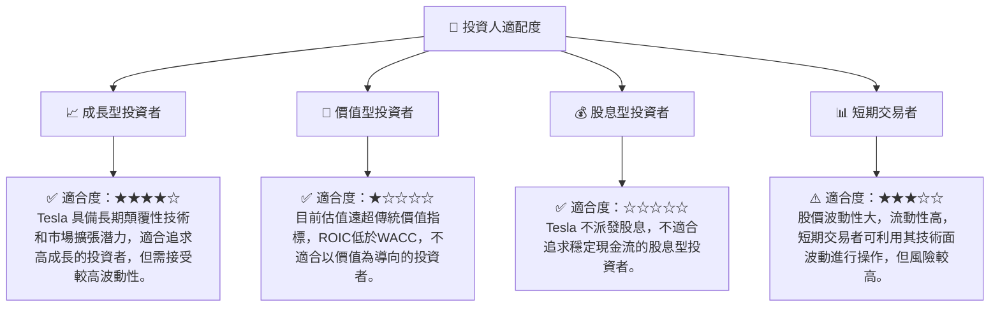

### 10.5 關鍵監控指標

| 監控類型 | 指標 | 關注點 | 頻率 |
|----------|------|----------|------|
| **營收成長** | 總營收 YoY/QoQ 成長率 | 關注是否能擺脫負增長，恢復穩定增長，尤其關注汽車交付量。 | 每季 |
| **盈利能力** | 毛利率、營業利益率 | 監測價格戰對利潤的影響，以及新產品和效率提升能否改善利潤率。 | 每季 |
| **資本效率** | ROIC vs WACC | 確保公司能夠創造股東價值，ROIC 必須提升至高於 WACC。 | 每年 |
| **自動駕駛** | FSD 普及率、技術進展、監管態度 | 這是其高估值的核心驅動因素，關注其商業化進程和相關法規。 | 持續 |
| **能源業務** | 能源儲存和太陽能產品營收增長 | 關注多元化戰略的執行情況和對整體盈利的貢獻。 | 每季 |
| **競爭格局** | 行業價格戰、新進入者、技術突破 | 密切關注競爭對手的動向，特別是來自中國 EV 廠商的挑戰。 | 持續 |
| **財務健康** | 淨現金狀況、流動性比率 | 確保公司擁有充足的現金流和穩健的財務結構以支持擴張和應對風險。 | 每季 |
| **管理層** | CEO 決策、戰略執行 | 關注管理層的決策對公司長期發展的影響。 | 持續 |

---

> **免責聲明**：本報告為 AI 自動生成，僅供研究參考，不構成投資建議。投資有風險，入市需謹慎。