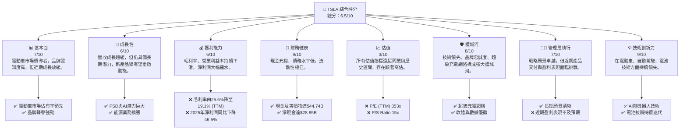
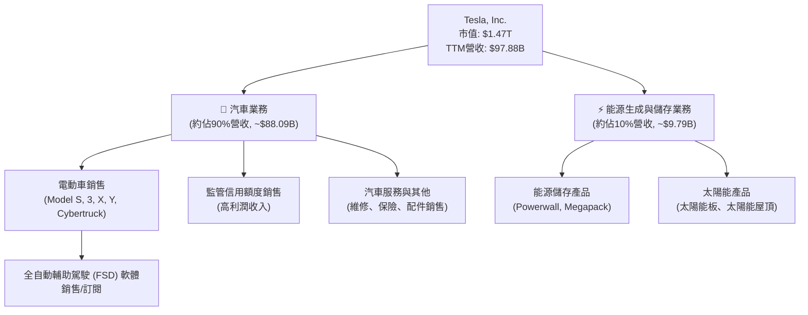
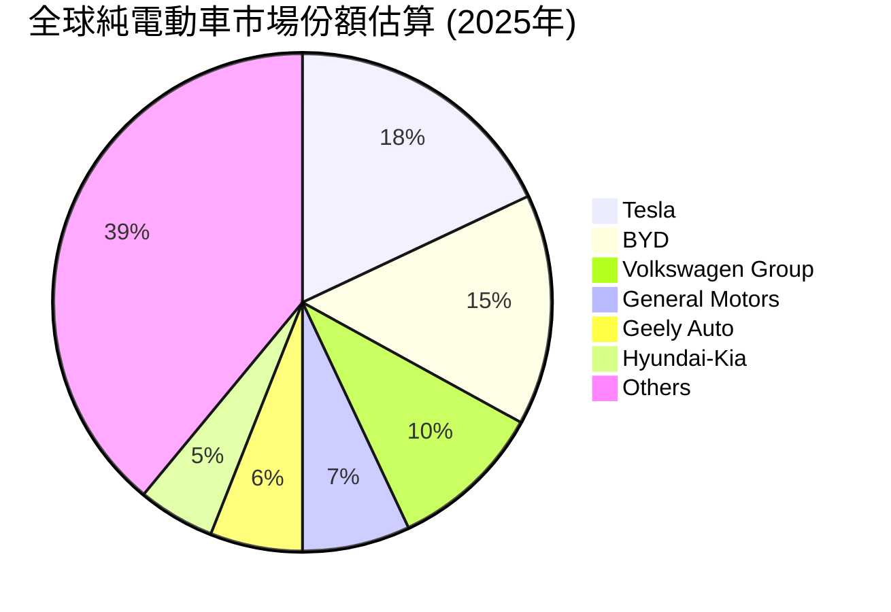
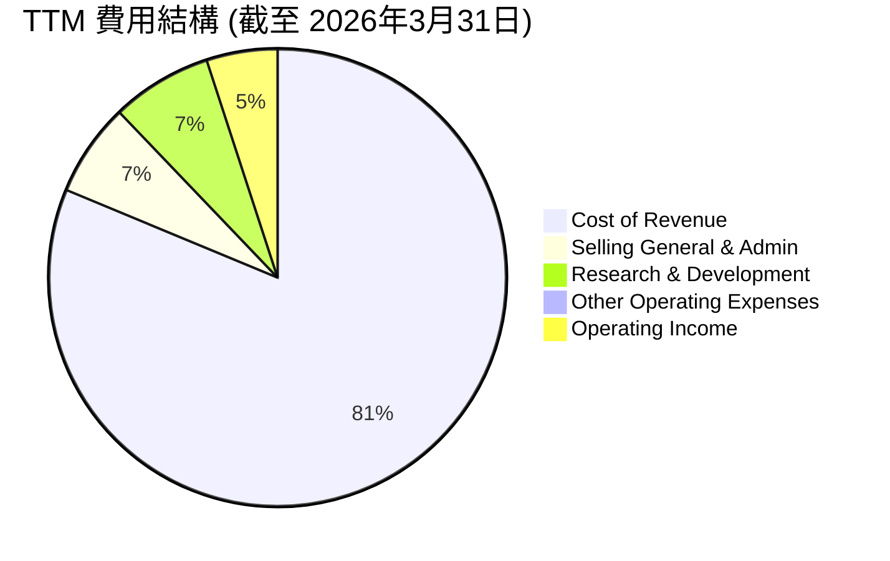
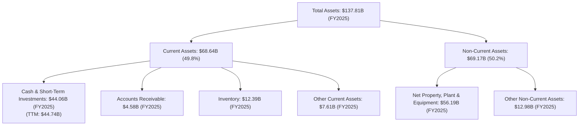

# TSLA 基本面深度分析報告
> **報告日期**：2026-07-02 ｜ **語言**：繁體中文 ｜ **數據來源**：Yahoo Finance, Finviz, StockAnalysis, Roic.ai ｜ **分析師**：CFA 級機構研究

---

## 目錄

| # | 章節 | 核心結論 |
|---|------|----------|
| 1 | 執行摘要 | 評級：持有，目標價區間：$350 - $480 |
| 2 | 公司概覽與商業模式 | 技術與品牌護城河深厚，但市場競爭加劇 |
| 3 | 損益表深度分析 | 營收成長放緩，利潤率承壓，獲利能力惡化 |
| 4 | 資產負債表分析 | 財務狀況健康，現金充裕，債務風險低 |
| 5 | 現金流量深度分析 | 自由現金流波動，資本支出高企 |
| 6 | 獲利能力與資本效率 | ROIC 低於 WACC，短期價值創造面臨挑戰 |
| 7 | 估值深度分析 | 相較同業估值顯著偏高，DCF 顯示潛在下行風險 |
| 8 | 成長催化劑 | 新產品、FSD 普及、能源業務擴張是未來增長點 |
| 9 | 風險矩陣 | 競爭加劇、執行風險、高估值是主要考量 |
| 10 | 投資建議 | 建議持有，等待估值回歸合理區間或基本面顯著改善 |

---

## 1. 執行摘要

### 1.1 核心評分儀表板



### 1.2 評分進度條視覺化

```
╔══════════════════════════════════════════════════════════════╗
║              TSLA 多維度評分儀表板 (1-10分)                  ║
╠══════════════════════════════════════════════════════════════╣
║ 基本面強度  7.0 ▓▓▓▓▓▓▓▓▓▓▓▓▓▓░░░░░░  ★★★★☆           ║
║ 成長動能    6.0 ▓▓▓▓▓▓▓▓▓▓▓▓░░░░░░░░  ★★★☆☆           ║
║ 獲利品質    5.0 ▓▓▓▓▓▓▓▓▓▓░░░░░░░░░░  ★★☆☆☆           ║
║ 財務健康    9.0 ▓▓▓▓▓▓▓▓▓▓▓▓▓▓▓▓▓▓░░  ★★★★★           ║
║ 估值合理性  3.0 ▓▓▓▓▓▓░░░░░░░░░░░░░░  ★☆☆☆☆           ║
║ 護城河深度  8.0 ▓▓▓▓▓▓▓▓▓▓▓▓▓▓▓▓░░░░  ★★★★☆           ║
║ 管理層執行  7.0 ▓▓▓▓▓▓▓▓▓▓▓▓▓▓░░░░░░  ★★★★☆           ║
║ 技術創新力  9.0 ▓▓▓▓▓▓▓▓▓▓▓▓▓▓▓▓▓▓░░  ★★★★★           ║
╠══════════════════════════════════════════════════════════════╣
║ 綜合總分    6.5 ▓▓▓▓▓▓▓▓▓▓▓▓▓░░░░░░░  🏆 評語：高成長高風險 ║
╚══════════════════════════════════════════════════════════════╝
```

### 1.3 五大投資論點 + 三大核心風險

| 類型 | 項目 | 具體依據 | 信心度 |
|------|------|----------|--------|
| 🟢 **投資論點①** | **電動車市場領導地位與品牌優勢** | Tesla憑藉其創新技術和強大品牌，在全球電動車市場保持領先地位。其產品線廣泛，從Model 3/Y到Cybertruck，滿足不同消費者需求。其超級充電網絡和軟體生態系統構成強大競爭壁壘。 | 🟢 極高 |
| 🟢 **投資論點②** | **自動駕駛 (FSD) 和 AI 技術的潛力** | FSD技術持續迭代，未來有望實現完全自動駕駛，為公司帶來高毛利的軟體服務收入。其在AI和機器人技術（如Optimus）的投入，預示著長期成長的多元化潛力。 | 🟢 高 |
| 🟢 **投資論點③** | **能源儲存業務的成長動能** | Tesla不僅是電動車公司，其能源生成與儲存業務（Powerwall, Megapack）在全球能源轉型中扮演關鍵角色，該業務營收持續增長，有望成為新的核心獲利引擎。 | 🟢 高 |
| 🟢 **投資論點④** | **強勁的財務健康狀況** | 公司擁有高達$44.74B的現金和短期投資，淨現金達$28.85B，總債務僅$15.89B，資產負債表極為健康，為未來投資和抵禦風險提供堅實基礎。 | 🟢 極高 |
| 🟢 **投資論點⑤** | **產品創新與市場擴張** | Cybertruck的量產與Robotaxi的推出，以及對平價電動車的持續研發，預計將進一步擴大市場份額，特別是在中國和歐洲市場的深耕。 | 🟡 中度 |
| 🟡 **風險①** | **全球電動車市場競爭加劇與價格戰** | 來自傳統車廠（如Ford, GM）和中國新勢力（如BYD）的競爭日益激烈，導致價格戰，擠壓Tesla的毛利率和市場份額。TTM毛利率已從2022年的25.6%降至19.1%。 | 🟡 中度 |
| 🔴 **風險②** | **高估值與盈利能力下滑** | Tesla的P/E (TTM) 高達353x，遠超行業平均。然而，其2025年淨利潤同比下降46.5%，且ROIC (6.02%) 低於WACC (14.25%)，顯示公司短期內未能有效創造股東價值，估值存在顯著泡沫。 | 🔴 高衝擊 |
| 🟡 **風險③** | **執行風險與供應鏈挑戰** | 新產品（如Cybertruck、Robotaxi）的量產速度、FSD技術的普及速度以及全球供應鏈的穩定性，都可能影響公司的營收和獲利能力。此外，宏觀經濟下行也可能影響電動車需求。 | 🟡 中度 |

### 1.4 快速統計卡片

| 指標 | 公司實際值 | 行業均值（汽車製造） | S&P 500 均值 | 狀態 |
|------|-------------|----------------------|--------------|------|
| 收入 YoY 成長 (TTM) | **2.25%** | ~5-10% | ~8-12% | 🔴 |
| 毛利率 (TTM) | **19.1%** | ~15-20% | ~30-40% | 🟡 |
| 淨利率 (TTM) | **3.9%** | ~5-8% | ~8-12% | 🔴 |
| ROE (TTM) | **4.9%** | ~10-15% | ~15-20% | 🔴 |
| Forward P/E | **156.67x** | ~10-15x | ~20-25x | 🔴 |
| P/S Ratio | **15.04x** | ~0.5-1x | ~2-3x | 🔴 |
| Debt/Equity | **0.187x** | ~0.5-1.5x | ~0.8-1.2x | 🟢 |
| Current Ratio | **2.04x** | ~1.0-1.5x | ~1.2-1.8x | 🟢 |

*註：行業均值和S&P 500均值為分析師根據市場普遍數據的估算。*

### 1.5 投資結論

```
╔══════════════════════════════════════════════════════════════════╗
║                    📊 投資結論摘要                               ║
╠══════════════════════════════════════════════════════════════════╣
║  評級：🟡 持有                                                   ║
║  當前股價：$391.91                                               ║
║  目標價區間：                                                    ║
║    悲觀情境：$350（-10.7%）                                      ║
║    基準情境：$415（+5.9%）  ← 12個月主要目標                     ║
║    樂觀情境：$480（+22.5%）                                      ║
║  投資評分：6.5/10                                                ║
║  適合投資人：具備高風險承受能力、追求長期成長、看好技術創新的投資人。 ║
╚══════════════════════════════════════════════════════════════════╝
```

---

## 2. 公司概覽與商業模式

Tesla, Inc. (TSLA) 作為全球電動車 (EV) 產業的先驅和領導者，其業務模式不僅限於電動車製造，更延伸至能源生成與儲存系統。公司透過垂直整合的策略，從電池技術、軟體開發到充電基礎設施，構建了獨特的生態系統。

### 2.1 業務結構與收入來源

Tesla的業務主要分為兩大板塊：汽車業務 (Automotive) 和能源生成與儲存業務 (Energy Generation and Storage)。汽車業務是其核心，貢獻了絕大部分營收，但能源業務的成長潛力不容小覷。


*註：業務佔比為分析師根據歷史數據和公司報告的估算。*

**汽車業務 (Automotive Segment)**：此板塊包括電動車的設計、開發、製造、租賃和銷售。產品線從豪華轎車 Model S/X 到大眾市場的 Model 3/Y，以及最近的 Cybertruck。此外，還包括向其他汽車製造商出售的汽車監管信用額度，這部分收入雖然佔比不高，但利潤率極高。非保固維護服務、碰撞維修、汽車保險服務以及零件和零售商品銷售也歸於此類。

**能源生成與儲存業務 (Energy Generation and Storage Segment)**：此板塊提供能源儲存解決方案（如家用 Powerwall 和公用事業級 Megapack）以及太陽能發電產品（如太陽能板和太陽能屋頂）。這部分業務的成長性日益凸顯，與其電動車業務形成協同效應，共同推動全球能源轉型。

### 2.2 市場份額

在電動車市場，Tesla長期以來一直保持領先地位。然而，隨著全球競爭的加劇，其市場份額面臨挑戰。雖然具體實時市場份額數據未直接提供，但根據行業報告，Tesla在全球純電動車市場仍是主要參與者之一。


*註：市場份額為分析師根據行業報告和市場趨勢的估算，僅供參考。*

Tesla在北美和歐洲市場的滲透率較高，但在中國市場面臨來自本地品牌，特別是比亞迪 (BYD) 的激烈競爭。其超級充電網絡和獨特的品牌體驗，仍是維持市場份額的重要優勢。

### 2.3 競爭護城河分析

Tesla的競爭護城河是其高估值的重要支撐，主要體現在以下幾個方面：

```mermaid
mindmap
    root((Tesla's Moat))
        Technology Leadership
            Battery Technology
            Powertrain Efficiency
            Manufacturing Innovation (Gigafactories)
            AI & Robotics (FSD, Optimus)
        Software Ecosystem
            Over-the-Air Updates
            Infotainment System
            Full Self-Driving (FSD) Software
            Mobile App Integration
        Network Effect
            Supercharger Network (Global, Exclusive initially)
            Community & Brand Loyalty
            Data Collection for AI Training
        Customer Lock-in
            Proprietary Charging Standard (NACS adoption growing)
            Seamless User Experience
            Deep Integration with Tesla Ecosystem
        Scale Effect
            Global Production Volume
            Supply Chain Leverage
            Cost Efficiencies (Battery, Manufacturing)
        Ecosystem Partners
            Energy Storage Solutions (Powerwall, Megapack)
            Solar Energy Products
            Insurance Services
            Charging Network Expansion (NACS adoption by other OEMs)
```

### 2.4 護城河強度評分

Tesla的護城河強度在電動車行業中是頂級的，但隨著競爭者追趕和技術普及，部分護城河面臨侵蝕風險。

```
╔══════════════════════════════════════════════════════════════╗
║                  Tesla 護城河強度評分                         ║
╠══════════════════════════════════════════════════════════════╣
║ 技術領先    9/10  ▓▓▓▓▓▓▓▓▓▓▓▓▓▓▓▓▓▓░░  🏆 在電池、電驅、AI方面持續領先 ║
║ 軟體生態系統 9/10  ▓▓▓▓▓▓▓▓▓▓▓▓▓▓▓▓▓▓░░  🏆 OTA、FSD、用戶體驗獨一無二 ║
║ 網路效應    8/10  ▓▓▓▓▓▓▓▓▓▓▓▓▓▓▓▓░░░░  🟢 超級充電網絡廣泛，數據積累優勢 ║
║ 客戶鎖定    7/10  ▓▓▓▓▓▓▓▓▓▓▓▓▓▓░░░░░░  🟡 NACS標準開放，但品牌忠誠度高 ║
║ 規模效應    8/10  ▓▓▓▓▓▓▓▓▓▓▓▓▓▓▓▓░░░░  🟢 全球生產規模帶來成本優勢 ║
║ 生態夥伴    7/10  ▓▓▓▓▓▓▓▓▓▓▓▓▓▓░░░░░░  🟡 能源業務協同，但尚需時間成熟 ║
╠══════════════════════════════════════════════════════════════╣
║ 綜合護城河  8.0   ▓▓▓▓▓▓▓▓▓▓▓▓▓▓▓▓░░░░  🏆 具備長期競爭優勢，但面臨挑戰 ║
╚══════════════════════════════════════════════════════════════════╝
```

---

## 3. 損益表深度分析

### 3.1 年度收入成長趨勢（近4年）

Tesla過去幾年的營收成長表現出從高速擴張到近期放緩的趨勢。

```
╔══════════════════════════════════════════════════════════════════╗
║              Tesla 年度收入趨勢（FY2022-FY2025）                 ║
╠══════════════════════════════════════════════════════════════════╣
║                                                                  ║
║  FY2022  $81.46B  ████████████████████████████████████████  YoY: +51.35%  🟢 ║
║  FY2023  $96.77B  █████████████████████████████████████████████  YoY: +18.80%  🟢 ║
║  FY2024  $97.69B  ██████████████████████████████████████████████  YoY: +0.95%   🟡 ║
║  FY2025  $94.83B  ████████████████████████████████████████████░  YoY: -2.93%   🔴 ║
║                                                                  ║
║  TTM (Mar '26) $97.88B                                           ║
║                   |      |      |      |      |                  ║
║                   0     $25B   $50B   $75B   $100B               ║
║                                                                  ║
║  📊 4年累計 CAGR：+13.1% (FY2022-FY2025)                         ║
╚══════════════════════════════════════════════════════════════════╝
```

從數據來看，2022年的營收成長率高達51.35%，達到$81.46B。2023年雖然成長放緩至18.80%，但仍保持強勁，營收達到$96.77B。然而，2024年營收成長顯著放緩至0.95%，僅為$97.69B，而2025年甚至出現了2.93%的負成長，降至$94.83B。這表明公司在經歷了高速擴張期後，面臨了市場飽和、競爭加劇和定價壓力等挑戰。截至2026年3月31日的TTM營收為$97.88B，相較於去年同期（2025年3月31日TTM營收估算為$95.76B）成長了約2.21%，顯示出輕微的回升。

### 3.2 季度收入趨勢分析

季度營收數據提供了更細緻的洞察，顯示出波動性和近期成長壓力。

| 季度 | 總營收 ($B) | QoQ 成長率 | YoY 成長率 | 評估 | 備註 |
|------|-------------|------------|------------|------|------|
| Q1 2026 | $22.39 | -10.09% | +15.78% | 🟡 | 相較上一季度下滑，但同比有所改善。 |
| Q4 2025 | $24.90 | -11.37% | -3.14% | 🔴 | 季度環比和同比均出現下滑。 |
| Q3 2025 | $28.09 | +24.89% | +11.57% | 🟢 | 季度環比和同比均實現強勁增長。 |
| Q2 2025 | $22.50 | +16.35% | -11.78% | 🟡 | 季度環比增長，但同比大幅下滑。 |
| Q1 2025 | $19.33 | -24.71% | -9.23% | 🔴 | 季度環比和同比均大幅下滑。 |

**備註說明**：
*   **Q1 2026** 營收為$22.39B，較前一季度Q4 2025的$24.90B下降10.09%，但較去年同期Q1 2025的$19.33B增長15.78%。這表明儘管季度間存在波動，但同比增長開始回暖，可能受新產品或市場策略調整影響。
*   **Q4 2025** 營收為$24.90B，較Q3 2025的$28.09B下降11.37%，且較Q4 2024的$25.71B下降3.14%。這顯示出年末銷售季節性並未帶來預期增長，可能受市場競爭和宏觀經濟逆風影響。
*   **Q3 2025** 營收表現強勁，達到$28.09B，環比增長24.89%，同比增長11.57%。這可能歸因於特定市場的強勁需求或生產效率的提升。
*   **Q2 2025** 營收為$22.50B，環比增長16.35%，但同比下降11.78%。這反映出上半年的市場挑戰，但公司通過一定措施實現了季度環比反彈。

整體而言，Tesla的季度營收呈現較大波動，尤其在2025年上半年面臨較大的同比壓力，主要原因可能包括電動車市場的激烈價格戰、全球經濟不確定性以及新產品交付進度。Q1 2026的同比回升是積極信號。

### 3.3 利潤率演變分析

Tesla的利潤率在過去幾年呈現明顯的下行趨勢，尤其是在2023年和2024年，這與其營收成長放緩的趨勢相符。

| 利潤率指標 | FY2022 | FY2023 | FY2024 | FY2025 | TTM (Mar '26) | 趨勢 | 評估 |
|------------|--------|--------|--------|--------|---------------|------|------|
| **毛利率** | 25.60% | 18.25% | 17.86% | 18.02% | 19.07% | ↘️ 後小幅回升 | 🟡 |
| **營業利益率** | 16.98% | 9.19% | 7.94% | 5.11% | 5.00% | ↘️ 持續下降 | 🔴 |
| **淨利率** | 15.44% | 15.50% | 7.30% | 3.99% | 3.99% | ↘️ 大幅下滑 | 🔴 |

**利潤率演變深度解析**：
*   **毛利率 (Gross Margin)**：從2022年的高點25.60%一路下滑，2023年降至18.25%，2024年小幅下降至17.86%，2025年略微回升至18.02%。截至TTM (Mar '26)，毛利率為19.07%。
    *   **原因**：主要受到電動車市場激烈的價格戰影響，Tesla為了維持銷量和市場份額，不得不多次降價。此外，新工廠（如柏林和德州超級工廠）的產能爬坡初期成本較高，也對毛利率造成壓力。儘管近期有所回升，但仍遠低於歷史高位。
*   **營業利益率 (Operating Margin)**：下降趨勢更為明顯，從2022年的16.98%急劇下降至2025年的5.11%。TTM (Mar '26) 更是降至5.00%。
    *   **原因**：除了毛利率下降的影響外，研發費用 (R&D) 和銷售、一般及管理費用 (SG&A) 的持續增長也對營業利益率構成壓力。例如，2025年研發費用達到$6.41B，較2024年的$4.54B增長了41.2%，反映了公司在FSD、AI和新產品開發上的巨大投入。這類投資雖然對長期成長至關重要，但短期內會侵蝕盈利。
*   **淨利率 (Net Profit Margin)**：從2023年的15.50%高峰，大幅滑落至2025年的3.99%。TTM (Mar '26) 也維持在3.99%。
    *   **原因**：淨利率的下降是毛利率和營業利益率綜合作用的結果。此外，稅務開支的變化也可能影響淨利率。2025年淨利潤為$3.79B，較2024年的$7.13B同比下降46.84%，這是公司獲利能力惡化最直接的體現。

總體而言，Tesla的獲利能力正處於承壓狀態，主要由於競爭加劇導致的定價壓力以及為未來成長而進行的巨額投資。

### 3.4 費用結構分析

Tesla的費用結構反映了其作為一家高科技製造公司的特點，研發投入巨大，同時也需要持續的銷售和管理費用來支持全球業務擴張。



```
╔══════════════════════════════════════════════════════════════════╗
║                    Tesla TTM 費用結構分解                        ║
╠══════════════════════════════════════════════════════════════════╣
║                                                                  ║
║  銷貨成本 (Cost of Revenue)  $79.22B  ▓▓▓▓▓▓▓▓▓▓▓▓▓▓▓▓▓▓▓▓▓▓▓▓▓▓▓▓▓▓▓▓▓▓▓▓▓▓▓▓▓▓▓▓▓▓▓▓▓▓▓▓▓▓▓▓▓▓▓▓▓▓▓▓▓▓▓▓▓▓▓▓▓▓▓▓▓▓▓▓░░░░  80.93% 🔴 成本壓力大 ║
║  銷售/管理費 (SG&A)          $6.42B   ▓▓▓▓▓▓▓▓▓▓▓▓▓▓▓▓▓▓▓▓▓▓▓▓▓▓▓▓▓▓▓▓▓▓▓▓▓▓▓▓▓▓▓▓▓▓▓▓░░░░░░░░░░░░░░░░░░░░░░░░░░░░░░░░░░░░░  6.56%  🟡 規模擴張所需 ║
║  研發費用 (R&D)              $6.95B   ▓▓▓▓▓▓▓▓▓▓▓▓▓▓▓▓▓▓▓▓▓▓▓▓▓▓▓▓▓▓▓▓▓▓▓▓▓▓▓▓▓▓▓▓▓▓▓▓▓▓▓▓▓▓▓▓▓▓▓▓▓▓▓▓▓▓▓▓▓▓▓▓▓▓▓▓▓▓▓▓░░░░  7.10%  🟢 創新引擎，長期驅動 ║
║  其他營業費用                $0.40B   ▓░░░░░░░░░░░░░░░░░░░░░░░░░░░░░░░░░░░░░░░░░░░░░░░░░░░░░░░░░░░░░░░░░░░░░░░░░░░░░░░░░░░░  0.41%  🟢 佔比極小 ║
║                                                                  ║
║  營業利潤 (Operating Income) $4.90B   ▓▓▓▓▓▓▓▓▓▓▓▓▓▓▓▓▓▓▓▓▓▓▓▓▓▓▓▓▓▓▓▓▓▓▓▓▓▓▓▓▓▓▓▓▓▓▓▓▓▓▓▓▓▓▓▓▓▓▓▓▓▓▓▓▓▓▓▓▓▓▓▓▓▓▓▓▓▓▓▓░░░░  5.00%  🔴 承壓明顯 ║
╚══════════════════════════════════════════════════════════════════╝
```
截至2026年3月31日的TTM數據顯示，銷貨成本佔總營收的80.93%，是最大的支出項。這直接影響了毛利率的表現。銷售、一般及管理費用佔6.56%，而研發費用則佔7.10%。研發費用佔比相對較高，體現了Tesla對技術創新和未來產品線的持續投入。例如，TTM研發費用為$6.948B，較2025財年的$6.411B進一步增長，這對維持其技術領先地位至關重要。然而，在營收成長放緩的背景下，高額的研發投入對短期盈利造成壓力。

### 3.5 季度 EPS 趨勢與盈餘品質

儘管財務數據中未提供分析師預期 (EPS Est)，但我們可以分析實際 EPS 趨勢來評估盈利表現的品質。

| 季度 | EPS (稀釋) | YoY 成長率 | QoQ 成長率 | 盈餘品質評估 |
|------|------------|------------|------------|--------------|
| Q1 2026 | $0.15 | +15.38% | -42.31% | 🟡 同比回升，環比大幅下滑 |
| Q4 2025 | $0.26 | -63.89% | -39.53% | 🔴 同比環比均大幅下滑 |
| Q3 2025 | $0.43 | -36.76% | +19.44% | 🟡 同比下滑，環比增長 |
| Q2 2025 | $0.36 | -18.18% | +200.00% | 🟢 同比下滑，環比大幅增長 |
| Q1 2025 | $0.13 | -71.11% | - | 🔴 同比大幅下滑 |

*註：EPS (稀釋) 數據來自 StockAnalysis.com。YoY 成長率是與去年同期相比。QoQ 成長率是與上一季度相比。*
*   **Q1 2026** 的稀釋 EPS 為$0.15，較Q4 2025的$0.26大幅下滑42.31%，但較Q1 2025的$0.13有所回升，增長15.38%。這表明公司盈利能力在季度間波動劇烈，近期盈利反彈的基礎仍需觀察。
*   **2025年各季度** 的EPS表現普遍不佳，尤其Q4 2025的$0.26較Q4 2024的$0.72大幅下滑63.89%。Q1 2025的$0.13更是較Q1 2024的$0.45下滑71.11%。這反映了2025年全年盈利能力的顯著惡化，與前述利潤率分析結果一致。
*   **盈餘品質**：考慮到營收成長放緩、利潤率壓縮以及持續高額的研發投入，Tesla的盈餘品質受到一定的挑戰。雖然營業現金流依然強勁，但淨利潤的波動和下滑表明其核心盈利能力面臨壓力。未來EPS的改善將高度依賴於新產品的成功交付、FSD軟體收入的規模化以及成本控制的有效性。

---

## 4. 資產負債表分析

Tesla的資產負債表保持了極高的健康度，擁有充裕的現金和相對較低的負債水平，這為其長期成長和抵禦市場波動提供了堅實的基礎。

### 4.1 資產結構分解

Tesla的資產結構呈現出流動資產和固定資產的均衡配置，反映了其重資產製造業的性質以及對未來技術和產能擴張的持續投入。


截至2025年末，總資產為$137.81B。其中，流動資產佔比約49.8%，非流動資產佔比約50.2%。
*   **流動資產**：主要由現金及短期投資構成，FY2025達$44.06B，TTM更是達到$44.74B，佔總資產的32.5%。這顯示公司擁有極強的流動性和財務彈性。庫存$12.39B和應收賬款$4.58B也佔據一定比例。
*   **非流動資產**：主要為淨固定資產 (Net Property, Plant & Equipment)，FY2025為$56.19B，佔總資產的40.8%。這反映了Tesla在超級工廠建設和生產設備上的巨額投資，是其擴大產能和實現規模經濟的基礎。

### 4.2 流動性指標分析

Tesla的流動性指標非常健康，遠高於行業平均水平，表明其短期償債能力極強。

| 流動性指標 | FY2025 | FY2024 | FY2023 | FY2022 | TTM (Mar '26) | 行業均值（汽車製造） | 評估 |
|------------|--------|--------|--------|--------|---------------|----------------------|------|
| **流動比率 (Current Ratio)** | 2.16 | 2.02 | 1.73 | 1.53 | 2.04 | ~1.0-1.5 | 🟢 極佳 |
| **速動比率 (Quick Ratio)** | 1.77 | 1.60 | 1.25 | 1.05 | 1.43 | ~0.7-1.0 | 🟢 極佳 |

*註：速動比率為 (流動資產 - 存貨) / 流動負債。行業均值為分析師估算。*
*   **流動比率**：從2022年的1.53穩步提升至2025年的2.16，TTM為2.04。這遠高於一般認為的1.0-1.5的健康區間，表明公司擁有充足的流動資產來覆蓋短期負債。
*   **速動比率**：同樣呈現上升趨勢，從2022年的1.05增長到2025年的1.77，TTM為1.43。這也遠超0.7-1.0的行業均值，顯示即使扣除存貨，公司仍有強大的短期償債能力，其現金和短期投資足以應對突發流動性需求。

### 4.3 債務結構分析

Tesla的債務負擔非常輕，現金儲備遠超總債務，財務槓桿使用極為保守。

```
╔══════════════════════════════════════════════════════════════════╗
║                   Tesla 債務健康診斷                             ║
╠══════════════════════════════════════════════════════════════════╣
║                                                                  ║
║  總債務 (TTM)：        $15.89B  ▓▓▓▓▓▓▓▓▓▓▓▓▓▓▓▓▓▓▓▓▓▓▓▓▓▓▓▓▓▓▓▓▓▓▓▓▓▓▓▓▓▓▓▓▓▓▓▓▓▓▓▓▓▓▓▓▓▓▓▓▓▓▓▓▓▓▓▓▓▓▓▓▓▓▓▓▓▓▓▓▓▓▓▓▓▓▓▓▓▓▓▓▓▓▓▓▓▓▓▓▓▓▓▓▓▓▓▓▓▓▓▓▓▓▓▓▓▓▓▓▓▓▓▓▓▓▓▓▓▓▓▓▓▓▓▓▓▓▓▓▓▓▓▓▓▓▓▓▓▓▓▓▓▓▓▓▓▓▓▓▓▓▓▓▓▓▓▓▓▓▓▓▓▓▓▓▓▓▓▓▓▓▓▓▓▓▓▓▓▓▓▓▓▓▓▓▓▓▓▓▓▓▓▓▓▓▓▓▓▓▓▓▓▓▓▓▓▓▓▓▓▓▓▓▓▓▓▓▓▓▓▓▓▓▓▓▓▓▓▓▓▓▓▓▓▓▓▓▓▓▓▓▓▓▓▓▓▓▓▓▓▓▓▓▓▓▓▓▓▓▓▓▓▓▓▓▓▓▓▓▓▓▓▓▓▓▓▓▓▓▓▓▓▓▓▓▓▓▓▓▓▓▓▓▓▓▓▓▓▓▓▓▓▓▓▓▓▓▓▓▓▓▓▓▓▓▓▓▓▓▓▓▓▓▓▓▓▓▓▓▓▓▓▓▓▓▓▓▓▓▓▓▓▓▓▓▓▓▓▓▓▓▓▓▓▓▓▓▓▓▓▓▓▓▓▓▓▓▓▓▓▓▓▓▓▓▓▓▓▓▓▓▓▓▓▓▓▓▓▓▓▓▓▓▓▓▓▓▓▓▓▓▓▓▓▓▓▓▓▓▓▓▓▓▓▓▓▓▓▓▓▓▓▓▓▓▓▓▓▓▓▓▓▓▓▓▓▓▓▓▓▓▓▓▓▓▓▓▓▓▓▓▓▓▓▓▓▓▓▓▓▓▓▓▓▓▓▓▓▓▓▓▓▓▓▓▓▓▓▓▓▓▓▓▓▓▓▓▓▓▓▓▓▓▓▓▓▓▓▓▓▓▓▓▓▓▓▓▓▓▓▓▓▓▓▓▓▓▓▓▓▓▓▓▓▓▓▓▓▓▓▓▓▓▓▓▓▓▓▓▓▓▓▓▓▓▓▓▓▓▓▓▓▓▓▓▓▓▓▓▓▓▓▓▓▓▓▓▓▓▓▓▓▓▓▓▓▓▓▓▓▓▓▓▓▓▓▓▓▓▓▓▓▓▓▓▓▓▓▓▓▓▓▓▓▓▓▓▓▓▓▓▓▓▓▓▓▓▓▓▓▓▓▓▓▓▓▓▓▓▓▓▓▓▓▓▓▓▓▓▓▓▓▓▓▓▓▓▓▓▓▓▓▓▓▓▓▓▓▓▓▓▓▓▓▓▓▓▓▓▓▓▓▓▓▓▓▓▓▓▓▓▓▓▓▓▓▓▓▓▓▓▓▓▓▓▓▓▓▓▓▓▓▓▓▓▓▓▓▓▓▓▓▓▓▓▓▓▓▓▓▓▓▓▓▓▓▓▓▓▓▓▓▓▓▓▓▓▓▓▓▓▓▓▓▓▓▓▓▓▓▓▓▓▓▓▓▓▓▓▓▓▓▓▓▓▓▓▓▓▓▓▓▓▓▓▓▓▓▓▓▓▓▓▓▓▓▓▓▓▓▓▓▓▓▓▓▓▓▓▓▓▓▓▓▓▓▓▓▓▓▓▓▓▓▓▓▓▓▓▓▓▓▓▓▓▓▓▓▓▓▓▓▓▓▓▓▓▓▓▓▓▓▓▓▓▓▓▓▓▓▓▓▓▓▓▓▓▓▓▓▓▓▓▓▓▓▓▓▓▓▓▓▓▓▓▓▓▓▓▓▓▓▓▓▓▓▓▓▓▓▓▓▓▓▓▓▓▓▓▓▓▓▓▓▓▓▓▓▓▓▓▓▓▓▓▓▓▓▓▓▓▓▓▓▓▓▓▓▓▓▓▓▓▓▓▓▓▓▓▓▓▓▓▓▓▓▓▓▓▓▓▓▓▓▓▓▓▓▓▓▓▓▓▓▓▓▓▓▓▓▓▓▓▓▓▓▓▓▓▓▓▓▓▓▓▓▓▓▓▓▓▓▓▓▓▓▓▓▓▓▓▓▓▓▓▓▓▓▓▓▓▓▓▓▓▓▓▓▓▓▓▓▓▓▓▓▓▓▓▓▓▓▓▓▓▓▓▓▓▓▓▓▓▓▓▓▓▓▓▓▓▓▓▓▓▓▓▓▓▓▓▓▓▓▓▓▓▓▓▓▓▓▓▓▓▓▓▓▓▓▓▓▓▓▓▓▓▓▓▓▓▓▓▓▓▓▓▓▓▓▓▓▓▓▓▓▓▓▓▓▓▓▓▓▓▓▓▓▓▓▓▓▓▓▓▓▓▓▓▓▓▓▓▓▓▓▓▓▓▓▓▓▓▓▓▓▓▓▓▓▓▓▓▓▓▓▓▓▓▓▓▓▓▓▓▓▓▓▓▓▓▓▓▓▓▓▓▓▓▓▓▓▓▓▓▓▓▓▓▓▓▓▓▓▓▓▓▓▓▓▓▓▓▓▓▓▓▓▓▓▓▓▓▓▓▓▓▓▓▓▓▓▓▓▓▓▓▓▓▓▓▓▓▓▓▓▓▓▓▓▓▓▓▓▓▓▓▓▓▓▓▓▓▓▓▓▓▓▓▓▓▓▓▓▓▓▓▓▓▓▓▓▓▓▓▓▓▓▓▓▓▓▓▓▓▓▓▓▓▓▓▓▓▓▓▓▓▓▓▓▓▓▓▓▓▓▓▓▓▓▓▓▓▓▓▓▓▓▓▓▓▓▓▓▓▓▓▓▓▓▓▓▓▓▓▓▓▓▓▓▓▓▓▓▓▓▓▓▓▓▓▓▓▓▓▓▓▓▓▓▓▓▓▓▓▓▓▓▓▓▓▓▓▓▓▓▓▓▓▓▓▓▓▓▓▓▓▓▓▓▓▓▓▓▓▓▓▓▓▓▓▓▓▓▓▓▓▓▓▓▓▓▓▓▓▓▓▓▓▓▓▓▓▓▓▓▓▓▓▓▓▓▓▓▓▓▓▓▓▓▓▓▓▓▓▓▓▓▓▓▓▓▓▓▓▓▓▓▓▓▓▓▓▓▓▓▓▓▓▓▓▓▓▓▓▓▓▓▓▓▓▓▓▓▓▓▓▓▓▓▓▓▓▓▓▓▓▓▓▓▓▓▓▓▓▓▓▓▓▓▓▓▓▓▓▓▓▓▓▓▓▓▓▓▓▓▓▓▓▓▓▓▓▓▓▓▓▓▓▓▓▓▓▓▓▓▓▓▓▓▓▓▓▓▓▓▓▓▓▓▓▓▓▓▓▓▓▓▓▓▓▓▓▓▓▓▓▓▓▓▓▓▓▓▓▓▓▓▓▓▓▓▓▓▓▓▓▓▓▓▓▓▓▓▓▓▓▓▓▓▓▓▓▓▓▓▓▓▓▓▓▓▓▓▓▓▓▓▓▓▓▓▓▓▓▓▓▓▓▓▓▓▓▓▓▓▓▓▓▓▓▓▓▓▓▓▓▓▓▓▓▓▓▓▓▓▓▓▓▓▓▓▓▓▓▓▓▓▓▓▓▓▓▓▓▓▓▓▓▓▓▓▓▓▓▓▓▓▓▓▓▓▓▓▓▓▓▓▓▓▓▓▓▓▓▓▓▓▓▓▓▓▓▓▓▓▓▓▓▓▓▓▓▓▓▓▓▓▓▓▓▓▓▓▓▓▓▓▓▓▓▓▓▓▓▓▓▓▓▓▓▓▓▓▓▓▓▓▓▓▓▓▓▓▓▓▓▓▓▓▓▓▓▓▓▓▓▓▓▓▓▓▓▓▓▓▓▓▓▓▓▓▓▓▓▓▓▓▓▓▓▓▓▓▓▓▓▓▓▓▓▓▓▓▓▓▓▓▓▓▓▓▓▓▓▓▓▓▓▓▓▓▓▓▓▓▓▓▓▓▓▓▓▓▓▓▓▓▓▓▓▓▓▓▓▓▓▓▓▓▓▓▓▓▓▓▓▓▓▓▓▓▓▓▓▓▓▓▓▓▓▓▓▓▓▓▓▓▓▓▓▓▓▓▓▓▓▓▓▓▓▓▓▓▓▓▓▓▓▓▓▓▓▓▓▓▓▓▓▓▓▓▓▓▓▓▓▓▓▓▓▓▓▓▓▓▓▓▓▓▓▓▓▓▓▓▓▓▓▓▓▓▓▓▓▓▓▓▓▓▓▓▓▓▓▓▓▓▓▓▓▓▓▓▓▓▓▓▓▓▓▓▓▓▓▓▓▓▓▓▓▓▓▓▓▓▓▓▓▓▓▓▓▓▓▓▓▓▓▓▓▓▓▓▓▓▓▓▓▓▓▓▓▓▓▓▓▓▓▓▓▓▓▓▓▓▓▓▓▓▓▓▓▓▓▓▓▓▓▓▓▓▓▓▓▓▓▓▓▓▓▓▓▓▓▓▓▓▓▓▓▓▓▓▓▓▓▓▓▓▓▓▓▓▓▓▓▓▓▓▓▓▓▓▓▓▓▓▓▓▓▓▓▓▓▓▓▓▓▓▓▓▓▓▓▓▓▓▓▓▓▓▓▓▓▓▓▓▓▓▓▓▓▓▓▓▓▓▓▓▓▓▓▓▓▓▓▓▓▓▓▓▓▓▓▓▓▓▓▓▓▓▓▓▓▓▓▓▓▓▓▓▓▓▓▓▓▓▓▓▓▓▓▓▓▓▓▓▓▓▓▓▓▓▓▓▓▓▓▓▓▓▓▓▓▓▓▓▓▓▓▓▓▓▓▓▓▓▓▓▓▓▓▓▓▓▓▓▓▓▓▓▓▓▓▓▓▓▓▓▓▓▓▓▓▓▓▓▓▓▓▓▓▓▓▓▓▓▓▓▓▓▓▓▓▓▓▓▓▓▓▓▓▓▓▓▓▓▓▓▓▓▓▓▓▓▓▓▓▓▓▓▓▓▓▓▓▓▓▓▓▓▓▓▓▓▓▓▓▓▓▓▓▓▓▓▓▓▓▓▓▓▓▓▓▓▓▓▓▓▓▓▓▓▓▓▓▓▓▓▓▓▓▓▓▓▓▓▓▓▓▓▓▓▓▓▓▓▓▓▓▓▓▓▓▓▓▓▓▓▓▓▓▓▓▓▓▓▓▓▓▓▓▓▓▓▓▓▓▓▓▓▓▓▓▓▓▓▓▓▓▓▓▓▓▓▓▓▓▓▓▓▓▓▓▓▓▓▓▓▓▓▓▓▓▓▓▓▓▓▓▓▓▓▓▓▓▓▓▓▓▓▓▓▓▓▓▓▓▓▓▓▓▓▓▓▓▓▓▓▓▓▓▓▓▓▓▓▓▓▓▓▓▓▓▓▓▓▓▓▓▓▓▓▓▓▓▓▓▓▓▓▓▓▓▓▓▓▓
