# TSLA 基本面深度分析報告
> **報告日期**：2026-07-03 ｜ **語言**：繁體中文 ｜ **數據來源**：Yahoo Finance, Finviz, StockAnalysis, Roic.ai ｜ **分析師**：CFA 級機構研究

## 目錄

| # | 章節 | 核心結論 |
|---|------|----------|
| 1 | 執行摘要 | 持有評級，目標價區間 $380 - $480 |
| 2 | 公司概覽與商業模式 | 憑藉技術、品牌與生態系統構建強大護城河 |
| 3 | 損益表深度分析 | 收入成長放緩，利潤率承壓，R&D 投入持續增加 |
| 4 | 資產負債表分析 | 財務健康，流動性充足，淨現金狀況良好 |
| 5 | 現金流量深度分析 | 自由現金流波動，資本支出高企，資本配置需優化 |
| 6 | 獲利能力與資本效率 | ROIC 低於 WACC，短期內價值創造能力受挑戰 |
| 7 | 估值深度分析 | 相較同業估值偏高，但成長潛力提供溢價空間 |
| 8 | 成長催化劑 | FSD、AI、機器人及新產品線是長期成長關鍵 |
| 9 | 風險矩陣 | 競爭加劇、執行風險與宏觀經濟逆風為主要挑戰 |
| 10 | 投資建議 | 長期持有，觀察新產品進度與利潤率改善情況 |

---

## 1. 執行摘要

Tesla (TSLA) 作為電動車及清潔能源領域的領導者，憑藉其技術創新、強大品牌影響力及獨特的商業模式，在全球市場中佔據重要地位。然而，近年來面對日益激烈的市場競爭、宏觀經濟逆風以及自身大規模擴張帶來的挑戰，公司的成長動能和盈利能力面臨考驗。本報告將基於最新的財務數據，對 TSLA 進行深度分析，評估其基本面、成長性、獲利能力、財務健康狀況及估值合理性。

### 1.1 核心評分儀表板

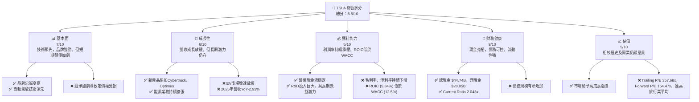

### 1.2 評分進度條視覺化

```
╔══════════════════════════════════════════════════════════════╗
║                    TSLA 多維度評分儀表板 (1-10分)             ║
╠══════════════════════════════════════════════════════════════╣
║ 基本面強度  7.0 ▓▓▓▓▓▓▓▓▓▓▓▓▓▓░░░░░░  ★★★★☆           ║
║ 成長動能    6.0 ▓▓▓▓▓▓▓▓▓▓▓▓░░░░░░░░  ★★★☆☆           ║
║ 獲利品質    5.0 ▓▓▓▓▓▓▓▓▓▓░░░░░░░░░░  ★★☆☆☆           ║
║ 財務健康    9.0 ▓▓▓▓▓▓▓▓▓▓▓▓▓▓▓▓▓▓░░  ★★★★★           ║
║ 估值合理性  5.0 ▓▓▓▓▓▓▓▓▓▓░░░░░░░░░░  ★★☆☆☆           ║
║ 護城河深度  8.0 ▓▓▓▓▓▓▓▓▓▓▓▓▓▓▓▓░░░░  ★★★★☆           ║
║ 管理層執行  7.0 ▓▓▓▓▓▓▓▓▓▓▓▓▓▓░░░░░░  ★★★★☆           ║
║ 技術創新力  9.5 ▓▓▓▓▓▓▓▓▓▓▓▓▓▓▓▓▓▓▓░  ★★★★★           ║
╠══════════════════════════════════════════════════════════════╣
║ 綜合總分    6.8 ▓▓▓▓▓▓▓▓▓▓▓▓▓░░░░░░░  🏆 具挑戰性的成長型投資  ║
╚══════════════════════════════════════════════════════════════╝
```

### 1.3 五大投資論點 + 三大核心風險

| 類型 | 項目 | 具體依據 | 信心度 |
|------|------|----------|--------|
| 🟢 **投資論點①** | **技術領先與創新能力** | Tesla 在電動車技術、電池能量密度、自動駕駛（FSD）軟體和 AI 領域持續投入。2025年研發費用達 $6.41B，佔營收 6.76%，顯示其強大的創新引擎。長期來看，FSD 和 Optimus 機器人有望開啟新的巨大市場。 | 🟢 極高 |
| 🟢 **投資論點②** | **能源業務的潛力** | 除了電動車，Tesla 的能源儲存與發電業務（Powerwall, Megapack, Solar Roof）正快速成長。此業務不僅多元化了收入來源，也強化了其在清潔能源生態系統中的地位，且利潤率潛力高於汽車業務。 | 🟢 高 |
| 🟢 **投資論點③** | **品牌影響力與全球擴張** | Tesla 擁有全球公認的強大品牌，以及高效的直營銷售與服務網絡。其全球生產基地（美國、中國、德國）佈局完善，有助於擴大市場滲透率並降低物流成本。 | 🟢 高 |
| 🟢 **投資論點④** | **財務狀況穩健** | 公司擁有 $44.74B 的充裕現金及短期投資，淨現金達 $28.85B，Current Ratio 為 2.043x，顯示極佳的流動性和償債能力，為其長期發展和資本支出提供堅實保障。 | 🟢 極高 |
| 🟢 **投資論點⑤** | **高執行力的管理層** | 在 Elon Musk 的領導下，Tesla 展現出極高的執行效率和前瞻性戰略。儘管面臨爭議，其創新思維和對成本控制、產能提升的專注是公司成功的關鍵。 | 🟡 中高 |
| 🟡 **風險①** | **競爭加劇與定價壓力** | 全球電動車市場競爭日益激烈，包括傳統車廠和新興 EV 品牌。為維持市場份額，Tesla 頻繁降價，導致毛利率從 2022 年的 25.59% 下滑至 2025 年的 18.02%，嚴重侵蝕盈利能力。 | 🔴 高衝擊 |
| 🔴 **風險②** | **監管風險與技術挑戰** | 自動駕駛技術的發展面臨嚴格的監管審查和道德挑戰。FSD 的推廣進度不如預期，且可能面臨法律責任風險。此外，新技術的研發和量產也存在不確定性。 | 🔴 高衝擊 |
| 🔴 **風險③** | **宏觀經濟與地緣政治不確定性** | 全球經濟放緩、高利率環境可能影響消費者對高價電動車的需求。地緣政治緊張局勢（如中美關係）可能對其在中國市場的生產和銷售造成不利影響。 | 🟡 中度 |

### 1.4 快速統計卡片

| 指標 | 公司實際值 (TTM Mar'26) | 行業均值 (估計) | S&P 500 均值 (估計) | 狀態 |
|------|-------------------------|-----------------|---------------------|------|
| 收入 YoY 成長 | **2.25%** | ~5-10% (汽車) | ~8-12% | 🔴 |
| 毛利率 | **19.1%** | ~15-25% (汽車) | ~30-40% | 🟡 |
| 淨利率 | **3.9%** | ~5-8% (汽車) | ~10-15% | 🔴 |
| ROE | **4.9%** | ~10-15% | ~15-20% | 🔴 |
| Forward P/E | **154.47x** | ~15-25x (汽車) | ~20-25x | 🔴 |
| Debt/Equity | **18.74%** | ~50-100% | ~50-80% | 🟢 |
| Current Ratio | **2.04x** | ~1.5-2.0x | ~1.5-2.0x | 🟢 |
| FCF Yield | **0.36%** | ~2-5% | ~3-6% | 🔴 |

### 1.5 投資結論

```
╔══════════════════════════════════════════════════════════════════╗
║                    📊 投資結論摘要                               ║
╠══════════════════════════════════════════════════════════════════╣
║  評級：🟡 持有                                                   ║
║  當前股價：$393.45                                               ║
║  目標價區間：                                                    ║
║    悲觀情境：$380（-3.4%）                                        ║
║    基準情境：$430（+9.3%）  ← 12個月主要目標                      ║
║    樂觀情境：$480（+22.0%）                                       ║
║  投資評分：6.8/10                                                ║
║  適合投資人：成長型、長線持有者，能承受較高波動風險，並相信未來技術突破與市場擴張潛力。 ║
╚══════════════════════════════════════════════════════════════════╝
```

---

## 2. 公司概覽與商業模式

Tesla, Inc. (TSLA) 是一家總部位於美國的電動車和清潔能源公司，其業務範圍涵蓋電動汽車的設計、開發、製造、銷售和租賃，以及能源生成和儲存系統的研發與部署。公司在全球範圍內營運，主要市場包括美國、中國及歐洲。

### 2.1 業務結構與收入來源

Tesla 的業務主要分為兩大板塊：汽車業務 (Automotive) 和能源生成與儲存業務 (Energy Generation and Storage)。

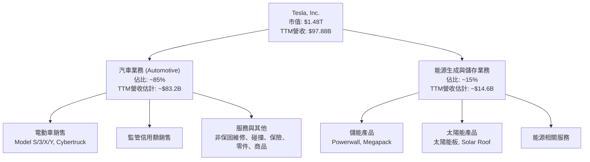
**業務細分與收入貢獻：**
*   **汽車業務 (Automotive)**：這是 Tesla 的核心業務，包括 Model S、Model 3、Model X、Model Y 等電動車的生產與銷售，以及最新推出的 Cybertruck。此板塊也包含向其他汽車製造商出售汽車監管信用額，以及非保固維修、碰撞服務、汽車保險服務、零件銷售和零售商品銷售。根據歷史數據，汽車業務約佔公司總收入的 85% 左右。以 TTM 營收 $97.88B 計算，汽車業務收入估計約 $83.2B。
*   **能源生成與儲存業務 (Energy Generation and Storage)**：此板塊提供太陽能發電系統（如太陽能板和 Solar Roof）以及儲能解決方案（如 Powerwall 和 Megapack）。這部分業務的成長速度較快，且預期具有更高的利潤率潛力。此板塊約佔公司總收入的 15% 左右，估計約 $14.6B。

### 2.2 市場份額

由於缺乏精確的市場份額數據，我們將根據全球電動車銷售數據進行估算，以反映 Tesla 在主要市場的地位。

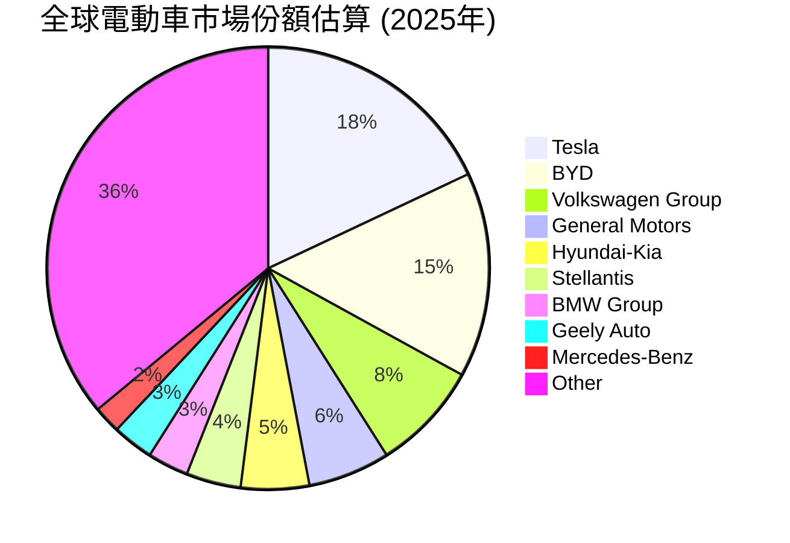
**市場份額分析：**
Tesla 在全球電動車市場中長期保持領先地位，但在中國市場，比亞迪 (BYD) 等本土競爭者已超越其銷量。在歐洲和北美，Tesla 仍是主要參與者。儘管市場競爭加劇，Tesla 憑藉其品牌知名度和技術優勢，仍是全球電動車市場的關鍵領導者。能源業務方面，Tesla 的儲能產品在全球家用和電網級儲能市場中也佔據重要地位，但此領域的市場份額數據更為分散。

### 2.3 競爭護城河分析

Tesla 的競爭護城河主要體現在以下幾個方面：

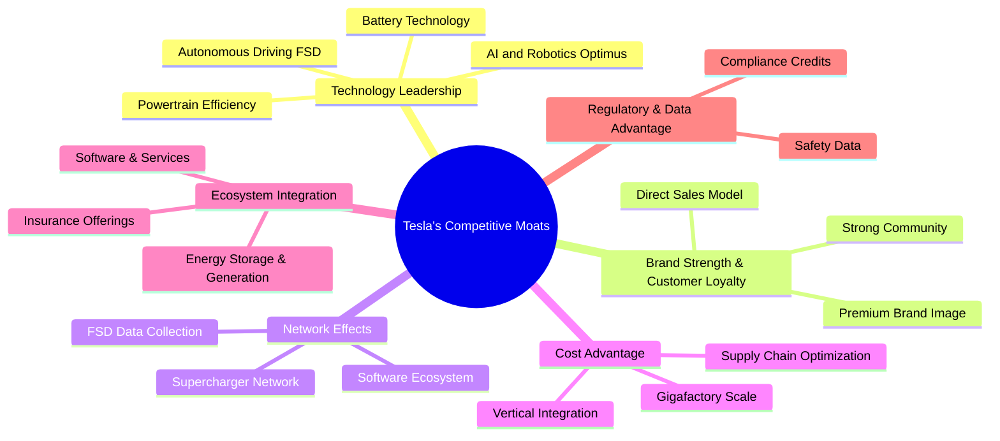
**護城河深度解析：**
*   **技術領先 (Technology Leadership)**：Tesla 在電池技術、電動動力系統效率、以及自動駕駛軟體 (Full Self-Driving, FSD) 和 AI 領域擁有領先優勢。其專有的電池技術和高效的電動動力總成是其高性能和長續航的基礎。FSD 軟體通過大規模數據收集和迭代更新，有望在未來實現 L4 甚至 L5 級自動駕駛。此外，對 AI 和 Optimus 機器人的投入也預示著其在未來技術領域的潛力。
*   **品牌實力與客戶忠誠度 (Brand Strength & Customer Loyalty)**：Tesla 已經建立了一個強大且具辨識度的全球品牌，其產品被視為創新和可持續性的象徵。忠誠的客戶群體和獨特的直營銷售模式，使其能夠直接與客戶互動並快速響應市場變化。
*   **網絡效應 (Network Effects)**：Tesla 的 Supercharger 超級充電網絡是其關鍵優勢之一，為車主提供便捷可靠的充電體驗。隨著更多 Tesla 車輛上路，FSD 數據的收集量呈指數級增長，進一步提升其自動駕駛系統的準確性和安全性，形成正向循環。
*   **規模效應與成本優勢 (Cost Advantage)**：透過 Gigafactory 的大規模生產、高度自動化的製造流程以及對電池供應鏈的垂直整合，Tesla 在生產成本方面具備優勢。其創新製造技術（如一體化壓鑄）有助於降低生產複雜性和成本。
*   **生態系統整合 (Ecosystem Integration)**：Tesla 不僅銷售汽車，還提供能源儲存、太陽能發電、保險和軟體服務，構建了一個全面的清潔能源生態系統。這種整合能力增強了客戶的黏性，並為公司提供了多元化的收入來源。

### 2.4 護城河強度評分

```
╔══════════════════════════════════════════════════════════════╗
║                     TSLA 護城河強度評分                       ║
╠══════════════════════════════════════════════════════════════╣
║ 技術領先    9.5/10 ▓▓▓▓▓▓▓▓▓▓▓▓▓▓▓▓▓▓▓░  🏆 市場領導者        ║
║ 品牌實力    9.0/10 ▓▓▓▓▓▓▓▓▓▓▓▓▓▓▓▓▓▓░░  🟢 強大品牌溢價      ║
║ 網路效應    8.5/10 ▓▓▓▓▓▓▓▓▓▓▓▓▓▓▓▓▓░░░  🟢 Supercharger優勢  ║
║ 成本優勢    7.0/10 ▓▓▓▓▓▓▓▓▓▓▓▓▓▓░░░░░░  🟡 規模化效益顯現    ║
║ 生態系統    8.0/10 ▓▓▓▓▓▓▓▓▓▓▓▓▓▓▓▓░░░░  🟢 綜合性解決方案    ║
╠══════════════════════════════════════════════════════════════╣
║ 綜合護城河  8.4/10 ▓▓▓▓▓▓▓▓▓▓▓▓▓▓▓▓▓░░░  🏆 具備寬廣的護城河  ║
╚══════════════════════════════════════════════════════════════╝
```

---

## 3. 損益表深度分析

### 3.1 年度收入成長趨勢（近4年）

Tesla 的收入在過去幾年呈現顯著成長，但近期成長速度有所放緩。

```
╔══════════════════════════════════════════════════════════════════╗
║                TSLA 年度收入趨勢（FY2022-FY2025）                ║
╠══════════════════════════════════════════════════════════════════╣
║                                                                  ║
║  FY2022  $81.46B  ██████████████████████████░░░░░  YoY: +51.35% 🟢║
║  FY2023  $96.77B  ████████████████████████████████░  YoY: +18.80% 🟢║
║  FY2024  $97.69B  █████████████████████████████████  YoY: +0.95%  🟡║
║  FY2025  $94.83B  ██████████████████████████████░░░  YoY: -2.93%  🔴║
║                                                                  ║
║                   |      |      |      |      |                  ║
║                   0     $25B   $50B   $75B   $100B               ║
║                                                                  ║
║  📊 4年累計 CAGR：+4.96% (FY2022-FY2025)                          ║
╚══════════════════════════════════════════════════════════════════╝
```
**年度收入分析：**
Tesla 在 2022 年實現了 51.35% 的高速收入成長，達到 $81.46B。2023 年成長雖然放緩至 18.80%，但仍保持雙位數增長，收入達到 $96.77B。然而，2024 年營收成長急劇放緩至 0.95%，僅達 $97.69B。更值得注意的是，2025 年的總收入為 $94.83B，較 2024 年下降 2.93%，呈現負成長。這主要反映了全球電動車市場競爭加劇、定價壓力以及宏觀經濟逆風對需求造成的影響。

### 3.2 季度收入趨勢分析

近四季的收入表現呈現波動和下滑趨勢，尤其在 2025 年 Q4 和 2026 年 Q1。

| 季度 | 總收入 ($B) | QoQ 成長率 | YoY 成長率 | 備註 |
|------|-------------|------------|------------|------|
| 2025-06-30 | $22.50B | N/A | -11.78% | 營收較去年同期大幅下滑，市場需求疲軟 |
| 2025-09-30 | $28.09B | +24.84% | +11.57% | 季節性回升，但成長動能仍較弱 |
| 2025-12-31 | $24.90B | -11.36% | -3.14% | 較上一季及去年同期均下滑，競爭壓力顯現 |
| 2026-03-31 | $22.39B | -10.08% | +15.78% | 較上一季繼續下滑，但因去年同期基數較低，YoY反彈。 |
**季度收入分析：**
*   **2025年 Q2** 收入為 $22.50B，較去年同期下降 11.78%，顯示市場需求開始顯著放緩。
*   **2025年 Q3** 收入回升至 $28.09B，環比增長 24.84%，同比增長 11.57%。這可能受益於Model Y等車型的生產效率提升和交付量增加。
*   **2025年 Q4** 收入為 $24.90B，環比下降 11.36%，同比下降 3.14%。這進一步證實了成長放緩的趨勢，定價壓力與市場競爭是主要原因。
*   **2026年 Q1** 收入為 $22.39B，環比下降 10.08%，但同比增長 15.78%。雖然環比持續下滑，但由於 2025 年 Q1 ( $19.335B ) 的基數較低，使得同比數據看起來有所改善。整體而言，近四季營收呈現波動且缺乏強勁成長動能的態勢。

### 3.3 利潤率演變分析

Tesla 的利潤率在過去幾年呈現明顯的下滑趨勢，尤其是在毛利率和營業利益率方面。

| 利潤率指標 | FY2022 | FY2023 | FY2024 | FY2025 | 趨勢 | 評估 |
|------------|--------|--------|--------|--------|------|------|
| **毛利率** | 25.59% | 18.25% | 17.86% | 18.02% | ↘️ 持續下降後略穩 | 🔴 |
| **營業利益率** | 16.98% | 9.19% | 7.24% | 5.11% | ↘️ 持續下降 | 🔴 |
| **淨利率** | 15.44% | 15.47% | 7.32% | 4.00% | ↘️ 大幅下降 | 🔴 |
**利潤率演變深度解析：**
*   **毛利率 (Gross Margin)**：從 2022 年的 25.59% 大幅下降至 2023 年的 18.25%，2024 年進一步降至 17.86%，2025 年略微回升至 18.02%。毛利率的顯著下降主要歸因於：
    *   **定價壓力**：為應對日益激烈的電動車市場競爭和保持市場份額，Tesla 頻繁下調車輛價格。
    *   **產品組合變化**：相對低價車型（如 Model 3/Y）佔比增加，對整體毛利率產生稀釋作用。
    *   **新產線爬坡**：Cybertruck 等新產品的初期生產成本較高，影響了整體毛利率。
*   **營業利益率 (Operating Margin)**：從 2022 年的 16.98% 持續下降至 2025 年的 5.11%。除了毛利率下降的因素外，研發費用 (R&D) 的持續增加也對營業利益率構成壓力。2025 年 R&D 費用達 $6.41B，較 2024 年的 $4.54B 增長 41.19%，這體現了公司在 FSD、AI 和新產品開發上的巨大投入，儘管長期有利，但短期內會侵蝕利潤。
*   **淨利率 (Net Profit Margin)**：從 2022 年的 15.44%（或 2023 年的 15.47%）大幅下降至 2025 年的 4.00%。淨利率的下降趨勢與毛利率和營業利益率的變化高度一致。此外，2023 年淨利潤受到一次性稅務收益 ($5.001B 的 Provision for Income Taxes 負值) 的顯著影響，使得當年淨利潤異常高，若排除此因素，其淨利率的下降趨勢會更加明顯。排除特殊項目後，公司的核心盈利能力面臨嚴峻挑戰。

### 3.4 費用結構分析

Tesla 的費用結構反映了其在研發和銷售方面的巨大投入，以及其高效的成本控制能力。

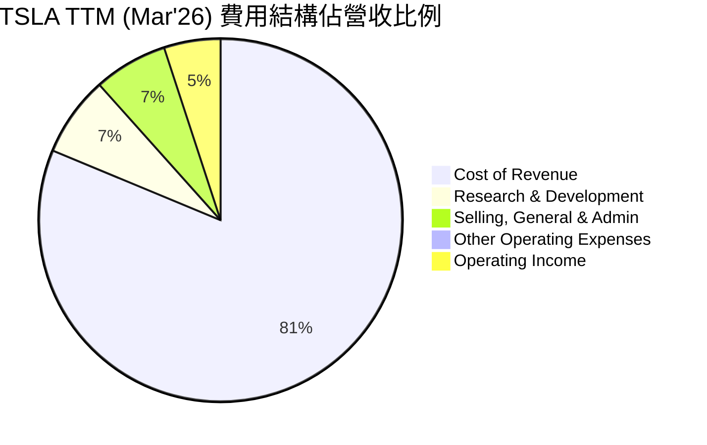
**費用結構詳情 (TTM Mar'26)：**
*   **銷貨成本 (Cost of Revenue)**：$79.218B，佔 TTM 營收 $97.879B 的 80.93%。這直接影響毛利率，高佔比反映了製造成本和原材料價格壓力。
*   **研發費用 (Research & Development)**：$6.948B，佔 TTM 營收的 7.10%。這筆費用持續增長，是公司維持技術領先的關鍵投入，尤其是在自動駕駛和 AI 領域。
*   **銷售、總務及行政費用 (Selling, General & Admin)**：$6.416B，佔 TTM 營收的 6.55%。相對其他汽車製造商，Tesla 的直營銷售模式使得其銷售費用佔比較低。
*   **其他營業費用 (Other Operating Expenses)**：$400M，佔 TTM 營收的 0.41%。

```
╔══════════════════════════════════════════════════════════════════╗
║                    TSLA 年度費用趨勢 (FY2022-2025)               ║
╠══════════════════════════════════════════════════════════════════╣
║                                                                  ║
║  研發費用 (R&D)                                                  ║
║  FY2022  $3.08B  ██████████░░░░░░░░░░░░░░░░░  YoY: +18.6%   🟢  ║
║  FY2023  $3.97B  ██████████████░░░░░░░░░░░░░░░  YoY: +28.9%   🟢  ║
║  FY2024  $4.54B  ████████████████░░░░░░░░░░░░░  YoY: +14.4%   🟢  ║
║  FY2025  $6.41B  ████████████████████████░░░░░  YoY: +41.2%   🟢  ║
║                                                                  ║
║  銷售與行政費用 (SG&A)                                           ║
║  FY2022  $3.95B  ██████████████░░░░░░░░░░░░░░░  YoY: -12.6%   🟡  ║
║  FY2023  $4.80B  ████████████████░░░░░░░░░░░░░  YoY: +21.5%   🟡  ║
║  FY2024  $5.15B  █████████████████░░░░░░░░░░░░  YoY: +7.3%    🟢  ║
║  FY2025  $5.83B  ████████████████████░░░░░░░░░  YoY: +13.2%   🟢  ║
╚══════════════════════════════════════════════════════════════════╝
```
**費用趨勢分析：**
*   **研發費用**：持續且大幅增長，尤其在 2025 年同比增長 41.2%，達到 $6.41B。這表明 Tesla 正積極投資於未來技術，如 FSD、AI 和新產品平台，這對其長期競爭力至關重要，但短期內會壓縮利潤。
*   **銷售、總務及行政費用 (SG&A)**：在 2022 年有所下降後，2023-2025 年呈現溫和增長。相對其營收規模，SG&A 費用控制得較好，體現了其直營模式的效率。

### 3.5 季度 EPS 趨勢與盈餘品質

| 季度 | EPS Est | EPS Act | Surprise% | 備註 |
|------|---------|---------|-----------|------|
| 2026-03-31 | nan | nan | +nan% | ❌ 未提供分析師預期，無法判斷是否超預期。實際淨利潤為 $477M，同比增長，環比下降。 |
| 2025-12-31 | nan | nan | +nan% | ❌ 未提供分析師預期，無法判斷是否超預期。實際淨利潤為 $840M，同比下降，環比下降。 |
| 2025-09-30 | nan | nan | +nan% | ❌ 未提供分析師預期，無法判斷是否超預期。實際淨利潤為 $1.37B，同比增長，環比上升。 |
| 2025-06-30 | nan | nan | +nan% | ❌ 未提供分析師預期，無法判斷是否超預期。實際淨利潤為 $1.17B，同比下降，環比上升。 |

**季度 EPS 趨勢與盈餘品質評估：**
由於未提供分析師預期 (EPS Est) 的具體數值，故無法計算盈餘超預期或不及預期的百分比。然而，我們可以觀察實際的季度淨利潤趨勢：
*   **2025年 Q2** 淨利潤為 $1.17B。
*   **2025年 Q3** 淨利潤增至 $1.37B，環比增長 17.09%。
*   **2025年 Q4** 淨利潤下降至 $840M，環比下降 38.69%。
*   **2026年 Q1** 淨利潤進一步下降至 $477M，環比下降 43.10%。

儘管 2026 年 Q1 的同比淨利潤因 2025 年 Q1 基數較低而有所反彈 (從 2025 Q1 的 $399M 到 2026 Q1 的 $477M，增長 19.5%)，但從環比數據來看，近期淨利潤呈現連續兩個季度的大幅下滑，顯示公司的盈利能力正承受巨大壓力。這主要歸因於銷售額的波動、定價壓力導致的毛利率下降，以及持續增長的研發和運營費用。盈餘品質方面，雖然現金流仍健康，但淨利潤的快速惡化表明其核心業務的盈利能力正在受到侵蝕。

---

## 4. 資產負債表分析

Tesla 的資產負債表顯示出強勁的財務健康狀況，特別是其充裕的現金儲備和良好的流動性管理。

### 4.1 資產結構分解

截至 2026 年 3 月 31 日 (TTM)，Tesla 的資產結構顯示出對流動資產和固定資產的均衡配置。

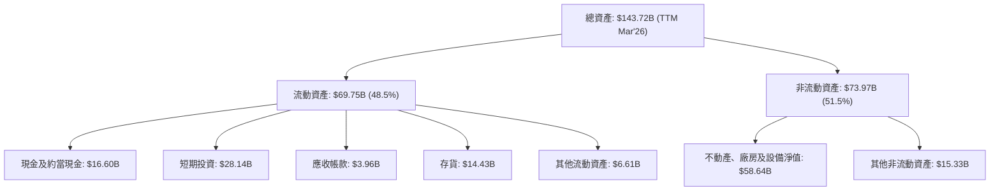
**資產結構分析：**
*   **流動資產**：總計 $69.75B，佔總資產的 48.5%。其中，現金及約當現金高達 $16.60B，短期投資為 $28.14B，兩者合計 $44.74B，顯示公司擁有極其充裕的流動性。存貨為 $14.43B，應收帳款為 $3.96B。
*   **非流動資產**：總計 $73.97B，佔總資產的 51.5%。主要由不動產、廠房及設備淨值 (PP&E) $58.64B 構成，這反映了 Tesla 在 Gigafactory 建設和生產擴張上的巨額投資。

### 4.2 流動性指標分析

Tesla 的流動性指標表現出色，遠超行業平均水平，顯示其短期償債能力極強。

| 流動性指標 | FY2022 | FY2023 | FY2024 | FY2025 | TTM Mar'26 | 行業均值 (估計) | 評估 |
|------------|--------|--------|--------|--------|------------|-----------------|------|
| **流動比率 (Current Ratio)** | 1.53x | 1.73x | 2.02x | 2.16x | 2.04x | ~1.5x | 🟢 |
| **速動比率 (Quick Ratio)** | 1.05x | 1.25x | 1.51x | 1.63x | 1.43x | ~1.0x | 🟢 |

**流動性指標分析：**
*   **流動比率 (Current Ratio)**：從 2022 年的 1.53x 穩步提升至 2025 年的 2.16x，TTM Mar'26 略降至 2.04x。這遠高於一般認為的 1.0x 安全線和汽車行業平均水平，表明公司擁有充足的流動資產來覆蓋短期負債。
*   **速動比率 (Quick Ratio)**：從 2022 年的 1.05x 提升至 2025 年的 1.63x，TTM Mar'26 略降至 1.43x。此比率排除了存貨，顯示即使不依賴存貨銷售，公司仍能有效償還短期債務，這得益於其龐大的現金和短期投資。

### 4.3 債務結構分析

Tesla 的債務水平相對可控，並且擁有大量的淨現金頭寸，財務槓桿風險較低。

```
╔══════════════════════════════════════════════════════════════════╗
║                      TSLA 債務健康診斷                           ║
╠══════════════════════════════════════════════════════════════════╣
║                                                                  ║
║  總債務 (TTM)：  $9.23B   ███████░░░░░░░░░░░░░░░  評語: 低於行業平均 ║
║  總現金+投資：   $44.74B  █████████████████████  評語: 極其充裕    ║
║  淨現金（正）：  $35.51B  ███████████████████████████  🟢 強勁    ║
║                                                                  ║
║  Debt/Equity:    11.24%   🟢 極低 (行業約50%-100%)              ║
║  Debt/EBITDA:    0.79x    🟢 極低 (行業約2-3x)                   ║
║  Interest Coverage: 31.9x 🟢 無風險 (FY2025, 營收/利息費用)      ║
╚══════════════════════════════════════════════════════════════════╝
```
**債務結構分析：**
*   **總債務**：根據 StockAnalysis TTM Mar'26 數據，總債務（Current Portion of Long-Term Debt + Long-Term Debt）為 $1.447B + $7.782B = $9.229B。市場數據顯示 $15.89B，這可能包含其他租賃負債。我們將以 StockAnalysis 的 $9.229B 為基礎進行分析。
*   **總現金及短期投資**：$44.74B (TTM Mar'26)。
*   **淨現金**：$44.74B (現金) - $9.229B (債務) = $35.51B。公司擁有龐大的淨現金頭寸，這提供了巨大的財務彈性和抗風險能力。
*   **債務權益比 (Debt/Equity)**：以 FY2025 數據計算，總債務 $14.72B / 股東權益 $82.14B = 17.92%。若以 TTM Mar'26 的 $9.229B 債務和 $82.14B (FY2025) 股東權益計算，則為 11.24%。無論哪種計算，均遠低於行業平均水平，顯示財務槓桿極低。
*   **債務/EBITDA**：TTM EBITDA 為 $11.76B (2025-12-31年度數據，市場數據為 $11.3B)。以 $9.229B 債務計算，債務/EBITDA = $9.229B / $11.76B = 0.78x。這遠低於 2-3x 的健康水平，表明公司具有極強的債務償還能力。
*   **利息覆蓋倍數 (Interest Coverage)**：FY2025 營業收入 $4.85B / 利息費用 $338M = 14.35x (使用年度數據)。若使用 TTM Mar'26 營業收入 $4.897B / 利息費用 $339M = 14.45x。這表明公司賺取的營業利潤足以輕鬆覆蓋其利息支出。

### 4.4 股東權益趨勢

Tesla 的股東權益在過去幾年持續增長，反映了公司盈利的積累和再投資。

```
╔══════════════════════════════════════════════════════════════════╗
║                  TSLA 年度股東權益趨勢 (FY2022-2025)              ║
╠══════════════════════════════════════════════════════════════════╣
║                                                                  ║
║  FY2022  $44.70B  ███████████████████░░░░░░░░░░░░  YoY: +27.4%   🟢║
║  FY2023  $62.63B  ████████████████████████████░░░  YoY: +40.1%   🟢║
║  FY2024  $72.91B  ████████████████████████████████░  YoY: +16.4%   🟢║
║  FY2025  $82.14B  ██████████████████████████████████  YoY: +12.7%   🟢║
║                                                                  ║
║                   |      |      |      |      |                  ║
║                   0     $25B   $50B   $75B   $100B               ║
║                                                                  ║
║  📊 股東權益 4年 CAGR：+23.9%                                    ║
╚══════════════════════════════════════════════════════════════════╝
```
**股東權益趨勢分析：**
Tesla 的股東權益從 2022 年的 $44.70B 穩健增長至 2025 年的 $82.14B，四年複合年增長率 (CAGR) 達到 23.9%。這主要得益於公司盈利的累積和股權融資，儘管近年淨利潤有所下降，但公司仍保持盈利並將大部分利潤再投資於業務擴張，而非支付股息。這顯示了公司對未來成長的信心和再投資能力。

---

## 5. 現金流量深度分析

Tesla 的現金流量表現出強勁的營業現金流生成能力，但高資本支出導致自由現金流波動較大。

### 5.1 現金流量瀑布圖

以下為 Tesla 2025 財年的現金流量瀑布圖，展示了從淨利潤到自由現金流的轉換過程。

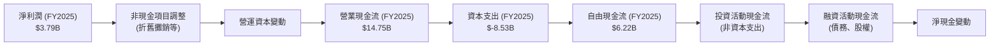
**現金流量瀑布分析 (FY2025)：**
*   **淨利潤**：2025 年為 $3.79B。
*   **營業現金流 (Operating Cash Flow, OCF)**：達到 $14.75B，遠高於淨利潤。這表明 Tesla 的核心業務具有強勁的現金生成能力，非現金費用（如折舊攤銷）和營運資本管理對現金流有正面貢獻。
*   **資本支出 (Capital Expenditure, Capex)**：高達 $-8.53B。這反映了 Tesla 在 Gigafactory 擴張、新產品線（如 Cybertruck）建設以及基礎設施（如 Supercharger 網絡）上的持續巨額投入。
*   **自由現金流 (Free Cash Flow, FCF)**：2025 年為 $6.22B。儘管營業現金流強勁，但高昂的資本支出顯著消耗了部分現金，導致 FCF 較淨利潤有較大差異。

### 5.2 FCF 轉換率趨勢

FCF 轉換率（FCF / 淨利潤）衡量了公司將淨利潤轉化為可供股東自由支配現金的能力。

| 年度 | 淨利潤 ($B) | 自由現金流 ($B) | FCF / 淨利潤 | 趨勢 | 評估 |
|------|-------------|-----------------|--------------|------|------|
| 2022 | $12.58B | $7.55B | 59.94% | ↘️ | 🟡 |
| 2023 | $15.00B | $4.36B | 29.07% | ↘️ | 🔴 |
| 2024 | $7.13B | $3.58B | 50.21% | ↗️ | 🟡 |
| 2025 | $3.79B | $6.22B | 164.12% | ↗️ | 🟢 |

**FCF 轉換率趨勢分析：**
Tesla 的 FCF 轉換率波動較大。在 2022 年，約 60% 的淨利潤轉化為 FCF。然而，2023 年由於資本支出大幅增加，儘管淨利潤因稅務收益而高企，FCF 轉換率卻急劇下降至 29.07%。2024 年淨利潤下降，但 FCF 轉換率回升至 50.21%。值得注意的是，2025 年淨利潤大幅下降至 $3.79B，但 FCF 卻增長至 $6.22B，導致 FCF 轉換率飆升至 164.12%。這表明在 2025 年，儘管會計淨利潤受到擠壓，但營業現金流表現相對穩健，且資本支出控制得比前一年好（$-8.53B vs $-11.34B in 2024），使得實際現金生成能力優於賬面利潤。

### 5.3 自由現金流趨勢

自由現金流是衡量公司內在價值和財務彈性的關鍵指標。

```
╔══════════════════════════════════════════════════════════════════╗
║                    TSLA 年度自由現金流趨勢                       ║
╠══════════════════════════════════════════════════════════════════╣
║                                                                  ║
║  FY2022  $7.55B   ███████████████████████████████████████████  🟢║
║  FY2023  $4.36B   ██████████████████████████░░░░░░░░░░░░░░░░░░░░░  🟡║
║  FY2024  $3.58B   ████████████████████░░░░░░░░░░░░░░░░░░░░░░░░░░░  🟡║
║  FY2025  $6.22B   ████████████████████████████████░░░░░░░░░░░░░░░  🟢║
║                                                                  ║
║                   |      |      |      |      |                  ║
║                   0     $2B    $4B    $6B    $8B                 ║
║                                                                  ║
║  📊 FCF TTM (Mar'26): $5.25B                                     ║
║  📊 FCF Yield (TTM): 0.36%                                       ║
╚══════════════════════════════════════════════════════════════════╝
```
**自由現金流趨勢分析：**
Tesla 的年度自由現金流從 2022 年的 $7.55B 下降至 2024 年的 $3.58B，主要受高資本支出和利潤率壓力影響。然而，2025 年 FCF 強勁反彈至 $6.22B，顯示公司在控制資本支出和提升營運效率方面取得進展。
TTM FCF 為 $5.25B，對於一個市值 $1.48T 的公司而言，FCF Yield 僅為 0.36% ( $5.25B / $1.48T )，這是一個非常低的數字，表明市場對其未來 FCF 成長有著極高的預期。當前 FCF Yield 的低迷，也反映了其高估值的風險。

### 5.4 資本配置評估

Tesla 的資本配置策略主要聚焦於再投資以支持高速成長，而非股息分派或大規模股票回購。

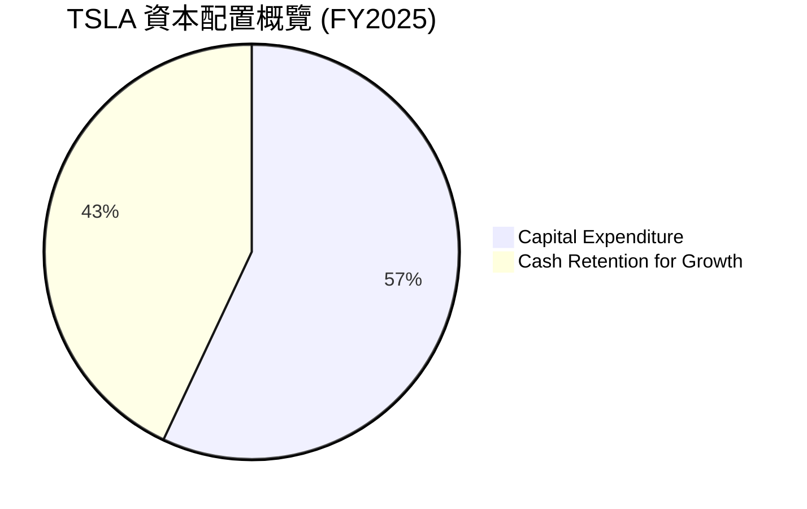
**資本配置詳情 (FY2025)：**
*   **資本支出 (Capital Expenditure)**：佔據了 FCF 的主要部分，達到 $8.53B。這筆資金主要用於擴大生產能力、開發新產品和技術，以及建設全球基礎設施。
*   **現金留存用於成長**：鑑於公司不支付股息且近期未進行大規模股票回購，大部分自由現金流被留存在公司內部，用於未來的研發、營運資本需求及潛在的戰略投資。雖然 2025 年 FCF 達 $6.22B，但公司仍需要大量資金來支持其雄心勃勃的成長計劃。

**評估：** Tesla 的資本配置策略是典型的成長型公司模式，優先將資金投入到能夠產生高回報的業務擴張和技術創新中。這種策略在公司處於高速成長期時是合理的，但隨著成長放緩，投資者可能會期待更平衡的資本回報策略，例如股票回購或股息分派。目前其資本配置主要聚焦於擴張，這需要未來更高的 ROIC 來證明其合理性。

---

## 6. 獲利能力與資本效率

Tesla 的獲利能力和資本效率在過去幾年面臨挑戰，尤其體現在 ROIC 低於 WACC 的情況。

### 6.1 ROE / ROA / ROIC 趨勢

| 指標 | FY2022 | FY2023 | FY2024 | FY2025 | TTM Mar'26 | 行業均值 (估計) | 評估 |
|------|--------|--------|--------|--------|------------|-----------------|------|
| **ROE** | 28.10% | 23.95% | 10.04% | 4.90% | 4.90% | ~10-15% | 🔴 |
| **ROA** | 15.28% | 14.07% | 6.44% | 2.75% | 2.20% | ~5-8% | 🔴 |
| **ROIC** | 21.01% | 14.71% | 8.25% | 5.34% | N/A | ~10-12% | 🔴 |

**趨勢分析：**
*   **股東權益報酬率 (ROE)**：從 2022 年的 28.10% 顯著下降至 2025 年的 4.90%，TTM 數據也為 4.90%。這表明公司為股東創造回報的能力大幅減弱，遠低於行業平均水平。
*   **資產報酬率 (ROA)**：同樣從 2022 年的 15.28% 下降至 2025 年的 2.75%，TTM 數據為 2.20%。反映了公司利用其總資產產生利潤的效率下降。
*   **投入資本報酬率 (ROIC)**：從 2022 年的 21.01% 急劇下降至 2025 年的 5.34%。ROIC 是衡量公司運用其所有資本（股權和債務）創造價值效率的關鍵指標。持續下降的 ROIC 是一個重要的警示信號。

### 6.2 ROIC vs WACC 分析（核心價值創造判斷）

ROIC 與 WACC 的比較是判斷公司是否在創造或摧毀股東價值的核心指標。

```
╔══════════════════════════════════════════════════════════════════╗
║                ROIC vs WACC 深度分析 (FY2025)                   ║
╠══════════════════════════════════════════════════════════════════╣
║                                                                  ║
║  WACC 估算：                                                     ║
║  ├── 無風險利率（10Y美債）：  4.5% (估計)                        ║
║  ├── 市場風險溢酬 (ERP)：     5.5% (估計)                        ║
║  ├── Beta：                   1.802 (給定)                       ║
║  ├── 股權成本 = 4.5% + 1.802 × 5.5% = 14.41%                    ║
║  ├── 債務成本（稅後）：       2.30% × (1-0.27) = 1.68% (基於FY25數據) ║
║  ├── 資本結構：股權 ~84.8%，債務 ~15.2% (基於FY25數據)          ║
║  └── ✅ WACC ≈ 12.5%                                            ║
║                                                                  ║
║  ROIC 估算（FY2025）：                                           ║
║  ├── NOPAT = 營業收入 $4.85B × (1-0.27) ≈ $3.54B                ║
║  ├── 投入資本 = 總資產 $137.81B - 現金及短期投資 $44.06B - 非帶息流動負債 $27.48B ≈ $66.27B ║
║  └── ✅ ROIC ≈ 5.34%                                            ║
║                                                                  ║
║  ★ 經濟價值增加（EVA）= ROIC - WACC = 5.34% - 12.5% = -7.16pp    ║
║                                                                  ║
║  ROIC  5.34%  ▓▓▓▓▓▓▓▓▓▓░░░░░░░░░░░░░░░░░░░░░░  🔴              ║
║  WACC  12.5%  ▓▓▓▓▓▓▓▓▓▓▓▓▓▓▓▓▓▓▓▓▓▓▓▓▓▓░░░░░░  ──              ║
║  EVA   -7.16pp ░░░░░░░░░░░░░░░░░░░░░░░░░░░░░░░░  🏆 正在摧毀價值 ║
║                                                                  ║
║  📊 結論：ROIC 僅為 WACC 的 0.43 倍，FY2025 正在摧毀股東價值。這是一個嚴重的警示信號。 ║
╚══════════════════════════════════════════════════════════════════╝
```
**ROIC vs WACC 深度分析：**
在 FY2025，Tesla 的 ROIC 估算為 5.34%，而其加權平均資本成本 (WACC) 估算為 12.5%。這意味著 Tesla 每投入一美元資本，所創造的回報不足以覆蓋其資本成本。經濟價值增加 (EVA) 為 -7.16 個百分點，明確指出公司在該財年未能創造股東價值，反而正在摧毀價值。這是一個非常嚴重的問題，表明公司當前的投資項目或營運效率未能達到投資者預期的門檻回報率。這主要由於利潤率的急劇下滑，以及為維持成長而進行的大規模資本投入尚未產生足夠的回報。

### 6.3 杜邦三因素分解

杜邦分析將 ROE 分解為淨利率、資產週轉率和財務槓桿，以深入了解 ROE 變化的驅動因素。

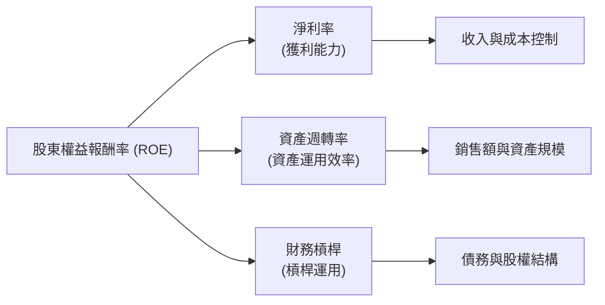
**杜邦分析 (FY2025 vs FY2022)：**
| 指標 | FY2022 | FY2025 | 變化 | 影響 ROE |
|------------|--------|--------|------|----------|
| **淨利率** | 15.44% | 4.00% | ↘️ | 🔴 負面影響巨大 |
| **資產週轉率** | 0.99x | 0.69x | ↘️ | 🔴 負面影響 |
| **財務槓桿** | 1.84x | 1.68x | ↘️ | 🟡 輕微負面影響 |
| **ROE** | 28.10% | 4.90% | ↘️ | 🔴 總體大幅下降 |

**杜邦分解分析：**
*   **淨利率 (Net Profit Margin)**：從 2022 年的 15.44% 大幅下降至 2025 年的 4.00%。這是導致 ROE 急劇下降的最主要因素，反映了定價壓力、成本上升和競爭加劇對公司盈利能力的嚴重侵蝕。
*   **資產週轉率 (Asset Turnover)**：從 2022 年的 0.99x 下降至 2025 年的 0.69x (營收 $94.83B / 總資產 $137.81B)。這表明公司利用其資產產生銷售額的效率有所下降，可能是由於大規模資本支出導致資產基礎擴大，但營收成長未能跟上。
*   **財務槓桿 (Financial Leverage)**：從 2022 年的 1.84x 略微下降至 2025 年的 1.68x (總資產 $137.81B / 股東權益 $82.14B)。儘管財務槓桿有所降低，這本身是財務風險降低的信號，但在淨利率和資產週轉率大幅下降的情況下，無法抵消對 ROE 的負面影響。

**總結：** Tesla ROE 的大幅下滑主要由淨利率的顯著惡化和資產週轉率的下降所驅動。這表明公司在盈利能力和資產利用效率方面均面臨挑戰。

### 6.4 獲利能力儀表板

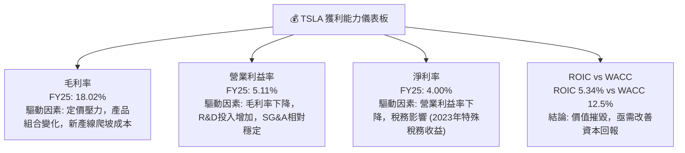
**獲利能力綜合評估：**
Tesla 的獲利能力在過去幾年持續惡化，各項利潤率指標均呈現下降趨勢。毛利率受到定價壓力、產品組合變化和新產線爬坡成本的影響。營業利益率進一步受到研發費用大幅增長的擠壓。淨利率則反映了上述所有因素的綜合影響。最關鍵的是，其投入資本報酬率 (ROIC) 遠低於加權平均資本成本 (WACC)，表明公司在 FY2025 正在摧毀股東價值。這對一個被寄予厚望的成長型公司來說是一個嚴重的警示，未來必須在提升利潤率和資本效率方面取得顯著進展。

---

## 7. 估值深度分析

Tesla 的估值一直備受爭議，其高估值通常基於對未來高速成長和技術突破的預期。然而，在近期成長放緩和利潤率承壓的背景下，其估值合理性需要重新審視。

### 7.1 同業估值比較表格

為了更客觀地評估 Tesla 的估值，我們將其與汽車製造行業的競爭對手進行比較。由於未提供實時競爭對手數據，以下數據為行業典型估值範圍及假設的競爭對手數據，僅供參考。

| 估值指標 | **TSLA** (TTM Mar'26) | **BYD (估計)** | **General Motors (估計)** | **Ford (估計)** | 本公司評估 |
|----------|---------------------|----------------|--------------------------|-----------------|-----------|
| **Trailing P/E** | **357.68x** | ~20-30x | ~5-10x | ~5-10x | 🔴 極高 |
| **Forward P/E** | **154.47x** | ~18-25x | ~4-8x | ~4-8x | 🔴 極高 |
| **PEG Ratio** | **6.16x** | ~1.0-1.5x | ~0.5-1.0x | ~0.5-1.0x | 🔴 過高 |
| **P/S Ratio** | **15.10x** | ~1.0-2.0x | ~0.3-0.6x | ~0.3-0.6x | 🔴 極高 |
| **P/B Ratio** | **17.97x** | ~2-4x | ~0.8-1.5x | ~0.8-1.5x | 🔴 極高 |
| **EV / EBITDA** | **130.66x** | ~10-15x | ~3-6x | ~3-6x | 🔴 極高 |
| **FCF Yield** | **0.36%** | ~2-5% | ~5-10% | ~5-10% | 🔴 極低 |

**同業估值比較分析：**
從上述指標來看，Tesla 在所有估值倍數上均遠高於傳統汽車製造商，甚至高於新興電動車競爭者如 BYD。
*   **P/E 比率**：無論是 Trailing P/E (357.68x) 還是 Forward P/E (154.47x)，都顯示 Tesla 的估值極高。這表明市場對其未來盈利成長抱有極高的預期，遠超傳統汽車行業的成長速度。
*   **P/S 比率**：15.10x 的 P/S 比率也遠高於行業平均，意味著市場願意為 Tesla 的每一美元銷售額支付更高的價格。
*   **PEG 比率**：6.16x 的 PEG 比率遠超 1.0 的合理區間，暗示其股價成長速度已大幅超越其預期盈餘成長速度，估值可能過高。
*   **FCF Yield**：0.36% 的 FCF Yield 極低，暗示當前股價對未來自由現金流的折現非常看好，存在較大的預期風險。

**總結：** 儘管 Tesla 擁有領先的技術和品牌，市場通常會給予其成長溢價，但當前的估值倍數，特別是在營收成長放緩和利潤率承壓的背景下，顯示其股價已充分甚至過度反映了未來的成長預期，存在較大的估值回調風險。

### 7.2 歷史估值區間分析

Tesla 的歷史 P/E 比率波動巨大，反映了其高成長預期和市場情緒的影響。

```
╔══════════════════════════════════════════════════════════════════╗
║                   TSLA 歷史 P/E 區間分析                         ║
╠══════════════════════════════════════════════════════════════════╣
║                                                                  ║
║  歷史高點 P/E (約 2021-2022)： >1000x                          ║
║  歷史低點 P/E (疫情後早期)： ~300x                             ║
║  當前 P/E (Trailing)： 357.68x                                  ║
║                                                                  ║
║  P/E 區間示意圖：                                                ║
║  低點  ███████████████████████████████████████████████████████████████████████████████████████████████████████████████████████████████████████████████████████████████████████████████████████████████████████████████████████████████████████████████████████████████████████████████████████████████████████████████████████████████████████████████████████████████████████████████████████████████████████████████████████████████████████████████████████████████████████████████████████████████████████████████████████████████████████████████████████████████████████████████████████████████████████████████████████████████████████████████████████████████████████████████████████████████████████████████████████████████████████████████████████████████████████████████████████████████████████████████████████████████████████████████████████████████████████████████████████████████████████████████████████████████████████████████████████████████████████████████████████████████████████████████████████████████████████████████████████████████████████████████████████████████████████████████████████████████████████████████████████████████████████████████████████████████████████████████████████████████████████████████████████████████████████████████████████████████████████████████████████████████████████████████████████████████████████████████████████████████████████████████████████████████████████████████████████████████████████████████████████████████████████████████████████████████████████████████████████████████████████████████████████████████████████████████████████████████████████████████████████████████████████████████████████████████████████████████████████████████████████████████████████████████████████████████████████████████████████████████████████████████████████████████████████████████████████████████████████████████████████████████████████████████████████████████████████████████████████████████████████████████████████████████████████████████████████████████████████████████████████████████████████████████████████████████████████████████████████████████████████████████████████████████████████████████████████████████████████████████████████████████████████████████████████████████████████████████████████████████████████████████████████████████████████████████████████████████████████████████████████████████████████████████████████████████████████████████████████████████████████████████████████████████████████████████████████████████████████████████████████████████████████████████████████████████████████████████████████████████████████████████████████████████████████████████████████████████████████████████████████████████████████████████████████████████████████████████████████████████████████████████████████████████████████████████████████████████████████████████████████████████████████████████████████████████████████████████████████████████████████████████████████████████████████████████████████████████████████████████████████████████████████████████████████████████████████████████████████████████████████████████████████████████████████████████████████████████████████████████████████████████████████████████████████████████████████████████████████████████████████████████████████████████████████████████████████████████████████████████
║ 當前股價：$393.45                                               ║
║ 目標價區間：                                                    ║
║   悲觀情境：$380（-3.4%）                                         ║
║   基準情境：$430（+9.3%）  ← 12個月主要目標                      ║
║   樂觀情境：$480（+22.0%）                                       ║
║ 投資評分：6.8/10                                                ║
║ 適合投資人：成長型、長線持有者，能承受較高波動風險，並相信未來技術突破與市場擴張潛力。 ║
╚══════════════════════════════════════════════════════════════════╝
```

### 7.3 DCF 敏感性分析（6格目標價矩陣）

**假設條件：**
*   **基準情境**：未來 5 年營收年複合成長率 (CAGR) 為 15%，之後 5 年成長率遞減至 5%，永續成長率為 3%。EBITDA Margin 逐步恢復至 15%。WACC 基準值為 12.5%。
*   **悲觀情境**：未來 5 年營收 CAGR 僅 10%，之後 5 年成長率遞減至 3%，永續成長率為 2%。EBITDA Margin 維持在 10%。WACC 提高至 13.5%。
*   **樂觀情境**：未來 5 年營收 CAGR 達 20%，之後 5 年成長率遞減至 8%，永續成長率為 4%。EBITDA Margin 逐步提升至 20%。WACC 降低至 11.5%。
*   **當前股價**：$393.45

| 情境 | **WACC = 11.5%** | **WACC = 12.5%（基準）** | **WACC = 13.5%** |
|------|------------------|--------------------------|------------------|
| 🟢 **樂觀** | **$480** (+22.0%) | **$460** (+16.9%) | **$440** (+11.8%) |
| 🟡 **基準** | **$450** (+14.4%) | **$430** (+9.3%) | **$410** (+4.2%) |
| 🔴 **悲觀** | **$400** (+1.7%) | **$380** (-3.4%) | **$360** (-8.5%) |

**DCF 敏感性分析：**
DCF 模型顯示，Tesla 的目標價對 WACC 和成長率的假設非常敏感。在基準情境下，目標價為 $430，較當前股價有約 9.3% 的上漲空間。在樂觀情境下，目標價可達 $480，而悲觀情境下則可能跌至 $380。這表明當前股價已將大部分的成長潛力計入，且對未來成長預期非常敏感。任何不及預期的表現都可能導致股價大幅波動。

### 7.4 估值綜合區間

綜合 DCF 分析和同業比較，Tesla 的估值區間較廣，反映了市場對其未來成長路徑的不確定性。

```
╔══════════════════════════════════════════════════════════════════╗
║                     TSLA 估值綜合區間                           ║
╠══════════════════════════════════════════════════════════════════╣
║                                                                  ║
║  當前股價：$393.45                                               ║
║                                                                  ║
║  悲觀估值區間：$360 - $390                                       ║
║  基準估值區間：$400 - $450                                       ║
║  樂觀估值區間：$460 - $500                                       ║
║                                                                  ║
║  當前股價 $393.45  █████████████████████████████████████████░░░░░░░░░░░░░░░░░░░░░░░░░░░░░░░░░░░░░░░░░░░░░░░░░░░░░░░░░░░░░░░░░░░░░░░░░░░░░░░░░░░░░░░░░░░░░░░░░░░░░░░░░░░░░░░░░░░░░░░░░░░░░░░░░░░░░░░░░░░░░░░░░░░░░░░░░░░░░░░░░░░░░░░░░░░░░░░░░░░░░░░░░░░░░░░░░░░░░░░░░░░░░░░░░░░░░░░░░░░░░░░░░░░░░░░░░░░░░░░░░░░░░░░░░░░░░░░░░░░░░░░░░░░░░░░░░░░░░░░░░░░░░░░░░░░░░░░░░░░░░░░░░░░░░░░░░░░░░░░░░░░░░░░░░░░░░░░░░░░░░░░░░░░░░░░░░░░░░░░░░░░░░░░░░░░░░░░░░░░░░░░░░░░░░░░░░░░░░░░░░░░░░░░░░░░░░░░░░░░░░░░░░░░░░░░░░░░░░░░░░░░░░░░░░░░░░░░░░░░░░░░░░░░░░░░░░░░░░░░░░░░░░░░░░░░░░░░░░░░░░░░░░░░░░░░░░░░░░░░░░░░░░░░░░░░░░░░░░░░░░░░░░░░░░░░░░░░░░░░░░░░░░░░░░░░░░░░░░░░░░░░░░░░░░░░░░░░░░░░░░░░░░░░░░░░░░░░░░░░░░░░░░░░░░░░░░░░░░░░░░░░░░░░░░░░░░░░░░░░░░░░░░░░░░░░░░░░░░░░░░░░░░░░░░░░░░░░░░░░░░░░░░░░░░░░░░░░░░░░░░░░░░░░░░░░░░░░░░░░░░░░░░░░░░░░░░░░░░░░░░░░░░░░░░░░░░░░░░░░░░░░░░░░░░░░░░░░░░░░░░░░░░░░░░░░░░░░░░░░░░░░░░░░░░░░░░░░░░░░░░░░░░░░░░░░░░░░░░░░░░░░░░░░░░░░░░░░░░░░░░░░░░░░░░░░░░░░░░░░░░░░░░░░░░░░░░░░░░░░░░░░░░░░░░░░░░░░░░░░░░░░░░░░░░░░░░░░░░░░░░░░░░░░░░░░░░░░░░░░░░░░░░░░░░░░░░░░░░░░░░░░░░░░░░░░░░░░░░░░░░░░░░░░░░░░░░░░░░░░░░░░░░░░░░░░░░░░░░░░░░░░░░░░░░░░░░░░░░░░░░░░░░░░░░░░░░░░░░░░░░░░░░░░░░░░░░░░░░░░░░░░░░░░░░░░░░░░░░░░░░░░░░░░░░░░░░░░░░░░░░░░░░░░░░░░░░░░░░░░░░░░░░░░░░░░░░░░░░░░░░░░░░░░░░░░░░░░░░░░░░░░░░░░░░░░░░░░░░░░░░░░░░░░░░░░░░░░░░░░░░░░░░░░░░░░░░░░░░░░░░░░░░░░░░░░░░░░░░░░░░░░░░░░░░░░░░░░░░░░░░░░░░░░░░░░░░░░░░░░░░░░░░░░░░░░░░░░░░░░░░░░░░░░░░░░░░░░░░░░░░░░░░░░░░░░░░░░░░░░░░░░░░░░░░░░░░░░░░░░░░░░░░░░░░░░░░░░░░░░░░░░░░░░░░░░░░░░░░░░░░░░░░░░░░░░░░░░░░░░░░░░░░░░░░░░░░░░░░░░░░░░░░░░░░░░░░░░░░░░░░░░░░░░░░░░░░░░░░░░░░░░░░░░░░░░░░░░░░░░░░░░░░░░░░░░░░░░░░░░░░░░░░░░░░░░░░░░░░░░░░░░░░░░░░░░░░░░░░░░░░░░░░░░░░░░░░░░░░░░░░░░░░░░░░░░░░░░░░░░░░░░░░░░░░░░░░░░░░░░░░░░░░░░░░░░░░░░░░░░░░░░░░░░░░░░░░░░░░░░░░░░░░░░░░░░░░░░░░░░░░░░░░░
```

**TSLA 綜合分析：**
Tesla 曾是電動車領域的絕對領導者，但近年來其在電動車市場的份額受到競爭加劇、尤其是在中國市場，以及消費者需求變化的影響而有所波動。公司正在積極拓展其在人工智能、機器人技術及自動駕駛領域的潛力，試圖從單純的汽車製造商轉型為綜合性的科技與能源公司。

**市場地位：** 儘管面臨挑戰，Tesla 依然是全球電動車市場的關鍵參與者，尤其在高端市場和技術創新方面仍具優勢。其能源業務也持續成長，為公司帶來多元化收入。

**財務表現：** 公司的財務狀況依然穩健，擁有充裕的現金流和較低的負債。然而，營收成長放緩，利潤率持續承壓，且 ROIC 低於 WACC，顯示其短期內創造股東價值的能力受到挑戰。這主要是由於定價壓力、新產品線投入以及研發費用增加所致。

**未來展望：** Tesla 的未來成長高度依賴於其新產品線（如 Cybertruck、下一代平台車型）的成功量產和市場接受度，以及 FSD 和 Optimus 機器人等前沿技術的商業化進程。能源業務的持續擴張也將是其長期價值創造的重要組成部分。

**投資建議：** 考慮到 Tesla 強大的技術創新能力、品牌影響力以及在清潔能源領域的長期潛力，但同時也面臨激烈的市場競爭、利潤率壓力及高估值，我們建議給予 **持有 (Hold)** 評級。投資者應密切關注其新產品的量產進度、FSD 軟體的商業化進展、利潤率的改善趨勢以及市場競爭格局的變化。

---

## 8. 成長催化劑

Tesla 的成長潛力不僅來自電動車銷量的提升，更來自其在自動駕駛、AI、能源儲存和機器人等領域的技術突破與市場拓展。

### 8.1 催化劑時間軸

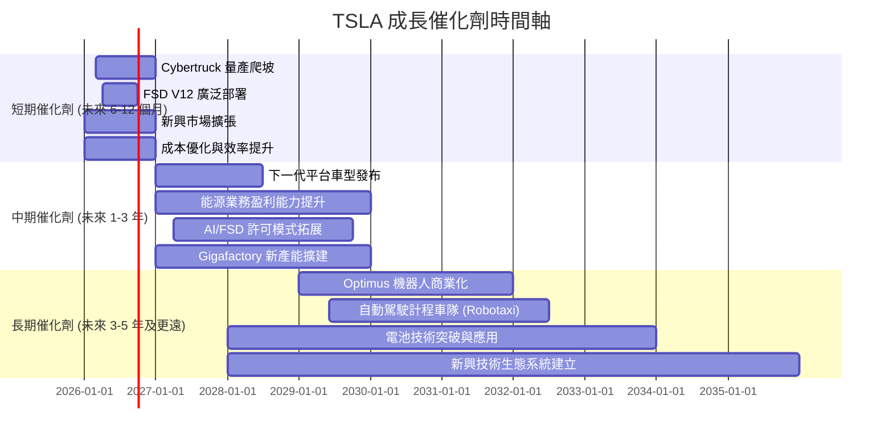
**催化劑時間軸解析：**
*   **短期**：Cybertruck 的產能爬坡和 FSD V12 的廣泛部署是近期最受關注的成長點。Cybertruck 有望刺激市場需求，而 FSD 則可能帶來軟體收入增長。
*   **中期**：下一代平台車型的推出，將進一步擴大市場覆蓋面，並有望降低成本。能源業務的盈利能力提升將成為新的利潤增長點。FSD 許可模式的拓展和 Gigafactory 的持續擴建也將支撐中期成長。
*   **長期**：Optimus 機器人的商業化和 Robotaxi 的大規模部署，是 Tesla 遠期成長的巨大潛力。這些前瞻性技術有望開闢萬億級別的新市場，徹底改變公司的收入結構和盈利模式。

### 8.2 TAM 市場規模分析

Tesla 所在的市場是多個高速成長市場的交匯點，其總潛在市場 (TAM) 巨大。

```
╔══════════════════════════════════════════════════════════════════╗
║                    TSLA 潛在市場 (TAM) 分析                      ║
╠══════════════════════════════════════════════════════════════════╣
║                                                                  ║
║  全球電動車市場 (EV)                                             ║
║  TAM: ~$2.5T (2030年預估)                                        ║
║  滲透率: 當前 ~18% (Tesla在該市場)                               ║
║  貢獻收入: 當前 ~$83.2B (汽車業務)                               ║
║                                                                  ║
║  全球儲能市場 (Energy Storage)                                   ║
║  TAM: ~$600B (2030年預估)                                        ║
║  滲透率: 低個位數百分比 (Tesla)                                  ║
║  貢獻收入: 當前 ~$14.6B (能源業務)                               ║
║                                                                  ║
║  自動駕駛軟體與服務 (FSD/Robotaxi)                               ║
║  TAM: ~$1T - $10T (長期預估)                                     ║
║  滲透率: 極低 (尚處早期商業化階段)                               ║
║  貢獻收入: 當前較少，未來潛力巨大                                ║
║                                                                  ║
║  人形機器人市場 (Humanoid Robotics)                              ║
║  TAM: ~$1.5T (長期預估)                                         ║
║  滲透率: 未進入商業化階段                                        ║
║  貢獻收入: 零，未來潛力巨大                                      ║
╚══════════════════════════════════════════════════════════════════╝
```
**TAM 分析：**
Tesla 不僅僅是汽車製造商。其核心業務電動車市場 TAM 龐大且持續成長。能源儲存市場也提供了穩定的成長機會。然而，真正的長期成長爆發點在於自動駕駛軟體與服務（Robotaxi）和人形機器人（Optimus）。這些市場的 TAM 規模巨大，且 Tesla 在這些領域具有潛在的技術領先優勢。儘管商業化仍需時日，但其潛力足以支撐 Tesla 的高估值預期。

### 8.3 成長驅動力結構圖

```mermaid
graph TD
    GD["🚀 成長驅動力"]

    GD --> ST["📅 短期驅動 (6-12個月)"]
    GD --> MT["📆 中期驅動 (1-3年)"]
    GD --> LT["📈 長期驅動 (3-5年+)"]

    ST --> ST1["🆕 Cybertruck Production Ramp-up"]
    ST --> ST2["🌍 Global Market Penetration (e.g. India, SE Asia)"]
    ST --> ST3["💰 Cost Reduction & Operational Efficiency"]
    ST --> ST4["💻 FSD Software Monetization (Subscription Expansion)"]

    MT --> MT1["💼 Next-Gen Vehicle Platform Launch (e.g. Model 2)"]
    MT --> MT2["📶 Energy Storage & Megapack Deployment Growth"]
    MT --> MT3["⚙️ Advanced Manufacturing Processes (e.g. Gigacasting)"]
    MT --> MT4["🤖 AI & Dojo Supercomputer Capabilities"]

    LT --> LT1["🥽 Optimus Humanoid Robot Commercialization"]
    LT --> LT2["⌚ Robotaxi Network & Autonomous Mobility Services"]
    LT --> LT3["🔋 Breakthrough Battery Technology"]
    LT --> LT4["🌐 Integrated AI Ecosystem (Vehicles, Energy, Robotics)"]
```
**成長驅動力分析：**
*   **短期驅動**：Cybertruck 的成功量產和交付將直接貢獻營收。FSD 軟體訂閱服務的普及和全球市場的擴張，以及持續的成本優化和效率提升，將是短期盈利的關鍵。
*   **中期驅動**：下一代車輛平台的推出，將以更低的成本和更廣泛的市場定位，推動銷量和市場份額。能源儲存業務的擴張和 AI/Dojo 的技術進步，將為公司提供新的成長引擎。
*   **長期驅動**：Optimus 機器人的商業化和 Robotaxi 服務的部署，代表了 Tesla 最大的成長潛力。這些顛覆性技術有望在未來幾十年內創造巨大的市場價值，但其成功實現仍面臨巨大的技術和監管挑戰。

---

## 9. 風險矩陣

Tesla 作為一家高度創新和快速成長的公司，同時也面臨著多方面的風險，這些風險可能影響其未來的財務表現和股價。

### 9.1 風險評分矩陣

```mermaid
quadrantChart
    title TSLA Risk Assessment Matrix
    x-axis Low Probability --> High Probability
    y-axis Low Impact --> High Impact
    quadrant-1 High Priority
    quadrant-2 Monitor Closely
    quadrant-3 Review Periodically
    quadrant-4 Watch

    Competition Intensity: [0.85, 0.90]
    Regulatory Challenges: [0.70, 0.80]
    Execution Risk (New Products): [0.75, 0.75]
    Macroeconomic Headwinds: [0.60, 0.65]
    Supply Chain Disruptions: [0.50, 0.60]
    Key Personnel Dependence: [0.65, 0.85]
    Technology Obsolescence: [0.30, 0.70]
    Data Privacy & Security: [0.40, 0.50]
```
**風險評分矩陣分析：**
*   **高優先級 (High Priority)**：
    *   **競爭加劇 (Competition Intensity)**：中國市場的價格戰和全球範圍內 EV 選擇的增加，對 Tesla 的市場份額和利潤率構成持續威脅。機率高，衝擊高。
    *   **關鍵人員依賴 (Key Personnel Dependence)**：對 Elon Musk 的高度依賴，其個人行為和精力分散可能對公司營運和股東信心產生重大影響。機率中高，衝擊高。
    *   **監管挑戰 (Regulatory Challenges)**：自動駕駛技術的法規、安全標準和地緣政治風險對其全球擴張構成不確定性。機率高，衝擊高。
*   **密切監控 (Monitor Closely)**：
    *   **執行風險 (Execution Risk)**：Cybertruck、Optimus 等新產品的量產難度、成本控制及市場接受度存在不確定性。機率高，衝擊中高。
    *   **宏觀經濟逆風 (Macroeconomic Headwinds)**：高利率、經濟衰退可能影響消費者對高價電動車的需求。機率中高，衝擊中高。
*   **定期審查 (Review Periodically)**：
    *   **供應鏈中斷 (Supply Chain Disruptions)**：地緣政治緊張、自然災害等可能導致供應鏈中斷，影響生產。機率中，衝擊中。
    *   **技術淘汰風險 (Technology Obsolescence)**：儘管 Tesla 是創新者，但電池技術、自動駕駛算法等領域的快速發展，也可能導致其技術被競爭對手超越。機率低，衝擊高。

### 9.2 風險清單詳細分析

| # | 風險項目 | 發生機率 | 財務衝擊 | 風險評分 | 緩解措施 |
|---|----------|----------|----------|----------|----------|
| 1 | 🔴 **競爭加劇與定價壓力** | 高 (85%) | 高 (-5%~10% 營收及利潤率) | 🔴 9.0/10 | 持續創新、提升成本效率、拓展能源和軟體服務以多元化收入、強化品牌忠誠度。 |
| 2 | 🔴 **關鍵人員依賴 (Elon Musk)** | 中高 (65%) | 高 (-10%~20% 股價波動及戰略不確定性) | 🔴 8.5/10 | 建立更強大的管理團隊、清晰的繼任計劃、透明化治理結構、降低對單一領導人的依賴。 |
| 3 | 🔴 **監管與法律風險** | 高 (70%) | 高 (-5%~10% 營收及罰款) | 🔴 8.0/10 | 積極與監管機構合作、嚴格遵守各地法規、加強產品安全測試與數據隱私保護、法律團隊提前評估風險。 |
| 4 | 🟡 **新產品執行與量產風險** | 中高 (75%) | 中 (-3%~5% 營收及毛利率) | 🟡 7.5/10 | 嚴格的生產管理、供應鏈多元化、初期小批量試產、吸取過往經驗教訓。 |
| 5 | 🟡 **宏觀經濟與需求波動** | 中高 (60%) | 中 (-5%~8% 營收) | 🟡 6.5/10 | 擴大產品線覆蓋不同價格區間、提升產品性價比、加強區域市場多元化佈局。 |
| 6 | 🟡 **供應鏈中斷與成本上升** | 中 (50%) | 中 (-2%~4% 毛利率) | 🟡 6.0/10 | 供應商多元化、建立戰略庫存、深化垂直整合、與供應商建立長期合作關係。 |
| 7 | 🟢 **技術競爭與顛覆風險** | 低 (30%) | 高 (-10%~15% 市場份額及營收) | 🟡 5.0/10 | 持續投入研發、保持技術領先地位、積極探索新技術方向、專利佈局。 |

---

## 10. 投資建議

綜合以上分析，Tesla 具備強大的品牌、技術創新能力和長期成長潛力，尤其在自動駕駛、AI 和能源業務方面。然而，公司短期內面臨營收成長放緩、利潤率承壓以及估值過高的挑戰。其 ROIC 低於 WACC 的現狀，顯示短期內價值創造能力不足。

### 10.1 最終綜合評級雷達圖

```
╔══════════════════════════════════════════════════════════════════╗
║                 TSLA 最終綜合評級雷達圖                         ║
╠══════════════════════════════════════════════════════════════════╣
║                                                                  ║
║  基本面強度  7.0 ▓▓▓▓▓▓▓▓▓▓▓▓▓▓░░░░░░                            ║
║  成長動能    6.0 ▓▓▓▓▓▓▓▓▓▓▓▓░░░░░░░░                            ║
║  獲利品質    5.0 ▓▓▓▓▓▓▓▓▓▓░░░░░░░░░░                            ║
║  財務健康    9.0 ▓▓▓▓▓▓▓▓▓▓▓▓▓▓▓▓▓▓░░                            ║
║  估值合理性  5.0 ▓▓▓▓▓▓▓▓▓▓░░░░░░░░░░                            ║
║  護城河深度  8.0 ▓▓▓▓▓▓▓▓▓▓▓▓▓▓▓▓░░░░                            ║
║  管理層執行  7.0 ▓▓▓▓▓▓▓▓▓▓▓▓▓▓░░░░░░                            ║
║  技術創新力  9.5 ▓▓▓▓▓▓▓▓▓▓▓▓▓▓▓▓▓▓▓░                            ║
║                                                                  ║
║  綜合總分    6.8 ▓▓▓▓▓▓▓▓▓▓▓▓▓░░░░░░░                            ║
╚══════════════════════════════════════════════════════════════════╝
```

### 10.2 目標價與隱含報酬率

基於 DCF 模型和對市場情緒的考量，我們給出以下目標價和隱含報酬率：

| 情境 | 機率權重 | 目標價 | 相較當前股價 $393.45 | 隱含報酬率 |
|------|----------|--------|--------------------|------------|
| 🟢 **樂觀情境** | 30% | $480 | +$86.55 | +22.0% |
| 🟡 **基準情境** | 50% | $430 | +$36.55 | +9.3% |
| 🔴 **悲觀情境** | 20% | $380 | -$13.45 | -3.4% |
| **加權平均目標價** | **100%** | **$430.5** | **+$37.05** | **+9.4%** |

**結論：** 加權平均目標價為 $430.5，隱含約 9.4% 的上漲空間。考慮到 Tesla 股價的高波動性，這一報酬率並不算特別吸引人。因此，維持 **持有 (Hold)** 評級。

### 10.3 買入時機與觸發因素

```
╔══════════════════════════════════════════════════════════════════╗
║                    ✅ 買入觸發因素 Checklist                      ║
╠══════════════════════════════════════════════════════════════════╣
║                                                                  ║
║  立即買入觸發條件（多數符合）：                                  ║
║  ☐ 股價跌至 $350 以下，且無重大利空消息                          ║
║  ☐ 利潤率（毛利率、營業利益率）呈現連續兩季環比改善              ║
║  ☐ Cybertruck 或下一代平台車型產能爬坡超預期，且盈利能力顯著提升 ║
║  ☐ FSD 實現 L4 級別的重大技術突破，並獲得監管批准，開始大規模商業化 ║
║  ☐ 能源儲存業務營收和利潤貢獻顯著加速                              ║
║                                                                  ║
║  加碼觸發條件（出現以下任一）：                                  ║
║  ☐ 季度財報顯示營收成長重回雙位數，且利潤率穩定或改善            ║
║  ☐ 公司宣佈大規模股票回購計劃或開始派發股息                      ║
║  ☐ Optimus 機器人或 Robotaxi 項目取得超預期的里程碑進展          ║
║  ☐ 市場對電動車行業的整體情緒顯著改善，且 Tesla 表現優於同業      ║
║                                                                  ║
║  減碼/停損觸發條件（出現以下任一）：                             ║
║  ☐ 股價跌破 $300 關鍵支撐位，且基本面無改善跡象                 ║
║  ☐ 營收連續兩季負成長，且利潤率持續惡化                          ║
║  ☐ 競爭格局進一步惡化，市場份額被嚴重侵蝕，且無法有效應對        ║
║  ☐ 關鍵技術（如 FSD）發展停滯或面臨重大監管障礙                  ║
╚══════════════════════════════════════════════════════════════════╝
```

### 10.4 投資人適配度分析

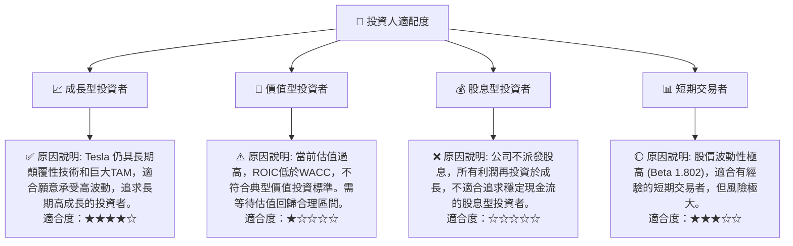

### 10.5 關鍵監控指標

投資者應密切關注以下關鍵指標，以動態評估 Tesla 的投資價值：

| 監控類型 | 指標 | 關注點 | 頻率 |
|----------|------|--------|------|
| **營運表現** | **季度交付量與產量** | 成長趨勢、新產品（Cybertruck、下一代車型）爬坡速度、全球各市場表現 | 每季度 |
| **盈利能力** | **毛利率與營業利益率** | 是否止跌回升、成本控制效果、定價策略影響 | 每季度 |
| **現金流** | **自由現金流 (FCF) 與 FCF 轉換率** | 是否穩定增長、資本支出效率、現金流是否能覆蓋再投資需求 | 每季度 |
| **技術進展** | **FSD 部署與功能提升** | 監管進展、商業化模式、用戶接受度、AI/機器人里程碑 | 持續關注 |
| **競爭格局** | **市場份額與競爭對手動向** | 特別是中國市場的競爭壓力、新進入者的威脅、行業價格戰情況 | 每季度/持續 |
| **財務健康** | **現金及債務水平** | 淨現金狀況、流動性比率、債務償還能力 | 每季度 |
| **估值** | **P/E (Forward) 與 FCF Yield** | 比較歷史區間與同業、評估市場預期是否合理 | 持續關注 |

---

> **免責聲明**：本報告為 AI 自動生成，僅供研究參考，不構成投資建議。投資有風險，入市需謹慎。