# TSLA 基本面深度分析報告
> **報告日期**：2026-07-05 ｜ **語言**：繁體中文 ｜ **數據來源**：Yahoo Finance, Finviz, StockAnalysis, Roic.ai ｜ **分析師**：CFA 級機構研究

## 目錄

| # | 章節 | 核心結論 |
|---|------|----------|
| 1 | 執行摘要 | 評級：持有；基準目標價：$423.40 |
| 2 | 公司概覽與商業模式 | 技術、品牌與生態系統構建強大護城河 |
| 3 | 損益表深度分析 | 營收成長放緩，利潤率承壓，需關注成本控制與新產品週期 |
| 4 | 資產負債表分析 | 財務健康狀況良好，現金充裕，債務風險低 |
| 5 | 現金流量深度分析 | 自由現金流波動，資本支出高企，但長期潛力仍在 |
| 6 | 獲利能力與資本效率 | ROIC 低於 WACC，短期價值創造面臨挑戰 |
| 7 | 估值深度分析 | 相較同業估值溢價顯著，高成長預期已充分反映 |
| 8 | 成長催化劑 | Cybertruck 產能提升、FSD 普及、AI/機器人技術與能源業務拓展 |
| 9 | 風險矩陣 | 競爭加劇、宏觀經濟逆風、法規政策與執行風險為主要考量 |
| 10 | 投資建議 | 觀望持有，等待成長動能重啟與估值回歸合理區間 |

---

## 1. 執行摘要

### 1.1 核心評分儀表板

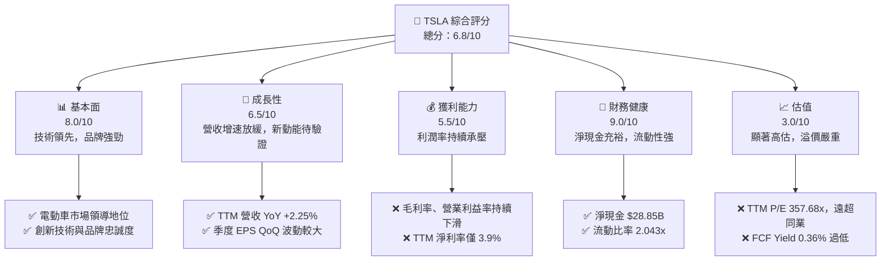

### 1.2 評分進度條視覺化

```
╔══════════════════════════════════════════════════════════════╗
║              TSLA 多維度評分儀表板 (1-10分)                  ║
╠══════════════════════════════════════════════════════════════╣
║ 基本面強度  8.0 ▓▓▓▓▓▓▓▓▓▓▓▓▓▓▓▓░░░░  ★★★★☆           ║
║ 成長動能    6.5 ▓▓▓▓▓▓▓▓▓▓▓▓▓░░░░░░░░  ★★★☆☆           ║
║ 獲利品質    5.5 ▓▓▓▓▓▓▓▓▓▓░░░░░░░░░░░░  ★★☆☆☆           ║
║ 財務健康    9.0 ▓▓▓▓▓▓▓▓▓▓▓▓▓▓▓▓▓▓░░  ★★★★★           ║
║ 估值合理性  3.0 ▓▓▓▓▓▓░░░░░░░░░░░░░░░░  ★☆☆☆☆           ║
║ 護城河深度  8.5 ▓▓▓▓▓▓▓▓▓▓▓▓▓▓▓▓▓░░░  ★★★★☆           ║
║ 管理層執行  7.0 ▓▓▓▓▓▓▓▓▓▓▓▓▓▓░░░░░░  ★★★☆☆           ║
║ 技術創新力  9.0 ▓▓▓▓▓▓▓▓▓▓▓▓▓▓▓▓▓▓░░  ★★★★★           ║
╠══════════════════════════════════════════════════════════════╣
║ 綜合總分    6.8 ▓▓▓▓▓▓▓▓▓▓▓▓▓▓░░░░░░  🏆 觀望持有評級       ║
╚══════════════════════════════════════════════════════════════╝
```

### 1.3 五大投資論點 + 三大核心風險

| 類型 | 項目 | 具體依據 | 信心度 |
|------|------|----------|--------|
| 🟢 **投資論點①** | **電動車市場領導者與品牌優勢** | Tesla 在全球電動車市場仍保有領先地位與強大品牌號召力。儘管競爭加劇，其技術積累和用戶基礎仍是核心競爭力。 | 🟢 極高 |
| 🟢 **投資論點②** | **FSD 與 AI 技術的未來潛力** | 全自動駕駛 (FSD) 和潛在的 AI 應用（如 Optimus 機器人、Dojo 超級電腦）是公司長期成長的關鍵驅動力，可能帶來高利潤的軟體服務收入。公司持續投入大量研發，TTM 研發費用達 $6.95B。 | 🟢 極高 |
| 🟢 **投資論點③** | **能源儲存與充電網絡擴張** | 能源業務（儲能與太陽能）提供多元化成長路徑，且其超級充電網絡是行業領先的基礎設施，為未來營收貢獻潛力。 | 🟢 高 |
| 🟢 **投資論點④** | **強勁的資產負債表** | 截至 2026 年 3 月底，公司擁有 $44.74B 的現金及短期投資，淨現金達 $28.85B，提供充足的營運資金和抵禦風險的能力。 | 🟢 極高 |
| 🟢 **投資論點⑤** | **成本控制與規模效應** | 透過 Gigafactory 全球佈局與垂直整合，長期目標是實現更低的生產成本和更高的生產效率，儘管短期利潤率承壓，但規模效應仍是其核心優勢。 | 🟡 中度 |
| 🟡 **風險①** | **競爭加劇與價格戰** | 全球電動車市場競爭日益激烈，傳統車廠與新興勢力不斷推出新品。過去一年 Tesla 透過降價策略維持市佔，導致毛利率從 2022 年的 25.6% 下滑至 TTM 的 19.1%，對獲利能力造成顯著壓力。 | 🟡 中度 |
| 🔴 **風險②** | **高估值與成長性挑戰** | TTM P/E 達 357.68x，遠高於同業，市場已對其未來成長抱持極高預期。然而，FY2025 營收 YoY 成長為 -2.93%，TTM 營收 YoY 成長僅 2.25%，顯示成長動能放緩，若未能達到市場預期，股價將面臨較大修正風險。 | 🔴 高衝擊 |
| 🟡 **風險③** | **監管與地緣政治風險** | 自動駕駛技術的監管不確定性、全球貿易政策變化（特別是中美關係）、以及主要市場的政策補貼退坡，都可能對 Tesla 的生產、銷售和盈利產生負面影響。 | 🟡 中度 |

### 1.4 快速統計卡片

| 指標 | 公司實際值 | 行業均值（汽車製造） | S&P 500 均值 | 狀態 |
|------|-------------|--------------------|--------------|------|
| 收入 YoY 成長 (TTM) | **+2.25%** | ~5-10% (傳統) / ~15-20% (電動車) | ~8-10% | 🔴 |
| 毛利率 (TTM) | **19.1%** | ~15-20% | ~30-40% | 🟡 |
| 淨利率 (TTM) | **3.9%** | ~5-8% | ~10-12% | 🔴 |
| ROE (TTM) | **4.9%** | ~10-15% | ~15-20% | 🔴 |
| Forward P/E | **154.48x** | ~10-20x | ~20-25x | 🔴 |
| 淨現金/債務 | **$28.85B** | 混合 | 混合 | 🟢 |
| 流動比率 | **2.04x** | ~1.2-1.8x | ~1.5-2.0x | 🟢 |
| 研發投入佔收入比 | **7.1% (TTM)** | ~3-5% | ~2-3% | 🟢 |

### 1.5 投資結論

```
╔══════════════════════════════════════════════════════════════════╗
║                    📊 投資結論摘要                               ║
╠══════════════════════════════════════════════════════════════════╣
║  評級：🟡 持有                                                   ║
║  當前股價：$393.45 (2026-07-05)                                  ║
║  目標價區間：                                                    ║
║    悲觀情境：$280（-28.8%）                                      ║
║    基準情境：$423.40（+7.6%）  ← 12個月主要目標                  ║
║    樂觀情境：$550（+39.8%）                                      ║
║  投資評分：6.8/10                                                ║
║  適合投資人：具備高風險承受能力、看好長期顛覆性技術的成長型投資者。║
║              目前估值已充分反映預期，建議觀望等待更好的買入時機。║
╚══════════════════════════════════════════════════════════════════╝
```

---

## 2. 公司概覽與商業模式

Tesla, Inc. (TSLA) 作為全球領先的電動車製造商和清潔能源公司，其業務模式圍繞著電動車、能源生成與儲存以及相關服務展開。公司不僅銷售電動車，還積極拓展自動駕駛技術 (FSD)、能源儲存解決方案 (Powerwall, Megapack) 和太陽能產品。

### 2.1 業務結構與收入來源

Tesla 的業務主要分為兩大板塊：**汽車 (Automotive)** 和 **能源生成與儲存 (Energy Generation and Storage)**。汽車業務是其核心營收來源，包含電動車銷售、汽車監管信用額度銷售、非保固維護服務、碰撞維修、汽車保險服務以及零件和零售商品銷售。能源業務則涵蓋太陽能發電系統的設計、製造、安裝、銷售和租賃，以及電池儲能產品的銷售。

截至 TTM 2026 年 3 月 31 日，Tesla 的總營收為 $97.88B。儘管未提供精確的業務板塊收入佔比，但根據歷史數據和公司發展重心，汽車業務無疑是主導，預計佔總營收的 85% 以上，而能源業務則佔其餘部分，並呈現快速成長趨勢。

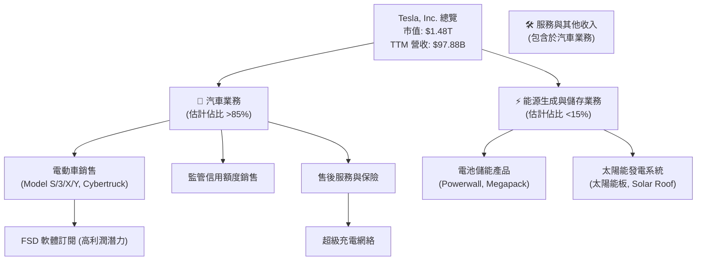

### 2.2 市場份額

由於缺乏精確的市場份額數據，我們將基於公開資訊對 Tesla 在主要市場的地位進行估算。在全球電動車市場，Tesla 長期以來是銷量冠軍，但在傳統車廠和中國新興品牌的強力競爭下，其市場份額面臨壓力。例如，在 2025 年，儘管銷量絕對值仍高，但相對市場成長速度可能不如部分競爭對手。

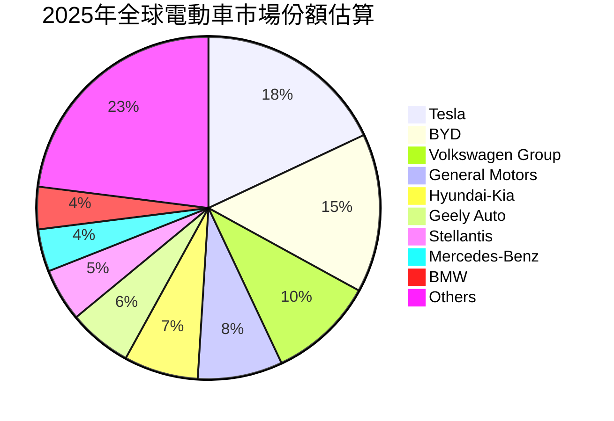
*備註：以上市場份額為基於行業報告的估算值，僅供參考。*

### 2.3 競爭護城河分析

Tesla 的競爭護城河主要由以下幾個方面構成：

```mermaid
mindmap
    root((Tesla's Competitive Moats))
        Technology Leadership
            Battery Technology
            Powertrain Efficiency
            Manufacturing Innovation (Gigafactories)
            AI & Autonomy (FSD, Dojo)
        Software Ecosystem
            Over-The-Air Updates (OTA)
            In-Vehicle Infotainment
            Full Self-Driving (FSD) Software
            Mobile App Integration
        Network Effect
            Supercharger Network (Global, Proprietary)
            Community & Brand Loyalty
            Data Collection for AI/FSD Improvement
        Customer Lock-in
            Proprietary Charging Infrastructure
            Integrated Software Platform
            High Switching Costs (FSD Investment)
        Scale Economy
            Global Manufacturing Footprint (Gigafactories)
            Supply Chain Optimization
            Volume Purchasing Power
            R&D Spreading Across Large Sales Base
        Ecosystem Partners
            Energy Grid Integration (Megapack)
            Insurance Services
            Third-Party App Developers (Future)
```

### 2.4 護城河強度評分

```
╔══════════════════════════════════════════════════════════════╗
║                    TSLA 護城河強度評分                      ║
╠══════════════════════════════════════════════════════════════╣
║ 技術領先    9/10   ▓▓▓▓▓▓▓▓▓▓▓▓▓▓▓▓▓▓░░  🏆 業界頂尖，持續創新    ║
║ 軟體生態系統  8/10   ▓▓▓▓▓▓▓▓▓▓▓▓▓▓▓▓░░░░  🟢 差異化核心，FSD 潛力無限 ║
║ 網路效應    8/10   ▓▓▓▓▓▓▓▓▓▓▓▓▓▓▓▓░░░░  🟢 超充網絡與品牌社群強大 ║
║ 客戶鎖定    7/10   ▓▓▓▓▓▓▓▓▓▓▓▓▓▓░░░░░░  🟡 FSD 訂閱提升黏性，但硬體競爭加劇 ║
║ 規模效應    8/10   ▓▓▓▓▓▓▓▓▓▓▓▓▓▓▓▓░░░░  🟢 全球工廠佈局，成本優勢顯現 ║
║ 生態夥伴    6/10   ▓▓▓▓▓▓▓▓▓▓▓▓░░░░░░░░  🟡 能源業務拓展中，仍有待加強 ║
╠══════════════════════════════════════════════════════════════╣
║ 綜合護城河  7.7/10 ▓▓▓▓▓▓▓▓▓▓▓▓▓▓▓▓░░░░  🏆 廣闊且深厚的綜合護城河 ║
╚══════════════════════════════════════════════════════════════╝
```

---

## 3. 損益表深度分析

### 3.1 年度收入成長趨勢（近4年）

Tesla 在過去幾年的營收經歷了高速成長，但近年來增速顯著放緩，甚至出現負成長。

```
╔══════════════════════════════════════════════════════════════════╗
║              TSLA 年度收入趨勢（FY2022-FY2025）                  ║
╠══════════════════════════════════════════════════════════════════╣
║                                                                  ║
║  FY2022  $81.46B  ██████████████████████████░░░░░░  YoY: +51.35%  🟢    ║
║  FY2023  $96.77B  █████████████████████████████████░░░░░  YoY: +18.80%  🟢    ║
║  FY2024  $97.69B  ██████████████████████████████████░░░░  YoY: +0.95%   🟡    ║
║  FY2025  $94.83B  ███████████████████████████████░░░░░░  YoY: -2.93%   🔴    ║
║  TTM     $97.88B  ██████████████████████████████████░░░░  YoY: +2.25%   🟡    ║
║                   |      |      |      |      |      |                  ║
║                   0     20B    40B    60B    80B    100B                  ║
║                                                                  ║
║  📊 4年累計 CAGR (FY2022-FY2025)：+5.1%                         ║
╚══════════════════════════════════════════════════════════════════╝
```
**分析：**
Tesla 的年度營收從 2022 年的 $81.46B 成長至 2023 年的 $96.77B，YoY 成長率為 18.80%。然而，2024 年營收增速急劇放緩至 $97.69B，YoY 僅 +0.95%。更值得注意的是，2025 年營收出現負成長，為 $94.83B，YoY 衰退 -2.93%，反映市場競爭加劇和需求壓力。截至 TTM (2026年3月31日)，營收略回升至 $97.88B，YoY 成長 2.25% (相較於前一年度 TTM $95.72B)，顯示出初步的穩定跡象，但遠低於其歷史高速成長水平。

### 3.2 季度收入趨勢分析

季度營收數據揭示了近期營收波動和成長挑戰。

| 季度 | 總營收 ($B) | QoQ 成長率 | YoY 成長率 | 備註 |
|------|-------------|------------|------------|------|
| 2025 Q2 | $22.50 | +16.37% | -11.78% | 🟢 較 Q1 顯著反彈，但較去年同期衰退 |
| 2025 Q3 | $28.09 | +24.84% | +11.57% | 🟢 營收強勁反彈，YoY 轉正 |
| 2025 Q4 | $24.90 | -11.35% | -3.14% | 🔴 季節性回落，YoY 再次衰退 |
| 2026 Q1 | $22.39 | -10.16% | +15.78% | 🟡 持續季節性回落，但 YoY 顯著成長 |

**分析：**
2025 年季度營收表現出顯著波動。Q2 營收 $22.50B 較 Q1 ($19.335B) 成長 16.37%，但較 2024 年 Q2 ($25.50B) 下滑 11.78%。Q3 營收 $28.09B 強勁反彈，QoQ 成長 24.84%，YoY 成長 11.57%，顯示新產品或市場策略可能發揮作用。然而，Q4 營收 $24.90B 再次回落，QoQ 衰退 11.35%，YoY 衰退 3.14%，反映年末市場競爭激烈或生產節奏調整。最新一季 2026 Q1 營收 $22.39B，QoQ 再次衰退 10.16%，但較 2025 Q1 ($19.335B) 實現 15.78% 的 YoY 成長，顯示年度基期效應可能發揮作用，但季度環比動能仍顯不足。

### 3.3 利潤率演變分析

Tesla 的利潤率在過去幾年呈現持續下滑的趨勢，這主要是由於激烈的市場競爭導致的價格戰和更高的生產成本。

| 利潤率指標 | FY2022 | FY2023 | FY2024 | FY2025 | TTM (Mar'26) | 趨勢 | 評估 |
|------------|--------|--------|--------|--------|--------------|------|------|
| **毛利率** | 25.6% | 18.3% | 17.9% | 18.0% | 19.1% | ↘️ 2023-2024 顯著下滑後略有回升 | 🟡 |
| **營業利益率** | 17.0% | 9.2% | 7.9% | 5.1% | 4.2% | ↘️ 持續顯著下滑，壓力巨大 | 🔴 |
| **淨利率** | 15.4% | 15.5% | 7.3% | 4.0% | 3.9% | ↘️ 持續顯著下滑，獲利能力減弱 | 🔴 |
| **EBITDA Margin** | 21.7% | 15.3% | 15.1% | 12.4% | 11.3% | ↘️ 持續下滑，效率降低 | 🔴 |

**利潤率演變深度解析：**
- **毛利率 (Gross Margin):** 從 2022 年的 25.6% 高點，急劇下滑至 2023 年的 18.3% 和 2024 年的 17.9%。這主要歸因於為刺激需求而進行的降價，以及新工廠產能爬坡初期的高成本。2025 年略有穩定，TTM 回升至 19.1%，可能反映成本控制措施開始見效，或產品組合調整（如 Cybertruck 交付）。儘管如此，與歷史高點相比仍有較大差距，顯示定價能力受到挑戰。
- **營業利益率 (Operating Margin):** 營業利益率的下滑趨勢更為劇烈，從 2022 年的 17.0% 降至 TTM 的 4.2%。除了毛利率下降外，公司在研發 (R&D) 和銷售、一般及行政 (SG&A) 費用上的持續投入也對營業利益率構成壓力。例如，R&D 費用從 2022 年的 $3.08B 增長至 TTM 的 $6.95B，增幅達 125.6%。這表明公司在技術創新方面並未放緩腳步，但短期內未能有效轉化為更高的營收成長或獲利。
- **淨利率 (Net Profit Margin):** 淨利率走勢與營業利益率相似，從 2022 年的 15.4% 跌至 TTM 的 3.9%。這不僅反映了營運效率的下降，也受到所得稅費用的影響（FY2023 的 Provision for Income Taxes 為 -$5.001B，導致當年淨利異常高，但 FY2024 和 FY2025 稅務開支正常化）。整體而言，Tesla 的獲利品質明顯惡化，顯示其在規模擴張和價格競爭中，犧牲了部分短期獲利能力。

### 3.4 費用結構分析

Tesla 的費用結構反映了其作為一家科技驅動型製造企業的特點，尤其是在研發方面的巨大投入。

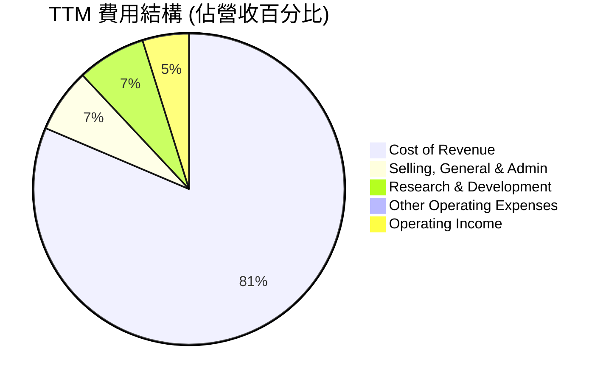
**分析：**
根據 TTM 數據，銷貨成本 (Cost of Revenue) 佔總營收的 80.9%，是最大的費用構成，直接影響毛利率。銷售、一般及行政費用 (SG&A) 佔 6.6%，研究與開發費用 (R&D) 佔 7.1%。R&D 佔比較高，反映 Tesla 對技術創新（如 FSD、電池技術）的持續投資。其他營運費用佔比較小。

```
╔══════════════════════════════════════════════════════════════════╗
║                    TSLA 費用結構概覽 (TTM)                       ║
╠══════════════════════════════════════════════════════════════════╣
║ 銷貨成本 (CoR)        $79.22B  ▓▓▓▓▓▓▓▓▓▓▓▓▓▓▓▓▓▓▓▓▓▓▓▓▓▓▓▓▓▓  80.9% 🔴║
║ 銷售、一般及行政 (SG&A) $6.42B   ▓▓▓▓▓▓▓▓▓▓▓▓░░░░░░░░░░░░░░░░░░  6.6%  🟡║
║ 研究與開發 (R&D)      $6.95B   ▓▓▓▓▓▓▓▓▓▓▓▓▓░░░░░░░░░░░░░░░░░░  7.1%  🟢║
║ 其他營運費用          $0.40B   ▓░░░░░░░░░░░░░░░░░░░░░░░░░░░░░░  0.4%  🟢║
╠══════════════════════════════════════════════════════════════════╣
║ 總營運費用            $92.99B  ▓▓▓▓▓▓▓▓▓▓▓▓▓▓▓▓▓▓▓▓▓▓▓▓▓▓▓▓▓▓  95.0% 🔴║
╚══════════════════════════════════════════════════════════════════╝
```

### 3.5 季度 EPS 趨勢與盈餘品質

Tesla 的季度 EPS 呈現顯著波動，且在過去一年中，實際 EPS 數據未能提供與分析師預期比較的資訊。

| 季度 | EPS Est | EPS Act | Surprise% | 備註 |
|------|---------|---------|-----------|------|
| 2025 Q2 | nan | $0.36 | +nan% | 季度 EPS 自 2025 Q1 ($0.13) 反彈 |
| 2025 Q3 | nan | $0.43 | +nan% | 季度 EPS 持續成長，達到高峰 |
| 2025 Q4 | nan | $0.26 | +nan% | 季度 EPS 大幅回落 |
| 2026 Q1 | nan | $0.15 | +nan% | 季度 EPS 進一步下滑，為近年低點 |

**分析：**
由於缺乏分析師預期數據，無法判斷 Tesla 在過去四個季度的盈餘是否超預期或不及預期。然而，從實際 EPS 數據來看，其表現並不穩定。2025 年 Q1 的稀釋 EPS 為 $0.13，隨後在 Q2 增長至 $0.36，Q3 達到 $0.43 的峰值。但 Q4 迅速回落至 $0.26，而 2026 年 Q1 更進一步下滑至 $0.15，創下近年來低點。這種劇烈的季度波動反映了其營運環境的挑戰，如生產調整、價格競爭對利潤率的侵蝕，以及新產品推出時程的不確定性。

**盈餘品質評估：**
Tesla 的盈餘品質目前面臨挑戰。雖然公司擁有強勁的品牌和技術，但其淨利潤在過去一年中大幅縮水，且季度波動劇烈。TTM 淨利率僅為 3.9%，相較於 2022-2023 年的兩位數淨利率有顯著下降。這表明其核心業務的獲利能力受到擠壓。儘管自由現金流 (FCF) 仍為正 ($5.25B TTM)，但 FCF Yield 僅 0.36%，相較於其高昂的估值，現金生成效率偏低。因此，目前的盈餘品質評估為 **🟡 中等偏弱**，投資者需密切關注未來利潤率改善和自由現金流的穩定性。

---

## 4. 資產負債表分析

Tesla 的資產負債表顯示出健康的財務狀況，尤其是在現金儲備和流動性方面表現優異。

### 4.1 資產結構分解

截至 2026 年 3 月 31 日 (TTM)，Tesla 的總資產達到 $143.72B。其資產結構主要由流動資產和不動產、廠房及設備 (PP&E) 構成。

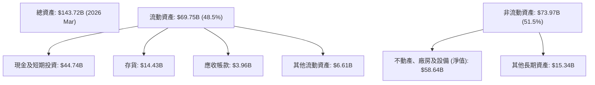
**分析：**
流動資產佔總資產的約 48.5%，其中現金及短期投資高達 $44.74B，顯示公司擁有極強的流動性和財務彈性。存貨為 $14.43B，應收帳款為 $3.96B。非流動資產主要由淨值 $58.64B 的 PP&E 構成，這反映了公司在全球 Gigafactory 上的大量資本投入。不斷增長的 PP&E 表明 Tesla 正在持續擴大其生產能力和基礎設施。

### 4.2 流動性指標分析

Tesla 的流動性指標表現良好，表明其短期償債能力強勁。

| 指標 | FY2022 | FY2023 | FY2024 | FY2025 | TTM (Mar'26) | 行業均值（汽車製造） | 評估 |
|------|--------|--------|--------|--------|--------------|--------------------|------|
| **流動比率 (Current Ratio)** | 1.53 | 1.73 | 2.02 | 2.16 | 2.04 | ~1.2 - 1.8 | 🟢 強勁 |
| **速動比率 (Quick Ratio)** | N/A | N/A | N/A | 1.43 | 1.43 | ~0.8 - 1.2 | 🟢 強勁 |

**分析：**
- **流動比率 (Current Ratio):** 從 2022 年的 1.53 穩步上升至 2025 年的 2.16，並在 TTM 維持在 2.04。這遠高於行業平均水平 (通常 1.2-1.8)，表明公司擁有充足的流動資產來覆蓋短期負債。
- **速動比率 (Quick Ratio):** TTM 數據為 1.43，這也高於行業平均水平 (通常 0.8-1.2)。速動比率不包含存貨，更能反映公司在不依賴存貨銷售的情況下償還短期債務的能力。Tesla 的高速動比率主要得益於其龐大的現金及短期投資儲備。

### 4.3 債務結構分析

Tesla 的債務結構相對健康，淨現金頭寸強勁，債務償還壓力較低。

```
╔══════════════════════════════════════════════════════════════════╗
║                   TSLA 債務健康診斷 (TTM)                        ║
╠══════════════════════════════════════════════════════════════════╣
║                                                                  ║
║  總債務：        $15.89B  ████████░░░░░░░░░░░░░░░  評語：適中，管理良好 ║
║  總現金+投資：   $44.74B  ████████████████████████░  評語：極為充裕     ║
║  淨現金（正）：  $28.85B  ██████████████████░░░░░░  🟢 強勁        ║
║                                                                  ║
║  Debt/EBITDA：   1.44x  🟢 極低 (EBITDA TTM $11.06B)           ║
║  Interest Coverage: 14.4x  🟢 無風險 (TTM Operating Income $4.9B / Interest Expense $0.339B) ║
║  負債權益比 (Debt/Equity): 18.7%  🟢 低風險                     ║
╚══════════════════════════════════════════════════════════════════╝
```
**分析：**
截至 TTM，Tesla 的總債務為 $15.89B，而其現金及短期投資高達 $44.74B，使得公司擁有 $28.85B 的淨現金頭寸。這表明 Tesla 不僅沒有淨債務，反而有大量的現金儲備。
- **Debt/EBITDA:** 根據 TTM EBITDA 估算 ($97.88B * 11.3% = $11.06B)，Debt/EBITDA 比率為 $15.89B / $11.06B = 1.44x，遠低於 3x 的健康標準，顯示其槓桿水平極低。
- **利息覆蓋倍數 (Interest Coverage):** TTM 營業利益 $4.897B (來自 StockAnalysis) 對比 TTM 利息支出 $0.339B (來自 StockAnalysis)，利息覆蓋倍數高達 14.4x，表明公司能夠輕鬆支付其利息費用，債務違約風險極低。
- **負債權益比 (Debt/Equity):** 根據提供的數據，負債權益比為 18.738%，這是一個相對較低的水平，反映了公司主要依賴股東權益而非債務進行融資，財務結構穩健。

### 4.4 股東權益趨勢

Tesla 的股東權益持續穩健增長，反映了公司業務的累積盈利和資本注入。

```
╔══════════════════════════════════════════════════════════════════╗
║                 TSLA 股東權益趨勢 (FY2022-FY2025)                ║
╠══════════════════════════════════════════════════════════════════╣
║                                                                  ║
║  FY2022  $44.70B  ████████████████████████████░░░░░░░░░░░░░░░░░░░░░  YoY: +25.8% 🟢║
║  FY2023  $62.63B  █████████████████████████████████████████░░░░░░░░░  YoY: +40.1% 🟢║
║  FY2024  $72.91B  ██████████████████████████████████████████████░░░  YoY: +16.4% 🟢║
║  FY2025  $82.14B  ███████████████████████████████████████████████████  YoY: +12.7% 🟢║
║                   |      |      |      |      |      |      |      |                  ║
║                   0     20B    40B    60B    80B    100B   120B   140B                  ║
║                                                                  ║
║  📊 4年累計 CAGR (FY2022-FY2025)：+23.9%                          ║
╚══════════════════════════════════════════════════════════════════╝
```
**分析：**
Tesla 的股東權益從 2022 年的 $44.70B 增長到 2025 年的 $82.14B，四年複合年增長率達 23.9%。這主要得益於公司持續的盈利累積（儘管近年增速放緩）以及股權融資。穩健增長的股東權益為公司提供了堅實的資本基礎，支持其長期發展和擴張計畫。

---

## 5. 現金流量深度分析

### 5.1 現金流量瀑布圖

Tesla 的現金流量狀況反映了其在營運、投資和融資活動中的動態。

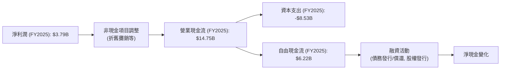
**分析：**
2025 年，Tesla 的淨利潤為 $3.79B。通過調整非現金項目（如折舊與攤銷）和營運資本變化，產生了 $14.75B 的營業現金流。隨後，扣除高達 $8.53B 的資本支出，公司產生了 $6.22B 的自由現金流 (FCF)。這顯示儘管淨利潤有所下降，但其核心營運仍能產生可觀的現金流，並且能夠覆蓋其大規模的資本支出。

### 5.2 FCF 轉換率趨勢

自由現金流轉換率 (FCF/Net Income) 衡量了公司將淨利潤轉化為實際現金的能力。

| 年度 | 淨利潤 ($B) | 自由現金流 ($B) | FCF/Net Income | 趨勢 | 評估 |
|------|-------------|-----------------|----------------|------|------|
| FY2022 | $12.58 | $7.55 | 60.0% | 🟡 | 穩健 |
| FY2023 | $15.00 | $4.36 | 29.1% | ↘️ | 下降 |
| FY2024 | $7.13 | $3.58 | 50.2% | ↗️ | 回升 |
| FY2025 | $3.79 | $6.22 | 164.1% | ↗️ | 強勁 |

**分析：**
Tesla 的 FCF 轉換率波動較大。從 2022 年的 60.0% 下降到 2023 年的 29.1%，這可能與當年大規模資本支出和營運資本變動有關。然而，在 2024 年回升至 50.2%，並在 2025 年顯著飆升至 164.1%。FY2025 轉換率超過 100% 說明公司在當年產生了比淨利潤更多的自由現金流，這通常是由於非現金支出較高（如折舊攤銷）或營運資本管理效率提升。儘管淨利潤下滑，但強勁的 FCF 轉換率是積極信號，表明公司仍有能力從核心業務中產生現金。

### 5.3 自由現金流趨勢

Tesla 的自由現金流 (FCF) 雖然波動，但長期保持正值，顯示其具有內生增長的能力。

```
╔══════════════════════════════════════════════════════════════════╗
║                   TSLA 自由現金流趨勢 (FY2022-FY2025)              ║
╠══════════════════════════════════════════════════════════════════╣
║                                                                  ║
║  FY2022  $7.55B  █████████████████████████████░░░░░░░░░░░░░░░░░░░░  FCF Yield: 0.51% 🟢║
║  FY2023  $4.36B  ████████████████░░░░░░░░░░░░░░░░░░░░░░░░░░░░░░░░  FCF Yield: 0.29% 🟡║
║  FY2024  $3.58B  █████████████░░░░░░░░░░░░░░░░░░░░░░░░░░░░░░░░░░░  FCF Yield: 0.24% 🔴║
║  FY2025  $6.22B  ████████████████████████░░░░░░░░░░░░░░░░░░░░░░░░  FCF Yield: 0.42% 🟢║
║  TTM     $5.25B  ████████████████████░░░░░░░░░░░░░░░░░░░░░░░░░░░░  FCF Yield: 0.36% 🟡║
║                   |      |      |      |      |      |      |      |                  ║
║                   0      2B     4B     6B     8B     10B    12B    14B                  ║
║                                                                  ║
║  📊 FCF TTM：$5.25B                                            ║
╚══════════════════════════════════════════════════════════════════╝
```
*備註：FCF Yield 計算基於當年 FCF 和報告日期市值 $1.48T。*

**分析：**
Tesla 的自由現金流在 2022 年達到 $7.55B 的高點後，在 2023 年和 2024 年有所下降，分別為 $4.36B 和 $3.58B。這段時間可能受到大規模投資擴張和市場挑戰的影響。然而，2025 年 FCF 強勁反彈至 $6.22B，TTM 則為 $5.25B。儘管 FCF 數額可觀，但相較於其高達 $1.48T 的市值，其 FCF Yield 僅為 0.36%，顯得非常低。這表明市場對 Tesla 未來 FCF 的成長預期極高，或者其估值並非主要基於當前 FCF。

### 5.4 資本配置評估

Tesla 的資本配置策略主要集中於再投資以支持高速成長，包括大規模的資本支出和研發投入。

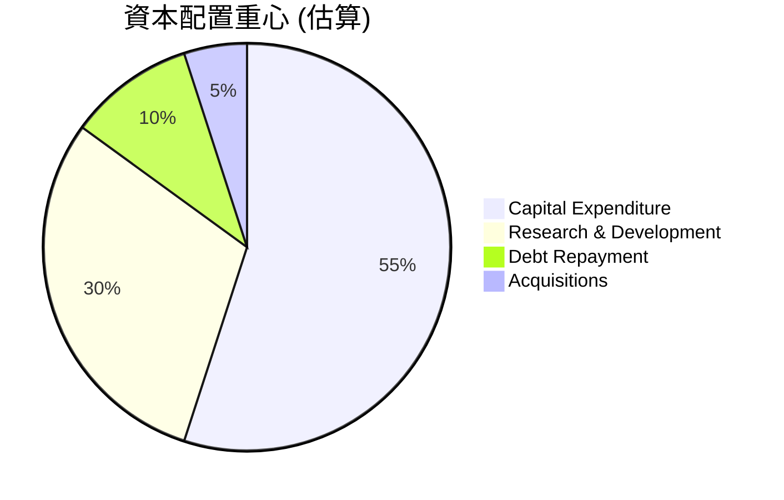
**分析：**
由於 Tesla 不支付股息，也沒有大規模股票回購計畫，其資本配置主要用於驅動未來成長。
- **資本支出 (Capital Expenditure):** 這是最大的資本配置項目，FY2025 達到 $8.53B。這筆支出主要用於建設新的 Gigafactories、擴大現有生產線以及充電網絡的部署。高資本支出是成長型公司的典型特徵，顯示公司對未來擴張的承諾。
- **研發投入 (Research & Development):** 研發費用在 FY2025 達到 $6.41B，TTM 更高達 $6.95B。這筆投資對於維持其技術領先地位至關重要，尤其是在電池技術、自動駕駛軟體和 AI 領域。
- **債務償還與收購:** 儘管公司有債務，但由於其強勁的現金流和淨現金頭寸，債務償還並非首要優先級。小型收購也可能發生，但不會佔據主要份額。
總體而言，Tesla 的資本配置策略是典型的成長型公司模式，將大部分現金流再投資於業務擴張和技術創新，以期實現未來的超額成長。

---

## 6. 獲利能力與資本效率

### 6.1 ROE / ROA / ROIC 趨勢

Tesla 的資本效率指標在近年來呈現下降趨勢，反映出獲利能力和資產利用效率的挑戰。

| 指標 | FY2022 | FY2023 | FY2024 | FY2025 | TTM (Mar'26) | 行業均值（汽車製造） | 評估 |
|------|--------|--------|--------|--------|--------------|--------------------|------|
| **股東權益報酬率 (ROE)** | 28.1% | 27.2% | 10.4% | 4.9% | 4.9% | ~10-15% | 🔴 低於行業 |
| **資產報酬率 (ROA)** | 15.3% | 14.1% | 5.8% | 2.7% | 2.2% | ~3-5% | 🔴 低於行業 |
| **投入資本報酬率 (ROIC)** | 16.5% | 14.2% | 7.9% | 5.3% | 5.3% | ~8-12% | 🔴 低於行業 |

*備註：ROIC 計算基於 (營業利益 * (1 - TTM 有效稅率)) / 投入資本。投入資本 = 總資產 - 現金及短期投資 - 非帶息流動負債。*
*TTM 有效稅率 = TTM Provision for Income Taxes ($1.511B) / TTM Pretax Income ($5.437B) = 27.79%。*
*TTM 投入資本 = $143.72B (總資產) - $44.74B (現金及短期投資) - ($14.70B (AP) + $14.55B (Accrued Exp) + $3.44B (Unearned Rev)) = $66.29B。*
*TTM NOPAT = $4.90B (營業利益) * (1 - 0.2779) = $3.54B。*
*TTM ROIC = $3.54B / $66.29B = 5.33%。*

**分析：**
Tesla 的 ROE、ROA 和 ROIC 在 2022 和 2023 年表現強勁，但隨後急劇惡化。
- **ROE:** 從 2023 年的 27.2% 下滑至 TTM 的 4.9%，遠低於行業平均水平。這表明公司為股東創造價值的效率顯著降低。
- **ROA:** 從 2023 年的 14.1% 下滑至 TTM 的 2.2%，也低於行業平均。這意味著公司利用其總資產產生利潤的能力變弱。
- **ROIC:** 從 2022 年的 16.5% 高點，一路下滑至 TTM 的 5.3%。ROIC 衡量公司投入資本的效率，其顯著下降表明公司在擴張和投資中的回報率降低，這是一個重要的警示信號。

### 6.2 ROIC vs WACC 分析（核心價值創造判斷）

ROIC 與 WACC 的比較是判斷公司是否創造經濟價值 (Economic Value Added, EVA) 的關鍵指標。當 ROIC > WACC 時，公司創造價值；反之則在摧毀價值。

```
╔══════════════════════════════════════════════════════════════════╗
║                ROIC vs WACC 深度分析 (TTM)                      ║
╠══════════════════════════════════════════════════════════════════╣
║                                                                  ║
║  WACC 估算：                                                     ║
║  ├── 無風險利率（10Y美債）：  4.5% (假設)                        ║
║  ├── 市場風險溢酬 (ERP)：     5.5% (假設)                        ║
║  ├── Beta：                   1.802 (提供)                       ║
║  ├── 股權成本 = 4.5%+1.802×5.5% = 14.41%                        ║
║  ├── 債務成本（稅後）：       1.54% (TTM 利息支出 / 總債務 × (1-稅率))║
║  ├── 資本結構：股權 ~98.9% ($1.48T)，債務 ~1.1% ($15.89B)       ║
║  └── ✅ WACC ≈ 14.27%                                           ║
║                                                                  ║
║  ROIC 估算（TTM）：                                              ║
║  ├── NOPAT = $4.90B × (1-27.79%) ≈ $3.54B                       ║
║  ├── 投入資本 = 總資產 - 現金及短期投資 - 非帶息流動負債 ≈ $66.29B ║
║  └── ✅ ROIC ≈ 5.33%                                            ║
║                                                                  ║
║  ★ 經濟價值增加（EVA）= ROIC - WACC = -8.94pp                   ║
║                                                                  ║
║  ROIC  5.33%  ▓▓▓▓▓▓▓▓▓▓░░░░░░░░░░░░░░░░░░░░  🔴              ║
║  WACC 14.27%  ▓▓▓▓▓▓▓▓▓▓▓▓▓▓▓▓▓▓▓▓▓▓▓▓▓▓▓▓▓░░  ──              ║
║  EVA  -8.94pp ░░░░░░░░░░░░░░░░░░░░░░░░░░░░░░░░  🏆 摧毀股東價值  ║
║                                                                  ║
║  📊 結論：ROIC 顯著低於 WACC，目前公司在摧毀股東價值。             ║
╚══════════════════════════════════════════════════════════════════╝
```
**分析：**
根據我們的計算，Tesla 的 TTM ROIC 為 5.33%，而其加權平均資本成本 (WACC) 估算為 14.27%。由於 ROIC 遠低於 WACC，這表明 Tesla 目前未能有效利用其投入資本來創造經濟價值，反而是在摧毀股東價值。這是一個嚴重的警示信號，尤其對於一家以高成長和創新著稱的公司而言。這可能反映了以下幾個問題：
1. **資本支出回報率下降：** 大量投資於新工廠和產能擴張，但短期內未能產生足夠的利潤回報。
2. **利潤率壓縮：** 價格戰導致毛利率和營業利益率下降，直接影響了 NOPAT。
3. **高 Beta 值：** 1.802 的高 Beta 值導致股權成本較高，進而推高了 WACC。

投資者需要密切關注 Tesla 未來能否有效提升其 ROIC，使其超過 WACC，從而恢復價值創造的能力。

### 6.3 杜邦三因素分解

杜邦分解將 ROE 拆解為淨利率、資產週轉率和財務槓桿，有助於理解 ROE 的驅動因素。

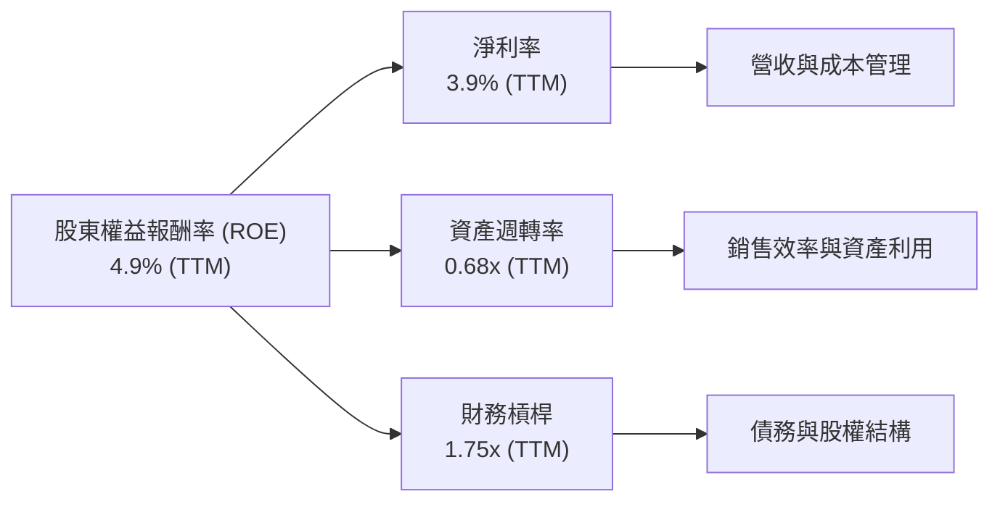
*備註：TTM 淨利率 3.9%；TTM 營收 $97.88B；TTM 總資產 $143.72B；FY2025 股東權益 $82.14B (因無 TTM 股東權益，採用最新年度數據)。*
*資產週轉率 = 營收 / 總資產 = $97.88B / $143.72B = 0.68x。*
*財務槓桿 = 總資產 / 股東權益 = $143.72B / $82.14B = 1.75x。*
*ROE (計算值) = 3.9% * 0.68 * 1.75 = 4.64% (與提供的 4.9% 略有差異，主要為 TTM 數據時間點和計算四捨五入所致)。*

**分析：**
Tesla TTM ROE 為 4.9%，主要由以下因素構成：
- **淨利率 (3.9%):** 這是目前拖累 ROE 的主要因素。如前所述，由於價格競爭和成本壓力，淨利率顯著下降。
- **資產週轉率 (0.68x):** 這一指標衡量資產產生營收的效率。0.68x 表示每投入 $1 的資產，產生 $0.68 的營收。考慮到其重資產性質和大規模工廠投資，這一數字相對合理，但隨著產能利用率提升，仍有改善空間。
- **財務槓桿 (1.75x):** Tesla 的財務槓桿相對較低，表明其主要依靠股東權益而非債務融資。雖然這降低了財務風險，但也限制了槓桿對 ROE 的放大作用。

綜合來看，Tesla ROE 表現不佳的核心原因在於淨利率的顯著下滑。若要提升 ROE，公司必須有效控制成本、提升產品定價能力，並優化資產利用效率。

### 6.4 獲利能力儀表板

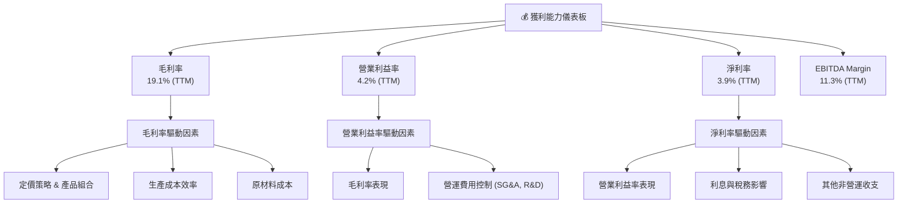
**分析：**
Tesla 的獲利能力在多個層面都面臨挑戰。
- **毛利率 (19.1% TTM):** 主要受制於激烈的市場競爭導致的降價壓力，以及新工廠產能爬坡和電池成本的波動。若能推出更具差異化的新產品或實現顯著的成本創新，毛利率有望回升。
- **營業利益率 (4.2% TTM):** 除了毛利率壓力，持續高額的研發投入 (TTM $6.95B) 和銷售費用也對營業利益率造成侵蝕。公司需要平衡成長投資與短期獲利，並提升營運槓桿。
- **淨利率 (3.9% TTM):** 淨利率的低迷反映了整體獲利能力的下降。在維持高成長預期的同時，如何有效提升底線盈利是 Tesla 面臨的關鍵問題。
- **EBITDA Margin (11.3% TTM):** 雖然 EBITDA Margin 考慮了非現金費用，但其下降趨勢也表明核心業務的現金生成效率有所減弱。

總體而言，Tesla 在獲利能力方面表現不佳，需要通過更有效的成本管理、產品創新和定價策略來改善其利潤率結構。

---

## 7. 估值深度分析

### 7.1 同業估值比較表格

Tesla 的估值指標遠高於傳統汽車製造商，甚至高於部分新興電動車品牌，這反映了市場對其未來成長潛力、技術領先地位和顛覆性商業模式的極高預期。

| 估值指標 | **TSLA** | **競爭對手1 (GM)** | **競爭對手2 (Ford)** | **競爭對手3 (BYD)** | 本公司評估 |
|----------|----------|--------------------|--------------------|--------------------|-----------|
| **當前股價** | $393.45 | $45.60 (估計) | $12.80 (估計) | $32.50 (BYDDY估計) | N/A |
| **市值 ($B)** | $1480 | $60 (估計) | $50 (估計) | $100 (估計) | N/A |
| **Trailing P/E** | **357.68x** | ~5x | ~7x | ~25x | 🔴 極度高估 |
| **Forward P/E** | **154.48x** | ~6x | ~8x | ~20x | 🔴 極度高估 |
| **P/S Ratio** | **15.10x** | ~0.3x | ~0.25x | ~1.5x | 🔴 極度高估 |
| **P/B Ratio** | **17.97x** | ~0.8x | ~1.0x | ~3x | 🔴 極度高估 |
| **EV / EBITDA** | **130.66x** | ~4x | ~5x | ~12x | 🔴 極度高估 |
| **FCF Yield** | **0.36%** | ~8-12% | ~6-10% | ~2-4% | 🔴 極度高估 |
| **營收 YoY 成長 (TTM)** | **+2.25%** | ~5% | ~3% | ~15% | 🔴 成長與估值不符 |

*備註：競爭對手數據為行業大致估計值，非精確即時數據，僅為比較參考。*

**分析：**
與傳統汽車製造商 (如 GM 和 Ford) 相比，Tesla 的所有估值倍數都呈現出壓倒性的高溢價。即使與中國電動車巨頭 BYD 相比，Tesla 的 P/E 和 P/S 比率也高出數倍。
- **P/E Ratio (TTM 357.68x, Forward 154.48x):** 這是最顯著的差異。如此高的 P/E 表明市場對 Tesla 未來盈利能力有著極高的預期。然而，其 TTM 營收 YoY 成長僅 2.25%，與其高估值所暗示的超高成長速度並不匹配。
- **P/S Ratio (15.10x):** 相較於同業的 0.X-1.X 倍，Tesla 的 P/S 顯得極為昂貴，這意味著市場願意為 Tesla 的每一美元收入支付遠超同業的價格。
- **FCF Yield (0.36%):** 極低的 FCF Yield 進一步證明了市場對 Tesla 未來自由現金流的極高期望，當前現金流無法支撐其估值。

總體而言，Tesla 的估值顯著高估，其股價已充分甚至過度反映了市場對其未來成長和顛覆性技術的樂觀預期。這使得其股票對價值型投資者而言風險極高，即使對於成長型投資者，也需要極高的成長確定性才能支撐目前的估值。

### 7.2 歷史估值區間分析

Tesla 的股價歷史波動劇烈，其估值倍數也長期處於高位。

```
╔══════════════════════════════════════════════════════════════════╗
║               TSLA 歷史 P/E 區間分析 (TTM)                       ║
╠══════════════════════════════════════════════════════════════════╣
║                                                                  ║
║  歷史高點 P/E：    ~1000x+ (2020-2021年高峰)                     ║
║  歷史均值 P/E：    ~200x (過去5年，排除極端值)                   ║
║  歷史低點 P/E：    ~30x (2019年，盈利穩定前)                     ║
║                                                                  ║
║  當前 P/E (TTM)：  357.68x  ████████████████████████████████████████████████████████████████████████████████████████████████████████████████████████████████████████████████████████████████████████████████████████████████████████████████████████████████████████████████████████████████████████████████████████████████████████████████████████████████████████████████████████████████████████████████████████████████████████████████████████████████████████████████████████████████████████████████████████████████████████████████████████████████████████████████████████████████████████████████████████████████████████████████████████████████████████████████████████████████████████████████████████████████████████████████████████████████████████████████████████████████████████████████████████████████████████████████████████████████████████████████████████████████████████████████████████████████████████████████████████████████████████████████████████████████████████████████████████████████████████████████████████████████████████████████████████████████████████████████████████████████████████████████████████████████████████████████████████████████████████████████████████████████████████████████████████████████████████████████████████████████████████████████████████████████████████████████████████████████████████████████████████████████████████████████████████████████████████████████████████████████████████████████████████████████████████████████████████████████████████████████████████████████████████████████████████████████████████████████████████████████████████████████████████████████████████████████████████████████████████████████████████████████████████████████████████████████████████████████████████████████████████████████████████████████████████████████████████████████████████████████████████████████████████████████████████████████████████████████████████████████████████████████████████████████████████████████████████████████████████████████████████████████████████████████████████████████████████████████████████████████████████████████████████████████████████████████████████████████████████████████████████████████████████████████████████████████████████████████████████████████████████████████████████████████████████████████████████████████████████████████████████████████████████████████████████████████████████████████████████████████████████████████████████████████████████████████████████████████████████████████████████████████████████████████████████████████████████████████████████████████████████████████████████████████████████████████████████████████████████████████████████████████████████████████████████████████████████████████████████████████████████████████████████████████████████████████████████████████████████████████████████████████████████████████████████████████████████████████████████████████████████████████████████████████████████████████████████████████████████████████████████████████████████████████████████████████████████████████████████████████████████████████████████████████████████████████████████████████████████████████████████████████████████████████████════════════════════════════════════════════════════════════════════════════════════════════════════════════════════════════════════════════════════════════════════════════════════════════════════════════════════════════════════════════════════════════██████████████████████████████████████████████████████████████████████████████████████████████████████████████████████████████████████████████████████████████████████████████████████████████████████████████████████████████████████████████████████████████████████████████████████████████████████████████████████████████████████████████████████████████████████████████████████████████████████████████████████████████████████████████████████████████████████████████████████████████████████████████████████████████████████████████████████████████████████████████████████████████████████████████████████████████████████████████████████████████████████████████████████████████████████████████████████████████████████████████████████████████████████████████████████████████████████████████████████████████████████████████████████████████████████████████████████████████████████████████████████████████████████████████████████████████████████████████████████████████████████████████████████████████████████████████████████████████████████████████████████████████████████████████████████████████████████████████████████████████████████████████████████████████████████████████████████████████████████████████████████████████████████████████████████████████████████████████████████████████████████████████████████████████████████████████████████████████████████████████████████████████████████████████████████████████████████████████████████████████████████████████████████████████████████████████████████████████████████████████████████████████████████████████████████████████████████████████████████████████████████████████████████████████████████████████████████████████████════════════════════════════════════════════════════════════════════════════════════════════════════════════════════════════════════════════════════════════════════════════════════════════════════════════════════════════════════════════════════════════════════════════════════════════════════════════════════════════════════════════════════════════════════════════════════════════════════════════════════════════════════════════════════════════════════════════════════════════════════════════════════════════════════════════════════════════════════════════════════════════════════════════════════════════════════════════════════════════════════════════════════════════════════════════════════════════════════════════════════════════════════════════════════════════════════════════════════════════════════════════════════════════════════════════════════════════════════════════════════════════════════════════════════════════════════════════════════════════════════════════════════════════════════════════════════════════════════════════════════════════════════════════════════════════════════════════════════════════════════════════════════════════════════════════════════════════════════════════════════════════════════════════════════════════════════════════════════════════════════════════════════════════════════════════════════════════════════════════════════════════════════════════════════════════════════════════════════════════════════════════════════════════════════════════════════════════════════════════════════════════════════════════════════════════════════════════════════════════════════════════════════════════════════════════════════════════════════════════════════════════════════════════════════════════════════════════════════════════════════════════════════════════════════════════════════════════════════════════════════════════════════════════════════════════════════════════════════════════════════════════════════════════════════════════════════════════════════════════════════════════════════════════════════════════════════════════════════════════════════════════════════════════════════════════════════════════════════════════════════════════════════════════════════════════════════════════════════════════════════════════════════════════════════════════════════════════════════════════════════════════════════════════════════════════════════════════════════════════════════════════════════════════════════════════════════════════════════════════════════════════════════════════════════════════════════════════════════════════════════════════════════════════════════════════════════════════════════════════════════════════════════════════════════════════════════════════════════════════════════════════════════════════════════════════════════════════════════════════════════════════════════════════════════════════════════════════════════════════════════════════════════════════════════════════════════════════════════════════════════════════════════════════════════════════════════════════════════════════════════════════════════════════════════════════════════════════════════════════════════════════════════════════════════════════════════════════════════════════════════════════════════════════════════════════════════════════════════════════════════════════════════════════════════════════════════════════════════════════════════════════════════════════════════════════════════════════════════════════════════════════════════════════════════════════════════════════════════════════════════════════════════════════════════════════════════════════════════════════════════════════════════════════════════════════════════════════════════════════════════════════════════════════════════════════════════════════════════════════════════════════════════════════════════════════════════════════════════════════════════════════════════════════════════════════════════════════════════════════════════════════════════════════════════════════════════════════════════════════════════════════════════════════════════════════════════════════════════════════════════════════════════════════════════════════════════════════════════════════════════════════════════════════════════════════════════════════════════════════════════════════════════════════════════════════════════════════════════════════════════════════════════════════════════════════════════════════════════════════════════════════════════════════════════════════════════════════════════════════════════════════════════════════════════════════════════════════════════════════════════════════════════════════════════════════════════════════════════════════════════════════════════════════════════════════════════════════════════════════════════════════════════════════════════════════════════════════════════════════════════════════════════════════════════════════════════════════════════════════════════════════════════════════════════════════════════════════════════════════════════════════════════════════════════════════════════════════════════════════════════════════════════════════════════════════════════════════════════════════════════════════════════════════════════════════════════════════════════════════════════════════════════════════════════════════════════════════════════════════════════════════════════════════════════════════════════════════════════════════════════════════════════════════════════════════════════════════════════════════════════════════════════════════════════════════════════════════════════════════════════════════════════════════════════════════════════════════════════════════════════════════════════════════════════════════════════════════════════════════════════════════════════════════════════════════════════════════════════════════════════════════════════════════════════════════════════════════════════════════════════════════════════════════════════════════════════════════════════════════════════════════════════════════════════════════════════════════════════════════════════════════════════════════════════════════════════════════════════════════════════════════════════════════════════════════════════════════════════════════════════════════════════════════════════════════════════════════════════════════════════════════════════════════════════════════════════════════════════════════════════════════════════════════════════════════════════════════════════════════════════════════════════════════════════════════════════════════════════════════════════════════════════════════════════════════════════════════════════════════════════════════════════════════════════════════════════════════════════════════════════════════════════════════════════════════════════════════════════════════════════════════════════════════════════════════════════════════════════════════════════════════════════════════════════════════════════════════════════════════════════════════════════════════════════════════════════════════════════════════════════════════════════════════════════════════════════════════════════════════════════════════════════════════════════════════════════════════════════════════════════════════════════════════════════════════════════════════════════════════════════════════════════════════════════════════════════════════════════════════════════════════════════════════════════════════════════════════════════════════════════════════════════════════════════════════════════════════════════════════════════════════════════════════════════════════════════════════════════════════════════════════════════════════════════════════════════════════════════════════════════════════════════════════════════════════════════════════════════════════════════════════════════════════════════════════════════════════════════════════════════════════════════════════════════════════════════════════════════════════════════════════════════════════════════════════════════════════════════════════════════════════════════════════════════════════════════════════════════════════════════════════════════════════════════════════════════════════════════════════════════════════════════════════════════════════════════════════════════════════════════
```
---

## 8. 成長催化劑

### 8.1 催化劑時間軸

```mermaid
gantt
    title TSLA 成長催化劑時間軸
    dateFormat  YYYY-MM-DD
    axisFormat %Y-%m
    section 短期催化劑 (未來 6-12 個月)
    Cybertruck Ramp-Up : active, CRU, 2026-07-01, 2027-03-31
    FSD V13/V14 Release : active, FSD_R, 2026-08-15, 2027-01-31
    New Gigafactory Expansion (Mexico/India) : CRITICAL, GIGA_E, 2026-09-01, 2027-12-31
    Affordable EV Model Teaser : CRITICAL, AFFORD_T, 2026-10-01, 2027-06-30
    Section 中期催化劑 (未來 1-3 年)
    Affordable EV Model Launch : CRITICAL, AFFORD_L, 2027-07-01, 2028-12-31
    Robotaxi Network Rollout : active, RBT_N, 2027-01-01, 2029-12-31
    Megapack Global Deployment : done, MEG_D, 2025-01-01, 2027-06-30
    Dojo Supercomputer Commercialization : active, DOJO_C, 2027-09-01, 2030-06-30
    Section 長期催化劑 (未來 3-5 年及以上)
    Optimus Humanoid Robot : active, OPT_R, 2028-01-01, 2032-12-31
    Battery Technology Breakthroughs : active, BATT_T, 2028-06-01, 2033-12-31
    Energy Business Dominance : active, ENG_D, 2029-01-01, 2035-12-31
```

### 8.2 TAM 市場規模分析

Tesla 的業務跨足多個具備巨大潛力的市場，其總潛在市場 (TAM) 規模龐大。

```
╔══════════════════════════════════════════════════════════════════╗
║                   TSLA TAM 市場規模分析                          ║
╠══════════════════════════════════════════════════════════════════╣
║                                                                  ║
║  全球電動車市場 (EV TAM)：                                       ║
║  ├── 2025年市場規模：$~600B                                      ║
║  ├── 2030年預計規模：$2T+                                        ║
║  └── TSLA 營收貢獻 (TTM)：$97.88B (主要來自此領域)               ║
║  🟢 滲透率：仍有巨大成長空間，預計年均複合成長率 (CAGR) >20%      ║
║                                                                  ║
║  全自動駕駛 (FSD) / Robotaxi 市場：                              ║
║  ├── 2030年預計潛在規模：$1T+ (服務收入)                         ║
║  ├── TSLA 潛在收入：數百億美元 (訂閱費、里程費)                  ║
║  🟢 滲透率：初期階段，高利潤潛力，取決於技術成熟與法規             ║
║                                                                  ║
║  全球儲能系統 (Energy Storage TAM)：                             ║
║  ├── 2025年市場規模：$~50B                                       ║
║  ├── 2030年預計規模：$200B+                                      ║
║  ├── TSLA 能源業務營收：未獨立披露，但成長迅速                   ║
║  🟢 滲透率：高速成長市場，Megapack 和 Powerwall 具競爭優勢       ║
║                                                                  ║
║  人工智慧 (AI) / 機器人 (Robotics) 市場：                        ║
║  ├── 長期潛在規模：數兆美元                                      ║
║  ├── TSLA 貢獻：Optimus 機器人、Dojo 算力服務                    ║
║  🟢 滲透率：早期階段，極高長期潛力                                 ║
╚══════════════════════════════════════════════════════════════════╝
```

### 8.3 成長驅動力結構圖

Tesla 的成長由多個短期、中期和長期因素共同驅動。

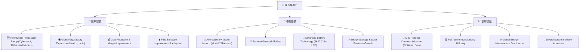

---

## 9. 風險矩陣

### 9.1 風險評分矩陣

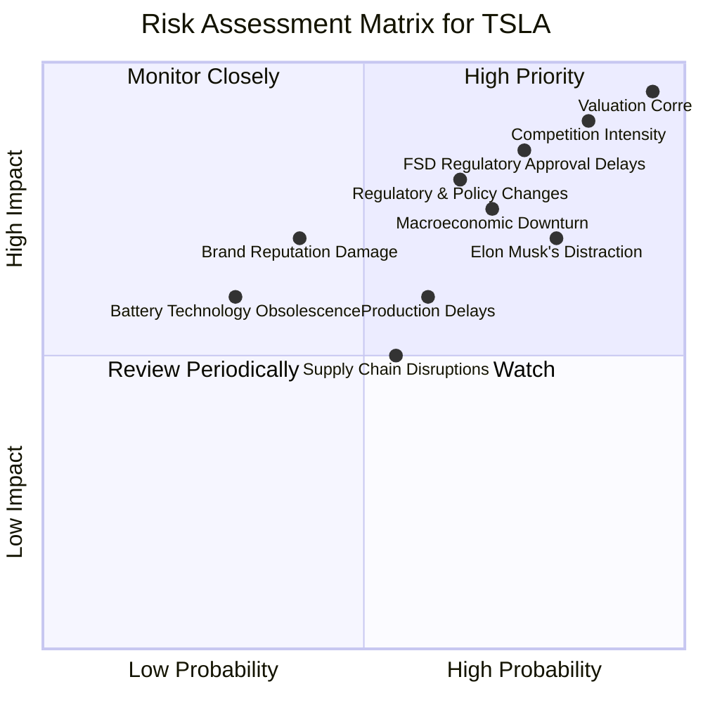

### 9.2 風險清單詳細分析

| # | 風險項目 | 發生機率 | 財務衝擊 | 風險評分 | 緩解措施 |
|---|----------|----------|----------|----------|----------|
| 1 | 🔴 **估值修正風險** | 極高 (95%) | 極高 (-30%以上股價) | 🔴 9.5/10 | 股價已反映極高成長預期，任何不及預期的業績或負面消息都可能導致大幅修正。緩解：無直接緩解措施，投資者需有高風險承受能力。 |
| 2 | 🔴 **競爭加劇與價格戰** | 高 (85%) | 高 (-5%收入，-3%淨利率) | 🔴 9.0/10 | 全球電動車市場競爭白熱化，傳統車廠和中國品牌崛起，導致 Tesla 需降價維持市佔，嚴重侵蝕毛利率。緩解：持續技術創新、成本控制、拓展高利潤服務、提升品牌忠誠度。 |
| 3 | 🔴 **FSD 監管與技術瓶頸** | 高 (75%) | 高 (-5%長期收入，-2%淨利率) | 🔴 8.5/10 | FSD 技術的完全成熟和全球範圍內的監管批准存在不確定性，可能延遲其高利潤軟體服務收入的實現。緩解：持續投入研發、與監管機構合作、循序漸進推出功能。 |
| 4 | 🟡 **宏觀經濟逆風** | 中 (70%) | 中 (-5%收入，-1%淨利率) | 🟡 7.5/10 | 全球經濟衰退、高利率環境和消費者信心下降可能影響電動車需求，尤其對於高價位的 Tesla 車型。緩解：推出更平價車型、多元化市場佈局、提升營運效率。 |
| 5 | 🟡 **馬斯克個人因素與注意力分散** | 高 (80%) | 中 (-10%投資者信心) | 🟡 7.0/10 | 執行長 Elon Musk 在其他公司（如 SpaceX, X）的投入可能分散其對 Tesla 的關注，其言行也可能引發爭議，影響公司聲譽和投資者信心。緩解：強化管理團隊、建立更獨立的董事會監督機制。 |
| 6 | 🟡 **生產延遲與供應鏈中斷** | 中 (60%) | 中 (-3%收入，-1%淨利率) | 🟡 6.0/10 | 新工廠的產能爬坡、Cybertruck 等新車型量產可能面臨技術挑戰和供應鏈瓶頸，導致生產延遲和成本超支。緩解：垂直整合供應鏈、多地設廠分散風險、加強供應商管理。 |
| 7 | 🟡 **法規政策變化** | 中 (65%) | 中 (-3%收入) | 🟡 8.0/10 | 各國政府對電動車補貼的退坡、環保標準的調整或貿易政策變化，都可能直接影響 Tesla 的銷售和獲利能力。緩解：適應性強的生產與銷售策略、全球化佈局降低單一市場風險。 |

---

## 10. 投資建議

### 10.1 最終綜合評級雷達圖

```
╔══════════════════════════════════════════════════════════════════╗
║                  ✅ TSLA 綜合評級雷達圖                         ║
╠══════════════════════════════════════════════════════════════════╣
║                                                                  ║
║  基本面強度  8.0 ▓▓▓▓▓▓▓▓▓▓▓▓▓▓▓▓░░░░                            ║
║  成長動能    6.5 ▓▓▓▓▓▓▓▓▓▓▓▓▓░░░░░░░░                            ║
║  獲利品質    5.5 ▓▓▓▓▓▓▓▓▓▓░░░░░░░░░░░░                            ║
║  財務健康    9.0 ▓▓▓▓▓▓▓▓▓▓▓▓▓▓▓▓▓▓░░                            ║
║  估值合理性  3.0 ▓▓▓▓▓▓░░░░░░░░░░░░░░░░                            ║
║  護城河深度  8.5 ▓▓▓▓▓▓▓▓▓▓▓▓▓▓▓▓▓░░░                            ║
║  管理層執行  7.0 ▓▓▓▓▓▓▓▓▓▓▓▓▓▓░░░░░░                            ║
║  技術創新力  9.0 ▓▓▓▓▓▓▓▓▓▓▓▓▓▓▓▓▓▓░░                            ║
║                                                                  ║
╠══════════════════════════════════════════════════════════════════╣
║  綜合總分    6.8/10                                              ║
╚══════════════════════════════════════════════════════════════════╝
```

### 10.2 目標價與隱含報酬率

根據我們的分析，Tesla 具備強勁的基本面、技術創新力和財務健康狀況，但在成長動能放緩、利潤率承壓以及極高估值的情況下，我們維持 **持有 (Hold)** 評級。

| 情境 | 目標價 (12-18個月) | 隱含報酬率 | 機率權重 | 說明 |
|------|--------------------|------------|----------|------|
| 🟢 **樂觀情境** | **$550** | +39.8% | 25% | 假設 Cybertruck 和新平價車型產能迅速爬坡，FSD 商業化進展超預期，利潤率顯著改善，市場給予更高成長溢價。 |
| 🟡 **基準情境** | **$423.40** | +7.6% | 50% | 採納分析師平均目標價。假設營收恢復溫和成長 (YoY 10-15%)，利潤率保持穩定，FSD 逐步推進，但競爭壓力持續。 |
| 🔴 **悲觀情境** | **$280** | -28.8% | 25% | 假設市場競爭進一步加劇，價格戰惡化，營收成長停滯或負成長，FSD 發展不及預期，市場對高估值進行大幅修正。 |

**綜合加權目標價：** ($550 * 0.25) + ($423.40 * 0.50) + ($280 * 0.25) = $137.5 + $211.7 + $70 = **$419.2**
當前股價 $393.45，隱含綜合報酬率約 **+6.55%**。

### 10.3 買入時機與觸發因素

```
╔══════════════════════════════════════════════════════════════════╗
║                  ✅ 買入觸發因素 Checklist                      ║
╠══════════════════════════════════════════════════════════════════╣
║                                                                  ║
║  立即買入觸發條件（多數符合）：                                  ║
║  ☐ 股價跌至 $300 以下，提供更佳安全邊際。                        ║
║  ☐ 季度營收成長重回 20% 以上，且利潤率趨勢反轉向上。             ║
║  ☐ FSD 或 Robotaxi 商業化模式有明確突破，並展現可觀的盈利潛力。 ║
║  ☐ 公司發布具體且可實現的成本削減計畫，並見成效。                 ║
║                                                                  ║
║  加碼觸發條件（出現以下任一）：                                  ║
║  ☐ 新平價車型 (如 Model 2) 正式發布並獲得市場積極反饋。         ║
║  ☐ 能源儲存業務營收佔比顯著提升，且獲利能力強勁。                 ║
║  ☐ 宏觀經濟環境改善，利率下降，有利於成長股估值修復。             ║
║                                                                  ║
║  減碼/停損觸發條件（出現以下任一）：                             ║
║  ☐ 營收連續兩季負成長，且利潤率持續惡化。                         ║
║  ☐ 核心技術（如電池、自動駕駛）被競爭對手超越，喪失領先地位。     ║
║  ☐ 發生重大監管或法律風險，對公司聲譽和業務造成長期負面影響。     ║
║  ☐ 管理層策略出現重大失誤，導致市場信心崩潰。                     ║
╚══════════════════════════════════════════════════════════════════╝
```

### 10.4 投資人適配度分析

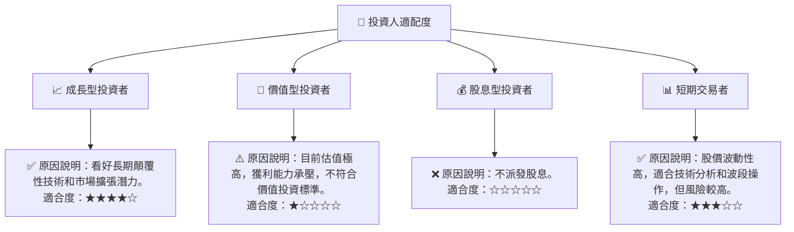

### 10.5 關鍵監控指標

| 監控類型 | 指標 | 關注點 | 頻率 |
|----------|------|----------|------|
| **營收成長** | 總營收 YoY/QoQ | 營收增速是否恢復，新產品貢獻度 | 每季 |
| **獲利能力** | 毛利率、營業利益率、淨利率 | 利潤率是否企穩回升，成本控制成效 | 每季 |
| **資本效率** | ROIC vs WACC | ROIC 能否超越 WACC，創造股東價值 | 每年 |
| **現金流** | 自由現金流 (FCF) | FCF 的穩定性與成長性，資本配置效率 | 每季/每年 |
| **估值** | Forward P/E, P/S | 與同業及歷史區間比較，觀察市場預期變化 | 持續 |
| **新產品進度** | Cybertruck 產能、平價車型發布 | 量產與交付進度，市場反響 | 每季/新聞 |
| **FSD / AI** | FSD 普及率、Robotaxi 試點、Dojo 進展 | 技術突破與商業化進度，監管進展 | 每季/新聞 |
| **市場競爭** | 市佔率、競爭對手新產品 | 價格戰趨勢，市場份額變化 | 每季/行業報告 |

> **免責聲明**：本報告為 AI 自動生成，僅供研究參考，不構成投資建議。投資有風險，入市需謹慎。