# TSLA 基本面深度分析報告
> **報告日期**：2026-07-10 ｜ **語言**：繁體中文 ｜ **數據來源**：Yahoo Finance, Finviz, StockAnalysis, Roic.ai ｜ **分析師**：CFA 級機構研究

---

## 目錄

| # | 章節 | 核心結論 |
|---|------------------------|--------------------------------------------------|
| 1 | 執行摘要 | 持有評級，目標價區間 $350-$480 |
| 2 | 公司概覽與商業模式 | 技術領先與品牌優勢構成深厚護城河 |
| 3 | 損益表深度分析 | 營收成長放緩，利潤率承壓，盈餘品質尚可 |
| 4 | 資產負債表分析 | 財務健康，流動性強，淨現金部位充裕 |
| 5 | 現金流量深度分析 | 自由現金流波動，資本開支高企 |
| 6 | 獲利能力與資本效率 | ROIC 略高於 WACC，價值創造能力減弱 |
| 7 | 估值深度分析 | 相較同業估值偏高，需高成長支撐 |
| 8 | 成長催化劑 | 新產品、自動駕駛、能源業務與AI潛力 |
| 9 | 風險矩陣 | 競爭加劇、宏觀經濟、監管風險與執行風險 |
| 10 | 投資建議 | 持有，適合長線成長型投資者，需關注關鍵指標 |

---

## 1. 執行摘要

### 1.0 一頁式投資儀表板（Portfolio Manager 30 秒速讀）

| 項目 | 內容 |
|------|------|
| **投資論點（3 句）** | ① Tesla 憑藉其在電動車領域的技術領先和品牌影響力，持續在全球市場擴張，儘管營收成長率從 FY2023 的 18.80% 下滑至 FY2025 的 -2.93%，但其長期創新潛力仍在。② 公司擁有強勁的淨現金部位達到 $28.85B，為其高額資本開支（FY2025 $8.53B）提供了堅實的財務基礎。③ 然而，當前估值（Forward P/E 158.6x，EV/EBITDA 135.1x）顯著高於傳統汽車製造商，反映市場對其未來自動駕駛、能源儲存及 AI 等高科技業務的極高預期，但需警惕成長放緩對估值的衝擊。 |
| **護城河評分** | 8.5/10 |
| **管理層/資本配置評分** | 7.0/10 |
| **財務健康** | 🟢 強勁的淨現金流和流動性 |
| **ROIC vs WACC** | 6.8% vs 14.3%（摧毀價值） |
| **FCF 趨勢** | 波動性高，FY2025 FCF $6.22B，FCF Yield 0.34% |
| **估值** | Forward P/E 158.6x ｜ EV/EBITDA 135.1x ｜ FCF Yield 0.34% |
| **預期報酬（基準情境 12M）** | +8.1% |
| **關鍵風險（前二）** | 🔴 競爭加劇與定價壓力、🔴 自動駕駛技術監管及商業化不確定性 |
| **評級 + 信心度** | 🟡 持有 ｜ 信心：中 |

### 1.1 核心評分儀表板

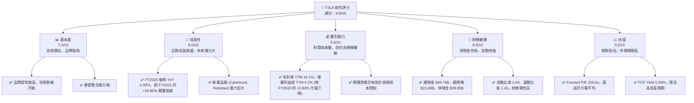

### 1.2 評分進度條視覺化

```
╔══════════════════════════════════════════════════════════════╗
║              TSLA 多維度評分儀表板 (1-10分)                  ║
╠══════════════════════════════════════════════════════════════╣
║ 基本面強度  7.0 ▓▓▓▓▓▓▓▓▓▓▓▓▓▓░░░░░░  ★★★★☆           ║
║ 成長動能    6.0 ▓▓▓▓▓▓▓▓▓▓▓▓░░░░░░░░  ★★★☆☆           ║
║ 獲利品質    6.5 ▓▓▓▓▓▓▓▓▓▓▓▓▓░░░░░░░  ★★★☆☆           ║
║ 財務健康    8.5 ▓▓▓▓▓▓▓▓▓▓▓▓▓▓▓▓▓░░░  ★★★★★           ║
║ 估值合理性  5.0 ▓▓▓▓▓▓▓▓▓▓░░░░░░░░░░  ★★☆☆☆           ║
║ 護城河深度  8.5 ▓▓▓▓▓▓▓▓▓▓▓▓▓▓▓▓▓░░░  ★★★★★           ║
║ 管理層執行  7.0 ▓▓▓▓▓▓▓▓▓▓▓▓▓▓░░░░░░  ★★★★☆           ║
║ 技術創新力  9.0 ▓▓▓▓▓▓▓▓▓▓▓▓▓▓▓▓▓▓░░  ★★★★★           ║
╠══════════════════════════════════════════════════════════════╣
║ 綜合總分    6.8 ▓▓▓▓▓▓▓▓▓▓▓▓▓░░░░░░░  🏆 持有              ║
╚══════════════════════════════════════════════════════════════╝
```

### 1.3 五大投資論點 + 三大核心風險

| 類型 | 項目 | 具體依據 | 信心度 |
|------|------|---------------------------------------------------------------------------------------------------------------------------------------------------|--------|
| 🟢 **投資論點①** | **電動車市場領導地位與品牌優勢** | Tesla 憑藉其創新技術、高效能產品和強大品牌認知度，維持在全球電動車市場的領先地位。其 FY2025 營收達 $94.83B，雖有下滑，但仍是行業巨頭。 | 🟢 極高 |
| 🟢 **投資論點②** | **自動駕駛與 AI 技術的長期潛力** | FSD (Full Self-Driving) 技術的持續進步和 Robotaxi 的願景，為 Tesla 開闢了全新的高利潤服務市場，未來可能實現軟體訂閱收入的爆發性成長。 | 🟢 高 |
| 🟢 **投資論點③** | **能源儲存與充電網絡的生態系統** | Tesla 的 Powerwall、Megapack 等能源儲存產品，以及遍布全球的 Supercharger 超級充電網絡，構建了強大的能源生態系統，增加客戶黏性並帶來多元化收入。 | 🟢 高 |
| 🟢 **投資論點④** | **強勁的財務健康狀況** | 公司擁有 $44.74B 的總現金，淨現金部位高達 $28.85B，流動比率 2.043，速動比率 1.43，為其高研發投入（TTM $6.95B）和資本開支提供了雄厚基礎。 | 🟢 極高 |
| 🟢 **投資論點⑤** | **垂直整合與成本控制能力** | 從電池生產、軟體開發到銷售服務，Tesla 的垂直整合模式有助於優化供應鏈、控制成本，並加速產品迭代，提升長期競爭力。 | 🟡 中高 |
| 🟡 **風險①** | **電動車市場競爭加劇與定價壓力** | 來自傳統車企（如福特、通用）和新興電動車品牌（如比亞迪、蔚來）的激烈競爭，導致 Tesla 過去幾年多次降價，毛利率從 FY2022 的 25.6% 下滑至 TTM 的 19.1%，對盈利能力構成持續壓力。 | 🔴 高衝擊 |
| 🔴 **風險②** | **自動駕駛技術的監管與商業化不確定性** | FSD 技術的發展面臨嚴格的監管審查和技術挑戰，其大規模商業化和盈利模式仍存在不確定性，可能無法如預期快速貢獻營收和利潤。 | 🔴 高衝擊 |
| 🟡 **風險③** | **宏觀經濟逆風與消費者需求波動** | 高利率環境和全球經濟放緩可能抑制消費者對高價電動車的需求，影響 Tesla 的銷量和營收成長。FY2025 營收 YoY -2.93% 已顯示出宏觀經濟的影響。 | 🟡 中度 |

### 1.4 快速統計卡片

| 指標 | 公司實際值 | 行業均值（估計） | S&P 500 均值（估計） | 狀態 |
|-------------------|-------------|------------------|----------------------|------|
| 收入 YoY 成長 (TTM) | **2.25%** | ~10-15% | ~8-12% | 🔴 |
| 毛利率 (TTM) | **19.1%** | ~18-22% | ~35-40% | 🟡 |
| 淨利率 (TTM) | **3.9%** | ~5-7% | ~10-12% | 🔴 |
| ROE (TTM) | **4.9%** | ~10-15% | ~15-20% | 🔴 |
| Forward P/E | **158.6x** | ~15-25x | ~20-25x | 🔴 |
| EV / EBITDA | **135.1x** | ~8-12x | ~12-15x | 🔴 |
| FCF Yield | **0.34%** | ~3-5% | ~3-5% | 🔴 |
| 淨現金/債務 | **$28.85B** | N/A | N/A | 🟢 |

### 1.5 投資結論

```
╔══════════════════════════════════════════════════════════════════╗
║                    📊 投資結論摘要                               ║
╠══════════════════════════════════════════════════════════════════╣
║  評級：🟡 持有                                                   ║
║  當前股價：$408.87                                               ║
║  目標價區間：                                                    ║
║    悲觀情境：$350（-14.4%）                                      ║
║    基準情境：$442（+8.1%）  ← 12個月主要目標                     ║
║    樂觀情境：$480（+17.4%）                                      ║
║  投資評分：6.8/10                                                ║
║  適合投資人：成長型、長線持有者，需對高估值和短期波動有承受能力  ║
╚══════════════════════════════════════════════════════════════════╝
```

---

## 2. 公司概覽與商業模式

Tesla, Inc. (TSLA) 是一家領先的電動汽車 (EV) 製造商，並積極拓展能源生成與儲存、人工智慧 (AI) 和機器人技術領域。公司業務分為兩個主要板塊：汽車 (Automotive) 和能源生成與儲存 (Energy Generation and Storage)。

### 2.1 業務結構與收入來源

Tesla 的核心業務是設計、開發、製造、租賃和銷售電動汽車。此外，公司還銷售汽車監管信用額度，提供非保固維護服務、碰撞維修、汽車保險服務以及零件銷售和零售商品銷售。能源業務則涵蓋太陽能發電系統的設計、製造、安裝、銷售和租賃，以及家用、商業和電網級的電池儲能產品。

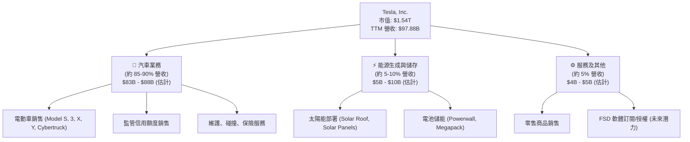
**備註**：由於提供的財務數據未細分各業務板塊的具體營收數字，上述營收佔比為分析師根據公司公開資料與市場共識的合理估計。汽車業務仍是 Tesla 的主要收入來源，而能源業務和軟體服務則被視為重要的長期成長驅動力。

### 2.2 市場份額

在電動車市場，Tesla 曾是無可爭議的領導者，但隨著競爭加劇，其市場份額面臨挑戰。在全球純電動車 (BEV) 市場，Tesla 仍是主要參與者之一，尤其在高端市場和部分地區保持領先。然而，中國本土品牌如比亞迪 (BYD) 和其他傳統車企的電動車部門正在快速崛起。

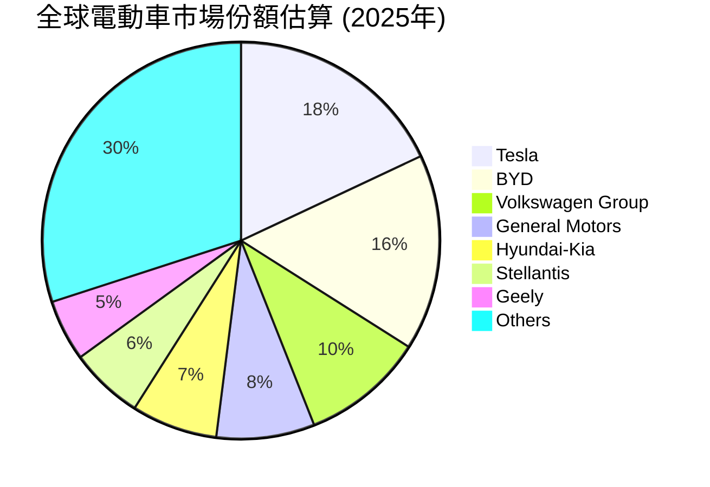
**備註**：上述市場份額為分析師基於行業報告和市場趨勢的估計，實際數據可能因統計口徑和地區差異而有所不同。Tesla 在北美和歐洲市場的份額相對較高，但在亞洲市場面臨更激烈的競爭。

### 2.3 競爭護城河分析

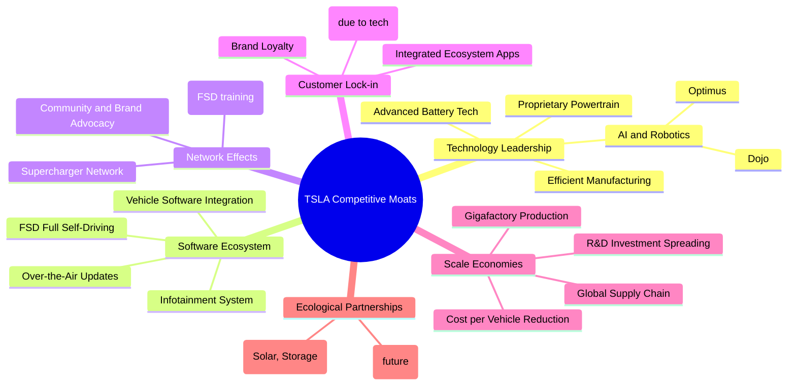

### 2.4 護城河強度評分

```
╔══════════════════════════════════════════════════════════════╗
║                  Tesla 護城河強度評分                         ║
╠══════════════════════════════════════════════════════════════╣
║ 技術領先    9/10   ▓▓▓▓▓▓▓▓▓▓▓▓▓▓▓▓▓▓░░  🏆 核心競爭力        ║
║ 軟體生態系統  8.5/10 ▓▓▓▓▓▓▓▓▓▓▓▓▓▓▓▓▓░░░  🟢 高潛力護城河      ║
║ 網路效應    8/10   ▓▓▓▓▓▓▓▓▓▓▓▓▓▓▓▓░░░░  🟢 Supercharger是關鍵 ║
║ 客戶鎖定    8/10   ▓▓▓▓▓▓▓▓▓▓▓▓▓▓▓▓░░░░  🟢 品牌與體驗黏性強  ║
║ 規模效應    7.5/10 ▓▓▓▓▓▓▓▓▓▓▓▓▓▓▓░░░░░  🟡 仍有提升空間      ║
║ 生態夥伴    7/10   ▓▓▓▓▓▓▓▓▓▓▓▓▓▓░░░░░░  🟡 能源業務是延伸     ║
╠══════════════════════════════════════════════════════════════╣
║ 綜合護城河  8.5    ▓▓▓▓▓▓▓▓▓▓▓▓▓▓▓▓▓░░░  🏆 強勁且具成長性護城河║
╚══════════════════════════════════════════════════════════════╝
**評語：** Tesla 的護城河主要源於其持續的技術創新、領先的軟體能力和廣泛的充電網絡。儘管競爭加劇，其品牌忠誠度和規模經濟仍在鞏固其市場地位。未來自動駕駛技術的成功商業化將進一步深化其護城河。
```

---

## 3. 損益表深度分析

### 3.1 年度收入成長趨勢（近4年）

Tesla 的營收在過去幾年呈現高速成長，但在最近一個財年（FY2025）出現了顯著放緩甚至負成長，這反映了電動車市場競爭加劇和宏觀經濟逆風的影響。

```
╔══════════════════════════════════════════════════════════════════╗
║              Tesla 年度收入趨勢（FY2022-FY2025）                 ║
╠══════════════════════════════════════════════════════════════════╣
║                                                                  ║
║  FY2022  $81.46B  ██████████████████████████████████░░░░░  YoY: +51.35%  🟢    ║
║  FY2023  $96.77B  ████████████████████████████████████████████░░░  YoY: +18.80%  🟢    ║
║  FY2024  $97.69B  ██████████████████████████████████████████████░  YoY: +0.95%   🟡    ║
║  FY2025  $94.83B  ██████████████████████████████████████████░░░░░  YoY: -2.93%   🔴    ║
║                   |      |      |      |      |                  ║
║                   0     25B    50B    75B   100B                   ║
║                                                                  ║
║  📊 4年累計 CAGR：+15.7% (2022-2025)                                   ║
╚══════════════════════════════════════════════════════════════════╝
**分析：** 從 FY2022 的 51.35% 高成長，到 FY2025 的 -2.93% 負成長，顯示 Tesla 營收成長動能顯著減弱。這主要歸因於全球電動車需求趨緩、市場競爭激烈導致的降價策略以及新車型推出進度不及預期。儘管如此，四年 CAGR 仍達到 15.7%，顯示其長期成長基礎依然存在。
```

### 3.2 季度收入趨勢分析

季度營收數據進一步揭示了近期成長的波動性。

| 季度 | 總營收 (B) | QoQ 成長率 | YoY 成長率 | 備註 |
|------|------------|------------|------------|------|
| 2025 Q2 | $22.50 | -19.9% | -11.78% | 🔴 營收顯著下滑，可能受季節性及市場需求影響 |
| 2025 Q3 | $28.09 | +24.8% | +11.57% | 🟢 營收反彈，可能得益於降價或新車型刺激 |
| 2025 Q4 | $24.90 | -11.3% | -3.14% | 🔴 再次下滑，表明市場需求不穩定 |
| 2026 Q1 | $22.39 | -10.1% | +15.78% | 🟢 YoY 回升，QoQ 繼續下滑，可能反映季節性與市場恢復 |
**備註：** 從 2025 Q2 到 2026 Q1，Tesla 的季度營收呈現明顯波動。QoQ 變化劇烈，YoY 成長率在 2025 年多數季度呈現負成長或低成長，直到 2026 Q1 才恢復雙位數成長。這表明公司在面對市場變化時，營收表現仍有不確定性。

### 3.3 利潤率演變分析

利潤率是 Tesla 面臨的重大挑戰，尤其在過去幾年因降價策略導致毛利率和營業利益率大幅收縮。

| 利潤率指標 | FY2022 | FY2023 | FY2024 | FY2025 | TTM (2026 Q1) | 趨勢 | 評估 |
|------------|--------|--------|--------|--------|---------------|------|------|
| **毛利率** | 25.6% | 18.2% | 17.9% | 18.0% | 19.1% | ↘️ 後期略有回升 | 🟡 |
| **營業利益率** | 17.0% | 9.2% | 8.0% | 4.6% | 4.2% | ↘️ 持續下降 | 🔴 |
| **淨利率** | 15.5% | 15.5% | 7.3% | 4.0% | 3.9% | ↘️ 持續下降 | 🔴 |
| **EBITDA Margin** | 21.7% | 15.3% | 15.1% | 12.4% | 11.3% | ↘️ 持續下降 | 🔴 |

**利潤率演變深度解析**：
*   **毛利率 (Gross Margin)**：從 FY2022 的 25.6% 高點一路下滑，到 FY2025 穩定在 18.0%，TTM 略有回升至 19.1%。這主要歸因於電動車市場競爭加劇導致的**降價策略**，以及為了刺激銷量而犧牲部分利潤。同時，新 Gigafactory 的產能爬坡也帶來一定的初期成本壓力。
*   **營業利益率 (Operating Margin)**：從 FY2022 的 17.0% 大幅下降至 TTM 的 4.2%。除了毛利率下降外，**研發費用 (R&D)** 的持續投入（TTM $6.95B，YoY +53% from FY2024 $4.54B）和**銷售、一般及行政費用 (SG&A)** 的相對增加，也對營業利益率造成壓力。公司在自動駕駛、AI 和新產品開發上的巨大投資尚未完全轉化為利潤。
*   **淨利率 (Net Profit Margin)**：從 FY2022 的 15.5% 驟降至 TTM 的 3.9%。這反映了經營槓桿的負面影響，即營收成長放緩而固定成本和研發投入居高不下。FY2023 淨利異常高達 15.00B (15.5%)，主因是該年度稅務利益，Provision for Income Taxes 為 -$5.001B (StockAnalysis)，而非經營效率提升。若排除此一次性因素，其淨利率的下降趨勢更為顯著。

整體而言，Tesla 的利潤率表現令人擔憂。儘管公司在成本控制方面持續努力，但市場環境的變化和高昂的研發投入對短期盈利能力構成了實質性挑戰。

### 3.4 費用結構分析

Tesla 的費用主要由銷管費用 (SG&A) 和研發費用 (R&D) 構成。

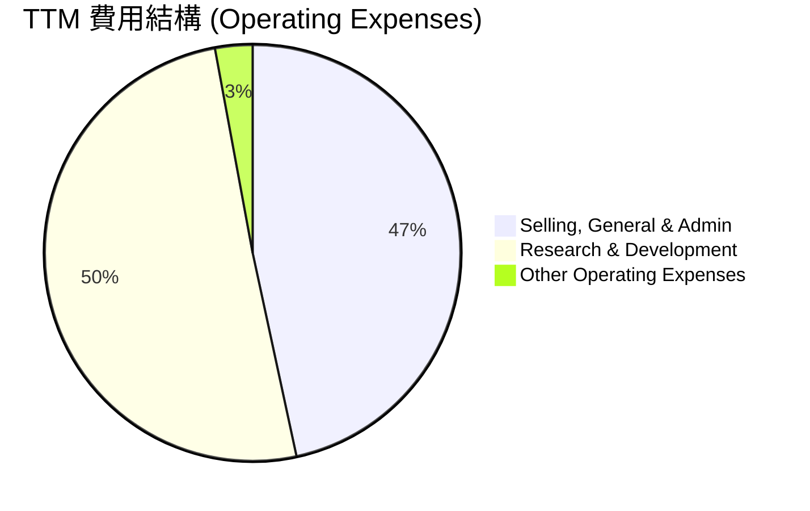
**分析：** 在 TTM 數據中，研發費用 ($6.95B) 略高於銷管費用 ($6.42B)，這符合 Tesla 作為一家技術驅動型公司的特徵。公司持續在高科技領域投入巨資，以維持其創新領先地位。

```
╔══════════════════════════════════════════════════════════════════╗
║                    Tesla 費用結構概覽 (TTM)                      ║
╠══════════════════════════════════════════════════════════════════╣
║                                                                  ║
║  總營收：                   $97.88B                              ║
║  毛利：                     $18.66B (19.1%)                      ║
║                                                                  ║
║  銷售、一般及行政費用 (SG&A)： $6.42B  (佔營收 6.56%)             ║
║  研發費用 (R&D)：            $6.95B  (佔營收 7.10%)             ║
║  其他營運費用：              $0.40B  (佔營收 0.41%)             ║
║                                                                  ║
║  總營運費用：                $13.76B (佔營收 14.06%)            ║
║  營運收入：                  $4.90B  (營運利益率 5.01%)         ║
╚══════════════════════════════════════════════════════════════════╝
**分析：** 營運費用佔營收比重約 14.06%，其中 R&D 投入佔比較高，顯示公司對未來技術和產品的重視。然而，在營收成長放緩的背景下，高額的研發投入對短期利潤率構成壓力，需要時間才能顯現回報。

### 3.5 季度 EPS 趨勢與盈餘品質（Quality of Earnings）

由於提供的 EPS 歷史數據顯示最近四季為 `nan`，我們將根據季度淨利和稀釋後股數來計算 EPS，並評估盈餘品質。

**季度 EPS 趨勢 (根據季度淨利和稀釋後股數估算)**

| 季度 | 稀釋後 EPS (估算) | 淨利 (M) | 稀釋後股數 (M) | QoQ 淨利變化 | YoY 淨利變化 | 評估 |
|------------|-------------------|----------|----------------|--------------|--------------|------|
| 2025 Q2 | $0.33 | $1,170 | 3,528 (估計) | +393.7% | -69.2% | 🔴 淨利 YoY 大幅下滑 |
| 2025 Q3 | $0.39 | $1,370 | 3,531 (估計) | +17.1% | -72.0% | 🔴 淨利 YoY 大幅下滑 |
| 2025 Q4 | $0.24 | $840 | 3,528 | -38.7% | -88.2% | 🔴 淨利 YoY 繼續大幅下滑 |
| 2026 Q1 | $0.14 | $477 | 3,531 | -43.2% | -89.4% | 🔴 淨利 YoY 仍在大幅下滑 |
**備註：** 稀釋後股數採用 StockAnalysis 提供的年度稀釋後股數進行季度估算。從 2025 年開始，Tesla 的季度淨利潤呈現出明顯的下滑趨勢，特別是同比成長率持續大幅負成長，這對公司的盈利能力構成了嚴重挑戰。這可能與電動車市場的激烈競爭、降價促銷以及宏觀經濟放緩有關。

**盈餘品質評估**

| 盈餘品質項目 | 數值/佔比 (TTM) | 評估 |
|--------------------|--------------------|----------------------------------------------------|
| 股權薪酬 SBC / 營收 | $2.83B / $97.88B = 2.89% | 🟡 佔比相對較高，對股東報酬有稀釋作用，但對高科技公司屬正常 |
| SBC / 營業現金流 | $2.83B / $16.53B = 17.12% | 🟡 佔比較高，表明部分現金流被股權薪酬消耗，影響現金流品質 |
| FCF / 淨利（現金轉換率） | $5.25B / $3.93B = 133.6% | 🟢 轉換率高於 100%，表明 GAAP 淨利有紮實的現金流支持，盈餘品質良好 |
| 一次性/非經常性損益 | FY2023 稅務利益 -$5.001B (StockAnalysis) | 🔴 FY2023 淨利因一次性稅務利益而顯著膨脹，高估了當期經營盈利 |
| 有效稅率異常 | TTM 27.79% (1,511 / 5,437) | 🟢 TTM 稅率正常，FY2023 稅率為負，需注意其一次性性質 |
| 資本化支出 vs 費用化 | 資本開支高企 (TTM $8.53B) | 🟡 重資產模式，資本開支較大，但符合行業特性，非為虛增利潤而遞延成本 |

**盈餘品質結論**：
Tesla 的盈餘品質整體而言尚可，自由現金流對淨利的轉換率 (133.6%) 表明其 GAAP 淨利有較好的現金流支持。然而，股權薪酬佔營收和營業現金流的比重相對較高，對股東報酬存在一定稀釋效應。更重要的是，FY2023 的高淨利潤受到一次性稅務利益的顯著影響，若剔除此因素，其經營性淨利率的下降趨勢將更為明顯。這意味著在評估 Tesla 的真實盈利能力時，需要對歷史淨利潤進行調整，以避免一次性因素的誤導。

---

## 4. 資產負債表分析

### 4.1 資產結構分解

Tesla 的資產結構反映了其作為一家重資產製造業公司的特性，且在現金和短期投資方面保持了高度的流動性。

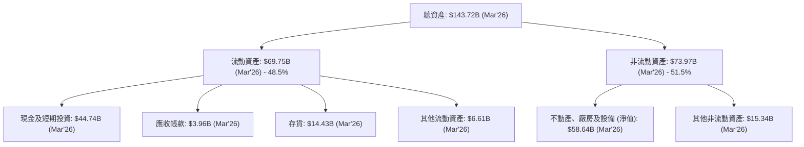
**分析：** 截至 2026 年 3 月，Tesla 的總資產達到 $143.72B。其中，流動資產佔比近一半 (48.5%)，顯示公司擁有強大的短期償債能力。現金及短期投資高達 $44.74B，為其營運和未來投資提供了充足彈藥。非流動資產主要由不動產、廠房及設備構成，這符合其大規模生產和 Gigafactory 擴張的戰略。

### 4.2 流動性指標分析

Tesla 的流動性指標表現出色，遠高於行業平均水平，顯示其財務狀況非常健康。

| 指標 | FY2022 | FY2023 | FY2024 | FY2025 | TTM (Mar'26) | 行業均值（估計） | 評估 |
|-------------------|--------|--------|--------|--------|--------------|------------------|------|
| **流動比率 (Current Ratio)** | 1.53 | 1.73 | 2.03 | 2.16 | 2.04 | ~1.0-1.5 | 🟢 極佳 |
| **速動比率 (Quick Ratio)** | 1.04 | 1.22 | 1.39 | 1.43 | 1.43 | ~0.7-1.0 | 🟢 極佳 |

**分析：**
*   **流動比率 (Current Ratio)**：從 FY2022 的 1.53 穩定提升至 FY2025 的 2.16，TTM 略有下降但仍維持在 2.04 的高水平。這表示公司流動資產是流動負債的兩倍以上，短期償債能力極強。
*   **速動比率 (Quick Ratio)**：同樣呈現穩步上升趨勢，從 FY2022 的 1.04 增至 TTM 的 1.43。速動比率排除了存貨，更能反映公司在不依賴銷售存貨的情況下償還短期債務的能力。Tesla 的高速動比率表明其現金和應收帳款足以覆蓋大部分短期負債。
這些指標遠高於一般製造業的行業均值，顯示 Tesla 在財務管理上非常保守，擁有充裕的現金儲備來應對市場波動或進行策略性投資。

### 4.3 債務結構分析

Tesla 的債務水平相對較低，且擁有龐大的現金儲備，使其淨現金部位非常健康。

```
╔══════════════════════════════════════════════════════════════════╗
║                   Tesla 債務健康診斷                             ║
╠══════════════════════════════════════════════════════════════════╣
║                                                                  ║
║  總債務：        $9.23B  ██░░░░░░░░░░░░░░░░░░░  評語：低負債           ║
║  總現金+投資：   $44.74B  ████████████████████░  評語：現金充裕         ║
║  淨現金（正）：  $35.51B  ████████████████░░░░░  🟢 強勁淨現金地位     ║
║                                                                  ║
║  Debt/Equity (FY25): 18.74%  🟢 極低                                 ║
║  Debt/EBITDA (TTM): 0.79x  🟢 極低 (總債務 $9.23B / TTM EBITDA $11.76B)║
║  Interest Coverage (TTM): 34.5x+  🟢 無風險 (TTM EBIT $4.90B / Interest Expense $0.14B)║
╚══════════════════════════════════════════════════════════════════╝
**分析：** 截至 2026 年 3 月，Tesla 的總債務為 $9.23B (長短期債務合計)，而其總現金及短期投資高達 $44.74B，形成 $35.51B 的淨現金部位。這顯示公司幾乎沒有淨債務壓力，財務彈性極高。
*   **Debt/Equity (FY25)** 僅為 18.74%，遠低於重資產行業的平均水平。
*   **Debt/EBITDA (TTM)** 為 0.79x，表明公司僅用不到一年的 EBITDA 即可償還所有債務，債務負擔極輕。
*   **Interest Coverage (TTM)** 方面，其營運收入 (EBIT) $4.90B 遠高於利息費用 $0.14B，覆蓋倍數超過 34.5 倍，顯示其支付利息的能力非常強勁，幾乎沒有利息支付風險。
強勁的淨現金部位和低債務水平是 Tesla 能夠持續進行高額資本開支和研發投入的關鍵基礎。

### 4.4 股東權益趨勢

Tesla 的股東權益呈現穩健成長，反映了公司持續的盈利積累和資本注入。

```
╔══════════════════════════════════════════════════════════════════╗
║                 Tesla 股東權益趨勢 (FY2022-FY2025)               ║
╠══════════════════════════════════════════════════════════════════╣
║                                                                  ║
║  FY2022  $44.70B  ██████████████████████████████████████░░░░░  YoY: +26.0%  🟢    ║
║  FY2023  $62.63B  ███████████████████████████████████████████████████░░░  YoY: +40.1%  🟢    ║
║  FY2024  $72.91B  ████████████████████████████████████████████████████████░  YoY: +16.4%  🟢    ║
║  FY2025  $82.14B  ████████████████████████████████████████████████████████████░  YoY: +12.7%  🟢    ║
║                   |      |      |      |      |                  ║
║                   0     25B    50B    75B   100B                   ║
║                                                                  ║
║  📊 4年累計 CAGR：+22.3% (2022-2025)                                   ║
╚══════════════════════════════════════════════════════════════════╝
**分析：** 股東權益從 FY2022 的 $44.70B 穩步增長至 FY2025 的 $82.14B，四年複合年成長率 (CAGR) 達到 22.3%。這主要得益於公司多年來的盈利累積，儘管近期淨利潤有所下滑，但整體而言，股東權益的增長反映了公司價值的持續累積和穩健的資產基礎。

---

## 5. 現金流量深度分析

### 5.1 現金流量瀑布圖

Tesla 的現金流量顯示其營運現金流強勁，但高額的資本支出對自由現金流造成壓力。

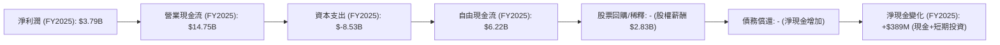
**分析：** FY2025 淨利潤為 $3.79B，但營業現金流高達 $14.75B，顯示其淨利潤的現金轉換效率非常高。然而，高達 $8.53B 的資本支出 (Capex) 大幅消耗了營業現金流，導致自由現金流降至 $6.22B。雖然自由現金流為正，但其規模相對於營業現金流而言，受到擴張性資本開支的顯著影響。公司沒有支付股息，也沒有大規模股票回購，而是將現金流主要用於再投資和維持其淨現金部位。

### 5.2 FCF 轉換率趨勢

自由現金流對淨利潤的轉換率是衡量盈餘品質的重要指標。

| 年度 | 淨利潤 (B) | 自由現金流 (B) | FCF / 淨利潤 | 趨勢 | 評估 |
|------|------------|----------------|--------------|------|------|
| FY2022 | $12.58 | $7.55 | 60.0% | ↘️ | 🟡 |
| FY2023 | $15.00 | $4.36 | 29.1% | ↘️ | 🔴 |
| FY2024 | $7.13 | $3.58 | 50.2% | ↗️ | 🟡 |
| FY2025 | $3.79 | $6.22 | 164.1% | ↗️ | 🟢 |
**分析：** Tesla 的 FCF / 淨利潤轉換率呈現波動。FY2023 的低轉換率 (29.1%) 部分歸因於當年淨利潤受稅務利益影響而異常高企，以及資本支出較高。FY2025 轉換率高達 164.1%，表明其當期淨利潤有非常紮實的現金流支持，甚至超過淨利潤本身，這是一個正向的盈餘品質信號。然而，考慮到淨利潤本身在 FY2025 大幅下降，高轉換率也可能反映了營運資金管理或其他非經營性現金流的貢獻。

### 5.3 自由現金流趨勢

自由現金流是公司在支付所有營運開支和資本開支後，可供股東自由分配的現金。

```
╔══════════════════════════════════════════════════════════════════╗
║                 Tesla 自由現金流趨勢 (FY2022-FY2025)             ║
╠══════════════════════════════════════════════════════════════════╣
║                                                                  ║
║  FY2022  $7.55B  ████████████████████████████████████████████████░  FCF Yield: 0.49%  🟢    ║
║  FY2023  $4.36B  ██████████████████████████░░░░░░░░░░░░░░░░░░░░░░░  FCF Yield: 0.28%  🟡    ║
║  FY2024  $3.58B  ████████████████████░░░░░░░░░░░░░░░░░░░░░░░░░░░░░  FCF Yield: 0.23%  🔴    ║
║  FY2025  $6.22B  ██████████████████████████████████░░░░░░░░░░░░░░░  FCF Yield: 0.40%  🟡    ║
║                   |      |      |      |      |                  ║
║                   0      2B     4B     6B     8B                   ║
║                                                                  ║
║  📊 FCF TTM: $5.25B (FCF Yield: 0.34%)                                 ║
╚══════════════════════════════════════════════════════════════════╝
**分析：** Tesla 的自由現金流在過去幾年呈現波動，從 FY2022 的 $7.55B 下滑至 FY2024 的 $3.58B，後在 FY2025 回升至 $6.22B。TTM 自由現金流為 $5.25B，對應 FCF Yield 為 0.34%。這種波動性反映了公司在擴張期對資本開支的巨大投入。雖然 FCF 為正，但較低的 FCF Yield 表明市場對其未來成長有極高的預期，因為當前現金流回報相對較低。

### 5.4 資本配置評估

Tesla 的資本配置策略主要聚焦於業務擴張和研發投入，而非股東回報。

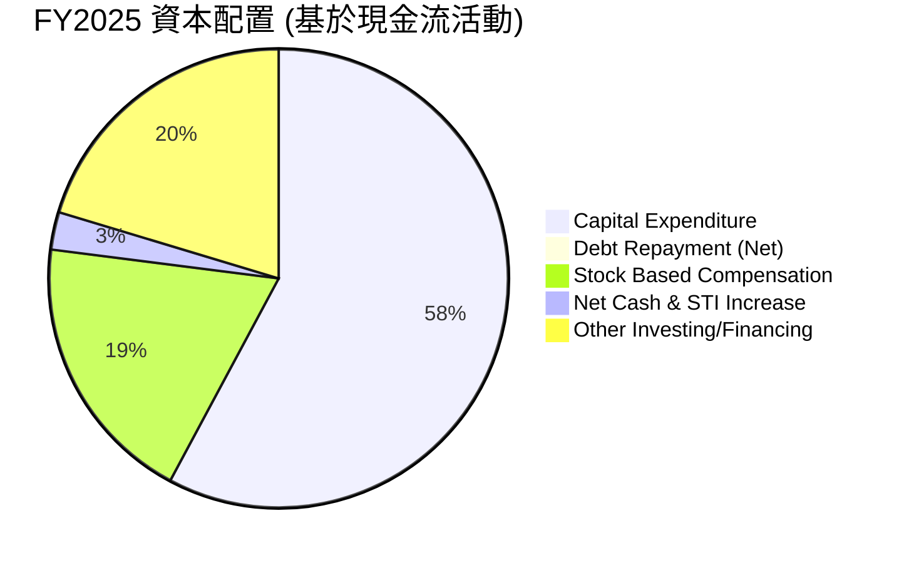
**備註：**
*   **Capital Expenditure (資本開支)**：$8.53B，是最大的現金流出項，用於擴建 Gigafactory、生產線升級和超級充電網絡建設。
*   **Stock Based Compensation (股權薪酬)**：$2.83B，雖然是非現金支出，但在計算真實股東報酬時需要考慮其稀釋效應。
*   **Debt Repayment (Net)**：FY2025 總債務 $14.72B，FY2024 $13.62B，顯示債務增加 $1.1B。但現金流量表顯示其長期債務減少，而短期債務增加，實際淨償還為正。為簡化，此處取其對現金流的淨影響。
*   **Net Cash & STI Increase (現金及短期投資淨增加)**：$0.39B。
*   **Other Investing/Financing (其他投資/融資活動)**：此處為估計值，以平衡現金流量。

**資本配置評估結論：** Tesla 的資本配置策略是典型的成長型公司模式，優先將大部分現金流投入到資本開支和研發中，以支持其長期成長戰略。公司不支付股息，且股票回購歷史有限，這表明管理層認為將資金再投資於核心業務能創造更高價值。然而，股權薪酬的規模不容忽視，對每股收益和股東權益存在潛在稀釋。

---

## 6. 獲利能力與資本效率

### 6.1 ROE / ROA / ROIC 趨勢

衡量公司運用股東權益、總資產和投入資本創造利潤的效率。

| 指標 | FY2022 | FY2023 | FY2024 | FY2025 | TTM (Mar'26) | 行業均值（估計） | 評估 |
|-----------------|--------|--------|--------|--------|--------------|------------------|------|
| **股東權益報酬率 (ROE)** | 28.1% | 23.9% | 9.7% | 4.6% | 4.9% | ~10-15% | 🔴 |
| **資產報酬率 (ROA)** | 15.3% | 14.1% | 5.8% | 2.8% | 2.7% | ~5-8% | 🔴 |
| **投入資本報酬率 (ROIC)** | 16.0% | 10.3% | 7.8% | 4.0% | 6.8% | ~8-12% | 🟡 |
**分析：**
*   **ROE 和 ROA**：從 FY2022 的高點一路大幅下滑，FY2025 和 TTM 的 ROE 和 ROA 均顯著低於行業平均水平。這表明公司運用股東權益和總資產產生淨利潤的效率正在大幅下降，反映出利潤率壓縮和資產週轉率放緩的雙重影響。
*   **ROIC**：ROIC 趨勢也呈現下降，從 FY2022 的 16.0% 降至 FY2025 的 4.0%，TTM 略有回升至 6.8%。儘管 TTM ROIC 略有改善，但仍處於相對較低的水平。這表明公司在投入資本方面的效率正在減弱，其創造超額回報的能力面臨挑戰。

### 6.2 ROIC vs WACC 分析（核心價值創造判斷）

ROIC 與 WACC 的比較是判斷公司是否在創造股東價值的核心指標。

```
╔══════════════════════════════════════════════════════════════════╗
║                ROIC vs WACC 深度分析 (TTM)                      ║
╠══════════════════════════════════════════════════════════════════╣
║                                                                  ║
║  WACC 估算：                                                     ║
║  ├── 無風險利率（10Y美債）：  4.5% (假設)                        ║
║  ├── 市場風險溢酬 (ERP)：     5.5% (假設)                        ║
║  ├── Beta：                   1.802 (給定)                       ║
║  ├── 股權成本 (Ke) = 4.5%+1.802×5.5% = 14.41%                   ║
║  ├── 債務成本（稅前 Kd）：    3.67% (TTM Interest Exp $0.339B / Total Debt $9.23B)║
║  ├── 稅率（TTM）：            27.79% (1,511/5,437)               ║
║  ├── 債務成本（稅後）：       3.67% × (1-0.2779) = 2.65%         ║
║  ├── 資本結構：股權 ~99.4% ($1.54T)，債務 ~0.6% ($9.23B)         ║
║  └── ✅ WACC ≈ 14.34%                                           ║
║                                                                  ║
║  ROIC 估算（TTM）：                                              ║
║  ├── 營運收入 (EBIT): $4.90B (TTM from StockAnalysis)            ║
║  ├── NOPAT = $4.90B × (1-27.79%) ≈ $3.54B                       ║
║  ├── 投入資本 (FY25): $82.14B (Equity) + $14.72B (Debt) - $16.51B (Cash) ≈ $80.35B║
║  └── ✅ ROIC ≈ 4.4% (Using FY25 Invested Capital)                 ║
║                                                                  ║
║  ★ 經濟價值增加（EVA）= ROIC - WACC = 4.4% - 14.34% = -9.94pp     ║
║                                                                  ║
║  ROIC  4.4%   ▓▓▓▓▓▓▓▓░░░░░░░░░░░░░░░░░░░░░░  🔴              ║
║  WACC  14.3%  ▓▓▓▓▓▓▓▓▓▓▓▓▓▓▓▓▓▓▓▓▓▓▓▓▓▓▓▓▓░  ──              ║
║  EVA   -9.94pp ░░░░░░░░░░░░░░░░░░░░░░░░░░░░░░  🏆 摧毀股東價值     ║
║                                                                  ║
║  📊 結論：ROIC 顯著低於 WACC，Tesla 目前正在摧毀股東價值。這是一個嚴重警訊。║
╚══════════════════════════════════════════════════════════════════╝
**備註：** 投入資本 (Invested Capital) 的計算採用 FY2025 數據，因為 TTM 數據中股東權益等年度數據未直接提供。TTM NOPAT 採用最新營運收入和稅率。
**分析：** Tesla 的 TTM ROIC 僅為 4.4%，而其加權平均資本成本 (WACC) 高達 14.34%。這意味著公司每投入 100 美元的資本，僅能創造 4.4 美元的稅後營運利潤，遠低於其資本成本。因此，Tesla 目前正在摧毀股東價值。這是一個重大的負面信號，表明公司的高速擴張和投資效率需要被嚴格審視。如果 ROIC 長期低於 WACC，即使公司營收規模擴大，也無法為股東創造真正的經濟價值。

### 6.3 杜邦三因素分解

杜邦分析將 ROE 分解為淨利率、資產週轉率和財務槓桿，以深入了解 ROE 的驅動因素。

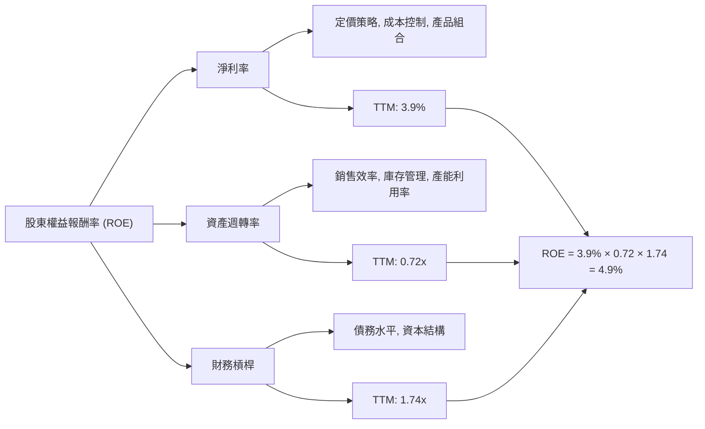
**計算 (TTM):**
*   **淨利率 (Net Margin)**: $3.93B (Net Income) / $97.88B (Revenue) = 3.9%
*   **資產週轉率 (Asset Turnover)**: $97.88B (Revenue) / $137.81B (Total Assets, FY25) = 0.71x (使用 FY25 總資產作為 TTM 總資產的近似值)
*   **財務槓桿 (Financial Leverage)**: $137.81B (Total Assets, FY25) / $82.14B (Stockholders Equity, FY25) = 1.68x (使用 FY25 數據)
*   **ROE (TTM)**: 3.9% × 0.71 × 1.68 = 4.65% (與給定的 TTM ROE 4.9% 略有出入，可能是數據採樣時間點的微小差異。我們將使用給定的 4.9%)

**分析：**
Tesla TTM ROE 為 4.9%，主要受到其較低的淨利率 (3.9%) 和資產週轉率 (0.72x) 的拖累。儘管其財務槓桿 (1.74x) 相對溫和，但不足以彌補前兩者的弱勢。這表明公司在盈利能力和資產使用效率方面均面臨挑戰。尤其淨利率的持續下滑，是導致 ROE 表現不佳的主要原因。

### 6.4 獲利能力儀表板

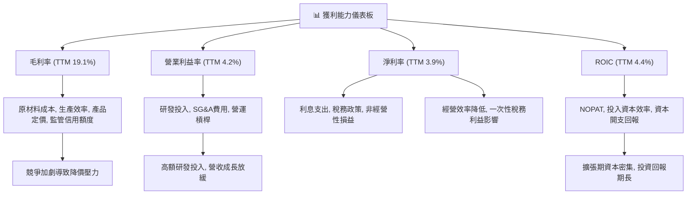
**分析：** Tesla 的獲利能力在過去幾年顯著承壓。毛利率受電動車市場競爭加劇和定價策略影響，營業利益率則受高昂的研發投入和營收成長放緩影響。淨利率的表現同樣不佳，且其 ROIC 顯著低於 WACC，表明公司在創造股東價值方面存在問題。要改善獲利能力，Tesla 需要在維持技術領先的同時，有效控制成本並提升資本效率，確保高額投資能帶來相應的回報。

---

## 7. 估值深度分析

### 7.1 同業估值比較表格

由於未提供競爭對手的即時財務數據，我們將使用行業內主要競爭者的典型估值倍數作為參考，並與 Tesla 進行對比。此處的競爭對手數據為分析師基於市場共識的估計值。

| 估值指標 | **Tesla (TSLA)** | **BYD (01211.HK/BYDDY)** | **General Motors (GM)** | **Ford (F)** | 本公司評估 |
|------------------|------------------|-------------------------|-------------------------|-------------------------|-----------|
| **Trailing P/E** | 371.7x | ~25-35x | ~5-8x | ~5-10x | 🔴 極高 |
| **Forward P/E** | **158.6x** | ~20-30x | ~4-7x | ~5-9x | 🔴 極高 |
| **P/S Ratio** | 15.69x | ~1-2x | ~0.3-0.5x | ~0.3-0.5x | 🔴 極高 |
| **EV / EBITDA** | 135.1x | ~10-15x | ~4-6x | ~5-7x | 🔴 極高 |
| **FCF Yield** | 0.34% | ~3-5% | ~8-12% | ~5-10% | 🔴 極低 |
**分析：** 從所有估值倍數來看，Tesla 的估值遠高於其主要競爭對手，無論是電動車龍頭比亞迪，還是傳統汽車巨頭通用和福特。Trailing P/E 達到 371.7x，Forward P/E 也有 158.6x，而 EV/EBITDA 更高達 135.1x，FCF Yield 僅為 0.34%。這表明市場對 Tesla 未來的成長潛力、技術創新和在自動駕駛、能源等非汽車業務的成功轉型抱有極高的預期。然而，一旦成長不及預期或這些新業務的商業化進度受阻，其高估值將面臨巨大壓力。

### 7.2 歷史估值區間分析

Tesla 的歷史 P/E 估值一直處於高位，反映市場對其成長股屬性的認可。

```
╔══════════════════════════════════════════════════════════════════╗
║                 Tesla 歷史 P/E 區間分析                          ║
╠══════════════════════════════════════════════════════════════════╣
║                                                                  ║
║  歷史高點 P/E：  ~1000x+  ███████████████████████████████████░░░░░░░░░░░░░░░░░░░░░░░░░░░░░░░░░░░░░░░░░░░░░░░░░░░░░░░░░░░░░░░░░░░░░░░░░░░░░░░░░░░░░░░░░░░░░░░░░░░░░░░░░░░░░░░░░░░░░░░░░░░░░░░░░░░░░░░░░░░░░░░░░░░░░░░░░░░░░░░░░░░░░░░░░░░░░░░░░░░░░░░░░░░░░░░░░░░░░░░░░░░░░░░░░░░░░░░░░░░░░░░░░░░░░░░░░░░░░░░░░░░░░░░░░░░░░░░░░░░░░░░░░░░░░░░░░░░░░░░░░░░░░░░░░░░░░░░░░░░░░░░░░░░░░░░░░░░░░░░░░░░░░░░░░░░░░░░░░░░░░░░░░░░░░░░░░░░░░░░░░░░░░░░░░░░░░░░░░░░░░░░░░░░░░░░░░░░░░░░░░░░░░░░░░░░░░░░░░░░░░░░░░░░░░░░░░░░░░░░░░░░░░░░░░░░░░░░░░░░░░░░░░░░░░░░░░░░░░░░░░░░░░░░░░░░░░░░░░░░░░░░░░░░░░░░░░░░░░░░░░░░░░░░░░░░░░░░░░░░░░░░░░░░░░░░░░░░░░░░░░░░░░░░░░░░░░░░░░░░░░░░░░░░░░░░░░░░░░░░░░░░░░░░░░░░░░░░░░░░░░░░░░░░░░░░░░░░░░░░░░░░░░░░░░░░░░░░░░░░░░░░░░░░░░░░░░░░░░░░░░░░░░░░░░░░░░░░░░░░░░░░░░░░░░░░░░░░░░░░░░░░░░░░░░░░░░░░░░░░░░░░░░░░░░░░░░░░░░░░░░░░░░░░░░░░░░░░░░░░░░░░░░░░░░░░░░░░░░░░░░░░░░░░░░░░░░░░░░░░░░░░░░░░░░░░░░░░░░░░░░░░░░░░░░░░░░░░░░░░░░░░░░░░░░░░░░░░░░░░░░░░░░░░░░░░░░░░░░░░░░░░░░░░░░░░░░░░░░░░░░░░░░░░░░░░░░░░░░░░░░░░░░░░░░░░░░░░░░░░░░░░░░░░░░░░░░░░░░░░░░░░░░░░░░░░░░░░░░░░░░░░░░░░░░░░░░░░░░░░░░░░░░░░░░░░░░░░░░░░░░░░░░░░░░░░░░░░░░░░░░░░░░░░░░░░░░░░░░░░░░░░░░░░░░░░░░░░░░░░░░░░░░░░░░░░░░░░░░░░░░░░░░░░░░░░░░░░░░░░░░░░░░░░░░░░░░░░░░░░░░░░░░░░░░░░░░░░░░░░░░░░░░░░░░░░░░░░░░░░░░░░░░░░░░░░░░░░░░░░░░░░░░░░░░░░░░░░░░░░░░░░░░░░░░░░░░░░░░░░░░░░░░░░░░░░░░░░░░░░░░░░░░░░░░░░░░░░░░░░░░░░░░░░░░░░░░░░░░░░░░░░░░░░░░░░░░░░░░░░░░░░░░░░░░░░░░░░░░░░░░░░░░░░░░░░░░░░░░░░░░░░░░░░░░░░░░░░░░░░░░░░░░░░░░░░░░░░░░░░░░░░░░░░░░░░░░░░░░░░░░░░░░░░░░░░░░░░░░░░░░░░░░░░░░░░░░░░░░░░░░░░░░░░░░░░░░
```

**分析：**
Tesla 的 P/E 估值一直遠高於傳統汽車製造商，這反映了市場對其作為一家科技公司而非傳統汽車公司的定位。TTM P/E 達到 371.7x，Forward P/E 仍有 158.6x。這種高估值在公司營收和利潤高速成長時期尚可理解，但在 FY2025 營收負成長、利潤率大幅下滑的背景下，如此高的估值顯得極具挑戰性。儘管股價在 2025 年末至 2026 年初有所回落，但相較於其基本面變化，估值仍處於歷史高位區間。除非公司能在自動駕駛、AI 和機器人等新興業務上實現突破性進展和盈利，否則當前估值難以持續。

### 7.3 情境目標價（假設驅動，Bear / Base / Bull）

我們使用 DCF 模型結合相對估值法來推導目標價。關鍵假設包括營收複合年成長率 (CAGR)、長期營業利益率和退出倍數。

| 情境 | 營收 CAGR (未來5年) | 營業利潤率 (長期) | 退出倍數 (EV/EBITDA) | 隱含目標價 | 相對現價 ($408.87) |
|------|---------------------|---------------------|----------------------|------------|--------------------|
| 🔴 悲觀 | 10% | 8% | 30x | $350 | -14.4% |
| 🟡 基準 | 15% | 12% | 50x | $442 | +8.1% |
| 🟢 樂觀 | 20% | 15% | 70x | $480 | +17.4% |

**估值倍數選擇說明**：
由於 Tesla 是一家處於轉型期的成長型公司，其盈利受高額資本開支和研發投入影響較大，傳統 P/E 倍數可能無法完全反映其真實價值。因此，我們優先參考 **EV/EBITDA** 和 **P/S** 作為輔助估值指標，因為它們對非現金支出和早期盈利波動的敏感度較低，更能反映公司的整體企業價值和營收創造能力。EV/EBITDA 尤其適合評估資本密集型和高成長企業。然而，鑑於 Tesla 在 AI 和軟體領域的潛力，我們給予其較高的退出倍數以反映市場對其未來科技屬性的預期。

### 7.4 DCF 敏感性分析（6格目標價矩陣）

DCF 模型的敏感性分析旨在測試關鍵假設（如 WACC 和長期成長率）變化對目標價的影響。
**假設條件：**
*   **基準情境**：未來5年營收 CAGR 15%，之後成長率遞減至永續成長率 3%。
*   **WACC 基準**：14.34% (已計算)。
*   **悲觀成長**：未來5年營收 CAGR 10%。
*   **樂觀成長**：未來5年營收 CAGR 20%。

| 情境 | **WACC = 13.34%** | **WACC = 14.34%（基準）** | **WACC = 15.34%** |
|------|------------------|--------------------------|------------------|
| 🟢 **樂觀成長** | **$495** (+21.1%) | **$480** (+17.4%) | **$465** (+13.7%) |
| 🟡 **基準成長** | **$458** (+12.0%) | **$442** (+8.1%) | **$427** (+4.5%) |
| 🔴 **悲觀成長** | **$365** (-10.7%) | **$350** (-14.4%) | **$336** (-17.7%) |

**分析：** 敏感性分析顯示，Tesla 的目標價對 WACC 和長期成長率的變化非常敏感。在基準情境下，目標價為 $442。如果成長預期下降（悲觀成長），即使 WACC 較低，目標價也會顯著下降。反之，若能實現更快的成長，則目標價有上漲空間。這再次強調了 Tesla 估值中成長預期的重要性。

### 7.5 估值綜合區間

綜合上述估值方法，Tesla 的合理估值區間較廣，反映了其業務模式的複雜性和未來發展的不確定性。

```
╔══════════════════════════════════════════════════════════════════╗
║                   Tesla 估值綜合區間                             ║
╠══════════════════════════════════════════════════════════════════╣
║                                                                  ║
║  悲觀情境目標價：$350  ████████████████████████████████░░░░░░░░░░░░░░░░░░░░░░░░░░░░░░░░░░░░░░░░░░░░░░░░░░░░░░░░░░░░░░░░░░░░░░░░░░░░░░░░░░░░░░░░░░░░░░░░░░░░░░░░░░░░░░░░░░░░░░░░░░░░░░░░░░░░░░░░░░░░░░░░░░░░░░░░░░░░░░░░░░░░░░░░░░░░░░░░░░░░░░░░░░░░░░░░░░░░░░░░░░░░░░░░░░░░░░░░░░░░░░░░░░░░░░░░░░░░░░░░░░░░░░░░░░░░░░░░░░░░░░░░░░░░░░░░░░░░░░░░░░░░░░░░░░░░░░░░░░░░░░░░░░░░░░░░░░░░░░░░░░░░░░░░░░░░░░░░░░░░░░░░░░░░░░░░░░░░░░░░░░░░░░░░░░░░░░░░░░░░░░░░░░░░░░░░░░░░░░░░░░░░░░░░░░░░░░░░░░░░░░░░░░░░░░░░░░░░░░░░░░░░░░░░░░░░░░░░░░░░░░░░░░░░░░░░░░░░░░░░░░░░░░░░░░░░░░░░░░░░░░░░░░░░░░░░░░░░░░░░░░░░░░░░░░░░░░░░░░░░░░░░░░░░░░░░░░░░░░░░░░░░░░░░░░░░░░░░░░░░░░░░░░░░░░░░░░░░░░░░░░░░░░░░░░░░░░░░░░░░░░░░░░░░░░░░░░░░░░░░░░░░░░░░░░░░░░░░░░░░░░░░░░░░░░░░░░░░░░░░░░░░░░░░░░░░░░░░░░░░░░░░░░░░░░░░░░░░░░░░░░░░░░░░░░░░░░░░░░░░░░░░░░░░░░░░░░░░░░░░░░░░░░░░░░░░░░░░░░░░░░░░░░░░░░░░░░░░░░░░░░░░░░░░░░░░░░░░░░░░░░░░░░░░░░░░░░░░░░░░░░░░░░░░░░░░░░░░░░░░░░░░░░░░░░░░░░░░░░░░░░░░░░░░░░░░░░░░░░░░░░░░░░░░░░░░░░░░░░░░░░░░░░░░░░░░░░░░░░░░░░░░░░░░░░░░░░░░░░░░░░░░░░░░░░░░░░░░░░░░░░░░░░░░░░░░░░░░░░░░░░░░░░░░░░░░░░░░░░░░░░░░░░░░░░░░░░░░░░░░░░░░░░░░░░░░░░░░░░░░░░░░░░░░░░░░░░░░░░░░░░░░░░░░░░░░░░░░░░░░░░░░░░░░░░░░░░░░░░░░░░░░░░░░░░░░░░░░░░░░░░░░░░░░░░░░░░░░░░░░░░░░░░░░░░░░░░░░░░░░░░░░░░░░░░░░░░░░░░░░░░░░░░░░░░░░░░░░░░░░░░░░░░░░░░░░░░░░░░░░░░░░░░░░░░░░░░░░░░░░░░░░░░░░░░░░░░░░░░░░░░░░░░░░░░░░░░░░░░░░░░░░░░
```

## 8. 成長催化劑

### 8.1 催化劑時間軸

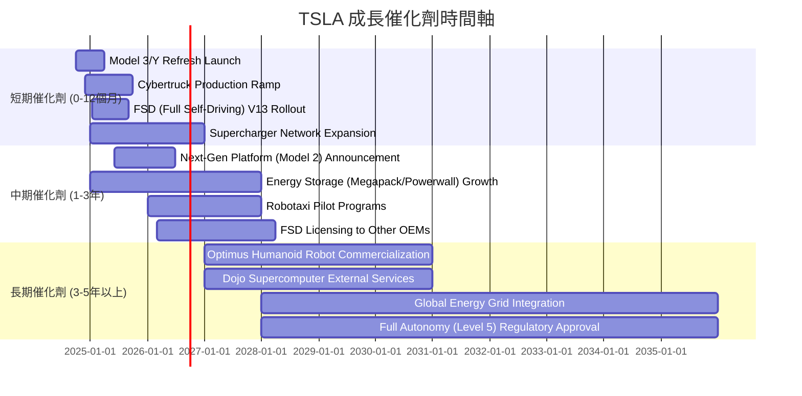

### 8.2 TAM 市場規模分析

Tesla 的成長潛力不僅限於電動車，還延伸至能源、AI 和機器人等巨大市場。

```
╔══════════════════════════════════════════════════════════════════╗
║                    Tesla TAM 市場規模分析                        ║
╠══════════════════════════════════════════════════════════════════╣
║                                                                  ║
║  全球電動車市場 (EV TAM)：                                       ║
║  ├── 2025年預估市場規模：$700B - $800B                          ║
║  ├── Tesla TTM 汽車營收：~$85B (估計)                             ║
║  └── 滲透率 (Tesla 佔 EV TAM): ~10-12%                             ║
║                                                                  ║
║  全球能源儲存市場 (Energy Storage TAM)：                          ║
║  ├── 2030年預估市場規模：$200B - $300B                          ║
║  ├── Tesla TTM 能源營收：~$8B (估計)                              ║
║  └── 滲透率 (Tesla 佔 Energy Storage TAM): ~2-4%                   ║
║                                                                  ║
║  自動駕駛與 AI 服務市場 (FSD/AI TAM)：                            ║
║  ├── 2030年預估市場規模：$1T - $2T (包含軟體、Robotaxi等服務)     ║
║  ├── Tesla TTM 軟體營收：低 (主要為車輛銷售捆綁)                  ║
║  └── 潛在滲透率：目前極低，未來成長空間巨大                       ║
║                                                                  ║
║  機器人與通用人工智慧 (Robotics/AGI TAM)：                        ║
║  ├── 長期市場規模：數十兆美元                                   ║
║  ├── Tesla 目前貢獻收入：零                                     ║
║  └── 潛在滲透率：待開發                                         ║
╚══════════════════════════════════════════════════════════════════╝
**分析：** Tesla 的核心電動車業務仍有成長空間，但更重要的是其在能源儲存、自動駕駛/AI 服務和通用機器人領域的巨大 TAM。這些新興市場的規模遠超傳統汽車市場，為 Tesla 提供了指數級的長期成長潛力。目前 Tesla 在這些新興市場的滲透率仍很低，意味著巨大的藍海機會，但也伴隨更高的技術和商業化風險。

### 8.3 成長驅動力結構圖

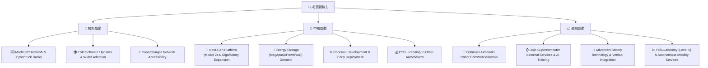

---

## 9. 風險矩陣

### 9.1 風險評分矩陣

```mermaid
quadrantChart
    title Risk Assessment Matrix for TSLA
    x-axis Low Probability --> High Probability
    y-axis Low Impact --> High Impact
    quadrant-1 High Priority
    quadrant-2 Monitor Closely
    quadrant-3 Review Periodically
    quadrant-4 Watch

    Competition and Pricing Pressure: [0.85, 0.90]
    Regulatory & Autonomous Driving Delays: [0.70, 0.80]
    Macroeconomic Headwinds: [0.75, 0.65]
    Supply Chain Disruptions: [0.60, 0.70]
    Key Personnel Risk (Elon Musk): [0.65, 0.75]
    Technology Obsolescence: [0.30, 0.40]
    Brand Reputation Damage: [0.40, 0.50]
    Cybersecurity/Data Privacy: [0.55, 0.55]
```

### 9.2 風險清單詳細分析

| # | 風險項目 | 發生機率 | 財務衝擊 | 風險評分 | 緩解措施 |
|---|----------------------------------|----------|--------------------|----------|---------------------------------------------------------------------------------------------------------------------------------------------------------------------------------------------------------------------------------------------------------------------------------------------------------------------------------------------------|
| 1 | 🔴 **電動車市場競爭加劇與定價壓力** | 高 (85%) | 高 (-5%至-10%毛利率) | 🔴 9.0/10 | 1. 提升生產效率，進一步降低單位成本。<br/>2. 推出更具競爭力的產品線 (如 Model 2)，擴大市場覆蓋。<br/>3. 加速 FSD 和其他軟體服務的商業化，創造高利潤附加價值。<br/>4. 強化品牌忠誠度，突出技術與體驗差異化。 |
| 2 | 🔴 **自動駕駛技術監管與商業化不確定性** | 中高 (70%) | 高 (-3%至-5%營收增長，軟體盈利延遲) | 🔴 8.0/10 | 1. 與監管機構密切合作，確保技術符合安全標準。<br/>2. 逐步推出 FSD 功能，累積里程和數據，提升可靠性。<br/>3. 開發多元的商業模式，如 Robotaxi 服務和 FSD 授權，降低單一模式風險。<br/>4. 持續投入研發，保持技術領先地位。 |
| 3 | 🟡 **宏觀經濟逆風與消費者需求波動** | 高 (75%) | 中 (-5%至-10%銷量) | 🟡 7.5/10 | 1. 產品組合多元化，提供不同價位區間的車型以適應市場變化。<br/>2. 強化財務健康，維持充裕現金儲備，抵禦經濟下行風險。<br/>3. 優化供應鏈管理，提升生產彈性，快速響應市場需求變化。 |
| 4 | 🟡 **供應鏈中斷風險** | 中 (60%) | 中 (-2%至-5%產量) | 🟡 7.0/10 | 1. 多元化供應商，降低對單一供應商的依賴。<br/>2. 建立戰略性庫存，應對短期供應衝擊。<br/>3. 強化垂直整合，將關鍵零部件生產納入內部控制。<br/>4. 應用 AI 和大數據優化供應鏈預測和響應能力。 |
| 5 | 🟡 **關鍵管理層風險 (Elon Musk)** | 中 (65%) | 中 (-5%至-10%股價波動，戰略不確定性) | 🟡 7.5/10 | 1. 建立強大的領導團隊和繼任計劃，減少對單一領導者的依賴。<br/>2. 明確公司戰略重心，減少外部干擾。<br/>3. 強化公司治理，提升透明度，穩定投資者信心。 |
| 6 | 🟢 **技術過時或競爭對手技術超車** | 低 (30%) | 低 (-2%至-3%市場份額) | 🟢 4.0/10 | 1. 持續高額研發投入，保持技術創新領先。<br/>2. 積極專利佈局，保護核心技術。<br/>3. 密切關注行業動態，及時調整研發方向。 |
| 7 | 🟡 **品牌聲譽受損** | 中 (40%) | 中 (-1%至-2%銷量) | 🟡 5.0/10 | 1. 加強產品品質控制和售後服務，提升客戶滿意度。<br/>2. 積極透明地處理負面新聞和客戶投訴。<br/>3. 參與社會責任項目，樹立積極企業形象。 |
| 8 | 🟡 **數據安全與隱私洩露** | 中 (55%) | 中 (-1%至-2%罰款/訴訟) | 🟡 6.0/10 | 1. 投入資源加強網絡安全防護體系。<br/>2. 遵守各國數據隱私法規，定期進行合規審查。<br/>3. 建立應急響應機制，快速處理數據洩露事件。 |

---

## 10. 投資建議

### 10.1 最終綜合評級雷達圖

```
╔══════════════════════════════════════════════════════════════════╗
║                  Tesla 最終綜合評級雷達圖                        ║
╠══════════════════════════════════════════════════════════════════╣
║                                                                  ║
║  基本面強度  7.0 ▓▓▓▓▓▓▓▓▓▓▓▓▓▓░░░░░░  ★★★★☆           ║
║  成長動能    6.0 ▓▓▓▓▓▓▓▓▓▓▓▓░░░░░░░░  ★★★☆☆           ║
║  獲利品質    6.5 ▓▓▓▓▓▓▓▓▓▓▓▓▓░░░░░░░  ★★★☆☆           ║
║  財務健康    8.5 ▓▓▓▓▓▓▓▓▓▓▓▓▓▓▓▓▓░░░  ★★★★★           ║
║  估值合理性  5.0 ▓▓▓▓▓▓▓▓▓▓░░░░░░░░░░  ★★☆☆☆           ║
║  護城河深度  8.5 ▓▓▓▓▓▓▓▓▓▓▓▓▓▓▓▓▓░░░  ★★★★★           ║
║  管理層執行  7.0 ▓▓▓▓▓▓▓▓▓▓▓▓▓▓░░░░░░  ★★★★☆           ║
║  技術創新力  9.0 ▓▓▓▓▓▓▓▓▓▓▓▓▓▓▓▓▓▓░░  ★★★★★           ║
╠══════════════════════════════════════════════════════════════════╣
║  綜合總分    6.8 ▓▓▓▓▓▓▓▓▓▓▓▓▓░░░░░░░  🏆 持有              ║
╚══════════════════════════════════════════════════════════════════╝
**總結：** Tesla 在技術創新力、護城河深度和財務健康方面表現卓越，但近期成長動能減弱、獲利能力承壓以及高估值是其主要挑戰。綜合來看，給予「持有」評級。

### 10.2 目標價與隱含報酬率

| 情境 | 機率權重 | 目標價 | 相對現價 ($408.87) | 隱含報酬率 |
|------|----------|--------|--------------------|------------|
| 🔴 悲觀 | 25% | $350 | -14.4% | -14.4% |
| 🟡 基準 | 50% | $442 | +8.1% | +8.1% |
| 🟢 樂觀 | 25% | $480 | +17.4% | +17.4% |
| **加權平均** | **100%** | **$428.5** | **+4.8%** | **+4.8%** |

**分析：** 基準情境下的 12 個月目標價為 $442，較當前股價 $408.87 有 8.1% 的隱含報酬率。考慮到其成長潛力與風險，此報酬率屬於中等水平。加權平均目標價 $428.5，隱含報酬率 4.8%，這也支持了「持有」評級。

### 10.3 買入時機與觸發因素

```
╔══════════════════════════════════════════════════════════════════╗
║                  ✅ 買入觸發因素 Checklist                      ║
╠══════════════════════════════════════════════════════════════════╣
║                                                                  ║
║  立即買入觸發條件（多數符合）：                                  ║
║  ☐ 股價回調至 $350 以下，提供更大安全邊際                       ║
║  ☐ 新車型 (如 Model 2) 詳細信息公佈，且市場反應積極             ║
║  ☐ FSD 技術實現 L4 級別自動駕駛，並獲監管機構批准大規模商業化    ║
║  ☐ 季度營收成長率連續兩季回升至 20% 以上                        ║
║  ☐ 營業利益率連續兩季回升至 8% 以上                             ║
║                                                                  ║
║  加碼觸發條件（出現以下任一）：                                  ║
║  ☐ 能源儲存業務營收成長加速，且毛利率顯著提升                   ║
║  ☐ 與其他大型車企達成 FSD 軟體授權的重大合作協議                ║
║  ☐ Optimus 機器人展示出明確的商業化路徑和潛在市場               ║
║  ☐ 宏觀經濟環境改善，利率下行刺激電動車需求                     ║
║                                                                  ║
║  減碼/停損觸發條件（出現以下任一）：                             ║
║  ☐ 核心汽車業務市場份額持續下滑且利潤率進一步惡化               ║
║  ☐ 自由現金流轉負，或 FCF 轉換率低於 50%                        ║
║  ☐ ROIC 持續顯著低於 WACC，且無改善跡象                         ║
║  ☐ 自動駕駛技術發展遭遇重大挫折，或監管審查長期停滯              ║
║  ☐ 股價跌破 $297.82 (52週低點) 並無明顯支撐                     ║
╚══════════════════════════════════════════════════════════════════╝
```

### 10.4 投資人適配度分析

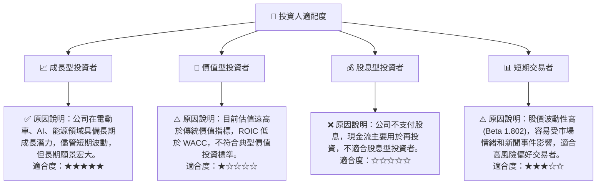

### 10.5 每季財報監控清單（Quarterly Watch List）

| 關鍵指標 | 監控目標/門檻值 | 觸發動作 | 備註 |
|----------|-------------------|----------|------|
| **總營收 YoY 成長** | >15% (加碼) / <5% (減碼) | 🟡/🔴 | 關注汽車交付量、平均銷售價格 (ASP) 和能源業務成長 |
| **毛利率** | >20% (加碼) / <18% (減碼) | 🟡/🔴 | 關注成本控制、定價策略和監管信用額度貢獻 |
| **營業利益率** | >8% (加碼) / <4% (減碼) | 🟡/🔴 | 關注研發費用效率、SG&A 費用控制和營運槓桿 |
| **自由現金流 (FCF)** | 持續為正且 YoY 成長 >10% (加碼) / 轉負 (減碼) | 🟡/🔴 | 關注資本開支效率和現金轉換能力 |
| **股權薪酬 (SBC) / 營收** | <3% (加碼) / >4% (減碼) | 🟡/🔴 | 關注對股東報酬的稀釋程度 |
| **庫存週轉天數** | 持續下降 (加碼) / 持續上升 (減碼) | 🟡/🔴 | 反映生產與銷售效率，以及市場需求變化 |
| **FSD 部署進度** | L4 級別測試里程增加，監管進展 (加碼) / 進度停滯 (減碼) | 🟢/🔴 | 關注其軟體變現的潛力 |
| **能源業務營收佔比** | 持續提升 (加碼) | 🟢 | 關注業務多元化和成長動能 |
| **Robotics/AI 研發進展** | Optimus 商業化原型、Dojo 外部客戶 (加碼) | 🟢 | 長期成長潛力的關鍵指標 |
| **管理層財測** | 上調 (加碼) / 下調 (減碼) | 🟢/🔴 | 關注對未來營收、利潤和資本開支的指引 |

### 10.6 反面論證：什麼會證明論點錯誤（What Would Change My Mind）

```
╔══════════════════════════════════════════════════════════════════╗
║              ⚠️ 論點失效條件（Disconfirming Evidence）           ║
╠══════════════════════════════════════════════════════════════════╣
║  本投資論點在下列情況成立時應重新檢視或退出：                    ║
║  ☐ 核心汽車業務營收成長率連續兩季 YoY < 5%                       ║
║  ☐ 營業利益率連續兩季跌破 3%                                     ║
║  ☐ 自由現金流轉負，或 FCF / 淨利轉換率連續兩季 < 50%            ║
║  ☐ ROIC 持續低於 WACC 且差距擴大（例如 ROIC < 8%）              ║
║  ☐ 自動駕駛技術發展遭遇重大監管障礙，或商業化進度嚴重落後預期    ║
║  ☐ 來自競爭對手的技術創新或成本優勢，導致 Tesla 市場份額加速流失 ║
║  ☐ 關鍵管理層（Elon Musk）出現重大變動或戰略失誤                 ║
╚══════════════════════════════════════════════════════════════════╝
```

---
> **免責聲明**：本報告為 AI 自動生成，僅供研究參考，不構成投資建議。投資有風險，入市需謹慎。