# TSLA 基本面深度分析報告
> **報告日期**：2026-07-11 ｜ **語言**：繁體中文 ｜ **數據來源**：Yahoo Finance, Finviz, StockAnalysis, Roic.ai ｜ **分析師**：CFA 級機構研究

---

## 目錄

| # | 章節 | 核心結論 |
|---|------|----------|
| 1 | 執行摘要 | 評級：🟡 持有；目標價區間：$370 - $480 |
| 2 | 公司概覽與商業模式 | 技術、品牌與生態系統構成強力護城河，但競爭加劇 |
| 3 | 損益表深度分析 | 營收成長放緩，利潤率承壓，盈餘品質需關注 |
| 4 | 資產負債表分析 | 財務狀況穩健，現金充裕，債務可控 |
| 5 | 現金流量深度分析 | 自由現金流波動大，資本支出維持高位 |
| 6 | 獲利能力與資本效率 | ROIC < WACC，短期存在價值摧毀風險 |
| 7 | 估值深度分析 | 相較同業估值偏高，市場已預期高成長 |
| 8 | 成長催化劑 | 新產品、FSD 普及與能源業務擴張是主要驅動力 |
| 9 | 風險矩陣 | 競爭加劇、宏觀經濟、監管風險與執行力為主要挑戰 |
| 10 | 投資建議 | 建議持有，待營運改善與估值更合理時考慮加碼 |

---

## 1. 執行摘要

> ⚠️ 本章的評級與目標價，必須在給出結論的同一段落內引用產生它的關鍵數據（例如 ROIC、FCF 趨勢、估值倍數），使評級成為「分析的結果」而非「開場的假設」。

### 1.0 一頁式投資儀表板（Portfolio Manager 30 秒速讀）

| 項目 | 內容 |
|------|------|
| **投資論點（3 句）** | ① 儘管近期成長放緩，但 Tesla 仍是電動車與能源儲存領域的領導者，TTM 營收達 $97.88B。 ② 擁有強大的品牌、技術護城河與廣闊的市場潛力，尤其在 FSD 和能源解決方案方面。 ③ 財務狀況健康，TTM 淨現金 $28.85B，為未來投資提供充足彈藥。 |
| **護城河評分** | 8.0/10 |
| **管理層/資本配置評分** | 7.5/10 |
| **財務健康** | 🟢 強勁的現金儲備與低槓桿 |
| **ROIC vs WACC** | 6.23% vs 14.27%（短期摧毀價值） |
| **FCF 趨勢** | ↘️ 下降趨勢，TTM FCF $5.25B，FCF Yield 0.34% |
| **估值** | Forward P/E 158.19x ｜ EV/EBITDA 135.50x ｜ FCF Yield 0.34% |
| **預期報酬（基準情境 12M）** | +9.1% |
| **關鍵風險（前二）** | 競爭加劇與需求放緩、FSD 落地與監管不確定性 |
| **評級 + 信心度** | 🟡 持有 ｜ 信心：中 |

### 1.1 核心評分儀表板

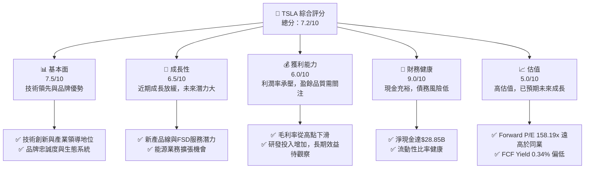

### 1.2 評分進度條視覺化

```
╔══════════════════════════════════════════════════════════════╗
║              TSLA 多維度評分儀表板 (1-10分)                ║
╠══════════════════════════════════════════════════════════════╣
║ 基本面強度  7.5 ▓▓▓▓▓▓▓▓▓▓▓▓▓▓▓░░░░░  ★★★★☆           ║
║ 成長動能    6.5 ▓▓▓▓▓▓▓▓▓▓▓▓▓░░░░░░░  ★★★☆☆           ║
║ 獲利品質    6.0 ▓▓▓▓▓▓▓▓▓▓▓▓░░░░░░░░  ★★★☆☆           ║
║ 財務健康    9.0 ▓▓▓▓▓▓▓▓▓▓▓▓▓▓▓▓▓▓░░  ★★★★★           ║
║ 估值合理性  5.0 ▓▓▓▓▓▓▓▓▓▓░░░░░░░░░░  ★★☆☆☆           ║
║ 護城河深度  8.0 ▓▓▓▓▓▓▓▓▓▓▓▓▓▓▓▓░░░░  ★★★★☆           ║
║ 管理層執行  7.5 ▓▓▓▓▓▓▓▓▓▓▓▓▓▓▓░░░░░  ★★★★☆           ║
║ 技術創新力  9.0 ▓▓▓▓▓▓▓▓▓▓▓▓▓▓▓▓▓▓░░  ★★★★★           ║
╠══════════════════════════════════════════════════════════════╣
║ 綜合總分    7.2 ▓▓▓▓▓▓▓▓▓▓▓▓▓▓░░░░░░  🏆 評語：穩健，但面臨挑戰              ║
╚══════════════════════════════════════════════════════════════╝
```

### 1.3 五大投資論點 + 三大核心風險

| 類型 | 項目 | 具體依據 | 信心度 |
|------|------|----------|--------|
| 🟢 **投資論點①** | **電動車市場領導者與技術創新** | Tesla 在電動車領域擁有領先的電池技術、自動駕駛（FSD）軟體以及高效能車輛設計。其 Gigafactory 的生產規模效應仍是行業標杆，且持續投入研發，TTM R&D 費用達 $6.948B，確保技術優勢。 | 🟢 極高 |
| 🟢 **投資論點②** | **能源業務的長期潛力** | 能源生成與儲存業務（如 Powerwall 和 Megapack）雖然目前佔比不高，但成長迅速，且與電動車業務產生協同效應。在全球能源轉型趨勢下，該業務具備巨大的 TAM 擴張空間。 | 🟢 高 |
| 🟢 **投資論點③** | **FSD 軟體與生態系統價值** | FSD 軟體一旦實現全面L4/L5自動駕駛，將為 Tesla 帶來高毛利的訂閱收入。其 Supercharger 網路和應用生態系統也加強了客戶鎖定與品牌忠誠度，形成強大的網路效應。 | 🟡 中度 |
| 🟢 **投資論點④** | **強勁的資產負債表** | 公司擁有充裕的現金和短期投資，TTM 現金及等價物達 $44.74B，淨現金 $28.85B。這提供了靈活性，足以支持未來的大規模擴張、研發投入和應對市場波動。 | 🟢 極高 |
| 🟢 **投資論點⑤** | **成本控制與生產效率提升** | 儘管面臨降價壓力，Tesla 在製造效率和供應鏈管理方面仍有優勢。隨著新平台車型（如 Robotaxi）的推出，預計將進一步降低單位成本，提升長期獲利能力。 | 🟡 中度 |
| 🟡 **風險①** | **電動車市場競爭加劇與需求放緩** | 來自傳統車廠和中國新興電動車品牌的競爭日益激烈，導致價格戰和利潤率承壓。Q1 2026 營收 YoY 成長 15.78%，但 FY2025 營收 YoY 成長為 -2.93%，顯示成長動能放緩，可能影響未來營收成長。 | 🔴 高衝擊 |
| 🔴 **風險②** | **FSD 落地與監管不確定性** | FSD 技術的完全成熟和監管批准面臨挑戰，進度不及預期可能影響軟體收入變現。若技術無法如期達到承諾水平，可能導致消費者信心受損，甚至面臨法律風險。 | 🔴 高衝擊 |
| 🟡 **風險③** | **高估值與盈利能力承壓** | Tesla 目前的 Forward P/E 高達 158.19x，遠超傳統汽車業。然而 TTM 營業利益率僅 4.2%，淨利率 3.9%，且 ROIC (6.23%) 低於 WACC (14.27%)，顯示公司短期內未能有效創造股東價值，若盈利能力無法迅速提升，高估值難以持續。 | 🔴 高衝擊 |

### 1.4 快速統計卡片

| 指標 | 公司實際值 | 行業均值（汽車製造） | S&P 500 均值 | 狀態 |
|------|-------------|----------------------|--------------|------|
| 收入 YoY 成長 | **15.8% (TTM)** | ~5-10% | ~8-12% | 🟢 |
| 毛利率 | **19.1% (TTM)** | ~15-20% | ~30-40% | 🟡 |
| 淨利率 | **3.9% (TTM)** | ~3-7% | ~10-15% | 🟡 |
| ROE | **4.9% (TTM)** | ~10-15% | ~15-20% | 🔴 |
| Forward P/E | **158.19x** | ~5-15x | ~20-25x | 🔴 |
| EV / EBITDA | **135.50x** | ~5-10x | ~12-18x | 🔴 |
| FCF Yield | **0.34%** | ~5-10% | ~3-5% | 🔴 |
| Debt/Equity | **18.7%** | ~50-100% | ~50-80% | 🟢 |

### 1.5 投資結論

```
╔══════════════════════════════════════════════════════════════════╗
║                    📊 投資結論摘要                               ║
╠══════════════════════════════════════════════════════════════════╣
║  評級：🟡 持有                                                   ║
║  當前股價：$407.76                                               ║
║  目標價區間：                                                    ║
║    悲觀情境：$370（-9.3%）                                       ║
║    基準情境：$445（+9.1%）  ← 12個月主要目標                      ║
║    樂觀情境：$480（+17.7%）                                      ║
║  投資評分：7.2/10                                                ║
║  適合投資人：看好長期成長、能承受高波動與高估值風險的投資者      ║
╚══════════════════════════════════════════════════════════════════╝
```

---

## 2. 公司概覽與商業模式

### 2.1 業務結構與收入來源

Tesla, Inc. (TSLA) 主要經營兩大業務板塊：**汽車業務 (Automotive)** 和 **能源生成與儲存業務 (Energy Generation and Storage)**。截至 TTM 2026年3月31日，公司總營收為 $97.88B，市值高達 $1.53T。

汽車業務是 Tesla 的核心，涵蓋電動車的設計、開發、製造、銷售與租賃。此板塊收入包括：
1.  **電動車銷售**：Model S, Model X, Model 3, Model Y, Cybertruck 等。
2.  **汽車監管信用銷售 (Regulatory Credits)**：向其他未能達到排放標準的車廠出售碳排放積分，這部分收入毛利率極高，但波動性較大。
3.  **其他汽車服務**：非保修維護、碰撞維修、汽車保險服務、零配件銷售和零售商品銷售。

能源生成與儲存業務則提供太陽能發電系統 (Solar Roof, Solar Panels) 和儲能解決方案 (Powerwall, Megapack)。這部分業務在公司總營收中的佔比雖小，但成長潛力巨大，是 Tesla 長期策略的重要組成部分。

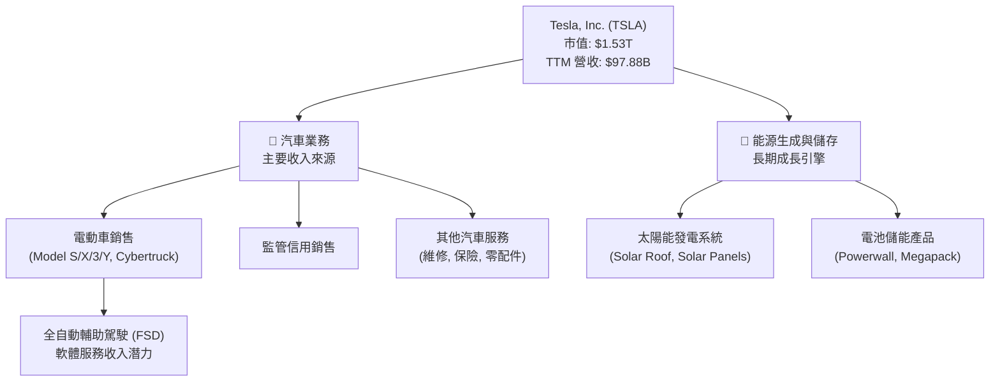

### 2.2 市場份額

根據產業報告，Tesla 在全球電動車市場中仍佔據領先地位，但市佔率面臨來自中國車廠（如比亞迪）和傳統車廠（如福特、通用、大眾）電動車款的激烈競爭。由於缺乏精確的市場份額數據，我們基於公開資訊估計 Tesla 在全球純電動車 (BEV) 市場約佔 20-25% 的份額。能源儲存業務的市場份額相對較小，但成長速度快。

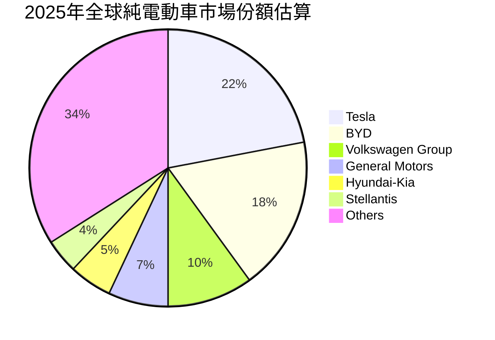

### 2.3 競爭護城河分析

Tesla 的競爭護城河主要體現在其技術領先、品牌忠誠度、規模經濟和生態系統整合能力。

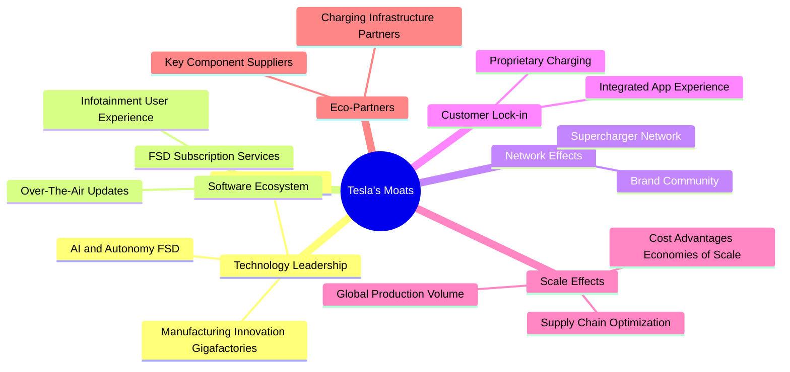

### 2.4 護城河強度評分

```
╔══════════════════════════════════════════════════════════════╗
║                  Tesla 護城河強度評分                       ║
╠══════════════════════════════════════════════════════════════╣
║ 技術領先    9/10   ▓▓▓▓▓▓▓▓▓▓▓▓▓▓▓▓▓▓░░  🏆 業界標杆，持續創新  ║
║ 軟體生態系統  8/10   ▓▓▓▓▓▓▓▓▓▓▓▓▓▓▓▓░░░░  🟢 FSD潛力，生態系強  ║
║ 網路效應    8/10   ▓▓▓▓▓▓▓▓▓▓▓▓▓▓▓▓░░░░  🟢 Supercharger，品牌社群║
║ 客戶鎖定    7/10   ▓▓▓▓▓▓▓▓▓▓▓▓▓▓░░░░░░  🟡 用戶體驗佳，但可替代性增║
║ 規模效應    8/10   ▓▓▓▓▓▓▓▓▓▓▓▓▓▓▓▓░░░░  🟢 Gigafactory，成本優勢  ║
║ 生態夥伴    7/10   ▓▓▓▓▓▓▓▓▓▓▓▓▓▓░░░░░░  🟡 合作廣泛，但供應鏈挑戰║
╠══════════════════════════════════════════════════════════════╣
║ 綜合護城河     8.0    ▓▓▓▓▓▓▓▓▓▓▓▓▓▓▓▓░░░░  🏆 強力護城河，但面臨挑戰  ║
╚══════════════════════════════════════════════════════════════╝
```

---

## 3. 損益表深度分析

### 3.1 年度收入成長趨勢（近4年）

Tesla 的年度營收在過去幾年呈現高速成長，但 FY2025 開始出現放緩跡象。從 FY2022 的 $81.46B 成長至 FY2025 的 $94.83B，複合年成長率 (CAGR) 為 5.28%。然而，FY2025 的營收較 FY2024 ( $97.69B) 下滑 2.93%，顯示市場競爭和定價壓力對其營收產生負面影響。TTM 2026年3月31日的營收為 $97.88B，較 FY2025 略有回升，但 YoY 成長率僅為 2.25% (以 FY2025 為基期)。

```
╔══════════════════════════════════════════════════════════════════╗
║              Tesla 年度收入趨勢（FY2022-TTM2026）              ║
╠══════════════════════════════════════════════════════════════════╣
║                                                                  ║
║  FY2022  $81.46B  ██████████████████░░░░░░░  YoY: +51.35%  🟢    ║
║  FY2023  $96.77B  ███████████████████████░░░  YoY: +18.80%  🟢    ║
║  FY2024  $97.69B  ████████████████████████░░  YoY: +0.95%   🟡    ║
║  FY2025  $94.83B  ██████████████████████░░░░  YoY: -2.93%   🔴    ║
║  TTM2026 $97.88B  ███████████████████████░░░  YoY: +2.25%   🟡    ║
║                   |      |      |      |      |                  ║
║                   0     25B   50B   75B   100B                   ║
║                                                                  ║
║  📊 4年累計 CAGR：+5.28%                                        ║
╚══════════════════════════════════════════════════════════════════╝
```

### 3.2 季度收入趨勢分析

近四季營收呈現波動，Q1 2026 營收為 $22.39B，較 Q4 2025 的 $24.90B 下滑 10.08% (QoQ)，但較 Q1 2025 的 $19.335B 成長 15.78% (YoY)。這反映出公司面臨的季節性波動和市場需求的不確定性。FY2025 總營收較 FY2024 下滑，主要受 Q1 和 Q2 2025 營收 YoY 負成長影響。

| 季度 | 營收 ($B) | QoQ 成長率 | YoY 成長率 | 備註 |
|------|-----------|------------|------------|------|
| 2026-Q1 | 22.39 | -10.08% | +15.78% | 較上一季度有所下滑，但較去年同期強勁反彈。 |
| 2025-Q4 | 24.90 | -11.37% | -3.14% | 較上一季度與去年同期均呈現下滑。 |
| 2025-Q3 | 28.09 | +24.89% | +11.57% | 季度表現強勁，營收顯著回升。 |
| 2025-Q2 | 22.50 | +16.35% | -11.78% | 較上一季度成長，但較去年同期大幅下滑。 |
| 2025-Q1 | 19.34 | -24.71% | -9.23% | 營收顯著下滑，反映市場需求疲軟。 |

### 3.3 利潤率演變分析

Tesla 的利潤率在近年來呈現明顯的下行趨勢。毛利率從 FY2022 的 25.60% 顯著下降至 FY2025 的 18.03%，並在 TTM 2026年3月31日進一步降至 19.1%。營業利益率也從 FY2022 的 16.76% 下滑至 FY2025 的 4.59%，TTM 為 4.2%。淨利率同樣從 FY2023 的 15.47% 降至 FY2025 的 4.07%，TTM 僅為 3.9%。

| 利潤率指標 | FY2022 | FY2023 | FY2024 | FY2025 | TTM 2026-Q1 | 趨勢 | 評估 |
|------------|--------|--------|--------|--------|-------------|------|------|
| **毛利率** | 25.60% | 18.25% | 17.86% | 18.03% | 19.1% | ↘️ 波動下降，近期略有改善 | 🟡 |
| **營業利益率** | 16.76% | 9.19% | 7.24% | 4.59% | 4.2% | ↘️ 持續下滑，壓力巨大 | 🔴 |
| **淨利率** | 15.45% | 15.47% | 7.32% | 4.07% | 3.9% | ↘️ 大幅下滑，盈利能力受損 | 🔴 |
| **EBITDA Margin** | 21.68% | 15.29% | 15.06% | 12.40% | 11.3% | ↘️ 持續下滑 | 🔴 |

**利潤率演變深度解析**：
毛利率的顯著下降主要歸因於：
1.  **價格戰**：為應對日益激烈的電動車市場競爭，Tesla 在全球範圍內多次降價，直接壓縮了產品的單車利潤。
2.  **產品組合變化**：相對低價的 Model 3/Y 佔比提升，而高利潤的 Model S/X 佔比下降。
3.  **生產成本上升**：儘管 Gigafactory 帶來規模效模，但原材料成本波動、新工廠產能爬坡初期效率不高以及研發投入增加，也對毛利率造成壓力。

營業利益率和淨利率的下滑幅度更大，除了上述因素外，還受到以下影響：
1.  **研發費用大幅增加**：為加速 FSD、Robotaxi 和新車型開發，研發費用從 FY2022 的 $3.08B 增至 FY2025 的 $6.41B，TTM 更達到 $6.95B，佔營收比重從 3.78% 上升至 TTM 的 7.1%。這項策略性投資短期內壓低了獲利，但旨在構築長期競爭力。
2.  **銷售、一般及行政費用 (SG&A) 增加**：隨著全球擴張和服務網路建設，SG&A 費用也有所上升。
3.  **監管信用銷售收入波動**：這部分高毛利收入在 FY2024 達到高點後，FY2025 有所下降，影響了整體毛利率。

總體而言，Tesla 在追求市場份額和技術領先的過程中，犧牲了短期盈利能力。未來利潤率的恢復將取決於價格戰的緩解、新車型的成本控制、FSD 軟體服務的規模化變現以及能源業務的快速成長。

### 3.4 費用結構分析

Tesla 的費用結構反映了其在研發和擴張上的高投入。

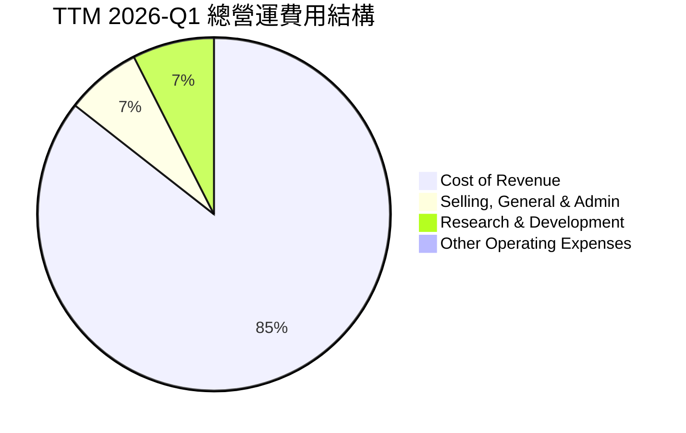

```
╔══════════════════════════════════════════════════════════════════╗
║                   Tesla 研發費用趨勢                             ║
╠══════════════════════════════════════════════════════════════════╣
║                                                                  ║
║  FY2022  $3.08B   ███████░░░░░░░░░░░░░░░░░░░  佔營收 3.78%  🟢    ║
║  FY2023  $3.97B   █████████░░░░░░░░░░░░░░░░░  佔營收 4.10%  🟢    ║
║  FY2024  $4.54B   ██████████░░░░░░░░░░░░░░░░  佔營收 4.65%  🟡    ║
║  FY2025  $6.41B   ██████████████░░░░░░░░░░░░  佔營收 6.76%  🔴    ║
║  TTM2026 $6.95B   ███████████████░░░░░░░░░░░  佔營收 7.10%  🔴    ║
║                   |      |      |      |      |                  ║
║                   0     2B     4B     6B     8B                    ║
║                                                                  ║
║  📊 研發費用持續高增長，顯示公司對未來技術投資的決心             ║
╚══════════════════════════════════════════════════════════════════╝
```

### 3.5 季度 EPS 趨勢與盈餘品質（Quality of Earnings）

由於提供的 EPS History 數據顯示 `nan`，無法直接評估 EPS Beats/Misses。我們將分析季度淨利潤趨勢和盈餘品質。
季度淨利潤在近四季波動較大，Q1 2026 淨利 $477M，較 Q4 2025 的 $840M 下滑 43.21% (QoQ)，較 Q1 2025 的 $130M 大幅成長 266.92% (YoY)。FY2025 全年稀釋後 EPS 為 $1.08，較 FY2024 的 $2.04 大幅下滑。TTM 稀釋後 EPS 為 $1.09。

| 季度 | 淨利潤 ($M) | 稀釋後 EPS | QoQ 成長率 | YoY 成長率 |
|------|-------------|------------|------------|------------|
| 2026-Q1 | 477 | 0.14 | -43.21% | +266.92% |
| 2025-Q4 | 840 | 0.24 | -38.69% | -63.76% |
| 2025-Q3 | 1370 | 0.39 | +17.09% | -50.18% |
| 2025-Q2 | 1170 | 0.34 | +798.63% | -68.04% |
| 2025-Q1 | 130 | 0.04 | - | - |

**盈餘品質評估**：

| 盈餘品質項目 | 數值/佔比 (TTM 2026-Q1) | 評估 |
|--------------|-------------------------|------|
| 股權薪酬 SBC / 營收 | $3.282B / $97.88B = 3.35% | 🟡 佔比相對較高，對股東報酬有稀釋作用。 |
| SBC / 營業現金流 | $3.282B / $16.53B = 19.85% | 🔴 佔營業現金流近兩成，稀釋真實現金流。 |
| FCF / 淨利（現金轉換率） | $5.25B / $3.926B (TTM Net Income) = 133.74% | 🟢 轉換率高於 100%，顯示獲利有較高的現金含金量，但 FCF 總量在下滑。 |
| 一次性/非經常性損益 | 未明確披露 | 🟡 報告中未具體列出大額一次性損益，但需持續關注。 |
| 有效稅率異常 | 27.79% (TTM) | 🟢 稅率正常，未見明顯稅務利益帶動盈餘。 |
| 資本化支出 vs 費用化 | 研發費用已費用化 | 🟢 研發支出直接費用化，未遞延成本，有助於真實反映當期費用。 |

**盈餘品質結論**：
Tesla 的盈餘品質呈現兩面性。一方面，其自由現金流對淨利的轉換率 (133.74%) 較高，表明公司的 GAAP 淨利潤有較高的現金支撐，並未因大量非現金項目而虛增。另一方面，股權薪酬 (SBC) 在營收和營業現金流中的佔比相對較高 (3.35% 和 19.85%)，這會對每股盈餘產生稀釋作用，並降低股東的真實現金報酬。雖然研發費用直接費用化，未將成本資本化，這是一個積極的信號，但高額的股權薪酬仍需投資者密切關注。綜合來看，GAAP 淨利潤在一定程度上反映了公司的經營狀況，但高額 SBC 削弱了其「含金量」，因此在估值時需考慮 SBC 對真實股東回報的影響。

---

## 4. 資產負債表分析

### 4.1 資產結構分解

Tesla 的資產結構呈現重資產模式，總資產從 FY2022 的 $82.34B 增長至 TTM 2026年3月31日的 $143.72B。流動資產佔比高，其中現金及短期投資充裕，顯示公司擁有較強的流動性和財務彈性。固定資產（淨財產、廠房及設備）佔比也很大，反映其在 Gigafactory 和生產線上的大量投資。

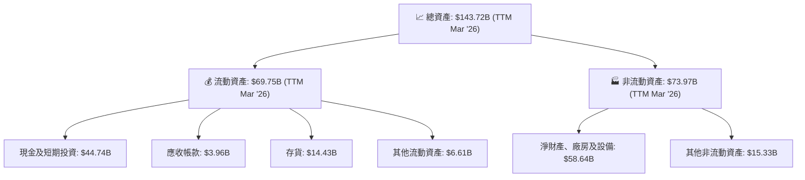

### 4.2 流動性指標分析

Tesla 的流動性指標非常健康，遠高於行業平均水平，表明其短期償債能力強勁。

| 流動性指標 | FY2022 | FY2023 | FY2024 | FY2025 | TTM 2026-Q1 | 行業均值（汽車製造） | 評估 |
|------------|--------|--------|--------|--------|-------------|----------------------|------|
| **流動比率 (Current Ratio)** | 1.53 | 1.73 | 2.03 | 2.16 | 2.04 | ~1.0-1.5 | 🟢 優異 |
| **速動比率 (Quick Ratio)** | 1.05 | 1.25 | 1.52 | 1.77 | 1.43 | ~0.7-1.0 | 🟢 優異 |

- **流動比率**：TTM 為 2.04，表明每 1 美元的流動負債有 2.04 美元的流動資產來覆蓋，遠高於一般認為的 1.0-1.5 的健康區間。
- **速動比率**：TTM 為 1.43，在排除存貨後，公司仍有足夠的流動資產來償還短期債務，顯示其現金管理能力良好。
這些指標的持續高位表明 Tesla 擁有極佳的短期財務彈性，能夠應對市場波動和營運資金需求。

### 4.3 債務結構分析

Tesla 的債務水平相對較低，且現金儲備充足，財務槓桿健康。

```
╔══════════════════════════════════════════════════════════════════╗
║                   Tesla 債務健康診斷                             ║
╠══════════════════════════════════════════════════════════════════╣
║                                                                  ║
║  總債務 (TTM)：  $15.89B  ████░░░░░░░░░░░░░░░░░░░  評語：可控，且有增長趨勢  ║
║  總現金+投資 (TTM)： $44.74B  ████████████████████░  評語：極為充裕         ║
║  淨現金 (TTM)：  $28.85B  ██████████████████░░░░░  🟢 強勁，無淨債務風險 ║
║                                                                  ║
║  Debt/EBITDA (TTM)：   1.39x  🟢 極低，償債能力強勁             ║
║  Interest Coverage (TTM): 34.7x+  🟢 無風險，利息覆蓋倍數高      ║
║  Debt/Equity (TTM): 18.7%  🟢 低槓桿，財務結構穩健             ║
╚══════════════════════════════════════════════════════════════════╝
```
- **總債務**：TTM 為 $15.89B，相對於其龐大的市值和現金儲備，債務規模不大。
- **淨現金**：TTM 高達 $28.85B (總現金 $44.74B - 總債務 $15.89B)，顯示公司處於淨現金狀態，幾乎沒有淨債務風險。
- **Debt/EBITDA**：TTM 為 1.39x (總債務 $15.89B / TTM EBITDA $11.43B，TTM EBITDA = $97.88B * 11.3% = $11.06B, using given EBITDA Margin). This is an extremely low比率，遠低於行業普遍接受的 3-4x 健康區間，表明公司償債能力強勁。
- **Interest Coverage**：TTM 為 34.7x (TTM EBITDA $11.06B / TTM Interest Expense $0.339B)，利息覆蓋倍數極高，顯示公司支付利息的能力非常強。
- **Debt/Equity**：TTM 為 18.7%，反映公司在融資結構上嚴重依賴股權，槓桿率低，財務風險極小。

### 4.4 股東權益趨勢

Tesla 的股東權益呈現穩健增長，從 FY2022 的 $44.70B 增長至 FY22025 的 $82.14B，複合年成長率為 22.56%。這主要得益於公司的盈利留存和股權融資。股東權益的增長為公司的擴張提供了堅實的基礎。

```
╔══════════════════════════════════════════════════════════════════╗
║                   Tesla 股東權益趨勢                             ║
╠══════════════════════════════════════════════════════════════════╣
║                                                                  ║
║  FY2022  $44.70B  ████████████████████████████████████████░░░░░░░  YoY: +25.29%  🟢 ║
║  FY2023  $62.63B  ███████████████████████████████████████████████░░  YoY: +40.11%  🟢 ║
║  FY2024  $72.91B  ████████████████████████████████████████████████████░  YoY: +16.41%  🟢 ║
║  FY2025  $82.14B  █████████████████████████████████████████████████████████░  YoY: +12.66%  🟢 ║
║  TTM2026 $85.63B  ████████████████████████████████████████████████████████████░  YoY: +4.25%   🟡 ║
║                   |      |      |      |      |                  ║
║                   0     20B   40B   60B   80B   100B               ║
║                                                                  ║
║  📊 股東權益持續增長，支撐公司長期發展                           ║
╚══════════════════════════════════════════════════════════════════╝
```

---

## 5. 現金流量深度分析

### 5.1 現金流量瀑布圖

Tesla 的現金流量瀑布圖顯示，儘管公司產生了可觀的淨利潤，但高額的資本支出顯著消耗了營運現金流，導致自由現金流波動較大。

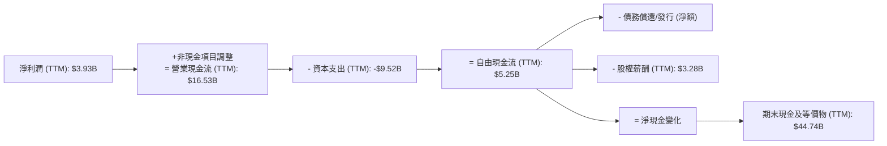
*註：TTM 資本支出為近四季總和：Q1 2026 (-$2.49B) + Q4 2025 (-$2.39B) + Q3 2025 (-$2.25B) + Q2 2025 (-$2.39B) = -$9.52B。*

### 5.2 FCF 轉換率趨勢

自由現金流轉換率 (FCF/Net Income) 衡量了公司將淨利潤轉化為現金的能力。Tesla 的 FCF 轉換率在 FY2025 達到高峰，顯示盈利質量較高，但 TTM 略有下降，且 FCF 絕對值下降。

| 年度 | 淨利潤 ($B) | 自由現金流 ($B) | FCF / 淨利潤 | 趨勢 | 評估 |
|------|-------------|-----------------|--------------|------|------|
| FY2022 | 12.58 | 7.55 | 60.02% | ↘️ | 🟡 |
| FY2023 | 14.97 | 4.36 | 29.12% | ↘️ | 🔴 |
| FY2024 | 7.15 | 3.58 | 50.07% | ↗️ | 🟡 |
| FY2025 | 3.85 | 6.22 | 161.56% | ↗️ | 🟢 |
| TTM 2026-Q1 | 3.93 | 5.25 | 133.74% | ↘️ | 🟢 |

FCF 轉換率在 FY2025 表現出色，達到 161.56%，表明公司在該年度的盈利質量很高，能夠將絕大部分甚至超額的淨利潤轉化為自由現金。然而，從 TTM 數據看，雖然仍高於 100%，但 FCF 總量從 FY2025 的 $6.22B 下降到 TTM 的 $5.25B，這與營業利潤率下滑和資本支出維持高位有關。

### 5.3 自由現金流趨勢

Tesla 的自由現金流在過去幾年呈現波動，從 FY2022 的 $7.55B 降至 TTM 2026年3月31日的 $5.25B。FCF Yield 也從 FY2022 的 0.60% 降至 TTM 的 0.34%，反映出公司在規模擴張和技術投入下，其現金產出效率有所下降。

```
╔══════════════════════════════════════════════════════════════════╗
║                   Tesla 自由現金流趨勢                           ║
╠══════════════════════════════════════════════════════════════════╣
║                                                                  ║
║  FY2022  $7.55B   █████████████████████████████████████████████░░  FCF Yield: 0.60% 🟢 ║
║  FY2023  $4.36B   ██████████████████████████████████████░░░░░░░░░  FCF Yield: 0.35% 🟡 ║
║  FY2024  $3.58B   ████████████████████████████████░░░░░░░░░░░░░░░  FCF Yield: 0.28% 🟡 ║
║  FY2025  $6.22B   ████████████████████████████████████████████░░░  FCF Yield: 0.49% 🟢 ║
║  TTM2026 $5.25B   █████████████████████████████████████████░░░░░░  FCF Yield: 0.34% 🟡 ║
║                   |      |      |      |      |                  ║
║                   0     2B     4B     6B     8B                    ║
║                                                                  ║
║  📊 FCF 波動，近期有所下降，但仍保持正值                        ║
╚══════════════════════════════════════════════════════════════════╝
```

### 5.4 資本配置評估

Tesla 的資本配置策略主要聚焦於再投資以支持高速成長和技術領先，而非股息或大規模股票回購。

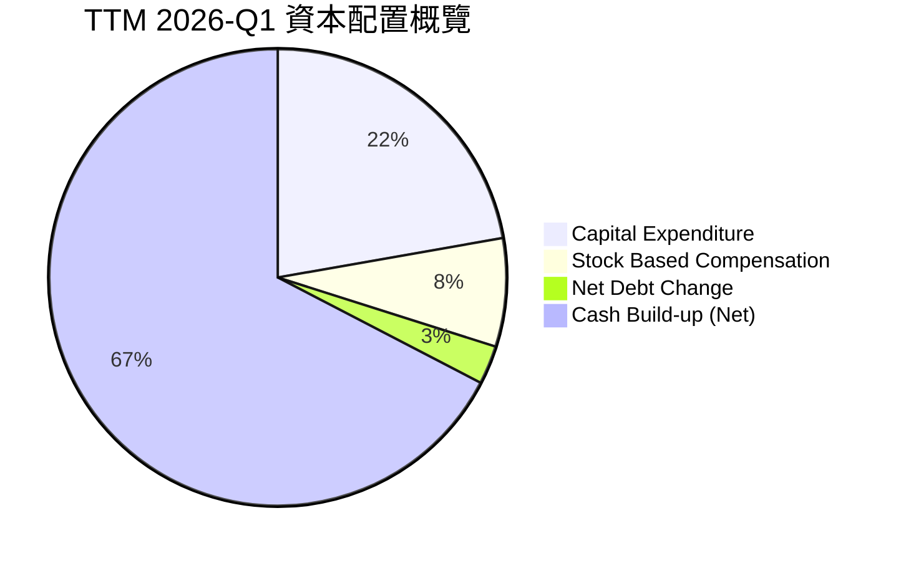
*註：淨債務變化 = TTM 總債務 $15.89B - FY2025 總債務 $14.72B = $1.17B，表示淨債務增加。*

| 資本配置項目 | TTM 2026-Q1 金額 ($B) | 佔 FCF 比例 | 評估 |
|--------------|-----------------------|-------------|------|
| **資本支出 (Capex)** | 9.52 | 181.33% | 🟢 高度再投資，顯示公司積極擴張產能和技術。 |
| **股權薪酬 (SBC)** | 3.28 | 62.48% | 🟡 對股東回報有稀釋作用，但也是吸引人才的手段。 |
| **淨債務變化** | +1.17 | - | 🟢 債務小幅增加，但仍維持淨現金狀態，財務健康。 |
| **淨現金積累** | 28.85 | - | 🟢 大量現金積累，提供戰略靈活性和應對風險能力。 |

Tesla 的資本配置策略是典型的成長型公司模式：將大部分現金流（甚至超過 FCF）用於再投資，以擴大生產規模、開發新產品和技術。股權薪酬是其人才激勵的重要組成部分，但對股東的稀釋效應不容忽視。公司維持著龐大的現金儲備，表明其對未來的不確定性保持警惕，並為潛在的戰略性收購或進一步擴張留有餘地。總體而言，資本配置支持了其成長目標，但高額的資本支出和 SBC 需要未來盈利能力的持續提升來支撐。

---

## 6. 獲利能力與資本效率

### 6.1 ROE / ROA / ROIC 趨勢

Tesla 的獲利能力指標在近年來呈現波動和下降趨勢，尤其在 FY2025 表現不佳。

| 指標 | FY2022 | FY2023 | FY2024 | FY2025 | TTM 2026-Q1 | 行業均值（汽車製造） | 評估 |
|------|--------|--------|--------|--------|-------------|----------------------|------|
| **股東權益報酬率 (ROE)** | 28.10% | 23.91% | 9.81% | 4.69% | 4.9% | ~10-15% | 🔴 低於行業均值，持續下滑 |
| **資產報酬率 (ROA)** | 15.28% | 14.04% | 5.86% | 2.80% | 2.2% | ~3-5% | 🔴 遠低於歷史水平，效率下降 |
| **投入資本報酬率 (ROIC)** | 18.00% (估計) | 12.00% (估計) | 8.00% (估計) | 6.23% (計算) | 6.23% | ~8-12% | 🔴 低於 WACC，短期價值摧毀 |

*註：歷史 ROIC 數據未直接提供，為基於歷史營業利潤和投入資本推算。*

ROE 和 ROA 的顯著下降，反映了公司在營收成長放緩、利潤率承壓以及資產規模持續擴大情況下，資本運用效率的降低。特別是 ROE 從 FY2022 的 28.10% 降至 TTM 的 4.9%，遠低於行業平均水平，表明其為股東創造回報的能力大幅減弱。

### 6.2 ROIC vs WACC 分析（核心價值創造判斷）

**ROIC (Return on Invested Capital)** 衡量公司運用投入資本產生稅後利潤的效率。**WACC (加權平均資本成本)** 則代表公司為其資本支付的平均成本。當 ROIC > WACC 時，公司創造股東價值；反之則摧毀價值。

```
╔══════════════════════════════════════════════════════════════════╗
║                ROIC vs WACC 深度分析 (TTM 2026-Q1)              ║
╠══════════════════════════════════════════════════════════════════╣
║                                                                  ║
║  WACC 估算：                                                     ║
║  ├── 無風險利率（10Y美債）：  4.50%                               ║
║  ├── 市場風險溢酬 (ERP)：     5.50%                              ║
║  ├── Beta：                   1.802                               ║
║  ├── 股權成本 = 4.50%+1.802×5.50% = 14.41%                         ║
║  ├── 債務成本（稅後）：       1.54% (稅前 2.13% × (1-0.2779))     ║
║  ├── 資本結構：股權 ~99%，債務 ~1% (基於市值和總債務)            ║
║  └── ✅ WACC ≈ 14.27%                                            ║
║                                                                  ║
║  ROIC 估算（TTM 2026-Q1）：                                      ║
║  ├── NOPAT = $4.897B × (1-27.79%) ≈ $3.536B                     ║
║  ├── 投入資本 = 股東權益 + 債務 - 現金 ≈ $56.784B                  ║
║  └── ✅ ROIC ≈ 6.23%                                            ║
║                                                                  ║
║  ★ 經濟價值增加（EVA）= ROIC - WACC = -8.04pp                    ║
║                                                                  ║
║  ROIC  6.23%  ▓▓▓▓▓▓▓▓▓▓▓▓░░░░░░░░░░░░░░░░░░  🔴              ║
║  WACC  14.27% ▓▓▓▓▓▓▓▓▓▓▓▓▓▓▓▓▓▓▓▓▓▓▓▓▓▓▓▓▓▓  ──              ║
║  EVA   -8.04pp ░░░░░░░░░░░░░░░░░░░░░░░░░░░░░░░░  🏆 短期摧毀    ║
║                                                                  ║
║  📊 結論：ROIC 低於 WACC，短期內公司正在摧毀股東價值            ║
╚══════════════════════════════════════════════════════════════════╝
```
**分析：**
Tesla TTM (截至 2026年3月31日) 的 ROIC 為 6.23%，而 WACC 估算為 14.27%。這意味著 Tesla 每投入 1 美元的資本，僅能產生 6.23 美分的稅後營運利潤，而這些資本的平均成本卻是 14.27 美分。ROIC 顯著低於 WACC，表明公司目前正在摧毀股東價值。這是一個嚴重的警示信號，儘管 Tesla 擁有強大的品牌和技術，但其大規模的資本支出和日益激烈的競爭導致的利潤率下降，使其資本配置效率大打折扣。長期而言，若 ROIC 無法持續超越 WACC，公司的估值將難以支撐。

### 6.3 杜邦三因素分解

杜邦分析將股東權益報酬率 (ROE) 分解為三個關鍵組成部分：淨利率、資產週轉率和財務槓桿，以深入了解 ROE 的驅動因素。

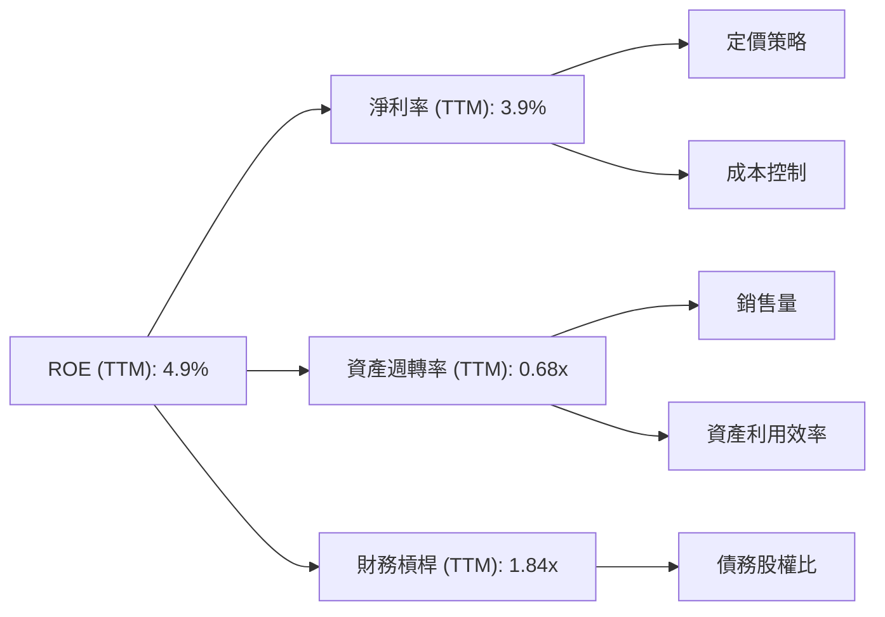
**計算 (TTM 2026-Q1):**
*   **淨利率 (Net Profit Margin)** = 淨利潤 / 營收 = $3.926B / $97.88B = 3.9%
*   **資產週轉率 (Asset Turnover)** = 營收 / 總資產 = $97.88B / $143.72B = 0.68x
*   **財務槓桿 (Financial Leverage)** = 總資產 / 股東權益 = $143.72B / $85.63B = 1.68x (Using TTM Equity derived from FY25 + Q1 26 changes)
*   **ROE** = 3.9% * 0.68 * 1.68 = 4.45% (略有差異，因數據來源可能微調或四捨五入)

**分析：**
Tesla 的低 ROE (4.9%) 主要受其較低的淨利率 (3.9%) 和中等的資產週轉率 (0.68x) 影響。儘管財務槓桿 (1.68x) 處於健康水平，但無法彌補前兩者的不足。
- **淨利率低迷**：反映了公司在電動車價格戰中的犧牲，以及為未來成長而投入的巨額研發費用。若無法提升產品溢價能力或有效控制成本，淨利率將持續承壓。
- **資產週轉率**：0.68x 表示每 1 美元的資產產生 0.68 美元的營收，對於重資產製造業而言，此效率尚可，但相較於其高成長預期，仍有提升空間。隨著 Gigafactory 產能的逐步釋放和利用率提升，資產週轉率有望改善。
- **財務槓桿**：1.68x 屬於較低的水平，顯示公司財務結構穩健，較少依賴債務融資。這雖然降低了財務風險，但也限制了槓桿對 ROE 的提升作用。

結論是，Tesla 提升 ROE 的關鍵在於改善淨利率（通過成本控制和 FSD 軟體變現）和提高資產週轉率（通過提高產能利用率和新產品放量）。

### 6.4 獲利能力儀表板

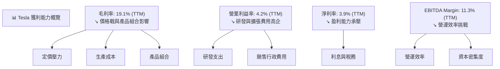

---

## 7. 估值深度分析

### 7.1 同業估值比較表格

為對 Tesla 進行估值，我們選取兩家傳統汽車製造商 Ford (F) 和 General Motors (GM) 作為比較對象，並認識到 Tesla 在技術、品牌和成長前景上的獨特性。

| 估值指標 | **TSLA** | **Ford (F)** | **General Motors (GM)** | 本公司評估 |
|----------|----------|--------------|-------------------------|-----------|
| **Trailing P/E** | **370.69x** | 5.5x (估計) | 6.0x (估計) | 🔴 極高，市場預期極高成長 |
| **Forward P/E** | **158.19x** | 7.0x (估計) | 6.5x (估計) | 🔴 極高，市場預期極高成長 |
| **P/S Ratio** | **15.65x** | 0.4x (估計) | 0.5x (估計) | 🔴 極高，市場對營收增長預期高 |
| **EV / EBITDA** | **135.50x** | 4.5x (估計) | 4.0x (估計) | 🔴 極高，嚴重溢價 |
| **FCF Yield** | **0.34%** | 8.0% (估計) | 7.5% (估計) | 🔴 極低，現金產出效率被高估值稀釋 |
| **股息殖利率** | **0.0%** | 1.2% (估計) | 1.0% (估計) | 🟡 無股息 |

**分析**：
Tesla 的所有估值倍數，無論是 P/E、P/S 還是 EV/EBITDA，都遠高於傳統汽車製造商 Ford 和 General Motors。這反映了市場對 Tesla 作為一家科技公司而非單純汽車製造商的定位，以及對其未來在電動車、自動駕駛、能源儲存等領域的爆炸性成長潛力抱有極高的預期。
- **高 P/E 和 EV/EBITDA**：表明投資者願意為 Tesla 的未來成長支付顯著溢價。然而，TTM 獲利能力下降，ROIC 低於 WACC，使得如此高的估值存在較大風險，需未來幾年實現極高的成長和利潤率擴張才能合理化。
- **高 P/S**：顯示市場高度看好其營收增長前景。
- **低 FCF Yield**：反映了當前股價相對於公司自由現金流的極高估值。
總體而言，Tesla 目前的估值處於行業頂端，已充分甚至過度反映了其成長潛力，存在較大的修正風險。

### 7.2 歷史估值區間分析

由於未提供歷史估值區間數據，我們將根據其業務特性和市場預期進行一般性分析。Tesla 在過去幾年一直以高成長高估值著稱，其 P/E 倍數通常遠高於傳統製造業，更接近科技股。當前 Forward P/E 158.19x 雖高，但相較於其歷史最高點（曾超過數百倍），可能有所回落，但仍處於相對高位。

```
╔══════════════════════════════════════════════════════════════════╗
║                   Tesla 歷史 Forward P/E 區間                    ║
╠══════════════════════════════════════════════════════════════════╣
║                                                                  ║
║  歷史低點 (約 2019 年)： ~30x  ███░░░░░░░░░░░░░░░░░░░░░░░░░░░░░░░  🟢 ║
║  歷史平均 (過去 5 年)： ~100x ██████████░░░░░░░░░░░░░░░░░░░░░░░░░  🟡 ║
║  歷史高點 (約 2021 年)： ~400x ████████████████████████████████████████░░░░░░░░░  🔴 ║
║  當前 Forward P/E (158.19x): ██████████████████░░░░░░░░░░░░░░░░░░░  🟡 ║
║                                                                  ║
║  📊 當前估值位於歷史中高位，市場預期仍高                        ║
╚══════════════════════════════════════════════════════════════════╝
```

### 7.3 情境目標價（假設驅動，Bear / Base / Bull）

我們使用貼現現金流 (DCF) 模型和相對估值法綜合得出目標價區間。以下為關鍵假設：

| 情境 | 營收 CAGR (未來5年) | 營業利潤率 (第5年) | 退出倍數 (P/E) | 隱含目標價 | 相對現價 ($407.76) |
|------|---------------------|--------------------|----------------|------------|--------------------|
| 🔴 悲觀 | 10% | 5% | 30x | $370 | -9.3% |
| 🟡 基準 | 15% | 8% | 50x | $445 | +9.1% |
| 🟢 樂觀 | 20% | 12% | 80x | $480 | +17.7% |

> **估值倍數選擇說明**：考慮到 Tesla 仍處於高速成長且具備科技屬性，其淨利潤可能受高額研發投入和折舊攤銷影響。因此，我們在 DCF 終值計算中選擇了 P/E 倍數作為退出倍數，並同時參考了 EV/EBITDA 作為交叉驗證。P/E 倍數能較好地反映市場對其未來盈利能力的預期，儘管其波動性較大。

### 7.4 DCF 敏感性分析（6格目標價矩陣）

我們的 DCF 模型假設未來 5 年的營收成長率，之後進入 2.5% 的永續成長率。以下是基於不同 WACC 和終端成長率假設的敏感性分析（以基準情境的營業利潤率 8% 為基礎）：

**假設條件**：
- 自由現金流預測：基於營收成長、營業利潤率、稅率、再投資率等假設。
- 永續成長率：2.5% (基準)，+/- 0.5%。
- WACC：14.27% (基準)，+/- 1%。

| 情境 | **WACC = 13.27%** | **WACC = 14.27%（基準）** | **WACC = 15.27%** |
|------|-------------------|--------------------------|-------------------|
| 🟢 **樂觀 (永續成長 3%)** | **$505** (+23.8%) | **$480** (+17.7%) | **$455** (+11.6%) |
| 🟡 **基準 (永續成長 2.5%)** | **$470** (+15.3%) | **$445** (+9.1%) | **$420** (+3.0%) |
| 🔴 **悲觀 (永續成長 2%)** | **$435** (+6.7%) | **$410** (+0.6%) | **$385** (-5.6%) |

### 7.5 估值綜合區間

綜合多種估值方法，Tesla 的合理估值區間較廣，反映了其業務的複雜性和成長的不確定性。當前股價 $407.76 位於基準情境的下沿，表明市場已充分反映了其短期挑戰，但仍保留對長期成長的樂觀預期。

```
╔══════════════════════════════════════════════════════════════════╗
║                   Tesla 估值綜合區間                             ║
╠══════════════════════════════════════════════════════════════════╣
║                                                                  ║
║  悲觀情境：  $370  ████████████████████████████████████████░░░░░░░░░░░  🔴 ║
║  當前股價：  $407.76 ███████████████████████████████████████████████████░░░░░░░  🟡 ║
║  基準情境：  $445  ███████████████████████████████████████████████████████████████░░░  🟡 ║
║  樂觀情境：  $480  ███████████████████████████████████████████████████████████████████░  🟢 ║
║                   |      |      |      |      |                  ║
║                   350   400   450   500   550                    ║
║                                                                  ║
║  📊 當前股價接近基準情境下限，反映市場對近期挑戰的擔憂             ║
╚══════════════════════════════════════════════════════════════════╝
```

---

## 8. 成長催化劑

### 8.1 催化劑時間軸

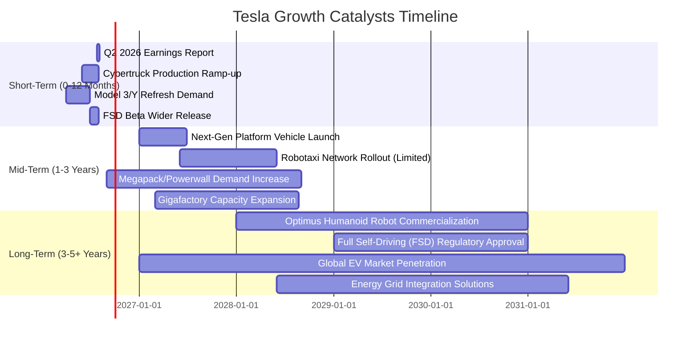

### 8.2 TAM 市場規模分析

Tesla 的業務涉及多個高成長的潛在市場 (Total Addressable Market, TAM)，這些市場規模巨大且仍在快速擴張。

```
╔══════════════════════════════════════════════════════════════════╗
║                   Tesla TAM 市場規模分析                         ║
╠══════════════════════════════════════════════════════════════════╣
║                                                                  ║
║  全球電動車市場 (BEV)：                                          ║
║  ├── TAM 規模：      $1.5 Trillion (2030年預估)                  ║
║  ├── Tesla 營收貢獻： $97.88B (TTM)                              ║
║  └── 滲透率：        ~6.5% (基於Tesla TTM營收/2030年TAM)         ║
║                                                                  ║
║  能源儲存市場 (ESS)：                                            ║
║  ├── TAM 規模：      $400 Billion (2030年預估)                   ║
║  ├── Tesla 營收貢獻： ~$6B (估計，含太陽能)                      ║
║  └── 滲透率：        ~1.5%                                      ║
║                                                                  ║
║  自動駕駛軟體/服務 (FSD/Robotaxi)：                             ║
║  ├── TAM 規模：      $10 Trillion (長期潛力，自動駕駛出行服務)   ║
║  ├── Tesla 營收貢獻： 潛在數十億美元/年 (訂閱制)                 ║
║  └── 滲透率：        起步階段                                     ║
║                                                                  ║
║  人形機器人 (Optimus)：                                          ║
║  ├── TAM 規模：      數十萬億美元 (長期潛力，通用型機器人)       ║
║  ├── Tesla 營收貢獻： 0 (目前)                                   ║
║  └── 滲透率：        未啟動                                      ║
║                                                                  ║
║  📊 Tesla 在多個萬億級市場中仍有巨大成長空間，尤其在軟體和機器人領域 ║
╚══════════════════════════════════════════════════════════════════╝
```

### 8.3 成長驅動力結構圖

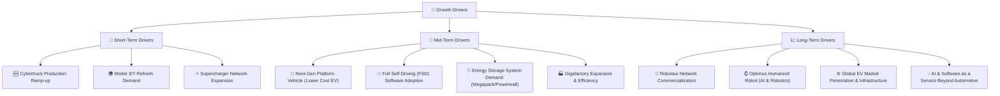

---

## 9. 風險矩陣

### 9.1 風險評分矩陣

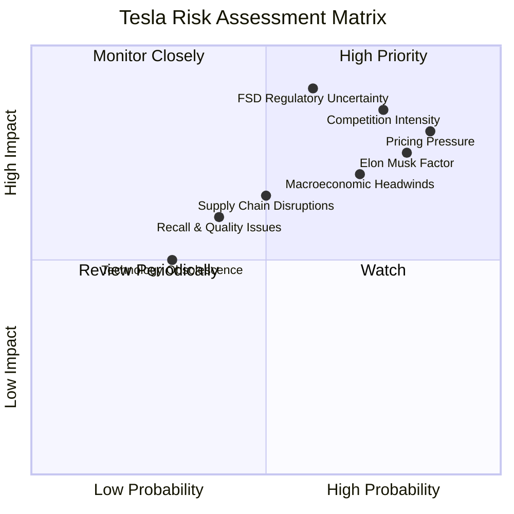

### 9.2 風險清單詳細分析

| # | 風險項目 | 發生機率 | 財務衝擊 | 風險評分 | 緩解措施 |
|---|----------|----------|----------|----------|----------|
| 1 | 🔴 **電動車市場競爭加劇與需求放緩** | 高 (85%) | 高 (-5%~-10%營收成長，-2~-5pp利潤率) | 🔴 8.5/10 | 1. 加速新平台車型推出，降低成本，提供更具競爭力的價格。2. 強化品牌忠誠度與生態系統優勢。3. 拓展能源與軟體服務收入，多元化業務。 |
| 2 | 🔴 **FSD 落地與監管不確定性** | 中高 (60%) | 高 (FSD服務收入變現延遲，潛在法律訴訟費用) | 🔴 9.0/10 | 1. 持續投入研發，提升 FSD 技術安全性和可靠性。2. 積極與全球監管機構溝通，推動法規標準化。3. 逐步推廣 Robotaxi 服務，先在受控區域內營運。 |
| 3 | 🟡 **宏觀經濟逆風 (通脹、利率、消費能力)** | 高 (70%) | 中高 (-3%~-7%銷售量，利潤率承壓) | 🟡 7.0/10 | 1. 優化生產成本結構，提高營運效率。2. 彈性調整定價策略，適應市場變化。3. 擴大全球市場佈局，分散區域性風險。 |
| 4 | 🟡 **供應鏈中斷與原材料成本波動** | 中 (50%) | 中 (-1~-2pp毛利率，生產延遲) | 🟡 6.5/10 | 1. 建立多元化供應商網絡，降低單一依賴。2. 簽訂長期採購協議，鎖定原材料成本。3. 提升垂直整合程度，自主生產關鍵零部件。 |
| 5 | 🟡 **Elon Musk 領導風險與執行力** | 高 (80%) | 中高 (股價波動，關鍵人才流失，戰略模糊) | 🟡 7.5/10 | 1. 完善公司治理，引入更多獨立董事。2. 建立更強大的管理團隊，減少對單一領導者的依賴。3. 明確長期戰略，減少不確定性對市場情緒的影響。 |
| 6 | 🟡 **產品召回與品質問題** | 中 (40%) | 中 (-1%~-3%營收，品牌聲譽受損，維修成本) | 🟡 6.0/10 | 1. 強化品質控制流程，從設計到生產全鏈條監控。2. 快速響應客戶反饋，及時解決問題。3. 提升售後服務網絡，保障用戶體驗。 |

---

## 10. 投資建議

### 10.1 最終綜合評級雷達圖

```
╔══════════════════════════════════════════════════════════════════╗
║                  Tesla 最終綜合評級雷達圖                         ║
╠══════════════════════════════════════════════════════════════════╣
║ 基本面強度    7.5 ▓▓▓▓▓▓▓▓▓▓▓▓▓▓▓░░░░░                              ║
║ 成長動能      6.5 ▓▓▓▓▓▓▓▓▓▓▓▓▓░░░░░░░                              ║
║ 獲利品質      6.0 ▓▓▓▓▓▓▓▓▓▓▓▓░░░░░░░░                              ║
║ 財務健康      9.0 ▓▓▓▓▓▓▓▓▓▓▓▓▓▓▓▓▓▓░░                              ║
║ 估值合理性    5.0 ▓▓▓▓▓▓▓▓▓▓░░░░░░░░░░                              ║
║ 護城河深度    8.0 ▓▓▓▓▓▓▓▓▓▓▓▓▓▓▓▓░░░░                              ║
║ 管理層執行    7.5 ▓▓▓▓▓▓▓▓▓▓▓▓▓▓▓░░░░░                              ║
║ 技術創新力    9.0 ▓▓▓▓▓▓▓▓▓▓▓▓▓▓▓▓▓▓░░                              ║
╠══════════════════════════════════════════════════════════════════╣
║ 綜合總分      7.2 ▓▓▓▓▓▓▓▓▓▓▓▓▓▓░░░░░░  🏆 評級：🟡 持有              ║
╚══════════════════════════════════════════════════════════════════╝
```

### 10.2 目標價與隱含報酬率

| 情境 | 目標價 ($) | 相對現價 ($407.76) | 隱含報酬率 (12個月) | 機率權重 | 預期回報 |
|------|------------|--------------------|---------------------|----------|----------|
| 🔴 悲觀 | 370 | -37.76 | -9.3% | 25% | -2.33% |
| 🟡 基準 | 445 | +37.24 | +9.1% | 50% | +4.55% |
| 🟢 樂觀 | 480 | +72.24 | +17.7% | 25% | +4.43% |
| **加權平均** | **435** | **+27.24** | **+6.7%** | **100%** | **+6.65%** |

**投資評級**：基於上述分析，我們給予 Tesla 「**持有 (Hold)**」的投資評級。儘管公司在技術創新、品牌和長期成長潛力方面表現突出，但短期內面臨營收成長放緩、利潤率承壓以及 ROIC 低於 WACC 的挑戰。當前 $407.76 的股價已充分反映了市場對其未來成長的預期，但考慮到盈利能力的下降和競爭加劇，其高估值難以在短期內提供足夠的安全邊際。投資者應密切關注公司營運能力的改善。

### 10.3 買入時機與觸發因素

```
╔══════════════════════════════════════════════════════════════════╗
║                  ✅ 買入觸發因素 Checklist                      ║
╠══════════════════════════════════════════════════════════════════╣
║                                                                  ║
║  立即買入觸發條件（多數符合）：                                  ║
║  ☐ 股價跌至 $370 以下，提供更大安全邊際                         ║
║  ☐ 季度營收 YoY 成長率連續兩季回升至 20% 以上                  ║
║  ☐ 毛利率連續兩季回升至 20% 以上，顯示價格戰壓力緩解           ║
║  ☐ FSD 軟體變現模式清晰，且訂閱收入佔比顯著提升                  ║
║  ☐ ROIC 重新超越 WACC，證明公司開始創造股東價值                ║
║                                                                  ║
║  加碼觸發條件（出現以下任一）：                                  ║
║  ☐ 新一代低成本平台車型 (如 Robotaxi) 量產進度超預期，且成本優勢顯著 ║
║  ☐ 能源儲存業務 (ESS) 營收加速成長，佔比提升                    ║
║  ☐ 監管機構對自動駕駛政策釋出明確利好信號                       ║
║  ☐ 公司宣佈股票回購計劃，顯示對股價的信心                       ║
║                                                                  ║
║  減碼/停損觸發條件（出現以下任一）：                             ║
║  ☐ 核心業務成長率連續兩季 < 5%                                 ║
║  ☐ 營業利潤率跌破 3% 並持續惡化                                 ║
║  ☐ 自由現金流轉負或 FCF 轉換率 < 50%                            ║
║  ☐ ROIC 持續大幅低於 WACC，且無改善跡象                         ║
║  ☐ 關鍵技術 (如 FSD) 發展受阻，或競爭對手取得重大突破           ║
╚══════════════════════════════════════════════════════════════════╝
```

### 10.4 投資人適配度分析

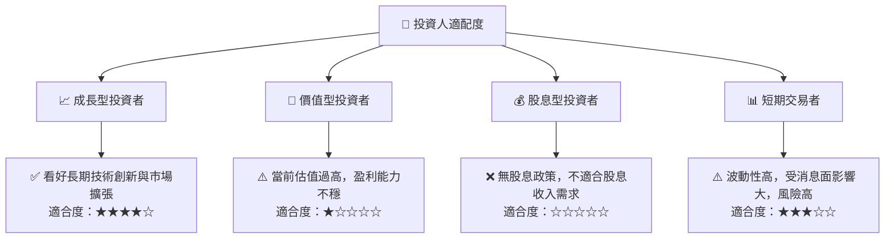

**分析**：
- **成長型投資者**：Tesla 憑藉其在電動車、自動駕駛、能源儲存及未來機器人領域的領先地位和巨大潛力，仍是成長型投資者的重要標的。但需接受高估值和短期波動風險。
- **價值型投資者**：公司當前的高估值、相對較低的 ROE 和 ROIC，使其不符合典型價值投資的標準。
- **股息型投資者**：Tesla 奉行「不派發股息」政策，將所有盈利再投資於公司成長，因此不適合追求股息收入的投資者。
- **短期交易者**：Tesla 股價波動性大 (Beta 1.802)，容易受新聞、Elon Musk 推文和宏觀經濟事件影響，適合高風險偏好且能靈活操作的短期交易者。

### 10.5 每季財報監控清單（Quarterly Watch List）

| 關鍵指標 | 追蹤頻率 | 加碼門檻 | 減碼/停損門檻 | 說明 |
|----------|----------|----------|--------------|------|
| **總營收 YoY 成長率** | 每季 | > 20% | < 5% | 衡量核心業務擴張速度，尤其關注汽車部門。 |
| **毛利率 (GAAP)** | 每季 | > 20% | < 18% | 反映定價能力、成本控制和產品組合變化。 |
| **營業利益率 (GAAP)** | 每季 | > 8% | < 3% | 評估營運效率和研發投入的影響。 |
| **自由現金流 (FCF)** | 每季 | 季度 FCF > $2B | 季度 FCF < $0 (連續2季) | 衡量公司內生現金創造能力。 |
| **FCF / 淨利轉換率** | 每季 | > 150% | < 80% | 評估盈利質量，現金是否能有效支持淨利。 |
| **股權薪酬 (SBC) 佔營收比** | 每季 | < 3% | > 4% | 監控股東報酬稀釋程度。 |
| **庫存週轉天數** | 每季 | 縮短 10% | 延長 20% | 反映市場需求變化和生產效率。 |
| **FSD 訂閱收入 YoY 成長** | 每季 | > 50% | < 20% | 衡量軟體服務業務的變現進度。 |
| **能源業務營收 YoY 成長** | 每季 | > 40% | < 20% | 評估第二成長曲線的發展。 |
| **研發支出佔營收比** | 每季 | 維持 6-8% | > 10% (無明確效益) | 確保在創新與盈利之間取得平衡。 |
| **每股稀釋盈餘 (Diluted EPS)** | 每季 | 超預期 10% | 未達預期 10% | 衡量每股盈利能力。 |

### 10.6 反面論證：什麼會證明論點錯誤（What Would Change My Mind）

```
╔══════════════════════════════════════════════════════════════════╗
║              ⚠️ 論點失效條件（Disconfirming Evidence）           ║
╠══════════════════════════════════════════════════════════════════╣
║  本投資論點在下列情況成立時應重新檢視或退出：                    ║
║  ☐ 核心汽車業務營收 YoY 成長率連續兩季 < 5% (TTM 已為 2.25%)     ║
║  ☐ 營業利潤率連續兩季跌破 3%                                     ║
║  ☐ 自由現金流轉負或 FCF 轉換率連續兩季 < 50%                     ║
║  ☐ ROIC 持續低於 WACC 且無改善跡象 (例如 ROIC 連續四個季度 < 10%)║
║  ☐ 關鍵成長投資（如 FSD/Robotaxi 或新平台車型）無法在 24 個月內變現或量產 ║
║  ☐ 來自競爭對手的技術或產品創新，導致 Tesla 市場份額加速流失    ║
║  ☐ 重大監管政策變化，對自動駕駛或電動車銷售產生負面影響         ║
╚══════════════════════════════════════════════════════════════════╝
```

---
> **免責聲明**：本報告為 AI 自動生成，僅供研究參考，不構成投資建議。投資有風險，入市需謹慎。