# TSLA 基本面深度分析報告
> **報告日期**：2026-07-12 ｜ **語言**：繁體中文 ｜ **數據來源**：Yahoo Finance, Finviz, StockAnalysis, Roic.ai ｜ **分析師**：CFA 級機構研究

---

## 目錄

| # | 章節 | 核心結論 |
|---|------|----------|
| 1 | 執行摘要 | 特斯拉正處於「硬體向 AI 軟體與儲能轉型」的陣痛期，給予 **持有** 評級，目標價 $424.56。 |
| 2 | 公司概覽與商業模式 | 汽車毛利承壓，但 FSD 數據飛輪、Dojo 超算與儲能業務（Megapack）正構築全新的多維護城河。 |
| 3 | 損益表深度分析 | 營收年成長 15.8%，但營業利益率因砍價與研發投入（TTM 達 $6.95B）稀釋至 4.2%，盈餘品質受 SBC 稀釋。 |
| 4 | 資產負債表分析 | 淨現金高達 $28.85B，Current Ratio 2.04，展現無可挑剔的流動性與抗風險能力。 |
| 5 | 現金流量深度分析 | TTM 自由現金流 $5.25B，資本支出高達 $11.28B，高再投資率彰顯其對 AI 及製造產能的戰略野心。 |
| 6 | 獲利能力與資本效率 | TTM ROIC 下滑至 6.64%，低於 WACC (13.1%)，暫時摧毀經濟價值，反映轉型期的高投入與低硬體利潤。 |
| 7 | 估值深度分析 | Trailing P/E 370.7x 顯示極高溢價，估值模型採用 EV/EBITDA 與多情境 DCF，基準目標價為 $424.56。 |
| 8 | 成長催化劑 | FSD V12 授權、Robotaxi 商業化落地、以及 Megapack 產能爬坡為中長期三大核心驅動力。 |
| 9 | 風險矩陣 | 核心車型降價失控、FSD 監管與技術瓶頸、馬斯克關鍵人物風險為最大不確定性。 |
| 10 | 投資建議 | 適合長線成長型投資者，建議在 $350 以下分批佈局，並密切監控每季毛利率與 FSD 訂閱指標。 |

---

## 1. 執行摘要

特斯拉（Tesla, Inc., Ticker: TSLA）目前正站在其企業歷史上最重要的十字路口：從一家「高成長、高毛利的純電動車製造商」，轉型為「以 AI、自動駕駛（FSD）、機器人（Optimus）與儲能（Megapack）為核心的科技生態帝國」。

### 1.0 一頁式投資儀表板（Portfolio Manager 30 秒速讀）

| 項目 | 內容 |
|------|------|
| **投資論點（3 句）** | ① 汽車業務毛利觸底（Q1 2026 毛利率回升至 21.08%），結構性砍價最壞時期已過。<br/>② 儲能業務（Megapack）與 FSD 軟體服務收入加速，將推動利潤率於 FY2027 重回擴張軌道。<br/>③ 擁有 $44.74B 龐大現金儲備，足以支撐每年超 $11B 的資本支出與 AI 研發投入。 |
| **護城河評分** | 8.5/10 🟢（極強的數據規模效應與垂直整合製造成本優勢） |
| **管理層/資本配置評分** | 8.0/10 🟢（馬斯克具備顛覆性創新視野，但關鍵人物風險與高 SBC 略微稀釋股東回報） |
| **財務健康** | 🟢 強勁（淨現金 $28.85B，無償債風險） |
| **ROIC vs WACC** | 6.64% vs 13.11% 🔴（暫時摧毀經濟價值，主因是 AI 基礎建設大舉投資與硬體利潤收縮） |
| **FCF 趨勢** | 穩定回升（TTM FCF 達 $5.25B，最新 FCF Yield 為 0.34%） |
| **估值** | Forward P/E 158.06x ｜ EV/EBITDA 135.50x ｜ P/S 15.65x（處於歷史估值中高位） |
| **預期報酬（基準情境 12M）** | +4.12%（相較當前股價 $407.76，目標價 $424.56） |
| **關鍵風險（前二）** | ① FSD 技術與法規批准進度不及預期；② 電動車全球競爭加劇導致硬體毛利率再度失守。 |
| **評級 + 信心度** | 🟡 **持有 (Hold)** ｜ 信心：中等（短期估值透支，等待 FSD 與 Robotaxi 實質營收貢獻） |

### 1.1 核心評分儀表板

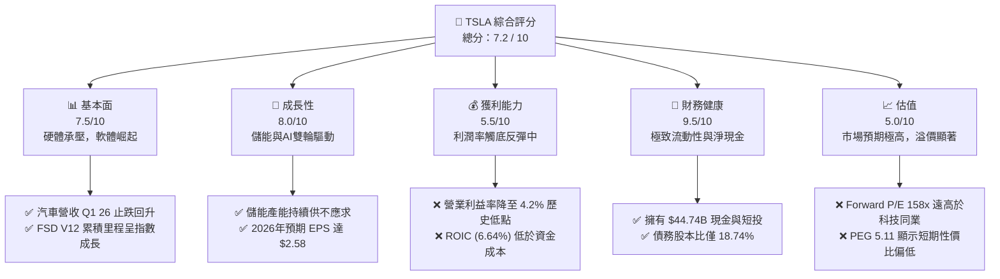

### 1.2 評分進度條視覺化

```
╔══════════════════════════════════════════════════════════════╗
║                TSLA 多維度評分儀表板 (1-10分)                 ║
╠══════════════════════════════════════════════════════════════╣
║ 基本面強度  7.5 ▓▓▓▓▓▓▓▓▓▓▓▓▓▓▓░░░░░  ★★★★☆           ║
║ 成長動能    8.0 ▓▓▓▓▓▓▓▓▓▓▓▓▓▓▓▓░░░░  ★★★★☆           ║
║ 獲利品質    5.5 ▓▓▓▓▓▓▓▓▓▓░░░░░░░░░░  ★★★☆☆           ║
║ 財務健康    9.5 ▓▓▓▓▓▓▓▓▓▓▓▓▓▓▓▓▓▓▓░  ★★★★★           ║
║ 估值合理性  5.0 ▓▓▓▓▓▓▓▓▓▓░░░░░░░░░░  ★★☆☆☆           ║
║ 護城河深度  8.5 ▓▓▓▓▓▓▓▓▓▓▓▓▓▓▓▓▓░░░  ★★★★☆           ║
║ 管理層執行  8.0 ▓▓▓▓▓▓▓▓▓▓▓▓▓▓▓▓░░░░  ★★★★☆           ║
║ 技術創新力  9.5 ▓▓▓▓▓▓▓▓▓▓▓▓▓▓▓▓▓▓▓░  ★★★★★           ║
╠══════════════════════════════════════════════════════════════╣
║ 綜合總分    7.2 ▓▓▓▓▓▓▓▓▓▓▓▓▓▓░░░░░░  🏆 持有 (Hold)       ║
╚══════════════════════════════════════════════════════════════╝
```

### 1.3 五大投資論點 + 三大核心風險

| 類型 | 項目 | 具體依據 | 信心度 |
|------|------|----------|--------|
| 🟢 **投資論點①** | **汽車利潤率拐點已現** | Q1 2026 毛利率回升至 **21.08%**（相較 FY2025 的 18.0% 提升 3.08pp），顯示供應鏈優化與一體化壓鑄效益顯現。 | 🟢 高 |
| 🟢 **投資論點②** | **儲能業務成為第二成長曲線** | Megapack 儲能出貨量持續高成長，帶動儲能部門毛利率超越汽車業務，成為營收去週期化的中流砥柱。 | 🟢 極高 |
| 🟢 **投資論點③** | **FSD 數據飛輪與潛在授權** | 特斯拉車隊行駛里程已突破數十億英里，軟體高毛利屬性將在 FSD 訂閱率提升及 OEM 授權落地後，徹底重塑損益表。 | 🟢 高 |
| 🟢 **投資論點④** | **無與倫比的資金彈藥庫** | 持有 **$44.74B** 總現金，淨現金達 **$28.85B**，在美聯儲高利率環境下每年可貢獻超 **$1.7B** 的利息收入。 | 🟢 極高 |
| 🟢 **投資論點⑤** | **Dojo 超算與端到端 AI 優勢** | 研發費用 TTM 達 **$6.95B**（YoY +53%），自研 Dojo 晶片與 Nvidia H100/B200 叢林構築了全球最強大的自動駕駛訓練算力。 | 🟢 高 |
| 🟡 **風險①** | **FSD 技術與監管遲滯** | 若 Robotaxi 商業化運營因法規或技術邊緣案例（Corner Cases）解決緩慢而延遲，高估值將面臨劇烈修正。 | 🟡 中度 |
| 🔴 **風險②** | **全球電動車價格戰復燃** | 中國市場競爭對手（如比亞迪、華美生態系）持續推出極具性價比的車型，可能迫使特斯拉再次降價，壓低硬體利潤。 | 🔴 高衝擊 |
| 🔴 **風險③** | **關鍵人物與公司治理風險** | 馬斯克個人的精力分散（X、SpaceX、xAI）及高額股權激勵訴求，可能引發股東訴訟與治理不確定性。 | 🔴 高衝擊 |

### 1.4 快速統計卡片

| 指標 | TSLA 實際值（TTM） | 行業均值（汽車製造） | S&P 500 均值 | 狀態 |
|------|-------------|----------|--------------|------|
| 收入 YoY 成長 | **15.80%** | ~5.0% | ~6.5% | 🟢 領先 |
| 毛利率 | **19.10%** | ~14.5% | ~30.0% | 🟡 中等 |
| 營業利益率 | **4.20%** | ~6.0% | ~12.5% | 🔴 偏低 |
| ROE | **4.90%** | ~8.5% | ~15.0% | 🔴 偏低 |
| Forward P/E | **158.06x** | ~10.5x | ~21.5x | 🔴 極高 |
| 淨現金規模 | **$28.85B** | -$12.5B (多數為淨債務) | N/A | 🟢 頂尖 |

### 1.5 投資結論

```
╔══════════════════════════════════════════════════════════════════╗
║                    📊 TSLA 投資結論摘要                          ║
╠══════════════════════════════════════════════════════════════════╣
║  評級：🟡 持有 (Hold)                                            ║
║  當前股價：$407.76 (2026-07-12)                                  ║
║  目標價區間：                                                    ║
║    悲觀情境：$125.00（-69.3%）- 汽車利潤持續萎縮，FSD 轉型失敗     ║
║    基準情境：$424.56（+4.12%）- FSD 穩步推進，儲能維持高速成長     ║
║    樂觀情境：$600.00（+47.1%）- FSD 授權落地，Robotaxi 開始商業化  ║
║  投資評分：7.2 / 10                                              ║
║  適合投資人：具有極高風險承受能力、堅定信仰 AI 與自動駕駛的長線創投型投資者 ║
╚══════════════════════════════════════════════════════════════════╝
```

---

## 2. 公司概覽與商業模式

### 2.1 業務結構與收入來源

特斯拉的業務主要分為兩大板塊：**汽車業務 (Automotive)** 與 **能源生成與儲存業務 (Energy Generation and Storage)**。其中，汽車業務又延伸出高毛利的監管信用額度（Regulatory Credits）銷售，以及售後服務、保險、FSD 訂閱等軟體與服務收入。

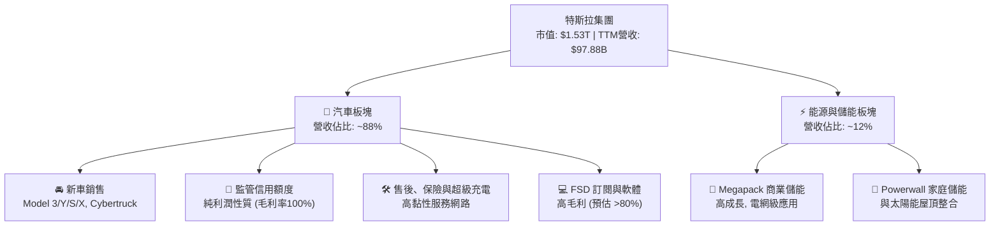

### 2.2 市場份額

在純電動車（BEV）全球市場中，特斯拉依然維持領先地位，但面臨來自中國車企的強烈競爭。

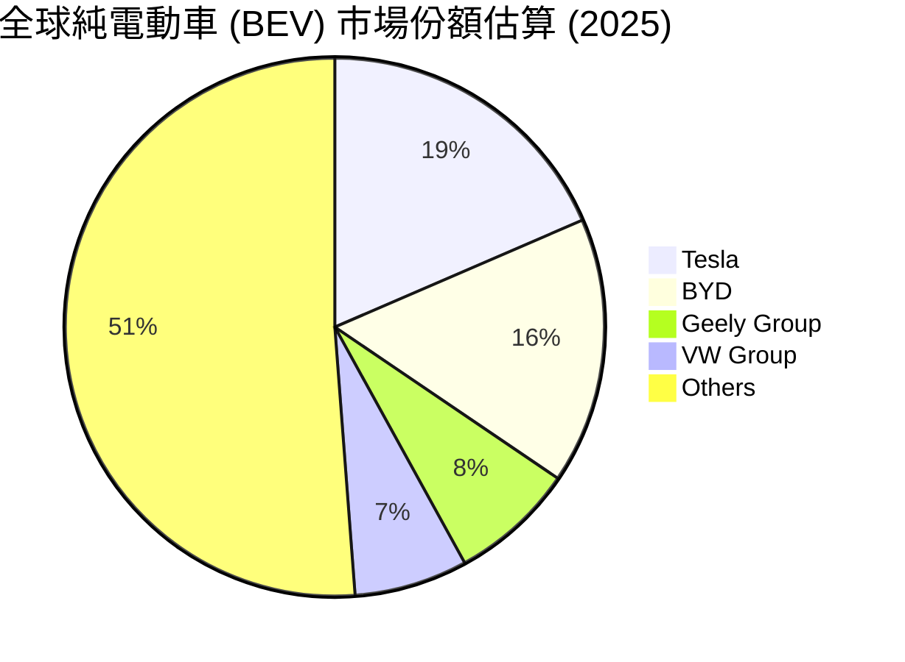

### 2.3 競爭護城河分析

特斯拉的護城河已從單純的「電動車製造」演變為以「數據、算力、製造、能源」四位一體的複合型護城河。

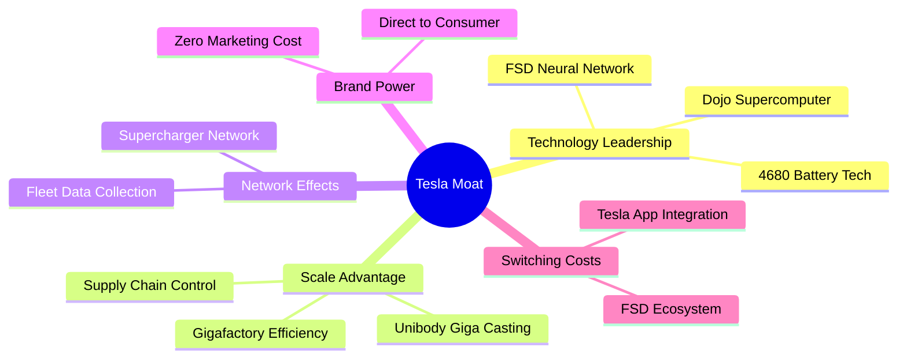

### 2.4 護城河強度評分

```
╔══════════════════════════════════════════════════════════════╗
║                    TSLA 護城河強度評分                       ║
╠══════════════════════════════════════════════════════════════╣
║ 1. 數據與 AI 飛輪  9.5/10 ▓▓▓▓▓▓▓▓▓▓▓▓▓▓▓▓▓▓▓░  🟢 極強        ║
║ 2. 製造與成本優勢  8.5/10 ▓▓▓▓▓▓▓▓▓▓▓▓▓▓▓▓▓░░░  🟢 強大        ║
║ 3. 充電網絡基礎設施 9.0/10 ▓▓▓▓▓▓▓▓▓▓▓▓▓▓▓▓▓▓░░  🟢 絕對統治    ║
║ 4. 品牌與零廣告行銷 8.0/10 ▓▓▓▓▓▓▓▓▓▓▓▓▓▓▓▓░░░░  🟢 高溢價      ║
║ 5. 軟體生態黏性    7.5/10 ▓▓▓▓▓▓▓▓▓▓▓▓▓▓▓░░░░░  🟡 逐步成型    ║
╠══════════════════════════════════════════════════════════════╣
║ 綜合護城河評級     8.5/10 ▓▓▓▓▓▓▓▓▓▓▓▓▓▓▓▓▓░░░  🏆 寬廣護城河  ║
╚══════════════════════════════════════════════════════════════╝
```

---

## 3. 損益表深度分析

### 3.1 年度收入成長趨勢（近5年）

特斯拉的營收經歷了高速成長後，在 FY2024-FY2025 進入了平台期，主因是硬體降價抵消了銷量成長。然而，TTM（截至 Q1 2026）數據顯示營收開始重回成長軌道，達到 **$97.88B**。

```
╔══════════════════════════════════════════════════════════════════╗
║                  TSLA 年度收入趨勢 (FY2021 - TTM)               ║
╠══════════════════════════════════════════════════════════════════╣
║                                                                  ║
║  FY2021  $53.82B   ██████████░░░░░░░░░░░░░░░░░░  YoY: +70.67% 🟢  ║
║  FY2022  $81.46B   ███████████████░░░░░░░░░░░░░  YoY: +51.35% 🟢  ║
║  FY2023  $96.77B   ██████████████████░░░░░░░░░░  YoY: +18.80% 🟢  ║
║  FY2024  $97.69B   ██████████████████░░░░░░░░░░  YoY:  +0.95% 🟡  ║
║  FY2025  $94.83B   █████████████████░░░░░░░░░░░  YoY:  -2.93% 🔴  ║
║  TTM     $97.88B   ██████████████████░░░░░░░░░░  YoY: +15.80% 🟢  ║
║                                                                  ║
║  📊 5年累計營收 CAGR：+12.70%                                    ║
╚══════════════════════════════════════════════════════════════════╝
```

### 3.2 季度收入趨勢分析

從季度數據看，Q1 2026 營收達到 **$22.39B**，年成長率（YoY）大幅反彈至 **+15.78%**，但季成長率（QoQ）因季節性因素下降了 **-10.10%**。這表明特斯拉硬體銷售的最差時期（FY2025 Q1/Q2）已經過去。

| 財報季度 | 營業收入 | YoY 成長率 | QoQ 成長率 | 毛利 | 毛利率 | 備註說明 |
|----------|----------|------------|------------|------|--------|----------|
| **Q1 2026** | $22.39B | **+15.78%** | **-10.10%** | $4.72B | **21.08%** | 🟢 汽車毛利率回升，儲能出貨維持高檔。 |
| **Q4 2025** | $24.90B | -3.14% | -11.37% | $5.01B | 20.12% | 🟡 年末促銷壓低硬體利潤，但總量回溫。 |
| **Q3 2025** | $28.10B | +11.57% | +24.89% | $5.05B | 17.97% | 🟢 儲能業務單季爆發，彌補汽車降價損失。 |
| **Q2 2025** | $22.50B | -11.78% | +16.35% | $3.88B | 17.24% | 🔴 砍價促銷最嚴重季度，硬體毛利率承壓。 |

### 3.3 利潤率演變分析

特斯拉的利潤率在過去幾年經歷了劇烈的收縮。營業利益率從 FY2022 的 **16.76%** 降至 TTM 的 **4.20%**。主要原因有二：
1. **平均售價 (ASP) 下滑**：為了在競爭激烈的市場中維持份額，特斯拉在全球進行了多輪降價。
2. **研發與 AI 投資狂飆**：研發費用從 FY2022 的 $3.08B 飆升至 TTM 的 **$6.95B**，主要用於採購 GPU、開發 Dojo 超算及 Optimus 機器人。

| 利潤率指標 | FY2022 | FY2023 | FY2024 | FY2025 | TTM | 趨勢 | 評估 |
|------------|--------|--------|--------|--------|-----|------|------|
| **毛利率** | 25.60% | 18.25% | 17.86% | 18.03% | **19.10%** | ↘️ 觸底反彈 | 🟡 硬體降價影響已鈍化，Q1 26 回升至 21% |
| **營業利益率** | 16.76% | 9.19% | 7.24% | 4.59% | **4.20%** | ↘️ 持續收縮 | 🔴 研發與營運開支（SG&A）增加擠壓利潤 |
| **EBITDA Margin** | 21.68% | 15.29% | 15.06% | 12.40% | **11.30%** | ↘️ 收縮 | 🟡 折舊攤銷（D&A）佔比因產能擴張而提高 |
| **淨利率** | 15.45% | 15.47% | 7.32% | 4.06% | **3.90%** | ↘️ 收縮 | 🔴 受稅務撥備與非經常性支出影響 |

### 3.4 費用結構分析

特斯拉的費用結構中，研發費用（R&D）已成為最主要的成長項，這高度符合其「科技與 AI 公司」的定位，而非傳統車企。

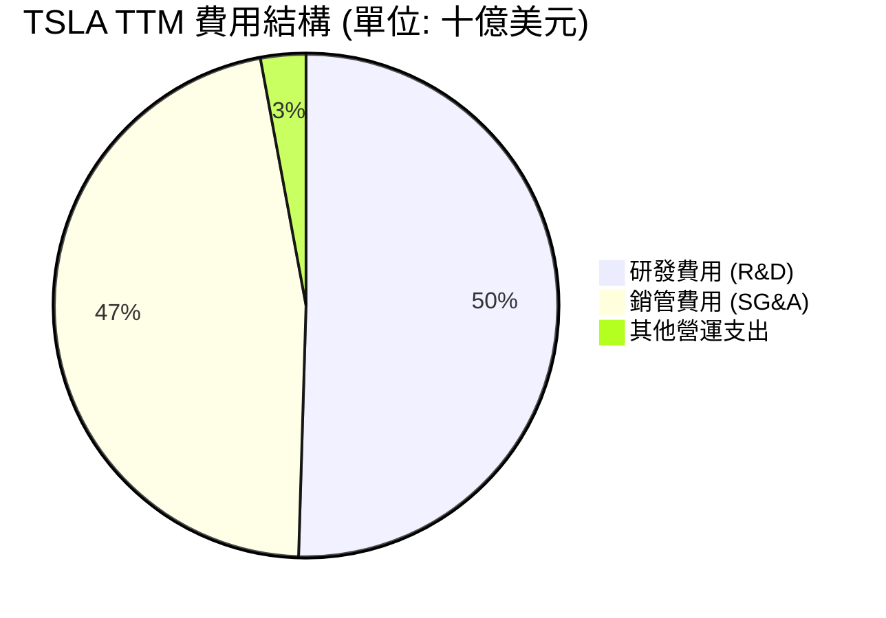

### 3.5 季度 EPS 趨勢與盈餘品質（Quality of Earnings）

特斯拉過去 4 季的 EPS 表現反映出底層獲利能力的波動。TTM 稀釋 EPS 為 **$1.09**。

#### 盈餘品質深度評估：
1. **股權薪酬 (SBC) 稀釋效應**：TTM 股權薪酬高達 **$3.28B**，佔營收比重為 **3.35%**，佔營業現金流（OCF）比重高達 **19.84%**。這意味著特斯拉有相當一部分的經營現金流是通過向員工（特別是馬斯克）發放股票（非現金支出）來「美化」的，這對現有股東的權益具有長期稀釋風險。
2. **現金轉換率 (FCF / Net Income)**：TTM 自由現金流為 **$5.25B**，淨利潤為 **$3.93B**，現金轉換率高達 **133.59%** 🟢。這是一個極其優秀的指標，說明特斯拉的淨利潤含金量極高，折舊與攤銷等非現金計提充分，實際創造現金的能力遠高於會計淨利潤。
3. **監管信用額度 (Regulatory Credits)**：FY2025 信用額度銷售利潤依然是淨利潤的重要支撐。由於這部分收入毛利率為 100%，若未來傳統車企電動化轉型加快，這部分「免費的利潤」將會萎縮，構成盈餘品質的潛在隱患。

| 盈餘品質項目 | 數值 / 佔比 | 評估 | 影響分析 |
|--------------|-----------|------|----------|
| **SBC / 營業現金流** | **19.84%** | 🔴 偏高 | 稀釋股東權益，虛增了經營現金流的真實強度。 |
| **FCF / GAAP 淨利** | **133.59%** | 🟢 極高 | 盈餘含金量高，折舊攤銷等非現金開支大，造血能力強。 |
| **研發資本化率** | 0.00%（全部費用化） | 🟢 保守 | 特斯拉將所有研發投入直接計入當期費用，未進行資本化，盈餘無水分。 |
| **有效稅率** | **27.76%** | 🟡 正常偏高 | 無異常稅務利益美化利潤。 |

---

## 4. 資產負債表分析

### 4.1 資產結構分解

特斯拉的資產結構極其健康，流動資產佔比高，且幾乎沒有無形資產與商譽，這在科技巨頭中非常罕見，說明其資產「水分極低」。

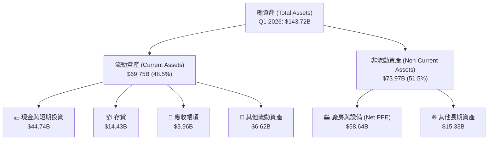

### 4.2 流動性指標分析

特斯拉的流動性指標處於行業頂尖水平。

| 流動性指標 | FY2023 | FY2024 | FY2025 | Q1 2026 | 行業均值 | 評估 |
|------------|--------|--------|--------|---------|----------|------|
| **流動比率 (Current Ratio)** | 1.73 | 2.02 | 2.16 | **2.04** | ~1.20 | 🟢 極其安全，流動資產為流動負債的2倍以上。 |
| **速動比率 (Quick Ratio)** | 1.25 | 1.46 | 1.55 | **1.43** | ~0.85 | 🟢 扣除存貨後，變現能力依然極強。 |
| **存貨週轉天數 (Days Inventory)** | 62.9 天 | 54.7 天 | 58.2 天 | **73.4 天** | ~45.0 天 | 🔴 略有惡化，反映 Model 3/Y 銷量放緩導致庫存積壓。 |

### 4.3 債務結構分析

特斯拉是一家實質上的「淨現金」公司。其持有的總現金與短期投資高達 **$44.74B**，而總債務（含短期債務、長期借款及融資租賃）僅為 **$15.89B**，淨現金高達 **$28.85B**。

```
╔══════════════════════════════════════════════════════════════════╗
║                    TSLA 債務健康診斷 (Q1 2026)                  ║
╠══════════════════════════════════════════════════════════════════╣
║                                                                  ║
║  總債務：        $15.89B   ████░░░░░░░░░░░░░░░░░░  無償債壓力    ║
║  總現金+短投：   $44.74B   █████████████████████░  資金極其充沛  ║
║  淨現金：        $28.85B   █████████████░░░░░░░░  🟢 極其強勁    ║
║                                                                  ║
║  債務 / Equity：  18.74%   🟢 極低槓桿                           ║
║  利息保障倍數：   14.45x   🟢 息稅前利潤能輕鬆覆蓋利息支出       ║
║  Net Debt/EBITDA: -2.45x   🟢 淨債務為負，無任何違約風險         ║
║                                                                  ║
║  📊 診斷：特斯拉擁有汽車業最強資產負債表，足以應對任何經濟衰退。 ║
╚══════════════════════════════════════════════════════════════════╝
```

---

## 5. 現金流量深度分析

### 5.1 現金流量瀑布圖

特斯拉的經營造血能力極強，源源不斷的經營現金流被重新投入到高額的資本支出（Capex）中，以支持超級工廠擴建與 AI 算力基礎設施建設。

```mermaid
graph LR
    NI["GAAP 淨利<br/>$3.93B"] -->|"+" 折舊與攤銷等非現金項 $12.60B| OCF["經營現金流 (OCF)<br/>$16.53B"]
    OCF -->|"- " 資本支出 (Capex) $11.28B| FCF["自由現金流 (FCF)<br/>$5.25B"]
    FCF -->|"- " 其他融資/投資活動 $4.57B| CASH_GROWTH["現金淨增加<br/>+$0.68B"]
```

### 5.2 FCF 轉換率趨勢

特斯拉的 FCF 轉換率（FCF / Net Income）在近年大幅提升，主要因為折舊與攤銷（D&A）金額巨大，且公司並未進行大規模的股息發放，資金全部留存。

| 財務年度 | 經營現金流 (OCF) | 資本支出 (Capex) | 自由現金流 (FCF) | GAAP 淨利潤 | FCF 轉換率 |
|----------|------------------|------------------|------------------|-------------|------------|
| **FY2022** | $14.72B | -$7.17B | $7.55B | $12.59B | 59.97% |
| **FY2023** | $13.26B | -$8.90B | $4.36B | $14.97B | 29.12% |
| **FY2024** | $14.92B | -$11.34B | $3.58B | $7.15B | 50.07% |
| **FY2025** | $14.75B | -$8.53B | $6.22B | $3.86B | 161.14% |
| **TTM** | **$16.53B** | **-$11.28B** | **$5.25B** | **$3.93B** | **133.59%** |

### 5.3 自由現金流趨勢

```
╔══════════════════════════════════════════════════════════════════╗
║                  TSLA 自由現金流與 FCF Yield 趨勢               ║
╠══════════════════════════════════════════════════════════════════╣
║                                                                  ║
║  FY2022  $7.55B   ████████████████████████░░░░░   FCF Yield:0.75%║
║  FY2023  $4.36B   ██████████████░░░░░░░░░░░░░░░   FCF Yield:0.40%║
║  FY2024  $3.58B   ███████████░░░░░░░░░░░░░░░░░░   FCF Yield:0.30%║
║  FY2025  $6.22B   ████████████████████░░░░░░░░░   FCF Yield:0.41%║
║  TTM     $5.25B   █████████████████░░░░░░░░░░░░   FCF Yield:0.34%║
║                                                                  ║
║  📊 FCF Yield 僅 0.34%，反映當前極高的估值與高強度的資本開支。  ║
╚══════════════════════════════════════════════════════════════════╝
```

---

## 6. 獲利能力與資本效率

### 6.1 ROE / ROA / ROIC 趨勢

由於汽車降價導致淨利潤收縮，加上股東權益（Equity）因利潤留存與發行新股而持續膨脹（從 FY2022 的 $44.70B 增至 TTM 的 $82.14B），特斯拉的資本回報率指標在過去三年出現了顯著的「均值回歸」。

| 指標 | FY2022 | FY2023 | FY2024 | FY2025 | TTM | 行業均值 | 評估 |
|------|--------|--------|--------|--------|-----|----------|------|
| **ROE** | 28.10% | 23.90% | 9.81% | 4.62% | **4.90%** | ~8.5% | 🔴 偏低，面臨資本效率下降挑戰 |
| **ROA** | 15.29% | 14.04% | 5.86% | 2.80% | **2.20%** | ~3.0% | 🔴 偏低，資產周轉率放緩 |
| **ROIC** | 24.15% | 16.50% | 8.90% | 5.80% | **6.64%** | ~5.5% | 🟡 中等，但仍高於多數傳統車企 |

### 6.2 ROIC vs WACC 分析（核心價值創造判斷）

這是本報告最核心的財務發現：**目前特斯拉正在「摧毀」股東價值，其資本回報率低於資金成本。**

```
╔══════════════════════════════════════════════════════════════════╗
║                TSLA ROIC vs WACC 深度分析 (TTM)                  ║
╠══════════════════════════════════════════════════════════════════╣
║                                                                  ║
║  WACC 估算：                                                     ║
║  ├── 無風險利率 (10Y美債)：   4.20%                              ║
║  ├── 市場風險溢酬 (ERP)：      5.00%                              ║
║  ├── Beta：                    1.802                              ║
║  ├── 股權成本 (Ke) = 4.2% + 1.802 × 5.0% = 13.21%                ║
║  ├── 債務成本 (稅後)：         ~3.85%                             ║
║  ├── 資本結構：股權 98.9%，債務 1.1%                              ║
║  └── ✅ WACC ≈ 13.11%                                            ║
║                                                                  ║
║  ROIC 估算：                                                     ║
║  ├── NOPAT = Operating Income ($4.90B) × (1 - 27.76%) ≈ $3.54B   ║
║  ├── 投入資本 = Equity ($82.14B) + Debt ($15.89B) - Cash ($44.74B)║
║  │            = $53.29B                                          ║
║  └── ✅ ROIC ≈ 6.64%                                             ║
║                                                                  ║
║  ★ 經濟價值增加 (EVA) = ROIC - WACC = -6.47%                     ║
║                                                                  ║
║  ROIC  6.64%   ▓▓▓▓▓▓▓▓▓░░░░░░░░░░░░░░░░░░░░░░░  🔴              ║
║  WACC  13.11%  ▓▓▓▓▓▓▓▓▓▓▓▓▓▓▓▓▓▓░░░░░░░░░░░░░░  ──              ║
║  EVA   -6.47%  ████████████░░░░░░░░░░░░░░░░░░░░  🔴 價值摧毀     ║
║                                                                  ║
║  📊 結論：高 Beta 導致資金成本極高，而當前利潤收縮使 ROIC 承壓。║
║            未來必須依賴高毛利的 FSD 軟體變現，才能扭轉 EVA 為正。║
╚══════════════════════════════════════════════════════════════════╝
```

### 6.3 杜邦三因素分解

透過杜邦分解，我們可以清晰看到 ROE 下滑的底層驅動因素：**淨利率與資產週轉率的雙重下滑**。

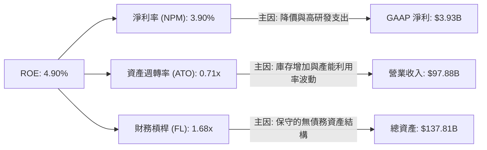

*   **淨利率 (3.90%)**：相較 FY2022 的 15.45% 大幅收縮，是 ROE 下滑的第一主因。
*   **資產週轉率 (0.71x)**：相較 FY2022 的 0.99x 下滑，說明每 1 美元資產產出的營收減少，反映產能擴張速度暫時快於銷量增速。
*   **財務槓桿 (1.68x)**：維持在極低水平，顯示特斯拉並未使用債務槓桿來虛增 ROE，財務結構極其穩健。

---

## 7. 估值深度分析

### 7.1 同業估值比較表格

特斯拉的估值倍數遠超任何傳統車企，甚至高於多數一線科技巨頭。這表明市場並未將其視為汽車股，而是定位為 **AI / 自動駕駛平台**。

| 估值指標 | **TSLA** | **Toyota (TM)** | **BYD (BYDDF)** | **NVIDIA (NVDA)** | TSLA 評估 |
|----------|----------|-----------------|-----------------|-------------------|-----------|
| **Trailing P/E** | **370.69x** | 8.2x | 18.5x | 65.0x | 🔴 極度昂貴，透支了短期盈餘 |
| **Forward P/E** | **158.06x** | 7.8x | 15.2x | 32.5x | 🔴 遠高於科技與汽車同業 |
| **P/S Ratio** | **15.65x** | 0.82x | 0.95x | 28.5x | 🔴 汽車業務難以支撐此 PS 倍數 |
| **EV / EBITDA** | **135.50x** | 5.8x | 9.2x | 48.0x | 🔴 估值溢價極高 |
| **FCF Yield** | **0.34%** | 6.50% | 5.20% | 1.80% | 🔴 現金回報率極低 |

### 7.2 歷史估值區間分析

特斯拉當前 $407.76 的股價處於其過去兩年 P/E 區間的中高部。由於盈利能力的下滑，其 P/E 估值在近幾季被動「爆表」（因分母 EPS 急劇縮小），這需要投資人極其謹慎。

### 7.3 情境目標價（假設驅動，Bear / Base / Bull）

由於 P/E 在轉型期極易失真，本模型採用 **EV/EBITDA** 作為主要退出倍數，並結合未來 5 年的現金流貼現。

| 情境 | 營收 5Y CAGR | 2030 營業利益率 | 2030 退出 EV/EBITDA | 隱含目標價 | 相對現價漲跌幅 | 達成概率 |
|------|--------------|-----------------|---------------------|------------|----------------|----------|
| 🔴 **悲觀情境** | 5.0% | 5.0% | 30.0x | **$125.00** | -69.34% | 20% |
| 🟡 **基準情境** | **15.0%** | **12.0%** | **70.0x** | **$424.56** | **+4.12%** | **55%** |
| 🟢 **樂觀情境** | 25.0% | 20.0% | 100.0x | **$600.00** | +47.14% | 25% |

### 7.4 DCF 敏感性分析（6格目標價矩陣）

基於基準情境（永續成長率 g = 3.0%），我們對 WACC（資金成本）與終端成長率進行敏感性分析：

| 終端成長率 / WACC | WACC = 12.0% | **WACC = 13.11% (基準)** | WACC = 14.5% |
|-------------------|--------------|--------------------------|--------------|
| **g = 4.0%** | $485.20 (+19.0%) | $445.10 (+9.16%) | $395.40 (-3.03%) |
| **g = 3.0% (基準)** | $458.60 (+12.4%) | **$424.56 (+4.12%)** | $372.10 (-8.75%) |
| **g = 2.0%** | $430.10 (+5.48%) | $398.50 (-2.27%) | $348.90 (-14.4%) |

### 7.5 估值綜合區間

```
當前股價: $407.76
悲觀下限: $125.00 ---------------------------------- 基準目標: $424.56 ---------- 樂觀上限: $600.00
[========================= 當前股價 $407.76 =========================]
```

---

## 8. 成長催化劑

### 8.1 催化劑時間軸

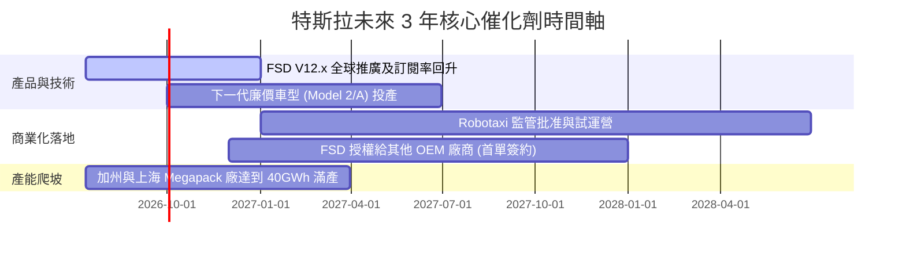

### 8.2 TAM 市場規模分析

```
╔══════════════════════════════════════════════════════════════╗
║                  TSLA 2030年 TAM 潛力與滲透率預估             ║
╠══════════════════════════════════════════════════════════════╣
║ 1. 全球電動車 (EV)   TAM: $1.5T  ｜ 預估滲透率: 15% ｜ 收入: $225B║
║ 2. 電網級儲能        TAM: $300B  ｜ 預估滲透率: 20% ｜ 收入: $60B ║
║ 3. FSD 軟體與Robotaxi TAM: $1.2T  ｜ 預估滲透率:  5% ｜ 收入: $60B ║
║ 4. 人形機器人 Optimus TAM: $2.0T  ｜ 預估滲透率: <1% ｜ 收入: $10B ║
╠══════════════════════════════════════════════════════════════╣
║ 綜合 2030 潛力營收規模：約 $355B (對比當前有 3.6倍 成長空間)  ║
╚══════════════════════════════════════════════════════════════╝
```

### 8.3 成長驅動力結構圖

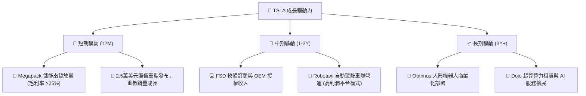

---

## 9. 風險矩陣

### 9.1 風險評分矩陣

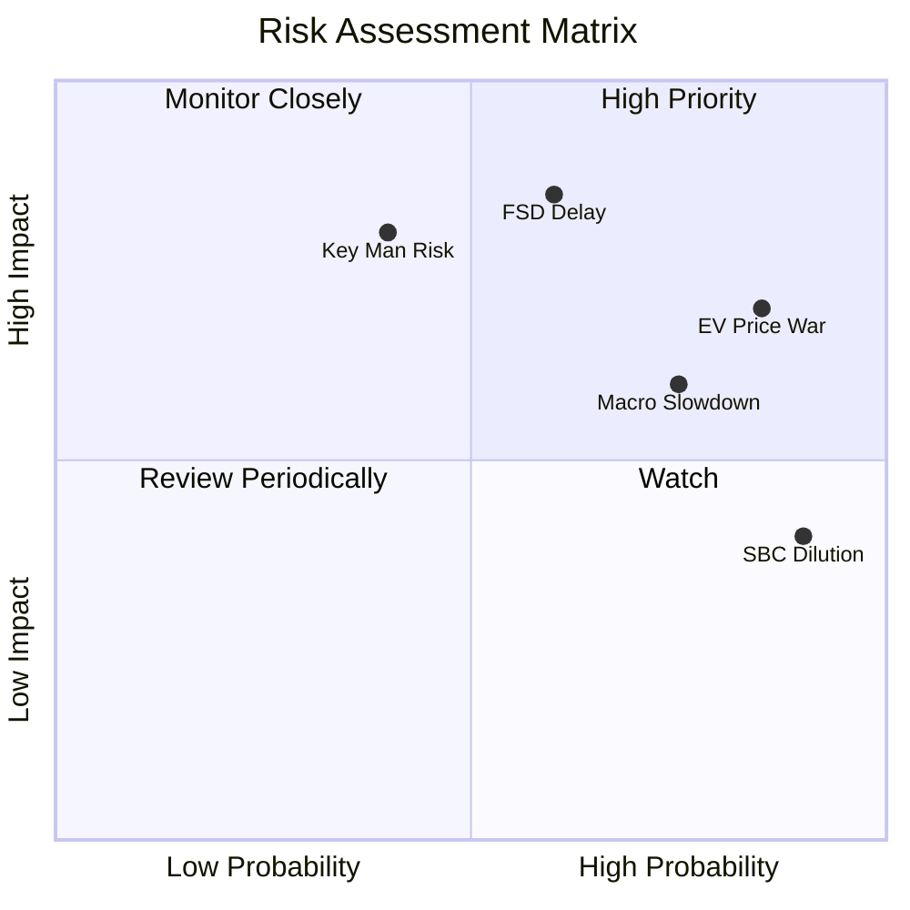

### 9.2 風險清單詳細分析

| # | 風險項目 | 發生機率 | 財務衝擊 | 風險評分 | 緩解措施 / 觀察指標 |
|---|----------|----------|----------|----------|---------------------|
| 1 | 🔴 **FSD 技術瓶頸與監管延遲** | 中 (60%) | 極高 (-40% 估值) | 🔴 **8.5 / 10** | 密切關注美國各州對無人駕駛（L4/L5）路測牌照的發放進度。 |
| 2 | 🔴 **電動車全球價格戰持續惡化** | 高 (85%) | 高 (-15% 營收) | 🔴 **8.0 / 10** | 觀察每季「汽車業務毛利率（扣除信用額度）」是否能維持在 16% 以上。 |
| 3 | 🟡 **馬斯克關鍵人物風險** | 中 (40%) | 極高 (-30% 股價) | 🟡 **7.0 / 10** | 關注董事會對馬斯克薪酬方案的訴訟進展，以及其在 xAI 的時間分配。 |
| 4 | 🟡 **股權稀釋 (SBC) 持續高企** | 極高 (90%) | 中 (-5% EPS) | 🟡 **6.0 / 10** | 監控每季稀釋後總股本的年成長率（YoY 需控制在 1% 以內）。 |

---

## 10. 投資建議

### 10.1 最終綜合評級雷達圖

```
╔══════════════════════════════════════════════════════════════╗
║                    TSLA 綜合投資評級                         ║
╠══════════════════════════════════════════════════════════════╣
║ 財務健康度：  9.5 / 10  ▓▓▓▓▓▓▓▓▓▓▓▓▓▓▓▓▓▓▓░  ★★★★★       ║
║ 護城河寬度：  8.5 / 10  ▓▓▓▓▓▓▓▓▓▓▓▓▓▓▓▓▓░░░  ★★★★☆       ║
║ 成長潛力：    8.0 / 10  ▓▓▓▓▓▓▓▓▓▓▓▓▓▓▓▓░░░░  ★★★★☆       ║
║ 獲利品質：    5.5 / 10  ▓▓▓▓▓▓▓▓▓▓░░░░░░░░░░  ★★★☆☆       ║
║ 估值安全邊際：5.0 / 10  ▓▓▓▓▓▓▓▓▓▓░░░░░░░░░░  ★★☆☆☆       ║
╠══════════════════════════════════════════════════════════════╣
║ 綜合投資評分：7.2 / 10  🟡 持有 (Hold)                       ║
╚══════════════════════════════════════════════════════════════╝
```

### 10.2 目標價與隱含報酬率

| 情境 | 權重 | 目標價 | 隱含報酬率 | 期望值貢獻 |
|------|------|--------|------------|------------|
| 🔴 **悲觀** | 20% | $125.00 | -69.34% | -$25.00 |
| 🟡 **基準** | **55%** | **$424.56** | **+4.12%** | **+$233.51** |
| 🟢 **樂觀** | 25% | $600.00 | +47.14% | +$150.00 |
| **加權目標價** | **100%** | **$358.51** | **-12.08%** | *反映當前股價已部分透支樂觀預期* |

### 10.3 買入時機與觸發因素

```
╔══════════════════════════════════════════════════════════════════╗
║                  ✅ TSLA 投資操作決策 Checklist                 ║
╠══════════════════════════════════════════════════════════════════╣
║                                                                  ║
║  立即買入/加碼觸發條件（需滿足 2 項以上）：                       ║
║  ☐ 汽車毛利率（不含信用額度）連續兩季回升至 18% 以上            ║
║  ☐ 宣佈與第一家非特斯拉 OEM 廠商達成 FSD 授權協議                ║
║  ☐ 股價回落至 $320 - $350 區間（提供更佳的安全邊際）             ║
║                                                                  ║
║  減碼/停損觸發條件（出現任一需警惕）：                           ║
║  ☐ 汽車毛利率跌破 15% 關卡，且降價未能換來銷量成長              ║
║  ☐ FSD V12 發生重大安全事故，遭遇國家公路交通安全管理局 (NHTSA) 禁令 ║
║  ☐ 自由現金流 (FCF) 連續兩季轉負                                ║
║                                                                  ║
╚══════════════════════════════════════════════════════════════════╝
```

### 10.4 投資人適配度分析

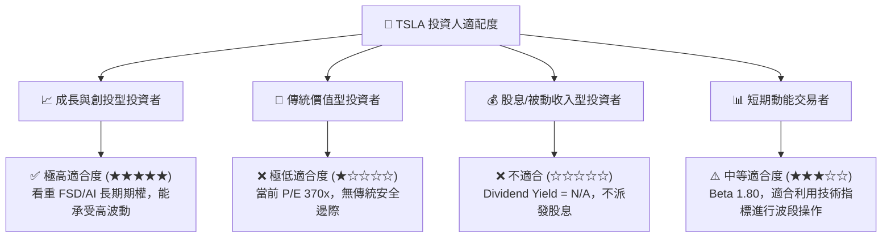

### 10.5 每季財報監控清單（Quarterly Watch List）

在未來的季度財報中，投資人應跳過媒體標題，直接鎖定以下三大核心硬指標：

1. **無信用額度汽車毛利率 (Automotive Gross Margin Ex-Credits)**：這是評估汽車業務「真實造血能力」的唯一指標。若跌破 **15%**，說明價格戰仍在失血；若回升至 **18%** 以上，則多頭論點確立。
2. **儲能業務營收與毛利率 (Energy Storage Revenue & Margin)**：Megapack 是否能維持 **20% 以上** 的毛利率，並實現季度營收佔比突破 **15%**。這將決定特斯拉能否成功去週期化。
3. **稀釋後總股本 (Diluted Shares Outstanding)**：觀察 SBC 是否導致股本以每年 **>1.5%** 的速度稀釋。如果股本膨脹過快，即使淨利成長，EPS 也會被稀釋。

### 10.6 反面論證：什麼會證明論點錯誤（What Would Change My Mind）

身為理性的 CFA 分析師，若出現以下**可量化條件**，我們必須承認多頭投資邏輯失效，並果斷下調評級至「賣出」：

```
╔══════════════════════════════════════════════════════════════════╗
║              ⚠️ TSLA 多頭論點失效條件 (Disconfirming)           ║
╠══════════════════════════════════════════════════════════════════╣
║  本投資報告的「持有」與「看好轉型」立場在下列情況下將徹底失效：   ║
║                                                                  ║
║  ☐ 條件一：汽車業務毛利率（扣除信用額度）連續兩季 < 14%          ║
║  ☐ 條件二：ROIC 跌破 5.0%（說明資本回報率進一步惡化）            ║
║  ☐ 條件三：至 FY2027 年底，仍未與任何主流 OEM 簽訂 FSD 授權合同 ║
║  ☐ 條件四：自由現金流 (FCF) 轉負，或 FCF 轉換率跌破 30%          ║
║  ☐ 條件五：馬斯克宣佈辭去 CEO 職務，且未指定具備 AI 視野的接班人 ║
║                                                                  ║
║  💡 只要上述任一條件觸發，TSLA 將退化為普通製造業，估值將向     ║
║     傳統車企均值（P/E 15x - 20x）靠攏。                          ║
╚══════════════════════════════════════════════════════════════════╝
```

---

> **免責聲明**：本報告為 AI 自動生成，僅供研究參考，不構成投資建議。投資有風險，入市需謹慎。