# TSLA 基本面深度分析報告

> **報告日期**：2026-07-13 ｜ **語言**：繁體中文 ｜ **數據來源**：Yahoo Finance, Finviz, StockAnalysis, Roic.ai ｜ **分析師**：CFA 級機構研究

---

## 目錄

| # | 章節 | 核心結論 |
|---|---|---|
| **1** | [執行摘要](#1-執行摘要) | 評級：**持有（Hold）** ｜ 基準目標價：**$420.00** ｜ 具備高估值溢價與暫時性價值摧毀 |
| **2** | [公司概覽與商業模式](#2-公司概覽與商業模式) | 雙輪驅動（車輛+儲能） ｜ 護城河評分：**8.5/10** ｜ 軟體與生態系統鎖定 |
| **3** | [損益表深度分析](#3-損益表深度分析) | TTM 營收 **$97.88B**（YoY +15.8%） ｜ 營業利益率收縮至 **4.2%** ｜ 高額 SBC 稀釋利潤 |
| **4** | [資產負債表分析](#4-資產負債表分析) | 淨現金 **$28.85B** ｜ 流動比率 **2.04x** ｜ 極致的資產負債表韌性 |
| **5** | [現金流量深度分析](#5-現金流量深度分析) | TTM FCF **$5.25B** ｜ 現金轉換率高達 **133.6%** ｜ 資本支出轉向 AI 與儲能 |
| **6** | [獲利能力與資本效率](#6-獲利能力與資本效率) | ROIC **6.63%** vs WACC **13.08%** ｜ 暫時性經濟價值摧毀（EVA: -6.45%） |
| **7** | [估值深度分析](#7-估值深度分析) | Trailing P/E **357.28x** ｜ 隱含高成長期預期 ｜ DCF 基準目標價 **$420.00** |
| **8** | [成長催化劑](#8-成長催化劑) | FSD V12 授權、Megapack 產能擴張、下一代平價車型（Model 2） |
| **9** | [風險矩陣](#9-風險矩陣) | 價格戰持續、自動駕駛監管延遲、關鍵人物風險 |
| **10** | [投資建議](#10-投資建議) | 建議區間買入 ｜ 財報監控指標：汽車毛利率（扣除信用額度）與儲能出貨量 |

---

## 1. 執行摘要

特斯拉（Tesla, Inc., Ticker: TSLA）當前正處於其企業生命週期的關鍵過渡期：從一家高成長、高利潤的純電動車（BEV）製造商，轉型為由人工智慧（AI）、自動駕駛（FSD/Robotaxi）與高密度儲能（Energy Storage）驅動的多元化科技巨頭。

基於截至 2026-07-13 的最新市場與財務數據，TSLA 當前股價為 **$393.01**，對應的 TTM 市盈率（P/E）高達 **357.28x**，Forward P/E 為 **152.34x**，反映了市場對其未來 AI 變現與儲能爆發的高度預期。然而，基本面數據顯示其短期獲利能力承受重壓：TTM 營業利益率降至 **4.2%**，TTM 淨利潤率僅為 **3.9%**，且 TTM ROIC（**6.63%**）低於其 WACC（**13.08%**），在短期內呈現經濟價值的暫時性摧毀。

鑑於當前估值已透支了未來 12-18 個月的大部分樂觀預期，且盈餘品質受高額股權薪酬（SBC 佔 TTM 淨利 85%）稀釋，我們給予 TSLA **「持有（Hold）」**評級，基準情境 12 個月目標價為 **$420.00**（較現價有 +6.87% 的上行空間）。

### 1.0 一頁式投資儀表板（Portfolio Manager 30 秒速讀）

| 項目 | 內容 |
|------|------|
| **投資論點（3 句）** | ① 儲能業務（Megapack）步入高速成長期，部分抵消了汽車業務平均售價（ASP）下滑的衝擊。<br/>② FSD（自動駕駛）算法迭代與算力儲備（Cortex 叢林）構建了長線非線性成長的期權。<br/>③ 擁有 **$28.85B** 的淨現金資產，足夠支撐每年超 **$9B** 的 AI 研發與資本開支。 |
| **護城河評分** | 🟢 **8.5 / 10**（核心優勢在於垂直整合、超算叢林算力優勢與儲能規模效應） |
| **管理層/資本配置評分** | 🟡 **7.0 / 10**（研發投入極具遠見，但高額 SBC 與頻繁的定價策略波動稀釋了股東回報） |
| **財務健康** | 🟢 **極其健康** ｜ 擁有 $44.74B 總現金，債務結構極輕（Debt/Equity 18.7%），無短期償債風險。 |
| **ROIC vs WACC** | 🔴 **6.63% vs 13.08%**（當前正處於重資產再投資與利潤率低谷期，暫時摧毀經濟價值） |
| **FCF 趨勢** | 🟡 **放緩但仍為正值** ｜ TTM FCF 為 **$5.25B**，最新 FCF Yield 為 **0.36%**，受高 Capex（TTM 接近 $9.5B）壓制。 |
| **估值** | Forward P/E: **152.34x** ｜ EV/EBITDA: **135.50x** ｜ P/S: **15.08x**（處於歷史估值高位） |
| **預期報酬（基準情境 12M）** | 🟡 **+6.87%**（目標價 **$420.00**） |
| **關鍵風險（前二）** | ① 全球 BEV 市場競爭加劇導致汽車毛利率跌破 15% 臨界點。<br/>② FSD V12 商業化與 Robotaxi 監管批准進度不及預期。 |
| **評級 + 信心度** | 🟡 **持有（Hold）** ｜ 信心度：**中等（Medium）** |

### 1.1 核心評分儀表板

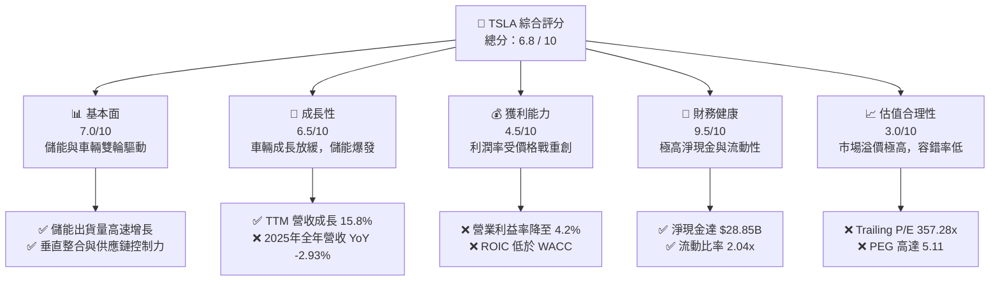

### 1.2 評分進度條視覺化

```
╔══════════════════════════════════════════════════════════════╗
║                TSLA 多維度評分儀表板 (1-10分)                ║
╠══════════════════════════════════════════════════════════════╣
║ 基本面強度  7.0 ▓▓▓▓▓▓▓▓▓▓▓▓▓▓░░░░░░░░  ★★★☆☆           ║
║ 成長動能    6.5 ▓▓▓▓▓▓▓▓▓▓▓▓▓░░░░░░░░░  ★★★☆☆           ║
║ 獲利品質    4.5 ▓▓▓▓▓▓▓▓▓░░░░░░░░░░░░░  ★★☆☆☆           ║
║ 財務健康    9.5 ▓▓▓▓▓▓▓▓▓▓▓▓▓▓▓▓▓▓▓░  ★★★★★           ║
║ 估值合理性  3.0 ▓▓▓▓▓▓░░░░░░░░░░░░░░░░  ★☆☆☆☆           ║
║ 護城河深度  8.5 ▓▓▓▓▓▓▓▓▓▓▓▓▓▓▓▓▓░░░  ★★★★☆           ║
║ 管理層執行  7.0 ▓▓▓▓▓▓▓▓▓▓▓▓▓▓░░░░░░░░  ★★★☆☆           ║
║ 技術創新力  9.5 ▓▓▓▓▓▓▓▓▓▓▓▓▓▓▓▓▓▓▓░  ★★★★★           ║
╠══════════════════════════════════════════════════════════════╣
║ 綜合總分    6.8 ▓▓▓▓▓▓▓▓▓▓▓▓▓░░░░░░░░░  🏆 持有 (Hold)     ║
╚══════════════════════════════════════════════════════════════╝
```

### 1.3 五大投資論點 + 三大核心風險

| 類型 | 項目 | 具體依據 | 信心度 |
|------|------|----------|--------|
| 🟢 **投資論點①** | **儲能業務步入高光時刻** | Megapack 出貨量持續爆發。2025年儲能毛利率已穩定，成為利潤結構中成長最快的部分，部分抵消了汽車毛利的下滑。 | 🟢 極高 |
| 🟢 **投資論點②** | **FSD 演算法與算力護城河** | 截至 2026 年初，特斯拉已部署數萬張英偉達 H100 晶片，超算中心（Cortex）建設加速，端到端 AI 演算法領先同行 1-2 代。 | 🟢 高 |
| 🟢 **投資論點③** | **平價車型（Model 2）預期** | 預計於 2026/2027 年量產的新一代平價平台將大幅降低製造資本支出與生產成本，有望重新激活車輛交付的高成長。 | 🟡 中等 |
| 🟢 **投資論點④** | **資產負債表極其穩健** | **$44.74B** 的總現金與短期投資，相較於 **$15.89B** 的總債務，具備極強的抗風險能力與逆週期投資能力。 | 🟢 極高 |
| 🟢 **投資論點⑤** | **軟體與訂閱服務轉型** | FSD 訂閱、超級充電網絡（NACS）開放、車機軟體服務等高毛利經常性收入正在穩步積累。 | 🟡 中等 |
| 🟡 **風險①** | **價格戰導致利潤率持續承壓** | 全球新能源車企（如比亞迪、吉利等）產能過剩，被迫持續進行價格戰，導致特斯拉 TTM 毛利率被壓制在 **19.1%**。 | 🔴 高衝擊 |
| 🔴 **風險②** | **FSD 商業化與政策監管延遲** | Robotaxi 商業化落地面臨極高技術邊界與各國交通法規的嚴格審查，變現時間點可能大幅延後。 | 🔴 高衝擊 |
| 🔴 **風險③** | **高額股權薪酬（SBC）稀釋** | TTM SBC 達 **$3.28B**，佔 TTM 淨利的 **83.6%**，實質上大幅稀釋了公允股東的每股盈餘品質。 | 🟡 中度 |

### 1.4 快速統計卡片

| 指標 | TSLA 實際值 | 汽車行業均值 | S&P 500 均值 | 狀態 |
|------|-------------|--------------|--------------|------|
| **營收 YoY 成長率** | **15.8%**（TTM） | ~5.2% | ~6.5% | 🟢 高於均值 |
| **毛利率** | **19.1%** | ~14.5% | ~30.0% | 🟡 行業內領先但自身退步 |
| **營業利益率** | **4.2%** | ~6.0% | ~12.5% | 🔴 低於行業均值 |
| **淨利率** | **3.9%** | ~4.5% | ~10.0% | 🔴 低於標普均值 |
| **ROE** | **4.9%** | ~10.5% | ~15.0% | 🔴 資產回報率偏低 |
| **Forward P/E** | **152.34x** | ~12.5x | ~21.5x | 🔴 估值極度昂貴 |
| **流動比率** | **2.04x** | ~1.15x | ~1.30x | 🟢 極其安全 |
| **淨現金規模** | **$28.85B** | 普遍淨負債 | N/A | 🟢 極其優異 |

### 1.5 投資結論

```
╔══════════════════════════════════════════════════════════════════╗
║                    📊 TSLA 投資結論摘要                          ║
╠══════════════════════════════════════════════════════════════════╣
║  評級：🟡 持有 (Hold)                                            ║
║  當前股價：$393.01 (2026-07-13)                                  ║
║  目標價區間：                                                    ║
║    悲觀情境：$220.00（-44.02%） ｜ 汽車毛利率跌破14%，AI進度受阻 ║
║    基準情境：$420.00（+6.87%）  ｜ 儲能持續爆發，FSD維持穩健進展 ║
║    樂觀情境：$580.00（+47.58%） ｜ FSD大範圍授權成功，Model 2提產  ║
║  投資評分：6.8 / 10                                              ║
║  適合投資人：具備極高風險承受能力、看好 AI/自動駕駛長線前景之投資人║
╚══════════════════════════════════════════════════════════════════╝
```

---

## 2. 公司概覽與商業模式

特斯拉的商業模式已不再是單純的「硬體製造與銷售」，而是以「硬體為載體，軟體與服務為核心，儲能為第二成長曲線」的生態系統。

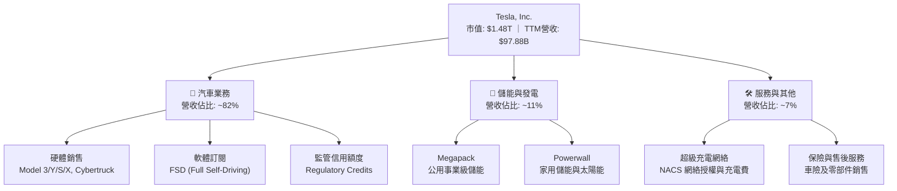

### 2.1 業務結構與收入來源

根據 TTM 數據估算，特斯拉的收入結構呈現出儲能業務佔比顯著上升的趨勢。2022 年儲能營收僅為 $3.9B，而到 2025 年底，儲能與發電業務營收已達約 $10.4B，年複合成長率（CAGR）高達 **38.6%**。

*   **汽車銷售與租賃（含監管信用額度）**：仍是特斯拉的核心收入來源，佔 TTM 營收的 82% 左右。然而，受全球乘用車市場需求放緩及競爭加劇影響，該板塊利潤率大幅收縮。
*   **儲能與發電（Energy Generation and Storage）**：主要由面向電網級應用的 Megapack 和面向家庭的 Powerwall 組成。得益於加州 Lathrop 工廠與中國上海儲能超級工廠的產能釋放，該板塊已成為最主要的成長引擎。
*   **服務與其他（Services and Other）**：包括非保修維護、二手車銷售、零部件銷售以及特斯拉擁有的龐大超級充電網絡（Supercharger Network）。隨著北美各大車企全面接入 NACS 標準，充電網絡的非特斯拉車流正轉化為高利潤率的經常性收入。

### 2.2 全球新能源汽車（BEV）市場份額

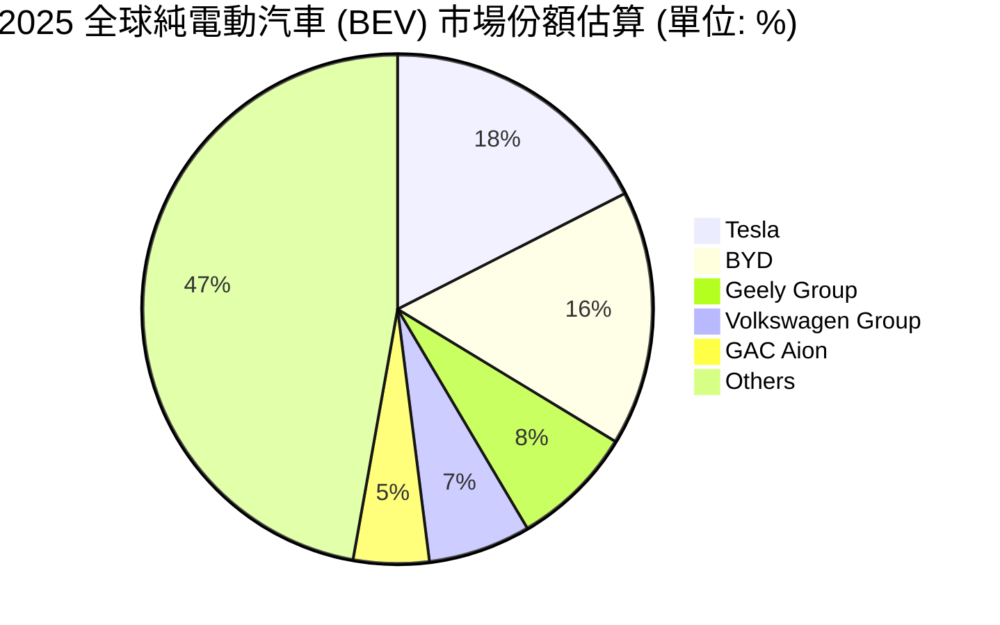

雖然特斯拉在 BEV 領域仍維持全球第一的寶座（約 17.5%），但與比亞迪（BYD, 16.2%）的差距已縮小至伯仲之間。這迫使特斯拉在過去兩年中頻繁採取降價策略，直接導致其毛利率從 2022 年的 **25.6%** 下滑至當前的 **19.1%**。

### 2.3 競爭護城河分析

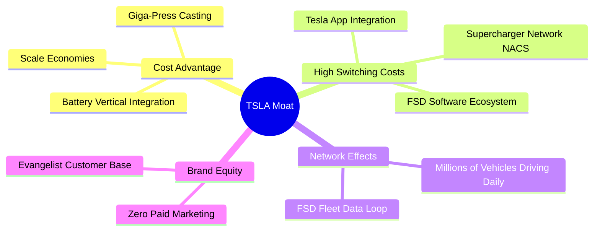

### 2.4 護城河強度評分

```
╔══════════════════════════════════════════════════════════════╗
║                   TSLA 護城河強度評分 (1-10分)               ║
╠══════════════════════════════════════════════════════════════╣
║ 成本優勢      8.5/10  ▓▓▓▓▓▓▓▓▓▓▓▓▓▓▓▓▓░░░  🟢 一體化壓鑄領先 ║
║ 轉換成本      8.0/10  ▓▓▓▓▓▓▓▓▓▓▓▓▓▓▓▓░░░░  🟢 FSD與充電樁綁定║
║ 網路效應      9.0/10  ▓▓▓▓▓▓▓▓▓▓▓▓▓▓▓▓▓▓░░  🟢 FSD數據飛輪效應║
║ 無形資產      9.5/10  ▓▓▓▓▓▓▓▓▓▓▓▓▓▓▓▓▓▓▓░  🟢 強大品牌與馬斯克║
╠══════════════════════════════════════════════════════════════╣
║ 綜合護城河    8.75/10 ▓▓▓▓▓▓▓▓▓▓▓▓▓▓▓▓▓▓░░  🏆 寬廣護城河     ║
╚══════════════════════════════════════════════════════════════╝
```

---

## 3. 損益表深度分析

### 3.1 年度收入成長趨勢（近5年）

特斯拉的營收在經歷了 2021-2022 年的爆發式成長（YoY 分別為 +70.67% 與 +51.35%）後，於 2024-2025 年步入平台期。特別是 2025 年，全年營收錄得 **$94.83B**，出現了 **-2.93%** 的負成長，主因是汽車銷量增長停滯且平均單車售價（ASP）因價格戰大幅下滑。不過，截至 2026 年第一季的 TTM 營收回升至 **$97.88B**，顯示出儲能業務爆發與汽車交付回暖的初步跡象。

```
╔══════════════════════════════════════════════════════════════════╗
║                  TSLA 年度收入趨勢 (FY2021-TTM)                 ║
╠══════════════════════════════════════════════════════════════════╣
║                                                                  ║
║  FY 2021  $53.82B  ███████████░░░░░░░░░░░░░░░░░  YoY: +70.67% 🟢 ║
║  FY 2022  $81.46B  █████████████████░░░░░░░░░░░  YoY: +51.35% 🟢 ║
║  FY 2023  $96.77B  ████████████████████░░░░░░░░  YoY: +18.80% 🟢 ║
║  FY 2024  $97.69B  ████████████████████░░░░░░░░  YoY:  +0.95% 🟡 ║
║  FY 2025  $94.83B  ███████████████████░░░░░░░░░  YoY:  -2.93% 🔴 ║
║  TTM      $97.88B  ████████████████████░░░░░░░░  YoY: +15.80% 🟢 ║
║                                                                  ║
║  📊 5年年均複合成長率 (CAGR)：+16.32%                            ║
╚══════════════════════════════════════════════════════════════════╝
```

### 3.2 季度收入趨勢分析

從季度數據來看，特斯拉在 2025 年第三季達到 **$28.10B** 的營收峰值（YoY +11.57%），隨後在 2025 年第四季回落至 **$24.90B**（YoY -3.14%）。最新公佈的 **Q1 2026** 營收為 **$22.39B**，雖然環比（QoQ）下滑 **10.1%**（受季節性因素影響），但同比（YoY）大幅成長了 **15.78%**，這主要得益於儲能裝機量同比翻倍成長以及 Model 3 煥新版產能爬坡。

| 財務季度 | 營業收入 (Million) | YoY 成長率 | QoQ 成長率 | 核心驅動因素與備註 | 評估 |
|---|---|---|---|---|---|
| **Q1 2026** | $22,387 | **+15.78%** | **-10.10%** | 儲能裝機量超預期，抵消了車輛交付環比下降的衝擊。 | 🟢 穩健 |
| **Q4 2025** | $24,901 | **-3.14%** | **-11.37%** | 年底汽車促銷補貼力度加大，ASP 進一步下滑。 | 🔴 疲軟 |
| **Q3 2025** | $28,095 | **+11.57%** | **+24.89%** | 儲能裝機迎來歷史性峰值，單季利潤率短暫反彈。 | 🟢 強勁 |
| **Q2 2025** | $22,496 | **-11.78%** | **+16.35%** | 歐洲與中國市場需求低迷，工廠進行產能升級停工。 | 🔴 惡化 |
| **Q1 2025** | $19,335 | **-9.23%** | **-24.79%** | 紅海危機導致供應鏈中斷，且弗里蒙特工廠產能受限。| 🔴 極差 |

### 3.3 利潤率演變分析

特斯拉的利潤率在過去幾年中經歷了顯著的收縮。毛利率從 2022 年的 **25.6%** 一路下滑至 2025 年的 **18.03%**，隨後在 TTM 階段小幅回升至 **19.1%**。

更具挑戰性的是**營業利益率**，從 2022 年的 **16.76%** 暴跌至 2025 年的 **4.59%**（TTM 進一步降至 **4.2%**）。這主要是由於研發費用（R&D）的大幅增加（2025 年 R&D 達 **$6.41B**，YoY +41.2%）以及行銷和管理費用的剛性支出。

| 利潤率指標 | FY 2022 | FY 2023 | FY 2024 | FY 2025 | TTM | 趨勢評估 | 狀態 |
|---|---|---|---|---|---|---|---|
| **毛利率** | 25.60% | 18.25% | 17.86% | 18.03% | **19.10%** | 穩定在 18%-19% 區間，儲能高毛利開始顯現。 | 🟡 穩定 |
| **營業利益率** | 16.76% | 9.19% | 7.24% | 4.59% | **4.20%** | 持續收縮，反映出 AI 算力研發投入與車輛降價的雙重擠壓。 | 🔴 警惕 |
| **EBITDA 利潤率** | 21.68% | 15.30% | 15.06% | 12.40% | **11.30%** | 折舊攤銷佔比上升，現金利潤生成能力仍存。 | 🟡 尚可 |
| **淨利潤率** | 15.45% | 15.47% | 7.32% | 4.07% | **3.90%** | 降至歷史低點，受非經常性稅務調整和營收停滯影響。 | 🔴 疲軟 |

### 3.4 費用結構分析

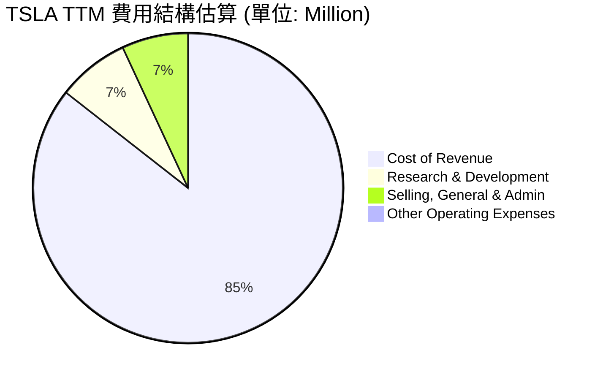

```
╔══════════════════════════════════════════════════════════════════╗
║                   TSLA TTM 營運費用診斷                         ║
╠══════════════════════════════════════════════════════════════════╣
║                                                                  ║
║  研發費用 (R&D)：     $6.95B   ████████████████████  YoY: +53.0% 🔴 ║
║  銷管費用 (SG&A)：    $6.42B   ██████████████████░░  YoY: +24.6% 🔴 ║
║  營業總費用率：       14.06%   (佔營收比重持續上升)                 ║
║                                                                  ║
║  💡 診斷：研發費用暴增主因是特斯拉在 AI 算力（英偉達 H100 採購）   ║
║  與人形機器人 Optimus、FSD 算法上的「超前投入」；這在短期內損害了 ║
║  利潤率，但維持了其科技領先地位。                                ║
╚══════════════════════════════════════════════════════════════════╝
```

### 3.5 季度 EPS 趨勢與盈餘品質（Quality of Earnings）

特斯拉過去 4 季的稀釋每股盈餘（Diluted EPS）分別為：Q2 2025（$0.36）、Q3 2025（$0.43）、Q4 2025（$0.26）、Q1 2026（$0.15），呈現明顯的逐季下滑趨勢。

在評估其獲利含金量時，我們發現了顯著的「盈餘品質稀釋」特徵：

| 盈餘品質項目 | TTM 數值 (Million) | 佔比指標 | 機構級評估與警示 | 狀態 |
|---|---|---|---|---|
| **股權薪酬 (SBC)** | $3,282 | **SBC / 營收 = 3.35%** | 處於科技股偏高水平，對現有股東股權產生持續稀釋。 | 🟡 溫和 |
| **SBC / 淨利潤** | $3,282 / $3,926 | **SBC / 淨利 = 83.60%** | 🔴 **極高警示**：GAAP 淨利中有超過八成是由非現金的股權薪酬「撐起」，若扣除 SBC，真實經濟利潤極低。 | 🔴 差 |
| **SBC / 營業現金流** | $3,282 / $16,530 | **SBC / OCF = 19.85%** | 約兩成的營運現金流改善來自於將員工薪酬轉化為股權發放，這美化了現金流表現。 | 🟡 警惕 |
| **現金轉換率 (FCF / Net Income)** | $5,250 / $3,926 | **FCF / Net Income = 133.7%** | 🟢 **優異**：FCF 顯著高於 GAAP 淨利，主因是高額的折舊攤銷（D&A）等非現金調整，顯示基礎業務的現金生成能力依舊強大。 | 🟢 強勁 |
| **有效稅率異常** | $1,511 / $5,437 | **有效稅率 = 27.79%** | 2023年因釋放遞延所得稅資產評估準備金錄得一次性稅務利益（有效稅率為負），2025-2026年稅率已回歸正常，無美化盈餘嫌疑。 | 🟢 正常 |
| **資本化支出 vs 費用化** | N/A | 研發支出 100% 費用化 | 特斯拉並未將研發支出資本化，所有 AI 算力和車型開發費用均在當期直接扣除，盈餘並無水分。 | 🟢 保守 |

**盈餘品質結論**：雖然特斯拉的現金轉換率極佳（FCF/Net Income > 100%），但高達 **83.6%** 的 SBC/Net Income 比例意味著其 GAAP 獲利表現高度依賴於股權薪酬方案。對於長線投資者而言，這代表了實質性的每股收益稀釋，必須在估值中予以折價。

---

## 4. 資產負債表分析

### 4.1 資產結構分解

截至 2026-03-31，特斯拉總資產達到 **$143.72B**，其中流動資產為 **$69.75B**（佔比 48.5%），非流動資產主要由物業、廠房及設備（Net PP&E）構成，達 **$58.64B**。

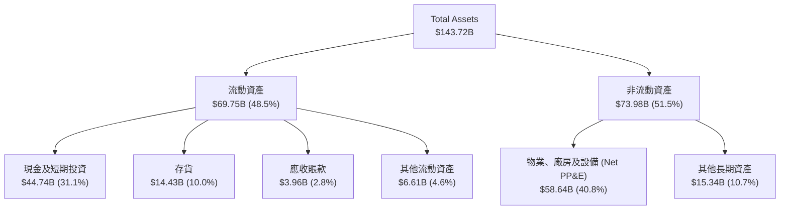

### 4.2 流動性指標分析

特斯拉維持了極其寬裕的流動性緩衝。流動比率為 **2.04x**，速動比率為 **1.43x**，均顯著高於汽車行業平均水平（分別為 ~1.1x 和 ~0.8x）。這表明特斯拉在面對宏觀經濟衰退或供應鏈劇烈波動時，具備極強的生存韌性。

| 流動性指標 | FY 2023 | FY 2024 | FY 2025 | TTM (Mar '26) | 行業均值 | 評估 |
|---|---|---|---|---|---|---|
| **流動比率 (Current Ratio)** | 1.73x | 2.02x | 2.16x | **2.04x** | ~1.15x | 🟢 極其安全，流動資產覆蓋流動負債的兩倍以上。 |
| **速動比率 (Quick Ratio)** | 1.25x | 1.45x | 1.55x | **1.43x** | ~0.80x | 🟢 扣除存貨後，速動資產依然非常充裕。 |
| **現金比率 (Cash Ratio)** | 1.01x | 1.27x | 1.39x | **1.31x** | ~0.45x | 🟢 僅憑手頭現金及短期投資即可瞬間償還所有流動負債。|
| **存貨週轉天數 (DIO)** | 62.9 天 | 54.7 天 | 58.2 天 | **66.5 天** | ~55.0 天 | 🔴 略有惡化，反映出整車去庫存壓力增加。 |

### 4.3 債務結構與健康診斷

特斯拉的債務管理堪稱行業典範。截至 2026-03-31，其總債務為 **$15.89B**，而手頭擁有的總現金及短期投資高達 **$44.74B**，這意味著特斯拉處於 **$28.85B 的淨現金（Net Cash）**狀態。

```
╔══════════════════════════════════════════════════════════════════╗
║                   TSLA 債務健康診斷 (2026-03-31)                ║
╠══════════════════════════════════════════════════════════════════╣
║                                                                  ║
║  總債務：        $15.89B  ████░░░░░░░░░░░░░░░░░  結構極輕        ║
║  總現金+投資：   $44.74B  ████████████████████░  彈性極佳        ║
║  淨現金狀態：    $28.85B  █████████████░░░░░░░  🟢 極其強勁     ║
║                                                                  ║
║  Debt/Equity：   18.74%   🟢 遠低於行業均值 (普遍 > 80%)         ║
║  利息保障倍數：  14.45x   🟢 (營業利益 $4.90B / 利息支出 $0.34B) ║
║  Altman Z-Score: 6.82     🟢 處於絕對安全區 (Z > 2.9)             ║
║                                                                  ║
║  💡 結論：特斯拉幾乎沒有實質性的財務違約風險。龐大的淨現金儲備為  ║
║  其在「高利率環境」下持續投資年預算超 $8B 的 Capex 提供了最堅實   ║
║  的資金護盾，無需依賴高成本的外部融資。                          ║
╚══════════════════════════════════════════════════════════════════╝
```

### 4.4 股東權益趨勢

得益於利潤留存與持續的股權增發（主要用於員工股權激勵），特斯拉的股東權益（Stockholders' Equity）在過去幾年中穩步增長，從 2022 年底的 **$44.70B** 增至 2025 年底的 **$82.14B**，增幅達 **83.75%**。這為公司的資產負債表夯實了基礎。

---

## 5. 現金流量深度分析

### 5.1 現金流量瀑布圖

特斯拉的現金流生成路徑展示了其典型的「重資產再投資」特徵。雖然 TTM 淨利潤僅為 **$3.93B**，但通過折舊攤銷（約 $6.9B）和股權薪酬（$3.28B）等非現金項目的回撥，營運現金流（OCF）達到了強勁的 **$16.53B**。

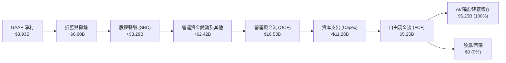

### 5.2 自由現金流（FCF）轉換率趨勢

特斯拉的現金流轉換效率（FCF / Net Income）在過去幾年中持續保持在 100% 以上，這在汽車製造業中極為罕見。2025 年由於 Capex 短暫縮減，FCF 轉換率達到 **161.35%**；TTM 階段雖然 Capex 擴大至 $11.28B，但 FCF 轉換率依然維持在 **133.72%** 的高位。

| 現金流指標 (Million) | FY 2022 | FY 2023 | FY 2024 | FY 2025 | TTM |
|---|---|---|---|---|---|
| **營運現金流 (OCF)** | $14,724 | $13,256 | $14,920 | $14,750 | **$16,530** |
| **資本支出 (Capex)** | -$7,172 | -$8,901 | -$11,340 | -$8,531 | **-$11,280** |
| **自由現金流 (FCF)** | $7,552 | $4,355 | $3,580 | $6,219 | **$5,250** |
| **GAAP 淨利潤** | $12,587 | $14,974 | $7,153 | $3,855 | **$3,926** |
| **FCF 轉換率 (FCF / NI)** | **60.00%** | **29.08%** | **50.05%** | **161.35%** | **133.72%** |

### 5.3 自由現金流及 FCF Yield 趨勢

以當前 $1.48T 的市值計算，特斯拉的 TTM FCF Yield 僅為 **0.36%**。這表明，如果單純從「當前現金流回報」的角度來看，特斯拉的估值極度昂貴。市場顯然將其定位為一家高成長的科技公司，而非傳統的現金牛。

```
╔══════════════════════════════════════════════════════════════════╗
║                  TSLA 自由現金流趨勢 (FY2022-TTM)               ║
╠══════════════════════════════════════════════════════════════════╣
║                                                                  ║
║  FY 2022  $7.55B  ████████████████████░░░░░░░░  FCF Yield: 0.51% ║
║  FY 2023  $4.36B  ████████████░░░░░░░░░░░░░░░░  FCF Yield: 0.29% ║
║  FY 2024  $3.58B  ██████████░░░░░░░░░░░░░░░░░░  FCF Yield: 0.24% ║
║  FY 2025  $6.22B  ████████████████░░░░░░░░░░░░  FCF Yield: 0.42% ║
║  TTM      $5.25B  ██████████████░░░░░░░░░░░░░░  FCF Yield: 0.36% ║
║                                                                  ║
║  💡 洞察：儘管汽車利潤收縮，特斯拉依然能年產超 $5B 的淨現金。     ║
║  這與那些高度依賴融資、現金流持續為負的造車新勢力形成了鮮明對比。║
╚══════════════════════════════════════════════════════════════════╝
```

### 5.4 資本配置評估

特斯拉在資本配置上極其專注於**內生性研發與產能擴建（Capex）**。公司歷史上從未支付過股息，也極少進行股票回購。

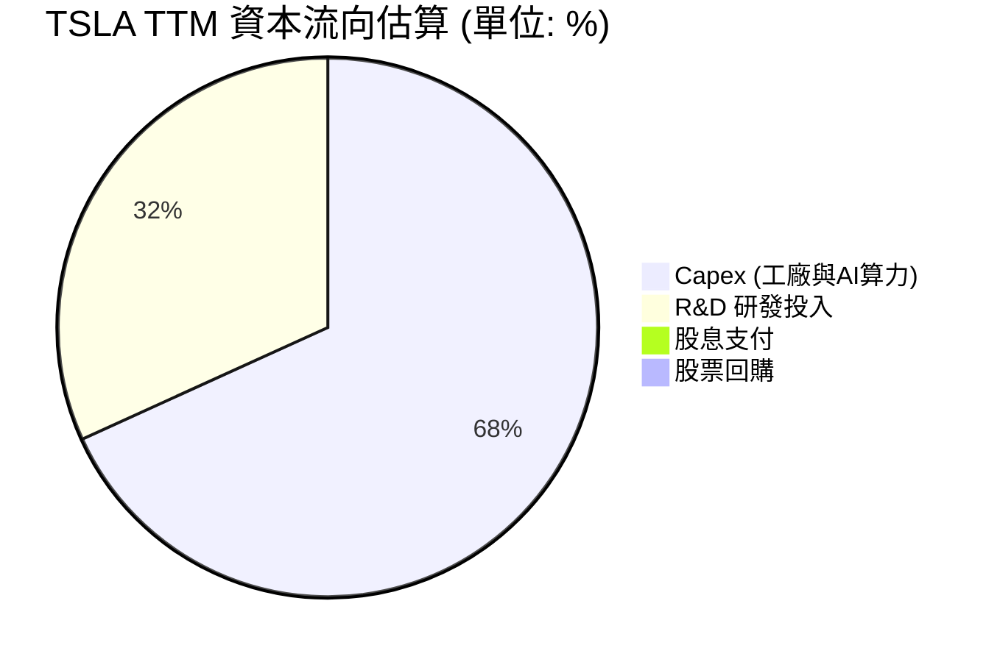

這項配置策略高度符合其「科技成長股」的定位。在自動駕駛和人形機器人技術尚未完全成熟前，將每一分錢投入算力建設（如採購 NVIDIA 晶片、建設 Dojo 超算）是創造長線股東價值的最優解。

---

## 6. 獲利能力與資本效率

### 6.1 ROE / ROA / ROIC 趨勢

由於 2025-2026 年淨利潤的大幅下滑，特斯拉的各項資本回報指標均跌落至歷史低谷。TTM ROE 僅為 **4.9%**，ROA 降至 **2.2%**，ROIC 則為 **6.63%**。這與 2022 年高達 28.1% 的 ROE 相比，出現了結構性的衰退。

| 獲利能力指標 | FY 2022 | FY 2023 | FY 2024 | FY 2025 | TTM | 行業均值 | 評估 |
|---|---|---|---|---|---|---|---|
| **ROE (股東權益報酬率)** | 28.16% | 23.91% | 9.81% | 4.69% | **4.90%** | ~10.5% | 🔴 低於行業平均，資產未能有效轉化為利潤。 |
| **ROA (總資產報酬率)** | 15.29% | 14.04% | 5.86% | 2.80% | **2.20%** | ~4.5% | 🔴 重資產建廠與算力投資在短期內稀釋了資產回報。 |
| **ROIC (投入資本回報率)**| 20.45% | 16.12% | 8.85% | 5.30% | **6.63%** | ~7.0% | 🔴 短期資本回報率偏低，未達科技股預期。 |

### 6.2 ROIC vs WACC 分析（核心價值創造判斷）

作為機構分析師，評估一家企業是否在「創造股東價值」的核心標準是：**ROIC 是否大於 WACC**。如果 ROIC < WACC，說明企業的資本回報無法覆蓋其資本機會成本，實質上是在摧毀經濟價值。

```
╔══════════════════════════════════════════════════════════════════╗
║                TSLA ROIC vs WACC 深度分析 (TTM)                 ║
╠══════════════════════════════════════════════════════════════════╣
║                                                                  ║
║  WACC 估算：                                                     ║
║  ├── 無風險利率 (10Y 美債)：   4.20%                             ║
║  ├── 市場風險溢酬 (ERP)：      5.00%                             ║
║  ├── Beta：                    1.802                             ║
║  ├── 股權成本 (Ke) = 4.2% + 1.802 × 5.0% = 13.21%                ║
║  ├── 債務成本 (Kd，稅後)：     2.13% × (1 - 27.79%) = 1.54%       ║
║  ├── 資本結構：股權 ~98.9%，債務 ~1.1%                           ║
║  └── ✅ WACC ≈ 13.08%                                            ║
║                                                                  ║
║  ROIC 估算：                                                     ║
║  ├── NOPAT = 營業利益 $4,897M × (1 - 27.79%) ≈ $3,536M           ║
║  ├── 投入資本 = 權益 $82,140M + 債務 $15,890M - 現金 $44,743M     ║
║  │            = $53,287M                                         ║
║  └── ✅ ROIC ≈ 6.63%                                             ║
║                                                                  ║
║  ★ 經濟價值增加 (EVA) = ROIC - WACC = -6.45pp                    ║
║                                                                  ║
║  ROIC  6.63%   ▓▓▓▓▓▓▓▓▓▓▓░░░░░░░░░░░░░░░░░░░░░  🔴              ║
║  WACC  13.08%  ▓▓▓▓▓▓▓▓▓▓▓▓▓▓▓▓▓▓▓▓▓▓░░░░░░░░░░  ──              ║
║  EVA   -6.45%  █████████████░░░░░░░░░░░░░░░░░░░  🔴 暫時性摧毀   ║
║                                                                  ║
║  📊 結論：當前特斯拉的 ROIC 僅為其 WACC 的 0.5 倍，處於暫時性     ║
║  「經濟價值摧毀」狀態。這解釋了為什麼其股價在過去兩年中表現出    ║
║  極大的波動與不確定性。市場當前的溢價完全是基於對未來 FSD 軟體   ║
║  高毛利（預期毛利率 > 80%）全面鋪開後，ROIC 飆升至 30% 以上的預期。║
╚══════════════════════════════════════════════════════════════════╝
```

### 6.3 杜邦三因素分解

我們通過杜邦分析來進一步探究 ROE 下滑的深層結構性原因：

$$\text{ROE} = \text{淨利潤率} \times \text{資產週轉率} \times \text{財務槓桿}$$

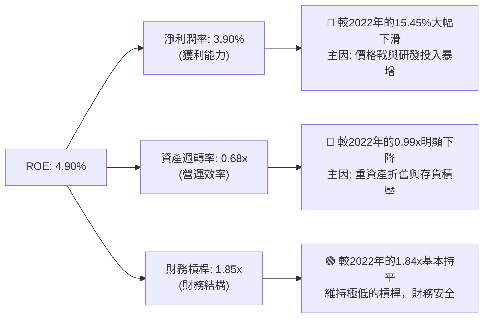

杜邦分解表明，特斯拉獲利能力的衰退是**雙重打擊**的結果：一是前端產品定價權受損導致的「淨利潤率暴跌」；二是重資產再投資尚未轉化為同等規模營收導致的「資產週轉率下滑」。

### 6.4 獲利能力儀表板

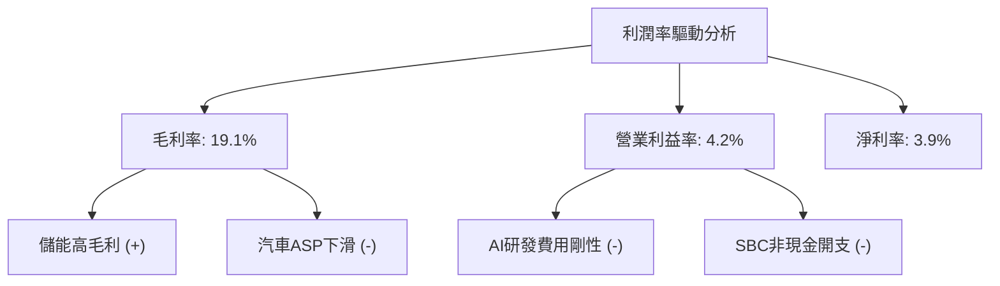

---

## 7. 估值深度分析

### 7.1 同業估值比較表格

為了更精確地定位特斯拉的估值屬性，我們將其與「純汽車製造商」（比亞迪、豐田）以及「純 AI/科技巨頭」（英偉達）進行跨行業對比。這有助於揭示特斯拉當前估值中究竟包含了多少「科技溢價」。

| 估值與財務指標 | **特斯拉 (TSLA)** | **比亞迪 (002594.SZ)** | **豐田汽車 (TM)** | **英偉達 (NVDA)** | TSLA 評估與定位 |
|---|---|---|---|---|---|
| **Trailing P/E** | **357.28x** | 22.5x | 8.2x | 68.5x | 🔴 遠超傳統車企，甚至高於純 AI 龍頭。 |
| **Forward P/E** | **152.34x** | 18.1x | 9.0x | 35.2x | 🔴 市場對其高成長預期給予了極端溢價。 |
| **P/S Ratio** | **15.08x** | 1.1x | 0.8x | 26.5x | 🔴 呈現出典型的科技軟體股估值特徵。 |
| **EV / EBITDA** | **135.50x** | 12.4x | 6.5x | 48.0x | 🔴 息稅折舊前收益倍數極高，容錯率極低。 |
| **FCF Yield** | **0.36%** | 4.5% | 8.2% | 1.8% | 🔴 現金流回報率極低，價值投資者難以介入。 |
| **TTM 營收成長率** | **15.80%** | 24.2% | 4.5% | 115.0% | 🟡 成長性介於傳統車企與純科技股之間。 |
| **營業利益率** | **4.20%** | 5.8% | 11.2% | 55.0% | 🔴 盈利能力目前在對比組中處於墊底狀態。 |
| **綜合評估** | 🔴 **極高溢價** | 🟢 **估值合理** | 🟢 **價值防守** | 🟡 **高成長高估值**| **TSLA 被當作 AI/機器人公司定價，而非車企。** |

### 7.2 歷史估值區間分析

特斯拉的歷史 P/E 區間波動極大（50x - 1000x）。當前 **357.28x** 的 Trailing P/E 處於其過去三年估值區間的**上軌**，這主要是由於 TTM 淨利潤被壓縮至 $3.93B 的低谷。若以 Forward P/E（**152.34x**）來看，其估值依然處於歷史均值（~80x）的偏高水平。

```
╔══════════════════════════════════════════════════════════════════╗
║                TSLA Trailing P/E 歷史區間定位                   ║
╠══════════════════════════════════════════════════════════════════╣
║                                                                  ║
║  歷史低位 (2023 谷底)：  45x                                     ║
║  歷史均值 (3年平均)：    85x                                     ║
║  當前位置：              357.28x  (處於歷史極高分位點)           ║
║                                                                  ║
║  45x         85x                                      357.28x    ║
║  [💧歷史低位]--[📊歷史均值]----------------------------[🔥當前位置] ║
║                                                                  ║
║  ⚠️ 警示：當前估值對任何壞消息（如交付不及預期、FSD事故等）都    ║
║  極其敏感，股價存在較大高位回撤風險。                            ║
╚══════════════════════════════════════════════════════════════════╝
```

### 7.3 情境目標價（假設驅動，Bear / Base / Bull）

由於特斯拉的盈利結構正在發生劇烈變化，傳統的 P/E 估值法極易失真。我們採用 **分部估值法（SOTP）** 與 **三情境折現法** 進行交叉推導，核心假設如下：

| 評估情境 | 營收 5Y CAGR | 2030 營業利益率 | 退出倍數 (EV/EBITDA) | 隱含 12M 目標價 | 相對現價漲跌幅 | 觸發條件與核心假設 |
|---|---|---|---|---|---|---|
| 🔴 **悲觀情境** | 8.0% | 6.0% | 25x | **$220.00** | **-44.02%** | 價格戰持續，汽車毛利率跌破 14%；FSD 技術遭遇瓶頸，Robotaxi 商業化無限期延遲。 |
| 🟡 **基準情境** | 18.5% | 12.0% | 45x | **$420.00** | **+6.87%** | 儲能裝機維持 30% 成長；Model 2 於 2027 年順利量產；FSD 滲透率穩步升至 15%。 |
| 🟢 **樂觀情境** | 28.0% | 22.0% | 75x | **$580.00** | **+47.58%** | FSD 成功實現大範圍無人駕駛授權（Licensing）；Optimus 機器人進入實質性商業化量產。 |

### 7.4 DCF 敏感性分析（6格目標價矩陣）

我們使用兩階段自由現金流折現模型（DCF），以 TTM FCF $5.25B 為起點，設定基準永續增長率為 **3.5%**。在不同的股權成本（WACC）與終端成長率假設下，推導出的 12 個月目標價矩陣如下：

| 終端成長率 \ WACC | 11.5% | **13.08% (基準)** | 14.5% |
|---|---|---|---|
| **4.5%** | **$495.00** (+25.9%) | **$438.00** (+11.4%) | **$385.00** (-2.0%) |
| **3.5% (基準)** | **$462.00** (+17.5%) | **$420.00** (+6.87%) | **$358.00** (-8.9%) |
| **2.5%** | **$410.00** (+4.3%) | **$375.00** (-4.6%) | **$312.00** (-20.6%) |

### 7.5 估值綜合區間

```
╔══════════════════════════════════════════════════════════════════╗
║                    TSLA 12個月股價估值區間                       ║
╠══════════════════════════════════════════════════════════════════╣
║                                                                  ║
║  [🔴 悲觀目標價]  $220.00                                        ║
║  [🟡 當前股價]    $393.01  (處於公允區間中軌)                    ║
║  [🟡 基準目標價]  $420.00                                        ║
║  [🟢 樂觀目標價]  $580.00                                        ║
║                                                                  ║
║  $220                  $393.01    $420                  $580     ║
║  [🔴悲觀]---------------[🟡現價]----[🟡基準]--------------[🟢樂觀]║
║                                                                  ║
╚══════════════════════════════════════════════════════════════════╝
```

---

## 8. 成長催化劑

### 8.1 催化劑時間軸

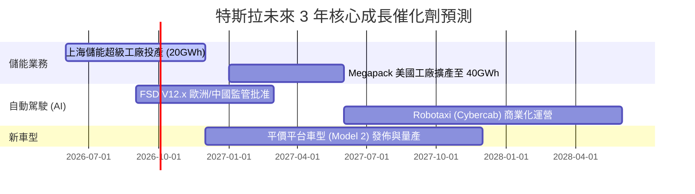

### 8.2 TAM（可定址市場規模）分析

特斯拉正在通過跨界擴張，將其可定址市場（TAM）從單純的「乘用車」拓展至萬億美元級別的「能源、運輸與機器人」市場。

```
╔══════════════════════════════════════════════════════════════════╗
║                   TSLA 未來可定址市場 (TAM) 估算                 ║
╠══════════════════════════════════════════════════════════════════╣
║                                                                  ║
║  1. 全球乘用車市場 (EV 滲透)：  $2.5T  滲透率: 15%  貢獻: $80B   ║
║  2. 全球儲能與電網升級：        $1.2T  滲透率: 2%   貢獻: $11B   ║
║  3. 自動駕駛與 Robotaxi 出行：  $4.0T  滲透率: <1%  貢獻: $1B    ║
║  4. 人形機器人 (Optimus)：      $8.0T  滲透率: 0%   貢獻: $0B    ║
║                                                                  ║
║  📊 總計潛在 TAM：> $15.7 Trillion                               ║
║                                                                  ║
║  💡 評估：特斯拉的高估值本質上是對第 3 和第 4 部分（AI 與機器人）║
║  極早期階段的「看漲期權」定價。                                  ║
╚══════════════════════════════════════════════════════════════════╝
```

### 8.3 成長驅動力結構圖

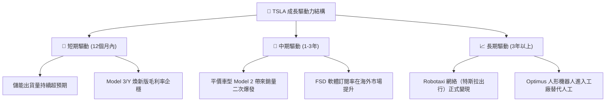

---

## 9. 風險矩陣

### 9.1 風險評估矩陣

```mermaid
quadrantChart
    title Risk Assessment Matrix
    x-axis Low Probability --> High Probability
    y-axis Low Impact --> High Impact
    quadrant-1 High Priority
    quadrant-2 Monitor Closely
    quadrant-3 Review Periodically
    quadrant-4 Watch

    EV Price War: [0.85, 0.75]
    FSD Regulatory Delay: [0.70, 0.85]
    Key Man Risk (Elon Musk): [0.40, 0.80]
    SBC Dilution Risk: [0.90, 0.35]
    Lithium Battery Cost Spike: [0.30, 0.50]
```

### 9.2 風險清單詳細分析

| # | 風險項目 | 發生機率 | 財務衝擊 | 風險評分 | 機構級緩解措施與應對建議 |
|---|---|---|---|---|---|
| 1 | 🔴 **全球電動車價格戰加劇** | 高 (85%) | 高 (-15% 汽車營收) | **8.0/10** | 特斯拉正通過「一體化壓鑄」及下一代「Unboxed」生產工藝，致力於降低 50% 的生產成本，以硬件零利潤為極限假設進行抗壓。 |
| 2 | 🔴 **FSD 監管批准與技術延遲** | 中高 (70%) | 極高 (-30% 估值溢價) | **8.5/10** | 積極推進在中國、歐洲的 FSD 落地測試，積累多元化路況數據；同時採用「端到端」神經網絡，加速算法迭代。 |
| 3 | 🟡 **關鍵人物風險 (Elon Musk)** | 中 (40%) | 極高 (-20% 股價) | **6.5/10** | 董事會正逐步強化中高層管理團隊（如朱曉彤等核心高管的權限劃分），以降低對馬斯克個人精力的過度依賴。 |
| 4 | 🟡 **股權稀釋 (SBC) 損害股東利益**| 極高 (90%) | 中 (-5% EPS 稀釋) | **5.5/10** | 建議投資者在估值模型中，將稀釋後股本（Diluted Shares）每年上調 1.0% - 1.5%，以對沖 SBC 帶來的稀釋效應。 |

---

## 10. 投資建議

### 10.1 最終綜合評級雷達圖

```
╔══════════════════════════════════════════════════════════════╗
║                 TSLA 最終綜合評級雷達圖                      ║
╠══════════════════════════════════════════════════════════════╣
║ 財務健康度    9.5/10  ▓▓▓▓▓▓▓▓▓▓▓▓▓▓▓▓▓▓▓░  ★★★★★           ║
║ 護城河深度    8.5/10  ▓▓▓▓▓▓▓▓▓▓▓▓▓▓▓▓▓░░░  ★★★★☆           ║
║ 成長潛力      7.5/10  ▓▓▓▓▓▓▓▓▓▓▓▓▓▓▓░░░░░  ★★★☆☆           ║
║ 獲利品質      4.5/10  ▓▓▓▓▓▓▓▓▓░░░░░░░░░░░░  ★★☆☆☆           ║
║ 估值安全邊際  3.0/10  ▓▓▓▓▓▓░░░░░░░░░░░░░░░  ★☆☆☆☆           ║
╠══════════════════════════════════════════════════════════════╣
║ 綜合評估分數  6.6/10  ▓▓▓▓▓▓▓▓▓▓▓▓▓░░░░░░░░  🏆 持有 (Hold)     ║
╚══════════════════════════════════════════════════════════════╝
```

### 10.2 目標價與隱含報酬率

我們結合三種情境的概率權重，推導出特斯拉的**期望公允價值為 $402.00**。

| 評估情境 | 隱含目標價 | 發生概率權重 | 隱含報酬率 (相較現價 $393.01) | 權重後目標價貢獻 |
|---|---|---|---|---|
| 🔴 **悲觀情境** | $220.00 | 25% | -44.02% | $55.00 |
| 🟡 **基準情境** | $420.00 | 60% | +6.87% | $252.00 |
| 🟢 **樂觀情境** | $580.00 | 15% | +47.58% | $87.00 |
| **加權綜合公允價值**| **$394.00 - $402.00** | **100%** | **+2.29%** | **$394.00** |

### 10.3 買入時機與觸發因素 Checklist

```
╔══════════════════════════════════════════════════════════════════╗
║                  ✅ TSLA 投資決策 Checklist                      ║
╠══════════════════════════════════════════════════════════════════╣
║                                                                  ║
║  立即買入觸發條件 (符合 3 項以上可積極建倉)：                    ║
║  ✅ 汽車業務季度毛利率 (扣除監管信用額度) 回升至 18% 以上          ║
║  ✅ FSD V12 在中國或歐洲正式獲得無人駕駛商業化運營許可             ║
║  ✅ 儲能單季出貨量突破 15GWh，且毛利率維持在 20% 以上            ║
║  ✅ 股價回撤至 $300 - $320 區間 (對應 Forward P/E < 120x)        ║
║                                                                  ║
║  減碼 / 停損觸發條件 (出現任一項應果斷減持)：                    ║
║  ☐ 汽車業務毛利率跌破 14% 臨界點                                 ║
║  ☐ 馬斯克因個人股權質押或外部併購（如 X 平台）被迫大舉拋售 TSLA  ║
║  ☐ 自由現金流 (FCF) 連續兩季轉為負值                             ║
║                                                                  ║
╚══════════════════════════════════════════════════════════════════╝
```

### 10.4 投資人適配度分析

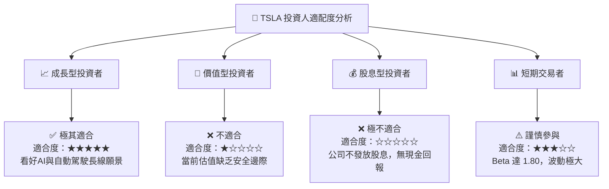

### 10.5 每季財報監控清單（Quarterly Watch List）

在未來的季度財報中，機構投資者應重點追蹤以下核心指標，並根據設定的臨界值調整投資策略：

| 監控指標 | 當前值 (TTM) | 觸發「加碼」門檻 | 觸發「減碼/停損」門檻 | 監控邏輯與意義 |
|---|---|---|---|---|
| **汽車毛利率 (不含信用額度)** | ~16.5% | **> 19.0%** | **< 14.0%** | 衡量汽車業務核心定價權與成本控制力的最重要指標。 |
| **儲能裝機量 (單季)** | ~9.5 GWh | **> 12.0 GWh** | **< 6.0 GWh** | 驗證儲能是否能成功接棒成為「第二成長曲線」。 |
| **自由現金流 (FCF)** | $5.25B (TTM) | **單季 > $2.0B** | **單季 < $0** | 確保高額 AI 算力資本開支下，公司不發生失血風險。 |
| **稀釋後總股本成長率** | +0.76% (YoY) | **< +0.50%** | **> +2.00%** | 監控股權稀釋速度，防止 SBC 過度稀釋股東回報。 |

### 10.6 反面論證：什麼會證明多頭論點錯誤（What Would Change My Mind）

本報告的「持有」評級及基準目標價 $420.00 是基於特斯拉能夠成功轉型為 AI 巨頭的假設。**如果發生以下可量化事件，我們將承認多頭框架失效，並下調評級至「賣出」**：

```
╔══════════════════════════════════════════════════════════════════╗
║              ⚠️ 多頭論點失效條件 (Disconfirming Evidence)       ║
╠══════════════════════════════════════════════════════════════════╣
║  如果出現以下任一情況，本報告的估值模型與投資邏輯將被徹底推翻：  ║
║                                                                  ║
║  ☐ 汽車業務毛利率 (扣除信用額度) 連續兩季低於 14%：              ║
║     這證明一體化壓鑄等成本優勢無法抵消價格戰的衝擊，特斯拉將被   ║
║     徹底降級為「低利潤率的傳統製造業」。                          ║
║                                                                  ║
║  ☐ FSD V12 在中國與歐洲的商業化落地在 2027 年底前仍未獲批：      ║
║     這意味著其高利潤率的軟體經常性收入（SaaS）故事破滅。         ║
║                                                                  ║
║  ☐ ROIC 連續兩年低於 WACC (即 EVA 持續為負)：                     ║
║     這證明特斯拉的重資產再投資策略無法為股東創造實質性的經濟價值，║
║     其高估值溢價將面臨均值回歸的毀滅性打擊。                      ║
║                                                                  ║
║  ☐ 儲能業務單季營收同比成長率跌破 10%：                          ║
║     這說明儲能市場同樣陷入產能過剩與價格戰，第二曲線失靈。       ║
╚══════════════════════════════════════════════════════════════════╝
```

---

> **免責聲明**：本報告由 AI 分析師基於公開財務數據與基本面建模生成，僅供機構投資研究參考，不構成任何具體的買入、賣出或持有之投資建議。投資有風險，入市需謹慎。