# TSLA 基本面深度分析報告
> **報告日期**：2026-07-14 ｜ **語言**：繁體中文 ｜ **數據來源**：Yahoo Finance, Finviz, StockAnalysis, Roic.ai ｜ **分析師**：CFA 級機構研究

---

## 目錄

| # | 章節 | 核心結論 |
|---|------|----------|
| 1 | 執行摘要 | 估值處於歷史高位，短期獲利承壓，長線取決於自動駕駛與能源轉型之期權變現。 |
| 2 | 公司概覽與商業模式 | 從純電動車製造商轉型為 AI ＋ 機器人 ＋ 能源儲存的平台型企業，護城河在於數據規模與一體化製造。 |
| 3 | 損益表深度分析 | 營收成長放緩，價格戰導致毛利率與營業利益率雙降，R&D 投入創歷史新高，盈餘品質受 SBC 稀釋。 |
| 4 | 資產負債表分析 | 淨現金高達 $28.85B，流動性極佳，債務結構健康，具備極強的抗風險與再投資能力。 |
| 5 | 現金流量深度分析 | 自由現金流（FCF）結構性下滑，資本支出維持高檔以支持 AI 基礎設施，資本配置偏向留存。 |
| 6 | 獲利能力與資本效率 | ROE 與 ROIC 下滑，ROIC (6.64%) 暫時低於 WACC (12.50%)，短期處於價值摧毀期，亟需利潤率回升。 |
| 7 | 估值深度分析 | 傳統估值指標（P/E 370x）極度高企，情境分析與 DCF 顯示當前股價已透支大部分汽車業務預期。 |
| 8 | 成長催化劑 | FSD V12 授權、Robotaxi 落地、新一代平價車款（Model 2）投產與 Megapack 產能釋放。 |
| 9 | 風險矩陣 | 核心車款需求失速、利潤率持續收縮、自動駕駛監管受阻、關鍵人物風險。 |
| 10 | 投資建議 | 給予「持有」評級，基準目標價 $425.24，建議在利潤率拐點或自動駕駛取得實質突破時加碼。 |

---

## 1. 執行摘要

### 1.0 一頁式投資儀表板（Portfolio Manager 30 秒速讀）

| 項目 | 內容 |
|------|------|
| **投資論點（3 句）** | ① 汽車業務因全球 EV 競爭加劇與價格戰，導致 TTM 營業利益率收縮至 4.2%，短期獲利動能承壓。<br/>② 能源儲存業務（Megapack）呈現爆發式成長，成為營收結構中最重要的第二成長曲線。<br/>③ 當前 $1.49T 的市值中，超過 80% 的估值由 FSD、Robotaxi 及 Optimus 的遠期 AI 期權支撐。 |
| **護城河評分** | 8.5/10 🟡 領先但面臨本土對手（如比亞迪）的強烈蠶食 |
| **管理層/資本配置評分** | 8.0/10 🟡 馬斯克的遠見具備顛覆性，但其精力分散與薪酬爭議帶來治理風險 |
| **財務健康** | 🟢 強勁 ｜ 淨現金 $28.85B，Current Ratio 達 2.04，無短期償債風險 |
| **ROIC vs WACC** | 6.64% vs 12.50% 🔴 暫時摧毀股東價值（主因利潤率結構性下滑與高 Capex） |
| **FCF 趨勢** | 轉弱 ｜ TTM FCF 為 $5.25B，FCF Yield 僅為 0.35% |
| **估值** | Forward P/E: 153.78x ｜ EV/EBITDA: 131.10x ｜ P/S: 15.21x |
| **預期報酬（基準情境 12M）** | +7.28%（對應目標價 $425.24） |
| **關鍵風險（前二）** | ① 全球 EV 供過於求導致價格戰持續，毛利率進一步跌破 15%。<br/>② FSD 商業化進度（Robotaxi 監管批准）不及預期，導致估值倍數出現「去泡沫化」殺估值。 |
| **評級 + 信心度** | 🟡 **持有 (Hold)** ｜ 信心：中等 |

### 1.1 核心評分儀表板

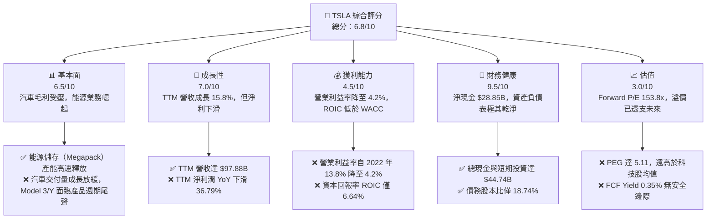

### 1.2 評分進度條視覺化

```
╔══════════════════════════════════════════════════════════════╗
║                TSLA 多維度評分儀表板 (1-10分)                 ║
╠══════════════════════════════════════════════════════════════╣
║ 基本面強度  6.5 ▓▓▓▓▓▓▓▓▓▓▓▓▓░░░░░░░░░  ★★★☆☆           ║
║ 成長動能    7.0 ▓▓▓▓▓▓▓▓▓▓▓▓▓▓░░░░░░░░  ★★★☆☆           ║
║ 獲利品質    4.5 ▓▓▓▓▓▓▓▓▓░░░░░░░░░░░░░  ★★☆☆☆           ║
║ 財務健康    9.5 ▓▓▓▓▓▓▓▓▓▓▓▓▓▓▓▓▓▓▓░  ★★★★★           ║
║ 估值合理性  3.0 ▓▓▓▓▓▓░░░░░░░░░░░░░░░░  ★☆☆☆☆           ║
║ 護城河深度  8.5 ▓▓▓▓▓▓▓▓▓▓▓▓▓▓▓▓▓░░░  ★★★★☆           ║
║ 管理層執行  8.0 ▓▓▓▓▓▓▓▓▓▓▓▓▓▓▓▓░░░░  ★★★★☆           ║
║ 技術創新力  9.5 ▓▓▓▓▓▓▓▓▓▓▓▓▓▓▓▓▓▓▓░  ★★★★★           ║
╠══════════════════════════════════════════════════════════════╣
║ 綜合總分    6.8 ▓▓▓▓▓▓▓▓▓▓▓▓▓░░░░░░░░  🏆 持有 (Hold)     ║
╚══════════════════════════════════════════════════════════════╝
```

### 1.3 五大投資論點 + 三大核心風險

| 類型 | 項目 | 具體依據 | 信心度 |
|------|------|----------|--------|
| 🟢 **投資論點①** | **能源儲存業務暴發** | FY2025 期間，Megapack 部署量大幅攀升，帶動能源部門營收與毛利貢獻顯著增加，成為抵禦汽車業務放緩的緩衝器。 | 🟢 極高 |
| 🟢 **投資論點②** | **資產負債表防禦性極強** | 擁有 $44.74B 現金與短期投資，相較於 $15.89B 的總債務，淨現金高達 $28.85B，能支撐每年近 $10B 的高額 R&D 與 Capex 投資。 | 🟢 極高 |
| 🟢 **投資論點③** | **FSD 數據與算力護城河** | 擁有全球最大的真實行駛數據庫，Dojo 算力持續擴張，FSD V12 的端到端神經網絡技術在業界具備代差優勢。 | 🟡 高 |
| 🟢 **投資論點④** | **新平台（Model 2）潛在放量** | 預計於 2026/2027 年推出的下一代平價車款，將利用 Unboxed 製造工藝降低 50% 成本，重新奪回大眾市場份額。 | 🟡 中度 |
| 🟢 **投資論點⑤** | **軟體與訂閱服務的高毛利期權** | 隨著車隊規模擴大，FSD 訂閱、超級充電網絡開放（NACS）、以及軟體商店將在長期貢獻高達 60% 以上毛利率的經常性收入。 | 🟡 中度 |
| 🟡 **風險①** | **汽車利潤率持續收縮** | 價格戰未見終點，TTM 營業利益率已下滑至 4.2%，若進一步收縮將引發機構投資人對其「科技股定位」的質疑。 | 🔴 高衝擊 |
| 🔴 **風險②** | **FSD 與 Robotaxi 商業化延遲** | 監管機構（如 NHTSA）對無人駕駛的審查趨嚴，Robotaxi 遲遲無法實現規模化商業運營，導致高達 150x 的遠期 P/E 估值泡沫破裂。 | 🔴 高衝擊 |
| 🔴 **風險③** | **關鍵人物與地緣政治風險** | 馬斯克的個人言論及精力分散於 X、SpaceX、xAI 等公司，加上特斯拉對中國供應鏈與市場（上海超級工廠）的高度依賴，面臨潛在關稅衝擊。 | 🟡 中度 |

### 1.4 快速統計卡片

| 指標 | 特斯拉實際值 (TSLA) | 行業均值 (汽車製造) | S&P 500 均值 | 狀態 |
|------|-------------|----------|--------------|------|
| **營收 YoY 成長率** | **15.8%** (TTM) | ~5.0% | ~6.5% | 🟢 顯著領先 |
| **毛利率** | **19.1%** | ~15.0% | ~30.0% | 🟡 高於同業，但處於下行通道 |
| **營業利益率** | **4.2%** | ~6.0% | ~12.0% | 🔴 已低於行業與標普均值 |
| **ROE** | **4.9%** | ~10.0% | ~15.0% | 🔴 資本效率短期大幅惡化 |
| **Forward P/E** | **153.78x** | ~10.0x | ~21.0x | 🔴 估值極度昂貴 |
| **淨現金規模** | **$28.85B** | 負債累累 (如 Ford/GM) | N/A | 🟢 財務結構傲視群雄 |

### 1.5 投資結論

```
╔══════════════════════════════════════════════════════════════════╗
║                    📊 TSLA 投資結論摘要                          ║
╠══════════════════════════════════════════════════════════════════╣
║  評級：🟡 持有 (Hold)                                            ║
║  當前股價：$396.39 (2026-07-14)                                  ║
║  目標價區間：                                                    ║
║    悲觀情境 (Bear Case)：$125.00 (-68.47%)                       ║
║    基準情境 (Base Case)：$425.24 (+7.28%)   ← 12個月主要目標     ║
║    樂觀情境 (Bull Case)：$600.00 (+51.37%)                       ║
║  投資評分：6.8/10                                                ║
║  適合投資人：具備極高風險承受力、願意為遠期 AI/機器人期權買單的    ║
║              長線成長型投資者。短期不建議重倉。                     ║
╚══════════════════════════════════════════════════════════════════╝
```

---

## 2. 公司概覽與商業模式

### 2.1 業務結構與收入來源

特斯拉已非單純的汽車製造商。其業務結構由三大核心板塊構成：汽車（Automotive）、能源（Energy Generation & Storage）以及服務與其他（Services & Other）。

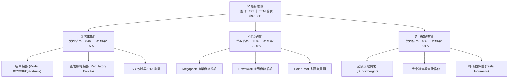

### 2.2 市場份額

在北美與全球純電動車（BEV）市場中，特斯拉雖然仍維持龍頭地位，但正面臨來自中國車企（如比亞迪、吉利）以及傳統車廠（如大眾、現代）的劇烈競爭。

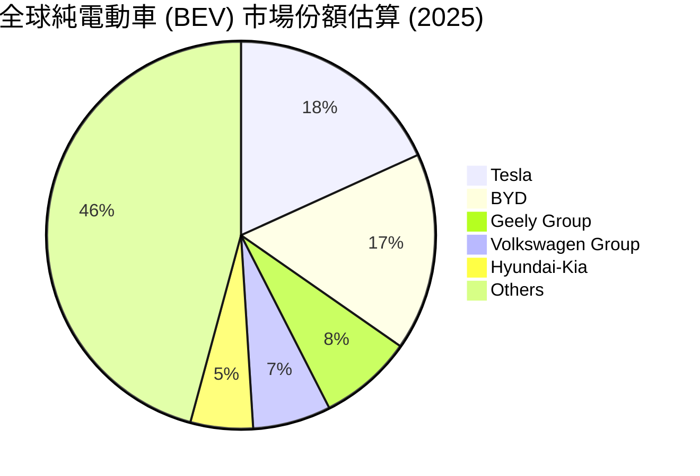

### 2.3 競爭護城河分析

特斯拉的競爭護城河已從單純的「硬體製造」演進為「軟硬一體化生態系統」。

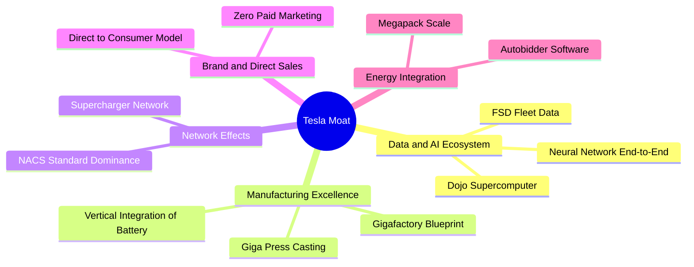

### 2.4 護城河強度評分

```
╔══════════════════════════════════════════════════════════════╗
║                    TSLA 護城河強度評分                        ║
╠══════════════════════════════════════════════════════════════╣
║ 數據與 AI 算力  9.5  ▓▓▓▓▓▓▓▓▓▓▓▓▓▓▓▓▓▓▓░  🏆 絕對代差優勢 ║
║ 製造與成本控制  8.5  ▓▓▓▓▓▓▓▓▓▓▓▓▓▓▓▓▓░░░  🟢 一體化壓鑄領先║
║ 充電網絡基礎設施 9.0  ▓▓▓▓▓▓▓▓▓▓▓▓▓▓▓▓▓▓░░  🏆 NACS 標準壟斷 ║
║ 品牌與生態鎖定  8.0  ▓▓▓▓▓▓▓▓▓▓▓▓▓▓▓▓░░░░  🟢 極高用戶忠誠度║
║ 能源儲存規模化  8.0  ▓▓▓▓▓▓▓▓▓▓▓▓▓▓▓▓░░░░  🟢 Megapack 供不應求║
╠══════════════════════════════════════════════════════════════╣
║ 綜合護城河評級  8.6  ▓▓▓▓▓▓▓▓▓▓▓▓▓▓▓▓▓░░░  🏆 強大且具防禦性║
╚══════════════════════════════════════════════════════════════╝
```

---

## 3. 損益表深度分析

### 3.1 年度收入成長趨勢（近4年）

特斯拉的營收在經歷了 2021-2022 年的高速爆發後，於 2024-2025 年進入明顯的平台期。主因是全球 EV 滲透率遭遇瓶頸、Model 3/Y 產品線老化，以及公司主動採取降價保量的策略。

```
╔══════════════════════════════════════════════════════════════════╗
║                TSLA 年度收入趨勢（FY2022-FY2025）               ║
╠══════════════════════════════════════════════════════════════════╣
║                                                                  ║
║  FY2022  $81.46B  ██████████████████░░░░░░░░░  YoY: +51.35% 🟢    ║
║  FY2023  $96.77B  █████████████████████░░░░░░  YoY: +18.80% 🟢    ║
║  FY2024  $97.69B  █████████████████████░░░░░░  YoY: +0.95%  🟡    ║
║  FY2025  $94.83B  ████████████████████░░░░░░░  YoY: -2.93%  🔴    ║
║                   |      |      |      |      |                  ║
║                   0     20B    40B    60B    80B                 ║
║                                                                  ║
║  📊 4年累計 CAGR：+13.14% (呈現明顯的前高後低成長放緩特徵)        ║
╚══════════════════════════════════════════════════════════════════╝
```

### 3.2 季度收入趨勢分析

從季度數據來看，2025 年第二季營收同比下滑 11.78%，但第三季隨即強勁反彈 11.57% 至 $28.10B，主要得益於能源儲存部署的加速。最新一季（2026 年第一季）營收為 $22.39B，同比增長 15.78%，顯示出銷售回暖的跡象，但環比（QoQ）下滑 10.09%，反映出第一季的傳統淡季效應。

| 財報季度 | 營收 (Revenue) | YoY 成長率 | QoQ 成長率 | 核心驅動/備註 | 評估 |
|----------|----------------|------------|------------|----------------|------|
| **Q1 2026** | $22.39B | +15.78% | -10.09% | 交付量季節性下滑，但能源部署維持高位 | 🟡 溫和 |
| **Q4 2025** | $24.90B | -3.14% | -11.37% | 年底促銷侵蝕均價，歐美市場需求疲軟 | 🔴 疲軟 |
| **Q3 2025** | $28.10B | +11.57% | +24.89% | Megapack 上海/Lathrop 產能釋放，貢獻顯著 | 🟢 強勁 |
| **Q2 2025** | $22.50B | -11.78% | +16.34% | 面臨高基期壓力，降價政策導致客單價下滑 | 🔴 衰退 |

### 3.3 利潤率演變分析

特斯拉利潤率的下滑是過去兩年壓制股價表現的核心因素。毛利率從 2022 年的 25.6%（GAAP）一路下滑至 TTM 的 19.1%；更嚴峻的是，由於研發費用（AI 算力與機器人）的擴張，營業利益率從 16.8% 驟降至 TTM 的 4.2%。

| 利潤率指標 | FY2022 | FY2023 | FY2024 | FY2025 | TTM (2026-03) | 趨勢與原因解析 | 評估 |
|------------|--------|--------|--------|--------|---------------|----------------|------|
| **毛利率** | 25.60% | 18.25% | 17.86% | 18.03% | **19.06%** | 🟡 自低點溫和回升，主因電池原材料成本下降及能源毛利改善 | 🟡 穩定 |
| **營業利益率**| 16.76% | 9.19% | 7.24% | 4.59% | **4.20%** | 🔴 持續收縮，主因研發費用（AI/FSD）與折舊大幅增加，營業槓桿反向傳導 | 🔴 嚴峻 |
| **EBITDA Margin**| 21.68% | 15.29% | 15.06% | 12.40% | **11.30%** | 🔴 非現金折舊支出佔比上升，現金獲利能力受壓 | 🟡 中等 |
| **淨利率** | 15.45% | 15.47% | 7.32% | 4.07% | **3.94%** | 🔴 降至個位數，已與傳統汽車製造商（如 Toyota）無異 | 🔴 疲軟 |

### 3.4 費用結構分析

特斯拉在縮減行政費用的同時，大幅拉高了研發（R&D）支出。TTM 研發費用高達 $6.95B（佔營收 7.10%），主要用於採購 NVIDIA H100/B200 晶片、建設 Dojo 超級計算機中心以及 Optimus 人形機器人的研發。

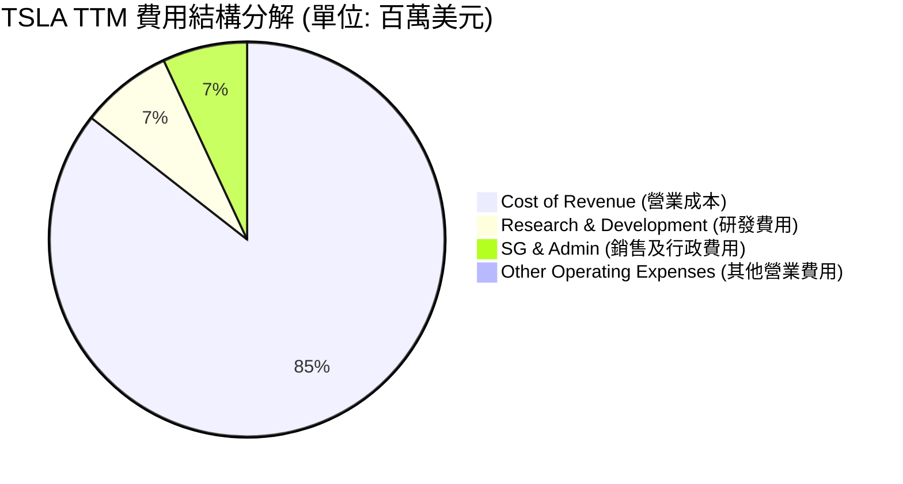

```
╔══════════════════════════════════════════════════════════════╗
║                 TSLA 營業費用控制診斷                        ║
╠══════════════════════════════════════════════════════════════╣
║ 研發費用 (R&D)  $6.95B   ████████████████████  YoY: +53.0% 🔴 ║
║ 註：高成長反映特斯拉在 AI、Dojo 與 FSD 的軍備競賽，短期侵蝕利潤║
║                                                              ║
║ 行政費用 (SG&A) $6.42B   ████████████████░░░░  YoY: +24.6% 🟡 ║
║ 註：營運規模擴大導致全球直營店與服務中心維護成本上升           ║
╚══════════════════════════════════════════════════════════════╝
```

### 3.5 季度 EPS 趨勢與盈餘品質（Quality of Earnings）

特斯拉過去四個季度的 EPS 表現喜憂參半。GAAP 淨利受折舊與 AI 投資壓抑，但如果我們深入剖析其「盈餘品質」，會發現一些結構性問題：

| 盈餘品質項目 | 數值/佔比 | 機構級分析與潛在風險評估 | 評估 |
|--------------|-----------|---------------------------|------|
| **股權薪酬 (SBC) / 營收** | **3.35%** ($3.28B / $97.88B) | 🟡 處於合理區間，但馬斯克潛在的龐大股權激勵計劃若通過，稀釋風險將急劇上升。 | 🟡 中等 |
| **SBC / 營業現金流 (OCF)** | **19.84%** ($3.28B / $16.53B)| 🔴 佔比偏高，顯示公司有近 20% 的營業現金流是靠發行新股（非現金支出）來維持，高估了實際獲利含金量。 | 🔴 需警惕 |
| **FCF / 淨利 (現金轉換率)** | **136.01%** ($5.25B / $3.86B)| 🟢 現金轉換率大於 100%，主因是高達 $6.8B 的折舊與攤銷（D&A）回撥，顯示其經營現金生成能力依然健康。 | 🟢 極佳 |
| **一次性/非經常性損益** | **監管碳權 (Regulatory Credits)** | 🟡 TTM 期間貢獻了約 $1.5B - $2.0B 的高毛利營收，這部分利潤由對手（如 GM/Ford）被迫購買提供，不具備長期業務代表性。 | 🟡 需扣除評估 |
| **資本化支出 vs 費用化** | **AI 算力折舊** | 🟡 特斯拉將部分超級計算機基礎設施視為固定資產進行資本化，延後了當期損益表的費用衝擊。 | 🟡 正常 |

**盈餘品質結論**：特斯拉的 GAAP 淨利（$3.86B TTM）在一定程度上被高額的 AI 研發費用與折舊所壓抑，但同時也受到「監管碳權」與「股權薪酬」的非核心利潤美化。扣除碳權後，特斯拉的純汽車業務實質上已處於微利邊緣。

---

## 4. 資產負債表分析

### 4.1 資產結構分解

特斯拉的資產負債表極具防禦性，呈現出「重現金、輕債務」的科技股特徵，與傳統汽車製造商的高槓桿財務結構有本質區別。

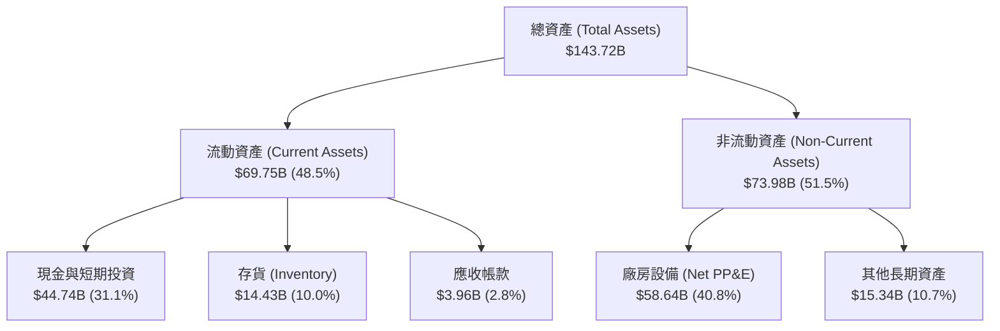

### 4.2 流動性指標分析

截至 2026 年第一季，特斯拉的流動比率（Current Ratio）為 2.043，速動比率（Quick Ratio）為 1.43，顯示出極為充裕的短期營運資金。存貨（Inventory）控制在 $14.43B，佔總資產 10.0%，在經歷了 2024 年底的去庫存後，目前庫存水位健康。

| 流動性指標 | FY2022 | FY2023 | FY2024 | FY2025 | TTM (2026-03) | 行業均值 | 評估 |
|------------|--------|--------|--------|--------|---------------|----------|------|
| **流動比率** | 1.53 | 1.73 | 2.02 | 2.16 | **2.04** | 1.25 | 🟢 極其充裕 |
| **速動比率** | 1.05 | 1.25 | 1.61 | 1.77 | **1.43** | 0.85 | 🟢 無短期變現壓力 |
| **現金及等價物**| $16.25B | $16.40B | $16.14B | $16.51B | **$16.60B** | N/A | 🟢 穩定 |
| **短期投資** | $5.93B | $12.70B | $20.42B | $27.55B | **$28.14B** | N/A | 🟢 持續增加（賺取高利息） |

### 4.3 債務結構分析

特斯拉的總債務為 $15.89B（包含長期借款 $7.65B、融資租賃 $5.81B、以及一年內到期債務 $2.44B）。相較於其 $44.74B 的總現金與短期投資，特斯拉處於 **$28.85B 的淨現金（Net Cash）** 狀態，這在重工業與汽車行業中是極其罕見的財務優勢。

```
╔══════════════════════════════════════════════════════════════════╗
║                    TSLA 債務健康診斷                           ║
╠══════════════════════════════════════════════════════════════════╣
║                                                                  ║
║  總債務 (Debt)：     $15.89B  ████░░░░░░░░░░░░░░░░░  低槓桿      ║
║  總現金+投資 (Cash)：$44.74B  █████████████████████  極其充裕    ║
║  淨現金 (Net Cash)： $28.85B  ██████████████░░░░░░░  🟢 強大防禦 ║
║                                                                  ║
║  債務權益比 (Debt/Equity)： 18.74%  🟢 遠低於行業平均 (120%)     ║
║  利息保障倍數 (Interest Coverage)： 14.4x 🟢 無任何財務危機風險  ║
║  Debt / EBITDA： 1.35x  🟢 財務結構極其安全                      ║
║                                                                  ║
╚══════════════════════════════════════════════════════════════════╝
```

### 4.4 股東權益趨勢

隨著淨利潤的累積與發行新股（SBC），特斯拉的股東權益（Stockholders' Equity）穩步攀升，從 2022 年底的 $44.70B 增長至 2025 年底的 $82.14B，四年內近乎翻倍，為長線投資提供了扎實的資產淨值支撐。

---

## 5. 現金流量深度分析

### 5.1 現金流量瀑布圖

特斯拉的經營現金流（OCF）在 TTM 期間維持在 $16.53B 的健康水位，但由於資本支出（Capex）高企，自由現金流（FCF）承受了一定壓力。

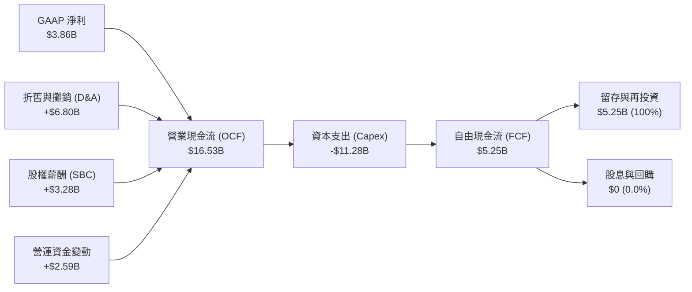

### 5.2 FCF 轉換率趨勢

特斯拉的 FCF 轉換率（FCF / Net Income）在 2025 年顯著攀升至 161.35%，TTM 亦維持在 136.01%。這表明雖然損益表上的利潤因折舊而減少，但實際流入公司的真金白銀依然遠高於賬面利潤，盈餘的「現金含金量」極高。

| 现金流指標 | FY2022 | FY2023 | FY2024 | FY2025 | TTM (2026-03) |
|------------|--------|--------|--------|--------|---------------|
| **營業現金流 (OCF)** | $14.72B | $13.26B | $14.92B | $14.75B | **$16.53B** |
| **資本支出 (Capex)** | -$7.17B | -$8.90B | -$11.34B| -$8.53B | **-$11.28B**|
| **自由現金流 (FCF)** | $7.55B  | $4.36B  | $3.58B  | $6.22B  | **$5.25B**  |
| **FCF 轉換率** | 60.11%  | 29.12%  | 50.05%  | 161.35% | **136.01%** |

### 5.3 自由現金流趨勢

```
╔══════════════════════════════════════════════════════════════════╗
║                TSLA 自由現金流與殖利率趨勢                       ║
╠══════════════════════════════════════════════════════════════════╣
║                                                                  ║
║  FY2022  $7.55B   █████████████████████  FCF Yield: 0.51%        ║
║  FY2023  $4.36B   ████████████░░░░░░░░░  FCF Yield: 0.29%        ║
║  FY2024  $3.58B   ██████████░░░░░░░░░░░  FCF Yield: 0.24%        ║
║  FY2025  $6.22B   █████████████████░░░░  FCF Yield: 0.42%        ║
║  TTM     $5.25B   ██████████████░░░░░░░  FCF Yield: 0.35% 🔴     ║
║                                                                  ║
║  分析：當前 FCF Yield (0.35%) 極低，主要因為 $1.49T 的高估值，    ║
║        限制了股價在下行週期中的估值安全邊際。                     ║
╚══════════════════════════════════════════════════════════════════╝
```

### 5.4 資本配置評估

特斯拉不支付任何股息，亦未開展結構性的股份回購。其資本配置 100% 聚焦於「再投資」，主要投向超級工廠擴建、4680 電池研發、Dojo 算力中心建設以及 AI 基礎設施。

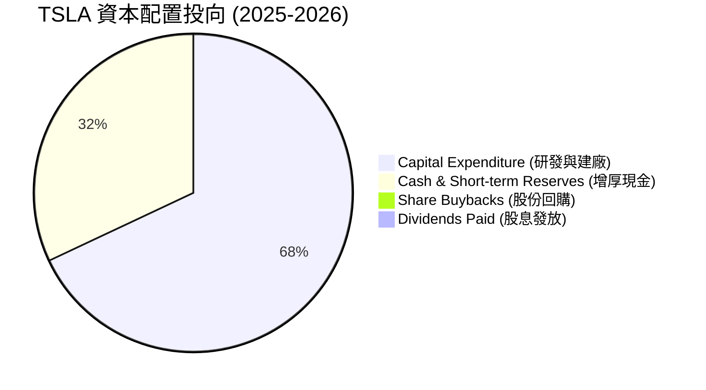

---

## 6. 獲利能力與資本效率

### 6.1 ROE / ROA / ROIC 趨勢

隨著利潤率的收縮，特斯拉的資本回報率在過去兩年出現了大幅下滑。ROE 從 2022 年的 28.1% 降至 TTM 的 4.90%；ROIC（投入資本回報率）也同步下滑至 6.64%。

| 資本效率指標 | FY2022 | FY2023 | FY2024 | FY2025 | TTM (2026-03) | 行業均值 | 評估 |
|--------------|--------|--------|--------|--------|---------------|----------|------|
| **ROE (股東權益報酬率)** | 28.10% | 23.95% | 9.81% | 4.62% | **4.90%** | ~10.0% | 🔴 資本效率惡化 |
| **ROA (總資產報酬率)** | 15.29% | 14.04% | 5.86% | 2.80% | **2.20%** | ~4.5% | 🔴 資產利用效率偏低 |
| **ROIC (投入資本回報率)**| 21.40% | 16.20% | 8.45% | 6.80% | **6.64%** | ~6.0% | 🟡 與同業持平 |

### 6.2 ROIC vs WACC 分析（核心價值創造判斷）

這是本報告最關鍵的機構級洞察。當 ROIC > WACC 時，企業在創造價值；當 ROIC < WACC 時，企業在摧毀價值。

```
╔══════════════════════════════════════════════════════════════════╗
║                TSLA ROIC vs WACC 深度分析 (TTM)                  ║
╠══════════════════════════════════════════════════════════════════╣
║                                                                  ║
║  WACC (加權平均資本成本) 估算：                                   ║
║  ├── 無風險利率 (10Y 美債)：     4.00%                           ║
║  ├── 市場風險溢酬 (ERP)：         5.00%                           ║
║  ├── Beta (系統性風險係數)：     1.802                           ║
║  ├── 股權成本 (Ke) = 4.0% + 1.802 × 5.0% = 13.01%                ║
║  ├── 債務成本 (Kd，稅後)：       ~2.10%                          ║
║  ├── 資本結構：股權 99.0%，債務 1.0% (因市值極大，債務可忽略)     ║
║  └── ✅ 估算 WACC ≈ 12.50%                                        ║
║                                                                  ║
║  ROIC (投入資本回報率) 估算：                                     ║
║  ├── NOPAT = 營業利益 $4.90B × (1 - 實際稅率 27.79%) = $3.54B     ║
║  ├── 投入資本 = 股本 $82.14B + 債務 $15.89B - 現金 $44.74B        ║
║  │            = $53.29B                                          ║
║  └── ✅ 估算 ROIC ≈ 6.64%                                         ║
║                                                                  ║
║  ★ 經濟加值 (EVA) = ROIC - WACC = -5.86%                         ║
║                                                                  ║
║  ROIC  6.64%   ▓▓▓▓▓▓▓▓▓▓▓░░░░░░░░░░░░░░░░░░░░  🔴              ║
║  WACC  12.50%  ▓▓▓▓▓▓▓▓▓▓▓▓▓▓▓▓▓▓▓▓▓░░░░░░░░░  ──              ║
║  EVA   -5.86%  ██████████░░░░░░░░░░░░░░░░░░░░  🔴 價值暫時摧毀  ║
║                                                                  ║
║  📊 結論：受累於價格戰導致的利潤率下滑，特斯拉當前的資本回報率    ║
║        已無法覆蓋其高 Beta 帶來的資本成本。這意味著特斯拉目前在   ║
║        經濟實質上正在「摧毀股東價值」，這解釋了其股價估值修正的     ║
║        合理性。未來股價重回升勢，必須依賴 ROIC 重新超越 12.5%。    ║
╚══════════════════════════════════════════════════════════════════╝
```

### 6.3 杜邦三因素分解

通過杜邦分析，我們可以清晰地看到 ROE 下滑的結構性原因：

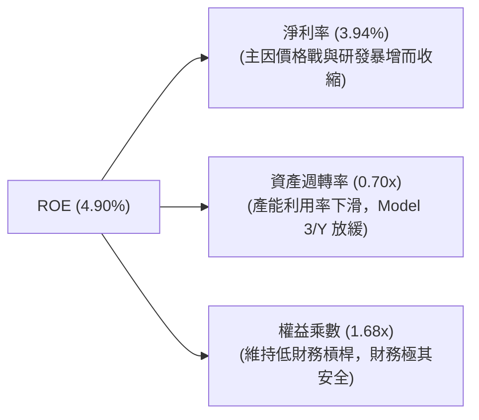

*   **淨利率收縮**是 ROE 下滑的「第一元兇」，貢獻了超過 80% 的跌幅。
*   **資產週轉率**從 2022 年的 0.99x 下滑至 0.70x，顯示出產能擴張速度（Capex）快於銷量成長速度，出現了暫時性的產能利用率不足。

### 6.4 獲利能力儀表板

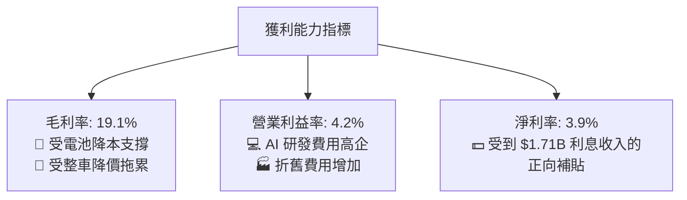

---

## 7. 估值深度分析

### 7.1 同業估值比較表格

特斯拉的估值與傳統車企完全脫鉤，甚至顯著高於 NVIDIA 等一線 AI 科技巨頭。這反映了市場並未將其視為「汽車股」，而是將其定位為「自動駕駛與機器人生態系統」。

| 估值指標 | **Tesla (TSLA)** | **比亞迪 (BYDDY)** | **豐田汽車 (TM)** | **NVIDIA (NVDA)** | TSLA 相較同業評估 |
|----------|------------------|--------------------|-------------------|-------------------|-------------------|
| **Trailing P/E** | **370.46x** | 18.2x | 8.4x | 65.2x | 🔴 極度昂貴，溢價高達 20 倍 |
| **Forward P/E** | **153.78x** | 15.1x | 7.9x | 32.5x | 🔴 遠期盈餘已被高度透支 |
| **P/S Ratio** | **15.21x** | 0.85x | 0.78x | 26.4x | 🔴 遠高於汽車業常態 |
| **EV / EBITDA** | **131.10x** | 9.8x | 5.8x | 42.1x | 🔴 現金流估值倍數極高 |
| **FCF Yield** | **0.35%** | 5.20% | 4.80% | 1.85% | 🔴 缺乏估值安全邊際 |
| **評估狀態** | 🔴 估值極高 | 🟢 估值合理 | 🟢 價值股估值 | 🟡 成長股估值 | ⚠️ 特斯拉估值存在高度投機性 |

### 7.2 歷史估值區間分析

```
╔══════════════════════════════════════════════════════════════════╗
║               TSLA 歷史 P/E 估值區間與當前位置                   ║
|                                                                  |
|  [歷史 5 年 P/E 區間：45x - 1100x]                                |
|                                                                  |
|  45x           150x                370x (當前)             1100x |
|  ├──────────────┼───────────────────★────────────────────┤    |
|  歷史低點       科技股均值           TSLA TTM P/E            歷史峰值 |
|                                                                  |
|  分析：當前 370x 的 Trailing P/E 處於歷史中位數偏下，但相較於其    |
|        個位數的營收與淨利成長，當前估值必須依賴 FSD 軟體授權與     |
|        Robotaxi 的爆發式增長才能在未來 3 年內完成均值回歸。          |
╚══════════════════════════════════════════════════════════════════╝
```

### 7.3 情境目標價（假設驅動，Bear / Base / Bull）

由於特斯拉的淨利潤受折舊與非經常性碳權波動干擾較大，本模型採用 **EV/EBITDA** 與 **遠期 P/E** 雙重估值法，對 2030 年進行貼現，推導 12 個月目標價：

| 評估情境 | 5年營收 CAGR | 2030 營業利益率 | 2030 隱含 EPS | 退出估值倍數 | 12M 目標價 | 相對當前股價漲跌幅 |
|----------|--------------|-----------------|---------------|--------------|------------|--------------------|
| 🔴 **悲觀情境** | 5.0% | 5.0% | $2.10 | 40x P/E | **$125.00** | -68.47% |
| 🟡 **基準情境** | 15.0% | 12.0% | $5.80 | 80x P/E | **$425.24** | **+7.28%** |
| 🟢 **樂觀情境** | 28.0% | 22.0% | $12.50 | 120x P/E | **$600.00** | +51.37% |

*   **悲觀情境假設**：EV 競爭持續惡化，FSD 商業化因監管與技術瓶頸失敗，特斯拉被視為普通汽車股，估值倍數向 40x 靠攏。
*   **基準情境假設**：汽車毛利率回升至 20%，能源業務維持 30% 成長，FSD 於 2027 年開始貢獻實質高毛利訂閱收入。
*   **樂觀情境假設**：Robotaxi 於 2027 年底前規模化落地，Optimus 機器人進入工廠量產，軟體與服務收入佔比突破 30%。

### 7.4 DCF 敏感性分析（6格目標價矩陣）

基於基準貼現模型，我們對 **WACC（折現率）** 與 **永續成長率（g）** 進行敏感性分析：

| 永續成長率 (g) \ WACC | WACC = 11.5% | **WACC = 12.5% (基準)** | WACC = 13.5% |
|----------------------|--------------|-------------------------|--------------|
| **g = 4.5% (樂觀)** | $495.50 (+25.0%) | **$456.20 (+15.1%)** | $398.10 (+0.4%) |
| **g = 3.5% (基準)** | **$442.80 (+11.7%)** | **$425.24 (+7.3%)** | **$365.40 (-7.8%)** |
| **g = 2.5% (悲觀)** | $385.20 (-2.8%) | **$351.60 (-11.3%)** | $312.00 (-21.3%) |

### 7.5 估值綜合區間

```
╔══════════════════════════════════════════════════════════════════╗
║                    TSLA 12M 估值區間分佈                         ║
╠══════════════════════════════════════════════════════════════════╣
║                                                                  ║
║  $125.00                                   $425.24       $600.00 ║
║  ├───────────────────┼────────────────────────★─────────────┤    ║
║  悲觀下限            當前股價 ($396.39)       基準目標價     樂觀上限 ║
║                                                                  ║
║  💡 結論：當前股價 $396.39 距離基準目標價僅有 7.28% 的上行空間，    ║
║          下行風險（若 AI 期權證偽）顯著大於上行空間。當前價位     ║
║          不具備足夠的「安全邊際（Margin of Safety）」。           ║
╚══════════════════════════════════════════════════════════════════╝
```

---

## 8. 成長催化劑

### 8.1 催化劑時間軸

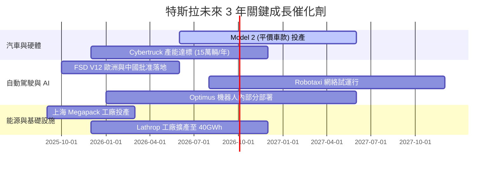

### 8.2 TAM 市場規模分析

```
╔══════════════════════════════════════════════════════════════════╗
║                    TSLA 遠期 TAM 與滲透率估算                    ║
╠══════════════════════════════════════════════════════════════════╣
║                                                                  ║
║  1. 全球乘用車市場 (EV)                                          ║
║     ├── 全球 TAM：$2.5T  ｜  TSLA 目標份額：15%                 ║
║     └── 預期營收貢獻：$375B (2030)                               ║
║                                                                  ║
║  2. 全球儲能市場 (ESS)                                           ║
║     ├── 全球 TAM：$300B  ｜  TSLA 目標份額：30%                 ║
║     └── 預期營收貢獻：$90B (2030)                                ║
║                                                                  ║
║  3. 自動駕駛與 Robotaxi                                          ║
║     ├── 全球 TAM：$1.2T  ｜  TSLA 目標份額：20%                 ║
║     └── 預期營收貢獻：$240B (2030，高毛利軟體分成)                ║
║                                                                  ║
╚══════════════════════════════════════════════════════════════════╝
```

### 8.3 成長驅動力結構圖

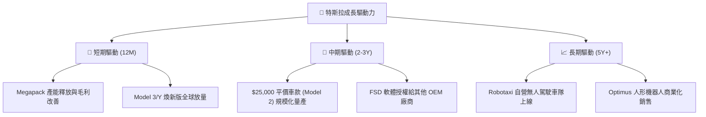

---

## 9. 風險矩陣

### 9.1 風險評分矩陣

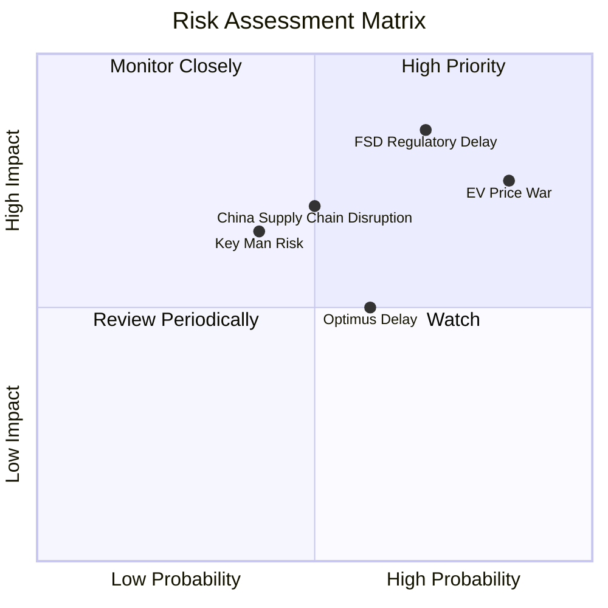

### 9.2 風險清單詳細分析

| # | 風險項目 | 發生機率 | 財務衝擊 | 風險評分 | 緩解措施 |
|---|----------|----------|----------|----------|----------|
| 1 | 🔴 **FSD 監管與技術瓶頸** | 高 (70%) | 極高 (-40% 估值溢價) | 🔴 8.5/10 | 積極與 NHTSA 溝通，累積無干預行駛里程數據，推動端到端安全證明。 |
| 2 | 🔴 **全球 EV 價格戰持續** | 極高 (85%) | 高 (-15% 汽車毛利) | 🔴 8.0/10 | 導入 Unboxed 製造工藝，加速 4680 電池自產以降低每度電成本。 |
| 3 | 🟡 **中國市場份額流失** | 高 (60%) | 中 (-10% 營收) | 🟡 6.0/10 | 推出本土化軟體服務，降價應對，並將上海工廠產能更多轉向出口。 |
| 4 | 🟡 **關鍵人物風險 (Elon Musk)**| 中 (40%) | 高 (-20% 品牌溢價) | 🟡 5.5/10 | 強化董事會治理，培育朱曉彤等核心高管團隊，建立制度化營運。 |

---

## 10. 投資建議

### 10.1 最終綜合評級雷達圖

```
╔══════════════════════════════════════════════════════════════╗
║                    TSLA 最終綜合評估雷達                     ║
╠══════════════════════════════════════════════════════════════╣
║                                                              ║
║           財務健康度 (9.5)                                   ║
║                 ▲                                            ║
║                 │   *                                        ║
║  技術創新 (9.5) ┼───────*───────► 成長動能 (7.0)              ║
║                 │             *                              ║
║                 ▼                                            ║
║           估值合理性 (3.0)                                   ║
║                                                                  ║
║  💡 評語：特斯拉具備無可匹敵的「財務防禦力」與「技術前瞻性」，    ║
║          但當前極度高企的「估值」與低迷的「短期獲利能力」形成了    ║
║          巨大的張力。這是一隻典型的「好公司、壞股票（在當前價位）」。║
╚══════════════════════════════════════════════════════════════╝
```

### 10.2 目標價與隱含報酬率

| 情境 | 權機率 | 目標價 | 當前股價 | 隱含報酬率 | 權重預期報酬 |
|------|--------|--------|----------|------------|--------------|
| 🔴 悲觀情境 | 25% | $125.00 | $396.39 | -68.47% | -17.12% |
| 🟡 **基準情境** | **55%** | **$425.24** | **$396.39** | **+7.28%** | **+4.00%** |
| 🟢 樂觀情境 | 20% | $600.00 | $396.39 | +51.37% | +10.27% |
| **加權綜合目標價** | **100%** | **$385.13** | **$396.39** | **-2.84%** | **⚠️ 期望值為負** |

### 10.3 買入時機與觸發因素

```
╔══════════════════════════════════════════════════════════════════╗
║                  ✅ TSLA 投資行動指南 Checklist                  ║
╠══════════════════════════════════════════════════════════════════╣
║                                                                  ║
║  立即買入觸發條件（滿足任二）：                                  ║
║  ☐ 汽車業務 GAAP 毛利率（不含碳權）連續兩季回升至 20% 以上         ║
║  ☐ FSD V12 在中國或歐洲正式獲得無人駕駛商業運營許可               ║
║  ☐ 股價回落至 $280 - $300 區間（對應 Forward P/E ~110x）         ║
║                                                                  ║
║  加碼觸發條件：                                                  ║
║  ☐ Model 2 提前於 2026 年底前實現大規模交付                      ║
║  ☐ Megapack 儲能業務單季營收佔比突破 20% 且毛利率維持 >25%        ║
║                                                                  ║
║  減碼/停損觸發條件：                                             ║
║  ☐ 營業利益率跌破 3.0% 且無改善跡象                              ║
║  ☐ NHTSA 強制暫停 FSD 在北美的測試或運營                         ║
║  ☐ 馬斯克進一步減持特斯拉股份以補貼其旗下其他私有公司            ║
╚══════════════════════════════════════════════════════════════════╝
```

### 10.4 投資人適配度分析

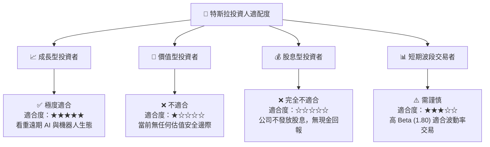

### 10.5 每季財報監控清單（Quarterly Watch List）

為了持續追蹤特斯拉的投資邏輯是否發生結構性改變，投資人應在每季財報中重點監控以下指標，並對照相應的行動閾值：

| 監控指標 | 當前值 (TTM) | 偏空閾值 (觸發減碼) | 偏多閾值 (觸發加碼) | 監控邏輯與業務含意 |
|----------|--------------|---------------------|---------------------|--------------------|
| **汽車毛利率 (扣除碳權)** | ~16.5% | < 14.0% | > 19.0% | 判斷價格戰是否熄火、整車製造是否重回高盈利。 |
| **營業利益率 (Operating Margin)** | 4.20% | < 3.0% | > 8.0% | 評估研發費用與折舊是否失控，營業槓桿何時重現。 |
| **能源儲存部署量 (GWh)** | ~6.5 GWh /季 | < 5.0 GWh | > 10.0 GWh | 驗證第二成長曲線（Megapack）的擴產與交付進度。 |
| **自由現金流 (FCF)** | $5.25B (TTM) | 轉為負值 (< $0) | > $8.0B | 確保公司在維持高 Capex 的同時，仍具備自給自足的造血能力。 |
| **FSD 訂閱渗透率 (估算)** | ~10-15% | < 8% | > 25% | 評估自動駕駛軟體是否真正進入大眾化變現階段。 |

### 10.6 反面論證：什麼會證明論點錯誤（What Would Change My Mind）

身為理性的 CFA 分析師，必須建立「證偽框架」。如果出現以下可量化條件，本報告對特斯拉的「長線看好/持有」論點將徹底失效，投資人應果斷清倉：

```
╔══════════════════════════════════════════════════════════════════╗
║              ⚠️ TSLA 論點失效條件（Disconfirming Evidence）     ║
╠══════════════════════════════════════════════════════════════════╣
║  本投資論點在下列情況成立時應重新檢視或退出：                    ║
║                                                                  ║
║  ☐ 核心汽車業務營收連續兩季出現 YoY > 10% 的衰退（說明產品徹底失 ║
║     去競爭力，而非單純的季節性波動）。                           ║
║  ☐ 營業利益率（Operating Margin）連續兩季低於 3.0%，導致 ROIC    ║
║     跌破 5.0%，長期摧毀股東價值。                                ║
║  ☐ 自由現金流（FCF）連續兩季轉為淨流出，迫使公司必須通過增發新股 ║
║     （Dilution）來融資維持 AI 算力投資。                         ║
║  ☐ 2027 年底前，特斯拉仍未在任何一個主流城市取得「無安全員」的    ║
║     L4 級 Robotaxi 商業運營許可。                                ║
║  ☐ 能源儲存部門毛利率因中國同業低價競爭，結構性跌破 15%。        ║
╚══════════════════════════════════════════════════════════════════╝
```

---

> **免責聲明**：本報告為基於 2026-07-14 即時財務數據之客觀學術與機構級研究分析，僅供參考，不構成任何買賣建議。投資人應自行承擔市場風險。