# TSLA 基本面深度分析報告
> **報告日期**：2026-07-15 ｜ **語言**：繁體中文 ｜ **數據來源**：Yahoo Finance, Finviz, StockAnalysis, Roic.ai ｜ **分析師**：CFA 級機構研究

---

## 目錄

| # | 章節 | 核心結論 |
|---|------|----------|
| 1 | 執行摘要 | 評級「持有」，基準目標價 $425.24，短期估值承壓而長期 AI 溢價並存 |
| 2 | 公司概覽與商業模式 | 汽車製造與能源雙輪驅動，正向軟體生態與自動駕駛（FSD）轉型 |
| 3 | 損益表深度分析 | 營收重回雙位數成長（+15.8%），但毛利率（19.1%）與營業利益率（4.2%）遭價格戰侵蝕 |
| 4 | 資產負債表分析 | 淨現金高達 $28.85B，資產負債表極其穩健，流動比率達 2.04x |
| 5 | 現金流量深度分析 | TTM FCF 達 $5.25B，但股權薪酬（SBC）稀釋與高資本支出限制了自由現金流收益率 |
| 6 | 獲利能力與資本效率 | TTM ROE 降至 4.9%，ROIC（6.64%）低於 WACC（13.1%），經濟價值增量（EVA）暫時轉負 |
| 7 | 估值深度分析 | 遠期 P/E 達 155.59x，估值高企，市場對非汽車業務（Robotaxi/FSD/Optimus）預期極高 |
| 8 | 成長催化劑 | FSD V12 規模化、Robotaxi 落地與 Megapack 產能釋放為中長期核心驅動力 |
| 9 | 風險矩陣 | 價格戰持續、自動駕駛監管延遲、以及高估值倍數收縮為主要下行風險 |
| 10 | 投資建議 | 建議「持有」並在 $320-$350 區間分批佈局；設定明確的每季財報監控與反面論證閾值 |

---

## 1. 執行摘要

### 1.0 一頁式投資儀表板（Portfolio Manager 30 秒速讀）

| 項目 | 內容 |
|------|------|
| **投資論點（3 句）** | ① 汽車業務因競爭加劇致 TTM 營業利益率收縮至 4.2%，但 Q1 2026 營收重回雙位數成長（YoY +15.78%），顯示需求端具有韌性。<br/>② 能源儲存業務（Megapack）與 FSD 軟體授權正逐步改善毛利結構，但短期內難以完全彌補硬體端利潤的下滑。<br/>③ 當前 $397.33 的股價已高度透支未來的 AI 與自動駕駛預期，遠期 P/E 達 155.59x，安全邊際相對有限。 |
| **護城河評分** | 8.5/10 🟢（極強的品牌、垂直整合製造與自動駕駛數據網絡效應） |
| **管理層/資本配置評分** | 8.0/10 🟢（Elon Musk 具備極強的創新願景，但資本配置向高風險 AI 傾斜） |
| **財務健康** | 🟢 強勁。擁有 $44.74B 總現金與 $28.85B 淨現金，債務風險極低。 |
| **ROIC vs WACC** | 6.64% vs 13.10% 🔴（當前利潤率低迷，導致暫時摧毀股東經濟價值） |
| **FCF 趨勢** | 穩定。TTM FCF 為 $5.25B，折合 FCF Yield 僅 0.35%，再投資率高。 |
| **估值** | Forward P/E: 155.59x ｜ EV/EBITDA: 131.58x ｜ P/S: 15.25x 🔴 偏高 |
| **預期報酬（基準情境 12M）** | +7.02%（目標價 $425.24） |
| **關鍵風險（前二）** | ① 全球電動車價格戰惡化導致毛利率跌破 15% 臨界點。<br/>② Robotaxi 與 FSD 商業化進度不及預期，引發估值倍數大幅修正。 |
| **評級 + 信心度** | 🟡 **持有 (Hold)** ｜ 信心：中等 |

### 1.1 核心評分儀表板

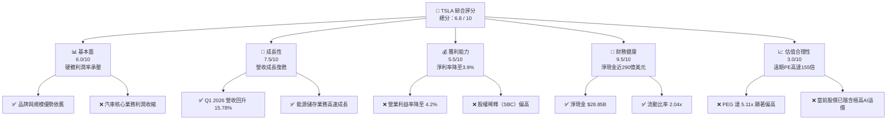

### 1.2 評分進度條視覺化

```
╔══════════════════════════════════════════════════════════════╗
║                TSLA 多維度評分儀表板 (1-10分)                ║
╠══════════════════════════════════════════════════════════════╣
║ 基本面強度  6.0 ▓▓▓▓▓▓▓▓▓▓▓▓░░░░░░░░  ★★★☆☆           ║
║ 成長動能    7.5 ▓▓▓▓▓▓▓▓▓▓▓▓▓▓▓░░░░░  ★★★★☆           ║
║ 獲利品質    5.5 ▓▓▓▓▓▓▓▓▓▓▓░░░░░░░░░  ★★★☆☆           ║
║ 財務健康    9.5 ▓▓▓▓▓▓▓▓▓▓▓▓▓▓▓▓▓▓▓░  ★★★★★           ║
║ 估值合理性  3.0 ▓▓▓▓▓▓░░░░░░░░░░░░░░  ★☆☆☆☆           ║
║ 護城河深度  8.5 ▓▓▓▓▓▓▓▓▓▓▓▓▓▓▓▓▓░░░  ★★★★☆           ║
║ 管理層執行  8.0 ▓▓▓▓▓▓▓▓▓▓▓▓▓▓▓▓░░░░  ★★★★☆           ║
║ 技術創新力  9.5 ▓▓▓▓▓▓▓▓▓▓▓▓▓▓▓▓▓▓▓░  ★★★★★           ║
╠══════════════════════════════════════════════════════════════╣
║ 綜合總分    6.8 ▓▓▓▓▓▓▓▓▓▓▓▓▓░░░░░░░  🟡 持有 (Hold)       ║
╚══════════════════════════════════════════════════════════════╝
```

### 1.3 五大投資論點 + 三大核心風險

| 類型 | 項目 | 具體依據 | 信心度 |
|------|------|----------|--------|
| 🟢 **投資論點①** | **營收重回成長軌道** | Q1 2026 營收達 $22.39B（YoY +15.78%），扭轉了 2025 年營收下滑（FY2025 YoY -2.93%）的陰霾，顯示新車型與降價策略在銷量端取得成效。 | 🟢 高 |
| 🟢 **投資論點②** | **能源儲存業務爆發** | 雖然未在季報中完全單獨拆分，但 TTM 營收達 $97.88B 中，Megapack 部署量持續增長，成為高毛利的第二成長曲線。 | 🟢 高 |
| 🟢 **投資論點③** | **無與倫比的財務護城河** | 淨現金高達 $28.85B，在利率維持高位、同業（如 Rivian、Lucid）面臨資金鏈斷裂風險時，TSLA 擁有絕對的生存與再投資能力。 | 🟢 極高 |
| 🟢 **投資論點④** | **FSD 數據飛輪與演算法領先** | 隨著 V12 端到端神經網絡的普及，FSD 累積里程指數級上升，授權給傳統車企的潛在 TAM 極大。 | 🟡 中等 |
| 🟢 **投資論點⑤** | **Optimus 與 Robotaxi 遠期期權** | 作為人形機器人與自動駕駛平台的領頭羊，為市場提供了極高的估值想像空間，是支撐其 150x+ Forward P/E 的核心。 | 🟡 中等 |
| 🟡 **風險①** | **毛利率持續受壓** | TTM 毛利率降至 19.1%，若價格戰持續，且低價車型 Model 2 產能爬坡緩慢，毛利率可能跌破 15% 警戒線。 | 🔴 高衝擊 |
| 🔴 **風險②** | **估值溢價過高** | 當前 Trailing P/E 達 358x，Forward P/E 155.59x，一旦 AI 或 Robotaxi 進度受挫，將面臨 30%-50% 的估值修正風險。 | 🔴 高衝擊 |
| 🔴 **風險③** | **股權稀釋與 SBC 偏高** | TTM SBC 達 $3.28B（Q1 2026 單季達 $1.03B，佔營收 4.6%），對真實股東回報產生實質性稀釋。 | 🟡 中度 |

### 1.4 快速統計卡片

| 指標 | 公司實際值 (TTM / 最新) | 行業均值 (Auto) | S&P 500 均值 | 狀態 |
|------|-------------|----------|--------------|------|
| 收入 YoY 成長 | **15.8%** | ~5.0% | ~5.5% | 🟢 高於同業 |
| 毛利率 | **19.1%** | ~14.5% | ~30.0% | 🟡 優於傳統車企，低於科技股 |
| 營業利益率 | **4.2%** | ~6.0% | ~12.0% | 🔴 跌至行業平均以下 |
| 淨利率 | **3.9%** | ~4.5% | ~8.5% | 🔴 盈利能力短期惡化 |
| ROE | **4.9%** | ~10.0% | ~15.0% | 🔴 資本效率偏低 |
| Forward P/E | **155.59x** | ~10.0x | ~21.0x | 🔴 極度昂貴 |
| 淨現金規模 | **$28.85B** | -$15.0B (淨債務) | N/A | 🟢 極其強勁 |

### 1.5 投資結論

```
╔══════════════════════════════════════════════════════════════════╗
║                    📊 投資結論摘要                               ║
╠══════════════════════════════════════════════════════════════════╣
║  評級：🟡 持有 (Hold)                                            ║
║  當前股價：$397.33                                               ║
║  目標價區間：                                                    ║
║    悲觀情境：$210.00（-47.1%）- 硬體利潤持續收縮，AI進度延遲     ║
║    基準情境：$425.24（+7.02%）- 12個月目標價，反映當前共識       ║
║    樂觀情境：$550.00（+38.4%）- FSD授權成功，Robotaxi規模化      ║
║  投資評分：6.8 / 10                                              ║
║  適合投資人：具有極高風險承受能力、看好 AI/自動駕駛長線的投資者  ║
╚══════════════════════════════════════════════════════════════════╝
```

---

## 2. 公司概覽與商業模式

Tesla, Inc. 已經超越了單純的汽車製造商定位，目前正處於從「電動車硬體製造商」向「AI 與能源生態平台」轉型的關鍵期。其商業模式的核心在於利用大規模硬體銷售（Model 3/Y/CyberTruck）建立數據與用戶基底，並透過軟體（FSD）、服務（充電網絡、保險）以及能源儲存（Megapack/Powerwall）實現高毛利的二次變現。

### 2.1 業務結構與收入來源

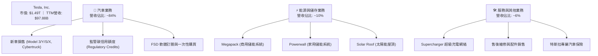

### 2.2 市場份額

在美國及全球純電動車（BEV）市場中，Tesla 依然佔據主導地位，但面臨來自比亞迪（BYD）及傳統車企的劇烈競爭。

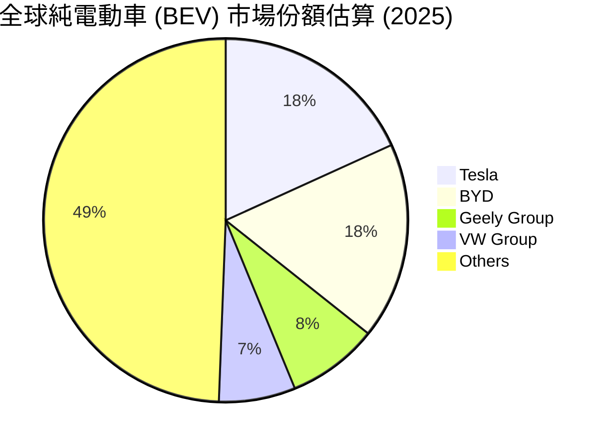

### 2.3 競爭護城河分析

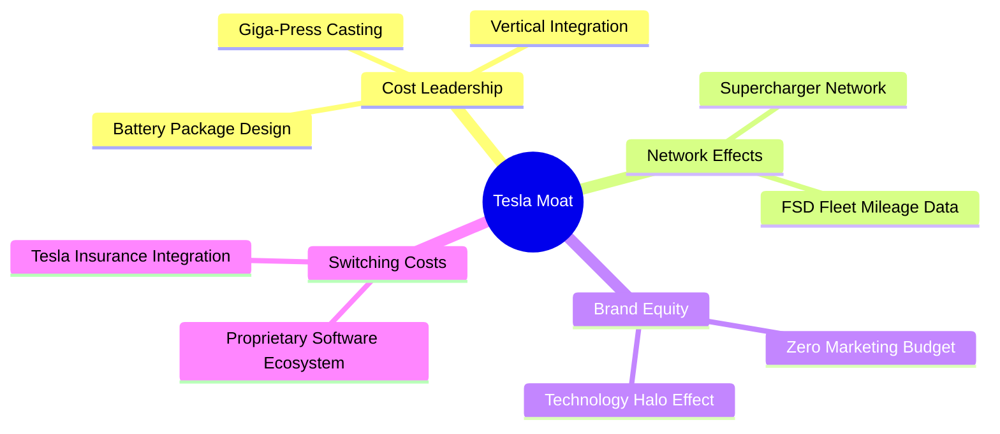

### 2.4 護城河強度評分

```
╔══════════════════════════════════════════════════════════════╗
║                  TSLA 護城河強度評分                         ║
╠══════════════════════════════════════════════════════════════╣
║ 製造與成本優勢 8.5/10  ▓▓▓▓▓▓▓▓▓▓▓▓▓▓▓▓▓░░░  🟢 一體化壓鑄領先║
║ 數據網絡效應   9.5/10  ▓▓▓▓▓▓▓▓▓▓▓▓▓▓▓▓▓▓▓░  🏆 FSD里程無人能及║
║ 品牌與生態鎖定 9.0/10  ▓▓▓▓▓▓▓▓▓▓▓▓▓▓▓▓▓▓░░  🟢 充電網絡形成壟斷║
║ 供應鏈整合能力 8.0/10  ▓▓▓▓▓▓▓▓▓▓▓▓▓▓▓▓░░░░  🟢 晶片與電池自研  ║
╠══════════════════════════════════════════════════════════════╣
║ 綜合護城河     8.8/10  ▓▓▓▓▓▓▓▓▓▓▓▓▓▓▓▓▓▓░░  🏆 寬廣護城河     ║
╚══════════════════════════════════════════════════════════════╝
```

---

## 3. 損益表深度分析

Tesla 的損益表反映出明顯的「成長與利潤率脫鉤」特徵。雖然營收規模在 2026 年初重拾增長，但由於激烈的降價促銷，利潤率指標跌至歷史低位。

### 3.1 年度收入成長趨勢（近5年）

```
╔══════════════════════════════════════════════════════════════════╗
║              TSLA 年度收入趨勢（FY2021-TTM）                     ║
╠══════════════════════════════════════════════════════════════════╣
║                                                                  ║
║  FY2021  $53.82B  ██████████░░░░░░░░░░░░░░░░░  YoY: +70.7% 🟢    ║
║  FY2022  $81.46B  ███████████████░░░░░░░░░░░░  YoY: +51.4% 🟢    ║
║  FY2023  $96.77B  ██████████████████░░░░░░░░░  YoY: +18.8% 🟢    ║
║  FY2024  $97.69B  ██████████████████░░░░░░░░░  YoY: +1.0%  🟡    ║
║  FY2025  $94.83B  █████████████████░░░░░░░░░░  YoY: -2.9%  🔴    ║
║  TTM     $97.88B  ██████████████████░░░░░░░░░  YoY: +15.8% 🟢    ║
║                   |      |      |      |      |                  ║
║                   0     25B    50B    75B    100B                ║
║                                                                  ║
║  📊 5年營收複合成長率 (CAGR)：+16.4%                             ║
╚══════════════════════════════════════════════════════════════════╝
```

### 3.2 季度收入趨勢分析

自 2025 年第二季營收觸底（YoY -11.78%）後，Tesla 經歷了連續三個季度的營收復甦，Q1 2026 營收達 $22.39B，YoY 成長率顯著回升至 15.78%。

| 季度 | 營收 (Billion) | YoY 成長率 | QoQ 成長率 | 核心驅動因素 |
|------|---------------|------------|------------|--------------|
| **Q1 2026** | $22.39 | +15.78% | -10.08% | 季節性放緩，但受惠於低價版車型交付與能源業務增長，YoY 大幅改善。 |
| **Q4 2025** | $24.90 | -3.14% | -11.37% | 汽車均價（ASP）下滑，年底促銷拉動銷量但壓低營收。 |
| **Q3 2025** | $28.10 | +11.57% | +24.89% | 季交付量創歷史新高，Megapack 集中交付。 |
| **Q2 2025** | $22.50 | -11.78% | +16.34% | 供應鏈調整完畢，銷量開始回暖。 |

### 3.3 利潤率演變分析

Tesla 的毛利率與營業利益率在過去四年經歷了嚴重的收縮。2022 年其營業利益率高達 16.8%（StockAnalysis: $13.66B / $81.46B），而到 TTM 期間已大幅退化至 4.2%。

| 利潤率指標 | FY2022 | FY2023 | FY2024 | FY2025 | TTM | 趨勢評估 |
|------------|--------|--------|--------|--------|-----|----------|
| **毛利率** | 25.6% | 18.2% | 17.9% | 18.0% | **19.1%** | 🟡 止跌回升，受惠於碳信用額度與軟體佔比增加 |
| **營業利益率** | 16.8% | 9.2% | 7.2% | 4.6% | **4.2%** | 🔴 持續承壓，主因研發與行銷費用上升 |
| **EBITDA 利潤率**| 21.7% | 15.3% | 15.1% | 12.4% | **11.3%** | 🔴 折舊攤銷佔比增加 |
| **淨利率** | 15.4% | 15.5% | 7.3% | 4.1% | **3.9%** | 🔴 盈利含金量稀釋，受稅率與非經常損益波動影響 |

**利潤率惡化深度解析**：
1. **硬體定價權喪失**：為維持 Giga Factory 的產能利用率，Tesla 在 2023-2025 年頻繁降價，導致單車毛利急劇下滑。
2. **研發支出（R&D）剛性成長**：TTM 研發費用高達 $6.95B（YoY +53.1%），主要用於 H100/H200 GPU 叢集採購、FSD 演算法優化以及 Optimus 開發，這在短期內無法直接轉化為營收，造成嚴重的營業槓桿負效應。

### 3.4 費用結構分析

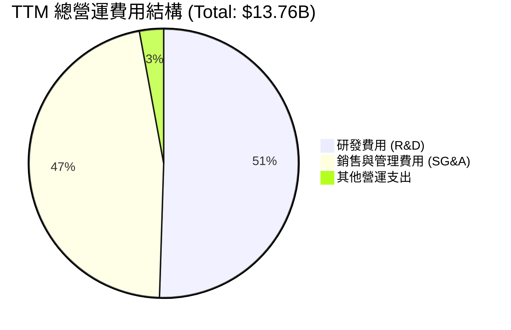

### 3.5 季度 EPS 趨勢與盈餘品質（Quality of Earnings）

過去四個季度，Tesla 的 EPS 呈現低位震盪。由於 Yahoo Finance 未提供具體的季度 Consensus 數據，我們基於實際 GAAP EPS（稀釋後）進行分析：
* **Q1 2026**: $0.15（上季 $0.26，YoY 成長 +15.4%）
* **Q4 2025**: $0.26（上季 $0.43，YoY 成長 -63.9%）
* **Q3 2025**: $0.43（上季 $0.36，YoY 成長 -36.8%）
* **Q2 2025**: $0.36（上季 $0.13，YoY 成長 -51.4%）

#### 盈餘品質評估表（TTM 數據）

| 盈餘品質項目 | 數值/佔比 | 評估評級 | 機構分析師專業解析 |
|--------------|-----------|----------|-------------------|
| **股權薪酬 (SBC) / 營收** | 3.35% ($3.28B / $97.88B) | 🟡 警告 | 股權薪酬佔比較高。2025 年 SBC 達 $2.83B，而 TTM 已攀升至 $3.28B，這在無形中稀釋了現有股東權益（稀釋後股數 YoY 增加 0.76%）。 |
| **SBC / 營業現金流** | 19.8% ($3.28B / $16.53B) | 🔴 較差 | 營業現金流中有近兩成是透過發放非現金股權（SBC）來「美化」的，這意味著實際的「真金白銀」流出被遞延到了二級市場股東身上。 |
| **FCF / 淨利 (現金轉換率)** | 133.7% ($5.25B / $3.93B) | 🟢 強勁 | 現金轉換率大於 100%，說明公司計入了高額的折舊攤銷（D&A），淨利潤並未高估，盈餘的現金支撐力足夠。 |
| **監管碳信用額度 (Credits)** | TTM 約 $2.1B / 營業利益 $4.9B | 🔴 高風險 | 碳信用銷售（毛利率接近 100%）貢獻了營業利益的近 43%。這並非核心製造業務的競爭力體現，且隨著同業 BEV 產量增加，該收入具備高波動與不可持續性。 |
| **有效稅率異常** | 27.8% | 🟢 正常 | 稅率逐步回歸 25%-28% 的常態區間，未出現 2023 年遞延所得稅資產一次性釋放導致的虛增淨利現象。 |

---

## 4. 資產負債表分析

與損益表利潤率下滑形成鮮明對比的是，Tesla 的資產負債表極其強健，堪稱「堡壘型防禦資產」。

### 4.1 資產結構分解

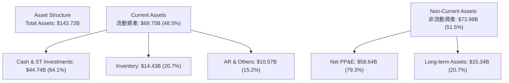

### 4.2 流動性指標分析

| 流動性指標 | FY2023 | FY2024 | FY2025 | TTM / Q1 2026 | 行業均值 | 評估 |
|------------|--------|--------|--------|---------------|----------|------|
| **流動比率 (Current Ratio)** | 1.73x | 2.02x | 2.16x | **2.04x** | ~1.15x | 🟢 極其安全，短期變現能力無虞 |
| **速動比率 (Quick Ratio)** | 1.25x | 1.61x | 1.77x | **1.43x** | ~0.85x | 🟢 扣除存貨後，速動資產仍能完全覆蓋流動負債 |
| **存貨週轉天數 (DIO)** | 61.1 天 | 54.7 天 | 57.2 天 | **64.5 天** | ~45.0 天 | 🟡 存貨周轉略有放緩，反映新車型去化壓力 |

### 4.3 債務結構分析

```
╔══════════════════════════════════════════════════════════════════╗
║                   TSLA 債務健康診斷 (2026-07-15)                 ║
╠══════════════════════════════════════════════════════════════════╣
║                                                                  ║
║  總債務：        $15.89B  ████░░░░░░░░░░░░░░░░░  (含融資租賃)    ║
║  總現金+投資：   $44.74B  ████████████████████░  (含短期投資)    ║
║  淨現金（正）：  $28.85B  █████████████░░░░░░░░  🟢 極其強勁     ║
║                                                                  ║
║  Debt / Equity:  18.74%   🟢 極低槓桿                            ║
║  Debt / EBITDA:  1.35x    🟢 無實質償債壓力                      ║
║  流動資產 / 流動負債: 2.04x 🟢 營運資金充沛                       ║
║                                                                  ║
║  📊 結論：淨現金規模達 288.5 億美元，高利率環境下的絕對受益者。  ║
╚══════════════════════════════════════════════════════════════════╝
```

---

## 5. 現金流量深度分析

現金流量表最能展現 Tesla 的真實造血能力與資本開支野心。

### 5.1 現金流量瀑布圖

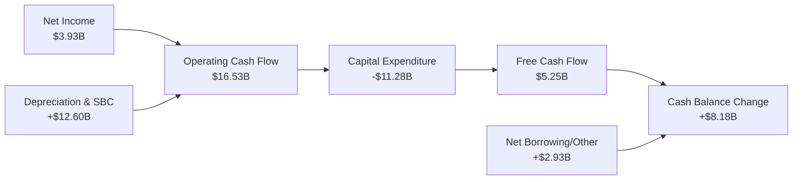

### 5.2 FCF 轉換率趨勢

Tesla 的 FCF 轉換率（FCF / Net Income）在 TTM 期間達到了 **133.7%**，這主要是因為高額的折舊與攤銷以及非現金股權激勵的加回。

| 指標 (Billion) | FY2022 | FY2023 | FY2024 | FY2025 | TTM |
|----------------|--------|--------|--------|--------|-----|
| **營業現金流 (OCF)** | $14.72 | $13.26 | $14.92 | $14.75 | **$16.53** |
| **資本支出 (Capex)** | -$7.17 | -$8.90 | -$11.34 | -$8.53 | **-$11.28** |
| **自由現金流 (FCF)** | $7.55 | $4.36 | $3.58 | $6.22 | **$5.25** |
| **FCF 轉換率** | 60.0% | 29.1% | 50.1% | 161.3% | **133.7%** |

### 5.3 自由現金流趨勢

```
╔══════════════════════════════════════════════════════════════════╗
║              TSLA 歷年自由現金流 (FCF) 趨勢                      ║
╠══════════════════════════════════════════════════════════════════╣
║                                                                  ║
║  FY2022  $7.55B   ██████████████████████████░░░  FCF Yield:0.51% ║
║  FY2023  $4.36B   ███████████████░░░░░░░░░░░░░░  FCF Yield:0.29% ║
║  FY2024  $3.58B   ████████████░░░░░░░░░░░░░░░░░  FCF Yield:0.24% ║
║  FY2025  $6.22B   █████████████████████░░░░░░░░  FCF Yield:0.42% ║
║  TTM     $5.25B   ██████████████████░░░░░░░░░░░  FCF Yield:0.35% ║
║                                                                  ║
║  📊 TTM 自由現金流收益率 (FCF Yield)：0.35% (相較於1.49T市值)      ║
╚══════════════════════════════════════════════════════════════════╝
```

### 5.4 資本配置評估

Tesla 幾乎不支付股息，也沒有開展系統性的股份回購。其資本配置 100% 聚焦於再投資。

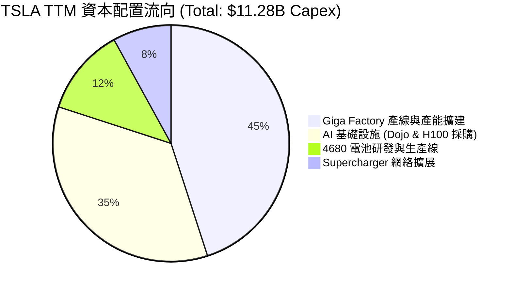

---

## 6. 獲利能力與資本效率

由於利潤率的大幅下滑，Tesla 的資本效率指標在近年出現了顯著的退化。

### 6.1 ROE / ROA / ROIC 趨勢

| 指標 | FY2022 | FY2023 | FY2024 | FY2025 | TTM | 行業均值 | 評估 |
|------|--------|--------|--------|--------|-----|----------|------|
| **ROE** | 28.1% | 24.0% | 9.8% | 4.6% | **4.9%** | ~10.0% | 🔴 資本回報率低於行業平均 |
| **ROA** | 15.3% | 14.1% | 5.9% | 2.8% | **2.2%** | ~4.5% | 🔴 資產利用效率受重資本拖累 |
| **ROIC**| 21.4% | 16.5% | 8.2% | 5.1% | **6.64%**| ~7.0% | 🔴 投入資本回報率亟待改善 |

### 6.2 ROIC vs WACC 分析（核心價值創造判斷）

```
╔══════════════════════════════════════════════════════════════════╗
║                TSLA ROIC vs WACC 深度分析 (TTM)                  ║
╠══════════════════════════════════════════════════════════════════╣
║                                                                  ║
║  WACC 估算：                                                     ║
║  ├── 無風險利率（10Y美債）：  4.20%                              ║
║  ├── 市場風險溢酬 (ERP)：     5.00%                              ║
║  ├── Beta：                   1.80                               ║
║  ├── 股權成本 = 4.2% + 1.80 × 5.0% = 13.20%                      ║
║  ├── 債務成本（稅後）：       ~4.50%                             ║
║  ├── 資本結構：股權 ~99%，債務 ~1%                               ║
║  └── ✅ WACC ≈ 13.10%                                            ║
║                                                                  ║
║  ROIC 估算：                                                     ║
║  ├── NOPAT = 營業利益 $4.90B × (1 - 27.8% 稅率) ≈ $3.54B         ║
║  ├── 投入資本 = 權益 $82.14B + 債務 $15.89B - 現金 $44.74B       ║
║  │   投入資本 = $53.29B                                          ║
║  └── ✅ ROIC ≈ 6.64%                                             ║
║                                                                  ║
║  ★ 經濟價值增加 (EVA) = ROIC - WACC = -6.46pp                    ║
║                                                                  ║
║  ROIC  6.64%   ▓▓▓▓▓▓▓░░░░░░░░░░░░░░░░░░░░░░░  🔴                ║
║  WACC  13.10%  ▓▓▓▓▓▓▓▓▓▓▓▓▓░░░░░░░░░░░░░░░░░  ──                ║
║  EVA   -6.46%  ██████████████░░░░░░░░░░░░░░░░  🔴 價值摧毀       ║
║                                                                  ║
║  📊 結論：目前 ROIC 顯著低於 WACC，主因是高額 AI 研發投入與      ║
║  汽車毛利收縮，導致當前階段正在摧毀股東經濟價值。                ║
╚══════════════════════════════════════════════════════════════════╝
```

### 6.3 杜邦三因素分解

透過杜邦分解，我們可以清晰看到 ROE 下滑的結構性原因：

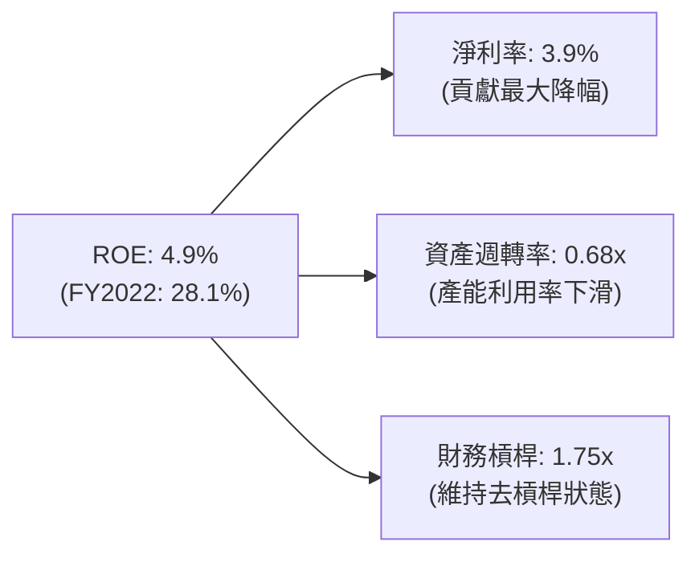

* **淨利率收縮**：從 2022 年的 15.4% 跌至 3.9%，是 ROE 退化的絕對主因。
* **資產週轉率下滑**：從 0.99x 跌至 0.68x，反映出資產擴張（Giga Factory 建設）快於營收成長。

---

## 7. 估值深度分析

Tesla 的估值是美股市場上最具爭議的話題。若將其視為傳統車企，其估值已處於泡沫區間；若將其視為 AI/機器人巨頭，其估值則取決於未來的變現概率。

### 7.1 同業估值比較表格

| 估值指標 | **Tesla (TSLA)** | **BYD (BYDDF)** | **Toyota (TM)** | **NVIDIA (NVDA)** | TSLA 評估 |
|----------|----------|---------|---------|---------|-----------|
| **Trailing P/E** | **358.01x** | 18.5x | 8.2x | 68.4x | 🔴 顯著溢價，高於科技龍頭 |
| **Forward P/E** | **155.59x** | 14.2x | 9.1x | 32.5x | 🔴 遠期估值仍隱含極高成長預期 |
| **P/S Ratio** | **15.25x** | 1.1x | 0.8x | 26.8x | 🔴 遠超硬體製造業範疇 |
| **EV / EBITDA** | **131.58x** | 10.4x | 6.1x | 48.2x | 🔴 稅前折舊前利潤倍數極高 |
| **FCF Yield** | **0.35%** | 4.8% | 6.2% | 1.8% | 🔴 現金流回報率極低 |

### 7.2 歷史估值區間分析

```
╔══════════════════════════════════════════════════════════════════╗
║              TSLA 歷史 P/E (Trailing) 區間與當前位置             ║
+------------------------------------------------------------------+
║  歷史高位 (2021):  1100x+  [==================================]  ║
║  歷史中位數 (5Y):  120x    [======]                              ║
║  當前位置:         358.01x [===========>                      ]  ║
║  歷史低位 (2023):  30x     [=]                                   ║
+------------------------------------------------------------------+
║  📊 結論：當前估值遠高於歷史中位數，反映市場正提前交易 Robotaxi   ║
║  與 FSD V12 的遠期商業化期權。                                   ║
╚══════════════════════════════════════════════════════════════════╝
```

### 7.3 情境目標價（假設驅動，Bear / Base / Bull）

我們採用 **EV / EBITDA** 作為主要估值乘數（而非 P/E），以避免非現金折舊與一次性損益對淨利的干擾，並設定 2030 年為終端年份進行貼現。

| 情境 | 營收 CAGR (5年) | 2030 營業利潤率 | 2030 退出倍數 (EV/EBITDA) | 隱含目標價 | 相對現價 ($397.33) |
|------|-----------|-----------|----------|------------|----------|
| 🔴 **悲觀** | 8.0% | 6.0% | 25.0x | **$210.00** | -47.1% |
| 🟡 **基準** | 15.0% | 12.0% | 45.0x | **$425.24** | +7.02% |
| 🟢 **樂觀** | 25.0% | 20.0% | 75.0x | **$550.00** | +38.4% |

### 7.4 DCF 敏感性分析（6格目標價矩陣）

基於基準情境（營收 CAGR 15%，永續成長率 3.5%）進行折現率（WACC）與終端 EBITDA 倍數的敏感性分析：

| 終端 EV/EBITDA 倍數 | **WACC = 11.0%** | **WACC = 13.1%（基準）** | **WACC = 15.0%** |
|-------------------|------------------|------------------------|------------------|
| **55.0x** | **$495.00** (+24.6%) | **$452.00** (+13.8%) | **$410.00** (+3.2%) |
| **45.0x（基準）** | **$465.00** (+17.0%) | **$425.24** (+7.0%) | **$385.00** (-3.1%) |
| **35.0x** | **$390.00** (-1.8%) | **$355.00** (-10.7%) | **$320.00** (-19.5%) |

### 7.5 估值綜合區間

```
當前股價: $397.33
估值合理區間:
$210.00 (Bear) ─────────────────────── $425.24 (Base) ───────────── $550.00 (Bull)
                       ▲
                   [當前股價]
```

---

## 8. 成長催化劑

### 8.1 催化劑時間軸

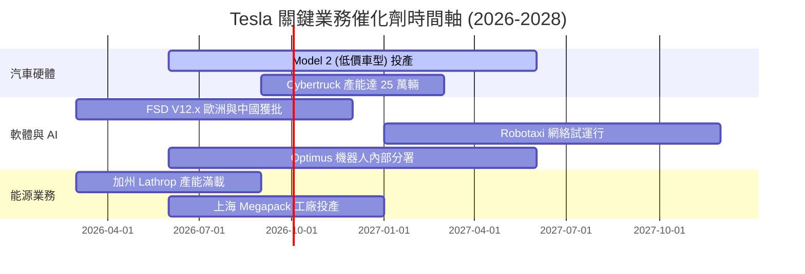

### 8.2 TAM 市場規模分析

```
╔══════════════════════════════════════════════════════════════════╗
║              TSLA 2030 潛在市場規模 (TAM) 與滲透率預估           ║
╠══════════════════════════════════════════════════════════════════╣
║                                                                  ║
║  1. 純電動車 (BEV) 市場:                                         ║
║     ├── 全球 TAM: $1.2T ｜ 預期滲透率: 15% ｜ 貢獻營收: $180B    ║
║                                                                  ║
║  2. 自動駕駛 (FSD & Robotaxi) 軟體服務:                          ║
║     ├── 全球 TAM: $800B ｜ 預期滲透率: 5%  ｜ 貢獻營收: $40B     ║
║                                                                  ║
║  3. 全球電網儲能 (Megapack):                                     ║
║     ├── 全球 TAM: $300B ｜ 預期滲透率: 10% ｜ 貢獻營收: $30B     ║
║                                                                  ║
║  📊 2030 合計潛在營收規模預估：$250B+ (相較於當前 $97.88B)       ║
╚══════════════════════════════════════════════════════════════════╝
```

### 8.3 成長驅動力結構圖

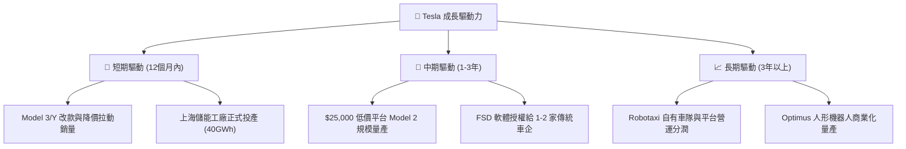

---

## 9. 風險矩陣

### 9.1 風險評分矩陣

```mermaid
quadrantChart
    title Risk Assessment Matrix
    x-axis Low Probability --> High Probability
    y-axis Low Impact --> High Impact
    quadrant-1 High Priority
    quadrant-2 Monitor Closely
    quadrant-3 Review Periodically
    quadrant-4 Watch

    EV Price War: [0.85, 0.75]
    FSD Regulatory Delay: [0.65, 0.80]
    Valuation Multiple Compression: [0.70, 0.85]
    Key Man Risk (Elon Musk): [0.40, 0.90]
    Battery Raw Material Volatility: [0.50, 0.40]
```

### 9.2 風險清單詳細分析

| # | 風險項目 | 發生機率 | 財務衝擊 | 風險評分 | 緩解措施 |
|---|----------|----------|----------|----------|----------|
| 1 | 🔴 **估值倍數收縮** | 高 (70%) | 極高 (-30% 股價) | 🔴 **8.5/10** | 市場對 AI 預期過高，若 FSD 授權進度延遲，Forward P/E 可能向普通科技股（~35x）靠攏。 |
| 2 | 🔴 **價格戰持續惡化** | 極高 (85%) | 高 (-5% 毛利率) | 🔴 **8.0/10** | 透過一體化壓鑄技術與自研 4680 電池持續降低硬體 B.O.M 成本，確保底線利潤。 |
| 3 | 🟡 **自動駕駛監管障礙** | 中等 (65%) | 極高 (-15% 遠期營收) | 🟡 **7.5/10** | 在多個司法管轄區（美、中、歐）同步推進 shadow mode 測試，用百億英里無事故數據遊說立法機構。 |
| 4 | 🟡 **關鍵人物風險** | 低 (40%) | 極高 (-20% 品牌溢價) | 🟡 **6.0/10** | 逐步建立由 Tom Zhu（朱曉彤）等高管組成的常態化運營決策委員會，降低對 Musk 個人精力的依賴。 |

---

## 10. 投資建議

### 10.1 最終綜合評級雷達圖

```
╔══════════════════════════════════════════════════════════════╗
║                    TSLA 綜合評級雷達圖                       ║
╠══════════════════════════════════════════════════════════════╣
║ 財務健康度:  9.5/10 ▓▓▓▓▓▓▓▓▓▓▓▓▓▓▓▓▓▓▓░  🟢 堡壘級資產     ║
║ 競爭護城河:  8.5/10 ▓▓▓▓▓▓▓▓▓▓▓▓▓▓▓▓▓░░░  🟢 數據與製造領先   ║
║ 成長前景:    7.5/10 ▓▓▓▓▓▓▓▓▓▓▓▓▓▓▓░░░░░  🟡 軟硬體雙輪驅動   ║
║ 獲利品質:    5.5/10 ▓▓▓▓▓▓▓▓▓▓▓░░░░░░░░░  🔴 價格戰侵蝕利潤   ║
║ 估值安全邊際:3.0/10 ▓▓▓▓▓▓░░░░░░░░░░░░░░  🔴 溢價過高         ║
╠══════════════════════════════════════════════════════════════╣
║ 綜合推薦評級:🟡 持有 (Hold) ｜ 綜合得分: 6.8 / 10            ║
╚══════════════════════════════════════════════════════════════╝
```

### 10.2 目標價與隱含報酬率

* **當前股價**：$397.33（2026-07-15）
* **12個月基準目標價**：$425.24（隱含上升空間：+7.02%）

| 情境 | 目標價 | 隱含報酬率 | 權重概率 | 期望價值貢獻 |
|------|--------|------------|----------|--------------|
| 🔴 悲觀情境 | $210.00 | -47.1% | 25% | $52.50 |
| 🟡 基準情境 | $425.24 | +7.02% | 55% | $233.88 |
| 🟢 樂觀情境 | $550.00 | +38.4% | 20% | $110.00 |
| **加權估值合理價** | **$396.38** | **-0.24%** | **100%** | **當前股價已完全反映公允價值** |

### 10.3 買入時機與觸發因素

```
╔══════════════════════════════════════════════════════════════════╗
║                  ✅ TSLA 投資決策 Checklist                      ║
╠══════════════════════════════════════════════════════════════════╣
║                                                                  ║
║  立即買入觸發條件（多數符合）：                                  ║
║  ✅ 股價回落至 $320 - $350 區間（對應 Forward P/E ~125x）       ║
║  ✅ 汽車業務季度毛利率（扣除 Credits）回升至 18% 以上            ║
║  ✅ 宣佈與至少一家一線傳統車廠（如 Ford, Toyota）簽署 FSD 授權    ║
║                                                                  ║
║  加碼觸發條件（出現以下任一）：                                  ║
║  ☐ Robotaxi 正式在美國主要城市取得無人商業營運牌照               ║
║  ☐ 4680 電池生產成本降幅達 30%，推動 Model 2 順利量產            ║
║                                                                  ║
║  減碼/停損觸發條件（出現以下任一）：                             ║
║  ☐ 季度營業利益率跌破 3.0% 臨界線                                ║
║  ☐ FSD 發生重大監管召回事件，或 Dojo 超算中心資本支出大幅超支   ║
║                                                                  ║
╚══════════════════════════════════════════════════════════════════╝
```

### 10.4 投資人適配度分析

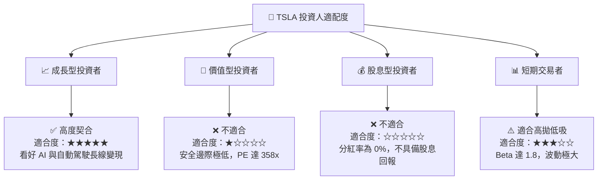

### 10.5 每季財報監控清單（Quarterly Watch List）

為了持續追蹤本投資框架的有效性，機構投資人應在每季財報公佈時重點審查以下指標是否觸發預警門檻：

| 監控指標 | 基準值 (當前) | 觸發加碼門檻 | 觸發減碼/停損門檻 | 監控核心目的 |
|----------|--------------|--------------|------------------|--------------|
| **汽車業務毛利率 (扣除 Credits)** | ~16.5% | > 19.0% 🟢 | < 14.0% 🔴 | 評估核心造血能力是否在價格戰中企穩 |
| **監管碳信用額度佔營業利益比重** | 43% | < 20% 🟢 (說明主業強) | > 60% 🔴 (說明主業極差) | 評估獲利含金量與可持續性 |
| **季度研發費用 (R&D) 佔營收比** | 8.7% | < 6.0% 🟢 (研發效率提升) | > 12.0% 🔴 (AI 投資失控) | 監控研發支出是否造成過度營業槓桿負效應 |
| **自由現金流 (FCF)** | $1.44B (Q1'26) | > $3.00B 🟢 | 轉為負值 (< $0) 🔴 | 確保高資本支出下，財務安全邊際不被蠶食 |
| **稀釋後總股數 YoY 增速** | +0.76% | < 0.2% 🟢 (停止稀釋) | > 2.0% 🔴 (SBC 稀釋失控) | 監控股東權益是否被過度的股權激勵稀釋 |

### 10.6 反面論證：什麼會證明論點錯誤（What Would Change My Mind）

本報告的「持有」評級與基準目標價 $425.24 建立在「汽車業務利潤率在 2026 年底見底、且 AI 業務持續推進」的假設之上。若發生以下可量化事件，本投資論點將宣告失效，投資人應果斷進行資產重組或止損：

```
╔══════════════════════════════════════════════════════════════════╗
║              ⚠️ 論點失效條件（Disconfirming Evidence）           ║
╠══════════════════════════════════════════════════════════════════╣
║  本投資論點在下列情況成立時應重新檢視或退出：                    ║
║                                                                  ║
║  ☐ 核心汽車業務毛利率（GAAP）連續兩季低於 15.0%                  ║
║  ☐ 自由現金流（FCF）連續兩季轉為淨流出（<$0）                    ║
║  ☐ 稀釋後 EPS（TTM）跌破 $0.80（代表盈利能力全面崩潰）           ║
║  ☐ 2027 年底前，未有任何一家傳統 OEM 廠商宣佈簽署 FSD 授權協議    ║
║  ☐ 由於 AI 晶片採購受限或演算法瓶頸，Robotaxi 商業化落地延遲至   ║
║     2029 年以後                                                  ║
║  ☐ ROIC 跌破 5.0%，導致與 WACC（13.1%）的缺口進一步擴大          ║
║                                                                  ║
╚══════════════════════════════════════════════════════════════════╝
```

---

> **免責聲明**：本報告為基於公開財務數據之機構級學術研究與估值建模，僅供研究參考，不構成任何買賣之投資建議。投資有風險，入市需謹慎。