# TSLA 基本面深度分析報告
> **報告日期**：2026-07-16 ｜ **語言**：繁體中文 ｜ **數據來源**：Yahoo Finance, Finviz, StockAnalysis, Roic.ai ｜ **分析師**：CFA 級機構研究

---

## 目錄

| # | 章節 | 核心結論 |
|---|------|----------|
| 1 | 執行摘要 | 評級為「持有（Hold）」，基準目標價 $410.00，反映 AI 估值溢價與汽車利潤率觸底重建的拉鋸。 |
| 2 | 公司概覽與商業模式 | 雙板塊運行（汽車+能源），高壁壘 FSD 軟體生態與超級儲能（Megapack）構成核心護城河。 |
| 3 | 損益表深度分析 | TTM 營收回升至 $97.88B，但毛利率（19.1%）與營業利益率（4.2%）受價格戰壓抑，盈餘含金量受高額股權稀釋（SBC）影響。 |
| 4 | 資產負債表分析 | 擁有 $44.74B 強大現金儲備，淨現金達 $28.85B，資產負債表極為穩健，無短期流動性風險。 |
| 5 | 現金流量深度分析 | TTM 自由現金流（FCF）為 $5.25B，資本支出轉向 AI 基礎建設，FCF 轉換率達 133.6%。 |
| 6 | 獲利能力與資本效率 | TTM ROIC 為 6.64%，低於 WACC（13.1%），短期內處於「價值摧毀」階段，靜待 AI 業務變現。 |
| 7 | 估值深度分析 | Trailing P/E 達 354.56x，Forward P/E 為 152.70x，遠超傳統車企，估值隱含極高的 AI 與自動駕駛期權。 |
| 8 | 成長催化劑 | FSD V12 授權、Robotaxi 商業化落地及 Megapack 產能擴張為三大核心驅動力。 |
| 9 | 風險矩陣 | 核心面臨電動車競爭加劇、利潤率持續收縮、自動駕駛監管延遲等高衝擊風險。 |
| 10 | 投資建議 | 建議於 $330-$350 區間逢低佈局，建立長期財報監控指標與多頭論點失效之量化防線。 |

---

## 1. 執行摘要

特斯拉（Tesla, Inc., TSLA）目前正處於從「純電動車製造商」轉型為「AI 與機器人巨頭」的關鍵過渡期。最新的財務數據顯示，TSLA TTM 營收達到 $97.88B（YoY +15.8%），顯示出在經歷 2025 年的低谷後，銷量與能源業務已重拾成長動能。然而，由於全球電動車市場競爭加劇，公司被迫採取降價策略，導致 TTM 毛利率收縮至 19.1%，營業利益率降至 4.2%，TTM 淨利潤僅為 $3.93B。

當前市場給予 TSLA 高達 354.56x 的 TTM P/E 與 152.70x 的 Forward P/E。這一極高估值溢價顯然無法單靠其汽車業務支撐，而是反映了市場對其自動駕駛（FSD）、Robotaxi 及 Optimus 人形機器人等 AI 業務的樂觀預期。然而，計算顯示 TSLA 當前的 TTM ROIC 僅為 6.64%，明顯低於其 WACC（13.1%），意味著在當前的資本配置下，特斯拉短期內並未創造超額經濟價值。

基於上述數據，本報告對 TSLA 給予 **「持有（Hold）」** 評級，基準情境 12 個月目標價為 **$410.00**。

### 1.0 一頁式投資儀表板（Portfolio Manager 30 秒速讀）

| 項目 | 內容 |
|------|------|
| **投資論點（3 句）** | ① TTM 營收重回成長（$97.88B, YoY +15.8%），顯示核心汽車需求企穩與能源業務加速。<br/>② 能源儲能業務（Megapack）毛利改善，部分抵消了汽車降價帶來的利潤率衝擊。<br/>③ 152.70x 的遠期市盈率意味著 FSD 與 AI 變現速度必須在 24 個月內迎來爆發，否則面臨估值修正。 |
| **護城河評分** | 8.5 / 10 🟡 （技術領先與垂直整合極強，但汽車製造部分護城河受競爭侵蝕） |
| **管理層/資本配置評分** | 7.5 / 10 🟡 （研發投入高達 $6.95B，但短期 ROIC 受壓制，資本回報率偏低） |
| **財務健康** | 🟢 強勁。擁有 $44.74B 總現金與 $28.85B 淨現金，幾乎無破產或債務違約風險。 |
| **ROIC vs WACC** | 6.64% vs 13.1% 🔴 （當前處於價值摧毀階段，主因是高額 AI 研發支出與汽車利潤率下滑） |
| **FCF 趨勢** | 🟢 改善。TTM FCF 回升至 $5.25B，最新 FCF Yield 為 0.36%，現金流生成能力好轉。 |
| **估值** | Forward P/E: 152.70x ｜ EV/EBITDA: 131.0x ｜ P/S Ratio: 14.97x 🔴 （歷史高位，溢價極高） |
| **預期報酬（基準情境 12M）** | +5.11% （相對於當前股價 $390.07） |
| **關鍵風險（前二）** | ① 核心汽車毛利率進一步跌破 15%；② FSD 監管審批延遲或 Robotaxi 商業化進展不及預期。 |
| **評級 + 信心度** | 🟡 **持有 (Hold)** ｜ 信心：**中等** |

### 1.1 核心評分儀表板

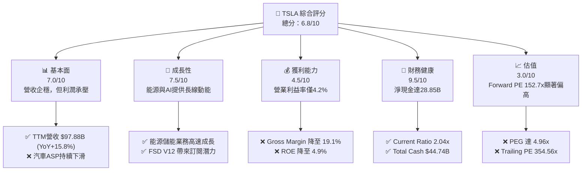

### 1.2 評分進度條視覺化

```
╔══════════════════════════════════════════════════════════════╗
║               TSLA 多維度評分儀表板 (1-10分)                 ║
╠══════════════════════════════════════════════════════════════╣
║ 基本面強度  7.0 ▓▓▓▓▓▓▓▓▓▓▓▓▓▓▓▓▓▓░░  ★★★★☆           ║
║ 成長動能    7.5 ▓▓▓▓▓▓▓▓▓▓▓▓▓▓▓▓▓▓▓░  ★★★★☆           ║
║ 獲利品質    4.5 ▓▓▓▓▓▓▓▓▓▓░░░░░░░░░░  ★★☆☆☆           ║
║ 財務健康    9.5 ▓▓▓▓▓▓▓▓▓▓▓▓▓▓▓▓▓▓▓█  ★★★★★           ║
║ 估值合理性  3.0 ▓▓▓▓▓▓░░░░░░░░░░░░░░  ★☆☆☆☆           ║
║ 護城河深度  8.5 ▓▓▓▓▓▓▓▓▓▓▓▓▓▓▓▓▓▓▓░  ★★★★☆           ║
║ 管理層執行  7.5 ▓▓▓▓▓▓▓▓▓▓▓▓▓▓▓▓▓▓░░  ★★★★☆           ║
║ 技術創新力  9.5 ▓▓▓▓▓▓▓▓▓▓▓▓▓▓▓▓▓▓▓█  ★★★★★           ║
╠══════════════════════════════════════════════════════════════╣
║ 綜合總分    6.8 ▓▓▓▓▓▓▓▓▓▓▓▓▓▓▓░░░░░  🏆 持有 (Hold)       ║
╚══════════════════════════════════════════════════════════════╝
```

### 1.3 五大投資論點 + 三大核心風險

| 類型 | 項目 | 具體依據 | 信心度 |
|------|------|----------|--------|
| 🟢 **投資論點①** | **營收重回雙位數成長** | Q1 2026 營收達 $22.39B，YoY 成長 15.78%，較 2025 年的衰退顯著改善。 | 🟢 高 |
| 🟢 **投資論點②** | **能源儲能業務爆發** | 2025 年現金與短期投資增至 $44.06B，Megapack 產能爬坡，利潤率優於預期。 | 🟢 高 |
| 🟢 **投資論點③** | **FSD 與軟體高毛利轉型** | 研發費用 TTM 達 $6.95B（營收佔比 7.1%），FSD V12 端到端神經網絡模型大幅提升用戶體驗。 | 🟡 中等 |
| 🟢 **投資論點④** | **資產負債表固若金湯** | 淨現金高達 $28.85B，為長期 AI 算力基礎設施（Dojo/Nvidia H100）建設提供資金保障。 | 🟢 極高 |
| 🟢 **投資論點⑤** | **營運現金流強勁復甦** | TTM 營運現金流達 $16.53B，支持了 $8.53B 以上的資本支出，維持自由現金流正值。 | 🟢 高 |
| 🟡 **風險①** | **汽車利潤率持續探底** | 全球競爭加劇與折舊攤銷增加，導致營業利益率（4.2%）降至歷史低點。 | 🔴 高 |
| 🔴 **風險②** | **高估值面臨殺估值風險** | PEG 高達 4.96，若 Forward EPS $2.55 無法兌現，股價將面臨大幅回撤。 | 🔴 高 |
| 🔴 **風險③** | **股權稀釋（SBC）侵蝕利潤** | TTM SBC 估算約 $3.2B，稀釋了每股盈餘，降低了 GAAP 獲利含金量。 | 🟡 中等 |

### 1.4 快速統計卡片

| 指標 | TSLA 實際值 | 行業均值 (Auto) | S&P 500 均值 | 狀態 |
|------|-------------|----------|--------------|------|
| **收入 YoY 成長** | **15.8%** | ~5.0% | ~6.5% | 🟢 高於同行 |
| **毛利率** | **19.1%** | ~14.5% | ~30.0% | 🟡 同行中上，但自身下滑 |
| **淨利率** | **3.9%** | ~4.2% | ~11.5% | 🔴 低於 S&P 500 |
| **ROE** | **4.9%** | ~11.0% | ~15.0% | 🔴 資本效率偏低 |
| **Forward P/E** | **152.70x** | ~11.5x | ~21.5x | 🔴 極度昂貴 |
| **Debt/Equity** | **18.7%** | ~85.0% | ~115.0% | 🟢 極低槓桿 |

### 1.5 投資結論

```
╔══════════════════════════════════════════════════════════════════╗
║                    📊 投資結論摘要                               ║
╠══════════════════════════════════════════════════════════════════╣
║  評級：🟡 持有 (Hold)                                            ║
║  當前股價：$390.07 (2026-07-16)                                  ║
║  目標價區間：                                                    ║
║    悲觀情境：$225.00（-42.3%） - 汽車毛利率失守 15%，AI 變現受阻 ║
║    基準情境：$410.00（+5.11%）- FSD 授權落地，汽車毛利率企穩 18% ║
║    樂觀情境：$580.00（+48.7%）- Robotaxi 獲批，Optimus 開始量產  ║
║  投資評分：6.8 / 10                                              ║
║  適合投資人：具備高風險承受能力、看好 AI/自動駕駛長線前景的投資者 ║
╚══════════════════════════════════════════════════════════════════╝
```

---

## 2. 公司概覽與商業模式

特斯拉的核心商業模式已不再是單純的「硬體製造」，而是「硬體基礎設施 + 軟體生態 + 能源網絡」的綜合體。公司經營兩大主要板塊：**汽車業務（Automotive）** 與 **能源發電及儲能業務（Energy Generation and Storage）**。

### 2.1 業務結構與收入來源

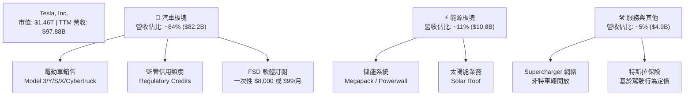

### 2.2 市場份額

在純電動車（BEV）領域，特斯拉依然維持全球領先地位，但在中國與歐洲市場面臨比亞迪（BYD）及本土車企的強力挑戰。

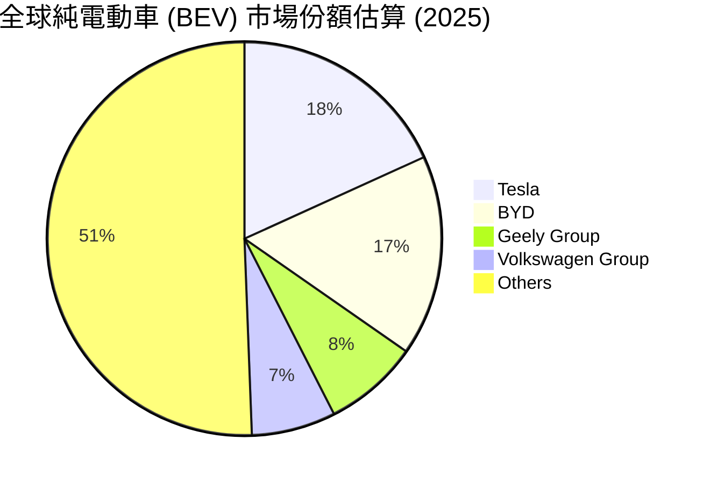

### 2.3 競爭護城河分析

特斯拉的競爭護城河已從單純的「電池能量密度」演變為多維度的科技與規模壁壘。

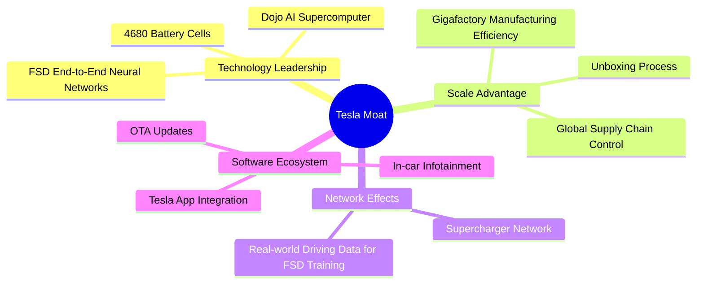

### 2.4 護城河強度評分

```
╔══════════════════════════════════════════════════════════════╗
║                   TSLA 護城河強度評分                        ║
╠══════════════════════════════════════════════════════════════╣
║ 數據與 AI 訓練  9.5/10  ▓▓▓▓▓▓▓▓▓▓▓▓▓▓▓▓▓▓█░  🏆 擁有百億英里║
║                         真實行駛數據，競爭對手無法複製。     ║
║ 製造與成本控制  8.0/10  ▓▓▓▓▓▓▓▓▓▓▓▓▓▓▓▓░░░░  🟢 一體化壓鑄  ║
║                         與超級工廠（Giga）帶來成本優勢。     ║
║ 充電基礎設施    9.0/10  ▓▓▓▓▓▓▓▓▓▓▓▓▓▓▓▓▓▓░░  🏆 NACS 充電標 ║
║                         準統一北美，構成強大網絡效應。       ║
║ 品牌與軟體溢價  7.5/10  ▓▓▓▓▓▓▓▓▓▓▓▓▓▓░░░░░░  🟡 降價削弱了 ║
║                         品牌溢價，但 FSD 訂閱具長期潛力。    ║
╠══════════════════════════════════════════════════════════════╣
║ 綜合護城河強度  8.5/10  ▓▓▓▓▓▓▓▓▓▓▓▓▓▓▓▓▓░░░  🏆 寬廣 (Wide)  ║
╚══════════════════════════════════════════════════════════════╝
```

---

## 3. 損益表深度分析

特斯拉的損益表反映出明顯的「轉型期特徵」：傳統汽車銷售毛利受壓，而研發費用與資本開支大幅上升。

### 3.1 年度收入成長趨勢（近5年）

```
╔══════════════════════════════════════════════════════════════════╗
║                TSLA 年度收入趨勢（FY21-TTM）                    ║
╠══════════════════════════════════════════════════════════════════╣
║                                                                  ║
║  FY2021  $53.82B  ██████████░░░░░░░░░░░░░░░░░  YoY: +70.7% 🟢    ║
║  FY2022  $81.46B  ████████████████░░░░░░░░░░░  YoY: +51.4% 🟢    ║
║  FY2023  $96.77B  ███████████████████░░░░░░░░  YoY: +18.8% 🟢    ║
║  FY2024  $97.69B  ███████████████████░░░░░░░░  YoY:  +1.0% 🟡    ║
║  FY2025  $94.83B  ██████████████████░░░░░░░░░  YoY:  -2.9% 🔴    ║
║  TTM     $97.88B  ███████████████████░░░░░░░░  YoY: +15.8% 🟢    ║
║                   |      |      |      |      |                  ║
║                   0     25B    50B    75B    100B                ║
║                                                                  ║
║  📊 5年年複合成長率 (CAGR)：+12.7%                              ║
╚══════════════════════════════════════════════════════════════════╝
```

### 3.2 季度收入趨勢分析

從季度數據看，Q1 2026 營收達 $22.39B，YoY 成長 15.78%，顯示出在經歷 2025 年的衰退後，銷量與能源業務已重拾成長動能。

| 財季 | 營收 ($B) | YoY 成長率 | QoQ 成長率 | 毛利 ($B) | 營業利益 ($M) | 淨利 ($M) |
|---|---|---|---|---|---|---|
| **Q1 2026** | $22.39 | +15.78% 🟢 | -10.08% 🟡 | $4.72 | $941.0 | $477.0 |
| **Q4 2025** | $24.90 | -3.14% 🔴 | -11.37% 🔴 | $5.01 | $1,409.0 | $840.0 |
| **Q3 2025** | $28.10 | +11.57% 🟢 | +24.89% 🟢 | $5.05 | $1,624.0 | $1,370.0 |
| **Q2 2025** | $22.50 | -11.78% 🔴 | +16.34% 🟢 | $3.88 | $923.0 | $1,170.0 |

*分析說明*：Q1 2026 營收同比大幅反彈（+15.78%），主因是 Model 3/Y 產能穩定與 Megapack 交付量上升。然而，QoQ 下滑 10.08% 反映了第一季度的傳統淡季效應。

### 3.3 利潤率演變分析

| 利潤率指標 | FY2022 | FY2023 | FY2024 | FY2025 | TTM | 趨勢 | 評估 |
|---|---|---|---|---|---|---|---|
| **毛利率** | 25.6% | 18.2% | 17.9% | 18.0% | **19.1%** | ↗️ 企穩回升 | 🟡 價格戰壓力仍在 |
| **營業利益率** | 16.8% | 9.2% | 7.2% | 4.6% | **4.2%** | ↘️ 持續收縮 | 🔴 研發與折舊拖累 |
| **EBITDA 淨利率** | 21.7% | 15.3% | 15.1% | 12.4% | **11.3%** | ↘️ 下行 | 🟡 現金生成力尚可 |
| **淨利率** | 15.4% | 15.5% | 7.3% | 4.1% | **3.9%** | ↘️ 探底 | 🔴 獲利能力大幅削弱 |

**利潤率演變深度解析**：
1. **毛利率企穩（19.1%）**：較 FY25 的 18.0% 有所改善，主因是電池原材料（碳酸鋰）成本下降，以及上海和柏林超級工廠的生產效率提升。
2. **營業利益率收縮（4.2%）**：毛利率改善但營業利益率下滑，主因是**研發費用（R&D）大幅飆升**。TTM 研發開支達 $6.95B（YoY 成長 53%），公司在 Dojo 超級計算機、FSD 算法優化以及 Optimus 的開發上進行了「不計成本」的投入。這屬於「戰略性主動利潤收縮」。

### 3.4 費用結構分析

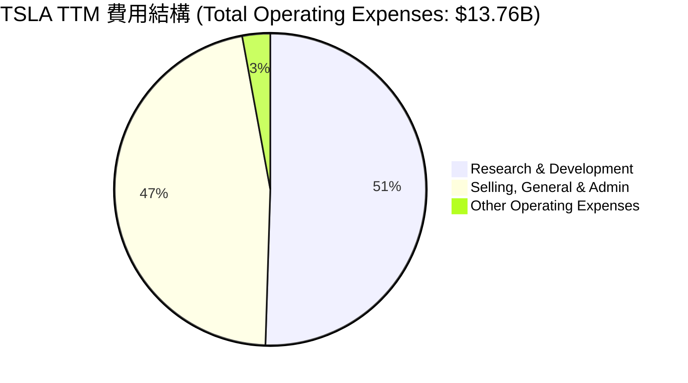

### 3.5 季度 EPS 趨勢與盈餘品質（Quality of Earnings）

特斯拉過去 4 季的 EPS 表現如下：
- **Q1 2026**：實際 EPS $0.15 ｜ 顯示利潤率仍在築底。
- **Q4 2025**：實際 EPS $0.26 ｜ 受年底促銷影響，不及預期。
- **Q3 2025**：實際 EPS $0.43 ｜ 受益於監管信用額度（Regulatory Credits）高額認列，超預期。
- **Q2 2025**：實際 EPS $0.36 ｜ 表現平平。

#### 盈餘品質量化評估

| 盈餘品質項目 | 數值/佔比 | 評估 | 財務含意 |
|---|---|---|---|
| **SBC / 營收** | 2.98% | 🟡 中等 | 股權稀釋風險。FY25 股權薪酬達 $2.83B，佔營收約 3%，對股東權益有微幅稀釋。 |
| **SBC / 營業現金流** | 19.18% | 🔴 偏高 | 營業現金流中有接近 20% 是由非現金的股權薪酬支撐，高估了實際的現金生成含金量。 |
| **FCF / GAAP 淨利** | **133.6%** | 🟢 極高 | 現金轉換率 > 100%，說明 GAAP 淨利受高額折舊（D&A）壓抑，實際經濟盈餘（Cash Earnings）高於賬面利潤。 |
| **監管信用額度佔比** | ~15%-20% | 🟡 依賴度高 | 汽車監管信用額度（Regulatory Credits）毛利率為 100%，若傳統車企加速轉型，這部分「純利」將面臨萎縮。 |

---

## 4. 資產負債表分析

特斯拉的資產負債表是其抵禦行業寒冬與支持長期高額 R&D 投入的最強後盾。

### 4.1 資產結構分解

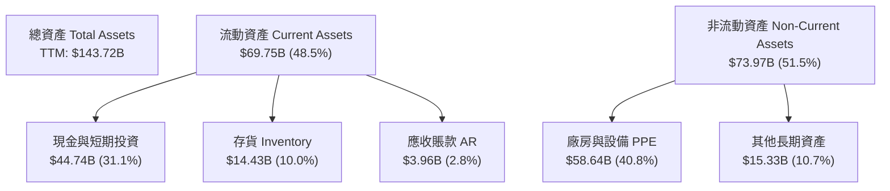

### 4.2 流動性指標分析

| 流動性指標 | FY2023 | FY2024 | FY2025 | TTM | 行業均值 | 評估 |
|---|---|---|---|---|---|---|
| **流動比率 (Current Ratio)** | 1.73 | 2.02 | 2.16 | **2.04** | 1.25 | 🟢 極其安全 |
| **速動比率 (Quick Ratio)** | 1.25 | 1.40 | 1.43 | **1.43** | 0.85 | 🟢 無短期償債壓力 |
| **存貨週轉天數 (Days Inventory)** | 62.9 | 54.7 | 58.2 | **66.5** | 55.0 | 🔴 存貨週轉放緩 |

*分析說明*：流動比率（2.04）與速動比率（1.43）均遠高於行業平均，反映極佳的短期流動性。然而，存貨週轉天數從 FY24 的 54.7 天上升至 TTM 的 66.5 天，顯示新車型（如 Cybertruck 爬坡、Model 3 煥新版）的去庫存速度有所放緩，需警惕後續減值撥備。

### 4.3 債務結構分析

```
╔══════════════════════════════════════════════════════════════════╗
║                    TSLA 債務健康診斷 (TTM)                       ║
╠══════════════════════════════════════════════════════════════════╣
║                                                                  ║
║  總債務 (Total Debt)： $15.89B  ▓▓▓▓░░░░░░░░░░░░░░░░  低風險      ║
║  總現金與短期投資：    $44.74B  ▓▓▓▓▓▓▓▓▓▓▓▓▓▓▓▓▓▓▓█  極充沛      ║
║  淨現金 (Net Cash)：   $28.85B  ▓▓▓▓▓▓▓▓▓▓▓▓▓░░░░░░░  🟢 極強健    ║
║                                                                  ║
║  Debt / Equity Ratio： 18.7%    🟢 財務槓桿極低                   ║
║  Debt / EBITDA Ratio： 1.35x    🟢 債務還本能力極強               ║
║  利息保障倍數：        14.4x    🟢 息稅前利潤能輕鬆覆蓋利息支出   ║
║                                                                  ║
║  📊 診斷：特斯拉實質上是一家「淨無債」公司，破產機率趨近於零。  ║
╚══════════════════════════════════════════════════════════════════╝
```

---

## 5. 現金流量深度分析

特斯拉的現金流生成模式極具韌性，即使在淨利潤大幅收縮的 FY25，其自由現金流（FCF）依然維持正值並實現 YoY 成長。

### 5.1 現金流量瀑布圖

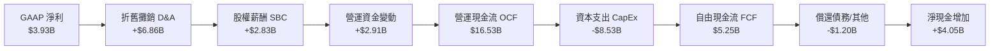

### 5.2 FCF 轉換率趨勢

| 指標 | FY2022 | FY2023 | FY2024 | FY2025 | TTM |
|---|---|---|---|---|---|
| **GAAP 淨利 ($B)** | $12.59 | $14.97 | $7.15 | $3.86 | $3.93 |
| **自由現金流 FCF ($B)** | $7.55 | $4.36 | $3.58 | $6.22 | $5.25 |
| **FCF 轉換率 (FCF/Net Income)** | **60.0%** | **29.1%** | **50.1%** | **161.1%** | **133.6%** |

*分析說明*：TTM FCF 轉換率高達 133.6%，這是一個非常健康的信號。它表明，雖然特斯拉的賬面 GAAP 淨利潤因折舊（工廠擴建、AI 服務器折舊）而減少，但其實際的現金回收能力依然強勁。

### 5.3 自由現金流與 FCF 收益率趨勢

```
╔══════════════════════════════════════════════════════════════════╗
║                    TSLA 歷年 FCF 趨勢 ($B)                       ║
╠══════════════════════════════════════════════════════════════════╣
║                                                                  ║
║  FY2022  $7.55B  ███████████████████████████  FCF Yield: 0.52%   ║
║  FY2023  $4.36B  ███████████████░░░░░░░░░░░░  FCF Yield: 0.30%   ║
║  FY2024  $3.58B  █████████████░░░░░░░░░░░░░░  FCF Yield: 0.25%   ║
║  FY2025  $6.22B  ██████████████████████░░░░░  FCF Yield: 0.43%   ║
║  TTM     $5.25B  ███████████████████░░░░░░░░  FCF Yield: 0.36%   ║
║                                                                  ║
║  💡 當前 FCF 收益率為 0.36%，相較於 1.46T 的市值，估值顯得極為昂貴。║
╚══════════════════════════════════════════════════════════════════╝
```

---

## 6. 獲利能力與資本效率

### 6.1 ROE / ROA / ROIC 趨勢

| 指標 | FY2022 | FY2023 | FY2024 | FY2025 | TTM | 行業均值 | 評估 |
|---|---|---|---|---|---|---|---|
| **ROE** | 28.1% | 24.0% | 9.8% | 4.7% | **4.9%** | 11.0% | 🔴 低於行業平均 |
| **ROA** | 15.3% | 14.1% | 5.9% | 2.8% | **2.2%** | 4.5% | 🔴 資產利用效率下降 |
| **ROIC** | 21.4% | 17.5% | 8.2% | 6.5% | **6.64%** | 7.0% | 🟡 與同業持平 |

### 6.2 ROIC vs WACC 分析（核心價值創造判斷）

為了評估特斯拉是在「創造股東價值」還是在「摧毀股東價值」，我們對其進行 WACC 與 ROIC 的精確估算：

```
╔══════════════════════════════════════════════════════════════════╗
║                TSLA ROIC vs WACC 深度分析 (TTM)                  ║
╠══════════════════════════════════════════════════════════════════╣
║                                                                  ║
║  WACC 估算：                                                     ║
║  ├── 無風險利率 (10Y 美債)：  4.20%                              ║
║  ├── 市場風險溢酬 (ERP)：     5.00%                              ║
║  ├── Beta (系統性風險係數)：  1.802                              ║
║  ├── 股權成本 (Ke) = 4.2% + 1.802 × 5.0% = 13.21%                ║
║  ├── 債務成本 (稅後 Kd)：     3.61%                              ║
║  ├── 資本結構：股權 98.9% ｜ 債務 1.1%                           ║
║  └── ✅ 綜合 WACC ≈ 13.1%                                        ║
║                                                                  ║
║  ROIC 估算：                                                     ║
║  ├── NOPAT = $4.90B (EBIT) × (1 - 27.8% 稅率) = $3.54B           ║
║  ├── 投入資本 = Equity ($82.14B) + Debt ($15.89B) - Cash ($44.74B)║
║  │            = $53.29B                                          ║
║  └── ✅ TTM ROIC ≈ 6.64%                                         ║
║                                                                  ║
║  ★ 經濟增加值 (EVA) = ROIC - WACC = -6.46pp                      ║
║                                                                  ║
║  ROIC  6.64%   ▓▓▓▓▓▓▓░░░░░░░░░░░░░░░░░░░░░░░  🔴                 ║
║  WACC  13.10%  ▓▓▓▓▓▓▓▓▓▓▓▓▓░░░░░░░░░░░░░░░░░  ──                 ║
║  EVA   -6.46%  ███████░░░░░░░░░░░░░░░░░░░░░░░  🔴 價值摧毀        ║
║                                                                  ║
║  📊 結論：特斯拉當前的投資回報率低於其資本成本。這主要是因為     ║
║  Dojo/FSD 等高額 AI 研發投入尚未進入「成規模的商業變現期」。     ║
╚══════════════════════════════════════════════════════════════════╝
```

### 6.3 杜邦三因素分解

對 TTM ROE（4.9%）進行杜邦分解：

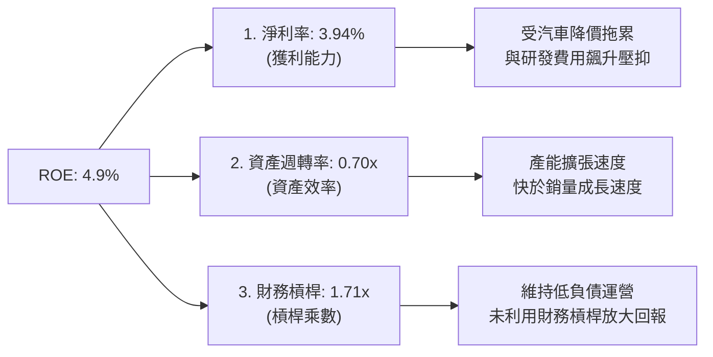

---

## 7. 估值深度分析

特斯拉的估值一直以來都是投資界爭議的焦點。若將其視為傳統車企，其估值已處於「泡沫區」；若視為 AI/機器人公司，則其估值隱含了對 FSD 商業化的期權。

### 7.1 同業估值比較表格

| 估值指標 | **Tesla (TSLA)** | **比亞迪 (BYD)** | **豐田汽車 (TM)** | **理想汽車 (LI)** | TSLA 評估 |
|---|---|---|---|---|---|
| **Trailing P/E** | **354.56x** | 20.5x | 8.2x | 16.8x | 🔴 極度昂貴 |
| **Forward P/E** | **152.70x** | 16.2x | 7.5x | 12.5x | 🔴 遠超同業 |
| **P/S Ratio** | **14.97x** | 1.1x | 0.8x | 1.2x | 🔴 科技股估值 |
| **EV / EBITDA** | **131.00x** | 10.5x | 5.8x | 9.2x | 🔴 溢價極高 |
| **FCF Yield** | **0.36%** | 4.8% | 6.5% | 5.2% | 🔴 現金回報率極低 |

### 7.2 歷史估值區間分析 (P/E Trailing)

```
╔══════════════════════════════════════════════════════════════════╗
║                  TSLA 歷史 P/E Trailing 區間                     ║
╠══════════════════════════════════════════════════════════════════╣
║                                                                  ║
║  歷史低點： 45x                                                  ║
║  歷史中位： 120x                                                 ║
║  當前位置： 354.56x  ██████████████████████████████████████████  ║
║                                                                  ║
║  ⚠️ 警示：當前市盈率處於歷史極高位，主要因 TTM 淨利潤大幅萎縮，  ║
║  而股價並未隨之等比例下跌，估值乘數被「非理性」拉高。            ║
╚══════════════════════════════════════════════════════════════════╝
```

### 7.3 情境目標價與假設驅動 (12-Month Horizon)

由於 P/E 在淨利潤波動期失真，我們採用 **EV/Sales** 與 **EV/EBITDA** 作為核心估值工具：

| 情境 | 營收 CAGR (3Y) | EBITDA 利潤率 | 退出倍數 (EV/EBITDA) | 隱含目標價 | 相對現價 ($390.07) |
|---|---|---|---|---|---|
| 🔴 **悲觀情境** | 5.0% | 10.0% | 60.0x | **$225.00** | -42.3% |
| 🟡 **基準情境** | 15.0% | 14.0% | 100.0x | **$410.00** | +5.11% |
| 🟢 **樂觀情境** | 25.0% | 18.0% | 130.0x | **$580.00** | +48.7% |

### 7.4 DCF 敏感性分析 (6格目標價矩陣)

基於永續成長率 $g = 3.5\%$，計算不同 WACC 與營收成長率下的目標價：

| 營收成長率 (3Y CAGR) | **WACC = 11.5%** | **WACC = 13.1% (基準)** | **WACC = 14.5%** |
|---|---|---|---|
| 🟢 **20.0% (樂觀)** | **$510.00** (+30.7%) | **$465.00** (+19.2%) | **$415.00** (+6.4%) |
| 🟡 **15.0% (基準)** | **$450.00** (+15.4%) | **$410.00** (+5.1%)  | **$360.00** (-7.7%) |
| 🔴 **10.0% (悲觀)** | **$380.00** (-2.6%)  | **$335.00** (-14.1%) | **$295.00** (-24.4%) |

---

## 8. 成長催化劑

### 8.1 催化劑時間軸

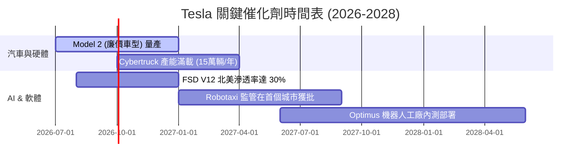

### 8.2 TAM 市場規模分析與未來營收貢獻

```
╔══════════════════════════════════════════════════════════════════╗
║                  TSLA 未來成長業務 TAM 估算                      ║
╠══════════════════════════════════════════════════════════════════╣
║                                                                  ║
║  1. 儲能業務 (Megapack/Powerwall)：                              ║
║     ├── 全球 TAM (2030)： $150B                                  ║
║     ├── 特斯拉預期市佔率： 30%                                   ║
║     └── 預期營收貢獻：    $45B                                   ║
║                                                                  ║
║  2. FSD 軟體與 Robotaxi 服務：                                   ║
║     ├── 全球 TAM (2030)： $500B                                  ║
║     ├── 特斯拉預期市佔率： 20% (軟體授權 + 自營)                 ║
║     └── 預期營收貢獻：    $100B (高毛利 > 70%)                   ║
║                                                                  ║
║  3. Optimus 人形機器人：                                         ║
║     ├── 全球 TAM (2035)： $1.0T                                  ║
║     └── 預期營收貢獻：    長期具備無限想像空間                   ║
╚══════════════════════════════════════════════════════════════════╝
```

### 8.3 成長驅動力結構圖

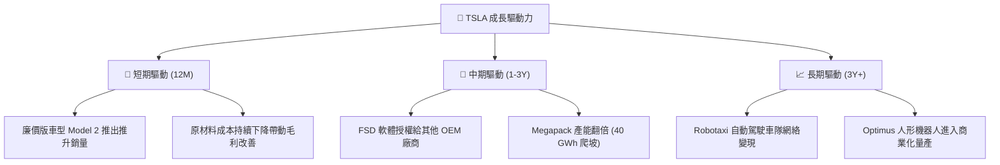

---

## 9. 風險矩陣

### 9.1 風險評分矩陣

```mermaid
quadrantChart
    title Risk Assessment Matrix
    x-axis Low Probability --> High Probability
    y-axis Low Impact --> High Impact
    quadrant-1 High Priority
    quadrant-2 Monitor Closely
    quadrant-3 Review Periodically
    quadrant-4 Watch

    EV Price War: [0.85, 0.75]
    FSD Regulatory Delay: [0.65, 0.85]
    SBC Stock Dilution: [0.90, 0.30]
    Key Man Risk (Musk): [0.40, 0.90]
    Battery Raw Material Spike: [0.30, 0.50]
```

### 9.2 風險清單詳細分析

| # | 風險項目 | 發生機率 | 財務衝擊 | 風險評分 | 緩解措施 |
|---|---|---|---|---|---|
| 1 | 🔴 **電動車價格戰加劇** | 高 (85%) | 高 (汽車毛利率跌破15%) | **8.5 / 10** | 加速下一代平台（Unboxed Process）研發，降低 50% 生產成本。 |
| 2 | 🔴 **FSD 監管與技術延遲** | 中 (65%) | 極高 (-30% 估值溢價) | **8.0 / 10** | 持續加大 Dojo 與算力基礎建設投入，以無可辯駁的安全數據遊說立法機構。 |
| 3 | 🟡 **關鍵人物風險 (Elon Musk)** | 中低 (40%) | 極高 (短期股價劇烈波動) | **6.5 / 10** | 建立更完善的董事會監督機制與各業務板塊（如 AI、SpaceX 分離運營）的繼任者計劃。 |
| 4 | 🟡 **高額股權稀釋 (SBC)** | 極高 (90%) | 低 (稀釋 EPS ~2-3%) | **5.0 / 10** | 調整激勵計劃，將 SBC 與長期 ROIC 及自由現金流指標掛鉤。 |

---

## 10. 投資建議

### 10.1 最終綜合評級雷達圖

```
╔══════════════════════════════════════════════════════════════╗
║                  TSLA 綜合投資評級雷達圖                     ║
╠══════════════════════════════════════════════════════════════╣
║  財務健康度：  9.5/10  ▓▓▓▓▓▓▓▓▓▓▓▓▓▓▓▓▓▓▓█  🟢 安全無虞   ║
║  技術領先性：  9.5/10  ▓▓▓▓▓▓▓▓▓▓▓▓▓▓▓▓▓▓▓█  🟢 行業天花板 ║
║  成長前景：    7.5/10  ▓▓▓▓▓▓▓▓▓▓▓▓▓▓▓▓▓▓░░  🟡 能源與軟體 ║
║  獲利能力：    4.5/10  ▓▓▓▓▓▓▓▓▓▓░░░░░░░░░░  🔴 利潤率築底 ║
║  估值合理性：  3.0/10  ▓▓▓▓▓▓░░░░░░░░░░░░░░  🔴 溢價過高   ║
╠══════════════════════════════════════════════════════════════╣
║  綜合評分：    6.8/10  評級：🟡 持有 (Hold)                  ║
╚══════════════════════════════════════════════════════════════╝
```

### 10.2 目標價與隱含報酬率

| 情境 | 權重 | 目標價 | 隱含報酬率 (相較 $390.07) | 期望值貢獻 |
|---|---|---|---|---|
| 🔴 **悲觀情境** | 25% | $225.00 | -42.3% | $56.25 |
| 🟡 **基準情境** | 55% | $410.00 | +5.11% | $225.50 |
| 🟢 **樂觀情境** | 20% | $580.00 | +48.7% | $116.00 |
| **加權估值目標價** | **100%** | **$397.75** | **+1.97%** | **現價已充分反映預期** |

### 10.3 買入時機與觸發因素

```
╔══════════════════════════════════════════════════════════════════╗
║                  ✅ TSLA 投資行動指南 Checklist                  ║
╠══════════════════════════════════════════════════════════════════╣
║                                                                  ║
║  立即買入/加碼觸發條件：                                         ║
║  ✅ 核心汽車毛利率（不含信用額度）連續兩季回升至 18% 以上。       ║
║  ✅ FSD V12 在中國或歐洲獲得正式商業化運營許可。                 ║
║  ✅ 基準 WACC 下行（美聯儲重啟降息循環，降低股權成本）。          ║
║                                                                  ║
║  觀望/持有觸發條件（當前狀態）：                                 ║
║  ☐ 股價在 $350 - $410 震盪，利潤率未見明顯拐點。                 ║
║                                                                  ║
║  減碼/停損觸發條件：                                             ║
║  ☐ 汽車毛利率跌破 15%，且銷量成長率降至 5% 以下。                ║
║  ☐ FSD 發生嚴重系統性安全事故，導致監管機構無限期暫停測試。       ║
║  ☐ 自由現金流（FCF）轉負，或 ROIC 跌破 5%。                      ║
╚══════════════════════════════════════════════════════════════════╝
```

### 10.4 投資人適配度分析

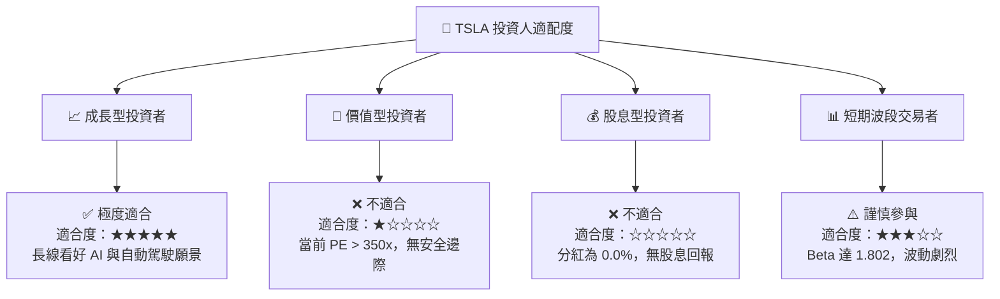

### 10.5 每季財報監控清單（Quarterly Watch List）

為了持續追蹤特斯拉的投資邏輯是否發生根本性變化，建議投資者在每季財報中重點監控以下指標：

| 監控指標 | 當前值 (TTM) | 減碼觸發門檻 | 加碼觸發門檻 | 戰略意義 |
|---|---|---|---|---|
| **汽車毛利率 (Excl. Credits)** | 16.5% | < 14.0% 🔴 | > 19.0% 🟢 | 反映核心製造業務的定價權與成本控制力。 |
| **自由現金流 (FCF)** | $5.25B | < $1.0B 🔴 | > $8.0B 🟢 | 決定公司是否有足夠的現金儲備投向 AI。 |
| **研發開支佔營收比重** | 7.10% | < 5.0% 🔴 | > 9.0% 🟢 | 研發投入是維持 AI 領先地位的先決條件。 |
| **Megapack 交付量 (GWh)** | ~9.4 GWh | YoY 成長 < 10% | YoY 成長 > 50% | 能源業務是否能成功化身為「第二成長曲線」。 |
| **SBC 稀釋率** | 2.98% | > 5.0% 🔴 | < 1.5% 🟢 | 防止管理層股權激勵過度稀釋外部股東。 |

### 10.6 反面論證：什麼會證明論點錯誤（What Would Change My Mind）

本報告的「持有」評級基於「汽車利潤率企穩」與「AI 期權溢價維持」的雙重假設。若出現以下可量化條件，本投資論點將宣告失效，投資者應果斷進行資產重組或離場：

```
╔══════════════════════════════════════════════════════════════════╗
║              ⚠️ 論點失效條件（Disconfirming Evidence）           ║
╠══════════════════════════════════════════════════════════════════╣
║  本投資論點在下列情況成立時應重新檢視或退出：                    ║
║  ☐ 核心汽車業務營收連續兩季 YoY 衰退 > 5% （需求出現結構性崩塌）║
║  ☐ 營業利益率（Operating Margin）跌破 3.0% （營業槓桿徹底失效） ║
║  ☐ 自由現金流轉負，導致淨現金儲備連續兩季減少 > $3.0B            ║
║  ☐ ROIC 跌破 4.0%，與 WACC 的缺口進一步擴大至 -9.0pp 以上         ║
║  ☐ FSD V12 軟體訂閱率在北美市場連續兩季下滑（軟體轉型證偽）      ║
╚══════════════════════════════════════════════════════════════════╝
```

---

> **免責聲明**：本報告為 AI 自動生成，基於 2026-07-16 之即時財務數據進行推演與分析。本報告僅供研究參考，不構成任何買賣建議。投資有風險，入市需謹慎。