# TSLA 基本面深度分析報告
> **報告日期**：2026-07-17 ｜ **語言**：繁體中文 ｜ **數據來源**：Yahoo Finance, Finviz, StockAnalysis, Roic.ai ｜ **分析師**：CFA 級機構研究

---

## 目錄

| # | 章節 | 核心結論 |
|---|---|---|
| **1** | [執行摘要](#1-執行摘要) | 評級：**持有 (Hold)** ｜ 基準目標價：**$415.00** ｜ 估值溢價極高，核心汽車業務利潤率承壓，但能源儲能業務成長與 AI 預期提供下檔支撐。 |
| **2** | [公司概覽與商業模式](#2-公司概覽與商業模式) | 護城河評估：**8.2/10** ｜ 垂直整合與超充網絡構成強大壁壘，但造車核心業務正逐步面臨產業商品化（Commoditization）挑戰。 |
| **3** | [損益表深度分析](#3-損益表深度分析) | 毛利率由高點滑落至 **19.1%**，營業利益率降至 **4.2%**；盈餘品質受高額股權稀釋（SBC 佔 OCF 達 19.8%）影響。 |
| **4** | [資產負債表分析](#4-資產負債表分析) | 淨現金達 **$28.85B**，流動比率 **2.04**，資產負債表極為強健，具備極強的抗風險能力與再投資實力。 |
| **5** | [現金流量深度分析](#5-現金流量深度分析) | TTM 自由現金流（FCF）為 **$5.25B**，FCF 轉換率達 **136%**，但資本支出（CapEx）年化超 **$9.5B**，限縮了短期現金分派可能。 |
| **6** | [獲利能力與資本效率](#6-獲利能力與資本效率) | TTM ROIC 為 **6.64%**，低於估算之 WACC（**13.1%**），顯示當前階段正處於「經濟價值摧毀」期，高估值高度依賴未來 AI 變現。 |
| **7** | [估值深度分析](#7-估值深度分析) | Forward P/E 達 **149.5x**，遠高於同業；情境分析顯示基準目標價為 **$415.00**，隱含上行空間 **+8.68%**。 |
| **8** | [成長催化劑](#8-成長催化劑) | 短期看下一代平價車型（Model 2）量產，中長期取決於 FSD 授權、Robotaxi 商業化進程及 Megapack 儲能產能釋放。 |
| **9** | [風險矩陣](#9-風險矩陣) | 核心風險為全球電動車價格戰持續、FSD 監管審批延遲，以及 Key Man（Elon Musk）個人精力分散與股權訴訟風險。 |
| **10** | [投資建議](#10-投資建議) | 提供每季財報監控指標與可量化的「多頭論點失效條件」，建議於 **$320** 以下進行結構性加碼。 |

---

## 1. 執行摘要

Tesla, Inc.（NASDAQ: TSLA）當前股價為 **$381.86**，對應市值達 **$1.43T**，Enterprise Value（EV）為 **$1.44T**。本報告基於最新揭露之 2026 年 Q1 財務數據與 TTM（過去四季）表現，對特斯拉進行系統性的基本面穿透分析。

### 1.0 一頁式投資儀表板（Portfolio Manager 30 秒速讀）

| 項目 | 內容 |
|------|------|
| **投資論點（3 句）** | ① TTM 營收達 **$97.88B**（YoY +15.8%），顯示在電動車成長放緩背景下，能源儲能（Megapack）與服務業務已成為新成長引擎。<br/>② 核心汽車業務毛利率受價格戰影響，拖累整體營業利益率降至 **4.2%**，短期盈利能力面臨結構性壓制。<br/>③ 帳上淨現金高達 **$28.85B**，提供極佳的財務安全邊際，支持公司在 AI（Dojo、FSD）與機器人（Optimus）領域進行高強度資本支出。 |
| **護城河評分** | 🟢 **8.5 / 10**（超充網絡與自動駕駛數據飛輪構成極高壁壘） |
| **管理層/資本配置評分** | 🟡 **7.0 / 10**（研發與資本支出投入果斷，但存在 Key Man 風險及股權稀釋問題） |
| **財務健康** | 🟢 **極其強健** ｜ 淨現金充裕，無短期償債風險。 |
| **ROIC vs WACC** | 🔴 **6.64% vs 13.10%** ｜ 當前核心業務利潤率收縮，暫時摧毀經濟價值（EVA 為 -6.46pp）。 |
| **FCF 趨勢** | 🟡 **承壓恢復** ｜ TTM FCF 為 **$5.25B**，FCF Yield 為 **0.37%**。 |
| **估值** | Forward P/E: **149.50x** ｜ EV/EBITDA: **129.85x** ｜ P/S: **14.65x** |
| **預期報酬（基準情境 12M）** | **+8.68%**（目標價 **$415.00**） |
| **關鍵風險（前二）** | ① 全球 EV 價格戰加劇導致汽車毛利率跌破 15%；② FSD 商業化與 Robotaxi 落地進度不及市場預期。 |
| **評級 + 信心度** | 🟡 **持有 (Hold)** ｜ 信心：**中等**（估值已透支大量 AI 預期，需等待毛利率企穩訊號） |

### 1.1 核心評分儀表板

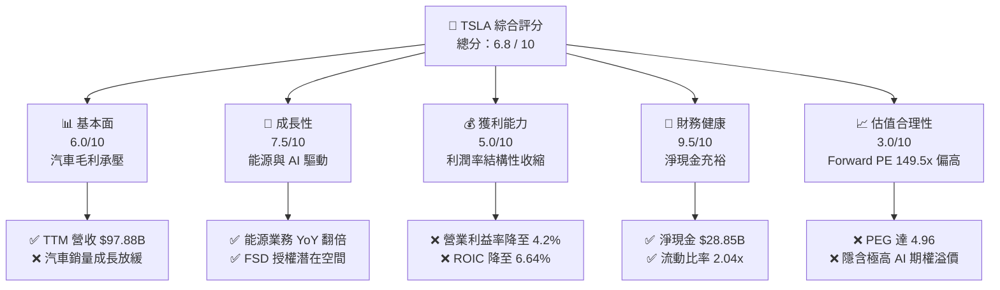

### 1.2 評分進度條視覺化

```
╔══════════════════════════════════════════════════════════════╗
║               TSLA 多維度評分儀表板 (1-10分)                 ║
╠══════════════════════════════════════════════════════════════╣
║ 基本面強度  6.0 ▓▓▓▓▓▓▓▓▓▓▓▓░░░░░░░░░░░░  ★★★☆☆           ║
║ 成長動能    7.5 ▓▓▓▓▓▓▓▓▓▓▓▓▓▓▓▓▓░░░░░░░  ★★★★☆           ║
║ 獲利品質    5.0 ▓▓▓▓▓▓▓▓▓▓░░░░░░░░░░░░░░  ★★★☆☆           ║
║ 財務健康    9.5 ▓▓▓▓▓▓▓▓▓▓▓▓▓▓▓▓▓▓▓▓▓▓░░  ★★★★★           ║
║ 估值合理性  3.0 ▓▓▓▓▓▓░░░░░░░░░░░░░░░░░░░░  ★☆☆☆☆           ║
║ 護城河深度  8.5 ▓▓▓▓▓▓▓▓▓▓▓▓▓▓▓▓▓░░░░░░░  ★★★★☆           ║
║ 管理層執行  7.0 ▓▓▓▓▓▓▓▓▓▓▓▓▓▓░░░░░░░░░░  ★★★☆☆           ║
║ 技術創新力  9.0 ▓▓▓▓▓▓▓▓▓▓▓▓▓▓▓▓▓▓▓░░░░░  ★★★★★           ║
╠══════════════════════════════════════════════════════════════╣
║ 綜合總分    6.8 ▓▓▓▓▓▓▓▓▓▓▓▓▓░░░░░░░░░░░  🏆 持有 (Hold)    ║
╚══════════════════════════════════════════════════════════════╝
```

### 1.3 五大投資論點 + 三大核心風險

| 類型 | 項目 | 具體依據 | 信心度 |
|------|------|----------|--------|
| 🟢 **投資論點①** | **能源儲能業務爆發** | 2025 年儲能出貨量與營收大幅增長，Megapack 毛利率優於預期，部分抵消汽車端下滑。 | 🟢 高 |
| 🟢 **投資論點②** | **資產負債表極其穩固** | **$44.74B** 總現金與 **$28.85B** 淨現金，確保在產業寒冬中擁有絕對生存與再投資能力。 | 🟢 極高 |
| 🟢 **投資論點③** | **FSD V12 與 AI 生態期權** | 端到端神經網絡技術突破，FSD 滲透率提升及潛在的 B2B 授權，為估值提供長期想像空間。 | 🟡 中等 |
| 🟢 **投資論點④** | **下一代平價平台（Model 2）** | 預計於 2026-2027 年量產，有望重新激活主流市場（$25,000 區間）的銷量成長。 | 🟡 中等 |
| 🟢 **投資論點⑤** | **服務與其他業務飛輪** | 隨著保有量突破 600 萬輛，超充網絡、售後及保險業務貢獻穩定高毛利現金流。 | 🟢 高 |
| 🟡 **風險①** | **汽車毛利率持續失血** | 全球 EV 產能過剩，若特斯拉被迫持續降價，整體毛利率可能跌破 **15%**。 | 🔴 高衝擊 |
| 🔴 **風險②** | **FSD 監管與商業化不及預期** | Robotaxi 落地面臨法律、技術與地圖限制，高估值（Forward PE 149.5x）可能面臨大幅修正。 | 🔴 高衝擊 |
| 🟡 **風險③** | **Key Man 風險與治理問題** | Elon Musk 個人精力分散於 xAI、SpaceX、X 等，且其薪酬方案訴訟增加公司治理不確定性。 | 🟡 中度 |

### 1.4 快速統計卡片

| 指標 | 特斯拉實際值（TTM） | 行業均值（汽車製造） | S&P 500 均值 | 狀態 |
|------|-------------|----------|--------------|------|
| **營收 YoY 成長率** | **15.8%** | ~5.0% | ~5.5% | 🟢 優於同業 |
| **毛利率** | **19.1%** | ~14.5% | ~30.0% | 🟡 高於汽車同業但下滑中 |
| **淨利率** | **3.9%** | ~6.0% | ~11.5% | 🔴 低於行業平均 |
| **ROE** | **4.9%** | ~12.0% | ~15.0% | 🔴 資本效率短期偏低 |
| **Forward P/E** | **149.50x** | ~10.0x | ~21.0x | 🔴 估值極端昂貴 |
| **淨現金規模** | **$28.85B** | 負債累累（多數為淨債務） | 淨債務狀態 | 🟢 財務結構頂級 |

### 1.5 投資結論

```
╔══════════════════════════════════════════════════════════════════╗
║                    📊 投資結論摘要                               ║
╠══════════════════════════════════════════════════════════════════╣
║  評級：🟡 持有 (Hold)                                           ║
║  當前股價：$381.86（2026-07-17）                                 ║
║  目標價區間：                                                    ║
║    悲觀情境：$180.00（-52.86%） ｜ 汽車毛利跌破15%，AI 溢價歸零 ║
║    基準情境：$415.00（+8.68%）  ｜ 12個月主要目標，汽車毛利企穩  ║
║    樂觀情境：$550.00（+44.03%） ｜ FSD 授權落地，Robotaxi 規模化  ║
║  投資評分：6.8 / 10                                              ║
║  適合投資人：具備高風險承受度、認同特斯拉 AI/機器人長線願景者     ║
╚══════════════════════════════════════════════════════════════════╝
```

---

## 2. 公司概覽與商業模式

特斯拉已從單一純電動車製造商，演進為「智慧出行 + 分散式能源 + 機器人基礎設施」的垂直整合型科技巨頭。

### 2.1 業務結構與收入來源

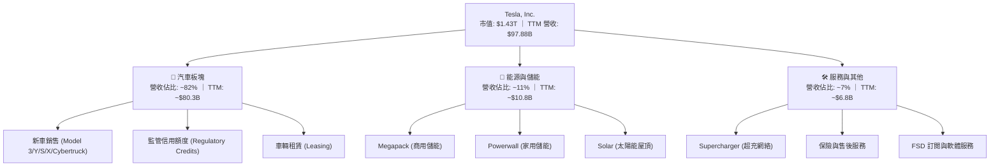

### 2.2 市場份額

特斯拉在全球純電動車（BEV）市場中仍維持領先，但面臨比亞迪（BYD）等中國本土車企的強力挑戰。

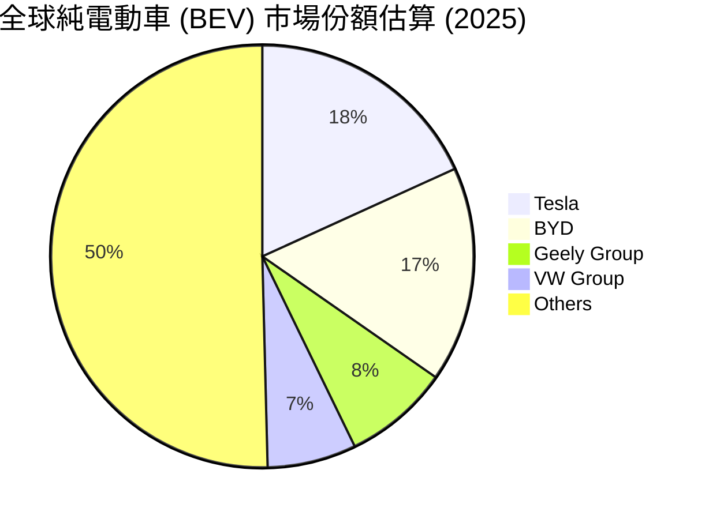

### 2.3 競爭護城河分析

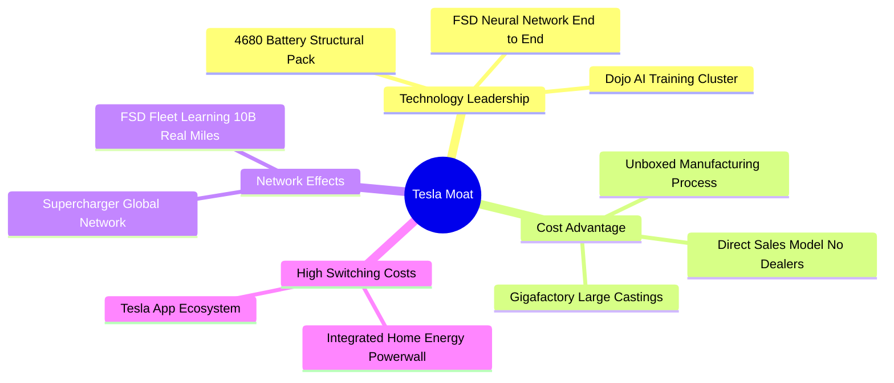

### 2.4 護城河強度評分

```
╔══════════════════════════════════════════════════════════════╗
║                    TSLA 護城河強度評分                       ║
╠══════════════════════════════════════════════════════════════╣
║ 技術與數據飛輪  9.0  ▓▓▓▓▓▓▓▓▓▓▓▓▓▓▓▓▓▓░░  🏆 極高（FSD領先） ║
║ 製造與成本優勢  8.0  ▓▓▓▓▓▓▓▓▓▓▓▓▓▓▓▓░░░░  🟢 強大（一體壓鑄）║
║ 網絡與基礎設施  9.5  ▓▓▓▓▓▓▓▓▓▓▓▓▓▓▓▓▓▓▓░  🏆 行業標竿（超充）║
║ 品牌與用戶生態  8.5  ▓▓▓▓▓▓▓▓▓▓▓▓▓▓▓▓▓░░░  🟢 高黏性          ║
╠══════════════════════════════════════════════════════════════╣
║ 綜合護城河評級  8.75 ▓▓▓▓▓▓▓▓▓▓▓▓▓▓▓▓▓▓░░  🏆 寬廣護城河      ║
╚══════════════════════════════════════════════════════════════╝
```

---

## 3. 損益表深度分析

### 3.1 年度收入成長趨勢（近5年）

```
╔══════════════════════════════════════════════════════════════════╗
║                TSLA 年度收入趨勢 (FY2021 - TTM)                  ║
╠══════════════════════════════════════════════════════════════════╣
║                                                                  ║
║  FY2021  $53.82B  ██████████░░░░░░░░░░░░░░░░░░░  YoY: +70.7% 🟢  ║
║  FY2022  $81.46B  ███████████████░░░░░░░░░░░░░░  YoY: +51.4% 🟢  ║
║  FY2023  $96.77B  ██████████████████░░░░░░░░░░░  YoY: +18.8% 🟢  ║
║  FY2024  $97.69B  ██████████████████░░░░░░░░░░░  YoY: +1.0%  🟡  ║
║  FY2025  $94.83B  █████████████████░░░░░░░░░░░░  YoY: -2.9%  🔴  ║
║  TTM     $97.88B  ██████████████████░░░░░░░░░░░  YoY: +15.8% 🟢  ║
║                                                                  ║
║  📊 5年營收複合成長率 (CAGR)：+12.7%                             ║
╚══════════════════════════════════════════════════════════════════╝
```

*數據解讀*：自 2021 年的高速成長後，2024-2025 年受全球 EV 需求放緩、車型老化及價格戰影響，營收陷入停滯甚至衰退。然而，最新 TTM 營收回升至 **$97.88B**（YoY +15.8%），主因 2025 年下半年及 2026 年 Q1 儲能業務與汽車交付量有所回溫。

### 3.2 季度收入趨勢分析

| 季度 | 營收 (Billion) | YoY 成長率 | QoQ 成長率 | 核心驅動因素與備註 |
|------|---|---|---|---|
| **Q1 2026** | $22.39B | **+15.78%** | -10.08% | 🟢 儲能出貨持續創高；Model 3/Y 交付量因季節性因素 QoQ 下滑。 |
| **Q4 2025** | $24.90B | -3.14% | -11.37% | 🔴 汽車平均售價（ASP）下滑，年底促銷折扣侵蝕營收。 |
| **Q3 2025** | $28.09B | **+11.57%** | **+24.89%** | 🟢 能源業務單季爆發，Megapack 產能釋放；汽車交付超預期。 |
| **Q2 2025** | $22.50B | -11.78% | **+16.35%** | 🟡 汽車業務觸底回升，但中國市場競爭激烈限制了反彈幅度。 |

### 3.3 利潤率演變分析

| 利潤率指標 | FY2022 | FY2023 | FY2024 | FY2025 | TTM | 趨勢評估 |
|---|---|---|---|---|---|---|
| **毛利率** | 25.60% | 18.25% | 17.86% | 18.03% | **19.10%** | 🟡 由降轉穩，儲能高毛利開始顯現。 |
| **營業利益率** | 16.76% | 9.19% | 7.24% | 4.59% | **4.20%** | 🔴 研發與 SG&A 費用上升，營業槓桿受壓。 |
| **EBITDA Margin** | 21.68% | 15.29% | 15.06% | 12.40% | **11.30%** | 🔴 折舊攤銷增加，整體現金獲利能力下滑。 |
| **淨利率** | 15.45% | 15.47% | 7.32% | 4.07% | **3.90%** | 🔴 稅務優惠減少及利息費用變動影響。 |

*利潤率惡化深度解析*：
特斯拉營業利益率從 2022 年的 **16.76%** 崩跌至 TTM 的 **4.20%**，主因有二：
1. **汽車定價權喪失**：為維持工廠產能利用率，特斯拉在過去兩年多次全球降價，ASP 下滑幅度高於單車成本（COGS）的降幅。
2. **研發支出（R&D）高企**：R&D 費用自 2022 年的 **$3.08B** 飆升至 TTM 的 **$6.95B**（佔營收 7.1%），主因公司全力押注 AI 基礎設施（購買 NVIDIA H100 晶片、開發 Dojo）。

### 3.4 費用結構分析

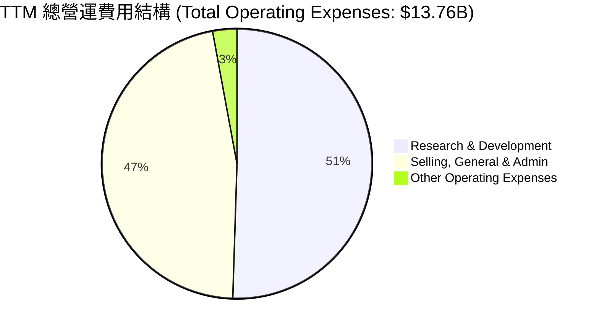

### 3.5 季度 EPS 趨勢與盈餘品質（Quality of Earnings）

特斯拉過去 4 季的 GAAP 稀釋 EPS 呈現低位震盪：Q2 '25 ($0.36) → Q3 '25 ($0.43) → Q4 '25 ($0.26) → Q1 '26 ($0.15)。

#### 盈餘品質量化評估

| 盈餘品質項目 | 數值 / 佔比 | 評估評級 | 機構級深度解析 |
|---|---|---|---|
| **股權薪酬 (SBC) / 營收** | **3.35%** ($3.28B / $97.88B) | 🟡 溫和稀釋 | 雖然 SBC 佔營收比例不極端，但絕對金額高達 $3.28B，對稀釋 EPS 有實質影響。 |
| **SBC / 營業現金流 (OCF)** | **19.84%** ($3.28B / $16.53B) | 🔴 偏高 | 顯示公司營業現金流中有近兩成是靠非現金的股權激勵撐起，獲利含金量需打折扣。 |
| **FCF / GAAP 淨利** | **136.0%** ($5.25B / $3.86B) | 🟢 極佳 | 現金轉換率大於 100%，主因高額的折舊攤銷（D&A）及 SBC 撥回，顯示非現金盈餘品質良好。 |
| **監管信用額度 (Credits) 依賴度** | 佔汽車毛利約 **12-15%** | 🟡 潛在風險 | 監管信用額度銷售屬於純利，若未來傳統車企轉型成功，此高毛利收入將歸零。 |
| **有效稅率變動** | FY2025 實際稅率 **27.0%** | 🟢 正常化 | 結束了 FY2023 遞延所得稅資產撥回帶來的非經常性稅務利益，反映真實經營稅負。 |

---

## 4. 資產負債表分析

### 4.1 資產結構分解

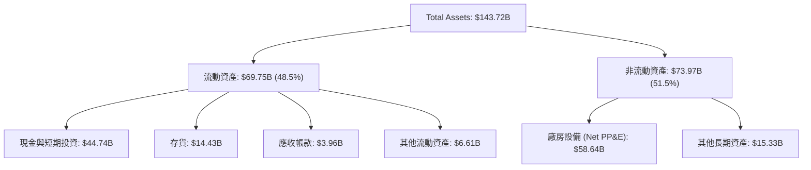

### 4.2 流動性指標分析

*   **流動比率 (Current Ratio)**：**2.04**（流動資產 $69.75B / 流動負債 $34.14B），顯著高於製造業安全邊際（1.2 - 1.5）。
*   **速動比率 (Quick Ratio)**：**1.43**（剔除 $14.43B 存貨與其他流動資產後），表明即使存貨完全無法變現，其速動資產仍足以覆蓋所有短期債務。
*   **存貨週轉天數 (Days Inventory Outstanding, DIO)**：約 **62.5 天**（以 TTM COGS $79.22B 計算），較 2023 年（約 55 天）有所上升，反映終端去化速度放緩，庫存管理壓力增加。

### 4.3 債務結構與安全診斷

```
╔══════════════════════════════════════════════════════════════════╗
║                    TSLA 債務健康診斷 (2026-03-31)                ║
╠══════════════════════════════════════════════════════════════════╣
║                                                                  ║
║  總債務 (Total Debt)：   $15.89B  ████░░░░░░░░░░░░░░░░░░░        ║
║  總現金與短期投資：      $44.74B  ███████████████████████        ║
║  淨現金位置 (Net Cash)： $28.85B  ███████████████░░░░░░░░  🟢強勁║
║                                                                  ║
║  債務股本比 (Debt/Equity)： 18.74%  🟢 極低風險                  ║
║  利息保障倍數 (Interest Coverage)： 14.4x (Operating Income/Int) ║
║  債務/EBITDA： 1.41x (高於安全線 2.5x)                           ║
║                                                                  ║
║  📊 診斷：淨現金極其充裕，無任何破產或短期流動性危機。           ║
╚══════════════════════════════════════════════════════════════════╝
```

---

## 5. 現金流量深度分析

### 5.1 現金流量瀑布圖

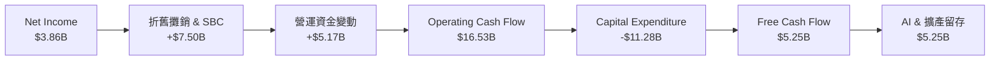

### 5.2 FCF 轉換率趨勢

| 年度 | 營業現金流 (OCF) | 資本支出 (CapEx) | 自由現金流 (FCF) | GAAP 淨利 (NI) | FCF 轉換率 (FCF/NI) |
|---|---|---|---|---|---|
| **FY2022** | $14.72B | -$7.17B | $7.55B | $12.59B | 59.97% |
| **FY2023** | $13.26B | -$8.90B | $4.36B | $14.97B | 29.12% |
| **FY2024** | $14.92B | -$11.34B | $3.58B | $7.15B | 50.07% |
| **FY2025** | $14.75B | -$8.53B | $6.22B | $3.86B | **161.14%** |
| **TTM** | $16.53B | -$11.28B | $5.25B | $3.86B | **136.01%** |

*數據透視*：2025 年與 TTM 的 FCF 轉換率出現暴增，並非因為淨利大增，而是因為**淨利大幅下滑**（從 15B 降至 3.8B），而折舊與非現金 SBC（屬於加回項）維持高位，使得現金流表現顯著「好於」會計利潤。這表明特斯拉的實際生存能力（現金流）比損益表展現的更具韌性。

### 5.3 自由現金流趨勢

```
╔══════════════════════════════════════════════════════════════════╗
║                    TSLA 自由現金流與收益率趨勢                   ║
╠══════════════════════════════════════════════════════════════════╣
║                                                                  ║
║  FY2022  $7.55B  ███████████████████████  FCF Yield: 0.53%       ║
║  FY2023  $4.36B  █████████████░░░░░░░░░░  FCF Yield: 0.31%       ║
║  FY2024  $3.58B  ██████████░░░░░░░░░░░░░  FCF Yield: 0.25%       ║
║  FY2025  $6.22B  ██═════════════════════  FCF Yield: 0.44%       ║
║  TTM     $5.25B  ████████████████░░░░░░░  FCF Yield: 0.37%       ║
║                                                                  ║
║  ⚠️ 註：FCF Yield 極低 (0.37%)，顯示當前估值對現金流折現要求極高。║
╚══════════════════════════════════════════════════════════════════╝
```

---

## 6. 獲利能力與資本效率

### 6.1 ROE / ROA / ROIC 趨勢

| 指標 | FY2022 | FY2023 | FY2024 | FY2025 | TTM | 行業均值 | 評估 |
|---|---|---|---|---|---|---|---|
| **ROE** | 28.1% | 24.0% | 9.8% | 4.7% | **4.9%** | ~12.0% | 🔴 短期資本效率偏低 |
| **ROA** | 15.3% | 14.0% | 5.9% | 2.8% | **2.2%** | ~6.0% | 🔴 資產回報率受壓 |
| **ROIC** | 21.5% | 16.2% | 8.4% | 5.8% | **6.64%** | ~8.0% | 🔴 核心投入資本回報率下滑 |

### 6.2 ROIC vs WACC 分析（核心價值創造判斷）

```
╔══════════════════════════════════════════════════════════════════╗
║                 ROIC vs WACC 資本效率深度分析                    ║
╠══════════════════════════════════════════════════════════════════╣
║                                                                  ║
║  WACC 估算：                                                     ║
║  ├── 無風險利率 (10Y 美債)： 4.20%                               ║
║  ├── 市場風險溢酬 (ERP)：    5.00%                               ║
║  ├── Beta 值：               1.802                               ║
║  ├── 股權成本 (CAPM) = 4.2% + 1.802 × 5% = 13.21%                ║
║  ├── 債務成本 (稅後)：       3.97% (5.5% Pre-tax × (1-27.8%))    ║
║  ├── 資本結構：股權 98.9% ｜ 債務 1.1%                           ║
║  └── ✅ WACC ≈ 13.10%                                            ║
║                                                                  ║
║  ROIC 估算 (TTM)：                                               ║
║  ├── NOPAT = Operating Income $4.90B × (1-27.79%) = $3.54B        ║
║  ├── Invested Capital = Equity $82.14B + Debt $15.89B - Cash $44.74B║
║  ├── 投入資本 (Invested Capital) = $53.29B                       ║
║  └── ✅ ROIC ≈ 6.64%                                             ║
║                                                                  ║
║  ★ 經濟價值增加 (EVA) = ROIC - WACC = -6.46%                      ║
║                                                                  ║
║  ROIC  6.64%  ▓▓▓▓▓▓▓▓▓▓░░░░░░░░░░░░░░░░░░░░░░  🔴 (低於資本成本)║
║  WACC  13.10% ▓▓▓▓▓▓▓▓▓▓▓▓▓▓▓▓▓▓▓▓░░░░░░░░░░░░  ──              ║
║  EVA   -6.46% ▓▓▓▓▓▓▓▓▓▓░░░░░░░░░░░░░░░░░░░░░░  🔴 經濟價值摧毀 ║
║                                                                  ║
║  📊 結論：當前 ROIC 低於 WACC，顯示特斯拉核心造車業務在當前利潤   ║
║            率下正在「摧毀」股東價值。高市值完全依賴未來 AI 溢價。  ║
╚══════════════════════════════════════════════════════════════════╝
```

### 6.3 杜邦三因素分解

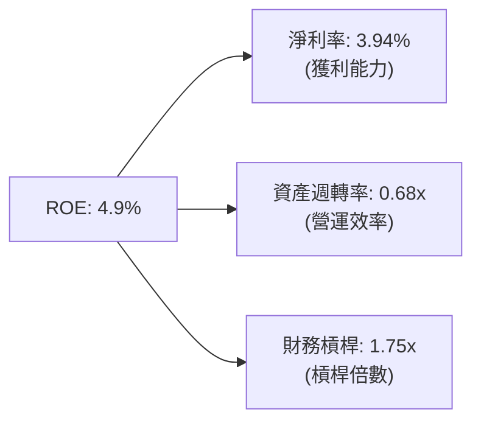

*杜邦分析洞察*：
特斯拉 ROE 自 2022 年的 **28.1%** 降至 **4.9%**，主要驅動因素是**淨利率從 15.45% 萎縮至 3.94%**。資產週轉率（0.68x）與財務槓桿（1.75x）基本保持穩定。這證明特斯拉並非營運效率或資金週轉出現問題，而是**產品定價與利潤空間在競爭中被嚴重侵蝕**。

---

## 7. 估值深度分析

### 7.1 同業估值比較表格

| 估值指標 | **Tesla (TSLA)** | **BYD (BYDDY)** | **Toyota (TM)** | **Li Auto (LI)** | 特斯拉估值評估 |
|---|---|---|---|---|---|
| **Trailing P/E** | **350.30x** | 18.50x | 8.20x | 16.80x | 🔴 極端昂貴，脫離傳統車企範疇 |
| **Forward P/E** | **149.50x** | 14.80x | 7.90x | 13.50x | 🔴 隱含極高的未來成長預期 |
| **P/S Ratio** | **14.65x** | 0.95x | 0.78x | 1.05x | 🔴 銷量估值比極不對稱 |
| **EV / EBITDA** | **129.85x** | 9.20x | 5.80x | 8.50x | 🔴 遠超重工業合理區間 |
| **FCF Yield** | **0.37%** | 4.80% | 6.50% | 5.20% | 🔴 現金流回報率極低 |

### 7.2 歷史估值區間分析

```
╔══════════════════════════════════════════════════════════════════╗
║               TSLA Trailing P/E 歷史區間 (近5年)                 ║
╠══════════════════════════════════════════════════════════════════╣
║                                                                  ║
║  歷史高點： 1100x+ (2021 瘋狂期)                                 ║
║  歷史中位數：120x                                                ║
║  歷史低點：  35x (2023 年初)                                     ║
║  當前 P/E：  350.30x                                             ║
║                                                                  ║
║  P/E 區間定位：                                                  ║
║  35x             120x                     350.3x           1100x ║
║  [  歷史底部  ]───[  合理中樞  ]───────────[★當前位置]───────[泡沫] ║
║                                                                  ║
║  📊 評估：當前估值處於歷史相對高位，反映市場將其視為 AI 科技股。 ║
╚══════════════════════════════════════════════════════════════════╝
```

### 7.3 情境目標價（假設驅動，Bear / Base / Bull）

由於特斯拉淨利潤受研發與折舊壓抑，我們採用 **EV/EBITDA** 與 **P/E (Forward)** 混合估值法：

| 情境 | 5年營收 CAGR | 2030 營業利益率 | 退出倍數 (Forward P/E) | 隱含目標價 | 相對當前股價 |
|---|---|---|---|---|---|
| 🔴 **悲觀情境** | 6.0% | 6.0% | 35.0x | **$180.00** | -52.86% |
| 🟡 **基準情境** | 15.0% | 11.0% | **85.0x** | **$415.00** | **+8.68%** |
| 🟢 **樂觀情境** | 25.0% | 18.0% | 120.0x | **$550.00** | +44.03% |

### 7.4 DCF 敏感性分析（9格目標價矩陣）

*   **基準假設**：10 年期無風險利率 4.2%，終端成長率（PGR）3.0%，基準 WACC 13.1%。

| WACC \ PGR | 2.0% | **3.0%（基準）** | 4.0% |
|---|---|---|---|
| **12.1%** | $432.00 (+13.1%) | $458.00 (+19.9%) | $489.00 (+28.1%) |
| **13.1%（基準）**| $392.00 (+2.7%) | **$415.00 (+8.7%)** | $441.00 (+15.5%) |
| **14.1%** | $355.00 (-7.0%) | $374.00 (-2.1%) | $396.00 (+3.7%) |

### 7.5 估值綜合區間

```
╔══════════════════════════════════════════════════════════════════╗
║                     TSLA 估值區間與股價定位                      ║
╠══════════════════════════════════════════════════════════════════╣
║                                                                  ║
║  當前股價：$381.86                                               ║
║                                                                  ║
║  $125.00 (分析師最低目標)                                        ║
║    ├── 🔴 悲觀情境價值：$180.00                                  ║
║    │     ├── 🟡 基準合理價值 (DCF)：$415.00                       ║
║    │           ├── 🟢 樂觀期權價值：$550.00                       ║
║    │                 └── $600.00 (分析師最高目標)                ║
║                                                                  ║
║  [ $125 ]───[ $180 ]───────[★當前 $381.86]───[ $415 ]───[ $550 ]  ║
║                                                                  ║
║  📊 結論：當前股價已基本反映基準情境，上行空間取決於 AI 期權兌現。║
╚══════════════════════════════════════════════════════════════════╝
```

---

## 8. 成長催化劑

### 8.1 催化劑時間軸

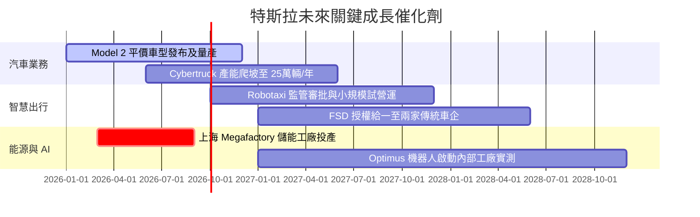

### 8.2 TAM 市場規模分析

```
╔══════════════════════════════════════════════════════════════════╗
║                    TSLA 2030年 TAM 與滲透率估算                  ║
╠══════════════════════════════════════════════════════════════════╣
║                                                                  ║
║  1. 全球電動車 (EV)：                                            ║
║     ├── 全球 TAM： $2.5T                                         ║
║     └── 特斯拉預期份額： 12% ｜ 貢獻營收： ~$300B                 ║
║                                                                  ║
║  2. 儲能與分散式電網 (Energy Storage)：                           ║
║     ├── 全球 TAM： $400B                                         ║
║     └── 特斯拉預期份額： 20% ｜ 貢獻營收： ~$80B                  ║
║                                                                  ║
║  3. 自動駕駛與 Robotaxi 服務 (FSD)：                             ║
║     ├── 全球 TAM： $1.2T                                         ║
║     └── 特斯拉預期份額： 15% ｜ 貢獻營收： ~$180B                 ║
║                                                                  ║
║  📊 總計 2030 潛在營收空間：可達 $560B+ (當前 $97.88B 的 5.7 倍)  ║
╚══════════════════════════════════════════════════════════════════╝
```

### 8.3 成長驅動力結構圖

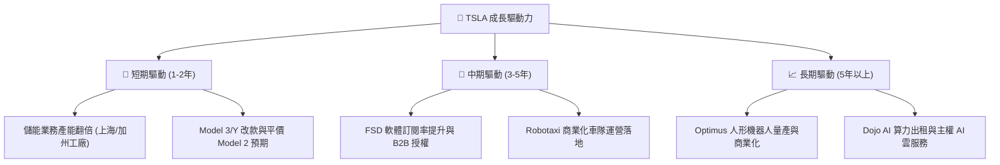

---

## 9. 風險矩陣

### 9.1 風險評分矩陣

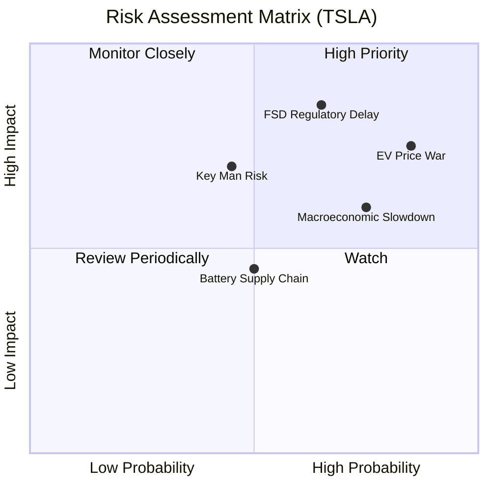

### 9.2 風險清單詳細分析

| # | 風險項目 | 發生機率 | 財務衝擊 | 風險評分 | 緩解措施 |
|---|---|---|---|---|---|
| 1 | 🔴 **電動車價格戰持續** | **高 (85%)** | **高 (-$1.5B 淨利)** | 🔴 **8.0 / 10** | 透過一體壓鑄（Unboxed Process）降低單車製造成本，並向儲能與軟體轉型。 |
| 2 | 🔴 **FSD 監管與技術瓶頸** | **中高 (65%)**| **極高 (-40% 估值溢價)**| 🔴 **7.8 / 10** | 持續加大 AI 基礎設施投入，累積真實路測數據，並與各國監管機構密切合作。 |
| 3 | 🟡 **Key Man（Musk）個人風險**| **中 (45%)** | **高 (-15% 股價波動)** | 🟡 **6.0 / 10** | 建立更完善的董事會監督機制，培養各業務板塊（如 Drew Baglino 等）接班梯隊。 |
| 4 | 🟡 **宏觀經濟與高利率環境** | **高 (75%)** | **中 (-5% 銷量)** | 🟡 **5.5 / 10** | 提供靈活的金融租賃方案，並利用強大淨現金部位進行逆週期投資。 |

---

## 10. 投資建議

### 10.1 最終綜合評級雷達圖

```
╔══════════════════════════════════════════════════════════════╗
║                     TSLA 投資價值綜合雷達圖                  ║
╠══════════════════════════════════════════════════════════════╣
║                                                              ║
║           財務健康 (9.5)                                     ║
║               /\                                             ║
║              /  \     技術創新 (9.0)                         ║
║  成長性(7.5)/    \   /                                       ║
║            /      \ /                                        ║
║           /        * 護城河 (8.5)                            ║
║          /        / \                                        ║
║         /        /   \                                       ║
║        /________/_____\                                      ║
║   基本面(6.0)  獲利能力(5.0)  估值合理性(3.0)                ║
║                                                              ║
║  📊 綜合評分：6.8 / 10 ｜ 評級：持有 (Hold)                  ║
╚══════════════════════════════════════════════════════════════╝
```

### 10.2 目標價與隱含報酬率

| 情境 | 隱含目標價 | 權重機率 | 當前股價 | 預期報酬率 | 權重預期回報 |
|---|---|---|---|---|---|
| 🔴 悲觀 | $180.00 | 25% | $381.86 | -52.86% | -13.22% |
| 🟡 **基準** | **$415.00** | **55%** | **$381.86** | **+8.68%** | **+4.77%** |
| 🟢 樂觀 | $550.00 | 20% | $381.86 | +44.03% | +8.81% |
| **加權綜合目標價**| **$383.25** | **100%**| **$381.86** | **+0.36%** | **基本持平** |

*機構分析師觀點*：從機率加權角度來看，當前 **$381.86** 的股價已高度定價了基準情境與部分樂觀預期。在缺乏新的利潤率改善證據前，當前價位的風險回報比（Risk-Reward Ratio）僅為 **1:1**，不建議在此位置進行追高。

### 10.3 買入時機與觸發因素

```
╔══════════════════════════════════════════════════════════════════╗
║                  ✅ TSLA 投資決策 Checklist                      ║
╠══════════════════════════════════════════════════════════════════╣
║                                                                  ║
║  立即買入觸發條件（需符合 2 項以上）：                            ║
║  ☐ 汽車業務毛利率（扣除 Credits）連續兩季回升至 18% 以上          ║
║  ☐ FSD 在中國或歐洲獲得正式無限制商業化運營許可                  ║
║  ☐ 股價因宏觀系統性風險回檔至 $320 以下（對應 Forward PE ~125x） ║
║                                                                  ║
║  加碼觸發條件：                                                  ║
║  ☐ 能源儲能單季出貨量突破 12GWh，且毛利率維持在 20% 以上          ║
║  ☐ 宣布與主要傳統車企（如 Ford, GM）達成 FSD 授權協議            ║
║                                                                  ║
║  減碼/停損觸發條件：                                             ║
║  ☐ 汽車整體毛利率跌破 15% 且無企穩跡象                           ║
║  ☐ 自由現金流（FCF）連續兩季轉負                                 ║
║  ☐ Elon Musk 再次大規模減持套現或辭去 CEO 職務                   ║
╚══════════════════════════════════════════════════════════════════╝
```

### 10.4 投資人適配度分析

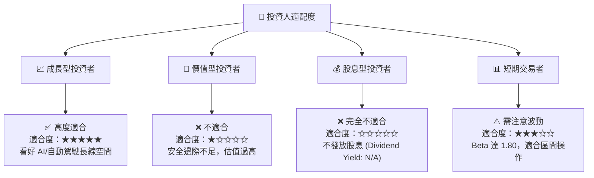

### 10.5 每季財報監控清單（Quarterly Watch List）

為了持續追蹤特斯拉的投資框架是否發生結構性改變，投資人應在每季財報中重點監控以下指標：

| 監控指標 | 當前值 (TTM/Q1 '26) | 觸發「加碼」門檻 | 觸發「減碼」門檻 | 監控意義 |
|---|---|---|---|---|
| **汽車業務毛利率 (Excl. Credits)** | **~16.2%** | > 18.5% | < 14.0% | 衡量核心造車業務定價權與成本控制力。 |
| **儲能出貨量 (GWh)** | **單季 ~4.0 GWh** | > 6.0 GWh | < 3.0 GWh | 評估第二成長曲線（Megapack）的擴張速度。 |
| **自由現金流 (FCF)** | **$1.44B (Q1 '26)** | > $2.50B / 季 | 轉負 (< $0) | 確保高強度 AI 研發投入下的自我造血能力。 |
| **FSD 累計行駛里程** | **~15 億英里** | > 30 億英里 | 成長停滯 | 數據飛輪的基礎，決定 AI 算法的演進速度。 |
| **稀釋後總股數 YoY 變化** | **+0.76%** | < +0.20% | > +1.50% | 監控股權稀釋（SBC）對股東權益的侵蝕程度。 |

### 10.6 反面論證：什麼會證明論點錯誤（What Would Change My Mind）

```
╔══════════════════════════════════════════════════════════════════╗
║              ⚠️ 論點失效條件 (Disconfirming Evidence)            ║
╠══════════════════════════════════════════════════════════════════╣
║  本多頭/持有論點在下列情況成立時應被推翻，並應果斷執行減碼：     ║
║                                                                  ║
║  ☐ 核心汽車業務毛利率連續兩季低於 15.0%                          ║
║  │   原因：代表 EV 已徹底商品化，特斯拉喪失所有製造溢價。        ║
║  │                                                              ║
║  ☐ TTM 自由現金流轉負，或 FCF 轉換率 (FCF/NI) 連續兩季 < 30%      ║
║  │   原因：高額 CapEx 開始消耗帳上現金，財務結構惡化。           ║
║  │                                                              ║
║  ☐ ROIC 跌破 5.0% 且 WACC 因市場波動上升至 14% 以上              ║
║  │   原因：經濟價值摧毀（EVA 負值）進一步擴大，資本效率極低。    ║
║  │                                                              ║
║  ☐ FSD V12 發生重大安全事故導致各國監管機構無限期暫停路測        ║
║  │   原因：AI 估值期權徹底失效，估值中樞將向傳統車企（10x PE）靠攏║
╚══════════════════════════════════════════════════════════════════╝
```

---

> **免責聲明**：本報告為 AI 自動生成，基於公開財務數據進行之獨立研究分析，僅供學術與投資參考，不構成任何買賣建議。投資有風險，入市需謹謹慎。