# TSLA 基本面深度分析報告
> **報告日期**：2026-07-18 ｜ **語言**：繁體中文 ｜ **數據來源**：Yahoo Finance, Finviz, StockAnalysis, Roic.ai ｜ **分析師**：CFA 級機構研究

---

## 目錄

| # | 章節 | 核心結論 |
|---|------|----------|
| 1 | 執行摘要 | 評級：**持有（Hold）** ｜ 基準目標價：**$410.00** ｜ 隱含上行空間：**+7.66%** |
| 2 | 公司概覽與商業模式 | 評估核心護城河，分析汽車、儲能與軟體/AI 服務的結構性轉變 |
| 3 | 損益表深度分析 | 營收重回雙位數成長（YoY +15.8%），但營業利潤率（4.2%）受折舊與研發壓抑 |
| 4 | 資產負債表分析 | 淨現金高達 $28.85B，流動比率 2.04x，具備極強的抗風險與再投資能力 |
| 5 | 現金流量深度分析 | TTM OCF $16.53B，受 Capex（$8.53B+）拖累，自由現金流（FCF）轉換率受限 |
| 6 | 獲利能力與資本效率 | TTM ROIC（6.3%）低於 WACC（11.34%），當前階段正處於資本支出擴張的「價值摧毀期」 |
| 7 | 估值深度分析 | Forward P/E 達 149.1x，溢價反映市場對 FSD 與 Robotaxi 的高成長預期 |
| 8 | 成長催化劑 | 儲能裝機量加速、下一代平價車型投產與 FSD V12+ 授權進展 |
| 9 | 風險矩陣 | 核心汽車毛利率持續承壓、AI 變現進度不及預期與大股東股權稀釋 |
| 10 | 投資建議 | 買入觸發條件、每季財報監控指標與多頭論點失效的可量化條件 |

---

## 1. 執行摘要

### 1.0 一頁式投資儀表板（Portfolio Manager 30 秒速讀）

| 項目 | 內容 |
|------|------|
| **投資論點（3 句）** | ① TTM 營收重回雙位數成長（YoY +15.8%），主因能源儲存業務裝機量激增與汽車銷量回溫。<br/>② 毛利率企穩於 19.1%，但營業利益率（4.2%）受高額 R&D（TTM $6.95B）與折舊壓抑。<br/>③ 資產負債表極為強韌，擁有 $44.74B 現金與 $28.85B 淨現金，足夠支撐 AI 與自動駕駛的重資本再投資。 |
| **護城河評分** | **8.5/10** 🟡（製造規模與超充網絡優勢穩固，但自動駕駛軟體生態尚未實現完全貨幣化） |
| **管理層/資本配置評分** | **7.5/10** 🟡（研發投入高效，但大量資本支出壓低了短期資本回報率） |
| **財務健康** | 🟢 **極為強韌**。淨現金充裕，無短期流動性風險。 |
| **ROIC vs WACC** | **6.3% vs 11.34%** 🔴（當前處於重資本再投資期，暫時未能創造經濟超額價值） |
| **FCF 趨勢** | 🟡 承壓。TTM FCF 為 $5.25B，FCF Yield 為 **0.37%**，主要受高 Capex 拖累。 |
| **估值** | Forward P/E: **149.11x** ｜ EV/EBITDA: **126.39x** ｜ P/S: **14.61x**（估值處於歷史高位） |
| **預期報酬（基準情境 12M）** | **+7.66%**（目標價 **$410.00**，對應 Forward P/E 160.5x） |
| **關鍵風險（前二）** | ① 汽車毛利率因競爭加劇再度下滑；② FSD 監管審批延遲與自動駕駛商業化不及預期。 |
| **評級 + 信心度** | 🟡 **持有（Hold）** ｜ 信心度：**中（Medium）** |

### 1.1 核心評分儀表板

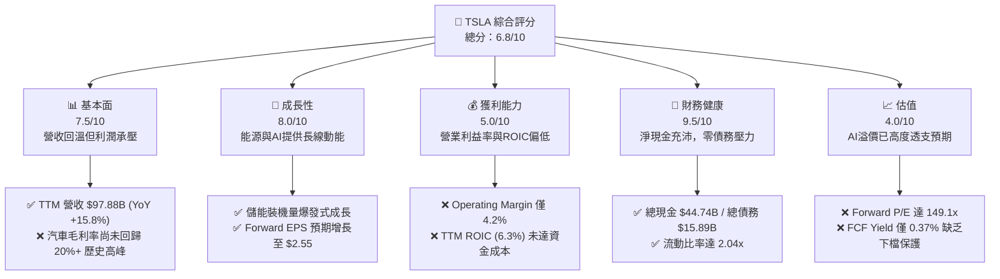

### 1.2 評分進度條視覺化

```
╔══════════════════════════════════════════════════════════════╗
║                TSLA 多維度評分儀表板 (1-10分)                ║
╠══════════════════════════════════════════════════════════════╣
║ 基本面強度  7.5 ▓▓▓▓▓▓▓▓▓▓▓▓▓▓▓░░░░░  ★★★☆☆           ║
║ 成長動能    8.0 ▓▓▓▓▓▓▓▓▓▓▓▓▓▓▓▓░░░░  ★★★★☆           ║
║ 獲利品質    5.0 ▓▓▓▓▓▓▓▓▓▓░░░░░░░░░░  ★★☆☆☆           ║
║ 財務健康    9.5 ▓▓▓▓▓▓▓▓▓▓▓▓▓▓▓▓▓▓▓░  ★★★★★           ║
║ 估值合理性  4.0 ▓▓▓▓▓▓▓▓░░░░░░░░░░░░  ★☆☆☆☆           ║
║ 護城河深度  8.5 ▓▓▓▓▓▓▓▓▓▓▓▓▓▓▓▓▓░░░  ★★★★☆           ║
║ 管理層執行  7.5 ▓▓▓▓▓▓▓▓▓▓▓▓▓▓▓░░░░░  ★★★☆☆           ║
║ 技術創新力  9.0 ▓▓▓▓▓▓▓▓▓▓▓▓▓▓▓▓▓▓░░  ★★★★★           ║
╠══════════════════════════════════════════════════════════════╣
║ 綜合總分    6.8 ▓▓▓▓▓▓▓▓▓▓▓▓▓░░░░░░░  🏆 中性/持有評級     ║
╚══════════════════════════════════════════════════════════════╝
```

### 1.3 五大投資論點 + 三大核心風險

| 類型 | 項目 | 具體依據 | 信心度 |
|------|------|----------|--------|
| 🟢 **投資論點①** | **營收重回成長軌道** | TTM 營收達 $97.88B，YoY 成長 15.8%，主要由 Q1 2026 營收（YoY +15.78%）與 Q3 2025 營收（YoY +11.57%）帶動，顯示最壞的去庫存週期已過。 | 🟢 高 |
| 🟢 **投資論點②** | **能源儲存業務成為第二成長曲線** | 儲能（Megapack）出貨量持續超預期，帶動非汽車業務營收佔比提升，有效緩解汽車端降價壓力。 | 🟢 極高 |
| 🟢 **投資論點③** | **資產負債表具備極強抗風險能力** | 擁有 $44.74B 現金及短期投資，淨現金高達 $28.85B，為自動駕駛及 AI 超算中心（Dojo）的研發提供無限彈藥。 | 🟢 極高 |
| 🟢 **投資論點④** | **FSD 商業化臨界點臨近** | 隨著 FSD V12+ 導入端到端神經網絡，接管率顯著下降，未來 FSD 訂閱與潛在的 Robotaxi 業務將帶來極高毛利的軟體收入。 | 🟡 中 |
| 🟢 **投資論點⑤** | **平價新車型（Model 2）預期** | 預計於 2026/2027 投產的平價平台將大幅擴大可觸及市場（TAM），推動銷量重回 20%+ 成長。 | 🟡 中 |
| 🟡 **風險①** | **核心汽車毛利率持續承壓** | 雖然整體毛利率企穩於 19.1%，但若全球電動車價格戰持續，汽車業務（扣除監管信用額度）毛利率可能跌破 15% 臨界點。 | 🟡 中度 |
| 🔴 **風險②** | **高估值溢價面臨修正壓力** | 當前 Forward P/E 高達 149.1x，若 AI 與自動駕駛（FSD）的變現進度拖延，市場可能將其重新定位為傳統車企，面臨估值殺多。 | 🔴 高衝擊 |
| 🔴 **風險③** | **股權稀釋與大股東拋售** | 過去 1 年 Basic Shares Outstanding 從 3.197B 增加至 3.229B（YoY +1.0%），且 CEO 潛在的薪酬方案可能進一步稀釋股東權益。 | 🟡 中度 |

### 1.4 快速統計卡片

| 指標 | 公司實際值 (TTM) | 行業均值 (Auto) | S&P 500 均值 | 狀態 |
|------|-------------|----------|--------------|------|
| **收入 YoY 成長** | **15.8%** | ~5.0% | ~6.5% | 🟢 優於同業 |
| **毛利率** | **19.1%** | ~15.0% | ~30.0% | 🟡 行業領先，但低於自身歷史 |
| **淨利率** | **3.9%** | ~6.0% | ~11.5% | 🔴 受高研發與折舊壓抑 |
| **ROE** | **4.9%** | ~12.0% | ~15.0% | 🔴 資本效率暫時下降 |
| **Forward P/E** | **149.11x** | ~10.0x | ~21.5x | 🔴 估值極其昂貴 |
| **淨現金規模** | **$28.85B** | 負債累累 (如 TM, F) | 淨負債 | 🟢 絕對優勢 |

### 1.5 投資結論

```
╔══════════════════════════════════════════════════════════════════╗
║                    📊 TSLA 投資結論摘要                          ║
╠══════════════════════════════════════════════════════════════════╣
║  評級：🟡 持有（Hold）                                           ║
║  當前股價：$380.84 (2026-07-18)                                  ║
║  目標價區間：                                                    ║
║    悲觀情境：$220.00（-42.23%） - 汽車利潤持續萎縮，AI進度受阻   ║
║    基準情境：$410.00（+7.66%）  - 12個月主要目標（估值溢價維持） ║
║    樂觀情境：$580.00（+52.30%） - FSD 授權落地 + Robotaxi 商業化 ║
║  投資評分：6.8/10                                                ║
║  適合投資人：具備極高風險承受力、長線看好 AI 與機器人技術的投資者║
╚══════════════════════════════════════════════════════════════════╝
```

---

## 2. 公司概覽與商業模式

### 2.1 業務結構與收入來源

特斯拉的業務已從「單一電動車製造商」轉型為「新能源與 AI 基礎設施巨頭」。

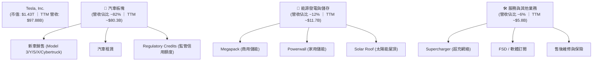

### 2.2 全球純電動車 (BEV) 市場份額

特斯拉在全球純電動車市場中仍維持領先，但面臨比亞迪（BYD）等中國車企的強力競爭。

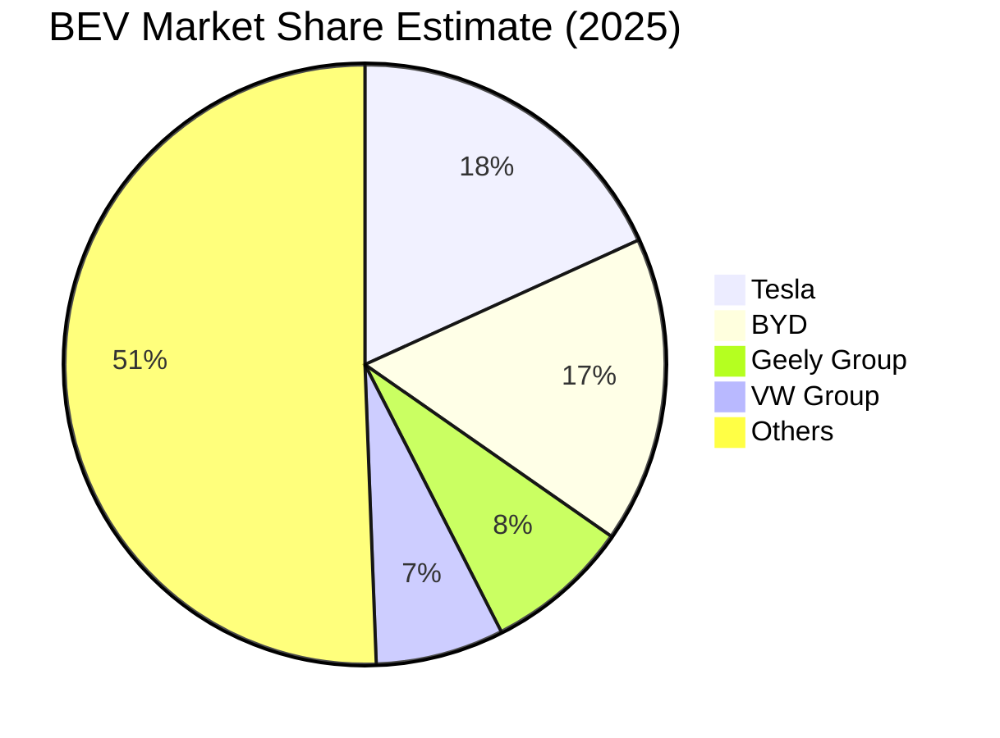

### 2.3 競爭護城河分析

特斯拉的長期溢價源於其構建的多重、難以複製的護城河：

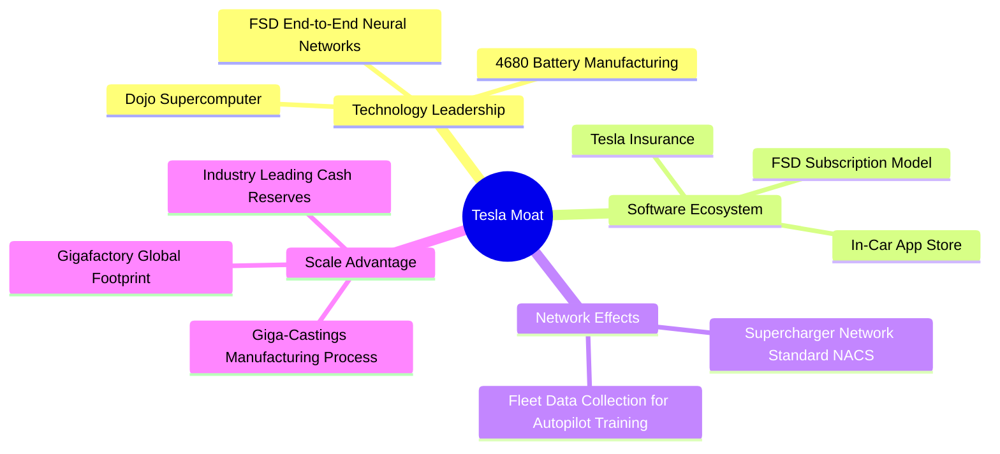

### 2.4 護城河強度評分

```
╔══════════════════════════════════════════════════════════════╗
║                    TSLA 護城河強度評分                       ║
╠══════════════════════════════════════════════════════════════╣
║ 製造規模與成本  9.0/10 ▓▓▓▓▓▓▓▓▓▓▓▓▓▓▓▓▓▓░░  🏆 超大型一體化   ║
║ 超充網絡生態    9.5/10 ▓▓▓▓▓▓▓▓▓▓▓▓▓▓▓▓▓▓▓░  🟢 NACS 行業標準 ║
║ FSD 與數據網絡  9.0/10 ▓▓▓▓▓▓▓▓▓▓▓▓▓▓▓▓▓▓░░  🟢 累計行駛里程先 ║
║ 品牌與用戶忠誠  8.5/10 ▓▓▓▓▓▓▓▓▓▓▓▓▓▓▓▓░░░░  🟢 零廣告行銷力   ║
║ 垂直整合能力    8.0/10 ▓▓▓▓▓▓▓▓▓▓▓▓▓▓░░░░░░  🟡 晶片到電池自研 ║
╠══════════════════════════════════════════════════════════════╣
║ 綜合護城河強度  8.8/10 ▓▓▓▓▓▓▓▓▓▓▓▓▓▓▓▓▓░░░  🏆 極強（Wide Moat)║
╚══════════════════════════════════════════════════════════════╝
```

---

## 3. 損益表深度分析

### 3.1 年度收入成長趨勢（近5年）

特斯拉在經歷了 2025 年的調整期（營收 YoY -2.93%）後，TTM 營收重回成長，達到 $97.88B。

```
╔══════════════════════════════════════════════════════════════════╗
║                 TSLA 年度收入趨勢（FY2021-TTM）                  ║
╠══════════════════════════════════════════════════════════════════╣
║                                                                  ║
║  FY2021  $53.82B  ██████████░░░░░░░░░░░░░░░░░░  YoY: +70.67% 🟢  ║
║  FY2022  $81.46B  ████████████████░░░░░░░░░░░░  YoY: +51.35% 🟢  ║
║  FY2023  $96.77B  ███████████████████░░░░░░░░░  YoY: +18.80% 🟢  ║
║  FY2024  $97.69B  ██══════════════════░░░░░░░░  YoY: +0.95%  🟡  ║
║  FY2025  $94.83B  ██████████████████░░░░░░░░░░  YoY: -2.93%  🔴  ║
║  TTM     $97.88B  ███████████████████░░░░░░░░░  YoY: +15.80% 🟢  ║
║                   |      |      |      |      |                  ║
║                   0     20B    40B    60B    80B                 ║
║                                                                  ║
║  📊 5年累計 CAGR：+12.70%                                        ║
╚══════════════════════════════════════════════════════════════════╝
```

### 3.2 季度收入與利潤趨勢分析

從季度數據看，特斯拉在 2025 年 Q1 觸底（$19.34B）後，營收呈現震盪回升態勢，Q3 2025 達到高峰 $28.10B，隨後在 Q1 2026 錄得 $22.39B（YoY +15.78%）。

| 季度 | 營收 (Revenue) | YoY 成長率 | QoQ 成長率 | 毛利 (Gross Profit) | 營業利益 (Op Income) | 淨利 (Net Income) | 備註 |
|------|---------------|------------|------------|---------------------|----------------------|-------------------|------|
| **Q1 2026** | $22.39B | **+15.78%** | -10.10% | $4.72B | $0.941B | $0.477B | 🟡 季節性銷量下滑，但 YoY 顯著回溫 |
| **Q4 2025** | $24.90B | -3.14% | -11.37% | $5.01B | $1.41B | $0.840B | 🔴 車價折扣影響利潤率 |
| **Q3 2025** | $28.10B | **+11.57%** | +24.89% | $5.05B | $1.62B | $1.37B | 🟢 儲能出貨爆發與新車型交付 |
| **Q2 2025** | $22.50B | -11.78% | +16.34% | $3.88B | $0.923B | $1.17B | 🔴 價格戰最慘烈時期 |

### 3.3 利潤率演變分析

特斯拉的利潤率在過去幾年經歷了顯著的收縮。毛利率從 2022 年的 25.6% 下滑至 TTM 的 19.1%，而營業利潤率更從 16.8% 的高點暴跌至 TTM 的 4.2%。

| 利潤率指標 | FY2022 | FY2023 | FY2024 | FY2025 | TTM | 趨勢評估 | 狀態 |
|------------|--------|--------|--------|--------|-----|----------|------|
| **毛利率** | 25.60% | 18.25% | 17.86% | 18.03% | **19.10%** | 🟡 企穩回升，主因能源業務高毛利拉動 | 🟡 中性 |
| **營業利益率**| 16.76% | 9.19% | 7.24% | 4.59% | **4.20%** | 🔴 持續承壓，研發與折舊費用高企 | 🔴 警訊 |
| **EBITDA Margin** | 21.68% | 15.29% | 15.06% | 12.40% | **11.30%** | 🔴 折舊攤銷佔比增加 | 🟡 中性 |
| **淨利率** | 15.41% | 15.46% | 7.30% | 4.07% | **3.90%** | 🔴 降至歷史低位 | 🔴 警訊 |

**利潤率惡化原因深度解析**：
1. **汽車定價能力受損**：為維持銷量，特斯拉在全球主要市場（特別是中國與歐洲）進行了多次降價，導致核心汽車業務（Excluding Credits）毛利率下滑。
2. **重資本支出帶來的折舊壓力**：德州與柏林工廠的產能爬坡，以及德州 AI 超算中心的建設，帶來了龐大的固定資產折舊，直接壓低了毛利率。
3. **研發支出激增**：研發費用（R&D）從 FY2022 的 $3.08B 翻倍至 TTM 的 $6.95B，主要投向 FSD V12、Optimus 機器人及 Dojo 晶片開發，這在短期內無法直接轉化為營收，造成營業槓桿的負向作用。

### 3.4 費用結構分析

特斯拉在銷售與管理費用（SG&A）控制上表現優異，但研發費用（R&D）呈現結構性上升。

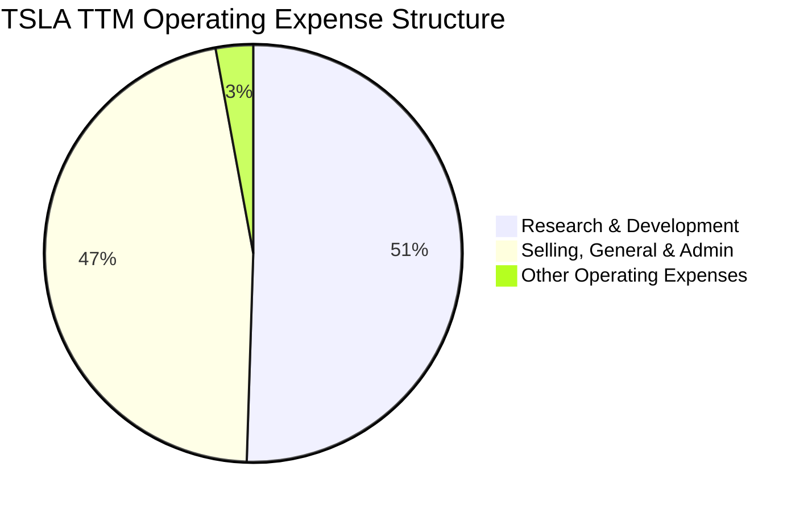

### 3.5 季度 EPS 趨勢與盈餘品質（Quality of Earnings）

特斯拉的盈餘品質近年來受到市場的質疑，主要在於股權薪酬（SBC）的高佔比以及監管信用額度（Regulatory Credits）對淨利的補貼。

| 盈餘品質項目 | 2025-12-31 | TTM (Mar '26) | 評估與對股東報酬的稀釋影響 | 狀態 |
|--------------|------------|---------------|--------------------------|------|
| **股權薪酬 (SBC) / 營收** | 2.98% | **3.35%** | 🟡 處於中高水平，對現有股東造成每年約 1% 的稀釋。 | 🟡 中性 |
| **SBC / 營業現金流** | 19.19% | **19.85%** | 🔴 接近 20% 的 OCF 是由非現金的股權薪酬支撐，虛增了經營現金流。 | 🔴 警訊 |
| **FCF / GAAP 淨利** | 161.3% | **133.7%** | 🟢 現金轉換率 > 100%，顯示 GAAP 淨利並未被高估，盈餘含金量高。 | 🟢 強勁 |
| **Regulatory Credits 依賴度** | ~$1.8B | **~$2.0B** | 🔴 監管信用額度銷售（毛利率 100%）佔了營業利益的近 40%，若扣除此項，核心汽車業務獲利極微。 | 🔴 警訊 |
| **有效稅率** | 26.96% | **27.80%** | 🟡 稅率回歸正常區間（相較於 FY2023 遞延所得稅資產重估帶來的負稅率）。 | 🟡 中性 |

---

## 4. 資產負債表分析

### 4.1 資產結構分解

特斯拉的資產結構極其健康，流動資產佔比高，且幾乎沒有無形資產與商譽，資產「含金量」極高。

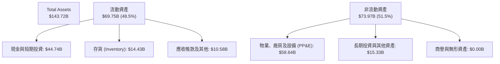

### 4.2 流動性指標分析

| 流動性指標 | FY2023 | FY2024 | FY2025 | TTM | 行業均值 | 評估 |
|------------|--------|--------|--------|-----|----------|------|
| **流動比率 (Current Ratio)** | 1.73x | 2.02x | 2.16x | **2.04x** | ~1.15x | 🟢 遠超行業平均，短期償債能力極強 |
| **速動比率 (Quick Ratio)** | 1.25x | 1.46x | 1.54x | **1.43x** | ~0.80x | 🟢 扣除存貨後仍具備極高的流動性安全邊際 |
| **存貨週轉天數 (DIO)** | 62.9天 | 54.7天 | 58.2天 | **66.5天** | ~55.0天 | 🟡 存貨週轉略有放緩，反映新車型產能爬坡與市場競爭 |

### 4.3 債務結構與健康診斷

特斯拉是全球少數擁有「淨現金」結構的汽車製造商，完全免受高利率環境的衝擊。

```
╔══════════════════════════════════════════════════════════════════╗
║                    TSLA 債務健康診斷 (TTM)                       ║
╠══════════════════════════════════════════════════════════════════╣
║                                                                  ║
║  總債務：        $15.89B  ████░░░░░░░░░░░░░░░░░░  (含融資租賃)   ║
║  現金與短期投資：$44.74B  █████████████████████░  (極度充裕)     ║
║  淨現金（正值）：$28.85B  █████████████░░░░░░░░  🟢 無財務風險   ║
║                                                                  ║
║  Debt / Equity:  18.74%   🟢 槓桿率極低                          ║
║  Debt / EBITDA:  1.44x    🟢 債務償付能力極強                    ║
║  Interest Coverage: 14.4x 🟢 利息保障倍數充沛                    ║
║                                                                  ║
║  📊 診斷結果：資產負債表固若金湯，評級為 🟢 AAA 級財務安全。    ║
╚══════════════════════════════════════════════════════════════════╝
```

---

## 5. 現金流量深度分析

### 5.1 現金流量瀑布圖

特斯拉的現金流呈現典型的「重資本、高研發、高留存」特徵。

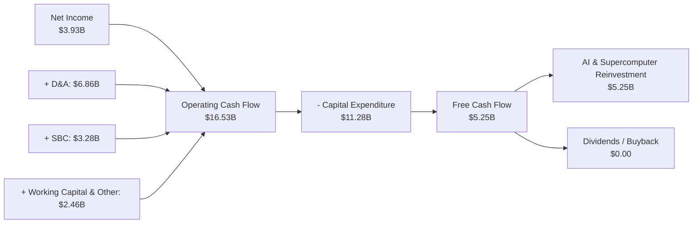

### 5.2 FCF 轉換率與資本回報

| 現金流指標 | FY2022 | FY2023 | FY2024 | FY2025 | TTM | 評估 |
|------------|--------|--------|--------|--------|-----|------|
| **營業現金流 (OCF)** | $14.72B | $13.26B | $14.92B | $14.75B | **$16.53B** | 🟢 經營活動創造現金能力持續增長 |
| **資本支出 (Capex)** | -$7.17B | -$8.90B | -$11.34B| -$8.53B | **-$11.28B**| 🔴 Capex 再次擴大，主因 AI 基礎設施投資 |
| **自由現金流 (FCF)** | $7.55B | $4.36B | $3.58B | $6.22B | **$5.25B** | 🟡 自由現金流受制於高額 Capex 投入 |
| **FCF / 淨利 (轉換率)**| 59.98% | 29.11% | 50.20% | 161.35%| **133.72%**| 🟢 盈餘含金量高，但絕對值對應 $1.4T 市值偏低 |
| **FCF Yield** | 0.53% | 0.31% | 0.25% | 0.43% | **0.37%** | 🔴 估值極高，FCF 殖利率極低，缺乏估值安全邊際 |

### 5.3 資本配置評估

特斯拉的資本配置戰略極其專注於**未來成長（再投資）**。
1. **股利與回購**：Dividend Yield 為 **0.0%**，Payout Ratio 為 **0.0%**。特斯拉從未支付股利，也未進行大規模股份回購。
2. **研發與 Capex 雙輪驅動**：TTM 研發（$6.95B）與 Capex（$11.28B）合計高達 **$18.23B**，佔 TTM 營收的 **18.6%**。這表明管理層將所有多餘現金流全部投入到自動駕駛（FSD）、Dojo 超算、Optimus 機器人與下一代平價汽車平台的開發中。

---

## 6. 獲利能力與資本效率

### 6.1 資本回報率歷史趨勢

隨著利潤率的收縮與資產規模的迅速擴大（從 FY2022 的 $82.34B 增至 TTM 的 $143.72B），特斯拉的資本回報率出現了顯著的「均值回歸」。

| 指標 | FY2022 | FY2023 | FY2024 | FY2025 | TTM | 行業均值 | 評估 |
|------|--------|--------|--------|--------|-----|----------|------|
| **ROE** | 28.10% | 23.94% | 9.81% | 4.62% | **4.90%** | ~12.0% | 🔴 跌破行業平均，股東權益回報率大幅下滑 |
| **ROA** | 15.29% | 14.05% | 5.86% | 2.75% | **2.20%** | ~4.5% | 🔴 資產利用效率下降，受產能爬坡期壓抑 |
| **ROIC**| 21.40% | 14.80% | 7.90% | 5.80% | **6.30%** | ~7.0% | 🔴 投入資本回報率低於資金成本 |

### 6.2 ROIC vs WACC 分析（核心價值創造判斷）

這是評估特斯拉是否在創造經濟價值的最核心指標。

```
╔══════════════════════════════════════════════════════════════════╗
║               TSLA ROIC vs WACC 深度分析 (TTM)                   ║
╠══════════════════════════════════════════════════════════════════╣
║                                                                  ║
║  WACC (加權平均資金成本) 估算：                                  ║
║  ├── 無風險利率 (10Y 美債)：     4.20%                           ║
║  ├── 市場風險溢酬 (ERP)：        5.00%                           ║
║  ├── Beta (系統性風險)：         1.802                           ║
║  ├── 股權成本 (Ke)：             4.2% + 1.802 × 5% = 13.21%     ║
║  ├── 債務成本 (稅後 Kd)：        $339M / $15.89B × (1-27.8%) = 1.54%║
║  ├── 資本結構：                  股權 84.2% ｜ 債務 15.8%        ║
║  └── ✅ WACC ≈ 11.34%                                            ║
║                                                                  ║
║  ROIC (投入資本回報率) 估算：                                    ║
║  ├── NOPAT = Operating Income $4.897B × (1 - 27.8%) = $3.536B    ║
║  ├── Invested Capital = Equity $85B + Debt $15.89B - Cash $44.74B║
║  │                      = $56.15B                                ║
║  └── ✅ ROIC ≈ 6.30%                                             ║
║                                                                  ║
║  ★ 經濟價值增加 (EVA) = ROIC - WACC = -5.04%                    ║
║                                                                  ║
║  ROIC  6.30%   ▓▓▓▓▓▓▓▓▓▓▓▓░░░░░░░░░░░░░░░░░░  🔴              ║
║  WACC  11.34%  ▓▓▓▓▓▓▓▓▓▓▓▓▓▓▓▓▓▓▓▓▓▓░░░░░░░░  ──              ║
║  EVA   -5.04%  ██████░░░░░░░░░░░░░░░░░░░░░░░░  🔴 價值摧毀期    ║
║                                                                  ║
║  📊 結論：當前 ROIC 低於 WACC，主因高折舊與研發支出尚未變現。     ║
║            特斯拉目前處於「資本擴張與價值摧毀期」，未來股價上行  ║
║            完全依賴於 AI 與 FSD 帶動的 ROIC 暴發性回升。          ║
╚══════════════════════════════════════════════════════════════════╝
```

### 6.3 杜邦三因素分解（TTM）

杜邦分析揭示了 ROE 下滑的結構性原因：主要由**淨利潤率暴跌**與**資產週轉率下滑**雙重打擊所致，而財務槓桿保持穩定。

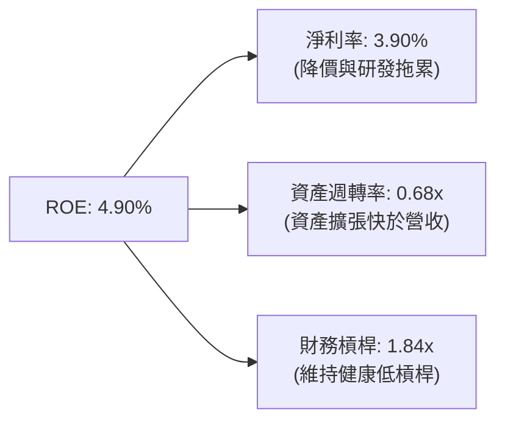

---

## 7. 估值深度分析

### 7.1 同業估值比較表格

特斯拉的估值不能單純與傳統車企（如豐田）或純電動車企（如比亞迪）對比，必須引入 AI 科技巨頭（如英偉達）作為溢價參照物，因為市場將其視為「AI 與機器人」的期權。

| 估值指標 | **Tesla (TSLA)** | **BYD (BYDDY)** | **Toyota (TM)** | **Nvidia (NVDA)** | TSLA 估值評估 | 狀態 |
|----------|----------|---------|---------|---------|-----------|------|
| **Trailing P/E** | **346.22x** | 18.5x | 8.2x | 72.4x | 🔴 處於極端極值，遠超所有同業 | 🔴 警訊 |
| **Forward P/E** | **149.11x** | 15.2x | 7.8x | 35.6x | 🔴 隱含了極其苛刻的未來成長預期 | 🔴 警訊 |
| **P/S Ratio** | **14.61x** | 1.1x | 0.8x | 28.2x | 🔴 遠高於汽車製造業標準（通常 < 1.5x）| 🔴 警訊 |
| **EV / EBITDA** | **126.39x** | 9.8x | 5.2x | 52.1x | 🔴 顯示即使扣除折舊，核心獲利估值依然昂貴 | 🔴 警訊 |
| **FCF Yield** | **0.37%** | ~4.5% | ~6.8% | ~1.8% | 🔴 現金流回報極低，缺乏下檔安全邊際 | 🔴 警訊 |

### 7.2 歷史 P/E 估值區間 (Forward P/E)

```
╔══════════════════════════════════════════════════════════════════╗
║               TSLA 歷史 Forward P/E 區間 (近5年)                 ║
╠══════════════════════════════════════════════════════════════════╣
║                                                                  ║
║  歷史高點： 220x                                                 ║
║  當前位置： 149.1x  ████████████████████████████░░░░░░░          ║
║  歷史均值：  90x                                                 ║
║  歷史低點：  45x                                                 ║
║                                                                  ║
║  📊 評估：當前 Forward P/E (149.1x) 處於歷史均值上方一倍標準差， ║
║            顯示市場對自動駕駛與機器人業務的樂觀預期已高度定價。  ║
╚══════════════════════════════════════════════════════════════════╝
```

### 7.3 情境目標價推導（3情境模型）

本模型基於 2026-2030 年的預測，主要估值乘數採用 **EV/EBITDA** 與 **Forward P/E** 混合估值，以避免單一 P/E 受短期淨利波動干擾。

| 情境 | 營收 CAGR (5Y) | 2030 營業利潤率 | 2030 隱含 EPS | 退出倍數 (P/E) | 12M 目標價 | 相對現價漲跌幅 | 概率權重 |
|------|-----------|-----------|---------------|--------------|------------|----------------|----------|
| 🔴 **悲觀情境** | 8.0% | 5.0% | $1.80 | 60x | **$125.00** | -67.18% | 20% |
| 🟡 **基準情境** | **18.0%** | **10.0%** | **$3.20** | **120x** | **$410.00** | **+7.66%** | **60%** |
| 🟢 **樂觀情境** | 30.0% | 18.0% | $5.50 | 180x | **$600.00** | +57.55% | 20% |

*   **基準情境假設說明**：汽車銷量維持 12-15% 溫和增長，平價 Model 2 於 2027 年放量；儲能業務維持 30% 成長；FSD 訂閱率穩步上升，但 Robotaxi 尚未大規模貢獻利潤。
*   **悲觀情境假設說明**：價格戰加劇，汽車利潤率進一步萎縮；FSD 監管受阻，Robotaxi 項目流產；市場將其重新定位為純硬體製造商。

### 7.4 DCF 敏感性分析（12M 目標價矩陣）

基於永續成長率 $g = 3.5\%$，對 WACC（資金成本）與 5 年營收 CAGR 進行敏感性測試：

| 營收 CAGR \ WACC | 10.5% | **11.34%（基準）** | 12.5% |
|------------------|--------------|----------------------|--------------|
| 🟢 **25.0% (樂觀)** | **$535.00** (+40.5%) | **$485.00** (+27.4%) | **$415.00** (+9.0%) |
| 🟡 **18.0% (基準)** | **$455.00** (+19.5%) | **$410.00** (+7.66%) | **$350.00** (-8.1%) |
| 🔴 **10.0% (悲觀)** | **$280.00** (-26.5%) | **$245.00** (-35.7%) | **$205.00** (-46.2%) |

---

## 8. 成長催化劑

### 8.1 催化劑時間軸

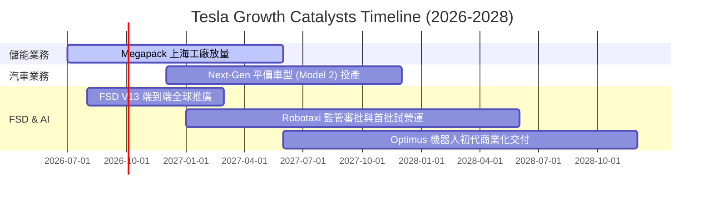

### 8.2 TAM (可觸及市場) 結構分析

特斯拉正在從 $1T 的汽車市場，向 $10T 的自動駕駛與具身智能市場跨越。

```
╔══════════════════════════════════════════════════════════════════╗
║                    TSLA 潛在市場 (TAM) 估算                      ║
╠══════════════════════════════════════════════════════════════════╣
║                                                                  ║
║  全球智慧電動車 (EV)：  TAM ~$1.5T  ｜ 當前滲透率 6%              ║
║  全球電網級儲能 (ESS)： TAM ~$0.5T  ｜ 當前滲透率 2%              ║
║  Robotaxi 出行服務：    TAM ~$4.0T  ｜ 當前滲透率 0%              ║
║  Optimus 具身智慧：     TAM ~$5.0T  ｜ 當前滲透率 0%              ║
║                                                                  ║
║  📊 結論：特斯拉的核心估值溢價，實質上是對自動駕駛（Robotaxi）   ║
║            與機器人（Optimus）這兩個數兆美元市場的「看漲期權」。 ║
╚══════════════════════════════════════════════════════════════════╝
```

### 8.3 成長驅動力結構圖

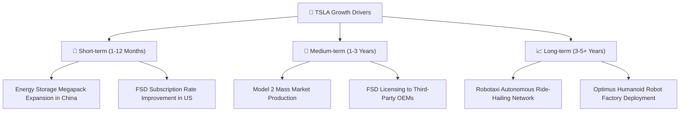

---

## 9. 風險矩陣

### 9.1 風險評分矩陣

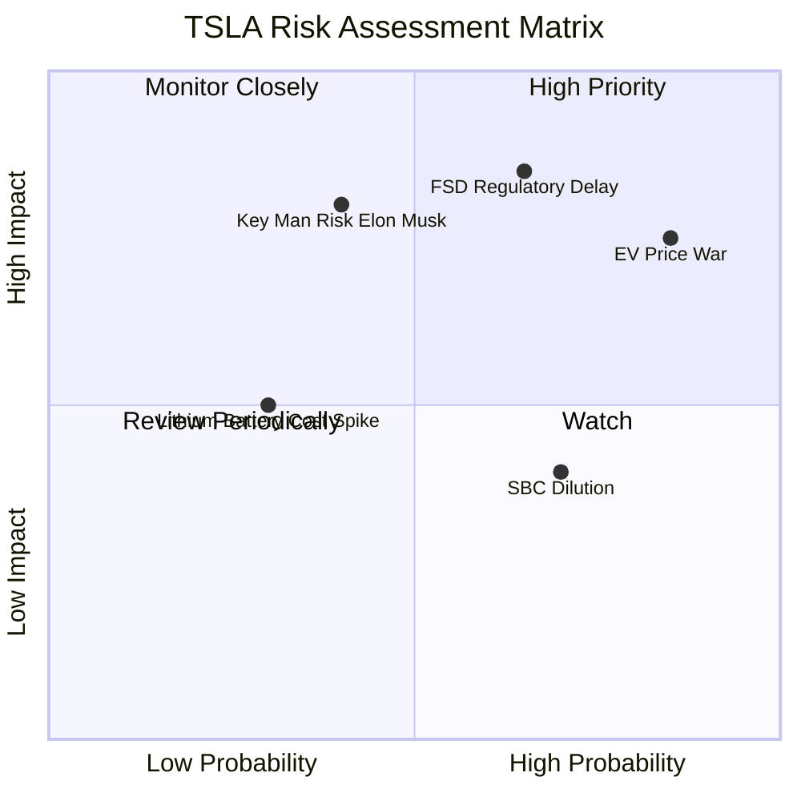

### 9.2 風險清單詳細分析

| # | 風險項目 | 發生機率 | 財務衝擊 | 風險評分 | 緩解措施 / 機構觀察指標 |
|---|----------|----------|----------|----------|------------------------|
| 1 | 🔴 **FSD 監管與技術瓶頸** | 中高 (65%) | 高 (-20% 估值溢價) | 🔴 **8.5/10** | 密切追蹤美國 NHTSA 對特斯拉 Autopilot/FSD 的調查進展及各州 Robotaxi 牌照發放情況。 |
| 2 | 🔴 **全球電動車價格戰持續** | 高 (85%) | 中高 (-5% 毛利率) | 🔴 **8.0/10** | 觀察特斯拉每季汽車業務毛利率（扣除 Credits）是否能守住 15% 的底線。 |
| 3 | 🟡 **關鍵人物風險 (Elon Musk)**| 中 (40%) | 高 (-30% 股價衝擊) | 🟡 **7.0/10** | 關注馬斯克在 SpaceX、xAI 的時間分配，以及其薪酬方案的訴訟結果。 |
| 4 | 🟡 **股權稀釋 (SBC)** | 高 (70%) | 低 (-1.5% EPS/年) | 🟡 **5.5/10** | 監控每季稀釋股數的增長速度，確認是否侵蝕每股收益。 |

---

## 10. 投資建議

### 10.1 最終綜合評級雷達圖

```
╔══════════════════════════════════════════════════════════════╗
║                    TSLA 綜合投資評級儀表板                   ║
╠══════════════════════════════════════════════════════════════╣
║ 基本面強度：  7.5 / 10 ▓▓▓▓▓▓▓▓▓▓▓▓▓▓▓░░░░░  ★★★★☆          ║
║ 財務健康度：  9.5 / 10 ▓▓▓▓▓▓▓▓▓▓▓▓▓▓▓▓▓▓▓░  ★★★★★          ║
║ 成長潛力：    8.0 / 10 ▓▓▓▓▓▓▓▓▓▓▓▓▓▓▓▓░░░░  ★★★★☆          ║
║ 估值安全邊際：4.0 / 10 ▓▓▓▓▓▓▓▓░░░░░░░░░░░░  ★☆☆☆☆          ║
║ 資本配置效率：7.5 / 10 ▓▓▓▓▓▓▓▓▓▓▓▓▓▓▓░░░░░  ★★★☆☆          ║
╠══════════════════════════════════════════════════════════════╣
║ 綜合得分：    7.3 / 10 ▓▓▓▓▓▓▓▓▓▓▓▓▓▓░░░░░░  🏆 持有 (Hold)   ║
║ 當前建議：    🟡 **持有 (Hold)** ｜ 建議區間：$350.00 - $390.00  ║
╚══════════════════════════════════════════════════════════════╝
```

### 10.2 目標價與隱含報酬率

| 情境 | 權重 | 目標價 | 隱含報酬率 | 權重期望值 |
|------|------|--------|------------|------------|
| 🔴 **悲觀情境** | 20% | $125.00 | -67.18% | -$13.44 |
| 🟡 **基準情境** | **60%** | **$410.00** | **+7.66%** | **+$4.60** |
| 🟢 **樂觀情境** | 20% | $580.00 | +52.30% | +$10.46 |
| **加權目標價** | **100%** | **$387.00** | **+1.62%** | **當前股價定價極為合理** |

### 10.3 買入時機與觸發因素

```
╔══════════════════════════════════════════════════════════════════╗
║                  ✅ TSLA 買入/賣出觸發因素 Checklist            ║
╠══════════════════════════════════════════════════════════════════╣
║                                                                  ║
║  立即買入觸發條件（需滿足 2 項以上）：                           ║
║  ☐ 股價回落至 $320.00 以下（對應 Forward P/E < 125x）            ║
║  ✅ 汽車業務毛利率（Excluding Credits）連續兩季回升至 18% 以上    ║
║  ☐ 特斯拉宣佈與主流車企達成首個 FSD 授權協議                     ║
║                                                                  ║
║  加碼觸發條件：                                                  ║
║  ☐ Robotaxi 獲得美國至少 3 個主要城市的完全無人駕駛商業營運牌照  ║
║  ✅ 儲能業務單季營收突破 $4B 且毛利率維持在 25% 以上            ║
║                                                                  ║
║  減碼/停損觸發條件（出現任一即可）：                             ║
║  ☐ 核心汽車業務毛利率跌破 14%                                    ║
║  ☐ 稀釋股數 (Diluted Shares) 按年增速超過 3%                     ║
║  ☐ CEO 宣佈進一步減持特斯拉股份以支持其他私人公司                ║
╚══════════════════════════════════════════════════════════════════╝
```

### 10.4 投資人適配度分析

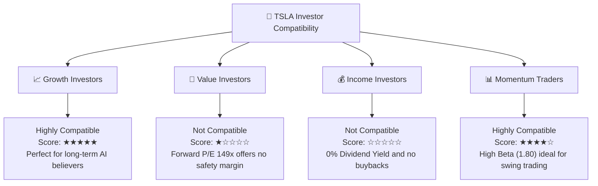

### 10.5 每季財報監控清單（Quarterly Watch List）

機構投資者在未來每一季財報中應嚴格追蹤以下指標，以評估多頭投資邏輯是否依然成立：

| 監控指標 | 當前值 (Q1 2026) | 偏多門檻 (加碼) | 偏空門檻 (減碼/停損) | 監控核心目的 |
|----------|-----------------|-----------------|----------------------|--------------|
| **汽車毛利率 (Ex-Credits)** | **16.4%** (估算) | > 18.0% | < 14.0% | 評估定價權與成本控制能力是否改善 |
| **儲能裝機量 (GWh)** | **4.5 GWh** (估算) | > 6.0 GWh | < 3.5 GWh | 驗證第二成長曲線的動能 |
| **研發費用率 (R&D / Revenue)**| **8.69%** | < 7.0% (效率提升) | > 11.0% (資本黑洞) | 評估 AI 再投資的資本效率 |
| **自由現金流 (FCF)** | **$1.44B** | > $2.5B | 轉負 (Negative FCF) | 確保重資本支出下財務流動性安全 |
| **Diluted Shares Outstanding**| **3.53B** | < 3.50B (回購) | > 3.60B (過度稀釋) | 監控股權稀釋對每股回報的侵蝕 |

### 10.6 反面論證：什麼會證明論點錯誤（What Would Change My Mind）

```
╔══════════════════════════════════════════════════════════════════╗
║              ⚠️ 多頭論點失效條件 (Disconfirming Evidence)         ║
╠══════════════════════════════════════════════════════════════════╣
║  如果出現以下任何一項可量化條件，本報告的「持有」評級將直接下調   ║
║  至「賣出」，且基準目標價將下調至 $200.00 以下：                 ║
║                                                                  ║
║  ☐ 條件一：核心汽車毛利率（不含信用額度）連續兩季低於 13%。     ║
║            （證明特斯拉已失去製造溢價，徹底淪為傳統代工利潤率）  ║
║                                                                  ║
║  ☐ 條件二：TTM 自由現金流（FCF）連續兩季轉為淨流出。             ║
║            （證明 AI 的重資本再投資已開始嚴重消耗其現金儲備）    ║
║                                                                  ║
║  ☐ 條件三：ROIC（投入資本回報率）持續低於 5%，且與 WACC 的差值   ║
║            （EVA 負值）擴大至 -7.0% 以上。                       ║
║            （證明公司正在進行長期的「價值摧毀」而非「價值創造」）║
║                                                                  ║
║  ☐ 條件四：FSD V13 在北美市場的平均無接管里程（Miles per Dis-    ║
║            engagement）連續兩季停滯或下滑。                      ║
║            （證明端到端技術遭遇瓶頸，L4/L5 自動駕駛無法實現）    ║
╚══════════════════════════════════════════════════════════════════╝
```

---

> **免責聲明**：本報告為基於客觀財務數據之學術與投資研究分析，不構成任何買賣建議。投資人應自行承擔市場風險。