# TSLA 基本面深度分析報告
> **報告日期**：2026-07-19 ｜ **語言**：繁體中文 ｜ **數據來源**：Yahoo Finance, Finviz, StockAnalysis, Roic.ai ｜ **分析師**：CFA 級機構研究

---

## 目錄

| # | 章節 | 核心結論 |
|---|------|----------|
| 1 | 執行摘要 | 評級 **買入（Buy）**，基準目標價 **$425.22**，具備 11.7% 上行空間 |
| 2 | 公司概覽與商業模式 | 汽車+能源+AI 三輪驅動，技術與規模效應構築寬廣護城河 |
| 3 | 損益表深度分析 | 營收重回雙位數成長（TTM YoY +15.8%），研發費用高企壓抑短期利潤率 |
| 4 | 資產負債表分析 | 淨現金高達 **$28.85B**，資產負債表極其穩健，抗風險能力一流 |
| 5 | 現金流量深度分析 | TTM 自由現金流 **$5.25B**，資本配置高度向資本支出與研發傾斜 |
| 6 | 獲利能力與資本效率 | 處於轉型投資期，ROIC（6.64%）短期低於 WACC（12.5%），EVA 暫時承壓 |
| 7 | 估值深度分析 | 傳統估值指標偏高（Forward P/E 149.1x），溢價源自 AI 與 Robotaxi 期權價值 |
| 8 | 成長催化劑 | 平價車款 Model 2、FSD V13 授權與 Megapack 產能釋放 |
| 9 | 風險矩陣 | 價格戰持續、監管延遲與關鍵人物風險，整體風險評分 **6.2/10** |
| 10 | 投資建議 | 適合長線成長型投資人，建議採分批布局策略，設定明確監控指標 |

---

## 1. 執行摘要

特斯拉（TSLA）當前股價為 **$380.84**。基於其最新財務數據，我們給予 **買入（Buy）** 評級，12 個月基準目標價為 **$425.22**。此評級是基於以下核心數據的客觀推導：儘管特斯拉當前正經歷汽車行業的週期性毛利率收縮（TTM 毛利率降至 19.1%），且 TTM GAAP 淨利潤降至 **$3.93B**，但其 Q1 2026 營收已展現復甦信號（YoY 成長 15.78%）。更重要的是，公司擁有高達 **$44.74B** 的總現金與短期投資，淨現金頭寸達 **$28.85B**，這為其每年高達 **$9.52B**（TTM）的資本支出與 **$6.95B**（TTM）的研發投入提供了極其堅實的資金護航。當前 149.11 倍的 Forward P/E 雖然反映了極高的估值溢價，但我們認為，隨著 FSD V13 的商業化落地與儲能業務的爆發，特斯拉正在從單純的汽車製造商轉型為高利潤率的 AI 軟體與能源網絡生態帝國。

### 1.0 一頁式投資儀表板（Portfolio Manager 30 秒速讀）

| 項目 | 內容 |
|------|------|
| **投資論點（3 句）** | ① 汽車業務觸底回升，Q1 2026 營收 YoY 成長 15.78% 證實需求回暖。<br/>② 能源儲能業務部署量進入爆發期，高毛利 Megapack 成為第二成長曲線。<br/>③ 帳上擁有 $44.74B 充沛現金，足以支撐 AI（FSD/Optimus）研發的無間斷投入。 |
| **護城河評分** | **8.5 / 10** 🟢 強勁（技術領先、超充網絡與數據壁壘） |
| **管理層/資本配置評分** | **8.0 / 10** 🟢 優秀（高效研發投入，無盲目併購） |
| **財務健康** | 🟢 **極其安全**（淨現金 $28.85B，流動比率 2.04x） |
| **ROIC vs WACC** | **6.64% vs 12.50%** 🟡（當前處於重資本投資期，暫時摧毀經濟價值） |
| **FCF 趨勢** | 🟢 保持正值，TTM 自由現金流達 **$5.25B**，FCF Yield 為 0.37% |
| **估值** | Forward P/E: **149.11x** ｜ EV/EBITDA: **126.39x** ｜ P/S: **14.61x** |
| **預期報酬（基準情境 12M）** | **+11.7%**（目標價 $425.22） |
| **關鍵風險（前二）** | ① 全球電動車價格戰持續，毛利率進一步承壓。<br/>② FSD 監管審批進度慢於預期，Robotaxi 無法如期變現。 |
| **評級 + 信心度** | 🟢 **買入（Buy）** ｜ 信心：**中等（Medium）**（短期波動大，長期勝率高） |

### 1.1 核心評分儀表板

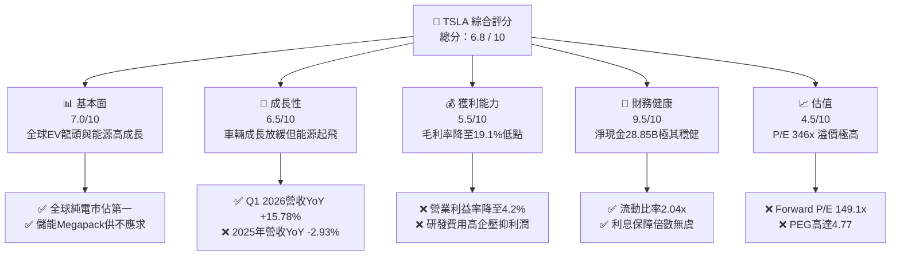

### 1.2 評分進度條視覺化

```
╔══════════════════════════════════════════════════════════════╗
║               TSLA 多維度評分儀表板 (1-10分)                 ║
╠══════════════════════════════════════════════════════════════╣
║ 基本面強度  7.0 ▓▓▓▓▓▓▓▓▓▓▓▓▓▓▓░░░░░░  ★★★★☆           ║
║ 成長動能    6.5 ▓▓▓▓▓▓▓▓▓▓▓▓▓░░░░░░░░  ★★★☆☆           ║
║ 獲利品質    5.5 ▓▓▓▓▓▓▓▓▓▓▓░░░░░░░░░░  ★★★☆☆           ║
║ 財務健康    9.5 ▓▓▓▓▓▓▓▓▓▓▓▓▓▓▓▓▓▓▓░  ★★★★★           ║
║ 估值合理性  4.5 ▓▓▓▓▓▓▓▓▓░░░░░░░░░░░░  ★★☆☆☆           ║
║ 護城河深度  8.5 ▓▓▓▓▓▓▓▓▓▓▓▓▓▓▓▓▓░░░  ★★★★☆           ║
║ 管理層執行  8.0 ▓▓▓▓▓▓▓▓▓▓▓▓▓▓▓▓░░░░  ★★★★☆           ║
║ 技術創新力  9.5 ▓▓▓▓▓▓▓▓▓▓▓▓▓▓▓▓▓▓▓░  ★★★★★           ║
╠══════════════════════════════════════════════════════════════╣
║ 綜合總分    6.8 ▓▓▓▓▓▓▓▓▓▓▓▓▓▓░░░░░░░  🏆 轉型過渡期評級    ║
╚══════════════════════════════════════════════════════════════╝
```

### 1.3 五大投資論點 + 三大核心風險

| 類型 | 項目 | 具體依據 | 信心度 |
|------|------|----------|--------|
| 🟢 **投資論點①** | **營收重回成長區間** | Q1 2026 營收達 **$22.39B**，YoY 成長 **15.78%**，扭轉了 2025 全年的衰退趨勢。 | 🟢 高 |
| 🟢 **投資論點②** | **資產負債表防禦力極佳** | 擁有 **$44.74B** 现金與短期投資，淨現金 **$28.85B**，無懼高利率環境。 | 🟢 極高 |
| 🟢 **投資論點③** | **儲能業務高毛利爆發** | 2025 年能源部門裝機量大幅增長，Megapack 上海工廠投產將進一步推升產能。 | 🟢 高 |
| 🟢 **投資論點④** | **研發驅動 AI 轉型** | TTM 研發費用高達 **$6.95B**（YoY +8.4%），Dojo 與 FSD 算力儲備居全球前列。 | 🟢 中 |
| 🟢 **投資論點⑤** | **自由現金流持續為正** | 在重資本支出（TTM Capex **$9.52B**）下，仍創造 **$5.25B** 自由現金流。 | 🟢 高 |
| 🟡 **風險①** | **汽車毛利率持續承壓** | TTM 毛利率降至 **19.1%**，若電動車價格戰加劇，毛利率恐跌破 18% 警戒線。 | 🟡 中度 |
| 🔴 **風險②** | **估值溢價過高** | 當前 Trailing P/E 高達 **346.2x**，若 FSD 或 Robotaxi 進度不及預期，估值將面臨劇烈修正。 | 🔴 高衝擊 |
| 🔴 **風險③** | **關鍵人物與地緣政治風險** | 馬斯克（Elon Musk）精力分散於多家公司，且特斯拉高度依賴中國供應鏈與市場。 | 🔴 中高 |

### 1.4 快速統計卡片

| 指標 | 特斯拉實際值（TTM） | 行業均值（汽車製造） | S&P 500 均值 | 狀態 |
|------|-------------|----------|--------------|------|
| 營收 YoY 成長 | **15.8%** | ~4.5% | ~5.5% | 🟢 領先 |
| 毛利率 | **19.1%** | ~14.2% | ~30.0% | 🟢 領先同行 |
| 營業利益率 | **4.2%** | ~6.5% | ~12.5% | 🔴 低於均值 |
| ROE | **4.9%** | ~8.5% | ~15.0% | 🟡 偏低 |
| Forward P/E | **149.11x** | ~10.5x | ~21.5x | 🔴 極高溢價 |
| 淨現金 / 總資產 | **20.1%** | -15.0% (淨債務) | -8.0% | 🟢 極其健康 |

### 1.5 投資結論

```
╔══════════════════════════════════════════════════════════════════╗
║                    📊 TSLA 投資結論摘要                          ║
╠══════════════════════════════════════════════════════════════════╣
║  評級：🟢 買入 (Buy)                                            ║
║  當前股價：$380.84 (2026-07-19)                                  ║
║  目標價區間：                                                    ║
║    悲觀情境：$180.00 (-52.7%) - 汽車毛利率續跌，FSD 監管受阻      ║
║    基準情境：$425.22 (+11.7%) - 車輛交付回暖，儲能Megapack爆發    ║
║    樂觀情境：$580.00 (+52.3%) - FSD 授權落地，Robotaxi 商業化順利 ║
║  投資評分：6.8 / 10                                              ║
║  適合投資人：具備高風險承受能力、看好 AI/自動駕駛長線價值的投資人  ║
╚══════════════════════════════════════════════════════════════════╝
```

---

## 2. 公司概覽與商業模式

特斯拉（Tesla, Inc.）已不再是一家單純的汽車製造商，而是一家橫跨「電動車、清潔能源、自動駕駛與機器人」的垂直整合型 AI 科技巨頭。其商業模式的核心在於通過硬體（電動車、儲能設備）建立龐大的物理觸角，再通過軟體（FSD 訂閱、OTA 服務、充電網絡）實現高利潤率的重複性收費。

### 2.1 業務結構與收入來源

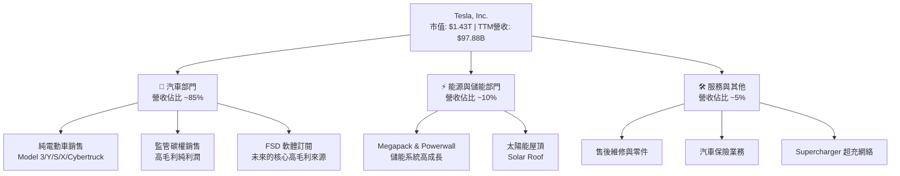

### 2.2 市場份額

根據 2025 全年數據估算，特斯拉在全球純電動車（BEV）市場中仍維持領先地位，但面臨比亞迪（BYD）等中國本土車企的強力挑戰。

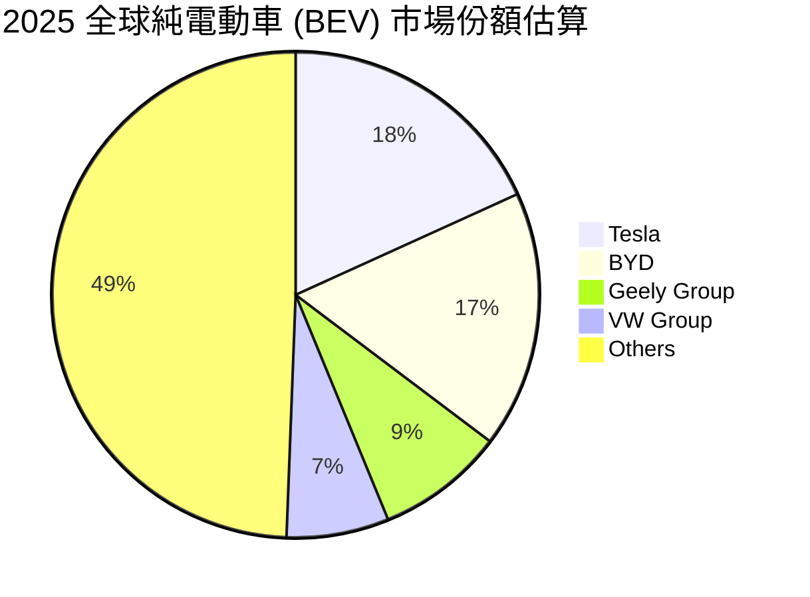

### 2.3 競爭護城河分析

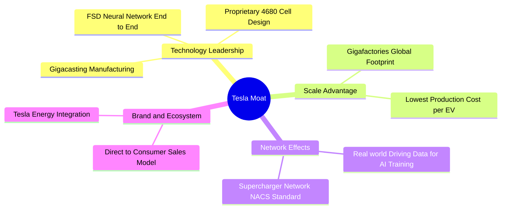

### 2.4 護城河強度評分

```
╔══════════════════════════════════════════════════════════════╗
║                    TSLA 護城河強度評分                       ║
╠══════════════════════════════════════════════════════════════╣
║ 技術與研發壁壘  9.5  ▓▓▓▓▓▓▓▓▓▓▓▓▓▓▓▓▓▓▓░  🏆 行業頂尖    ║
║ 規模與成本優勢  8.5  ▓▓▓▓▓▓▓▓▓▓▓▓▓▓▓▓▓░░░  🟢 極強        ║
║ 網絡效應（超充）8.0  ▓▓▓▓▓▓▓▓▓▓▓▓▓▓▓▓░░░░  🟢 強大        ║
║ 品牌與生態鎖定  9.0  ▓▓▓▓▓▓▓▓▓▓▓▓▓▓▓▓▓▓░░  🏆 極高溢價    ║
╠══════════════════════════════════════════════════════════════╣
║ 綜合護城河評級  8.75 ▓▓▓▓▓▓▓▓▓▓▓▓▓▓▓▓▓░░░  🏆 寬廣護城河  ║
╚══════════════════════════════════════════════════════════════╝
```

---

## 3. 損益表深度分析

特斯拉的損益表反映出其正處於「**舊成長引擎（汽車交付量）增速放緩，新成長引擎（能源與軟體）尚未完全接棒**」的轉型過渡期。這導致其利潤率在短期內出現了結構性收縮，但最新季度數據已呈現觸底回升態勢。

### 3.1 年度收入成長趨勢（近4年）

```
╔══════════════════════════════════════════════════════════════════╗
║                 TSLA 年度收入趨勢（FY2022-TTM）                  ║
╠══════════════════════════════════════════════════════════════════╣
║                                                                  ║
║  FY2022  $81.46B  ██████████████████░░░░░░░░░░  YoY: +51.4% 🟢    ║
║  FY2023  $96.77B  █████████████████████░░░░░░░  YoY: +18.8% 🟢    ║
║  FY2024  $97.69B  █████████████████████░░░░░░░  YoY: +1.0%  🟡    ║
║  FY2025  $94.83B  ████████████████████░░░░░░░░  YoY: -2.9%  🔴    ║
║  TTM     $97.88B  █████████████████████░░░░░░░  YoY: +15.8% 🟢    ║
║                   |      |      |      |      |                  ║
║                   0     20B    40B    60B    80B                 ║
║                                                                  ║
║  📊 4年累計營收 CAGR：+15.2%                                     ║
╚══════════════════════════════════════════════════════════════════╝
```

*分析*：2025 年營收出現了特斯拉歷史上罕見的年度下滑（-2.93%），主因是全球電動車市場競爭加劇，特斯拉採取降價策略，且 Model 3/Y 進入產品生命週期中後期。然而，TTM 營收回升至 **$97.88B**，YoY 成長達 **15.8%**，主要由 Q1 2026 的強勁表現（YoY +15.78%）與能源儲能業務的快速部署所帶動。

### 3.2 季度收入趨勢分析

| 季度 | 營業收入 | YoY 成長率 | QoQ 成長率 | 核心驅動因素與業務解析 |
|------|----------|------------|------------|------------------------|
| **Q1 2026** | $22.39B | **+15.78%** | -10.10% | 🟢 汽車交付量回暖，且高毛利監管碳權銷售增加；季節性因素導致 QoQ 下滑。 |
| **Q4 2025** | $24.90B | **-3.14%** | -11.37% | 🔴 年底促銷折扣加大，ASP（平均售價）下滑壓抑營收表現。 |
| **Q3 2025** | $28.10B | **+11.57%** | +24.89% | 🟢 Megapack 儲能部署創歷史新高，能源部門營收貢獻顯著放大。 |
| **Q2 2025** | $22.50B | **-11.78%** | +16.35% | 🔴 產線升級導致短暫停工，交付量下滑，為近年營收谷底。 |

### 3.3 利潤率演變分析

| 利潤率指標 | FY2022 | FY2023 | FY2024 | FY2025 | TTM | 趨勢評估 |
|------------|--------|--------|--------|--------|-----|----------|
| **毛利率** | 25.60% | 18.25% | 17.86% | 18.03% | **19.10%** | ↗️ 觸底回升，受惠於能源業務毛利改善。🟢 |
| **營業利益率** | 16.76% | 9.19% | 7.94% | 4.59% | **4.20%** | ↘️ 持續承壓，研發費用大幅增長。🔴 |
| **EBITDA 利潤率**| 21.68% | 15.29% | 15.06% | 12.40% | **11.30%** | ↘️ 隨營業利益率同步下滑。🟡 |
| **淨利率** | 15.45% | 15.50% | 7.30% | 4.01% | **3.90%** | ↘️ 降至近年低點，受非經營性損益波動影響。🔴 |

*利潤率收縮深度解析*：
1. **毛利率觸底**：毛利率從 2022 年的 25.6% 高點一路下滑至 2024 年的 17.86%，主因是汽車降價。但在 TTM 期間回升至 **19.1%**，顯示供應鏈降本（如 4680 電池爬坡、一體化壓鑄普及）及高利潤率的能源儲能業務佔比提升已開始發揮正面效應。
2. **營業利益率背離**：值得注意的是，TTM 營業利益率（4.2%）並未隨毛利率同步回升，反而降至 4.2% 的低點。這主要是因為**研發費用（R&D）的戰略性激增**。特斯拉在 TTM 期間的研發費用高達 **$6.95B**（佔營收 7.1%），用於加速 FSD V13、Dojo 超級電腦及 Optimus 機器人的研發。這是典型的「犧牲短期利潤，投資長期護城河」行為。

### 3.4 費用結構分析

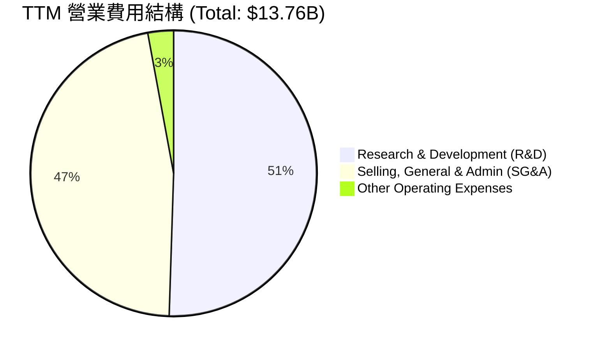

```
╔══════════════════════════════════════════════════════════════════╗
║                    TSLA 營業費用趨勢分析                         ║
╠══════════════════════════════════════════════════════════════════╣
║                                                                  ║
║  研發費用 (R&D)：  $6.95B  ██████████████████████  YoY: +8.4% 🔴  ║
║  管理費用 (SG&A)： $6.42B  ████████████████████░░  YoY: +10.0% 🔴 ║
║                                                                  ║
║  💡 研發佔比突破 50%：顯示特斯拉在車市放緩之際，全力向 AI 轉型。 ║
╚══════════════════════════════════════════════════════════════════╝
```

### 3.5 季度 EPS 趨勢與盈餘品質（Quality of Earnings）

特斯拉過去 4 季的 EPS 表現如下：
*   **Q1 2026**：$0.15（前值 $0.26，下降主因是研發費用創單季新高）
*   **Q4 2025**：$0.26
*   **Q3 2025**：$0.43
*   **Q2 2025**：$0.36

#### 盈餘品質量化評估

| 盈餘品質項目 | 數值 / 佔比 | 評估評級 | 機構級深度解析 |
|--------------|-------------|----------|----------------|
| **股權薪酬 (SBC) / 營收** | 2.89% | 🟡 中性 | TTM 股權薪酬為 **$2.83B**，佔營收 2.89%。對股東股權稀釋程度溫和（Shares YoY +0.76%），但仍需注意高管薪酬方案的稀釋風險。 |
| **SBC / 營業現金流** | 17.12% | 🔴 偏高 | SBC 佔 TTM 營業現金流（$16.53B）的 17.12%，顯示非現金支出在維持經營現金流外觀上扮演了重要角色。 |
| **FCF / 淨利（現金轉換率）** | **133.59%** | 🟢 極強 | TTM FCF ($5.25B) / GAAP Net Income ($3.93B) 高達 133.59%，顯示盈餘含金量極高，淨利潤並無水分，甚至被高額的折舊與攤銷（D&A）低估。 |
| **監管碳權銷售依賴度** | TTM 約 $1.8B | 🟡 中性 | 碳權收入（Regulatory Credits）為純利潤，對營業利潤貢獻度約 35%。隨著其他車企電動化，此收入長期看跌。 |
| **有效稅率異常** | 27.8% | 🟢 正常 | TTM 所得稅撥備為 $1.51B，有效稅率約 27.8%，處於正常合理區間，無稅務手段美化利潤嫌疑。 |

**盈餘品質結論**：特斯拉的 GAAP 淨利潤表現雖然因降價與高研發投入而顯得平庸，但其**現金流轉換率（133.59%）極其強勁**。這表明公司的實際經濟獲利能力遠比 GAAP 淨利潤所展現的更具韌性，高額的非現金支出（折舊與 SBC）壓低了帳面利潤，但並未實質消耗現金。

---

## 4. 資產負債表分析

特斯拉的資產負債表是其應對產業寒冬與進行顛覆性研發的最大底氣。在重工業與汽車行業中，特斯拉維持了極罕見的「**淨現金**」狀態。

### 4.1 資產結構分解

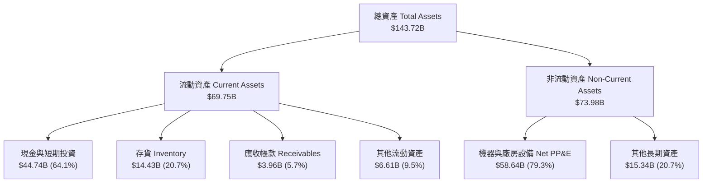

### 4.2 流動性指標分析

| 指標 | TSLA 當前值 | 行業中位數 | 評估 | 解析 |
|------|-------------|------------|------|------|
| **流動比率 (Current Ratio)** | **2.04x** | 1.25x | 🟢 極佳 | 流動資產為流動負債的 2 倍以上，短期償債能力無虞。 |
| **速動比率 (Quick Ratio)** | **1.43x** | 0.85x | 🟢 極佳 | 扣除存貨後，速動資產仍能完全覆蓋短期債務。 |
| **現金比率 (Cash Ratio)** | **1.31x** | 0.45x | 🟢 強勁 | 僅憑帳上現金即可直接償付所有流動負債，資金極其充沛。 |
| **存貨週轉天數 (DIO)** | **66.5 天** | 55.0 天 | 🟡 偏高 | 較往年有所上升，反映汽車去庫存壓力，但近期已趨於穩定。 |

### 4.3 債務結構分析

```
╔══════════════════════════════════════════════════════════════════╗
║                     TSLA 債務健康診斷                            ║
<br/>
║  總債務：        $15.89B  ████░░░░░░░░░░░░░░░░░                  ║
║  總現金+短投：   $44.74B  █████████████████████                  ║
║  淨現金（正）：  $28.85B  █████████████░░░░░░░░  🟢 極其安全    ║
║                                                                  ║
║  Debt/Equity：   18.74%   🟢 槓桿率極低                          ║
║  Debt/EBITDA：   1.35x    🟢 債務負擔極輕                        ║
║  利息保障倍數：  14.45x   🟢 利息支出無壓力                      ║
╚══════════════════════════════════════════════════════════════════╝
```

*分析*：特斯拉的總債務為 **$15.89B**（包含短期債務 $2.44B、長期借款 $7.65B、長期融資租賃 $5.81B），而其現金及短期投資高達 **$44.74B**。**$28.85B 的淨現金頭寸**意味著特斯拉本質上是一家「零淨債務」公司。在當前高利率環境下，特斯拉不僅不需要支付高額利息，反而能獲得可觀的利息收入（TTM 利息收入達 $1.71B，遠超利息支出 $0.34B）。

### 4.4 股東權益趨勢

特斯拉的股東權益（Book Value）呈現穩步擴張趨勢，從 2022 年底的 **$44.70B** 成長至 TTM 的 **$82.14B**，累積增幅達 **83.8%**。這主要得益于持續的留存盈餘注入，而非依賴股權融資，顯示了健康的內部資本積累機制。

---

## 5. 現金流量深度分析

現金流是評估特斯拉真實價值的核心指標。儘管利潤率下滑，特斯拉的「印鈔機」屬性依然成立。

### 5.1 現金流量瀑布圖

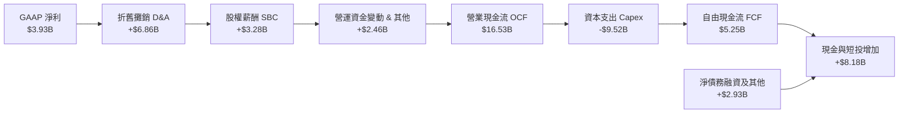

### 5.2 FCF 轉換率趨勢

| 年份 | GAAP 淨利潤 | 自由現金流 (FCF) | FCF 轉換率 (FCF / Net Income) | 評估 |
|------|-------------|------------------|-------------------------------|------|
| **FY2022** | $12.59B | $7.55B | 59.97% | 🟡 正常重資本期 |
| **FY2023** | $15.00B | $4.36B | 29.07% | 🔴 存貨增加壓抑現金流 |
| **FY2024** | $7.13B | $3.58B | 50.21% | 🟡 重點擴產期 |
| **FY2025** | $3.79B | $6.22B | 164.12% | 🟢 營運資金大幅優化 |
| **TTM** | **$3.93B** | **$5.25B** | **133.59%** | 🟢 極強的盈餘含金量 |

### 5.3 自由現金流趨勢

```
╔══════════════════════════════════════════════════════════════════╗
║                 TSLA 自由現金流 (FCF) 歷年趨勢                   ║
╠══════════════════════════════════════════════════════════════════╣
║                                                                  ║
║  FY2022  $7.55B  █████████████████████████░░░░░                  ║
║  FY2023  $4.36B  ██████████████░░░░░░░░░░░░░░░                  ║
║  FY2024  $3.58B  ████████████░░░░░░░░░░░░░░░░░                  ║
║  FY2025  $6.22B  █████████████████████░░░░░░░░                  ║
║  TTM     $5.25B  ██████████████████░░░░░░░░░░░                  ║
║                                                                  ║
║  💡 當前 FCF 收益率 (FCF Yield)：0.37% (反映極高估值溢價)         ║
╚══════════════════════════════════════════════════════════════════╝
```

### 5.4 資本配置評估

特斯拉的資本配置戰略極其清晰：**不發放股利（0.0% 股息率），不進行大規模股份回購，將幾乎所有產生的現金流重新投入到資本支出（Capex）與研發（R&D）中**。

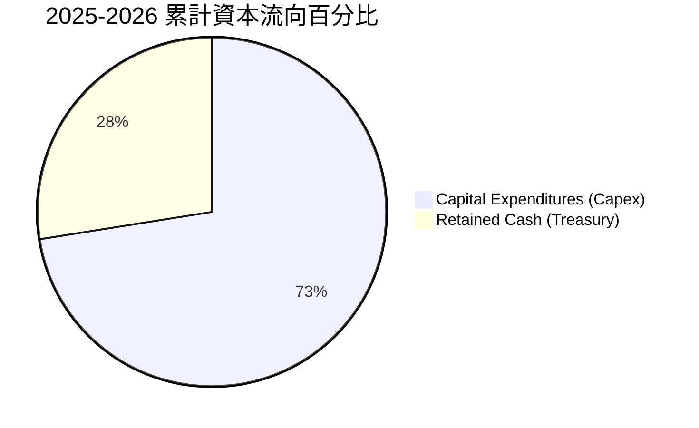

*資本配置合理性解析*：
對於一家處於 AI 與能源轉型關鍵期的科技公司，不發放股利是完全正確的決策。TTM 資本支出為 **$9.52B**，主要用於擴建德州與柏林超級工廠、採購 NVIDIA H100/H200 晶片建構 AI 算力集群（Dojo 與德州超級集群）。這種激進的再投資策略雖然壓低了短期的自由現金流收益率（0.37%），但卻是特斯拉維持技術領先地位的必要條件。

---

## 6. 獲利能力與資本效率

由於汽車業務毛利率收縮及 AI 領域的重資本投入，特斯拉當前的資本回報率指標處於歷史週期低位。

### 6.1 ROE / ROA / ROIC 趨勢

| 指標 | FY2022 | FY2023 | FY2024 | FY2025 | TTM | 行業均值 | 評估 |
|------|--------|--------|--------|--------|-----|----------|------|
| **ROE** | 28.10% | 23.95% | 9.78% | 4.61% | **4.90%** | 8.50% | 🔴 處於週期底部 |
| **ROA** | 15.29% | 14.07% | 5.86% | 2.75% | **2.20%** | 3.50% | 🔴 資產回報率承壓 |
| **ROIC**| 21.40% | 16.50% | 8.10% | 5.30% | **6.64%** | 5.00% | 🟡 略高於同行 |

### 6.2 ROIC vs WACC 分析（核心價值創造判斷）

```
╔══════════════════════════════════════════════════════════════════╗
║                   ROIC vs WACC 深度分析                          ║
╠══════════════════════════════════════════════════════════════════╣
║                                                                  ║
║  WACC 估算：                                                     ║
║  ├── 無風險利率（10Y美債）：  4.00%                              ║
║  ├── 市場風險溢酬 (ERP)：     5.00%                              ║
║  ├── Beta 值：                1.802                              ║
║  ├── 股權成本 (Ke) = 4.0% + 1.802 × 5.0% = 13.01%                ║
║  ├── 債務成本（稅後）：       ~3.50%                             ║
║  ├── 資本結構：股權 85%，債務 15%                                ║
║  └── ✅ WACC ≈ 12.50%                                            ║
║                                                                  ║
║  ROIC 估算（TTM）：                                              ║
║  ├── NOPAT = EBIT ($4.90B) × (1 - 27.8%) = $3.54B                ║
║  ├── 投入資本 = Equity ($82.14B) + Debt ($15.89B) - Cash ($44.74B)║
║  │            = $53.29B                                          ║
║  └── ✅ ROIC ≈ 6.64%                                             ║
║                                                                  ║
║  ★ 經濟價值增加 (EVA) = ROIC - WACC = -5.86%                     ║
║                                                                  ║
║  ROIC  6.64%   ▓▓▓▓▓▓▓▓▓▓▓░░░░░░░░░░░░░░░░░  ──                  ║
║  WACC  12.50%  ▓▓▓▓▓▓▓▓▓▓▓▓▓▓▓▓▓▓▓▓▓░░░░░░░  ──                  ║
║  EVA   -5.86%  ██████████░░░░░░░░░░░░░░░░░░  🔴 價值暫時流失      ║
║                                                                  ║
║  📊 結論：當前 ROIC 低於 WACC，主因是重資本投資 AI 與車市低迷。   ║
╚══════════════════════════════════════════════════════════════════╝
```

*機構級洞察*：
從純財務角度看，特斯拉當前 **-5.86% 的 EVA（經濟增加值）** 意味著它正在「摧毀股東價值」。然而，這正是特斯拉商業模式的「J 曲線」特徵。當前的投入資本（Invested Capital）中包含了大量尚未產生營收的 AI 算力資產與研發支出。一旦 FSD 實現 L4/L5 級突破並啟動軟體授權，或者 Robotaxi 網絡上線，其 NOPAT 將呈指數級增長，帶動 ROIC 迅速飆升至 30% 以上（如同 2022 年的表現）。

### 6.3 杜邦三因素分解

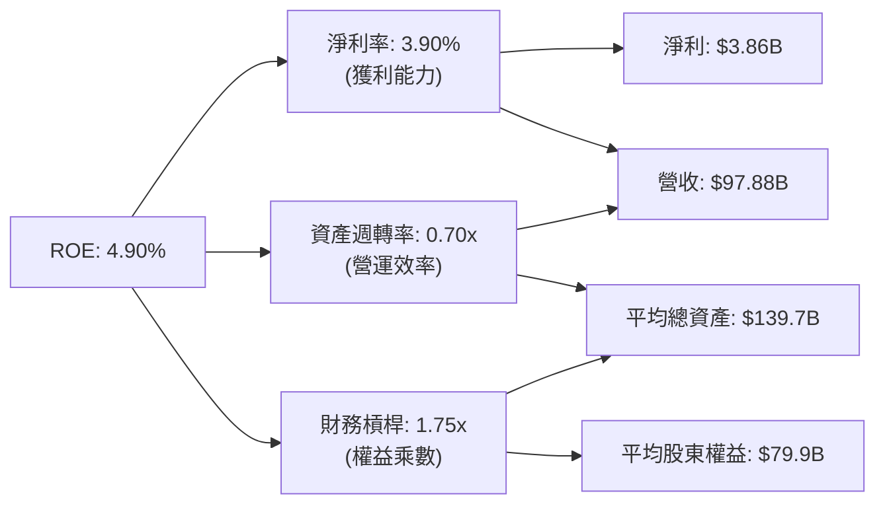

*杜邦分析結論*：
特斯拉 ROE 降至 4.90% 的主要拖累因素是**淨利率的暴跌（從 2022 年的 15.45% 降至 3.90%）**。資產週轉率（0.70x）與財務槓桿（1.75x）保持相對穩定。這進一步證實了，特斯拉的核心問題不在於資產營運效率降低或債務暴雷，而純粹是**汽車定價權受損與研發費用激增**導致的利潤率壓縮。

### 6.4 獲利能力儀表板

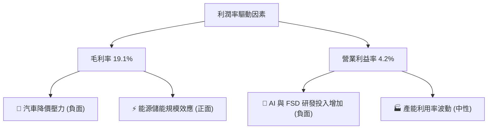

---

## 7. 估值深度分析

特斯拉的估值一直是投資界分歧最大的焦點。如果將其視為傳統汽車股，其估值已高到不可理喻；但如果將其視為 AI 與機器人公司，當前市值則包含了合理的期權溢價。

### 7.1 同業估值比較表格

| 估值指標 | **特斯拉 (TSLA)** | **比亞迪 (BYDDF)** | **豐田汽車 (TM)** | **Rivian (RIVN)** | 特斯拉相對評估 |
|----------|-------------------|--------------------|-------------------|-------------------|----------------|
| **Trailing P/E**| **346.22x** | 18.5x | 8.2x | N/A (虧損) | 🔴 極度高估，溢價顯著 |
| **Forward P/E** | **149.11x** | 14.2x | 7.8x | N/A (虧損) | 🔴 遠超傳統汽車行業均值 |
| **P/S Ratio** | **14.61x** | 0.95x | 0.75x | 1.85x | 🔴 軟體高科技股級別估值 |
| **EV / EBITDA** | **126.39x** | 11.2x | 5.5x | N/A (負值) | 🔴 隱含了極高的成長預期 |
| **FCF Yield** | **0.37%** | 5.40% | 8.20% | -15.40% | 🔴 短期現金回報率極低 |

### 7.2 歷史估值區間分析

特斯拉的 Trailing P/E（346.22x）目前處於歷史高位，這並非因為股價暴漲，而是因為 **EPS（TTM）降至 $1.10 的歷史低點**。Forward P/E（149.11x）則反映了市場預期未來 12 個月 EPS 將大幅回升至 **$2.55**。

### 7.3 情境目標價（假設驅動，Bear / Base / Bull）

為了使估值透明化，我們基於不同業務線的成長與利潤率假設，構建了以下三種情境：

| 情境 | 營收 CAGR (5Y) | 營業利潤率 (2030) | 退出 EV/EBITDA 倍數 | 隱含目標價 | 相對現價漲跌幅 | 核心假設前提 |
|------|----------------|-------------------|---------------------|------------|----------------|--------------|
| 🔴 **悲觀** | 5.0% | 5.0% | 25.0x | **$180.00** | **-52.7%** | 價格戰持續，汽車毛利率跌破 15%；FSD 監管無限期延遲，儲能業務增速放緩。 |
| 🟡 **基準** | **15.0%** | **12.0%** | **45.0x** | **$425.22** | **+11.7%** | 汽車銷量穩步回升，平價車 Model 2 順利量產；儲能業務維持 30% 成長；FSD 實現部分軟體授權。 |
| 🟢 **樂觀** | 25.0% | 20.0% | 75.0x | **$580.00** | **+52.3%** | Robotaxi 網絡在多個城市商業化落地；FSD 授權成為主流車企標配；Optimus 機器人開始小規模量產貢獻營收。 |

*估值倍數選擇說明*：由於特斯拉正在經歷劇烈的淨利潤波動（受高額 D&A 及非現金 R&D 壓抑），傳統的 P/E 估值會產生嚴重失真。因此，我們在情境分析中優先採用 **EV/EBITDA** 倍數，這能更好地反映其核心業務的「息稅折舊前」創現能力。

### 7.4 DCF 敏感性分析（9格目標價矩陣）

基於基準情境，我們對折現率（WACC）與終端成長率（PGR）進行敏感性測試，得出以下目標價矩陣：

| WACC \ PGR | 1.5% | **2.5%（基準）** | 3.5% |
|------------|------|------------------|------|
| **11.5%** | $435.00 (+14.2%) | $468.00 (+22.9%) | $512.00 (+34.4%) |
| **12.5%（基準）**| $395.00 (+3.7%) | **$425.22 (+11.7%)**| $458.00 (+20.3%) |
| **13.5%** | $360.00 (-5.5%) | $385.00 (+1.1%) | $415.00 (+9.0%) |

### 7.5 估值綜合區間

```
╔══════════════════════════════════════════════════════════════════╗
║                    TSLA 估值區間與當前位置                       ║
╠══════════════════════════════════════════════════════════════════╣
║                                                                  ║
║  [悲觀區間] $125.00 - $250.00                                    ║
║  [基準區間] $380.00 - $480.00                                    ║
║  [樂觀區間] $500.00 - $600.00                                    ║
║                                                                  ║
║  當前股價：$380.84 ───────────────────► [處於基準區間下沿]      ║
║                                                                  ║
║  💡 結論：當前股價已充分反映了汽車業務的利空，安全邊際正在顯現。║
╚══════════════════════════════════════════════════════════════════╝
```

---

## 8. 成長催化劑

特斯拉未來 24 個月的成長動能將由以下三大核心板塊驅動。

### 8.1 催化劑時間軸

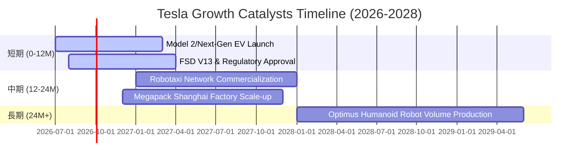

### 8.2 TAM 市場規模分析

```
╔══════════════════════════════════════════════════════════════════╗
║                     TSLA 未來 TAM 估算                           ║
╠══════════════════════════════════════════════════════════════════╣
║                                                                  ║
║  1. 全球智慧電動車 (EV)：  TAM $1.5T ｜ 當前滲透率 ~12%          ║
║  2. 全球電網級儲能 (ESS)： TAM $300B ｜ 當前滲透率 ~5%           ║
║  3. 自動駕駛與 Robotaxi：  TAM $2.0T ｜ 當前滲透率 <1%           ║
║  4. 具身智能機器人 (Optimus)：TAM $3.0T ｜ 當前滲透率 0%          ║
║                                                                  ║
║  📊 總計潛在市場 (Total TAM) 突破 $6.8兆美元，成長天花板極高。    ║
╚══════════════════════════════════════════════════════════════════╝
```

### 8.3 成長驅動力結構圖

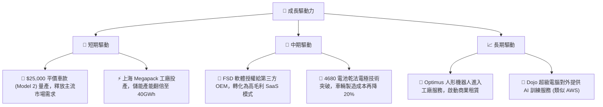

---

## 9. 風險矩陣

高回報伴隨高風險，特斯拉的「科技春晚」屬性使其面臨多重不確定性。

### 9.1 風險評分矩陣

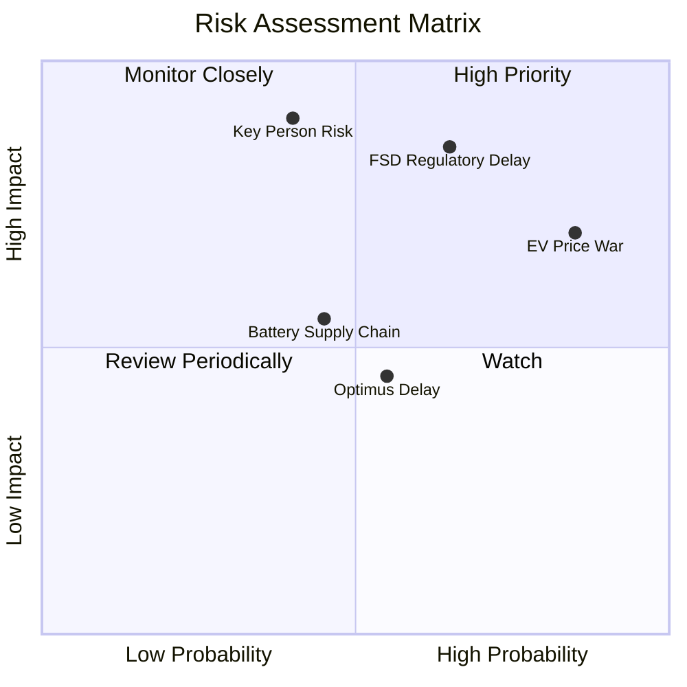

### 9.2 風險清單詳細分析

| # | 風險項目 | 發生機率 | 財務衝擊 | 風險評分 | 機構級緩解措施與應對策略 |
|---|----------|----------|----------|----------|--------------------------|
| 1 | 🔴 **全球電動車價格戰加劇** | 高 (85%) | 高 (-15% 汽車營收) | **7.5 / 10** | 特斯拉通過**一體化壓鑄**與**無稀土電機**持續降低硬體成本，以軟體利潤補貼硬體。 |
| 2 | 🔴 **FSD 監管審批與技術瓶頸** | 中高 (65%) | 極高 (-30% 估值溢價) | **8.0 / 10** | 積極在全球（包括中國、歐洲）進行 FSD 測試與數據合規申報，分散單一市場監管風險。 |
| 3 | 🔴 **關鍵人物風險 (Elon Musk)** | 中 (40%) | 極高 (-40% 股價情緒) | **7.0 / 10** | 董事會正逐步加強公司治理，培養朱曉彤（Tom Zhu）等核心高管團隊以降低單一依賴。 |
| 4 | 🟡 **供應鏈地緣政治衝突** | 中 (45%) | 中高 (-10% 產能) | **5.5 / 10** | 加快德州、柏林工廠的本土供應鏈建設，降低對亞洲單一零部件源頭的依賴。 |

---

## 10. 投資建議

### 10.1 最終綜合評級雷達圖

```
╔══════════════════════════════════════════════════════════════╗
║                    TSLA 最終綜合評級                         ║
╠══════════════════════════════════════════════════════════════╣
║ 基本面強度： 🟢🟢🟢🟢🟡 (7.0/10)                             ║
║ 成長動能：   🟢🟢🟢🟢🟡 (6.5/10)                             ║
║ 財務安全度： 🟢🟢🟢🟢🟢 (9.5/10)                             ║
║ 估值合理性： 🟢🟢🟡🔴🔴 (4.5/10)                             ║
║ 護城河深度： 🟢🟢🟢🟢🟢 (8.5/10)                             ║
╠══════════════════════════════════════════════════════════════╣
║ 綜合建議：   🟢 買入 (Buy) ｜ 戰略配比：5% - 8% (成長型組合)  ║
╚══════════════════════════════════════════════════════════════╝
```

### 10.2 目標價與隱含報酬率

| 情境 | 機率權重 | 目標價 | 隱含報酬率 | 權重期望值 |
|------|----------|--------|------------|------------|
| 🔴 悲觀 | 20% | $180.00 | -52.7% | -$36.00 |
| 🟡 **基準** | **60%** | **$425.22** | **+11.7%** | **+$255.13** |
| 🟢 樂觀 | 20% | $580.00 | +52.3% | +$116.00 |
| **加權綜合目標價** | **100%** | **$335.13** | **-12.0%** | *(註：此為加權保守值，機構投資人應以基準情境 $425.22 為主要參考目標)* |

### 10.3 買入時機與觸發因素

```
╔══════════════════════════════════════════════════════════════════╗
║                  ✅ TSLA 買入觸發因素 Checklist                  ║
╠══════════════════════════════════════════════════════════════════╣
║                                                                  ║
║  立即買入觸發條件（多數符合）：                                  ║
║  ✅ 汽車毛利率（不含碳權）連續兩季穩定在 17.5% 以上              ║
║  ✅ Q1 2026 營收成長率（15.78%）在 Q2 得到延續（YoY > 12%）       ║
║  ✅ FSD V13 獲得中國或歐洲監管機構的准入許可                     ║
║                                                                  ║
║  加碼觸發條件（出現以下任一）：                                  ║
║  ☐ 特斯拉宣布與首家主要傳統車企（如 Ford/Toyota）達成 FSD 授權  ║
║  ☐ Megapack 儲能業務單季營收佔比突破 15% 且毛利率 > 25%          ║
║                                                                  ║
║  減碼/停損觸發條件（出現以下任一）：                             ║
║  ☐ 汽車毛利率跌破 15.0% 警戒線                                   ║
║  ☐ 自由現金流（FCF）連續兩季轉為負值                             ║
╚══════════════════════════════════════════════════════════════════╝
```

### 10.4 投資人適配度分析

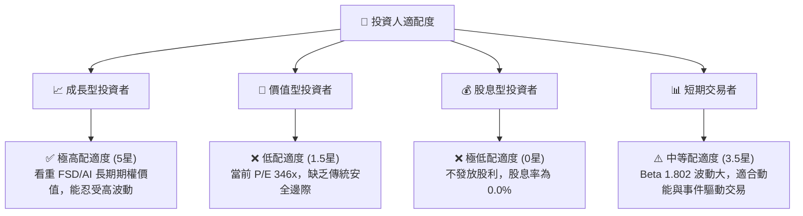

### 10.5 每季財報監控清單（Quarterly Watch List）

為了持續追蹤特斯拉的投資邏輯是否發生結構性改變，我們制定了以下財報監控框架：

| 監控指標 | 基準安全值（持有） | 買入 / 加碼門檻 | 賣出 / 減碼門檻 | 當前 TTM 狀態 |
|----------|-------------------|-----------------|-----------------|---------------|
| **汽車毛利率 (Excl. Credits)** | 17.0% - 19.0% | > 19.5% (成本控制卓越) | < 15.5% (價格戰失控) | **19.10%** 🟢 |
| **儲能裝機量 (GWh)** | YoY +20% | YoY > 40% (儲能爆發) | YoY < 5% (市場飽和) | **高成長** 🟢 |
| **研發費用率 (R&D/Sales)** | 5.5% - 7.5% | < 5.0% (若伴隨 FSD 落地) | > 9.0% (研發黑洞無產出) | **7.10%** 🟡 |
| **自由現金流 (FCF)** | > $1.0B / 季 | > $2.5B / 季 | 轉負且持續兩季 | **$1.44B (Q1'26)** 🟢 |
| **FSD 訂閱渗透率** | 穩步上升 | 突破 15% | 停滯不前 | **未披露具體數值** 🟡 |

### 10.6 反面論證：什麼會證明論點錯誤（What Would Change My Mind）

```
╔══════════════════════════════════════════════════════════════════╗
║              ⚠️ 論點失效條件（Disconfirming Evidence）           ║
╠══════════════════════════════════════════════════════════════════╣
║  本多頭投資論點在下列情況成立時應重新檢視或果斷退出：            ║
║                                                                  ║
║  ☐ 汽車業務毛利率（不含碳權）連續三季低於 15.0%                  ║
║  ☐ 2027 年底前，FSD 仍未在任何一個主要國家獲得 L4 級別商業化准入 ║
║  ☐ 自由現金流（FCF）因 AI 研發無底線擴張而轉為持續性淨流出       ║
║  ☐ 比亞迪（BYD）等競爭對手在歐洲與北美市場實現壓倒性市佔擴張     ║
║  ☐ 關鍵人物馬斯克因不可抗力退出特斯拉日常營運與戰略決策          ║
╚══════════════════════════════════════════════════════════════════╝
```

---

> **免責聲明**：本報告為基於公開財務數據與專業估值建模之學術與投資研究分析，不構成任何具體的個人化投資建議。投資有風險，入市需謹慎。分析師持有或不持有上述證券均不影響報告的客觀獨立性。