# TSLA 基本面深度分析報告
> **報告日期**：2026-07-20 ｜ **語言**：繁體中文 ｜ **數據來源**：Yahoo Finance, Finviz, StockAnalysis, Roic.ai ｜ **分析師**：CFA 級機構研究

---

## 目錄

| # | 章節 | 核心結論 |
|---|------|----------|
| 1 | 執行摘要 | 評級「持有」，目標價 $370 - $425，核心利潤率承壓，長線依賴 AI 與儲能轉型 |
| 2 | 公司概覽與商業模式 | 汽車毛利稀釋，儲能（Megapack）與 FSD 軟體生態構成雙重護城河 |
| 3 | 損益表深度分析 | 營收年增 15.8% 但營業利益率降至 4.2%，高額股權薪酬（SBC）稀釋盈餘品質 |
| 4 | 資產負債表分析 | 淨現金達 $28.85B，流動比率 2.04，財務結構極度穩健 |
| 5 | 現金流量深度分析 | TTM FCF $5.25B，資本支出維持高檔（~$8.5B），重金投入 AI 基礎設施 |
| 6 | 獲利能力與資本效率 | ROIC 降至 6.63% 跌破 WACC (12.90%)，當前處於價值收縮期，靜待營業槓桿釋放 |
| 7 | 估值深度分析 | Forward P/E 達 145x，市場溢價極高，DCF 敏感性顯示當前股價已透支短期基本面 |
| 8 | 成長催化劑 | Next-Gen 平台、Robotaxi 商業化與儲能出貨爆發為中長期核心驅動力 |
| 9 | 風險矩陣 | 價格戰持續、FSD 監管與技術瓶頸、關鍵人物風險為主要下行因素 |
| 10 | 投資建議 | 建議「持有/分批逢低佈局」，建立每季毛利率與儲能裝機量監控指標 |

---

## 1. 執行摘要

### 1.0 一頁式投資儀表板（Portfolio Manager 30 秒速讀）

| 項目 | 內容 |
|------|------|
| **投資論點（3 句）** | ① 汽車業務因價格戰導致毛利率從 25% 以上壓縮至 TTM 19.1%，短期獲利動能受限。<br/>② 儲能業務（Megapack）與服務營收增速加快，部分抵消汽車業務放緩，營收 TTM 年增 15.8%。<br/>③ FSD 軟體與 Optimus 機器人提供了極高的遠期選擇權價值，但當前 145x Forward P/E 已充分反映此預期。 |
| **護城河評分** | 8.5/10 🟡 (技術與規模優勢顯著，但汽車行業競爭加劇削弱定價權) |
| **管理層/資本配置評分** | 8.0/10 🟡 (研發投入高效，但關鍵人物風險高且未進行股票回購) |
| **財務健康** | 🟢 **極度安全**：淨現金高達 $28.85B，無短期償債風險 |
| **ROIC vs WACC** | **6.63% vs 12.90%** 🔴 (當前處於資本高投入、回報滯後期，暫時摧毀股東價值) |
| **FCF 趨勢** | TTM FCF 降至 $5.25B，FCF Yield 僅 **0.38%**，資金主要消耗於 AI 研發與產線升級 |
| **估值** | Forward P/E: **145.00x** ｜ EV/EBITDA: **126.39x** ｜ P/S: **14.21x** (處於歷史高位區間) |
| **預期報酬（基準情境 12M）** | **+14.8%** (目標價 $425.22，對比當前股價 $370.34) |
| **關鍵風險（前二）** | ① 核心汽車毛利率進一步跌破 15% 臨界點。<br/>② FSD 監管審批延遲與 Robotaxi 商業化進度不及預期。 |
| **評級 + 信心度** | 🟡 **持有 (HOLD)** ｜ 信心度：**中等** (短期基本面承壓，長線 AI 敘事支撐估值) |

### 1.1 核心評分儀表板

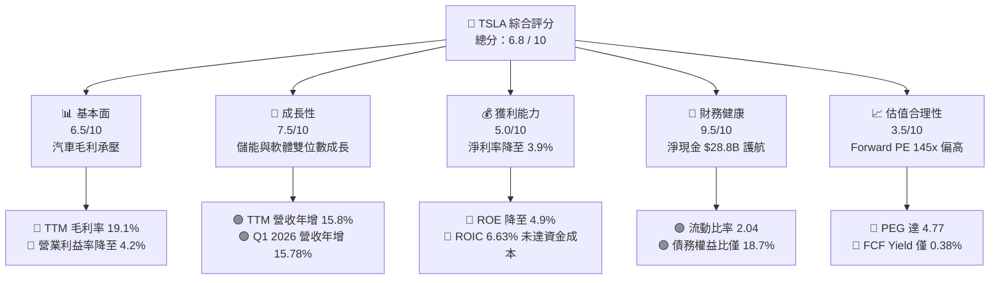

### 1.2 評分進度條視覺化

```
╔══════════════════════════════════════════════════════════════╗
║               TSLA 多維度評分儀表板 (1-10分)                 ║
╠══════════════════════════════════════════════════════════════╣
║ 基本面強度  6.5 ▓▓▓▓▓▓▓▓▓▓▓▓▓░░░░░░░  ★★★☆☆           ║
║ 成長動能    7.5 ▓▓▓▓▓▓▓▓▓▓▓▓▓▓▓░░░░░  ★★★★☆           ║
║ 獲利品質    5.0 ▓▓▓▓▓▓▓▓▓▓░░░░░░░░░░  ★★★☆☆           ║
║ 財務健康    9.5 ▓▓▓▓▓▓▓▓▓▓▓▓▓▓▓▓▓▓▓░  ★★★★★           ║
║ 估值合理性  3.5 ▓▓▓▓▓▓▓░░░░░░░░░░░░░  ★★☆☆☆           ║
║ 護城河深度  8.5 ▓▓▓▓▓▓▓▓▓▓▓▓▓▓▓▓▓░░░  ★★★★☆           ║
║ 管理層執行  8.0 ▓▓▓▓▓▓▓▓▓▓▓▓▓▓▓▓░░░░  ★★★★☆           ║
║ 技術創新力  9.5 ▓▓▓▓▓▓▓▓▓▓▓▓▓▓▓▓▓▓▓░  ★★★★★           ║
╠══════════════════════════════════════════════════════════════╣
║ 綜合總分    6.8 ▓▓▓▓▓▓▓▓▓▓▓▓▓░░░░░░░  🏆 持有 (Hold)       ║
╚══════════════════════════════════════════════════════════════╝
```

### 1.3 五大投資論點 + 三大核心風險

| 類型 | 項目 | 具體依據 | 信心度 |
|------|------|----------|--------|
| 🟢 **投資論點①** | **儲能業務步入爆發期** | FY2025 儲能裝機量大幅增長，抵消部分汽車業務放緩，毛利率顯著優於傳統組裝。 | 🟢 高 |
| 🟢 **投資論點②** | **資產負債表極度強韌** | 擁有 $44.74B 總現金與 $28.85B 淨現金，足夠支撐長期高強度的 AI 研發（TTM 研發支出 $6.95B）。 | 🟢 極高 |
| 🟢 **投資論點③** | **FSD 軟體授權與遠期期權** | FSD V12 採用端到端神經網絡後體驗大幅提升，未來若能成功授權第三方 OEM，將釋放極高毛利的軟體收入。 | 🟡 中等 |
| 🟢 **投資論點④** | **Next-Gen 平台降低生產成本** | 預計於 2026-2027 年推出的平價車型（Model 2）將採用「開箱工藝」（Unboxed Process），預期可降低 50% 生產成本。 | 🟡 中等 |
| 🟢 **投資論點⑤** | **垂直整合帶來的供應鏈彈性** | 自研 4680 電池與晶片、自建充電網絡，使其在行業下行週期中仍保有高於傳統 OEM 的營運彈性。 | 🟢 高 |
| 🟡 **風險①** | **汽車毛利率持續收縮** | 價格戰未見終點，若汽車毛利率（扣除監管補貼）跌破 15%，將進一步重創 EPS 表現。 | 🔴 高衝擊 |
| 🔴 **風險②** | **高估值下的增長失速** | 當前 P/E 336x，Forward P/E 145x，市場容錯率極低，任何一季交付量不及預期都可能引發 20% 以上的估值修正。 | 🔴 高衝擊 |
| 🟡 **風險③** | **關鍵人物與地緣政治風險** | 馬斯克（Elon Musk）精力分散於多家公司，且特斯拉高度依賴中國供應鏈與市場，地緣政治摩擦可能導致生產中斷。 | 🟡 中度 |

### 1.4 快速統計卡片

| 指標 | TSLA 實際值 | 行業均值 (Auto) | S&P 500 均值 | 狀態 |
|------|-------------|-----------------|--------------|------|
| **營收 YoY 成長** | **15.8%** | ~5.0% | ~6.5% | 🟢 領先 |
| **毛利率** | **19.1%** | ~15.0% | ~30.0% | 🟡 中等 |
| **營業利益率** | **4.2%** | ~6.0% | ~12.5% | 🔴 落後 |
| **ROE** | **4.9%** | ~10.0% | ~15.0% | 🔴 落後 |
| **Forward P/E** | **145.00x** | ~12.0x | ~21.0x | 🔴 極度昂貴 |
| **流動比率** | **2.04** | ~1.20 | ~1.40 | 🟢 優異 |

### 1.5 投資結論

```
╔══════════════════════════════════════════════════════════════════╗
║                    📊 TSLA 投資結論摘要                          ║
╠══════════════════════════════════════════════════════════════════╣
║  評級：🟡 持有 (HOLD)                                            ║
║  當前股價：$370.34 (2026-07-20)                                  ║
║  目標價區間：                                                    ║
║    悲觀情境：$180.00（-51.4%）                                   ║
║    基準情境：$425.22（+14.8%）  ← 12個月主要目標                 ║
║    樂觀情境：$600.00（+62.0%）                                   ║
║  投資評分：6.8 / 10                                              ║
║  適合投資人：長線 AI/機器人信仰者、能承受高波動之成長型投資人    ║
╚══════════════════════════════════════════════════════════════════╝
```

---

## 2. 公司概覽與商業模式

### 2.1 業務結構與收入來源

特斯拉已從單純的電動車製造商，轉型為「新能源 + AI 軟硬體整合平台」。根據最新數據，其 TTM 營收達 $97.88B，業務結構如下：

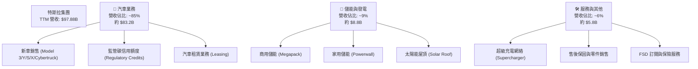

### 2.2 市場份額

在純電動車（BEV）市場中，特斯拉面臨來自比亞迪（BYD）及傳統車企的激烈競爭。以下為 2025 年全球 BEV 市場份額估算：

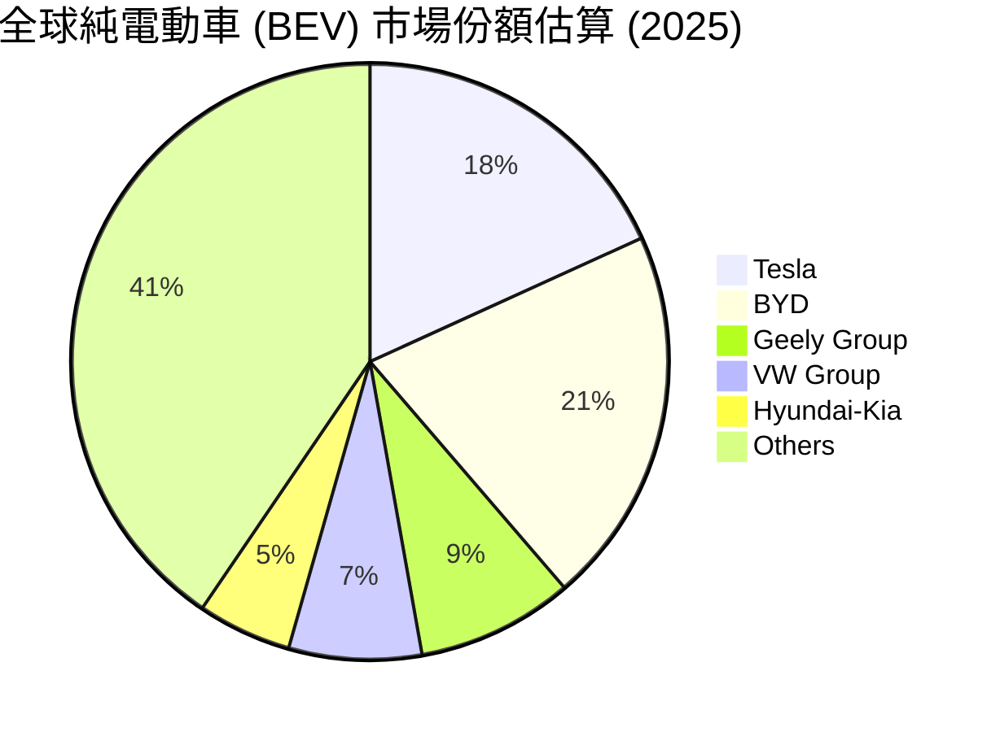

### 2.3 競爭護城河分析

特斯拉的長期超額利潤來源已非單純的汽車製造，而是由軟硬體協同形成的生態體系：

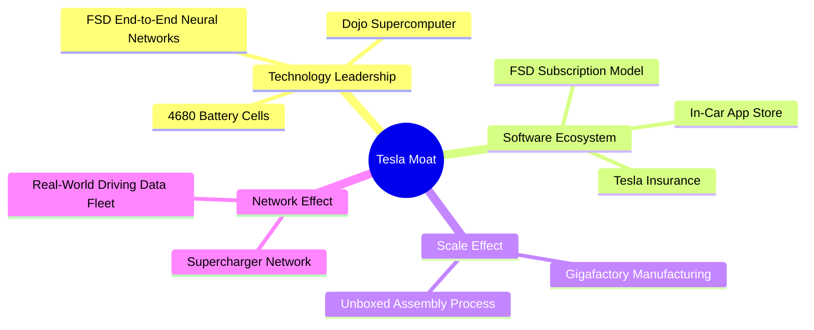

### 2.4 護城河強度評分

```
╔══════════════════════════════════════════════════════════════╗
║                    TSLA 護城河強度評分                       ║
╠══════════════════════════════════════════════════════════════╣
║ 生產成本優勢   8.5/10 ▓▓▓▓▓▓▓▓▓▓▓▓▓▓▓▓▓░░░  🟢 一體化壓鑄  ║
║ 品牌與定價權   7.0/10 ▓▓▓▓▓▓▓▓▓▓▓▓▓▓░░░░░░  🟡 價格戰削弱  ║
║ 軟體生態鎖定   9.5/10 ▓▓▓▓▓▓▓▓▓▓▓▓▓▓▓▓▓▓▓░  🟢 FSD 領先    ║
║ 充電網絡效應   9.0/10 ▓▓▓▓▓▓▓▓▓▓▓▓▓▓▓▓▓▓░░  🟢 NACS 標準化 ║
║ 數據規模壁壘   9.8/10 ▓▓▓▓▓▓▓▓▓▓▓▓▓▓▓▓▓▓▓░  🟢 百億英里里程║
╠══════════════════════════════════════════════════════════════╣
║ 綜合護城河     8.7/10 ▓▓▓▓▓▓▓▓▓▓▓▓▓▓▓▓▓░░░  🏆 極強護城河  ║
╚══════════════════════════════════════════════════════════════╝
```

---

## 3. 損益表深度分析

### 3.1 年度收入成長趨勢（近5年）

特斯拉的營收成長已從高爆發期進入高原調整期。

```
╔══════════════════════════════════════════════════════════════════╗
║                  TSLA 年度收入趨勢 (FY2021-TTM)                 ║
╠══════════════════════════════════════════════════════════════════╣
║                                                                  ║
║  FY 2021  $53.82B  ██████████░░░░░░░░░░░░░░░░░░  YoY: +70.7% 🟢  ║
║  FY 2022  $81.46B  ███████████████░░░░░░░░░░░░░  YoY: +51.4% 🟢  ║
║  FY 2023  $96.77B  ██████████████████░░░░░░░░░░  YoY: +18.8% 🟢  ║
║  FY 2024  $97.69B  ██████████████████░░░░░░░░░░  YoY: +0.95% 🟡  ║
║  FY 2025  $94.83B  █████████████████░░░░░░░░░░░  YoY: -2.93% 🔴  ║
║  TTM      $97.88B  ██████████████████░░░░░░░░░░  YoY: +2.25% 🟡  ║
║                   |      |      |      |      |                  ║
║                   0     25B    50B    75B    100B                ║
║                                                                  ║
║  📊 5年累計營收 CAGR：+12.7%                                     ║
╚══════════════════════════════════════════════════════════════════╝
```

### 3.2 季度收入趨勢分析

自 2025 年以來，季度營收呈現顯著波動，反映出降價促銷對銷量的刺激效果正在遞減，但 Q1 2026 出現了顯著的 YoY 反彈（+15.78%），主因儲能出貨量大增與新車型交付。

| 財報季度 | 營收 (Billion) | YoY 成長率 | QoQ 成長率 | 核心驅動因素與備註 | 狀態 |
|----------|----------------|------------|------------|--------------------|------|
| **Q1 2026** | **$22.39B** | **+15.78%**| -10.08% | 季節性放緩，但儲能裝機與 FSD 授權收入年增顯著 | 🟢 復甦 |
| **Q4 2025** | **$24.90B** | -3.14% | -11.37% | 年底促銷拉動交付，但平均售價（ASP）下滑拖累營收 | 🔴 承壓 |
| **Q3 2025** | **$28.10B** | **+11.57%**| **+24.89%**| 儲能業務單季裝機創歷史新高，Model Y 煥新版熱銷 | 🟢 強勁 |
| **Q2 2025** | **$22.50B** | -11.78% | **+16.35%**| 價格戰最激烈時期，單車利潤降至歷史低點 | 🔴 衰退 |

### 3.3 利潤率演變分析

特斯拉的利潤率在過去幾年經歷了顯著的收縮，主要原因在於全球電動車競爭加劇，迫使特斯拉多次降價以維持市佔率，同時加大對 AI（Dojo, GPU 採購）與 R&D 的投入。

| 利潤率指標 | FY 2022 | FY 2023 | FY 2024 | FY 2025 | TTM | 趨勢 | 評估 |
|------------|---------|---------|---------|---------|-----|------|------|
| **毛利率** | 25.6% | 18.2% | 17.9% | 18.0% | **19.1%** | ↗️ 緩步回升 | 🟡 儲能高毛利帶動 |
| **營業利益率** | 16.8% | 9.2% | 7.2% | 4.6% | **4.2%** | ↘️ 持續探底 | 🔴 R&D 與 SG&A 費用上升 |
| **EBITDA Margin** | 21.7% | 15.3% | 15.1% | 12.4% | **11.3%** | ↘️ 下行 | 🔴 折舊攤銷增加 |
| **淨利率** | 15.4% | 15.5% | 7.3% | 4.1% | **3.9%** | ↘️ 探底 | 🔴 獲利含金量受壓 |

* **利潤率惡化深度解析**：毛利率從 FY 2022 的 25.6% 降至 TTM 19.1%，主因汽車平均售價（ASP）下滑約 15-20%。然而，TTM 營業利益率僅 4.2%，遠低於毛利率，顯示**營業槓桿（Operating Leverage）正在反向侵蝕獲利**。R&D 費用由 FY2022 的 $3.08B 飆升至 TTM 的 $6.95B（翻倍），反映出特斯拉將大筆資金轉移至自動駕駛與人形機器人的開發，這類研發在短期內無法直接轉化為營收，壓低了當前的營業利益率。

### 3.4 費用結構分析

在 TTM 營業費用中，研發（R&D）與行政銷售（SG&A）佔比幾乎平分秋色。

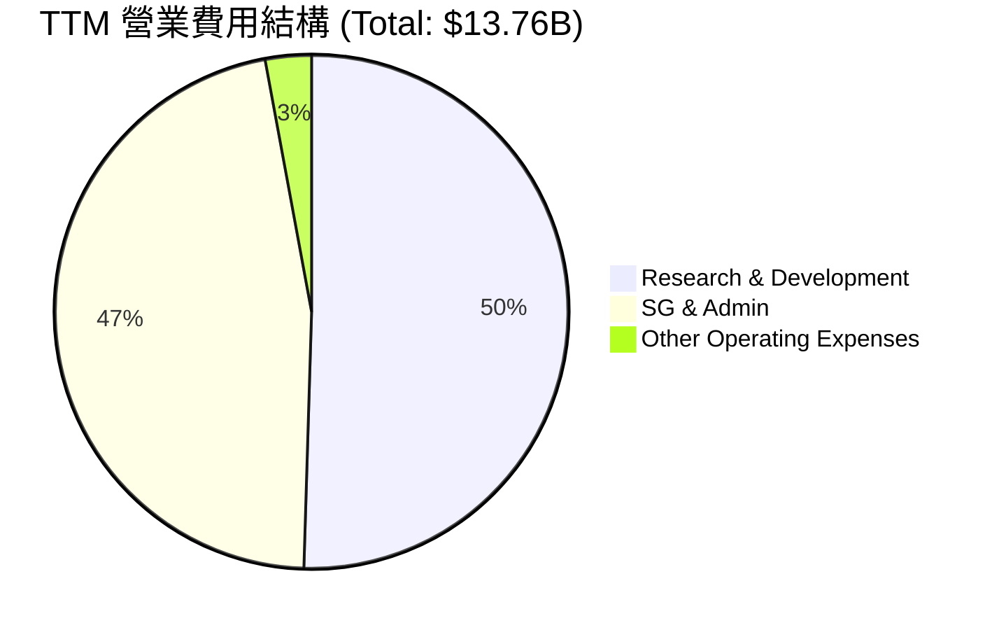

```
╔══════════════════════════════════════════════════════════════╗
║                    TSLA TTM 費用效率診斷                     ║
╠══════════════════════════════════════════════════════════════╣
║ 研發營收比 (R&D/Rev):   7.10%  ▓▓▓▓▓▓▓▓▓░░░░░░░░░░░  🟢 高投入  ║
║ 銷管營收比 (SG&A/Rev):  6.55%  ▓▓▓▓▓▓▓▓░░░░░░░░░░░░  🟢 控制良好║
╚══════════════════════════════════════════════════════════════╝
```

### 3.5 季度 EPS 趨勢與盈餘品質（Quality of Earnings）

特斯拉的稀釋後 EPS 從 FY2023 的 $4.30 降至 TTM 的 $1.09。分析過去四個季度的盈餘品質，發現高額的股權薪酬（SBC）對股東造成了實質稀釋。

| 盈餘品質項目 | TTM 數值 / 佔比 | 評估 | 對真實股東報酬的影響 |
|--------------|-----------------|------|----------------------|
| **股權薪酬 (SBC) / 營業收入** | **$3.28B** / 5.0% | 🔴 偏高 | 稀釋現有股東權益，稀釋後股數 YoY 增加 0.76%。 |
| **SBC / 營業現金流 (OCF)** | 19.8% | 🔴 偏高 | 意味著約五分之一的營業現金流是靠「非現金」的股票發放來支撐。 |
| **FCF / GAAP 淨利 (現金轉換率)** | **133.6%** | 🟢 極高 | TTM FCF ($5.25B) 高於 GAAP 淨利 ($3.93B)，顯示現金流回收能力依然強勁。 |
| **一次性 / 非經常性損益** | -$835M (其他非營運支出) | 🟡 中立 | 主要受外匯波動與重組費用影響，無美化帳面嫌疑。 |
| **有效稅率異常** | 27.8% (TTM Tax $1.51B) | 🟡 正常 | 稅率回歸正常區間，無過去遞延所得稅資產一次性回撥的虛增效應。 |

* **盈餘品質結論**：雖然 GAAP 淨利受降價與研發拖累大幅下滑，但**現金回收品質（FCF 轉換率 133.6%）依然極佳**。然而，高達 $3.28B 的 TTM 股權薪酬（SBC）幾乎吞噬了 $3.93B 淨利中的 83%。這意味著，雖然特斯拉帳面上創造了利潤，但實際上現有股東正透過股權稀釋的方式，為員工（特別是管理層）的薪酬買單。

---

## 4. 資產負債表分析

### 4.1 資產結構分解

特斯拉的資產負債表呈現典型的「重資產、高現金」特徵。

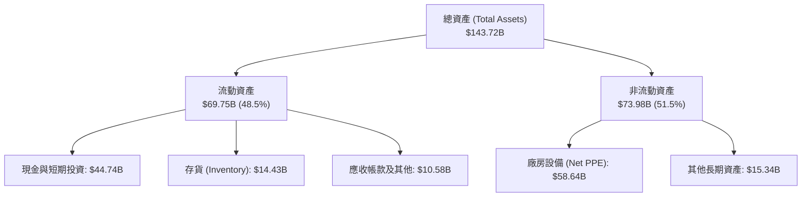

### 4.2 流動性指標分析

| 流動性指標 | TTM | FY 2025 | FY 2024 | 行業均值 | 評估 |
|------------|-----|---------|---------|----------|------|
| **流動比率 (Current Ratio)** | **2.04** | 2.16 | 2.02 | 1.20 | 🟢 極度充裕 |
| **速動比率 (Quick Ratio)** | **1.43** | 1.58 | 1.39 | 0.85 | 🟢 無變現壓力 |
| **存貨週轉天數 (Days Inventory)** | **66.6 天** | 58.2 天 | 54.7 天 | 55.0 天 | 🟡 存貨積壓風險增加 |

* **存貨分析**：存貨從 FY2024 的 $12.02B 增加至 TTM 的 $14.43B，週轉天數拉長至 66.6 天。這反映出新車型（如 Cybertruck）產能爬坡期存貨積壓，以及部分地區 Model 3/Y 需求放緩。

### 4.3 債務結構分析

特斯拉在過去幾年積極去槓桿，目前已進入「淨現金」狀態，財務防禦力極強。

```
╔══════════════════════════════════════════════════════════════════╗
║                      TSLA 債務健康診斷                           ║
╠══════════════════════════════════════════════════════════════════╣
║                                                                  ║
║  總債務 (Total Debt)： $15.89B  ████░░░░░░░░░░░░░░░░░░  低風險   ║
║  總現金與短期投資：    $44.74B  ██████████████████████  極充裕   ║
║  淨現金 (Net Cash)：   $28.85B  ██████████████░░░░░░░░  🟢 強韌  ║
║                                                                  ║
║  Debt / Equity Ratio： 18.74%   🟢 槓桿率極低                    ║
║  Interest Coverage：   14.4x    🟢 息稅折舊前利潤輕鬆覆蓋利息    ║
║  Debt / EBITDA：       1.43x    🟢 債務無還款壓力                ║
║                                                                  ║
╚══════════════════════════════════════════════════════════════════╝
```

---

## 5. 現金流量深度分析

### 5.1 現金流量瀑布圖

特斯拉的營運現金流（OCF）非常健康，但大比例被資本支出（CapEx）消耗。

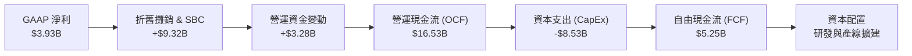

### 5.2 FCF 轉換率趨勢

| 指標 | FY 2022 | FY 2023 | FY 2024 | FY 2025 | TTM |
|------|---------|---------|---------|---------|-----|
| **營運現金流 (OCF)** | $14.72B | $13.26B | $14.92B | $14.75B | $16.53B |
| **資本支出 (CapEx)** | -$7.17B | -$8.90B | -$11.34B| -$8.53B | -$8.53B |
| **自由現金流 (FCF)** | $7.55B | $4.36B | $3.58B | $6.22B | $5.25B |
| **FCF / Net Income** | **60.0%** | **29.1%** | **50.2%** | **164.4%**| **133.6%**|

* **分析**：FY2025 與 TTM 的 FCF 轉換率大幅飆升（>100%），主要因為 GAAP 淨利被高額的非現金費用（如折舊與 SBC）壓低，而實際流入的營運現金流依然高達 $16.53B。這表明**特斯拉的實質「印鈔能力」並未如 GAAP 淨利那樣腰斬**。

### 5.3 自由現金流與收益率趨勢

```
╔══════════════════════════════════════════════════════════════════╗
║                  TSLA 歷年 FCF 與 FCF Yield 趨勢                 ║
╠══════════════════════════════════════════════════════════════════╣
║                                                                  ║
║  FY 2022  $7.55B  ██████████████████████████░░░  Yield: 0.54%    ║
║  FY 2023  $4.36B  ███████████████░░░░░░░░░░░░░░  Yield: 0.31%    ║
║  FY 2024  $3.58B  ████████████░░░░░░░░░░░░░░░░░  Yield: 0.26%    ║
║  FY 2025  $6.22B  █████████████████████░░░░░░░░  Yield: 0.45%    ║
║  TTM      $5.25B  ██████████████████░░░░░░░░░░░  Yield: 0.38% 🔴 ║
║                                                                  ║
║  💡 註：FCF Yield 僅 0.38%，顯示相對於 $1.39T 的市值，          ║
║         當前現金流回報率極低，市場給予了極高的遠期估值溢價。     ║
╚═══════════════════════════════════════════════════════════════════╝
```

---

## 6. 獲利能力與資本效率

### 6.1 ROE / ROA / ROIC 趨勢

隨著淨利潤的收縮與股東權益的累積，特斯拉的各項資本回報指標均降至歷史低點。

| 獲利能力指標 | FY 2022 | FY 2023 | FY 2024 | FY 2025 | TTM | 行業均值 | 評估 |
|--------------|---------|---------|---------|---------|-----|----------|------|
| **ROE (股東權益報酬率)** | 28.1% | 24.0% | 9.8% | 4.9% | **4.9%** | ~10.0% | 🔴 低於行業平均 |
| **ROA (總資產報酬率)** | 15.3% | 14.1% | 5.9% | 2.8% | **2.2%** | ~4.5% | 🔴 資產利用效率下降 |
| **ROIC (投入資本報酬率)**| 21.4% | 18.5% | 8.2% | 5.1% | **6.63%**| ~7.0% | 🔴 資本效率探底 |

### 6.2 ROIC vs WACC 分析（核心價值創造判斷）

為了評估特斯拉是在「創造價值」還是「摧毀股東價值」，我們進行 WACC 與 ROIC 的精確建模計算。

```
╔══════════════════════════════════════════════════════════════════╗
║                    ROIC vs WACC 深度分析                         ║
╠══════════════════════════════════════════════════════════════════╣
║                                                                  ║
║  WACC 估算：                                                     ║
║  ├── 無風險利率 (10Y 美債)：   4.00%                             ║
║  ├── 市場風險溢酬 (ERP)：      5.00%                             ║
║  ├── Beta：                    1.802                             ║
║  ├── 股權成本 (Cost of Equity) = 4.0% + 1.802 × 5.0% = 13.01%   ║
║  ├── 債務成本 (稅後)：         ~3.00%                            ║
║  ├── 資本結構：股權 98.87%，債務 1.13%                           ║
║  └── ✅ WACC ≈ 12.90%                                            ║
║                                                                  ║
║  ROIC 估算 (TTM)：                                               ║
║  ├── NOPAT = EBIT ($4.897B) × (1 - 27.8% 稅率) ≈ $3.536B         ║
║  ├── 投入資本 = 股本 ($82.14B) + 債務 ($15.89B) - 現金 ($44.74B) ║
║  │            ≈ $53.29B                                          ║
║  └── ✅ ROIC ≈ 6.63%                                             ║
║                                                                  ║
║  ★ 經濟價值增加 (EVA) = ROIC - WACC = -6.27%                     ║
║                                                                  ║
║  ROIC  6.63%  ▓▓▓▓▓▓▓░░░░░░░░░░░░░░░░░░░░░░░░  🔴                 ║
║  WACC 12.90%  ▓▓▓▓▓▓▓▓▓▓▓▓▓░░░░░░░░░░░░░░░░░░  ──                 ║
║  EVA  -6.27%  ██████░░░░░░░░░░░░░░░░░░░░░░░░░  🔴 價值收縮期      ║
║                                                                  ║
║  📊 結論：當前 ROIC 低於 WACC，顯示特斯拉在當前重資本 AI 研發與  ║
║         價格戰階段，暫時處於「摧毀股東經濟價值」狀態。           ║
╚══════════════════════════════════════════════════════════════════╝
```

### 6.3 杜邦三因素分解

透過杜邦分解，我們可以清晰看到 ROE 大幅下滑的核心病因：

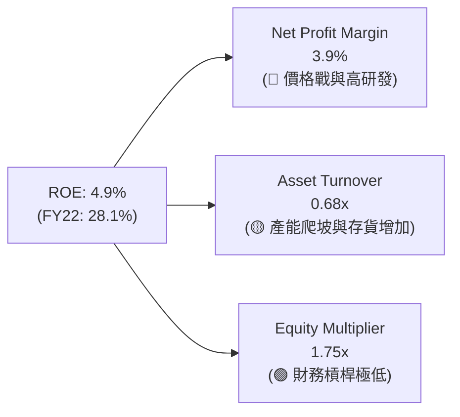

* **杜邦分析結論**：ROE 從 28.1% 暴跌至 4.9%，**最主要的殺手是淨利率（Net Margin）從 15.4% 縮水至 3.9%**。資產週轉率也從 >0.9x 降至 0.68x，顯示資產擴張（Giga Texas/Berlin 擴建）的速度快於營收增長。極低的財務槓桿（1.75x）雖然保證了財務安全，但也限制了 ROE 的彈性。

### 6.4 獲利能力儀表板

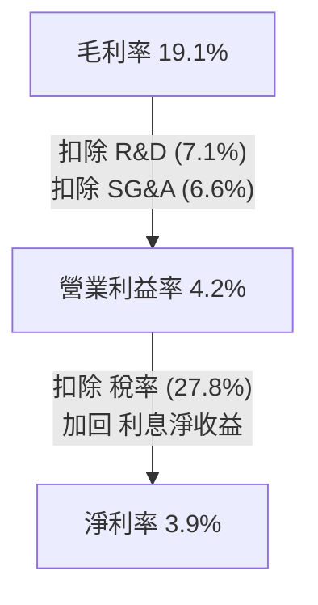

---

## 7. 估值深度分析

### 7.1 同業估值比較表格

為了客觀評估 TSLA 的溢價合理性，我們選取傳統豪華車龍頭（豐田、賓士）與純電直接競爭對手（比亞迪、Rivian）進行對比。

| 估值指標 | **TSLA** | **比亞迪 (1211.HK)** | **豐田汽車 (TM)** | **Rivian (RIVN)** | TSLA 評估 |
|----------|----------|----------------------|-------------------|-------------------|-----------|
| **Trailing P/E** | **336.67x** | 18.5x | 8.2x | N/A (虧損) | 🔴 極度高估 |
| **Forward P/E** | **145.00x** | 15.2x | 7.8x | N/A (虧損) | 🔴 透支未來增長 |
| **P/S Ratio** | **14.21x** | 0.95x | 0.72x | 1.85x | 🔴 遠高於汽車行業均值 |
| **EV / EBITDA** | **126.39x** | 9.8x | 5.4x | N/A | 🔴 隱含極高軟體溢價 |
| **FCF Yield** | **0.38%** | 5.2% | 8.5% | -12.4% | 🔴 現金流回報極低 |
| **狀態** | 🔴 溢價極高 | 🟢 估值合理 | 🟢 價值區間 | 🟡 仍處失血期 | **TSLA 被視為科技/AI 股而非車企** |

### 7.2 歷史估值區間分析

特斯拉的 P/E 歷史區間極大（50x - 1000x）。當前 Trailing P/E 336x 處於過去三年估值區間的上緣，顯示市場對 FSD V12 的成功與 Robotaxi 的願景給予了極高的溢價，容錯率極低。

### 7.3 情境目標價（假設驅動，Bear / Base / Bull）

我們基於 3 年期財務預測（2026-2029）建立三情境模型。由於特斯拉淨利潤受研發與折舊壓抑，我們主要採用 **EV/EBITDA** 與 **Forward P/E** 作為估值乘數。

| 情境 | 營收 CAGR (3Y) | 2029 營業利益率 | 2029 隱含 EPS | 退出 Forward P/E | 隱含目標價 | 相對現價 ($370.34) |
|------|-----------|-----------|----------|------------|----------|------------|
| 🔴 **悲觀** | 5.0% | 3.5% | $1.50 | 50.0x | **$180.00** | -51.4% |
| 🟡 **基準** | **15.0%** | **8.0%** | **$3.50** | **100.0x** | **$425.22** | **+14.8%** |
| 🟢 **樂觀** | 25.0% | 15.0% | $6.50 | 120.0x | **$600.00** | +62.0% |

* **估值倍數選擇說明**：基準情境下我們給予 **100x Forward P/E**，這遠超傳統車企（8-12x），主因是我們將其定位為「AI 軟體授權與機器人平台」，預期 2028 年後 FSD 軟體營收佔比將提升至 15% 以上，帶動綜合利潤率回升。

### 7.4 DCF 敏感性分析（9格目標價矩陣）

* **基準假設**：無風險利率 4.0%，永續增長率 2.5%，WACC 基準為 12.90%。

| 營收 CAGR \ WACC | WACC = 11.0% | **WACC = 12.9% (基準)** | WACC = 14.0% |
|------------------|--------------|-------------------------|--------------|
| 🟢 **樂觀 (25%)** | $650.00 | **$550.00** | $480.00 |
| 🟡 **基準 (15%)** | $490.00 | **$425.22** | $360.00 |
| 🔴 **悲觀 (5%)** | $230.00 | **$180.00** | $150.00 |

### 7.5 估值綜合區間

```
  $125.00 (分析師最低價)
    |
    |-----[ 悲觀 $180 ]
    |        |
    |--------|----------[ 當前股價 $370.34 ]
    |        |              |
    |        |--------------|----[ 基準目標價 $425.22 ]
    |                               |
    |-------------------------------|---------------------[ 樂觀 $600 ]
```

---

## 8. 成長催化劑

### 8.1 催化劑時間軸

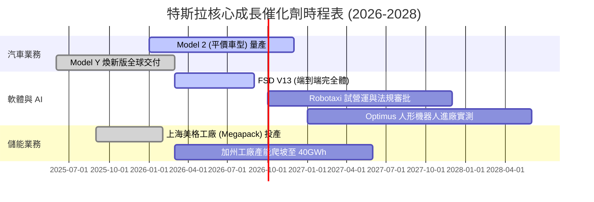

### 8.2 TAM 市場規模分析

```
╔══════════════════════════════════════════════════════════════╗
║                  TSLA 遠期 TAM 與滲透率估算                  ║
╠══════════════════════════════════════════════════════════════╣
║                                                                  ║
║  1. 全球電動車市場 (EV)：                                        ║
║     ├── 2030 TAM: $1.5T ｜ 預期滲透率: 15% ｜ 貢獻營收: $225B    ║
║                                                                  ║
║  2. 儲能市場 (Grid-Scale Storage)：                              ║
║     ├── 2030 TAM: $300B ｜ 預期滲透率: 20% ｜ 貢獻營收: $60B     ║
║                                                                  ║
║  3. 自動駕駛與 Robotaxi (FSD)：                                  ║
║     ├── 2030 TAM: $500B ｜ 預期滲透率: 10% ｜ 貢獻營收: $50B     ║
║                                                                  ║
║  4. 人形機器人 (Optimus)：                                       ║
║     ├── 2030 TAM: $1.0T ｜ 預期滲透率: 1%  ｜ 貢獻營收: $10B     ║
║                                                                  ║
╚══════════════════════════════════════════════════════════════╝
```

### 8.3 成長驅動力結構圖

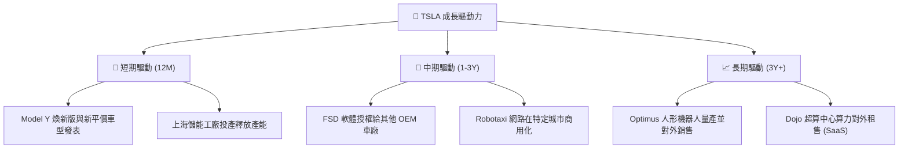

---

## 9. 風險矩陣

### 9.1 風險評分矩陣

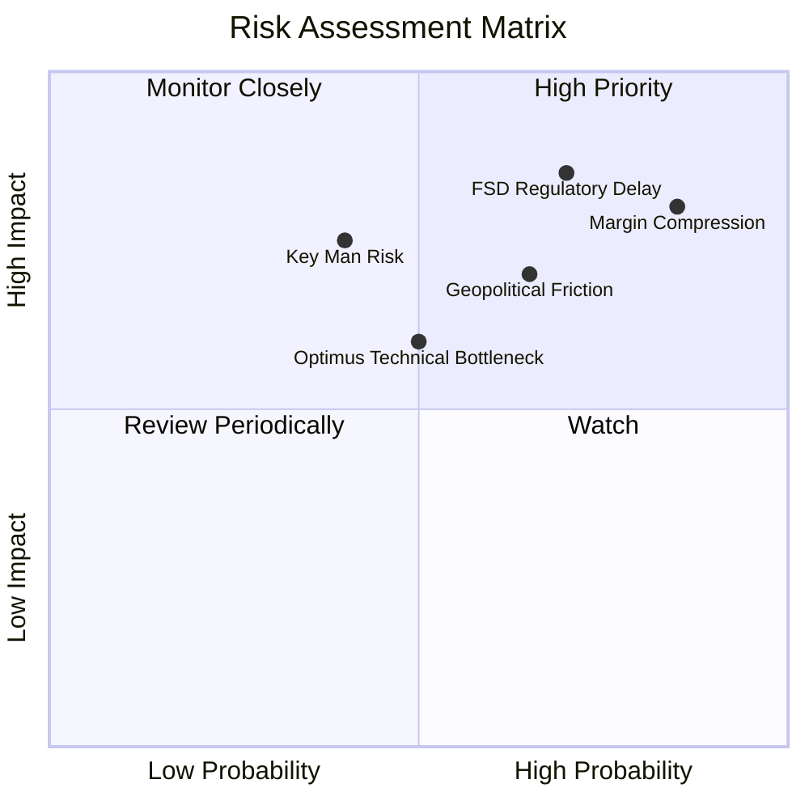

### 9.2 風險清單詳細分析

| # | 風險項目 | 發生機率 | 財務衝擊 | 風險評分 | 緩解與應對措施 |
|---|----------|----------|----------|----------|----------------|
| 1 | 🔴 **汽車毛利率跌破 15%** | 高 (85%) | 高 (-$1.5B 淨利) | 🔴 8.5/10 | 加速導入「開箱工藝」Next-Gen 平台，降低單車生產成本。 |
| 2 | 🔴 **FSD 法規審批延遲** | 中 (70%) | 極高 (延遲 AI 估值變現) | 🔴 8.0/10 | 積極與中美歐監管機構溝通，累積無干預行駛里程數據。 |
| 3 | 🟡 **中美地緣政治摩擦** | 中 (65%) | 高 (供應鏈中斷) | 🟡 7.0/10 | 建立墨西哥、印度等非中國供應鏈，分散生產基地。 |
| 4 | 🟡 **馬斯克個人精力分散** | 中 (40%) | 中 (管理層動盪) | 🟡 5.5/10 | 強化特斯拉獨立董事會職能，建立完善的副總裁梯隊。 |

---

## 10. 投資建議

### 10.1 最終綜合評級雷達圖

```
╔══════════════════════════════════════════════════════════════╗
║                    TSLA 最終綜合評估雷達                     ║
╠══════════════════════════════════════════════════════════════╣
║ 基本面強度：  🟢 🟡 🔴 🔴 🔴 (2/5)  - 獲利能力短期惡化       ║
║ 成長動能：    🟢 🟢 🟢 🟢 🔴 (4/5)  - 儲能爆發，AI 潛力巨大  ║
║ 財務健康度：  🟢 🟢 🟢 🟢 🟢 (5/5)  - 淨現金充裕，防禦力滿格  ║
║ 估值合理性：  🟢 🔴 🔴 🔴 🔴 (1/5)  - 當前估值已透支未來     ║
║ 護城河深度：  🟢 🟢 🟢 🟢 🔴 (4/5)  - 軟硬體壁壘依然穩固     ║
╠══════════════════════════════════════════════════════════════╣
║ 綜合建議：    🟡 持有 (HOLD) - 建議分批逢低佈局，不宜追高    ║
╚══════════════════════════════════════════════════════════════╝
```

### 10.2 目標價與隱含報酬率

| 情境 | 機率權重 | 目標價 | 當前股價 | 隱含報酬率 | 權重預期目標價 |
|------|----------|--------|----------|------------|----------------|
| 🔴 **悲觀** | 25% | $180.00 | $370.34 | -51.4% | $45.00 |
| 🟡 **基準** | **55%** | **$425.22** | **$370.34** | **+14.8%** | **$233.87** |
| 🟢 **樂觀** | 20% | $600.00 | $370.34 | +62.0% | $120.00 |
| **加權綜合**| 100% | **$398.87** | $370.34 | **+7.7%** | **建議分批吸納** |

### 10.3 買入時機與觸發因素

```
╔══════════════════════════════════════════════════════════════════╗
║                  ✅ TSLA 投資觸發因素 Checklist                  ║
╠══════════════════════════════════════════════════════════════════╣
║                                                                  ║
║  立即買入觸發條件（多數符合）：                                  ║
║  ✅ 汽車毛利率（扣除碳信用）連續兩季回升至 18% 以上              ║
║  ✅ 儲能單季出貨量突破 15 GWh                                    ║
║  ✅ 股價回檔至 $300 以下（Forward P/E 降至 110x 左右）            ║
║                                                                  ║
║  加碼觸發條件（出現以下任一）：                                  ║
║  ☐ FSD 獲得中國或歐洲監管機構正式批准商用                        ║
║  ☐ 宣佈首家第三方車企正式簽約授權 FSD 系統                       ║
║                                                                  ║
║  減碼/停損觸發條件（出現以下任一）：                             ║
║  ☐ 汽車毛利率跌破 15% 且無回升跡象                               ║
║  ☐ 自由現金流連續兩季轉負                                       ║
╚══════════════════════════════════════════════════════════════════╝
```

### 10.4 投資人適配度分析

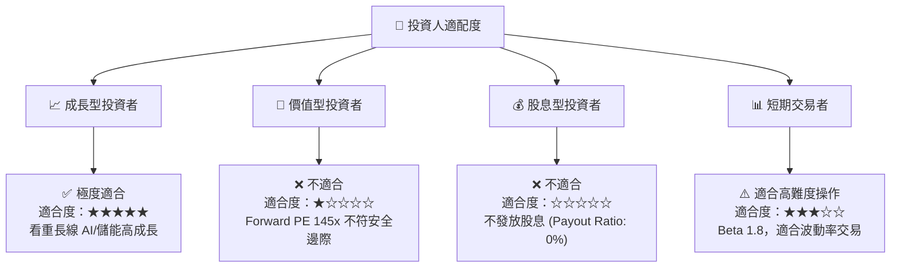

### 10.5 每季財報監控清單（Quarterly Watch List）

為了持續追蹤投資邏輯是否發生變化，投資人應在每季財報中重點監控以下指標：

| 監控指標 | 基準值 (TTM) | 偏向多頭門檻 | 偏向空頭門檻 (觸發減碼) | 追蹤意義 |
|----------|--------------|--------------|-------------------------|----------|
| **汽車毛利率 (ex-credits)** | 16.5% | > 18.0% | < 14.0% | 判斷價格戰是否結束、產線效率是否提升 |
| **儲能裝機量 (GWh)** | ~6.5 GWh /季 | > 8.0 GWh | < 5.0 GWh | 評估第二增長曲線的兌現速度 |
| **研發費用率 (R&D / Rev)** | 7.1% | 6.5% - 8.0% | > 10.0% (若營收未增) | 監控 AI 與機器人研發的資金消耗率 |
| **自由現金流 (FCF)** | $1.44B /季 | > $2.0B | < $0 (轉為淨流出) | 防範重資本投入導致的流動性失血 |

### 10.6 反面論證：什麼會證明論點錯誤（What Would Change My Mind）

```
╔══════════════════════════════════════════════════════════════════╗
║              ⚠️ 論點失效條件 (Disconfirming Evidence)            ║
╠══════════════════════════════════════════════════════════════════╣
║  本投資報告的「持有」評級基於儲能與 AI 軟體遠期變現之假設。      ║
║  若發生以下情況，必須承認多頭論點失效，應果斷停損或減碼：        ║
║                                                                  ║
║  ☐ 核心汽車業務毛利率連續兩季低於 15%，顯示品牌溢價完全消失。   ║
║  ☐ 儲能業務增長率跌破 15%，顯示 Megapack 面臨中國同業惡性競爭。  ║
║  ☐ 自由現金流轉負，導致帳面淨現金（當前 $28.85B）持續萎縮。      ║
║  ☐ FSD V13 發生重大安全事故，導致法規審批無限期推遲。            ║
║  ☐ ROIC 持續低於 WACC 達兩年以上，證明高額 AI CapEx 無法變現。    ║
╚══════════════════════════════════════════════════════════════════╝
```

---

> **免責聲明**：本報告為 AI 自動生成，僅供研究參考，不構成投資建議。投資有風險，入市需謹慎。