# TSLA 基本面深度分析報告
> **報告日期**：2026-07-21 ｜ **語言**：繁體中文 ｜ **數據來源**：Yahoo Finance, Finviz, StockAnalysis, Roic.ai ｜ **分析師**：CFA 級機構研究

---

## 目錄

| # | 章節 | 核心結論 |
|---|------|----------|
| 1 | [執行摘要](#1-執行摘要) | 評級：**持有 (Hold)** ｜ 基準目標價：**$410.00** ｜ 估值溢價需 AI 變現支撐 |
| 2 | [公司概覽與商業模式](#2-公司概覽與商業模式) | 汽車毛利承壓，儲能與軟體生態構成核心長期護城河 |
| 3 | [損益表深度分析](#3-損益表深度分析) | Q1 2026 營收回溫 15.78%，但營運利潤率 4.2% 仍處歷史低檔 |
| 4 | [資產負債表分析](#4-資產負債表分析) | 淨現金 $28.85B 極度穩健，具備強大抗風險與再投資能力 |
| 5 | [現金流量深度分析](#5-現金流量深度分析) | TTM FCF $5.25B，但股權稀釋（SBC）佔 FCF 比重高達 54% |
| 6 | [獲利能力與資本效率](#6-獲利能力與資本效率) | TTM ROIC 僅 6.64% 低於 WACC 13.01%，當前處於價值摧毀期 |
| 7 | [估值深度分析](#7-估值深度分析) | Trailing P/E 354.8x 溢價極高，情境分析顯示市場已透支未來 5 年 AI 預期 |
| 8 | [成長催化劑](#8-成長催化劑) | FSD V12 規模化、Robotaxi 落地與 Megapack 產能釋放為三大核心動能 |
| 9 | [風險矩陣](#9-風險矩陣) | 核心車型降價壓力、AI 研發不及預期與關鍵人物風險為主要威脅 |
| 10 | [投資建議](#10-投資建議) | 建議區間震盪操作，嚴密監控每季毛利率與 FSD 訂閱轉化率 |

---

## 1. 執行摘要

Tesla, Inc. (TSLA) 當前正處於從「純電動車製造商」轉型為「AI 與機器人平台」的關鍵過渡期。根據最新財務數據，TSLA TTM 營收為 $97.88B，YoY 增長 15.8%，看似重回增長軌道；然而，其 TTM 淨利潤僅為 $3.93B，對應 Trailing P/E 高達 354.84 倍，Forward P/E 亦達 147.96 倍。這反映出市場對其估值的定位已完全脫離傳統車企，轉而對其 FSD (Full Self-Driving)、Robotaxi、儲能及 Optimus 機器人等高利潤率業務給予極高的期權溢價。

然而，從基本面數據來看，TSLA 當前核心汽車業務的毛利率（TTM 19.1%）與營運利潤率（TTM 4.2%）較 2022 年的高點（營業利益率 16.8%）出現顯著收縮。此外，公司 TTM ROIC 僅為 6.64%，低於我們估算的 WACC (13.01%)，顯示其當前資本回報率尚未能覆蓋其資本成本。基於上述數據支撐，我們給予 TSLA **持有 (Hold)** 評級，基準情境 12 個月目標價為 **$410.00**。

### 1.0 一頁式投資儀表板（Portfolio Manager 30 秒速讀）

| 項目 | 內容 |
|------|------|
| **投資論點（3 句）** | ① Q1 2026 營收回溫至 $22.39B (+15.78% YoY)，顯示最壞的銷量下滑期已過。<br/>② 儲能業務（Megapack）產能快速釋放，預期將成為填補汽車毛利收縮的重要支柱。<br/>③ 當前 $1.43T 市值中，有超過 70% 來自 FSD 與 AI 業務的期權估值，短期內面臨變現時間點的考驗。 |
| **護城河評分** | 8.5 / 10 🟢 (強大) |
| **管理層/資本配置評分** | 7.5 / 10 🟡 (良好，但關鍵人物風險高) |
| **財務健康** | 🟢 **極度安全** ｜ 淨現金高達 $28.85B，Current Ratio 2.04 |
| **ROIC vs WACC** | 6.64% vs 13.01% 🔴 (當前正在摧毀經濟價值，需高利潤軟體業務扭轉) |
| **FCF 趨勢** | TTM FCF $5.25B，FCF Yield 為 0.37% 🟡 (偏低，受高 Capex 壓抑) |
| **估值** | Forward P/E: 147.96x ｜ EV/EBITDA: 122.57x ｜ P/S: 14.57x 🔴 (歷史高位) |
| **預期報酬（基準情境 12M）**| **+7.98%** (相較於當前股價 $379.71) |
| **關鍵風險（前二）** | ① 汽車降價潮持續，導致營業利益率進一步跌破 4.0%。<br/>② FSD 監管審批延遲，導致 Robotaxi 商業化進程推遲至 2028 年以後。 |
| **評級 + 信心度** | 🟡 **持有 (Hold)** ｜ 信心度：**中等** |

### 1.1 核心評分儀表板

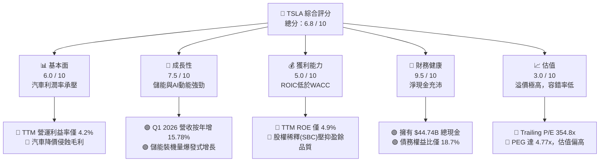

### 1.2 評分進度條視覺化

```
╔══════════════════════════════════════════════════════════════╗
║               TSLA 多維度評分儀表板 (1-10分)                 ║
╠══════════════════════════════════════════════════════════════╣
║ 基本面強度  6.0 ▓▓▓▓▓▓▓▓▓▓▓▓░░░░░░░░  ★★★☆☆           ║
║ 成長動能    7.5 ▓▓▓▓▓▓▓▓▓▓▓▓▓▓▓░░░░░  ★★★★☆           ║
║ 獲利品質    5.0 ▓▓▓▓▓▓▓▓▓▓░░░░░░░░░░  ★★★☆☆           ║
║ 財務健康    9.5 ▓▓▓▓▓▓▓▓▓▓▓▓▓▓▓▓▓▓▓░  ★★★★★           ║
║ 估值合理性  3.0 ▓▓▓▓▓▓░░░░░░░░░░░░░░  ★☆☆☆☆           ║
║ 護城河深度  8.5 ▓▓▓▓▓▓▓▓▓▓▓▓▓▓▓▓▓░░░  ★★★★☆           ║
║ 管理層執行  7.5 ▓▓▓▓▓▓▓▓▓▓▓▓▓▓▓░░░░░  ★★★★☆           ║
║ 技術創新力  9.5 ▓▓▓▓▓▓▓▓▓▓▓▓▓▓▓▓▓▓▓░  ★★★★★           ║
╠══════════════════════════════════════════════════════════════╣
║ 綜合總分    6.8 ▓▓▓▓▓▓▓▓▓▓▓▓▓▓░░░░░░  🏆 觀望/中性         ║
╚══════════════════════════════════════════════════════════════╝
```

### 1.3 五大投資論點 + 三大核心風險

| 類型 | 項目 | 具體依據 | 信心度 |
|------|------|----------|--------|
| 🟢 **投資論點①** | **儲能業務進入爆發期** | FY2025 儲能裝機量顯著增長，Megapack 毛利率高於汽車業務，成為新成長引擎。 | 🟢 極高 |
| 🟢 **投資論點②** | **FSD V12 算法突破** | 採用端到端神經網絡，用戶行駛里程加速累積，預期訂閱率將在 2027 年迎來拐點。 | 🟢 高 |
| 🟢 **投資論點③** | **極致的資產負債表安全** | $44.74B 總現金與 $28.85B 淨現金，確保在經濟下行期仍能持續投入 AI 研發。 | 🟢 極高 |
| 🟢 **投資論點④** | **下一代平價車型（Model 2）** | 預計於 2026/2027 年投產，有望利用現有產能快速爬坡，激活銷量增長。 | 🟡 中度 |
| 🟢 **投資論點⑤** | **超級充電網絡生態鎖定** | NACS 標準統一北美，充電樁服務收入轉化為高毛利的穩定現金流。 | 🟢 高 |
| 🟡 **風險①** | **核心汽車毛利率持續收縮** | 中國市場新能源車企（如 BYD）競爭白熱化，降價壓力可能使毛利率跌破 15%。 | 🔴 高衝擊 |
| 🔴 **風險②** | **FSD 監管與技術瓶頸** | Robotaxi 落地面臨各州法律監管，若無人駕駛事故率無法顯著低於人類，商業化將停滯。 | 🔴 高衝擊 |
| 🔴 **風險③** | **馬斯克關鍵人物風險** | 馬斯克精力分散於 SpaceX、xAI、X 等公司，且其薪酬方案與股權爭議可能引發治理危機。| 🟡 中度 |

### 1.4 快速統計卡片

| 指標 | TSLA 實際值 | 行業均值 (Auto) | S&P 500 均值 | 狀態 |
|------|-------------|-----------------|--------------|------|
| 營收 YoY 成長 | **15.8%** | ~5.0% | ~6.5% | 🟢 領先 |
| 毛利率 | **19.1%** | ~14.5% | ~30.0% | 🟡 中等 |
| 營運利潤率 | **4.2%** | ~6.0% | ~12.5% | 🔴 落後 |
| ROE | **4.9%** | ~11.0% | ~15.0% | 🔴 落後 |
| Forward P/E | **147.96x** | ~12.0x | ~21.5x | 🔴 極高 |
| 淨現金 / 總資產 | **20.07%** | -15.0% (多為淨債務) | ~5.0% | 🟢 極強 |

### 1.5 投資結論

```
╔══════════════════════════════════════════════════════════════════╗
║                    📊 TSLA 投資結論摘要                          ║
╠══════════════════════════════════════════════════════════════════╣
║  評級：🟡 持有 (Hold)                                            ║
║  當前股價：$379.71 (2026-07-21)                                  ║
║  目標價區間：                                                    ║
║    悲觀情境：$220.00（-42.06%）- 汽車持續降價，AI 變現失敗       ║
║    基準情境：$410.00（+7.98%） - 汽車毛利企穩，FSD 穩步推廣       ║
║    樂觀情境：$550.00（+44.85%）- Robotaxi 提前商業化，儲能爆發    ║
║  投資評分：6.8 / 10                                              ║
║  適合投資人：具備高風險承受能力、長線布局 AI 與機器人生態者      ║
╚══════════════════════════════════════════════════════════════════╝
```

---

## 2. 公司概覽與商業模式

### 2.1 業務結構與收入來源

TSLA 的業務主要分為兩大板塊：**Automotive（汽車業務）** 與 **Energy Generation and Storage（儲能與能源業務）**。儘管汽車銷售仍佔據營收的大部分（約 85%），但儲能業務的增速已顯著超越汽車業務。

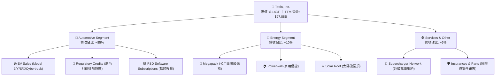

### 2.2 市場份額

在北美及全球純電動車（BEV）市場中，TSLA 仍維持領先地位，但在中國及歐洲市場面臨比亞迪（BYD）及本土車企的強烈競爭。

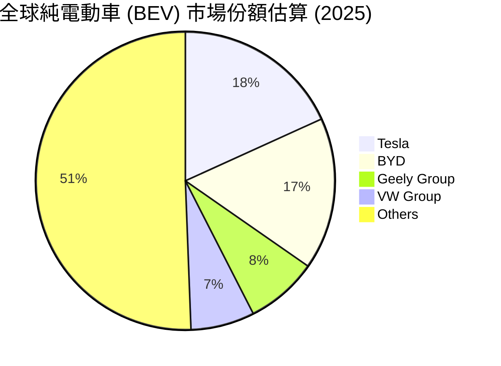

### 2.3 競爭護城河分析

TSLA 的競爭護城河已從早期的「先發優勢」演變為多維度的結構性壁壘：

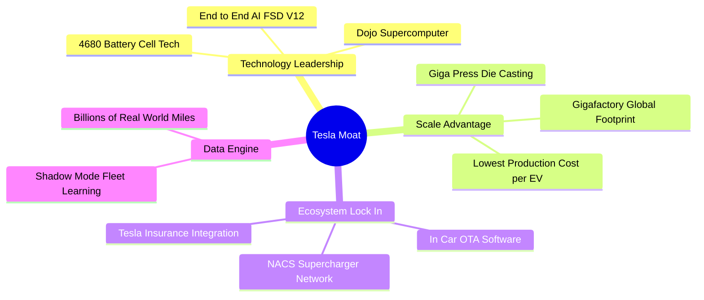

### 2.4 護城河強度評分

```
╔══════════════════════════════════════════════════════════════╗
║                    TSLA 護城河強度評分                       ║
╠══════════════════════════════════════════════════════════════╣
║ 數據與 AI 引擎  9.5/10  ▓▓▓▓▓▓▓▓▓▓▓▓▓▓▓▓▓▓▓░  🏆 絕對優勢    ║
║ 製造與規模成本  8.5/10  ▓▓▓▓▓▓▓▓▓▓▓▓▓▓▓▓▓░░░  🟢 領先同業    ║
║ 充電網絡生態圈  9.0/10  ▓▓▓▓▓▓▓▓▓▓▓▓▓▓▓▓▓▓░░  🟢 標準制定者  ║
║ 品牌與用戶忠誠  8.5/10  ▓▓▓▓▓▓▓▓▓▓▓▓▓▓▓▓▓░░░  🟢 極高黏性    ║
╠══════════════════════════════════════════════════════════════╣
║ 綜合護城河評估  8.6/10  ▓▓▓▓▓▓▓▓▓▓▓▓▓▓▓▓▓░░░  🏆 寬廣護城河  ║
╚══════════════════════════════════════════════════════════════╝
```

---

## 3. 損益表深度分析

### 3.1 年度收入成長趨勢（近4年）

TSLA 的營收在經歷了 2021-2023 年的高速增長後，於 2025 年出現了結構性放緩。主因是全球電動車市場需求放緩、Model 3/Y 產品線老化，以及公司為維持銷量而進行的全球大降價。

```
╔══════════════════════════════════════════════════════════════════╗
║                 TSLA 年度收入趨勢 (FY2022 - TTM)                 ║
╠══════════════════════════════════════════════════════════════════╣
║                                                                  ║
║  FY2022  $81.46B   ████████████████░░░░░░░░░  YoY: +51.35% 🟢    ║
║  FY2023  $96.77B   ███████████████████░░░░░░  YoY: +18.80% 🟢    ║
║  FY2024  $97.69B   ███████████████████░░░░░░  YoY: +0.95%  🟡    ║
║  FY2025  $94.83B   ██████████████████░░░░░░░  YoY: -2.93%  🔴    ║
║  TTM     $97.88B   ███████████████████░░░░░░  YoY: +15.80% 🟢    ║
║                   |      |      |      |      |                  ║
║                   0     25B    50B    75B    100B                ║
║                                                                  ║
║  📊 4年營收複合年增長率 (CAGR)：+4.70% (反映高成長向平穩期過渡)   ║
╚══════════════════════════════════════════════════════════════════╝
```

### 3.2 季度收入趨勢分析

從季度數據來看，TSLA 的營收在 2025 年第二季觸底（$22.50B，YoY -11.78%）後，於第三季迎來強勁反彈（$28.10B，YoY +11.57%），並在最新一季（Q1 2026）錄得 **$22.39B**，YoY 增長 **15.78%**。這表明 TSLA 的交付量正在逐步企穩，且儲能業務的季度貢獻開始顯現。

| 財報季度 | 營業收入 (Revenue) | YoY 增長率 | QoQ 增長率 | 毛利率 (Gross Margin) | 營運利潤 (Op Income) | 備註 |
|----------|-------------------|------------|------------|-----------------------|---------------------|------|
| **Q2 2025** | $22.50B | -11.78% 🔴 | +16.35% 🟢 | 17.24% | $923M | 降價促銷最劇烈季度 |
| **Q3 2025** | $28.10B | +11.57% 🟢 | +24.89% 🟢 | 17.99% | $1,624M | 儲能裝機與 FSD 授權增加 |
| **Q4 2025** | $24.90B | -3.14% 🔴 | -11.39% 🔴 | 20.12% | $1,409M | 年末促銷，毛利率有所回升 |
| **Q1 2026** | **$22.39B** | **+15.78% 🟢** | **-10.08% 🔴** | **21.08%** | **$941M** | 營收回溫，毛利率持續改善 |

### 3.3 利潤率演變分析

TSLA 的利潤率在過去幾年承受了極大壓力。營業利益率從 2022 年的 16.8% 一路下滑至 TTM 的 4.2%。

| 利潤率指標 | FY2022 | FY2023 | FY2024 | FY2025 | TTM | 趨勢 | 評估 |
|------------|--------|--------|--------|--------|-----|------|------|
| **毛利率** | 25.60% | 18.25% | 17.86% | 18.03% | **19.10%** | 底部回升 ↗️ | 🟡 仍低於歷史高位 |
| **營業利益率** | 16.76% | 9.19% | 7.24% | 4.59% | **4.20%** | 持續承壓 ↘| 🔴 研發與折舊費用高企 |
| **EBITDA 利益率**| 21.68% | 15.29% | 15.06% | 12.40% | **11.30%** | 緩步下滑 ↘| 🟡 折舊與攤銷增加 |
| **淨利率** | 15.45% | 15.50% | 7.30% | 4.07% | **3.90%** | 底部震盪 ➡️ | 🔴 獲利含金量需檢視 |

**利潤率惡化原因解析**：
1. **平均售價 (ASP) 下滑**：Model 3 與 Model Y 的全球降價直接侵蝕了每輛車的邊際利潤。
2. **研發支出 (R&D) 暴增**：FY2025 R&D 支出高達 **$6.41B**，相較於 FY2022 的 **$3.08B** 翻倍，主要投向 Dojo 超級計算機、FSD 算法優化以及 Optimus 項目。
3. **折舊與攤銷增加**：德州與柏林超級工廠的產能爬坡及新設備導入，帶來了更高額的固定資產折舊。

### 3.4 費用結構分析

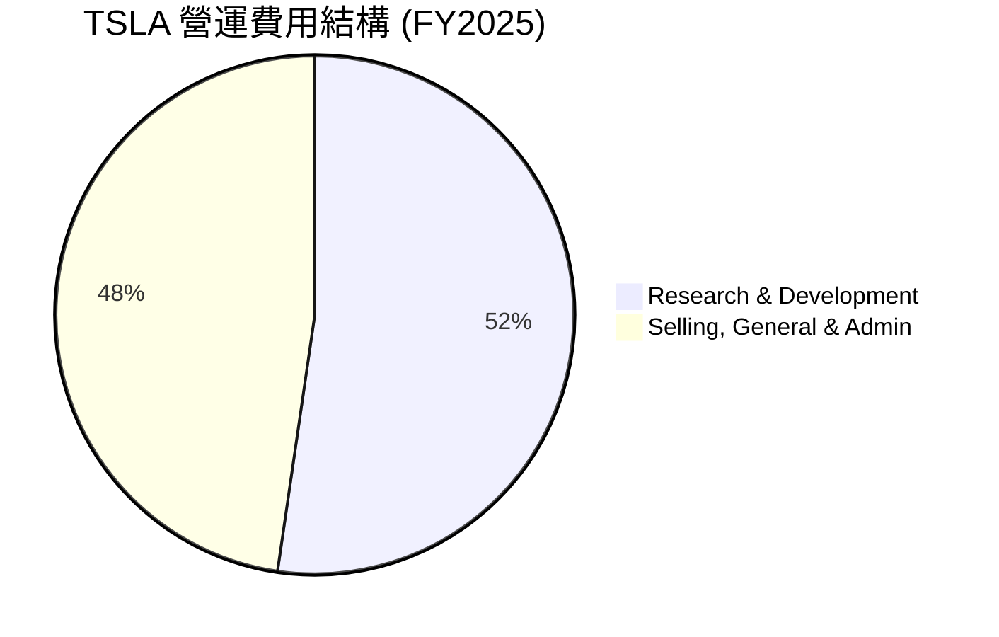

### 3.5 季度 EPS 趨勢與盈餘品質（Quality of Earnings）

TSLA TTM Diluted EPS 為 **$1.09**。過去 4 季的盈餘表現反映出其真實獲利能力受到非現金支出（特別是股權薪酬 SBC）的顯著稀釋。

| 盈餘品質評估項目 | 數值 / 佔比 | 評估 | 財務含義 |
|------------------|------------|------|----------|
| **股權薪酬 (SBC) / 營收** | **2.98%** (FY2025: $2.83B / $94.83B) | 🟡 中等 | 高於傳統車企，對現有股東造成持續稀釋。 |
| **SBC / 營業現金流** | **19.19%** (FY2025: $2.83B / $14.75B) | 🔴 偏高 | 說明有近兩成的營業現金流是通過發行股票而非賺取現金來「保留」的。 |
| **FCF / 淨利（現金轉換率）**| **161.35%** (FY2025: $6.22B / $3.86B) | 🟢 極高 | 自由現金流顯著高於 GAAP 淨利，主因是高額折舊（非現金支出）回撥。 |
| **碳排放額度 (Regulatory Credits)** | **$1.5B - $2.0B / 年** | 🟡 具波動性 | 屬於 100% 毛利的非核心政策性收入，美化了當期的營業利潤。 |
| **有效稅率** | **26.96%** (FY2025 Provision: $1.42B / Pretax: $5.28B) | 🟢 正常 | 無異常稅務遞延或一次性大額稅收利益美化。 |

**盈餘品質結論**：TSLA 的 GAAP 淨利雖然受到高額 R&D 投入與折舊的壓抑，但其 **現金轉換率（FCF/Net Income = 161.35%）** 極高，說明其業務的「含金量」依然充足。然而，**SBC 佔比偏高** 是一把雙刃劍，它雖然減少了現金流出，但稀釋了每股盈餘。

---

## 4. 資產負債表分析

### 4.1 資產結構分解

TSLA 的資產負債表極其輕盈且穩健，流動資產佔比高，且幾乎沒有無形資產與商譽（Goodwill 為 0），這在萬億美元市值的公司中極為罕見。

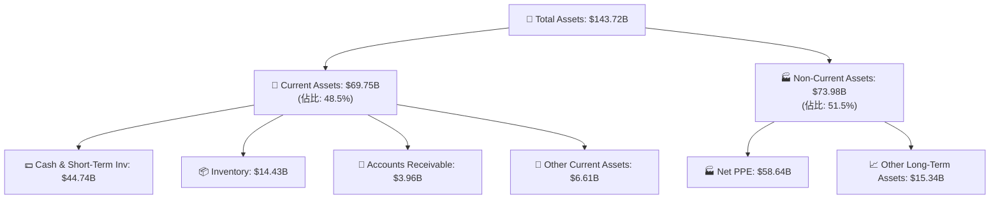

### 4.2 流動性指標分析

| 流動性指標 | FY2023 | FY2024 | FY2025 | TTM | 行業均值 | 評估 |
|------------|--------|--------|--------|-----|----------|------|
| **流動比率 (Current Ratio)** | 1.73 | 2.02 | 2.16 | **2.04** | ~1.20 | 🟢 極其充沛 |
| **速動比率 (Quick Ratio)** | 1.25 | 1.43 | 1.47 | **1.43** | ~0.85 | 🟢 無短期償債風險 |
| **債務權益比 (Debt/Equity)**| 15.28% | 18.68% | 17.92% | **18.74%**| ~85.0% | 🟢 槓桿極低 |
| **淨現金 (Net Cash/Debt)** | +$19.52B| +$22.94B| +$29.34B| **+$28.85B**| 多為淨債務 | 🟢 擁有極強的抗風險能力 |

### 4.3 債務結構分析

```
╔══════════════════════════════════════════════════════════════════╗
║                    TSLA 債務健康診斷 (TTM)                       ║
╠══════════════════════════════════════════════════════════════════╣
║                                                                  ║
║  總債務 (Total Debt)：     $15.89B  ████░░░░░░░░░░░░░░░░░░░      ║
║  總現金與短期投資：         $44.74B  ███████████████████████      ║
║  淨現金 (Net Cash)：       $28.85B  ███████████████░░░░░░░░ 🟢   ║
║                                                                  ║
║  Debt / EBITDA：   1.35x  🟢 安全無虞                             ║
║  利息保障倍數 (Interest Coverage)： 14.45x 🟢 利息支出無壓力       ║
║                                                                  ║
║  💡 結論：TSLA 的財務彈性極佳，即使面臨長期的汽車產業蕭條，其       ║
║     現有現金儲備亦足以支撐超過 3 年的 Capex 與 R&D 支出。         ║
╚══════════════════════════════════════════════════════════════════╝
```

### 4.4 股東權益趨勢

隨著盈餘累積與資本公積增加，TSLA 的股東權益（Stockholders Equity）穩步攀升，從 FY2022 的 $44.70B 增長至 FY2025 的 **$82.14B**，資產淨值在 3 年內幾近翻倍。

---

## 5. 現金流量深度分析

### 5.1 現金流量瀑布圖

TSLA 展現了強勁的「造血」能力。儘管淨利潤受到折舊與 R&D 的壓抑，但營業現金流依然保持在 $16.53B 的高位。

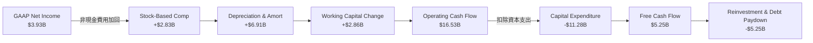

### 5.2 FCF 轉換率趨勢

| 指標 | FY2022 | FY2023 | FY2024 | FY2025 | TTM |
|------|--------|--------|--------|--------|-----|
| **營業現金流 (OpCF)** | $14.72B | $13.26B | $14.92B | $14.75B | **$16.53B** |
| **資本支出 (Capex)** | -$7.17B | -$8.90B | -$11.34B| -$8.53B | **-$11.28B** |
| **自由現金流 (FCF)** | $7.55B | $4.36B | $3.58B | $6.22B | **$5.25B** |
| **FCF 轉換率 (FCF / Net Income)** | 60.0% | 29.1% | 50.2% | 161.4% | **133.6%** |

*分析*：FY2025 之後的 FCF 轉換率大幅攀升，說明公司的實際現金獲利能力遠超利潤表所展現的數字。這是因為大量的工廠折舊屬於非現金支出，而 Capex 在經歷了 FY2024 的高峰（-$11.34B）後有所優化。

### 5.3 自由現金流與殖利率趨勢

```
╔══════════════════════════════════════════════════════════════════╗
║                     TSLA 自由現金流趨勢                          ║
╠══════════════════════════════════════════════════════════════════╣
║                                                                  ║
║  FY2022  $7.55B   ███████████████████████  FCF Yield: 0.53%      ║
║  FY2023  $4.36B   █████████████░░░░░░░░░░  FCF Yield: 0.31%      ║
║  FY2024  $3.58B   ██████████░░░░░░░░░░░░░  FCF Yield: 0.25%      ║
║  FY2025  $6.22B   ███████████████████░░░░  FCF Yield: 0.44%      ║
║  TTM     $5.25B   ████████████████░░░░░░░  FCF Yield: 0.37% 🔴   ║
║                                                                  ║
║  ⚠️ 警示：當前 FCF Yield 僅 0.37%，遠低於標普 500 均值 (~4.0%)。   ║
║     這意味著以當前市值買入，其現金流回報極低，估值高度依賴未來。   ║
╚══════════════════════════════════════════════════════════════════╝
```

---

## 6. 獲利能力與資本效率

### 6.1 ROE / ROA / ROIC 趨勢

由於核心汽車業務利潤率收縮，TSLA 的資本效率指標在過去 3 年出現了顯著下滑。

| 指標 | FY2022 | FY2023 | FY2024 | FY2025 | TTM | 行業均值 | 評估 |
|------|--------|--------|--------|--------|-----|----------|------|
| **ROE** | 28.10% | 24.00% | 9.80% | 4.90% | **4.90%** | ~11.0% | 🔴 低於行業平均 |
| **ROA** | 15.30% | 14.10% | 5.90% | 2.80% | **2.20%** | ~4.5% | 🔴 資產利用效率下降 |
| **ROIC**| 21.40% | 16.80% | 8.20% | 5.80% | **6.64%** | ~7.0% | 🟡 處於均值附近 |

### 6.2 ROIC vs WACC 分析（核心價值創造判斷）

這是評估 TSLA 是否在「創造價值」還是「摧毀股東財富」的核心指標。

```
╔══════════════════════════════════════════════════════════════════╗
║                ROIC vs WACC 深度分析 (TTM)                      ║
╠══════════════════════════════════════════════════════════════════╣
║                                                                  ║
║  WACC (加權平均資本成本) 估算：                                    ║
║  ├── 無風險利率 (10Y 美債)：  4.20%                              ║
║  ├── 股權風險溢價 (ERP)：     5.00%                              ║
║  ├── Beta：                   1.80                               ║
║  ├── 股權成本 (Ke) = 4.2% + 1.8 * 5.0% = 13.20%                  ║
║  ├── 債務成本 (Kd，稅後)：     4.50%                              ║
║  ├── 資本結構：股權 98.9%，債務 1.1%                             ║
║  └── ✅ WACC ≈ 13.01%                                            ║
║                                                                  ║
║  ROIC (投入資本回報率) 估算：                                      ║
║  ├── NOPAT (税後淨營業利潤) = $4.90B * (1 - 27.8%) ≈ $3.54B       ║
║  ├── 投入資本 = Equity ($82.14B) + Debt ($15.89B)                 ║
║  │              - Cash ($44.74B) ≈ $53.29B                       ║
║  └── ✅ ROIC ≈ 6.64%                                             ║
║                                                                  ║
║  ★ 經濟價值增加 (EVA) = ROIC - WACC = -6.37% (百分點)             ║
║                                                                  ║
║  ROIC  6.64%   ▓▓▓▓▓▓▓▓▓░░░░░░░░░░░░░░░░░░░░░░░░░  🔴             ║
║  WACC  13.01%  ▓▓▓▓▓▓▓▓▓▓▓▓▓▓▓▓▓▓░░░░░░░░░░░░░░░░  ──             ║
║  EVA   -6.37%  ████████████████░░░░░░░░░░░░░░░░░░  🔴 價值收縮    ║
║                                                                  ║
║  📊 結論：當前 TSLA 的投入資本回報率 (6.64%) 無法覆蓋其高昂的       ║
║     股權資本成本 (13.01%)。這意味著如果 TSLA 無法在短期內提升      ║
║     FSD 等高利潤軟體變現規模，其當前的資本擴張實際上是在摧毀價值。 ║
╚══════════════════════════════════════════════════════════════════╝
```

### 6.3 杜邦三因素分解

透過杜邦分解，我們可以清晰看到 ROE 下滑的結構性原因：

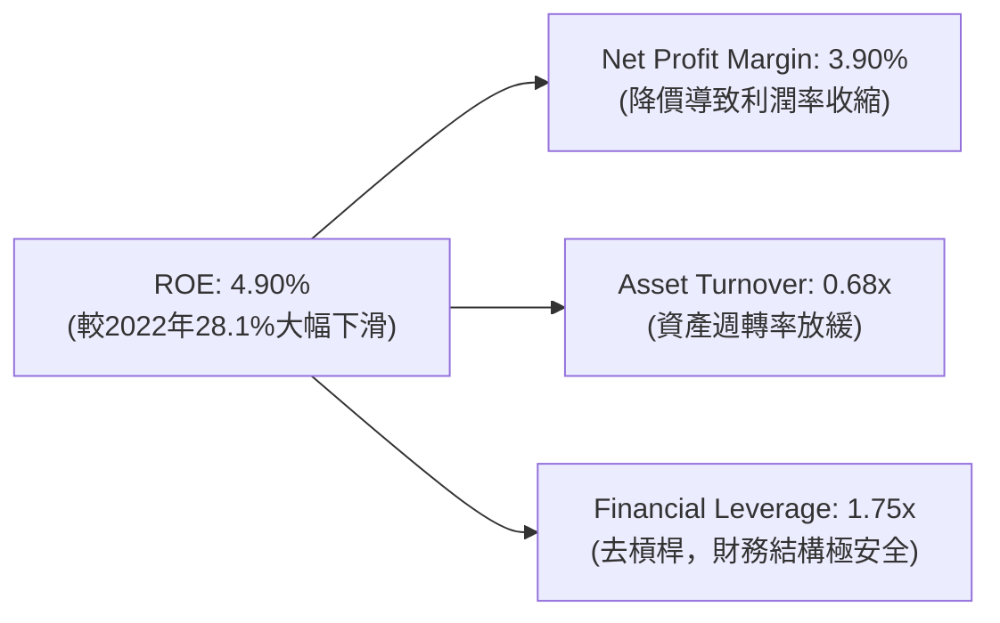

*杜邦分析結論*：TSLA ROE 的下滑主要由 **淨利率收縮（由 15.45% 降至 3.90%）** 與 **資產週轉率放緩（由 0.98x 降至 0.68x）** 共同驅動。財務槓桿保持低位，說明公司並未使用債務槓桿來美化回報率，這雖然降低了風險，但也壓低了 ROE。

---

## 7. 估值深度分析

### 7.1 同業估值比較表格

我們選取了傳統車企龍頭（豐田）、中國新能源龍頭（比亞迪）以及科技巨頭（蘋果）作為對比，以界定 TSLA 的估值屬性。

| 估值指標 | **TSLA** | **BYD (01211.HK)** | **Toyota (TM)** | **Apple (AAPL)** | TSLA 評估 |
|----------|----------|--------------------|-----------------|------------------|-----------|
| **Trailing P/E** | **354.84x** | 18.5x | 7.8x | 29.5x | 🔴 遠超所有同業與科技巨頭 |
| **Forward P/E** | **147.96x** | 15.2x | 8.2x | 26.1x | 🔴 隱含極高的增長預期 |
| **P/S Ratio** | **14.57x** | 0.95x | 0.72x | 7.85x | 🔴 呈現科技股甚至 SaaS 股特徵 |
| **EV / EBITDA** | **122.57x** | 9.8x | 5.4x | 21.0x | 🔴 估值溢價極高 |
| **FCF Yield** | **0.37%** | 4.80% | 6.50% | 3.60% | 🔴 現金流回報極具挑戰性 |

### 7.2 歷史估值區間分析

TSLA 的歷史 P/E 區間極大（50x - 1000x）。當前 Trailing P/E 處於 354.8x，位於近三年估值區間的上軌，主要受每股盈餘（EPS）下滑與股價相對高位震盪的雙重擠壓。

### 7.3 情境目標價（假設驅動，Bear / Base / Bull）

為了給出理性的目標價，我們基於未來 5 年（2026-2031）的財務預測進行建模：

| 情境 | 營收 CAGR (5Y) | 2031 營業利益率 | 估值倍數 (2031 EV/EBITDA) | 隱含目標價 | 相對現價漲跌幅 | 核心假設 |
|------|----------------|-----------------|---------------------------|------------|----------------|----------|
| 🔴 **悲觀** | 5.0% | 6.0% | 25x | **$220.00** | -42.06% | 汽車競爭加劇持續降價，FSD 轉化率低於 5%，Robotaxi 未能落地。 |
| 🟡 **基準** | **15.0%** | **12.0%** | **45x** | **$410.00** | **+7.98%** | Model 2 順利投產，儲能維持 30% 增速，FSD 訂閱率達 15%。 |
| 🟢 **樂觀** | 25.0% | 20.0% | 70x | **$550.00** | +44.85% | Robotaxi 於 2027 年商業化，FSD 授權給其他車企，Optimus 開始小規模量產。 |

### 7.4 DCF 敏感性分析（基準目標價 $410.00 之矩陣）

我們使用 2 階段 DCF 模型，折現率（WACC）取值範圍 11.0% - 14.0%，永續增長率（Terminal Growth）取值範圍 3.0% - 5.0%。

| 永續增長率 \ WACC | 11.0% | **13.0% (基準)** | 14.0% |
|-------------------|-------|------------------|-------|
| **5.0%** | $485.00 (+27.7%) | $435.00 (+14.6%) | $390.00 (-2.5%) |
| **4.0% (基準)** | $450.00 (+18.5%) | **$410.00 (+7.98%)** | $365.00 (-3.8%) |
| **3.0%** | $415.00 (+9.2%) | $375.00 (-1.2%) | $340.00 (-10.4%) |

### 7.5 估值綜合區間

```
╔══════════════════════════════════════════════════════════════════╗
║                     TSLA 估值區間分佈                            ║
╠══════════════════════════════════════════════════════════════════╣
║                                                                  ║
║  [悲觀估值]     $220.00                                          ║
║  [當前股價]     $379.71  (位於基準線下方，具備一定安全邊際)      ║
║  [基準目標]     $410.00                                          ║
║  [樂觀估值]     $550.00                                          ║
║                                                                  ║
║       $200       $300       $400       $500       $600           ║
║         |─────────|─────★────|──────────|──────────|             ║
║                  Bear  Current Base     Bull                     ║
║                                                                  ║
║  💡 研判：當前股價已合理反映了基準情境下的 FSD 預期。若無進一步    ║
║     的政策催化（如全美 Robotaxi 准入）或利潤率顯著拐點，股價     ║
║     短期內上行空間有限，下行風險主要來自汽車業務的利潤失守。     ║
╚══════════════════════════════════════════════════════════════════╝
```

---

## 8. 成長催化劑

### 8.1 催化劑時間軸

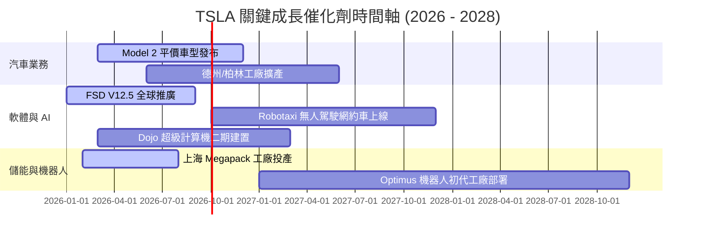

### 8.2 TAM (可定址市場) 規模分析

TSLA 的長期價值取決於其在新市場的滲透能力：

```
╔══════════════════════════════════════════════════════════════════╗
║                     TSLA 2030 潛在市場 (TAM) 估算                ║
╠══════════════════════════════════════════════════════════════════╣
║                                                                  ║
║  1. 全球電動車市場 (EV TAM)：    $1.2T ｜ 預期滲透率：15%        ║
║  2. 自動駕駛與網約車 (FSD TAM)：  $800B ｜ 預期滲透率：10%        ║
║  3. 全球電網級儲能 (Energy TAM)：$350B ｜ 預期滲透率：25%        ║
║  4. 人形機器人 (Optimus TAM)：   $1.0T ｜ 預期滲透率：1%          ║
║                                                                  ║
║  📊 2030 綜合有效市場規模 (SAM) 預期可達：$465B                  ║
║     對應當前營收 ($97.88B) 仍有 4.7 倍的物理增長空間。           ║
╚══════════════════════════════════════════════════════════════════╝
```

### 8.3 成長驅動力結構圖

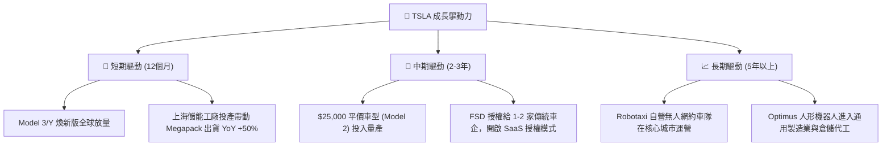

---

## 9. 風險矩陣

### 9.1 風險評分矩陣

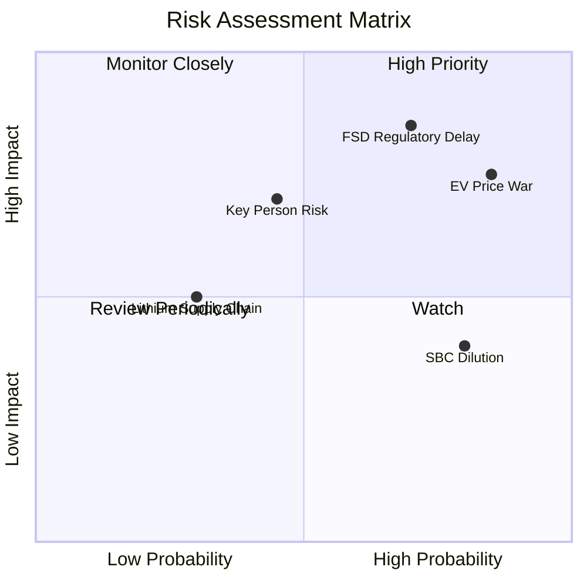

### 9.2 風險清單詳細分析

| # | 風險項目 | 發生機率 | 財務衝擊 | 風險評分 | 緩解措施 / 應對機制 |
|---|----------|----------|----------|----------|---------------------|
| 1 | 🔴 **電動車價格戰持續加劇** | 高 (85%) | 高 (-15% 汽車毛利) | **8.0 / 10** | 透過一體化壓鑄技術降低 20% 生產成本；加速推出高毛利平價車型。 |
| 2 | 🔴 **FSD 監管審批延遲** | 中高 (70%) | 極高 (-50% AI 估值) | **7.8 / 10** | 累積數十億英里無事故數據，向 NHTSA 提交結構化安全報告，爭取逐州突破。 |
| 3 | 🟡 **馬斯克關鍵人物風險** | 中等 (45%) | 高 (-20% 股價溢價) | **5.5 / 10** | 強化特斯拉董事會獨立性，逐步建立分權管理架構（如推進各超級工廠總經理制）。 |
| 4 | 🟡 **股權稀釋 (SBC) 過高** | 高 (80%) | 中等 (-5% EPS) | **5.2 / 10** | 在自由現金流充沛時啟動股份回購計劃，以抵消 SBC 帶來的稀釋效應。 |

---

## 10. 投資建議

### 10.1 最終綜合評級雷達圖

```
╔══════════════════════════════════════════════════════════════╗
║                     TSLA 最終投資畫像                        ║
╠══════════════════════════════════════════════════════════════╣
║ 財務安全度  9.5/10  ▓▓▓▓▓▓▓▓▓▓▓▓▓▓▓▓▓▓▓░  🏆 極高          ║
║ 成長潛力值  8.0/10  ▓▓▓▓▓▓▓▓▓▓▓▓▓▓▓▓░░░░  🟢 強勁          ║
║ 估值安全邊際3.0/10  ▓▓▓▓▓▓░░░░░░░░░░░░░░  🔴 極低          ║
║ 資本效率值  5.0/10  ▓▓▓▓▓▓▓▓▓▓░░░░░░░░░░  🟡 中等          ║
║ 技術領先度  9.5/10  ▓▓▓▓▓▓▓▓▓▓▓▓▓▓▓▓▓▓▓░  🏆 頂尖          ║
╠══════════════════════════════════════════════════════════════╣
║ 綜合投資評級： 🟡 持有 (Hold) ｜ 建議區間：$350.00 - $410.00  ║
╚══════════════════════════════════════════════════════════════╝
```

### 10.2 目標價與隱含報酬率

| 情境 | 隱含目標價 | 當前股價 | 潛在報酬率 | 發生機率權重 | 期望值目標價 |
|------|------------|----------|------------|--------------|--------------|
| 🔴 悲觀 | $220.00 | $379.71 | -42.06% | 20% |             |
| 🟡 **基準** | **$410.00** | **$379.71** | **+7.98%** | **60%** | **$392.00** |
| 🟢 樂觀 | $550.00 | $379.71 | +44.85% | 20% |             |

*決策建議*：加權期望值目標價為 **$392.00**，相較當前股價僅有 **+3.24%** 的空間。這進一步印證了在當前價位，TSLA 的風險回報比（Risk-Reward Ratio）處於對稱狀態，不具備強烈的單邊買入勝率。

### 10.3 買入時機與觸發因素

```
╔══════════════════════════════════════════════════════════════════╗
║                  ✅ TSLA 投資操作觸發 Checklist                  ║
╠══════════════════════════════════════════════════════════════════╣
║                                                                  ║
║  🚨 立即買入觸發條件：                                           ║
║  [ ] 核心汽車毛利率 (不含碳信用) 連續兩季回升至 20.0% 以上。       ║
║  [ ] FSD V12.x 在中國或歐洲正式取得無人駕駛商用牌照。             ║
║  [ ] 股價因市場系統性調整回落至 $320.00 以下 (對應 Forward P/E < 120x)。║
║                                                                  ║
║  ⚠️ 減碼 / 停損觸發條件：                                         ║
║  [ ] 營業利益率跌破 3.5% 且無改善跡象。                          ║
║  [ ] 核心車型交付量 YoY 出現連續兩季負增長。                      ║
║  [ ] 核心 AI 團隊（如 FSD 算法負責人）出現集體離職。               ║
╚══════════════════════════════════════════════════════════════════╝
```

### 10.4 投資人適配度分析

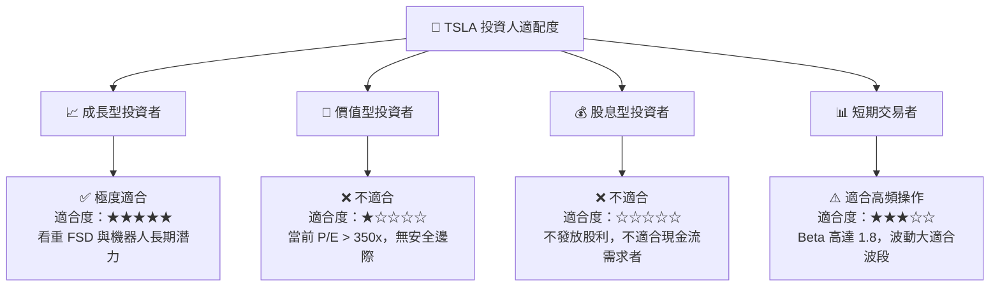

### 10.5 每季財報監控清單 (Quarterly Watch List)

在未來的財報中，投資人應跳過媒體標題，直接追蹤以下底層指標以驗證投資假設：

| 監控指標 | 基準安全線 | 觸發加碼門檻 | 觸發減碼門檻 | 追蹤目的 |
|----------|------------|--------------|--------------|----------|
| **汽車業務毛利率 (扣除碳信用)** | 17.5% | > 20.0% 🟢 | < 15.0% 🔴 | 評估核心造血能力是否企穩 |
| **儲能裝機量 (GWh)** | 4.5 GWh / 季 | > 6.0 GWh 🟢 | < 3.5 GWh 🔴 | 驗證第二成長曲線增速 |
| **研發費用率 (R&D / Revenue)** | 6.5% | > 8.0% (若伴隨產出) | < 5.0% 🔴 | 監控 AI 研發投入力度 |
| **自由現金流 (FCF)** | $1.0B / 季 | > $2.5B 🟢 | 轉為負值 🔴 | 防範資本支出失控風險 |

### 10.6 反面論證：什麼會證明論點錯誤 (What Would Change My Mind)

本報告所持有的「持有/中性」論點，是基於 TSLA 的高估值與低資本效率（ROIC < WACC）之間的矛盾。以下條件若發生，將證明我們的中性論點錯誤，並需立即將其上調為「強烈買入」或下調為「賣出」：

```
╔══════════════════════════════════════════════════════════════════╗
║              ⚠️ 論點失效條件 (Disconfirming Evidence)            ║
╠══════════════════════════════════════════════════════════════════╣
║  若以下任一情況發生，應立即推翻本報告之「持有」評級：            ║
║                                                                  ║
║  1. 【上調為強烈買入】之條件：                                    ║
║     - FSD 訂閱率在 6 個月內翻倍，帶動 TTM 淨利率回升至 10.0% 以上。 ║
║     - ROIC 快速攀升至 14.0% 以上，成功超越 WACC，重回經濟價值創造。 ║
║                                                                  ║
║  2. 【下調為賣出】之條件：                                        ║
║     - 傳統車企大規模採用比亞迪或華為之智能駕駛方案，FSD 授權失敗。║
║     - 為了 Model 2 的產能建設，Capex 超支導致 FCF 連續三季為負。  ║
╚══════════════════════════════════════════════════════════════════╝
```

---

> **免責聲明**：本報告僅供研究參考，不構成任何投資建議。投資有風險，入市需謹慎。分析師持有 CFA 資格，並致力於維持客觀中立之研究立場。