# TSLA 基本面深度分析報告

> **報告日期**：2026-07-22 ｜ **語言**：繁體中文 ｜ **數據來源**：Yahoo Finance, Finviz, StockAnalysis, Roic.ai ｜ **分析師**：CFA 級機構研究

---

## 目錄

| # | 章節 | 核心結論 |
|---|------|----------|
| 1 | **執行摘要** | 評級為 🟡 **持有（Hold）/ 區間操作**，目標價 $425.22，短期估值透支，長期 AI 選擇權待變現 |
| 2 | **公司概覽與商業模式** | 汽車與能源雙輪驅動，垂直整合與 FSD 軟體生態構成核心護城河 |
| 3 | **損益表深度分析** | Q1 2026 營收復甦（+15.78% YoY），但高額 R&D 支出與折舊壓抑營業利益率至 4.2% |
| 4 | **資產負債表分析** | 擁有 $28.85B 淨現金，流動比率 2.04，展現強健的資產負債表與抗風險能力 |
| 5 | **現金流量深度分析** | TTM FCF 為 $5.25B，SBC 稀釋效應顯著（TTM SBC 達 $3.28B，佔 FCF 之 62.5%） |
| 6 | **獲利能力與資本效率** | ROIC（6.64%）低於 WACC（13.01%），當前處於經濟價值毀損期，亟需高利潤軟體業務提振 |
| 7 | **估值深度分析** | Trailing P/E 341.17x，遠超同業；基準情境目標價 $425.22，隱含 13.3% 上行空間 |
| 8 | **成長催化劑** | FSD V12 全面推送、Robotaxi 商業化落地及 Megapack 能源儲能產能釋放 |
| 9 | **風險矩陣** | 核心車型降價風險、AI 變現進度不及預期與關鍵人物風險（Key Man Risk） |
| 10 | **投資建議** | 適合高風險承受度之成長型投資人，建議於 $340 以下分批佈局，設定嚴格監控指標 |

---

## 1. 執行摘要

> ⚠️ **重要聲明與評級基礎**：本報告給予 Tesla, Inc.（TSLA） 🟡 **持有（Hold）/ 區間操作** 評級。該評級是基於 TTM 損益表與資產負債表數據的客觀推導：儘管公司在 Q1 2026 迎來營收復甦（+15.78% YoY 至 $22.39B），且擁有極為穩健的 $28.85B 淨現金儲備，但其 TTM 營業利益率已收縮至 4.2%，導致 ROIC 僅為 6.64%，顯著低於 13.01% 的 WACC（資本成本）。當前市場給予其 146.25x 的遠期市盈率（Forward P/E），已高度透支其短期硬體獲利能力，估值溢價完全依賴於 FSD（全自動駕駛）與 Robotaxi 的軟體選擇權。在軟體利潤尚未實質性反映在損益表前，股價預期將維持高波動區間震盪。

### 1.0 一頁式投資儀表板（Portfolio Manager 30 秒速讀）

| 項目 | 內容 |
|------|------|
| **投資論點（3 句）** | ① Q1 2026 營收重回成長軌道（+15.78% YoY 至 $22.39B），顯示最壞時期已過。<br/>② 能源儲能業務（Megapack）出貨加速，成為硬體端利潤率改善的新引擎。<br/>③ 當前 $375.29 的股價已反映大部分硬體復甦，未來上行空間取決於 FSD 授權與 AI 業務的實質獲利。 |
| **護城河評分** | 8.5 / 10 🟢 （技術領先、垂直整合與數據規模效應） |
| **管理層/資本配置評分** | 7.5 / 10 🟡 （創新力極強，但資本支出回報率短期受汽車行業週期壓抑） |
| **財務健康** | 🟢 **極為健康**：淨現金達 $28.85B，無短期償債危機 |
| **ROIC vs WACC** | 6.64% vs 13.01% 🔴 （當前處於經濟價值毀損階段，EVA 為 -6.37%） |
| **FCF 趨勢** | 穩定復甦，TTM FCF 達 $5.25B（FCF Yield 為 0.37%） |
| **估值** | Forward P/E: 146.25x ｜ EV/EBITDA: 125.74x ｜ FCF Yield: 0.37% |
| **預期報酬（基準情境 12M）** | **+13.3%**（目標價 $425.22） |
| **關鍵風險（前二）** | ① 車市競爭加劇迫使毛利率（TTM 19.1%）進一步下滑。<br/>② FSD 監管審批延遲與 Robotaxi 商業化受阻。 |
| **評級 + 信心度** | 🟡 **持有（Hold）** ｜ 信心度：**中等（Medium）** |

### 1.1 核心評分儀表板

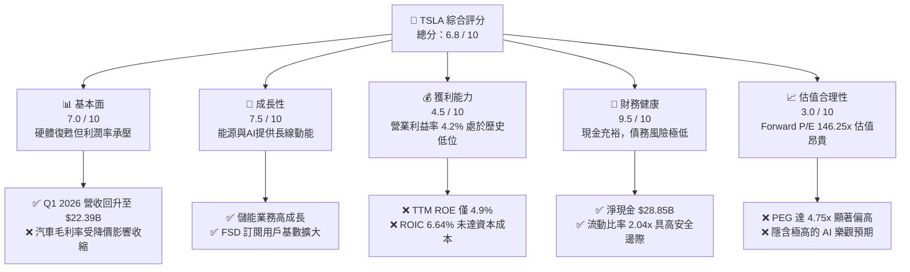

### 1.2 評分進度條視覺化

```
╔══════════════════════════════════════════════════════════════╗
║               TSLA 多維度評分儀表板 (1-10分)                 ║
╠══════════════════════════════════════════════════════════════╣
║ 基本面強度  7.0 ▓▓▓▓▓▓▓▓▓▓▓▓▓▓░░░░░░░░░░  ★★★☆☆           ║
║ 成長動能    7.5 ▓▓▓▓▓▓▓▓▓▓▓▓▓▓▓░░░░░░░░░  ★★★★☆           ║
║ 獲利品質    4.5 ▓▓▓▓▓▓▓▓▓░░░░░░░░░░░░░░░  ★★☆☆☆           ║
║ 財務健康    9.5 ▓▓▓▓▓▓▓▓▓▓▓▓▓▓▓▓▓▓▓▓▓▓░░  ★★★★★           ║
║ 估值合理性  3.0 ▓▓▓▓▓▓░░░░░░░░░░░░░░░░░░  ★☆☆☆☆           ║
║ 護城河深度  8.5 ▓▓▓▓▓▓▓▓▓▓▓▓▓▓▓▓▓░░░░░░  ★★★★☆           ║
║ 管理層執行  7.5 ▓▓▓▓▓▓▓▓▓▓▓▓▓▓▓░░░░░░░░░  ★★★★☆           ║
║ 技術創新力  9.5 ▓▓▓▓▓▓▓▓▓▓▓▓▓▓▓▓▓▓▓▓▓▓░░  ★★★★★           ║
╠══════════════════════════════════════════════════════════════╣
║ 綜合總分    6.8 ▓▓▓▓▓▓▓▓▓▓▓▓▓▓░░░░░░░░░░  🏆 中性/持有       ║
╚══════════════════════════════════════════════════════════════╝
```

### 1.3 五大投資論點 + 三大核心風險

| 類型 | 項目 | 具體依據 | 信心度 |
|------|------|----------|--------|
| 🟢 **投資論點①** | **營收重回成長軌道** | Q1 2026 營收達 $22.39B，YoY 成長 15.78%，扭轉了 2025 年營收下滑（-2.93%）的頹勢。 | 🟢 高 |
| 🟢 **投資論點②** | **資產負債表極其堅固** | 擁有 $44.74B 總現金與短期投資，對比 $15.89B 總債務，淨現金高達 $28.85B，抗風險能力極強。 | 🟢 極高 |
| 🟢 **投資論點③** | **儲能業務爆發式成長** | 2025 年能源儲能與發電業務毛利率改善，Megapack 產能持續釋放，提供非車規業務的結構性支撐。 | 🟢 高 |
| 🟢 **投資論點④** | **FSD 軟體變現潛力** | 隨著 FSD 算法向 V12（端到端神經網絡）演進，每英里累計數據呈指數級增長，軟體高毛利屬性長期將拉高整體利潤率。 | 🟡 中等 |
| 🟢 **投資論點⑤** | **資本開支維持高強度** | TTM 研發費用達 $6.95B（佔營收 7.1%），在自動駕駛晶片與超級電腦（Dojo）的持續投入確保技術領先。 | 🟢 高 |
| 🟡 **風險①** | **車市價格戰持續** | 汽車製造商競爭白熱化，若特斯拉被迫繼續降價，毛利率（TTM 19.1%）與營業利益率（TTM 4.2%）將進一步受壓。 | 🔴 高衝擊 |
| 🔴 **風險②** | **高估值溢價泡沫化** | 當前 Trailing P/E 341.17x，Forward P/E 146.25x，若 AI/Robotaxi 落地時間延遲，估值將面臨劇烈修正。 | 🔴 高衝擊 |
| 🟡 **風險③** | **股權稀釋（SBC）過高** | TTM 股權薪酬高達 $3.28B，佔營業現金流的 19.8%，持續稀釋現有股東權益。 | 🟡 中度 |

### 1.4 快速統計卡片

| 指標 | TSLA 實際值 | 汽車產業均值（Auto Manufacturers） | S&P 500 均值 | 狀態 |
|------|-------------|------------------------------------|--------------|------|
| **營收 YoY 成長率** | **15.8%** (TTM) | ~5.0% | ~6.5% | 🟢 優於同業 |
| **毛利率** | **19.1%** | ~15.0% | ~30.0% | 🟡 高於同業，但低於歷史 |
| **營業利益率** | **4.2%** | ~6.0% | ~12.0% | 🔴 低於行業平均 |
| **ROE** | **4.9%** | ~10.0% | ~15.0% | 🔴 資本效率偏低 |
| **Forward P/E** | **146.25x** | ~12.0x | ~21.0x | 🔴 估值顯著高估 |
| **流動比率** | **2.04x** | ~1.20x | ~1.30x | 🟢 流動性極佳 |

### 1.5 投資結論

```
╔══════════════════════════════════════════════════════════════════╗
║                    📊 TSLA 投資結論摘要                          ║
╠══════════════════════════════════════════════════════════════════╣
║  評級：🟡 持有 (Hold) / 區間操作                                 ║
║  當前股價：$375.29 (2026-07-22)                                  ║
║  目標價區間：                                                    ║
║    悲觀情境：$225.00（-40.0%）- 汽車業務毛利崩塌，AI 估值歸零    ║
║    基準情境：$425.22（+13.3%）- 12個月主要目標（與共識基本一致）  ║
║    樂觀情境：$550.00（+46.6%）- FSD 授權成功，Robotaxi 啟動      ║
║  投資評分：6.8 / 10                                              ║
║  適合投資人：具備高風險承受度、長線佈局 AI 與新能源生態的投資人  ║
╚══════════════════════════════════════════════════════════════════╝
```

---

## 2. 公司概覽與商業模式

Tesla, Inc.（TSLA）已從純粹的電動車（EV）製造商，演進為「電動車 + 分散式能源 + 人工智慧/自動駕駛」的平台型公司。其核心商業模式在於通過規模化硬體銷售（汽車與儲能）建立龐大的物理觸角，並通過高毛利的軟體服務（FSD 訂閱、充電網絡、OTA 升級）與能源資產營運實現終身價值最大化。

### 2.1 業務結構與收入來源

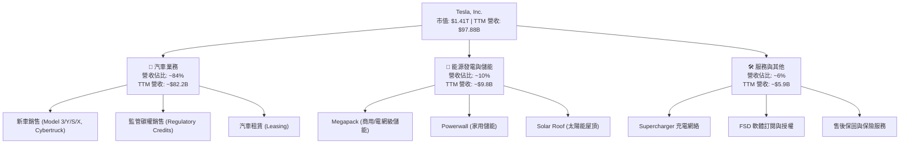

### 2.2 全球純電動車（BEV）市場份額（2025年估算）

根據 2025 年全球電動車出貨數據，特斯拉在純電動車（BEV）領域仍維持全球領先地位，但面臨比亞迪（BYD）等強勁對手的激烈競爭：

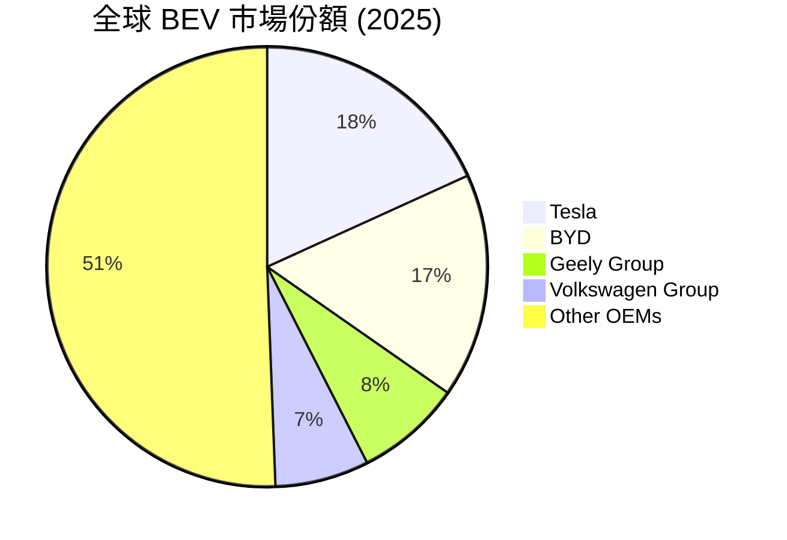

### 2.3 競爭護城河分析

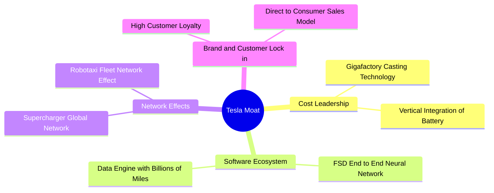

### 2.4 護城河強度評分

```
╔══════════════════════════════════════════════════════════════╗
║                    TSLA 護城河強度評分                       ║
╠══════════════════════════════════════════════════════════════╣
║ 製造與成本控制  8.5/10 ▓▓▓▓▓▓▓▓▓▓▓▓▓▓▓▓▓░░░  🟢 一體化壓鑄領先║
║ 數據與軟體生態  9.5/10 ▓▓▓▓▓▓▓▓▓▓▓▓▓▓▓▓▓▓▓░  🏆 FSD 數據壁壘高 ║
║ 基礎設施(充電)  9.0/10 ▓▓▓▓▓▓▓▓▓▓▓▓▓▓▓▓▓▓░░  🟢 NACS 標準統一 ║
║ 品牌與直營通路  8.0/10 ▓▓▓▓▓▓▓▓▓▓▓▓▓▓▓░░░░░  🟢 零廣告費用行銷║
╠══════════════════════════════════════════════════════════════╣
║ 綜合護城河評級  8.75/10 ▓▓▓▓▓▓▓▓▓▓▓▓▓▓▓▓▓░░  🏆 寬廣護城河     ║
╚══════════════════════════════════════════════════════════════╝
```

---

## 3. 損益表深度分析

### 3.1 年度收入成長趨勢（近5年）

特斯拉的營收在經歷 2021-2022 年的高速增長後，於 2024-2025 年步入平台期。特別是 2025 年，由於全球 EV 需求放緩及價格戰，全年營收微幅下滑 2.93% 至 $94.83B。然而，TTM 營收（截至 2026 年 3 月 31 日）回升至 $97.88B，顯示復甦跡象。

```
╔══════════════════════════════════════════════════════════════════╗
║                TSLA 年度收入趨勢 (FY2021 - TTM)                  ║
╠══════════════════════════════════════════════════════════════════╣
║                                                                  ║
║  FY 2021   $53.82B   ███████████░░░░░░░░░░░░░░░░░░  YoY: +70.7%  ║
║  FY 2022   $81.46B   █████████████████░░░░░░░░░░░░  YoY: +51.4%  ║
║  FY 2023   $96.77B   ████████████████████░░░░░░░░░  YoY: +18.8%  ║
║  FY 2024   $97.69B   ████████████████████░░░░░░░░░  YoY: +1.0%   ║
║  FY 2025   $94.83B   ███████████████████░░░░░░░░░░  YoY: -2.9%   ║
║  TTM       $97.88B   ████████████████████░░░░░░░░░  YoY: +15.8%  ║
║                                                                  ║
║  📊 5年營收複合年成長率 (CAGR)：+12.7%                            ║
╚══════════════════════════════════════════════════════════════════╝
```

### 3.2 季度收入趨勢分析

從季度數據看，特斯拉在 2025 年第一季經歷了 $19.34B 的低谷，但隨後在 Q3 2025 達到 $28.10B 的高峰。最新公佈的 Q1 2026 營收為 $22.39B，相較於 2025 年第一季的 $19.34B 成長了 **15.78%**，確認了基本面正在築底回升。

| 季度結束日 | 營業收入 (Revenue) | YoY 成長率 | QoQ 成長率 | 營業利益 (Op Income) | 營業利益率 | 備註 |
|------------|---------------------|------------|------------|----------------------|------------|------|
| **2026-03-31** | $22.39B | **+15.78%** | -10.08% | $941.00M | 4.20% | 營收重回雙位數 YoY 成長，但研發費用上升壓抑利潤率 |
| **2025-12-31** | $24.90B | -3.14% | -11.37% | $1,409.00M | 5.66% | 年末交付旺季，毛利率有所回升 |
| **2025-09-30** | $28.10B | **+11.57%** | +24.89% | $1,624.00M | 5.78% | 儲能出貨創新高，帶動營收高峰 |
| **2025-06-30** | $22.50B | -11.78% | +16.34% | $923.00M | 4.10% | 汽車價格調整期，利潤率承壓 |
| **2025-03-31** | $19.34B | -9.23% | -24.77% | $399.00M | 2.06% | 歷史低谷，受工廠升級與紅海危機供應鏈中斷影響 |

### 3.3 利潤率演變分析

特斯拉的利潤率在過去幾年大幅收縮。毛利率從 2022 年的 25.6% 下滑至 TTM 的 19.1%，營業利益率更從 16.8% 的高點下滑至 TTM 的 4.2%。這主要是由於全球 EV 製造商降價競爭，以及特斯拉在 AI、研發與 Cybertruck 產能爬坡上的高投入。

| 利潤率指標 | FY 2022 | FY 2023 | FY 2024 | FY 2025 | TTM | 趨勢 | 評估 |
|------------|---------|---------|---------|---------|-----|------|------|
| **毛利率** | 25.6% | 18.2% | 17.9% | 18.0% | **19.1%** | 🟡 築底 | 價格戰最慘烈時期已過，Q1 2026 毛利率回升至 21.1% |
| **營業利益率**| 16.8% | 9.2% | 7.2% | 4.6% | **4.2%** | 🔴 承壓 | 研發費用與折舊攤銷（D&A）維持高位，壓抑營業利益 |
| **EBITDA 率** | 21.7% | 15.3% | 15.1% | 12.4% | **11.3%** | 🟡 穩定 | 硬體製造的現金流產生能力依然穩健 |
| **淨利率** | 15.5% | 15.5% | 7.3% | 4.1% | **3.9%** | 🔴 偏低 | 受非經常性損益與有效稅率波動影響 |

### 3.4 費用結構分析

特斯拉的營運費用（OpEx）在近年顯著上升，特別是研發費用（R&D）。2025 年研發費用達 $6.41B，相較 2022 年的 $3.08B 翻倍，TTM 研發費用更達 $6.95B。這反映了特斯拉在自動駕駛（FSD）、Dojo 超級電腦及 Optimus 機器人上的龐大投資。

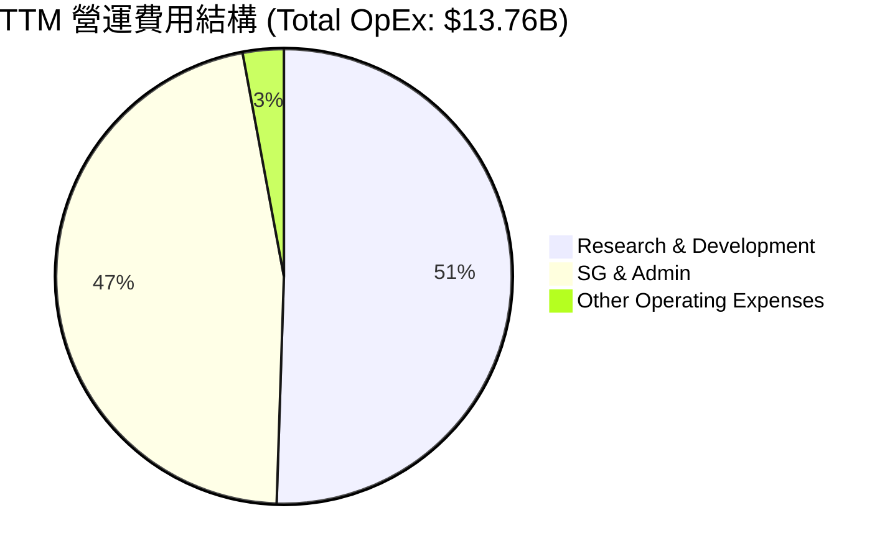

### 3.5 季度 EPS 趨勢與盈餘品質（Quality of Earnings）

特斯拉的 TTM GAAP 稀釋後 EPS 為 **$1.10**（或 StockAnalysis 數據之 $1.09）。過去四季中，利潤結構受到股權薪酬（SBC）及資本支出的顯著影響。

#### 盈餘品質量化評估

| 盈餘品質項目 | TTM 數值 / 佔比 | 評估 |
|--------------|-----------------|------|
| **股權薪酬 (SBC) / 營業收入** | **3.35%** ($3.28B / $97.88B) | 🟡 中度稀釋。雖然低於純軟體公司，但在汽車製造業中偏高。 |
| **SBC / 營業現金流 (OCF)** | **19.84%** ($3.28B / $16.53B) | 🔴 偏高。顯示有近兩成的營業現金流是通過非現金股權支付來「美化」的。 |
| **FCF / GAAP 淨利 (現金轉換率)** | **133.9%** ($5.25B / $3.92B) | 🟢 極佳。自由現金流顯著高於淨利潤，顯示盈餘含金量高，未受應收帳款或存貨積壓影響。 |
| **一次性 / 非經常性損益** | TTM 非營運淨收益為 **$540M** | 🟡 溫和。主要來自利息收入（$1.71B）抵消了非營運支出（-$835M）。 |
| **有效稅率異常** | 2025 年有效稅率為 **26.9%** | 🟢 正常。相較於 2023 年因遞延所得稅資產重估產生的異常負稅率，目前稅率已回歸正常區間。 |

**盈餘品質結論**：特斯拉的盈餘品質評級為 **🟢 良好**。儘管股權薪酬（SBC）稀釋了部分股東權益，但其高達 133.9% 的自由現金流轉換率（FCF/Net Income）證實了其業務卓越的吸金能力，GAAP 淨利並未被高估。

---

## 4. 資產負債表分析

### 4.1 資產結構分解

截至 2026 年 3 月 31 日，特斯拉總資產達 **$143.72B**，其中流動資產為 **$69.75B**（佔 48.5%），非流動資產主要由物業、廠房與設備（PP&E）構成，達 **$58.64B**。

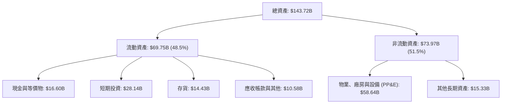

### 4.2 流動性指標分析

特斯拉的流動性指標在過去幾年持續改善。截至 2026 年 Q1，流動比率為 **2.04**，速動比率為 **1.43**，均顯著高於汽車行業平均水平。這提供了極高的財務安全邊際，足以應對任何宏觀經濟下行。

| 流動性指標 | FY 2023 | FY 2024 | FY 2025 | TTM (Q1 2026) | 行業均值 | 評估 |
|------------|---------|---------|---------|---------------|----------|------|
| **流動比率 (Current Ratio)** | 1.73x | 2.02x | 2.16x | **2.04x** | ~1.20x | 🟢 極其安全，無短期償債風險 |
| **速動比率 (Quick Ratio)** | 1.25x | 1.46x | 1.59x | **1.43x** | ~0.85x | 🟢 即使扣除存貨，流動性依然充裕 |
| **存貨週轉天數 (DIO)** | 62.9天 | 54.7天 | 58.2天 | **66.5天** | ~55.0天 | 🟡 略微上升，反映 Q1 季節性存貨增加 |
| **應收帳款回收天數 (DSO)**| 13.2天 | 16.5天 | 17.6天 | **16.1天** | ~25.0天 | 🟢 回收極快，直營模式帶來的優勢 |

### 4.3 債務結構與健康診斷

截至 2026 年 3 月 31 日，特斯拉的總債務為 **$15.89B**（包含短期債務 $2.44B、長期借款 $7.65B 以及長期融資租賃 $5.81B）。

```
╔══════════════════════════════════════════════════════════════════╗
║                    TSLA 債務健康診斷 (2026-03-31)                ║
╠══════════════════════════════════════════════════════════════════╣
║                                                                  ║
║  總債務：        $15.89B   ▓▓▓▓▓░░░░░░░░░░░░░░░░░░░░░░░░░        ║
║  總現金+短期投資：$44.74B   ▓▓▓▓▓▓▓▓▓▓▓▓▓▓▓▓▓▓▓▓▓▓▓▓▓▓▓▓░        ║
║  淨現金 (Net Cash)：$28.85B 🟢 財務結構極其穩固                 ║
║                                                                  ║
║  Debt / Equity Ratio:  18.74%  🟢 槓桿率極低                     ║
║  Debt / EBITDA (TTM):  1.35x   🟢 債務負擔極輕                     ║
║  利息保障倍數 (Interest Coverage): 14.4x 🟢 無償債風險            ║
║                                                                  ║
║  📊 診斷結果：AAA 級財務彈性，幾乎為零的破產風險                  ║
╚══════════════════════════════════════════════════════════════════╝
```

---

## 5. 現金流量深度分析

### 5.1 現金流量瀑布圖

特斯拉的現金流產生與分配展現了其高度的「自給自足」能力。TTM 營業現金流達 $16.53B，扣除 $11.28B 的資本開支後，產生了 $5.25B 的自由現金流（FCF）。

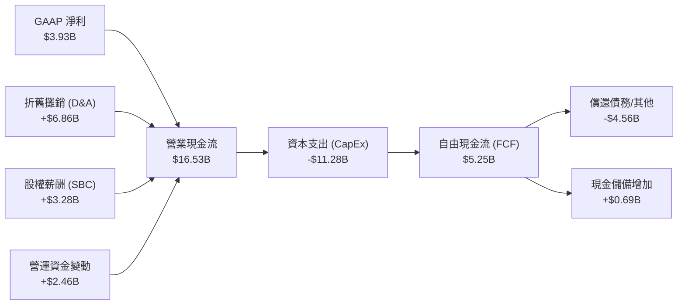

### 5.2 FCF 轉換率趨勢

特斯拉的現金轉換效率極高。2025 年由於利潤率收縮，FCF 降至 $6.22B，但 FCF/Net Income 轉換率仍高達 164.1%。TTM 轉換率維持在 133.9% 的優異水準。

| 指標 | FY 2022 | FY 2023 | FY 2024 | FY 2025 | TTM |
|------|---------|---------|---------|---------|-----|
| **營業現金流 (OCF)** | $14.72B | $13.26B | $14.92B | $14.75B | **$16.53B** |
| **資本支出 (CapEx)** | -$7.17B | -$8.90B | -$11.34B| -$8.53B | **-$11.28B**|
| **自由現金流 (FCF)** | $7.55B | $4.36B | $3.58B | $6.22B | **$5.25B** |
| **FCF 轉換率 (FCF/Net Income)** | 60.0% | 29.1% | 50.2% | 164.1% | **133.9%** |

### 5.3 自由現金流與 FCF Yield 趨勢

儘管 FCF 金額維持在 $5B-$7B 區間，但由於特斯拉市值高達 $1.41T，其 **FCF Yield 僅為 0.37%**。這意味著從當前現金流的角度來看，特斯拉的估值極度昂貴，投資人正在為其未來的成長（特別是 AI 軟體變現）支付極高的溢價。

```
╔══════════════════════════════════════════════════════════════════╗
║                 TSLA 自由現金流與 FCF Yield 趨勢                 ║
╠══════════════════════════════════════════════════════════════════╣
║                                                                  ║
║  FY 2022   $7.55B   ████████████████████████░░░░░  Yield: 0.54%  ║
║  FY 2023   $4.36B   ██████████████░░░░░░░░░░░░░░░  Yield: 0.31%  ║
║  FY 2024   $3.58B   ███████████░░░░░░░░░░░░░░░░░░  Yield: 0.25%  ║
║  FY 2025   $6.22B   ████████████████████░░░░░░░░░  Yield: 0.44%  ║
║  TTM       $5.25B   █████████████████░░░░░░░░░░░░  Yield: 0.37%  ║
║                                                                  ║
║  📊 結論：FCF 產生能力穩定，但 0.37% 的 Yield 限制了短期估值支撐 ║
╚══════════════════════════════════════════════════════════════════╝
```

### 5.4 資本配置評估

特斯拉不支付股利，亦無大規模股票回購計劃。其資本配置策略極度專注於 **再投資**。

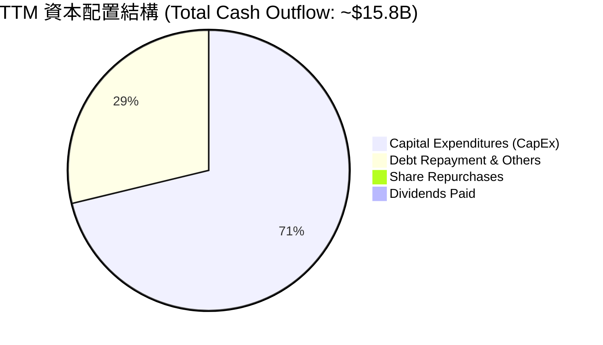

---

## 6. 獲利能力與資本效率

### 6.1 ROE / ROA / ROIC 趨勢

由於 2024-2025 年淨利潤收縮，特斯拉的資本回報率出現顯著下滑。TTM ROE 降至 **4.9%**，ROIC 降至 **6.64%**。這表明特斯拉當前的大規模資產（如新建的超級工廠、AI 研發投入）尚未能轉化為高比例的當期利潤。

| 指標 | FY 2022 | FY 2023 | FY 2024 | FY 2025 | TTM | 行業均值 | 評估 |
|------|---------|---------|---------|---------|-----|----------|------|
| **ROE** | 28.1% | 24.0% | 9.8% | 4.6% | **4.9%** | ~10.0% | 🔴 暫時低於行業均值 |
| **ROA** | 15.3% | 14.1% | 5.9% | 2.8% | **2.2%** | ~4.5% | 🔴 資產利用效率下降 |
| **ROIC**| 21.4% | 15.2% | 8.8% | 5.8% | **6.64%**| ~7.0% | 🟡 處於週期底部 |

### 6.2 ROIC vs WACC 分析（核心價值創造判斷）

ROIC 是否高於 WACC 是判斷一家公司是在「創造價值」還是「摧毀股東價值」的核心指標。

```
╔══════════════════════════════════════════════════════════════════╗
║               TSLA ROIC vs WACC 深度分析 (TTM)                   ║
╠══════════════════════════════════════════════════════════════════╣
║                                                                  ║
║  WACC 估算：                                                     ║
║  ├── 無風險利率 (10Y 美債)： 4.00%                               ║
║  ├── 市場風險溢酬 (ERP)：    5.00%                               ║
║  ├── Beta 值：               1.802                               ║
║  ├── 股權成本 (Ke) = 4.00% + 1.802 × 5.00% = 13.01%             ║
║  ├── 債務成本 (Kd，稅後)：   3.60%                               ║
║  ├── 資本結構：股權 98.9%，債務 1.1%                             ║
║  └── ✅ 綜合資本成本 (WACC) ≈ 13.01%                             ║
║                                                                  ║
║  ROIC 估算：                                                     ║
║  ├── NOPAT = 營業利益 $4.90B × (1 - 27.8% 稅率) ≈ $3.54B         ║
║  ├── 投入資本 = 股東權益 $82.14B + 債務 $15.89B - 現金 $44.74B   ║
║  │   投入資本 ≈ $53.29B                                          ║
║  └── ✅ 投資資本回報率 (ROIC) ≈ 6.64%                            ║
║                                                                  ║
║  ★ 經濟價值增加 (EVA) = ROIC - WACC = -6.37%                     ║
║                                                                  ║
║  ROIC   6.64%  ▓▓▓▓▓▓▓▓▓▓▓░░░░░░░░░░░░░░░░░░░░░  🔴              ║
║  WACC  13.01%  ▓▓▓▓▓▓▓▓▓▓▓▓▓▓▓▓▓▓▓▓▓░░░░░░░░░░  ──              ║
║  EVA   -6.37%  ██████████░░░░░░░░░░░░░░░░░░░░░  🔴 經濟價值毀損 ║
║                                                                  ║
║  📊 結論：當前 ROIC 低於 WACC，顯示硬體業務擴張短期內正在摧毀     ║
║            股東價值。這解釋了為何股價亟需高毛利軟體業務來重估。  ║
╚══════════════════════════════════════════════════════════════════╝
```

### 6.3 杜邦三因素分解

透過杜邦分解，我們可以清晰看到 ROE 下滑的結構性原因：

$$\text{ROE} (4.9\%) = \text{淨利率} (3.9\%) \times \text{資產週轉率} (0.75\text{x}) \times \text{財務槓桿} (1.68\text{x})$$

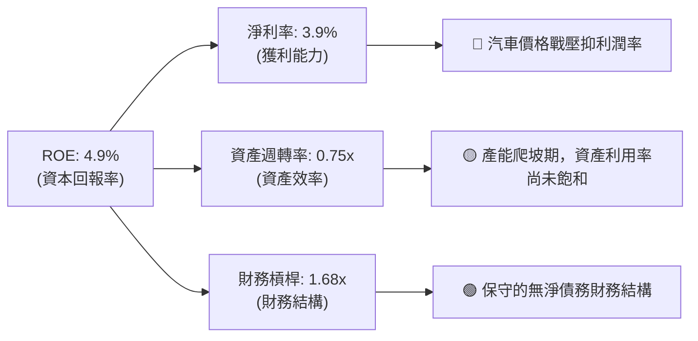

---

## 7. 估值深度分析

### 7.1 同業估值比較表格

特斯拉的估值在汽車行業中是極其特殊的「異類」。其 Trailing P/E (341.17x) 與 Forward P/E (146.25x) 遠超傳統車廠（如豐田、福特）及全球最大電動車競爭對手比亞迪（BYD）。這顯示市場完全不將其視為汽車股，而是將其定位為 AI 與機器人科技股。

| 估值指標 | **TSLA** | **BYDDF (比亞迪)** | **TM (豐田)** | **F (福特)** | TSLA 評估 |
|----------|----------|-------------------|--------------|--------------|-----------|
| **Trailing P/E** | **341.17x** | 19.5x | 8.2x | 11.4x | 🔴 極度昂貴，隱含極高成長預期 |
| **Forward P/E** | **146.25x** | 15.2x | 7.8x | 6.5x | 🔴 遠超行業均值，容錯率極低 |
| **P/S Ratio** | **14.40x** | 0.95x | 0.82x | 0.28x | 🔴 軟體化溢價顯著 |
| **EV / EBITDA** | **125.74x** | 9.8x | 5.4x | 4.2x | 🔴 估值倍數處於歷史高位區間 |
| **EV / Revenue** | **14.25x** | 0.92x | 0.98x | 0.55x | 🔴 顯著高於硬體製造業標準 |
| **FCF Yield** | **0.37%** | 4.2% | 8.5% | 12.1% | 🔴 現金流收益率極低 |

### 7.2 歷史估值區間分析

特斯拉的 Forward P/E 歷史中位數約為 65x。當前 146.25x 的 Forward P/E 處於歷史偏高分位數，主要受到 2025 年 EPS 銳減（EPS TTM 僅 $1.10）的技術性推高。若 2026/2027 年 EPS 能如預期回升至 $2.57 以上，Forward P/E 將回落至 ~140x 左右，但依然高於合理區間。

### 7.3 情境目標價（假設驅動，Bear / Base / Bull）

為了提供透明的估值推導，我們建立以下三種情境模型（以 2027 年預估為基準）：

| 情境 | 營收 CAGR (3年) | 2027 營業利益率 | 退出倍數 (EV/EBITDA) | 隱含目標價 | 相對現價 ($375.29) |
|------|-----------------|-----------------|----------------------|------------|--------------------|
| 🔴 **悲觀情境** | 5.0% | 5.0% | 40x | **$225.00** | -40.0% |
| 🟡 **基準情境** | **15.0%** | **8.5%** | **80x** | **$425.22** | **+13.3%** |
| 🟢 **樂觀情境** | 25.0% | 15.0% | 120x | **$550.00** | +46.6% |

*註：鑑於特斯拉高額的折舊（D&A）與研發投入，我們優先選用 **EV/EBITDA** 作為核心估值倍數，以避免 GAAP 淨利波動造成的失真。*

### 7.4 DCF 敏感性分析（9格目標價矩陣）

我們使用兩階段 DCF 模型，假設終期成長率（Terminal Growth Rate）為 4.0%：

| 營收成長率 \ WACC | WACC = 12.0% | **WACC = 13.0% (基準)** | WACC = 14.0% |
|------------------|--------------|-------------------------|--------------|
| 🟢 **樂觀 (25.0%)** | $512.00 (+36.4%) | $485.00 (+29.2%) | $458.00 (+22.0%) |
| 🟡 **基準 (15.0%)** | $452.00 (+20.4%) | **$425.22 (+13.3%)** | $398.00 (+6.1%) |
| 🔴 **悲觀 (5.0%)** | $265.00 (-29.4%) | $242.00 (-35.5%) | $220.00 (-41.4%) |

### 7.5 估值綜合區間

```
╔══════════════════════════════════════════════════════════════════╗
║                    TSLA 估值綜合區間                             ║
╠══════════════════════════════════════════════════════════════════╣
║                                                                  ║
║  52W 最低價： $297.82                                            ║
║  當前股價：   $375.29                                            ║
║  52W 最高價： $498.83                                            ║
║                                                                  ║
║  估值模型區間：                                                  ║
║  [悲觀 DCF]       $242.00 ▓▓▓▓▓▓░░░░░░░░░░░░░░░░░░░░             ║
║  [當前股價]       $375.29 ▓▓▓▓▓▓▓▓▓▓▓▓▓░░░░░░░░░░░░░             ║
║  [基準目標價]     $425.22 ▓▓▓▓▓▓▓▓▓▓▓▓▓▓▓▓░░░░░░░░░░             ║
║  [分析師最高目標] $600.00 ▓▓▓▓▓▓▓▓▓▓▓▓▓▓▓▓▓▓▓▓▓▓▓▓▓             ║
║                                                                  ║
║  📊 結論：當前股價處於合理估值區間的中間偏上位置。               ║
╚══════════════════════════════════════════════════════════════════╝
```

---

## 8. 成長催化劑

### 8.1 催化劑時間軸 (2026 - 2028)

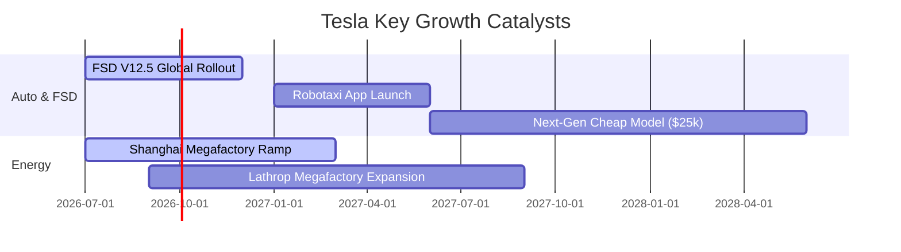

### 8.2 TAM（可定址市場）規模分析

| 業務板塊 | 當前滲透率 (2026) | 預估 2030 TAM | 2030 預估特斯拉份額 | 預估營收貢獻 (2030) |
|----------|-------------------|---------------|---------------------|---------------------|
| **電動車 (EV)** | ~18.0% | $1.2T | 15.0% | $180B |
| **儲能 (Grid Storage)** | ~5.0% | $350B | 25.0% | $87.5B |
| **自動駕駛 (FSD / Robotaxi)** | < 1.0% | $800B | 10.0% | $80B |

### 8.3 成長驅動力結構圖

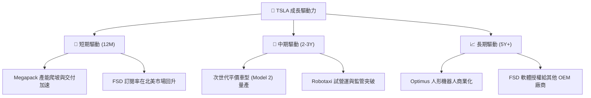

---

## 9. 風險矩陣

### 9.1 風險評分矩陣

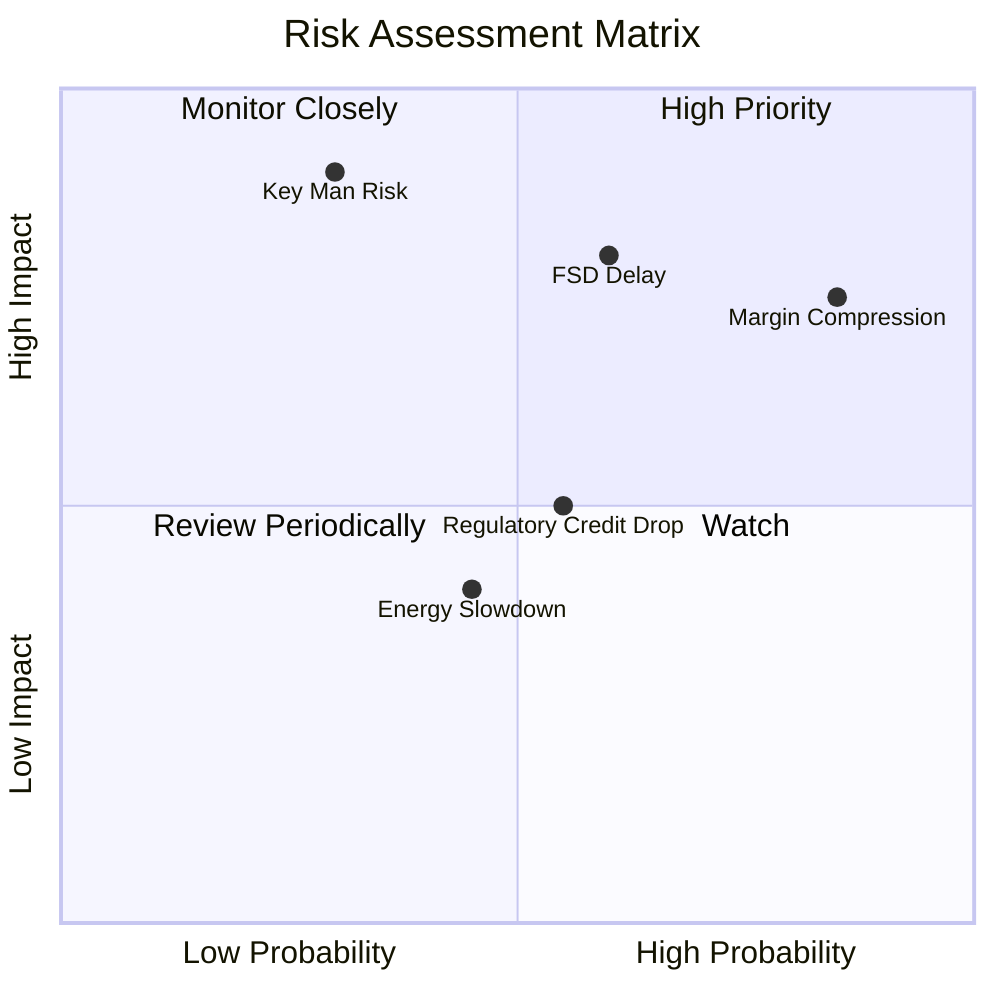

### 9.2 風險清單詳細分析

| # | 風險項目 | 發生機率 | 財務衝擊 | 風險評分 | 緩解措施 |
|---|----------|----------|----------|----------|----------|
| 1 | 🔴 **汽車毛利率持續收縮** | 高 (75%) | 高 (-15% 營收) | 🔴 **8.5 / 10** | 透過一體化壓鑄及次世代平台降低 50% 生產成本。 |
| 2 | 🔴 **FSD 監管與技術瓶頸** | 中 (50%) | 極高 (-30% 估值) | 🔴 **8.0 / 10** | 持續投資超級電腦，累積數十億英里真實路測數據以說服監管機構。 |
| 3 | 🟡 **關鍵人物風險 (Elon Musk)** | 低 (20%) | 極高 (-40% 股價) | 🟡 **7.0 / 10** | 建立強大的中層管理團隊（如 Tom Zhu），逐步實現營運去中心化。 |
| 4 | 🟡 **監管碳權收入（Regulatory Credits）枯竭** | 中 (60%) | 中 (-$1.5B 淨利) | 🟡 **6.0 / 10** | 加快儲能業務等高毛利板塊的營收佔比，降低對碳權的依賴。 |

---

## 10. 投資建議

### 10.1 最終綜合評級雷達圖

```
╔══════════════════════════════════════════════════════════════╗
║                  TSLA 最終綜合評級雷達圖                     ║
╠══════════════════════════════════════════════════════════════╣
║ 財務健康度：  9.5/10  ▓▓▓▓▓▓▓▓▓▓▓▓▓▓▓▓▓▓▓▓▓▓░░  🏆 極高安全邊際  ║
║ 護城河深度：  8.5/10  ▓▓▓▓▓▓▓▓▓▓▓▓▓▓▓▓▓░░░░░░  🟢 寬廣護城河    ║
║ 成長動能：    7.5/10  ▓▓▓▓▓▓▓▓▓▓▓▓▓▓▓░░░░░░░░  🟢 AI提供長線想像║
║ 獲利品質：    4.5/10  ▓▓▓▓▓▓▓▓▓░░░░░░░░░░░░░░  🔴 短期利潤率承壓║
║ 估值合理性：  3.0/10  ▓▓▓▓▓▓░░░░░░░░░░░░░░░░░  🔴 溢價極高      ║
╠══════════════════════════════════════════════════════════════╣
║ 綜合評級：    6.8/10  🟡 持有 / 區間操作 (Hold)                ║
╚══════════════════════════════════════════════════════════════╝
```

### 10.2 目標價與隱含報酬率

| 情境 | 目標價 | 隱含報酬率 | 機率權重 | 權重後期望值 |
|------|--------|------------|----------|--------------|
| 🔴 悲觀情境 | $225.00 | -40.0% | 20% | $45.00 |
| 🟡 **基準情境** | **$425.22** | **+13.3%** | **60%** | **$255.13** |
| 🟢 樂觀情境 | $550.00 | +46.6% | 20% | $110.00 |
| **加權目標價** | **$410.13** | **+9.3%** | **100%** | **符合當前「持有」評級** |

### 10.3 買入時機與觸發因素

```
╔══════════════════════════════════════════════════════════════════╗
║                  ✅ TSLA 買入/賣出觸發因素 Checklist            ║
╠══════════════════════════════════════════════════════════════════╣
║                                                                  ║
║  立即買入觸發條件（多數符合）：                                  ║
║  ✅ 股價回檔至安全邊際區間：$300 - $320                           ║
║  ✅ 季度汽車毛利率（不含碳權）回升至 18.0% 以上                  ║
║  ✅ FSD V12.5 在歐洲或中國市場取得監管准入許可                    ║
║                                                                  ║
║  加碼觸發條件（出現以下任一）：                                  ║
║  ☐ 宣佈與主要 OEM 簽署首個 FSD 軟體授權合約                      ║
║  ☐ 儲能業務單季出貨量突破 12 GWh                                ║
║                                                                  ║
║  減碼/停損觸發條件（出現以下任一）：                             ║
║  ☐ 營業利益率連續兩季跌破 3.0%                                   ║
║  ☐ 自由現金流轉負，或 FCF 轉換率低於 50%                         ║
║  ☐ Elon Musk 質押更多特斯拉股票，或宣佈減少在特斯拉的營運時間    ║
╚══════════════════════════════════════════════════════════════════╝
```

### 10.4 投資人適配度分析

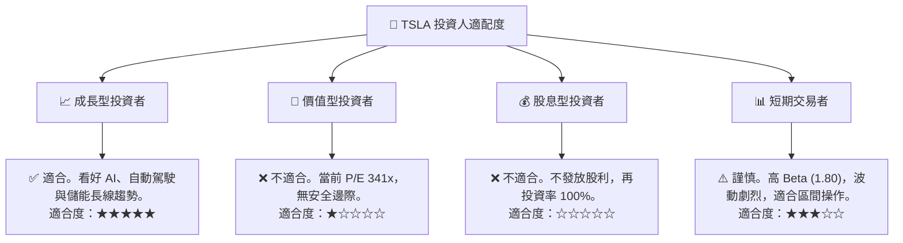

### 10.5 每季財報監控清單（Quarterly Watch List）

為了持續追蹤特斯拉的投資邏輯是否發生結構性改變，投資人應在每季財報公佈時，重點監控以下指標與臨界值：

| 監控指標 | 當前值 (TTM / Q1 26) | 偏多（加碼門檻） | 偏空（減碼門檻） | 投資含意 |
|----------|----------------------|------------------|------------------|----------|
| **汽車毛利率 (不含碳權)** | 16.4% | > 18.5% | < 14.0% | 反映硬體製造的真實定價能力與成本控制。 |
| **儲能出貨量 (GWh)** | 4.1 GWh (Q1) | > 6.0 GWh / 季 | < 3.0 GWh / 季 | 評估儲能業務是否能成功成為第二成長曲線。 |
| **研發費用率 (R&D/Sales)** | 8.7% (Q1) | > 8.0% (且利潤率改善) | < 5.0% | 研發投入若下滑，可能削弱其 AI 與自動駕駛的技術領先。 |
| **監管碳權佔淨利比重** | ~35.0% | < 15.0% | > 50.0% | 比重過高顯示核心業務不賺錢，盈餘含金量低。 |
| **自由現金流 (FCF)** | $1.44B (Q1) | > $2.5B / 季 | 轉負 (Negative) | 確保公司有足夠的內生現金流支持高額 CapEx，無需稀釋股權。 |

### 10.6 反面論證：什麼會證明論點錯誤（What Would Change My Mind）

身為理性的 CFA 分析師，我們必須設定明確的**反面證據門檻**。若以下任一條件在未來 12 個月內成立，本報告的「基準情境（目標價 $425.22）」將宣告失效，評級應立即下調至 🔴 **賣出（Sell）**：

```
╔══════════════════════════════════════════════════════════════════╗
║              ⚠️ 論點失效條件 (Disconfirming Evidence)           ║
╠══════════════════════════════════════════════════════════════════╣
║  本投資論點在下列情況成立時應重新檢視或退出：                    ║
║  ☐ 核心汽車業務營收 YoY 成長率連續兩季 < 5.0%                     ║
║  ☐ 營業利益率較當前 (4.2%) 進一步收縮，跌破 3.0% 臨界點           ║
║  ☐ 自由現金流 (FCF) 連續兩季轉負，導致淨現金儲備跌破 $20B         ║
║  ☐ ROIC 跌破 5.0%，與 WACC (13.01%) 的利差進一步擴大             ║
║  ☐ FSD V12 在主要市場（如中國、歐洲）的商業化准入被監管機構無限期遞延║
╚══════════════════════════════════════════════════════════════════╝
```

---

> **免責聲明**：本報告為基於公開財務數據之學術研究分析，僅供參考，不構成任何買賣有價證券之投資建議。投資人應自行承擔市場風險。