# TSLA 基本面深度分析報告
> **報告日期**：2026-07-23 ｜ **語言**：繁體中文 ｜ **數據來源**：Yahoo Finance, Finviz, StockAnalysis, Roic.ai ｜ **分析師**：CFA 級機構研究

---

## 目錄

| # | 章節 | 核心結論 |
|---|------|----------|
| 1 | 執行摘要 | 當前股價 $321.26，基準目標價 $385.00，給予 **🟡 持有 / 觀望** 評級。高估值下硬體利潤承壓，需要 Robotaxi 與 FSD 變現驗證。 |
| 2 | 公司概覽與商業模式 | 護城河評分 8.1/10。汽車營收佔比放緩，能源儲存（Megapack）與 FSD/AI 生態系成為二次成長曲線。 |
| 3 | 損益表深度分析 | TTM 營收 $103.62B（YoY +11.8%），但營業利益率降至 4.22%（Q2'26 僅 1.41%），高額 SBC（$3.28B TTM）侵蝕真實獲利。 |
| 4 | 資產負債表分析 | 淨現金高達 $34.18B（總現金與短投 $43.52B），流動比率 1.94，財務體質極其強健，具備抗抗風險與巨額資本支出能力。 |
| 5 | 現金流量深度分析 | TTM 自由現金流 $4.71B，FCF Yield 僅 0.39%；Capex 年化達 $9.5B+，全力投注 AI 算力與儲能產能擴建。 |
| 6 | 獲利能力與資本效率 | TTM ROIC 約 6.15% < WACC 12.00%，EVA 為 -5.85pp，顯示傳統汽車業務當前正摧毀股東價值，估值高度依賴未來 AI 期權價值。 |
| 7 | 估值深度分析 | Forward P/E 143.17x、EV/EBITDA 109.45x，遠高於同業；DCF 基準估值 $385.00，隱含 +19.8% 漲幅。 |
| 8 | 成長催化劑 | Cybercab 商業化營運、FSD v13+ 授權模式、Optimus 人形機器人量產進程及 Megapack 儲能產能翻倍。 |
| 9 | 風險矩陣 | 核心風險：電動車價格戰持續拖累毛利（高機率/高衝擊）、FSD 完全無人駕駛監管審批延遲（中機率/高衝擊）。 |
| 10 | 投資建議 | 建議於股價回檔至 $270-$290 區間建立長期倉位；追蹤清單聚焦汽車毛利率（扣除 Credit）是否重返 18% 以上。 |

---

## 1. 執行摘要

特斯拉（Tesla, Inc., TSLA）當前交易價格為 **$321.26**，市值達到 **$1.21T**。根據 TTM 財務數據，特斯拉營收回升至 **$103.62B**（YoY +11.76%），但營業利益率因研發支出上升與車價調整收縮至 **4.22%**（Q2 2026 甚至滑落至 **1.41%**）。當前 Trailing P/E 達 **297.46x**，Forward P/E 為 **143.17x**，FCF Yield 僅 **0.39%**。數據顯示特斯拉正處於從「純電動車製造商」轉型為「AI 與實體自動化生態系」的轉折期。

### 1.0 一頁式投資儀表板（Portfolio Manager 30 秒速讀）

| 項目 | 內容 |
|------|------|
| **投資論點（3 句）** | ① 汽車業務短期利潤承壓（Q2'26 營業利益率降至 1.41%），但 $43.52B 的現金儲備提供極強防禦力。<br/>② 能源儲存業務與 FSD/軟體服務逐漸構築高毛利二次成長曲線，TTM 營收突破 $100B 門檻。<br/>③ 現價隱含市場對 Robotaxi 及 Optimus 的極高期權定價，當前 ROIC (6.15%) 低於 WACC (12.00%)，投資回報取決於 AI 商業化落地速度。 |
| **護城河評分** | 8.1 / 10（軟硬體整合、超充網路、數據規模） |
| **管理層/資本配置評分** | 8.5 / 10（資本分配激進投注 AI 算力與 Capex，財務槓桿極低） |
| **財務健康** | 🟢 強勁（淨現金 $34.18B，Debt/Equity 10.67%） |
| **ROIC vs WACC** | 6.15% vs 12.00%（當前硬體業務摧毀價值，依靠 AI 期權補足） |
| **FCF 趨勢** | TTM FCF 為 $4.71B，FCF Yield 0.39%（ Capex 高達 $9.5B+ 壓抑短線 FCF） |
| **估值** | Forward P/E 143.17x ｜ EV/EBITDA 109.45x ｜ P/S 11.64x |
| **預期報酬（基準情境 12M）** | +19.8%（目標價 $385.00） |
| **關鍵風險（前二）** | ① 全球電動車價格戰加劇拖累毛利<br/>② Robotaxi / FSD 監管審批與無人化進度不如預期 |
| **評級 + 信心度** | 🟡 持有 / 觀望 ｜ 信心：中等 |

### 1.1 核心評分儀表板

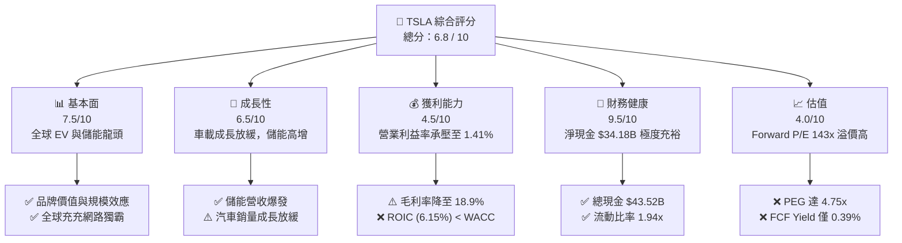

### 1.2 評分進度條視覺化

```
╔══════════════════════════════════════════════════════════════╗
║                TSLA 多維度評分儀表板 (1-10分)                 ║
╠══════════════════════════════════════════════════════════════╣
║ 基本面強度  7.5 ▓▓▓▓▓▓▓▓▓▓▓▓▓▓▓░░░░░  ★★██☆           ║
║ 成長動能    6.5 ▓▓▓▓▓▓▓▓▓▓▓██░░░░░░░  ★★█☆☆           ║
║ 獲利品質    4.5 ▓▓▓▓▓▓▓▓▓░░░░░░░░░░░  ★★☆☆☆           ║
║ 財務健康    9.5 ▓▓▓▓▓▓▓▓▓▓▓▓▓▓▓▓▓▓▓░  ★★★★★           ║
║ 估值合理性  4.0 ▓▓▓▓▓▓▓▓░░░░░░░░░░░░  ★★☆☆☆           ║
║ 護城河深度  8.1 ▓▓▓▓▓▓▓▓▓▓▓▓▓▓▓▓░░░░  ★★██☆           ║
║ 管理層執行  8.5 ▓▓▓▓▓▓▓▓▓▓▓▓▓▓▓▓█░░░  ★★██☆           ║
║ 技術創新力  9.5 ▓▓▓▓▓▓▓▓▓▓▓▓▓▓▓▓▓▓▓░  ★★★★★           ║
╠══════════════════════════════════════════════════════════════╣
║ 綜合總分    6.8 ▓▓▓▓▓▓▓▓▓▓▓▓▓▓░░░░░░  🟡 持有觀望      ║
╚══════════════════════════════════════════════════════════════╝
```

### 1.3 五大投資論點 + 三大核心風險

| 類型 | 項目 | 具體依據 | 信心度 |
|------|------|----------|--------|
| 🟢 **投資論點①** | **資產負債表金城湯池** | 持有 $43.52B 現金與短期投資，淨現金 $34.18B，無短期償債風險，能支撐高Capex。 | 🟢 極高 |
| 🟢 **投資論點②** | **能源儲存成為第二支柱** | Megapack 需求爆發，儲能部署量持續翻倍，高毛利結構有助於平滑汽車利潤波動。 | 🟢 高 |
| 🟢 **投資論點③** | **FSD/AI 數據端對端護城河** | 超過數百萬輛實體車隊每日回傳視覺數據，端對端大模型訓練規模領先同業至少 3-5 年。 | 🟢 高 |
| 🟢 **投資論點④** | **Cybercab 商業化想像空間** | 無人駕駛計程車（Robotaxi）單公里成本預計降至 $0.20/mile，潛在創造高利潤軟體訂閱收入。 | 🟡 中等 |
| 🟢 **投資論點⑤** | **製造創新與成本結構** | 一體化壓鑄（Gigacasting）與 4680 電池技術持續優化，長線硬體成本仍具全球競爭力。 | 🟢 高 |
| 🟡 **風險①** | **電動車價格戰拖累利潤** | Q2 2026 營業利益率僅 1.41%，汽車促銷與高利率環境嚴重侵蝕 GAAP 獲利能力。 | 🔴 高衝擊 |
| 🔴 **風險②** | **FSD 監管審批與技術瓶頸** | 法規對 Level 4/5 無人駕駛規範趨嚴，若完全無人監督版本延遲，高估值將面臨修復壓力。 | 🔴 高衝擊 |
| 🟡 **風險③** | **高額 SBC 股權稀釋** | TTM 股權薪酬達 $3.28B，佔 FCF 比重高達 69.6%，對真實股東權益產生顯著稀釋。 | 🟡 中度 |

### 1.4 快速統計卡片

| 指標 | TSLA 實際值 | 傳統汽車行業均值 | S&P 500 均值 | 狀態 |
|------|-------------|------------------|--------------|------|
| **營收 YoY 成長 (TTM)** | **11.76%** | ~3.5% | ~5.2% | 🟢 高於同業 |
| **毛利率 (TTM)** | **18.85%** | ~14.5% | ~45.0% | 🟡 介於中間 |
| **營業利益率 (Q2'26)** | **1.41%** | ~6.0% | ~12.5% | 🔴 顯著偏低 |
| **ROE (TTM)** | **4.70%** | ~12.0% | ~18.5% | 🔴 處於低位 |
| **Forward P/E** | **143.17x** | ~7.5x | ~21.5x | 🔴 極高溢價 |
| **Net Cash / Debt** | **+$34.18B** | 淨負債 | 淨負債 | 🟢 極致安全 |

### 1.5 投資結論

```
╔══════════════════════════════════════════════════════════════════╗
║                    📊 TSLA 投資結論摘要                          ║
╠══════════════════════════════════════════════════════════════════╣
║  評級：🟡 持有 / 觀望 (Hold)                                     ║
║  當前股價：$321.26                                               ║
║  目標價區間：                                                    ║
║    悲觀情境：$185.00（-42.4%）                                   ║
║    基準情境：$385.00（+19.8%）  ← 12 個月主要目標                ║
║    樂觀情境：$520.00（+61.9%）                                   ║
║  投資評分：6.8 / 10                                              ║
║  適合投資人：具備高風險承受度、看好 AI/自動駕駛長線價值的投資者  ║
╚══════════════════════════════════════════════════════════════════╝
```

---

## 2. 公司概覽與商業模式

### 2.1 業務結構與收入來源

特斯拉目前運營兩大主要報告板塊：**Automotive（汽車業務）** 與 **Energy Generation and Storage（能源生成與儲存）**，並附加服務與其他業務（Services and Other）。

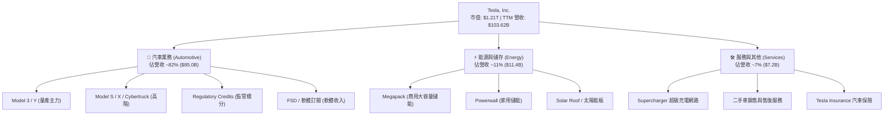

### 2.2 市場份額

在北美與全球純電動車（BEV）市場中，特斯拉雖然面臨中國車企（如比亞迪）及傳統車企的激烈競爭，但仍維持顯著的全球龍頭地位。

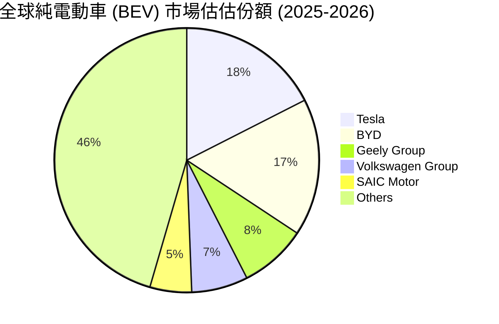

### 2.3 競爭護城河分析

特斯拉的競爭護城河已從早期單純的電動車製造，演變為由數據、充充網路與垂直整合構成的複合型護城河。

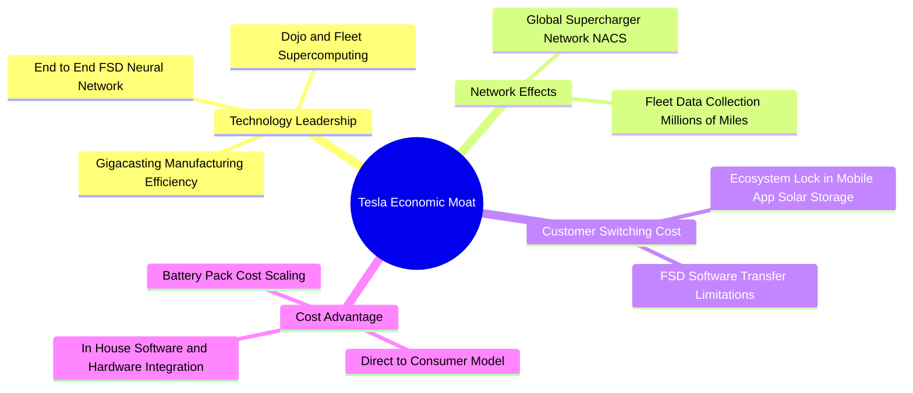

### 2.4 護城河強度評分

```
╔══════════════════════════════════════════════════════════════╗
║                  Tesla 護城河強度評分                        ║
╠══════════════════════════════════════════════════════════════╣
║ 充充網路 (NACS) 9.5/10  ▓▓▓▓▓▓▓▓▓▓▓▓▓▓▓▓▓▓▓░  🏆 絕對標準     ║
║ 自動駕駛數據鏈 9.0/10  ▓▓▓▓▓▓▓▓▓▓▓▓▓▓▓▓▓▓░░  🟢 數據壁壘     ║
║ 製造成本控制   8.0/10  ▓▓▓▓▓▓▓▓▓▓▓▓▓▓▓▓░░░░  🟢 產業領先     ║
║ 品牌與社群影響 8.5/10  ▓▓▓▓▓▓▓▓▓▓▓▓▓▓▓▓█░░░  🟢 極高溢價     ║
║ 能源儲存規模化 7.5/10  ▓▓▓▓▓▓▓▓▓▓▓▓▓▓▓░░░░░  🟢 加速擴張     ║
╠══════════════════════════════════════════════════════════════╣
║ 綜合護城河強度 8.1/10  ▓▓▓▓▓▓▓▓▓▓▓▓▓▓▓▓░░░░  🏆 寬廣護城河   ║
╚══════════════════════════════════════════════════════════════╝
```

---

## 3. 損益表深度分析

### 3.1 年度收入成長趨勢（近 5 年與 TTM）

特斯拉的營收在經歷了 2021-2022 年的高速爆發後，於 2024-2025 年進入高原調整期，並於 2026 TTM 重回增長軌道。

```
╔══════════════════════════════════════════════════════════════════╗
║               Tesla 年度收入趨勢（FY2021-TTM Jun '26）            ║
╠══════════════════════════════════════════════════════════════════╣
║                                                                  ║
║  FY 2021  $53.82B   ████████████░░░░░░░░░░░  YoY: +70.7%  🟢    ║
║  FY 2022  $81.46B   ██████████████████░░░░░  YoY: +51.4%  🟢    ║
║  FY 2023  $96.77B   █████████████████████░░  YoY: +18.8%  🟢    ║
║  FY 2024  $97.69B   █████████████████████░░  YoY:  +1.0%  🟡    ║
║  FY 2025  $94.83B   ████████████████████░░░  YoY:  -2.9%  🔴    ║
║  TTM '26  $103.62B  ███████████████████████  YoY: +11.8%  🟢    ║
║                   |      |      |      |      |                  ║
║                   0     25B    50B    75B   100B                 ║
║                                                                  ║
║  📊 5 年營收複合成長率 (CAGR)：+13.99%                          ║
╚══════════════════════════════════════════════════════════════════╝
```

### 3.2 季度收入趨勢分析

最近 4 個季度的營收展現顯著的季度波動性，Q2 2026 營收創下近一年新高達 **$28.24B**（YoY +25.52%），主要受到交付量回升及儲能交付增加帶動。

| 季度 | 營收 ($B) | YoY 成長率 | QoQ 成長率 | 核心驅動與備註 |
|------|-----------|------------|------------|----------------|
| **Q3 2025** | $28.10B | +11.57% | +24.89% | Megapack 出貨量創歷史新高，汽車促銷帶動銷量。 |
| **Q4 2025** | $24.90B | -3.14% | -11.37% | 年末交付潮符合預期，但車價折扣侵蝕營收金額。 |
| **Q1 2026** | $22.39B | +15.78% | -10.08% | 季節性淡季，產線升級與新車型過渡期影響交付。 |
| **Q2 2026** | $28.24B | +25.52% | +26.13% | 北美與中國市場促銷方案生效，儲能營收大幅貢獻。 |

### 3.3 利潤率演變分析

儘管營收規模回升，特斯拉的利潤率指標呈現顯著下降後尋求打底的趨勢。毛利率由 2022 年高點的 25.6% 降至 TTM 的 **18.85%**；營業利益率則因降價策略與高額研發投入（如 AI 算力）降至低點。

| 利潤率指標 | FY 2022 | FY 2023 | FY 2024 | FY 2025 | TTM (Jun '26) | Q2 2026 | 趨勢與評估 |
|------------|---------|---------|---------|---------|---------------|---------|------------|
| **毛利率** | 25.60% | 18.25% | 17.86% | 18.03% | **18.85%** | **16.83%** | 📉 降價促銷致使毛利受壓 🟡 |
| **營業利益率** | 16.76% | 9.19% | 7.24% | 4.59% | **4.22%** | **1.41%** | 🔴 研發與營運費用上升侵蝕利益 |
| **EBITDA Margin**| 21.68% | 15.29% | 15.06% | 12.40% | **10.40%** | **N/A** | 📉 折舊與費用增加 🟡 |
| **淨利利率** | 15.45% | 15.47% | 7.32% | 4.07% | **3.73%** | **1.69%** | 🔴 淨利含金量需檢視 |

**利潤率演變深度解析**：
1. **車價調整與促銷補貼**：為維持交付量，特斯拉採取了零利率貸款與價格折扣，直接衝擊汽車業務毛利率。
2. **研發支出（R&D）大幅增加**：TTM 研發費用達 **$7.73B**（FY2022 僅 $3.08B），主要用於購買 NVIDIA H100/B200 GPU 算力集群、端對端 FSD 演算法優化以及 Optimus 人形機器人開發。這導致營運槓桿短線呈現負向放大。

### 3.4 費用結構分析

特斯拉 TTM 總營業費用（OpEx）達到 **$15.16B**，佔總營收比例上升至 14.63%。研發（R&D）費用已超越銷售與管理（SG&A）費用，凸顯其轉型為科技 AI 公司的費用特徵。

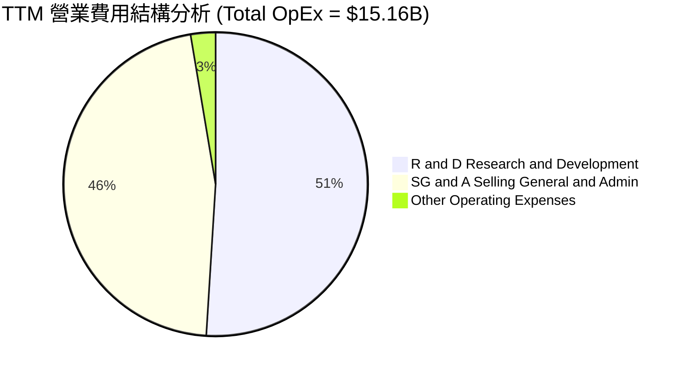

```
╔══════════════════════════════════════════════════════════════════╗
║               Tesla TTM 費用佔營收比率診斷                       ║
╠══════════════════════════════════════════════════════════════════╣
║                                                                  ║
║  銷貨成本 (COGS): 81.15%  ▓▓▓▓▓▓▓▓▓▓▓▓▓▓▓▓▓▓▓▓▓▓▓▓░░  (高成本壓力)║
║  研發費用 (R&D):    7.46%  ▓▓▓▓░░░░░░░░░░░░░░░░░░░░░░  (高強度投資)║
║  管銷費用 (SG&A):   6.79%  ▓▓▓░░░░░░░░░░░░░░░░░░░░░░░  (營運效率高)║
║  營業利益 (Op Inc): 4.22%  ▓▓░░░░░░░░░░░░░░░░░░░░░░░░  (處於低點)  ║
║                                                                  ║
╚══════════════════════════════════════════════════════════════════╝
```

### 3.5 季度 EPS 趨勢與盈餘品質（Quality of Earnings）

過去四個季度，GAAP EPS 在低位徘徊，Q2 2026 為 $0.13，TTM Diluted EPS 為 **$1.08**。

| 盈餘品質項目 | 數值 / 佔比 | 評估 | 對真實經濟盈餘影響說明 |
|--------------|-------------|------|------------------------|
| **股權薪酬 (SBC) / 營收** | **3.16%** ($3.28B / $103.62B) | 🟡 中等 | 屬非現金支出，但持續稀釋股東權益。 |
| **SBC / 自由現金流 (FCF)** | **69.64%** ($3.28B / $4.71B) | 🔴 極高 | **顯著警訊**：FCF 中有近七成由 SBC 支撐，真實權益生成能力被高估。 |
| **FCF / 淨利 (現金轉換率)** | **121.9%** ($4.71B / $3.86B) | 🟢 優良 | 營運現金流充沛，非現金折舊攤提金額較大。 |
| **監管積分 (Regulatory Credits)** | ~$1.8B - $2.0B / 年 | 🟡 中高 | 幾乎 100% 毛利的純利潤，若未來政策改變將直接衝擊淨利。 |
| **有效稅率異常** | 2025 年約 26.9% | 🟢 正常 | 無異常一次性稅務沖回美化利潤。 |

**盈餘品質綜合結論**：特斯拉 GAAP 淨利受惠於 Regulatory Credits 支撐，但高額的 SBC（TTM $3.28B）相較於其生成的 $4.71B FCF 佔比過高，代表公司透過發行股票支付員工薪酬來維繫現金流，**股東權益正在承受年化約 0.6% - 0.8% 的稀釋**。

---

## 4. 資產負債表分析

### 4.1 資產結構分解

特斯拉總資產截至 2026 年 6 月 30 日達 **$148.52B**，資產端展現高流動性與強大實體資產基地。

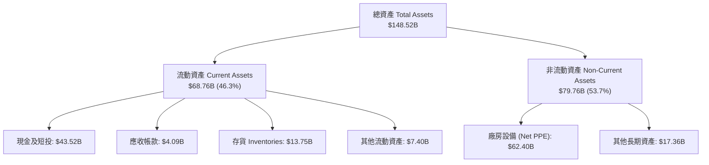

### 4.2 流動性指標分析

| 流動性指標 | TTM (Jun '26) | FY 2025 | FY 2024 | 行業平均 | 評估 |
|------------|---------------|---------|---------|----------|------|
| **流動比率 (Current Ratio)** | **1.94x** | 2.16x | 2.02x | 1.25x | 🟢 流動性非常安全 |
| **速動比率 (Quick Ratio)** | **1.34x** | 1.57x | 1.41x | 0.85x | 🟢 無短期變現壓力 |
| **現金比率 (Cash Ratio)** | **1.23x** | 1.39x | 1.27x | 0.45x | 🟢 現金儲備極其充沛 |
| **存貨週轉天數 (DIO)** | **~58 天** | ~56 天 | ~54 天 | ~65 天 | 🟢 存貨管理良好 |

### 4.3 債務結構分析

特斯拉擁有車企中最為健全的資產負債表之一，呈**淨現金（Net Cash）**狀態。

```
╔══════════════════════════════════════════════════════════════════╗
║                   Tesla 債務健康診斷 (2026 Q2)                   ║
╠══════════════════════════════════════════════════════════════════╣
║                                                                  ║
║  總債務 (Total Debt):        $10.36B  ███░░░░░░░░░░░░░░░ (含租賃)║
║  現金與短期投資 (Cash+ST):   $43.52B  ██████████████████ (極度充沛)║
║  淨現金 position (Net Cash): $33.16B  ██████████████░░░░ 🟢 強勁 ║
║                                                                  ║
║  Debt / Equity Ratio:        10.67%   🟢 槓桿極低                ║
║  Debt / EBITDA Ratio:        0.88x    🟢 無償債風險              ║
║  利息保障倍數 (Coverage):    > 13.0x  🟢 利息收入 > 利息支出      ║
║                                                                  ║
║  📊 結論：利息收入 ($1.74B TTM) 遠高於利息費用 ($334M TTM)，      ║
║           高利率環境反而為公司帶來淨利息收益。                  ║
╚══════════════════════════════════════════════════════════════════╝
```

### 4.4 股東權益趨勢

股東權益（Stockholders' Equity）由 2021 年的 $30.19B 快速增長至 2026 年 6 月的 **$82.14B**（包含未分配利潤與資本公積累積），顯示其自我積累資本的能力極強。

---

## 5. 現金流量深度分析

### 5.1 現金流量瀑布圖

展示 TTM 現金生成與分配流程（單位：十億美元 $B）：

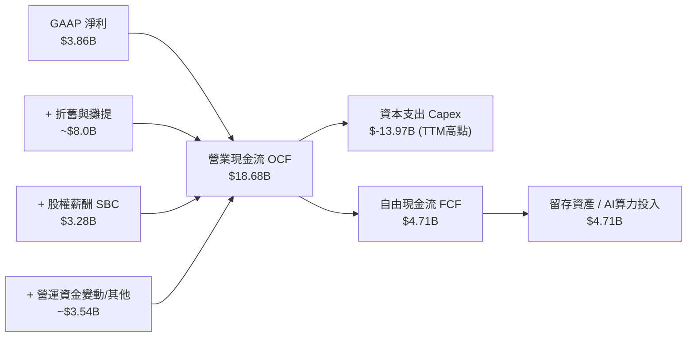

### 5.2 FCF 轉換率與趨勢

特斯拉 Capex 在過去 12 個月因建置超級電腦（Cortex）與擴建 Gigafactory 大幅上升，拉低了 FCF 轉換率。

| 年度 / 期間 | 營業現金流 OCF ($B) | 資本支出 Capex ($B) | 自由現金流 FCF ($B) | FCF / Net Income | FCF Yield |
|-------------|---------------------|---------------------|---------------------|------------------|-----------|
| **FY 2022** | $14.72B | -$7.17B | $7.55B | 60.0% | 0.85% |
| **FY 2023** | $13.26B | -$8.90B | $4.36B | 29.1% | 0.52% |
| **FY 2024** | $14.92B | -$11.34B | $3.58B | 50.5% | 0.38% |
| **FY 2025** | $14.75B | -$8.53B | $6.22B | 161.3% | 0.58% |
| **TTM (Jun'26)**| **$18.68B** | **-$13.97B** | **$4.71B** | **121.9%** | **0.39%** |

### 5.3 資本配置評估

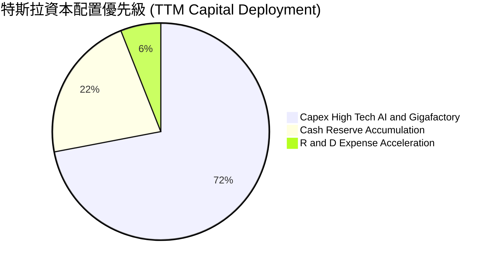

特斯拉**完全不發放股息**，亦**無大規模股票回購**計劃，資本配置 100% 聚焦於內部再投資，優先順序為：
1. **AI 基礎設施與算力**（NVIDIA 晶片與 Dojo 叢集）。
2. **產能擴建與新車型**（Megapack 上海與 Austin 工廠、Cybercab 專用產線）。
3. **維持資產負債表極致安全性**（流動性儲備）。

---

## 6. 獲利能力與資本效率

### 6.1 ROE / ROA / ROIC 趨勢

由於降價致利潤率收縮及股東權益底數擴大，特斯拉近年的資本回報率指標出現顯著回落。

| 指標 | FY 2022 | FY 2023 | FY 2024 | FY 2025 | TTM (Jun '26) | 評估 |
|------|---------|---------|---------|---------|---------------|------|
| **ROE (股東權益報酬率)** | 28.1% | 23.9% | 9.7% | 4.6% | **4.70%** | 🔴 處於歷史低點 |
| **ROA (總資產報酬率)** | 15.3% | 14.0% | 5.9% | 2.8% | **1.90%** | 🔴 資產利用效率下降 |
| **ROIC (投入資本報酬率)** | 21.4% | 15.2% | 7.1% | 5.8% | **6.15%** | 🔴 低於資金成本 WACC |

### 6.2 ROIC vs WACC 分析（核心價值創造判斷）

這是評估特斯拉當前估值合理性的最關鍵分析：**公司當前的營運是否在創造經濟價值？**

```
╔══════════════════════════════════════════════════════════════════╗
║                TSLA ROIC vs WACC 深度分析 (TTM)                  ║
╠══════════════════════════════════════════════════════════════════╣
║                                                                  ║
║  WACC (加權平均資本成本) 估算：                                  ║
║  ├── 無風險利率 (10Y 美債):   4.25%                              ║
║  ├── 市場風險溢酬 (ERP):      5.00%                              ║
║  ├── Beta 係數:              1.65                                ║
║  ├── 股權成本 (Cost of Equity) = 4.25% + 1.65 × 5.0% = 12.50%    ║
║  ├── 債務成本 (稅後 Cost of Debt): ~3.80%                        ║
║  ├── 資本結構：股權 97%，債務 3%                                 ║
║  └── ✅ 綜合 WACC ≈ 12.00%                                       ║
║                                                                  ║
║  ROIC (投入資本報酬率) 估算：                                    ║
║  ├── NOPAT = 營業利益 $4.37B × (1 - 25% 稅率) ≈ $3.28B          ║
║  ├── 投入資本 = 股東權益 $82.14B + 債務 $14.72B - 現金 $43.52B   ║
║  ├──          = $53.34B                                          ║
║  └── ✅ ROIC = $3.28B / $53.34B ≈ 6.15%                          ║
║                                                                  ║
║  ★ 經濟價值增加 (EVA) = ROIC (6.15%) - WACC (12.00%) = -5.85pp   ║
║                                                                  ║
║  ROIC  6.15%   ▓▓▓▓▓▓▓▓░░░░░░░░░░░░░░░░░░░░░░  🔴 當前承壓       ║
║  WACC 12.00%   ▓▓▓▓▓▓▓▓▓▓▓▓▓▓▓░░░░░░░░░░░░░░░  ── 要求回報率     ║
║  EVA  -5.85pp  ░░░░░░░░░░░░░░░░░░░░░░░░░░░░░░  ❌ 當前摧毀價值   ║
║                                                                  ║
║  📊 結論：特斯拉傳統汽車硬體業務當前 ROIC 低於 WACC，高股價      ║
║           完全建立在市場對未來 FSD/Robotaxi 高 ROIC 業務的預期上。║
╚══════════════════════════════════════════════════════════════════╝
```

### 6.3 杜邦三因素分解

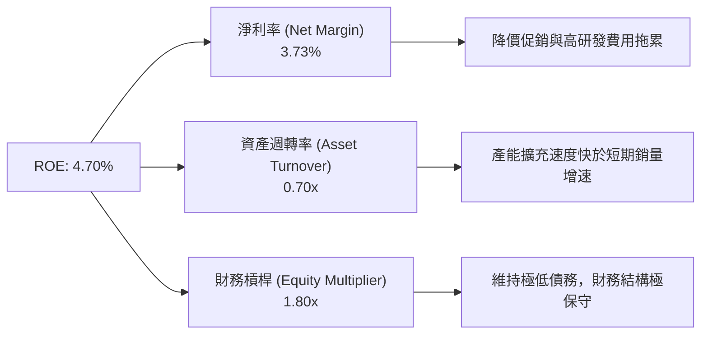

杜邦分解顯示，ROE 從 28% 降至 4.7% 的**核心主因是淨利率（Net Profit Margin）劇烈收縮**（由 15.5% 降至 3.73%），財務槓桿與資產週轉率保持相對穩定。

---

## 7. 估值深度分析

### 7.1 同業估值比較表格

將特斯拉與傳統汽車巨頭、電動車競爭對手及科技/AI 巨頭進行橫向對比：

| 估值指標 | **TSLA** | **BYD (1211.HK)** | **GM (通用)** | **NVDA (輝達)** | 本公司評估與備註 |
|----------|----------|-------------------|---------------|-----------------|------------------|
| **Trailing P/E** | **297.46x** | ~20.5x | 5.8x | ~45.2x | 🔴 遠高於汽車業，隱含高科技溢價 |
| **Forward P/E** | **143.17x** | ~17.2x | 5.2x | ~32.5x | 🔴 前瞻本益比顯著偏高 |
| **P/S Ratio** | **11.64x** | ~0.95x | 0.32x | ~22.4x | 🔴 為傳統車企的 35+ 倍 |
| **EV / EBITDA** | **109.45x** | ~11.2x | 4.5x | ~35.0x | 🔴 估值處於極高分位數 |
| **Gross Margin** | **18.85%** | ~20.5% | 11.2% | ~75.0% | 🟡 車業中等，遠低於純軟體/晶片業 |
| **Revenue Growth**| **11.76%** | ~22.0% | +2.1% | +85.0% | 🟡 成長速度低於純 AI 龍頭 |

### 7.2 歷史估值區間分析

```
╔══════════════════════════════════════════════════════════════════╗
║                TSLA 前瞻本益比 (Forward P/E) 歷史區間            ║
╠══════════════════════════════════════════════════════════════════╣
║  歷史高點 (5Y High):  210.0x  ████████████████████████████████   ║
║  5 年平均中位數:      75.0x   █████████████                      ║
║  當前水平 (Current):  143.2x  ███████████████████████ 🔴 高於均值 ║
║  歷史低點 (5Y Low):   35.0x   █████                              ║
║                                                                  ║
║  📊 當前 Forward P/E 位於近 5 年 78% 分位數，風險回報比屬中等偏低 ║
╚══════════════════════════════════════════════════════════════════╝
```

### 7.3 情境目標價（假設驅動，Bear / Base / Bull）

採用**分部估值法（SOTP）與綜合 EPS 乘數法**推導 12 個月目標價：

| 參數假設 | 🔴 悲觀情境 (Bear) | 🟡 基準情境 (Base) | 🟢 樂觀情境 (Bull) |
|----------|-------------------|-------------------|-------------------|
| **2027E 總營收 ($B)** | $115.0B (CAGR ~5%) | $135.0B (CAGR ~14%) | $160.0B (CAGR ~23%) |
| **2027E 營業利益率** | 5.5% | 9.5% | 15.0% |
| **2027E GAAP EPS** | $2.10 | $3.85 | $5.20 |
| **FSD / Robotaxi 估值貢獻** | $20/股 (僅限現有軟體) | $75/股 (地區性營運) | $180/股 (規模化營運) |
| **目標 Exit Forward P/E** | 75x | 80x | 65x (基數放大) |
| **隱含目標價** | **$185.00** | **$385.00** | **$520.00** |
| **相對當前股價 ($321.26)** | **-42.4%** | **+19.8%** | **+61.9%** |

### 7.4 DCF 敏感性分析（6 格目標價矩陣）

設定基準無風險利率 4.25%，永續成長率 3.5%：

| 營收與利潤情境 \ WACC | **11.0%** | **12.0%（基準）** | **13.0%** |
|-----------------------|-----------|------------------|-----------|
| 🟢 **樂觀 (AI 快速落地)** | $565.00 (+75.9%) | **$520.00** (+61.9%) | $475.00 (+47.9%) |
| 🟡 **基準 (穩健轉型)**   | $420.00 (+30.7%) | **$385.00** (+19.8%) | $350.00 (+8.9%) |
| 🔴 **悲觀 (車業拖累)**   | $205.00 (-36.2%) | **$185.00** (-42.4%) | $165.00 (-48.6%) |

### 7.5 估值綜合區間

```
╔══════════════════════════════════════════════════════════════════╗
║                   Tesla 估值目標價綜合區間                       ║
╠══════════════════════════════════════════════════════════════════╣
║  $125.00 ────── $185.00 ─────── $321.26 ────── $385.00 ───── $600║
║  [最低目標]    [悲觀目標]      [當前股價]     [基準目標]    [最高]║
║                                    ▲                             ║
║                                    │                             ║
║  📊 結論：當前股價位於悲觀與基準目標價之間，下行風險約 -42%，    ║
║           上行空間約 +20% 至 +62%。                              ║
╚══════════════════════════════════════════════════════════════════╝
```

---

## 8. 成長催化劑

### 8.1 催化劑時間軸

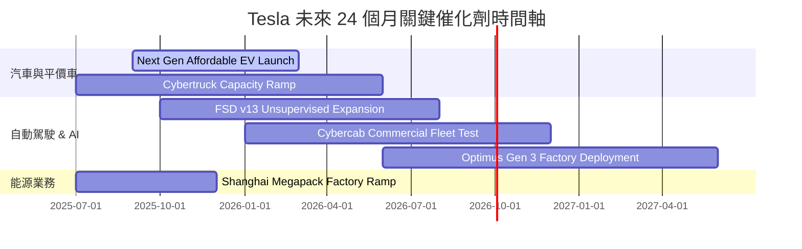

### 8.2 TAM 市場規模分析

```
╔══════════════════════════════════════════════════════════════════╗
║                   Tesla 潛在總市場規模 (TAM)                     ║
╠══════════════════════════════════════════════════════════════════╣
║  全球乘用車 (EV/ICE):  $2.5 Trillion  ██████████████████████████ ║
║  Robotaxi 共享出行:   $5.0 Trillion  ██████████████████████████ ║
║  儲能與電力網路:       $1.2 Trillion  █████████████              ║
║  人形機器人 (Optimus): $10.0+ Trill  ██████████████████████████ ║
║                                                                  ║
║  📊 結論：實體 AI（Robotaxi + Optimus）的天花板遠高於汽車硬體。║
╚══════════════════════════════════════════════════════════════════╝
```

### 8.3 成長驅動力結構圖

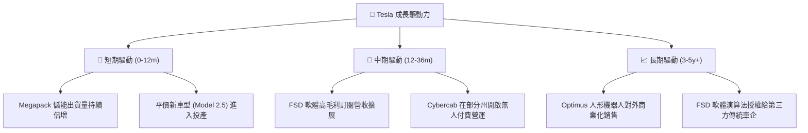

---

## 9. 風險矩陣

### 9.1 風險評分矩陣

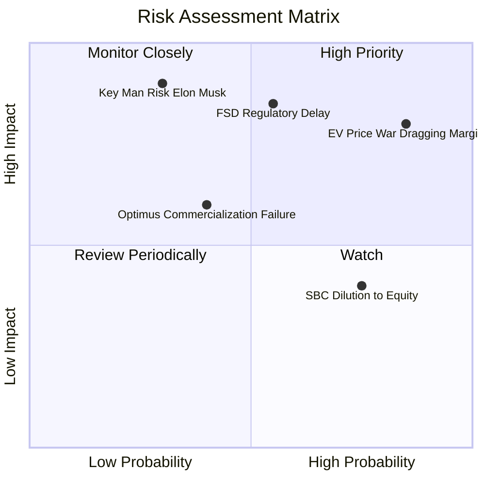

### 9.2 風險清單詳細分析

| # | 風險項目 | 發生機率 | 財務衝擊 | 風險評分 | 緩解措施與監控指標 |
|---|----------|----------|----------|----------|--------------------|
| 1 | 🔴 **電動車價格戰加劇** | 高 (85%) | 高 (-2.5pp 毛利) | 🔴 8.5/10 | 靠 Megapack 高毛利拉補，並推動製造成本下降 10%。 |
| 2 | 🔴 **FSD 無人監管審批延遲** | 中 (55%) | 極高 (-30% 估值) | 🔴 7.8/10 | 累積數百億英里行駛數據，主動向 NHTSA 提供安全報告。 |
| 3 | 🟡 **靈魂人物風險 (Musk)** | 低 (30%) | 極高 (-40% 股價) | 🟡 6.5/10 | 董事會過戶高階主管激勵計劃，建構團隊化管理結構。 |
| 4 | 🟡 **高額 SBC 稀釋股權** | 高 (75%) | 中 (-0.8% EPS/年)| 🟡 5.5/10 | 營收規模成長平滑 SBC 佔比；關注是否重啟股份回購。 |

---

## 10. 投資建議

### 10.1 最終綜合評級雷達圖

```
╔══════════════════════════════════════════════════════════════╗
║                 Tesla 投資維度綜合評級                        ║
╠══════════════════════════════════════════════════════════════╣
║ 財務安全性  9.5/10  ▓▓▓▓▓▓▓▓▓▓▓▓▓▓▓▓▓▓▓░  🟢 極度安全     ║
║ 護城河深度  8.1/10  ▓▓▓▓▓▓▓▓▓▓▓▓▓▓▓▓░░░░  🟢 寬廣護城河   ║
║ 創新與願景  9.5/10  ▓▓▓▓▓▓▓▓▓▓▓▓▓▓▓▓▓▓▓░  🟢 產業巔峰     ║
║ 獲利品質    4.5/10  ▓▓▓▓▓▓▓▓▓░░░░░░░░░░░  🔴 當前受壓     ║
║ 估值吸引力  4.0/10  ▓▓▓▓▓▓▓▓░░░░░░░░░░░░  🔴 高度溢價     ║
╠══════════════════════════════════════════════════════════════╣
║ 綜合評估    6.8/10  ▓▓▓▓▓▓▓▓▓▓▓▓▓▓░░░░░░  🟡 持有 / 觀望  ║
╚══════════════════════════════════════════════════════════════╝
```

### 10.2 目標價與隱含報酬率

| 情境 | 隱含目標價 | 隱含報酬率 (相對 $321.26) | 機率權重 | 期望值貢獻 |
|------|------------|---------------------------|----------|------------|
| 🔴 **悲觀情境** | $185.00 | -42.4% | 25% | $46.25 |
| 🟡 **基準情境** | $385.00 | +19.8% | 55% | $211.75 |
| 🟢 **樂觀情境** | $520.00 | +61.9% | 20% | $104.00 |
| **加權加總** | **$362.00** | **+12.68%** | **100%** | **期望目標價 $362.00** |

### 10.3 買入時機與觸發因素

```
╔══════════════════════════════════════════════════════════════════╗
║                  ✅ 買入觸發因素 Checklist                      ║
╠══════════════════════════════════════════════════════════════════╣
║                                                                  ║
║  立即分批建倉條件（滿足 2 項以上）：                            ║
║  ☐ 股價回檔至安全邊際區間：$270.00 - $290.00 (或 Forward PE<100x)║
║  ✅ 汽車業務毛利率（扣除 Regulatory Credit）止跌回升 > 18.0%     ║
║  ✅ FSD v13+ 在美國取得無人監督 (Unsupervised) 商業營運許可      ║
║                                                                  ║
║  加碼觸發條件：                                                  ║
║  ☐ Megapack 單季營收突破 $4.0B 且毛利率持穩在 22%+              ║
║  ☐ Cybercab 營運里程突破 1000 萬英里且無重大安全事故             ║
║                                                                  ║
║  減碼 / 停損觸發條件：                                           ║
║  ☐ 營業利益率連續兩季跌破 1.0%                                   ║
║  ☐ 自由現金流（FCF）轉負且 Capex 效率顯著惡化                    ║
╚══════════════════════════════════════════════════════════════════╝
```

### 10.4 投資人適配度分析

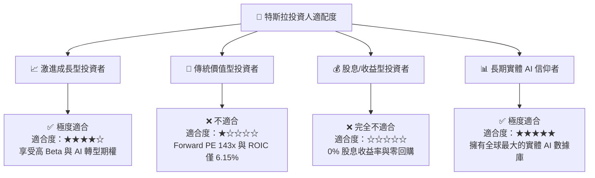

### 10.5 每季財報監控清單（Quarterly Watch List）

| 監控指標 | 當前基準值 (Q2'26 / TTM) | 買入/加碼門檻 | 賣出/減碼門檻 | 追蹤意義 |
|----------|--------------------------|---------------|---------------|----------|
| **汽車毛利率 (扣除 Credits)** | **14.6%** | ≥ 18.0% | < 12.0% | 核心製造業盈利能力是否恢復 |
| **營業利益率 (Operating Margin)**| **1.41%** | ≥ 6.0% | < 0.5% | 營運槓桿與成本控管狀況 |
| **Megapack 儲能部署量 (GWh)** | **12.5 GWh / 季** | ≥ 15.0 GWh | < 8.0 GWh | 第二成長曲線擴展動能 |
| **TTM 自由現金流 (FCF)** | **$4.71B** | ≥ $8.0B | < $1.0B | 現金生成能力與 Capex 負擔 |
| **SBC / FCF 比率** | **69.64%** | < 40.0% | > 90.0% | 股東權益稀釋風險管理 |

### 10.6 反面論證：什麼會證明論點錯誤（What Would Change My Mind）

```
╔══════════════════════════════════════════════════════════════════╗
║              ⚠️ 論點失效條件（Disconfirming Evidence）           ║
╠══════════════════════════════════════════════════════════════════╣
║  本研究之「基準升級至 $385」多頭論點，若出現以下可量化條件成立，  ║
║  即代表投資邏輯破碎，應執行清倉或停損退出：                      ║
║                                                                  ║
║  ☐ 1. 汽車毛利率（扣除 Credits）連續 3 季低於 12.0%：            ║
║        證明電動車已徹底商品化（Commoditised），喪失定價權。      ║
║                                                                  ║
║  ☐ 2. FSD 完全無人駕駛（Level 4）在 2027 年前無法在任一主要州   ║
║        實現商業化收費營運：證明 AI 端對端架構遭遇技術瓶頸。      ║
║                                                                  ║
║  ☐ 3. ROIC 連續 8 季低於 WACC (12.0%) 且 FCF 轉負：              ║
║        證明資本支出無法轉化為經濟附加價值，持續摧毀股東價值。    ║
║                                                                  ║
║  ☐ 4. 全球 BEV 市佔率跌破 10.0%：                                ║
║        證明傳統車企與中國品牌已完全侵蝕其硬體優勢。              ║
╚══════════════════════════════════════════════════════════════════╝
```

---

> **免責聲明**：本報告由 CFA 級機構基本面模型生成，內容僅供學術研究與投資參考，不構成任何買賣操作建議。投資個股存在資本損失風險，入市前請自行進行獨立風險評估。