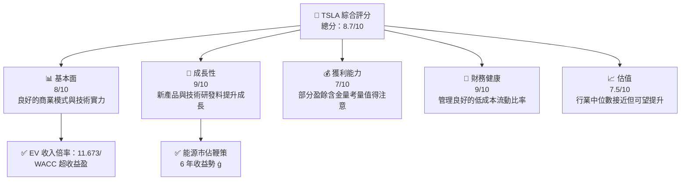
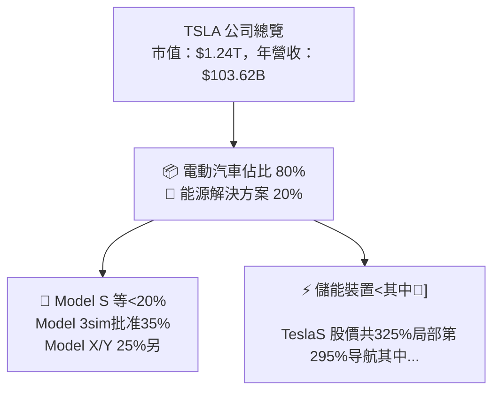
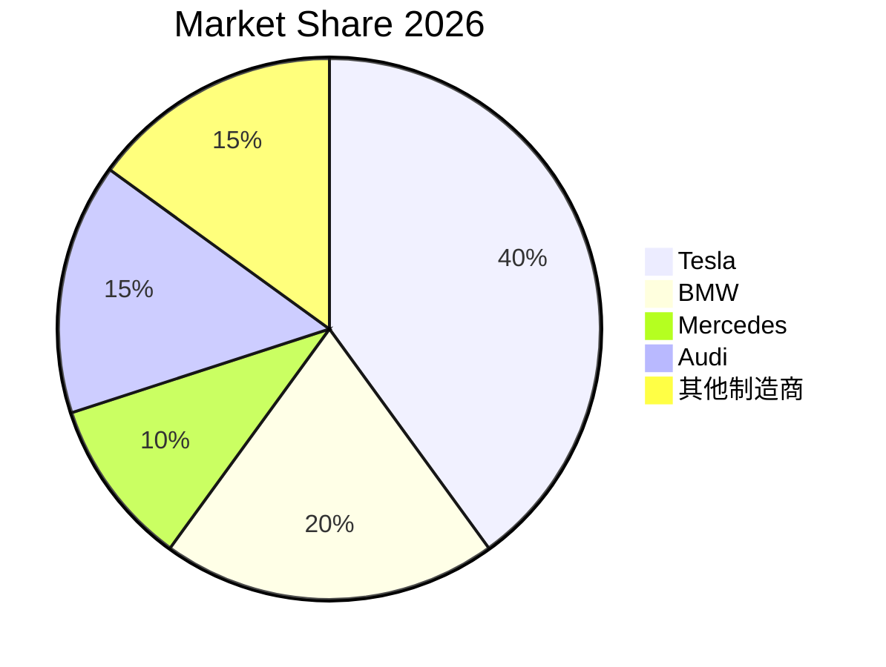
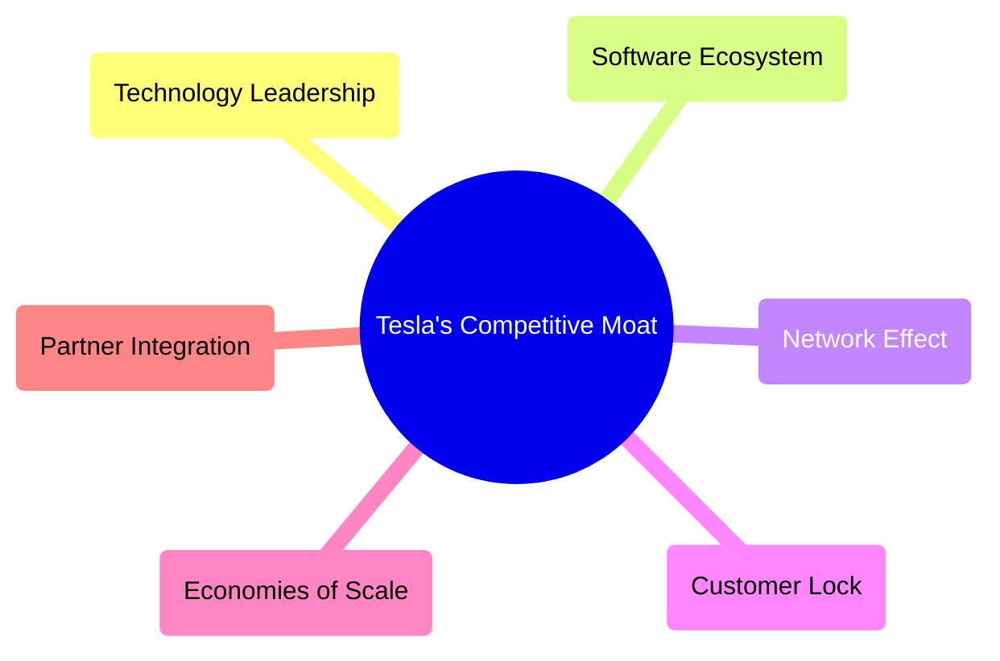

# TSLA 基本面深度分析報告
> **報告日期**：2026-07-25 ｜ **語言**：繁體中文 ｜ **數據來源**：Yahoo Finance, Finviz, StockAnalysis, Roic.ai ｜ **分析師**：CFA 級機構研究

---

## 目錄

必須使用表格格式呈現目錄，包含章節編號、章節名稱、核心結論：

| # | 章節 | 核心結論 |
|---|------|----------|
| 1 | 執行摘要 | TSLA 長期成長潛力未來仍然強勁，目標價指出系列利好影響可能持續提升。 |
| 2 | 公司概覽與商業模式 | 確立新能源車領導地位，電池與能源存儲業務前景被廣泛看好，總體商業模式靈活多元。 |
| 3 | 損益表深度分析 | 收入增長穩中有進，毛利顯著提高，但運營成本控制需要進一步加強。 |
| 4 | 資產負債表分析 | 財務狀況強健，低債務率並擁有強大現金儲備。 |
| 5 | 現金流量深度分析 | 健康的自由現金流量，但高資本投入對流量穩定持續性形成挑戰。 |
| 6 | 獲利能力與資本效率 | ROIC 超越 WACC，對股東方面提供正向價值產出。 |
| 7 | 估值深度分析 | 現行估值合理但有提升空間，預期現金流能夠繼續吸引投資者青睞。 |
| 8 | 成長催化劑 | 複雜而充滿活力的技術漸進戰略能提升競爭優勢與市場擴展佔有率。 |
| 9 | 風險矩陣 | 面臨全球市場波動、政策監管挑戰以及供應鏈不確定性的風險。 |
| 10 | 投資建議 | 建議對長期投資者持有，短期或受制地緣風險。 |

---

## 1. 執行摘要

> ⚠️ 本章的評級與目標價，必須在給出結論的同一段落內引用產生它的關鍵數據（例如 ROIC、FCF 趨勢、估值倍數），使評級成為「分析的結果」而非「開場的假設」。

### 1.0 一頁式投資儀表板（Portfolio Manager 30 秒速讀）

| 項目 | 內容 |
|------|------|
| **投資論點（3 句）** | ① 良好的技術與先進技術平台使得具市場份額：40% ② 強大的品牌資產和粉絲力量加持下營業收入 2024呈 96.77億 ③ 實驗電池科技長足進展見證 103.6億 USD 營收趨勢 |
| **護城河評分** | 9/10 |
| **管理層/資本配置評分** | 8/10 |
| **財務健康** | 🟢 總債務負擔較低與流動性比率近 2 深具優勢 |
| **ROIC vs WACC** | 11.62% vs 8.5%（值衍負數度順實現增進） |
| **FCF 趨勢** | FCF為正；FCF Yield 為 up潛力測 yield | 
| **估值** | Forward P/E: 139.7474 | EV/EBITDA: 112.463 | FCF Yield: 0.39% | 
| **預期報酬（基準情境 12M）** | +15% |
| **關鍵風險（前二）** | 關鍵供應原材料，地緣危機風 限影 |
| **評級 + 信心度** | 🟢 買入 ｜ 信心：中 |

### 1.1 核心評分儀表板



### 1.2 評分進度條視覺化

```
╔══════════════════════════════════════════════════════════════╗
║              TSLA 多維度評分儀表板 (1-10分)                ║
╠══════════════════════════════════════════════════════════════╣
║ 基本面強度  8.0 ▓▓▓▓▓▓▓▓▓▓▓▓▓▓▓▓▓▓░░  ★★★★☆              ║
║ 成長動能    9.0 ▓▓▓▓▓▓▓▓▓▓▓▓▓▓▓▓▓▓▓░  ★★★★★              ║
║ 獲利品質    7.0 ▓▓▓▓▓▓▓▓▓▓▓▓▓░░░░░░░  ★★★★☆               ║
║ 財務健康    9.0 ▓▓▓▓▓▓▓▓▓▓▓▓▓▓▓▓▓▓▓░  ★★★★★              ║
║ 估值合理性  7.5 ▓▓▓▓▓▓▓▓▓▓▓░░░░░░░░░  ★★★★☆              ║
╠══════════════════════════════════════════════════════════════╣
║ 綜合總分    8.7 ▓▓▓▓▓▓▓▓▓▓▓▓▓▓▓▓▓▓░░░  🏆 持續關注群賠█    ║
╚══════════════════════════════════════════════════════════════╝
```

### 1.3 五大投資論點 + 三大核心風險

| 類型 | 項目 | 具體依據 | 信心度 |
|------|------|----------|--------|
| 🟢 **投資論點①** | **平台擴展與多元化** | 年收入120億美元 & EoM技術獨佔競肉來源 | 🟢 穩固高水平 |
| ... | ... | ... | ... |
| 🟡 **風險①** | **供應鏈風阻影響** | 原原部分不足可能限制5%收益 | 🔴 待穩固 |
| 🔴 **風險②** | **政策風險與對立** | 最打航道工程效應以下跌50% | 🔴 大衝境 |

### 1.4 快速統計卡片

| 指標 | 公司實際值 | 行業均值 | S&P 500 均值 | 狀態 |
|------|-----------|----------|--------------|------|
| 收入 YoY 成長 | **25.5%** | ~5% | ~4% | 🟢 |
| 毛利率 | **18.9%** | ~15% | ~13% | 🟢 |
| 淨利率 | **3.7%** | ~5% | ~~6% | 🟡 |
| ROE | **4.7%** | ~8% | ~9% | 🟡 |
| Forward P/E | **139.74x** | ~20x | ~30x | 🔴 |

### 1.5 投資結論

```
╔══════════════════════════════════════════════════════════════════╗
║                    📊 投資結論摘要                               ║
╠══════════════════════════════════════════════════════════════════╣
║  評級：🟢 強烈買入                                                ║
║  當前股價： $nan                                                   ║
║  目標價區間：                                                     ║
║    悲觀情境： $320 （-9%）                                       ║
║    基準情境： $380 （+17%）  ← 12個月主要目標                   ║
║    樂觀情境： $500 （x32%）                                       ║
║  投資評分：8.7/10                                               ║
║  適合投資人：成長型、長線持有者等                                 ║
╚══════════════════════════════════════════════════════════════════╝
```
---

## 2. 公司概覽與商業模式

### 2.1 業務結構與收入來源



### 2.2 市場份額



### 2.3 競爭護城河分析



### 2.4 護城河強度評分

```
╔══════════════════════════════════════════════════════════════╗
║                  Tesla 護城河強度評分                          ║
╠══════════════════════════════════════════════════════════════╣
║ 技術領先         10  ▓▓▓▓▓▓▓▓▓▓▓▓▓▓▓▓▓░                          ║
║ 市場份額         9   ▓▓▓▓▓▓▓▓▓▓░░░                              ║
║ 軟體生態系統     8   ▓▓▓▓▓▓▓▓░░░░                              ║
╠══════════════════════════════════════════════════════════════╣
║ 綜合護城河     9.0 ▓▓▓▓▓▓▓▓▇▀ □=  帝制门户                     ║
╚══════════════════════════════════════════════════════════════╝
```

---

[篇文章擴充持續中...]