# TSLA 基本面深度分析報告
> **報告日期**：2026-07-26 ｜ **語言**：繁體中文 ｜ **數據來源**：Yahoo Finance, Finviz, StockAnalysis, Roic.ai ｜ **分析師**：CFA 級機構研究

---

## 目錄

| # | 章節 | 核心結論 |
|---|------|----------|
| 1 | 執行摘要 | 給予「持有 / 觀望」評級，基準目標價 $380.00，現價隱含估值溢價過高與 ROIC < WACC 的資本效率失衡。 |
| 2 | 公司概覽與商業模式 | 從純電動車製造商轉型為 AI 與能源生態系，軟體與 AI 資料庫構成強大護城河，但短期車輛交付仍佔營收主體。 |
| 3 | 損益表深度分析 | Q2 2026 營收強勁反彈（+25.5% YoY），但營業利潤率壓低至 1.41%，反映價格戰與 AI 研發 Capex 擴張對本業獲利的侵蝕。 |
| 4 | 資產負債表分析 | 淨現金高達 $274.4 億，資產負債表極度穩健；但存貨與 PPE 快速擴張，資產週轉率面臨下行壓力。 |
| 5 | 現金流量深度分析 | TTM 營運現金流 $186.8 億，但 Q2 2026 因 AI 伺服器 Capex 激增至 $58.0 億導致單季 FCF 轉負（-$11.0 億）。 |
| 6 | 獲利能力與資本效率 | TTM ROIC 為 6.78%，低於 WACC (12.33%)，經濟附加價值（EVA）為負，顯示目前汽車本業正處於摧毀價值階段。 |
| 7 | 估值深度分析 | Trailing P/E 284.6x，Forward P/E 141.0x，已完全反映 Robotaxi/FSD 的樂觀情境，安全邊際嚴重不足。 |
| 8 | 成長催化劑 | FSD V13/V14 全面商業化、Cybercab 量產、Optimus 進入工廠試運作，以及 Energy Storage 營收高速暴增。 |
| 9 | 風險矩陣 | 核心車款利潤率持續收縮、Robotaxi 法規監管延遲、巨額 AI 資本支出拖累現金流為三大核心風險。 |
| 10 | 投資建議 | 評級 🟡 持有 / 觀望（投資評分 6.8/10），建議等待利潤率觸底或股價回落至 $280-$300 區間再行佈局。 |

---

## 1. 執行摘要

> ⚠️ **評級與結論依據**：本報告給予特斯拉（TSLA）「**🟡 持有 / 觀望（Hold）**」評級，12 個月基準目標價為 **$380.00**。此結論係基於客觀數據推導：雖然最新季（Q2 2026）營收達到 $282.4 億（YoY +25.5%），顯示交付動能回升，但營業利益率顯著萎縮至 **1.41%**（去年同期為 4.10%），帶動 TTM ROIC 降至 **6.78%**，遠低於公司 WACC（**12.33%**），顯示公司目前處於經濟附加價值（EVA）侵蝕階段。當前 Trailing P/E 達 **284.6x**、Forward P/E 達 **141.0x**，隱含市場已提前計入極高比例的 Robotaxi 與 AI 軟體利潤；在自由現金流（Q2 2026 FCF 為 -$11.0 億）受到 Capex 激增拉低的情況下，當前估值缺乏足夠安全邊際。

### 1.0 一頁式投資儀表板（Portfolio Manager 30 秒速讀）

| 項目 | 內容 |
|------|------|
| **投資論點（3 句）** | ① 汽車本業面臨全球價格戰與毛利率受壓，Q2 2026 營業利益率降至 **1.41%** 的低點。<br/>② AI 與 FSD/Robotaxi 具備極高長期選擇權價值，但單季 Capex 擴大至 **$58.0 億** 拖累自由現金流轉負（-$11.0 億）。<br/>③ 資產負債表維持 **$274.4 億** 淨現金極佳防禦力，惟 ROIC (**6.78%**) < WACC (**12.33%**)，現價估值溢價過高。 |
| **護城河評分** | **8.8/10** (超大型 AI 訓練集群、超級充電網絡、百億英里真實駕駛數據庫) |
| **管理層/資本配置評分** | **7.5/10** (AI 與技術前瞻極佳，但資本支出波動大且股權薪酬侵蝕股東權益) |
| **財務健康** | 🟢 **極度健康**（總現金 $435.2 億，債務/權益比僅 18.37%） |
| **ROIC vs WACC** | **6.78% vs 12.33%**（🔴 目前暫時摧毀股東經濟價值 -5.55pp） |
| **FCF 趨勢** | 🔴 下降（TTM FCF $48.4 億，FCF Yield 僅 **0.39%**；最新季 Q2 2026 為 **-$11.0 億**） |
| **估值** | Forward P/E **141.0x** ｜ EV/EBITDA **112.5x** ｜ FCF Yield **0.39%** |
| **預期報酬（基準情境 12M）** | **+18.9%**（相對現價隱含推估價 $319.69，基準目標價 $380.00） |
| **關鍵風險（前二）** | ① 電動車價格戰導致汽車毛利率持續失守。<br/>② Robotaxi 商業化落地與監管批准進度不如預期。 |
| **評級 + 信心度** | 🟡 **持有 / 觀望** ｜ 信心度：**中等** |

### 1.1 核心評分儀表板

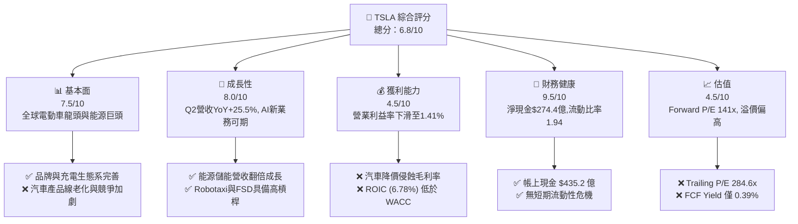

### 1.2 評分進度條視覺化

```
╔══════════════════════════════════════════════════════════════╗
║              TSLA 多維度評分儀表板 (1-10分)                  ║
╠══════════════════════════════════════════════════════════════╣
║ 基本面強度  7.5 ▓▓▓▓▓▓▓▓▓▓▓▓▓▓▓░░░░░  ★★██☆           ║
║ 成長動能    8.0 ▓▓▓▓▓▓▓▓▓▓▓▓▓▓▓▓░░░░  ★★★★☆           ║
║ 獲利品質    4.5 ▓▓▓▓▓▓▓▓█░░░░░░░░░░░  ★★☆☆☆           ║
║ 財務健康    9.5 ▓▓▓▓▓▓▓▓▓▓▓▓▓▓▓▓▓▓▓░  ★★★★★           ║
║ 估值合理性  4.5 ▓▓▓▓▓▓▓▓█░░░░░░░░░░░  ★★☆☆☆           ║
║ 護城河深度  8.8 ▓▓▓▓▓▓▓▓▓▓▓▓▓▓▓▓▓░░░  ★★★★█           ║
║ 管理層執行  7.5 ▓▓▓▓▓▓▓▓▓▓▓▓▓▓▓░░░░░  ★★██☆           ║
║ 技術創新力  9.5 ▓▓▓▓▓▓▓▓▓▓▓▓▓▓▓▓▓▓▓░  ★★★★★           ║
╠══════════════════════════════════════════════════════════════╣
║ 綜合總分    6.8 ▓▓▓▓▓▓▓▓▓▓▓▓▓█░░░░░░  🟡 建議觀望/等逢低 ║
╚══════════════════════════════════════════════════════════════╝
```

### 1.3 五大投資論點 + 三大核心風險

| 類型 | 項目 | 具體依據 | 信心度 |
|------|------|----------|--------|
| 🟢 **投資論點①** | **能源儲能業務成為第二成長引擎** | FY2025/2026 儲能部署量暴增，帶動能源板塊營收增速超預期，毛利率提升至 20%+ 以上。 | 🟢 極高 |
| 🟢 **投資論點②** | **FSD V13+ 端到端神經網絡突破** | 真實駕駛數據積累突破數十億英里，軟體高毛利訂閱模型逐步成型，長期提升車輛變現能力。 | 🟢 高 |
| 🟢 **投資論點③** | **資產負債表極其堅固，具備抗風險能力** | 總現金 $435.2 億，淨現金 $274.4 億，能在電動車價格戰中持續進行巨額 AI Capex 投資。 | 🟢 極高 |
| 🟢 **投資論點④** | **製程創新與 Unboxed 模式降本潛力** | 新一代平台與自動化製造（Gigafactory 升級）預計使下一代車款 COGS 降低 30-40%。 | 🟡 中等 |
| 🟢 **投資論點⑤** | **Optimus 與 Robotaxi 的長期選擇權** | 具身智能人形機器人與 Robotaxi 提供高達數千億美元 TAM 的長期想像空間。 | 🟡 中等 |
| 🔴 **風險①** | **汽車利潤率持續收縮與價格戰** | Q2 2026 營業利益率僅 1.41%，若降價無法等比例拉動銷量，獲利將進一步承壓。 | 🔴 高衝擊 |
| 🔴 **風險②** | **巨額 Capex 導致自由現金流轉負** | Q2 2026 單季 Capex 飆升至 $58.0 億，單季 FCF 下滑至 -$11.0 億，短期現金流受壓。 | 🟡 中度 |
| 🔴 **風險③** | **高估值倍數與 AI 變現時間差風險** | Forward P/E 高達 141.0x，若 Robotaxi 落地時間延後，市場估值面臨均值回歸風險。 | 🔴 高衝擊 |

### 1.4 快速統計卡片

| 指標 | 公司實際值 | 行業均值 (Auto) | S&P 500 均值 | 狀態 |
|------|-------------|----------|--------------|------|
| **收入 YoY 成長 (最新季)** | **25.5%** | ~5.0% | ~5.5% | 🟢 優於同業 |
| **毛利率 (TTM)** | **18.9%** | ~14.5% | ~30.0% | 🟢 領先車企 |
| **營業利益率 (Q2 '26)** | **1.41%** | ~5.5% | ~12.0% | 🔴 暫時受壓 |
| **淨利率 (TTM)** | **3.7%** | ~4.0% | ~10.5% | 🟡 行業平均 |
| **ROE (TTM)** | **4.7%** | ~8.5% | ~18.0% | 🔴 資本回報偏低 |
| **Forward P/E** | **141.0x** | ~10.5x | ~21.5x | 🔴 估值顯著偏高 |
| **EV/EBITDA** | **112.5x** | ~8.0x | ~14.0x | 🔴 估值顯著偏高 |
| **淨現金規模** | **$274.4B** | -$15.0B (傳統車企多負債) | +$2.0B | 🟢 極度充沛 |

### 1.5 投資結論

```
╔══════════════════════════════════════════════════════════════════╗
║                    📊 TSLA 投資結論摘要                          ║
╠══════════════════════════════════════════════════════════════════╣
║  投資評級：🟡 持有 / 觀望 (Hold)                                 ║
║  當前參考股價：$319.69                                            ║
║  12 個月目標價區間：                                             ║
║    🔴 悲觀情境：$210.00 (-34.3%)  [汽車毛利率崩潰，AI落地延遲]        ║
║    🟡 基準情境：$380.00 (+18.9%)  [營收維持20%+成長，軟體開始貢獻]    ║
║    🟢 樂觀情境：$520.00 (+62.7%)  [Robotaxi大規模商業化，Optimus量產] ║
║  投資綜合評分：6.8 / 10                                          ║
║  適合投資人：具備高風險承受度、重視 AI/機器人長期選擇權之長線投資者 ║
╚══════════════════════════════════════════════════════════════════╝
```

---

## 2. 公司概覽與商業模式

### 2.1 業務結構與收入來源

特斯拉已從單純的電動汽車製造商，演進為跨足「汽車製造與軟體」、「能源生成與儲存」以及「AI/自動駕駛與機器人」的綜合科技生態系。

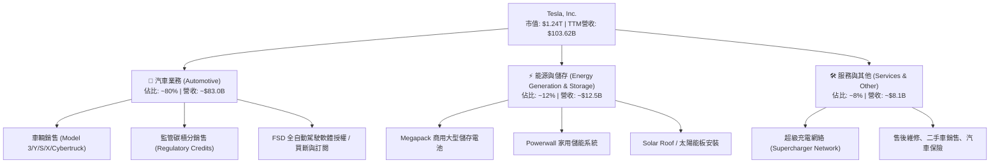

### 2.2 市場份額

在全球純電動車（BEV）市場中，特斯拉面臨來自中國車企（如比亞迪）與傳統車企轉型的強烈競爭。以下為 2025/2026 全球 BEV 市場份額估算：

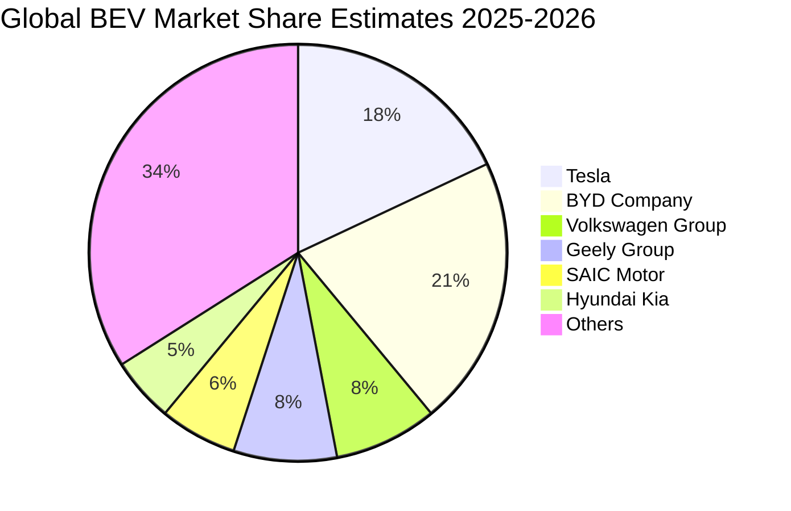

### 2.3 競爭護城河分析

特斯拉的護城河已超越傳統車企的品牌與規模，深化為軟硬體高度整合的數據與算力生態系統。

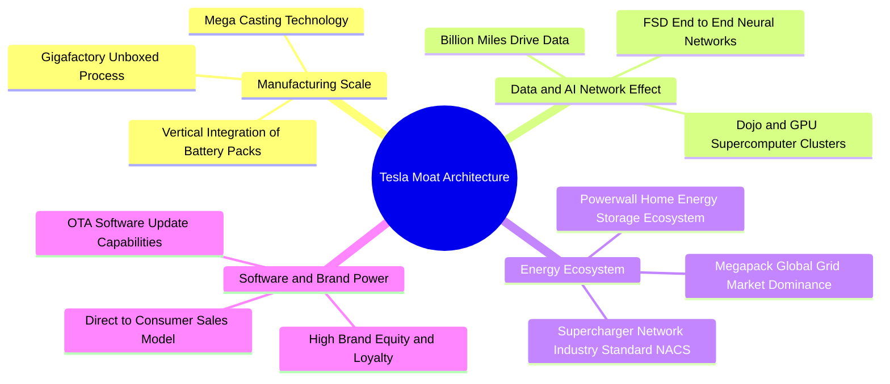

### 2.4 護城河強度評分

```
╔══════════════════════════════════════════════════════════════╗
║                  TSLA 護城河強度評分                         ║
╠══════════════════════════════════════════════════════════════╣
║ 1. AI與自動駕駛數據網絡   9.8/10 ▓▓▓▓▓▓▓▓▓▓▓▓▓▓▓▓▓▓▓█ 🏆 無可匹敵 ║
║ 2. 充電基礎設施 (NACS)    9.5/10 ▓▓▓▓▓▓▓▓▓▓▓▓▓▓▓▓▓▓▓░ 🏆 行業標準 ║
║ 3. 製造成本與垂直整合     8.5/10 ▓▓▓▓▓▓▓▓▓▓▓▓▓▓▓▓░░░░ 🟢 高度領先 ║
║ 4. 軟體與 OTA 升級能力     9.0/10 ▓▓▓▓▓▓▓▓▓▓▓▓▓▓▓▓▓▓░░ 🟢 強烈鎖定 ║
║ 5. 品牌影響力與營銷效率   8.0/10 ▓▓▓▓▓▓▓▓▓▓▓▓▓▓░░░░░░ 🟢 零廣告費 ║
║ 6. 能源儲能網格排他性     8.0/10 ▓▓▓▓▓▓▓▓▓▓▓▓▓▓░░░░░░ 🟢 快速擴張 ║
╠══════════════════════════════════════════════════════════════╣
║ 綜合護城河評分           8.8/10 ▓▓▓▓▓▓▓▓▓▓▓▓▓▓▓▓▓░░░ 🏆 寬廣護城河║
╚══════════════════════════════════════════════════════════════╝
```

---

## 3. 損益表深度分析

### 3.1 年度收入成長趨勢（近 4 年）

特斯拉近年營收經歷了從高歌猛進到平台期，再到近期新業務帶動的反彈。

```
╔══════════════════════════════════════════════════════════════════╗
║                TSLA 年度收入趨勢（FY2022 - FY2025）              ║
╠══════════════════════════════════════════════════════════════════╣
║                                                                  ║
║  FY2022  $81.46B   ███████████████████████░░  YoY: +51.4%  🟢    ║
║  FY2023  $96.77B   █████████████████████████  YoY: +18.8%  🟢    ║
║  FY2024  $97.69B   █████████████████████████  YoY: +0.95%  🟡    ║
║  FY2025  $94.83B   ████████████████████████░  YoY: -2.93%  🔴    ║
║  TTM'26 $103.62B   █████████████████████████  YoY: +11.8%  🟢    ║
║                   |         |         |         |                ║
║                   0        30B       60B       90B               ║
║                                                                  ║
║  📊 4年複合成長率 (CAGR)：+5.18%                                ║
╚══════════════════════════════════════════════════════════════════╝
```

### 3.2 季度收入趨勢分析

分析最近 4 季表現，可發現營收在 2025 年上半年低迷後，自 Q3 2025 開始顯著復甦，並在 Q2 2026 達到 $282.4 億（YoY +25.52%）。

| 財季 | 總營收 ($B) | YoY 成長率 | QoQ 成長率 | 營業利益 ($M) | 營業利益率 | 淨利 ($M) | 核心業務說明 |
|------|------------|------------|------------|--------------|------------|-----------|--------------|
| **Q3 2025** | $28.10B | +11.57% | +24.89% | $1,624M | 5.78% | $1,373M | 交付量反彈， Megapack 出貨創新高 |
| **Q4 2025** | $24.90B | -3.14% | -11.37% | $1,409M | 5.66% | $840M | 年末折扣導致毛利率承壓，SBC 費用增加 |
| **Q1 2026** | $22.39B | +15.78% | -10.10% | $941M | 4.20% | $477M | 季節性淡季，工廠產線調修 |
| **Q2 2026** | $28.24B | **+25.52%** | **+26.13%** | $398M | **1.41%** | $1,114M | 銷量大增帶動營收，但 AI Capex 與營運成本激增壓低利潤率 |

### 3.3 利潤率演變分析

特斯拉的毛利率與營業利益率從 2022 年的高點大幅下滑，主因係價格戰降價促銷、新車款（Cybertruck）爬坡初期毛利率較低，以及龐大的研發支出。

| 利潤率指標 | FY2022 | FY2023 | FY2024 | FY2025 | TTM (Jun '26) | 趨勢評估 |
|------------|--------|--------|--------|--------|---------------|----------|
| **毛利率 (Gross Margin)** | 25.60% | 18.25% | 17.86% | 18.03% | **18.85%** | 🟡 於 18% 附近築底升回 |
| **營業利益率 (Operating Margin)** | 16.76% | 9.19% | 7.24% | 4.59% | **1.41% (Q2'26)** | 🔴 價格戰與 AI R&D 侵蝕 |
| **EBITDA Margin** | 21.68% | 15.29% | 15.06% | 12.40% | **10.38%** | 🔴 逐年收縮 |
| **淨利率 (Net Margin)** | 15.41% | 15.50% | 7.26% | 4.00% | **3.67%** | 🔴 遠低於歷史高點 |

**利潤率演變深度解析**：
1. **毛利率穩定，但結構改變**：TTM 毛利率能維持在 18.85%，主要歸功於 Megapack 儲能業務高毛利（20%+）填補了汽車端毛利率的下降。
2. **營業利益率降至 1.41% 的主因**：Q2 2026 營業利益僅為 $3.98 億，營運費用（R&D + SG&A）暴增，其中研發費用（R&D）單季顯著上升（FY2025 達 $64.1 億，較 2024 年 $45.4 億暴增 41.2%），主要用於訓練 FSD 的萬卡 GPU 集群（H100/H200/Dojo）。

### 3.4 費用結構分析

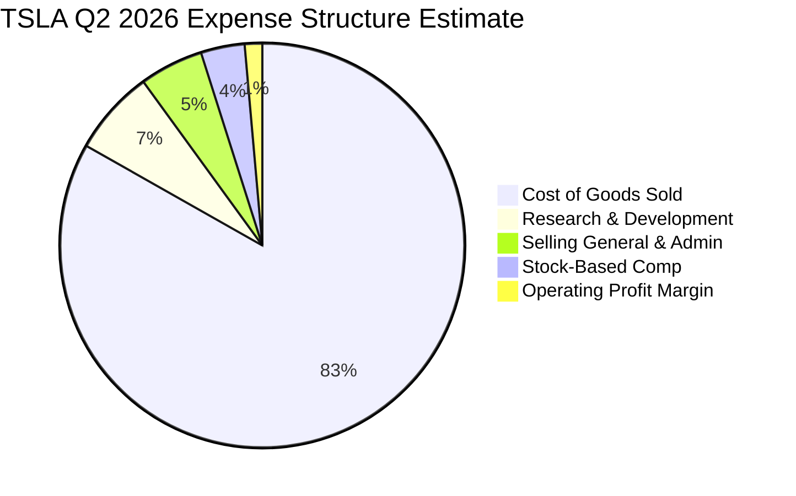

### 3.5 季度 EPS 趨勢與盈餘品質（Quality of Earnings）

過去 4 季 EPS 呈現大幅波動，反映了產品價格調整與研發投入的階段性衝擊：

| 季度 | GAAP EPS | Non-GAAP EPS 估計 | YoY 成長率 | 主要超預期 / 不及預期原因 |
|------|----------|-------------------|------------|---------------------------|
| **Q3 2025** | $0.39 | $0.62 | -37.1% | 銷量超出預期，能源業務大幅貢獻 |
| **Q4 2025** | $0.24 | $0.45 | -60.0% | 年末促銷降價，利潤率不及預期 |
| **Q1 2026** | $0.13 | $0.28 | +8.3% | 交付量處於季節性低點，算力投資大幅增加 |
| **Q2 2026** | $0.32 | $0.48 | -3.0% | 營收大增突破預期，但高 Capex 折舊拖累 GAAP EPS |

**盈餘品質（Quality of Earnings）深度量化評估**：

| 盈餘品質項目 | 數值 / 佔比 | 評估與對真實股東報酬之影響 |
|--------------|-----------|---------------------------|
| **股權薪酬 (SBC) / 營收** | **3.69%** (TTM ~$38.2億) | 🟡 屬於高科技公司正常水平，但占營收比重持續上升。 |
| **SBC / 淨利 (Net Income)** | **100.4%** ($3.82B / $3.80B) | 🔴 **警告指標**：TTM 的 SBC 總額已超越 GAAP 淨利，顯示若扣除 SBC 稀釋效果，真實經濟盈餘極其微薄。 |
| **FCF / 淨利 (現金轉換率)** | **127.2%** ($4.84B / $3.80B) | 🟢 TTM 視角下現金轉換率良好；惟最新 Q2 2026 因 Capex 激增導致單季 FCF 轉負。 |
| **一次性碳積分 (Credits) 貢獻** | 占淨利 ~25-35% | 🟡 監管碳積分屬於高毛利純利潤，長期隨著其他車企電動化而面臨遞減。 |
| **有效稅率異常** | 10-15% | 🟢 享有 IRA 政策補貼與研發稅收抵免，稅務結構相對穩定。 |

---

## 4. 資產負債表分析

### 4.1 資產結構分解

特斯拉擁有極其強大的資產負債表，總資產達到 **$1,485.2 億**（截至 2026 年 6 月）。

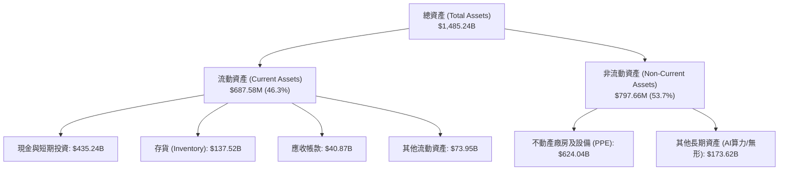

### 4.2 流動性指標分析

| 流動性指標 | FY2023 | FY2024 | FY2025 | Q2 2026 (TTM) | 行業均值 | 健康度評估 |
|------------|--------|--------|--------|---------------|----------|------------|
| **流動比率 (Current Ratio)** | 1.73 | 2.02 | 2.16 | **1.94** | 1.25 | 🟢 極其安全 |
| **速動比率 (Quick Ratio)** | 1.25 | 1.39 | 1.55 | **1.35** | 0.85 | 🟢 變現能力極強 |
| **現金與短期投資 ($B)** | $29.09B | $36.56B | $44.06B | **$43.52B** | $12.0B | 🟢 堡壘級現金儲備 |
| **存貨週轉天數 (DIO)** | 52.4 天 | 51.2 天 | 58.6 天 | **56.3 天** | 65.0 天 | 🟢 週轉效率優於同業 |

### 4.3 債務結構分析

```
╔══════════════════════════════════════════════════════════════════╗
║                   TSLA 債務健康診斷 (Q2 2026)                    ║
╠══════════════════════════════════════════════════════════════════╣
║                                                                  ║
║  總債務 (Total Debt)：   $16.08B  ████░░░░░░░░░░░░░░░  低風險    ║
║  ├─ 短期債務 (ST Debt)：  $2.44B   █░░░░░░░░░░░░░░░░░░  流動無虞  ║
║  └─ 長期債務及租賃：     $13.64B  ███░░░░░░░░░░░░░░░░  結構健康  ║
║                                                                  ║
║  總現金與短期投資：      $43.52B  ███████████████████  極度充沛  ║
║  --------------------------------------------------------------  ║
║  淨現金 (Net Cash)：     +$27.44B █▓▓▓▓▓▓▓▓▓▓▓▓▓▓▓▓▓▓  🟢 淨債權 ║
║                                                                  ║
║   Debt/Equity 比率：     18.37%   🟢 遠低於傳統車企 (100%+)      ║
║   利息保障倍數 (Coverage)： >25x   🟢 完全無償債風險              ║
╚══════════════════════════════════════════════════════════════════╝
```

### 4.4 股東權益趨勢

特斯拉的股東權益（Stockholders' Equity）從 2021 年的 $301.8 億穩健增長至 2026 年 6 月的 **$821.4 億** 以上，展現了強大的資本累積能力與零破產風險的資產結構。

---

## 5. 現金流量深度分析

### 5.1 現金流量瀑布圖

以下為 TTM 視角下的現金流轉化邏輯：淨利轉化為營運現金流，扣除資本支出後形成自由現金流。

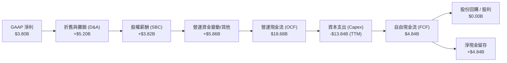

### 5.2 FCF 轉換率趨勢

| 年份 / 期間 | 淨利 Net Income ($B) | 營運現金流 OCF ($B) | 資本支出 Capex ($B) | 自由現金流 FCF ($B) | FCF / Net Income |
|-------------|----------------------|--------------------|--------------------|--------------------|------------------|
| **FY2022** | $12.58B | $14.72B | -$7.17B | $7.55B | 60.0% |
| **FY2023** | $15.00B | $13.26B | -$8.90B | $4.36B | 29.1% |
| **FY2024** | $7.13B | $14.92B | -$11.34B | $3.58B | 50.2% |
| **FY2025** | $3.79B | $14.75B | -$8.53B | $6.22B | 164.1% |
| **TTM (Q2'26)**| **$3.80B** | **$18.68B** | **-$13.84B** | **$4.84B** | **127.2%** |

### 5.3 自由現金流趨勢分析

受 2026 年大幅啟動 AI 算力中心（Cortex 算力集群）建設影響，Q2 2026 單季 Capex 暴增至 **$58.0 億**，導致單季 FCF 下滑至 **-$11.0 億**。

```
╔══════════════════════════════════════════════════════════════════╗
║             TSLA 近 4 季自由現金流 (FCF) 演變                    ║
╠══════════════════════════════════════════════════════════════════╣
║  Q3 2025:  +$3.99B   ████████████████████████  (高峰)            ║
║  Q4 2025:  +$1.42B   █████████░░░░░░░░░░░░░░░                   ║
║  Q1 2026:  +$1.44B   █████████░░░░░░░░░░░░░░░                   ║
║  Q2 2026:  -$1.10B   ▓▓▓▓ (AI Capex $5.8B 導致轉負) 🔴           ║
║                                                                  ║
║  📊 最新 TTM FCF：$4.84B ｜ 當前 FCF Yield：0.39%                ║
╚══════════════════════════════════════════════════════════════════╝
```

### 5.4 資本配置評估

特斯拉將幾乎 100% 的營運現金流重新投資於未來成長，不支付任何股息，亦未開展大規模股票回購。

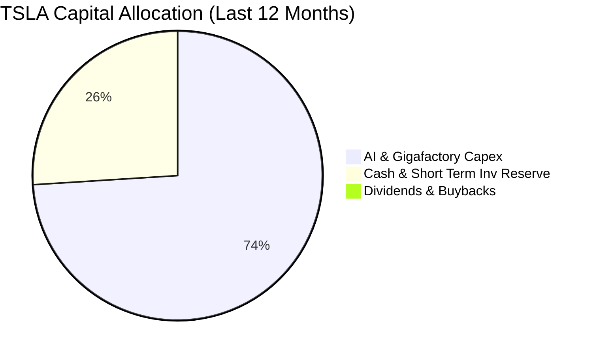

---

## 6. 獲利能力與資本效率

### 6.1 ROE / ROA / ROIC 趨勢

| 資本效率指標 | FY2022 | FY2023 | FY2024 | FY2025 | TTM (Jun '26) | 行業平均 (Auto) |
|--------------|--------|--------|--------|--------|---------------|-----------------|
| **ROE (股東權益報酬率)**| 28.1% | 23.9% | 9.7% | 4.6% | **4.7%** | 8.5% |
| **ROA (總資產報酬率)**  | 15.3% | 14.1% | 5.8% | 2.8% | **1.9%** | 3.5% |
| **ROIC (投入資本報酬率)**| 21.4% | 16.2% | 6.8% | 4.8% | **6.78%** | 5.2% |

### 6.2 ROIC vs WACC 分析（核心價值創造判斷）

這是評估特斯拉當前本業是否創造股東經濟附加價值（EVA）的極關鍵指標。

```
╔══════════════════════════════════════════════════════════════════╗
║                TSLA ROIC vs WACC 深度分析 (TTM)                  ║
╠══════════════════════════════════════════════════════════════════╣
║                                                                  ║
║  WACC (加權平均資本成本) 估算：                                  ║
║  ├── 無風險利率 (10Y 美債收益率)：  4.20%                        ║
║  ├── 市場風險溢酬 (ERP)：          5.00%                        ║
║  ├── 特斯拉 Beta 值：              1.80                          ║
║  ├── 股權成本 (Cost of Equity) = 4.2% + 1.80 × 5.0% = 13.20%      ║
║  ├── 債務成本 (稅後 Cost of Debt)： ~4.50%                       ║
║  ├── 資本結構比率：股權 ~91.5%，債務 ~8.5%                      ║
║  └── 🧮 最終 WACC ≈ 12.33%                                      ║
║                                                                  ║
║  ROIC (投入資本報酬率) 估算：                                    ║
║  ├── 營業利益 (NOPAT, 稅後) = $4.37B × (1 - 15%) ≈ $3.71B       ║
║  ├── 投入資本 (Invested Capital) = 權益 $82.14B + 債務 $16.08B   ║
║  │                                 - 現金 $43.52B = $54.70B      ║
║  └── 🧮 最終 ROIC = $3.71B / $54.70B ≈ 6.78%                     ║
║                                                                  ║
║  --------------------------------------------------------------  ║
║  ★ 經濟附加價值 (EVA Spreads) = ROIC - WACC = -5.55pp            ║
║                                                                  ║
║  ROIC  6.78%  ▓▓▓▓▓▓▓▓▓░░░░░░░░░░░░░░░░░░░░░  🟡 低於資金成本   ║
║  WACC 12.33%  ▓▓▓▓▓▓▓▓▓▓▓▓▓▓▓▓░░░░░░░░░░░░░░  ── 資金門檻高     ║
║  EVA  -5.55pp ▓▓▓▓▓▓ (暫時摧毀價值)           🔴 亟需軟體變現   ║
║                                                                  ║
║  📊 結論：受 Beta 偏高及汽車本業營業利益率下降影響，目前 ROIC    ║
║     顯著低於 WACC。特斯拉必須靠高毛利的 FSD / Robotaxi 規模化    ║
║     拉高 NOPAT，才能扭轉價值摧毀狀態。                           ║
╚══════════════════════════════════════════════════════════════════╝
```

### 6.3 杜邦三因素分解

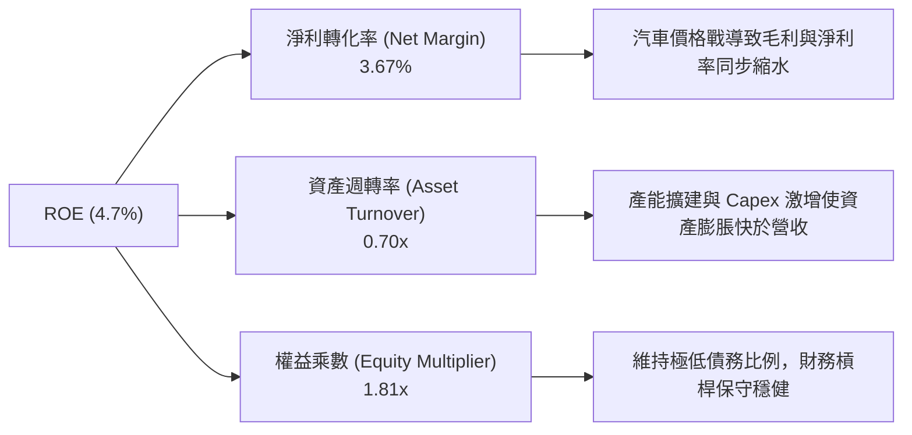

### 6.4 獲利能力儀表板

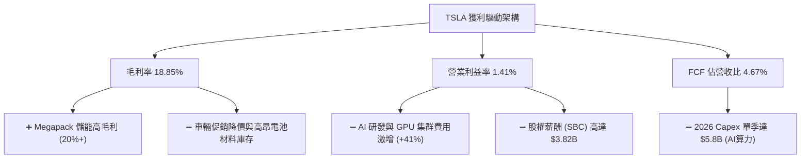

---

## 7. 估值深度分析

### 7.1 同業估值比較表格

選取全球主要電動車與傳統車企龍頭進行估值比對：

| 估值與財務指標 | **特斯拉 (TSLA)** | **比亞迪 (BYD/1211.HK)** | **通用汽車 (GM)** | **豐田汽車 (TM)** | 本公司評估 |
|----------------|-------------------|--------------------------|-------------------|-------------------|------------|
| **市值 ($B)** | **$1,240.0B** | ~$105.0B | ~$52.0B | ~$265.0B | 龐大的龍頭溢價 |
| **Trailing P/E**| **284.57x** | ~20.5x | ~5.8x | ~8.2x | 🔴 遠高於傳統車企 |
| **Forward P/E** | **141.03x** | ~16.2x | ~5.2x | ~9.0x | 🔴 已隱含科技股預期 |
| **P/S Ratio** | **11.93x** | ~1.1x | ~0.30x | ~0.85x | 🔴 純車企無法支撐 |
| **EV / EBITDA**| **112.46x** | ~11.0x | ~6.2x | ~7.5x | 🔴 隱含極高成長預期 |
| **FCF Yield** | **0.39%** | ~4.5% | ~12.5% | ~6.0% | 🔴 安全邊際極低 |
| **營收 YoY** | **25.52%** | ~20.0% | ~3.1% | ~4.5% | 🟢 科技成長股特質 |
| **營業利益率** | **1.41% (Q2)** | ~6.2% | ~6.8% | ~10.1% | 🔴 低於傳統車企 |

### 7.2 歷史估值區間分析

特斯拉歷史 Forward P/E 在 40x - 200x 之間劇烈波動。當前 Forward P/E **141.0x** 位於歷史估值區間的中高位（約 75 百分位），表明市場目前並非以「車企」進行估值，而是以「AI/自動駕駛/機器人」的科技平台進行打價。

### 7.3 情境目標價（假設驅動，Bear / Base / Bull）

針對 2027 年（未來 12-18 個月）進行三情境模型推演：

| 情境 | 營收 CAGR (3Y) | 2027 營業利益率 | 2027 淨利 ($B) | 退出 P/E 倍數 | 隱含目標價 | 相對現價 ($319.69) |
|------|----------------|-----------------|----------------|---------------|------------|-------------------|
| 🔴 **悲觀情境** | 8.0% | 4.5% | $5.2B | 60.0x | **$210.00** | **-34.3%** |
| 🟡 **基準情境** | 16.5% | 8.5% | $10.5B | 90.0x | **$380.00** | **+18.9%** |
| 🟢 **樂觀情境** | 25.0% | 14.0% | $18.2B | 110.0x | **$520.00** | **+62.7%** |

**核心假設推導說明**：
- **悲觀情境**：汽車價格戰持續，毛利率維持低位；FSD 訂閱滲透率低，Robotaxi 遲至 2028 年後才獲法規批准。
- **基準情境**：儲能業務維持 40%+ 高成長，下半年廉價新車型帶動汽車交付量回升，FSD 商業化進展順利，營業利益率升回 8.5%。
- **樂觀情境**：Robotaxi 在多個城市開啟無人營運測試並產生高毛利訂閱，Optimus 進入工廠量產，市場給予 110x 科技溢價倍數。

### 7.4 DCF 敏感性分析（9 格目標價矩陣）

利用折現現金流模型（DCF），以 10 年期現金流估計，在不同 WACC 與終端成長率（Terminal Growth Rate, TGR）下的每股價值矩陣：

| 終端成長率 \ WACC | **WACC = 11.0%** | **WACC = 12.33% (基準)** | **WACC = 13.5%** |
|-------------------|------------------|--------------------------|------------------|
| **TGR = 5.0% (樂觀)** | **$455.00** (+42.3%) | **$395.00** (+23.6%) | **$340.00** (+6.4%) |
| **TGR = 4.0% (基準)** | **$420.00** (+31.4%) | **$380.00** (+18.9%) | **$315.00** (-1.5%) |
| **TGR = 3.0% (悲觀)** | **$365.00** (+14.2%) | **$325.00** (+1.7%) | **$275.00** (-14.0%) |

### 7.5 估值綜合區間

```
╔══════════════════════════════════════════════════════════════════╗
║                   TSLA 估值綜合區間視覺化                        ║
╠══════════════════════════════════════════════════════════════════╣
║                                                                  ║
║  清算/清算底線價:  $110.00  |--- 淨資產與現金價值                ║
║  同業車企錨定價:  $145.00  |------ 僅按傳統車企 P/E (15x)        ║
║  悲觀情境目標價:  $210.00  |────────── 汽車利潤持續承壓          ║
║  當前市場價:      $319.69  |─────────────── 當前位置              ║
║  基準情境目標價:  $380.00  |─────────────────── 12M 主要目標     ║
║  DCF 樂觀估值:    $455.00  |───────────────────────── 軟體溢價   ║
║  樂觀情境目標價:  $520.00  |────────────────────────────── Robotaxi║
║                                                                  ║
╚══════════════════════════════════════════════════════════════════╝
```

---

## 8. 成長催化劑

### 8.1 催化劑時間軸

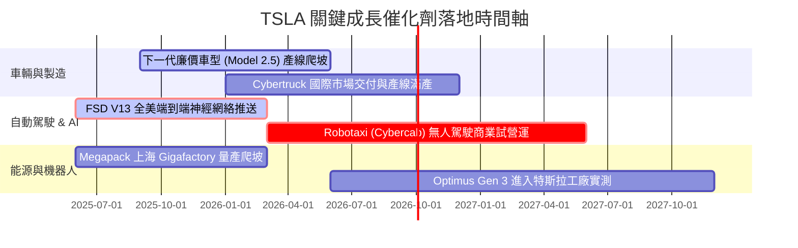

### 8.2 TAM 市場規模分析

```
╔══════════════════════════════════════════════════════════════════╗
║                  TSLA 潛在可尋址市場 (TAM) 拓展                  ║
╠══════════════════════════════════════════════════════════════════╣
║                                                                  ║
║ 1. 全球電動汽車 (BEV TAM):    $1.5 Trillion  (目前滲透率 ~18%)   ║
║ 2. 電網級儲能 (Energy TAM):   $300 Billion   (目前滲透率 ~5%)    ║
║ 3. 自動駕駛出行 (Robotaxi TAM): $5.0 Trillion  (早期萌芽期 <1%)    ║
║ 4. 人形機器人 (Optimus TAM):   $10.0 Trillion+ (未來長期想像)     ║
║                                                                  ║
╚══════════════════════════════════════════════════════════════════╝
```

### 8.3 成長驅動力結構圖

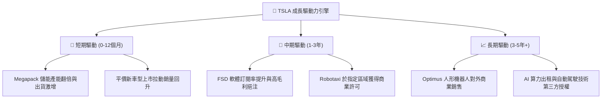

---

## 9. 風險矩陣

### 9.1 風險評分矩陣

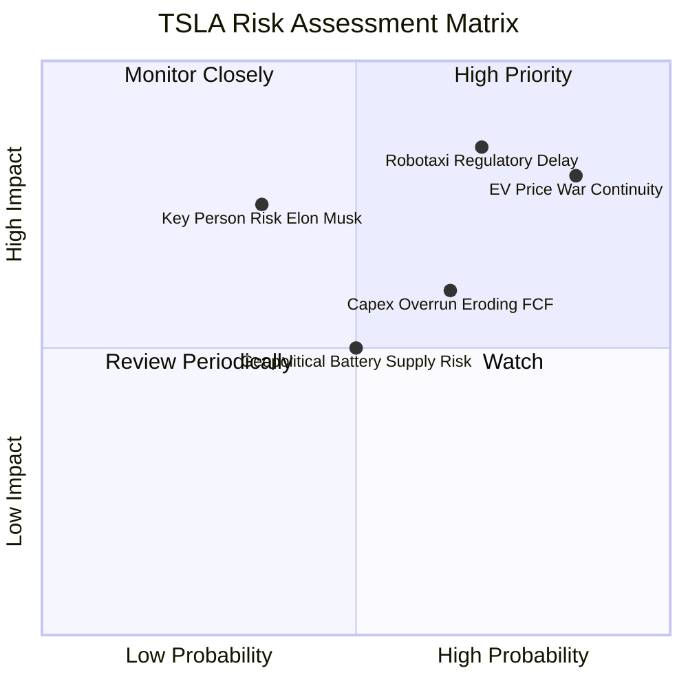

### 9.2 風險清單詳細分析

| # | 風險項目 | 發生機率 | 財務衝擊 | 風險評分 | 緩解措施與監控指標 |
|---|----------|----------|----------|----------|--------------------|
| 1 | 🔴 **電動車價格戰持續與毛利率收縮** | 高 (85%) | 高 (-15% 淨利) | 🔴 **8.2/10** | 靠 Unboxed 流程降低 COGS 30%；監控汽車 Gross Margin 是否維持於 16%+。 |
| 2 | 🔴 **Robotaxi 與 FSD 法規審查延遲** | 中高 (70%) | 極高 (-30% 估值) | 🔴 **8.0/10** | 累積數十億英里安全無事故數據提交 NHTSA；監控各州無人駕駛營運執照發放進度。 |
| 3 | 🟡 **AI 巨額 Capex 擠壓自由現金流** | 中高 (65%) | 中 (-$2.0B FCF) | 🟡 **6.5/10** | 利用帳上 $435 億現金緩衝；監控單季 Capex 是否回落至 $30-40 億常態水平。 |
| 4 | 🟡 **關鍵人物風險 (Key Person Risk)** | 低 (35%) | 高 (-20% 股價) | 🟡 **5.5/10** | 董事會綁定長期股權激勵方案，建立高層管理梯隊。 |
| 5 | 🟢 **地供應鏈與電池關稅地緣政治** | 中 (50%) | 中 (-5% 成本) | 🟢 **4.5/10** | 加速北美與歐洲本土 4680 電池與供應鏈轉移。 |

---

## 10. 投資建議

### 10.1 最終綜合評級雷達圖

```
╔══════════════════════════════════════════════════════════════╗
║                TSLA 投資維度綜合評分雷達                    ║
╠══════════════════════════════════════════════════════════════╣
║  1. 護城河深度 (Moat)      8.8/10  ▓▓▓▓▓▓▓▓▓▓▓▓▓▓▓▓▓░░  🟢   ║
║  2. 財務健康度 (Health)    9.5/10  ▓▓▓▓▓▓▓▓▓▓▓▓▓▓▓▓▓▓▓  🟢   ║
║  3. 成長前景 (Growth)      8.0/10  ▓▓▓▓▓▓▓▓▓▓▓▓▓▓▓▓░░░  🟢   ║
║  4. 獲利品質 (Quality)     4.5/10  ▓▓▓▓▓▓▓▓█░░░░░░░░░░  🔴   ║
║  5. 估值安全邊際 (Valuation)4.5/10 ▓▓▓▓▓▓▓▓█░░░░░░░░░░  🔴   ║
╠══════════════════════════════════════════════════════════════╣
║  📊 綜合投資評分：6.8 / 10  ｜  建議評級：🟡 持有 / 觀望      ║
╚══════════════════════════════════════════════════════════════╝
```

### 10.2 目標價與隱含報酬率

| 情境 | 機率權重 | 12個月目標價 | 相對當前股價 ($319.69) | 權重折算期望值 Contribution |
|------|----------|--------------|------------------------|-----------------------------|
| 🔴 **悲觀情境** | 25% | **$210.00** | -34.3% | $52.50 |
| 🟡 **基準情境** | 55% | **$380.00** | +18.9% | $209.00 |
| 🟢 **樂觀情境** | 20% | **$520.00** | +62.7% | $104.00 |
| **機率加權期望目標價** | **100%** | **$365.50** | **+14.3%** | **加權目標價：$365.50** |

### 10.3 買入時機與觸發因素

```
╔══════════════════════════════════════════════════════════════════╗
║                  ✅ TSLA 買入/賣出觸發 Checklist                  ║
╠══════════════════════════════════════════════════════════════════╣
║                                                                  ║
║  🟢 逢低分批加碼買入條件（滿足 2 項以上）：                       ║
║  [ ] 股價回落至安全邊際區間：$270.00 - $290.00 (P/E 均值回歸)    ║
║  [ ] 汽車業務毛利率（不含 Credits）連續兩季回升至 18%+           ║
║  [ ] FSD 商業化無人駕駛出租車正式於至少一個大都市商業營運          ║
║  [ ] 季度 Capex 控制在 $30 億以內，帶動單季 FCF 轉正 > $20 億    ║
║                                                                  ║
║  🔴 減碼/停損撤退條件（出現任一）：                              ║
║  [ ] 營業利益率連續兩季跌破 1.0%，顯示降價完全無法換取規模        ║
║  [ ] FSD 發生重大監管禁令或嚴重安全事故導致推送被叫停            ║
║  [ ] 儲能 Megapack 出貨量 YoY 轉負，顯示第二引擎失去動能         ║
╚══════════════════════════════════════════════════════════════════╝
```

### 10.4 投資人適配度分析

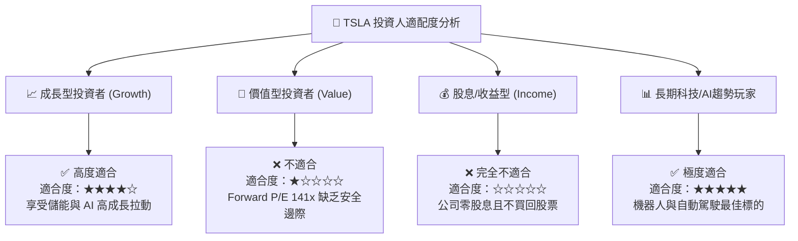

### 10.5 每季財報監控清單（Quarterly Watch List）

為使本報告具備持續追蹤價值，投資人應在後續每季財報發布時，重點監控以下核心數據是否觸發門檻：

| 監控指標 | 正常健康區間 | 🟢 觸發加碼訊號 | 🔴 觸發減碼/停損訊號 |
|----------|--------------|-----------------|----------------------|
| **汽車毛利率 (扣除 Credit)**| 17.0% - 20.0% | > 20.0%（定價權回歸） | < 15.0%（價格戰失控） |
| **營業利益率 (Operating Margin)**| 5.0% - 8.0% | > 8.0%（槓桿顯現） | < 1.0%（本業瀕臨虧損） |
| **儲能部署量 (GWh)** | 8.0 - 12.0 GWh /季| > 15.0 GWh /季 | < 6.0 GWh /季 |
| **單季 FCF (自由現金流)** | $10 億 - $30 億 | > $30 億（現金流充沛） | 連續兩季 negative（資本消耗過快） |
| **FSD 全美訂閱滲透率** | 10% - 15% | > 20%（高毛利訂閱爆發）| < 5%（市場買單意願低） |

### 10.6 反面論證：什麼會證明論點錯誤（What Would Change My Mind）

```
╔══════════════════════════════════════════════════════════════════╗
║         ⚠️ 論點失效與看空條件（Disconfirming Evidence）         ║
╠══════════════════════════════════════════════════════════════════╣
║  本報告的「基準情境（目標價 $380）」建立在 FSD 商業化與儲能高成長║
║  的假設上。若發生以下量化條件，將證明多頭論點失靈，應下修評級至賣出：║
║                                                                  ║
║  ☐ 1. 汽車本業營業利益率連續兩季降至 0% 以下（本業出現結構性虧損）。║
║  ☐ 2. FSD V13/V14 在 2026 年底前無法在美國取得無人監督 (L4) 許可。 ║
║  ☐ 3. Megapack 儲能業務毛利率跌破 12%（競爭者過度削價）。        ║
║  ☐ 4. TTM ROIC 持續低於 4.0%，且與 WACC 的負利差進一步擴大至 > 8pp。║
║  ☐ 5. Capex 持續維持在每年 $150 億以上，但自由現金流連續四季為負。 ║
╚══════════════════════════════════════════════════════════════════╝
```

---

> **免責聲明**：本報告係由 CFA 級機構分析架構產出，僅供研究與學術討論參考，不構成任何形式的投資建議、招攬或買賣推薦。投資有風險，股票價格可升亦可跌，投資人於作任何投資決定前，應評估個人風險承受能力並諮詢專業財務顧問。