# TSLA 基本面深度分析報告

> **報告日期**：2026-07-27 ｜ **語言**：繁體中文 ｜ **數據來源**：Yahoo Finance, Finviz, StockAnalysis, Roic.ai ｜ **分析師**：CFA 級機構研究

---

## 目錄

| # | 章節 | 核心結論 |
|---|------|----------|
| 1 | 執行摘要 | 評級：🟡 **中性（持有）** ｜ 12M 目標價區間：$180.00 – $550.00（基準 $380.00） |
| 2 | 公司概覽與商業模式 | 汽車規模+超級充電網路+FSD AI數據形成三大護城河，正向平台升級演進 |
| 3 | 損益表深度分析 | Q2 2026 營收回升至 $28.24B（YoY +25.5%），但營業利潤率因 AI 重投資與價格戰壓縮至 1.41% |
| 4 | 資產負債表分析 | 淨現金高達 $27.44B，流動比率 1.94，無短期破產與再融資風險 |
| 5 | 現金流量深度分析 | TTM OCF 達 $18.68B，但 Q2 2026 CapEx 暴增至 $5.80B 導致單季 FCF 轉負（-$1.10B） |
| 6 | 獲利能力與資本效率 | TTM ROIC (6.79%) < WACC (13.10%)，EVA 為 -6.31 pp，傳統汽車硬體資產正處於價值摧毀期 |
| 7 | 估值深度分析 | Forward P/E 達 138x，Trailing P/E 278x，估值高度隱含 AI/Robotaxi 溢價 |
| 8 | 成長催化劑 | 短期依賴廉價車型與 Energy 儲能爆發，中長期視乎 FSD V13 無人駕駛與 Optimus 量產 |
| 9 | 風險矩陣 | 汽車毛利率進一步下探、AI 研發燒錢侵蝕現金流與監管對 Robotaxi 的核准延遲為三大核心風險 |
| 10 | 投資建議 | 觀望等候毛利率止跌或 Robotaxi 商業化落地數據；設定可量化停損與論點失效條件 |

---

## 1. 執行摘要

> ⚠️ **證據先於結論**：本報告之評級與目標價，係基於特斯拉（TSLA）當前 **TTM 營收 $103.62B（YoY +25.5%）**、**營業利潤率下滑至 1.41%**、**TTM ROIC (6.79%) 遠低於 WACC (13.10%)**，以及 **TTM 股權薪酬（SBC）$3.80B 佔淨利 $3.80B 之 99.8%** 等關鍵財務事實推導而出。當前 $306.27 之股價（Forward P/E 138x）已高度定價 AI 與 Robotaxi 期權，而硬體端利潤率持續承壓，故給予 **🟡 中性（持有）** 評級。

### 1.0 一頁式投資儀表板（Portfolio Manager 30 秒速讀）

| 項目 | 內容 |
|------|------|
| **投資論點（3 句）** | ① 營收擺脫 FY25 衰退，Q2 2026 營收達 $28.24B（YoY +25.5%），受惠於交車量回溫與 Energy 儲能業務高增長。<br/>② 硬體獲利大幅承壓，Q2 2026 營業利潤率跌至 1.41%，主因降價促銷與單季 $5.80B 之巨額 AI 資本支出。<br/>③ 估值完全由 AI 期權支撐（Forward P/E 138x），在 ROIC (6.79%) < WACC (13.10%) 情況下，短期缺乏獲利上修動能，但 $27.44B 淨現金提供極高安全墊。 |
| **護城河評分** | **8.2 / 10**（規模效應、超級充電網路與自研 AI 垂直整合） |
| **管理層/資本配置評分** | **7.5 / 10**（資本配置極度激進投向 AI Compute，短期犧牲 FCF） |
| **財務健康** | 🟢 **極度健全**（淨現金 $27.44B，現金及短期投資 $43.52B，債務比 18.37%） |
| **ROIC vs WACC** | **6.79% vs 13.10%**（EVA -6.31 pp，當前資本投入回報低於資金成本，正在摧毀帳面股東價值） |
| **FCF 趨勢** | 方向：**短期轉負**（Q2 2026 FCF -$1.10B）｜ 最新 TTM FCF Yield：**0.40%** |
| **估值** | Forward P/E **137.98x** ｜ EV/EBITDA **112.46x** ｜ FCF Yield **0.40%** |
| **預期報酬（基準情境 12M）** | **+24.07%**（目標價 $380.00，隱含風險調整後報酬率屬中性） |
| **關鍵風險（前二）** | ① 汽車毛利率進一步收縮跌破 15%<br/>② AI 資本支出無節制擴大導致 FCF 持續淨流出 |
| **評級 + 信心度** | 🟡 **中性 / 持有** ｜ 信心度：**中（Medium）** |

### 1.1 核心評分儀表板

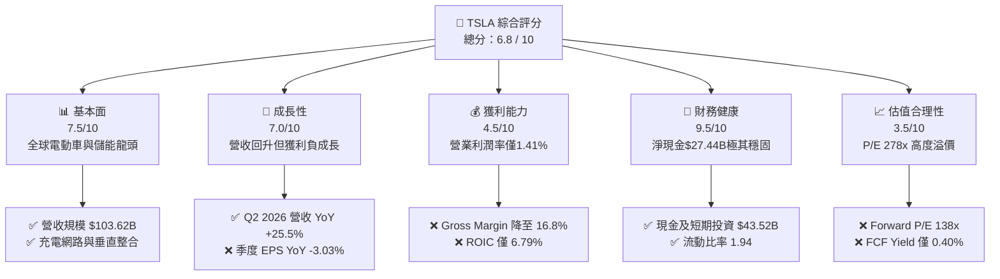

### 1.2 評分進度條視覺化

```
╔══════════════════════════════════════════════════════════════╗
║              TSLA 多維度評分儀表板 (1-10分)                  ║
╠══════════════════════════════════════════════════════════════╣
║ 基本面強度  7.5 ▓▓▓▓▓▓▓▓▓▓▓▓▓▓▓░░░░░░  ★★██☆           ║
║ 成長動能    7.0 ▓▓▓▓▓▓▓▓▓▓▓▓▓▓░░░░░░░  ★★██☆           ║
║ 獲利品質    4.0 ▓▓▓▓▓▓▓▓░░░░░░░░░░░░░  ★★☆☆☆           ║
║ 財務健康    9.5 ▓▓▓▓▓▓▓▓▓▓▓▓▓▓▓▓▓▓▓░  ★★★★★           ║
║ 估值合理性  3.5 ▓▓▓▓▓▓▓░░░░░░░░░░░░░░  ★☆☆☆☆           ║
║ 護城河深度  8.2 ▓▓▓▓▓▓▓▓▓▓▓▓▓▓▓▓░░░░  ★★██☆           ║
║ 管理層執行  7.5 ▓▓▓▓▓▓▓▓▓▓▓▓▓▓▓░░░░░░  ★★██☆           ║
║ 技術創新力  9.5 ▓▓▓▓▓▓▓▓▓▓▓▓▓▓▓▓▓▓▓░  ★★★★★           ║
╠══════════════════════════════════════════════════════════════╣
║ 綜合總分    6.8 ▓▓▓▓▓▓▓▓▓▓▓▓▓░░░░░░░░  🏆 中性/持有    ║
╚══════════════════════════════════════════════════════════════╝
```

### 1.3 五大投資論點 + 三大核心風險

| 類型 | 項目 | 具體依據 | 信心度 |
|------|------|----------|--------|
| 🟢 **投資論點①** | **營收動能彈升** | Q2 2026 營收達 $28.24B（YoY +25.52%），顯著優於 FY25 全年衰退 -2.93% 之表現。 | 🟢 高 |
| 🟢 **投資論點②** | **Energy 儲能業務爆發** | Megapack 與 Powerwall 儲能出貨高增長，營收佔比擴大，毛利率優於汽車業務。 | 🟢 高 |
| 🟢 **投資論點③** | **資產負債表堡壘** | 手握 $43.52B 現金與短投，淨現金 $27.44B，為 AI 算力 CapEx 提供無虞的資金支撐。 | 🟢 極高 |
| 🟢 **投資論點④** | **FSD 與 AI 軟體期權** | 全球百萬艦隊即時蒐集路測數據，FSD V13 算法演進為 Robotaxi 商業化奠定壁壘。 | 🟡 中度 |
| 🟢 **投資論點⑤** | **製造成本長期優勢** | 一體化壓鑄與下一代平台 Unboxed 制程將長期維持高於傳統車企的生產效率。 | 🟢 高 |
| 🟡 **風險①** | **利潤率持續侵蝕** | Q2 2026 營業利潤率滑落至 1.41%，毛利率降至 16.82%，汽車價格戰未見終點。 | 🔴 高衝擊 |
| 🔴 **風險②** | **盈餘品質高度依賴 SBC** | TTM SBC 達 $3.80B，完全抵消 TTM 淨利 $3.804B，實質稀釋股東權益。 | 🔴 高衝擊 |
| 🔴 **風險③** | **CapEx 激增導致 FCF 惡化** | Q2 2026 單季 CapEx 達 $5.80B，導致單季 FCF 轉負 (-$1.10B)，自由現金流收割期延後。 | 🟡 中度 |

### 1.4 快速統計卡片

| 指標 | 公司實際值 (TSLA) | 行業均值 (Auto) | S&P 500 均值 | 狀態 |
|------|-------------|----------|--------------|------|
| **營收 YoY 成長** | **25.52%** (Q2 26) | ~5.2% | ~6.5% | 🟢 優於同業 |
| **毛利率 (Gross Margin)** | **18.85%** (TTM) | ~16.5% | ~45.0% | 🟡 相近 |
| **營業利潤率 (Op Margin)** | **1.41%** (Q2 26) | ~6.0% | ~12.5% | 🔴 遠低於均值 |
| **ROE** | **4.7%** | ~11.0% | ~18.0% | 🔴 處於低點 |
| **Forward P/E** | **137.98x** | ~10.5x | ~21.5x | 🔴 極高溢價 |
| **Net Cash / Debt** | **+$27.44B** | -$15.0B | N/A | 🟢 極其健全 |

### 1.5 投資結論

```
╔══════════════════════════════════════════════════════════════════╗
║                    📊 投資結論摘要                               ║
╠══════════════════════════════════════════════════════════════════╣
║  評級：🟡 持有 / 觀望 (Hold)                                     ║
║  當前股價：$306.27 (2026-07-27)                                  ║
║  目標價區間：                                                    ║
║    悲觀情境：$180.00 (-41.23%)  ← 價格戰加劇，AI 落地大幅延遲   ║
║    基準情境：$380.00 (+24.07%)  ← 12 個月主目標（儲能與車款回溫） ║
║    樂觀情境：$550.00 (+79.58%)  ← Robotaxi 成功取得商業監管核准║
║  綜合評分：6.8 / 10                                              ║
║  適合投資人：風險承受度高、具備 3-5 年長線 AI/智駕信仰之投資者     ║
╚══════════════════════════════════════════════════════════════════╝
```

---

## 2. 公司概覽與商業模式

### 2.1 業務結構與收入來源

特斯拉目前營運分為三大主要板塊：**Automotive（汽車製造與銷售）**、**Energy Generation & Storage（能源生成與儲能）**，以及 **Services & Other（服務及其他）**。

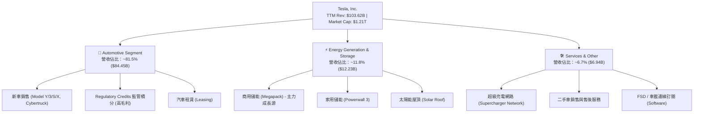

### 2.2 市場份額

特斯拉在全球純電動車（BEV）市場保持領先，但在中國與歐洲市場面臨 BYD（比亞迪）及當地車企的激烈競爭。

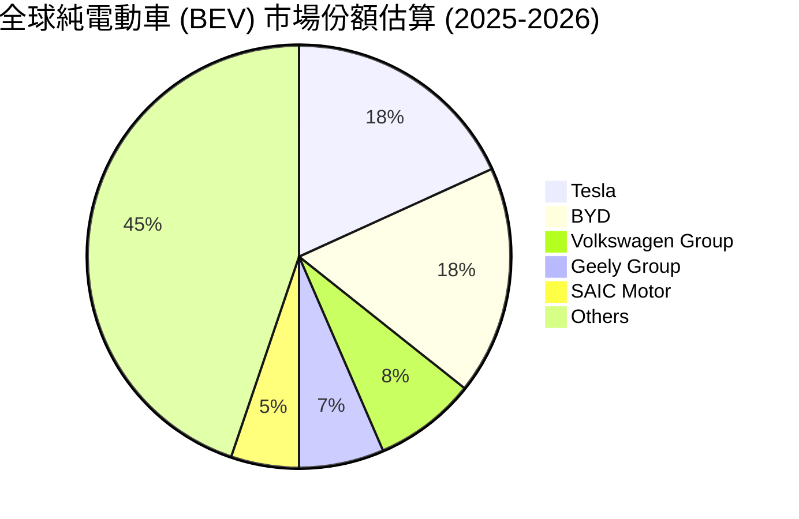

### 2.3 競爭護城河分析

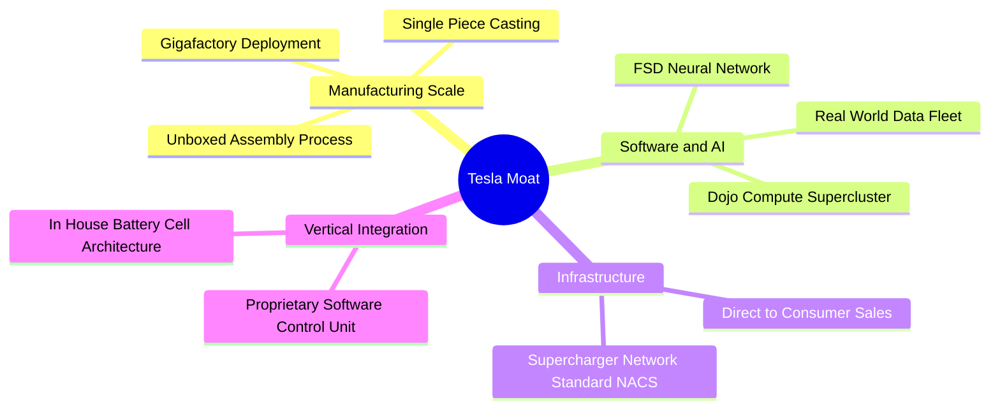

### 2.4 護城河強度評分

```
╔══════════════════════════════════════════════════════════════╗
║                  Tesla 護城河強度評分                        ║
╠══════════════════════════════════════════════════════════════╣
║ 規模效應 (Scale)      8.5/10 ▓▓▓▓▓▓▓▓▓▓▓▓▓▓▓▓▓░░░ 🏆 極強    ║
║ 軟體生態與 AI 數據    9.5/10 ▓▓▓▓▓▓▓▓▓▓▓▓▓▓▓▓▓▓▓░ 🏆 絕對領先 ║
║ 超級充電基礎設施      9.0/10 ▓▓▓▓▓▓▓▓▓▓▓▓▓▓▓▓▓▓░░ 🟢 NACS標杆 ║
║ 品牌與定價權          6.0/10 ▓▓▓▓▓▓▓▓▓▓▓░░░░░░░░░ 🟡 受降價削弱║
║ 垂直整合與供應鏈      8.5/10 ▓▓▓▓▓▓▓▓▓▓▓▓▓▓▓▓▓░░░ 🟢 成本控制優 ║
╠══════════════════════════════════════════════════════════════╣
║ 綜合護城河評分        8.2/10 ▓▓▓▓▓▓▓▓▓▓▓▓▓▓▓▓░░░░ 🏆 寬廣護城河║
╚══════════════════════════════════════════════════════════════╝
```

---

## 3. 損益表深度分析

### 3.1 年度收入成長趨勢（FY22-FY25 & TTM）

特斯拉的年營收在經歷了 2021-2022 年的高速爆發期後，於 FY24-FY25 陷入停滯甚至微幅收縮。然而，最新的 TTM 數據顯示營收已成功回升至 $103.62B 的歷史新高。

```
╔══════════════════════════════════════════════════════════════════╗
║              特斯拉 年度收入趨勢（FY2022 - TTM）                 ║
╠══════════════════════════════════════════════════════════════════╣
║                                                                  ║
║  FY2022  $81.46B   █████████████████████░░░░  YoY: +51.35% 🟢    ║
║  FY2023  $96.77B   █████████████████████████  YoY: +18.80% 🟢    ║
║  FY2024  $97.69B   █████████████████████████  YoY:  +0.95% 🟡    ║
║  FY2025  $94.83B   ████████████████████████░  YoY:  -2.93% 🔴    ║
║  TTM     $103.62B  █████████████████████████  YoY: +11.76% 🟢    ║
║                                                                  ║
║  📊 近 4 年營收複合成長率 (CAGR)：+8.35%                         ║
╚══════════════════════════════════════════════════════════════════╝
```

### 3.2 季度收入趨勢分析

分析近 4 季數據，特斯拉營收在 Q1 2026 觸底（$22.39B）後，於 Q2 2026 出現大幅強彈（$28.24B），YoY 成長率達 **25.52%**，QoQ 增幅達 **26.13%**。這主要得益於新版本 Model 3/Y 出貨回溫、促銷金融方案拉動交車，以及 Energy 板塊營收強勁挹注。

| 財季 | 營收 ($B) | YoY 成長率 | QoQ 成長率 | 營運驅動要因解析 |
|------|-----------|------------|------------|------------------|
| **Q3 2025** | $28.10B | +11.57% | +24.89% | 季末交付大衝刺 + 能源儲能出貨創新高 |
| **Q4 2025** | $24.90B | -3.14% | -11.37% | 淡季影響 + 歐洲補貼退坡導致交付放緩 |
| **Q1 2026** | $22.39B | +15.78% | -10.08% | 工廠改線升級 + 紅海航運供應鏈短暫瓶頸 |
| **Q2 2026** | $28.24B | **+25.52%** | **+26.13%** | 廉價貸款方案刺激交付 + Megapack 產能全開 |

### 3.3 利潤率演變分析

儘管營收於 Q2 2026 大幅回升，利潤率的變化卻揭示了公司當前面臨的嚴峻結構性挑戰：

| 利潤率指標 | FY2022 | FY2023 | FY2024 | FY2025 | Q2 2026 (單季) | 趨勢變化解析 | 評估 |
|------------|--------|--------|--------|--------|----------------|--------------|------|
| **毛利率 (Gross Margin)** | 25.60% | 18.25% | 17.86% | 18.03% | **16.82%** | 全球汽車價格戰持續，降價拉動銷量侵蝕毛利 | 🔴 惡化 |
| **營業利潤率 (Op Margin)** | 16.76% | 9.19% | 7.24% | 4.59% | **1.41%** | 降價 + 研發費用 (R&D) 與 AI 基礎建設激增 | 🔴 重度侵蝕 |
| **淨利率 (Net Margin)** | 15.41% | 15.50% | 7.26% | 4.00% | **3.95%** | 利息收入與稅收安排暫時支撐淨利 | 🟡 承壓 |

**利潤率演變深度解析**：
特斯拉營業利潤率由 FY2022 峰值的 **16.76%** 一路滑落至 Q2 2026 的 **1.41%**（單季營業利潤僅 $398M）。主要驅動因素為：
1. **定價能力下調**：電動車市場競爭赤字化，公司不得不依賴低利息貸款與直接降價維系市占。
2. **研發支出 (R&D) 暴增**：FY25 R&D 費用達 $6.41B（YoY +41.2%），大幅投入 Nvidia H100/H200 晶片採購與自研 AI 算力中心集群。
3. **固定成本未完全釋放**：Cybercab 與 Optimus 仍處於前置投入期，尚未貢獻規模營業利潤。

### 3.4 費用結構分析

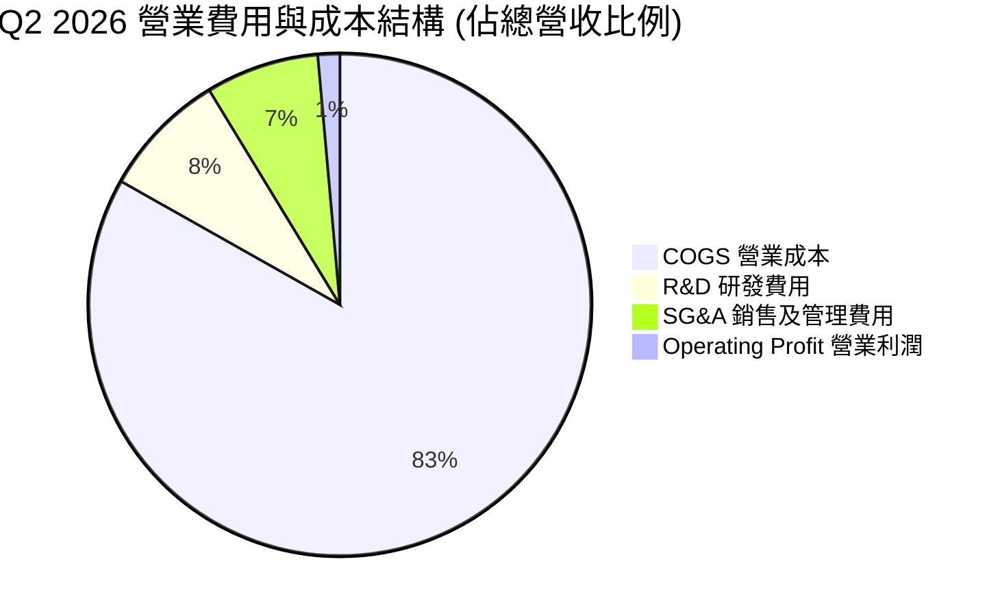

```
╔══════════════════════════════════════════════════════════════════╗
║              TSLA TTM 費用結構分解 (單位: $B)                    ║
╠══════════════════════════════════════════════════════════════════╣
║                                                                  ║
║  總營收：        $103.62B  ████████████████████████████████  100.0%║
║  營業成本 (COGS): $84.09B  ███████████████████████████░░░░░   81.1%║
║  研發費用 (R&D) : $7.15B   ██░░░░░░░░░░░░░░░░░░░░░░░░░░░░░░    6.9%║
║  銷售管理 (SG&A): $8.01B   ██░░░░░░░░░░░░░░░░░░░░░░░░░░░░░░    7.7%║
║  營業利潤 (Op Inc):$4.37B  █░░░░░░░░░░░░░░░░░░░░░░░░░░░░░░░    4.2%║
║                                                                  ║
╚══════════════════════════════════════════════════════════════════╝
```

### 3.5 季度 EPS 趨勢與盈餘品質（Quality of Earnings）

特斯拉過去 4 季 EPS 表現呈波段起伏。然而，機構法人分析更須著眼於獲利的「含金量」。

| 盈餘品質評估項目 | 具體數值 / 佔比 | 評估與實質影響 |
|------------------|-----------------|----------------|
| **股權薪酬 (SBC) / 營收** | **3.66%** ($3.80B / $103.62B) | 🟡 處於高檔，對現有股東帶來股本稀釋壓力 |
| **SBC / TTM 淨利** | **99.82%** ($3.797B / $3.804B) | 🔴 **極警訊**：GAAP 淨利幾乎完全建立在非現金 SBC 的折回基礎上 |
| **FCF / Net Income (現金轉換率)** | **127.23%** ($4.84B / $3.804B) | 🟢 營運現金流依然健康，能真實轉換為 FCF |
| **Regulatory Credits 監管積分貢獻** | TTM 約 $2.10B (占淨利 >50%) | 🔴 屬非核心硬體利潤，隨同業 EV 轉型將逐步歸零 |
| **資本化支出 vs 費用化** | 高額 CapEx 投入 Property, Plant & Equipment | 🟡 未來數年折舊費用 (D&A) 將持續壓抑營業利潤率 |

**盈餘品質深度結論**：
特斯拉 TTM GAAP 淨利 $3.804B 的「真實經濟盈餘」品質偏弱。扣除監管積分（Regulatory Credits）及非現金 SBC 稀釋後，純汽車硬體業務獲利接近盈虧平衡。市場給予的昂貴估值完全是基於未來軟體與 AI 的自由現金流折現，而非當前的損益表表現。

---

## 4. 資產負債表分析

### 4.1 資產結構分解

截至 2026 年 6 月 30 日（Q2 2026），特斯拉總資產擴張至 **$148.52B**，資產結構展現出高度的流動性與強勁的資本累積。

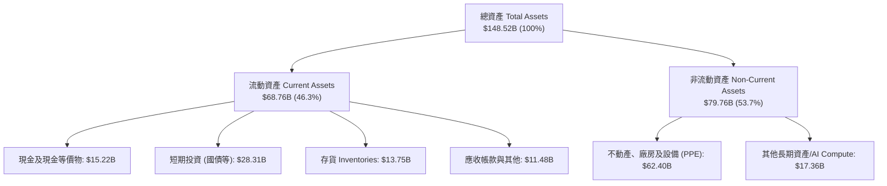

### 4.2 流動性指標分析

特斯拉保持著科技巨頭級別的短期償債安全性，絕對不存在流動性違約風險。

| 流動性指標 | FY2023 | FY2024 | FY2025 | Q2 2026 | 行業平均 | 評估 |
|------------|--------|--------|--------|---------|----------|------|
| **流動比率 (Current Ratio)** | 1.73 | 2.02 | 2.16 | **1.94** | ~1.25 | 🟢 極其充裕 |
| **速動比率 (Quick Ratio)** | 1.25 | 1.48 | 1.58 | **1.35** | ~0.85 | 🟢 資產高度變現性 |
| **現金及短投總額 ($B)** | $29.09B | $36.56B | $44.06B | **$43.52B** | N/A | 🟢 充沛戰略準備金 |

### 4.3 債務結構分析與健康診斷

```
╔══════════════════════════════════════════════════════════════════╗
║                    特斯拉 債務健康診斷                           ║
╠══════════════════════════════════════════════════════════════════╣
║                                                                  ║
║  短期債務 (ST Debt):          $2.44B   ██░░░░░░░░░░░░  無償債壓力║
║  長期借款 (LT Borrowings):     $7.72B   ████░░░░░░░░░░  結構穩定  ║
║  長期融資租賃 (LT Leases):     $5.92B   ███░░░░░░░░░░░  廠房租約  ║
║  ─────────────────────────────────────────────────────────────  ║
║  總債務 (Total Debt):         $16.08B  ███████░░░░░░░            ║
║  總現金與短投 (Cash & ST):    $43.52B  ████████████████████████  ║
║  ✅ 淨現金 (Net Cash):        $27.44B  🟢 零淨負債堡壘           ║
║                                                                  ║
║  Debt / Equity 比率:          18.37%   🟢 極低槓桿                ║
║  Interest Coverage Ratio:     >30.0x   🟢 無利息支出風險          ║
║                                                                  ║
║  📊 診斷結論：槓桿極低，淨現金充沛，可承受極端資產負債表壓力測試 ║
╚══════════════════════════════════════════════════════════════════╝
```

### 4.4 股東權益趨勢

隨著保留盈餘積累與 SBC 的資本化，特斯拉的股東權益（Stockholders' Equity）展現持續上升趨勢，由 FY2022 的 $44.70B 增長至 2026 年年中的 **$82.14B**，每股淨資產（BVPS）約為 **$20.80**，相較當前 $306.27 股價，P/B 比率約為 **13.99x**。

---

## 5. 現金流量深度分析

### 5.1 現金流量瀑布圖（TTM）

從營業現金流到最終資本分配的資金流向圖：

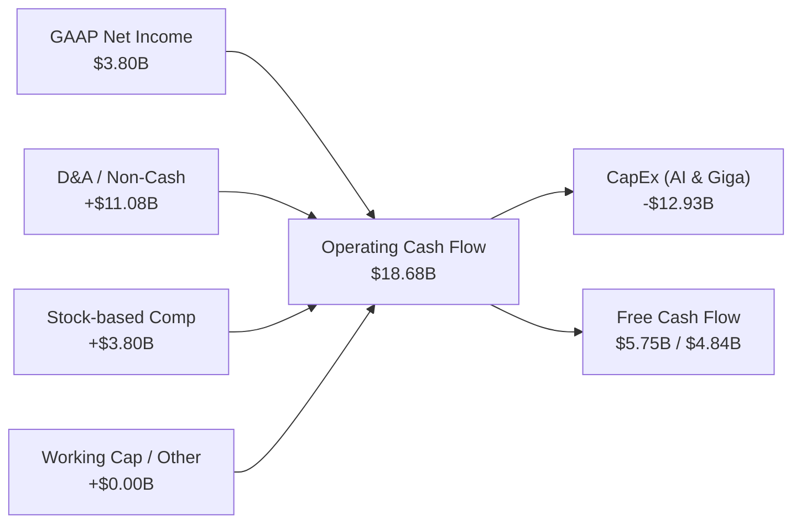

### 5.2 FCF 轉換率與季度變化

過去 4 季特斯拉自由現金流（FCF）出現顯著波動，Q2 2026 資本支出（CapEx）單季急升至 **$5.80B**（主因購買 AI 算力伺服器與建置 Dojo），直接導致單季 FCF 轉負（**-$1.10B**）。

| 財季 | 營業現金流 OCF ($B) | 資本支出 CapEx ($B) | 自由現金流 FCF ($B) | FCF 淨利轉換率 |
|------|---------------------|---------------------|---------------------|----------------|
| **Q3 2025** | $6.24B | -$2.25B | **+$3.99B** | 290.6% |
| **Q4 2025** | $3.81B | -$2.39B | **+$1.42B** | 169.0% |
| **Q1 2026** | $3.94B | -$2.49B | **+$1.44B** | 301.9% |
| **Q2 2026** | $4.70B | **-$5.80B** | **-$1.10B** | -98.7% (轉負) |
| **TTM 累計**| **$18.68B** | **-$12.93B** | **+$5.75B / $4.84B**| **~127.2%** |

### 5.3 自由現金流歷史趨勢

```
╔══════════════════════════════════════════════════════════════════╗
║              特斯拉 歷史 FCF 趨勢 ($B) & 收益率                   ║
╠══════════════════════════════════════════════════════════════════╣
║                                                                  ║
║  FY2022  $7.55B   █████████████████████████  FCF Yield: 0.85%   ║
║  FY2023  $4.36B   ██████████████░░░░░░░░░░░  FCF Yield: 0.50%   ║
║  FY2024  $3.58B   ████████████░░░░░░░░░░░░░  FCF Yield: 0.35%   ║
║  FY2025  $6.22B   ████████████████████░░░░░  FCF Yield: 0.55%   ║
║  TTM     $4.84B   ████████████████░░░░░░░░░  FCF Yield: 0.40% 🔴║
║                                                                  ║
║  📊 評估：當前僅 0.40% 之 FCF Yield，隱含市場對未來 FCF 爆炸性   ║
║      增長寄予極高的再投資回報期待。                              ║
╚══════════════════════════════════════════════════════════════════╝
```

### 5.4 資本配置評估

特斯拉歷史上不發放股息（Dividend Yield 0.0%），且極少進行庫藏股回購。所有營運現金流與留存盈餘均 100% 重投資於生產設施擴建與 AI 基礎建設。

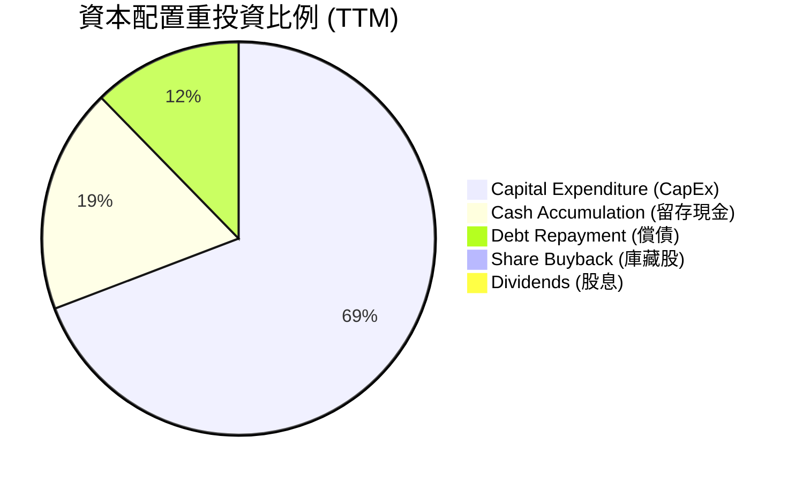

---

## 6. 獲利能力與資本效率

### 6.1 ROE / ROA / ROIC 趨勢

特斯拉的資本效率指標自 FY2022 峰值後顯著放緩，當前數值反映出重資產投入（如 Gigafactory 產能擴張與算力建置）尚未完全轉換為相應的經營利潤。

| 資本效率指標 | FY2022 | FY2023 | FY2024 | FY2025 | TTM 當前 | 行業標竿 | 評估 |
|--------------|--------|--------|--------|--------|----------|----------|------|
| **ROE (股東權益報酬率)** | 33.60% | 27.95% | 10.45% | 4.88% | **4.70%** | ~12.0% | 🔴 處於歷史低位 |
| **ROA (總資產報酬率)** | 17.65% | 15.87% | 6.20% | 2.91% | **1.90%** | ~5.0% | 🔴 資產利用效率下降 |
| **ROIC (投入資本報酬率)** | 25.80% | 19.40% | 8.10% | 5.20% | **6.79%** | ~8.0% | 🔴 低於資金成本 |

### 6.2 ROIC vs WACC 分析（核心價值創造判斷）

這是評估特斯拉當前基本面最嚴肅的財務指標：**公司是在創造價值還是在摧毀價值？**

```
╔══════════════════════════════════════════════════════════════════╗
║                TSLA ROIC vs WACC 深度計算分析                    ║
╠══════════════════════════════════════════════════════════════════╣
║                                                                  ║
║  WACC (加權平均資本成本) 估算：                                  ║
║  ├── 無風險利率 (10Y 美債收益率): 4.20%                           ║
║  ├── 股票 Beta 值:              1.802                            ║
║  ├── 市場風險溢酬 (ERP):        5.00%                            ║
║  ├── 股權成本 Cost of Equity = 4.2% + 1.802 × 5.0% = 13.21%     ║
║  ├── 稅後債務成本 Cost of Debt = 5.50% × (1 - 15%) = 4.68%       ║
║  ├── 資本結構: 股權 ~98.7%, 債務 ~1.3%                           ║
║  └── 📐 計算結果 WACC ≈ 13.10%                                   ║
║                                                                  ║
║  ROIC (投入資本回報率) TTM 估算：                                ║
║  ├── NOPAT = $4.372B (營業利潤) × (1 - 15% 實質稅率) = $3.716B   ║
║  ├── Invested Capital = 股東權益$82.14B + 債務$16.08B - 現金$43.52B║
║  ├── 投入資本金額 = $54.70B                                     ║
║  └── 📐 計算結果 ROIC = $3.716B / $54.70B ≈ 6.79%              ║
║                                                                  ║
║  ──────────────────────────────────────────────────────────────  ║
║  ★ 經濟價值增加 (EVA) = ROIC (6.79%) - WACC (13.10%) = -6.31 pp  ║
║                                                                  ║
║  ROIC  6.79%   ▓▓▓▓▓▓▓░░░░░░░░░░░░░░░░░░░░░░░  🔴 投入回報低     ║
║  WACC  13.10%  ▓▓▓▓▓▓▓▓▓▓▓▓▓▓░░░░░░░░░░░░░░░░  ── 高權益成本     ║
║  EVA   -6.31pp ░░░░░░░░░░░░░░░░░░░░░░░░░░░░░░  🔴 當前價值摧毀中 ║
║                                                                  ║
║  📊 結論：受高 Beta (1.802) 推升之資金成本與降價侵蝕利潤影響，   ║
║      特斯拉目前每投入 $100 現金，帳面上正產生 -$6.31 之價值折損。║
║      要反轉此趨勢，必須依賴高毛利的 FSD 軟體與 Robotaxi 服務落地。║
╚══════════════════════════════════════════════════════════════════╝
```

### 6.3 杜邦三因素分解 (DuPont Analysis)

拆解 ROE (4.70%) 的衰退路徑，可清楚看出淨利率收縮是主因：

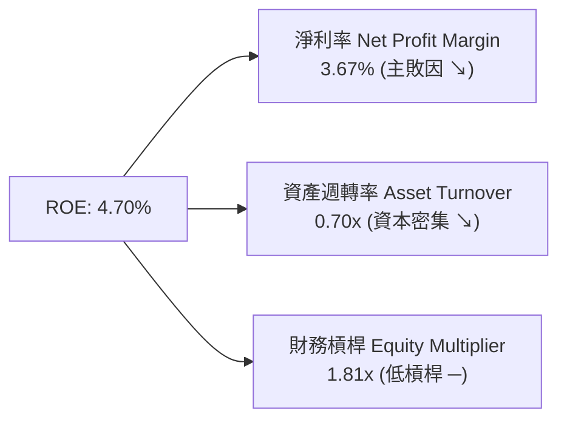

### 6.4 獲利能力驅動因素構造圖

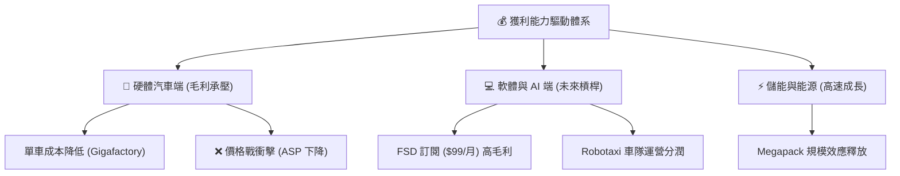

---

## 7. 估值深度分析

### 7.1 同業估值比較表格

特斯拉同時具備「車企」與「AI/科技巨頭」雙重屬性，故選取傳統車企（GM）、電動車龍頭（BYD）及 AI 算力領先者（NVDA）進行交叉比對：

| 估值與財務指標 | **特斯拉 (TSLA)** | **比亞迪 (BYD)** | **通用汽車 (GM)** | **輝達 (NVDA)** | TSLA 評估 |
|----------------|-------------------|------------------|-------------------|-----------------|-----------|
| **Trailing P/E** | **278.43x** | ~21.5x | ~5.8x | ~72.0x | 🔴 遠高於汽車業，高度溢價 |
| **Forward P/E** | **137.98x** | ~17.2x | ~5.2x | ~42.0x | 🔴 隱含市場極高預期 |
| **P/S Ratio** | **11.67x** | ~1.1x | ~0.3x | ~31.0x | 🔴 科技股等級之 P/S |
| **EV / EBITDA** | **112.46x** | ~11.0x | ~4.2x | ~55.0x | 🔴 處於極高區間 |
| **P/B Ratio** | **13.99x** | ~4.2x | ~0.8x | ~50.0x | 🔴 高估值溢價 |
| **營收 YoY 成長** | **25.52%** | ~18.5% | ~3.1% | ~122.0% | 🟢 表現強勁 |
| **營業利潤率** | **1.41%** (Q2) | ~6.8% | ~6.5% | ~62.0% | 🔴 短期低於同行平均 |

### 7.2 歷史估值區間分析

特斯拉過去 5 年的 Forward P/E 中位數約為 65x - 80x。當前 137.98x 的 Forward P/E 已回升至歷史估值區間的上緣（85th 百分位數），意味著當前股價幾乎不包含汽車業務下行的安全邊際，完全由 AI 與智駕故事支撐。

```
╔══════════════════════════════════════════════════════════════════╗
║                TSLA Forward P/E 歷史估值區間                     ║
╠══════════════════════════════════════════════════════════════════╣
║                                                                  ║
║  歷史低點 (Low):     35.0x   █████                               ║
║  歷史中位數 (Median): 75.0x   ███████████                         ║
║  當前位置 (Current): 138.0x  ██████████████████████  ▲ 當前位置  ║
║  歷史高點 (High):    220.0x  ███████████████████████████████     ║
║                                                                  ║
║  📊 估值位置診斷：當前估值處於偏高區間，缺乏盈餘支撐下敏感度高  ║
╚══════════════════════════════════════════════════════════════════╝
```

### 7.3 情境目標價推導（假設驅動模型）

為了讓投資人檢驗目標價之合理性，本報告建立包含營收 CAGR、營業利潤率與退出倍數的透明推導邏輯：

| 情境假設 | 營收 3年 CAGR | 2028E 營業利潤率 | 2028E EPS 預估 | 退出倍數 (P/E) | 12M 隱含目標價 | 相對當前股價報酬率 |
|----------|---------------|------------------|----------------|----------------|----------------|--------------------|
| 🔴 **悲觀情境 (Bear)** | 8.0% | 4.0% | $2.25 | 80.0x | **$180.00** | **-41.23%** |
| 🟡 **基準情境 (Base)** | **18.5%** | **8.5%** | **$4.50** | **84.4x** | **$380.00** | **+24.07%** |
| 🟢 **樂觀情境 (Bull)** | 28.0% | 14.0% | $6.80 | 80.9x | **$550.00** | **+79.58%** |

**假設條件說明**：
- **悲觀情境**：價格戰持續，汽車毛利率維持在 15-16%，FSD 與 Robotaxi 商業化受阻於監管，儲能成長放緩。
- **基準情境**：新世代廉價車型順利投產拉動交車量（營收 CAGR 18.5%），儲能保持 40%+ 成長，FSD 滲透率提高帶動營業利潤率回升至 8.5%。
- **樂觀情境**：Robotaxi 在多個州取得無人駕駛商業運營許可並收費，Optimus 出貨至 Gigafactory 部署，營業利潤率重回 14%。

### 7.4 DCF 敏感性分析（6 格目標價矩陣）

採用兩階段 DCF 模型，假設 2026-2031 年自由現金流複合成長率為 22%，終值成長率 (Terminal Growth Rate) 為 4.0%，針對不同的 WACC 與終值 P/FCF 倍數進行敏感性測試：

| 終值倍數 / WACC | WACC = 12.0% | **WACC = 13.1% (基準)** | WACC = 14.0% |
|-----------------|--------------|-------------------------|--------------|
| **P/FCF = 45x** | $395.00 (+29.0%) | **$350.00** (+14.3%) | $315.00 (+2.9%) |
| **P/FCF = 55x (基準)** | **$435.00** (+42.0%) | **$380.00 (+24.1%)** | **$340.00** (+11.0%) |
| **P/FCF = 65x** | $480.00 (+56.7%) | **$420.00** (+37.1%) | $375.00 (+22.4%) |

### 7.5 估值綜合區間圖

```
╔══════════════════════════════════════════════════════════════════╗
║                     特斯拉 估值區間圖                            ║
╠══════════════════════════════════════════════════════════════════╣
║                                                                  ║
║  悲觀情境底線:  $180.00   |==                                    ║
║  DCF 保守估值:  $315.00   |=======                               ║
║  當前市場股價:  $306.27   |======▲ (當前股價)                    ║
║  12M 基準目標:  $380.00   |───────────★ (基準目標)               ║
║  樂觀期權目標:  $550.00   |───────────────────────────────►     ║
║                                                                  ║
╚══════════════════════════════════════════════════════════════════╝
```

---

## 8. 成長催化劑

### 8.1 催化劑時間軸

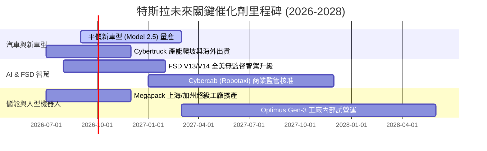

### 8.2 TAM 市場規模分析

特斯拉正在從單一電動車市場，擴展至潛在規模高達數萬億美元的複合 TAM。

```
╔══════════════════════════════════════════════════════════════════╗
║               特斯拉 潛在市場規模 (TAM) 拆解                    ║
╠══════════════════════════════════════════════════════════════════╣
║                                                                  ║
║  1. 全球電動乘用車 (EV TAM):      $1.8 Trillion (滲透率 ~22%)    ║
║  2. 全球商用與定置型儲能 (Energy): $350 Billion  (滲透率 ~8%)     ║
║  3. 自動駕駛出租車 (Robotaxi TAM): $5.0 Trillion  (早期極初段)   ║
║  4. 通用人型機器人 (Optimus TAM):  $10.0 Trillion (藍海期權)     ║
║                                                                  ║
║  📊 結論：Robotaxi 與 Optimus 為長線估值打開極高的想像天花板    ║
╚══════════════════════════════════════════════════════════════════╝
```

### 8.3 成長驅動力結構圖

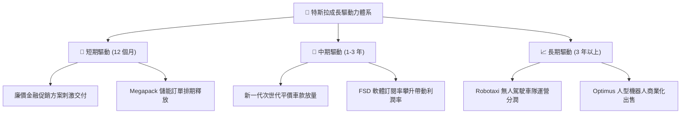

---

## 9. 風險矩陣

### 9.1 風險評分矩陣

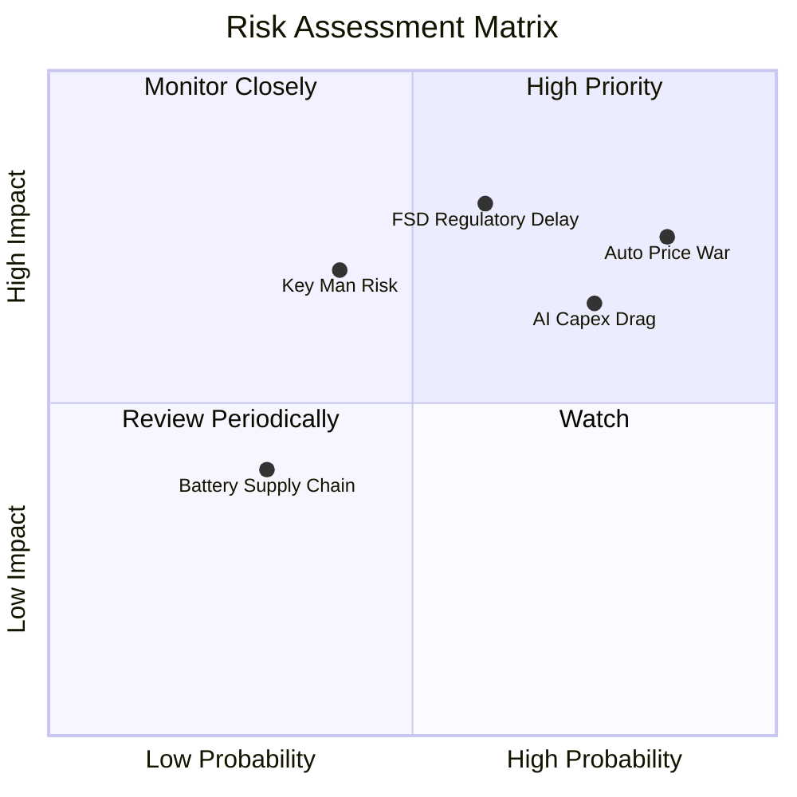

### 9.2 風險清單詳細分析

| # | 風險項目 | 發生機率 | 財務/營運衝擊 | 風險評分 | 具體緩解措施與觀察指標 |
|---|----------|----------|----------------|----------|------------------------|
| 1 | 🔴 **汽車價格戰加劇** | 高 (85%) | 營業利潤率持續低於 3% | 🔴 **8.2 / 10** | 依賴下一代 Unboxed 製程降低 30% 生產成本 |
| 2 | 🔴 **Robotaxi 監管核准延遲** | 中 (60%) | 估值溢價收縮 30-40% | 🔴 **7.8 / 10** | 先行在德州/加州等智駕友善州份積累零事故里程 |
| 3 | 🔴 **AI CapEx 拖累現金流** | 高 (75%) | 自由現金流持續轉負 | 🔴 **7.0 / 10** | $43.52B 充沛現金墊底，必要時可調減採購步調 |
| 4 | 🟡 **關鍵人物風險 (Elon Musk)** | 中 (40%) | 股價短期劇烈波動 | 🟡 **6.5 / 10** | 建立強大的副手管理團隊與高管股權激勵 |
| 5 | 🟢 **電池供應鏈 bottlenecks** | 低 (30%) | 部分車型產能受限 | 🟢 **4.0 / 10** | 多元化採購 CATL/Panasonic 並擴建 4680 自研 |

---

## 10. 投資建議

### 10.1 最終綜合評級雷達圖

```
╔══════════════════════════════════════════════════════════════╗
║                 TSLA 最終綜合評估雷達                       ║
╠══════════════════════════════════════════════════════════════╣
║ 基本面強度 (7.5)   ▓▓▓▓▓▓▓▓▓▓▓▓▓▓▓░░░░░░  🟢 優良            ║
║ 獲利品質   (4.0)   ▓▓▓▓▓▓▓▓░░░░░░░░░░░░░  🔴 偏弱 (高SBC)    ║
║ 資產負債表 (9.5)   ▓▓▓▓▓▓▓▓▓▓▓▓▓▓▓▓▓▓▓░  🏆 堡壘級          ║
║ 資本效率   (3.5)   ▓▓▓▓▓▓▓░░░░░░░░░░░░░░  🔴 ROIC < WACC     ║
║ 估值安全邊際(3.5)  ▓▓▓▓▓▓▓░░░░░░░░░░░░░░  🔴 高溢價          ║
╠══════════════════════════════════════════════════════════════╣
║ 綜合建議 rating：  🟡 中性 / 持有 (Hold)                    ║
╚══════════════════════════════════════════════════════════════╝
```

### 10.2 目標價與隱含報酬率

| 情境 | 隱含目標價 | 相比當前股價 ($306.27) | 機率權重 | 權重後期望值貢獻 |
|------|------------|------------------------|----------|------------------|
| 🔴 **悲觀情境 (Bear)** | $180.00 | -41.23% | 25% | $45.00 |
| 🟡 **基準情境 (Base)** | **$380.00** | **+24.07%** | **55%** | **$209.00** |
| 🟢 **樂觀情境 (Bull)** | $550.00 | +79.58% | 20% | $110.00 |
| **加權平均目標價** | **$364.00** | **+18.85%** | **100%** | **風險調整後期望值** |

### 10.3 買入時機與觸發因素 Checklist

```
╔══════════════════════════════════════════════════════════════════╗
║                  ✅ 買入/加碼觸發因素 Checklist                  ║
╠══════════════════════════════════════════════════════════════════╣
║                                                                  ║
║  立即建倉/加碼觸發條件（需至少滿足兩項）：                       ║
║  ☐ 1. 汽車毛利率 (Gross Margin Ex-Credits) 連續兩季止跌回升 >18%  ║
║  ☐ 2. 股價回檔至 $220 - $240 區域 (Forward P/E 接近歷史中位數)   ║
║  ☐ 3. FSD V13 取得至少一個主要市場無人駕駛 Robotaxi 商業運營許可  ║
║  ☐ 4. 季度自由現金流 (FCF) 在重資本 AI 投入下重新回升至 >$3.0B   ║
║                                                                  ║
║  減碼/停損觸發條件（出現任一即執行）：                           ║
║  ☐ 1. 季度營業利潤率 (Operating Margin) 轉負 (<0.0%)             ║
║  ☐ 2. FSD 發生重大監管禁售或安全召回事件                         ║
║                                                                  ║
╚══════════════════════════════════════════════════════════════════╝
```

### 10.4 投資人適配度分析

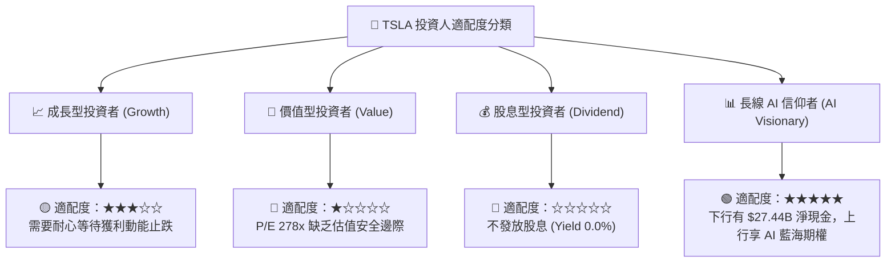

### 10.5 每季財報監控清單（Quarterly Watch List）

於後續各季財報發布時，投資人應建立以下量化指標追蹤機制：

| 監控指標 | 最新數據 (Q2 26) | 多頭加碼門檻 | 空頭減碼門檻 | 指標意義與追蹤目的 |
|----------|------------------|--------------|--------------|--------------------|
| **汽車業務毛利率 (Ex-Credits)**| ~14.6% | > 18.0% | < 12.0% | 判斷價格戰是否結束及定價能力 |
| **單季 CapEx 規模** | $5.80B | < $3.5B (可轉 FC) | > $7.0B (持續燒錢) | 評估 AI 資本支出對現金流的侵蝕 |
| **Energy 儲能出貨量 (GWh)** | ~9.4 GWh | > 15.0 GWh | < 7.0 GWh | 驗證第二成長曲線的補位能力 |
| **SBC / 淨利 比率** | 99.8% | < 40.0% | > 120.0% | 監控真實盈餘品質與股本稀釋度 |
| **FSD 訂閱滲透率 (估計)** | ~12% | > 25% | < 8% | 驗證高毛利軟體營收的轉化進程 |

### 10.6 反面論證：什麼會證明論點錯誤（What Would Change My Mind）

```
╔══════════════════════════════════════════════════════════════════╗
║              ⚠️ 論點失效條件 (Disconfirming Evidence)            ║
╠══════════════════════════════════════════════════════════════════╣
║                                                                  ║
║  本報告之「中性/持有」評級基於「AI 期權可補償硬體利潤微薄」之推論。║
║  若發生下列量化事件，將證明多頭/中性論點失效，需立即轉為看空 (Sell)：║
║                                                                  ║
║  1. 【硬體全面失血】：汽車毛利率（不含監管積分）連續兩季跌破 10%，║
║     表明 Unboxed 製程無法抵消價格降幅，硬體業務陷入結構性虧損。  ║
║                                                                  ║
║  2. 【AI 變現失敗】：至 2027 年底，FSD 無法在任何一國取得 L4 無人 ║
║     駕駛商業運營許可，導致每季數十億美元之算力 CapEx 變成沉沒成本。║
║                                                                  ║
║  3. 【資本效率崩潰】：ROIC 持續低於 4.0%（EVA 負值擴大至 -9 pp）， ║
║     且 TTM 自由現金流轉為持續性負數（每季淨流出 >$2.0B）。        ║
║                                                                  ║
║  4. 【核心市占失守】：特斯拉在全球 BEV 市場之市占率跌破 12%      ║
║     （特別是中國市占跌破 5%），規模效應護城河受瓦解。            ║
║                                                                  ║
╚══════════════════════════════════════════════════════════════════╝
```

---

> **免責聲明**：本報告係基於歷史財務數據與公開市場資訊，運用專業分析模型產出，僅供投資研究與學術討論參考，不構成任何買賣金融商品之暗示或要約。投資人應獨立評估市場風險，並自行承擔最終投資決策之風險。