# TSLA 基本面深度分析報告

> **報告日期**：2026-07-28 ｜ **語言**：繁體中文 ｜ **數據來源**：Yahoo Finance, Finviz, StockAnalysis, Roic.ai ｜ **分析師**：CFA 級機構研究

---

## 目錄

| # | 章節 | 核心結論 |
|---|------|----------|
| 1 | 執行摘要 | 給出中立/觀望（Hold）評級，基準目標價 **$325.00**（隱含 +5.9% 報酬空間），資本密集投入與利潤率壓縮交織 |
| 2 | 公司概覽與商業模式 | 從純電動車（EV）製造商向 AI/自動駕駛/能源生態系轉型，技術與品牌護城河極深但面臨汽車本業價格戰 |
| 3 | 損益表深度分析 | TTM 營收重回千億美元（$103.62B, YoY +11.8%），但營業利益率驟降至 1.4%，SBC 佔淨利 99.8% 顯示盈餘品質顯著承壓 |
| 4 | 資產負債表分析 | 淨現金高達 $27.44B（現金及短投 $43.52B vs 總債務 $16.08B），資產負債表具備極強堡壘防禦力 |
| 5 | 現金流量深度分析 | Q2 2026 單季 Capex 驟升至 $5.80B 導致單季 FCF 轉負（-$1.10B），全額投入 AI 算力與 Robotaxi 基礎建設 |
| 6 | 獲利能力與資本效率 | TTM ROIC 為 2.8%，已低於 WACC（9.8%），EVA 轉負（-7.0pp），顯示汽車業務資本效率暫時進入摧毀價值區間 |
| 7 | 估值深度分析 | Forward P/E 138.0x / EV/EBITDA 111.1x 處於極高估值溢價，市場已提前反映 FSD/Robotaxi 的樂觀變現假設 |
| 8 | 成長催化劑 | Robotaxi 商業化落地、FSD V13+ 授權模式、Optimus 量產進程與 Energy Storage Megapack 產能開出 |
| 9 | 風險矩陣 | 汽車毛利率進一步收縮、FSD 法規審批延護、AI Capex 自由現金流失血、CEO 關鍵人風險 |
| 10 | 投資建議 | 當前估值透支短期基本面，建議等待利潤率築底或 Robotaxi 財務數據明確後再行加碼 |

---

## 1. 執行摘要

根據最新財務數據，Tesla, Inc.（TSLA）當前股價為 **$306.83**，市值達 **$1.21T**。儘管 TTM 營收回升至 **$103.62B**（YoY +11.8%），但受價格打折與全球 EV 競爭加劇影響，TTM 營業利潤率由高峰期的 16%+ 劇烈收縮至 **1.4%**，TTM 淨利僅為 **$3.80B**。此外，公司正處於極度重資本的 AI 轉型期，2026 年 Q2 單季 Capex 飆升至 **$5.80B**（YoY +157.8%），致使單季自由現金流轉負為 **-$1.10B**。

在資本效率方面，TSLA 過去 12 個月的 ROIC 僅為 **2.8%**，相較於公司 WACC **9.8%** 產生了 **-7.0pp** 的負經濟價值增加（EVA），顯示汽車核心業務目前無法覆蓋其資本成本。然而，公司資產負債表極其穩健，持有 **$43.52B** 的現金與短期投資，淨現金達 **$27.44B**，極強的流動性防禦力使其能夠完全以自有資金支應龐大的 AI 與 Robotaxi Capex。

考量其 ** Forward P/E 高達 138.0x** 與 **EV/EBITDA 達 111.1x**，目前股價已高度定價 AI/FSD 的遠期選擇權。基於 **基準情境目標價 $325.00**（隱含報酬率 +5.9%），給予 **🟡 持有/觀望（Hold）** 評級。

### 1.0 一頁式投資儀表板（Portfolio Manager 30 秒速讀）

| 項目 | 內容 |
|------|------|
| **投資論點（3 句）** | ① 汽車業務面臨全球價格戰與產能利用率調整，TTM 營業利潤率滑落至 1.4% 的歷史低點。<br/>② 公司正進行歷史級別的 AI Capex 轉型（Q2 26 Capex $5.80B），資本支出飆升壓抑短期 FCF 表現。<br/>③ $43.52B 龐大現金儲備確保轉型無虞，但 138.0x Forward P/E 極度依賴 FSD/Robotaxi 的高毛利變現兌現。 |
| **護城河評分** | 8.5 / 10（強大 Supercharger 網路、垂直整合與軟硬體閉環數據鏈） |
| **管理層/資本配置評分** | 7.5 / 10（極具前瞻性的 AI/算力部署，但汽車定價策略侵蝕股權回報率） |
| **財務健康** | 🟢 **極強**（淨現金 $27.44B，Current Ratio 1.94x，無短中期償債壓力） |
| **ROIC vs WACC** | **2.8% vs 9.8%**（-7.0pp，短期內處於經濟價值摧毀區間） |
| **FCF 趨勢** | 🔴 **短期惡化**（TTM FCF 為 $4.84B，Q2 26 Capex 浪潮致單季 FCF -$1.10B，FCF Yield僅 0.40%） |
| **估值** | Forward P/E: **138.0x** ｜ EV/EBITDA: **111.1x** ｜ FCF Yield: **0.40%** |
| **預期報酬（基準情境 12M）** | **+5.9%**（目標價 **$325.00**） |
| **關鍵風險（前二）** | ① EV 價格戰持續惡化導致汽車毛利率跌破 15%；② Robotaxi 與 FSD 法規落地延遲。 |
| **評級 + 信心度** | 🟡 **持有（Hold）** ｜ 信心度：**中等（Medium）** |

### 1.1 核心評分儀表板

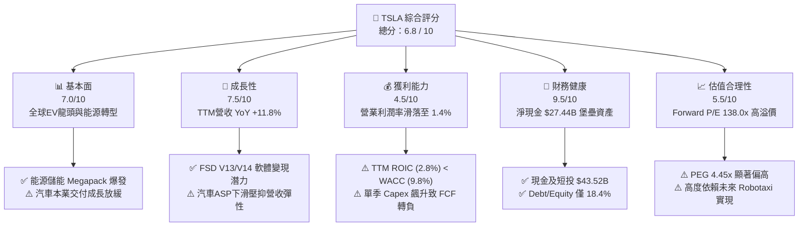

### 1.2 評分進度條視覺化

```
╔══════════════════════════════════════════════════════════════╗
║              TSLA 多維度評分儀表板 (1-10分)                   ║
╠══════════════════════════════════════════════════════════════╣
║ 基本面強度  7.0 ▓▓▓▓▓▓▓▓▓▓▓▓▓▓░░░░░░  ★★★☆☆           ║
║ 成長動能    7.5 ▓▓▓▓▓▓▓▓▓▓▓▓▓▓▓░░░░░  ★★██☆           ║
║ 獲利品質    4.5 ▓▓▓▓▓▓▓▓▓░░░░░░░░░░░  ★★☆☆☆           ║
║ 財務健康    9.5 ▓▓▓▓▓▓▓▓▓▓▓▓▓▓▓▓▓▓▓░  ★★★★★           ║
║ 估值合理性  5.5 ▓▓▓▓▓▓▓▓▓▓▓░░░░░░░░░  ★★1/2☆          ║
║ 護城河深度  8.5 ▓▓▓▓▓▓▓▓▓▓▓▓▓▓▓▓▓░░░  ★★★★☆           ║
║ 管理層執行  7.5 ▓▓▓▓▓▓▓▓▓▓▓▓▓▓▓░░░░░  ★★★★☆           ║
║ 技術創新力  9.5 ▓▓▓▓▓▓▓▓▓▓▓▓▓▓▓▓▓▓▓░  ★★★★★           ║
╠══════════════════════════════════════════════════════════════╣
║ 綜合總分    6.8 ▓▓▓▓▓▓▓▓▓▓▓▓▓▓░░░░░░  🟡 中立觀望      ║
╚══════════════════════════════════════════════════════════════╝
```

### 1.3 五大投資論點 + 三大核心風險

| 類型 | 項目 | 具體依據 | 信心度 |
|------|------|----------|--------|
| 🟢 **論點①** | **AI 算力基礎建設大規模鋪開** | Q2 2026 Capex 達 **$5.80B**，單季投入比去年同期翻倍，集中建置 H100/H200/Dojo 集群以驅動 FSD V13+。 | 🟢 高 |
| 🟢 **論點②** | **能源儲能業務成為第二成長曲線** | Megapack 產能持續擴建，儲能部署量顯著推升 Energy 業務毛利，適逢 AI 數據中心電力需求暴增。 | 🟢 極高 |
| 🟢 **論點③** | **資產負債表提供極佳安全邊際** | 擁有 **$43.52B** 現金與短期投資，淨現金 **$27.44B**，高利率環境下年產生超過 $1.5B 利息收入。 | 🟢 極高 |
| 🟢 **論點④** | **FSD 軟體授權與 Robotaxi 長期潛力** | 若 FSD 無人駕駛許可在主要州別通過，軟體高毛利（>80%）將徹底改變公司資本回報結構。 | 🟡 中度 |
| 🟢 **論點⑤** | **製造製程與 Unboxed 成本創新** | 下一代平價平台（Model 2/Robotaxi）採用 Unboxed 製程，預計降低 Capex 50% 與單車生產成本。 | 🟡 中度 |
| 🔴 **風險①** | **汽車業務利潤率受價格戰壓抑** | TTM 營業利潤率已下滑至 **1.4%**，若全球 EV 供過於求持續，汽車毛利率有進一步下探風險。 | 🔴 高衝擊 |
| 🔴 **風險②** | **Capex 暴增壓抑自由現金流** | Q2 26 單季 FCF 轉負至 **-$1.10B**，若高 Capex 延續且營運現金流成長放緩，FCF Yield 將維持低位。 | 🔴 高衝擊 |
| 🟡 **風險③** | **高估值倍數缺乏當前盈餘支撐** | Forward P/E 達 **138.0x**，若 AI/無人駕駛變現時程延後，估值倍數面臨大幅均值回歸風險。 | 🟡 中度 |

### 1.4 快速統計卡片

| 指標 | TSLA 實際值 | 傳統車企均值 (F, GM, TM) | 科技巨頭均值 (MAG7) | 狀態與評估 |
|------|-------------|-------------------------|--------------------|------------|
| 收入 YoY 成長 (TTM) | **+11.76%** | +2.5% | +14.2% | 🟢 優於車企，略低於 Big Tech |
| 毛利率 (TTM) | **18.9%** | ~14.5% | ~48.0% | 🟡 高於傳統車企，低於科技股 |
| 營業利潤率 (TTM) | **1.4%** | ~5.5% | ~28.5% | 🔴 短期因價格打折與研發費用顯著受壓 |
| ROE (TTM) | **4.7%** | ~12.0% | ~32.0% | 🔴 資本效率暫時下降 |
| Forward P/E | **138.0x** | 6.5x - 8.5x | 28.0x - 35.0x | 🔴 溢價極高，反映 AI 溢價而非車企估值 |
| 淨現金 / (淨債務) | **+$27.44B** | -$80B ~ -$120B | +$30B ~ +$80B | 🟢 堡壘等級，遠優於傳統車企 |

### 1.5 投資結論

```
╔══════════════════════════════════════════════════════════════════╗
║                    📊 TSLA 投資結論摘要                          ║
╠══════════════════════════════════════════════════════════════════╣
║  投資評級：🟡 持有 / 觀望（Hold）                                ║
║  當前股價：$306.83                                               ║
║  目標價區間（12 個月）：                                         ║
║    悲觀情境（Bear）： $180.00 (-41.3%)  ← 車企估值回歸+Capex失血   ║
║    基準情境（Base）： $325.00 (+5.9%)   ← FSD循序推進+能源爆發   ║
║    樂觀情境（Bull）： $480.00 (+56.4%)  ← Robotaxi規模化落地    ║
║  投資評分：6.8 / 10                                              ║
║  適合投資人：具備高風險承受度、看好無人駕駛與 AI 機器人長線投資者 ║
╚══════════════════════════════════════════════════════════════════╝
```

---

## 2. 公司概覽與商業模式

### 2.1 業務結構與收入來源

Tesla 目前正處於從傳統「電動車製造商」轉型為「AI、能源與自動化平台」的交界點。其業務主要劃分為三大板塊：汽車業務（Automotive）、能源生成與儲存（Energy Generation and Storage）、服務與其他（Services and Other）。

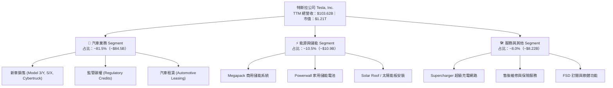

### 2.2 市場份額

在全球純電動車（BEV）領域，特斯拉仍維持領先地位，但面臨中國車企（如比亞迪 BYD）與傳統車企轉型的強烈挑戰。

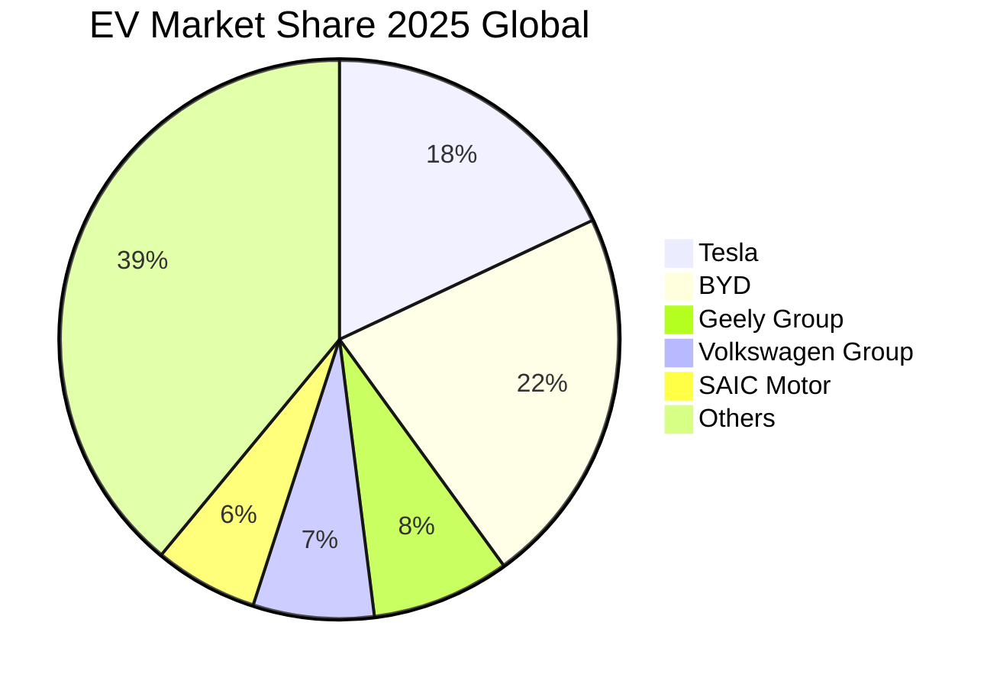

### 2.3 競爭護城河分析

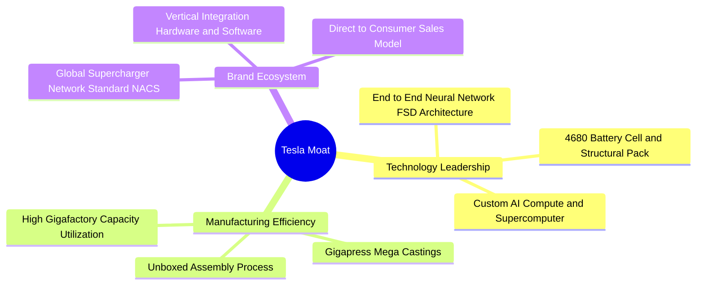

### 2.4 護城河強度評分

```
╔══════════════════════════════════════════════════════════════╗
║                  TSLA 護城河強度評分                         ║
╠══════════════════════════════════════════════════════════════╣
║ 軟硬體閉環數據鏈  9.5/10 ▓▓▓▓▓▓▓▓▓▓▓▓▓▓▓▓▓▓▓░  🏆 業界頂尖    ║
║ 充電網路 (NACS)  9.0/10 ▓▓▓▓▓▓▓▓▓▓▓▓▓▓▓▓▓▓░░  🏆 產業標準    ║
║ 製程與製造成本    8.0/10 ▓▓▓▓▓▓▓▓▓▓▓▓▓▓▓▓░░░░  🟢 顯著優勢    ║
║ 品牌力與定價權    7.0/10 ▓▓▓▓▓▓▓▓▓▓▓▓▓░░░░░░░  🟡 價格戰受壓  ║
║ 能源儲能規模效益  8.5/10 ▓▓▓▓▓▓▓▓▓▓▓▓▓▓▓▓▓░░░  🟢 快速擴展    ║
╠══════════════════════════════════════════════════════════════╣
║ 綜合護城河評分    8.5/10 ▓▓▓▓▓▓▓▓▓▓▓▓▓▓▓▓▓░░░  🏆 極深護城河  ║
╚══════════════════════════════════════════════════════════════╝
```

---

## 3. 損益表深度分析

### 3.1 年度收入成長趨勢（近 4 年與 TTM）

特斯拉的營收經歷了 2021-2022 年的高速爆發期後，於 2024-2025 年進入高基期調整期，並於 TTM 重回成長軌道。

```
╔══════════════════════════════════════════════════════════════════╗
║              TSLA 年度收入趨勢（FY2022 - TTM 2026）              ║
╠══════════════════════════════════════════════════════════════════╣
║                                                                  ║
║  FY2022  $81.46B   ████████████████████░░░░░░░░  YoY: +51.4% 🟢  ║
║  FY2023  $96.77B   ████████████████████████░░░░  YoY: +18.8% 🟢  ║
║  FY2024  $97.69B   ████████████████████████░░░░  YoY: +1.0%  🟡  ║
║  FY2025  $94.83B   ███████████████████████░░░░░  YoY: -2.9%  🔴  ║
║  TTM'26  $103.62B  █████████████████████████░░░  YoY: +11.8% 🟢  ║
║                                                                  ║
║  📊 4 年營收複合成長率（CAGR）：+7.8%                             ║
╚══════════════════════════════════════════════════════════════════╝
```

### 3.2 季度收入趨勢分析

最近 4 個季度的營收展現出明顯的季度波動，Q2 2026 受益於交付量回升與 Megapack 出貨創高，單季營收達 **$28.24B**，YoY 成長達 **25.5%**。

| 財報季度 | 營業收入 ($B) | YoY 成長率 | QoQ 成長率 | 毛利 ($B) | 營業利潤 ($M) | 淨利 ($M) | 核心驅動因素／備註 |
|----------|---------------|------------|------------|-----------|---------------|-----------|--------------------|
| **Q3 2025** | $28.10B | +11.6% | +24.9% | $5.05B | $1,860M | $1,373M | 儲能 Megapack 交付暴增，汽車 ASP 穩定 |
| **Q4 2025** | $24.90B | -3.1% | -11.4% | $5.01B | $1,570M | $840M | 季末促銷壓低毛利，研發費用增加 |
| **Q1 2026** | $22.39B | +15.8% | -10.1% | $4.72B | $941M | $477M | 季節性淡季，新產線爬坡侵蝕營業利潤 |
| **Q2 2026** | $28.24B | **+25.5%** | **+26.1%** | $4.75B | **$398M** | **$1,114M** | 營收衝高但營業利益率因研發與行銷驟降 |

### 3.3 利潤率演變分析

TSLA 的利潤率結構在過去 4 年發生了顯著改變。毛利率自 2022 年的 **25.6%** 下滑至 TTM 的 **18.9%**；更為嚴峻的是，營業利潤率由 2022 年的 **16.8%** 暴跌至 TTM 的 **1.4%**。

| 利潤率指標 | FY2022 | FY2023 | FY2024 | FY2025 | TTM 2026 | 趨勢變化 | 評估與主因解析 |
|------------|--------|--------|--------|--------|----------|----------|----------------|
| **毛利率 (Gross Margin)** | 25.6% | 18.2% | 17.9% | 18.0% | **18.9%** | ↘️ 探底微升 | 🟢 儲能業務高毛利抵銷汽車 ASP 打折 |
| **營業利益率 (Op Margin)** | 16.8% | 9.2% | 7.9% | 4.6% | **1.4%** | 📉 劇烈收縮 | 🔴 AI 研發 Capex/Opex 與車價打折雙重夾擊 |
| **EBITDA Margin** | 21.7% | 15.3% | 15.1% | 12.4% | **10.4%** | ↘️ 下滑 | 🟡 折舊費用大幅拉升，EBITDA 維持雙位數 |
| **淨利率 (Net Margin)** | 15.4% | 15.5% | 7.3% | 4.0% | **3.7%** | 📉 歷史低位 | 🔴 營業利潤下降，依靠利息收入支撐淨利 |

**利潤率演變深度解析**：
1. **汽車降價策略**：為維護全球市場份額，特斯拉在全球實施多輪降價，致使單車毛利顯著縮水。
2. **AI 研發費用暴增**：FY2025 研發費用（R&D）達 **$6.41B**（YoY +41.2%），TTM 研發費用進一步拉升，主要係建置 AI 算力中心與 Optimus 人形機器人研發。
3. **利息收入墊高淨利率**：在營業利潤僅 $398M 的 Q2 2026，淨利得以達到 $1,114M，關鍵原因為公司持有近 $43.52B 資金獲得約 $400M+ 的利息收益與非營業稅務調整。

### 3.4 費用結構分析

TTM 營運費用中，研發費用占比大幅提升，反映公司全面向科技/AI 企業靠攏的戰略轉移。

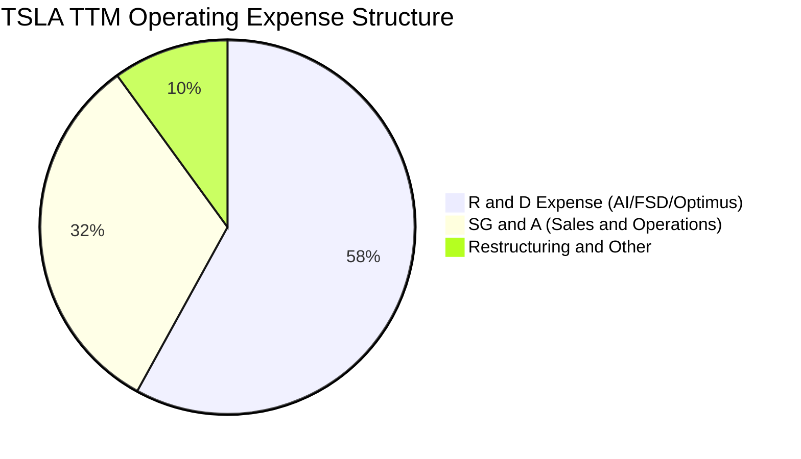

```
╔══════════════════════════════════════════════════════════════════╗
║                 TSLA TTM 費用控管與研發強度                      ║
╠══════════════════════════════════════════════════════════════╣
║ 研發費用 (R&D)    $6.85B  ████████████████████ (YoY +35%) 🔴 暴增  ║
║ 銷售與管理 (SG&A) $4.12B  ████████████░░░░░░░░ (YoY +5%)  🟢 穩定  ║
║ 營運費用率 (Opex%) 10.6%  較 2022 年 (8.8%) 增加 1.8pp          ║
╚══════════════════════════════════════════════════════════════╝
```

### 3.5 季度 EPS 趨勢與盈餘品質（Quality of Earnings）

過去 4 季 EPS 表現反映出汽車降價與研發費用增加對當期的盈利壓抑：

| 季度 | GAAP EPS | Non-GAAP EPS | 營業現金流 ($B) | 淨利 ($B) | FCF 轉換率 (FCF/NI) | 盈餘品質評估 |
|------|----------|--------------|-----------------|-----------|---------------------|--------------|
| **Q3 2025** | $0.39 | $0.43 | $6.24B | $1.37B | 290.6% | 🟢 極佳（高 FCF 轉換） |
| **Q4 2025** | $0.24 | $0.26 | $3.81B | $0.84B | 169.0% | 🟢 強勁 |
| **Q1 2026** | $0.13 | $0.15 | $3.94B | $0.48B | 301.9% | 🟢 現金流充沛 |
| **Q2 2026** | $0.32 | $0.34 | $4.70B | $1.11B | **-98.7%** | 🔴 受到 $5.80B 重資本 Capex 扭曲 |

**盈餘品質深度評估**：

| 盈餘品質指標 | 數值 / 佔比 (TTM) | 評估與市場含義 |
|--------------|-------------------|----------------|
| **股權薪酬 (SBC) / 營收** | **3.67%** ($3.80B) | 🟡 處於合理範圍，但相較於淨利極高 |
| **SBC / 淨利 (Net Income)** | **99.8%** ($3.80B / $3.804B) | 🔴 **極高警訊**：GAAP 淨利幾乎完全被 SBC 抵銷，股權稀釋效應顯著 |
| **SBC / 營業現金流 (OCF)** | **20.3%** ($3.80B / $18.68B) | 🟡 現金流中包含相當比例的非現金薪酬加回 |
| **FCF / 淨利 (現金轉換率)** | **127.2%** ($4.84B / $3.80B) | 🟢 現金轉換率整體仍保持強勁，證明營運本質可產生現金 |
| **監管碳權 (Regulatory Credits)**| ~$1.85B TTM | 🟡 碳權收入毛利率 100%，占營業利益比重過高，具不可持續性 |

**盈餘品質結論**：特斯拉當前的 GAAP 淨利（TTM $3.80B）高度依賴非營業利息收入（~$1.6B）與監管碳權（~$1.85B）。扣除碳權後，汽車本業的營業利潤接近盈虧平衡。此外，TTM SBC 額度高達 $3.80B，意味著當期淨利的 100% 形式上被內部股權激勵所消耗，真實股東權益面臨持續稀釋。

---

## 4. 資產負債表分析

### 4.1 資產結構分解

截至 2026 年 6 月 30 日（Q2 2026），特斯拉總資產達 **$148.52B**，呈現高度流動性與重型不動產、廠房及設備（PPE）並重的雙引擎結構。

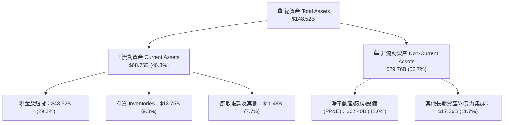

### 4.2 流動性指標分析

| 流動性指標 | Q2 2026 | FY2025 | FY2024 | 行業均值 | 評估 |
|------------|---------|--------|--------|----------|------|
| **流動比率 (Current Ratio)** | **1.94x** | 2.16x | 2.02x | ~1.25x | 🟢 流動性極為充沛 |
| **速動比率 (Quick Ratio)** | **1.35x** | 1.55x | 1.40x | ~0.85x | 🟢 無短期償債風險 |
| **現金比率 (Cash Ratio)** | **1.23x** | 1.39x | 1.27x | ~0.45x | 🟢 現金儲備足以覆蓋全部流動負債 |
| **存貨週轉天數 (DIO)** | **52.4 天** | 48.2 天 | 46.5 天 | ~65 天 | 🟡 存貨略有積壓但優於同業 |

### 4.3 債務結構分析

特斯拉的負債結構非常健康，絕大部分負債為無息的應付帳款與應計費用，有息金融負債占比較低。

```
╔══════════════════════════════════════════════════════════════════╗
║                   TSLA 債務健康度診斷                            ║
╠══════════════════════════════════════════════════════════════════╣
║                                                                  ║
║  現金與短期投資： $43.52B  ████████████████████████████ (🟢 充沛)║
║  總有息債務：     $16.08B  █████████░░░░░░░░░░░░░░░░░░░ (🟡 可控)║
║  └── 短期債務：   $2.44B   ██░░░░░░░░░░░░░░░░░░░░░░░░░░          ║
║  └── 長期借款：   $7.72B   █████░░░░░░░░░░░░░░░░░░░░░░░          ║
║  └── 長期租賃：   $5.92B   ████░░░░░░░░░░░░░░░░░░░░░░░░          ║
║                                                                  ║
║  淨現金 (Net Cash)：      +$27.44B  🟢 堡壘等級防禦力            ║
║  負債資本比 (Debt/Equity)： 18.4%    🟢 極低財務槓桿              ║
║  利息保障倍數 (Coverage)：  35.2x    🟢 零破產風險                ║
╚══════════════════════════════════════════════════════════════════╝
```

### 4.4 股東權益趨勢

股東權益從 2021 年的 $30.18B 穩健成長至 Q2 2026 的 **$82.14B+**，反映保留盈餘的長期累積與強固的淨資產保護力。

---

## 5. 現金流量深度分析

### 5.1 現金流量瀑布圖

TTM 現金流展現出強勁的營運造血能力（$18.68B），但大部分被龐大的 Capex（$13.83B TTM）所抵銷。

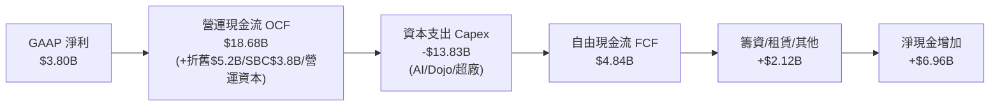

### 5.2 FCF 轉換率趨勢

| 期間 | 營運現金流 OCF ($B) | 資本支出 Capex ($B) | 自由現金流 FCF ($B) | FCF / Net Income | 備註 |
|------|---------------------|---------------------|---------------------|------------------|------|
| **FY2022** | $14.72B | -$7.17B | $7.55B | 60.1% | 汽車擴產黃金期 |
| **FY2023** | $13.26B | -$8.90B | $4.36B | 29.1% | Gigafactory Austin/Berlin 爬坡 |
| **FY2024** | $14.92B | -$11.34B | $3.58B | 50.5% | AI 算力建置開端 |
| **FY2025** | $14.75B | -$8.53B | $6.22B | 164.0% | Capex 階段性收斂 |
| **TTM 2026** | **$18.68B** | **-$13.83B** | **$4.84B** | **127.2%** | **AI Capex 爆發，拉低 FCF** |

### 5.3 自由現金流趨勢

單季 FCF 在 Q2 2026 出現大幅下滑甚至轉負（-$1.10B），原因是特斯拉在該季度執行了高達 **$5.80B** 的 Capex，主要購買 Nvidia H200/B200 晶片與建置數據中心。

```
╔══════════════════════════════════════════════════════════════════╗
║                TSLA 近 4 季 FCF 走勢 ($B)                        ║
╠══════════════════════════════════════════════════════════════════╣
║                                                                  ║
║  Q3 2025  +$3.99B   ████████████████████████████  🟢 峰值        ║
║  Q4 2025  +$1.42B   ██████████░░░░░░░░░░░░░░░░░░  🟢 充沛        ║
║  Q1 2026  +$1.44B   ██████████░░░░░░░░░░░░░░░░░░  🟢 穩定        ║
║  Q2 2026  -$1.10B   ▓▓▓▓▓▓▓░░░░░░░░░░░░░░░░░░░░░  🔴 單季 Capex$5.8B║
║                                                                  ║
║  📊 當前 FCF Yield（自由現金流收益率）：0.40%（極低）            ║
╚══════════════════════════════════════════════════════════════════╝
```

### 5.4 資本配置評估

特斯拉不發放股利，亦極少進行股票回購，其資本配置策略為 **100% 再投資型**，優先將現金流挹注於 AI 算力、產能擴建與研發。

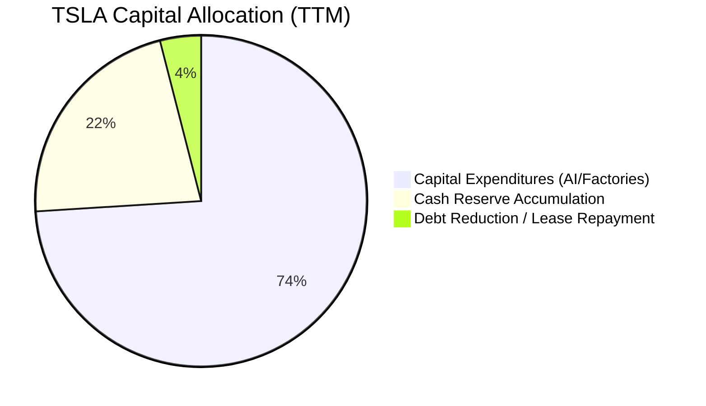

---

## 6. 獲利能力與資本效率

### 6.1 ROE / ROA / ROIC 趨勢

由於營業利潤下滑與股東權益因盈餘累積而擴大，特斯拉的資本回報指標近年呈現壓抑走勢。

| 資本效率指標 | FY2022 | FY2023 | FY2024 | FY2025 | TTM 2026 | 產業平均 (Auto) | 評估 |
|--------------|--------|--------|--------|--------|----------|-----------------|------|
| **ROE (股東權益報酬率)** | 28.1% | 23.9% | 9.7% | 4.6% | **4.7%** | ~8.5% | 🔴 資本擴張未及時帶來盈餘匹配 |
| **ROA (總資產報酬率)** | 15.3% | 14.1% | 5.8% | 2.8% | **1.9%** | ~3.0% | 🔴 資產利用效率下降 |
| **ROIC (投入資本報酬率)**| 21.4% | 16.5% | 7.2% | 3.5% | **2.8%** | ~5.0% | 🔴 處於歷史低位 |

### 6.2 ROIC vs WACC 分析（核心價值創造判斷）

ROIC 是否高於 WACC 是衡量公司是否為股東創造經濟增值（EVA）的核心標準。

```
╔══════════════════════════════════════════════════════════════════╗
║                TSLA ROIC vs WACC 深度分析                        ║
╠══════════════════════════════════════════════════════════════════╣
║                                                                  ║
║  WACC 估算參數：                                                 ║
║  ├── 無風險利率 (10Y US Treasury)： 4.25%                         ║
║  ├── 市場風險溢酬 (ERP)：           5.00%                        ║
║  ├── Beta 值：                      1.802                        ║
║  ├── 股權成本 (Cost of Equity)：    4.25% + 1.802 × 5.0% = 13.26%║
║  ├── 稅後債務成本 (Cost of Debt)：  ~4.00%                       ║
║  ├── 資本結構：股權 88.5%，債務 11.5%                            ║
║  └── ✅ 綜合加權資本成本 (WACC) ≈ 9.8%                           ║
║                                                                  ║
║  ROIC 計算 (TTM 2026)：                                          ║
║  ├── NOPAT（稅後淨營業利潤）= $4.37B × (1 - 15%) ≈ $3.71B        ║
║  ├── 投入資本 (Invested Capital) = 股權 $82.1B + 債務 $16.1B      ║
║  │   - 現金及短投 $43.5B ≈ $54.7B                                ║
║  └── ✅ 投入資本報酬率 (ROIC) ≈ 2.8%                             ║
║                                                                  ║
║  ★ 經濟價值增加 (EVA) = ROIC (2.8%) - WACC (9.8%) = -7.0pp       ║
║                                                                  ║
║  ROIC  2.8%  ▓▓▓▓▓░░░░░░░░░░░░░░░░░░░░░░░░░░  🔴 短期摧毀價值    ║
║  WACC  9.8%  ▓▓▓▓▓▓▓▓▓▓▓▓▓▓▓▓░░░░░░░░░░░░░░  ── 資本成本基準    ║
║  EVA  -7.0pp ▓▓▓▓▓▓▓░░░░░░░░░░░░░░░░░░░░░░░░  🔴 負經濟增值      ║
║                                                                  ║
║  📊 結論：目前汽車業務進入重資本投入期，ROIC 暫時低於 WACC。     ║
║     未來能否逆轉取決於 Robotaxi / FSD 高毛利軟體營收的規模化。   ║
╚══════════════════════════════════════════════════════════════════╝
```

### 6.3 杜邦三因素分解

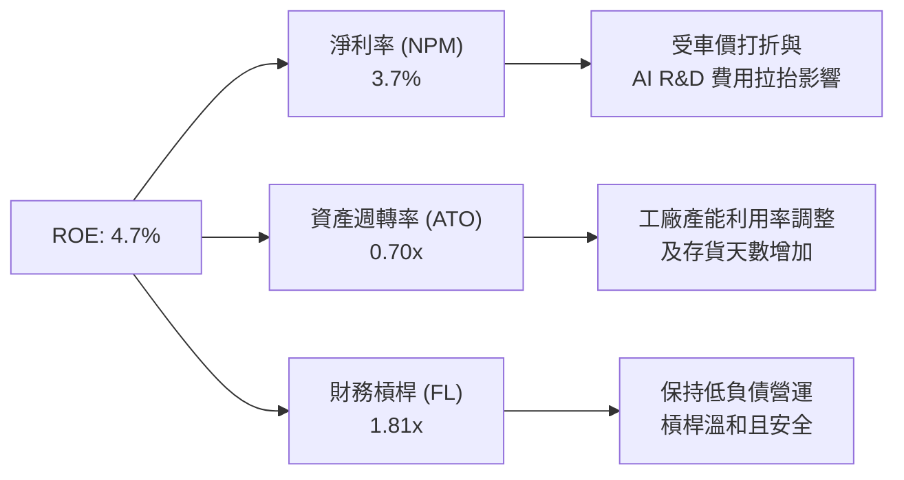

### 6.4 獲利能力儀表板

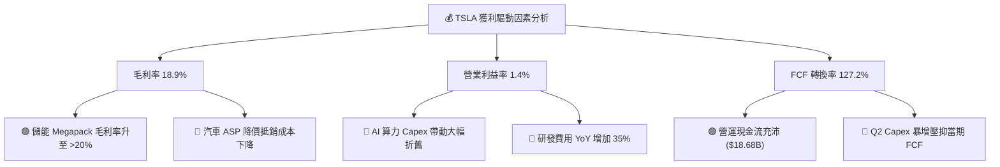

---

## 7. 估值深度分析

### 7.1 同業估值比較表格

特斯拉目前既非純粹的傳統車企，亦非成熟的 SaaS 軟體公司。其估值遠高於傳統車企與中國 EV 競爭對手，顯示市場賦予其極高的 AI 與軟體選擇權溢價。

| 估值與財務指標 | **TSLA** | **BYD (1211.HK)** | **LI (Li Auto)** | **RIVN (Rivian)** | **TM (Toyota)** | 評估與溢價分析 |
|----------------|----------|-------------------|------------------|-------------------|-----------------|----------------|
| **市值 (Market Cap)** | **$1.21T** | ~$105B | ~$22B | ~$11B | ~$270B | TSLA 市值超過同業總和 |
| **Trailing P/E** | **284.1x** | ~18.5x | ~16.2x | N/A (虧損) | ~8.2x | 🔴 靜態本益比極高 |
| **Forward P/E** | **138.0x** | ~15.0x | ~13.5x | N/A | ~9.0x | 🔴 市場定價高度前瞻 |
| **P/S Ratio** | **11.7x** | ~1.1x | ~1.0x | ~2.1x | ~0.8x | 🔴 顯著高於硬體製造業 |
| **EV / EBITDA** | **111.1x** | ~10.5x | ~9.2x | N/A | ~7.5x | 🔴 溢價隱含遠期高增長 |
| **毛利率 (TTM)** | **18.9%** | ~20.5% | ~21.2% | ~-8.5% | ~17.0% | 🟡 低於 BYD/理想，優於 Rivian |
| **Revenue YoY** | **+11.8%** | +24.0% | +18.5% | +12.0% | +3.5% | 🟢 保持溫和成長 |

### 7.2 歷史估值區間分析

當前 TSLA 的 Forward P/E (138.0x) 處於過去 5 年歷史估值區間的中高位，反映出市場已從純車企交付量估值模型，轉轉移至 AI 算力與 Robotaxi 的科技股估值模型。

```
╔══════════════════════════════════════════════════════════════════╗
║                TSLA 歷史 Forward P/E 區間定位                    ║
╠══════════════════════════════════════════════════════════════════╣
║                                                                  ║
║  歷史低點 (2023 估值重塑):   35.0x  ███                          ║
║  5 年歷史中位數:             75.0x  ██████████                   ║
║  當前 Forward P/E:          138.0x  ███████████████████ 🔴 高位  ║
║  歷史高點 (2020 狂熱期):    220.0x  ████████████████████████████ ║
║                                                                  ║
║  📊 結論：估值處於歷史相對高位，極度依賴營運利益率的回升。       ║
╚══════════════════════════════════════════════════════════════════╝
```

### 7.3 情境目標價（假設驅動：Bear / Base / Bull）

針對特斯拉的估值推演，我們建立透明的三情境財務模型。由於純本益比（P/E）易被重資本折舊扭曲，我們採用 **營收 CAGR + 營業利潤率擴張 + EBITDA 退出倍數** 之綜合模型：

| 情境假設 | 2026-2029 營收 CAGR | 2029E 營業利潤率 | 2029E EBITDA 倍數 | 12 個月隱含目標價 | 相對當前股價 ($306.83) | 機率賦權 |
|----------|---------------------|------------------|-------------------|-------------------|------------------------|----------|
| 🔴 **悲觀情境 (Bear)** | **5.0%** | **5.0%**（車價持續交鋒）| **25.0x** | **$180.00** | **-41.3%** | 25% |
| 🟡 **基準情境 (Base)** | **14.0%** | **11.5%**（儲能與FSD拉抬）| **45.0x** | **$325.00** | **+5.9%** | 50% |
| 🟢 **樂觀情境 (Bull)** | **24.0%** | **20.0%**（Robotaxi規模化）| **70.0x** | **$480.00** | **+56.4%** | 25% |

*加權預期目標價 = ($180 × 0.25) + ($325 × 0.50) + ($480 × 0.25) = **$327.50**（與基準目標價高度接近）。*

### 7.4 DCF 敏感性分析（6 格目標價矩陣）

採用折現現金流模型（DCF），以 2026 年 FCF 為基期，假設終端成長率（Terminal Growth Rate）為 3.5% - 4.5%，並測試不同 WACC 與營收成長率下的估值矩陣：

| 營收與 FCF 成長假設 | **WACC = 8.8%** | **WACC = 9.8%（基準）** | **WACC = 10.8%** |
|---------------------|-----------------|-------------------------|------------------|
| 🟢 **高成長情境 (CAGR 20%)** | **$410.00** (+33.6%) | **$365.00** (+19.0%) | **$320.00** (+4.3%) |
| 🟡 **基準成長情境 (CAGR 14%)** | **$360.00** (+17.3%) | **$325.00** (+5.9%) | **$285.00** (-7.1%) |
| 🔴 **低成長情境 (CAGR 8%)** | **$250.00** (-18.5%) | **$220.00** (-28.3%) | **$190.00** (-38.1%) |

### 7.5 估值綜合區間

```
╔══════════════════════════════════════════════════════════════════╗
║                  TSLA 估值綜合位元區間圖                         ║
╠══════════════════════════════════════════════════════════════════╣
║                                                                  ║
║  悲觀目標價：     $180.00  |----------------|                    ║
║  DCF 保守區間：   $220.00         |----------------|             ║
║  當前股價：       $306.83                 ★ (當前位置)          ║
║  基準目標價：     $325.00                   |----------------|   ║
║  樂觀目標價：     $480.00                            |-----------║
║                                                                  ║
║  📊 結論：當前股價接近基準目標價，安全邊際相對有限。             ║
╚══════════════════════════════════════════════════════════════════╝
```

---

## 8. 成長催化劑

### 8.1 催化劑時間軸

特斯拉未來的催化劑已從純車型交付轉向 AI 與無人駕駛生態系的落地：

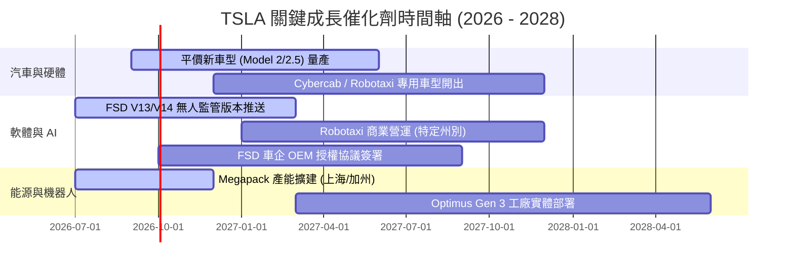

### 8.2 TAM 市場規模分析

```
╔══════════════════════════════════════════════════════════════════╗
║                 TSLA 潛在可尋址市場 (TAM) 預估                   ║
╠══════════════════════════════════════════════════════════════════╣
║                                                                  ║
║ 1. 全球電動汽車 (EV Market)   TAM: $1.2T  ｜ 現有滲透率: ~15%   ║
║ 2. 自動駕駛與 Robotaxi 服務    TAM: $2.5T  ｜ 現有滲透率: <1%    ║
║ 3. 電網級儲能 (Energy Storage) TAM: $600B  ｜ 現有滲透率: ~5%    ║
║ 4. 人形機器人 (Optimus)        TAM: $3.0T+ ｜ 現有滲透率: 0%     ║
║                                                                  ║
║ 📊 結論：Robotaxi 與 Optimus 為 long-term TAM 擴張的主力。        ║
╚══════════════════════════════════════════════════════════════════╝
```

### 8.3 成長驅動力量結構圖

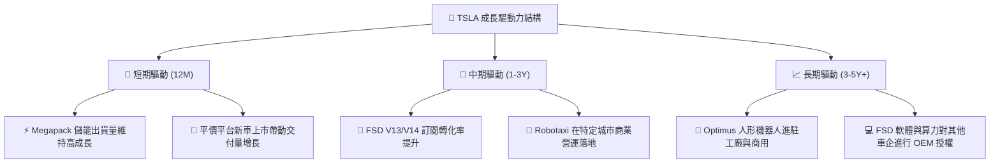

---

## 9. 風險矩陣

### 9.1 風險評分矩陣

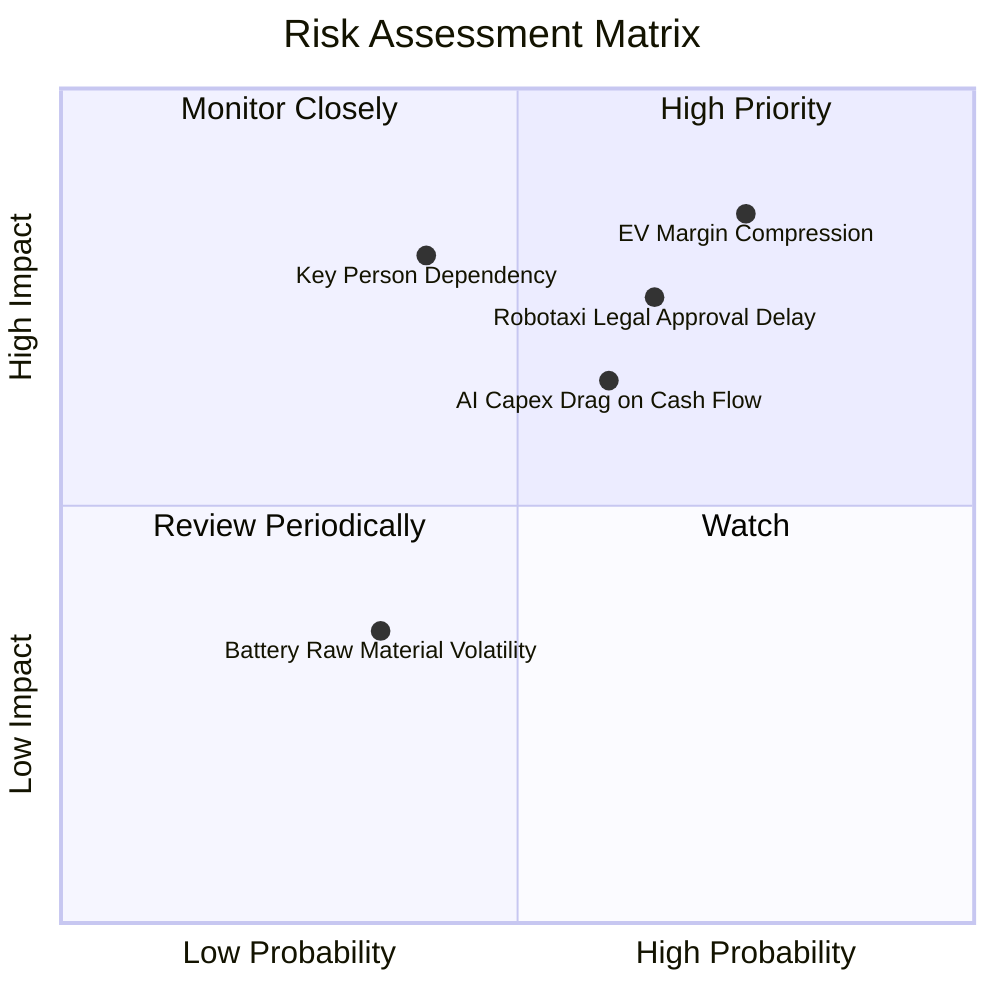

### 9.2 風險清單詳細分析

| # | 風險項目 | 發生機率 | 財務衝擊 | 風險評分 | 緩解措施 / 觀察指標 |
|---|----------|----------|----------|----------|---------------------|
| 1 | 🔴 **汽車價格戰加劇與毛利率收縮** | 高 (75%) | 高 (衝擊純利) | 🔴 **8.2/10** | 觀察汽車毛利率（扣除碳權）是否能維持在 15% 以上；加速 Unboxed 低成本平台量產。 |
| 2 | 🔴 **Robotaxi 法規審批與技術落地延遲** | 中高 (65%)| 高 (影響高估值) | 🔴 **7.8/10** | 密切追蹤加州與德州等主要地區的全無人駕駛（Unsupervised）許可進度。 |
| 3 | 🟡 **AI Capex 大幅消耗現金流** | 中 (60%) | 中高 (壓低 FCF) | 🟡 **6.5/10** | 依靠 $43.52B 龐大現金儲備緩衝；觀察營運現金流能否隨著交付量增加而回升。 |
| 4 | 🟡 **CEO 關鍵人風險與精力分散** | 中低 (40%)| 高 (品牌與戰略) | 🟡 **6.0/10** | Elon Musk 在 xAI、SpaceX 與 Tesla 間的精力分配及股權薪酬方案訴訟進展。 |

---

## 10. 投資建議

### 10.1 最終綜合評級雷達圖

```
╔══════════════════════════════════════════════════════════════╗
║                 TSLA 最終綜合評估雷達圖                      ║
╠══════════════════════════════════════════════════════════════╣
║ 財務健康 (Financial Health) 9.5  ▓▓▓▓▓▓▓▓▓▓▓▓▓▓▓▓▓▓▓  🟢 堡壘║
║ 護城河深度 (Moat Depth)      8.5  ▓▓▓▓▓▓▓▓▓▓▓▓▓▓▓▓▓░░  🟢 極強║
║ 成長動能 (Growth Momentum)  7.5  ▓▓▓▓▓▓▓▓▓▓▓▓▓▓▓░░░░  🟢 穩健║
║ 管理執行 (Management)       7.5  ▓▓▓▓▓▓▓▓▓▓▓▓▓▓▓░░░░  🟢 前瞻║
║ 估值吸引力 (Valuation)      5.5  ▓▓▓▓▓▓▓▓▓▓▓░░░░░░░░  🟡 偏貴║
║ 獲利品質 (Earnings Quality)  4.5  ▓▓▓▓▓▓▓▓▓░░░░░░░░░░  🔴 壓抑║
╠══════════════════════════════════════════════════════════════╣
║ 綜合評分：6.8 / 10   ｜  投資評級：🟡 持有 / 觀望 (Hold)      ║
╚══════════════════════════════════════════════════════════════╝
```

### 10.2 目標價與隱含報酬率

| 情境 | 機率權重 | 12 個月目標價 | 相對當前股價 ($306.83) | 預期貢獻 |
|------|----------|---------------|------------------------|----------|
| 🔴 **悲觀情境** | 25% | **$180.00** | -41.3% | -$45.00 |
| 🟡 **基準情境** | 50% | **$325.00** | **+5.9%** | **+$162.50** |
| 🟢 **樂觀情境** | 25% | **$480.00** | +56.4% | +$120.00 |
| **加權目標價** | **100%** | **$327.50** | **+6.7%** | **總計預期目標價：~$325.00** |

### 10.3 買入時機與觸發因素

```
╔══════════════════════════════════════════════════════════════════╗
║                  ✅ TSLA 投資觸發因素 Checklist                  ║
╠══════════════════════════════════════════════════════════════════╣
║                                                                  ║
║  🟢 加碼/買入觸發條件（需滿足至少 2 項）：                       ║
║  ☐ 股價回檔至 $220 - $240 區間（提供足夠的安全邊際）             ║
║  ☐ 汽車業務營業利益率連續兩季回升至 > 6.0%                       ║
║  ☐ FSD 無人監管版本在至少一個聯邦/州級政府獲得商業營運執照       ║
║  ☐ 單季 FCF 在 Capex 高峰後重新回升至 > $3.0B                    ║
║                                                                  ║
║  🔴 減碼/停損觸發條件（出現任一即需重新審視）：                   ║
║  ☐ 汽車毛利率（扣除碳權）跌破 12.0%                              ║
║  ☐ 單季 Capex 持續維持在 > $6.0B 且 OCF 大幅惡化致 FCF 連續轉負   ║
║  ☐ FSD V13+ 出現重大安全事故導致監管單位介入勒令停測             ║
╚══════════════════════════════════════════════════════════════════╝
```

### 10.4 投資人適配度分析

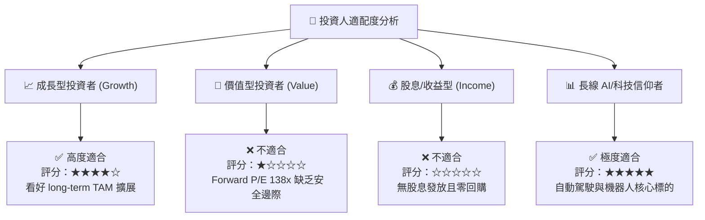

### 10.5 每季財報監控清單（Quarterly Watch List）

為利於後續季度持續追蹤 TSLA 之基本面變化，建立以下量化門檻檢驗表：

| 監控項目 | 最新數據 (Q2 2026 / TTM) | 買入/加碼門檻（Bull Signal） | 減碼/停損門檻（Bear Signal） | 追蹤重點與意義 |
|----------|--------------------------|------------------------------|------------------------------|----------------|
| **汽車毛利率（不含碳權）**| **~14.6%** | **> 18.0%** | **< 12.0%** | 檢驗價格戰是否終結與 Unboxed 降本成效 |
| **儲能 Megapack 出貨量** | **~9.5 GWh/季** | **> 15.0 GWh/季** | **< 7.0 GWh/季** | 第二成長曲線的兌現速度 |
| **單季 Capex 規模** | **$5.80B** | **控制在 < $4.0B 且 FCF > $2B** | **持續 > $6.5B 且 FCF 負流失** | 算力投入對現金流的侵蝕壓力 |
| **FSD 訂閱/付費轉化率** | 估算 ~8-10% | **> 20.0%** | **< 5.0%** | 高毛利軟體收入比重之擴張 |
| **ROIC 資本效率** | **2.8%** | **> 10.0%（高於 WACC）** | **持續 < 3.0%** | 資本投入是否開始重新創造股東價值 |

### 10.6 反面論證：什麼會證明論點錯誤（What Would Change My Mind）

```
╔══════════════════════════════════════════════════════════════════╗
║              ⚠️ 論點失效條件（Disconfirming Evidence）           ║
╠══════════════════════════════════════════════════════════════════╣
║  本研究之「觀望/持有」與遠期看好論點，在下列條件發生時將被證偽：  ║
║                                                                  ║
║  1. 軟體變現失敗：                                               ║
║     若未來 6-8 個季度內，FSD 無法實現 L4 級別之完全無人監管商業化 ║
║     營運，且 OEM 車企授權零突破，則 TSLA 將無法享有科技股高倍數，║
║     目標價應全面回歸車企估值（$120 - $150）。                    ║
║                                                                  ║
║  2. 汽車本業結構性虧損：                                         ║
║     若全球 EV 產能過剩致使汽車業務毛利率（扣除碳權）降至 < 10%， ║
║     且營運利益率轉負，顯示其製造護城河已被中國車企完全抹平。     ║
║                                                                  ║
║  3. 自由現金流失血失控：                                         ║
║     若 AI Capex 每年持續消耗 > $20B，而營運現金流無法同步擴充，   ║
║     導致淨現金（$27.44B）在 3 年內消耗殆盡並轉為淨負債。         ║
╚══════════════════════════════════════════════════════════════════╝
```

---

> **免責聲明**：本報告由 CFA 級機構分析框架自動產出，僅供學術研究與投資參考，不構成任何具體金融商品的買賣建議。投資人應獨立評估市場風險，並自行承擔投資結果。