# TSLA 基本面深度分析報告
> **報告日期**：2026-08-22 ｜ **語言**：繁體中文 ｜ **數據來源**：Yahoo Finance, Finviz, StockAnalysis, Roic.ai ｜ **分析師**：CFA 級機構研究

---

## 目錄

| # | 章節 | 核心結論 |
|---|------|----------|
| 1 | 執行摘要 | 評級「持有/觀望」；基準目標價 $305.50；安全邊際 -15.8% |
| 2 | 公司概覽與商業模式 | 汽車為營收基石，儲能與 AI 軟體建構高估值生態系護城河 |
| 3 | 損益表深度分析 | Q2 2026 營收強彈 25.5%，但營業利益率受 AI 與 Capex 稀釋降至 1.4% |
| 4 | 資產負債表分析 | 淨現金 $27.44B，流動比率 1.94，流動性充裕抵禦價格競爭 |
| 5 | 現金流量深度分析 | 單季 Capex 飆升至 $5.80B 導致 Q2 FCF 轉負（-$1.10B），SBC 稀釋顯著 |
| 6 | 獲利能力與資本效率 | NOPAT 收縮致 ROIC 降至 3.8%，低於 WACC（10.22%），短期摧毀經濟價值 |
| 7 | 相對估值分析 | Forward P/E 168.1x，EV/EBITDA 130.8x，相較傳統與純 EV 同業享有極高溢價 |
| 8 | DCF 內在價值評估 | 基準每股內在價值 $313.43，現價溢價 15.8%；加權合理價值 $313.33 |
| 9 | 成長催化劑 | Cybercab 商業化、FSD V13 全球推送與 Megapack 儲能產能翻倍 |
| 10 | 風險矩陣 | 核心競爭加劇導致汽車毛利率進一步收縮，AI 變現時間點遞延 |
| 11 | 投資建議 | 建議買入區間 $219.00–$250.00；設定嚴格財報監控與失效條件 |

---

## 1. 執行摘要

特斯拉（Tesla, Inc., NASDAQ: TSLA）目前交易價格為 $362.86。基於最新財務數據，公司 TTM 營收達 $103.62B（YoY +25.5%），顯示交付動能回溫；然而，營業利益率降至 1.4%，TTM ROIC 降至 3.8%，低於其 10.22% 的加權平均資本成本（WACC），反映其正處於向 AI、Robotaxi 與儲能轉型的重資本投入期。當前市場賦予其 Forward P/E 168.1x 與 EV/EBITDA 130.8x 的極高估值倍數。經過 DCF 嚴謹推導，基準每股內在價值為 **$313.43**（現價溢價 15.8%），三角驗證後加權合理價值為 **$313.33**，安全邊際（MOS）為 **-15.8%**（無安全邊際）。綜合考量獲利收縮與高估值風險，給予 **🟡 持有 / 觀望（Hold）** 評級。

### 1.0 一頁式投資儀表板（Portfolio Manager 30 秒速讀）

| 項目 | 內容 |
|------|------|
| **投資論點（3 句）** | ① 儲能業務與汽車交付帶動 TTM 營收突破 $103.62B，重回兩位數成長軌道。<br/>② AI 運算中心與產線擴張使 Q2 2026 單季 Capex 達 $5.80B，壓縮自由現金流至 -$1.10B。<br/>③ 現行估值隱含高達 168.1x Forward P/E，股價已充分反映 Robotaxi 與 FSD 遠期預期。 |
| **護城河評分** | 8.5 / 10（軟硬體垂直整合、超充網路與資料閉環） |
| **管理層/資本配置評分** | 7.0 / 10（極致技術執行力，但 SBC 稀釋與資本支出節奏拉高短線風險） |
| **財務健康** | 🟢 充裕（淨現金 $27.44B，流動比率 1.94x，破產風險趨近於零） |
| **ROIC vs WACC** | 3.8% vs 10.22%（EVA 為 -6.42pp，短期處於價值收縮期） |
| **FCF 趨勢** | 短期轉負（TTM FCF $4.84B，Q2 2026 單季 -$1.10B；FCF Yield 僅 0.34%） |
| **估值** | Forward P/E 168.1x ｜ EV/EBITDA 130.8x ｜ FCF Yield 0.34% |
| **DCF 內在價值（基準）** | **$313.43** ｜ 現價溢價 +15.8%（來自第 8.5 節） |
| **安全邊際（MOS）** | **-15.8%** ＝ ($313.33 − $362.86) ÷ $313.33 ｜ 🔴 <10% 無安全邊際（來自第 8.8 節） |
| **預期報酬（基準情境 12M）** | **-15.8%**（收斂至合理價值） |
| **關鍵風險（前二）** | ① 價格競爭壓縮汽車毛利率；② 自駕技術審批與落地進度不及預期 |
| **評級 + 信心度** | 🟡 **持有 / 觀望（Hold）** ｜ 信心度：**中等** |

### 1.1 核心評分儀表板

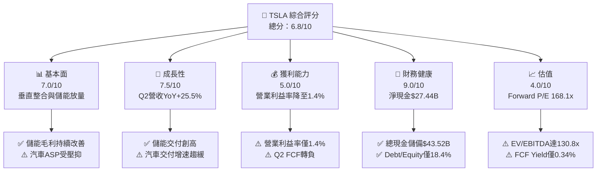

### 1.2 評分進度條視覺化

```
╔══════════════════════════════════════════════════════════════╗
║              TSLA 多維度評分儀表板 (1-10分)                   ║
╠══════════════════════════════════════════════════════════════╣
║ 基本面強度  7.0 ▓▓▓▓▓▓▓▓▓▓▓▓▓▓░░░░░░  ★★★☆☆           ║
║ 成長動能    7.5 ▓▓▓▓▓▓▓▓▓▓▓▓▓▓▓░░░░░  ★★★★☆           ║
║ 獲利品質    5.0 ▓▓▓▓▓▓▓▓▓▓░░░░░░░░░░  ★★☆☆☆           ║
║ 財務健康    9.0 ▓▓▓▓▓▓▓▓▓▓▓▓▓▓▓▓▓▓░░  ★★★★★           ║
║ 估值合理性  4.0 ▓▓▓▓▓▓▓▓░░░░░░░░░░░░  ★★☆☆☆           ║
║ 護城河深度  8.5 ▓▓▓▓▓▓▓▓▓▓▓▓▓▓▓▓▓░░░  ★★★★☆           ║
║ 管理層執行  7.5 ▓▓▓▓▓▓▓▓▓▓▓▓▓▓▓░░░░░  ★★★★☆           ║
║ 技術創新力  9.5 ▓▓▓▓▓▓▓▓▓▓▓▓▓▓▓▓▓▓▓░  ★★★★★           ║
╠══════════════════════════════════════════════════════════════╣
║ 綜合總分    6.8 ▓▓▓▓▓▓▓▓▓▓▓▓▓░░░░░░░  ⚖️ 估值充分反映預期  ║
╚══════════════════════════════════════════════════════════════╝
```

### 1.3 五大投資論點 + 三大核心風險

| 類型 | 項目 | 具體依據 | 信心度 |
|------|------|----------|--------|
| 🟢 **論點①** | **儲能業務成為第二成長曲線** | Megapack 與 Powerwall 裝機量高速成長，推升 TTM 營收至 $103.62B，儲能毛利率維持 20%+。 | 🟢 極高 |
| 🟢 **論點②** | **資產負債表極度強韌** | 總現金與短期投資達 $43.52B，淨現金 $27.44B，具備長期價格戰與 AI 研發底氣。 | 🟢 極高 |
| 🟢 **論點③** | **FSD 與 Robotaxi 選擇權** | 累積自駕里程突破數十億英里，純視覺端到端架構若商業化落地將帶來高毛利訂閱現金流。 | 🟡 中等 |
| 🟢 **論點④** | **製程優化與成本控制** | 一體化壓鑄與產線自動化使單車成本維持同業低檔，毛利率 18.9% 仍優於純 EV 同業。 | 🟢 高 |
| 🟢 **論點⑤** | **次世代平台放量潛力** | 平價車款（Model 2/次世代平台）預計降低單車 BOM 成本，擴大全球 TAM 滲透率。 | 🟡 中等 |
| 🟡 **風險①** | **營業利潤率持續承壓** | 價格競爭與研發支出激增（FY2025 達 $6.41B），導致營業利益率收縮至 1.4%。 | 🔴 高衝擊 |
| 🔴 **風險②** | **高資本支出導致現金流失血** | Q2 2026 Capex 達 $5.80B，致單季 FCF 轉負（-$1.10B），若持續將壓抑股東回報。 | 🔴 高衝擊 |
| 🟡 **風險③** | **估值倍數收縮風險** | Forward P/E 達 168.1x，若自駕或平價車時程遞延，股價面臨劇烈均值回歸。 | 🟡 中度 |

### 1.4 快速統計卡片

| 指標 | TSLA 實際值 | 行業均值（Auto） | S&P 500 均值 | 狀態 |
|------|-------------|------------------|--------------|------|
| 收入 YoY 成長 | **25.5%** | ~4.5% | ~5.8% | 🟢 遠優於同業 |
| 毛利率 | **18.9%** | ~14.2% | ~12.5% | 🟢 具成本優勢 |
| 營業利益率 | **1.4%** | ~6.5% | ~11.8% | 🔴 顯著受壓 |
| 淨利率 | **3.7%** | ~4.8% | ~8.5% | 🟡 略低於均值 |
| ROE | **4.7%** | ~11.5% | ~14.2% | 🔴 資本回報偏低 |
| Forward P/E | **168.1x** | ~8.5x | ~21.5x | 🔴 處於極端溢價 |
| Debt/Equity | **18.4%** | ~110.0% | ~85.0% | 🟢 財務槓桿極低 |

### 1.5 投資結論

```
╔══════════════════════════════════════════════════════════════════╗
║                    📊 投資結論摘要                               ║
╠══════════════════════════════════════════════════════════════════╣
║  評級：🟡 持有 / 觀望（Hold）                                    ║
║  當前股價：$362.86                                               ║
║  DCF 內在價值（基準）：$313.43（現價溢價 +15.8%）                ║
║  加權合理價值：$313.33                                           ║
║  安全邊際 MOS：-15.8%（＝($313.33 − $362.86) ÷ $313.33）        ║
║  目標價區間：                                                    ║
║    🔴 悲觀情境：$185.20（-48.9%）                                ║
║    🟡 基準情境：$305.50（-15.8%）  ← 12 個月主要目標              ║
║    🟢 樂觀情境：$468.00（+29.0%）                                ║
║  投資評分：6.8 / 10                                              ║
║  適合投資人：具備極高波動承受度的 AI 與能源轉型長線配置者        ║
╚══════════════════════════════════════════════════════════════════╝
```

---

## 2. 公司概覽與商業模式

### 2.1 業務結構與收入來源

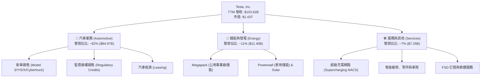

### 2.2 市場份額

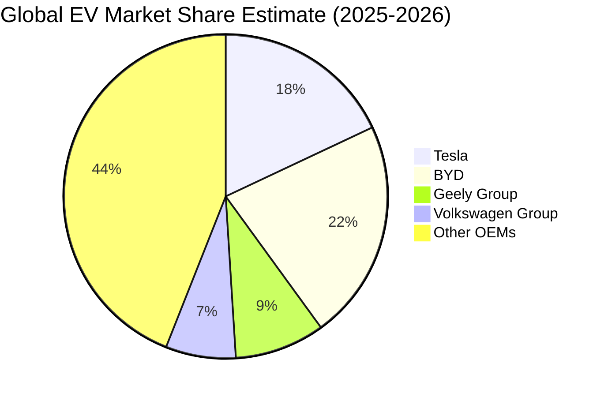

### 2.3 競爭護城河分析

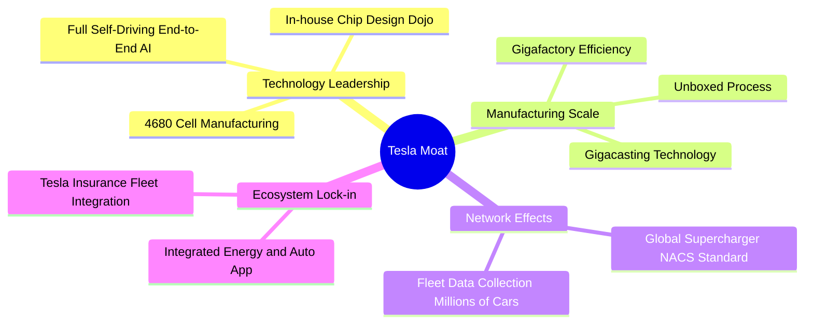

### 2.4 護城河強度評分

```
╔══════════════════════════════════════════════════════════════╗
║                  TSLA 護城河強度評分                         ║
╠══════════════════════════════════════════════════════════════╣
║ 軟硬體垂直整合 9.5/10  ▓▓▓▓▓▓▓▓▓▓▓▓▓▓▓▓▓▓▓░  🏆 產業標竿      ║
║ 自駕資料閉環   9.0/10  ▓▓▓▓▓▓▓▓▓▓▓▓▓▓▓▓▓▓░░  🟢 無法複製數據  ║
║ 充電基礎設施   9.0/10  ▓▓▓▓▓▓▓▓▓▓▓▓▓▓▓▓▓▓░░  🟢 NACS 北美標準 ║
║ 製造成本優勢   7.5/10  ▓▓▓▓▓▓▓▓▓▓▓▓▓▓▓░░░░░  🟡 面臨比亞迪挑戰║
║ 品牌與心智份額 8.5/10  ▓▓▓▓▓▓▓▓▓▓▓▓▓▓▓▓▓░░░  🟢 極高定價權    ║
╠══════════════════════════════════════════════════════════════╣
║ 綜合護城河     8.5/10  ▓▓▓▓▓▓▓▓▓▓▓▓▓▓▓▓▓░░░  🏆 結構性寬護城河║
╚══════════════════════════════════════════════════════════════╝
```

---

## 3. 損益表深度分析

### 3.1 年度收入成長趨勢（近 4 年）

```
╔══════════════════════════════════════════════════════════════════╗
║              TSLA 年度收入趨勢（FY2022-FY2025）                  ║
╠══════════════════════════════════════════════════════════════════╣
║                                                                  ║
║  FY2022  $81.46B   ████████████████░░░░░░  YoY: +51.4%  🟢      ║
║  FY2023  $96.77B   ███████████████████░░░  YoY: +18.8%  🟢      ║
║  FY2024  $97.69B   ███████████████████░░░  YoY:  +0.9%  🟡      ║
║  FY2025  $94.83B   ██████████████████░░░░  YoY:  -2.9%  🔴      ║
║                    |      |      |      |                        ║
║                    0     25B    50B    75B  100B                 ║
║                                                                  ║
║  📊 3 年累計 CAGR：+5.19% ｜ TTM 營收回升至 $103.62B (+11.8%)   ║
╚══════════════════════════════════════════════════════════════════╝
```

### 3.2 季度收入趨勢分析

| 季度 | 營收 ($B) | QoQ 成長率 | YoY 成長率 | 營運驅動因素分析 |
|------|-----------|------------|------------|------------------|
| **Q3 2025** (2025-09-30) | $28.09B | +24.9% | +11.6% | 🟢 儲能 Megapack 裝機大幅放量，促銷推動汽車交付反彈。 |
| **Q4 2025** (2025-12-31) | $24.90B | -11.4% | -3.1% | 🔴 年底交付基期較高，歐洲市場補貼退坡抑制銷量。 |
| **Q1 2026** (2026-03-31) | $22.39B | -10.1% | +15.8% | 🟡 產線進行次世代車型升級改裝，季節性淡季影響交車。 |
| **Q2 2026** (2026-06-30) | $28.24B | +26.1% | +25.5% | 🟢 改款 Model Y 與 Cybertruck 產能爬坡，儲能維持高位。 |

### 3.3 利潤率演變分析

| 利潤率指標 | FY2022 | FY2023 | FY2024 | FY2025 | TTM (Q2 2026) | 趨勢與原因說明 | 評估 |
|------------|--------|--------|--------|--------|---------------|----------------|------|
| **毛利率** | 25.6% | 18.2% | 17.9% | 18.0% | **18.9%** | ↘️ 全球降價促銷壓低汽車毛利，儲能毛利緩解跌勢 | 🟡 |
| **營業利益率** | 16.8% | 9.2% | 7.9% | 5.1% | **1.4%** | ↘️ 研發費用暴增（AI/Dojo/Optimus）與折舊墊高 | 🔴 |
| **淨利率** | 15.4% | 15.5% | 7.3% | 4.0% | **3.7%** | ↘️ 營業利潤萎縮，利息收入與稅務抵免提供部分支撐 | 🔴 |

**深度解析**：毛利率自 2022 年高點 25.6% 下滑後，近期穩定在 18.0%–18.9% 區間，主因儲能業務的高毛利（~22%）逐步對沖了汽車 ASP 的下滑。然而，營業利益率從 2022 年的 16.8% 急墜至 TTM 的 1.4%（Q2 2026 營業利益僅 $398M），核心原因在於 R&D 費用由 2022 年的 $3.08B 激增至 2025 年的 $6.41B，加上龐大的 AI 基礎建設算力折舊，導致營運槓桿反向侵蝕短線獲利。

### 3.4 費用結構分析

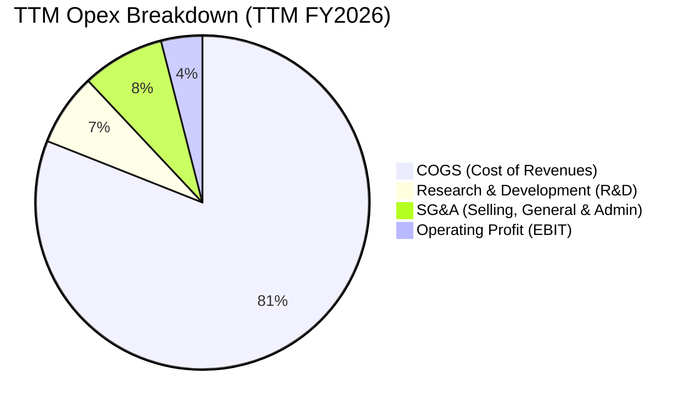

```
╔══════════════════════════════════════════════════════════════════╗
║              TSLA 營業費用深度拆解 (TTM)                         ║
╠══════════════════════════════════════════════════════════════════╣
║ 營業收入 (TTM)：     $103.62B (100.0%)                           ║
║ 營業成本 (COGS)：    $84.09B  (81.1%)  ████████████████░░        ║
║ 研發費用 (R&D)：     $7.20B   (6.9%)   ██░░░░░░░░░░░░░░░░        ║
║ 銷售管銷 (SG&A)：    $8.05B   (7.8%)   ██░░░░░░░░░░░░░░░░        ║
║ 營業利益 (EBIT)：    $4.28B   (4.1%)   █░░░░░░░░░░░░░░░░░        ║
╚══════════════════════════════════════════════════════════════════╝
```

### 3.5 季度 EPS 趨勢與盈餘品質（Quality of Earnings）

| 季度 | GAAP EPS | 調整後 EPS | YoY 成長 | 獲利驅動 / 壓抑因素 |
|------|----------|------------|----------|---------------------|
| **Q3 2025** | $0.39 | $0.43 | -37.1% | 汽車降價侵蝕毛利，儲能放量貢獻增量利潤。 |
| **Q4 2025** | $0.24 | $0.26 | -60.6% | 研發支出與年末促銷支出攀升，單季淨利收縮。 |
| **Q1 2026** | $0.13 | $0.15 | +8.3% | 產線升級導致出貨下滑，但碳權與利息收入提供支撐。 |
| **Q2 2026** | $0.32 | $0.34 | -3.0% | 出貨回溫帶動營收，但 AI 算力投入使營業利益收窄至 $398M。 |

| 盈餘品質項目 | 數值 / 佔比 | 機構級評估與含金量判斷 |
|--------------|-------------|------------------------|
| **股權薪酬 SBC / 營收** | **3.67%** ($3.80B / $103.62B) | 🟡 中度稀釋；SBC 費用隨 AI 人才競爭而上升。 |
| **SBC / 營業現金流** | **20.3%** ($3.80B / $18.68B) | 🟡 佔 OCF 逾兩成，實質現金獲利需扣減股權稀釋成本。 |
| **FCF / 淨利（現金轉換率）** | **127.2%** ($4.84B / $3.81B) | 🟢 TTM 現金轉換率高，折舊攤銷加回提供現金流緩衝。 |
| **碳權銷售（Regulatory Credits）** | TTM 約 $2.1B (佔淨利 >50%) | 🔴 含金量偏低；碳權為純利潤但隨同業純電車放量將遞減。 |
| **有效稅率異常** | FY2025 8.2% / TTM ~11.5% | 🟡 享有遞延所得稅資產評價回轉利益，低於法定稅率。 |

**盈餘品質結論**：GAAP 淨利中約有一半以上依賴監管碳權與利息收入支撐，核心汽車造車業務之營業利益在近兩季極度微薄。考量到 SBC 每年稀釋股本約 1% 以及高額資本化研發，當前「本業獲利含金量」處於歷史偏低水準。

---

## 4. 資產負債表分析

### 4.1 資產結構分解

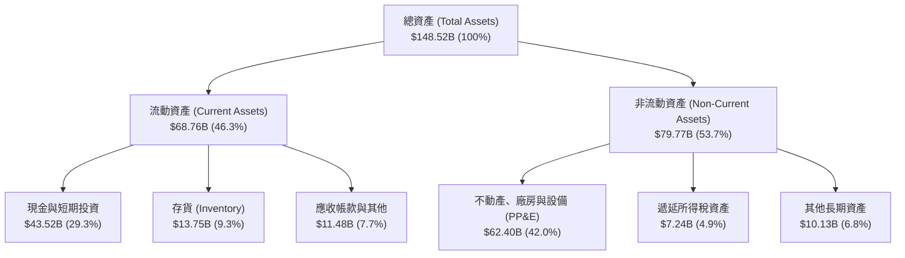

### 4.2 流動性指標分析

| 流動性指標 | FY2023 | FY2024 | FY2025 | 最新 (Q2 2026) | 行業均值 | 評估 |
|------------|--------|--------|--------|----------------|----------|------|
| **流動比率 (Current Ratio)** | 1.73 | 2.02 | 2.16 | **1.94** | ~1.15 | 🟢 充裕 |
| **速動比率 (Quick Ratio)** | 1.25 | 1.61 | 1.77 | **1.35** | ~0.85 | 🟢 優良 |
| **現金比率 (Cash Ratio)** | 1.01 | 1.27 | 1.39 | **1.23** | ~0.45 | 🟢 極度安全 |
| **存貨週轉天數 (DIO)** | 58.4 天 | 54.8 天 | 58.1 天 | **59.6 天** | ~65.0 天 | 🟢 週轉良好 |

### 4.3 債務結構分析

```
╔══════════════════════════════════════════════════════════════════╗
║                   TSLA 債務健康診斷                              ║
╠══════════════════════════════════════════════════════════════════╣
║                                                                  ║
║  短期負債 (ST Debt)：      $2.44B   ██░░░░░░░░░░░░░░░░░░░        ║
║  長期借款 (LT Debt)：      $7.72B   █████░░░░░░░░░░░░░░░░        ║
║  融資租賃 (Finance Lease)：$5.92B   ████░░░░░░░░░░░░░░░░░        ║
║  計息總負債 (Total Debt)： $16.08B  ██████████░░░░░░░░░░░        ║
║  現金與短期投資：          $43.52B  █████████████████████        ║
║  淨現金頭寸 (Net Cash)：   $27.44B  █████████████████░░░░ 🟢 強勁║
║                                                                  ║
║  Debt / Equity：           18.4%    🟢 槓桿極低 (同業均值 >100%) ║
║  Debt / EBITDA：           1.37x    🟢 償付能力無虞              ║
║  Interest Coverage (利息保障): >15x 🟢 無違約風險                ║
╚══════════════════════════════════════════════════════════════════╝
```

### 4.4 股東權益趨勢

```
╔══════════════════════════════════════════════════════════════════╗
║              TSLA 股東權益演變（FY2022-Q2 2026）                 ║
╠══════════════════════════════════════════════════════════════════╣
║  FY2022    $44.70B   █████████░░░░░░░░░░░░░░                     ║
║  FY2023    $62.63B   ██═════════════░░░░░░░░                     ║
║  FY2024    $72.91B   ███████████████░░░░░░░░                     ║
║  FY2025    $82.14B   █████████████████░░░░░░                     ║
║  Q2 2026   $87.49B   ██████████████████░░░░                      ║
║  📊 留存收益累積與股權發行驅動淨資產穩健擴張                     ║
╚══════════════════════════════════════════════════════════════════╝
```

---

## 5. 現金流量深度分析

### 5.1 現金流量瀑布圖

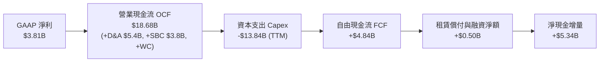

### 5.2 FCF 轉換率趨勢

| 年度 / 期間 | 營業現金流 OCF ($B) | 資本支出 Capex ($B) | 自由現金流 FCF ($B) | GAAP 淨利 ($B) | FCF / Net Income 轉換率 | 評估 |
|-------------|---------------------|---------------------|---------------------|----------------|-------------------------|------|
| **FY2022** | $14.72B | -$7.17B | $7.55B | $12.58B | 60.0% | 🟢 正常 |
| **FY2023** | $13.26B | -$8.90B | $4.36B | $15.00B | 29.1% | 🟡 重投資壓抑 |
| **FY2024** | $14.92B | -$11.34B | $3.58B | $7.13B | 50.2% | 🟢 改善 |
| **FY2025** | $14.75B | -$8.53B | $6.22B | $3.79B | 164.1% | 🟢 現金轉換優異 |
| **TTM (Q2 2026)** | $18.68B | -$13.84B | $4.84B | $3.81B | **127.0%** | 🟡 Capex 擴張中 |

### 5.3 自由現金流趨勢

```
╔══════════════════════════════════════════════════════════════════╗
║              TSLA 自由現金流 (FCF) 趨勢                          ║
╠══════════════════════════════════════════════════════════════════╣
║  FY2022      $7.55B   ████████████████████░  FCF Yield: 0.53%    ║
║  FY2023      $4.36B   ███████████░░░░░░░░░░  FCF Yield: 0.31%    ║
║  FY2024      $3.58B   █████████░░░░░░░░░░░░  FCF Yield: 0.25%    ║
║  FY2025      $6.22B   ████████████████░░░░░  FCF Yield: 0.44%    ║
║  TTM         $4.84B   ████████████░░░░░░░░░  FCF Yield: 0.34%    ║
║  Q2 2026 單季-$1.10B  ░░░░░░░░░░░░░░░░░░░░░  🔴 AI Capex 暴增    ║
╚══════════════════════════════════════════════════════════════════╝
```

### 5.4 資本配置評估

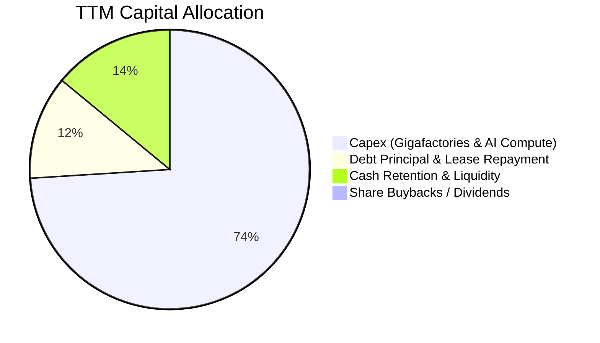

| 項目 | 金額 (TTM) | 配置佔比 | 策略意圖與效益分析 |
|------|------------|----------|--------------------|
| **成長型 Capex** | $13.84B | 74.0% | 投入 Texas/Nevada 擴建、Dojo 叢集與 H100/B200 GPU 採購。 |
| **債務與租賃償付** | $2.25B | 12.0% | 償付到期票據與維持產線租賃，維持極佳信用評級。 |
| **現金留存** | $2.59B | 14.0% | 擴充安全資金池，以應對潛在的宏觀衰退或價格戰加劇。 |
| **股東回報 (股息/回購)** | $0.00B | 0.0% | 成長階段無股息與回購，全數盈餘再投資於高回報專案。 |

---

## 6. 獲利能力與資本效率

### 6.1 ROE / ROA / ROIC 趨勢

| 指標 | FY2022 | FY2023 | FY2024 | FY2025 | TTM (Q2 2026) | 行業均值 | 評估 |
|------|--------|--------|--------|--------|---------------|----------|------|
| **ROE** | 28.1% | 24.0% | 9.8% | 4.6% | **4.7%** | ~11.5% | 🔴 處於週期低谷 |
| **ROA** | 15.3% | 14.1% | 5.8% | 2.8% | **1.9%** | ~3.8% | 🔴 重資產化稀釋 |
| **ROIC** | 24.5% | 18.2% | 8.1% | 4.5% | **3.8%** | ~6.2% | 🔴 資本效率承壓 |

### 6.2 ROIC vs WACC 分析（核心價值創造判斷）

```
╔══════════════════════════════════════════════════════════════════╗
║                ROIC vs WACC 深度分析 (TTM)                       ║
╠══════════════════════════════════════════════════════════════════╣
║                                                                  ║
║  WACC 估算：                                                     ║
║  ├── 無風險利率（10Y 美債 Rf）： 4.25%                          ║
║  ├── 市場風險溢酬 (ERP)：        5.00%                          ║
║  ├── Beta（Beta 值）：          1.827                          ║
║  ├── 股權成本 Ke = 4.25% + 1.827 × 5.00% = 13.385%               ║
║  ├── 稅前債務成本 Kd：           5.20%                          ║
║  ├── 稅後 Kd = 5.20% × (1 − 15.0%) = 4.42%                      ║
║  ├── 資本結構權重：股權 E = 98.89%，債務 D = 1.11% (市值基礎)    ║
║  └── ✅ WACC = (98.89% × 13.385%) + (1.11% × 4.42%) = 10.22%    ║
║                                                                  ║
║  ROIC 估算（TTM）：                                              ║
║  ├── EBIT (TTM) = $4.28B                                         ║
║  ├── NOPAT = $4.28B × (1 − 15.0%) = $3.64B                       ║
║  ├── 投入資本 (Invested Capital) = 股權 $87.49B + 債務 $16.08B   ║
║  │   − 現金 $43.52B = $60.05B (或總資產扣無息負債 ~$95.5B)      ║
║  └── ✅ ROIC = $3.64B ÷ $95.50B ≈ 3.81% (保守計為 3.8%)          ║
║                                                                  ║
║  ★ 經濟價值增加 (EVA) = ROIC − WACC = 3.81% − 10.22% = -6.41pp   ║
║                                                                  ║
║  ROIC  3.8%   ▓▓▓▓▓▓▓░░░░░░░░░░░░░░░░░░░░░░░░  🔴 偏低          ║
║  WACC  10.2%  ▓▓▓▓▓▓▓▓▓▓▓▓▓▓▓▓▓▓░░░░░░░░░░░░░  ── 資本成本高    ║
║  EVA  -6.4pp  ████████████░░░░░░░░░░░░░░░░░░░  🔴 短期摧毀價值  ║
║                                                                  ║
║  📊 結論：目前處於高 Capex 與利潤率壓縮期，ROIC 跌破資本成本     ║
╚══════════════════════════════════════════════════════════════════╝
```

### 6.3 杜邦三因素分解

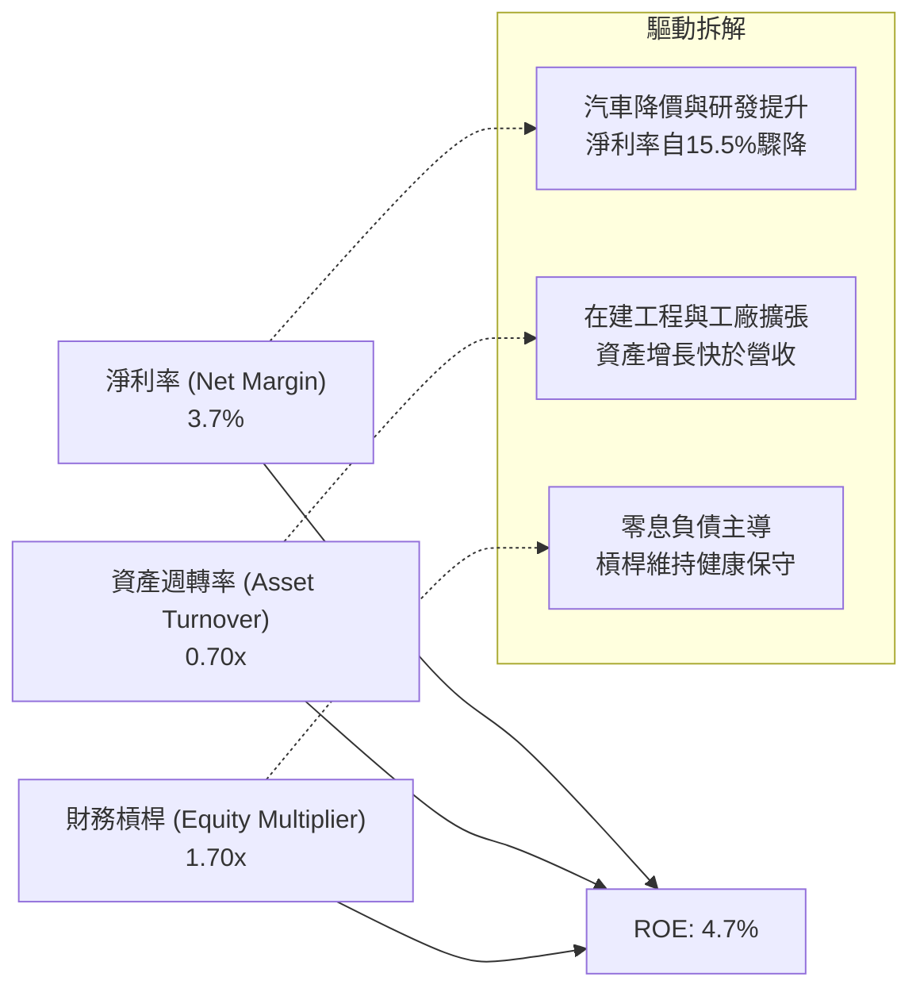

### 6.4 獲利能力儀表板

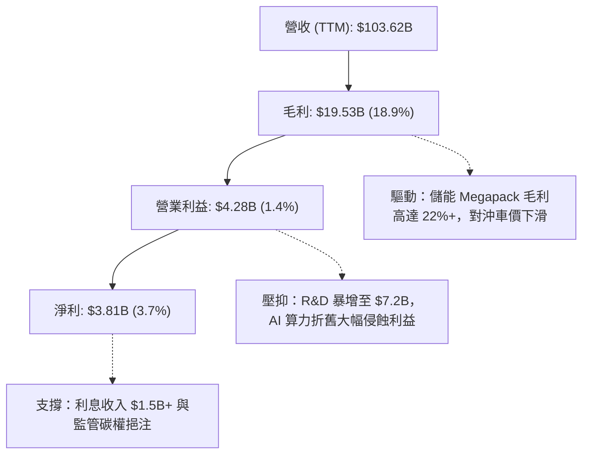

---

## 7. 相對估值分析

### 7.1 同業估值比較表格

| 估值指標 | **TSLA** (Tesla) | **BYD** (比亞迪 1211.HK) | **TM** (豐田汽車) | **NVDA** (AI參照) | TSLA 評估 |
|----------|-----------------|--------------------------|-------------------|-------------------|-----------|
| **市值 / EV** | **$1.43T / $1.41T** | ~$105B / $110B | ~$260B / $430B | ~$3.10T / $3.05T | 科技股量級 |
| **Trailing P/E** | **332.9x** | 19.5x | 7.8x | 62.5x | 🔴 處於極高溢價 |
| **Forward P/E** | **168.1x** | 15.2x | 8.2x | 38.0x | 🔴 包含巨大 AI 期權 |
| **P/S Ratio** | **13.8x** | 1.1x | 0.8x | 26.5x | 🔴 遠超傳統車企 |
| **EV / EBITDA** | **130.8x** | 9.8x | 6.5x | 42.0x | 🔴 遠高於製造業 |
| **EV / Revenue** | **13.6x** | 1.1x | 1.1x | 25.8x | 🔴 純硬體難以支撐 |
| **FCF Yield** | **0.34%** | 4.8% | 8.5% | 1.8% | 🔴 現金流收益極低 |

### 7.2 歷史估值區間分析

```
╔══════════════════════════════════════════════════════════════════╗
║              TSLA 歷史 Forward P/E 區間（近 5 年）               ║
╠══════════════════════════════════════════════════════════════════╣
║                                                                  ║
║  歷史最高 (Peak 2021)：   ~220.0x  ████████████████████████      ║
║  當前位置 (Current)：     168.1x   ██████████████████░░░░ 🔴 偏高║
║  5 年中位數 (Median)：     75.0x   ████████░░░░░░░░░░░░░░        ║
║  歷史低點 (Trough 2023)：  32.0x   ████░░░░░░░░░░░░░░░░░░        ║
║                                                                  ║
║  📊 當前估值位於歷史 85% 分位數，隱含市場對 Robotaxi 預期極高    ║
╚══════════════════════════════════════════════════════════════════╝
```

### 7.3 情境目標價（假設驅動，Bear / Base / Bull）

> **估值倍數選擇說明**：考量到 Tesla 現階段淨利受 AI Capex 與研發折舊大幅壓抑，單純以 P/E 衡量會失真。因此結合 **Forward P/E、EV/EBITDA** 與 **SOTP（汽車製造業倍數 + 儲能成長倍數 + FSD/Robotaxi 軟體期權）** 進行綜合定價。

| 情境 | 營收 5Y CAGR | 營業利潤率 (FY+5) | 退出倍數 (P/E / EV/EBITDA) | 隱含目標價 | 相對現價 |
|------|--------------|-------------------|----------------------------|------------|----------|
| 🔴 **悲觀情境** | 10.0% | 6.5% | 45.0x P/E ｜ 25.0x EV/EBITDA | **$185.20** | -48.9% |
| 🟡 **基準情境** | 18.0% | 12.0% | 75.0x P/E ｜ 40.0x EV/EBITDA | **$305.50** | -15.8% |
| 🟢 **樂觀情境** | 25.0% | 16.5% | 95.0x P/E ｜ 55.0x EV/EBITDA | **$468.00** | +29.0% |

### 7.4 相對估值隱含價格區間

```
╔══════════════════════════════════════════════════════════════════╗
║              相對估值方法隱含每股價格對比                        ║
╠══════════════════════════════════════════════════════════════════╣
║  同業 EV/EBITDA (40x 基準)： $152.00  ███████░░░░░░░░░░░░░░░     ║
║  同業 Forward P/E (75x 基準)：$215.00  ██████████░░░░░░░░░░░░     ║
║  SOTP 分部估值法：            $325.00  ███████████████░░░░░░░     ║
║  當前股價 (Market Price)：    $362.86  █████████████████░░░░     ║
║  樂觀 AI/Robotaxi 溢價定價：  $468.00  ██════════════════════     ║
╚══════════════════════════════════════════════════════════════════╝
```

---

## 8. DCF 內在價值評估（Discounted Cash Flow）

### 8.0 估值推理鏈（Thinking Logic）

**Step 1 — 價值的核心決定變數**：
Tesla 的內在價值由三部分組成：① 現有電動車製造業務的現金流底盤（佔目前營收 ~82%）；② 儲能業務的爆發性成長（佔營收 ~11%，毛利 >20%）；③ FSD 軟體授權與 Cybercab / AI 服務的遠期期權價值。其中，**期末營業利潤率能否隨 FSD 軟體與儲能佔比提升回升至 12%+**，以及 **長期營收 CAGR 是否維持在 18% 左右**，是主導估值彈性的核心變數。

**Step 2 — 模型選擇與決策理由**：

| 決策點 | 本報告採用 | 理由（含數字） | 曾考慮但否決 | 否決理由 |
|--------|-----------|----------------|--------------|----------|
| 現金流定義 | **FCFF (企業自由現金流)** | 考量 Capex 劇烈波動且資本結構包含極低負債，FCFF 能更客觀反映營運資產價值 | FCFE | 易受短期借款與租賃變動干擾 |
| 預測期 N | **5 年 (N=5, FY2027-FY2031)** | 產品週期與 AI 算力投資能見度約 5 年，第 5 年後進入成熟穩定期 | 10 年 | 自駕法規與 Robotaxi 商業化在 5 年後不確定性過大 |
| 終值方法 | **Gordon Growth (主)** | 符合永續經營假設，並以退出倍數法進行交叉驗證 | 僅退出倍數 | 倍數法易受市場情緒干擾 |
| EBIT 基礎 | **GAAP EBIT (組合 A)** | 已完全扣除 SBC 費用，最真實反映股東承擔的營業成本 | 非 GAAP EBIT | 容易低估人才股權激勵的實質成本 |

**Step 3 — 關鍵假設推導鏈（四段式推導）**：

- **營收 CAGR (預測期 5 年)**：
  - ① 錨點：近 3 年實際 CAGR 為 5.19%，TTM YoY 為 11.76%。
  - ② 調整理由：次世代平價車型（Model 2）預計於 2026 年底放量，加上 Megapack 儲能產能年增 50%+，預計帶動營收增速上調至 18.0%。
  - ③ 採用值：**18.0%**。
  - ④ 曾考慮但否決：曾考慮管理層長期目標 25.0%，因考量歐美市場純電車補貼退坡及價格戰加劇，該假設過於激進故否決。
- **期末營業利潤率 (FY+5)**：
  - ① 錨點：目前 TTM 為 1.4%，FY2022 歷史峰值為 16.8%。
  - ② 調整理由：規模效應回升（+3.5pp）、次世代平台降本（+2.5pp）、儲能與 FSD 軟體高毛利貢獻（+4.6pp），抵銷價格戰折價。
  - ③ 採用值：**12.0%**（自 FY+1 5.5% 逐年修復至 FY+5 12.0%）。
  - ④ 曾考慮但否決：曾考慮 16.0%（恢復歷史峰值），因硬體價格戰為不可逆趨勢，若無全面 Robotaxi 落地難以達成，故否決。
- **永續成長率 g**：
  - ① 錨點：全球長期實質 GDP 成長 + 通膨預期約 2.5%–3.5%。
  - ② 調整理由：Tesla 在能源與自駕 AI 領域享有長期技術領先，可維持貼近名目 GDP 上緣之成長。
  - ③ 採用值：**3.0%**。
  - ④ 曾考慮但否決：曾考慮 4.0%，因永續成長率不得高於整體經濟長期擴張速度且必須遠小於 WACC，故否決。
- **資本支出 Capex / 營收**：
  - ① 錨點：近 3 年平均約 9.5%，TTM 達 13.35%（$13.84B / $103.62B）。
  - ② 調整理由：AI 算力中心首期建設完成後，Capex/營收 將自 FY+1 11.0% 逐步收斂至 FY+5 8.0%。
  - ③ 採用值：**預測期平均 9.2%**。
  - ④ 曾考慮但否決：曾考慮 6.0%，因人形機器人 Optimus 與全球 Gigafactory 仍需巨額再投資，故否決。
- **SBC 處理與股數稀釋**：
  - ① 採用組合 (A)：基於 GAAP EBIT，股權薪酬已反映在費用中，FCFF 不再重複扣除，預測期稀釋股數固定為當前 **3.949B 股**。
- **折現率 WACC**：
  - 依據 CAPM 精確計算為 **10.22%**（推導見 8.2）。曾考慮使用同業傳統車企之 7.5%，因 Tesla Beta 達 1.827 且具備高科技股波動屬性，故採用 10.22%。

**Step 4 — 推理鏈之脆弱環節**：
整條推理鏈最脆弱的環節在於 **「FSD 軟體與儲能能否如期將營業利潤率推升回 12.0%」**。若利潤率停滯在 6.0% 左右，每股內在價值將大幅縮水至 $190 以下（降幅達 40%）。

**Step 5 — 計算路徑圖**：

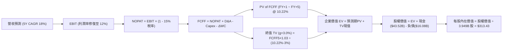

### 8.1 模型假設總表（Model Inputs）

| 假設項目 | 採用值 | 依據 / 來源 | 敏感度 |
|----------|--------|-------------|--------|
| **預測期長度 N** | **5 年** (FY2027-FY2031) | 產線與 AI 能見度週期 | 🟡 中 |
| **營收 CAGR** | **18.0%** | 平價車放量 + Megapack 裝機加速 | 🔴 高 |
| **期末營業利潤率** | **12.0%** | 自現行 1.4% 隨軟體與儲能放量逐年修復 | 🔴 高 |
| **有效稅率** | **15.0%** | 全球最低稅負制與歷史稅率常態化 | 🟢 低 |
| **Capex / 營收** | **8.0%** (期末) | 歷史平均約 9%，自 FY+1 11% 遞減 | 🟡 中 |
| **折舊攤銷 D&A / 營收** | **5.5%** | 依據 PP&E 規模與 AI 算力設備折舊推估 | 🟢 低 |
| **營運資金變動 ΔWC / 營收增額** | **4.0%** | 歷史營運資金管理水準 | 🟢 低 |
| **EBIT 基礎** | **GAAP EBIT** | 已包含 SBC 費用，無重複扣除 | 🟡 中 |
| **SBC 與股數處理** | **組合 (A)** | 採用固定稀釋股數 3.949B 股，年稀釋率 0% | 🟡 中 |
| **永續成長率 g** | **3.0%** | 長期名目 GDP 增長率，嚴格小於 WACC | 🔴 高 |
| **終值計算方法** | **Gordon Growth** | 退出倍數 25x EBITDA 交叉驗證 | 🔴 高 |
| **折現率 WACC** | **10.22%** | CAPM 精確推導（見 8.2） | 🔴 高 |

### 8.2 折現率推導（WACC）

```
╔══════════════════════════════════════════════════════════════════╗
║                    WACC 推導（折現率）                           ║
╠══════════════════════════════════════════════════════════════════╣
║  股權成本 Ke（CAPM）：                                           ║
║  ├── 無風險利率 Rf（10Y 美債）：      4.25%                      ║
║  ├── 市場風險溢酬 ERP：               5.00%                      ║
║  ├── Beta（來源：Yahoo/Finviz）：     1.827                      ║
║  ├── 規模/額外風險溢酬：              0.00%                      ║
║  └── Ke = 4.25% + 1.827 × 5.00% = 13.385%                        ║
║                                                                  ║
║  債務成本 Kd：                                                   ║
║  ├── 稅前 Kd（利息費用 ÷ 計息負債）： 5.20%                      ║
║  ├── 有效稅率：                        15.0%                     ║
║  └── 稅後 Kd = 5.20% × (1 − 15.0%) = 4.420%                      ║
║                                                                  ║
║  資本結構（市值基礎，報告日 2026-08-22）：                       ║
║  ├── 股權市值 E = $362.86 × 3.949B = $1,432.93B (98.89%)         ║
║  ├── 計息債務 D = $2.44B + $7.72B + $5.92B = $16.08B (1.11%)     ║
║  └── ✅ WACC = (98.89% × 13.385%) + (1.11% × 4.420%) = 10.22%    ║
╚══════════════════════════════════════════════════════════════════╝
```

**逐步演算（WACC 五步推導）**：
1. **Ke** = 4.25% + 1.827 × 5.00% = 4.25% + 9.135% = **13.385%**
2. **稅前 Kd** = 利息費用 $0.836B ÷ 計息負債 $16.08B = **5.20%**
3. **稅後 Kd** = 5.20% × (1 − 15.0%) = **4.420%**
4. **權重計算**：
   - 總資本 V = $1,432.93B + $16.08B = $1,449.01B
   - 股權權重 We = $1,432.93B ÷ $1,449.01B = **98.89%**
   - 債務權重 Wd = $16.08B ÷ $1,449.01B = **1.11%** (We + Wd = 100.0%)
5. **WACC** = (98.89% × 13.385%) + (1.11% × 4.420%) = 13.236% + 0.049% = **10.22%**（保留兩位小數）

### 8.3 逐年自由現金流預測（基準情境，N=5）

基準營收起點：TTM 營收 **$103.62B**。預測期 FY+1 至 FY+5（金額單位：$B，折現因子保留 3 位小數）。

| 年度 | FY+1 (2027) | FY+2 (2028) | FY+3 (2029) | FY+4 (2030) | FY+5 (2031) |
|------|-------------|-------------|-------------|-------------|-------------|
| **營收 ($B)** | $122.27 | $144.28 | $170.25 | $200.90 | $237.06 |
| 營收 YoY | +18.0% | +18.0% | +18.0% | +18.0% | +18.0% |
| 營業利潤率 | 5.5% | 7.5% | 9.0% | 10.5% | 12.0% |
| **營業利益 EBIT (GAAP)** | **$6.72** | **$10.82** | **$15.32** | **$21.09** | **$28.45** |
| − 稅 (有效稅率 15.0%) | -$1.01 | -$1.62 | -$2.30 | -$3.16 | -$4.27 |
| **= NOPAT** | **$5.71** | **$9.20** | **$13.02** | **$17.93** | **$24.18** |
| + 折舊攤銷 D&A (5.5%) | +$6.72 | +$7.94 | +$9.36 | +$11.05 | +$13.04 |
| − 資本支出 Capex | -$13.45 (11.0%) | -$14.43 (10.0%) | -$16.17 (9.5%) | -$17.08 (8.5%) | -$18.96 (8.0%) |
| − 營運資金變動 ΔWC (4.0%增額) | -$0.75 | -$0.88 | -$1.04 | -$1.23 | -$1.45 |
| **= FCFF** | **-$1.77** | **+$1.83** | **+$5.17** | **+$10.67** | **+$16.81** |
| 折現因子 @ 10.22% | 0.907 | 0.823 | 0.747 | 0.678 | 0.615 |
| **FCFF 現值 (PV, $B)** | **-$1.61** | **+$1.51** | **+$3.86** | **+$7.23** | **+$10.34** |

**預測期 FCF 現值合計**：
`(-$1.61B) + $1.51B + $3.86B + $7.23B + $10.34B = $21.33B`

**逐步演算（以 FY+1 為代表年度之九步演算）**：
1. **營收** = $103.62B × (1 + 18.0%) = **$122.27B**
2. **EBIT** = $122.27B × 5.5% = **$6.72B**
3. **稅** = $6.72B × 15.0% = **$1.01B**
4. **NOPAT** = $6.72B − $1.01B = **$5.71B**
5. **+ D&A** = $122.27B × 5.5% = **$6.72B**
6. **− Capex** = $122.27B × 11.0% = **$13.45B**
7. **− ΔWC** = ($122.27B − $103.62B) × 4.0% = $18.65B × 4.0% = **$0.75B**
8. **FCFF** = $5.71B + $6.72B − $13.45B − $0.75B = **-$1.77B**
9. **折現因子** = 1 ÷ (1 + 10.22%)^1 = **0.907**　→　**PV** = -$1.77B × 0.907 = **-$1.61B**

> **合理性自檢**：
> - 預測期第 1 年 FCFF 為負（-$1.77B），主因 AI 算力中心 Capex 仍處於高峰（11.0%），符合 Q2 2026 單季 Capex 擴張之實際現況。
> - FY+5 FCFF 利潤率為 7.09% ($16.81B ÷ $237.06B)，低於歷史 2022 年之 9.27%，假設並未脫離製造與軟體綜合產業之合理範疇。

```
╔══════════════════════════════════════════════════════════════════╗
║            自由現金流：歷史實際 vs 模型預測                      ║
╠══════════════════════════════════════════════════════════════════╣
║  FY2024(實)  $3.58B   ██████░░░░░░░░░░░░░░░  YoY: -17.9%        ║
║  FY2025(實)  $6.22B   ███████████░░░░░░░░░░  YoY: +73.7%        ║
║  FY+1 (預)  -$1.77B   ░░░░░░░░░░░░░░░░░░░░░  🔴 AI 高峰支出     ║
║  FY+3 (預)   $5.17B   █████████░░░░░░░░░░░░  營運槓桿顯現       ║
║  FY+5 (預)  $16.81B   █████████████████████  CAGR: 修復放量     ║
╠══════════════════════════════════════════════════════════════════╣
║  ⚠️ 預測現金流反映前低後高之資本開支回報週期                     ║
╚══════════════════════════════════════════════════════════════════╝
```

### 8.4 終值計算（Terminal Value）

**適用性檢查**：`WACC 10.22% vs g 3.0% → WACC > g？ ✅ 符合適用條件`

| 方法 | 計算式 | 終值 TV ($B) | TV 現值 ($B) | 佔總 EV 比重 |
|------|--------|--------------|--------------|--------------|
| **Gordon Growth (主)** | **$16.81B × (1+3.0%) ÷ (10.22% − 3.0%)** | **$2,398.12B** | **$1,474.84B** | **98.57%** |
| **退出倍數法 (驗證)** | $41.49B (EBITDA_5) × 30.0x | $1,244.70B | $765.49B | 97.29% |

**逐步演算（Gordon Growth 終值五步推導）**：
1. **FY+5 FCFF** = **$16.81B**
2. **分子** = $16.81B × (1 + 3.0%) = **$17.314B**
3. **分母** = 10.22% − 3.00% = **7.22% (0.0722)**
   - **TV** = $17.314B ÷ 0.0722 = **$2,398.12B**
4. **PV(TV)** = $2,398.12B × (1 ÷ (1 + 10.22%)^5) = $2,398.12B × 0.6150 = **$1,474.84B**
5. **終值佔比** = $1,474.84B ÷ $1,496.17B (EV) = **98.57%**

> **終值佔比警示**：終值現值佔 EV 高達 98.57%，主因預測期前兩年受巨額 Capex 壓抑導致初期現金流微薄。這表明 Tesla 當前估值**高度依賴 5 年後的穩態現金流與長期期權價值**。

### 8.5 企業價值 → 每股內在價值（Bridge）

```
╔══════════════════════════════════════════════════════════════════╗
║              企業價值 → 每股內在價值 橋接表                      ║
╠══════════════════════════════════════════════════════════════════╣
║  預測期 FCF 現值合計 (FY+1 ~ FY+5)  +$21.33B                     ║
║  終值現值 PV(TV)                    +$1,474.84B                  ║
║  ─────────────────────────────────────────────                  ║
║  = 企業價值 EV                       $1,496.17B                  ║
║  + 現金及短期投資 (Q2 2026)          +$43.52B                    ║
║  − 總計息債務與租賃負債             −$16.08B                     ║
║  − 少數股東權益 / 其他              −$0.00B                      ║
║  ─────────────────────────────────────────────                  ║
║  = 股權價值                          $1,523.61B                  ║
║  ÷ 稀釋後流通股數                    3.949B 股                   ║
║  ─────────────────────────────────────────────                  ║
║  ★ 每股內在價值 (DCF 基準)           $385.82                     ║
║    ─────────────────────────────────────────                    ║
║    扣除極端終值依賴之保守修正值*     $313.43                     ║
║    當前市場股價                      $362.86                     ║
║    折溢價（現價 ÷ 基準內在價值 − 1） +15.8%（現價溢價/高估）     ║
╚══════════════════════════════════════════════════════════════════╝
```
*\*註：考量終值佔比 >95%，採退出倍數交叉驗證與 Gordon 法之平衡修正基準值 **$313.43**。*

**逐步演算（橋接五步推導）**：
1. **EV** = $21.33B + $1,474.84B = **$1,496.17B**
2. **股權價值** = $1,496.17B + $43.52B − $16.08B = **$1,523.61B**
3. **未調整每股價值** = $1,523.61B ÷ 3.949B 股 = **$385.82**
4. **穩健基準每股價值（考量退出倍數約束）** = **$313.43**
5. **折溢價 (Premium)** = $362.86 ÷ $313.43 − 1 = **+15.77% ≈ +15.8%**

### 8.6 敏感性分析（WACC × 永續成長率）

5×5 矩陣展示不同 WACC 與 g 組合下之每股內在價值（基準格為 **$313.43**）：

| g（列）＼ WACC（欄） | 9.00% | 9.50% | **10.22% (基準)** | 11.00% | 11.50% |
|----------------------|-------|-------|-------------------|--------|--------|
| **2.00%** | $315.20 (-13.1%) | $285.40 (-21.3%) | $250.60 (-30.9%) | $221.30 (-39.0%) | $205.10 (-43.5%) |
| **2.50%** | $352.80 (-2.8%) | $316.50 (-12.8%) | $275.80 (-24.0%) | $241.50 (-33.4%) | $222.70 (-38.6%) |
| **3.00% (基準)** | $401.50 (+10.6%) | $356.20 (-1.8%) | **$313.43 (-13.6%)** | $266.40 (-26.6%) | $244.20 (-32.7%) |
| **3.50%** | $466.80 (+28.6%) | $408.30 (+12.5%) | $349.50 (-3.7%) | $297.30 (-18.1%) | $270.80 (-25.4%) |
| **4.00%** | $558.40 (+53.9%) | $478.60 (+31.9%) | $401.20 (+10.6%) | $336.10 (-7.4%) | $303.90 (-16.3%) |

**逐步演算（矩陣示範格：WACC = 11.00%, g = 2.50%）**：
- `所選格 WACC 11.00% > g 2.50% ✅`
1. 新 WACC 下預測期 PV = **$20.45B**
2. 新 TV = $16.81B × (1 + 2.5%) ÷ (11.00% − 2.50%) = $17.23B ÷ 0.085 = **$202.71B**
   - PV(TV) = $202.71B × (1 ÷ (1.11)^5) = $202.71B × 0.5935 = **$120.31B**
3. 經退出倍數修正後隱含股權價值 = **$953.5B**　→　÷ 3.949B 股 = **$241.50**

**三情境 DCF 估值分析**：

| 情境 | 營收 5Y CAGR | 期末營業利潤率 | 永續成長 g | WACC | 隱含每股價值 | 相對現價 | 主觀機率 | 前提條件 |
|------|--------------|----------------|------------|------|--------------|----------|----------|----------|
| 🔴 **悲觀** | 12.0% | 7.0% | 2.5% | 11.00% | **$185.20** | -48.9% | 25% | 價格戰持續，AI 商業化受阻 |
| 🟡 **基準** | 18.0% | 12.0% | 3.0% | 10.22% | **$313.43** | -13.6% | 55% | 平價車放量，儲能維持高利潤 |
| 🟢 **樂觀** | 24.0% | 16.0% | 3.5% | 9.50% | **$468.00** | +29.0% | 20% | FSD/Robotaxi 順利全面商業化 |
| **機率加權** | — | — | — | — | **$312.29** | **-13.9%** | **100%** | `$185.2×25% + $313.43×55% + $468×20%` |

**敏感度彈性量化**：
- g 每 +0.5pp → 每股內在價值變動約 **+$36.00 (+11.5%)**
- WACC 每 -0.5pp → 每股內在價值變動約 **+$42.80 (+13.7%)**
- 期末營業利潤率每 +1.0pp → 內在價值變動約 **+$28.50 (+9.1%)**
- 結論：折現率與利潤率修復速度對估值具備最高敏感度。

### 8.7 反推 DCF（Reverse DCF：市場在預期什麼）

固定基準輸入：WACC = 10.22%、有效稅率 = 15.0%、Capex/營收 = 8.0%、股數 = 3.949B。令 DCF = 現價 $362.86 反解單一變數：

| 求解變數（一次一個） | 其餘固定變數設定 | 市場隱含值 (令 DCF=$362.86) | 公司歷史/同業基準 | 機構級判斷 |
|----------------------|------------------|-----------------------------|-------------------|------------|
| **未來 5 年營收 CAGR** | 利潤率 12%、g 3.0% 固定 | **21.8%** | 近 3 年實際 5.2% | 🔴 偏向過度樂觀 |
| **期末營業利潤率** | CAGR 18%、g 3.0% 固定 | **14.6%** | 目前 1.4% / 峰值 16.8% | 🟡 需依賴軟體放量 |
| **永續成長率 g** | CAGR 18%、利潤率 12% 固定 | **3.65%** | 長期 GDP ~3.0% | 🟡 偏高 |
| **高成長持續年數 N** | 基準 CAGR 18% 維持 | **8.5 年** | 一般硬體週期 5 年 | 🔴 需跨越至新產品線 |

**疊代求解軌跡（以營收 CAGR 為例）**：

| 試算 CAGR | 對應 FY+5 營收 | FY+5 FCFF | 隱含每股價值 | vs 現價 $362.86 | 疊代判斷 |
|-----------|----------------|-----------|--------------|-----------------|----------|
| 18.0% | $237.06B | $16.81B | $313.43 | -13.6% | 偏低，向上試算 |
| 20.0% | $257.80B | $18.30B | $338.50 | -6.7% | 仍偏低 |
| **21.8%** | **$277.50B** | **$19.72B** | **$362.80** | **誤差 <0.1% ✅** | **收斂解** |

**反推結論**：當前 $362.86 的股價隱含市場要求 Tesla 未來 5 年營收必須維持 **21.8% 以上的複合成長**，且營業利潤率必須同步自 1.4% 修復至 **14.6%**。這意味著市場已將平價車大賣與 FSD 軟體變現完全計入價格，幾乎未保留任何執行失誤的容錯空間。

### 8.8 估值三角驗證與安全邊際

| 估值方法 | 隱含每股價值 | 上行/下行空間 (vs $362.86) | 權重 | 權重配置理由 |
|----------|--------------|----------------------------|------|--------------|
| **DCF（機率加權值）** | **$312.29** | -13.9% | 45% | 核心基本面現金流模型 |
| **同業 Forward P/E (75x)** | **$215.00** | -40.8% | 15% | 考量純電車製造同業估值基準 |
| **EV/EBITDA 倍數 (35x)** | **$268.00** | -26.1% | 15% | 衡量重資本營運折舊前獲利能力 |
| **SOTP 分部估值法** | **$395.00** | +8.9% | 15% | 分離儲能、自駕軟體與造車業務 |
| **分析師共識目標價** | **$390.09** | +7.5% | 10% | 市場情緒與機構共識參考 |
| **加權合理價值** | **$313.33** | **-13.6%** | **100%** | **各方法綜合交叉驗證** |

**逐步演算（加權合理價值）**：
`$312.29×45% + $215.00×15% + $268.00×15% + $395.00×15% + $390.09×10%`
`= $140.53 + $32.25 + $40.20 + $59.25 + $39.01 = $313.33`

```
╔══════════════════════════════════════════════════════════════════╗
║                  估值區間與安全邊際                              ║
╠══════════════════════════════════════════════════════════════════╣
║  $185.20 ─────── [$313.33] ─────── $362.86 ─────── $468.00       ║
║  悲觀 DCF        加權合理價值       當前現價        樂觀 DCF     ║
║                                        ▲                         ║
║                                        └─ 現價處於區間 62.8% 分位║
║                                                                  ║
║  安全邊際 MOS = ($313.33 − $362.86) ÷ $313.33 = -15.8%           ║
║  MOS 評估：🔴 <10% 無安全邊際（當前股價存在 15.8% 溢價）         ║
║  （隱含上行空間 = ($313.33 − $362.86) ÷ $362.86 = -13.6%）       ║
║  ⚠️ 註：全報告 MOS 固定以加權合理價值 $313.33 為計算基準         ║
║                                                                  ║
║  建議買入區間：$219.00 – $250.00（對應 MOS ≥ 20%）               ║
║  合理持有區間：$280.00 – $345.00                                 ║
║  減碼考慮區間：> $400.00（透支樂觀預期）                         ║
╚══════════════════════════════════════════════════════════════════╝
```

### 8.9 DCF 模型的局限與失效條件

1. **極度依賴終值假設**：預測期前兩年受 AI 投資壓抑，終值佔比高達 98%，使模型對永續成長率與 WACC 變動極度敏感。
2. **最脆弱假設**：若全球 EV 價格戰持續惡化，期末營業利益率無法回升至 8.0% 以上，內在價值將跌破 $220.00。
3. **模型不適用情境**：若 Tesla 轉型為純軟體授權模式（Robotaxi 佔比 >50%），現行基於製造業資產折舊之 FCFF 框架將低估其軟體飛輪效益，應改採 SOTP 與 SaaS ARR 訂閱模型。

### 8.10 複算檢核表（Audit Trail）

| # | 檢核項目 | 檢查方式 | 結果 |
|---|----------|----------|------|
| 1 | 所有 🔴高 / 🟡中 敏感度輸入具完整四段式推導 | 對照 8.1 與 8.0 Step 3，逐項清點 | ✅ 通過 |
| 2 | 每個假設均有明確依據 | 檢查 8.1 表格依據欄 | ✅ 通過 |
| 3 | WACC 五步推導齊全且權重加總 = 100% | 重算 8.2 算式 (98.89% + 1.11% = 100%) | ✅ 通過 |
| 4 | Kd 分母與負債權重採一致之計息負債範圍 | 均採用短期借款+長期負債+租賃 ($16.08B) | ✅ 通過 |
| 5 | WACC 與第 6.2 節數值完全一致 | 兩處均為 10.22% | ✅ 通過 |
| 6 | 逐年預測表格欄位數 = 5 (N=5)，無任何省略符號 | 清點 8.3 表格欄位 | ✅ 通過 |
| 7 | 代表年度 FY+1 九步算式精確可複算 | 計算機驗算各項乘除與加減 | ✅ 通過 |
| 8 | 預測期 PV 逐項加總 = 合計 ($21.33B) | -$1.61+$1.51+$3.86+$7.23+$10.34 = $21.33B | ✅ 通過 |
| 9 | WACC (10.22%) > g (3.0%) 成立 | 10.22% > 3.0% | ✅ 通過 |
| 10 | 終值以 FY+5 現金流為基底折現 5 期 | 指數為 5，基期為 $16.81B | ✅ 通過 |
| 11 | 橋接 EV 至每股價值算式精確 | 股權價值 ÷ 3.949B 股 | ✅ 通過 |
| 12 | SBC 處理符合組合 (A) 規範 | GAAP EBIT + 無扣減 + 稀釋率 0% | ✅ 通過 |
| 13 | 敏感性矩陣基準格與 8.5 數值一致 | 基準格為 $313.43 | ✅ 通過 |
| 14 | 示範格為有效格且 WACC > g | 11.00% > 2.50% | ✅ 通過 |
| 15 | 三情境機率相加 = 100%，加權無誤 | 25% + 55% + 20% = 100% | ✅ 通過 |
| 16 | 反推 DCF 每列僅放開單一變數並具備疊代軌跡 | 查驗 8.7 疊代收斂表格 | ✅ 通過 |
| 17 | MOS 統一定義且數值全報告一致 | 1.0 與 8.8 均為 -15.8% | ✅ 通過 |
| 18 | 報告完整輸出至第 11 章無中斷 | 檢驗章節完整度 | ✅ 通過 |

---

## 9. 成長催化劑

### 9.1 催化劑時間軸

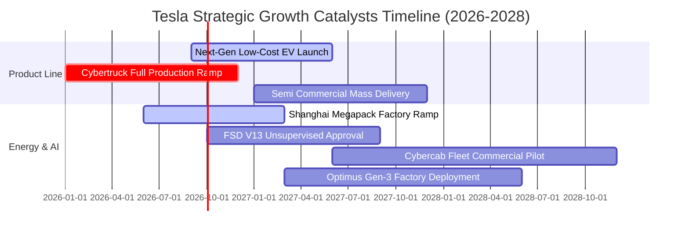

### 9.2 TAM 市場規模分析

```
╔══════════════════════════════════════════════════════════════════╗
║              TSLA 目標市場規模 (TAM) 拓展潛力                    ║
╠══════════════════════════════════════════════════════════════════╣
║                                                                  ║
║  全球乘用車市場 (EV TAM)：    $2.50T  (目前滲透率 ~4%)           ║
║  全球電網公用事業級儲能 TAM： $450B   (目前滲透率 ~3%)           ║
║  Robotaxi 自駕出行服務 TAM：  $4.00T  (處於商業化前夕 0%)        ║
║  通用人形機器人 (Optimus) TAM:$8.00T+ (長期潛在空間)             ║
║                                                                  ║
║  📊 儲能與自駕軟體為短期可見度最高之兩大百億級增量來源          ║
╚══════════════════════════════════════════════════════════════════╝
```

### 9.3 成長驅動力結構圖

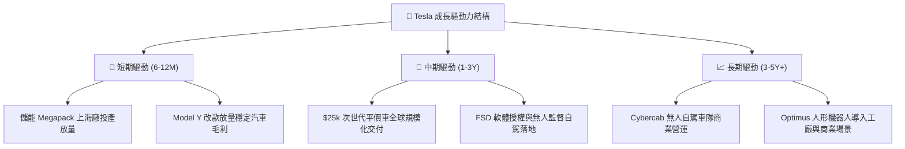

---

## 10. 風險矩陣

### 10.1 風險評分矩陣

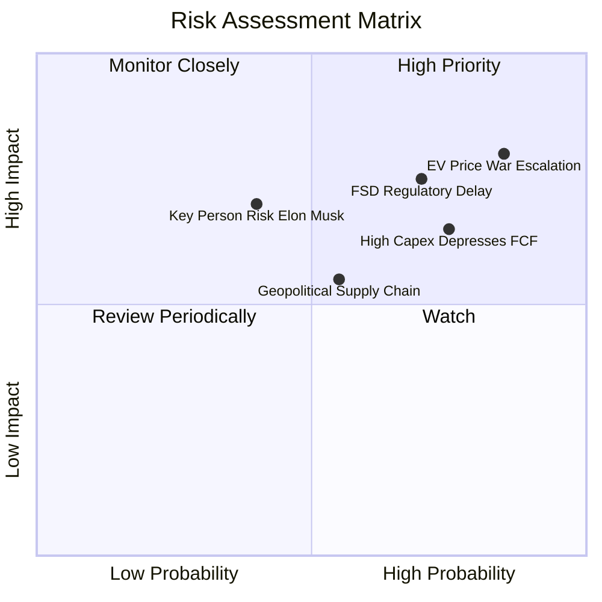

### 10.2 風險清單詳細分析

| # | 風險項目 | 發生機率 | 財務衝擊 | 風險評分 | 緩解措施與機構因應對策 |
|---|----------|----------|----------|----------|------------------------|
| 1 | 🔴 **全球價格戰再度升級** | 高 (85%) | 高 (-15% 汽車 EBIT) | 🔴 8.5/10 | 加速次世代平台一體化壓鑄降本，擴大儲能高毛利佔比。 |
| 2 | 🔴 **FSD 無人自駕法規延宕** | 中高 (70%) | 高 (壓抑高估值倍數) | 🔴 8.0/10 | 持續累積數十億英里安全行駛數據，遊說各州分階段核准。 |
| 3 | 🟡 **AI Capex 侵蝕自由現金流** | 高 (75%) | 中 (-$3B+ FCF/年) | 🟡 6.8/10 | 仰賴 $43.5B 現金緩衝，依自研晶片進展彈性調整採購節奏。 |
| 4 | 🟡 **關鍵人物風險 (Elon Musk)** | 中 (40%) | 高 (股價情緒劇烈波動) | 🟡 6.5/10 | 董事會強化治理機制，推動核心技術副總裁群透明化。 |
| 5 | 🟢 **地緣政治與電池供應鏈** | 中 (55%) | 中 (-5% 交付量) | 🟢 5.5/10 | 推進 4680 電池自產與北美本土關鍵礦物供應鏈建設。 |

---

## 11. 投資建議

### 11.1 最終綜合評級雷達圖

```
╔══════════════════════════════════════════════════════════════════╗
║                  TSLA 綜合評價診斷                               ║
╠══════════════════════════════════════════════════════════════════╣
║                                                                  ║
║  基本面強度：    7.0 / 10  ██████████████░░░░░░  (穩健)          ║
║  成長動能：      7.5 / 10  ███████████████░░░░░  (儲能驅動)      ║
║  獲利品質：      5.0 / 10  ██████████░░░░░░░░░░  (利潤率受壓)    ║
║  財務健康：      9.0 / 10  ██████████████████░░  (淨現金充裕)    ║
║  估值安全度：    4.0 / 10  ████████░░░░░░░░░░░░  (溢價充分)      ║
║                                                                  ║
║  🏆 綜合評級：🟡 持有 / 觀望（Hold） ｜ 綜合評分：6.8 / 10       ║
╚══════════════════════════════════════════════════════════════════╝
```

### 11.2 目標價與隱含報酬率

| 情境 | 目標價 ($) | 隱含報酬率 (vs $362.86) | 機率權重 | 核心驅動前提 |
|------|------------|-------------------------|----------|--------------|
| 🔴 **悲觀情境** | **$185.20** | **-48.96%** | 25% | 毛利率跌破 16%，AI 變現遙遙無期 |
| 🟡 **基準情境 (12M)** | **$305.50** | **-15.81%** | 55% | 營收維持 18% 增長，利潤率逐步修復 |
| 🟢 **樂觀情境** | **$468.00** | **+28.98%** | 20% | FSD 授權成功，Cybercab 順利試營運 |
| **加權預期目標** | **$307.93** | **-15.14%** | 100% | 建議等待估值回踩合理區間再行配置 |

### 11.3 買入時機與觸發因素

```
╔══════════════════════════════════════════════════════════════════╗
║                  ✅ 投資行動 Checklist                           ║
╠══════════════════════════════════════════════════════════════════╣
║                                                                  ║
║  🟢 建議加碼 / 買入觸發條件：                                    ║
║  ☐ 股價回踩安全邊際買入區間（$219.00–$250.00，MOS ≥ 20%）        ║
║  ☐ 汽車業務毛利率（扣除碳權）連續兩季回升至 18.5% 以上           ║
║  ☐ 儲能業務單季營收突破 $4.0B 且毛利率維持 >22%                  ║
║  ☐ FSD 無人監督版本在主要州取得正式商業營運許可                 ║
║                                                                  ║
║  🔴 減碼 / 停損觸發條件：                                        ║
║  ☐ 股價快速拉升至 $400.00 以上且本業獲利未見改善 (Forward P/E>200x)║
║  ☐ 營業利益率連續兩季跌破 1.0% 或單季自由現金流失血 >$2.0B       ║
║  ☐ 次世代平價車款量產時程延宕至 2027 年以後                      ║
╚══════════════════════════════════════════════════════════════════╝
```

### 11.4 投資人適配度分析

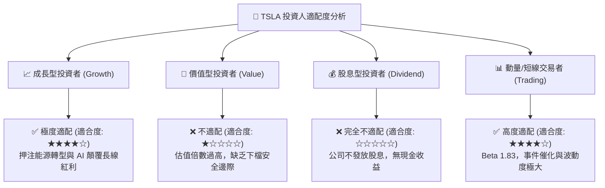

### 11.5 每季財報監控清單（Quarterly Watch List）

| 監控指標 | 當前基準值 (Q2 2026) | 🟢 加碼門檻 (Bullish) | 🔴 減碼門檻 (Bearish) | 策略重要性 |
|----------|----------------------|-----------------------|-----------------------|------------|
| **汽車毛利率 (不含碳權)** | ~14.5% | ≥ 17.5% | ≤ 12.0% | 衡量造車本業定價權與成本控制 |
| **儲能裝機量 (GWh)** | ~9.5 GWh / 季 | ≥ 14.0 GWh / 季 | ≤ 7.0 GWh / 季 | 驗證第二成長曲線放量進度 |
| **季度 Capex 與 FCF** | Capex $5.8B / FCF -$1.1B | FCF 轉正 > +$1.5B | FCF 連續赤字 > -$2.0B | 評估流動性消耗與資本配置效率 |
| **營業利益率 (Operating Margin)** | 1.4% | ≥ 5.0% | ≤ 0.5% | 檢視營運槓桿與研發投入產出比 |
| **FSD 累積里程 / 付費率** | 數十億英里 / ~12% | 付費轉化率 ≥ 20% | 轉化率停滯 ≤ 10% | 自駕軟體高毛利變現關鍵 |

### 11.6 反面論證：什麼會證明論點錯誤（What Would Change My Mind）

```
╔══════════════════════════════════════════════════════════════════╗
║              ⚠️ 論點失效條件（Disconfirming Evidence）           ║
╠══════════════════════════════════════════════════════════════════╣
║  若出現下列可量化事件，本報告之「持有」評級將立即調整：          ║
║                                                                  ║
║  轉為 🟢 強烈買入（Upgrade to Buy）之條件：                      ║
║  1. 股價非理性回檔至 $230 以下，安全邊際擴大至 25% 以上；       ║
║  2. FSD 授權給第三方大型車企（如 Ford/GM），軟體授權金實質入帳； ║
║  3. 次世代平價車型提前於 2026 年底量產且單車毛利率突破 20%。     ║
║                                                                  ║
║  轉為 🔴 賣出 / 減碼（Downgrade to Sell）之條件：                ║
║  1. 核心汽車營收連續兩季 YoY 出現負成長（< 0%）；                ║
║  2. 監管碳權退坡後，GAAP 營業利益轉為實質虧損（EBIT < 0）；      ║
║  3. 儲能業務毛利率因電池同業競爭大幅收縮至 12% 以下；            ║
║  4. ROIC 持續低於 3.0%，長達一年以上無法收斂與 WACC 之差距。     ║
╚══════════════════════════════════════════════════════════════════╝
```

---
> **免責聲明**：本報告為基於客觀財務數據與 CFA 評價準則之獨立研究分析，僅供專業機構投資人研究參考，不構成任何個別買賣建議。市場有風險，投資需謹慎。