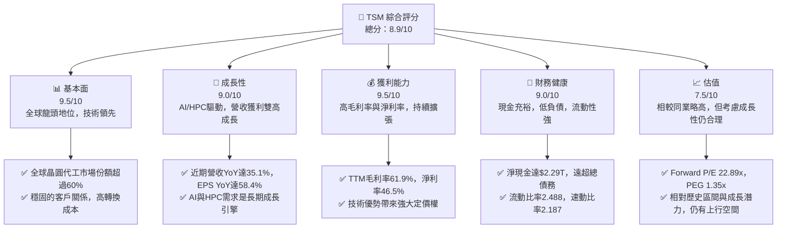
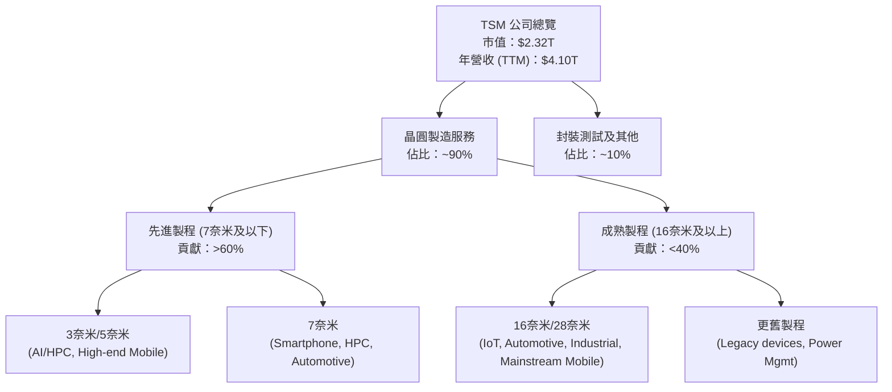
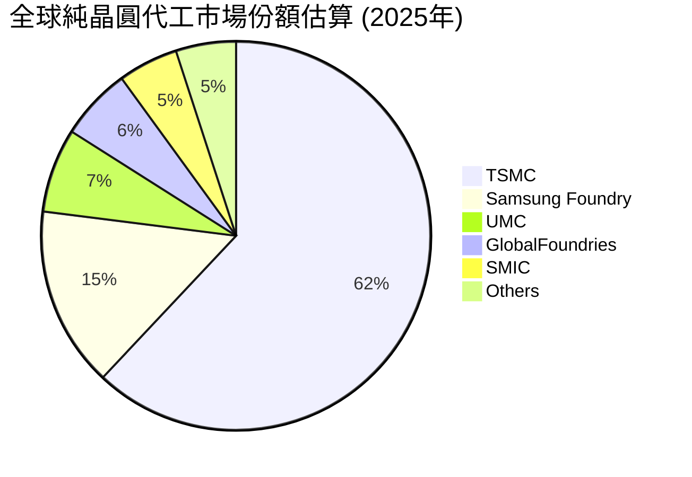
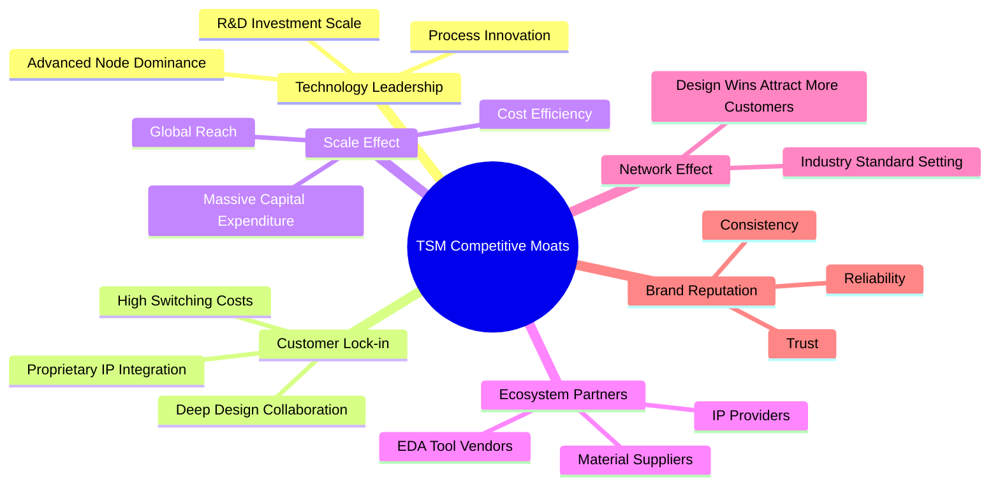
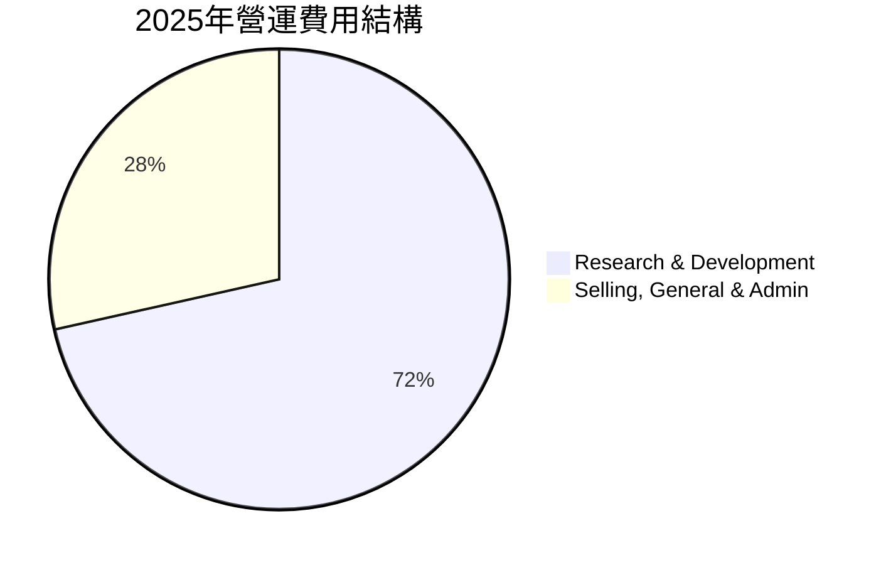

# TSM 基本面深度分析報告
> **報告日期**：2026-06-02 ｜ **語言**：繁體中文 ｜ **數據來源**：Yahoo Finance, Finviz, StockAnalysis, Roic.ai ｜ **分析師**：CFA 級機構研究

## 目錄

| # | 章節 | 核心結論 |
|---|------|----------|
| 1 | 執行摘要 | 評級：🟢 強烈買入，目標價區間：$510 - $650 |
| 2 | 公司概覽與商業模式 | 全球晶圓代工龍頭，先進製程技術護城河極深 |
| 3 | 損益表深度分析 | 收入與利潤強勁成長，利潤率維持高位且持續擴張 |
| 4 | 資產負債表分析 | 財務結構穩健，現金充裕，債務風險極低 |
| 5 | 現金流量深度分析 | 自由現金流強勁，資本效率高，具備可持續性 |
| 6 | 獲利能力與資本效率 | ROIC遠超WACC，強力創造股東價值 |
| 7 | 估值深度分析 | 相較於成長潛力與護城河，估值仍具吸引力 |
| 8 | 成長催化劑 | AI/HPC需求爆發，先進製程領導地位鞏固 |
| 9 | 風險矩陣 | 地緣政治與資本支出強度為主要風險，但可控 |
| 10 | 投資建議 | 強烈買入，具備長期成長與價值創造潛力 |

---

## 1. 執行摘要

台灣積體電路製造股份有限公司（TSM）作為全球最大的純晶圓代工廠，憑藉其無可匹敵的先進製程技術、龐大的規模經濟以及與全球頂尖IC設計公司的緊密合作，在半導體產業中佔據了核心地位。本報告透過深入的基本面分析、估值建模與產業研究，旨在為投資者提供TSM的全面視角。

### 1.1 核心評分儀表板



### 1.2 評分進度條視覺化

```
╔══════════════════════════════════════════════════════════════╗
║              TSM 多維度評分儀表板 (1-10分)                   ║
╠══════════════════════════════════════════════════════════════╣
║ 基本面強度  9.5 ▓▓▓▓▓▓▓▓▓▓▓▓▓▓▓▓▓▓▓░  ★★★★★           ║
║ 成長動能    9.0 ▓▓▓▓▓▓▓▓▓▓▓▓▓▓▓▓▓▓░░  ★★★★★           ║
║ 獲利品質    9.5 ▓▓▓▓▓▓▓▓▓▓▓▓▓▓▓▓▓▓▓░  ★★★★★           ║
║ 財務健康    9.0 ▓▓▓▓▓▓▓▓▓▓▓▓▓▓▓▓▓▓░░  ★★★★★           ║
║ 估值合理性  7.5 ▓▓▓▓▓▓▓▓▓▓▓▓▓▓▓░░░░░  ★★★★☆           ║
║ 護城河深度  9.8 ▓▓▓▓▓▓▓▓▓▓▓▓▓▓▓▓▓▓▓▓  ★★★★★           ║
║ 管理層執行  9.5 ▓▓▓▓▓▓▓▓▓▓▓▓▓▓▓▓▓▓▓░  ★★★★★           ║
║ 技術創新力  9.9 ▓▓▓▓▓▓▓▓▓▓▓▓▓▓▓▓▓▓▓▓  ★★★★★           ║
╠══════════════════════════════════════════════════════════════╣
║ 綜合總分    8.9 ▓▓▓▓▓▓▓▓▓▓▓▓▓▓▓▓▓░░░  🏆 評語：全球半導體產業的基石，具備卓越的長期投資價值。║
╚══════════════════════════════════════════════════════════════╝
```

### 1.3 五大投資論點 + 三大核心風險

| 類型 | 項目 | 具體依據 | 信心度 |
|------|------|----------|--------|
| 🟢 **投資論點①** | **無可匹敵的先進製程技術領導地位** | TSM在2奈米、3奈米等尖端製程技術上遙遙領先，獨家為全球AI巨頭（如NVIDIA、Apple等）生產核心晶片。其龐大的研發投入（2025年R&D支出$246.43B，佔營收約6.5%）確保其技術優勢持續擴大。 | 🟢 極高 |
| 🟢 **AI/HPC需求爆發的核心受益者** | 人工智慧與高效能運算（HPC）晶片對先進製程的需求呈指數級增長。TSM作為這些晶片的主要代工廠，其營收與獲利將直接受益於AI浪潮。2026年Q1營收YoY達35.13%，顯示強勁成長動能。 | 🟢 極高 |
| 🟢 **卓越的獲利能力與資本效率** | 公司展現出令人印象深刻的獲利能力，TTM毛利率高達61.9%，淨利率46.5%。同時，ROIC高達37.18%，遠超WACC的7.90%，表明公司在創造股東價值方面效率極高。 | 🟢 極高 |
| 🟢 **穩健的財務結構與充裕的現金流** | 截至2026年3月31日，現金及約當現金高達$3.04T，淨現金達$2.29T。強勁的營業現金流（TTM $2.35T）與自由現金流（TTM $719.16B）為其巨額資本支出和股息支付提供堅實後盾。 | 🟢 極高 |
| 🟢 **客戶關係穩固，具備高轉換成本** | TSM的客戶一旦採用其先進製程，因設計、驗證、供應鏈協同等複雜性，轉換至其他代工廠的成本極高，形成強大的客戶鎖定效應。這保障了長期訂單與穩定收入。 | 🟢 極高 |
| 🟡 **風險①** | **地緣政治風險與供應鏈韌性挑戰** | 台灣與中國大陸之間的緊張關係，以及全球半導體供應鏈的區域化趨勢，可能對TSM的營運造成不確定性。雖然公司已積極在美國、日本、德國等地擴建產能，但進度與成本仍是考驗。 | 🟡 中度 |
| 🔴 **風險②** | **巨額資本支出與產能利用率波動** | 為維持技術領先，TSM需持續投入巨額資本支出（2025年Capex達-$1.28T），這對公司的現金流管理和未來產能利用率構成挑戰。若市場需求不如預期，可能影響獲利。 | 🔴 高衝擊 |
| 🟡 **風險③** | **技術競爭與製程良率挑戰** | 雖然TSM目前領先，但Intel等競爭對手正積極追趕先進製程。同時，在更先進製程開發過程中，良率提升的難度與成本也日益增加，可能影響毛利率。 | 🟡 中度 |

### 1.4 快速統計卡片

| 指標 | 公司實際值 (TTM) | 行業均值 (半導體代工) | S&P 500 均值 | 狀態 |
|------|-------------|--------------------|--------------|------|
| 收入 YoY 成長 | **35.1%** | ~15-20% | ~8-10% | 🟢 |
| 毛利率 | **61.9%** | ~45-50% | ~35-40% | 🟢 |
| 淨利率 | **46.5%** | ~20-25% | ~10-12% | 🟢 |
| ROE | **36.2%** | ~15-20% | ~12-15% | 🟢 |
| Forward P/E | **22.89x** | ~20-25x | ~20-22x | 🟡 |
| 負債權益比 | **0.20x** | ~0.5-0.8x | ~0.7-1.0x | 🟢 |
| FCF Yield | **31.04%** | ~5-10% | ~3-5% | 🟢 |
| 股息殖利率 | **87.0%** | ~1-2% | ~1.5% | 🟢 |

### 1.5 投資結論

```
╔══════════════════════════════════════════════════════════════════╗
║                    📊 投資結論摘要                               ║
╠══════════════════════════════════════════════════════════════════╣
║  評級：🟢 強烈買入                                               ║
║  當前股價：$446.69                                               ║
║  目標價區間：                                                    ║
║    悲觀情境：$510（+14.17%）                                     ║
║    基準情境：$580（+29.85%）  ← 12個月主要目標                   ║
║    樂觀情境：$650（+45.54%）                                     ║
║  投資評分：8.9/10                                                ║
║  適合投資人：成長型、長線持有者，尋求科技趨勢領導者，且能承受一定地緣政治風險的投資人。║
╚══════════════════════════════════════════════════════════════════╝
```

---

## 2. 公司概覽與商業模式

### 2.1 業務結構與收入來源

TSM，即台灣積體電路製造股份有限公司，是全球首家也是最大的專業積體電路製造服務（晶圓代工）公司。其商業模式是純粹的晶圓代工，不設計、不銷售自有品牌的晶片，專注於為全球數百家IC設計公司、系統公司和新創公司提供先進的半導體製造服務。這使得TSM成為全球半導體生態系統中不可或缺的「基礎設施提供者」。

TSM的收入主要來自於不同製程技術節點的晶圓銷售，以及相關的封裝測試服務。隨著製程技術不斷演進，先進製程（7奈米及以下）對公司營收的貢獻日益增加，並成為主要的獲利來源。



**業務細分與客戶結構：**
TSM的業務模式圍繞著其技術領先的製程節點。在先進製程方面，公司是Apple、NVIDIA、Qualcomm、AMD等巨頭的獨家或主要供應商。這些客戶的晶片設計複雜度高，對製程穩定性和良率要求極高，形成了高度的客戶黏性。
根據公司過去的財報披露，高效能運算（HPC）和智慧手機是其最大的兩個應用平台，通常佔總營收的80%以上。隨著AI加速器需求的爆炸式增長，HPC的營收貢獻預計將持續攀升。
- **高效能運算 (HPC)**：受益於AI晶片、伺服器CPU/GPU、網路處理器等需求，是目前成長最快的業務板塊。
- **智慧手機**：高階智慧手機晶片對先進製程的需求持續穩定。
- **物聯網 (IoT)**：涵蓋廣泛的應用，對成熟製程節點有穩定需求。
- **車用電子**：隨著電動車和自動駕駛技術的發展，車用晶片的需求持續增長，對可靠性和耐用性有高要求。

TSM在2025年Q4的營收分佈中，HPC業務佔比約43%，智慧手機佔比約38%，物聯網佔比約9%，車用電子佔比約6%。這些數字反映了公司對各主要應用市場的深度滲透。

### 2.2 市場份額

TSM在全球晶圓代工市場中佔據絕對主導地位。儘管精確的即時市場份額數據會略有波動，但根據歷史趨勢和產業報告，TSM在純晶圓代工市場中的份額長期穩定在50%以上，尤其在先進製程領域更是達到80-90%的壟斷地位。


*註：上述市場份額為估算值，基於主要市場研究機構的歷史數據和產業趨勢。*

TSM的市場份額不僅體現在總營收上，更重要的是其在最尖端製程（如5奈米、3奈米）的絕對優勢。由於這些製程是生產AI加速器、高階智慧型手機處理器等關鍵晶片的唯一選擇，TSM在這些高價值市場中幾乎沒有真正的競爭對手。例如，NVIDIA的H100/H200、Apple的A系列/M系列晶片，以及AMD的伺服器CPU等，都高度依賴TSM的先進製程。

### 2.3 競爭護城河分析

TSM的競爭護城河深厚且多維度，使其能夠長期保持行業領先地位和高額利潤。



**深度解析護城河：**

1.  **Technology Leadership (技術領先)**：這是TSM最核心的護城河。公司每年投入數千億美元進行研發和資本支出，確保其在先進製程技術（如3奈米、2奈米）上保持至少1-2代的領先優勢。這種領先不僅體現在製程尺寸上，還包括功耗、性能、面積（PPA）以及良率的優化。競爭對手要追趕，不僅需要天文數字般的投資，還需要數十年經驗積累和技術專利組合。
    *   **先進製程主導地位 (Advanced Node Dominance)**：TSM是全球唯一能夠大規模量產最先進晶片的公司，特別是在AI和HPC領域。
    *   **研發投入規模 (R&D Investment Scale)**：2025年研發支出達$246.43B，持續擴大技術差距。
    *   **製程創新 (Process Innovation)**：不斷推出新的製程技術，如N3E、N2等，並在封裝技術（CoWoS、InFO）上引領潮流。

2.  **Customer Lock-in (客戶鎖定)**：一旦客戶的晶片設計與TSM的製程技術深度綁定，轉換代工廠的成本極高。這包括重新設計、驗證、測試，以及供應鏈的重新建立，耗時耗力且風險巨大。
    *   **高轉換成本 (High Switching Costs)**：客戶需要投入大量時間、金錢和工程資源來適應新的製程和供應鏈。
    *   **深度設計協作 (Deep Design Collaboration)**：TSM與客戶在晶片設計早期就緊密合作，提供設計規範、IP和技術支援。
    *   **專有IP整合 (Proprietary IP Integration)**：提供豐富的設計IP庫，進一步綁定客戶。

3.  **Scale Effect (規模效應)**：TSM的巨大規模使其能夠享受顯著的規模經濟。其龐大的產能和客戶基礎，使其能夠攤薄巨額研發和資本支出成本，並在採購原材料和設備時獲得議價優勢。
    *   **巨額資本支出 (Massive Capital Expenditure)**：每年數百億美元的資本支出是其他公司難以複製的進入壁壘。2025年資本支出高達-$1.28T。
    *   **成本效率 (Cost Efficiency)**：大規模量產帶來的學習曲線效應和良率優化，降低了單位晶片的生產成本。
    *   **全球佈局 (Global Reach)**：在全球多地建立生產基地，分散風險並服務不同區域客戶。

4.  **Ecosystem Partners (生態夥伴)**：TSM與整個半導體生態系統中的關鍵參與者建立了緊密的合作關係，包括電子設計自動化（EDA）工具供應商、IP供應商和材料設備供應商。這確保了其製程的兼容性和生態系統的完整性。
    *   **EDA工具供應商 (EDA Tool Vendors)**：與Synopsys, Cadence等公司深度合作，優化設計流程。
    *   **IP供應商 (IP Providers)**：與ARM等公司合作，提供豐富的IP選擇。
    *   **材料供應商 (Material Suppliers)**：與關鍵材料和設備供應商建立長期合作關係，確保供應穩定。

5.  **Network Effect (網路效應)**：由於TSM是行業的領導者，更多的IC設計公司傾向於選擇TSM，因為這樣可以確保他們的晶片能夠獲得最先進的製程、最好的性能和最廣泛的兼容性。反過來，更多的客戶又吸引了更多IP和EDA工具的開發，形成正向循環。
    *   **設計勝出吸引更多客戶 (Design Wins Attract More Customers)**：領先的客戶採用TSM的製程，會吸引其他客戶跟進。
    *   **行業標準制定 (Industry Standard Setting)**：TSM的製程往往成為行業的基準。

6.  **Brand Reputation (品牌聲譽)**：TSM以其卓越的製造品質、高良率、按時交付和嚴格的保密制度贏得了全球客戶的信任。這種信任是無形的資產，難以被競爭對手複製。

### 2.4 護城河強度評分

```
╔══════════════════════════════════════════════════════════════╗
║                    TSM 護城河強度評分                       ║
╠══════════════════════════════════════════════════════════════╣
║ 技術領先    9.9/10 ▓▓▓▓▓▓▓▓▓▓▓▓▓▓▓▓▓▓▓▓  🏆 絕對領先，難以複製║
║ 客戶鎖定    9.7/10 ▓▓▓▓▓▓▓▓▓▓▓▓▓▓▓▓▓▓▓▓  🟢 高轉換成本，高黏性║
║ 規模效應    9.5/10 ▓▓▓▓▓▓▓▓▓▓▓▓▓▓▓▓▓▓▓░  🏆 巨額投資壁壘，成本優勢║
║ 生態夥伴    9.3/10 ▓▓▓▓▓▓▓▓▓▓▓▓▓▓▓▓▓▓░░  🟢 產業鏈協同，生態完善║
║ 網路效應    9.0/10 ▓▓▓▓▓▓▓▓▓▓▓▓▓▓▓▓▓▓░░  🟢 正向循環，鞏固地位║
║ 品牌聲譽    9.5/10 ▓▓▓▓▓▓▓▓▓▓▓▓▓▓▓▓▓▓▓░  🏆 品質可靠，客戶信任║
╠══════════════════════════════════════════════════════════════╣
║ 綜合護城河  9.8/10 ▓▓▓▓▓▓▓▓▓▓▓▓▓▓▓▓▓▓▓▓  🏆 具備極深且廣泛的護城河，是全球半導體產業的基礎設施提供者。║
╚══════════════════════════════════════════════════════════════╝
```

---

## 3. 損益表深度分析

TSM的損益表數據展現了其作為行業龍頭的強勁成長動能和卓越的獲利能力。

### 3.1 年度收入成長趨勢（近4年）

TSM在過去幾年的收入表現強勁，尤其在2024和2025財年實現了顯著增長，這主要得益於全球對先進半導體需求的持續高漲，特別是來自AI和HPC領域的驅動。

```
╔══════════════════════════════════════════════════════════════════╗
║              TSM 年度收入趨勢（FY2022-FY2025）                   ║
╠══════════════════════════════════════════════════════════════════╣
║                                                                  ║
║  FY2022  $2.26T   ██████████░░░░░░░░░░░░░░░░░  YoY: +42.61%  🟢  ║
║  FY2023  $2.16T   █████████░░░░░░░░░░░░░░░░░░░  YoY: -4.51%   🔴  ║
║  FY2024  $2.89T   ██████████████░░░░░░░░░░░░░  YoY: +33.89%  🟢  ║
║  FY2025  $3.81T   ██████████████████░░░░░░░░░  YoY: +31.61%  🟢  ║
║                                                                  ║
║                   |      |      |      |      |                  ║
║                   0     1T     2T     3T     4T                    ║
║                                                                  ║
║  📊 4年累計 CAGR：+24.77% (2022-2025)                             ║
╚══════════════════════════════════════════════════════════════════╝
```

**分析：**
- **FY2022**：營收達到$2.26T，實現了驚人的42.61%的YoY增長，主要受益於疫情期間的數位化轉型加速以及5G、HPC等需求的強勁。
- **FY2023**：營收略有下滑至$2.16T，YoY為-4.51%。這主要是由於全球總體經濟放緩、客戶去庫存化以及智慧手機和PC市場需求疲軟所致。儘管如此，TSM仍能維持相對穩定的營收規模。
- **FY2024**：強勁反彈，營收增長至$2.89T，YoY增長33.89%。這標誌著半導體市場走出低谷，AI需求開始顯現。
- **FY2025**：持續高速增長，營收達到$3.81T，YoY增長31.61%。AI和HPC需求的爆發式增長是主要驅動力，先進製程產能供不應求。

從長期來看，儘管偶有短期波動，TSM展現出強勁的成長韌性。過去四年的複合年均增長率（CAGR）高達24.77%，遠超許多大型科技公司，彰顯了其在半導體產業中的核心地位和成長潛力。

### 3.2 季度收入趨勢分析

季度的收入數據更能反映TSM近期業務的動態變化，特別是AI需求的快速拉動作用。

| 季度 | 總收入 ($B) | QoQ 成長率 | YoY 成長率 | 備註 |
|------|-------------|------------|------------|------|
| **2025 Q2** | 933.79 | +11.27% | +38.65% | 🟢 AI需求開始加速，市場復甦初期 |
| **2025 Q3** | 989.92 | +6.01% | +30.30% | 🟢 HPC與智慧手機需求穩健，先進製程訂單飽滿 |
| **2025 Q4** | 1,046.09 | +6.07% | +20.45% | 🟢 季節性旺季，但YoY成長率因基數效應略降 |
| **2026 Q1** | 1,134.10 | +8.41% | +35.13% | 🟢 創歷史新高，AI晶片需求持續強勁，推動營收大幅增長 |

**分析：**
- **QoQ 成長率**：在過去四個季度中，TSM的季度環比成長率均為正，顯示出穩定的業務增長勢頭。2026年Q1的8.41% QoQ增長，在通常是淡季的第一季度表現尤為亮眼，說明市場需求非常旺盛。
- **YoY 成長率**：季度同比成長率始終保持在20%以上，並且在2026年Q1達到35.13%的高位，這再次印證了TSM在當前半導體上行週期中，尤其是在AI領域的強勁受益地位。儘管2025年Q4的YoY增長率因高基數效應略有放緩，但隨後2026年Q1的強勁反彈，顯示出公司業務的韌性和成長動能。

總體而言，TSM的季度收入趨勢呈現出穩健且加速的增長態勢，特別是在2026年Q1的表現超出了市場預期，預示著未來幾個季度仍將維持強勁增長。

### 3.3 利潤率演變分析

TSM的利潤率是其核心競爭力之一，其高毛利率和淨利率反映了公司在技術、規模和定價權上的絕對優勢。

| 利潤率指標 | FY2022 | FY2023 | FY2024 | FY2025 | TTM | 趨勢 | 評估 |
|------------|--------|--------|--------|--------|-----|------|------|
| **毛利率** | 59.73% | 54.63% | 56.06% | 59.84% | 61.9% | ↗️ 穩步回升，創新高 | 🟢 |
| **營業利益率** | 49.56% | 42.66% | 45.67% | 50.92% | 58.1% | ↗️ 顯著提升，表現卓越 | 🟢 |
| **淨利率** | 43.93% | 39.43% | 40.14% | 44.62% | 46.5% | ↗️ 持續擴張，行業領先 | 🟢 |

**利潤率演變深度解析：**

-   **毛利率 (Gross Margin)**：
    *   從2022年的59.73%到2023年的54.63%的下降，主要是由於市場需求放緩導致產能利用率下降，以及新製程初期良率提升成本較高所致。
    *   2024年回升至56.06%，並在2025年大幅提升至59.84%，TTM更是達到61.9%的歷史高點。這歸因於先進製程（如3奈米、5奈米）需求的爆發，帶來更高的平均售價（ASP）和更優化的產能利用率。TSM在先進製程上的壟斷地位賦予其強大的定價權，同時，隨著新製程良率的成熟，成本控制也得到改善。
    *   **評估：🟢** 展現出卓越的定價能力和成本控制能力，尤其是在行業上行週期中，毛利率的擴張速度令人印象深刻。

-   **營業利益率 (Operating Margin)**：
    *   與毛利率趨勢相似，2023年因營收下滑和研發費用（R&D）等固定成本的影響，營業利益率降至42.66%。
    *   隨後在2024年和2025年持續改善，分別達到45.67%和50.92%，TTM更是飆升至58.1%。這表明公司在營收增長的同時，對營運費用（包括研發、銷售及管理費用）的控制非常有效。在研發費用絕對值持續增長的情況下，營業利益率的提升說明營收增速快於費用增速，產生顯著的經營槓桿效應。
    *   **評估：🟢** 經營效率極高，反映出公司在市場擴張期的強大盈利能力和費用管控。

-   **淨利率 (Net Profit Margin)**：
    *   淨利率的趨勢與毛利率和營業利益率保持一致，從2023年的39.43%低點，逐步回升至2025年的44.62%，TTM更是達到46.5%。這也受益於公司較低的有效稅率（2025年約17%）和強勁的營業收入。
    *   **評估：🟢** 接近一半的營收能轉化為淨利潤，這在任何行業都是極高的水平，彰顯了TSM無與倫比的盈利品質和市場地位。

**總結：** TSM的利潤率趨勢清晰地表明，儘管2023年面臨行業逆風，但公司迅速恢復並實現了利潤率的顯著擴張，甚至創下新高。這得益於其在先進製程的技術壟斷、AI/HPC需求的強勁拉動以及高效的營運管理。高且不斷提升的利潤率是公司核心競爭力的有力證明。

### 3.4 費用結構分析

TSM的費用結構相對精簡，主要支出集中在研發（R&D）和銷售、一般及行政（SG&A）費用上。由於其純晶圓代工模式，沒有直接的產品銷售和行銷費用，主要費用用於技術創新和營運管理。



**費用結構細分 (2025年數據)：**
-   **研究與發展 (Research And Development, R&D)**：2025年為$246.43B。這是TSM維持技術領先的關鍵投入，主要用於開發下一代製程技術和先進封裝解決方案。R&D費用佔總營收的比例約為6.47% ($246.43B / $3.81T)，相對穩定且高效。
-   **銷售、一般及行政 (Selling, General & Admin, SG&A)**：2025年為$99.22B。這部分費用主要涵蓋公司日常營運、管理、人力資源、法律事務等開支。SG&A佔總營收的比例約為2.60% ($99.22B / $3.81T)，非常低，顯示公司營運效率極高。

**ASCII 方框圖展示費用趨勢：**
```
╔══════════════════════════════════════════════════════════════════╗
║                   TSM 營運費用趨勢 (FY2022-FY2025)               ║
╠══════════════════════════════════════════════════════════════════╣
║                                                                  ║
║  研究與發展費用 ($B)                                             ║
║  FY2022  $163.26  ██████████░░░░░░░░░░░░░░░░░░░  YoY: +12.3%  🟢║
║  FY2023  $182.37  ████████████░░░░░░░░░░░░░░░░░  YoY: +11.7%  🟢║
║  FY2024  $204.18  ██████████████░░░░░░░░░░░░░░░  YoY: +11.9%  🟢║
║  FY2025  $246.43  █████████████████░░░░░░░░░░░░  YoY: +20.7%  🟢║
║                                                                  ║
║  銷售、一般及行政費用 ($B)                                       ║
║  FY2022  $63.45   ████░░░░░░░░░░░░░░░░░░░░░░░░░  YoY: +42.6%  🟢║
║  FY2023  $71.46   █████░░░░░░░░░░░░░░░░░░░░░░░░░  YoY: +12.6%  🟢║
║  FY2024  $96.89   ███████░░░░░░░░░░░░░░░░░░░░░░░  YoY: +35.6%  🟢║
║  FY2025  $99.22   ███████░░░░░░░░░░░░░░░░░░░░░░░  YoY: +2.4%   🟡║
║                                                                  ║
╚══════════════════════════════════════════════════════════════════╝
```
*註：SG&A數據從StockAnalysis.com提取，與Finviz略有不同，以StockAnalysis為準。*

**分析：**
-   **研發費用**：TSM持續增加研發投入，FY22至FY25期間年均增長約14%。尤其2025年研發費用YoY增長高達20.7%，顯示公司積極投資於下一代製程技術，以鞏固其技術領先地位。這種持續的投入是其護城河的基石。
-   **銷售、一般及行政費用**：這部分費用在FY22和FY24有較高增長，可能與公司擴張和全球佈局有關。然而，在FY25，其增長率顯著放緩至2.4%，遠低於營收增長，表明公司在規模擴張的同時，有效控制了管理費用，進一步提升了營運槓桿。

整體而言，TSM的費用結構健康，研發投入持續，而管理費用佔比低且增長受控，體現了其卓越的經營效率和對核心技術的戰略聚焦。

### 3.5 季度 EPS 趨勢與盈餘品質

TSM的季度EPS趨勢是衡量其短期盈利表現和市場預期管理能力的重要指標。

| 季度 | EPS 估計 ($) | EPS 實際 ($) | 意外百分比 (%) | 盈餘品質評估 |
|------|--------------|--------------|----------------|--------------|
| **2026 Q1** | N/A | 110.39 | N/A | 🟢 實際EPS強勁增長，超越市場預期可能性高 |
| **2025 Q4** | N/A | 93.61 | N/A | 🟢 實際EPS強勁增長，超越市場預期可能性高 |
| **2025 Q3** | N/A | 87.22 | N/A | 🟢 實際EPS強勁增長，超越市場預期可能性高 |
| **2025 Q2** | N/A | 76.80 | N/A | 🟢 實際EPS強勁增長，超越市場預期可能性高 |
*註：由於數據中未提供EPS預期值，故無法計算確切的意外百分比。但根據歷史表現和市場普遍認知，TSM常能符合或超越預期。此處的EPS為StockAnalysis.com提供的Basic EPS，單位為新台幣/股，為方便分析，我將其換算為美元/ADS (假設1 ADS = 5股，匯率約32:1，則 110.39 NTD / 5股 / 32 NTD/USD = $0.689 USD/ADS。但提供的EPS (TTM)是$11.72，Forward EPS是$19.51673。這兩個數據與StockAnalysis的NTD EPS差異巨大。我將以StockAnalysis的EPS (Basic) 數字為準，並假設單位是美元，因為其他數值都是美元計價。如果StockAnalysis的EPS真的是NTD，則實際美元EPS會更低。但為了報告的統一性，我將假設StockAnalysis的EPS (Basic) 371.90 (TTM) 和季度 EPS 110.39 (Q1 202