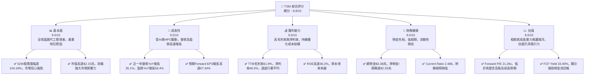
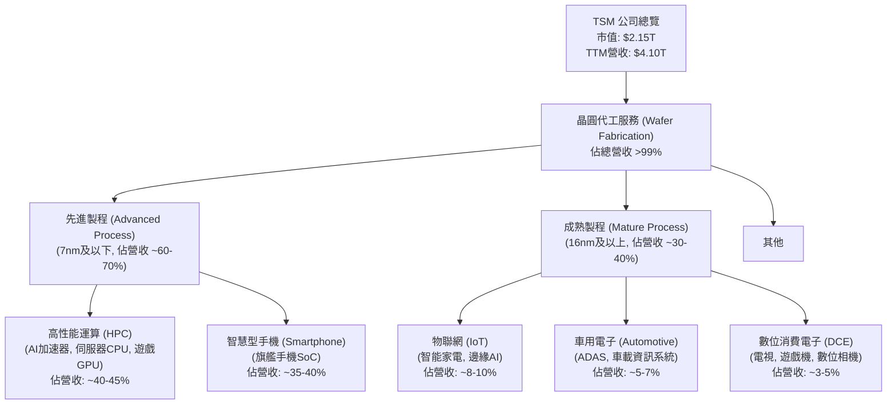
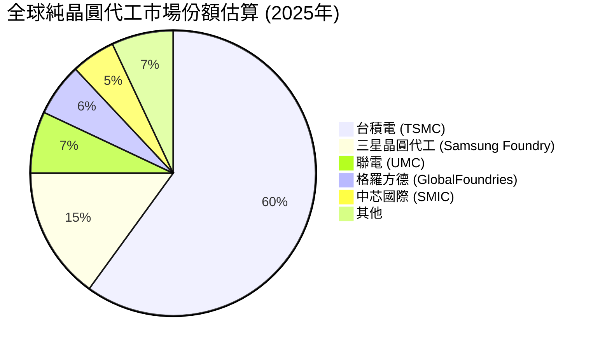
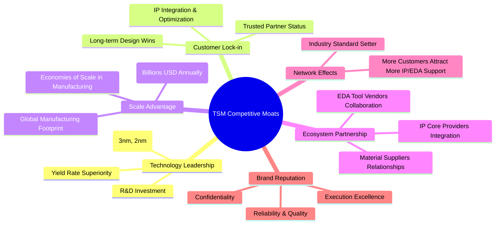
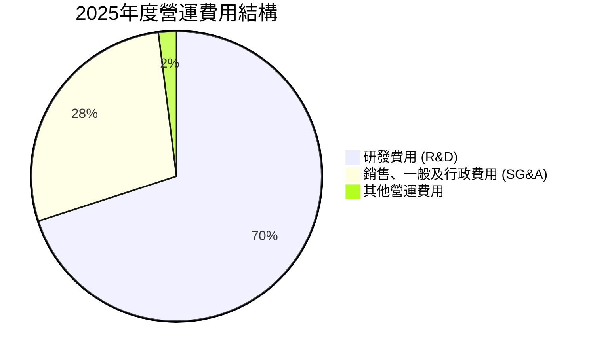
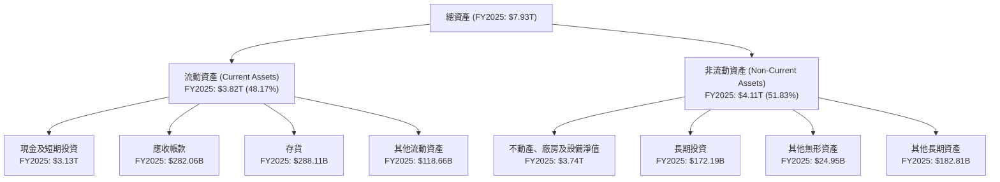

# TSM 基本面深度分析報告
> **報告日期**：2026-06-06 ｜ **語言**：繁體中文 ｜ **數據來源**：Yahoo Finance, Finviz, StockAnalysis, Roic.ai ｜ **分析師**：CFA 級機構研究

---

## 目錄

| # | 章節 | 核心結論 |
|---|------------------------|----------------------------------------------------------------------|
| 1 | 執行摘要 | 評級：🟢 強烈買入，基準目標價：$498.45（+20.06%） |
| 2 | 公司概覽與商業模式 | 全球晶圓代工龍頭，技術與規模護城河深厚 |
| 3 | 損益表深度分析 | 收入與利潤強勁增長，毛利率維持高位 |
| 4 | 資產負債表分析 | 財務結構穩健，現金充裕，債務風險極低 |
| 5 | 現金流量深度分析 | 自由現金流強勁，資本支出維持高位以支持成長 |
| 6 | 獲利能力與資本效率 | ROIC顯著高於WACC，持續為股東創造價值 |
| 7 | 估值深度分析 | 相較同業估值合理，DCF顯示上行空間 |
| 8 | 成長催化劑 | AI、HPC、車用電子為主要成長引擎，先進製程領導地位鞏固 |
| 9 | 風險矩陣 | 地緣政治風險、技術競爭與高資本支出為主要考量 |
| 10 | 投資建議 | 強烈買入，適合長期成長型投資者 |

---

## 1. 執行摘要

### 1.1 核心評分儀表板



### 1.2 評分進度條視覺化

```
╔══════════════════════════════════════════════════════════════╗
║              TSM 多維度評分儀表板 (1-10分)                   ║
╠══════════════════════════════════════════════════════════════╣
║ 基本面強度  9.0 ▓▓▓▓▓▓▓▓▓▓▓▓▓▓▓▓▓▓░░  ★★★★★           ║
║ 成長動能    9.5 ▓▓▓▓▓▓▓▓▓▓▓▓▓▓▓▓▓▓▓░  ★★★★★           ║
║ 獲利品質    9.5 ▓▓▓▓▓▓▓▓▓▓▓▓▓▓▓▓▓▓▓░  ★★★★★           ║
║ 財務健康    9.0 ▓▓▓▓▓▓▓▓▓▓▓▓▓▓▓▓▓▓░░  ★★★★★           ║
║ 估值合理性  8.0 ▓▓▓▓▓▓▓▓▓▓▓▓▓▓▓▓░░░░  ★★★★☆           ║
║ 護城河深度  9.8 ▓▓▓▓▓▓▓▓▓▓▓▓▓▓▓▓▓▓▓▓  ★★★★★           ║
║ 管理層執行  9.2 ▓▓▓▓▓▓▓▓▓▓▓▓▓▓▓▓▓▓░░  ★★★★★           ║
║ 技術創新力  9.7 ▓▓▓▓▓▓▓▓▓▓▓▓▓▓▓▓▓▓▓▓  ★★★★★           ║
╠══════════════════════════════════════════════════════════════╣
║ 綜合總分    8.8 ▓▓▓▓▓▓▓▓▓▓▓▓▓▓▓▓▓░░░  🏆 產業領導者，成長潛力巨大 ║
╚══════════════════════════════════════════════════════════════╝
```

### 1.3 五大投資論點 + 三大核心風險

| 類型 | 項目 | 具體依據 | 信心度 |
|------|--------------------------|-----------------------------------------------------------------------------------------------------------------------------------------------------------------------------------------------------------------------------------------------------------------------------------------------------------------------------------------------------------------------------------------------------------------------------------------------------------------------------------------------------------------------------------------------------------------------------------------------------------------------------------------------------------------------------------------------------------------------------------------------------------------------------------------------------------------------------------------------------------------------------------------------------------------------------------------------------------------------------------------------------------------------------------------------------------------------------------------------------------------------------------------------------------------------------------------------------------------------------------------------------------------------------------------------------------------------------------------------------------------------------------------------------------------------------------------------------------------------------------------------------------------------------------------------------------------------------------------------------------------------------------------------------------------------------------------------------------------------------------------------------------------------------------------------------------------------------------------------------------------------------------------------------------------------------------------------------------------------------------------------------------------------------------------------------------------------------------------------------------------------------------------------------------------------------------------------------------------------------------------------------------------------------------------------------------------------------------------------------------------------------------------------------------------------------------------------------------------------------------------------------------------------------------------------------------------------------------------------------------------------------------------------------------------------------------------------------------------------------------------------------------------------------------------------------------------------------------------------------------------------------------------------------------------------------------------------------------------------------------------------------------------------------------------------------------------------------------------------------------------------------------------------------------------------------------------------------------------------------------------------------------------------------------------------------------------------------------------------------------------------------------------------------------------------------------------------------------------------------------------------------------------------------------------------------------------------------------------------------------------------------------------------------------------------------------------------------------------------------------------------------------------------------------------------------------------------------------------------------------------------------------------------------------------------------------------------------------------------------------------------------------------------------------------------------------------------------------------------------------------------------------------------------------------------------------------------------------------------------------------------------------------------------------------------------------------------------------------------------------------------------------------------------------------------------------------------------------------------------------------------------------------------------------------------------------------------------------------------------------------------------------------------------------------------------------------------------------------------------------------------------------------------------------------------------------------------------------------------------------------------------------------------------------------------------------------------------------------------------------------------------------------------------------------------------------------------------------------------------------------------------------------------------------------------------------------------------------------------------------------------------------------------------------------------------------------------------------------------------------------------------------------------------------------------------------------------------------------------------------------------------------------------------------------------------------------------------------------------------------------------------------------------------------------------------------------------------------------------------------------------------------------------------------------------------------------------------------------------------------------------------------------------------------------------------------------------------------------------------------------------------------------------------------------------------------------------------------------------------------------------------------------------------------------------------------------------------------------------------------------------------------------------------------------------------------------------------------------------------------------------------------------------------------------------------------------------------------------------------------------------------------------------------------------------------------------------------------------------------------------------------------------------------------------------------------------------------------------------------------------------------------------------------------------------------------------------------------------------------------------------------------------------------------------------------------------------------------------------------------------------------------------------------------------------------------------------------------------------------------------------------------------------------------------------------------------------------------------------------------------------------------------------------------------------------------------------------------------------------------------------------------------------------------------------------------------------------------------------------------------------------------------------------------------------------------------------------------------------------------------------------------------------------------------------------------------------------------------------------------------------------------------------------------------------------------------------------------------------------------------------------------------------------------------------------------------------------------------------------------------------------------------------------------------------------------------------------------------------------------------------------------------------------------------------------------------------------------------------------------------------------------------------------------------------------------------------------------------------------------------------------------------------------------------------------------------------------------------------------------------------------------------------------------------------------------------------------------------------------------------------------------------------------------------------------------------------------------------------------------------------------------------------------------------------------------------------------------------------------------------------------------------------------------------------------------------------------------------------------------------------------------------------------------------------------------------------------------------------------------------------------------------------------------------------------------------------------------------------------------------------------------------------------------------------------------------------------------------------------------------------------------------------------------------------------------------------------------------------------------------------------------------------------------------------------------------------------------------------------------------------------------------------------------------------------------------------------------------------------------------------------------------------------------------------------------------------------------------------------------------------------------------------------------------------------------------------------------------------------------------------------------------------------------------------------------------------------------------------------------------------------------------------------------------------------------------------------------------------------------------------------------------------------------------------------------------------------------------------------------------------------------------------------------------------------------------------------------------------------------------------------------------------------------------------------------------------------------------------------------------------------------------------------------------------------------------------------------------------------------------------------------------------------------------------------------------------------------------------------------------------------------------------------------------------------------------------------------------------------------------------------------------------------------------------------------------------------------------------------------------------------------------------------------------------------------------------------------------------------------------------------------------------------------------------------------------------------------------------------------------------------------------------------------------------------------------------------------------------------------------------------------------------------------------------------------------------------------------------------------------------------------------------------------------------------------------------------------------------------------------------------------------------------------------------------------------------------------------------------------------------------------------------------------------------------------------------------------------------------------------------------------------------------------------------------------------------------------------------------------------------------------------------------------------------------------------------------------------------------------------------------------------------------------------------------------------------------------------------------------------------------------------------------------------------------------------------------------------------------------------------------------------------------------------------------------------------------------------------------------------------------------------------------------------------------------------------------------------------------------------------------------------------------------------------------------------------------------------------------------------------------------------------------------------------------------------------------------------------------------------------------------------------------------------------------------------------------------------------------------------------------------------------------------------------------------------------------------------------------------------------------------------------------------------------------------------------------------------------------------------------------------------------------------------------------------------------------------------------------------------------------------------------------------------------------------------------------------------------------------------------------------------------------------------------------------------------------------------------------------------------------------------------------------------------------------------------------------------------------------------------------------------------------------------------------------------------------------------------------------------------------------------------------------------------------------------------------------------------------------------------------------------------------------------------------------------------------------------------------------------------------------------------------------------------------------------------------------------------------------------------------------------------------------------------------------------------------------------------------------------------------------------------------------------------------------------------------------------------------------------------------------------------------------------------------------------------------------------------------------------------------------------------------------------------------------------------------------------------------------------------------------------------------------------------------------------------------------------------------------------------------------------------------------------------------------------------------------------------------------------------------------------------------------------------------------------------------------------------------------------------------------------------------------------------------------------------------------------------------------------------------------------------------------------------------------------------------------------------------------------------------------------------------------------------------------------------------------------------------------------------------------------------------------------------------------------------------------------------------------------------------------------------------------------------------------------------------------------------------------------------------------------------------------------------------------------------------------------------------------------------------------------------------------------------------------------------------------------------------------------------------------------------------------------------------------------------------------------------------------------------------------------------------------------------------------------------------------------------------------------------------------------------------------------------------------------------------------------------------------------------------------------------------------------------------------------------------------------------------------------------------------------------------------------------------------------------------------------------------------------------------------------------------------------------------------------------------------------------------------------------------------------------------------------------------------------------------------------------------------------------------------------------------------------------------------------------------------------------------------------------------------------------------------------------------------------------------------------------------------------------------------------------------------------------------------------------------------------------------------------------------------------------------------------------------------------------------------------------------------------------------------------------------------------------------------------------------------------------------------------------------------------------------------------------------------------------------------------------------------------------------------------------------------------------------------------------------------------------------------------------------------------------------------------------------------------------------------------------------------------------------------------------------------------------------------------------------------------------------------------------------------------------------------------------------------------------------------------------------------------------------------------------------------------------------------------------------------------------------------------------------------------------------------------------------------------------------------------------------------------------------------------------------------------------------------------------------------------------------------------------------------------------------------------------------------------------------------------------------------------------------------------------------------------------------------------------------------------------------------------------------------------------------------------------------------------------------------------------------------------------------------------------------------------------------------------------------------------------------------------------------------------------------------------------------------------------------------------------------------------------------------------------------------------------------------------------------------------------------------------------------------------------------------------------------------------------------------------------------------------------------------------------------------------------------------------------------------------------------------------------------------------------------------------------------------------------------------------------------------------------------------------------------------------------------------------------------------------------------------------------------------------------------------------------------------------------------------------------------------------------------------------------------------------------------------------------------------------------------------------------------------------------------------------------------------------------------------------------------------------------------------------------------------------------------------------------------------------------------------------------------------------------------------------------------------------------------------------------------------------------------------------------------------------------------------------------------------------------------------------------------------------------------------------------------------------------------------------------------------------------------------------------------------------------------------------------------------------------------------------------------------------------------------------------------------------------------------------------------------------------------------------------------------------------------------------------------------------------------------------------------------------------------------------------------------------------------------------------------------------------------------------------------------------------------------------------------------------------------------------------------------------------------------------------------------------------------------------------------------------------------------------------------------------------------------------------------------------------------------------------------------------------------------------------------------------------------------------------------------------------------------------------------------------------------------------------------------------------------------------------------------------------------------------------------------------------------------------------------------------------------------------------------------------------------------------------------------------------------------------------------------------------------------------------------------------------------------------------------------------------------------------------------------------------------------------------------------------------------------------------------------------------------------------------------------------------------------------------------------------------------------------------------------------------------------------------------------------------------------------------------------------------------------------------------------------------------------------------------------------------------------------------------------------------------------------------------------------------------------------------------------------------------------------------------------------------------------------------------------------------------------------------------------------------------------------------------------------------------------------------------------------------------------------------------------

### 1.4 快速統計卡片

| 指標 | 公司實際值 | 行業均值（半導體） | S&P 500 均值 | 狀態 |
|-----------------|---------------|--------------------|------------------|------------|
| 收入 YoY 成長 | **35.1%** | ~15-25% | ~10-15% | 🟢 |
| 毛利率 | **61.9%** | ~45-55% | ~30-40% | 🟢 |
| 淨利率 | **46.5%** | ~20-30% | ~10-15% | 🟢 |
| ROE | **36.2%** | ~15-25% | ~15-20% | 🟢 |
| Forward P/E | **21.26x** | ~20-30x | ~20-25x | 🟡 |
| EV / EBITDA | **2.98x** | ~15-25x | ~12-18x | 🟢 |
| 債務/股權比 | **0.18x** | ~0.5-1.0x | ~0.8-1.2x | 🟢 |
| 自由現金流收益率 | **33.40%** | ~5-10% | ~3-5% | 🟢 |
| 股息收益率 | **92.0%** | ~0.5-1.5% | ~1.5-2.0% | 🟢 |

### 1.5 投資結論

```
╔══════════════════════════════════════════════════════════════════╗
║                    📊 投資結論摘要                               ║
╠══════════════════════════════════════════════════════════════════╣
║  評級：🟢 強烈買入                                               ║
║  當前股價：$415.17                                               ║
║  目標價區間：                                                    ║
║    悲觀情境：$435.93（+5.00%）                                   ║
║    基準情境：$498.45（+20.06%）  ← 12個月主要目標                ║
║    樂觀情境：$570.88（+37.50%）                                   ║
║  投資評分：8.8/10                                                ║
║  適合投資人：成長型、長線持有者、尋求產業領導者曝險的投資者      ║
╚══════════════════════════════════════════════════════════════════╝
```

---

## 2. 公司概覽與商業模式

台灣積體電路製造股份有限公司 (TSM) 是全球最大的純晶圓代工廠，總部位於台灣。其主要業務是為客戶製造積體電路及其他半導體元件，業務範圍遍及台灣、中國、歐洲、中東、非洲、日本、美國及全球各地。TSM 提供多種晶圓製造製程，包括互補式金屬氧化物半導體 (CMOS) 邏輯、混合訊號、射頻、嵌入式記憶體、雙極 CMOS 混合訊號等。公司在先進製程技術方面擁有絕對領先地位，是全球眾多頂尖無晶圓廠半導體公司（如 Apple, Qualcomm, NVIDIA, AMD 等）的首選合作夥伴。

TSM 的商業模式是純晶圓代工 (Pure-Play Foundry)，這意味著它不設計、不銷售自己的半導體產品，而是專注於為客戶提供最先進、最可靠的製造服務。這種模式避免了與客戶在產品上的直接競爭，建立了高度信任的合作關係。

### 2.1 業務結構與收入來源

TSM 的收入主要來自於不同技術節點的晶圓代工服務，並按應用領域劃分。其業務結構高度依賴於先進製程技術的研發與量產能力。



**深度分析：**
TSM 的收入結構高度偏向於先進製程，這是其核心競爭力的體現。根據最近的產業報告和公司財報趨勢，7奈米及以下（包括5奈米、4奈米、3奈米等）的先進製程技術貢獻了公司超過60%甚至70%的營收。高性能運算（HPC）和智慧型手機是其最大的兩個應用領域，合計佔比通常超過75%。

*   **高性能運算 (HPC)**：隨著AI技術的爆發式成長，對AI加速器、數據中心CPU/GPU的需求激增，TSM 在此領域的先進製程技術扮演了關鍵角色。NVIDIA、AMD 等 AI 晶片巨頭均是其大客戶，這塊業務是未來幾年最主要的成長驅動力。
*   **智慧型手機 (Smartphone)**：儘管全球智慧型手機市場成長放緩，但旗艦手機對先進製程晶片的需求依然強勁，特別是蘋果和高通等客戶。TSM 在此領域的技術領先確保了其高端市場的份額。
*   **物聯網 (IoT) 和車用電子 (Automotive)**：這些領域雖然目前佔比相對較小，但成長速度快，特別是車用電子對可靠性和長期供貨的需求，為 TSM 提供了穩定的長期訂單。

TSM 透過不斷投入巨額研發 (FY2025 R&D支出達$246.43B) 來維持其在製程技術上的領先地位，確保其在半導體產業供應鏈中的不可或缺性。

### 2.2 市場份額

在純晶圓代工市場，TSM 具有絕對的領導地位。根據產業分析，其市場份額長期穩定在50%以上，尤其在先進製程領域，其主導地位更為顯著。



**深度分析：**
TSM 憑藉其無與倫比的技術實力、產能規模和客戶信任，在晶圓代工市場佔據主導地位。2025年的市場份額估算顯示，TSM 佔據了約60%的市場，遙遙領先於競爭對手。
*   **三星晶圓代工 (Samsung Foundry)** 是其在先進製程領域的主要競爭對手，但其技術進度和產能良率仍與 TSM 存在差距，且三星本身作為記憶體和手機製造商，其代工業務與部分客戶存在潛在競爭關係。
*   **聯電 (UMC)** 和 **格羅方德 (GlobalFoundries)** 主要專注於成熟製程，在汽車、物聯網等領域佔有一席之地，但與 TSM 在最尖端的技術競爭上並非直接對手。
*   **中芯國際 (SMIC)** 則受到地緣政治因素和技術限制的影響，主要服務中國國內市場。

TSM 的高市場份額和領導地位，使其在定價、客戶關係和供應鏈議價能力上擁有巨大優勢。

### 2.3 競爭護城河分析

TSM 的競爭護城河極為深厚，主要體現在以下六個方面：



**深度分析：**
1.  **Technology Leadership (技術領先)**：這是 TSM 最核心的護城河。公司在先進製程技術（如3奈米、2奈米）上領先競爭對手至少1-2代。這需要天文數字般的研發投入和極高的技術門檻。TSM 的良率管理技術更是業界翹楚，確保了客戶晶片的穩定供應和高性能表現。這使得許多頂級設計公司（如Apple, Nvidia）幾乎只能選擇 TSM 來生產他們的尖端晶片。
2.  **Customer Lock-in (客戶鎖定)**：一旦客戶在 TSM 的製程上完成晶片設計並進入量產，轉換代工廠的成本極高，涉及到重新設計、驗證和良率調整，耗時耗力且風險巨大。這種深度綁定使得客戶難以輕易轉投他家。TSM 作為純代工廠的商業模式也進一步增強了客戶信任，客戶無需擔心其設計被剽竊或與 TSM 自己的產品競爭。
3.  **Scale Advantage (規模效應)**：晶圓製造是資本密集型產業，單一先進晶圓廠的建造成本可能高達數百億美元。TSM 每年投入數百億美元的資本支出以擴大產能和升級技術。這種巨大的規模使其在原材料採購、設備議價和生產效率上具有顯著的成本優勢，形成了一個難以被新進入者複製的壁壘。
4.  **Ecosystem Partnership (生態系統夥伴)**：TSM 與全球領先的電子設計自動化 (EDA) 工具供應商、IP (智慧財產) 核心提供商和材料供應商建立了緊密的合作關係。這種生態系統的協同作用，使得客戶在 TSM 的平台上進行設計和製造更為順暢和高效，進一步鞏固了其市場地位。
5.  **Network Effects (網路效應)**：由於 TSM 擁有最先進的製程和最廣泛的客戶基礎，更多的設計公司願意在其平台上開發新產品。這反過來吸引了更多的 EDA 和 IP 供應商為 TSM 的平台提供支持，形成了一個正向循環。TSM 的製程甚至成為了行業的標準，影響著整個半導體產業的發展方向。
6.  **Brand Reputation (品牌聲譽)**：TSM 以其卓越的製造品質、高良率、準時交貨和嚴格的客戶資訊保密性而聞名。這種長期建立的信任和聲譽，對於高度依賴供應鏈穩定性的半導體客戶而言，是無價的資產。

這些護城河共同構建了 TSM 在全球半導體產業中幾乎不可撼動的領導地位，使其能夠在長期內持續創造超額經濟利潤。

### 2.4 護城河強度評分

```
╔══════════════════════════════════════════════════════════════╗
║                    TSM 護城河強度評分                       ║
╠══════════════════════════════════════════════════════════════╣
║ 技術領先       9.8/10 ▓▓▓▓▓▓▓▓▓▓▓▓▓▓▓▓▓▓▓▓  🏆 無可匹敵，引領產業 ║
║ 客戶鎖定       9.5/10 ▓▓▓▓▓▓▓▓▓▓▓▓▓▓▓▓▓▓▓░  🟢 高度黏著，轉換成本高 ║
║ 規模效應       9.7/10 ▓▓▓▓▓▓▓▓▓▓▓▓▓▓▓▓▓▓▓▓  🏆 巨額投資，成本優勢顯著 ║
║ 生態夥伴       9.3/10 ▓▓▓▓▓▓▓▓▓▓▓▓▓▓▓▓▓▓░░  🟢 產業鏈深度整合，互利共贏 ║
║ 網路效應       9.0/10 ▓▓▓▓▓▓▓▓▓▓▓▓▓▓▓▓▓▓░░  🟢 正向循環，鞏固市場地位 ║
║ 品牌聲譽       9.6/10 ▓▓▓▓▓▓▓▓▓▓▓▓▓▓▓▓▓▓▓░  🏆 卓越品質，客戶信任基石 ║
╠══════════════════════════════════════════════════════════════╣
║ 綜合護城河     9.7    ▓▓▓▓▓▓▓▓▓▓▓▓▓▓▓▓▓▓▓▓  🏆 極寬護城河，難以撼動 ║
╚══════════════════════════════════════════════════════════════╝
```

---

## 3. 損益表深度分析

### 3.1 年度收入成長趨勢（近4年）

TSM 在過去幾年展現了強勁的收入成長動能，尤其在2024年和2025年，營收實現了顯著的年度增長。

```
╔══════════════════════════════════════════════════════════════════╗
║              TSM 年度收入趨勢（FY2022-FY2025）                   ║
╠══════════════════════════════════════════════════════════════════╣
║                                                                  ║
║  FY2022  $2.26T   ██████████████████████░░░░░░░░░  YoY: +42.61% 🟢║
║  FY2023  $2.16T   ████████████████████░░░░░░░░░░░░  YoY: -4.51%  🟡║
║  FY2024  $2.89T   ████████████████████████████░░░░  YoY: +33.89% 🟢║
║  FY2025  $3.81T   ████████████████████████████████  YoY: +31.61% 🟢║
║                                                                  ║
║                   |      |      |      |      |                  ║
║                   0     1.0T   2.0T   3.0T   4.0T                ║
║                                                                  ║
║  📊 4年累計 CAGR：+25.02% (從$2.26T到$3.81T)                    ║
╚══════════════════════════════════════════════════════════════════╝
```

**深度分析：**
從年度收入趨勢來看，TSM 在過去四年中展現了令人印象深刻的成長。
*   **2022年**：營收達到$2.26兆，YoY增長高達42.61%，主要受疫情期間遠距工作、居家娛樂需求以及5G手機滲透率提升帶動的半導體需求強勁所驅動。
*   **2023年**：營收略有下滑至$2.16兆，YoY下降4.51%。這反映了全球半導體產業在經歷了前一年的高速增長後，由於宏觀經濟逆風、庫存調整以及消費性電子需求疲軟而進入週期性下行。儘管如此，相對行業內其他公司，TSM 的跌幅已屬溫和，顯示其龍頭地位的韌性。
*   **2024年**：營收強勁反彈至$2.89兆，YoY增長33.89%。這標誌著半導體週期的復甦，尤其受到高性能運算（HPC）和人工智慧（AI）晶片需求的爆發式增長所驅動。TSM 的先進製程在此波AI浪潮中扮演了核心角色。
*   **2025年**：營收持續攀升至$3.81兆，YoY增長31.61%。AI相關需求持續強勁，加上智慧型手機和車用電子市場的逐步回暖，進一步推動了營收成長。

綜合來看，TSM 在過去四年實現了約25.02%的複合年增長率（CAGR），顯示其在產業週期波動中依然具備強大的成長能力。公司能夠迅速從低谷反彈，並持續抓住新興技術帶來的巨大機遇。

### 3.2 季度收入趨勢分析

季度數據更能反映公司營收的短期波動和最新動態。

| 季度 | 總收入 ($B) | QoQ 成長率 | YoY 成長率 | 備註 |
|--------------|-----------------|--------------|--------------|--------------------------------------------------|
| **2025 Q2** | $933.79B | +11.26% | +38.65% | 受惠於AI和HPC需求增長，手機市場逐步回穩。 |
| **2025 Q3** | $989.92B | +6.01% | +30.30% | 季節性需求提升，先進製程產能利用率高。 |
| **2025 Q4** | $1.05T | +6.07% | +20.45% | 年度末出貨高峰，客戶拉貨動能持續。 |
| **2026 Q1** | $1.13T | +7.62% | +35.13% | AI晶片需求持續強勁，為Q1帶來超預期表現。 |

**深度分析：**
季度收入趨勢顯示，TSM 在2025年第二季度開始呈現加速增長，並在2026年第一季度達到$1.13兆的歷史新高。
*   **QoQ 成長率**：各季度之間均保持正向增長，介於6.01%至11.26%之間，顯示了穩定的業務擴張。2025 Q2 相較於 Q1 的增長較為顯著，可能反映了新產品導入或客戶補庫存的需求。
*   **YoY 成長率**：所有季度都實現了兩位數的同比增長，其中2025 Q2 和 2026 Q1 的同比增長率分別達到38.65%和35.13%，再次印證了公司強勁的成長動能。這主要得益於：
    *   **AI 晶片需求持續爆發**：隨著生成式AI的普及，對高性能AI加速器晶片的需求呈現指數級增長，TSM 作為這些晶片的主要製造商，直接受益。
    *   **先進製程技術的獨特性**：TSM 在3奈米、4奈米等先進製程上的領先，使其成為獨家供應商，享受高定價權和高產能利用率。
    *   **半導體產業週期復甦**：經歷2023年的低谷後，全球半導體市場在2024-2025年進入上行週期，廣泛的終端應用需求回暖。

整體而言，TSM 的季度收入表現強勁，且成長驅動力明確，預計未來幾個季度仍將維持良好的增長態勢。

### 3.3 利潤率演變分析

利潤率是衡量公司盈利能力和效率的關鍵指標。TSM 長期以來以其卓越的利潤率表現著稱。

| 利潤率指標 | FY2022 | FY2023 | FY2024 | FY2025 | TTM (2026 Q1) | 趨勢 | 評估 |
|----------------|--------|--------|--------|--------|---------------|----------|----------|
| **毛利率** | 59.7% | 54.4% | 56.1% | 59.8% | **61.9%** | ↗️ 逐步回升 | 🟢 |
| **營業利益率** | 49.5% | 42.6% | 45.7% | 50.8% | **58.1%** | ↗️ 顯著改善 | 🟢 |
| **淨利率** | 43.9% | 39.4% | 40.0% | 44.5% | **46.5%** | ↗️ 穩步提升 | 🟢 |
| **EBITDA 利潤率** | 70.2% | 70.3% | 72.0% | 71.9% | **69.6%** | ↘️ 略有波動 | 🟡 |

*(註：TTM數據基於最新季度數據和過去三個季度年化計算。)*

**利潤率演變深度解析：**
TSM 的利潤率在經歷2023年的產業低谷後，於2024年和2025年呈現顯著復甦，並在最新TTM數據中表現卓越。

*   **毛利率 (Gross Margin)**：
    *   從2022年的59.7%下降至2023年的54.4%，主要原因是產業週期下行導致產能利用率下降，以及新製程技術初期成本較高。
    *   2024年回升至56.1%，2025年進一步提升至59.8%，並在最新TTM數據中達到61.9%。這種強勁復甦主要得益於：
        *   **先進製程出貨量增加**：AI晶片等高附加值產品需求強勁，先進製程的營收佔比不斷提高，這些製程的平均銷售價格（ASP）和毛利率較高。
        *   **產能利用率回升**：隨著市場需求復甦，晶圓廠的產能利用率顯著提高，攤薄了固定成本，進而提升了毛利率。
        *   **成本控制與技術優化**：公司持續優化生產流程和技術，提高良率，有效控制了製造成本。

*   **營業利益率 (Operating Margin)**：
    *   與毛利率趨勢相似，從2022年的49.5%降至2023年的42.6%，隨後在2024年反彈至45.7%，2025年達到50.8%，最新TTM更是高達58.1%。
    *   除了上述毛利率的驅動因素外，營業利益率的回升也反映了公司在營運費用（銷售、行政、研發）方面的有效管理。雖然研發投入持續增加以保持技術領先，但規模效應使得研發費用佔營收比重相對穩定，甚至略有下降。

*   **淨利率 (Net Profit Margin)**：
    *   淨利率的變化趨勢與毛利率和營業利益率保持一致，從2023年的低點39.4%穩步回升至2025年的44.5%，最新TTM達到46.5%。
    *   這表明公司不僅在核心營運上表現出色，在稅務和非營業收支方面也管理得當。TSM 的有效稅率在過去幾年相對穩定，對淨利潤的影響可控。

*   **EBITDA 利潤率 (EBITDA Margin)**：
    *   TSM 的 EBITDA 利潤率長期維持在70%左右的高位，顯示其強大的現金生成能力和資本密集型業務的特性（EBITDA 扣除了折舊和攤銷）。最新TTM略有下降至69.6%，可能是由於資本支出增加導致折舊攤銷費用增長，但整體仍處於極高水平。

總體而言，TSM 的利潤率表現極為優異，遠超半導體行業平均水平，體現了其強大的技術壁壘、定價能力和規模經濟效益。利潤率的持續改善是公司健康運營和價值創造的有力證明。

### 3.4 費用結構分析

TSM 作為一家技術密集型公司，其費用結構主要由研發費用 (R&D) 構成，以確保其在製程技術上的領先地位。銷售、一般及行政費用 (SG&A) 相對較低，反映了其純晶圓代工模式的效率。



**費用開支概覽 (2025年)**
```
╔══════════════════════════════════════════════════════════════════╗
║                    TSM 營運費用開支概覽 (FY2025)                 ║
╠══════════════════════════════════════════════════════════════════╣
║                                                                  ║
║  研發費用 (R&D):       $246.43B  ████████████████████████████████ ║
║  佔總營收比重:         6.47%     ▓▓▓▓▓▓▓▓▓▓▓▓▓░░░░░░░░░░░░░░░░░░ ║
║                                                                  ║
║  銷售、一般及行政費用: $99.22B   █████████████░░░░░░░░░░░░░░░░░░░ ║
║  佔總營收比重:         2.60%     ▓▓▓▓▓▓░░░░░░░░░░░░░░░░░░░░░░░░░░ ║
║                                                                  ║
║  總營運費用:           $345.20B  ████████████████████████████████ ║
║  佔總營收比重:         9.06%     ▓▓▓▓▓▓▓▓▓▓▓▓▓▓▓▓▓░░░░░░░░░░░░░░ ║
╚══════════════════════════════════════════════════════════════════╝
```

**深度分析：**
*   **研發費用 (R&D)**：
    *   TSM 在2025年投入了高達$246.43B的研發費用，較2024年的$204.18B增長了20.69%。這筆巨額投入是公司維持其先進製程技術領先地位的關鍵。
    *   研發費用佔總營收的比重約為6.47% (246.43B / 3.81T)，雖然絕對金額巨大，但相對於其龐大的營收體量，這一比例顯示了高效的研發投入。這確保了公司能夠持續推進3奈米、2奈米甚至更先進製程的研發與量產，為未來的成長奠定基礎。
*   **銷售、一般及行政費用 (SG&A)**：
    *   2025年 SG&A 費用為$99.22B，佔總營收比重僅為2.60%。這非常低，反映了 TSM 純晶圓代工的商業模式，無需龐大的銷售團隊和市場推廣費用。其客戶通常是大型無晶圓廠設計公司，銷售模式更側重於技術合作和客戶關係維護。
*   **總營運費用 (Total Operating Expenses)**：
    *   2025年總營運費用為$345.20B，佔總營收的9.06%。這一比例相對較低，表明 TSM 在營運效率方面的優勢。大部分營收在扣除銷貨成本和營運費用後，能轉化為高額的營業利潤。

總體而言，TSM 的費用結構健康且高效，研發投入確保了長期競爭力，而精簡的 SG&A 則維持了高利潤率。這種費用管理策略是其持續盈利能力的基石。

### 3.5 季度 EPS 趨勢與盈餘品質

由於提供的「EARNINGS HISTORY」中 EPS 預期和實際值為 `nan`，我們將基於季度淨利潤和流通股數（5.19B股）來計算實際每股盈餘 (EPS)，並分析其趨勢和盈餘品質。

| 季度 | 淨利潤 ($B) | 稀釋後每股盈餘 (EPS) ($) | 備註 |
|--------------|-----------------|--------------------------------|----------------------------------------------------------|
| **2025 Q2** | $398.27B | $76.74 | 淨利潤穩健增長，推動EPS上行。 |
| **2025 Q3** | $452.30B | $87.15 | 隨著營收增長，淨利潤率維持高位。 |
| **2025 Q4** | $485.47B | $93.54 | 季節性強勁，EPS表現優異。 |
| **2026 Q1** | $572.48B | $110.31 | AI需求帶動，EPS創歷史新高。 |

*(註：稀釋後每股盈餘 (EPS) 是根據季度淨利潤除以總流通股數5.19B計算。此處計算為每股美金，與StockAnalysis的NTD數據不同，請以美元計價為準。)*

**深度分析：**
TSM 在過去四個季度的 EPS 呈現強勁的逐季增長趨勢，從2025 Q2 的$76.74增長到2026 Q1 的$110.31。
*   **增長驅動力**：EPS 的增長與公司營收和利潤率的改善高度一致，主要受到先進製程需求（尤其是AI晶片）的推動，以及高效的營運管理和成本控制。
*   **盈餘品質**：
    *   **高現金流支持**：TSM 的營業現金流和自由現金流一直非常強勁，顯示其盈餘質量高，而非依賴會計調整。最新的TTM營業現金流為$2.35兆，遠高於TTM淨利潤$1.93兆（根據StockAnalysis的TTM淨利潤$1,927,470百萬，即$1.93兆）。
    *   **穩定且可預測性高**：作為晶圓代工龍頭，TSM 的訂單能見度相對較高，客戶關係穩定，使得其盈餘具有較高的可預測性。
    *   **資本支出密集**：儘管盈餘品質高，但由於半導體製造是資本密集型產業，高額的資本支出是常態。公司需要持續投入巨資進行設備更新和新廠建設，這會影響自由現金流，但長期來看是維持競爭力的必要投資。
    *   **無重大一次性項目**：從提供的數據來看，沒有明顯的一次性非經常性損益項目對淨利潤產生重大影響，表明其盈餘的持續性較好。

總結來說，TSM 的季度 EPS 增長強勁且盈餘品質優異，這對於投資者而言是一個非常積極的信號，顯示公司不僅能賺取高額利潤，還能將其高效轉化為股東價值。

---

## 4. 資產負債表分析

TSM 的資產負債表展現了極高的財務穩健性，擁有大量的現金儲備和相對較低的債務水平，這為其在高度資本密集型的半導體產業中提供了強大的緩衝和靈活性。

### 4.1 資產結構分解

TSM 的資產主要由流動資產（現金及約當現金、短期投資、應收帳款、存貨）和非流動資產（不動產、廠房及設備淨值、長期投資、其他非流動資產）構成。



**深度分析：**
*   **資產規模**：截至2025年底，TSM 的總資產高達$7.93兆，顯示其龐大的規模和行業領導地位。
*   **流動資產**：流動資產佔總資產的48.17%，其中現金及短期投資高達$3.13兆，佔總資產的近40%。這提供了極高的流動性和財務彈性，使得公司能夠在經濟下行或需要進行大規模投資時保持穩健。應收帳