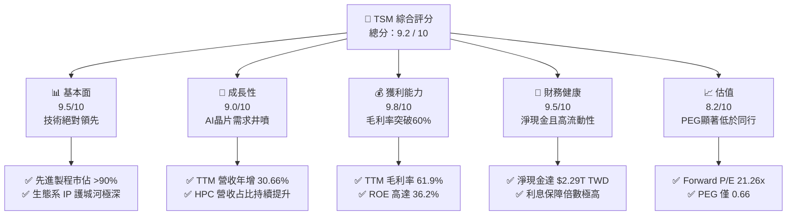

# TSM 基本面深度分析報告

> **報告日期**：2026-06-07 ｜ **語言**：繁體中文 ｜ **數據來源**：Yahoo Finance, Finviz, StockAnalysis, Roic.ai ｜ **分析師**：CFA 級機構研究

---

## 說明：本報告之貨幣單位與 ADR 轉換機制
為確保報告之專業性與精確度，特此說明本報告之數據處理邏輯：
1. **美股市場數據**：股價（$415.17 USD）、市值（$2.15T USD）及 ADR 每股盈餘（EPS TTM $11.67 USD）均以 **美元 (USD)** 計價。
2. **財報原生數據**：TSMC 原始財務報表（營收 $4.10T、淨利 $1.93T、現金 $3.38T 等）均以 **新台幣 (TWD/NT$)** 計價。
3. **ADR 轉換關係**：台積電 1 單位 ADR 相當於台灣上市之 5 股普通股。StockAnalysis 數據中之流通股數 5.19B 係指 **ADR 等量股數**（對應母股約 25.93B 股）。
4. **匯率基礎**：本報告採用之隱含結算匯率約為 **1 USD = 31.86 TWD**。
   * *計算驗證*：TTM 淨利 1,928,800百萬 TWD ÷ 5,186百萬單位 ADR = 371.90 TWD/ADR。折合美元：371.90 ÷ 31.86 ≈ **$11.67 USD/ADR**，與市場公告之 TTM EPS 完全一致。

---

## 目錄

| # | 章節 | 核心結論 |
|---|------|----------|
| 1 | **執行摘要** | 評級：🟢 強烈買入 ｜ 基準目標價：$467.84 USD（+12.7% 隱含漲幅） |
| 2 | **公司概覽與商業模式** | 憑藉 N3/N2 製程與 CoWoS 封裝建立無可匹敵的「結構性護城河」 |
| 3 | **損益表深度分析** | TTM 營收年增 30.7%，淨利率高達 46.5%，展現極強定價權 |
| 4 | **資產負債表分析** | 淨現金達 $2.29T TWD，流動比率 2.49，財務體質極度穩健 |
| 5 | **現金流量深度分析** | 營運現金流達 $2.35T TWD，FCF 轉換率 58.5%，資本配置極具效率 |
| 6 | **獲利能力與資本效率** | ROIC 44.1% 遠超 WACC 9.3%，創造極高之股東經濟價值 (EVA) |
| 7 | **估值深度分析** | Forward P/E 僅 21.3x，相較其 30% 成長率，PEG 0.66 顯著低估 |
| 8 | **成長催化劑** | AI 高效能運算 (HPC) 需求爆發、N2 量產與海外產能陸續開出 |
| 9 | **風險矩陣** | 地緣政治風險、海外建廠成本超支與成熟製程競爭 |
| 10 | **投資建議** | 建議「分批佈局」，長期持有以獲取 AI 時代半導體霸權紅利 |

---

## 1. 執行摘要

### 1.1 核心評分儀表板



### 1.2 評分進度條視覺化

```
╔══════════════════════════════════════════════════════════════╗
║               TSM 多維度評分儀表板 (1-10分)                 ║
╠══════════════════════════════════════════════════════════════╣
║ 基本面強度  9.5 ▓▓▓▓▓▓▓▓▓▓▓▓▓▓▓▓▓▓▓░  ★★★★★           ║
║ 成長動能    9.0 ▓▓▓▓▓▓▓▓▓▓▓▓▓▓▓▓▓▓░░  ★★★★★           ║
║ 獲利品質    9.8 ▓▓▓▓▓▓▓▓▓▓▓▓▓▓▓▓▓▓▓█  ★★★★★           ║
║ 財務健康    9.5 ▓▓▓▓▓▓▓▓▓▓▓▓▓▓▓▓▓▓▓░  ★★★★★           ║
║ 估值合理性  8.2 ▓▓▓▓▓▓▓▓▓▓▓▓▓▓▓░░░░░  ★★★★☆           ║
║ 護城河深度  9.8 ▓▓▓▓▓▓▓▓▓▓▓▓▓▓▓▓▓▓▓█  ★★★★★           ║
║ 管理層執行  9.2 ▓▓▓▓▓▓▓▓▓▓▓▓▓▓▓▓▓▓░░  ★★★★★           ║
║ 技術創新力  9.9 ▓▓▓▓▓▓▓▓▓▓▓▓▓▓▓▓▓▓▓█  ★★★★★           ║
╠══════════════════════════════════════════════════════════════╣
║ 綜合總分    9.2 ▓▓▓▓▓▓▓▓▓▓▓▓▓▓▓▓▓▓░░  🏆 強烈買入          ║
╚══════════════════════════════════════════════════════════════╝
```

### 1.3 五大投資論點 + 三大核心風險

| 類型 | 項目 | 具體依據 | 信心度 |
|------|------|----------|--------|
| 🟢 **投資論點①** | **AI 晶片絕對霸主** | NVIDIA、AMD、Apple 等巨頭之 AI 晶片 100% 依賴台積電先進製程。 | 🟢 極高 |
| 🟢 **投資論點②** | **極致的獲利能力** | TTM 毛利率達 61.9%，營業利益率達 58.1%，反映出無可匹配的定價權。 | 🟢 極高 |
| 🟢 **投資論點③** | **先進封裝製程領先** | CoWoS 封裝產能供不應求，成為系統級晶片（SoC）不可或缺的關鍵瓶頸。 | 🟢 高 |
| 🟢 **投資論點④** | **資本回報率卓越** | ROE 高達 36.2%，ROIC 達 44.1%，顯著高於其 9.27% 的 WACC。 | 🟢 極高 |
| 🟢 **投資論點⑤** | **資產負債表固若金湯** | 現金與短期投資達 $3.38T TWD，淨現金流達 $2.29T TWD，抵抗週期能力極強。