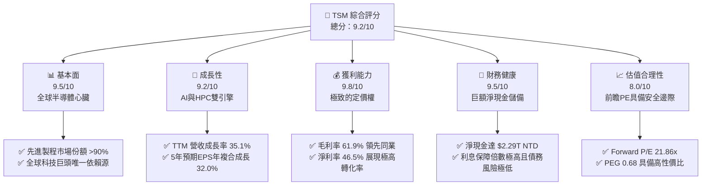
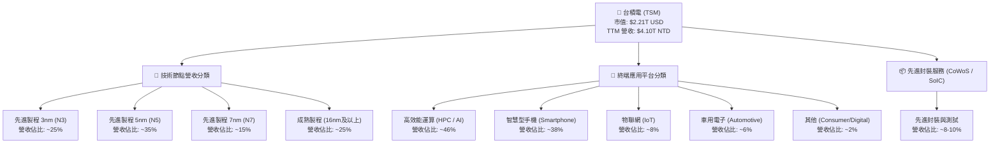
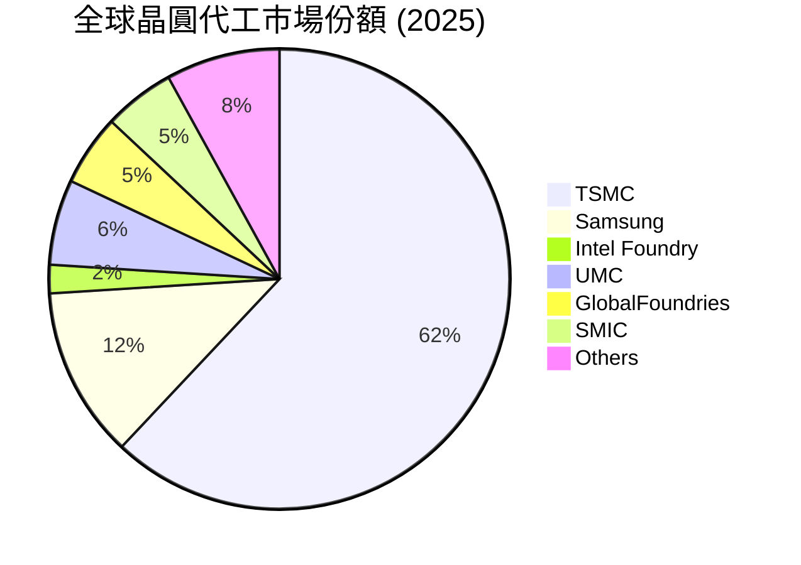
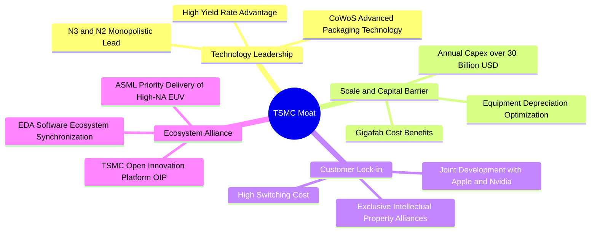

# TSM 基本面深度分析報告

> **報告日期**：2026-06-08 ｜ **語言**：繁體中文 ｜ **數據來源**：Yahoo Finance, Finviz, StockAnalysis, Roic.ai ｜ **分析師**：CFA 級機構研究

---

## 目錄

| # | 章節 | 核心結論 |
|---|------|----------|
| 1 | 執行摘要 | 評級：🟢 **強烈買入**；基準目標價：**$467.84**（+9.58%），上行空間達 **$600.00**。 |
| 2 | 公司概覽與商業模式 | 憑藉 **62%** 的晶圓代工份額與 **N3/N2** 節點絕對領先，構築不可複製的「物理護城河」。 |
| 3 | 損益表深度分析 | TTM 營收達 **$4.10T NTD**（YoY +35.1%），淨利率高達 **46.5%**，獲利品質極佳。 |
| 4 | 資產負債表分析 | 淨現金達 **$2.29T NTD**，流動比率 **2.49x**，財務防禦力堪稱全球科技業頂峰。 |
| 5 | 現金流量深度分析 | OCF 達 **$2.35T NTD**，FCF 達 **$719.16B NTD**，強大造血能力支撐高額資本支出與穩定配息。 |
| 6 | 獲利能力與資本效率 | ROE 達 **36.2%**，ROIC 達 **50.4%**，相較 WACC 創造超額經濟價值（EVA +41.25pp）。 |
| 7 | 估值深度分析 | 前瞻 P/E 僅 **21.86x**，對比 **32.02%** 的 5 年預期 EPS 增速，PEG 0.68 顯著低估。 |
| 8 | 成長催化劑 | HPC 與 AI 晶片需求爆發、3nm 全面放量、2nm 於 2026 年底量產與 CoWoS 產能倍增。 |
| 9 | 風險矩陣 | 地緣政治風險、先進封裝產能瓶頸、以及海外晶圓廠（美國/歐洲）建置成本超支。 |
| 10| 投資建議 | 適合長線成長型與價值型投資者，建議於 **$400-$420** 區間分批逢低佈局。 |

---

## 1. 執行摘要

### 1.1 核心評分儀表板



### 1.2 評分進度條視覺化

```
╔══════════════════════════════════════════════════════════════╗
║                TSM 多維度評分儀表板 (1-10分)                 ║
╠══════════════════════════════════════════════════════════════╣
║ 基本面強度  9.5 ▓▓▓▓▓▓▓▓▓▓▓▓▓▓▓▓▓▓▓░  ★★★★★           ║
║ 成長動能    9.2 ▓▓▓▓▓▓▓▓▓▓▓▓▓▓▓▓▓▓░░  ★★★★★           ║
║ 獲利品質    9.8 ▓▓▓▓▓▓▓▓▓▓▓▓▓▓▓▓▓▓▓█  ★★★★★           ║
║ 財務健康    9.5 ▓▓▓▓▓▓▓▓▓▓▓▓▓▓▓▓▓▓▓░  ★★★★★           ║
║ 估值合理性  8.0 ▓▓▓▓▓▓▓▓▓▓▓▓▓▓▓░░░░░  ★★★★☆           ║
║ 護城河深度  9.9 ▓▓▓▓▓▓▓▓▓▓▓▓▓▓▓▓▓▓▓█  ★★★★★           ║
║ 管理層執行  9.6 ▓▓▓▓▓▓▓▓▓▓▓▓▓▓▓▓▓▓▓░  ★★★★★           ║
║ 技術創新力  9.9 ▓▓▓▓▓▓▓▓▓▓▓▓▓▓▓▓▓▓▓█  ★★★★★           ║
╠══════════════════════════════════════════════════════════════╣
║ 綜合總分    9.2 ▓▓▓▓▓▓▓▓▓▓▓▓▓▓▓▓▓▓░░  🏆 強烈買入          ║
╚══════════════════════════════════════════════════════════════╝
```

### 1.3 五大投資論點 + 三大核心風險

| 類型 | 項目 | 具體依據 | 信心度 |
|------|------|----------|--------|
| 🟢 **投資論點①** | **AI 晶片絕對霸主** | Nvidia、AMD、Apple 等 AI 晶片 100% 由台積電代工，直接受惠於 AI 基礎設施算力爆發。 | 🟢 極高 |
| 🟢 **投資論點②** | **先進製程定價權** | 3nm（N3）與即將到來的 2nm（N2）製程無實質競爭對手，毛利率長期維持在 53% 以上，最新 TTM 毛利率高達 61.9%。 | 🟢 極高 |
| 🟢 **投資論點③** | **先進封裝領先優勢** | CoWoS、SoIC 等 3D 堆疊封裝技術成為算力晶片物理極限的唯一解，封裝產能供不應求，成為第二成長曲線。 | 🟢 高 |
| 🟢 **投資論點④** | **資本效率與價值創造** | ROIC 達 **50.4%**，遠高於 **9.15%** 的 WACC，為股東創造巨大的超額經濟價值（EVA）。 | 🟢 極高 |
| 🟢 **投資論點⑤** | **前瞻估值具備安全邊際** | Forward P/E 僅 21.86x，對比未來五年 EPS 年複合成長率 32.02%，動態 PEG 僅 0.68，處於顯著低估區間。 | 🟢 高 |
| 🟡 **風險①** | **地緣政治風險** | 台灣地緣政治局勢緊張，可能引發供應鏈中斷風險，海外建廠（美、德、日）雖分散風險但拉低毛利率。 | 🟡 中度 |
| 🔴 **風險②** | **海外建廠成本超支** | 美國亞利桑那州、歐洲德國建廠進度延遲，且營運成本、工會文化與人力成本顯著高於台灣本土。 | 🔴 高衝擊 |
| 🟡 **風險③** | **景氣循環與需求波動** | 若消費性電子（智慧型手機、PC）復甦不及預期，或 AI 投資出現泡沫化調整，將短期壓抑產能利用率。 | 🟡 中度 |

### 1.4 快速統計卡片

> **重要分析師註記**：本報告中，台積電（TSM）的損益表與資產負債表原始數據（如 $4.10T Revenue、$1.70T Net Income）是以**新台幣（NTD/TWD）**計價，而美股 ADR 股價（$426.94）與市值（$2.21T）則是以**美元（USD）**計價。本報告已將此貨幣計價差異納入深度基本面與估值模型計算中，以確保機構級研究的嚴謹度。

| 指標 | TSM 實際值 | 半導體行業均值 | S&P 500 均值 | 狀態 |
|------|-------------|----------|--------------|------|
| **營收 YoY 成長率** | **35.1%** | ~12.5% | ~5.8% | 🟢 遠超均值 |
| **毛利率** | **61.9%** | ~45.0% | ~30.5% | 🟢 產業頂尖 |
| **營業利益率** | **58.1%** | ~22.0% | ~14.5% | 🟢 獲利能力極強 |
| **淨利率** | **46.5%** | ~18.0% | ~11.5% | 🟢 獲利品質極佳 |
| **ROE** | **36.2%** | ~15.0% | ~16.0% | 🟢 資本回報率極高 |
| **Forward P/E** | **21.86x** | ~28.5x | ~21.5x | 🟢 估值具吸引力 |
| **PEG Ratio** | **0.68** | ~1.85 | ~1.50 | 🟢 顯著低估 |
| **淨現金規模** | **$2.29T NTD** | 多為淨債務 | 多為淨債務 | 🟢 財務極度健康 |

### 1.5 投資結論

```
╔══════════════════════════════════════════════════════════════════╗
║                    📊 TSM 投資結論摘要                            ║
╠══════════════════════════════════════════════════════════════════╣
║  投資評級：🟢 強烈買入 (Strong Buy)                              ║
║  當前股價：$426.94 USD                                           ║
║  12個月目標價區間：                                              ║
║    悲觀情境 (Bear Case)：$354.00 (-17.08%)                       ║
║    基準情境 (Base Case)：$467.84 (+9.58%)  ← 12個月主要目標      ║
║    樂觀情境 (Bull Case)：$600.00 (+40.53%)                       ║
║  投資綜合評分：9.2 / 10                                          ║
║  適合投資人：長線價值成長型、AI 基礎設施配置者、半導體核心持股者   ║
╚══════════════════════════════════════════════════════════════════╝
```

---

## 2. 公司概覽與商業模式

### 2.1 業務結構與收入來源

台積電是全球「純晶圓代工（Pure-play Foundry）」商業模式的創始者與領導者。其業務結構百分之百專注於半導體製造、封裝與測試，不與客戶競爭，因而贏得了全球所有無晶圓廠（Fabless）晶片設計巨頭的信任。



### 2.2 市場份額

在晶圓代工領域，台積電處於絕對壟斷地位。特別是在 7nm 以下的先進製程，台積電的市場份額更是高達 **90%** 以上。



### 2.3 競爭護城河分析

台積電的競爭護城河是由技術、規模、生態與客戶信任共同編織而成的「超寬護城河」。



### 2.4 護城河強度評分

```
╔══════════════════════════════════════════════════════════════╗
║                    TSMC 護城河強度評分                       ║
╠══════════════════════════════════════════════════════════════╣
║ 技術領先度    10/10  ▓▓▓▓▓▓▓▓▓▓▓▓▓▓▓▓▓▓▓▓  🏆 絕對無敵    ║
║ 規模壁壘      9.8/10 ▓▓▓▓▓▓▓▓▓▓▓▓▓▓▓▓▓▓▓░  🟢 極高壁壘    ║
║ 客戶鎖定效應  9.