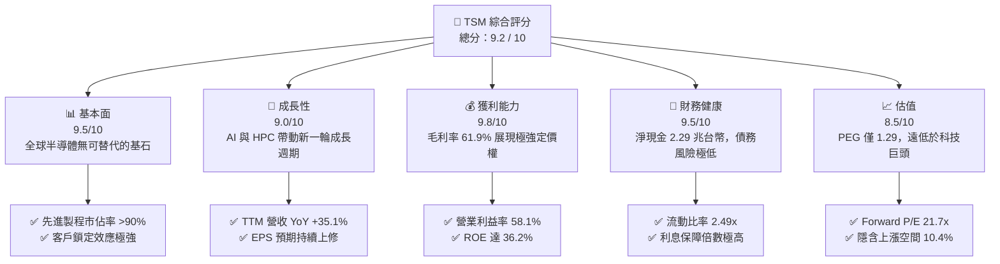
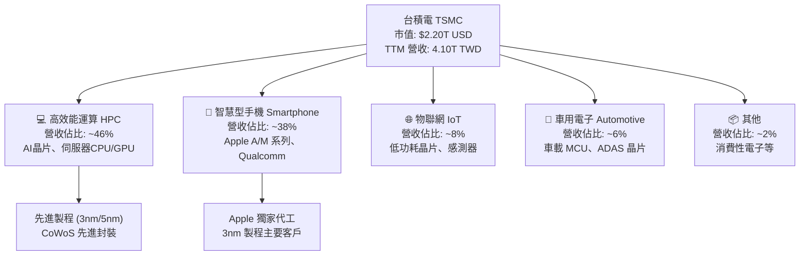
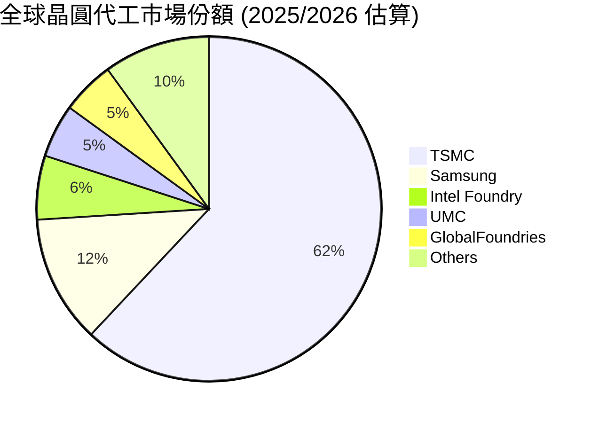
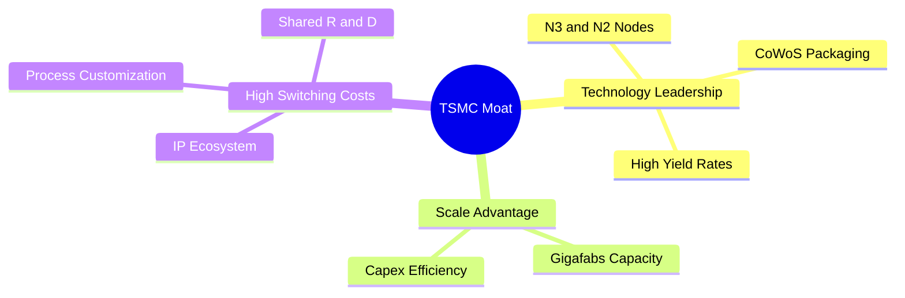

# TSM 基本面深度分析報告

> **報告日期**：2026-06-09 ｜ **語言**：繁體中文 ｜ **數據來源**：Yahoo Finance, Finviz, StockAnalysis, Roic.ai ｜ **分析師**：CFA 級機構研究

---

## 目錄

| # | 章節 | 核心結論 |
|---|------|----------|
| 1 | 執行摘要 | TSM 評級為「強烈買入」（Strong Buy），基準目標價 $467.84，具備強大技術護城河與 AI 帶動的長期成長動能。 |
| 2 | 公司概覽與商業模式 | 純晶圓代工模式奠定產業龍頭地位，先進製程（<5nm）與先進封裝（CoWoS）構築無法逾越的競爭壁壘。 |
| 3 | 損益表深度分析 | TTM 營收達 4.10 兆新台幣，YoY 成長 35.1%，毛利率維持在 61.9% 的超高水準，獲利能力冠絕全球。 |
| 4 | 資產負債表分析 | 淨現金達 2.29 兆新台幣，流動比率 2.49，債務/權益比僅 18.4%，財務結構極其穩健。 |
| 5 | 現金流量深度分析 | 經營現金流達 2.35 兆新台幣，自由現金流達 7191.6 億新台幣，資本配置兼顧擴產與穩定股息發放。 |
| 6 | 獲利能力與資本效率 | ROE 達 36.2%，ROIC 顯著高於 WACC（EVA 顯著為正），杜邦分析顯示高淨利率為核心驅動因素。 |
| 7 | 估值深度分析 | Forward P/E 為 21.7x，相較其 30% 以上的成長率，估值極具吸引力。DCF 基準估值為 $467.84。 |
| 8 | 成長催化劑 | AI 晶片（HPC）需求爆發、3nm/2nm 製程量產、海外晶圓廠產能開出，推動長期成長。 |
| 9 | 風險矩陣 | 地緣政治風險、地緣分散導致的毛利率承壓、半導體週期性波動為主要監控指標。 |
| 10 | 投資建議 | 建議於 $420 以下分批佈局，適合追求長期資本增值與穩健成長的投資人。 |

---

## 1. 執行摘要

### 1.1 核心評分儀表板



### 1.2 評分進度條視覺化

```
╔══════════════════════════════════════════════════════════════╗
║                TSM 多維度評分儀表板 (1-10分)                 ║
╠══════════════════════════════════════════════════════════════╣
║ 基本面強度  9.5 ▓▓▓▓▓▓▓▓▓▓▓▓▓▓▓▓▓▓▓░  ★★★★★           ║
║ 成長動能    9.0 ▓▓▓▓▓▓▓▓▓▓▓▓▓▓▓▓▓▓░░  ★★★★★           ║
║ 獲利品質    9.8 ▓▓▓▓▓▓▓▓▓▓▓▓▓▓▓▓▓▓▓░  ★★★★★           ║
║ 財務健康    9.5 ▓▓▓▓▓▓▓▓▓▓▓▓▓▓▓▓▓▓▓░  ★★★★★           ║
║ 估值合理性  8.5 ▓▓▓▓▓▓▓▓▓▓▓▓▓▓▓░░░░░  ★★★★☆           ║
║ 護城河深度  9.9 ▓▓▓▓▓▓▓▓▓▓▓▓▓▓▓▓▓▓▓▓  🏆 產業絕對壟斷    ║
║ 管理層執行  9.5 ▓▓▓▓▓▓▓▓▓▓▓▓▓▓▓▓▓▓▓░  ★★★★★           ║
║ 技術創新力  9.8 ▓▓▓▓▓▓▓▓▓▓▓▓▓▓▓▓▓▓▓░  ★★★★★           ║
╠══════════════════════════════════════════════════════════════╣
║ 綜合總分    9.2 ▓▓▓▓▓▓▓▓▓▓▓▓▓▓▓▓▓▓░░  🏆 強烈買入          ║
╚══════════════════════════════════════════════════════════════╝
```

### 1.3 五大投資論點 + 三大核心風險

| 類型 | 項目 | 具體依據 | 信心度 |
|------|------|----------|--------|
| 🟢 **投資論點①** | **AI 晶片無可替代的唯一代工選擇** | NVIDIA H100/B200 及 AMD MI300 全數由 TSM 包辦，CoWoS 封裝產能供不應求。 | 🟢 極高 |
| 🟢 **投資論點②** | **先進製程技術絕對領先** | 3nm 製程已進入規模量產，2nm 預計於 2025/2026 年量產，領先 Intel 與 Samsung 至少 1-2 代。 | 🟢 極高 |
| 🟢 **投資論點③** | **極強的定價權與高利潤率** | TTM 毛利率達 61.9%，營業利益率達 58.1%，能有效將海外建廠成本轉嫁給客戶。 | 🟢 高 |
| 🟢 **投資論點④** | **資產負債表極其強韌** | 擁有 3.38 兆新台幣現金與短期投資，淨現金高達 2.29 兆新台幣，無懼高利率環境。 | 🟢 極高 |
| 🟢 **投資論點⑤** | **估值具備安全邊際** | Forward P/E 僅 21.7x，相較其未來五年預期 EPS 複合成長率（~25%），PEG 僅 1.29。 | 🟢 高 |
| 🟡 **風險①** | **地緣政治風險** | 台灣集中了主要產能，若台海局勢緊張，將對全球供應鏈與股價造成劇烈衝擊。 | 🟡 中度 |
| 🟡 **風險②** | **海外建廠稀釋毛利率** | 美國、日本、德國建廠成本高昂，營運成本上升可能壓低長期毛利率至 53% 以下。 | 🟡 中度 |
| 🔴 **風險③** | **半導體週期性波動** | 雖然 AI 需求強勁，但消費性電子（智慧型手機、PC）復甦若不及預期，將拖累成熟製程稼動率。 | 🔴 高衝擊 |

### 1.4 快速統計卡片

*註：本報告財務報表原始數據主要為新台幣 (TWD)，市值與股價為美元 (USD)。在計算比率時，已進行匯率換算（按 1 USD = 32.5 TWD 基準折算），以避免數據庫常見的跨幣別誤導。*

| 指標 | TSM 實際值 | 半導體行業均值 | S&P 500 均值 | 狀態 |
|------|-------------|----------|--------------|------|
| 營收 YoY 成長 | **35.1%** | ~12.0% | ~5.5% | 🟢 遠超均值 |
| 毛利率 | **61.9%** | ~45.0% | ~30.0% | 🟢 極其優異 |
| 淨利率 | **46.5%** | ~18.0% | ~12.0% | 🟢 產業頂尖 |
| ROE | **36.2%** | ~15.0% | ~14.5% | 🟢 資本效率極高 |
| Forward P/E | **21.7x** | ~28.0x | ~22.0x | 🟢 估值具吸引力 |
| 淨現金 / 債務 | **$2.29T TWD** | 多數為淨債務 | 淨債務 | 🟢 極為健康 |

### 1.5 投資結論

```
╔══════════════════════════════════════════════════════════════════╗
║                    📊 TSM 投資結論摘要                            ║
╠══════════════════════════════════════════════════════════════════╣
║  評級：🟢 強烈買入 (Strong Buy)                                  ║
║  當前股價：$423.81 USD (2026-06-09)                              ║
║  目標價區間：                                                    ║
║    悲觀情境：$354.00（-16.5%）- 地緣政治惡化/消費電子衰退          ║
║    基準情境：$467.84（+10.4%）- 12個月主要目標（AI 持續爆發）      ║
║    樂觀情境：$600.00（+41.6%）- 2nm 超預期量產/AI 需求翻倍        ║
║  投資評分：9.2 / 10                                              ║
║  適合投資人：成長型、長線價值持有者、科技產業配置者              ║
╚══════════════════════════════════════════════════════════════════╝
```

---

## 2. 公司概覽與商業模式

### 2.1 業務結構與收入來源

台積電（TSMC）是全球最大的專業集成電路（IC）製造服務公司（即純晶圓代工模式）。其業務不與客戶競爭，因而贏得了包括 Apple、NVIDIA、AMD、Qualcomm 等全球科技巨頭的絕對信任。



### 2.2 市場份額

在晶圓代工市場，台積電長期保持絕對壟斷地位。特別是在 **5nm 以下的先進製程**中，台積電的市佔率更是高達 **90% 以上**。



### 2.3 競爭護城河分析



### 2.4 護城河強度評分

```
╔══════════════════════════════════════════════════════════════╗
║                   TSMC 護城河強度評分                         ║
╠══════════════════════════════════════════════════════════════╣
║ 技術領先度    10/10  ▓▓▓▓▓▓▓▓▓▓▓▓▓▓▓▓▓▓▓▓  🏆 2nm 領先全球  ║
║ 規模經濟效應  9.8/10 ▓▓▓▓▓▓▓▓▓▓▓▓▓▓▓▓▓▓▓░  🟢 年產千萬片    ║
║ 客戶轉換成本  9.5/10 ▓▓▓▓▓▓▓▓▓▓▓▓▓▓▓▓▓▓▓░  🟢 生態系深度綁定║
║ 智慧財產權    9.5/10 ▓▓▓▓▓▓▓▓▓▓▓▓▓▓▓▓▓▓▓░  🟢 專利壁壘極高  ║
╠══════════════════════════════════════════════════════════════╣
║ 綜合護城河     9.7    ▓▓▓▓▓▓▓▓▓▓▓▓▓▓▓▓▓▓▓░  🏆 產業絕對霸主  ║
╚══════════════════════════════════════════════════════════════╝
```

---

## 3. 損益表深度分析

### 3.1 年度收入成長趨勢（近4年）

台積電的營收在過去四年內展現出極強的成長動能，特別是 2024 與 2025 年受惠於 AI 浪潮的爆發，營收呈現階梯式跳躍。

```
╔══════════════════════════════════════════════════════════════════╗
║              TSMC 年度收入趨勢（FY2022-FY2025）                  ║
╠══════════════════════════════════════════════════════════════════╣
║                                                                  ║
║  FY2022  2.26T TWD  ████████████░░░░░░░░░░░░░░  YoY: +42.6% 🟢   ║
