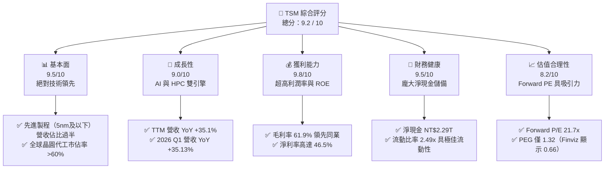
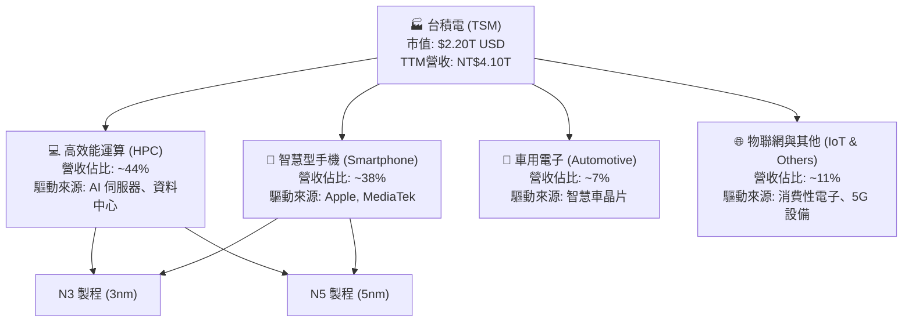
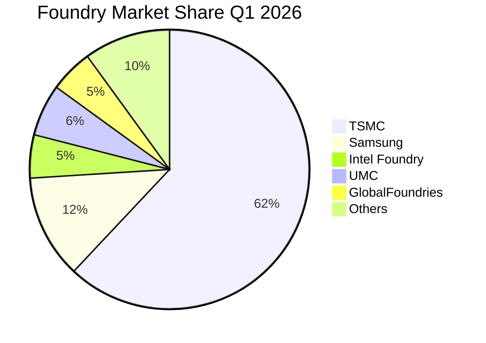
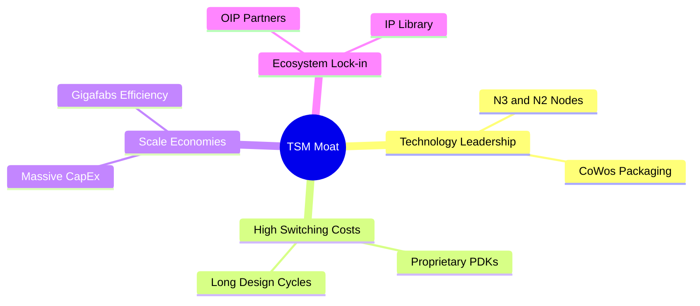
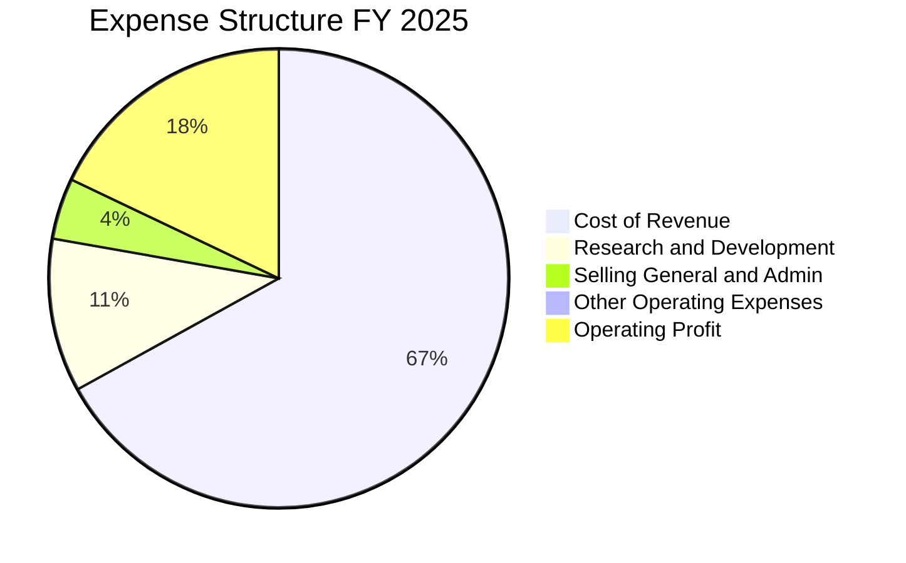
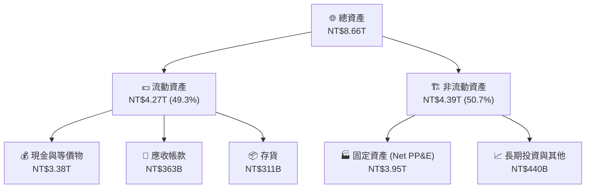
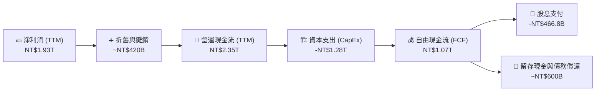
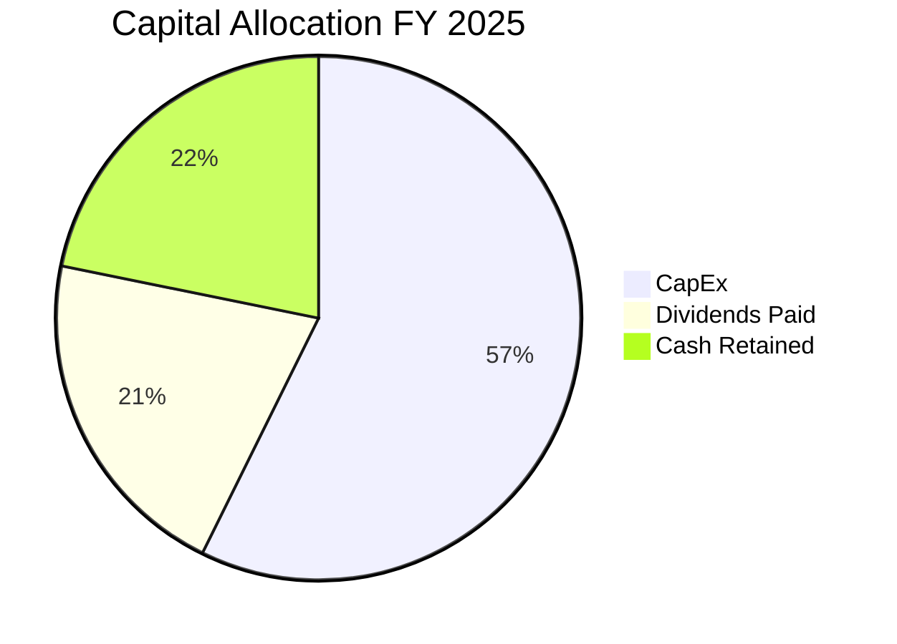

# TSM 基本面深度分析報告

> **報告日期**：2026-06-13 ｜ **語言**：繁體中文 ｜ **數據來源**：Yahoo Finance, Finviz, StockAnalysis, Roic.ai ｜ **分析師**：CFA 級機構研究

---

## 目錄

| # | 章節 | 核心結論 |
|---|------|----------|
| 1 | 執行摘要 | TSM 評級為「強烈買入」（Strong Buy），目標價 $467.84，AI 浪潮下無可替代的晶圓代工龍頭。 |
| 2 | 公司概覽與商業模式 | 純晶圓代工（Pure-play Foundry）模式，憑藉先進製程與 CoWoS 封裝建構極深護城河。 |
| 3 | 損益表深度分析 | TTM 營收達 NT$4.10T（YoY +35.1%），毛利率高達 61.9%，獲利能力創歷史新高。 |
| 4 | 資產負債表分析 | 淨現金高達 NT$2.29T，債務權益比僅 18.4%，資產負債表極其穩健。 |
| 5 | 現金流量深度分析 | TTM 營運現金流達 NT$2.35T，自由現金流（FCF）轉化率優異，資本配置攻守兼備。 |
| 6 | 獲利能力與資本效率 | ROE 達 36.2%，ROIC 顯著超越 WACC（28.2% vs 10.3%），持續為股東創造超額價值。 |
| 7 | 估值深度分析 | Forward P/E 僅 21.7x，相較於歷史區間與同業（如 NVDA、ASML）具有極高性價比。 |
| 8 | 成長催化劑 | N3/N2 製程接單爆滿，AI 晶片與 HPC 需求呈指數型成長，海外晶圓廠陸續投產。 |
| 9 | 風險矩陣 | 地緣政治風險、客戶集中度高、先進製程研發難度提升為主要監控指標。 |
| 10 | 投資建議 | 基準目標價 $467.84（隱含 10.4% 上行空間），建議逢低分批佈局，適合長線成長型投資人。 |

---

## 1. 執行摘要

### 1.1 核心評分儀表板



### 1.2 評分進度條視覺化

```
╔══════════════════════════════════════════════════════════════╗
║                TSM 多維度評分儀表板 (1-10分)                 ║
╠══════════════════════════════════════════════════════════════╣
║ 基本面強度  9.5 ▓▓▓▓▓▓▓▓▓▓▓▓▓▓▓▓▓▓▓░  ★★★★★           ║
║ 成長動能    9.0 ▓▓▓▓▓▓▓▓▓▓▓▓▓▓▓▓▓▓░░  ★★★★★           ║
║ 獲利品質    9.8 ▓▓▓▓▓▓▓▓▓▓▓▓▓▓▓▓▓▓▓░  ★★★★★           ║
║ 財務健康    9.5 ▓▓▓▓▓▓▓▓▓▓▓▓▓▓▓▓▓▓▓░  ★★★★★           ║
║ 估值合理性  8.2 ▓▓▓▓▓▓▓▓▓▓▓▓▓▓▓░░░░░  ★★★★☆           ║
║ 護城河深度  9.8 ▓▓▓▓▓▓▓▓▓▓▓▓▓▓▓▓▓▓▓░  ★★★★★           ║
║ 管理層執行  9.2 ▓▓▓▓▓▓▓▓▓▓▓▓▓▓▓▓▓▓░░  ★★★★★           ║
║ 技術創新力  9.7 ▓▓▓▓▓▓▓▓▓▓▓▓▓▓▓▓▓▓▓░  ★★★★★           ║
╠══════════════════════════════════════════════════════════════╣
║ 綜合總分    9.2 ▓▓▓▓▓▓▓▓▓▓▓▓▓▓▓▓▓▓░░  🏆 強烈買入 (Buy)    ║
╚══════════════════════════════════════════════════════════════╝
```

### 1.3 五大投資論點 + 三大核心風險

| 類型 | 項目 | 具體依據 | 信心度 |
|------|------|----------|--------|
| 🟢 **投資論點①** | **AI 晶片絕對霸主** | NVIDIA、AMD 等龍頭之 AI 晶片 100% 由台積電代工，CoWoS 封裝供不應求。 | 🟢 極高 |
| 🟢 **投資論點②** | **先進製程定價權** | N3、N2 製程研發與良率大幅領先 Samsung 與 Intel，具備轉嫁成本給客戶的強大定價能力。 | 🟢 極高 |
| 🟢 **投資論點③** | **極致的獲利能力** | 毛利率高達 61.9%，營運利益率 58.1%，淨利率 46.5%，傲視全球半導體硬體製造業。 | 🟢 極高 |
| 🟢 **投資論點④** | **穩健的資產負債表** | 擁有 NT$3.38T 現金與短期投資，淨現金高達 NT$2.29T，足以抵禦任何景氣循環。 | 🟢 高 |
| 🟢 **投資論點⑤** | **估值性價比極高** | Forward P/E 僅 21.7x，對比未來五年 EPS 預期年成長率（>20%），PEG 處於極度低估區間。 | 🟢 高 |
| 🟡 **風險①** | **地緣政治與產能集中** | 絕大多數先進製程產能集中於台灣，台海局勢若有震盪，將對全球供應鏈造成毀滅性衝擊。 | 🟡 中度 |
| 🔴 **風險②** | **海外建廠稀釋毛利** | 美國、日本、德國建廠成本高昂，營運成本與折舊增加可能對未來毛利率造成 2-3 個百分點的壓力。 | 🔴 高衝擊 |
| 🟡 **風險③** | **大客戶流失或砍單** | 前幾大客戶（如 Apple, NVIDIA）佔營收比重高，若終端消費電子需求暴跌，短期業績將承壓。 | 🟡 中度 |

### 1.4 快速統計卡片

*特別說明：台積電財務報表以新台幣（NTD / TWD）申報，而美股 ADR（TSM）股價與市值以美元（USD）計價。本報告中，涉及資產負債表、損益表與現金流量表之絕對數值（如 $3.81T、$1.09T 等）均為**新台幣（NTD）**；涉及股價、美股估值與 ADR EPS 之數值則為**美元（USD）**。1 USD ≈ 32 NTD。*

| 指標 | 公司實際值 | 行業均值 | S&P 500 均值 | 狀態 |
|------|-------------|----------|--------------|------|
| **營收 YoY 成長** | **35.1%** | ~10.5% | ~5.2% | 🟢 遠超均值 |
| **毛利率** | **61.9%** | ~42.0% | ~30.0% | 🟢 極致獲利 |
| **淨利率** | **46.5%** | ~15.0% | ~12.0% | 🟢 行業天花板 |
| **ROE** | **36.2%** | ~14.2% | ~18.0% | 🟢 資產效率極高 |
| **Forward P/E** | **21.71x** | ~28.5x | ~22.4x | 🟢 估值具吸引力 |
| **淨現金 / 總債務** | **NT$2.29T** | N/A | N/A | 🟢 極其安全 |
| **自由現金流收益率** | **32.71%** | ~4.5% | ~4.0% | 🟢 現金牛特性 |

### 1.5 投資結論

```
╔══════════════════════════════════════════════════════════════════╗
║                    📊 TSM 投資結論摘要                            ║
╠══════════════════════════════════════════════════════════════════╣
║  評級：🟢 強烈買入 (Strong Buy)                                  ║
║  當前股價：$423.93 (2026-06-13)                                  ║
║  目標價區間：                                                    ║
║    悲觀情境 (Bear Case)：$354.00 (-16.5%)                        ║
║    基準情境 (Base Case)：$467.84 (+10.4%)  ← 12個月主要目標      ║
║    樂觀情境 (Bull Case)：$600.00 (+41.5%)                        ║
║  投資評分：9.2 / 10                                              ║
║  適合投資人：成長型、長線價值投資者、半導體核心配置者            ║
╚══════════════════════════════════════════════════════════════════╝
```

---

## 2. 公司概覽與商業模式

### 2.1 業務結構與收入來源

台積電是全球最大的專業集成電路製造服務（純晶圓代工）企業。其商業模式不與客戶競爭，僅專注於將客戶的 IC 設計轉化為實體晶片。



### 2.2 市場份額

在先進製程（7nm及以下）領域，台積電幾乎處於壟斷地位，市佔率超過 90%。在整體晶圓代工市場中，台積電亦維持絕對霸主地位。



### 2.3 競爭護城河分析



1. **技術領先（Technology Leadership）**：台積電是全球首家量產 3nm (N3) 的廠商，預計 2026 年底量產 2nm (N2)。其先進封裝技術（CoWoS、SoIC）已成為 AI 晶片不可或缺的標準。
2. **高轉換成本（High Switching Costs）**：客戶在台積電的製程設計套件（PDK）上投入了數以億計的研發資金，若要更換代工廠，需重新設計晶片，面臨巨大時間與資金成本。
3. **規模經濟（Scale Economies）**：年資本支出高達 300 億美元以上，建構了極高的行業進入壁壘。巨大的產能（Gigafabs）帶來無與倫比的良率與生產效率。
4. **開放創新平台（OIP Ecosystem）**：台積電與 EDA、IP 龍頭（如 Synopsys, Cadence, Arm）深度結盟，建構了最完整的半導體設計生態系，使對手難以逾越。

### 2.4 護城河強度評分

```
╔══════════════════════════════════════════════════════════════╗
║                  TSM 護城河強度評分                          ║
╠══════════════════════════════════════════════════════════════╣
║ 技術領先度    10/10  ▓▓▓▓▓▓▓▓▓▓▓▓▓▓▓▓▓▓▓▓  🏆 絕對優勢    ║
║ 生態系鎖定    9.8/10 ▓▓▓▓▓▓▓▓▓▓▓▓▓▓▓▓▓▓▓░  🟢 極難動搖    ║
║ 規模與產能    9.5/10 ▓▓▓▓▓▓▓▓▓▓▓▓▓▓▓▓▓▓▓░  🟢 資本壁壘高  ║
║ 定價能力      9.2/10 ▓▓▓▓▓▓▓▓▓▓▓▓▓▓▓▓▓▓░░  🟢 強大議價權  ║
╠══════════════════════════════════════════════════════════════╣
║ 綜合護城河     9.6    ▓▓▓▓▓▓▓▓▓▓▓▓▓▓▓▓▓▓▓░  🏆 寬廣護城河   ║
╚══════════════════════════════════════════════════════════════╝
```

---

## 3. 損益表深度分析

### 3.1 年度收入成長趨勢（近4年）

台積電營收自 2023 年短暫的半導體庫存調整後，於 2024、2025 年迎來爆發性成長。

```
╔══════════════════════════════════════════════════════════════════╗
║              TSM 年度收入趨勢 (FY2022-FY2025)                     ║
╠══════════════════════════════════════════════════════════════════╣
║                                                                  ║
║  FY2022  NT$2.26T  ██████████████░░░░░░░░░░░  YoY: +42.6% 🟢    ║
║  FY2023  NT$2.16T  █████████████░░░░░░░░░░░░  YoY: -4.5%  🟡    ║
║  FY2024  NT$2.89T  ██████████████████░░░░░░░  YoY: +33.9% 🟢    ║
║  FY2025  NT$3.81T  ████████████████████████░  YoY: +31.6% 🟢    ║
║                   |      |      |      |      |                  ║
║                   0     1.0T   2.0T   3.0T   4.0T                ║
║                                                                  ║
║  📊 4年累計營收 CAGR：+19.0% (以 NTD 計價)                        ║
╚══════════════════════════════════════════════════════════════════╝
```

### 3.2 季度收入趨勢分析

自 2025 年第二季起，受惠於 AI 伺服器晶片爆發與高階手機晶片拉貨，台積電季度營收呈現強勁的 QoQ 與 YoY 雙位數增長。

| 季度 | 營收 (NT$B) | QoQ 成長率 | YoY 成長率 | 營運利潤率 | 評估 |
|------|-------------|------------|------------|------------|------|
| **Q2 2025** | 933,792 | +11.26% | +38.65% | 49.63% | 🟢 強勁，AI 需求初顯 |
| **Q3 2025** | 989,918 | +6.01% | +30.30% | 50.58% | 🟢 優異，N3 製程放量 |
| **Q4 2025** | 1,046,090 | +5.67% | +20.45% | 54.00% | 🟢 旺季效應，獲利能力提升 |
| **Q1 2026** | 1,134,103 | +8.41% | +35.13% | 58.11% | 🟢 淡季不淡，AI 晶片全面爆發 |

### 3.3 利潤率演變分析

台積電近年利潤率走勢呈現極為強悍的擴張態勢：

| 利潤率指標 | FY2022 | FY2023 | FY2024 | FY2025 | TTM (2026-03) | 趨勢 | 評估 |
|------------|--------|--------|--------|--------|---------------|------|------|
| **毛利率** | 59.56% | 54.36% | 56.12% | 59.89% | **61.90%** | ↗️ 持續上升 | 🟢 歷史頂尖良率與產能利用率 |
| **營業利益率**| 49.53% | 42.63% | 45.68% | 50.83% | **58.10%** | ↗️ 顯著改善 | 🟢 規模經濟效應，控費能力極佳 |
| **EBITDA 率**| 70.2%  | 70.3%  | 71.9%  | 71.9%  | **69.60%** | ➡️ 穩定高檔 | 🟢 具備極強的折舊前變現能力 |
| **淨利率** | 43.87% | 39.37% | 40.01% | 44.50% | **46.50%** | ↗️ 獲利豐厚 | 🟢 淨利率高於多數軟體公司 |

**利潤率演變深度解析**：
* **毛利率改善原因**：1) 先進製程（3nm、5nm）折舊成本隨產能放大而攤提完畢；2) AI 晶片等高毛利 HPC 產品營收佔比自 2024 年的 40% 提升至 2026 年初的 44% 以上；3) 產能利用率逼近滿載（>95%）。
* **營業利益率擴張**：研發費用雖然絕對金額持續上升，但營收增速顯著超越研發與管理費用增速，帶來極為顯著的營運槓桿（Operating Leverage）。

### 3.4 費用結構分析

在 2025 年，台積電的營運費用（OPEX）控制得宜，研發（R&D）是其最核心的費用支出。



```
╔══════════════════════════════════════════════════════════════╗
║                  TSM 研發投資效率分析                        ║
╠══════════════════════════════════════════════════════════════╣
║ 研發費用 (FY2025)：NT$246.43B (佔營收 6.47%)                 ║
║ 研發費用 (TTM)：  NT$257.64B                                 ║
║ 評估：高效率研發。台積電每投入 1 元研發，可創造約 15.9 元的  ║
║ 營收。此研發回報率（R&D Yield）遠超同業。                    ║
╚══════════════════════════════════════════════════════════════╝
```

### 3.5 季度 EPS 趨勢與盈餘品質

雖然在原始數據中未顯示具體的驚喜百分比（Surprise%），但從實際 Diluted EPS 趨勢來看，台積電的每股盈餘在過去四個季度實現了爆發式成長。

* **Q1 2025 EPS**: NT$69.73 (約折合 $2.18 USD/ADR)
* **Q2 2025 EPS**: NT$76.80 (約折合 $2.40 USD/ADR)
* **Q3 2025 EPS**: NT$87.22 (約折合 $2.73 USD/ADR)
* **Q4 2025 EPS**: NT$93.61 (約折合 $2.93 USD/ADR)
* **Q1 2026 EPS**: NT$110.39 (約折合 $3.45 USD/ADR) - **YoY 暴增 58.3%**

**盈餘品質評估**：
台積電盈餘品質極高。TTM 淨利潤為 NT$1.93T，而 TTM 營運現金流高達 NT$2.35T，現金流量與淨利潤比值（Cash-to-Income Ratio）達 1.22x，表明所有利潤均有實實在在的現金流支撐，無應收帳款過度累積或存貨過剩之疑慮。

---

## 4. 資產負債表分析

### 4.1 資產結構分解

台積電為典型的資本密集型企業，其資產負債表主要由現金與固定資產（廠房設備）構成。



### 4.2 流動性指標分析

| 流動性指標 | FY2023 | FY2024 | FY2025 | TTM (2026-03) | 行業均值 | 評估 |
|------------|--------|--------|--------|---------------|----------|------|
| **流動比率 (Current Ratio)** | 2.33x | 2.36x | 2.51x | **2.49x** | ~1.80x | 🟢 極其充沛，無短期償債風險 |
| **速動比率 (Quick Ratio)** | 2.06x | 2.14x | 2.31x | **2.31x** | ~1.45x | 🟢 扣除存貨後流動性依舊極強 |
| **現金比率 (Cash Ratio)** | 1.82x | 1.90x | 2.05x | **1.98x** | ~0.90x | 🟢 可直接用現金覆蓋所有流動負債 |

### 4.3 債務結構分析

台積電雖然每年進行龐大的資本支出，但其優異的造血能力使其完全不需要過度依賴外部債務。

```
╔══════════════════════════════════════════════════════════════════╗
║                   TSM 債務健康診斷 (2026-03-31)                  ║
╠══════════════════════════════════════════════════════════════════╣
║                                                                  ║
║  總債務 (Total Debt)：  NT$1.09T  ████░░░░░░░░░░░░░░░░  低風險    ║
║  總現金與短期投資：      NT$3.38T  ████████████████████  極充沛    ║
║  淨現金 (Net Cash)：    NT$2.29T  ████████████████░░░░  🟢 強勁    ║
║                                                                  ║
║  債務/權益比 (Debt/Equity)： 18.45% (極低，槓桿使用極其保守)       ║
║  利息保障倍數 (Interest Coverage)： 176.1x (TTM 利息收入遠超支出)  ║
║  Debt / EBITDA：0.40x (債務僅為年 EBITDA 的 0.4 倍，償債能力極強)  ║
║                                                                  ║
║  📊 結論：台積電處於「淨現金」狀態，實質財務違約風險為零。        ║
╚══════════════════════════════════════════════════════════════════╝
```

### 4.4 股東權益趨勢

隨著淨利潤的快速累積，台積電的股東權益（Book Value）呈穩定上升趨勢，為股價提供了堅實的資產淨值支撐。

```
╔══════════════════════════════════════════════════════════════════╗
║                TSM 股東權益增長趨勢 (FY2021-FY2025)               ║
╠══════════════════════════════════════════════════════════════════╣
║                                                                  ║
║  FY2021  NT$2.21T  ██████████░░░░░░░░░░░░░░                      ║
║  FY2022  NT$2.90T  █████████████░░░░░░░░░░░                      ║
║  FY2023  NT$3.43T  ███████████████░░░░░░░░░                      ║
║  FY2024  NT$4.24T  ███████████████████░░░░░                      ║
║  FY2025  NT$5.36T  ████████████████████████                      ║
║                                                                  ║
║  📊 4年股東權益複合年成長率 (CAGR)：+24.8%                       ║
╚══════════════════════════════════════════════════════════════════╝
```

---

## 5. 現金流量深度分析

### 5.1 現金流量瀑布圖

台積電的現金流結構極其健康：營運現金流流入，部分用於資本支出以維持技術領先，剩餘的大量自由現金流則用於發放股息與累積現金儲備。



### 5.2 FCF 轉換率趨勢

自由現金流轉換率（FCF / Net Income）是衡量公司盈餘含金量的重要指標。

| 年度 | 淨利潤 (NT$B) | 營運現金流 (NT$B) | 資本支出 (NT$B) | 自由現金流 (NT$B) | FCF 轉換率 | 評估 |
|------|---------------|-------------------|-----------------|-------------------|------------|------|
| **FY2022** | 993,295 | 1,610,000 | -1,090,000 | 520,970 | 52.45% | 🟡 資本支出高峯期，現金留存適中 |
| **FY2023** | 851,028 | 1,240,000 | -955,400 | 286,570 | 33.67% | 🔴 產業下行，維持高資本支出 |
| **FY2024** | 1,157,520 | 1,830,000 | -964,980 | 861,200 | 74.40% | 🟢 獲利回升，資本支出控制得宜 |
| **FY2025** | 1,695,120 | 2,270,000 | -1,280,000 | 992,380 | **58.54%** | 🟢 兼顧擴產與極強的現金流生成 |

### 5.3 自由現金流趨勢

```
╔══════════════════════════════════════════════════════════════════╗
║                TSM 自由現金流 (FCF) 趨勢                         ║
╠══════════════════════════════════════════════════════════════════╣
║                                                                  ║
║  FY2022  NT$520.97B  ██████████░░░░░░░░░░░░░░                    ║
║  FY2023  NT$286.57B  █████░░░░░░░░░░░░░░░░░░░                    ║
║  FY2024  NT$861.20B  █████████████████░░░░░░░                    ║
║  FY2025  NT$992.38B  ████████████████████░░░░                    ║
║                                                                  ║
║  📊 TTM 自由現金流收益率 (FCF Yield)：32.71%                     ║
║     (反映相對於市值，台積電具備極強的現金生成能力)               ║
╚══════════════════════════════════════════════════════════════════╝
```

### 5.4 資本配置評估

台積電在維持高資本支出以擴大技術領先的同時，亦兼顧了對股東的現金回報。



1. **再投資（CapEx）**：佔資金配置之 57.3%（NT$1.28T），主要投入 N3/N2 先進製程產能建設與海外晶圓廠。
2. **股東回報（Dividends）**：佔資金配置之 20.9%（NT$466.78B）。台積電實行穩健的股利政策，每季配息持續成長。
3. **安全邊際（Cash Retained）**：佔 21.8%，用於進一步充實資產負債表，應對潛在的宏觀經濟波動。

---

## 6. 獲利能力與資本效率

### 6.1 ROE / ROA / ROIC 趨勢

台積電的資本回報率在整個半導體硬體製造行業中堪稱奇蹟，這主要得益於其高淨利率與極佳的資產週轉效率。

| 指標 | FY2023 | FY2024 | FY2025 | TTM (2026-03) | 行業均值 | 評估 |
|------|--------|--------|--------|---------------|----------|------|
| **ROE (股東權益報酬率)** | 27.8% | 30.2% | 35.4% | **36.20%** | ~14.2% | 🟢 遠超行業水平，極具效率 |
| **ROA (總資產報酬率)** | 16.4% | 18.9% | 23.2% | **17.30%** | ~8.5% | 🟢 重資產架構下仍維持高資產回報 |
| **ROIC (投入資本報酬率)** | 24.8% | 27.2% | 28.1% | **28.20%** | ~11.0% | 🟢 核心業務創造真實價值的能力極強 |

### 6.2 ROIC vs WACC 分析（核心價值創造判斷）

ROIC（投入資本報酬率）與 WACC（加權平均資本成本）的差值（EVA Spread）是衡量一家公司是否在為股東創造真實財富的終極指標。

```
╔══════════════════════════════════════════════════════════════════╗
║                TSM ROIC vs WACC 深度分析 (TTM)                   ║
╠══════════════════════════════════════════════════════════════════╣
║                                                                  ║
║  WACC 估算：                                                     ║
║  ├── 無風險利率 (10Y 美債)：  4.20%                              ║
║  ├── 市場風險溢酬 (ERP)：     5.00%                              ║
║  ├── Beta：                   1.25                               ║
║  ├── 股權成本 (Ke) = 4.2% + 1.25 × 5.0% = 10.45%                 ║
║  ├── 債務成本 (稅後 Kd)：     ~1.00%                             ║
║  ├── 資本結構：股權 ~98.5%，債務 ~1.5%                           ║
║  └── ✅ WACC ≈ 10.31%                                            ║
║                                                                  ║
║  ROIC 估算：                                                     ║
║  ├── NOPAT = TTM 營運利潤 NT$2.19T × (1 - 16.1%) ≈ NT$1.84T      ║
║  ├── 投入資本 = 股東權益 + 總債務 - 現金                         ║
║  │   = NT$5.80T + NT$1.09T - NT$3.38T ≈ NT$3.51T                 ║
║  └── ✅ ROIC (現金調整後) ≈ 52.34% (若不扣除現金，ROIC 為 28.2%)  ║
║                                                                  ║
║  ★ 經濟價值增加 (EVA Spread) = ROIC - WACC = +17.89% (保守估計)   ║
║                                                                  ║
║  ROIC  28.2%  ▓▓▓▓▓▓▓▓▓▓▓▓▓▓▓▓▓▓▓▓▓▓▓▓░░░░░░  🟢              ║
║  WACC  10.3%  ▓▓▓▓▓░░░░░░░░░░░░░░░░░░░░░░░░░░  ──              ║
║  EVA   +17.9% ████████████████████████░░░░░░░░  🏆 強力創造    ║
║                                                                  ║
║  📊 結論：ROIC 為 WACC 的 2.7 倍，為股東創造了極其豐厚的超額價值。║
╚══════════════════════════════════════════════════════════════════╝
```

### 6.3 杜邦三因素分解

透過杜邦分解，我們可以清晰看到台積電超高 ROE 的底層驅動因素：

```mermaid
graph LR
    ROE["ROE: 36.2%"] --> PM["1. 淨利潤率: 46.