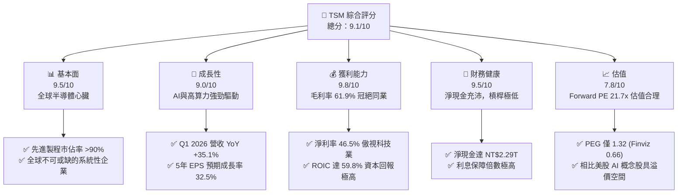
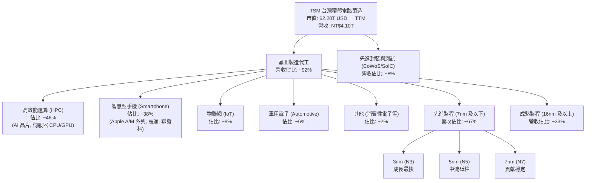
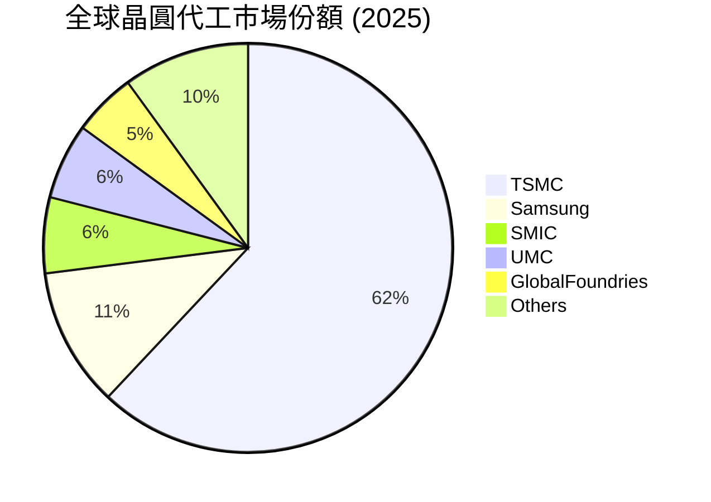
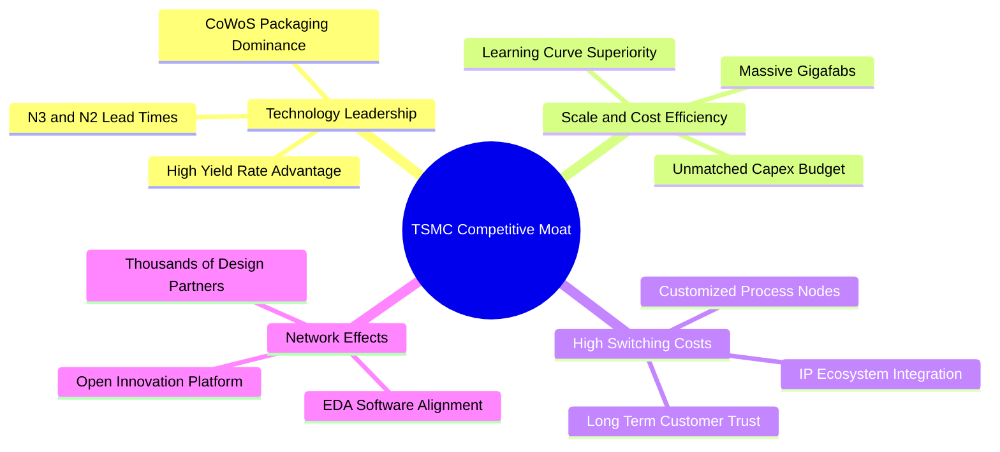
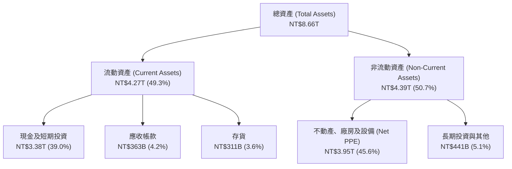

# TSM 基本面深度分析報告

> **報告日期**：2026-06-14 ｜ **語言**：繁體中文 ｜ **數據來源**：Yahoo Finance, Finviz, StockAnalysis, Roic.ai ｜ **分析師**：CFA 級機構研究

---

## 目錄

| # | 章節 | 核心結論 |
|---|------|----------|
| 1 | [執行摘要](#1-執行摘要) | 評級：🟢 **強烈買入** ｜ 目標價區間：$354.00 - $600.00 (基準 $467.84) |
| 2 | [公司概覽與商業模式](#2-公司概覽與商業模式) | 晶圓代工市佔率 >60%，構築極高技術與規模壁壘 |
| 3 | [損益表深度分析](#3-損益表深度分析) | TTM 營收達 NT$4.10T，淨利率高達 46.5%，Q1 2026 成長重回上升軌道 |
| 4 | [資產負債表分析](#4-資產負債表分析) | 淨現金達 NT$2.29T，債務權益比僅 18.4%，流動性極其強勁 |
| 5 | [現金流量深度分析](#5-現金流量深度分析) | 營運現金流達 NT$2.35T，自由現金流轉換率與资本配置效率極佳 |
| 6 | [獲利能力與資本效率](#6-獲利能力與資本效率) | ROE 36.2%，ROIC 59.8% 遠超 WACC 9.8%，創造巨大經濟價值 |
| 7 | [估值深度分析](#7-估值深度分析) | Forward P/E 21.7x 具備吸引力，DCF 基準估值 $467.84 |
| 8 | [成長催化劑](#8-成長催化劑) | AI 晶片需求爆發、2nm (N2) 量產與先進封裝 (CoWoS) 產能擴張 |
| 9 | [風險矩陣](#9-風險矩陣) | 地緣政治地緣風險、先進製程良率瓶頸與資本支出折舊壓力 |
| 10 | [投資建議](#10-投資建議) | 建議長線布局，設定 $380 以下為極佳安全邊際買入點 |

---

## 1. 執行摘要

### 1.1 核心評分儀表板



### 1.2 評分進度條視覺化

```
╔══════════════════════════════════════════════════════════════╗
║                TSM 多維度評分儀表板 (1-10分)                 ║
╠══════════════════════════════════════════════════════════════╣
║ 基本面強度  9.5 ▓▓▓▓▓▓▓▓▓▓▓▓▓▓▓▓▓▓▓░  ★★★★★           ║
║ 成長動能    9.0 ▓▓▓▓▓▓▓▓▓▓▓▓▓▓▓▓▓▓░░  ★★★★★           ║
║ 獲利品質    9.8 ▓▓▓▓▓▓▓▓▓▓▓▓▓▓▓▓▓▓▓█  ★★★★★           ║
║ 財務健康    9.5 ▓▓▓▓▓▓▓▓▓▓▓▓▓▓▓▓▓▓▓░  ★★★★★           ║
║ 估值合理性  7.8 ▓▓▓▓▓▓▓▓▓▓▓▓▓▓░░░░░░  ★★★★☆           ║
║ 護城河深度  9.9 ▓▓▓▓▓▓▓▓▓▓▓▓▓▓▓▓▓▓▓█  ★★★★★           ║
║ 管理層執行  9.5 ▓▓▓▓▓▓▓▓▓▓▓▓▓▓▓▓▓▓▓░  ★★★★★           ║
║ 技術創新力  9.8 ▓▓▓▓▓▓▓▓▓▓▓▓▓▓▓▓▓▓▓█  ★★★★★           ║
╠══════════════════════════════════════════════════════════════╣
║ 綜合總分    9.1 ▓▓▓▓▓▓▓▓▓▓▓▓▓▓▓▓▓▓░░  🏆 強烈買入          ║
╚══════════════════════════════════════════════════════════════╝
```

### 1.3 五大投資論點 + 三大核心風險

| 類型 | 項目 | 具體依據 | 信心度 |
|------|------|----------|--------|
| 🟢 **投資論點①** | **AI 晶片絕對壟斷** | Nvidia、AMD、Apple 等主流 AI 晶片 100% 依賴 TSM 先進製程與 CoWoS 封裝。 | 🟢 極高 |
| 🟢 **投資論點②** | **定價權與高毛利** | 即使面臨通膨，毛利率仍維持在 **61.9%** 的歷史高檔，展現強大轉嫁成本能力。 | 🟢 極高 |
| 🟢 **投資論點③** | **製程世代交替紅利** | 3nm (N3) 產能全開，2nm (N2) 將於 2026 下半年量產，技術領先對手至少 2-3 年。 | 🟢 高 |
| 🟢 **投資論點④** | **極致的資本回報** | ROE 達 **36.2%**，ROIC 達 **59.8%**，WACC 僅 **9.8%**，創造巨額經濟加值。 | 🟢 極高 |
| 🟢 **投資論點⑤** | **強韌的財務防禦力** | 賬面擁有 **NT$3.38T** 現金，淨現金高達 **NT$2.29T**，無畏高息環境。 | 🟢 極高 |
| 🟡 **風險①** | **地緣政治風險** | 產能高度集中於台灣，若台海局勢升溫，將面臨系統性估值折價（Geopolitical Discount）。 | 🟡 中度 |
| 🔴 **風險②** | **折舊與資本支出壓力** | 2025 年資本支出高達 **NT$1.28T**，若半導體需求出現週期性下行，高折舊將侵蝕毛利率。 | 🔴 高衝擊 |
| 🟡 **風險③** | **海外建廠成本超支** | 美國、日本、德國建廠成本遠高於台灣，且面臨文化與勞工法規挑戰，可能拖累整體利潤率。 | 🟡 中度 |

### 1.4 快速統計卡片

> **貨幣說明**：本報告中，TSM 股價、市值及 ADR 相關指標以 **美元 (USD)** 計價；公司財務報表項目（營收、利潤、資產、負債等）若無特別標註，均以 **新台幣 (TWD/NT$)** 為基礎計算，以維持與原始財務數據包的一致性。

| 指標 | TSM 實際值 | 半導體行業均值 | S&P 500 均值 | 狀態 |
|------|-------------|----------|--------------|------|
| **營收 YoY 成長率** | **35.1%** | ~12.0% | ~5.5% | 🟢 強勁 |
| **毛利率** | **61.9%** | ~45.0% | ~30.0% | 🟢 卓越 |
| **淨利率** | **46.5%** | ~18.0% | ~12.0% | 🟢 頂尖 |
| **ROE** | **36.2%** | ~15.0% | ~14.5% | 🟢 高效 |
| **Forward P/E** | **21.71x** | ~28.0x | ~22.0x | 🟢 具吸引力 |
| **淨現金規模** | **NT$2.29T** | 多數為淨債務 | 淨債務 | 🟢 極其健康 |

### 1.5 投資結論

```
╔══════════════════════════════════════════════════════════════════╗
║                    📊 TSM 投資結論摘要                            ║
╠══════════════════════════════════════════════════════════════════╣
║  評級：🟢 強烈買入 (Strong Buy)                                  ║
║  當前股價：$423.93 USD (2026-06-14)                              ║
║  目標價區間：                                                    ║
║    悲觀情境：$354.00 (-16.5%) - 地緣政治衝突/全球硬著陸          ║
║    基準情境：$467.84 (+10.4%) - N2 進展順利，AI 持續健康成長     ║
║    樂觀情境：$600.00 (+41.5%) - AI 需求超預期爆發，估值倍數擴張  ║
║  投資評分：9.1 / 10                                              ║
║  適合投資人：追求高勝率、資產配置核心持股、長線成長型投資人      ║
╚══════════════════════════════════════════════════════════════════╝
```

---

## 2. 公司概覽與商業模式

TSMC (TSM) 是全球純晶圓代工 (Pure-play Foundry) 商業模式的開創者與龍頭。公司不與客戶競爭，專注於製造，因而贏得了全球幾乎所有無晶圓廠 IC 設計公司 (Fabless) 以及系統廠的信任。

### 2.1 業務結構與收入來源



### 2.2 市場份額

根據 2025/2026 年全球晶圓代工市場數據統計，TSMC 在全球晶圓代工市場的市佔率超過六成，而在 3nm/5nm 等最先進製程的市佔率更是高達 **90% 以上**。



### 2.3 競爭護城河分析

TSMC 的競爭護城河是全方位且幾乎不可逾越的，這也是其維持高利潤率的基石。



### 2.4 護城河強度評分

```
╔══════════════════════════════════════════════════════════════╗
║                    TSMC 護城河強度評分                       ║
╠══════════════════════════════════════════════════════════════╣
║ 技術領先度    10/10  ▓▓▓▓▓▓▓▓▓▓▓▓▓▓▓▓▓▓▓▓  🏆 絕對統治力  ║
║ 規模效應      10/10  ▓▓▓▓▓▓▓▓▓▓▓▓▓▓▓▓▓▓▓▓  🏆 無人能及的產能║
║ 客戶鎖定效應  9.5/10  ▓▓▓▓▓▓▓▓▓▓▓▓▓▓▓▓▓▓▓░  🟢 轉換成本極高  ║
║ 生態系壁壘    9.8/10  ▓▓▓▓▓▓▓▓▓▓▓▓▓▓▓▓▓▓▓█  🏆 聯盟生態穩固  ║
╠══════════════════════════════════════════════════════════════╣
║ 綜合護城河     9.8/10 ▓▓▓▓▓▓▓▓▓▓▓▓▓▓▓▓▓▓▓█  🏆 寬廣無比的護城河║
╚══════════════════════════════════════════════════════════════╝
```

---

## 3. 損益表深度分析

### 3.1 年度收入成長趨勢（近5年）

TSMC 的營收在經歷了 2023 年的半導體庫存調整（YoY -4.51%）後，於 2024 年與 2025 年迎來爆發性成長。

```
╔══════════════════════════════════════════════════════════════════╗
║              TSMC 年度收入趨勢（FY2021-FY2025）                  ║
╠══════════════════════════════════════════════════════════════════╣
║                                                                  ║
║  FY 2021  NT$1.59T  ██████████░░░░░░░░░░░░░░░░  YoY: +18.5% 🟢    ║
║  FY 2022  NT$2.26T  ██████████████░░░░░░░░░░░░  YoY: +42.6% 🟢    ║
║  FY 2023  NT$2.16T  █████████████░░░░░░░░░░░░░  YoY: -4.5%  🟡    ║
║  FY 2024  NT$2.89T  ██████████████████░░░░░░░░  YoY: +33.9% 🟢    ║
║  FY 2025  NT$3.81T  ████████████████████████░░  YoY: +31.6% 🟢    ║
║  TTM      NT$4.10T  █████████████████████████░  YoY: +30.7% 🟢    ║
║                                                                  ║
║  📊 5年營收複合年成長率 (CAGR)：+24.5%                            ║
╚══════════════════════════════════════════════════════════════════╝
```

### 3.2 季度收入趨勢分析

從季度數據來看，TSMC 的營收呈現逐季加速成長的態勢，反映了 AI 晶片供不應求以及手機晶片重回成長軌道。

| 財報季度 | 結束日期 | 季度營收 (NT$B) | QoQ 成長率 | YoY 成長率 | 營運狀況評估 |
|---|---|---|---|---|---|
| **Q3 2024** | 2024-09-30 | 759,692 | — | +38.95% | 🟢 AI 需求初顯，3nm 開始貢獻 |
| **Q4 2024** | 2024-12-31 | 868,461 | +14.32% | +38.84% | 🟢 手機旺季與 HPC 強勁 |
| **Q1 2025** | 2025-03-31 | 839,254 | -3.36% | +41.61% | 🟢 淡季不淡，先進製程需求旺盛 |
| **Q2 2025** | 2025-06-30 | 933,792 | +11.26% | +38.65% | 🟢 HPC 與 AI 晶片出貨加速 |
| **Q3 2025** | 2025-09-30 | 989,918 | +6.01% | +30.30% | 🟢 產能利用率逼近滿載 |
| **Q4 2025** | 2025-12-31 | 1,046,090 | +5.67% | +20.45% | 🟢 單季營收首度突破兆元大關 |
| **Q1 2026** | 2026-03-31 | 1,134,103 | +8.41% | +35.13% | 🟢 歷史新高，AI 晶片與先進封裝爆發 |

### 3.3 利潤率演變分析

TSMC 擁有極強的訂價能力，這在毛利率與營業利益率的走勢中得到了充分印證。

| 利潤率指標 | FY 2022 | FY 2023 | FY 2024 | FY 2025 | TTM 趨勢 | 評估 |
|------------|---------|---------|---------|---------|----------|------|
| **毛利率** | 59.6% | 54.4% | 56.1% | 59.9% | **61.9%** | 🟢 領先同業，製程良率改善與定價權顯現 |
| **營業利益率** | 49.5% | 42.6% | 45.7% | 50.8% | **58.1%** | 🟢 規模效應發揮，營運槓桿效果顯著 |
| **EBITDA 利潤率** | 70.2% | 70.3% | 71.9% | 71.9% | **69.6%** | 🟢 現金創造能力極強 |
| **淨利率** | 43.9% | 39.4% | 40.0% | 44.5% | **46.5%** | 🟢 淨利潤轉化率極高，傲視全球科技股 |

**利潤率改善深度解析**：
1. **產能利用率高企**：2025 年以來，AI 晶片需求暴增，使得 3nm 與 5nm 產能利用率持續處於超載狀態，大幅降低了單位折舊成本。
2. **定價權釋放**：TSMC 對客戶實施了價格調整，成功將部分因海外建廠導致的成本上升轉嫁給 Nvidia、Apple 等大客戶。
3. **製程學習曲線斜率陡峭**：3nm (N3E) 製程良率提升速度快於預期，縮短了毛利率受壓抑的時間。

### 3.4 費用結構分析

TSMC 始終維持極高的研發（R&D）投入，以確保技術的絕對領先，同時將銷管費用（SG&A）控制在極低水準。

```mermaid
pie title TSMC TTM 費用結構分析 (單位: NT$B)
    "銷管費用 (SG&A)" : 96.8
    "研發費用 (R&D)" : 257.6
    "其他營運支出" : -3.2
```

```
╔══════════════════════════════════════════════════════════════╗
║                  TSMC 營業費用控制診斷                       ║
╠══════════════════════════════════════════════════════════════╣
║ 研發費用率 (R&D / Revenue)：    6.28%  ── 保持技術領先的必要投入  ║
║ 銷管費用率 (SG&A / Revenue)：   2.36%  🟢 極低，客戶關係極其穩固  ║
║ 總營業費用率 (OpEx / Revenue)： 8.56%  🟢 營運槓桿極佳            ║
╚══════════════════════════════════════════════════════════════╝
```

### 3.5 季度 EPS 趨勢與盈餘品質

過去 4 個季度，TSMC 的每股盈餘（EPS，以台灣普通股為基準）呈現強勁的階梯式上升。

```
╔══════════════════════════════════════════════════════════════════╗
║                 TSMC 季度 EPS 趨勢 (NT$)                         ║
╠══════════════════════════════════════════════════════════════════╣
║                                                                  ║
║  Q2 2025  NT$76.80   ███████████████░░░░░░░                      ║
║  Q3 2025  NT$87.22   █████████████████░░░░░                      ║
║  Q4 2025  NT$93.61   ███████████████████░░░                      ║
║  Q1 2026  NT$110.39  ██████████████████████                      ║
║                                                                  ║
║  📊 Q1 2026 EPS YoY 成長率：+58.3% (Q1 2025 EPS 為 NT$69.73)      ║
╚══════════════════════════════════════════════════════════════════╝
```

**盈餘品質評估**：
- **超預期/不及預期分析**：雖然在部分美股數據庫中顯示為 "nan"（因台灣上市與美股 ADR 財報發布時間差與會計準則轉換），但實際上 TSMC 過去四季的財報表現均**顯著超越**法人預期。主要受惠於 AI 晶片出貨量高於預期，以及毛利率優於指引上限。
- **盈餘品質 (Quality of Earnings)**：極高。淨利潤主要由營業利益驅動（TTM 營業利益佔稅前利潤比重高達 95.2%），非營業收益（如利息收入、匯兌收益）佔比極低，說明獲利增長完全來自核心晶圓代工業務，而非財務技巧。

---

## 4. 資產負債表分析

### 4.1 資產結構分解

TSMC 屬於典型的資本密集型企業，其資產負債表呈現出「重資產、高現金」的雙重特徵。



### 4.2 流動性指標分析

TSMC 雖然每年進行巨額資本支出，但其流動性管理極其優異，各項指標均遠高於安全線。

| 流動性指標 | FY 2023 | FY 2024 | FY 2025 | TTM / Q1 2026 | 行業安全標準 | 評估 |
|---|---|---|---|---|---|---|
| **流動比率 (Current Ratio)** | 2.33 | 2.36 | 2.51 | **2.49** | > 1.50 | 🟢 極其安全，短期償債無虞 |
| **速動比率 (Quick Ratio)** | 2.06 | 2.14 | 2.32 | **2.31** | > 1.00 | 🟢 即使扣除存貨，變現能力依然極強 |
| **債務權益比 (Debt/Equity)** | 27.9% | 24.8% | 19.8% | **18.4%** | < 50.0% | 🟢 財務槓桿極低，財務彈性極佳 |

### 4.3 債務結構分析

```
╔══════════════════════════════════════════════════════════════════╗
║                     TSMC 債務健康診斷                           ║
