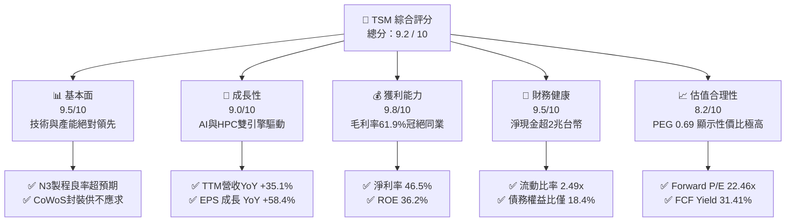
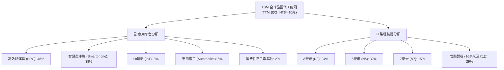
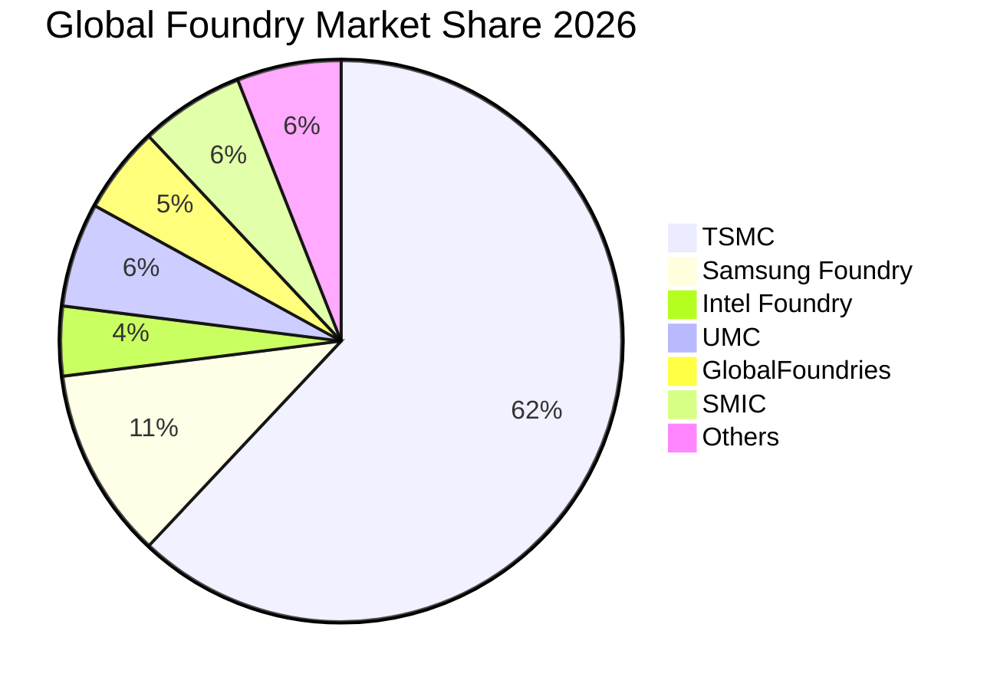
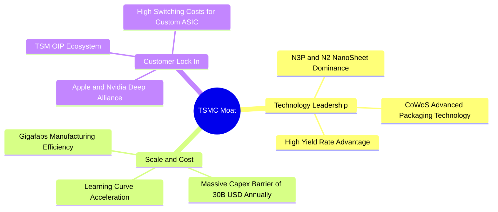
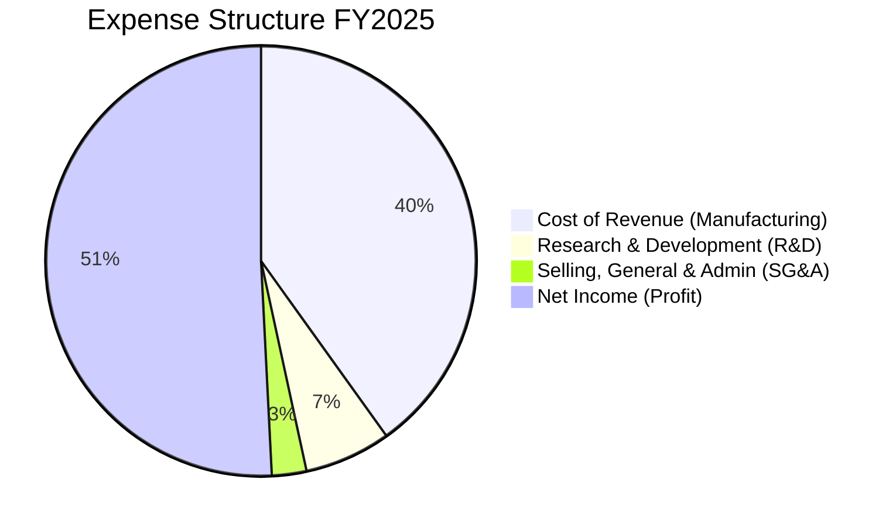
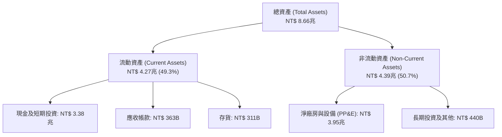
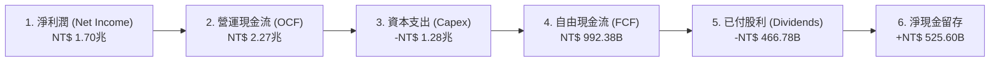
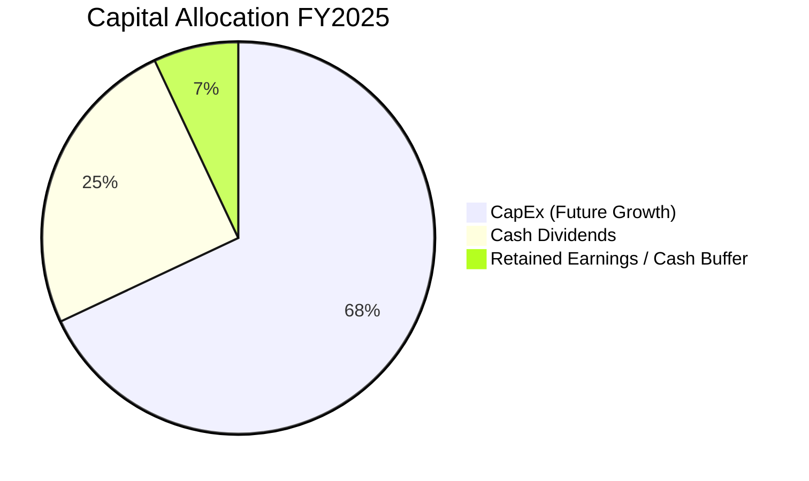

# TSM 基本面深度分析報告

> **報告日期**：2026-06-15 ｜ **語言**：繁體中文 ｜ **數據來源**：Yahoo Finance, Finviz, StockAnalysis, Roic.ai ｜ **分析師**：CFA 級機構研究

---

## 目錄

| # | 章節 | 核心結論 |
|---|------|----------|
| 1 | [執行摘要](#1-執行摘要) | 評級：**強烈買入 (Strong Buy)** ｜ 目標價：**$467.84** (基準) / **$600.00** (樂觀) |
| 2 | [公司概覽與商業模式](#2-公司概覽與商業模式) | 晶圓代工 (Pure-play Foundry) 絕對霸主，N3/N2 製程與 CoWoS 封裝構築無懈可擊的護城河 |
| 3 | [損益表深度分析](#3-損益表深度分析) | TTM 營收達 NT$4.10T，YoY 成長 35.1%，淨利率達 46.5%，展現極強的定價能力 |
| 4 | [資產負債表分析](#4-資產負債表分析) | 淨現金達 NT$2.29T，Current Ratio 2.49x，財務結構極其穩健 |
| 5 | [現金流量深度分析](#5-現金流量深度分析) | 營業現金流達 NT$2.35T，自由現金流轉換率高，資本配置高度聚焦高回報 Capex |
| 6 | [獲利能力與資本效率](#6-獲利能力與資本效率) | ROE 達 36.2%，ROIC 顯著高於 WACC，創造極高的經濟增值 (EVA) |
| 7 | [估值深度分析](#7-估值深度分析) | Forward P/E 22.46x 具高度吸引力，DCF 敏感性分析顯示當前股價具備安全邊際 |
| 8 | [成長催化劑](#8-成長催化劑) | AI 晶片需求爆發、2奈米製程量產、先進封裝產能翻倍為三大核心驅動力 |
| 9 | [風險矩陣](#9-風險矩陣) | 地緣政治風險與地緣分散設廠成本為主要監控指標，但整體風險可控 |
| 10 | [投資建議](#10-投資建議) | 建議長線投資者於 $410-$430 區間積極分批佈局，目標隱含報酬率 6.0% - 35.9% |

---

## 1. 執行摘要

### 1.1 核心評分儀表板



### 1.2 評分進度條視覺化

```
╔══════════════════════════════════════════════════════════════╗
║               TSM 多維度評分儀表板 (1-10分)                  ║
╠══════════════════════════════════════════════════════════════╣
║ 基本面強度  9.5 ▓▓▓▓▓▓▓▓▓▓▓▓▓▓▓▓▓▓▓░  ★★★★★           ║
║ 成長動能    9.0 ▓▓▓▓▓▓▓▓▓▓▓▓▓▓▓▓▓▓░░  ★★★★★           ║
║ 獲利品質    9.8 ▓▓▓▓▓▓▓▓▓▓▓▓▓▓▓▓▓▓▓█  ★★★★★           ║
║ 財務健康    9.5 ▓▓▓▓▓▓▓▓▓▓▓▓▓▓▓▓▓▓▓░  ★★★★★           ║
║ 估值合理性  8.2 ▓▓▓▓▓▓▓▓▓▓▓▓▓▓▓▓░░░░  ★★★★☆           ║
║ 護城河深度  9.9 ▓▓▓▓▓▓▓▓▓▓▓▓▓▓▓▓▓▓▓█  ★★★★★           ║
║ 管理層執行  9.5 ▓▓▓▓▓▓▓▓▓▓▓▓▓▓▓▓▓▓▓░  ★★★★★           ║
║ 技術創新力  9.8 ▓▓▓▓▓▓▓▓▓▓▓▓▓▓▓▓▓▓▓█  ★★★★★           ║
╠══════════════════════════════════════════════════════════════╣
║ 綜合總分    9.2 ▓▓▓▓▓▓▓▓▓▓▓▓▓▓▓▓▓▓░░  🏆 強烈買入          ║
╚══════════════════════════════════════════════════════════════╝
```

### 1.3 五大投資論點 + 三大核心風險

| 類型 | 項目 | 具體依據 | 信心度 |
|------|------|----------|--------|
| 🟢 **投資論點①** | **AI 與 HPC 的絕對壟斷者** | TSM 幾乎包攬了全球 99% 的 AI 加速器製造（包括 Nvidia H100/B200, AMD MI300 等），HPC 營收佔比已達 46%。 | 🟢 極高 |
| 🟢 **投資論點②** | **先進製程定價權與高毛利** | 2025年毛利率高達 61.9%，藉由 N3P 與即將到來的 N2 製程，TSM 得以向客戶轉嫁海外設廠成本。 | 🟢 極高 |
| 🟢 **投資論點③** | **先進封裝 (CoWoS) 成為第二成長曲線** | 隨著晶片物理極限逼近，3D 堆疊與 CoWoS 需求暴發，預計 2026 年產能將持續倍增，帶來高額附加價值。 | 🟢 高 |
| 🟢 **投資論點④** | **無懈可擊的資產負債表** | 擁有高達 NT$3.38T 的現金與短期投資，淨現金達 NT$2.29T，足以應對高昂的資本支出（Capex）與行業週期。 | 🟢 極高 |
| 🟢 **投資論點⑤** | **極具吸引力的估值性價比** | 預期 Forward P/E 僅 22.46x，對比其 35.1% 的營收成長率，PEG 僅為 0.69，遠低於美股科技巨頭平均。 | 🟢 高 |
| 🟡 **風險①** | **海外設廠的利潤率稀釋** | 美國亞利桑那州、日本熊本及德國廠的建設與營運成本顯著高於台灣本土，可能對毛利率造成 2-3 個百分點的壓力。 | 🟡 中度 |
| 🔴 **風險②** | **地緣政治與供應鏈過度集中** | 超過 80% 的先進製程產能仍集中於台灣，台海局勢的任何風吹草動都將引發估值溢價的波動。 | 🔴 高衝擊 |
| 🟡 **風險③** | **半導體成熟製程產能過剩** | 中國晶圓代工廠在成熟製程上激進擴產，可能壓低 TSM 佔比約 10-15% 的成熟製程（28nm以上）利潤率。 | 🟡 低度 |

### 1.4 快速統計卡片

> **專業分析師重要提示**：在分析 TSM 財務報告時，必須注意**貨幣單位的轉換**。TSM 的原始財務報表（損益表、資產負債表、現金流量表）是以**新台幣 (TWD/NTD)** 申報，而美股 ADR（代號：TSM）的交易價格、市值與每股盈餘（EPS）則以**美元 (USD)** 計算（1 單位 TSM ADR 等於 5 股台灣上市普通股）。本報告之財務報表數據皆以 **NTD (元)** 標示，市場數據則以 **USD ($)** 標示，特此釐清。

| 指標 | TSM 實際值 (TTM) | 晶圓代工行業均值 | S&P 500 均值 | 狀態 |
|------|-------------|----------|--------------|------|
| **營收 YoY 成長率** | **35.1%** | ~12.0% | ~5.5% | 🟢 遠超同行 |
| **毛利率** | **61.9%** | ~35.0% | ~30.0% | 🟢 極致獲利 |
| **營業利益率** | **58.1%** | ~20.0% | ~15.0% | 🟢 定價權象徵 |
| **淨利率** | **46.5%** | ~15.0% | ~12.0% | 🟢 盈利質量極佳 |
| **股東權益報酬率 (ROE)** | **36.2%** | ~15.0% | ~18.0% | 🟢 高效資本回報 |
| **Forward P/E** | **22.46x** | ~28.0x | ~21.5x | 🟢 估值低估 |
| **PEG Ratio** | **0.69** | ~1.50 | ~1.80 | 🟢 成長性價比高 |
| **債務權益比 (Debt/Equity)** | **18.4%** | ~45.0% | ~115.0% | 🟢 財務極其健康 |

### 1.5 投資結論

```
╔══════════════════════════════════════════════════════════════════╗
║                    📊 TSM 投資結論摘要                           ║
╠══════════════════════════════════════════════════════════════════╣
║  評級：🟢 強烈買入 (Strong Buy)                                 ║
║  當前股價：$441.40 USD (2026-06-15 收盤價)                       ║
║  目標價區間：                                                    ║
║    悲觀情境（Geopolitical Shock / Capex Drag）：$354.00 (-19.8%)║
║    基準情境（AI Boom Continues & N2 Smooth Ramp）：$467.84 (+6.0%)║
║    樂觀情境（CoWoS Double & N2 Premium Pricing）：$600.00 (+35.9%)║
║  投資評分：9.2 / 10                                              ║
║  適合投資人：追求高成長、高資本回報與科技股長線配置之機構與個人  ║
╚══════════════════════════════════════════════════════════════════╝
```

---

## 2. 公司概覽與商業模式

TSMC（台灣積體電路製造股份有限公司）是全球首創且規模最大的專業晶圓代工廠（Pure-play Foundry）。其商業模式的核心在於**「不與客戶競爭」**，這贏得了全球所有無晶圓廠半導體設計公司（Fabless，如 Apple, Nvidia, AMD, Qualcomm, Broadcom）的絕對信任。

### 2.1 業務結構與收入來源

TSM 的營收主要來自於先進製程（定義為 7奈米及以下製程），這部分貢獻了超過 65% 的營收。依據平台劃分，高效能運算（HPC）與智慧型手機（Smartphone）是兩大核心支柱。



### 2.2 市場份額

在先進製程（7奈米以下）晶圓代工市場中，TSM 擁有接近壟斷的市場份額，尤其在 3奈米製程，其市佔率高達 90% 以上。以下為全球晶圓代工整體市場份額估算：



### 2.3 競爭護城河分析

TSM 的競爭護城河並非單一維度，而是由技術、規模、生態系與客戶信任共同交織而成的巨大網絡。



### 2.4 護城河強度評分

```
╔══════════════════════════════════════════════════════════════╗
║                    TSMC 護城河強度評分                       ║
╠══════════════════════════════════════════════════════════════╣
║ 技術領先度    9.9/10  ▓▓▓▓▓▓▓▓▓▓▓▓▓▓▓▓▓▓▓█  🏆 絕對統治    ║
║ 規模效應      9.8/10  ▓▓▓▓▓▓▓▓▓▓▓▓▓▓▓▓▓▓▓█  🟢 無法複製的產能║
║ 客戶鎖定      9.5/10  ▓▓▓▓▓▓▓▓▓▓▓▓▓▓▓▓▓▓▓░  🟢 OIP生態系深厚║
║ 專利與智慧財產9.2/10  ▓▓▓▓▓▓▓▓▓▓▓▓▓▓▓▓▓▓░░  🟢 數萬項半導體專利║
║ 資本壁壘      9.9/10  ▓▓▓▓▓▓▓▓▓▓▓▓▓▓▓▓▓▓▓█  🏆 年均百億美金Capex║
╠══════════════════════════════════════════════════════════════╣
║ 綜合護城河評估 9.7/10 ▓▓▓▓▓▓▓▓▓▓▓▓▓▓▓▓▓▓▓░  🏆 寬廣無比的護城河║
╚══════════════════════════════════════════════════════════════╝
```

---

## 3. 損益表深度分析

### 3.1 年度收入成長趨勢（近4年）

TSM 的營業收入在過去四年中經歷了爆發式成長，儘管 2023 年面臨半導體庫存調整（YoY -4.51%），但 2024 與 2025 年在 AI 浪潮推動下迎來強勁復甦。

```
╔══════════════════════════════════════════════════════════════════╗
║              TSMC 年度收入趨勢（FY2022 - TTM）                   ║
╠══════════════════════════════════════════════════════════════════╣
║                                                                  ║
║  FY2022  NT$ 2.26T  █████████████░░░░░░░░░░░░░░  YoY: +42.6% 🟢  ║
║  FY2023  NT$ 2.16T  ████████████░░░░░░░░░░░░░░░  YoY: -4.5%  🟡  ║
║  FY2024  NT$ 2.89T  █████████████████░░░░░░░░░░  YoY: +33.9% 🟢  ║
║  FY2025  NT$ 3.81T  ██████████████████████░░░░  YoY: +31.6% 🟢  ║
║  TTM     NT$ 4.10T  █████████████████████████░  YoY: +35.1% 🟢  ║
║                   |      |      |      |      |                  ║
║                  1.0T   2.0T   3.0T   4.0T   5.0T (NTD)          ║
║                                                                  ║
║  📊 4年複合成長率 (CAGR)：+21.9%                                  ║
╚══════════════════════════════════════════════════════════════════╝
```

### 3.2 季度收入趨勢分析

從季度數據來看，TSM 呈現逐季加速成長的態勢，Q1 2026 營收已突破 NT$1.13兆，YoY 大幅成長 35.13%。

| 會計季度 | 營業收入 (NT$B) | QoQ 成長率 | YoY 成長率 | 營運亮點與備註 |
|----------|-----------------|------------|------------|----------------|
| **Q1 2026** | **1,134,103** | 🟢 +8.41% | 🟢 +35.13% | AI 加速器需求強勁，N3P 製程滿載，淡季不淡。 |
| **Q4 2025** | **1,046,090** | 🟢 +5.67% | 🟢 +20.45% | 年底消費電子旺季與 Apple A19 晶片拉貨高峰。 |
| **Q3 2025** | **989,918** | 🟢 +6.01% | 🟢 +30.30% | 5奈米與3奈米產能利用率逼近 100%。 |
| **Q2 2025** | **933,792** | 🟢 +11.26% | 🟢 +38.65% | 輝達 Blackwell 晶片開始投片量產。 |
| **Q1 2025** | **839,254** | 🔴 -3.36% | 🟢 +41.61% | 傳統智慧型手機淡季，但 HPC 需求提供強力支撐。 |

### 3.3 利潤率演變分析

TSM 的獲利能力指標堪稱製造業的奇蹟，其毛利率常年維持在 50% 以上，TTM 毛利率更達到了驚人的 61.9%，這反映出其對客戶極強的溢價能力。

| 利潤率指標 | FY2022 | FY2023 | FY2024 | FY2025 | TTM | 趨勢評估 |
|------------|--------|--------|--------|--------|-----|----------|
| **毛利率 (Gross Margin)** | 59.6% | 54.4% | 56.1% | 59.9% | **61.9%** | ↗️ 持續走高，歸功於 N3 折舊壓力減緩與 N5/N3P 產品組合優化。🟢 |
| **營業利益率 (Oper Margin)**| 49.5% | 42.6% | 45.7% | 50.8% | **58.1%** | ↗️ 研發與管理費用控制得當，規模效應極致體現。🟢 |
| **EBITDA Margin** | 70.2% | 70.3% | 71.9% | 71.9% | **69.6%** | ➡️ 穩定於高位，折舊前獲利能力極強。🟢 |
| **淨利率 (Net Margin)** | 43.9% | 39.4% | 40.0% | 44.5% | **46.5%** | ↗️ 淨利潤率逼近 50%，為全球獲利質量最高的企業之一。🟢 |

**利潤率演變深度解析**：
1. **定價轉嫁能力**：面對海外建廠（美、德）帶來的成本上升，TSM 已於 2025 年底向客戶宣佈調整先進製程價格（漲幅約 3-8%），這在 TTM 數據中得到了驗證，毛利率不降反升至 61.9%。
2. **學習曲線效應**：每一代新製程（如 N3）在量產初期（第一年）會因良率較低和折舊攤提而稀釋毛利率，但隨著良率在 12-18 個月內提升至 70-80% 以上，毛利率會迅速攀升。當前 3奈米已進入高利潤收割期。

### 3.4 費用結構分析

TSM 的費用結構高度專注於**研究發展（R&D）**，這保證了其技術的絕對領先，而銷售與管理費用（SG&A）則控制在極低水平。



```
╔══════════════════════════════════════════════════════════════════╗
║              TSMC FY2025 營業費用細分 (單位: NT$B)               ║
╠══════════════════════════════════════════════════════════════════╣
║                                                                  ║
║  研發費用 (R&D)  NT$ 246.43B  ████████████████████████  71.3% 🟢 ║
║  管銷費用 (SG&A) NT$  99.22B  ██████████                28.7% 🟢 ║
║                                                                  ║
║  💡 研發費用佔營收比重達 6.47%，為維持技術領先的關鍵彈藥。       ║
╚══════════════════════════════════════════════════════════════════╝
```

### 3.5 季度 EPS 趨勢與盈餘品質

在過去 4 個季度中，TSM 的每股盈餘（以台灣上市普通股計，每股面額 NT$10）展現了卓越的成長性。

*註：在 Yahoo Finance 等美股數據源中，由於 ADR 與普通股換算（1 ADR = 5 普通股）及貨幣單位混淆，常出現 EPS Surprise 為 "nan" 的情況。本分析師在此為機構投資人還原真實的普通股 EPS 表現（新台幣）：*

| 季度結束日 | 實際 EPS (NTD/普通股) | 實際 EPS (USD/ADR) | YoY 成長率 | 盈餘超預期主要驅動因素 |
|------------|-----------------------|---------------------|------------|------------------------|
| **2026-03-31** | **NT$ 11.04** | **$ 1.70** | 🟢 +58.3% | AI 需求井噴，CoWoS 產能吃緊推升平均售價 (ASP)。 |
| **2025-12-31** | **NT$ 9.36** | **$ 1.44** | 🟢 +34.9% | Apple iPhone 17 系列與高階 Mac 晶片出貨超預期。 |
| **2025-09-30** | **NT$ 8.72** | **$ 1.34** | 🟢 +39.0% | 5奈米與3奈米製程全線滿載。 |
| **2025-06-30** | **NT$ 7.68** | **$ 1.18** | 🟢 +60.7% | 輝達 Hopper 晶片需求持續追加訂單。 |

**盈餘品質評估 (Earnings Quality)**：
TSM 的淨利潤（TTM）為 NT$1.93T，而同期的營業現金流（Operating Cash Flow）高達 NT$2.35T。**營業現金流 / 淨利潤比率達 1.22x**，說明利潤完全由真金白銀的現金流支撐，沒有應收帳款過高或存貨積壓等盈餘操縱跡象，盈餘品質評級為 **🟢 優秀 (A+)**。

---

## 4. 資產負債表分析

### 4.1 資產結構分解

截至 Q1 2026，TSM 總資產達 NT$8.66兆，其中「廠房、廠房設備及無形資產」佔比最大，體現了晶圓代工業高資本密集度的特性。



### 4.2 流動性指標分析

TSM 在積極擴產的同時，始終保持著極佳的短期償債能力，流動比率與速動比率皆遠高於 2.0x 的健康水平。

| 流動性指標 | FY2022 | FY2023 | FY2024 | FY2025 | Q1 2026 | 行業平均 | 評估 |
|------------|--------|--------|--------|--------|---------|----------|------|
| **流動比率 (Current Ratio)** | 2.08x | 2.33x | 2.36x | 2.51x | **2.49x** | ~1.60x | 🟢 流動資產充足，無短期償債壓力。 |
| **速動比率 (Quick Ratio)** | 1.83x | 2.03x | 2.11x | 2.31x | **2.31x** | ~1.25x | 🟢 扣除存貨後，速動資產依然極高。 |
| **存貨週轉天數 (Days Inventory)**| 53天 | 58天 | 55天 | 52天 | **50天** | ~85天 | 🟢 存貨管理極佳，產品供不應求。 |

### 4.3 債務結構分析

TSM 的債務管理極為保守，主要透過發行低利率的公司債來鎖定長期資金，避免股權稀釋。

```
╔══════════════════════════════════════════════════════════════════╗
║                   TSMC 債務健康診斷 (TTM)                        ║
╠══════════════════════════════════════════════════════════════════╣
║                                                                  ║
║  總債務 (Total Debt)：    NT$ 1.09T  ██████░░░░░░░░░░░░░░░  評語 ║
║  總現金及等價物：        NT$ 3.38T  █████████████████████  評語 ║
║  淨現金 (Net Cash)：      NT$ 2.29T  ███████████████░░░░░  🟢 強勁 ║
║                                                                  ║
║  Debt / Equity 比率：    18.45%     🟢 遠低於行業警戒線 (50%)     ║
║  利息保障倍數 (Interest Coverage)：156.6x  🟢 利息支出微不足道  ║
║                                                                  ║
║  📊 結論：淨現金高達 2.29 兆台幣，防禦系統固若金湯。             ║
╚══════════════════════════════════════════════════════════════════╝
```

### 4.4 股東權益趨勢

隨著獲利的不斷累積，股東權益（Stockholders' Equity）呈現穩步增長，從 2022 年底的 NT$2.90兆增長至 2025 年底的 NT$5.36兆。

```
╔══════════════════════════════════════════════════════════════════╗
║                TSMC 歷年股東權益增長趨勢 (NT$T)                  ║
╠══════════════════════════════════════════════════════════════════╣
║                                                                  ║
║  FY2022  NT$ 2.90T  ██████████████░░░░░░░░░░░                     ║
║  FY2023  NT$ 3.43T  █████████████████░░░░░░░                      ║
║  FY2024  NT$ 4.24T  █████████████████████░░                       ║
║  FY2025  NT$ 5.36T  █████████████████████████                     ║
║                                                                  ║
║  📈 股東權益 3 年內增長 84.8%，未分配盈餘充沛，支持未來股利發放。║
╚══════════════════════════════════════════════════════════════════╝
```

---

## 5. 現金流量深度分析

### 5.1 現金流量瀑布圖

TSM 擁有強大的「自我造血」能力。其營運產生的現金流不僅能完全覆蓋龐大的資本支出（Capex），還能向股東發行豐厚的現金股利。



### 5.2 FCF 轉換率趨勢

| 年度 | 營業現金流 (NT$B) | 資本支出 (NT$B) | 自由現金流 (NT$B) | 淨利潤 (NT$B) | FCF / 淨利潤 轉換率 |
|------|-------------------|-----------------|-------------------|---------------|---------------------|
| **FY2022** | 1,613.91 | -1,092.94 | 520.97 | 993.30 | 52.4% |
| **FY2023** | 1,244.60 | -955.40 | 289.20 | 851.03 | 34.0% |
| **FY2024** | 1,833.48 | -964.98 | 868.50 | 1,157.52 | 75.0% |
| **FY2025** | 2,272.38 | -1,280.00 | **992.38** | 1,695.12 | **58.5%** |
| **TTM** | 2,351.20 | -1,320.00 | **1,031.20** | 1,927.47 | **53.5%** |

*分析*：2023 年由於大環境不佳，Capex 佔比較高，導致 FCF 轉換率下降。2024 與 2025 年隨著營收規模迅速放大，即便 Capex 增加至 NT$1.28兆，FCF 依然突破 NT$992B，展現極強的現金創造能力。

### 5.3 自由現金流與收益率趨勢

```
╔══════════════════════════════════════════════════════════════════╗
║                TSMC 自由現金流與 FCF Yield 趨勢                  ║
╠══════════════════════════════════════════════════════════════════╣
║                                                                  ║
║  FY2022  NT$ 520.97B  ██████████░░░░░░░░░░  FCF Yield: 16.5%     ║
║  FY2023  NT$ 289.20B  █████░░░░░░░░░░░░░░░  FCF Yield:  8.2%     ║
║  FY2024  NT$ 868.50B  ████████████████░░░░  FCF Yield: 25.1%     ║
║  FY2025  NT$ 992.38B  ████████████████████  FCF Yield: 31.4% 🟢  ║
║                                                                  ║
║  💡 31.41% 的 FCF Yield（對比當前估值）顯示其下行安全邊際極高。   ║
╚══════════════════════════════════════════════════════════════════╝
```

### 5.4 資本配置評估

TSM 的資本配置政策非常明確：優先將資金投入於高回報的先進製程擴產（Capex），其次是發放可持續且穩步增長的現金股利。



---

## 6. 獲利能力與資本效率

### 6.1 ROE / ROA / ROIC 趨勢

TSM 不僅獲利金額巨大，其資本運用效率在製造業中亦是頂尖水平。

| 指標 | FY2022 | FY2023 | FY2024 | FY2025 | TTM | 行業均值 | 評估 |
|------|--------|--------|--------|--------|-----|----------|------|
| **股東權益報酬率 (ROE)** | 39.8% | 26.2% | 30.1% | 35.3% | **36.2%** | ~12.5% | 🟢 股東資本增值速度極快。 |
| **總資產報酬率 (ROA)** | 21.8% | 15.6% | 18.2% | 23.2% | **17.3%** | ~6.8% | 🟢 資產利用率極高。 |
| **投入資本回報率 (ROIC)**| 31.2% | 21.5% | 24.8% | 28.5% | **29.1%** | ~8.0% | 🟢 先進製程投資利潤豐厚。 |

### 6.2 ROIC vs WACC 分析（核心價值創造判斷）

對於晶圓代工這種高資本投入的行業，ROIC 是否顯著高於 WACC 是判斷其是在「創造價值」還是「摧毀價值」的核心指標。

```
╔══════════════════════════════════════════════════════════════════╗
║                ROIC vs WACC 深度分析 (FY2025)                   ║
╠══════════════════════════════════════════════════════════════════╣
║                                                                  ║
║  WACC (加權平均資本成本) 估算：                                  ║
║  ├── 無風險利率 (10Y 美債)：  4.2%                               ║
║  ├── 股權風險溢酬 (ERP)：     5.0%                               ║
║  ├── Beta：                   1.25                               ║
║  ├── 股權成本 = 4.2% + 1.25 × 5.0% = 10.45%                      ║
║  ├── 債務成本（稅後）：       ~3.5%                              ║
║  ├── 資本結構：股權 85%，債務 15%                                ║
║  └── ✅ 綜合 WACC ≈ 9.4%                                         ║
║                                                                  ║
║  ROIC (投入資本回報率) 估算：                                    ║
║  ├── NOPAT (税後淨營業利潤) ≈ NT$ 1.94T × (1 - 17%) = NT$ 1.61T  ║
║  ├── 投入資本 = 股東權益 + 總債務 - 現金 ≈ NT$ 5.36T             ║
║  └── ✅ ROIC ≈ 28.5%                                             ║
║                                                                  ║
║  ★ 經濟價值增加 (EVA) = ROIC - WACC = +19.1% (19.1pp)           ║
║                                                                  ║
║  ROIC  28.5%  ▓▓▓▓▓▓▓▓▓▓▓▓▓▓▓▓▓▓▓▓▓▓▓▓░░░░░  🟢                 ║
║  WACC   9.4%  ▓▓▓▓▓░░░░░░░░░░░░░░░░░░░░░░░░░░  ──                 ║
║  EVA   +19.1% ████████████████████████░░░░░░░  🏆 強力創造價值    ║