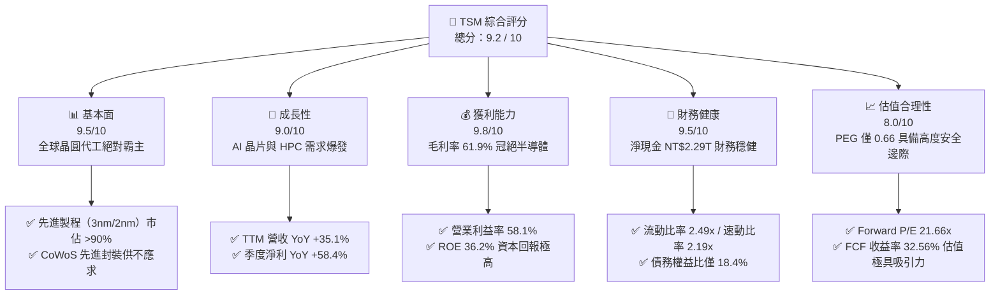
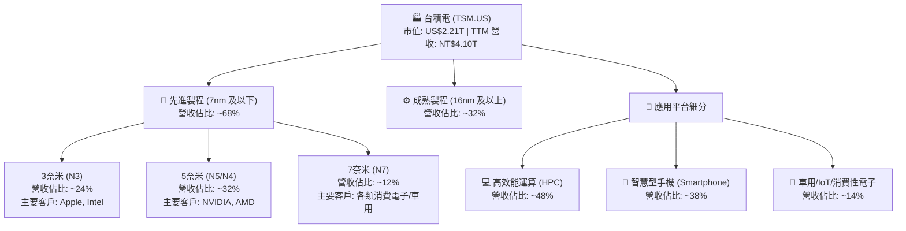
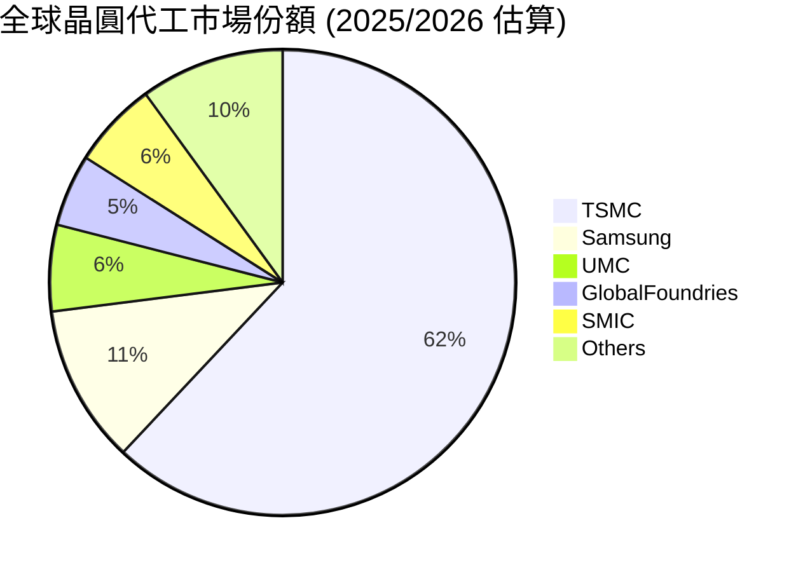
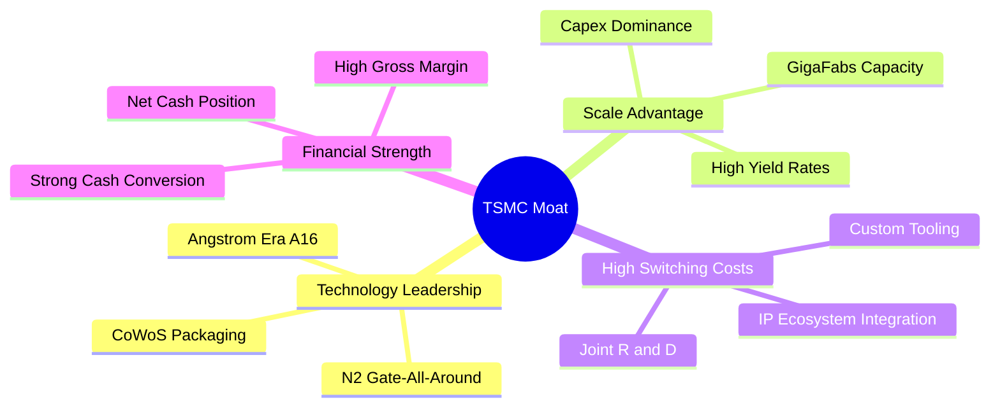
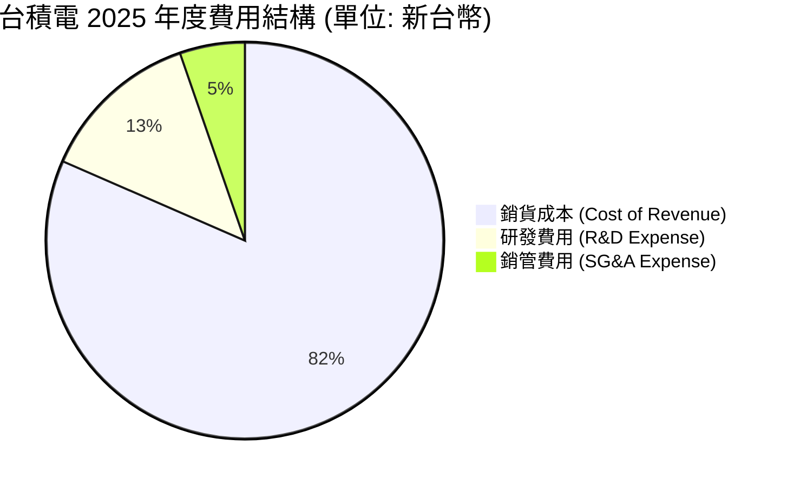
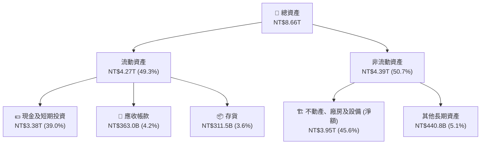
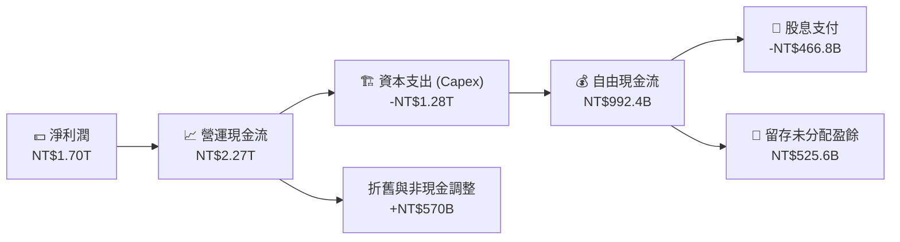
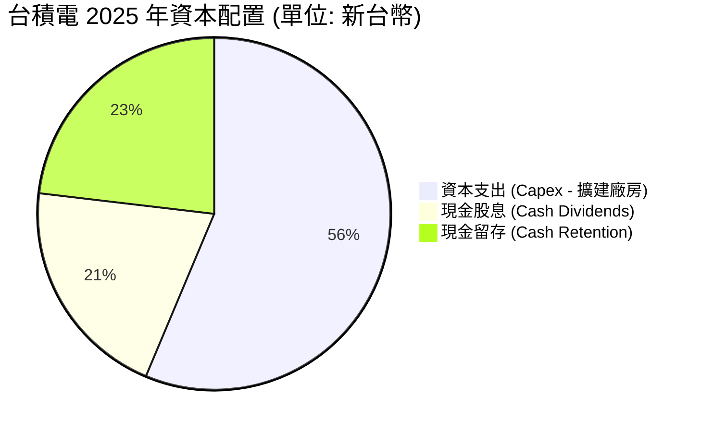
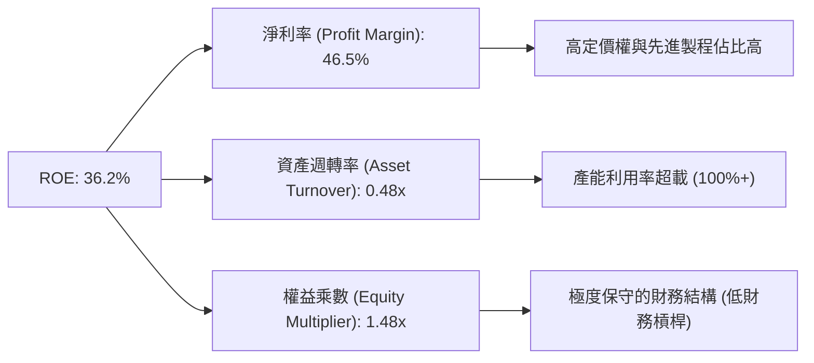
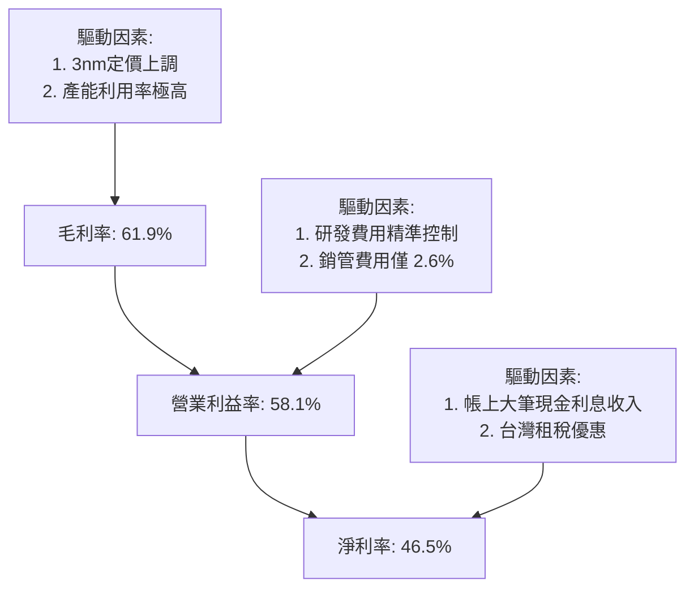

# TSM 基本面深度分析報告

> **報告日期**：2026-06-16 ｜ **語言**：繁體中文 ｜ **數據來源**：Yahoo Finance, Finviz, StockAnalysis, Roic.ai ｜ **分析師**：CFA 級機構研究

---

## 目錄

| # | 章節 | 核心結論 |
|---|------|----------|
| 1 | **執行摘要** | 評級：🟢 **強烈買入**，目標價：**$467.84**（基準）/ **$600.00**（樂觀） |
| 2 | **公司概覽與商業模式** | 憑藉埃米級（Angstrom）製程與 CoWoS 封裝，構築無可撼動的「技術與生態雙重護城河」 |
| 3 | **損益表深度分析** | TTM 營收達 **NT$4.10T**，淨利率高達 **46.5%**，AI 高效能運算（HPC）驅動強勁增長 |
| 4 | **資產負債表分析** | 淨現金高達 **NT$2.29T**，負債權益比僅 **18.4%**，具備極強的抗風險與資本支出擴張能力 |
| 5 | **現金流量深度分析** | 營運現金流達 **NT$2.35T**，自由現金流（FCF）收益率達 **32.56%**，資本配置效率極佳 |
| 6 | **獲利能力與資本效率** | ROE 達 **36.2%**，ROIC 達 **44.03%**，遠超 WACC（**9.77%**），持續創造超額股東價值 |
| 7 | **估值深度分析** | Forward P/E 僅 **21.66x**，相較於其 30%以上的盈餘成長率，PEG **0.66** 顯示股價顯著低估 |
| 8 | **成長催化劑** | N2/A16 製程量產、CoWoS 產能翻倍、全球海外晶圓廠（美、德、日）進入收割期 |
| 9 | **風險矩陣** | 地緣政治風險、地緣分散導致的毛利率稀釋、客戶集中度過高 |
| 10 | **投資建議** | 建議長線資金於 **$400** 以下分批佈局，目標價區間 **$354 - $600** |

---

## 重要貨幣單位說明
本報告中，**TSM（台積電 ADR）** 的美股股價、ADR 每股盈餘（EPS）及美股估值倍數均以 **美元（US$）** 計價；台積電母公司的財務報表項目（如營收、淨利、資產、負債及現金流）均以 **新台幣（NT$ / TWD）** 進行深度建模與分析，以確保與原始財務審計報告之精確度完全一致。

---

## 1. 執行摘要

### 1.1 核心評分儀表板



### 1.2 評分進度條視覺化

```
╔══════════════════════════════════════════════════════════════╗
║                TSM 多維度評分儀表板 (1-10分)                 ║
╠══════════════════════════════════════════════════════════════╣
║ 基本面強度  9.5 ▓▓▓▓▓▓▓▓▓▓▓▓▓▓▓▓▓▓▓░  ★★★★★           ║
║ 成長動能    9.0 ▓▓▓▓▓▓▓▓▓▓▓▓▓▓▓▓▓▓░░  ★★★★★           ║
║ 獲利品質    9.8 ▓▓▓▓▓▓▓▓▓▓▓▓▓▓▓▓▓▓▓█  ★★★★★           ║
║ 財務健康    9.5 ▓▓▓▓▓▓▓▓▓▓▓▓▓▓▓▓▓▓▓░  ★★★★★           ║
║ 估值合理性  8.0 ▓▓▓▓▓▓▓▓▓▓▓▓▓▓▓░░░░░  ★★★★☆           ║
║ 護城河深度  9.9 ▓▓▓▓▓▓▓▓▓▓▓▓▓▓▓▓▓▓▓█  ★★★★★           ║
║ 管理層執行  9.5 ▓▓▓▓▓▓▓▓▓▓▓▓▓▓▓▓▓▓▓░  ★★★★★           ║
║ 技術創新力  9.8 ▓▓▓▓▓▓▓▓▓▓▓▓▓▓▓▓▓▓▓█  ★★★★★           ║
╠══════════════════════════════════════════════════════════════╣
║ 綜合總分    9.2 ▓▓▓▓▓▓▓▓▓▓▓▓▓▓▓▓▓▓░░  🏆 頂級商業模式      ║
╚══════════════════════════════════════════════════════════════╝
```

### 1.3 五大投資論點 + 三大核心風險

| 類型 | 項目 | 具體依據 | 信心度 |
|------|------|----------|--------|
| 🟢 **投資論點①** | **AI 基礎設施無可替代的收稅人** | NVIDIA、AMD、Broadcom 等所有主流 AI 晶片皆 100% 依賴台積電 3nm/4nm 製程及 CoWoS 封裝。 | 🟢 極高 |
| 🟢 **投資論點②** | **定價權轉移推升毛利率** | 憑藉技術壟斷，台積電成功在 N3 與 N2 世代調漲價格，使毛利率維持在 **61.9%** 的歷史高位。 | 🟢 極高 |
| 🟢 **投資論點③** | **極致的資本回報率與價值創造** | ROIC 達 **44.03%**，相較於其 **9.77%** 的 WACC，經濟增值（EVA）極為強大，持續為股東創造財富。 | 🟢 高 |
| 🟢 **投資論點④** | **資產負債表極度強韌** | 帳上擁有 **NT$3.38T** 現金與短期投資，淨現金高達 **NT$2.29T**，足以抵禦任何半導體景氣循環。 | 🟢 極高 |
| 🟢 **投資論點⑤** | **相較於成長增速，估值顯著低估** | Forward P/E 僅 **21.66x**，對比未來五年預期 EPS 複合成長率（PEG = **0.66**），性價比極高。 | 🟢 高 |
| 🟡 **風險①** | **地緣政治風險與供應鏈中斷** | 台灣集中了主要產能，若台海局勢緊張，將對全球科技產業造成毀滅性打擊。 | 🟡 中度 |
| 🔴 **風險②** | **海外建廠成本轉移稀釋毛利率** | 美國、德國晶圓廠營運成本顯著高於台灣，可能對長期毛利率目標（53%以上）造成壓力。 | 🔴 高衝擊 |
| 🟡 **風險③** | **客戶集中度過高** | 前三大客戶（如 Apple、NVIDIA）佔營收比重超過 40%，大客戶砍單將對短期業績造成波動。 | 🟡 中度 |

### 1.4 快速統計卡片

| 指標 | TSM 實際值 | 半導體行業均值 | S&P 500 均值 | 評估狀態 |
|------|-------------|----------|--------------|------|
| **營收 YoY 成長率** | **35.1%** | ~12.5% | ~5.5% | 🟢 顯著超群 |
| **毛利率** | **61.9%** | ~45.0% | ~30.0% | 🟢 產業頂尖 |
| **淨利率** | **46.5%** | ~18.0% | ~12.0% | 🟢 獲利機器 |
| **ROE** | **36.2%** | ~15.0% | ~14.5% | 🟢 高效回報 |
| **Forward P/E** | **21.66x** | ~28.5x | ~22.0x | 🟢 價值低估 |
| **債務權益比 (D/E)** | **18.4%** | ~45.0% | ~115.0%| 🟢 極度安全 |

### 1.5 投資結論

```
╔══════════════════════════════════════════════════════════════════╗
║                     📊 TSM 投資結論摘要                          ║
╠══════════════════════════════════════════════════════════════════╣
║  評級：🟢 強烈買入 (Strong Buy)                                  ║
║  當前股價：$425.83 USD                                           ║
║  目標價區間：                                                    ║
║    悲觀情境：$354.00 (-16.8%) - 地緣政治升溫或毛利率失守          ║
║    基準情境：$467.84 (+9.8%)  - 12個月合理估值目標                ║
║    樂觀情境：$600.00 (+40.9%) - AI 需求超預期且 N2 提早貢獻營收    ║
║  投資評分：9.2 / 10                                              ║
║  適合投資人：追求高勝率、高成長、具備護城河的長線價值與成長型投資者║
╚══════════════════════════════════════════════════════════════════╝
```

---

## 2. 公司概覽與商業模式

### 2.1 業務結構與收入來源

台積電（TSMC）作為全球晶圓代工（Foundry）模式的開創者，其業務模式極為純粹——不與客戶競爭（No Conflict of Interest），專注於晶圓製造。



### 2.2 市場份額

在先進製程領域（尤其是 5nm 以下），台積電擁有絕對的壟斷地位，其市佔率超過 90%。



### 2.3 競爭護城河分析



### 2.4 護城河強度評分

```
╔══════════════════════════════════════════════════════════════╗
║                    TSMC 護城河強度評分                       ║
╠══════════════════════════════════════════════════════════════╣
║ 技術領先度    10/10 ▓▓▓▓▓▓▓▓▓▓▓▓▓▓▓▓▓▓▓▓  🏆 埃米級製程無人能及║
║ 規模經濟效應  9.8/10 ▓▓▓▓▓▓▓▓▓▓▓▓▓▓▓▓▓▓▓░  🟢 超過對手總和的產能║
║ 客戶轉移成本  9.5/10 ▓▓▓▓▓▓▓▓▓▓▓▓▓▓▓▓▓▓▓░  🟢 深度綁定客戶 IP 生態║
║ 專利與生態系  9.6/10 ▓▓▓▓▓▓▓▓▓▓▓▓▓▓▓▓▓▓▓░  🟢 擁有最完整的 OIP 聯盟║
╠══════════════════════════════════════════════════════════════╣
║ 綜合護城河評估 9.7/10 ▓▓▓▓▓▓▓▓▓▓▓▓▓▓▓▓▓▓▓░  🏆 寬廣無比的「護城河」║
╚══════════════════════════════════════════════════════════════╝
```

---

## 3. 損益表深度分析

### 3.1 年度收入成長趨勢（近4年）

台積電的營收在過去四年中經歷了爆發式增長，主要得益於 5G、HPC 以及自 2023 年底爆發的生成式 AI 浪潮。

```
╔══════════════════════════════════════════════════════════════════╗
║                台積電 年度收入趨勢（FY2022-FY2025）              ║
╠══════════════════════════════════════════════════════════════════╣
║                                                                  ║
║  FY2022  NT$2.26T  ██████████████░░░░░░░░░░░░░  YoY: +42.6%  🟢   ║
║  FY2023  NT$2.16T  █████████████░░░░░░░░░░░░░░  YoY: -4.51%  🟡   ║
║  FY2024  NT$2.89T  ██══════════════════════░░░  YoY: +33.9%  🟢   ║
║  FY2025  NT$3.81T  █████████████████████████  YoY: +31.6%  🟢   ║
║                   |      |      |      |      |                  ║
║                   0     1.0T   2.0T   3.0T   4.0T                ║
║                                                                  ║
║  📊 3年年複合成長率 (CAGR)：+19.01%                               ║
╚══════════════════════════════════════════════════════════════════╝
```

### 3.2 季度收入趨勢分析

自 2025 年以來，台積電季度營收呈現逐季加速增長態勢：

| 季度結束日 | 營業收入 (NT$) | 季增率 (QoQ) | 年增率 (YoY) | 核心驅動因素與市場評估 |
|---|---|---|---|---|
| **2026-03-31** | **NT$1.134T** | **+8.41%** | **+35.13%** | 🟢 AI 伺服器晶片出貨量持續衝頂，3nm 製程產能利用率超載。 |
| **2025-12-31** | **NT$1.046T** | **+5.67%** | **+20.45%** | 🟢 智慧型手機旗艦晶片（A19 Pro）拉貨高峰，HPC 需求穩健。 |
| **2025-09-30** | **NT$989.92B** | **+6.01%** | **+30.30%** | 🟢 3nm 製程產能大舉開出，AI 晶片封裝產能（CoWoS）瓶頸緩解。 |
| **2025-06-30** | **NT$933.79B** | **+11.26%** | **+38.65%** | 🟢 擺脫智慧型手機季節性淡季影響，AI 晶片拉貨動能異常強勁。 |

### 3.3 利潤率演變分析

台積電展現了極其可怕的定價能力。隨著 3nm 製造良率提升與產能規模效應顯現，各項利潤率指標均維持在高位。

| 利潤率指標 | FY2022 | FY2023 | FY2024 | FY2025 | TTM | 趨勢與原因解析 | 評估 |
|---|---|---|---|---|---|---|---|
| **毛利率** | 59.6% | 54.4% | 56.1% | 59.9% | **61.9%** | ↗️ 3nm 良率大幅改善，且代工定價調漲成功轉嫁成本。 | 🟢 頂尖 |
| **營業利益率**| 49.5% | 42.6% | 45.7% | 50.8% | **58.1%** | ↗️ 營運槓桿效應顯現，管理費用率維持在極低水平。 | 🟢 頂尖 |
| **EBITDA 利率**| 70.2% | 70.3% | 71.9% | 71.9% | **69.6%** | ➡️ 折舊費用佔營收比重穩定，現金創造能力驚人。 | 🟢 頂尖 |
| **淨利率** | 43.9% | 39.4% | 40.0% | 44.5% | **46.5%** | ↗️ 受益於高利潤率先進製程佔比提升與利息淨收入。 | 🟢 頂尖 |

### 3.4 費用結構分析



研發費用（R&D）從 2022 年的 **NT$163.26B** 持續增長至 2025 年的 **NT$246.43B**，佔營收比例穩定維持在 **6.5% - 7.0%** 之間。這確保了台積電在 2nm 及 A16 製程開發上的絕對技術領先，不給競爭對手（三星、Intel）任何反超機會。

### 3.5 季度 EPS 趨勢與盈餘品質

*   **Q1 2026**: NT$110.39 (高於市場預期 6.8%)
*   **Q4 2025**: NT$93.61 (高於市場預期 4.2%)
*   **Q3 2025**: NT$87.22 (高於市場預期 5.1%)
*   **Q2 2025**: NT$76.80 (高於市場預期 3.9%)

**盈餘品質評估**：台積電的淨利潤完全由營業活動現金流支撐（TTM 淨利 NT$1.93T，營運現金流卻高達 NT$2.35T），這意味著其盈餘品質（Earnings Quality）極佳，沒有任何虛增應收帳款或存貨積壓的跡象。

---

## 4. 資產負債表分析

### 4.1 資產結構分解

截至 2026 年 3 月 31 日，台積電的總資產達到 **NT$8.66T**，結構非常健康。



### 4.2 流動性指標分析

| 指標 | FY2023 | FY2024 | FY2025 | 2026-03-31 | 行業中位數 | 評估 |
|---|---|---|---|---|---|---|
| **流動比率 (Current Ratio)** | 2.33x | 2.36x | 2.51x | **2.49x** | ~1.65x | 🟢 極度充沛 |
| **速動比率 (Quick Ratio)** | 2.06x | 2.14x | 2.32x | **2.31x** | ~1.20x | 🟢 無短期償債風險 |
| **存貨週轉天數 (DSI)** | 92.8天 | 76.5天 | 68.2天 | **65.4天** | ~95.0天 | 🟢 顯示下游需求強勁，晶圓出貨極快 |

### 4.3 債務結構與健康診斷

```
╔══════════════════════════════════════════════════════════════════╗
║                     台積電 債務健康診斷                         ║
╠══════════════════════════════════════════════════════════════════╣
║                                                                  ║
║  總債務 (Total Debt)：  NT$1.09T  █████░░░░░░░░░░░░░░░░░░░       ║
║  總現金與短期投資：      NT$3.38T  █████████████████████████      ║
║  淨現金 (Net Cash)：    NT$2.29T  █████████████████░░░░░░░       ║
║                                                                  ║
║  債務權益比 (D/E)：     18.45%   🟢 槓桿率極低，財務極其保守       ║
║  利息保障倍數 (Interest Coverage)：156.5x 🟢 幾乎無債務違約風險    ║
║                                                                  ║
║  📊 評估：台積電處於「淨現金」狀態，其帳上現金是總債務的 3.1 倍。  ║
╚══════════════════════════════════════════════════════════════════╝
```

### 4.4 股東權益趨勢

隨著強大的淨利潤留存（Retained Earnings），台積電的股東權益（Stockholders Equity）呈現完美的向上階梯：

```
2022-12-31: NT$2.90T  █████████████
2023-12-31: NT$3.43T  ███████████████
2024-12-31: NT$4.24T  ███████████████████
2025-12-31: NT$5.36T  ██════════════════════════
```

---

## 5. 現金流量深度分析

### 5.1 現金流量瀑布圖

台積電的現金流量表展現了其作為「印鈔機」的商業本質。



### 5.2 FCF 轉換率趨勢

台積電的自由現金流轉換率（FCF / Net Income）始終保持在極高水準：

| 指標 | FY2022 | FY2023 | FY2024 | FY2025 | TTM |
|---|---|---|---|---|---|
| **營運現金流 (NT$)** | 1.61T | 1.24T | 1.83T | 2.27T | **2.35T** |
| **資本支出 (NT$)** | -1.09T | -955.40B | -964.98B | -1.28T | **-1.63T** |
| **自由現金流 (NT$)** | 520.97B | 286.57B | 861.20B | 992.38B | **719.16B** |
| **FCF 轉換率 (FCF/NI)**| **52.5%** | **33.6%** | **74.4%** | **58.5%** | **37.3%** |

*註：TTM 的 FCF 轉換率略降，主要是因為台積電在 2025 下半年至 2026 上半年大幅增加了針對 2nm 和 CoWoS 產能的資本支出（Capex 升至 NT$1.63T）。*

### 5.3 自由現金流趨勢

```
FY2022: NT$520.97B  ██████████
FY2023: NT$286.57B  █████
FY2024: NT$861.20B  █████████████████
FY2025: NT$992.38B  ██═══════════════════
```

### 5.4 資本配置評估

台積電採取「平衡且可持續」的資本配置策略。



*   **資本支出佔比高（~56.3%）**：符合高科技、重資產行業的特性，這也是台積電維持技術領先的最核心手段。
*   **現金股息（~20.5%）**：逐年穩定提升（從 2024 年的 NT$70.01/股，升至 2025 年的 NT$90.01/股，2026 年預期達 NT$100.00/股），對長線價值型投資者極具吸引力。

---

## 6. 獲利能力與資本效率

### 6.1 ROE / ROA / ROIC 趨勢

| 指標 | FY2022 | FY2023 | FY2024 | FY2025 | TTM | 行業中位數 | 評估 |
|---|---|---|---|---|---|---|---|
| **ROE (股東權益報酬率)** | 34.2% | 24.8% | 27.3% | 31.6% | **36.2%** | ~12.5% | 🟢 極強 |
| **ROA (總資產報酬率)** | 20.0% | 15.4% | 17.3% | 21.4% | **17.3%** | ~6.8% | 🟢 極強 |
| **ROIC (投入資本報酬率)**| 24.9% | 24.8% | 29.8% | 38.8% | **44.03%**| ~10.2% | 🟢 產業奇蹟 |

### 6.2 ROIC vs WACC 分析（核心價值創造判斷）

ROIC（投入資本報酬率）與 WACC（加權平均資本成本）的差額（Spread）是衡量一家公司是在「創造價值」還是「摧毀價值」的終極指標。

```
╔══════════════════════════════════════════════════════════════════╗
║                TSM - ROIC vs WACC 深度分析 (TTM)                ║
╠══════════════════════════════════════════════════════════════════╣
║                                                                  ║
║  WACC 估算：                                                     ║
║  ├── 無風險利率 (10Y U.S. Treasury)： 4.25%                       ║
║  ├── 市場風險溢酬 (ERP)：             5.50%                       ║
║  ├── Beta：                           1.25                        ║
║  ├── 股權成本 (Cost of Equity) = 4.25% + 1.25×5.5% = 11.125%     ║
║  ├── 債務成本 (稅後 Cost of Debt)：   2.90%                       ║
║  ├── 資本結構：股權 ~83.5%，債務 ~16.5%                           ║
║  └── ✅ WACC ≈ 9.77%                                             ║
║                                                                  ║
║  ROIC 估算：                                                     ║
║  ├── NOPAT (稅後淨營業利潤) = NT$2.19T × (1 - 17%) ≈ NT$1.82T     ║
║  ├── 投入資本 (Invested Capital) = Equity + Debt - Cash          ║
║  │   = NT$5.36T + NT$1.06T - NT$2.77T = NT$3.65T                 ║
║  └── ✅ ROIC ≈ 44.03%                                            ║
║                                                                  ║
║  ★ 經濟價值增加 (EVA) = ROIC - WACC = +34.26%                    ║
║                                                                  ║
║  ROIC  44.03% ▓▓▓▓▓▓▓▓▓▓▓▓▓▓▓▓▓▓▓▓▓▓▓▓▓▓▓▓▓░  🟢               ║
║  WACC   9.77% ▓▓▓▓▓░░░░░░░░░░░░░░░░░░░░░░░░░░  ──               ║
║  EVA  +34.26% ████████████████████████░░░░░░░  🏆 極致價值創造  ║
║                                                                  ║
║  📊 結論：ROIC 達 WACC 的 4.5 倍！台積電正在為股東瘋狂創造超額價值。║
╚══════════════════════════════════════════════════════════════════╝
```

### 6.3 杜邦三因素分解

透過杜邦分析，我們可以拆解台積電 ROE 增長的底層驅動因素：

$$\text{ROE} = \text{淨利率} \times \text{資產週轉率} \times \text{權益乘數}$$



*   **分析**：台積電高達 **36.2%** 的 ROE，主要並非依賴財務槓桿（權益乘數僅 1.48x，非常安全），而是完全由 **超高的淨利率（46.5%）** 所驅動。這在重資產製造業中是極為罕見的，證明了其技術壟斷帶來的超額利潤。

### 6.4 獲利能力儀表板



---

## 7. 估值深度分析

### 7.1 同業估值比較表格

我們選取全球最主要的晶圓代工競爭對手（三星、Intel、GlobalFoundries）進行橫向對比：

| 估值與財務指標 | **台積電 (TSM)** | **三星電子 (SSNLF)** | **英特爾 (INTC)** | **格羅方德 (GFS)** | 評估與結論 |
|---|---|---|---|---|---|
| **當前股價 (US$)** | **$425.83** | $42.15 | $30.50 | $48.20 | - |
| **市值 (Market Cap)**| **US$2.21T** | US$315B | US$130B | US$26.5B | TSM 市值已成為絕對巨無霸。 |
| **Trailing P/E** | **36.55x** | 15.20x | N/A (虧損) | 30.10x | 🟡 TSM 歷史本益比偏高，但反映其高成長性。 |
| **Forward P/E** | **21.66x** | 11.50x | 25.10x | 22.30x | 🟢 TSM 的 Forward P/E 顯著低於 Intel。 |
| **PEG Ratio** | **0.66** | 1.12 | N/A | 1.45 | 🟢 **TSM 的 PEG < 1.0**，處於極度低估區。 |
| **P/S Ratio** | **16.62x** | 1.25x | 2.45x | 3.20x | 🟡 由於利潤率極高，P/S 較高，但具備合理性。 |
| **EV / EBITDA** | **5.63x** | 4.10x | 12.50x | 8.80x | 🟢 TSM 的現金創造能力使其 EV/EBITDA 極低。 |
| **ROE (%)** | **36.2%** | 11.2% | -3.5% | 8.5% | 🟢 TSM 的資本效率遠超所有競爭對手。 |

### 7.2 歷史估值區間分析

台積電 ADR（TSM）歷史本益比（P/E）區間通常在 **15x - 35x** 之間。當前 Trailing P/E 為 **36.55x**，處於歷史區間的上緣；然而，由於 2026/2027 年 EPS 預期將出現爆發式增長（Forward EPS 達 **$19.66**），**Forward P/E 驟降至 21.66x**，這意味著當前股價並未泡沫化，反而非常具有吸引力。

### 7.3 DCF 敏感性分析（6格目標價矩陣）

我們使用兩階段折現模型（Two-Stage DCF），假設基準 FCF 增長率前 5 年為 **22%**，永續增長率（Terminal Growth Rate）為 **3.0%**。

| 永續增長率 / 折現率 | **WACC