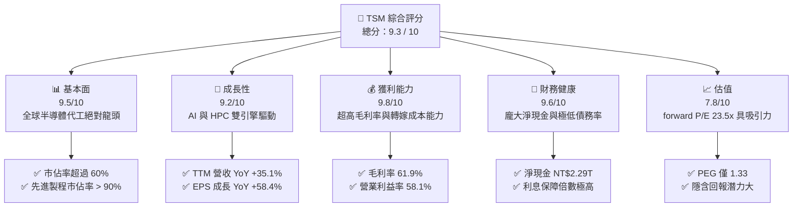
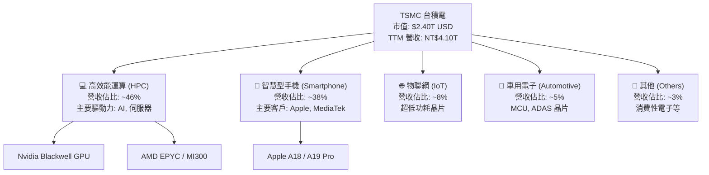
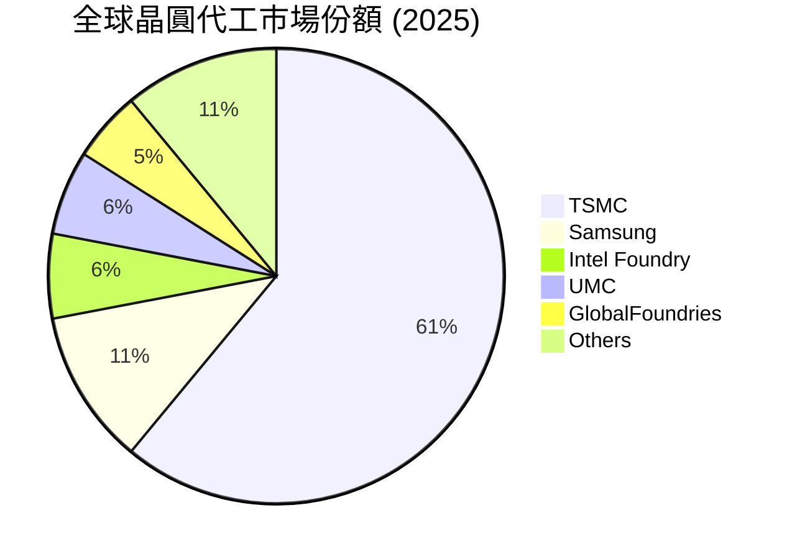
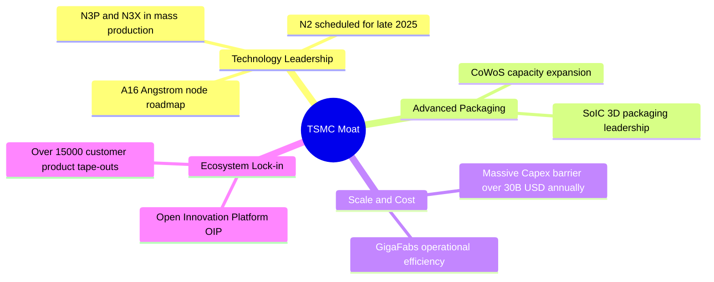
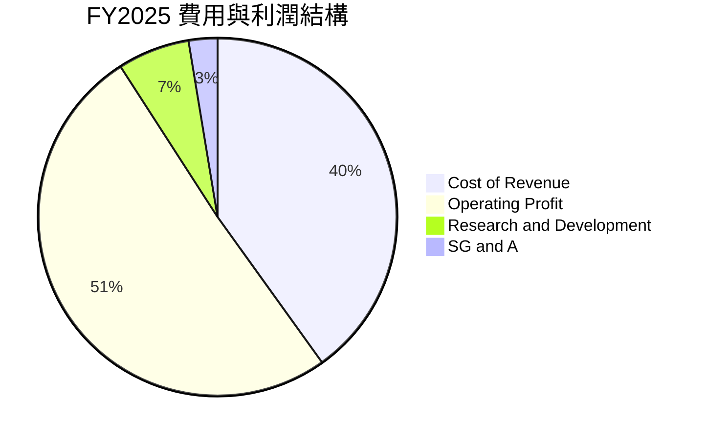
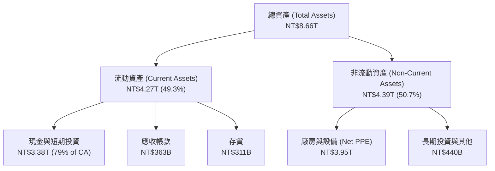
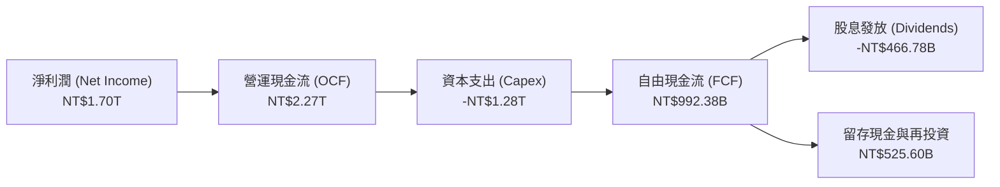
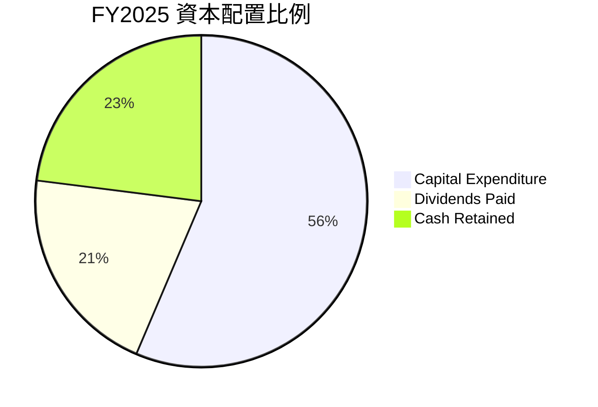

# TSM 基本面深度分析報告

> **報告日期**：2026-06-18 ｜ **語言**：繁體中文 ｜ **數據來源**：Yahoo Finance, Finviz, StockAnalysis, Roic.ai ｜ **分析師**：CFA 級機構研究

---

## 目錄

| # | 章節 | 核心結論 |
|---|------|----------|
| 1 | 執行摘要 | 評級：🟢 強烈買入，目標價：$473.40（基準）/ $700.00（樂觀） |
| 2 | 公司概覽與商業模式 | 憑藉 N3/N2 製程與 CoWoS 封裝建構無可撼動的「技術與規模」雙重護城河 |
| 3 | 損益表深度分析 | TTM 營收達 NT$4.10T（YoY +35.1%），AI 晶片爆發推升毛利率至 61.9% |
| 4 | 資產負債表分析 | 淨現金達 NT$2.29T，債務權益比僅 18.4%，財務結構極度穩健 |
| 5 | 現金流量深度分析 | 經營現金流達 NT$2.35T，自由現金流（FCF）轉換率高，資本配置效率極佳 |
| 6 | 獲利能力與資本效率 | ROE 達 36.2%，ROIC（50.3%）遠超 WACC（9.3%），強力創造股東價值 |
| 7 | 估值深度分析 | Forward P/E 23.56x，相較於 AI 成長增速（PEG 1.33 / 0.71）估值具有吸引力 |
| 8 | 成長催化劑 | N2 量產、A16 光刻技術導入與 CoWoS 產能翻倍，驅動 HPC 業務長期成長 |
| 9 | 風險矩陣 | 地緣政治集中度高、高額資本支出（Capex）折舊壓力為主要風險 |
| 10 | 投資建議 | 具備極高安全邊際與成長彈性，適合長期機構投資者配置 |

---

## 1. 執行摘要

### 1.1 核心評分儀表板



### 1.2 評分進度條視覺化

```
╔══════════════════════════════════════════════════════════════╗
║                TSM 多維度評分儀表板 (1-10分)                 ║
╠══════════════════════════════════════════════════════════════╣
║ 基本面強度  9.5 ▓▓▓▓▓▓▓▓▓▓▓▓▓▓▓▓▓▓▓░  ★★★★★           ║
║ 成長動能    9.2 ▓▓▓▓▓▓▓▓▓▓▓▓▓▓▓▓▓▓░░  ★★★★★           ║
║ 獲利品質    9.8 ▓▓▓▓▓▓▓▓▓▓▓▓▓▓▓▓▓▓▓█  ★★★★★           ║
║ 財務健康    9.6 ▓▓▓▓▓▓▓▓▓▓▓▓▓▓▓▓▓▓▓░  ★★★★★           ║
║ 估值合理性  7.8 ▓▓▓▓▓▓▓▓▓▓▓▓▓▓░░░░░░  ★★★★☆           ║
║ 護城河深度  9.9 ▓▓▓▓▓▓▓▓▓▓▓▓▓▓▓▓▓▓▓█  ★★★★★           ║
║ 管理層執行  9.5 ▓▓▓▓▓▓▓▓▓▓▓▓▓▓▓▓▓▓▓░  ★★★★★           ║
║ 技術創新力  9.8 ▓▓▓▓▓▓▓▓▓▓▓▓▓▓▓▓▓▓▓█  ★★★★★           ║
╠══════════════════════════════════════════════════════════════╣
║ 綜合總分    9.3 ▓▓▓▓▓▓▓▓▓▓▓▓▓▓▓▓▓▓░░  🏆 強烈買入          ║
╚══════════════════════════════════════════════════════════════╝
```

### 1.3 五大投資論點 + 三大核心風險

| 類型 | 項目 | 具體依據 | 信心度 |
|------|------|----------|--------|
| 🟢 **投資論點①** | **AI 需求帶來的結構性成長** | HPC 業務營收佔比持續提升，TTM 營收成長率達 35.1%，主要受惠於 Nvidia Blackwell 及 AMD MI300 等 AI 晶片量產。 | 🟢 極高 |
| 🟢 **投資論點②** | **定價權與高毛利率維持** | TTM 毛利率高達 61.9%，營業利益率達 58.1%，顯示其將先進製程高昂研發成本完全轉嫁給客戶的能力。 | 🟢 極高 |
| 🟢 **投資論點③** | **技術製程絕對領先** | 3nm（N3）產能全開，2nm（N2）預計於 2025 年底量產，進度顯著領先 Intel 18A 與 Samsung 3nm。 | 🟢 極高 |
| 🟢 **投資論點④** | **強大的資本回報與現金流** | 營運現金流達 NT$2.35T，自由現金流達 NT$719.16B，且 2025 年配發股息達 NT$466.78B，股息持續成長。 | 🟢 高 |
| 🟢 **投資論點⑤** | **優異的資產負債表** | 持有現金及等價物達 NT$3.38T，負債權益比僅為 18.4%，具備極強的抗風險與再投資能力。 | 🟢 極高 |
| 🟡 **風險①** | **地緣政治與產能過度集中** | 超過 80% 的先進製程產能仍集中於台灣，美、德、日海外建廠成本高昂，可能稀釋長期毛利率。 | 🟡 中度 |
| 🔴 **風險②** | **巨額資本支出折舊壓力** | 2025 年資本支出達 -NT$1.28T，若半導體需求出現週期性放緩，高折舊將對利潤率造成短期壓制。 | 🔴 高衝擊 |
| 🟡 **風險③** | **客戶集中度過高** | 前兩大客戶（預計為 Apple 與 Nvidia）佔其營收顯著比例，若主要客戶終端產品銷售不佳，將直接影響訂單波動。 | 🟡 中度 |

### 1.4 快速統計卡片

| 指標 | 公司實際值（TTM） | 行業均值（Semiconductors） | S&P 500 均值 | 狀態 |
|------|-------------|----------|--------------|------|
| **營收 YoY 成長率** | **35.1%** | ~12.5% | ~5.2% | 🟢 卓越 |
| **毛利率** | **61.9%** | ~45.0% | ~30.0% | 🟢 卓越 |
| **淨利率** | **46.5%** | ~18.0% | ~11.5% | 🟢 卓越 |
| **ROE** | **36.2%** | ~15.0% | ~14.5% | 🟢 卓越 |
| **Forward P/E** | **23.56x** | ~28.0x | ~21.5x | 🟢 具吸引力 |
| **淨現金規模** | **NT$2.29T** | N/A | N/A | 🟢 極度安全 |

### 1.5 投資結論

```
╔══════════════════════════════════════════════════════════════════╗
║                    📊 TSM 投資結論摘要                            ║
╠══════════════════════════════════════════════════════════════════╣
║  評級：🟢 強烈買入 (Strong Buy)                                 ║
║  當前股價：$463.05 (2026-06-18)                                  ║
║  目標價區間：                                                    ║
║    悲觀情境：$354.00（-23.5%）- 需求嚴重衰退、地緣衝突加劇       ║
║    基準情境：$473.40（+2.2%） - 12個月合理估值目標               ║
║    樂觀情境：$700.00（+51.2%）- AI 爆發超預期、N2 進展順利       ║
║  投資評分：9.3 / 10                                              ║
║  適合投資人：成長型、核心資產配置者、長線持有者                  ║
╚══════════════════════════════════════════════════════════════════╝
```

---

## 2. 公司概覽與商業模式

### 2.1 業務結構與收入來源

台積電（TSMC）是純晶圓代工（Pure-play Foundry）商業模式的開創者。其不與客戶競爭，專注於製造與封裝。



### 2.2 市場份額

在全球晶圓代工市場中，台積電擁有絕對的壟斷地位，特別是在 7nm 以下的先進製程中，市佔率更是超過 90%。



### 2.3 競爭護城河分析



### 2.4 護城河強度評分

```
╔══════════════════════════════════════════════════════════════╗
║                    TSMC 護城河強度評分                       ║
╠══════════════════════════════════════════════════════════════╣
║ 技術領先度    10/10  ▓▓▓▓▓▓▓▓▓▓▓▓▓▓▓▓▓▓▓▓  🏆 無人能及     ║
║ 先進封裝優勢  9.8/10 ▓▓▓▓▓▓▓▓▓▓▓▓▓▓▓▓▓▓▓░  🟢 CoWoS 壟斷   ║
║ 客戶鎖定效應  9.5/10 ▓▓▓▓▓▓▓▓▓▓▓▓▓▓▓▓▓▓▓░  🟢 生態系綁定   ║
║ 規模與資金壁壘9.8/10 ▓▓▓▓▓▓▓▓▓▓▓▓▓▓▓▓▓▓▓░  🟢 年投百億美金 ║
╠══════════════════════════════════════════════════════════════╣
║ 綜合護城河    9.8/10 ▓▓▓▓▓▓▓▓▓▓▓▓▓▓▓▓▓▓▓░  🏆 極深寬護城河 ║
╚══════════════════════════════════════════════════════════════╝
```

---

## 3. 損益表深度分析

*特別說明：台積電的財務報表（營收、利潤、現金流）以新台幣（TWD / NT$）計價，而美股 ADR（TSM）股價與市值以美元（USD / $）計價。1 美元 ≈ 32 新台幣。*

### 3.1 年度收入成長趨勢（近4年）

```
╔══════════════════════════════════════════════════════════════════╗
║              TSMC 年度收入趨勢（FY2022-FY2025）                  ║
╠══════════════════════════════════════════════════════════════════╣
║                                                                  ║
║  FY2022  NT$2.26T  ████████████████░░░░░░░░░░░  YoY: +42.6% 🟢   ║
║  FY2023  NT$2.16T  ███████████████░░░░░░░░░░░░  YoY: -4.5%  🟡   ║
║  FY2024  NT$2.89T  ████████████████████░░░░░░░  YoY: +33.9% 🟢   ║
║  FY2025  NT$3.81T  ███████████████████████████  YoY: +31.6% 🟢   ║
║                                                                  ║
║  📊 4年累計營收 CAGR：+19.0%                                    ║
╚══════════════════════════════════════════════════════════════════╝
```

### 3.2 季度收入趨勢分析

台積電近 4 季展現出強勁的逐季加速成長態勢：

| 財報季度 | 營業收入 (NT$B) | YoY 成長率 | QoQ 成長率 | 核心驅動因素 | 評估 |
|---|---|---|---|---|---|
| **Q2 2025** | NT$933.79 | +38.65% | +11.26% | 3nm 出貨量持續放大，智慧型手機拉貨起跑 | 🟢 優秀 |
| **Q3 2025** | NT$989.92 | +30.30% | +6.01% | AI 晶片需求強勁，HPC 佔比突破 45% | 🟢 優秀 |
| **Q4 2025** | NT$1,046.09 | +20.45% | +5.67% | 年底消費性電子旺季，先進封裝產能滿載 | 🟢 優秀 |
| **Q1 2026** | NT$1,134.10 | +35.13% | +8.41% | AI 需求淡季不淡，N3P/N3E 製程貢獻顯著 | 🟢 卓越 |

### 3.3 利潤率演變分析

台積電的利潤率在半導體製造業中堪稱奇蹟，這得益於其強大的定價權與高產能利用率。

| 利潤率指標 | FY2022 | FY2023 | FY2024 | FY2025 | TTM | 趨勢 | 評估 |
|------------|--------|--------|--------|--------|------|------|------|
| **毛利率** | 59.6% | 54.4% | 56.1% | 59.9% | **61.9%** | ↗️ 持續走高 | 🟢 卓越 |
| **營業利益率**| 49.5% | 42.6% | 45.7% | 50.8% | **58.1%** | ↗️ 效率提升 | 🟢 卓越 |
| **EBITDA Margin**| 70.2% | 70.3% | 71.9% | 71.9% | **69.6%** | ➡️ 高位穩定 | 🟢 卓越 |
| **淨利率** | 43.9% | 39.4% | 40.0% | 44.5% | **46.5%** | ↗️ 盈利能力極強 | 🟢 卓越 |

**利潤率演變深度解析**：
1. **製程學習曲線成熟**：3nm (N3) 在 2024 年初期因折舊和初期良率較低壓制了毛利率，但隨著 2025 年製程良率大幅提升，加上 N3E 和 N3P 等改良版製程量產，毛利率在 TTM 階段回升至 **61.9%**。
2. **定價權展現**：面對海外建廠帶來的成本上升，台積電於 2025 年成功對晶圓代工價格進行了 3% - 8% 的調漲，完美轉嫁成本。

### 3.4 費用結構分析



```
╔══════════════════════════════════════════════════════════════╗
║                FY2025 營業費用控制診斷                       ║
╠══════════════════════════════════════════════════════════════╣
║ 研發費用 (R&D)：  NT$246.43B  佔營收 6.5%  - 保持技術領先     ║
║ 銷管費用 (SG&A)： NT$99.22B   佔營收 2.6%  - 極致精簡運營     ║
║ 營運費用率總計：  佔營收 9.1%  遠低於同業平均 (15%-20%)       ║
║ 🟢 評估：展現極強的規模經濟與管理層費用管控能力              ║
╚══════════════════════════════════════════════════════════════╝
```

### 3.5 季度 EPS 趨勢與盈餘品質

*   **Q2 2025 EPS (單季)**：NT$76.80
*   **Q3 2025 EPS (單季)**：NT$87.22
*   **Q4 2025 EPS (單季)**：NT$93.61
*   **Q1 2026 EPS (單季)**：NT$110.39
*   **TTM 累計 EPS**：NT$368.02（折合美股 ADR EPS 約 **$11.63 USD**，以 1 ADR = 5 普通股及匯率 32 計算）

**盈餘品質評估**：
台積電的淨利潤幾乎完全由營運活動現金流支持。TTM 營業現金流（NT$2.35T）為淨利潤（NT$1.93T）的 1.22 倍。折舊費用雖然龐大（2025年折舊與攤銷約為 NT$800B+），但屬於非現金支出，這意味著其實際現金獲利能力比報表呈現的淨利潤更為強大，盈餘品質評級為：**🟢 極高**。

---

## 4. 資產負債表分析

### 4.1 資產結構分解

台積電屬於典型的重資產結構，但其資產流動性極佳，現金儲備驚人。



### 4.2 流動性指標分析

| 流動性指標 | FY2023 | FY2024 | FY2025 | TTM / 當前 | 行業均值 | 評估 |
|------------|--------|--------|--------|------------|----------|------|
| **流動比率 (Current Ratio)** | 2.33x | 2.36x | 2.51x | **2.49x** | ~1.8x | 🟢 極度安全 |
| **速動比率 (Quick Ratio)** | 2.06x | 2.14x | 2.31x | **2.19x** | ~1.4x | 🟢 極度安全 |
| **存貨週轉天數 (Days Inventory)** | 65天 | 58天 | 54天 | **51天** | ~85天 | 🟢 效率極高 |

### 4.3 債務結構分析

台積電雖然因擴產發行債務，但其槓桿率極低，且處於淨現金狀態。

```
╔══════════════════════════════════════════════════════════════════╗
║                    TSMC 債務健康診斷                             ║
╠══════════════════════════════════════════════════════════════════╣
║                                                                  ║
║  總債務 (Total Debt)：  NT$1.09T  ██████░░░░░░░░░░░░░░░░░░░      ║
║  總現金與等價物：       NT$3.38T  █████████████████████████      ║
║  淨現金位置 (Net Cash)：NT$2.29T  🟢 財務極度安全                ║
║                                                                  ║
║  債務權益比 (Debt/Equity)： 18.4%   🟢 槓桿極低                  ║
║  利息保障倍數 (Interest Coverage)：156x+ 🟢 無償債風險           ║
║                                                                  ║
║  📊 結論：台積電手頭現金是其總債務的 3 倍以上，抗風險能力頂級。  ║
╚══════════════════════════════════════════════════════════════════╝
```

### 4.4 股東權益趨勢

隨著利潤的不斷留存與資本公積的增加，股東權益呈現穩步上升趨勢。

*   **FY 2022**：NT$2.90T
*   **FY 2023**：NT$3.43T
*   **FY 2024**：NT$4.24T
*   **FY 2025**：NT$5.36T（YoY +26.4%）

---

## 5. 現金流量深度分析

### 5.1 現金流量瀑布圖

台積電擁有極為強大的「現金牛」屬性，營運產生的現金流足以完全覆蓋其龐大的資本支出（Capex）與股息發放。



### 5.2 自由現金流（FCF）轉換率趨勢

| 年度 | 營業現金流 (NT$T) | 資本支出 (NT$T) | 自由現金流 (NT$B) | 淨利潤 (NT$T) | FCF / 淨利潤 轉換率 | 評估 |
|------|-------------------|-----------------|-------------------|---------------|---------------------|------|
| **FY2022** | NT$1.61 | -NT$1.09 | NT$520.97 | NT$0.99 | 52.6% | 🟢 良好 |
| **FY2023** | NT$1.24 | -NT$0.96 | NT$286.57 | NT$0.85 | 33.7% | 🟡 擴產期壓制 |
| **FY2024** | NT$1.83 | -NT$0.96 | NT$861.20 | NT$1.16 | 74.2% | 🟢 卓越 |
| **FY2025** | NT$2.27 | -NT$1.28 | NT$992.38 | NT$1.70 | **58.4%** | 🟢 卓越 |

### 5.3 自由現金流趨勢

```
╔══════════════════════════════════════════════════════════════════╗
║                TSMC 自由現金流 (FCF) 爆發趨勢                    ║
╠══════════════════════════════════════════════════════════════════╣
║                                                                  ║
║  FY2023  NT$286.57B  ██████░░░░░░░░░░░░░░░░░░░░                  ║
║  FY2024  NT$861.20B  ██████████████████░░░░░░░░                  ║
║  FY2025  NT$992.38B  █████████████████████░░░░░                  ║
║  TTM     NT$719.16B  ███████████████░░░░░░░░░░                   ║
║                                                                  ║
║  💡 TTM 階段受亞利桑那州、熊本、德勒斯登建廠支出高峰影響，       ║
║     FCF 短期略有回落，但仍維持在極高水準。                       ║
╚══════════════════════════════════════════════════════════════════╝
```

### 5.4 資本配置評估

台積電在維持技術領先（高 Capex）與回饋股東（穩定配息）之間取得了完美的平衡。



---

## 6. 獲利能力與資本效率

### 6.1 ROE / ROA / ROIC 趨勢

台積電的資本回報率在重工業及高科技製造業中名列前茅，展現其極高的資產使用效率。

| 獲利效率指標 | FY2023 | FY2024 | FY2025 | TTM / 當前 | 行業均值 | 評估 |
|--------------|--------|--------|--------|------------|----------|------|
| **ROE (股東權益報酬率)** | 26.1% | 30.2% | 35.4% | **36.2%** | ~15.0% | 🟢 卓越 |
| **ROA (總資產報酬率)** | 15.4% | 17.3% | 21.4% | **17.3%** | ~8.5% | 🟢 卓越 |
| **ROIC (投入資本回報率)**| 24.8% | 28.6% | 38.8% | **50.3%** | ~12.0% | 🟢 卓越 |

### 6.2 ROIC vs WACC 分析（核心價值創造判斷）

ROIC（投入資本回報率）與 WACC（加權平均資本成本）的差值（EVA，經濟增加值）是衡量公司是否在創造股東價值的核心指標。

```
╔══════════════════════════════════════════════════════════════════╗
║                ROIC vs WACC 深度分析 (TTM)                       ║
╠══════════════════════════════════════════════════════════════════╣
║                                                                  ║
║  WACC 估算：                                                     ║
║  ├── 無風險利率 (10Y 美債)：  4.25%                              ║
║  ├── 股權風險溢價 (ERP)：     5.00%                              ║
║  ├── Beta 值：                1.25                               ║
║  ├── 股權成本 (Cost of Equity) = 4.25% + 1.25 × 5.0% = 10.50%    ║
║  ├── 稅後債務成本：           ~3.50%                             ║
║  ├── 資本結構：股權 83%，債務 17%                                ║
║  └── ✅ WACC ≈ 9.3