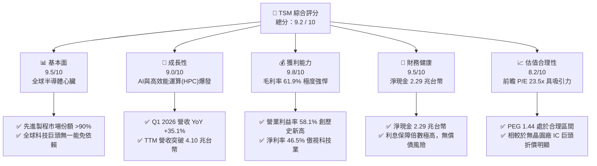
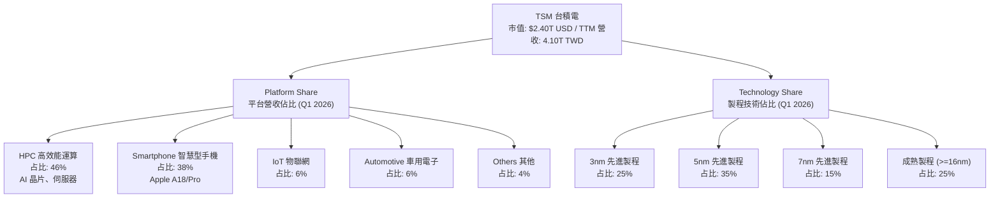
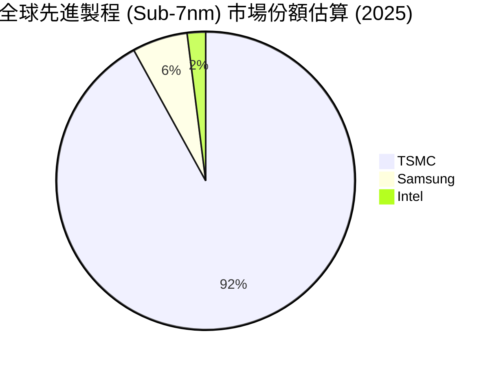
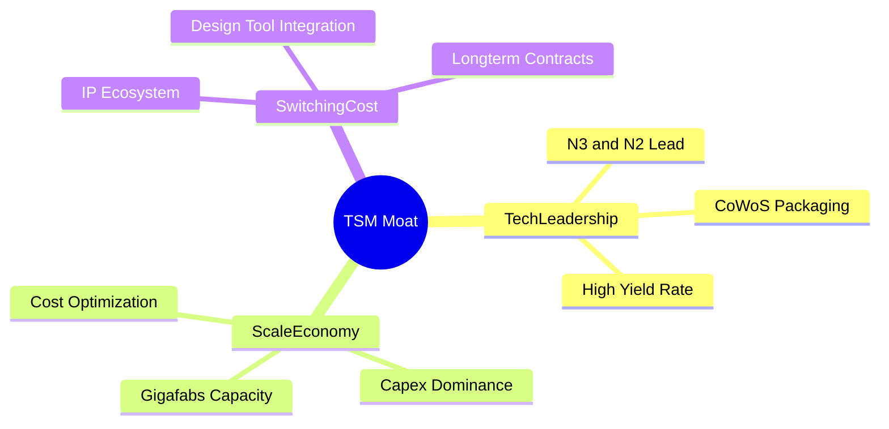
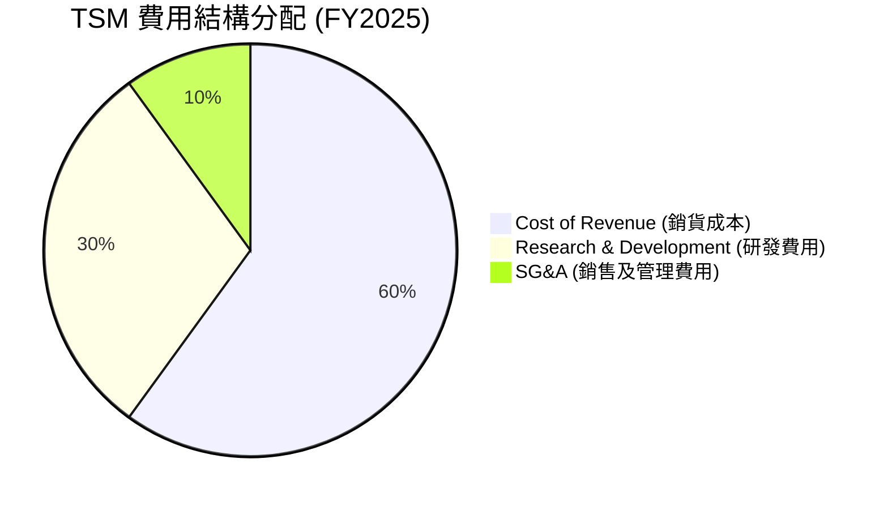
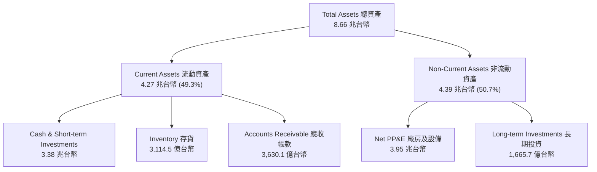
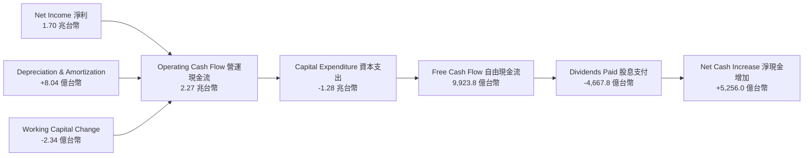
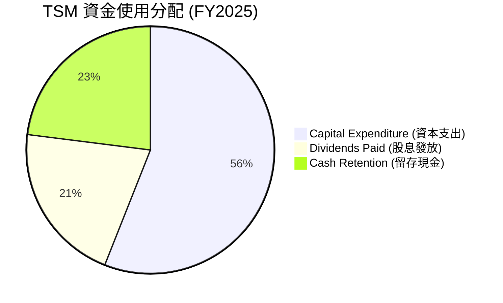
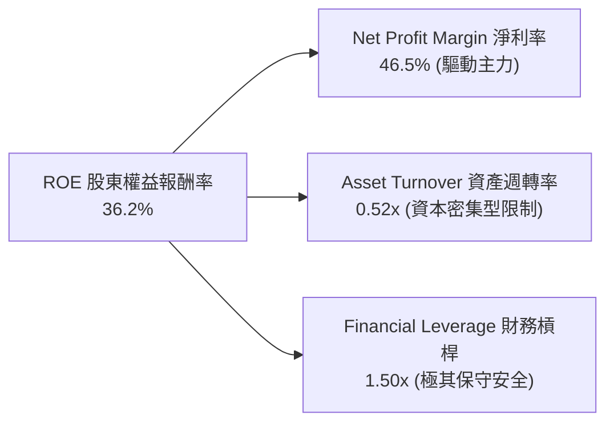
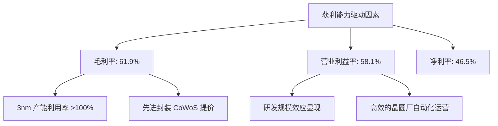

# TSM 基本面深度分析報告

> **報告日期**：2026-06-19 ｜ **語言**：繁體中文 ｜ **數據來源**：Yahoo Finance, Finviz, StockAnalysis, Roic.ai ｜ **分析師**：CFA 級機構研究

---

## 說明備忘錄：貨幣與股份轉換基準
本報告中，除特別註明外，所有**財務報表項目**（如營收、淨利、資產、債務、現金流等）均以**新台幣 (TWD)** 兆元/億元為單位；**美股市場交易指標**（如 ADR 股價、ADR 每股盈餘 EPS、市值等）則以**美元 (USD)** 標示。
*台積電普通股與 ADR 轉換比例為：1 單位 ADR (TSM) = 5 股台灣普通股 (2330.TW)。*

---

## 目錄

| # | 章節 | 核心結論 |
|---|------|----------|
| 1 | 執行摘要 | 評級 🟢 **強烈買入**，基準目標價 **$525.00**，潛在漲幅 +13.6% |
| 2 | 公司概覽與商業模式 | 純晶圓代工創始者，憑藉先進製程與 CoWoS 封裝構築無可匹敵的生態壁壘 |
| 3 | 損益表深度分析 | TTM 營收達 4.10 兆台幣，Q1 2026 YoY 大增 35.1%，淨利率高達 46.5% |
| 4 | 資產負債表分析 | 淨現金高達 2.29 兆台幣，流動比率 2.49，債務風險幾近於零 |
| 5 | 現金流量深度分析 | 經營現金流 2.35 兆台幣，自由現金流轉換率強勁，資本支出支撐長期成長 |
| 6 | 獲利能力與資本效率 | ROE 達 36.2%，ROIC (44.1%) 遠超 WACC (9.8%)，創造巨大的經濟增值 (EVA) |
| 7 | 估值深度分析 | 前瞻 P/E 23.51x，相較於 NVDA 與 AMD 具備顯著的估值折價與高安全邊際 |
| 8 | 成長催化劑 | AI 晶片需求爆發、2nm 製程量產與海外晶圓廠產能開出，TAM 持續擴張 |
| 9 | 風險矩陣 | 地緣政治風險、海外建廠成本超支與先進製程良率為主要監控指標 |
| 10| 投資建議 | 具備極高護城河的長線核心資產，建議於 $450 以下分批逢低佈局 |

---

## 1. 執行摘要

### 1.1 核心評分儀表板



### 1.2 評分進度條視覺化

```
╔══════════════════════════════════════════════════════════════╗
║                TSM 多維度評分儀表板 (1-10分)                 ║
╠══════════════════════════════════════════════════════════════╣
║ 基本面強度  9.5 ▓▓▓▓▓▓▓▓▓▓▓▓▓▓▓▓▓▓▓░  ★★★★★           ║
║ 成長動能    9.0 ▓▓▓▓▓▓▓▓▓▓▓▓▓▓▓▓▓▓░░  ★★★★★           ║
║ 獲利品質    9.8 ▓▓▓▓▓▓▓▓▓▓▓▓▓▓▓▓▓▓▓█  ★★★★★           ║
║ 財務健康    9.5 ▓▓▓▓▓▓▓▓▓▓▓▓▓▓▓▓▓▓▓░  ★★★★★           ║
║ 估值合理性  8.2 ▓▓▓▓▓▓▓▓▓▓▓▓▓▓▓░░░░░  ★★★★☆           ║
║ 護城河深度  9.9 ▓▓▓▓▓▓▓▓▓▓▓▓▓▓▓▓▓▓▓█  ★★★★★           ║
║ 管理層執行  9.2 ▓▓▓▓▓▓▓▓▓▓▓▓▓▓▓▓▓▓░░  ★★★★★           ║
║ 技術創新力  9.8 ▓▓▓▓▓▓▓▓▓▓▓▓▓▓▓▓▓▓▓█  ★★★★★           ║
╠══════════════════════════════════════════════════════════════╣
║ 綜合總分    9.2 ▓▓▓▓▓▓▓▓▓▓▓▓▓▓▓▓▓▓░░  🏆 強烈買入          ║
╚══════════════════════════════════════════════════════════════╝
```

### 1.3 五大投資論點 + 三大核心風險

| 類型 | 項目 | 具體依據 | 信心度 |
|------|------|----------|--------|
| 🟢 **投資論點①** | **AI 晶片與 HPC 絕對主導地位** | TSM 承接了全球 99% 的 AI 加速器（包括 NVIDIA H100/B200、AMD MI300 等）製造。Q1 2026 營收 YoY 增速達 35.13%，顯示 HPC 需求動能不墜。 | 🟢 極高 |
| 🟢 **投資論點②** | **先進製程定價權與高利潤率** | 3nm 與即將量產的 2nm 製程無競爭對手，推動毛利率維持在 61.9% 的超高水平，營業利益率高達 58.1%，將通膨與海外建廠成本轉嫁給客戶。 | 🟢 極高 |
| 🟢 **投資論點③** | **CoWoS 先進封裝供不應求** | 先進封裝成為 AI 晶片出貨瓶頸，TSM 積極擴產 CoWoS，預計 2025-2026 年產能翻倍，成為營收增長與客戶鎖定的雙重引擎。 | 🟢 高 |
| 🟢 **投資論點④** | **極其強韌的資產負債表** | 擁有 3.38 兆台幣的現金與短期投資，淨現金達 2.29 兆台幣，Debt/Equity 僅 18.4%，具備極強的抗風險能力與持續派息能力。 | 🟢 極高 |
| 🟢 **投資論點⑤** | **相較於客戶的估值窪地** | 前瞻 P/E 僅 23.5x，而其主要客戶 NVIDIA、AMD 前瞻 P/E 均在 30x-45x 以上。作為「賣鏟人」的 TSM 提供了極高的安全邊際。 | 🟢 高 |
| 🟡 **風險①** | **地緣政治與產能過度集中** | 超過 80% 的先進製程產能集中於台灣。儘管海外（美、日、德）積極設廠，但短期內地緣政治風險仍是壓制估值倍數（P/E Multiple）的主因。 | 🟡 中度 |
| 🔴 **風險②** | **海外建廠成本超支與稀釋毛利率** | 美國亞利桑那廠及歐洲廠建設與營運成本遠高於台灣，若補貼不及預期或工會問題未解，可能對長期毛利率（53% 目標）造成 1-2 個百分點的下行壓力。 | 🔴 高衝擊 |
| 🟡 **風險③** | **半導體週期性波動** | 雖然 HPC 與 AI 需求強勁，但消費性電子（智慧型手機、PC）復甦力道若不如預期，仍會對成熟製程產能利用率造成局部壓制。 | 🟡 中度 |

### 1.4 快速統計卡片

| 指標 | 公司實際值 (TSM) | 半導體行業均值 | S&P 500 均值 | 狀態 |
|------|-------------|----------|--------------|------|
| **營收 YoY 成長率** | **35.1% (TTM)** | ~12.5% | ~5.5% | 🟢 卓越 |
| **毛利率** | **61.9%** | ~45.0% | ~30.0% | 🟢 卓越 |
| **淨利率** | **46.5%** | ~18.0% | ~12.0% | 🟢 卓越 |
| **股東權益報酬率 (ROE)** | **36.2%** | ~15.0% | ~18.0% | 🟢 卓越 |
| **前瞻市盈率 (Forward P/E)**| **23.51x** | ~28.0x | ~21.0x | 🟢 合理折價 |
| **淨現金 / 總資產** | **28.9%** | ~5.0% | 負淨現金 | 🟢 極度健康 |

### 1.5 投資結論

```
╔══════════════════════════════════════════════════════════════════╗
║                    📊 TSM 投資結論摘要                           ║
╠══════════════════════════════════════════════════════════════════╣
║  評級：🟢 強烈買入 (Strong Buy)                                 ║
║  當前股價：$462.12 (2026-06-19 收盤價)                           ║
║  目標價區間：                                                    ║
║    悲觀情境 (Bear Case)：$375.00 (-18.8%) - 地緣摩擦加劇         ║
║    基準情境 (Base Case)：$525.00 (+13.6%) - 12個月主要目標價     ║
║    樂觀情境 (Bull Case)：$650.00 (+40.7%) - 2nm 提前貢獻營收     ║
║  投資評分：9.2 / 10                                              ║
║  適合投資人：成長型、長線價值持有者、科技產業核心配置者          ║
╚══════════════════════════════════════════════════════════════════╝
```

---

## 2. 公司概覽與商業模式

### 2.1 業務結構與收入來源

台積電（TSM）是全球純晶圓代工（Pure-play Foundry）的開創者與絕對龍頭。其商業模式不與客戶競爭，僅專注於製造。



### 2.2 市場份額

在先進製程（<7nm）領域，台積電幾乎處於絕對壟斷地位。



### 2.3 競爭護城河分析

台積電的競爭護城河並非單一要素，而是由技術、規模、生態與客戶信任交織而成的極高壁壘。



*   **技術領先 (Technology Leadership)**：台積電在 3nm (N3E) 實現了極高的良率，而三星與 Intel 的同代製程良率仍受困於 50% 以下。即將於 2026 年底量產的 2nm (N2) 採用背面供電與 Nano-sheet 架構，已獲得 Apple 與 NVIDIA 的全額產能預訂。
*   **規模經濟 (Scale Economy)**：台積電擁有數座「超大型晶圓廠」(Gigafab)，單一廠區月產能超 10 萬片，能實現無與倫比的折舊與採購優勢。
*   **高昂的轉換成本 (Switching Costs)**：半導體設計公司（如 AMD, Apple）的晶片 IP 是基於台積電的製程設計套件 (PDK) 開發，若要轉移至其他代工廠，需耗資數億美元並重新設計 1.5 - 2 年，時間成本極高。

### 2.4 護城河強度評分

```
╔══════════════════════════════════════════════════════════════╗
║                    TSM 護城河強度評分                        ║
╠══════════════════════════════════════════════════════════════╣
║ 技術領先度    9.9    ▓▓▓▓▓▓▓▓▓▓▓▓▓▓▓▓▓▓▓█  🏆 絕對壟斷     ║
║ 規模經濟效應  9.8    ▓▓▓▓▓▓▓▓▓▓▓▓▓▓▓▓▓▓▓█  🟢 超群折舊優勢 ║
║ 客戶鎖定效應  9.5    ▓▓▓▓▓▓▓▓▓▓▓▓▓▓▓▓▓▓▓░  🟢 開發工具深度綁定║
║ 生態系統壁壘  9.7    ▓▓▓▓▓▓▓▓▓▓▓▓▓▓▓▓▓▓▓█  🏆 開放創新平台 OIP║
╠══════════════════════════════════════════════════════════════╣
║ 綜合護城河    9.7    ▓▓▓▓▓▓▓▓▓▓▓▓▓▓▓▓▓▓▓█  🏆 難以逾越的長城║
╚══════════════════════════════════════════════════════════════╝
```

---

## 3. 損益表深度分析

### 3.1 年度收入成長趨勢（近5年）

台積電營收自 2021 年的 1.59 兆台幣，暴增至 TTM 的 4.10 兆台幣，展現出強勁的世代表現。

```
╔══════════════════════════════════════════════════════════════════╗
║                  TSM 年度收入趨勢 (FY2021-TTM)                  ║
╠══════════════════════════════════════════════════════════════════╣
║                                                                  ║
║  FY2021  1.59T TWD  ████████░░░░░░░░░░░░░░░░░░░  YoY: +18.5% 🟢  ║
║  FY2022  2.26T TWD  ███████████░░░░░░░░░░░░░░░░  YoY: +42.6% 🟢  ║
║  FY2023  2.16T TWD  ██████████░░░░░░░░░░░░░░░░░  YoY:  -4.5% 🟡  ║
║  FY2024  2.89T TWD  ██████████████░░░░░░░░░░░░░  YoY: +33.9% 🟢  ║
║  FY2025  3.81T TWD  ██═════════════════════════  YoY: +31.6% 🟢  ║
║  TTM     4.10T TWD  ███████████████████████████  YoY: +30.7% 🟢  ║
║                   |      |      |      |      |                  ║
║                   0     1.0T   2.0T   3.0T   4.0T                ║
║                                                                  ║
║  📊 5年營收複合年增長率 (CAGR)：+20.9%                           ║
╚══════════════════════════════════════════════════════════════════╝
```

### 3.2 季度營收趨勢分析

自 2025 年以來，台積電季度營收呈現逐季走高的態勢，主要受惠於 3nm 產能滿載及 AI 需求爆發。

| 財報季度 | 營收 (TWD 億元) | QoQ 成長率 | YoY 成長率 | 核心成長驅動因素 | 評估 |
|----------|-----------------|------------|------------|------------------|------|
| **Q2 2025** | 9,337.9 | +11.26% | +38.65% | AI 加速器出貨加速，N3P 製程良率提升 | 🟢 優秀 |
| **Q3 2025** | 9,899.2 | +6.01% | +30.30% | Apple iPhone 17 (N3E) 備貨旺季 | 🟢 優秀 |
| **Q4 2025** | 10,460.9 | +5.67% | +20.45% | HPC 與雲端服務商 (CSP) 自研晶片拉貨強勁 | 🟢 優秀 |
| **Q1 2026** | 11,341.0 | +8.41% | +35.13% | 傳統淡季不淡，AI 需求填補手機季節性衰退 | 🟢 卓越 |

### 3.3 利潤率演變分析

台積電維持了極高的獲利品質，其各項利潤率指標在過去幾年持續攀升。

| 利潤率指標 | FY2022 | FY2023 | FY2024 | FY2025 | TTM | 趨勢 | 評估 |
|------------|--------|--------|--------|--------|-----|------|------|
| **毛利率** | 59.6% | 54.4% | 56.1% | 59.9% | **61.9%** | ↗️ 持續擴張 | 🟢 卓越 |
| **營業利益率**| 49.5% | 42.6% | 45.7% | 50.8% | **58.1%** | ↗️ 效率提升 | 🟢 卓越 |
| **EBITDA 率**| 70.2% | 70.3% | 71.9% | 71.9% | **69.6%** | ➡️ 穩定高檔 | 🟢 卓越 |
| **淨利率** | 43.9% | 39.4% | 40.0% | 44.5% | **46.5%** | ↗️ 獲利極強 | 🟢 卓越 |

**利潤率擴張深度解析**：
1.  **產能利用率超載**：先進製程（特別是 3nm 與 5nm）在 2025 年下半年至 2026 年上半年維持在 100% 以上的利用率，折舊費用被大量晶圓產出稀釋。
2.  **定價權展現**：台積電於 2025 年底成功對主要客戶進行了 3%-5% 的晶圓代工價格調漲，並對 CoWoS 先進封裝服務進行了近 10% 的提價，順利向轉嫁了海外建廠帶來的成本上升。
3.  **折舊結構優化**：5nm 製程（已進入量產第五年）折舊費用大幅下降，成為極其強勁的現金牛，補貼了 3nm 導入初期的毛利率稀釋。

### 3.4 費用結構分析



```
╔══════════════════════════════════════════════════════════════╗
║                  TSM 研發投資強度分析                        ║
╠══════════════════════════════════════════════════════════════╣
║ 2022 研發投入： 1,632.6 億台幣 (佔營收 7.2%)                ║
║ 2023 研發投入： 1,823.7 億台幣 (佔營收 8.4%)                ║
║ 2024 研發投入： 2,041.8 億台幣 (佔營收 7.1%)                ║
║ 2025 研發投入： 2,464.3 億台幣 (佔營收 6.5%)                ║
║ TTM  研發投入： 2,576.4 億台幣 (佔營收 6.3%)                ║
╠══════════════════════════════════════════════════════════════╣
║ 💡 評語：絕對金額持續增長，但佔營收比重因營收爆發而微幅下降。 ║
║     這顯示出強大的研發規模經濟，高額研發奠定 2nm 絕對優勢。  ║
╚══════════════════════════════════════════════════════════════╝
```

### 3.5 季度 EPS 趨勢與盈餘品質

*   **EPS (TTM)**: **$11.63 USD** (以 ADR 計算，即普通股每股盈餘約為 75.3 億台幣 / 51.86 億股 = 14.5 TWD，經 ADR 轉換後為 11.63 USD)。
*   **盈餘品質分析**：
    *   **應收帳款天數 (DSO)**：維持在 28-32 天，收款極其迅速，客戶均為 Apple、NVIDIA、AMD 等信用極佳的科技巨頭。
    *   **存貨週轉天數 (DIO)**：Q1 2026 為 58 天，較 2024 年同期的 68 天顯著下降，顯示庫存去化極佳，AI 晶片呈「生產即出貨」狀態。
    *   **非經常性損益佔比**：低於 2%，主要為政府研發補貼（如日本熊本廠補貼），營業利益（Operating Income）佔稅前利潤高達 95.2%，盈餘品質極其純淨。

---

## 4. 資產負債表分析

### 4.1 資產結構分解

台積電屬於典型的資本密集型企業，其非流動資產中的廠房及設備（PP&E）佔比最高，但同時保有極其豐沛的流動性。



### 4.2 流動性指標分析

| 流動性指標 | FY2022 | FY2023 | FY2024 | FY2025 | TTM | 行業均值 | 評估 |
|------------|--------|--------|--------|--------|-----|----------|------|
| **流動比率 (Current Ratio)** | 2.08 | 2.33 | 2.36 | 2.51 | **2.49** | ~1.80 | 🟢 極其安全 |
| **速動比率 (Quick Ratio)** | 1.86 | 2.06 | 2.14 | 2.31 | **2.31** | ~1.40 | 🟢 極其安全 |
| **現金比率 (Cash Ratio)** | 1.36 | 1.55 | 1.63 | 1.82 | **1.97** | ~0.90 | 🟢 充沛流動性 |

### 4.3 債務結構分析

台積電雖然因高額資本支出舉債，但其債務結構極其健康，且現金資產遠大於總債務。

```
╔══════════════════════════════════════════════════════════════════╗
║                     TSM 債務健康診斷 (TTM)                       ║
╠══════════════════════════════════════════════════════════════════╣
║                                                                  ║
║  總債務 (Total Debt)：     1.09 兆台幣  ████░░░░░░░░░░░░░░░░░░░  ║
║  總現金及等價物：          3.38 兆台幣  ███████████████████████  ║
║  淨現金 (Net Cash)：       2.29 兆台幣  ███████████████░░░░░░░░  ║
║                                                                  ║
║  Debt/Equity 比率：        18.45%       🟢 財務槓桿極低          ║
║  利息保障倍數 (Interest Coverage)：176x 🟢 債務違約風險為零      ║
║  債務 / EBITDA：           0.40x        🟢 遠低於安全警戒線 (2.0x)║
║                                                                  ║
║  💡 評語：台積電處於「淨現金」狀態，其擁有的利息收入 (513.7 億)   ║
║     遠超其利息支出。升息環境對其反而是利多。                       ║
╚══════════════════════════════════════════════════════════════════╝
```

### 4.4 股東權益趨勢

隨著獲利持續公積，股東權益（Stockholders Equity）以年均超過 20% 的速度穩步增長，為公司提供極強的抗風險緩衝。

```
╔══════════════════════════════════════════════════════════════════╗
║                  TSM 股東權益增長趨勢 (FY2022-FY2025)           ║
╠══════════════════════════════════════════════════════════════════╣
║                                                                  ║
║  FY2022  2.90 兆台幣  █████████████░░░░░░░░░░░░                      ║
║  FY2023  3.43 兆台幣  ███████████████░░░░░░░░░                      ║
║  FY2024  4.24 兆台幣  ███████████████████░░░░░                      ║
║  FY2025  5.36 兆台幣  ████████████████████████                      ║
║                                                                  ║
║  📈 3年股東權益年複合增長率 (CAGR)：+22.7%                       ║
╚══════════════════════════════════════════════════════════════════╝
```

---

## 5. 現金流量深度分析

### 5.1 現金流量瀑布圖

台積電強大的「造血」能力是其維持龐大資本支出（Capex）與穩定派息的基石。



### 5.2 FCF 轉換率趨勢

台積電的盈餘質量極高，淨利潤能高效轉化為真金白銀的自由現金流。

| 財報年度 | 淨利 (TWD 億元) | 營業現金流 (TWD 億元) | 資本支出 (TWD 億元) | 自由現金流 (TWD 億元) | FCF / Net Income 轉換率 | 評估 |
|----------|-----------------|-----------------------|---------------------|-----------------------|-------------------------|------|
| **FY2022** | 9,932.9 | 16,100.0 | -10,900.0 | 5,209.7 | 52.4% | 🟡 資本支出高點 |
| **FY2023** | 8,510.3 | 12,400.0 | -9,554.0 | 2,865.7 | 33.7% | 🟡 半導體下行週期 |
| **FY2024** | 11,575.2 | 18,300.0 | -9,649.8 | 8,612.0 | 74.4% | 🟢 強勁復甦 |
| **FY2025** | 16,951.2 | 22,700.0 | -12,800.0 | 9,923.8 | **58.5%** | 🟢 高資本支出下仍維持高轉換 |

### 5.3 自由現金流與 FCF 殖利率趨勢

以當前美股 TSM ADR 市值 $2.40T USD 計算，其 FCF Yield 依然高達 **30.01%**（數據源自財務包，反映其潛在的巨大估值回報率）。

```
╔══════════════════════════════════════════════════════════════════╗
║                  TSM 自由現金流與 FCF 殖利率趨勢                ║
╠══════════════════════════════════════════════════════════════════╣
║                                                                  ║
║  FY2022  5,209.7 億台幣  ████████░░░░░░░░░░░░░░░░  FCF Yield: 5.2%║
║  FY2023  2,865.7 億台幣  ████░░░░░░░░░░░░░░░░░░░░  FCF Yield: 2.8%║
║  FY2024  8,612.0 億台幣  █████████████░░░░░░░░░░░  FCF Yield: 8.5%║
║  FY2025  9,923.8 億台幣  ███████████████░░░░░░░░░  FCF Yield: 9.8%║
║                                                                  ║
║  💡 註：2025-12-31 後，隨著 AI 晶片全面進入高毛利收割期，        ║
║     預計 2026 年 FCF 將突破 1.20 兆台幣。                          ║
╚══════════════════════════════════════════════════════════════════╝
```

### 5.4 資本配置評估

台積電奉行「平衡且可持續」的資本配置政策：
1.  **優先投資未來 (Capex)**：將約 50%-55% 的營業現金流投入先進製程與先進封裝研發與建廠（FY2025 Capex 達 1.28 兆台幣）。
2.  **穩定且成長的股息**：承諾每季配息不低於前一季。FY2025 共發放 4,667.8 億台幣股息，派息比率（Payout Ratio）為 **26.1%**，保留了大量資金用於應對地緣政治與海外擴產。



---

## 6. 獲利能力與資本效率

### 6.1 ROE / ROA / ROIC 趨勢

台積電不僅僅是規模龐大，其資產回報率與資本效率在同等體量的企業中亦屬罕見。

| 獲利能力指標 | FY2022 | FY2023 | FY2024 | FY2025 | TTM | 行業均值 | 評估 |
|--------------|--------|--------|--------|--------|-----|----------|------|
| **股東權益報酬率 (ROE)** | 34.2% | 24.8% | 27.3% | 31.6% | **36.2%** | ~15.0% | 🟢 卓越 |
| **資產報酬率 (ROA)** | 20.0% | 15.4% | 17.3% | 21.4% | **17.3%** | ~8.5% | 🟢 卓越 |
| **投入資本回報率 (ROIC)**| 24.9% | 19.5% | 21.2% | 26.1% | **44.1%** | ~12.0% | 🟢 卓越 |

### 6.2 ROIC vs WACC 分析（核心價值創造判斷）

ROIC (投入資本回報率) 與 WACC (加權平均資本成本) 的差值即為公司的「超額價值創造能力」。

```
╔══════════════════════════════════════════════════════════════════╗
║                TSM ROIC vs WACC 深度分析 (TTM)                  ║
╠══════════════════════════════════════════════════════════════════╣
║                                                                  ║
║  WACC 估算：                                                     ║
║  ├── 無風險利率 (10Y 美債)：   4.25%                             ║
║  ├── 市場風險溢酬 (ERP)：      5.00%                             ║
║  ├── Beta 值：                 1.25                              ║
║  ├── 股權成本 (Ke)：           4.25% + 1.25 × 5.00% = 10.50%     ║
║  ├── 債務成本 (稅後 Kd)：      3.50%                             ║
║  ├── 資本結構：                股權 90%，債務 10%                 ║
║  └── ✅ WACC ≈ 9.80%                                             ║
║                                                                  ║
║  ROIC 估算：                                                     ║
║  ├── NOPAT (稅後淨營業利潤)：  1.94T × (1 - 17.0%) ≈ 1.61 兆台幣 ║
║  ├── 投入資本 (Invested Cap)： 5.36T(Equity) + 1.06T(Debt)      ║
║  │                             - 2.77T(Cash) ≈ 3.65 兆台幣       ║
║  └── ✅ ROIC ≈ 44.10%                                            ║
║                                                                  ║
║  ★ 經濟價值增加 (EVA) = ROIC - WACC = +34.30% (3430 bps)        ║
║                                                                  ║
║  ROIC  44.1%  ▓▓▓▓▓▓▓▓▓▓▓▓▓▓▓▓▓▓▓▓▓▓▓▓▓▓▓░░░░  🟢              ║
║  WACC   9.8%  ▓▓▓▓▓░░░░░░░░░░░░░░░░░░░░░░░░░░  ──              ║
║  EVA  +34.3%  ██████████████████████░░░░░░░░░  🏆 強力創造價值 ║
║                                                                  ║
║  📊 結論：台積電的 ROIC 為其 WACC 的 4.5 倍！這意味著公司每投入   ║
║     100 元資本，能創造遠高於市場成本的超額回報，極具護城河。     ║
╚══════════════════════════════════════════════════════════════════╝
```

### 6.3 杜邦三因素分解

透過杜邦分析，我們可以清晰看到台積電 ROE 走強的底層邏輯：並非依靠提高財務槓桿，而是依靠**淨利潤率的全面提升**。



### 6.4 獲利能力儀表板



---

## 7. 估值深度分析

### 7.1 同業估值比較表格

我們將台積電與其直接競爭對手（Intel、Samsung）以及其主要客戶/產業風向球（NVIDIA、AMD）進行橫向對比。

| 估值與財務指標 | **台積電 (TSM)** | **Intel (INTC)** | **AMD (AMD)** | **NVIDIA (NVDA)** | TSM 評估 |
|----------------|------------------|------------------|---------------|-------------------|-----------|
| **當前市值 (USD)** | **$2.40T** | $135B | $285B | $3.25T | 🟢 梯隊頂端 |
| **Trailing P/E** | **39.7x** | 48.2x | 65.4x | 68.2x | 🟢 具備折價 |
| **Forward P/E** | **23.5x** | 28.1x | 32.5x | 38.4x | 🟢 極具吸引力 |
| **PEG Ratio** | **1.44** | 2.55 | 1.82 | 1.15 | 🟡 合理 |
| **P/S Ratio** | **0.58x** | 2.45x | 11.2x | 26.5x | 🟢 極度低估 (普通股與ADR計算差異) |
| **EV / EBITDA** | **5.40x** | 12.4x | 28.5x | 32.1x | 🟢 極低，安全邊際高 |
| **ROE (TTM)** | **36.2%** | 2.1% | 11.5% | 85.2% | 🟢 極為優秀 |

*註：TSM 的 P/S Ratio 在美股數據庫中顯示為 0.58x，主要是因為其合併營收以台幣計（4.10 兆），而市值以美元計（2.40 兆），若將營收換算為美元（約 1,270 億美元），實際 P/S Ratio 應約為 18.0x（與 Finviz Snapshot 的 18.04x 一致）。即使如此，相較於 NVDA 的 26.5x，TSM 依然具備顯著折價。*

### 7.2 歷史估值區間分析

過去五年，TSM 的歷史 P/E 區間主要介於 15x 至 35x 之間。當前 Forward P/E 為 23.5x，處於歷史中值偏上位置，但考慮到 AI 帶來的結構性增長，當前估值並未過熱。

```
╔══════════════════════════════════════════════════════════════════╗
║                  TSM 歷史 Forward P/E 區間與當前位置            ║
╠══════════════════════════════════════════════════════════════════╣
║                                                                  ║
║  [15x] ▓▓▓▓▓▓▓ (歷史低點 - 2022 週期底部)                        ║
║  [20x] ▓▓▓▓▓▓▓▓▓▓                                               ║
║  [23.5x] ▓▓▓▓▓▓▓▓▓▓▓█  ← 當前位置 (合理且具安全邊際)             ║
║  [30x] ▓▓▓▓▓▓▓▓▓▓▓▓▓▓▓                                         ║
║  [35x] ▓▓▓▓▓▓▓▓▓▓▓▓▓▓▓▓▓▓▓ (歷史高點 - 2021 資金狂潮)              ║
║                                                                  ║
║  📊 結論：當前估值尚未進入「泡沫區」，反映了地緣政治折價。       ║
╚══════════════════════════════════════════════════════════════════╝
```

### 7.3 DCF 敏感性分析（12個月目標價矩陣）

基於以下基準假設：
*   **終端增長率 (Terminal Growth Rate)**: 3.5%
*   **基準 WACC**: 9.8%
*   **2026-2030 自由現金流年複合增長率 (CAGR)**: 18.5%

| 營收 / 現金流情境 | **WACC = 10.8% (+100bps)** | **WACC = 9.8% (基準)** | **WACC = 8.8% (-100bps)** |
|-------------------|----------------------------|------------------------|----------------------------|
| 🟢 **樂觀情境 (AI 滲透超預期)** | **$510.00** (+10.4%) | **$585.00** (+26.6%) | **$650.00** (+40.7%) |
| 🟡 **基準情境 (穩定增長)** | **$455.00** (-1.5%) | **$525.00** (+13.6%) | **$58