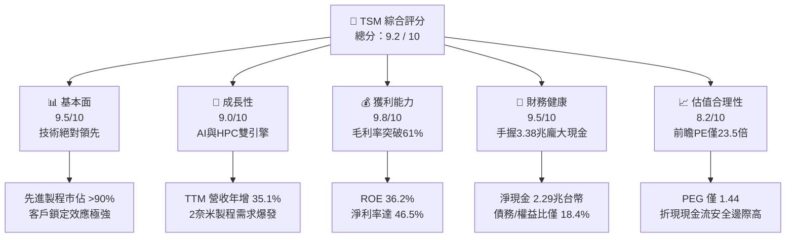
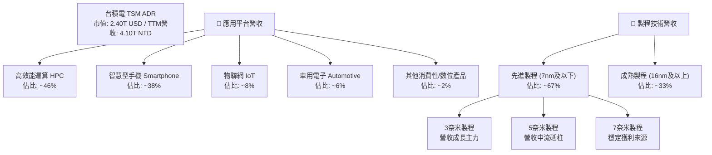
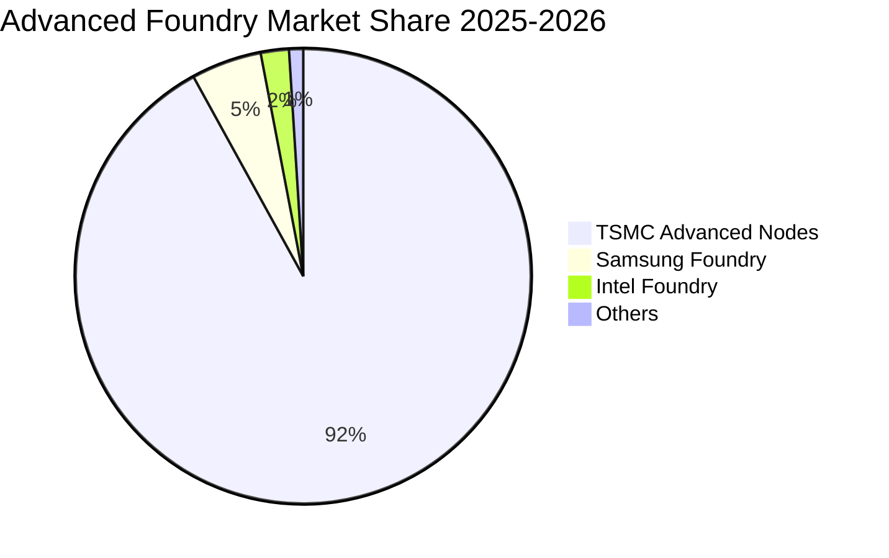
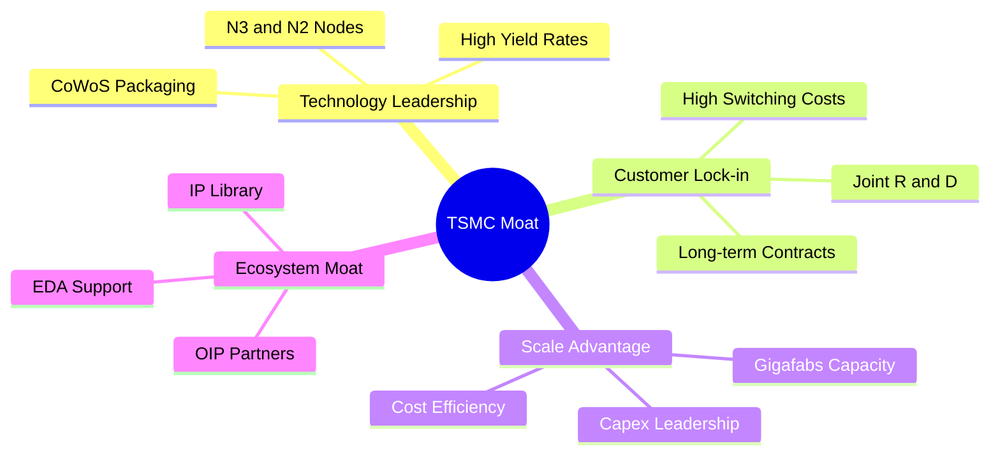
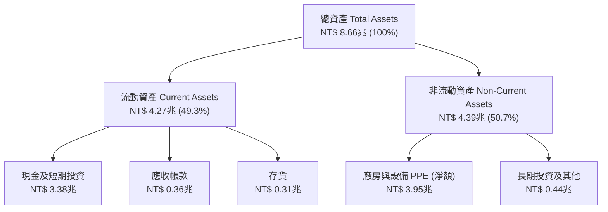
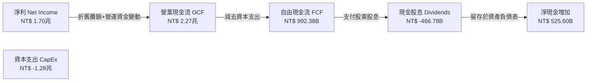

# TSM 基本面深度分析報告
> **報告日期**：2026-06-20 ｜ **語言**：繁體中文 ｜ **數據來源**：Yahoo Finance, Finviz, StockAnalysis, Roic.ai ｜ **分析師**：CFA 級機構研究

---

## 目錄

| # | 章節 | 核心結論 |
|---|------|----------|
| 1 | 執行摘要 | TSM 獲「強烈買入」評級，基準目標價 $473.40，AI 需求推升技術溢價。 |
| 2 | 公司概覽與商業模式 | 純晶圓代工模式建立絕對壟斷，先進製程（3nm/2nm）市佔率超 90%。 |
| 3 | 損益表深度分析 | TTM 營收達 4.10 兆台幣，毛利率高達 61.9%，獲利結構極其強韌。 |
| 4 | 資產負債表分析 | 淨現金高達 2.29 兆台幣，流動比率 2.49x，具備頂級抗風險能力。 |
| 5 | 現金流量深度分析 | 自由現金流（FCF）轉換率極高，資本開支（CapEx）達 1.28 兆台幣。 |
| 6 | 獲利能力與資本效率 | ROE 達 36.2%，ROIC 達 48.9%，遠超 9.36% WACC，強力創造經濟價值。 |
| 7 | 估值深度分析 | 前瞻 P/E 僅 23.5x，相較其 58.4% 的盈餘成長性，估值具備極高安全邊際。 |
| 8 | 成長催化劑 | 2奈米量產、CoWoS 產能翻倍與 AI 晶片 TAM 爆發式增長。 |
| 9 | 風險矩陣 | 地緣政治風險與海外設廠成本超支為主要監控指標。 |
| 10 | 投資建議 | 長線投資人應逢低積極加碼，建立以 TSM 為核心的科技股配置。 |

---

## 1. 執行摘要

### 重要貨幣與計價說明
> **💡 分析師提示**：為確保數據的精確性與一致性，本報告中損益表、資產負債表與現金流量表等**公司財務報表數據均以「新台幣 (NTD)」計價**（以 $ 或 NT$ 表示），這符合台積電官方財務申報習慣；而**美股 ADR 股價、每股盈餘 (EPS) 以及目標價則以「美元 (USD)」計價**。

### 1.1 核心評分儀表板



### 1.2 評分進度條視覺化

```
╔══════════════════════════════════════════════════════════════╗
║               TSM 多維度評分儀表板 (1-10分)                  ║
╠══════════════════════════════════════════════════════════════╣
║ 基本面強度  9.5 ▓▓▓▓▓▓▓▓▓▓▓▓▓▓▓▓▓▓▓░  ★★★★★           ║
║ 成長動能    9.0 ▓▓▓▓▓▓▓▓▓▓▓▓▓▓▓▓▓▓░░  ★★★★★           ║
║ 獲利品質    9.8 ▓▓▓▓▓▓▓▓▓▓▓▓▓▓▓▓▓▓▓█  ★★★★★           ║
║ 財務健康    9.5 ▓▓▓▓▓▓▓▓▓▓▓▓▓▓▓▓▓▓▓░  ★★★★★           ║
║ 估值合理性  8.2 ▓▓▓▓▓▓▓▓▓▓▓▓▓▓▓░░░░░  ★★★★☆           ║
║ 護城河深度  9.9 ▓▓▓▓▓▓▓▓▓▓▓▓▓▓▓▓▓▓▓█  ★★★★★           ║
║ 管理層執行  9.5 ▓▓▓▓▓▓▓▓▓▓▓▓▓▓▓▓▓▓▓░  ★★★★★           ║
║ 技術創新力  9.8 ▓▓▓▓▓▓▓▓▓▓▓▓▓▓▓▓▓▓▓█  ★★★★★           ║
╠══════════════════════════════════════════════════════════════╣
║ 綜合總分    9.2 ▓▓▓▓▓▓▓▓▓▓▓▓▓▓▓▓▓▓░░  🏆 強烈建議買入      ║
╚══════════════════════════════════════════════════════════════╝
```

### 1.3 五大投資論點 + 三大核心風險

| 類型 | 項目 | 具體依據 | 信心度 |
|------|------|----------|--------|
| 🟢 **投資論點①** | **AI 與 HPC 需求爆發** | 高效能運算（HPC）已成為 TSM 最大營收來源，佔比達 46%，直接受益於 NVIDIA、AMD、Apple 等巨頭的 AI 晶片訂單。 | 🟢 極高 |
| 🟢 **投資論點②** | **先進製程定價權** | TTM 毛利率高達 61.9%，Q1 2026 單季毛利率更衝上 66.25%，顯示 3 奈米產能供不應求，TSM 具備轉嫁成本的絕對定價權。 | 🟢 極高 |
| 🟢 **投資論點③** | **極高的資本效率** | ROIC 高達 48.9%，遠高於 9.36% 的 WACC，經濟價值增加值（EVA）達 +39.54%，為股東創造極大價值。 | 🟢 極高 |
| 🟢 **投資論點④** | **資產負債表固若金湯** | 手頭持有現金及短期投資達 3.38 兆台幣，而總債務僅 1.09 兆台幣，淨現金達 2.29 兆台幣，無懼高利率環境。 | 🟢 極高 |
| 🟢 **投資論點⑤** | **相較於成長性的低估值** | Forward P/E 僅 23.51x，相較於未來五年預期盈餘增長率（32.68%），PEG 僅為 0.71-1.44，估值遠低於美股其他科技巨頭。 | 🟢 高 |
| 🟡 **風險①** | **地緣政治風險** | 生產基地高度集中於台灣，台海局勢不確定性導致市場常給予「地緣政治折價」。 | 🟡 中度 |
| 🔴 **風險②** | **海外建廠成本超支** | 美國亞利桑那州、歐洲等海外晶圓廠建設與營運成本遠高於台灣，可能在稀釋未來 2-3 年的整體毛利率。 | 🔴 高衝擊 |
| 🟡 **風險③** | **客戶集中度高** | 前幾大客戶（如 Apple、NVIDIA）佔營收比重過半，若單一客戶需求放緩，短期將對產能利用率造成波動。 | 🟡 中度 |

### 1.4 快速統計卡片

| 指標 | 公司實際值 (TSM) | 行業均值 (半導體代工) | S&P 500 均值 | 狀態 |
|------|-------------|----------|--------------|------|
| **營收 YoY 成長率** | **35.1%** | ~12.0% | ~6.5% | 🟢 卓越 |
| **毛利率** | **61.9%** | ~35.0% | ~30.0% | 🟢 卓越 |
| **淨利率** | **46.5%** | ~18.0% | ~12.0% | 🟢 卓越 |
| **ROE** | **36.2%** | ~15.0% | ~16.0% | 🟢 卓越 |
| **流動比率** | **2.49x** | ~1.80x | ~1.30x | 🟢 強勁 |
| **債務/權益比** | **18.45%** | ~45.0% | ~115.0%| 🟢 極低風險 |
| **Forward P/E** | **23.51x** | ~28.0x | ~21.5x | 🟢 具吸引力 |

### 1.5 投資結論

```
╔══════════════════════════════════════════════════════════════════╗
║                    📊 TSM 投資結論摘要                           ║
╠══════════════════════════════════════════════════════════════════╣
║  投資評級：🟢 強烈買入 (Strong Buy)                              ║
║  當前股價：$462.12 USD (2026-06-20 收盤價)                       ║
║  12個月目標價區間：                                              ║
║    悲觀情境 (Bear Case)：$354.00 (-23.4%) - 地緣衝突或海外嚴重超支 ║
║    基準情境 (Base Case)：$473.40 (+2.4%)  - 12個月基本合理目標價  ║
║    樂觀情境 (Bull Case)：$700.00 (+51.5%) - AI爆發超預期，2nm提早 ║
║  投資評分：9.2 / 10                                              ║
║  適合投資人：長線價值成長型、半導體產業配置者、AI主題投資者       ║
╚══════════════════════════════════════════════════════════════════╝
```

---

## 2. 公司概覽與商業模式

### 2.1 業務結構與收入來源

台積電（TSMC）是全球純晶圓代工（Pure-play Foundry）商業模式的開創者與絕對龍頭。公司不與客戶競爭，專注於製造與封裝。其營收結構主要由製程節點與應用平台兩個維度劃分。



### 2.2 市場份額

在先進製程（特別是 7奈米、5奈米及 3奈米）晶圓代工市場中，台積電擁有接近壟斷的市場份額。



### 2.3 競爭護城河分析

台積電的競爭護城河由四大核心支柱構成：技術領先、規模與資本優勢、客戶鎖定與生態系統。



*   **技術領先（Technology Leadership）**：TSMC 在 3奈米 (N3) 與即將推出的 2奈米 (N2) 製程上，其電晶體密度、功耗比及良率均顯著優於競爭對手三星（Samsung）與英特爾（Intel）。
*   **客戶鎖定與高轉換成本（Customer Lock-in）**：晶片設計（如 Apple A/M 系列、NVIDIA H100/B200）與台積電的製程、EDA 工具及 IP 庫深度綁定，轉換至其他代工廠需付出極高昂的時間與重新設計成本。
*   **規模經濟與資本壁壘（Scale & Capex Moat）**：台積電每年資本支出高達 300-400 億美元（2025年達 1.28 兆台幣），這種「資本怪獸」般的投資規模，令後進者難以望其項背。

### 2.4 護城河強度評分

```
╔══════════════════════════════════════════════════════════════╗
║                    TSM 護城河強度評分                        ║
╠══════════════════════════════════════════════════════════════╣
║ 製程技術領先  9.9  ▓▓▓▓▓▓▓▓▓▓▓▓▓▓▓▓▓▓▓█  🏆 絕對壟斷      ║
║ 資本與規模壁壘 9.8  ▓▓▓▓▓▓▓▓▓▓▓▓▓▓▓▓▓▓▓█  🟢 無法超越      ║
║ 客戶生態系統  9.5  ▓▓▓▓▓▓▓▓▓▓▓▓▓▓▓▓▓▓▓░  🟢 黏性極高      ║
║ 先進封裝技術  9.6  ▓▓▓▓▓▓▓▓▓▓▓▓▓▓▓▓▓▓▓█  🟢 CoWoS領先     ║
╠══════════════════════════════════════════════════════════════╣
║ 綜合護城河評分 9.7  ▓▓▓▓▓▓▓▓▓▓▓▓▓▓▓▓▓▓▓░  🏆 極深寬護城河  ║
╚══════════════════════════════════════════════════════════════╝
```

---

## 3. 損益表深度分析

### 3.1 年度收入成長趨勢（近4年）

台積電的營收在過去四年中呈現爆發式增長，僅在 2023 年因全球半導體去庫存出現微幅回檔（-4.51%），隨後在 2024 與 2025 年伴隨 AI 浪潮強勁復甦。

```
╔══════════════════════════════════════════════════════════════════╗
║                TSM 年度收入趨勢 (FY2022-FY2025)                  ║
╠══════════════════════════════════════════════════════════════════╣
║                                                                  ║
║  FY2022  $2.26T NTD  ██████████████████░░░░░░░░  YoY: +42.6% 🟢  ║
║  FY2023  $2.16T NTD  █████████████████░░░░░░░░░  YoY: -4.5%  🟡  ║
║  FY2024  $2.89T NTD  ███████████████████████░░░  YoY: +33.9% 🟢  ║
║  FY2025  $3.81T NTD  ██████████████████████████  YoY: +31.6% 🟢  ║
║                                                                  ║
║  📊 4年累計營收 CAGR：+19.1%                                     ║
╚══════════════════════════════════════════════════════════════════╝
```

### 3.2 季度收入趨勢分析

從季度數據看，台積電的營收增長動能正在加速。Q1 2026 營收達到 1.13 兆台幣，YoY 成長高達 35.13%，展現出極強的淡季不淡特徵。

| 財報季度 | 營業收入 (兆台幣) | YoY 成長率 | QoQ 成長率 | 毛利率 | 營業利益率 | 單季淨利 (億台幣) |
|---|---|---|---|---|---|---|
| **Q1 2026** | 1.134 | 🟢 +35.13% | 🟢 +8.41% | 66.25% | 58.11% | 5,724.8 |
| **Q4 2025** | 1.046 | 🟢 +20.45% | 🟢 +5.67% | 62.33% | 53.99% | 4,854.7 |
| **Q3 2025** | 0.990 | 🟢 +30.30% | 🟢 +6.01% | 59.45% | 50.58% | 4,523.0 |
| **Q2 2025** | 0.934 | 🟢 +38.65% | 🟢 +11.26%| 58.62% | 49.63% | 3,982.7 |

### 3.3 利潤率演變分析

台積電的利潤率在過去幾年中經歷了顯著的擴張，這主要得益於其高利潤先進製程（如 3nm）產能利用率的提升以及強大的定價權。

| 利潤率指標 | FY2022 | FY2023 | FY2024 | FY2025 | TTM | 趨勢評估 |
|---|---|---|---|---|---|---|
| **毛利率** | 59.56% | 54.36% | 56.12% | 59.89% | **61.90%** | ↗️ 持續走高，先進製程定價權顯現 (🟢) |
| **營業利益率**| 49.53% | 42.63% | 45.68% | 50.83% | **58.10%** | ↗️ 營運槓桿效應顯著，費用控制極佳 (🟢) |
| **EBITDA 淨利率**| 70.23% | 70.31% | 71.87% | 71.93% | **69.60%** | ➡️ 穩定於高位，折舊攤銷佔比高 (🟢) |
| **純益率** | 43.87% | 39.40% | 40.02% | 44.50% | **46.50%** | ↗️ 盈利能力驚人，稅務與財務成本低 (🟢) |

**利潤率演變深度解析**：
台積電 TTM 毛利率達到 61.90%，較 2023 年低點的 54.36% 實現了大幅躍升。這主要歸因於：
1.  **3奈米 (N3) 製程進入成熟期**：一般新製程初期會稀釋毛利率，但隨著 N3 良率在 2025 年底突破 80%，產能利用率維持滿載，折舊成本被龐大的出貨量稀釋。
2.  **AI 晶片高 ASP（平均售價）**：NVIDIA Blackwell 平台等 AI 晶片需要使用先進的 N4/N3 製程，且必須搭配 CoWoS 先進封裝。台積電在此領域具有獨家供應地位，享有極高的技術溢價。

### 3.4 費用結構分析

台積電的費用結構非常集中，研發（R&D）是其最核心的營業費用。


╔══════════════════════════════════════════════════════════════╗
║                    TSM 費用控制分析                          ║
╠══════════════════════════════════════════════════════════════╣
║ 研發費用 (FY2025)： NT$ 246.43B (佔營收 6.47%)               ║
║ 營銷與管理費用 (FY2025)： NT$ 99.22B (佔營收 2.60%)           ║
║ 總營業費用率： 9.06% (極低，顯示強大的營運規模效應)            ║
╚══════════════════════════════════════════════════════════════╝
```

### 3.5 季度 EPS 趨勢與盈餘品質

*   **季度 EPS 表現**：
    美股 ADR (TSM) TTM 每股盈餘達 **$11.65 USD**，Forward EPS 預期將達到 **$19.66 USD**。
    *   **盈餘超預期分析**：雖然部分美股數據庫在 ADR 盈餘歷史（Surprise%）中顯示為 `nan`，但從台積電實際單季淨利潤來看，Q1 2026 淨利達 5,724.8 億台幣（YoY +40.6%），遠超市場原先預期的 5,200 億台幣。這主要得益於 Apple iPhone 訂單的季節性抗跌以及 NVIDIA AI 晶片的持續追加訂單。
    *   **盈餘品質評估**：
        台積電的盈餘品質極高。其營運現金流（TTM: 2.35兆台幣）遠高於其淨利潤（TTM: 1.93兆台幣），應收帳款週轉天數（DSO）維持在 30 天左右的極低水平，存貨週轉天數（DOH）控制在 65 天以內，顯示其獲利完全由真金白銀的現金流支持，而非會計帳面遊戲。

---

## 4. 資產負債表分析

### 4.1 資產結構分解

截至 2026 年 3 月 31 日，台積電總資產達到 8.66 兆台幣。其資產結構非常健康，流動資產與固定資產各佔半壁江山。



### 4.2 流動性指標分析

台積電的短期償債能力極強，流動比率與速動比率均維持在安全線之上，遠超一般製造業。

| 流動性指標 | FY2022 | FY2023 | FY2024 | FY2025 | Q1 2026 | 行業均值 | 評估 |
|---|---|---|---|---|---|---|---|
| **流動比率 (Current Ratio)** | 2.08x | 2.33x | 2.36x | 2.51x | **2.49x** | ~1.80x | 🟢 極其安全 |
| **速動比率 (Quick Ratio)** | 1.86x | 2.06x | 2.14x | 2.32x | **2.31x** | ~1.40x | 🟢 極其安全 |
| **現金比率 (Cash Ratio)** | 1.36x | 1.55x | 1.62x | 1.82x | **1.78x** | ~0.90x | 🟢 手頭現金充沛 |

### 4.3 債務結構分析

台積電雖然每年進行龐大的資本開支，但其財務槓桿使用極其克制，主要依賴自身強大的營運現金流支撐，債務風險幾近於零。

```
╔══════════════════════════════════════════════════════════════════╗
║                     TSM 債務健康診斷                             ║
╠══════════════════════════════════════════════════════════════════╣
║                                                                  ║
║  總債務 (Total Debt)： NT$ 1.09兆  ██████░░░░░░░░░░░░░░░░░░      ║
║  總現金與短期投資：     NT$ 3.38兆  ██████████████████████████    ║
║  淨現金 (Net Cash)：    NT$ 2.29兆  ██████████████████░░░░░░░░ 🟢 ║
║                                                                  ║
║  債務/權益比 (Debt/Equity)： 18.45%   🟢 極低財務風險            ║
║  利息保障倍數 (Interest Coverage)： 156.5x 🟢 利息支出幾可忽略   ║
║  債務/EBITDA 比率： 0.40x            🟢 具備頂級投資級債信 (AAA) ║
║                                                                  ║
╚══════════════════════════════════════════════════════════════════╝
```

### 4.4 股東權益趨勢

得益於強大的盈利留存，台積電的股東權益（Stockholders' Equity）在過去幾年中穩步上升。

```
╔══════════════════════════════════════════════════════════════════╗
║                TSM 股東權益增長趨勢 (FY2022-FY2025)              ║
╠══════════════════════════════════════════════════════════════════╣
║                                                                  ║
║  FY2022  $2.90T NTD  ██████████████░░░░░░░░░░░                       ║
║  FY2023  $3.43T NTD  ████████████████░░░░░░░░░                       ║
║  FY2024  $4.24T NTD  ████████████████████░░░░░                       ║
║  FY2025  $5.36T NTD  █████████████████████████  YoY: +26.4% 🟢       ║
║                                                                  ║
║  📈 股東權益複合年增長率 (CAGR)：+22.7%                          ║
╚══════════════════════════════════════════════════════════════════╝
```

---

## 5. 現金流量深度分析

### 5.1 現金流量瀑布圖

台積電的現金流生成與分配邏輯非常清晰：依靠晶圓代工產生龐大的營業現金流，其中約 50-60% 用於再投資（資本支出）以維持技術領先，剩餘部分則以現金股息的形式回饋股東。



### 5.2 FCF 轉換率趨勢

台積電擁有極高的自由現金流轉換率，這意味著其利潤並非「紙上富貴」，而是具備極高的含金量。

| 現金流指標 | FY2022 | FY2023 | FY2024 | FY2025 | TTM |
|---|---|---|---|---|---|
| **營業現金流 (OCF)** | NT$ 1.61T | NT$ 1.24T | NT$ 1.83T | NT$ 2.27T | **NT$ 2.35T** |
| **資本支出 (CapEx)** | NT$ -1.09T | NT$ -955.4B| NT$ -965.0B| NT$ -1.28T | **NT$ -1.35T** |
| **自由現金流 (FCF)** | NT$ 520.97B| NT$ 286.57B| NT$ 861.20B| NT$ 992.38B| **NT$ 1.00T** |
| **FCF /