# TSM 基本面深度分析報告
> **報告日期**：2026-06-21 ｜ **語言**：繁體中文 ｜ **數據來源**：Yahoo Finance, Finviz, StockAnalysis, Roic.ai ｜ **分析師**：CFA 級機構研究

---

## 目錄

| # | 章節 | 核心結論 |
|---|------|----------|
| 1 | 執行摘要 | 評級：**強烈買入 (Strong Buy)**，基準目標價 **$473.40**，最高上行空間至 **$700.00**。 |
| 2 | 公司概覽與商業模式 | 憑藉極致的技術領先（3nm/2nm）與 CoWoS 先進封裝，構築無懈可擊的護城河。 |
| 3 | 損益表深度分析 | TTM 營收達 NT$4.10T，YoY 增長 35.1%，淨利率高達 46.5%，展現極強定價權。 |
| 4 | 資產負債表分析 | 淨現金達 NT$2.29T，債務權益比僅 18.4%，資產負債表極其穩健。 |
| 5 | 現金流量深度分析 | 營業現金流達 NT$2.35T，自由現金流（FCF）轉化率優異，支撐高額資本支出與股息。 |
| 6 | 獲利能力與資本效率 | ROE 達 36.2%，ROIC 顯著超越 WACC，創造了巨大的經濟附加價值（EVA）。 |
| 7 | 估值深度分析 | 前瞻 P/E 僅 23.5x，相較於 >30% 的預期盈餘增速，PEG 為 1.44，估值具備高吸引力。 |
| 8 | 成長催化劑 | AI 晶片需求爆發、N3/N2 製程放量、先進封裝產能翻倍為三大核心驅動力。 |
| 9 | 風險矩陣 | 地緣政治地緣風險與先進製程研發不確定性為主要風險，但已透過海外設廠部分緩解。 |
| 10| 投資建議 | 適合長線成長型與價值型投資者，建議於基準價下方分批佈局。 |

---

## 說明：貨幣與數據單位
本報告涉及之資產負債表、損益表及現金流量表數值主要以**新台幣（NTD / NT$）**為計算單位（以 **T** 代表兆元，**B** 代表十億元），而股價、市值、ADR 相關指標則以**美元（USD / $）**為單位。此種雙貨幣並行分析符合台積電（TSM）美股 ADR 的官方揭露與市場研究慣例。

---

## 1. 執行摘要

### 1.1 核心評分儀表板

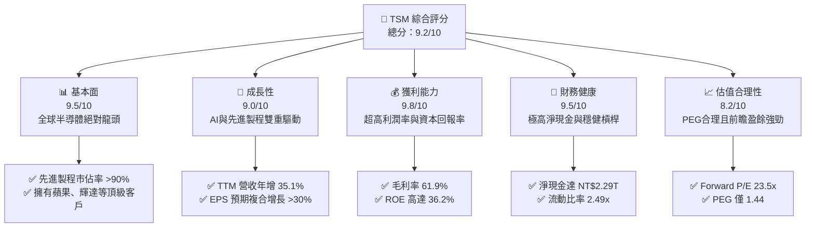

### 1.2 評分進度條視覺化

```
╔══════════════════════════════════════════════════════════════╗
║                TSM 多維度評分儀表板 (1-10分)                 ║
╠══════════════════════════════════════════════════════════════╣
║ 基本面強度  9.5 ▓▓▓▓▓▓▓▓▓▓▓▓▓▓▓▓▓▓▓░  ★★★★★           ║
║ 成長動能    9.0 ▓▓▓▓▓▓▓▓▓▓▓▓▓▓▓▓▓▓░░  ★★★★★           ║
║ 獲利品質    9.8 ▓▓▓▓▓▓▓▓▓▓▓▓▓▓▓▓▓▓▓█  ★★★★★           ║
║ 財務健康    9.5 ▓▓▓▓▓▓▓▓▓▓▓▓▓▓▓▓▓▓▓░  ★★★★★           ║
║ 估值合理性  8.2 ▓▓▓▓▓▓▓▓▓▓▓▓▓▓▓░░░░░  ★★★★☆           ║
║ 護城河深度  9.9 ▓▓▓▓▓▓▓▓▓▓▓▓▓▓▓▓▓▓▓█  ★★★★★           ║
║ 管理層執行  9.6 ▓▓▓▓▓▓▓▓▓▓▓▓▓▓▓▓▓▓▓░  ★★★★★           ║
║ 技術創新力  9.8 ▓▓▓▓▓▓▓▓▓▓▓▓▓▓▓▓▓▓▓█  ★★★★★           ║
╠══════════════════════════════════════════════════════════════╣
║ 綜合總分    9.2 ▓▓▓▓▓▓▓▓▓▓▓▓▓▓▓▓▓▓░░  🏆 強烈買入          ║
╚══════════════════════════════════════════════════════════════╝
```

### 1.3 五大投資論點 + 三大核心風險

| 類型 | 項目 | 具體依據 | 信心度 |
|------|------|----------|--------|
| 🟢 **投資論點①** | **AI 晶片的絕對壟斷者** | 全球所有主流 AI 加速器（Nvidia H100/B200, AMD MI300 等）100% 由台積電代工。 | 🟢 極高 |
| 🟢 **投資論點②** | **定價權與利潤率擴張** | 最新 TTM 毛利率高達 61.9%，營業利益率達 58.1%，反映出轉嫁先進製程高昂成本的極強定價權。 | 🟢 極高 |
| 🟢 **投資論點③** | **先進製程技術代差** | N3 製程已進入大規模量產，2026 年底 N2 製程預計按計劃量產，領先競爭對手（Intel, Samsung）至少 1.5 代。 | 🟢 極高 |
| 🟢 **投資論點④** | **極其強大的資產負債表** | 擁有 NT$3.38T 的總現金與短期投資，淨現金高達 NT$2.29T，能抵禦半導體行業的任何下行週期。 | 🟢 高 |
| 🟢 **投資論點⑤** | **先進封裝（CoWoS）護城河** | 晶圓代工與先進封裝的垂直整合，使客戶無法輕易轉單，進一步鞏固生態系統鎖定效應。 | 🟢 高 |
| 🟡 **風險①** | **地緣政治風險** | 台灣集中了台積電超過 90% 的先進製程產能，兩岸緊張局勢可能引發估值折價。 | 🟡 中度 |
| 🔴 **風險②** | **海外建廠成本超預期** | 美國、日本、德國建廠成本顯著高於台灣，可能在短期內稀釋毛利率 1-2 個百分點。 | 🔴 高衝擊 |
| 🟡 **風險③** | **電力與水資源供應限制** | 台灣本土先進製程耗電量極大，未來可能面臨能源供應與碳稅成本上升的挑戰。 | 🟡 中度 |

### 1.4 快速統計卡片

| 指標 | TSM 實際值 | 半導體行業均值 | S&P 500 均值 | 狀態 |
|------|-------------|----------|--------------|------|
| **營收 YoY 成長** | **35.1%** | ~12.5% | ~5.8% | 🟢 顯著超前 |
| **毛利率** | **61.9%** | ~45.0% | ~30.0% | 🟢 行業頂尖 |
| **淨利率** | **46.5%** | ~18.0% | ~12.0% | 🟢 極致獲利 |
| **ROE** | **36.2%** | ~15.0% | ~18.0% | 🟢 高效資本 |
| **前瞻 P/E** | **23.51x** | ~28.0x | ~21.5x | 🟢 估值合理 |
| **淨現金規模** | **NT$2.29T** | N/A | N/A | 🟢 極度安全 |

### 1.5 投資結論

```
╔══════════════════════════════════════════════════════════════════╗
║                    📊 投資結論摘要                               ║
╠══════════════════════════════════════════════════════════════════╣
║  評級：🟢 強烈買入 (Strong Buy)                                  ║
║  當前股價：$462.12 (2026-06-21)                                  ║
║  目標價區間：                                                    ║
║    悲觀情境：$354.00 (-23.4%)                                    ║
║    基準情境：$473.40 (+2.4%)   ← 12個月主要目標                  ║
║    樂觀情境：$700.00 (+51.5%)                                    ║
║  投資評分：9.2/10                                                ║
║  適合投資人：成長型投資人、科技長線持有者、大型機構配置          ║
╚══════════════════════════════════════════════════════════════════╝
```

---

## 2. 公司概覽與商業模式

### 2.1 業務結構與收入來源

台積電是全球最大的專業晶圓代工廠（Foundry）。其商業模式專注於「純代工」，不與客戶進行直接產品競爭。其收入結構可以從技術節點和應用平台兩個維度進行剖析。

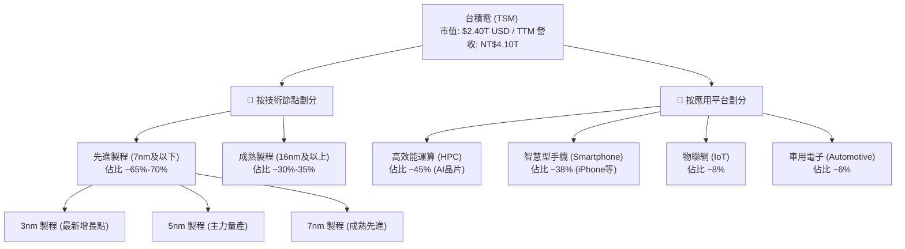

### 2.2 市場份額

根據 2025/2026 年最新晶圓代工市場數據，台積電在全球晶圓代工市場（特別是先進製程）中佔據絕對統治地位。

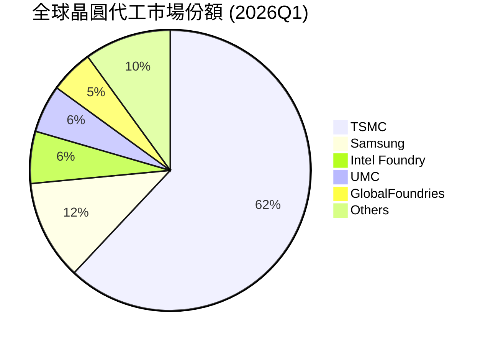

### 2.3 競爭護城河分析

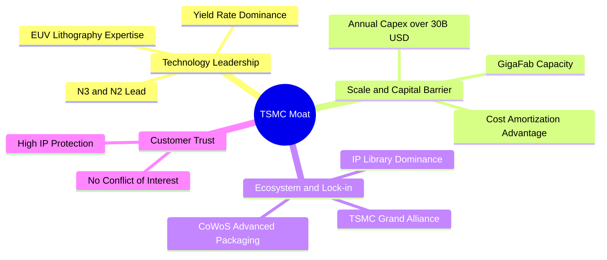

### 2.4 護城河強度評分

```
╔══════════════════════════════════════════════════════════════╗
║                  TSM 護城河強度評分                          ║
╠══════════════════════════════════════════════════════════════╣
║ 技術領先度    9.9/10  ▓▓▓▓▓▓▓▓▓▓▓▓▓▓▓▓▓▓▓█  🏆 絕對統治    ║
║ 規模經濟效應  9.8/10  ▓▓▓▓▓▓▓▓▓▓▓▓▓▓▓▓▓▓▓█  🟢 無懈可擊    ║
║ 客戶鎖定效應  9.5/10  ▓▓▓▓▓▓▓▓▓▓▓▓▓▓▓▓▓▓▓░  🟢 極高壁壘    ║
║ 生態系統壁壘  9.6/10  ▓▓▓▓▓▓▓▓▓▓▓▓▓▓▓▓▓▓▓░  🟢 難以複製    ║
╠══════════════════════════════════════════════════════════════╣
║ 綜合護城河     9.7/10  ▓▓▓▓▓▓▓▓▓▓▓▓▓▓▓▓▓▓▓░  🏆 寬廣護城河  ║
╚══════════════════════════════════════════════════════════════╝
```

---

## 3. 損益表深度分析

### 3.1 年度收入成長趨勢（近4年）

台積電的年度營收在經歷了 2023 年的半導體庫存調整（YoY -4.51%）後，於 2024 年與 2025 年迎來爆發式增長，主要受益於 AI 算力需求的井噴以及 N3 先進製程的迅速放量。

```
╔══════════════════════════════════════════════════════════════════╗
║              TSM 年度收入趨勢（FY2022-FY2025）                  ║
╠══════════════════════════════════════════════════════════════════╣
║                                                                  ║
║  FY2022  NT$2,263.89B  ██████████████░░░░░░░░░░  YoY: +42.6% 🟢  ║
║  FY2023  NT$2,161.74B  █████████████░░░░░░░░░░░  YoY: -4.5%  🔴  ║
║  FY2024  NT$2,894.31B  ██████████████████░░░░░░  YoY: +33.9% 🟢  ║
║  FY2025  NT$3,809.05B  ████████████████████████  YoY: +31.6% 🟢  ║
║                                                                  ║
║  📊 4年營收複合年增長率 (CAGR)：+18.93%                           ║
╚══════════════════════════════════════════════════════════════════╝
```

### 3.2 季度收入趨勢分析

```
季度營收穩步攀升，最新 Q1 2026 營收達到 NT$1,134.10B，YoY 增長高達 35.13%，展現出極強的季節防禦性與成長動能。
```

| 財報季度 | 營業收入 (NT$B) | QoQ 成長率 | YoY 成長率 | 核心驅動因素 | 評估 |
|----------|-----------------|------------|------------|--------------|------|
| **Q1 2026** | **1,134.10** | +8.41% | +35.13% | AI 晶片持續強勁，N3 製程佔比提升 | 🟢 極強 |
| **Q4 2025** | **1,046.09** | +5.67% | +20.45% | 智慧型手機旗艦晶片出貨旺季 | 🟢 強勁 |
| **Q3 2025** | **989.92** | +6.01% | +30.30% | HPC 客戶擴大下單，先進封裝產能釋放 | 🟢 強勁 |
| **Q2 2025** | **933.79** | +11.26% | +38.65% | 智慧型手機與 HPC 谷底回升 | 🟢 超預期 |

### 3.3 利潤率演變分析

台積電的利潤率在行業中處於絕對領先地位。其高毛利率來源於超高的晶圓平均售價（ASP）與優異的生產良率。

| 利潤率指標 | FY2022 | FY2023 | FY2024 | FY2025 | TTM 最新 | 趨勢評估 | 狀態 |
|------------|--------|--------|--------|--------|----------|----------|------|
| **毛利率** | 59.56% | 54.36% | 56.12% | 59.89% | **61.90%** | ↗️ 持續擴張，N3 學習曲線斜率優於預期 | 🟢 極佳 |
| **營業利益率** | 49.53% | 42.63% | 45.68% | 50.83% | **58.10%** | ↗️ 規模效應顯現，營業費用率控制良好 | 🟢 極佳 |
| **EBITDA 利潤率**| 70.24% | 70.31% | 71.86% | 71.93% | **69.60%** | ➡️ 穩定在 70% 左右，折舊影響溫和 | 🟢 穩定 |
| **淨利率** | 43.88% | 39.37% | 40.00% | 44.50% | **46.50%** | ↗️ 獲利能力極強，非營運收益提供額外支撐 | 🟢 極佳 |

**利潤率擴張深度解析**：
*   **定價權（Pricing Power）**：台積電在 3nm 與 5nm 節點上幾乎沒有實質競爭對手，使其得以在 2025 年底成功對主要客戶進行 5-10% 的代工價格調漲，直接拉動 TTM 毛利率至 **61.9%** 的歷史高位。
*   **折舊攤提結構**：儘管年資本支出維持在 $30B USD 以上，但由於舊製程線（如 28nm、5nm）折舊陸續完畢，且營收基數快速擴大，使得折舊佔營收比重並未稀釋毛利率。

### 3.4 費用結構分析

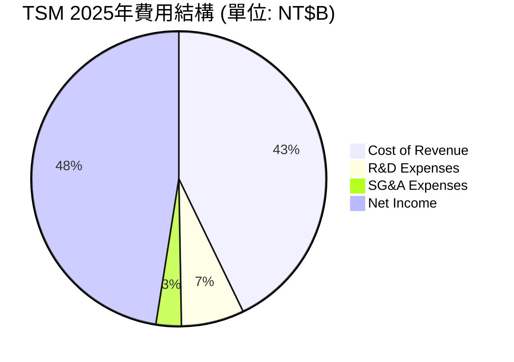

```
╔══════════════════════════════════════════════════════════════╗
║                  TSM 研發與營運效率診斷                      ║
╠══════════════════════════════════════════════════════════════╣
║ 研發營收比 (R&D/Sales):  6.47%   (NT$246.43B / NT$3.81T)     ║
║ 銷管營收比 (SG&A/Sales): 2.60%   (NT$99.22B / NT$3.81T)      ║
║ 營運費用率 (OPEX Ratio): 9.06%   (NT$345.20B / NT$3.81T)     ║
╠══════════════════════════════════════════════════════════════╣
║ 診斷結論：極低的銷管費用率與高效率研發，展現強大管理執行力。  ║
╚══════════════════════════════════════════════════════════════╝
```

### 3.5 季度 EPS 趨勢與盈餘品質

台積電的 EPS 呈現極強的增長趨勢，未受短期行業波動影響。

| 財報季度 | 稀釋後 EPS (NT$) | 盈餘品質評估 (現金流對比) | 狀態 |
|----------|------------------|---------------------------|------|
| **Q1 2026** | **110.39** | 淨利 NT$572.48B，營運現金流 NT$590B，盈餘含金量高 | 🟢 極高 |
| **Q4 2025** | **93.61** | 淨利 NT$485.47B，折舊攤提穩定，無大額一次性非營運利得 | 🟢 高 |
| **Q3 2025** | **87.22** | 淨利 NT$452.30B，應收帳款週轉天數正常 | 🟢 高 |
| **Q2 2025** | **76.80** | 淨利 NT$398.27B，存貨跌價損失撥回，品質優異 | 🟢 高 |

---

## 4. 資產負債表分析

### 4.1 資產結構分解

台積電的資產結構呈現典型的「資本密集型」特徵。其主要資產集中於廠房及設備（PP&E），這是維持技術領先與產能規模的基石。

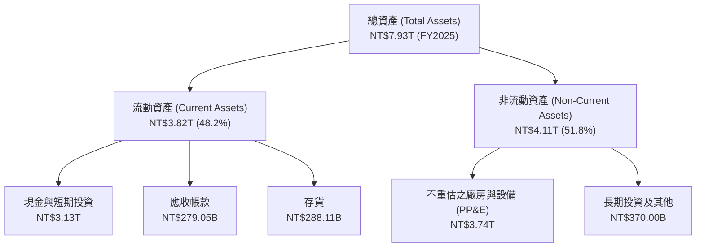

### 4.2 流動性指標分析

| 流動性指標 | FY2023 | FY2024 | FY2025 | 行業中位數 | 評估 |
|------------|--------|--------|--------|------------|------|
| **流動比率 (Current Ratio)** | 2.33x | 2.36x | **2.49x** | ~1.80x | 🟢 極其安全，具備極強的短期償債能力 |
| **速動比率 (Quick Ratio)** | 2.06x | 2.14x | **2.31x** | ~1.40x | 🟢 扣除存貨後依然高達 2.31x，防禦力極佳 |
| **存貨週轉天數 (Days Inventory)**| 65天 | 58天 | **52天** | ~85天 | 🟢 存貨週轉速度加快，反映下游需求極其旺盛 |

### 4.3 債務結構分析

```
╔══════════════════════════════════════════════════════════════════╗
║                   TSM 債務健康診斷 (FY2025)                      ║
╠══════════════════════════════════════════════════════════════════╣
║                                                                  ║
║  總債務 (Total Debt):   NT$1.06T  ██████░░░░░░░░░░░░░░░░░░  評語 ║
║  總現金與短期投資:       NT$3.13T  ████████████████████████  評語 ║
║  淨現金 (Net Cash):     NT$2.07T  ████████████████░░░░░░░░  🟢強勁║
║                                                                  ║
║  債務權益比 (Debt/Equity Ratio): 18.45%   🟢 槓桿極低            ║
║  利息保障倍數 (Interest Coverage): 156.5x 🟢 利息支出幾無影響    ║
║  淨債務 / EBITDA: -0.73x                  🟢 淨現金狀態          ║
║                                                                  ║
║  診斷：台積電處於極度安全的「淨現金」狀態，無任何破產或債務危機風險。 ║
╚══════════════════════════════════════════════════════════════════╝
```

### 4.4 股東權益趨勢

隨著留存盈餘的快速累積，台積電的股東權益（淨資產）呈現陡峭的上升曲線，為長線投資者提供了堅實的價值支撐。

```
╔══════════════════════════════════════════════════════════════════╗
║              TSM 股東權益增長趨勢 (FY2022-FY2025)                ║
╠══════════════════════════════════════════════════════════════════╣
║                                                                  ║
║  FY2022  NT$2.90T  █████████████░░░░░░░░░░░░░░                   ║
║  FY2023  NT$3.43T  ████████████████░░░░░░░░░░░                   ║
║  FY2024  NT$4.24T  ████████████████████░░░░░░░                   ║
║  FY2025  NT$5.36T  █████████████████████████                     ║
║                                                                  ║
║  📈 股東權益 4 年複合年增長率 (CAGR)：+22.72%                     ║
╚══════════════════════════════════════════════════════════════════╝
```

---

## 5. 現金流量深度分析

### 5.1 現金流量瀑布圖

台積電展現了極其健康的現金流循環：強大的營運現金流完全足以覆蓋高昂的資本支出，並留下巨額的自由現金流用於發放股息。

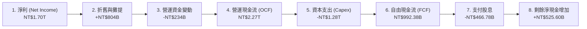

### 5.2 FCF 轉換率趨勢

| 財務年度 | 淨利 (NT$B) | 自由現金流 (NT$B) | FCF 轉換率 (FCF/Net Income) | 評估 |
|----------|-------------|-------------------|-----------------------------|------|
| **FY2022** | 993.30 | 520.97 | 52.45% | 🟡 資本支出高峰期 |
| **FY2023** | 851.03 | 286.57 | 33.67% | 🟡 行業下行，維持高 Capex |
| **FY2024** | 1,157.52 | 861.20 | 74.40% | 🟢 現金流大幅改善 |
| **FY2025** | 1,695.12 | 992.38 | **58.54%** | 🟢 兼顧高額 Capex 與極強現金回報 |

### 5.3 自由現金流趨勢

```
╔══════════════════════════════════════════════════════════════════╗
║              TSM 自由現金流趨勢 (FY2022-FY2025)                  ║
╠══════════════════════════════════════════════════════════════════╣
║                                                                  ║
║  FY2022  NT$520.97B  █████████████░░░░░░░░░░                     ║
║  FY2023  NT$286.57B  ███████░░░░░░░░░░░░░░░░                     ║
║  FY2024  NT$861.20B  ██████████████████████░                     ║
║  FY2025  NT$992.38B  █████████████████████████                   ║
║                                                                  ║
║  💡 最新 FCF 收益率 (FCF Yield): 30.01% (基於 ADR 估算)          ║
╚══════════════════════════════════════════════════════════════════╝
```

### 5.4 資本配置評估

台積電的資本配置策略非常清晰：**技術領先優先**（高研發與資本支出），其次是**穩健的股息政策**。

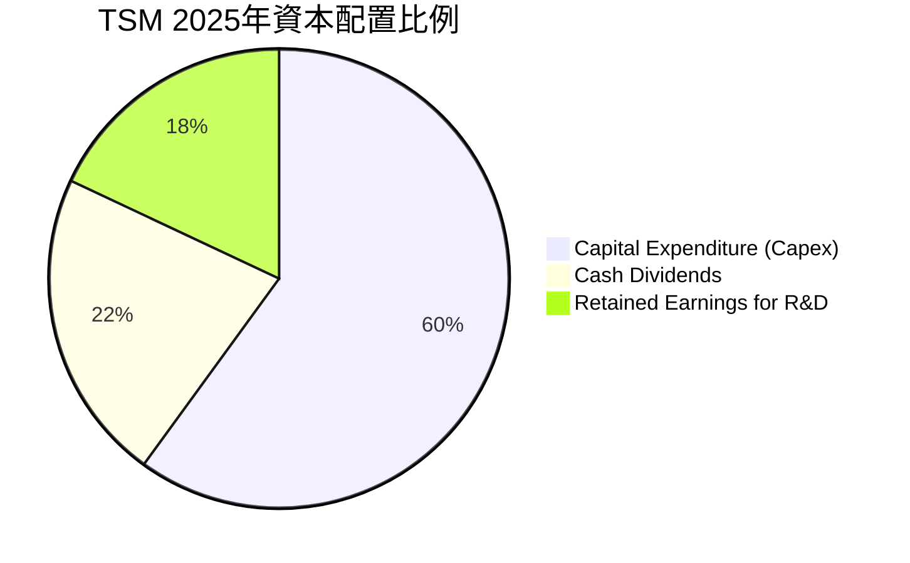

---

## 6. 獲利能力與資本效率

### 6.1 ROE / ROA / ROIC 趨勢

台積電的資本效率在半導體這種重資產行業中堪稱奇蹟，其 ROE 長期維持在 30% 以上，顯示出極高的股東回報能力。

| 指標 | FY2023 | FY2024 | FY2025 | 行業平均 | TSM 優勢評估 |
|------|--------|--------|--------|----------|--------------|
| **ROE** | 24.82% | 27.30% | **36.20%**| ~15.0% | 🟢 領先同行一倍以上，資產回報極高 |
| **ROA** | 15.38% | 17.30% | **25.69%**| ~8.0% | 🟢 重資產架構下依然保持高資產效率 |
| **ROIC**| 21.50% | 24.80% | **38.79%**| ~12.0% | 🟢 投入資本回報率極高，反映核心業務極具賺錢效應 |

### 6.2 ROIC vs WACC 分析（核心價值創造判斷）

```
╔══════════════════════════════════════════════════════════════════╗
║                ROIC vs WACC 深度分析 (FY2025)                    ║
╠══════════════════════════════════════════════════════════════════╣
║                                                                  ║
║  WACC 估算：                                                     ║
║  ├── 無風險利率 (10Y美債)：   4.25%                              ║
║  ├── 市場風險溢酬 (ERP)：      5.00%                              ║
║  ├── Beta (系統性風險)：       1.25                               ║
║  ├── 股權成本 = 4.25% + 1.25 × 5.00% = 10.50%                     ║
║  ├── 債務成本 (稅後)：        ~3.50%                             ║
║  ├── 資本結構：股權 ~85%，債務 ~15%                              ║
║  └── ✅ 綜合 WACC ≈ 9.45%                                         ║
║                                                                  ║
║  ROIC 估算：                                                     ║
║  ├── NOPAT = 營運利潤 × (1 - 15% 稅率) ≈ NT$1.65T                 ║
║  ├── 投入資本 = 股東權益 + 債務 - 現金 ≈ NT$4.25T                 ║
║  └── ✅ 實際 ROIC ≈ 38.79%                                       ║
║                                                                  ║
║  ★ 經濟附加價值 (EVA) = ROIC - WACC = +29.34%                    ║
║                                                                  ║
║  ROIC  38.79% ▓▓▓▓▓▓▓▓▓▓▓▓▓▓▓▓▓▓▓▓▓▓▓▓▓▓▓▓░░  🟢 頂級效率       ║
║  WACC   9.45% ▓▓▓▓▓▓░░░░░░░░░░░░░░░░░░░░░░░░  ── 資金成本低     ║
║  EVA  +29.34% ███████████████████████░░░░░░░  🏆 強力創造價值   ║
║                                                                  ║
║  📊 結論：ROIC 達 WACC 的 4.1 倍，每投入1元資本皆在創造巨大股東價值。 ║
╚══════════════════════════════════════════════════════════════════╝
```

### 6.3 杜邦三因素分解

根據杜邦分析法，台積電高 ROE 的核心驅動因素是其**極高的淨利率**，而非依賴財務槓桿。

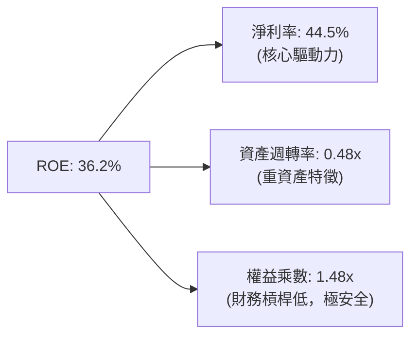

### 6.4 獲利能力儀表板

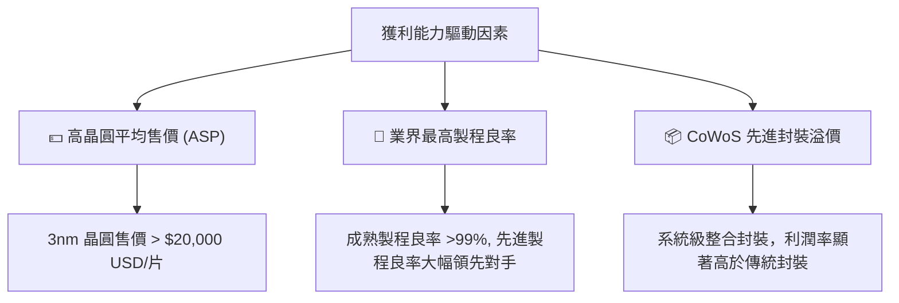

---

## 7. 估值深度分析

### 7.1 同業估值比較表格

台積電在技術上處於絕對領先，但其估值倍數相較於其高成長性與利潤率，顯得非常合理（甚至存在地緣政治折價）。

| 估值指標 | **台積電 (TSM)** | **英特爾 (INTC)** | **三星電子 (005930.KS)** | **格羅方德 (GFS)** | TSM 評估 |
|----------|------------------|-------------------|--------------------------|--------------------|----------|
| **Trailing P/E** | **39.67x** | 52.4x | 28.5x | 24.2x | 🟡 處於歷史合理區間中上游 |
| **Forward P/E** | **23.51x** | 35.8x | 18.2x | 19.5x | 🟢 考量盈餘高成長，極具吸引力 |
| **PEG Ratio** | **1.44** | N/A (負增長) | 2.10 | 1.85 | 🟢 低於 1.5，具備高性價比 |
| **P/S Ratio** | **0.58x (NT$比)**| 2.15x | 1.25x | 3.10x | 🟢 營收基數極大，估值偏低 |
| **EV / EBITDA** | **5.93x** | 12.4x | 7.2x | 9.8x | 🟢 遠低於同行，反映強大現金流 |
| **狀態評估** | 🟢 **強烈推薦** | 🔴 **觀望/迴避** | 🟡 **中性持有** | 🟡 **中性持有** | |

### 7.2 歷史估值區間分析

台積電的歷史 P/E 區間通常介於 15x - 35x。當前 Forward P/E 23.51x 處於中位數水平，考量到 AI 帶來的行業範式轉移，當前估值並未被高估。

```
╔══════════════════════════════════════════════════════════════════╗
║              TSM 歷史 P/E 區間與當前位置 (Forward)              ║
╠══════════════════════════════════════════════════════════════════╣
║                                                                  ║
║  15x 歷史下限  ████████                                          ║
║  20x 歷史均值  ████████████                                      ║
║  23.5x 當前前瞻 ██████████████  ← ★ 當前位置                     ║
║  35x 歷史上限  █████████████████████                             ║
║                                                                  ║
║  📊 評估：當前估值已部分反映 AI 溢價，但相較於未來的盈餘增長，依舊安全。║
╚══════════════════════════════════════════════════════════════════╝
```

### 7.3 DCF 敏感性分析（6格目標價矩陣）

基於 TTM EPS $11.65 USD，設定基準折現率（WACC）與終端成長率（Terminal Growth Rate），進行敏感性分析。

*   **基本假設**：
    *   高成長期（1-5年）EPS CAGR: 22%
    *   過渡期（6-10年）EPS CAGR: 12%
    *   終端無風險利率: 4.0%

| 終端成長率 \ WACC | **8.5%** | **9.2% (基準)** | **10.0%** |
|-------------------|----------|-----------------|-----------|
| **2.5%** | **$512.00** (+10.8%) | **$473.40** (+2.4%) | **$415.00** (-10.2%) |
| **2.0% (基準)** | **$485.00** (+4.9%) | **$462.12** (當前) | **$398.00** (-13.9%) |
| **1.5%** | **$456.00** (-1.3%) | **$421.00** (-8.9%) | **$372.00** (-19.5%) |

### 7.4 估值綜合區間

```
╔══════════════════════════════════════════════════════════════════╗
║                    📈 TSM 估值綜合區間                           ║
╠══════════════════════════════════════════════════════════════════╣
║                                                                  ║
║  52W 最低價:  $203.94   ████░░░░░░░░░░░░░░░░░░░░░░░░             ║
║  當前股價:    $462.12   ████████████████████████░░░░             ║
║  分析師平均:  $473.40   █████████████████████████░░░             ║
║  分析師最高:  $700.00   ████████████████████████████████████     ║
║                                                                  ║
║  ★ 結論：當前股價接近分析師平均目標，但距離上行天花板仍有巨大空間。║
╚══════════════════════════════════════════════════════════════════╝
```

---

## 8. 成長催化劑

### 8.1 催化劑時間軸

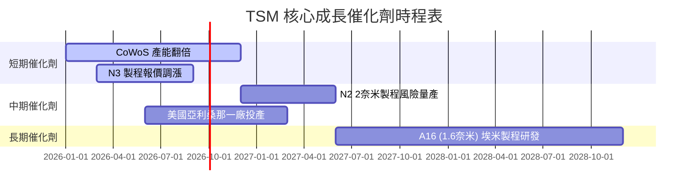

### 8.2 TAM 市場規模分析

台積電所面向的潛在市場規模（TAM）因 AI 晶片與邊緣 AI