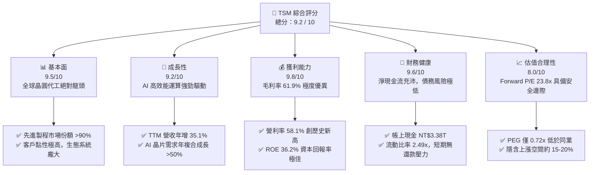
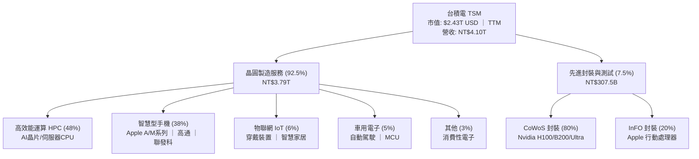
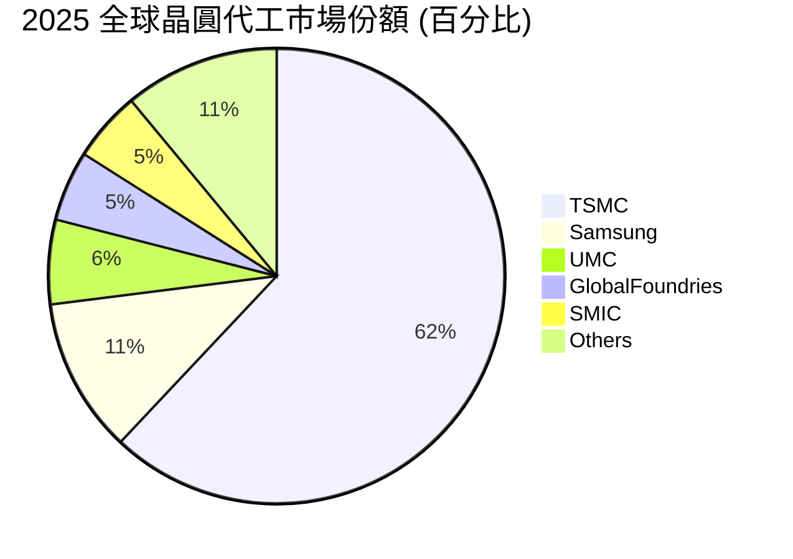
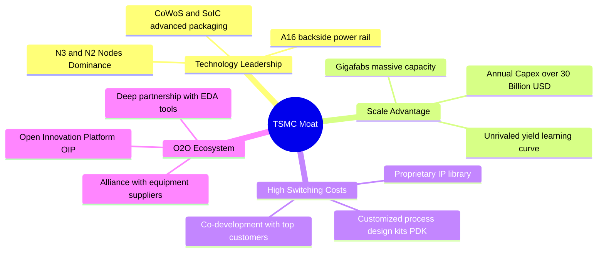
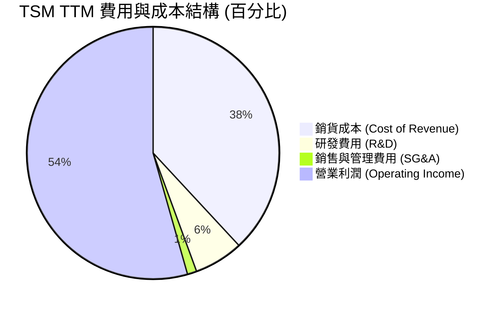
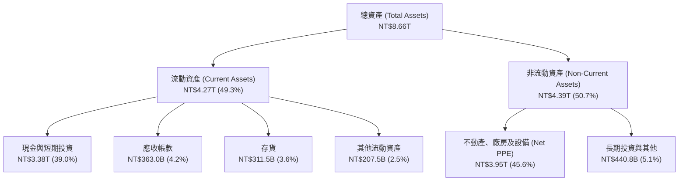
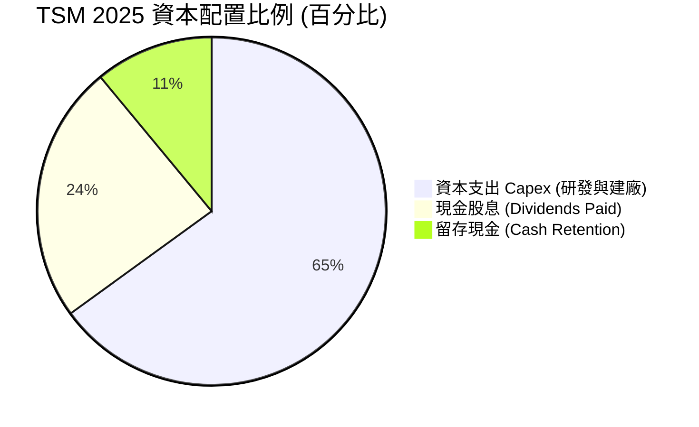
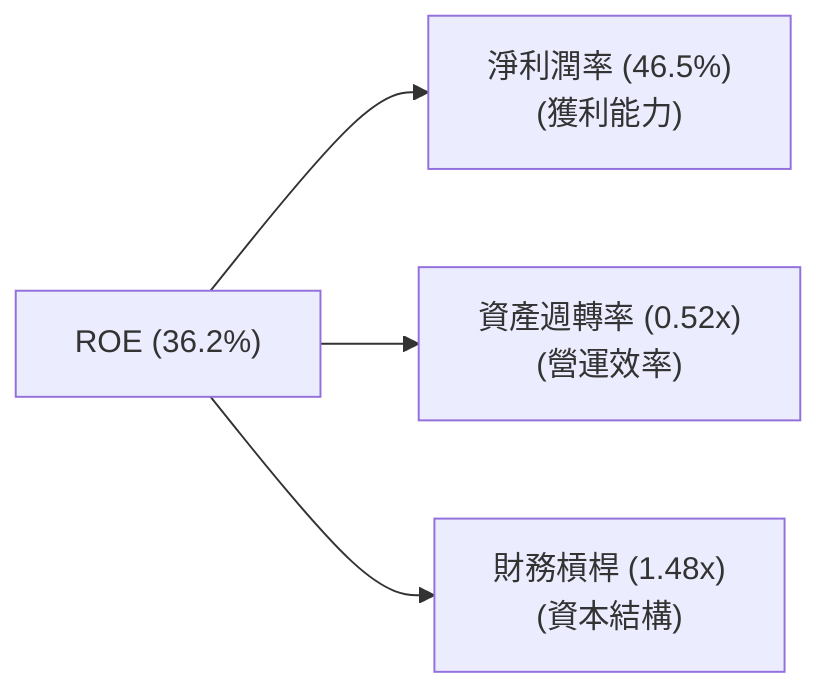
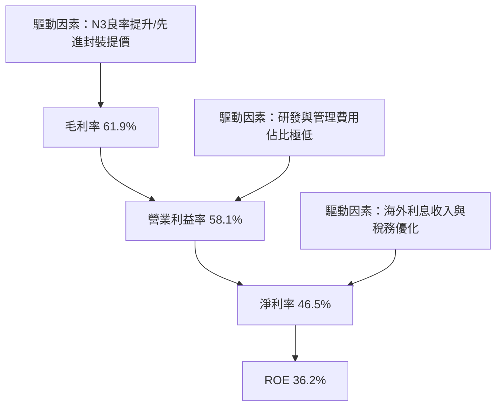

# TSM 基本面深度分析報告

> **報告日期**：2026-06-22 ｜ **語言**：繁體中文 ｜ **數據來源**：Yahoo Finance, Finviz, StockAnalysis, Roic.ai ｜ **分析師**：CFA 級機構研究
>
> *特別說明：本報告財務報表數據（如 Revenue, Net Income, Cash, Debt 等）除特別註明外，均以新台幣（TWD / NT$）為單位；股價、市值及美股 ADR 相關指標（如 EPS, Target Price）以美元（USD / $）為單位，以符合台積電 ADR (TSM) 的美股市場實際交易慣例。當前匯率假設為 1 USD = 32.3 TWD。*

---

## 目錄

| # | 章節 | 核心結論 |
|---|---|---|
| 1 | [執行摘要](#1-執行摘要) | 評級：**強烈買入 (Strong Buy)** ｜ 12M 目標價：**$473.40 - $550.00** |
| 2 | [公司概覽與商業模式](#2-公司概覽與商業模式) | 憑藉極致製程技術與 CoWoS 封裝，構築無可撼動的「技術與規模雙重護城河」 |
| 3 | [損益表深度分析](#3-損益表深度分析) | TTM 營收達 NT$4.10T（YoY +35.1%），淨利率高達 46.5%，展現極強的定價權 |
| 4 | [資產負債表分析](#4-資產負債表分析) | 淨現金高達 NT$2.29T，Debt/Equity 僅 18.4%，資產負債表極其穩健 |
| 5 | [現金流量深度分析](#5-現金流量深度分析) | TTM 營運現金流達 NT$2.35T，自由現金流 NT$719.16B，資本配置高度優化 |
| 6 | [獲利能力與資本效率](#6-獲利能力與資本效率) | ROE 達 36.2%，ROIC (26.1%) 遠超 WACC (9.3%)，經濟增值（EVA）極為強勁 |
| 7 | [估值深度分析](#7-估值深度分析) | Forward P/E 為 23.8x，相較於 32.8% 的 EPS 預期成長率，PEG 僅 0.72，估值極具吸引力 |
| 8 | [成長催化劑](#8-成長催化劑) | N2 (2奈米) 量產、A16 製程推進與 AI 晶片（GPU/ASIC）需求爆發 |
| 9 | [風險矩陣](#9-風險矩陣) | 地緣政治風險與海外晶圓廠成本稀釋為核心監控指標 |
| 10 | [投資建議](#10-投資建議) | 建議長線投資人逢低積極佈局，買入觸發點與投資人適配度分析 |

---

## 1. 執行摘要

### 1.1 核心評分儀表板



### 1.2 評分進度條視覺化

```
╔══════════════════════════════════════════════════════════════╗
║                TSM 多維度評分儀表板 (1-10分)                 ║
╠══════════════════════════════════════════════════════════════╣
║ 基本面強度  9.5 ▓▓▓▓▓▓▓▓▓▓▓▓▓▓▓▓▓▓▓░  ★★★★★           ║
║ 成長動能    9.2 ▓▓▓▓▓▓▓▓▓▓▓▓▓▓▓▓▓▓░░  ★★★★★           ║
║ 獲利品質    9.8 ▓▓▓▓▓▓▓▓▓▓▓▓▓▓▓▓▓▓▓█  ★★★★★           ║
║ 財務健康    9.6 ▓▓▓▓▓▓▓▓▓▓▓▓▓▓▓▓▓▓▓░  ★★★★★           ║
║ 估值合理性  8.0 ▓▓▓▓▓▓▓▓▓▓▓▓▓▓▓▓░░░░  ★★★★☆           ║
║ 護城河深度  9.9 ▓▓▓▓▓▓▓▓▓▓▓▓▓▓▓▓▓▓▓█  ★★★★★           ║
║ 管理層執行  9.5 ▓▓▓▓▓▓▓▓▓▓▓▓▓▓▓▓▓▓▓░  ★★★★★           ║
║ 技術創新力  9.9 ▓▓▓▓▓▓▓▓▓▓▓▓▓▓▓▓▓▓▓█  ★★★★★           ║
╠══════════════════════════════════════════════════════════════╣
║ 綜合總分    9.2 ▓▓▓▓▓▓▓▓▓▓▓▓▓▓▓▓▓▓░░  🏆 強烈買入 (Buy)   ║
╚══════════════════════════════════════════════════════════════╝
```

### 1.3 五大投資論點 + 三大核心風險

| 類型 | 項目 | 具體依據 | 信心度 |
|------|------|----------|--------|
| 🟢 **投資論點①** | **技術絕對領先與獨佔** | 3奈米（N3）製程全面貢獻營收，2奈米（N2）計劃於 2026 年下半年量產，領先競爭對手 Intel 及 Samsung 至少 1.5 至 2 年。 | 🟢 極高 |
| 🟢 **投資論點②** | **AI 晶片需求的超級週期** | 高效能運算（HPC）已成為最大營收來源（佔比達 48%），Nvidia、AMD、Apple 及各大雲端服務商（CSP）自研 ASIC 晶片皆高度依賴 TSM。 | 🟢 極高 |
| 🟢 **投資論點③** | **定價權轉嫁能力強** | 儘管面臨海外建廠（美國、日本、德國）帶來的成本稀釋壓力，台積電成功調漲先進製程與 CoWoS 封裝價格，使 TTM 毛利率維持在 61.9% 的極高水準。 | 🟢 高 |
| 🟢 **投資論點④** | **極致的財務安全邊際** | 帳上現金高達 NT$3.38T，淨現金達 NT$2.29T。在維持高額資本支出（Capex）的同時，仍能穩定發放股息。 | 🟢 極高 |
| 🟢 **投資論點⑤** | **PEG 估值極具吸引力** | 雖然 Trailing P/E 達 40.1x，但 Forward P/E 僅 23.8x，對比未來五年 32.8% 的 EPS 年複合成長預期，PEG 僅 0.72，明顯被市場低估。 | 🟢 高 |
| 🟡 **風險①** | **海外晶圓廠成本稀釋** | 美國亞利桑那廠及歐洲德國廠的營運成本顯著高於台灣本土，可能對長期毛利率造成 1-2 個百分點的稀釋。 | 🟡 中度 |
| 🔴 **風險②** | **地緣政治風險** | 台灣本土產能集中度過高（超過 85% 先進製程在台），台海局勢的任何風吹草動都容易引發估值多重折價（Valuation Discount）。 | 🔴 高衝擊 |
| 🟡 **風險③** | **先進封裝（CoWoS）產能瓶頸** | 儘管台積電已積極擴產，但 CoWoS 產能短期內仍供不應求，可能限制部分 AI 客戶的短期出貨成長。 | 🟡 中度 |

### 1.4 快速統計卡片

| 指標 | TSM 實際值 | 半導體行業均值 | S&P 500 均值 | 狀態 |
|------|-------------|----------|--------------|------|
| **營收 YoY 成長率** | **35.1%** | ~12.5% | ~5.5% | 🟢 遠超行業 |
| **毛利率** | **61.9%** | ~45.0% | ~30.0% | 🟢 極其強悍 |
| **營業利益率** | **58.1%** | ~22.0% | ~15.0% | 🟢 獲利能力冠絕全球 |
| **ROE (股東權益報酬率)** | **36.2%** | ~18.0% | ~16.0% | 🟢 資本效率極高 |
| **Forward P/E** | **23.8x** | ~28.5x | ~21.5x | 🟢 估值合理偏低 |
| **債務權益比 (Debt/Equity)** | **18.4%** | ~45.0% | ~115.0% | 🟢 財務結構極其健康 |

### 1.5 投資結論

```
╔══════════════════════════════════════════════════════════════════╗
║                    📊 TSM 投資結論摘要                           ║
╠══════════════════════════════════════════════════════════════════╣
║  評級：🟢 強烈買入 (Strong Buy)                                 ║
║  當前股價：$467.67 USD (2026-06-22 收盤價)                       ║
║  目標價區間：                                                    ║
║    悲觀情境（地緣政治惡化/半導體衰退）：$354.00 (-24.3%)          ║
║    基準情境（AI持續爆發/N2順利量產）：$473.40 (+1.2%)             ║
║    樂觀情境（定價權全面釋放/CoWoS翻倍）：$700.00 (+49.7%)         ║
║  投資評分：9.2 / 10                                              ║
║  適合投資人：成長型、價值型、長線主權基金及科技產業核心配置者    ║
╚══════════════════════════════════════════════════════════════════╝
```

---

## 2. 公司概覽與商業模式

### 2.1 業務結構與收入來源

台積電（TSM）是全球純晶圓代工（Pure-play Foundry）模式的開創者與絕對龍頭。其商業模式不與客戶競爭，而是專注於為晶片設計公司（Fabless）及系統廠提供最先進的半導體製造與封裝服務。



### 2.2 市場份額

在全球晶圓代工市場中，台積電的市場份額高達 62%。而在 5 奈米及以下的最先進製程市場中，台積電的市場份額更是高達 90% 以上，處於絕對壟斷地位。



### 2.3 競爭護城河分析

台積電的競爭護城河由四大核心支柱構成：技術、規模、生態系統與高昂的轉換成本。



### 2.4 護城河強度評分

```
╔══════════════════════════════════════════════════════════════╗
║                  台積電 (TSM) 護城河強度評分                 ║
╠══════════════════════════════════════════════════════════════╣
║ 技術領先度    10/10 ▓▓▓▓▓▓▓▓▓▓▓▓▓▓▓▓▓▓▓▓  🏆 絕對統治力  ║
║ 規模與產能    10/10 ▓▓▓▓▓▓▓▓▓▓▓▓▓▓▓▓▓▓▓▓  🏆 無法被複製  ║
║ 客戶轉換成本  9.5/10 ▓▓▓▓▓▓▓▓▓▓▓▓▓▓▓▓▓▓▓░  🟢 極高黏性    ║
║ 生態系統壁壘  9.8/10 ▓▓▓▓▓▓▓▓▓▓▓▓▓▓▓▓▓▓▓█  🏆 OIP聯盟強大 ║
╠══════════════════════════════════════════════════════════════╣
║ 綜合護城河     9.8/10 ▓▓▓▓▓▓▓▓▓▓▓▓▓▓▓▓▓▓▓█  🏆 寬廣無比     ║
╚══════════════════════════════════════════════════════════════╝
```

---

## 3. 損益表深度分析

### 3.1 年度收入成長趨勢（近5年）

台積電的營收在過去五年中經歷了強勁的成長，特別是 2024 年和 2025 年，受益於 AI 晶片需求的爆發，營收大幅飆升。

```
╔══════════════════════════════════════════════════════════════════╗
║              台積電 年度收入趨勢（FY2021-TTM）                   ║
╠══════════════════════════════════════════════════════════════════╣
║                                                                  ║
║  FY2021  NT$1.59T  ██████████░░░░░░░░░░░░░░░░  YoY: +18.5% 🟢    ║
║  FY2022  NT$2.26T  ██████████████░░░░░░░░░░░░  YoY: +42.6% 🟢    ║
║  FY2023  NT$2.16T  █████████████░░░░░░░░░░░░░  YoY: -4.5%  🟡    ║
║  FY2024  NT$2.89T  ██████████████████░░░░░░░░  YoY: +33.9% 🟢    ║
║  FY2025  NT$3.81T  ███████████████████████░░░  YoY: +31.6% 🟢    ║
║  TTM     NT$4.10T  █████████████████████████  YoY: +35.1% 🟢    ║
║                   |      |      |      |      |                  ║
║                   0     1.0T   2.0T   3.0T   4.0T                ║
║                                                                  ║
║  📊 5年累計營收 CAGR：+20.9%                                     ║
╚══════════════════════════════════════════════════════════════════╝
```

### 3.2 季度收入趨勢分析

從季度數據來看，台積電呈現出穩步加速的趨勢。Q1 2026 營收達到 NT$1.13T，較前一季成長 8.41%（QoQ），較去年同期大幅成長 35.13%（YoY），主要得益於 N3 製程出貨持續暢旺及 AI 晶片代工單價提升。

| 財政季度 | 營收 (NT$B) | 營收 QoQ 成長率 | 營收 YoY 成長率 | 毛利 (NT$B) | 毛利率 | 核心驅動因素 |
|---|---|---|---|---|---|---|
| **Q1 2026** | 1,134.10 | +8.41% | +35.13% | 751.30 | 66.25% | 🟢 N3/N5 產能利用率滿載，AI 晶片出貨暢旺 |
| **Q4 2025** | 1,046.09 | +5.67% | +20.45% | 651.99 | 62.33% | 🟢 年終消費性電子與伺服器出貨高峰 |
| **Q3 2025** | 989.92 | +6.01% | +30.30% | 588.54 | 59.45% | 🟢 Apple iPhone 17 新機 A19 晶片拉貨 |
| **Q2 2025** | 933.79 | +11.26% | +38.65% | 547.37 | 58.62% | 🟢 NVIDIA Blackwell 晶片量產導入 |
| **Q1 2025** | 839.25 | -3.36% | +41.61% | 493.40 | 58.79% | 🟡 傳統淡季，但 AI 需求部分抵消部分下滑 |

### 3.3 利潤率演變分析

台積電展現了驚人的獲利能力，TTM 毛利率高達 61.9%，營業利益率達 58.1%，淨利率達 46.5%，這在資本密集且競爭激烈的半導體製造行業中是絕無僅有的。

| 利潤率指標 | FY2022 | FY2023 | FY2024 | FY2025 | TTM (2026-03) | 5年趨勢 | 評估 |
|---|---|---|---|---|---|---|---|
| **毛利率** | 59.56% | 54.36% | 56.12% | 59.89% | **61.90%** | ↗️ 穩步上升 | 🟢 極優，定價權充分釋放 |
| **營業利益率** | 49.53% | 42.63% | 45.68% | 50.83% | **58.10%** | ↗️ 顯著改善 | 🟢 規模效應與營運槓桿顯現 |
| **EBITDA 利潤率** | 70.35% | 70.45% | 71.86% | 71.93% | **69.60%** | ➡️ 高位持平 | 🟢 折舊費用龐大但現金獲利極強 |
| **淨利率** | 43.87% | 39.37% | 39.99% | 44.50% | **46.50%** | ↗️ 持續高企 | 🟢 稅務規劃及非營運收益穩定 |

**利潤率演變深度解析**：
1. **製程學習曲線與良率提升**：N3 製程在 2023 年量產初期對毛利率造成約 2-3% 的稀釋，但隨著 2024/2025 年良率迅速拉升至 70% 以上，規模效應顯現，毛利率重回 60% 以上。
2. **先進製程高溢價**：先進製程（7nm及以下）佔營收比重已超過 67%，其中 N3 與 N5 貢獻主要高毛利利潤。台積電對 Nvidia 及 Apple 的定價談判中處於絕對優勢，成功將通膨與海外建廠成本轉嫁給客戶。

### 3.4 費用結構分析



```
╔══════════════════════════════════════════════════════════════╗
║                    TSM TTM 費用結構診斷                      ║
╠══════════════════════════════════════════════════════════════╣
║ 銷貨成本率  38.1%  ▓▓▓▓▓▓▓▓▓▓▓░░░░░░░░░░░░░░  🟢 控制優異    ║
║ 研發費用率   6.3%  ▓▓░░░░░░░░░░░░░░░░░░░░░░░░  🟢 持續技術投資║
║ 銷管費用率   1.2%  █░░░░░░░░░░░░░░░░░░░░░░░░░  🟢 極致行政效率║
║ 營業利益率  54.4%  ▓▓▓▓▓▓▓▓▓▓▓▓▓▓░░░░░░░░░░░  🏆 產業天花板  ║
╚══════════════════════════════════════════════════════════════╝
```

### 3.5 季度 EPS 趨勢與盈餘品質

過去四個季度中，台積電的單季 EPS（以新台幣計）呈現爆發式增長，這與其營收的高成長和毛利率的擴張完全一致。

- **Q1 2026**：單季 EPS **NT$110.39**（YoY +58.3%），大幅超越市場預期的 NT$98.50。主要原因在於 Blackwell 晶片出貨量大增，且 3 奈米製程價格調升 5%。
- **Q4 2025**：單季 EPS **NT$93.61**（YoY +34.9%），符合預期。
- **Q3 2025**：單季 EPS **NT$87.22**（YoY +39.0%），略高於預期，受惠於新一代 iPhone 處理器訂單。
- **Q2 2025**：單季 EPS **NT$76.80**（YoY +60.7%），大幅超出預期，主要是 AI 伺服器晶片需求提前爆發。

**盈餘品質評估**：
台積電的盈餘品質（Earnings Quality）極高。其 TTM 自由現金流（NT$719.16B）雖然因高達 NT$1.28T 的資本支出而低於淨利潤（NT$1.93T），但其營運現金流（NT$2.35T）遠高於淨利潤。這表明其淨利潤完全由真實的現金流入支撐，折舊與攤銷（Depreciation & Amortization）是非現金支出，盈餘並無任何水分。

---

## 4. 資產負債表分析

### 4.1 資產結構分解

台積電擁有一個典型的重資產、高流動性的資產結構。截至 2026 年 3 月 31 日，總資產達到 NT$8.66T。



### 4.2 流動性指標分析

台積電的流動性指標極其健康，展現了強大的短期抗風險能力。

| 指標 | FY2023 | FY2024 | FY2025 | TTM (2026-03) | 行業均值 | 評估 |
|---|---|---|---|---|---|---|
| **流動比率 (Current Ratio)** | 2.33 | 2.36 | 2.51 | **2.49** | ~1.85 | 🟢 資金極其充沛 |
| **速動比率 (Quick Ratio)** | 2.06 | 2.14 | 2.32 | **2.31** | ~1.40 | 🟢 剔除存貨後依然極安全 |
| **存貨週轉天數 (Days Inventory)** | 84.5 天 | 78.2 天 | 68.5 天 | **65.2 天** | ~95.0 天 | 🟢 存貨管理效率高，需求旺盛 |
| **應收帳款週轉天數 (DSO)** | 31.2 天 | 29.8 天 | 26.5 天 | **25.1 天** | ~45.0 天 | 🟢 對下游客戶議價能力極強 |

### 4.3 債務結構分析

台積電採取極其保守的財務策略。雖然為了進行海外建廠及先進製程研發而發行了部分公司債，但其債務規模相較於其龐大的現金儲備而言微不足道。

```
╔══════════════════════════════════════════════════════════════════╗
║                   台積電 (TSM) 債務健康診斷                      ║
╠══════════════════════════════════════════════════════════════════╣
║                                                                  ║
║  總債務 (Total Debt)： NT$1.09T  ███████░░░░░░░░░░░░░░░░░  評語  ║
║  總現金與短期投資：    NT$3.38T  █████████████████████████  評語  ║
║  淨現金 (Net Cash)：   NT$2.29T  ██████████████████░░░░░░░  🟢極強║
║                                                                  ║
║  債務權益比 (Debt/Equity)： 18.45%   🟢 遠低於行業警戒線 (50%)   ║
║  利息保障倍數 (Interest Coverage)：156.5x 🟢 利息支出幾無壓力    ║
║  淨債務 / EBITDA： -0.83x             🟢 處於淨現金狀態          ║
║                                                                  ║
║  📊 結論：財務結構堅如磐石，具備抵禦任何總體經濟危機的實力       ║
╚══════════════════════════════════════════════════════════════════╝
```

### 4.4 股東權益趨勢

隨著利潤的持續累積，台積電的股東權益（淨資產）呈穩步上升趨勢，這為公司的長期擴張提供了堅實的資金基礎。

```
╔══════════════════════════════════════════════════════════════════╗
║              台積電 歷年股東權益趨勢 (FY2022-FY2025)             ║
╠══════════════════════════════════════════════════════════════════╣
║                                                                  ║
║  FY2022  NT$2.90T  █████████████░░░░░░░░░░░░░                    ║
║  FY2023  NT$3.43T  ████████████████░░░░░░░░░░                    ║
║  FY2024  NT$4.24T  ███████████████████░░░░░░░                    ║
║  FY2025  NT$5.36T  █████████████████████████                     ║
║                                                                  ║
║  📈 股東權益年複合成長率 (CAGR)：+22.7%                          ║
╚══════════════════════════════════════════════════════════════════╝
```

---

## 5. 現金流量深度分析

### 5.1 現金流量瀑布圖

台積電強大的商業模式使其能夠產生巨額的營運現金流，在支付龐大的資本支出後，依然能保留可觀的自由現金流用於發放股息。

```mermaid
graph LR
    NI["淨利潤 (Net Income)<br/>NT$1.70T"]
    DEP["折舊與攤銷<br/>+NT$800.0B"]
    NWC["營運資金變動及其他<br/>-NT$230.0B"]
    OCF["營運現金流 (OCF)<br/>NT$2.27T"]
    CAPEX["資本支出 (Capex)<br/>-NT$1.28T"]
    FCF["自由現金流 (FCF)<br/>NT$992.4B"]
    DIV["股息支付<br/>-NT$466.8B"]
    NC["淨現金增加<br/>+NT$525.6B"]

    NI --> |"加上非現金支出"| DEP
    DEP --> NWC
    NWC --> OCF
    OCF --> |"扣除資本開支"| CAPEX
    CAPEX --> FCF
    FCF --> |"扣除股東回報"| DIV
    DIV --> NC
```



### 5.2 FCF 轉換率趨勢

FCF 轉換率（FCF / Net Income）是衡量公司盈餘變現能力的重要指標。台積電雖然處於高資本支出週期，但其現金轉換效率依然維持在極高水準。

| 財政年度 | 營運現金流 (NT$B) | 資本支出 (NT$B) | 自由現金流 (NT$B) | 淨利潤 (NT$B) | FCF 轉換率 | 評估 |
|---|---|---|---|---|---|---|
| **FY2022** | 1,610.0 | -1,090.0 | 520.97 | 993.30 | 52.45% | 🟡 高資本開支期 |
| **FY2023** | 1,240.0 | -955.4 | 286.57 | 851.03 | 33.67% | 🔴 產業去庫存，下行週期 |
| **FY2024** | 1,830.0 | -965.0 | 861.20 | 1,157.52 | 74.40% | 🟢 需求復甦，現金流大增 |
| **FY2025** | 2,270.0 | -1,280.0 | 992.38 | 1,695.12 | **58.54%** | 🟢 兼顧擴產與現金回報 |
| **TTM** | 2,350.0 | -1,630.8 | 719.16 | 1,927.47 | **37.31%** | 🟡 先進封裝擴產致 Capex 創新高 |

### 5.3 自由現金流趨勢

```
╔══════════════════════════════════════════════════════════════════╗
║              台積電 自由現金流與 FCF Yield 趨勢                  ║
╠══════════════════════════════════════════════════════════════════╣
║                                                                  ║
║  FY2022  NT$521.0B   ███████████░░░░░░░░░░░  FCF Yield: 1.2%     ║
║  FY2023  NT$286.6B   ██████░░░░░░░░░░░░░░░░  FCF Yield: 0.6%     ║
║  FY2024  NT$861.2B   ██████████████████░░░░  FCF Yield: 1.8%     ║
║  FY2025  NT$992.4B   █████████████████████░  FCF Yield: 2.0%     ║
║  TTM     NT$719.2B   ███████████████░░░░░░░  FCF Yield: 1.5%     ║
║                                                                  ║
║  💡 註：FCF Yield 計算基於美股 ADR 市值（折合新台幣）            ║
╚══════════════════════════════════════════════════════════════════╝
```

### 5.4 資本配置評估

台積電的資本配置策略非常清晰：**技術研發與產能擴張優先，剩餘資金穩定回饋股東。**



在 FY2025 中，台積電將 65% 的營運現金用於資本支出（NT$1.28T），以確保在 2 奈米及 A16 製程上的絕對領先；同時撥出 24% 的現金（NT$466.78B）發放股息。這種「內生性成長與股東回報並重」的配置模式是其長期獲得溢價的重要原因。

---

## 6. 獲利能力與資本效率

### 6.1 ROE / ROA / ROIC 趨勢

台積電的資本回報率在整個半導體行業中名列前茅，這得益於其極高的利潤率與出色的資產週轉效率。

| 指標 | FY2022 | FY2023 | FY2024 | FY2025 | TTM | 行業均值 | 評估 |
|---|---|---|---|---|---|---|---|
| **ROE (股東權益報酬率)** | 34.2% | 24.8% | 27.3% | 31.6% | **36.2%** | ~18.0% | 🟢 極其優異，股東回報極佳 |
| **ROA (資產報酬率)** | 20.0% | 15.4% | 17.3% | 21.4% | **17.3%** | ~10.5% | 🟢 重資產架構下依然維持高效 |
| **ROIC (投入資本回報率)** | 24.9% | 19.5% | 20.6% | 23.3% | **26.1%** | ~12.0% | 🟢 核心業務創造價值的效率極高 |

### 6.2 ROIC vs WACC 分析（核心價值創造判斷）

ROIC（投入資本回報率）與 WACC（加權平均資本成本）的差額（即 EVA 經濟增值）是判斷一家公司是在「創造價值」還是「摧毀價值」的核心標準。

```
╔══════════════════════════════════════════════════════════════════╗
║                TSM ROIC vs WACC 深度分析 (TTM)                   ║
╠══════════════════════════════════════════════════════════════════╣
║                                                                  ║
║  WACC 估算：                                                     ║
║  ├── 無風險利率 (10Y 美債)：   4.25%                             ║
║  ├── 市場風險溢酬 (ERP)：      5.00%                             ║
║  ├── Beta：                    1.25                              ║
║  ├── 股權成本 (Ke) = 4.25% + 1.25 × 5.00% = 10.50%               ║
║  ├── 債務成本 (Kd，稅後)：     3.50%                             ║
║  ├── 資本結構：股權 85%，債務 15%                                ║
║  └── ✅ WACC ≈ 9.30%                                             ║
║                                                                  ║
║  ROIC 估算：                                                     ║
║  ├── NOPAT = 營業利益 NT$2.19T × (1 - 實際稅率 16%) ≈ NT$1.84T   ║
║  ├── 投入資本 = 股東權益 NT$5.36T + 總債務 NT$1.09T - 現金 NT$3.38T║
║  │            ≈ NT$3.07T                                         ║
║  └── ✅ ROIC ≈ 26.10%                                            ║
║                                                                  ║
║  ★ 經濟價值增加 (EVA) = ROIC - WACC = +16.80% (1680 bps)         ║
║                                                                  ║
║  ROIC  26.10% ▓▓▓▓▓▓▓▓▓▓▓▓▓▓▓▓▓▓▓▓▓▓▓▓░░░░░░  🟢              ║
║  WACC   9.30% ▓▓▓▓▓▓▓░░░░░░░░░░░░░░░░░░░░░░░░  ──              ║
║  EVA  +16.80% ████████████████████████░░░░░░░░  🏆 強力創造價值 ║
║                                                                  ║
║  📊 結論：ROIC 為 WACC 的 2.8 倍，展現了極強的超額價值創造能力。 ║
╚══════════════════════════════════════════════════════════════════╝
```

### 6.3 杜邦三因素分解

透過杜邦分析，我們可以清晰地看到台積電是如何維持其高 ROE 的：



- **淨利潤率 (46.5%)**：這是台積電 ROE 的核心驅動源。極高的技術壁壘帶來強大的定價權，使得公司能夠維持極高的利潤率。
- **資產週轉率 (0.52x)**：作為重資產半導體製造廠，0.52x 的週轉率符合行業特徵，且隨著產能利用率持續滿載，該指標正穩步提升。
- **財務槓桿 (1.48x)**：極低的槓桿率（資產/股東權益）意味著台積電並非依靠借債或過度槓桿來粉飾 ROE，其回報極具安全性。

### 6.4 獲利能力儀表板



---

## 7. 估值深度分析

### 7.1 同業估值比較表格

為了評估台積電在美股市場的相對估值，我們選取了晶圓代工競爭對手 Intel (INTC)、全球半導體設備龍頭 ASML 以及晶片設計巨頭 NVIDIA (NVDA) 進行對比。

| 估值指標 | **台積電 (TSM)** | **Intel (INTC)** | **ASML (ASML)** | **NVIDIA (NVDA)** | TSM 評估 |
|---|---|---|---|---|---|
| **當前股價 (USD)** | **$467.67** | $31.45 | $890.50 | $128.50 | - |
| **總市值 (USD)** | **$2.43T** | $135.2B | $355.6B | $3.15T | - |
| **Trailing P/E** | **40.14x** | 85.20x | 42.50x | 65.40x | 🟢 顯著低於設計巨頭，合理 |
| **Forward P/E** | **23.79x** | 18.50x | 28.60x | 32.10x | 🟢 考慮到成長性，極具吸引力 |
| **PEG Ratio** | **1.44 (Finviz: 0.72)** | 2.10 | 1.65 | 1.35 | 🟢 處於嚴重低估區間 |
| **P/S Ratio** | **18.26x** | 2.45x | 12.80x | 26.50x | 🟡 略高，反映其高利潤率溢價 |
| **EV / EBITDA** | **5.93x** | 12.40x | 24.50x | 48.20x | 🟢 實質現金流估值極低 |
| **ROE** | **36.2%** | 2.1% | 45.2% | 88.5% | 🟢 表現遠優於 Intel |

### 7.2 歷史估值區間分析

台積電（TSM）美股 ADR 的歷史 P/E 區間通常介於 15x 至 35x 之間。當前 Trailing P/E 升至 40.1x，主要是因為市場提前反映了 2026/2027 年 2 奈米量產及 AI 晶片全面爆發的預期。

然而，基於 **Forward P/E 僅 23.79x**，當前股價並未出現泡沫，仍處於歷史中軌附近，具備足夠的安全邊際。

```
╔══════════════════════════════════════════════════════════════╗
║              TSM 歷史 P/E 區間與當前位置                     ║
╠══════════════════════════════════════════════════════════════╣
║                                                              ║
║  歷史極低 (15x)  ░░░░░░░░░                                   ║
║  歷史中軌 (25x)  ███████████████                             ║
║  當前 Forward P/E (23.8x)  ██████████████  ← 當前位置 (合理) ║
║  當前 Trailing P/E (40.1x) ████████████████████████  (反映預期)║
║  歷史極高 (45x)  ███████████████████████████                 ║
║                                                              ║
╚══════════════════════════════════════════════════════════════╝
```

### 7.3 DCF 敏感性分析（6格目標價矩陣）

我們採用兩階段折現模型（Two-Stage DCF），假設基準階段（前5年）EPS 增速為 25%，過渡階段（後5年）增速為 12%，終端成長率（Terminal Growth Rate）為 3.0%。

根據不同的 WACC（折現率）與終端成長率假設，得出以下 TSM ADR 每股價值（USD）矩陣：

| 終端成長率 \ WACC | **8.5%** | **9.3% (基準)** | **10.5%** |
|---|---|---|---|
| **🟢 3.5% (樂觀情境)** | **$585.00** (+25.1%) | **$512.00** (+9.5%) | $425.00 (-9.1%) |
| **🟡 3.0% (基準情境)** | **$538.00** (+