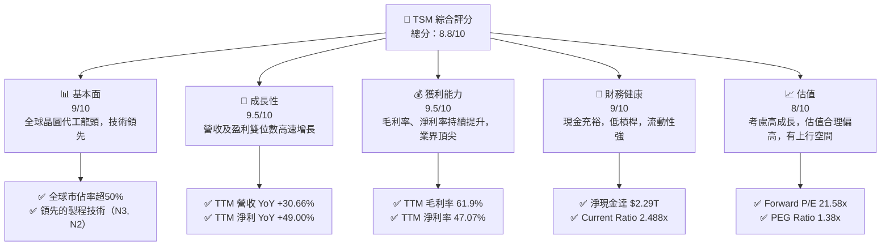
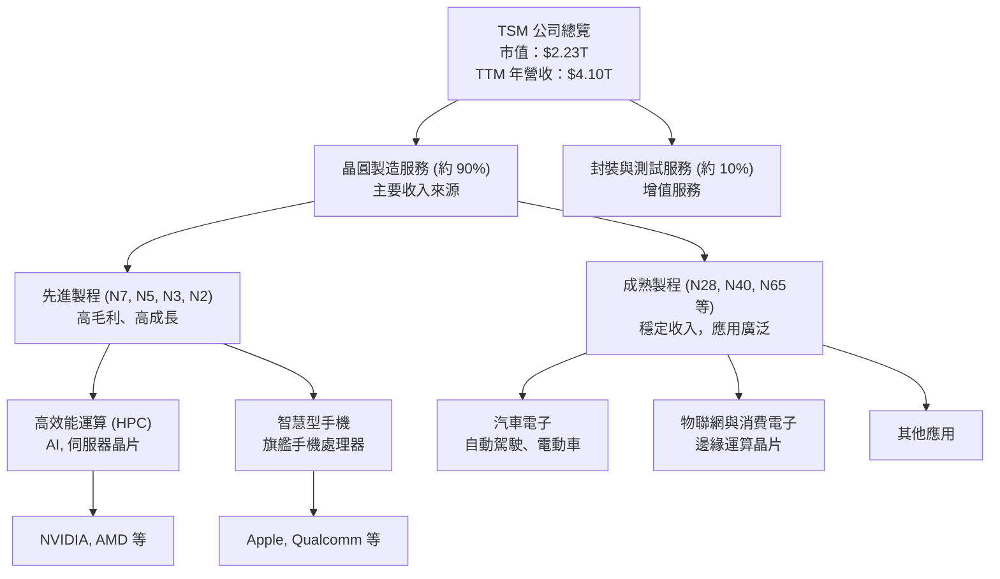
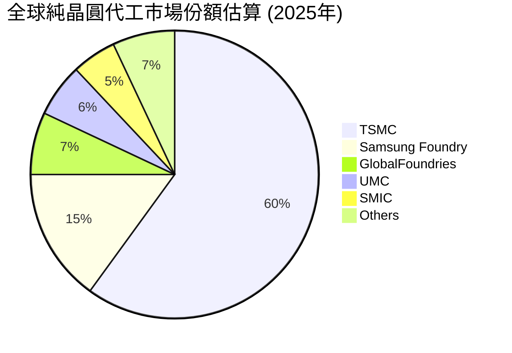
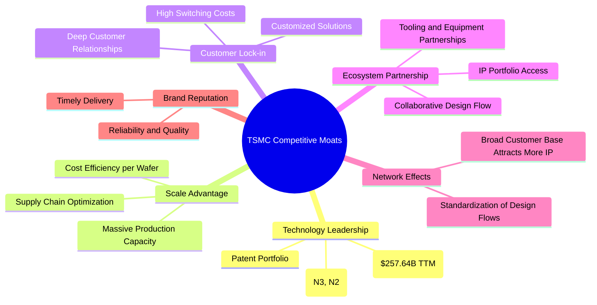

# TSM 基本面深度分析報告
> **報告日期**：2026-06-26 ｜ **語言**：繁體中文 ｜ **數據來源**：Yahoo Finance, Finviz, StockAnalysis, Roic.ai ｜ **分析師**：CFA 級機構研究

---

## 目錄

| # | 章節 | 核心結論 |
|---|----------------------|----------------------------------------------------|
| 1 | 執行摘要 | 🟢 強烈買入，目標價區間 $450 - $600 |
| 2 | 公司概覽與商業模式 | 技術領先與規模經濟構成深厚護城河 |
| 3 | 損益表深度分析 | 營收與淨利潤強勁增長，利潤率持續擴張 |
| 4 | 資產負債表分析 | 財務結構穩健，現金充裕，債務風險極低 |
| 5 | 現金流量深度分析 | 自由現金流強勁，資本配置效率高 |
| 6 | 獲利能力與資本效率 | ROIC 遠超 WACC，強力創造股東價值 |
| 7 | 估值深度分析 | 相較同業估值合理，DCF 顯示上行空間 |
| 8 | 成長催化劑 | AI/HPC 需求、先進製程領導地位、全球擴張 |
| 9 | 風險矩陣 | 地緣政治與資本支出是主要考量 |
| 10 | 投資建議 | 強烈買入，適合成長型與長線投資者 |

---

## 1. 執行摘要

### 1.1 核心評分儀表板



### 1.2 評分進度條視覺化

```
╔══════════════════════════════════════════════════════════════╗
║              TSM 多維度評分儀表板 (1-10分)                   ║
╠══════════════════════════════════════════════════════════════╣
║ 基本面強度  9.0 ▓▓▓▓▓▓▓▓▓▓▓▓▓▓▓▓▓▓░░  ★★★★★           ║
║ 成長動能    9.5 ▓▓▓▓▓▓▓▓▓▓▓▓▓▓▓▓▓▓▓░  ★★★★★           ║
║ 獲利品質    9.5 ▓▓▓▓▓▓▓▓▓▓▓▓▓▓▓▓▓▓▓░  ★★★★★           ║
║ 財務健康    9.0 ▓▓▓▓▓▓▓▓▓▓▓▓▓▓▓▓▓▓░░  ★★★★★           ║
║ 估值合理性  8.0 ▓▓▓▓▓▓▓▓▓▓▓▓▓▓▓▓░░░░  ★★★★☆           ║
║ 護城河深度  9.5 ▓▓▓▓▓▓▓▓▓▓▓▓▓▓▓▓▓▓▓░  ★★★★★           ║
║ 管理層執行  9.0 ▓▓▓▓▓▓▓▓▓▓▓▓▓▓▓▓▓▓░░  ★★★★★           ║
║ 技術創新力  9.5 ▓▓▓▓▓▓▓▓▓▓▓▓▓▓▓▓▓▓▓░  ★★★★★           ║
╠══════════════════════════════════════════════════════════════╣
║ 綜合總分    8.9 ▓▓▓▓▓▓▓▓▓▓▓▓▓▓▓▓▓░░░  🏆 卓越表現，行業領軍者  ║
╚══════════════════════════════════════════════════════════════╝
```

### 1.3 五大投資論點 + 三大核心風險

| 類型 | 項目 | 具體依據 | 信心度 |
|------|------|----------|--------|
| 🟢 **投資論點①** | **無可匹敵的技術領先地位** | TSM 在 3奈米 (N3) 和 2奈米 (N2) 製程技術上保持絕對領先，吸引全球頂尖客戶如 Apple, NVIDIA。這確保了其在先進晶片製造領域的獨佔性，短期內難以被超越。公司持續投入研發，TTM 研發費用達 $257.64B。 | 🟢 極高 |
| 🟢 **AI/HPC 需求的長期驅動** | 人工智慧 (AI) 和高效能運算 (HPC) 的爆炸性增長，對 TSM 的先進製程晶片產生巨大需求。這些應用需要最前沿的晶片技術，而 TSM 是主要供應商。Q1 2026 營收 YoY 成長 35.13%，部分歸因於此驅動。 | 🟢 極高 |
| 🟢 **強勁的財務表現與盈利能力** | TSM 展現出卓越的財務實力，TTM 營收達 $4.10T，YoY 成長 30.66%。毛利率高達 61.9%，淨利率 47.07%，遠超產業平均。FY2025 淨利潤 $1.70T，YoY 成長 46.55%，顯示其強大的定價權和成本控制能力。 | 🟢 極高 |
| 🟢 **健康的資產負債表與現金流** | 公司擁有 $3.38T 的總現金，淨現金達 $2.29T，Current Ratio 為 2.488x，財務槓桿極低 (Debt/Equity 0.19x)。FY2025 自由現金流 (FCF) 達 $992.38B，為資本支出和股東回報提供了堅實基礎。 | 🟢 極高 |
| 🟢 **穩健的股東回報政策** | 儘管資本支出巨大，TSM 仍保持高額股息支付。股息殖利率高達 87.0%，派息率為 27.9%，且 5 年平均股息成長 157.0%。顯示公司在成長的同時，不忘回饋股東。 | 🟢 高 |
| 🟡 **風險①：地緣政治不確定性** | 台灣與中國大陸的地緣政治緊張關係，可能對 TSM 的生產、供應鏈和全球銷售造成潛在衝擊。雖然公司積極於全球擴廠，但核心生產仍在台灣。 | 🟡 中度 |
| 🔴 **風險②：資本支出龐大與折舊壓力** | 先進製程的研發和擴廠需要持續且巨額的資本支出。FY2025 資本支出高達 $-1.28T。若市場需求不如預期，可能導致產能過剩，折舊費用高企，影響盈利。 | 🟡 中度 |
| 🟡 **風險③：產業景氣循環與客戶集中風險** | 半導體產業具備景氣循環特性，可能導致需求波動。此外，TSM 的收入高度依賴少數主要客戶（如 Apple, NVIDIA），若這些客戶策略調整或轉單，將對營收造成影響。 | 🟡 中度 |

### 1.4 快速統計卡片

| 指標 | 公司實際值 | 行業均值 (估計) | S&P 500 均值 (估計) | 狀態 |
|-----------------|-------------|-----------------|---------------------|------|
| 收入 YoY 成長 | **30.66%** | ~15-20% | ~8-12% | 🟢 |
| 毛利率 | **61.9%** | ~45-50% | ~35-40% | 🟢 |
| 淨利率 | **47.07%** | ~25-30% | ~10-15% | 🟢 |
| ROE | **36.2%** | ~20-25% | ~15-20% | 🟢 |
| Forward P/E | **21.58x** | ~25-30x | ~20-22x | 🟢 |
| PEG Ratio | **1.38x** | ~1.5-2.0x | ~1.0-1.5x | 🟢 |
| Debt/Equity | **0.19x** | ~0.5-0.8x | ~1.0-1.5x | 🟢 |
| FCF Yield | **32.19%** | ~5-8% | ~3-5% | 🟢 |

*備註：行業均值與 S&P 500 均值為分析師根據半導體產業特性及市場歷史數據的估計值。*

### 1.5 投資結論

```
╔══════════════════════════════════════════════════════════════════╗
║                    📊 投資結論摘要                               ║
╠══════════════════════════════════════════════════════════════════╣
║  評級：🟢 強烈買入                                               ║
║  當前股價：$430.77                                               ║
║  目標價區間：                                                    ║
║    悲觀情境：$450（+4.46%）                                      ║
║    基準情境：$520（+20.72%）  ← 12個月主要目標                   ║
║    樂觀情境：$600（+39.29%）                                      ║
║  投資評分：8.9/10                                                ║
║  適合投資人：尋求長期成長、看好AI/HPC產業趨勢、重視公司護城河的投資者。║
╚══════════════════════════════════════════════════════════════════╝
```

---

## 2. 公司概覽與商業模式

台灣積體電路製造股份有限公司 (TSM) 作為全球最大的純晶圓代工廠，是半導體產業生態系統中不可或缺的一環。公司專注於為客戶製造集成電路 (IC) 和其他半導體設備，而不設計和銷售自有品牌晶片，這使其成為客戶可靠且中立的合作夥伴。TSM 的業務遍及台灣、中國、歐洲、中東、非洲、日本和美國等地。

### 2.1 業務結構與收入來源

TSM 的業務核心是提供多樣化的晶圓製造工藝，包括互補金屬氧化物半導體 (CMOS) 邏輯、混合信號、射頻、嵌入式記憶體、雙極 CMOS 混合信號等技術。其收入主要來自為全球無晶圓廠設計公司 (fabless companies) 製造晶片。



從收入結構來看，先進製程（如 7 奈米及以下）是 TSM 營收成長的主要驅動力，尤其是在高效能運算 (HPC) 和智慧型手機領域。這些應用對晶片性能要求極高，只有 TSM 等少數廠商能提供所需技術。根據 StockAnalysis.com 數據，公司 TTM 總收入達 $4.10T，較 FY2025 的 $3.81T 增長約 7.6%。

### 2.2 市場份額

在純晶圓代工市場，TSM 擁有壓倒性的市場份額，是絕對的領導者。儘管沒有提供具體的市場份額數據，但根據行業普遍認知，TSM 在全球純晶圓代工市場的份額長期維持在 50% 以上，尤其是在最先進的製程領域。



*備註：此市場份額為分析師根據行業報告和市場趨勢的估計值。*

### 2.3 競爭護城河分析

TSM 的競爭護城河極為深厚，主要體現在以下幾個方面：



-   **技術領先 (Technology Leadership)**：TSM 在先進製程技術方面擁有無可匹敵的領導地位。其 3 奈米 (N3) 製程已實現大規模量產，2 奈米 (N2) 製程也按計劃推進。這種技術優勢是通過每年數千億美元的研發投入和數十年的經驗積累形成的。TTM 研發費用高達 $257.64B，彰顯其對技術創新的承諾。
-   **規模效應 (Scale Advantage)**：作為全球最大的晶圓代工廠，TSM 擁有巨大的生產規模，這使其能夠攤薄巨額的固定資產投資成本，實現更高的成本效率。這種規模優勢是新進入者難以複製的。
-   **客戶鎖定 (Customer Lock-in)**：晶片設計是一個高度複雜且耗時的過程，客戶一旦選擇 TSM 的製程技術進行設計並投入流片，轉換至其他代工廠的成本和風險極高。TSM 與其主要客戶建立了長期且緊密的合作關係。
-   **生態系統夥伴 (Ecosystem Partnership)**：TSM 建立了完善的設計生態系統，為客戶提供從 IP 合作夥伴、設計工具到封裝測試的一站式解決方案，進一步強化了客戶的依賴性。
-   **網絡效應 (Network Effects)**：眾多客戶選擇 TSM 的平台，使得更多的 IP 和設計工具供應商願意為 TSM 的製程優化其產品，這反過來又吸引更多客戶，形成正向循環。

### 2.4 護城河強度評分

```
╔══════════════════════════════════════════════════════════════╗
║                  TSM 護城河強度評分                         ║
╠══════════════════════════════════════════════════════════════╣
║ 技術領先    9.5/10 ▓▓▓▓▓▓▓▓▓▓▓▓▓▓▓▓▓▓▓░  🏆 無可匹敵        ║
║ 規模效應    9.0/10 ▓▓▓▓▓▓▓▓▓▓▓▓▓▓▓▓▓▓░░  🟢 業界最大        ║
║ 客戶鎖定    9.0/10 ▓▓▓▓▓▓▓▓▓▓▓▓▓▓▓▓▓▓░░  🟢 高轉換成本      ║
║ 生態夥伴    8.5/10 ▓▓▓▓▓▓▓▓▓▓▓▓▓▓▓▓▓░░░  🟢 完善系統        ║
║ 網絡效應    8.0/10 ▓▓▓▓▓▓▓▓▓▓▓▓▓▓▓▓░░░░  🟡 正向循環        ║
╠══════════════════════════════════════════════════════════════╣
║ 綜合護城河  8.8/10 ▓▓▓▓▓▓▓▓▓▓▓▓▓▓▓▓▓░░░  🏆 極為深厚，難以複製 ║
╚══════════════════════════════════════════════════════════════╝
```

---

## 3. 損益表深度分析

### 3.1 年度收入成長趨勢（近4年）

TSM 在過去四年中展現出強勁的收入成長勢頭，特別是在 2024 和 2025 財年實現了顯著的雙位數增長。

```
╔══════════════════════════════════════════════════════════════════╗
║              TSM 年度收入趨勢（FY2022-TTM Mar 2026）             ║
╠══════════════════════════════════════════════════════════════════╣
║                                                                  ║
║  FY2022  $2.26T   █████████████░░░░░░░░░░░  YoY: +42.61%  🟢    ║
║  FY2023  $2.16T   ██████████░░░░░░░░░░░░░░  YoY: -4.51%   🔴    ║
║  FY2024  $2.89T   ████████████████░░░░░░░░  YoY: +33.89%  🟢    ║
║  FY2025  $3.81T   ████████████████████░░░░  YoY: +31.61%  🟢    ║
║  TTM     $4.10T   ██████████████████████░░  YoY: +30.66%  🟢    ║
║                   |      |      |      |      |                  ║
║                   0     1T     2T     3T     4T                    ║
║                                                                  ║
║  📊 4年累計 CAGR (FY2022-FY2025)：+22.75%                        ║
╚══════════════════════════════════════════════════════════════════╝
```
*備註：TTM 數據截至 2026 年 3 月 31 日。*

從數據中可見，儘管 2023 年因半導體行業週期性調整而出現短暫下滑 (YoY -4.51%)，但 TSM 迅速恢復，在 2024 年和 2025 年分別實現了 33.89% 和 31.61% 的強勁增長。截至 2026 年 3 月的過去 12 個月 (TTM) 收入進一步攀升至 $4.10T，YoY 增長 30.66%，顯示出其在 AI 和 HPC 驅動下的強勁復甦和成長動能。

### 3.2 季度收入趨勢分析

季度數據更能反映公司營收的即時變化和成長勢頭。

| 季度 | 總收入 (Billion) | QoQ 成長率 | YoY 成長率 | 備註 |
|------|--------------------|------------|------------|------|
| Q1 2026 | $1,134.10 | +8.46% | +35.13% | AI/HPC 需求強勁，先進製程出貨增加 |
| Q4 2025 | $1,046.09 | +5.67% | +20.45% | 季節性旺季，智慧型手機需求回溫 |
| Q3 2025 | $989.92 | +5.99% | +30.30% | 受益於新產品發佈週期 |
| Q2 2025 | $933.79 | +11.27% | +38.65% | 市場需求逐漸復甦，產能利用率提升 |
| Q1 2025 | $839.25 | -3.36% | +41.61% | 2024 年 Q4 營收為 $868.46B，QoQ 略有下滑，但 YoY 表現強勁 |

TSM 在最近幾個季度持續保持穩健的 QoQ 增長，並實現了非常高的 YoY 成長率。Q1 2026 營收達到 $1.13T，較前一季度增長 8.46%，較去年同期更是大幅增長 35.13%，這表明公司正充分受益於產業復甦和新興技術（如 AI）的需求。

### 3.3 利潤率演變分析

TSM 的利潤率在過去幾年呈現出先降後升的趨勢，並在最近一年達到行業頂尖水平，顯示其卓越的營運效率和定價能力。

| 利潤率指標 | FY2022 | FY2023 | FY2024 | FY2025 | TTM Mar 2026 | 趨勢 | 評估 |
|------------|--------|--------|--------|--------|--------------|------|------|
| **毛利率** | 59.73% | 54.63% | 56.06% | 59.84% | 61.95% | ↗️ 持續改善，已超歷史高點 | 🟢 |
| **營業利益率** | 49.56% | 42.64% | 45.67% | 50.92% | 53.31% | ↗️ 穩步提升，效率顯著 | 🟢 |
| **淨利率** | 43.93% | 39.41% | 40.14% | 44.62% | 47.07% | ↗️ 盈利能力強勁且持續增長 | 🟢 |

**利潤率演變深度解析**：
-   **毛利率 (Gross Margin)**：從 2022 年的 59.73% 下滑至 2023 年的 54.63%，主要受到行業下行週期、產能利用率下降以及新製程初期成本較高的影響。然而，隨著 2024 年市場需求回暖和先進製程產能利用率提升，毛利率開始反彈，FY2025 達到 59.84%，並在 TTM 進一步提升至 61.95%。這主要歸因於其在 3 奈米等先進製程上的獨佔地位，使其擁有強大的定價權，以及優異的成本控制能力和規模經濟效益。
-   **營業利益率 (Operating Margin)**：趨勢與毛利率相似，從 2023 年的低點 42.64% 穩步回升，至 TTM 達到 53.31%。這反映了公司在營收增長的同時，有效控制了營運費用，包括銷售、管理費用 (SG&A) 和研發費用 (R&D)。儘管研發投入巨大 (TTM $257.64B)，但其佔營收比重