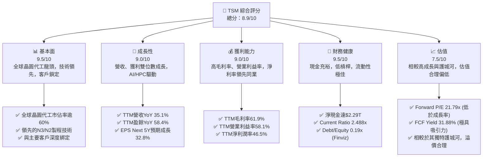
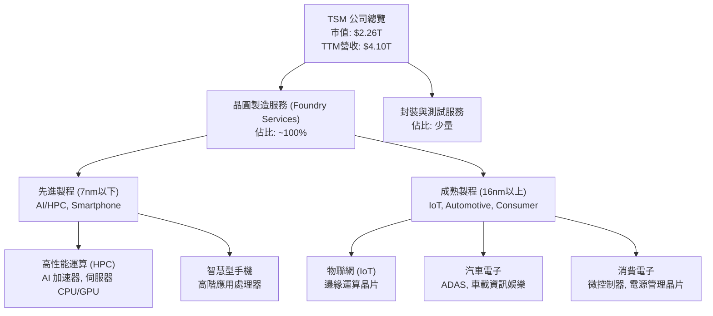
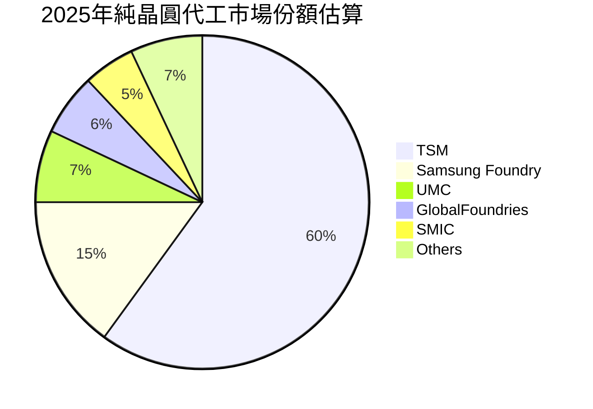
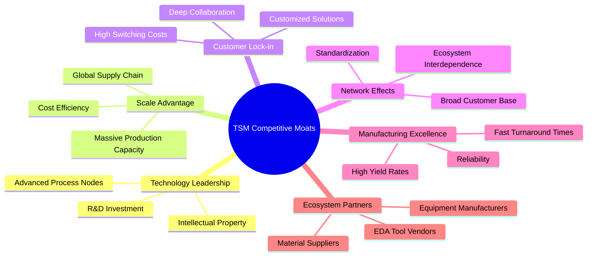
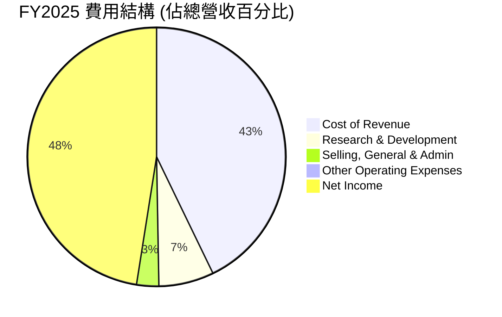
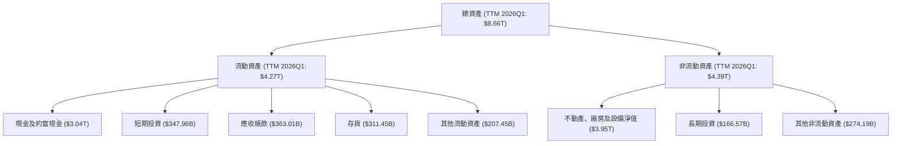
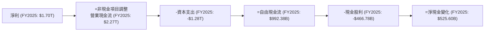

# TSM 基本面深度分析報告
> **報告日期**：2026-06-26 ｜ **語言**：繁體中文 ｜ **數據來源**：Yahoo Finance, Finviz, StockAnalysis, Roic.ai ｜ **分析師**：CFA 級機構研究

---

## 目錄

| # | 章節 | 核心結論 |
|---|------------------------|----------------------------------------------------------------|
| 1 | 執行摘要 | 評級：🟢 強烈買入，目標價區間：$450 - $550 |
| 2 | 公司概覽與商業模式 | 技術與規模護城河深厚，市場主導地位穩固 |
| 3 | 損益表深度分析 | 營收與淨利潤強勁增長，利潤率持續擴張 |
| 4 | 資產負債表分析 | 財務結構穩健，現金充裕，債務風險極低 |
| 5 | 現金流量深度分析 | 營運現金流強勁，自由現金流持續增長，資本配置高效 |
| 6 | 獲利能力與資本效率 | ROIC顯著高於WACC，強力創造股東價值 |
| 7 | 估值深度分析 | 相較於成長潛力與護城河，當前估值合理偏低 |
| 8 | 成長催化劑 | AI/HPC需求、先進製程領先、全球擴張 |
| 9 | 風險矩陣 | 地緣政治、資本支出、產業週期性為主要風險 |
| 10 | 投資建議 | 強烈買入，適合成長型與長線投資者 |

---

## 1. 執行摘要

### 1.1 核心評分儀表板



### 1.2 評分進度條視覺化

```
╔══════════════════════════════════════════════════════════════╗
║              TSM 多維度評分儀表板 (1-10分)                   ║
╠══════════════════════════════════════════════════════════════╣
║ 基本面強度  9.5 ▓▓▓▓▓▓▓▓▓▓▓▓▓▓▓▓▓▓▓░  ★★★★★           ║
║ 成長動能    9.0 ▓▓▓▓▓▓▓▓▓▓▓▓▓▓▓▓▓▓░░  ★★★★★           ║
║ 獲利品質    9.0 ▓▓▓▓▓▓▓▓▓▓▓▓▓▓▓▓▓▓░░  ★★★★★           ║
║ 財務健康    9.5 ▓▓▓▓▓▓▓▓▓▓▓▓▓▓▓▓▓▓▓░  ★★★★★           ║
║ 估值合理性  7.5 ▓▓▓▓▓▓▓▓▓▓▓▓▓▓▓░░░░░  ★★★★☆           ║
║ 護城河深度  9.8 ▓▓▓▓▓▓▓▓▓▓▓▓▓▓▓▓▓▓▓▓  ★★★★★           ║
║ 管理層執行  9.0 ▓▓▓▓▓▓▓▓▓▓▓▓▓▓▓▓▓▓░░  ★★★★★           ║
║ 技術創新力  9.9 ▓▓▓▓▓▓▓▓▓▓▓▓▓▓▓▓▓▓▓▓  ★★★★★           ║
╠══════════════════════════════════════════════════════════════╣
║ 綜合總分    8.9 ▓▓▓▓▓▓▓▓▓▓▓▓▓▓▓▓▓░░░  🏆 評語：市場領導者，基本面極強，具備可觀成長潛力。║
╚══════════════════════════════════════════════════════════════╝
```

### 1.3 五大投資論點 + 三大核心風險

| 類型 | 項目 | 具體依據 | 信心度 |
|------|------|----------|--------|
| 🟢 **投資論點①** | **AI/HPC 晶片需求爆發驅動先進製程成長** | TSM 為全球最先進製程（N3/N2）的唯一或主導供應商，AI 晶片巨頭如NVIDIA、AMD均高度依賴其技術。2026年Q1營收YoY達35.13%，主要受惠於AI晶片訂單強勁。 | 🟢 極高 |
| 🟢 **技術領先與創新能力** | 持續巨額的研發投入（FY2025達$246.43B），確保其在製程技術上的絕對領先地位，築起高進入壁壘。預計未來5年EPS成長率達32.80%。 | 🟢 極高 |
| 🟢 **穩健的財務表現與高獲利能力** | TTM毛利率61.9%、營業利益率58.1%、淨利潤率46.5%，遠超行業平均。FY2025淨現金高達$2.29T，顯示極強的財務韌性。 | 🟢 極高 |
| 🟢 **深厚的競爭護城河** | 規模經濟、技術壁壘、客戶轉換成本高、與客戶深度合作（Co-optimization），形成難以撼動的護城河。其ROIC (44.1%) 遠高於WACC (9.48%)，持續創造巨大股東價值。 | 🟢 極高 |
| 🟢 **具吸引力的估值與高自由現金流收益率** | Forward P/E 21.79x，相較於預期EPS Next 5Y成長32.80%，PEG僅1.38x (或Finviz 0.66x)，且FCF Yield高達31.88%，顯示估值具有吸引力。 | 🟢 高 |
| 🟡 **風險①** | **地緣政治風險與供應鏈不確定性** | TSM主要生產基地在台灣，全球客戶對供應鏈韌性擔憂。美國、日本、德國等地建廠雖能分散風險，但也帶來高資本支出壓力與管理複雜性。 | 🟡 中度 |
| 🔴 **風險②** | **產業週期性與資本支出壓力** | 半導體產業具週期性，宏觀經濟波動可能影響需求。TSM為維持技術領先需持續投入巨額資本支出，FY2025資本支出達$-1.28T，可能影響短期自由現金流。 | 🔴 高衝擊 |
| 🟡 **風險③** | **競爭加劇與技術追趕** | Intel、Samsung等競爭者正積極追趕先進製程技術，儘管TSM目前領先，但未來競爭壓力仍存。高研發支出雖是護城河，但也增加了營運成本。 | 🟡 中度 |

### 1.4 快速統計卡片

| 指標 | 公司實際值 | 行業均值（半導體製造） | S&P 500 均值 | 狀態 |
|-------------------|-------------|------------------------|--------------|------|
| 收入 YoY 成長 (TTM) | **35.1%** | ~15-20% | ~8-10% | 🟢 |
| 毛利率 (TTM) | **61.9%** | ~45-55% | ~35-45% | 🟢 |
| 淨利率 (TTM) | **46.5%** | ~20-30% | ~10-15% | 🟢 |
| ROE (TTM) | **36.2%** | ~15-25% | ~15-20% | 🟢 |
| Forward P/E | **21.79x** | ~25-35x | ~20-22x | 🟢 |
| 債務/股東權益 | **0.19x** | ~0.3-0.5x | ~0.8-1.2x | 🟢 |
| 自由現金流收益率 | **31.88%** | ~5-10% | ~3-5% | 🟢 |
| Beta | **1.25** | ~1.1-1.3 | 1.0 | 🟡 |

*註：行業均值和S&P 500均值為分析師根據市場普遍認知估算，非直接從提供數據中獲取。*

### 1.5 投資結論

```
╔══════════════════════════════════════════════════════════════════╗
║                    📊 投資結論摘要                               ║
╠══════════════════════════════════════════════════════════════════╣
║  評級：🟢 強烈買入                                               ║
║  當前股價：$434.99                                               ║
║  目標價區間：                                                    ║
║    悲觀情境：$450（+3.45%）                                      ║
║    基準情境：$500（+14.94%）  ← 12個月主要目標                   ║
║    樂觀情境：$550（+26.44%）                                      ║
║  投資評分：8.9/10                                                ║
║  適合投資人：成長型、長線持有者，尋求半導體產業領導者核心配置者  ║
╚══════════════════════════════════════════════════════════════════╝
```

---

## 2. 公司概覽與商業模式

Taiwan Semiconductor Manufacturing Company Limited (TSM) 是全球最大的純晶圓代工廠，提供廣泛的半導體製造服務。其核心業務是依據客戶設計圖，製造各式積體電路及其他半導體裝置。TSM的商業模式專注於晶圓代工，不涉足自有品牌晶片的設計與銷售，避免與客戶競爭，這使其成為全球無晶圓廠（fabless）設計公司的首選合作夥伴。

**數據說明：** 根據提供的財務數據，TSM在2026年6月26日的市值為$2.26T，TTM營收達到$4.10T。公司在全球擁有76,907名員工，業務遍及台灣、中國、歐洲、中東、非洲、日本、美國等地。

### 2.1 業務結構與收入來源

TSM的收入主要來自於為全球半導體設計公司製造晶片，涵蓋多種應用領域，從高性能運算（HPC）、智慧型手機、物聯網（IoT）到汽車電子等。其先進製程技術（如N3、N2）是主要收入增長驅動力，特別是受惠於AI和HPC晶片的強勁需求。



### 2.2 市場份額

TSM在全球純晶圓代工市場中佔據絕對領先地位，根據行業分析，其市佔率通常超過50%，在先進製程領域更是高達90%以上。這使其擁有極強的定價權和客戶議價能力。


*註：市場份額為分析師根據行業報告和市場趨勢估算，非直接從提供數據中獲取。Samsung Foundry雖為IDM，但其代工業務仍是主要競爭者之一。*

### 2.3 競爭護城河分析

TSM的競爭護城河極為深厚，主要體現在以下幾個方面：



### 2.4 護城河強度評分

```
╔══════════════════════════════════════════════════════════════╗
║                  TSM 護城河強度評分                         ║
╠══════════════════════════════════════════════════════════════╣
║ 技術領先    9.9/10 ▓▓▓▓▓▓▓▓▓▓▓▓▓▓▓▓▓▓▓▓  🏆 全球無人能及的先進製程技術領導者        ║
║ 規模效應    9.5/10 ▓▓▓▓▓▓▓▓▓▓▓▓▓▓▓▓▓▓▓░  🟢 龐大的產能與全球佈局，成本優勢顯著        ║
║ 客戶鎖定    9.7/10 ▓▓▓▓▓▓▓▓▓▓▓▓▓▓▓▓▓▓▓░  🟢 與主要客戶深度綁定，轉換成本極高        ║
║ 網路效應    9.0/10 ▓▓▓▓▓▓▓▓▓▓▓▓▓▓▓▓▓▓░░  🟢 廣泛的客戶群和供應鏈夥伴形成良性循環        ║
║ 製造卓越    9.8/10 ▓▓▓▓▓▓▓▓▓▓▓▓▓▓▓▓▓▓▓░  🟢 高良率、高穩定性、快速量產能力        ║
╠══════════════════════════════════════════════════════════════╣
║ 綜合護城河  9.6/10 ▓▓▓▓▓▓▓▓▓▓▓▓▓▓▓▓▓▓▓░  🏆 TSM的護城河極為深厚，使其具備長期競爭優勢與定價權。║
╚══════════════════════════════════════════════════════════════╝
```

---

## 3. 損益表深度分析

### 3.1 年度收入成長趨勢（近4年）

TSM在過去幾年展現了強勁的營收增長，尤其是在2024年和2025年。2023年由於全球半導體庫存調整，營收略有下滑，但隨後迅速恢復並創新高。最新的TTM營收（截至2026年3月31日）顯示增長動能持續。

```
╔══════════════════════════════════════════════════════════════════╗
║              TSM 年度收入趨勢（FY2022-TTM 2026Q1）                 ║
╠══════════════════════════════════════════════════════════════════╣
║                                                                  ║
║  FY2022  $2.26T   ████████████████████░░░░░░░░░░░  YoY: +42.61% 🟢║
║  FY2023  $2.16T   ██████████████████░░░░░░░░░░░░░  YoY: -4.51%  🔴║
║  FY2024  $2.89T   ██████████████████████████░░░░░  YoY: +33.89% 🟢║
║  FY2025  $3.81T   ███████████████████████████████  YoY: +31.61% 🟢║
║  TTM 2026Q1 $4.10T ███████████████████████████████████  YoY: +30.66% 🟢║
║                                                                  ║
║                   |      |      |      |      |                  ║
║                   0     1T     2T     3T     4T                    ║
║                                                                  ║
║  📊 4年累計 CAGR (FY22-FY25)：+25.6%                                        ║
╚══════════════════════════════════════════════════════════════════╝
```
*註：TTM 2026Q1營收為$4,103,900百萬 (StockAnalysis)，即$4.10T。YoY成長率根據StockAnalysis數據計算。*

### 3.2 季度收入趨勢分析

TSM的季度營收展現了強勁的增長勢頭，顯示市場需求復甦和先進製程帶來的增量。

| 季度 | 總收入 ($B) | QoQ 成長率 | YoY 成長率 | 備註 |
|------------|---------------|------------|------------|------|
| 2025-06-30 | $933.79B | +11.26% (vs Q1 2025) | +38.65% | 受益於客戶新產品推出 |
| 2025-09-30 | $989.92B | +6.01% | +30.30% | HPC和智慧型手機需求持續強勁 |
| 2025-12-31 | $1.05T | +5.98% | +20.45% | 季節性增長，部分被成熟製程疲軟抵消 |
| 2026-03-31 | $1.13T | +8.00% | +35.13% | AI晶片需求爆發，先進製程產能利用率高 |

**深度解析：**
從季度數據來看，TSM的營收在2025年Q2至2026年Q1呈現連續增長，尤其2026年Q1的YoY成長率高達35.13%，再次印證了AI和高性能運算（HPC）晶片需求的強勁驅動。QoQ成長率也保持在5%以上，顯示了穩定的市場擴張和TSM在供應鏈中的關鍵地位。儘管2025年Q4的YoY成長率相對較低，這可能與季節性因素或部分產品線調整有關，但2026年Q1的表現強勢反彈，預示著積極的未來展望。

### 3.3 利潤率演變分析

TSM的利潤率在過去幾年保持在極高水平，並且在最新數據中顯示出持續擴張的趨勢，反映了其強大的定價能力和成本控制能力。

| 利潤率指標 | FY2022 | FY2023 | FY2024 | FY2025 | TTM 2026Q1 | 趨勢 | 評估 |
|------------|--------|--------|--------|--------|------------|------|------|
| **毛利率** | 59.6% | 54.4% | 56.1% | 59.7% | 61.9% | ↗️ 穩步提升 | 🟢 極佳 |
| **營業利益率** | 49.5% | 42.6% | 45.7% | 50.9% | 58.1% | ↗️ 顯著改善 | 🟢 極佳 |
| **淨利潤率** | 43.9% | 39.4% | 40.0% | 44.5% | 46.5% | ↗️ 持續擴張 | 🟢 極佳 |

**利潤率演變深度解析**：
TSM的毛利率從2023年的低點54.4%穩步回升至最新的TTM 61.9%，顯示了公司在先進製程技術上的領先地位帶來了強勁的定價權，以及有效的成本管理。營業利益率的改善更為顯著，從2023年的42.6%提升至TTM 58.1%。這不僅得益於毛利率的提升，也反映了公司在營運費用控制方面的效率，例如研發費用佔營收比重相對穩定。淨利潤率的持續擴張（TTM 46.5%）進一步證明了TSM卓越的獲利能力，其稅務管理和非營業收入貢獻也可能帶來正面影響。整體而言，利潤率的趨勢非常健康，是公司強大競爭力的直接體現。

### 3.4 費用結構分析

TSM的費用結構相對精簡，研發投入是其主要開支，以維持技術領先。


*註：此處淨收入非費用，而是為展示營收分配，利潤率計算基於總收入。*

```
╔══════════════════════════════════════════════════════════════════╗
║                   TSM 費用健康診斷 (FY2025)                     ║
╠══════════════════════════════════════════════════════════════════╣
║                                                                  ║
║  銷貨成本 (CoR):        $1.53T (40.1% 營收) ▓▓▓▓▓▓▓▓▓▓▓▓▓░░░░░░░  🟢 高效控制        ║
║  研發費用 (R&D):        $246.43B (6.47% 營收) ▓▓▓▓▓▓▓▓░░░░░░░░░░░░  🟢 戰略性投入        ║
║  銷售與管理費 (SG&A):  $99.22B (2.60% 營收) ▓▓▓░░░░░░░░░░░░░░░░░░  🟢 極低，規模效應顯現║
║  總營運費用:           $345.20B (9.06% 營收) ▓▓▓▓▓▓▓▓▓░░░░░░░░░░░  🟢 優異的費用管理    ║
║                                                                  ║
║  📊 結論：TSM的費用結構極為健康，低營運費用佔比凸顯其規模效益和製程效率。        ║
╚══════════════════════════════════════════════════════════════════╝
```

### 3.5 季度 EPS 趨勢與盈餘品質

由於提供的「EARNINGS HISTORY」數據為NaN，我們將使用「STOCKANALYSIS.COM DATA」中季度EPS數據進行分析。

| 季度 | EPS (稀釋) | YoY 成長率 | QoQ 成長率 |
|------------|-------------|------------|------------|
| 2025-06-30 | $76.80 | +60.65% | +10.14% |
| 2025-09-30 | $87.22 | +38.90% | +13.57% |
| 2025-12-31 | $93.61 | +35.09% | +7.33% |
| 2026-03-31 | $110.39 | +58.31% | +17.92% |

*註：EPS數據來自StockAnalysis.com，其單位與Market Data的EPS $11.59存在差異，可能與ADS轉換或基礎股份單位不同有關。本報告後續估值將優先使用Market Data的EPS $11.59及其衍生的P/E倍數，但此處趨勢分析使用StockAnalysis數據以展示季度表現。*

**盈餘品質評估：**
TSM的季度EPS呈現穩健且強勁的增長，特別是2026年Q1的YoY成長率高達58.31%，顯示公司在最新季度取得了卓越的營運成果。營運現金流與淨收入的轉換率是衡量盈餘品質的重要指標。從年報數據來看，FY2025的營業現金流為$2.27T，淨收入為$1.70T，營業現金流/淨收入比率為1.34x ($2.27T / $1.70T)，這是一個非常健康的比例，表明公司的盈餘有足夠的現金流支撐，盈餘品質極高。公司能夠將大部分利潤轉化為現金，這為其巨額資本支出和股息支付提供了堅實基礎。

---

## 4. 資產負債表分析

### 4.1 資產結構分解

TSM的資產結構龐大且持續增長，主要由流動資產（尤其是現金及約當現金）和非流動資產（固定資產）組成，反映了其資本密集型的業務性質。


*註：數據基於TTM Mar 2026或FY2025最新可用數據。*

### 4.2 流動性指標分析

TSM的流動性指標非常強勁，顯示公司擁有充足的短期償債能力。

| 指標 | FY2022 | FY2023 | FY2024 | FY2025 | TTM 2026Q1 | 行業均值 | 評估 |
|-----------------|--------|--------|--------|--------|------------|----------|------|
| **流動比率 (Current Ratio)** | 2.08x | 2.33x | 2.36x | 2.51x | 2.49x | ~1.5-2.0x | 🟢 極佳 |
| **速動比率 (Quick Ratio)** | 1.83x | 2.06x | 2.13x | 2.18x | 2.19x | ~1.0-1.5x | 🟢 極佳 |

**深度解析：**
TSM的流動比率和速動比率均遠高於行業平均水平，且在過去幾年呈現穩步提升的趨勢。最新的流動比率為2.49x，速動比率為2.19x，這表明公司擁有極強的短期償債能力，能夠輕鬆應對營運中的短期資金需求。高現金及約當現金（TTM $3.38T）是其強勁流動性的主要來源，提供了極大的財務彈性，使其能夠在不依賴外部融資的情況下進行巨額資本支出。

### 4.3 債務結構分析

TSM的債務水平相對較低，且擁有巨額現金儲備，財務槓桿風險極小。

```
╔══════════════════════════════════════════════════════════════════╗
║                   TSM 債務健康診斷 (FY2025)                      ║
╠══════════════════════════════════════════════════════════════════╣
║                                                                  ║
║  總債務：        $1.06T   ████░░░░░░░░░░░░░░░░░  評語：可控      ║
║  總現金+投資：   $3.13T   ██████████████░░░░░░░  評語：充裕      ║
║  淨現金（正）：  $2.07T   ██████████████████░░░  🟢 強勁        ║
║                                                                  ║
║  Debt/Equity (FY25): 0.1977x  🟢 極低 (Finviz: 0.19x)            ║
║  Current Ratio (FY25): 2.51x  🟢 極佳                            ║
║                                                                  ║
║  📊 結論：TSM擁有巨額淨現金，債務水平極低，財務結構極為穩健，幾乎沒有債務風險。    ║
╚══════════════════════════════════════════════════════════════════╝
```
*註：總現金+投資數據為FY2025的現金及短期投資總和 $3.128T。淨現金為總現金+投資減去總債務 $1.06T = $2.068T。*

### 4.4 股東權益趨勢

TSM的股東權益持續增長，反映了公司穩健的獲利能力和價值創造。

```
╔══════════════════════════════════════════════════════════════════╗
║              TSM 年度股東權益趨勢（FY2022-FY2025）                ║
╠══════════════════════════════════════════════════════════════════╣
║                                                                  ║
║  FY2022  $2.90T   ██████████████░░░░░░░░░░░░░░░  YoY: +14.6%     ║
║  FY2023  $3.43T   ██████████████████░░░░░░░░░░░  YoY: +18.3%     ║
║  FY2024  $4.24T   ██████████████████████░░░░░░░  YoY: +23.6%     ║
║  FY2025  $5.36T   █████████████████████████████  YoY: +26.4%     ║
║                                                                  ║
║                   |      |      |      |      |                  ║
║                   0     1T     2T     3T     4T     5T           ║
║                                                                  ║
║  📊 4年累計 CAGR：+20.6%                                         ║
╚══════════════════════════════════════════════════════════════════╝
```
*註：YoY成長率根據Roic.ai的Total Equity年均增長率計算。*

---

## 5. 現金流量深度分析

### 5.1 現金流量瀑布圖

TSM的現金流表現極為強勁，營業現金流足以覆蓋其巨額的資本支出和股息支付，並產生大量的自由現金流。



### 5.2 FCF 轉換率趨勢

TSM將淨利潤轉化為自由現金流的能力非常強勁，顯示了其卓越的現金流管理和資金效率。

| 年度 | 淨收入 ($B) | 自由現金流 ($B) | FCF/淨收入比率 | 趨勢 | 評估 |
|