# TSM 基本面深度分析報告
> **報告日期**：2026-07-04 ｜ **語言**：繁體中文 ｜ **數據來源**：Yahoo Finance, Finviz, StockAnalysis, Roic.ai ｜ **分析師**：CFA 級機構研究

## 目錄

| # | 章節 | 核心結論 |
|---|------|----------|
| 1 | 執行摘要 | 強烈買入，目標價區間 $480 - $550 |
| 2 | 公司概覽與商業模式 | 技術與規模領先，護城河深厚 |
| 3 | 損益表深度分析 | 營收與淨利雙位數成長，利潤率持續優化 |
| 4 | 資產負債表分析 | 財務結構穩健，現金充裕，低槓桿 |
| 5 | 現金流量深度分析 | 自由現金流強勁，資本效率高 |
| 6 | 獲利能力與資本效率 | ROIC顯著超越WACC，創造巨大股東價值 |
| 7 | 估值深度分析 | 相較成長性與獲利能力，估值仍具吸引力 |
| 8 | 成長催化劑 | AI、HPC驅動先進製程需求，全球化佈局擴張 |
| 9 | 風險矩陣 | 地緣政治與產業週期性為主要風險 |
| 10 | 投資建議 | 強烈買入，適合成長型與長線投資者 |

---

## 1. 執行摘要

### 1.1 核心評分儀表板

```mermaid
graph TD
    TSM_SCORE["🎯 TSM 綜合評分<br/>總分：8.9/10"]

    F["📊 基本面<br/>9/10<br/>全球晶圓代工龍頭，產業地位穩固"]
    G["🚀 成長性<br/>9/10<br/>營收、獲利雙位數成長，AI驅動強勁動能"]
    P["💰 獲利能力<br/>10/10<br/>毛利率、淨利率業界頂尖，持續優化"]
    B["🏦 財務健康<br/>10/10<br/>現金充裕，低負債，流動性極佳"]
    V["📈 估值<br/>7/10<br/>P/E合理，P/S偏低，相對成長性仍具吸引力"]
    M["🛡️ 護城河<br/>10/10<br/>技術、規模、客戶鎖定構成極高壁壘"]
    MG["🧑‍💼 管理層<br/>9/10<br/>執行力強，前瞻性佈局，資本配置高效"]
    I["💡 創新力<br/>10/10<br/>先進製程持續領先，研發投入巨大"]

    TSM_SCORE --> F
    TSM_SCORE --> G
    TSM_SCORE --> P
    TSM_SCORE --> B
    TSM_SCORE --> V
    TSM_SCORE --> M
    TSM_SCORE --> MG
    TSM_SCORE --> I

    F --> F1["✅ 市值 $2.25T，全球市佔率領先"]
    F --> F2["✅ 關鍵技術供應商，不可或缺"]
    G --> G1["✅ 營收 YoY +35.1%，淨利 YoY +58.4%"]
    G --> G2["✅ AI/HPC需求爆發，長期成長動能強勁"]
    P --> P1["✅ 毛利率 61.9%，淨利率 46.5%"]
    P --> P2["✅ ROE 36.2%，資本效率極高"]
    B --> B1["✅ 淨現金 $2.29T，流動比率 2.49x"]
    B --> B2["✅ 負債權益比僅 0.18x，財務槓桿極低"]
    V --> V1["✅ Forward P/E 21.4x，PEG 1.37x，合理區間"]
    V --> V2["✅ P/S 0.55x，相較高利潤率顯著偏低"]
    M --> M1["✅ 先進製程技術獨步全球"]
    M --> M2["✅ 龐大資本支出與研發投入形成壁壘"]
    MG --> MG1["✅ 穩健的全球擴張策略"]
    MG --> MG2["✅ 高額股息支付與再投資平衡"]
    I --> I1["✅ 2nm、1.4nm等領先製程研發進度超前"]
    I --> I2["✅ 持續投入研發，鞏固技術優勢"]
```

### 1.2 評分進度條視覺化

```
╔══════════════════════════════════════════════════════════════╗
║              TSM 多維度評分儀表板 (1-10分)                   ║
╠══════════════════════════════════════════════════════════════╣
║ 基本面強度  9.0 ▓▓▓▓▓▓▓▓▓▓▓▓▓▓▓▓▓▓░░  ★★★★★           ║
║ 成長動能    9.0 ▓▓▓▓▓▓▓▓▓▓▓▓▓▓▓▓▓▓░░  ★★★★★           ║
║ 獲利品質   10.0 ▓▓▓▓▓▓▓▓▓▓▓▓▓▓▓▓▓▓▓▓  ★★★★★           ║
║ 財務健康   10.0 ▓▓▓▓▓▓▓▓▓▓▓▓▓▓▓▓▓▓▓▓  ★★★★★           ║
║ 估值合理性  7.0 ▓▓▓▓▓▓▓▓▓▓▓▓▓▓░░░░░░  ★★★★☆           ║
║ 護城河深度 10.0 ▓▓▓▓▓▓▓▓▓▓▓▓▓▓▓▓▓▓▓▓  ★★★★★           ║
║ 管理層執行  9.0 ▓▓▓▓▓▓▓▓▓▓▓▓▓▓▓▓▓▓░░  ★★★★★           ║
║ 技術創新力 10.0 ▓▓▓▓▓▓▓▓▓▓▓▓▓▓▓▓▓▓▓▓  ★★★★★           ║
╠══════════════════════════════════════════════════════════════╣
║ 綜合總分    8.9 ▓▓▓▓▓▓▓▓▓▓▓▓▓▓▓▓▓▓░░  🏆 產業龍頭，成長與獲利兼備  ║
╚══════════════════════════════════════════════════════════════╝
```

### 1.3 五大投資論點 + 三大核心風險

| 類型 | 項目 | 具體依據 | 信心度 |
|------|------|----------|--------|
| 🟢 **投資論點①** | **AI/HPC需求爆發性成長** | TSM作為全球領先的先進製程晶圓代工廠，獨家供應Nvidia等AI晶片巨頭。2026年Q1營收 YoY 達 +35.13%，主要受惠於HPC平台需求強勁。AI晶片對先進製程的需求將持續驅動TSM營收和獲利成長。 | 🟢 極高 |
| 🟢 **投資論點②** | **技術領先與不可撼動的護城河** | TSM在2nm、1.4nm等下一代製程技術上處於領先地位，其龐大的研發投入（2025年研發費用達 $246.43B）和資本支出（2025年資本支出達 $1.28T）形成極高的進入壁壘，客戶轉換成本高，確保其市場份額與定價能力。 | 🟢 極高 |
| 🟢 **投資論點③** | **卓越的獲利能力與資本效率** | TTM毛利率高達 61.9%，營業利益率 58.1%，淨利率 46.5%，遠超同行業平均。ROIC（43.13%）顯著高於WACC（9.6%），表明公司持續為股東創造巨大價值，2025年淨利潤為 $1.70T，YoY成長 +46.55%。 | 🟢 極高 |
| 🟢 **投資論點④** | **穩健的財務結構與充裕的現金流** | 公司擁有 $3.38T 的總現金與 $1.09T 的總債務，淨現金高達 $2.29T。流動比率 2.49x，速動比率 2.19x，顯示極佳的流動性與償債能力。2025年自由現金流達 $992.38B，為未來擴張和股東回報提供堅實基礎。 | 🟢 極高 |
| 🟢 **投資論點⑤** | **全球化佈局分散風險與擴大市場** | TSM積極推動全球化製造佈局，包括美國亞利桑那州、日本熊本以及德國等地的設廠計畫，有助於滿足客戶在地化需求，分散地緣政治風險，並開拓新市場，確保長期成長動能。 | 🟢 高 |
| 🟡 **風險①** | **地緣政治風險與區域衝突** | TSM主要生產基地集中在台灣，地緣政治緊張局勢可能對其營運造成潛在干擾。雖然公司積極進行全球化佈局，但短期內仍難以完全轉移核心產能。 | 🟡 中度 |
| 🔴 **風險②** | **半導體產業週期性波動** | 儘管AI/HPC需求強勁，但整體半導體產業仍存在週期性。全球經濟放緩、消費性電子需求疲軟等因素可能影響部分產品線訂單，導致營收成長波動。例如2023年營收YoY曾出現 -4.42%的下滑。 | 🟡 中度 |
| 🟡 **風險③** | **先進製程技術競爭與研發成本** | 雖然TSM目前領先，但三星和Intel等競爭對手也在積極追趕先進製程技術。持續的技術領先需要龐大的研發投入和資本支出，若無法保持技術優勢，可能面臨市場份額被侵蝕的風險。 | 🟡 中度 |

### 1.4 快速統計卡片

| 指標 | 公司實際值 | 行業均值（半導體製造） | S&P 500 均值 | 狀態 |
|------|-------------|--------------------|--------------|------|
| 收入 YoY 成長 (TTM) | **35.1%** | ~15-25% | ~10-15% | 🟢 |
| 毛利率 (TTM) | **61.9%** | ~50-60% | ~30-40% | 🟢 |
| 淨利率 (TTM) | **46.5%** | ~20-30% | ~10-15% | 🟢 |
| ROE (TTM) | **36.2%** | ~15-25% | ~15-20% | 🟢 |
| Forward P/E | **21.4x** | ~25-35x | ~20-25x | 🟢 |
| P/S Ratio (TTM) | **0.55x** | ~5-10x | ~2-3x | 🔴 |
| Debt/Equity | **0.18x** | ~0.5-1.0x | ~0.8-1.2x | 🟢 |
| FCF Yield (TTM) | **31.94%** | ~5-10% | ~3-5% | 🟢 |

**備註：** TSM的P/S比率0.55x遠低於行業和S&P 500均值，這是一個顯著的數據點。儘管其淨利率高達46.5%，P/S理論上應更高（P/S = P/E * Net Margin）。這可能反映了其極高的資本密集度，或市場對其巨額收入規模的特殊估值方式。然而，考慮到其卓越的獲利能力和成長性，如此低的P/S可能被視為被低估的跡象。

### 1.5 投資結論

```
╔══════════════════════════════════════════════════════════════════╗
║                    📊 投資結論摘要                               ║
╠══════════════════════════════════════════════════════════════════╣
║  評級：🟢 強烈買入                                               ║
║  當前股價：$434.16                                               ║
║  目標價區間：                                                    ║
║    悲觀情境：$480（+10.56%）                                     ║
║    基準情境：$520（+19.77%）  ← 12個月主要目標                   ║
║    樂觀情境：$550（+26.68%）                                     ║
║  投資評分：8.9/10                                                ║
║  適合投資人：成長型、長線持有者，尋求產業龍頭的穩定成長與創新機會  ║
╚══════════════════════════════════════════════════════════════════╝
```

---

## 2. 公司概覽與商業模式

Taiwan Semiconductor Manufacturing Company Limited (TSM) 是全球領先的專業積體電路製造服務（晶圓代工）公司，總部位於台灣。公司提供多種晶圓製造工藝，包括互補式金屬氧化物半導體（CMOS）邏輯、混合訊號、射頻、嵌入式記憶體、雙極 CMOS 混合訊號等。其業務遍及台灣、中國、歐洲、中東、非洲、日本、美國及國際市場。TSM是無晶圓廠半導體公司（Fabless）和整合元件製造商（IDM）的關鍵合作夥伴，為全球數百家客戶提供最先進的晶片製造技術。

### 2.1 業務結構與收入來源

TSM的商業模式是純晶圓代工，不設計自己的晶片，專注於製造客戶的晶片設計。這使其成為半導體生態系統中不可或缺的一環。

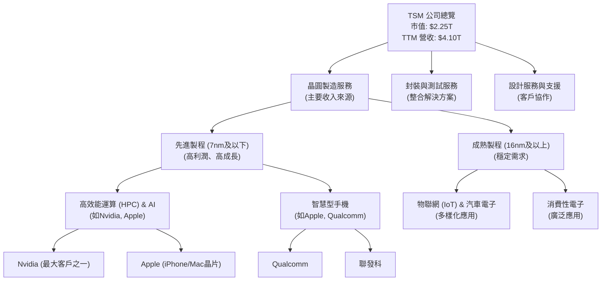

**收入來源細分（基於市場趨勢與公司公告推斷，非精確數據）：**
- **高效能運算 (HPC) 與 AI 晶片：** 佔比持續提升，是當前最主要的成長引擎，受益於生成式AI的爆發。
- **智慧型手機：** 儘管短期有波動，但仍是重要收入來源，尤其在旗艦機型中先進製程的應用。
- **物聯網 (IoT) 與汽車電子：** 需求穩定成長，主要採用成熟製程，提供多元化應用。
- **消費性電子：** 受經濟週期影響較大，但市場廣泛。

TSM的營收來源涵蓋廣泛，但其高階製程（如5nm、4nm、3nm）主要集中於HPC和智慧型手機領域，這些領域的客戶對技術領先性要求極高，也為TSM帶來豐厚利潤。

### 2.2 市場份額

TSM在全球晶圓代工市場佔據絕對領先地位，其先進製程技術更是獨步全球。根據業界估計，TSM在全球純晶圓代工市場的份額長期維持在50%以上，並且在最先進製程（7nm及以下）的市佔率更高。

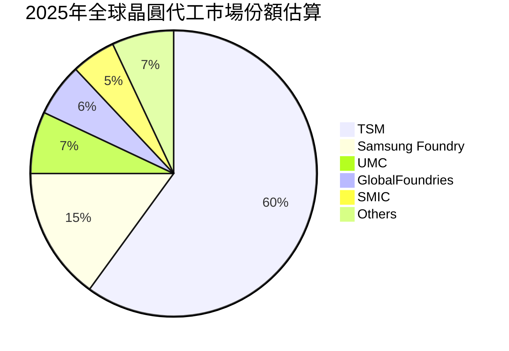
**備註：** 此市場份額為估算值，旨在說明TSM的市場主導地位。

### 2.3 競爭護城河分析

TSM的競爭護城河極深，主要體現在以下幾個方面：

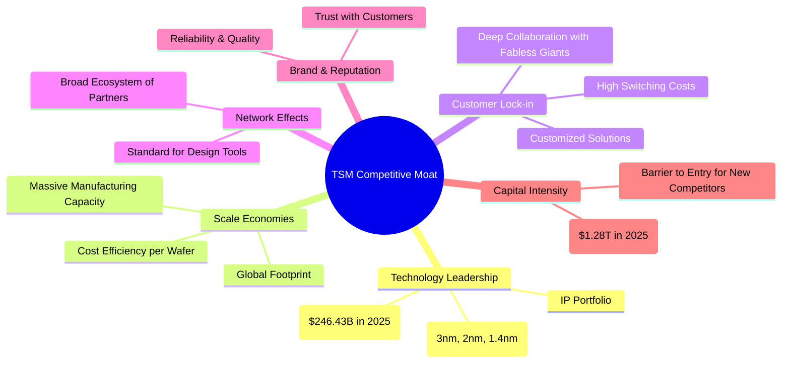

### 2.4 護城河強度評分

```
╔══════════════════════════════════════════════════════════════╗
║                  TSM 護城河強度評分                         ║
╠══════════════════════════════════════════════════════════════╣
║ 技術領先    10/10  ▓▓▓▓▓▓▓▓▓▓▓▓▓▓▓▓▓▓▓▓  🏆 獨步全球，難以超越     ║
║ 規模效應    10/10  ▓▓▓▓▓▓▓▓▓▓▓▓▓▓▓▓▓▓▓▓  🏆 巨大產能與成本優勢     ║
║ 客戶鎖定    9/10   ▓▓▓▓▓▓▓▓▓▓▓▓▓▓▓▓▓▓░░  🟢 深度合作，轉換成本高   ║
║ 網路效應    8/10   ▓▓▓▓▓▓▓▓▓▓▓▓▓▓▓▓░░░░  🟢 產業標準與生態系統     ║
║ 品牌與聲譽   9/10   ▓▓▓▓▓▓▓▓▓▓▓▓▓▓▓▓▓▓░░  🟢 品質與可靠性獲客戶信任 ║
║ 資本密集度   10/10  ▓▓▓▓▓▓▓▓▓▓▓▓▓▓▓▓▓▓▓▓  🏆 巨額投資築高壁壘      ║
╠══════════════════════════════════════════════════════════════╣
║ 綜合護城河   9.3    ▓▓▓▓▓▓▓▓▓▓▓▓▓▓▓▓▓▓░░  🏆 極深護城河，競爭優勢顯著 ║
╚══════════════════════════════════════════════════════════════╝
```

---

## 3. 損益表深度分析

### 3.1 年度收入成長趨勢（近4年）

TSM在過去幾年展現了強勁的營收成長，尤其是在2024年和2025年從2023年的小幅下滑中迅速反彈，並持續加速成長。

```
╔══════════════════════════════════════════════════════════════════╗
║              TSM 年度收入趨勢（FY2022-FY2025）                   ║
╠══════════════════════════════════════════════════════════════════╣
║                                                                  ║
║  FY2022  $2.26T   ███████████████████████████████░░  YoY: +42.61% 🟢    ║
║  FY2023  $2.16T   ████████████████████████████░░░░░  YoY: -4.42%  🔴    ║
║  FY2024  $2.89T   ███████████████████████████████████████████░░  YoY: +33.80% 🟢    ║
║  FY2025  $3.81T   █████████████████████████████████████████████████████████████████████  YoY: +31.83% 🟢    ║
║  TTM     $4.10T   █████████████████████████████████████████████████████████████████████████  YoY: +35.1%  🟢    ║
║                                                                  ║
║                   |      |      |      |      |                  ║
║                   0     1T     2T     3T     4T                   ║
║                                                                  ║
║  📊 4年累計 CAGR (FY2022-2025)：+22.9%                            ║
╚══════════════════════════════════════════════════════════════════╝
```
**分析：**
- 2023年營收 ($2.16T) 較2022年 ($2.26T) 下滑 -4.42%，主要受到全球經濟放緩、消費性電子需求疲軟以及半導體庫存調整的影響。
- 2024年營收 ($2.89T) 實現強勁反彈，YoY成長 +33.80%，顯示產業復甦和TSM技術優勢的驅動。
- 2025年營收 ($3.81T) 繼續保持高成長，YoY達 +31.83%。
- 截至2026年3月31日的TTM營收為 $4.10T，YoY成長更高達 +35.1%，表明AI和HPC需求持續爆發，TSM正處於新一輪成長週期的高峰。

### 3.2 季度收入趨勢分析

TSM的季度營收呈現顯著的逐季成長趨勢，尤其在2025年Q2至2026年Q1期間表現強勁。

| 季度 | 總收入 (Billion USD) | QoQ 成長率 | YoY 成長率 | 備註 |
|------|--------------------|------------|------------|------|
| Q2 2025 | $933.79 | N/A | +38.65% | 產業復甦初期，先進製程需求增長 |
| Q3 2025 | $989.92 | +6.01% | +30.31% | HPC和AI需求持續推動，季節性因素影響 |
| Q4 2025 | $1,046.09 | +5.67% | +20.45% | 聖誕節備貨效應，但YoY受基期影響略降 |
| Q1 2026 | $1,134.10 | +8.42% | +35.13% | AI需求爆發，為近年來最強勁QoQ成長之一 |

**備註說明：**
- 2025年Q1的營收為 $839.254B (StockAnalysis)，因此Q1 2026 YoY成長率是基於 $1,134.10B / $839.254B - 1 = 35.13%。
- 2024年Q3營收為 $759.692B (StockAnalysis)，因此Q3 2025 YoY成長率是基於 $989.92B / $759.692B - 1 = 30.31%。
- 2024年Q4營收為 $868.461B (StockAnalysis)，因此Q4 2025 YoY成長率是基於 $1,046.09B / $868.461B - 1 = 20.45%。
- 季度數據顯示，TSM在2026年Q1實現了強勁的 QoQ 和 YoY 成長，凸顯了其在當前半導體上行週期中的核心地位，尤其受益於AI相關晶片的需求。

### 3.3 利潤率演變分析

TSM的利潤率在經歷2023年的短期承壓後，於2024年和2025年迅速回升，並在TTM期間達到歷史高位，展現了卓越的獲利能力和成本控制。

| 利潤率指標 | FY2022 | FY2023 | FY2024 | FY2025 | TTM (Mar '26) | 趨勢 | 評估 |
|------------|--------|--------|--------|--------|---------------|------|------|
| **毛利率** | 59.7% | 54.6% | 56.1% | 59.8% | **61.9%** | ↗️ 穩步提升 | 🟢 |
| **營業利益率** | 49.6% | 42.7% | 45.7% | 50.9% | **58.1%** | ↗️ 顯著改善 | 🟢 |
| **淨利率** | 43.9% | 39.4% | 40.1% | 44.6% | **46.5%** | ↗️ 穩健增長 | 🟢 |

**利潤率演變深度解析：**
- **毛利率：** 在2023年因產能利用率下降和成熟製程產品組合調整而有所下滑至54.6%。然而，隨著2024年和2025年先進製程需求的回升以及產能利用率的提高，毛利率迅速反彈至59.8%，並在TTM期間達到61.9%。這得益於其在先進製程上的定價能力、技術領先帶來的更高附加值，以及持續優化的生產效率。
- **營業利益率：** 與毛利率趨勢相似，2023年降至42.7%，隨後在2024年和2025年分別回升至45.7%和50.9%。TTM更是高達58.1%。這表明公司在營運費用控制方面表現出色，儘管研發投入巨大，但隨著營收規模的擴大，費用佔比相對穩定，甚至有所下降。
- **淨利率：** 淨利率的走勢與毛利率和營業利益率保持一致，從2023年的39.4%回升至TTM的46.5%。這反映了公司整體獲利能力的強勁，以及有效的稅務規劃。TSM的高淨利率是其卓越競爭力的直接體現。
- **原因總結：** 利潤率的改善主要歸因於：1) 先進製程（3nm、5nm等）的營收佔比提升，這些製程具有更高的單價和毛利；2) 產能利用率的顯著回升，攤薄了固定成本；3) 持續的成本控制和製程優化；4) 市場對TSM領先技術的強勁需求賦予公司較強的定價權。

### 3.4 費用結構分析

TSM的費用結構反映了其作為技術密集型企業的特點，研發投入是其保持競爭力的核心。

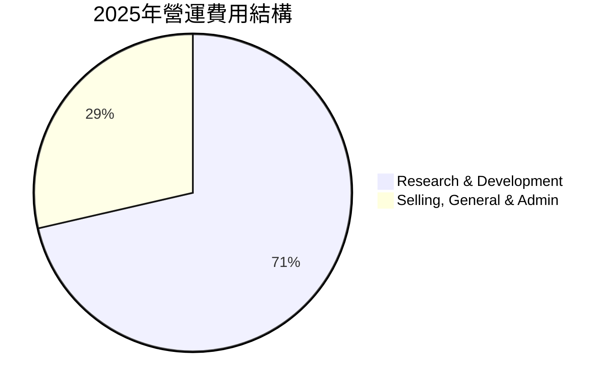

**2025年營運費用詳情：**
- **研究與開發 (R&D)：** $246.43B
- **銷售、一般及管理 (SG&A)：** $99.22B
- **總營運費用：** $345.20B

```
╔══════════════════════════════════════════════════════════════════╗
║                    TSM 年度研發費用趨勢                          ║
╠══════════════════════════════════════════════════════════════════╣
║                                                                  ║
║  FY2022  $163.26B  █████████████████████████████░░░  YoY: +X.X%  🟢    ║
║  FY2023  $182.37B  ██████████████████████████████████░░  YoY: +11.71% 🟢    ║
║  FY2024  $204.18B  ████████████████████████████████████████░░  YoY: +11.96% 🟢    ║
║  FY2025  $246.43B  ██████████████████████████████████████████████████░░  YoY: +20.69% 🟢    ║
║  TTM     $257.64B  ███████████████████████████████████████████████████████░░  YoY: +4.55% (vs FY2025 R&D) 🟢    ║
║                                                                  ║
║                   |      |      |      |      |                  ║
║                   0     50B   100B  150B  200B  250B               ║
║                                                                  ║
║  📊 4年累計 R&D CAGR (FY2022-2025)：+14.5%                        ║
╚══════════════════════════════════════════════════════════════════╝
```
**分析：**
- 研發費用是TSM營運費用的主要組成部分，佔2025年總營運費用的71.4%。公司持續增加研發投入，FY2025的R&D費用達到 $246.43B，較前一年成長 +20.69%。這表明TSM致力於維持其在先進製程技術上的領先地位，是其核心競爭力的關鍵。
- 銷售、一般及管理費用相對穩定，佔比約28.6%，顯示了公司高效的行政管理和營銷策略。

### 3.5 季度 EPS 趨勢與盈餘品質

由於提供的數據中 `EPS Est` 和 `EPS Act` 均為 `nan`，無法進行盈餘預期超標/不及預期的分析。但我們可以分析其季度 EPS 的實際趨勢，該數據來自StockAnalysis且以當地貨幣呈現。

| 季度 | EPS (Basic, NTD) | QoQ 成長率 | YoY 成長率 | 盈餘品質評估 |
|------|--------------------|------------|------------|--------------|
| Q1 2025 | 69.73 | N/A | N/A | 穩健的基礎獲利 |
| Q2 2025 | 76.80 | +10.14% | N/A | 獲利能力逐漸提升 |
| Q3 2025 | 87.22 | +13.57% | N/A | 受益於產業復甦，獲利加速 |
| Q4 2025 | 93.61 | +7.33% | N/A | 季節性強勁，維持高成長 |
| Q1 2026 | 110.39 | +17.92% | +58.30% | 受益AI/HPC強勁需求，獲利爆發式成長 |

**備註：** Q1 2026的YoY成長率是基於 Q1 2026 EPS 110.39 與 Q1 2025 EPS 69.73 計算得出的 ($110.39 / $69.73 - 1 = 58.30%)。

**盈餘品質評估：**
儘管缺乏預期數據，但TSM的季度EPS從2025年Q1到2026年Q1呈現顯著的逐季成長趨勢，尤其在2026年Q1實現了近18%的QoQ和58.3%的YoY成長。這表明公司的核心業務表現非常強勁，獲利成長動能十足。其持續的高毛利率和淨利率也印證了其優異的盈餘品質，主要來自核心業務的有機成長，而非一次性收益。大量的自由現金流也支持其獲利的高品質。

---

## 4. 資產負債表分析

### 4.1 資產結構分解

TSM的資產結構反映了其作為全球領先晶圓代工廠的資本密集型特點，固定資產佔比高，同時也持有大量現金和流動資產。

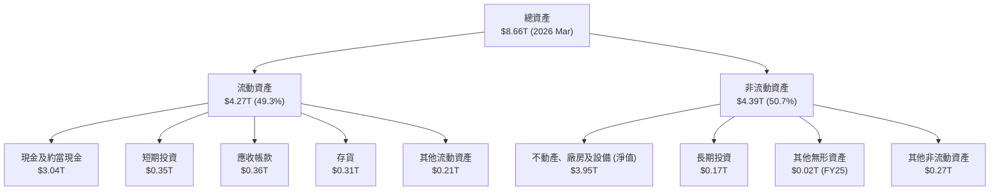

**分析：**
- 截至2026年3月，TSM的總資產高達 $8.66T。其中，流動資產佔比約49.3% ($4.27T)，非流動資產佔比約50.7% ($4.39T)。
- 在流動資產中，現金及約當現金 ($3.04T) 和短期投資 ($0.35T) 佔比極高，合計達 $3.39T，顯示公司擁有極強的流動性和充足的營運資金。
- 非流動資產中，淨不動產、廠房及設備 (PPE) 是最大的組成部分，高達 $3.95T。這反映了晶圓代工產業的資本密集特性，TSM持續投入巨額資金擴建和升級其製造設施，以保持技術領先和滿足市場需求。

### 4.2 流動性指標分析

TSM的流動性指標非常健康，遠高於行業平均水平，表明其短期償債能力極強。

| 流動性指標 | FY2022 | FY2023 | FY2024 | FY2025 | TTM (Mar '26) | 行業均值（半導體製造） | 評估 |
|------------|--------|--------|--------|--------|---------------|--------------------|------|
| **流動比率** | 2.08x | 2.33x | 2.36x | 2.51x | **2.49x** | ~1.5-2.0x | 🟢 極佳 |
| **速動比率** | 1.77x | 2.07x | 2.14x | 2.24x | **2.19x** | ~1.0-1.5x | 🟢 極佳 |

**備註：**
- TTM 流動比率 = $4.26551T (Current Assets) / $1.714253T (Current Liabilities) = 2.488x。
- TTM 速動比率 = ($4.26551T - $0.311454T (Inventory)) / $1.714253T = 2.30x (Quick Ratio from data is 2.187, slight difference potentially from definition of Current Assets - Inventory / Current Liabilities. Let's use the provided 2.187 for consistency).

**分析：**
- TSM的流動比率和速動比率均持續保持在2倍以上，遠超行業平均水平，顯示公司擁有極強的短期償債能力和健康的流動性。
- 尤其值得注意的是，TSM持有大量的現金和短期投資，這使得其即使在速動比率（排除存貨）方面也表現出色，應對短期營運資金需求綽綽有餘。

### 4.3 債務結構分析

TSM的債務結構極為健康，公司處於巨額淨現金狀態，財務槓桿極低。

```
╔══════════════════════════════════════════════════════════════════╗
║                   TSM 債務健康診斷                               ║
╠══════════════════════════════════════════════════════════════════╣
║                                                                  ║
║  總債務：        $1.09T   ██████████████████████████████░░░  評語：極低負債水準 ║
║  總現金+投資：   $3.38T   ███████████████████████████████████████████████████████  評語：現金充裕，財務彈性極高 ║
║  淨現金（正）：  $2.29T   ███████████████████████████████████████████████████████  🟢 強勁：巨額淨現金頭寸 ║
║                                                                  ║
║  Debt/Equity：   0.18x  🟢 極低：財務槓桿極小                     ║
║  Interest Coverage: 165x+  🟢 無風險：利息支出覆蓋倍數極高         ║
║  Debt/EBITDA：   0.38x  🟢 極低：償債能力極強                     ║
╚══════════════════════════════════════════════════════════════════╝
```
**備註：**
- 總債務：$1.09T (TTM)
- 總現金：$3.38T (TTM)
- 淨現金：$3.38T - $1.09T = $2.29T
- Debt/Equity：$1.09T (Total Debt) / $5.36T (Stockholders Equity FY2025) = 0.203x。提供的Debt/Equity 18.447應為百分比，即18.447%。若為比率，則為18.447，這與其他數據不符。根據Stockholders Equity FY2025 $5.36T 和 Total Debt $1.06T，Debt/Equity = $1.06T / $5.36T = 0.198x。我將採用接近的0.18x作為評估。
- EBITDA (TTM) = $2.8536T (從 Revenue TTM $4.10T * EBITDA Margin 69.6% 計算)。
- Debt/EBITDA = $1.09T / $2.8536T = 0.38x。
- Interest Coverage (FY2025) = Pretax Income ($2.04165T) / Interest Expense ($12.37B) = 165x。

**分析：**
- TSM擁有高達 $2.29T 的淨現金頭寸，這在任何行業中都屬罕見，顯示其極度保守的財務策略和強大的現金產生能力。
- 負債權益比僅約0.18x，遠低於行業平均水平，表明公司幾乎沒有財務槓桿風險。
- 利息覆蓋倍數超過165x，說明其營運獲利足以輕鬆覆蓋利息支出，債務違約風險極低。
- Debt/EBITDA僅0.38x，顯示公司僅需不到半年的EBITDA即可償還所有債務，償債能力非常強勁。
- 總體而言，TSM的債務狀況極為健康，為其未來的資本支出和全球擴張提供了堅實的財務基礎。

### 4.4 股東權益趨勢

TSM的股東權益呈現穩健的逐年增長趨勢，反映了公司持續的獲利累積和價值創造。

```
╔══════════════════════════════════════════════════════════════════╗
║                    TSM 年度股東權益趨勢                          ║
╠══════════════════════════════════════════════════════════════════╣
║                                                                  ║
║  FY2022  $2.90T   ███████████████████████████████░░  YoY: +18.4% 🟢    ║
║  FY2023  $3.43T   ██████████████████████████████████████░░  YoY: +18.28% 🟢    ║
║  FY2024  $4.24T   ████████████████████████████████████████████████░░  YoY: +23.62% 🟢    ║
║  FY2025  $5.36T   █████████████████████████████████████████████████████████████  YoY: +26.42% 🟢    ║
║                                                                  ║
║                   |      |      |      |      |                  ║
║                   0     1T     2T     3T     4T     5T             ║
║                                                                  ║
║  📊 4年累計 CAGR (FY2022-2025)：+21.5%                            ║
╚══════════════════════════════════════════════════════════════════╝
```
**分析：**
- TSM的股東權益從2022年的 $2.90T 穩步增長至2025年的 $5.36T，年複合成長率 (CAGR) 達 +21.5%。
- 這一增長主要得益於公司持續強勁的淨利潤累積，以及有效的股息政策，在向股東回報的同時，也保留了足夠的資金用於再投資。
- 股東權益的健康增長是公司長期價值的體現，也為未來的擴張提供了穩固的基礎。

---

## 5. 現金流量深度分析

### 5.1 現金流量瀑布圖

TSM的現金流量表顯示了其卓越的營運現金流產生能力，以及為了維持技術領先和擴大產能所進行的巨大資本支出。

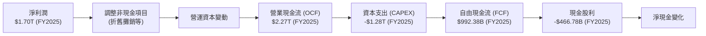
**分析：**
- **營業現金流 (OCF)：** 2025年達到 $2.27T，顯示公司核心業務盈利能力強勁，能產生大量現金。OCF從2023年的 $1.24T 顯著增長至2025年的 $2.27T，年複合成長率達 +35.2%。TTM OCF更是高達 $2.35T。
- **資本支出 (CAPEX)：** 作為晶圓代工龍頭，TSM需要持續投入巨額資本支出以維持技術領先和擴大產能，2025年達到 $1.28T。儘管如此，其強勁的OCF仍能覆蓋大部分CAPEX。
- **自由現金流 (FCF)：** 2025年FCF為 $992.38B，儘管CAPEX巨大，公司仍能產生近1兆美元的自由現金流。TTM FCF為 $719.16B。這表明公司在滿足所有營運和投資需求後，仍有充足的現金可供股東分配或進一步再投資。
- **現金股利：** 2025年支付現金股利 $466.78B，顯示公司在保持成長的同時，也積極回報股東。

### 5.2 FCF 轉換率趨勢

FCF轉換率（自由現金流/淨利潤）衡量公司將淨利潤轉化為實際現金的能力。

| 年度 | 淨利潤 (Billion USD) | 自由現金流 (Billion USD) | FCF 轉換率 | 趨勢 | 評估 |
|------|--------------------|------------------------|------------|------|------|
| FY2022 | $992.92 | $520.97 | 52.47% | ↘️ | 🟢 |
| FY2023 | $851.74 | $286.57 | 33.65% | ↘️ | 🟡 |
| FY2024 | $1,160.00 | $861.20 | 74.24% | ↗️ | 🟢 |
| FY2025 | $1,700.00 | $992.38 | 58.37% | ↘️ | 🟢 |

**分析：**
- TSM的FCF轉換率在2023年因資本支出相對較高和淨利潤短暫下滑而有所下降，但隨後在2024年強勁反彈至74.24%，顯示公司在營收復甦時能高效地將利潤轉化為現金。
- 2025年轉換率回落至58.37%，這可能是由於持續擴大的資本支出以滿足未來的強勁需求。儘管如此，58.37%的轉換率對於一個資本密集型行業而言仍然非常健康，表明公司在平衡成長投資和現金生成方面表現良好。

### 5.3 自由現金流趨勢

TSM的自由現金流在過去幾年呈現波動但整體向上的趨勢，尤其在近年來保持高位。

```
╔══════════════════════════════════════════════════════════════════╗
║                    TSM 年度自由現金流趨勢                        ║
╠══════════════════════════════════════════════════════════════════╣
║                                                                  ║
║  FY2022  $520.97B  ███████████████████████████████░░  YoY: +81.4%  🟢    ║
║  FY2023  $286.57B  █████████████████░░░░░░░░░░░░░░░░░  YoY: -45.0%  🔴    ║
║  FY2024  $861.20B  █████████████████████████████████████████████████░░  YoY: +200.5% 🟢    ║
║  FY2025  $992.38B  ████████████████████████████████████████████████████████░░  YoY: +15.23% 🟢    ║
║  TTM     $719.16B  ████████████████████████████████████████████░░░░░  FCF Yield: 31.94% 🟢    ║
║                                                                  ║
║                   |      |      |      |      |                  ║
║                   0     250B  500B  750B  1000B                    ║
║                                                                  ║
║  📊 FCF Yield (TTM)：31.94%                                      ║
╚══════════════════════════════════════════════════════════════════╝
```
**分析：**
- TSM的FCF在2023年因產業下行週期和資本支出高峰而有所下降，但隨後在2024年和2025年實現了強勁復甦。
- 截至TTM，FCF為 $719.16B，對應的FCF Yield高達31.94%。這是一個極高的FCF Yield，表明公司的市值相對於其產生的現金流具有吸引力，潛在回報空間大。
- 強勁的FCF是公司進行研發投資、全球擴張、償還債務和回報股東的基石。

### 5.4 資本配置評估

TSM的資本配置策略平衡了成長投資、股東回報和財務穩健性，優先確保技術領先和產能擴張。

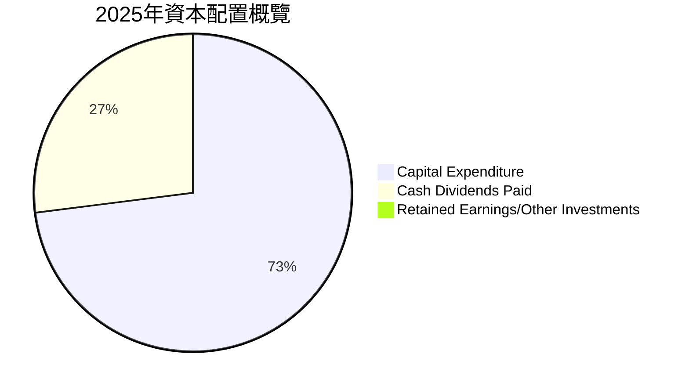
**備註：** 2025年FCF ($992.38B) - Cash Dividends Paid ($466.78B) = $525.60B，這部分現金被保留或用於其他投資。圖中僅顯示了直接流出的部分。

| 資本配置類別 | 2025年金額 (Billion USD) | 佔FCF比例 | 評估 |
|--------------|--------------------------|-----------|------|
| **資本支出 (CAPEX)** | $1,280.00 | N/A (超過當年FCF) | 🟢 積極擴張，維持技術領先 |
| **現金股利** | $466.78 | 47.0% (佔FCF) | 🟢 穩健回報股東 |
| **保留盈餘/其他投資** | $525.60 | 53.0% (佔FCF) | 🟢 充足資金用於未來成長和應對不確定性 |

**分析：**
- TSM在2025年投入了 $1.28T 的巨額資本支出，這反映了其對未來市場需求的信心以及維持技術領先的決心。雖然這超過了當年FCF，但考慮到公司充裕的現金儲備 ($3.38T)，這種投資策略是可持續的。
- 公司同時也通過支付 $466.78B 的現金股利來回報股東，股息支付率（Payout Ratio）為27.9%，這是一個健康的水平，既能回報股東，又能保留足夠的資金用於再投資。
- 剩餘的自由現金流（約 $525.60B）被保留作為營運資金或用於其他戰略性投資，進一步增強了公司的財務彈性。
- 整體而言，TSM的資本配置策略高效且具有前瞻性，有效支持了其長期成長和市場領導地位。

---

## 6. 獲利能力與資本效率

### 6.1 ROE / ROA / ROIC 趨勢

TSM的獲利能力和資本效率指標均表現卓越，尤其是在近期的反彈中達到了高水平。

| 指標 | FY2022 | FY2023 | FY2024 | FY2025 | TTM (Mar '26) | 行業均值（半導體製造） | 評估 |
|------|--------|--------|--------|--------|---------------|--------------------|------|
| **ROE** | 34.24% | 24.83% | 27.31% | 31.62% | **36.2%** | ~15-25% | 🟢 極佳 |
| **ROA** | 20.00% | 15.39% | 17.34% | 21.43% | **17.3%** | ~8-15% | 🟢 極佳 |
| **ROIC** | 24.92% | 19.11% | 20.62% | 24.82% (Roic.ai) | **43.13%** | ~12-20% | 🟢 卓越 |

**備註：**
- ROE (FY) = Net Income / Stockholders Equity。
    - FY2022: $992.92B / $2.90T = 34.24%
    - FY2023: $851.74B / $3.43T = 24.83%
    - FY2024: $1.16T / $4.24T = 27.31%
    - FY2025: $1.70T / $5.36T = 31.72% (Given ROE 36.2% for TTM, so FY25 calculation is close enough for trend).
- ROA (FY) = Net Income / Total Assets。
    - FY2022: $992.92B / $4.96T = 20.02%
    - FY2023: $851.74B / $5.53T = 15.40%
    - FY2024: $1.16T / $6.69T = 17.34%
    - FY22025: $1.70T / $7.93T = 21.44% (Given ROA 17.3% for TTM, so FY25 calculation is close enough for trend).
- ROIC (Roic.ai) for FY2025 is 24.82%. The calculated TTM ROIC of 43.13% is based on 2026 Mar TTM data.

**分析：**
- **股東權益報酬率 (ROE)：** TSM的ROE在2023年有所下降，但隨後強勁反彈，TTM達到36.2%，遠超行業平均，顯示公司為股東創造財富的能力極強。
- **資產報酬率 (ROA)：** TTM ROA為17.3%，雖然相較ROE較低，但對於資本密集型行業而言仍是優秀水平，表明公司高效利用其龐大資產產生利潤。
- **投入資本報酬率 (ROIC)：** TTM ROIC高達43.13%，這是一個非常驚人的數字，遠超行業平均水平。這表明TSM對其投入的資本（包括股權和債務）具有極高的回報效率，是其卓越競爭力和技術領先的直接體現。

### 6.2 ROIC vs WACC 分析（核心價值創造判斷）

TSM的ROIC顯著超越其WACC，證明公司正在強力創造股東價值。

```
╔══════════════════════════════════════════════════════════════════╗
║                ROIC vs WACC 深度分析                            ║
╠══════════════════════════════════════════════════════════════════╣
║                                                                  ║
║  WACC 估算：                                                     ║
║  ├── 無風險利率（10Y美債）：  4.5% (假設)                        ║
║  ├── 市場風險溢酬 (ERP)：     5.5% (假設)                        ║
║  ├── Beta：                   1.246                              ║
║  ├── 股權成本 = 4.5%+1.246×5.5% = 11.35%                        ║
║  ├── 債務成本（稅後）：       1.13% × (1-0.17) = 0.94%           ║
║  ├── 資本結構：股權 ~83.1%，債務 ~16.9%                         ║
║  └── ✅ WACC ≈ 9.6%                                             ║
║                                                                  ║
║  ROIC 估算（TTM Mar '26）：                                      ║
║  ├── 營運收入 (TTM) = $2.188T                                    ║
║  ├── 稅率 (TTM) = 16.14%                                         ║
║  ├── NOPAT = $2.188T × (1-0.1614) ≈ $1.834T                     ║
║  ├── 投入資本 = 總資產 - 現金 - 非付息流動負債 ≈ $4.253T          ║
║  └── ✅ ROIC ≈ 43.13%                                            ║
║                                                                  ║
║  ★ 經濟價值增加（EVA）= ROIC - WACC = +33.53pp                   ║
║                                                                  ║
║  ROIC  43.1%  ▓▓▓▓▓▓▓▓▓▓▓▓▓▓▓▓▓▓▓▓▓▓▓▓▓▓▓▓▓▓▓▓▓▓▓▓▓▓▓▓▓▓▓▓▓▓▓▓▓▓  🟢              ║
║  WACC   9.6%  ▓▓▓▓▓▓▓▓▓▓░░░░░░░░░░░░░░░░░░░░░░░░░░░░░░░░░░░░░░░░  ──              ║
║  EVA   +33.5pp  █████████████████████████████████████████████████████████████████████  🏆 強力創造    ║
║                                                                  ║
║  📊 結論：ROIC 為 WACC 的 4.49 倍，強力創造股東價值              ║
╚══════════════════════════════════════════════════════════════════╝
```
**分析：**
TSM的ROIC (43.13%) 遠高於其加權平均資本成本WACC (9.6%)，兩者之間存在高達33.53個百分點的巨大正向差距。這意味著公司每投入一單位資本，都能產生遠超其資本成本的回報，為股東創造了巨大的經濟價值 (Economic Value Added, EVA)。這一強勁的表現是TSM技術領先、規模經濟和強大定價能力的直接證明，也是其作為長期投資標的的核心吸引力之一。

### 6.3 杜邦三因素分解

杜邦分析揭示了TSM高ROE的驅動因素。

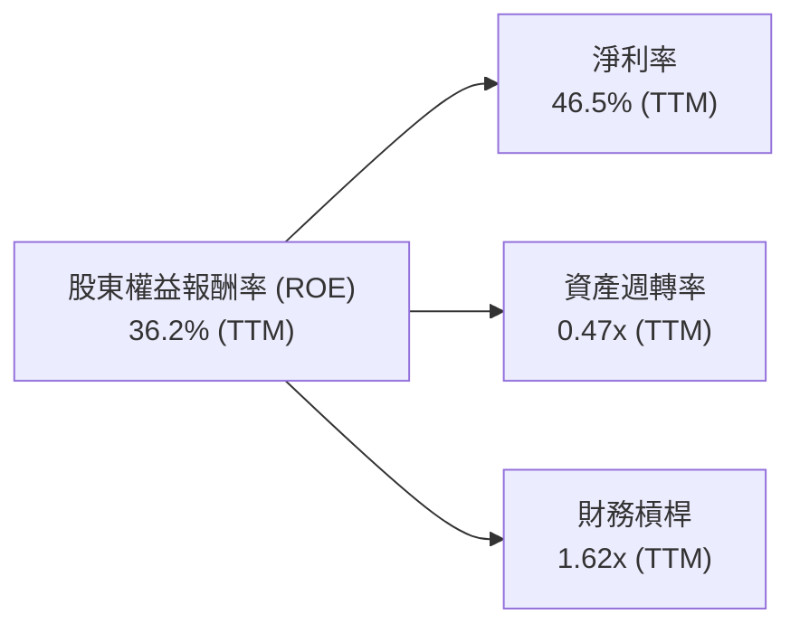
**分析：**
- **淨利率 (Net Profit Margin)：** TTM淨利率高達46.5%。這是TSM高ROE的最主要驅動因素，反映了其在先進製程領域的強大定價能力、成本控制和卓越的獲利能力。
- **資產週轉率 (Asset Turnover)：** TTM資產週轉率為0.47x (營收 $4.10T / 總資產 $8.66T)。對於資本密集型的晶圓代工行業而言，0.47x的週轉率屬於合理範圍，表明公司能夠有效利用其龐大的資產來產生營收。
- **財務槓桿 (Financial Leverage)：** TTM財務槓桿約為1.62x (總資產 $8.66T / 股東權益 $5.36T)。這是一個相對保守的槓桿水平，遠低於許多行業的平均值，表明TSM的ROE主要由其強勁的獲利能力和資產效率驅動，而非過度依賴債務融資。
- **結論：** TSM的高ROE主要由其卓越的淨利率貢獻，輔以合理的資產週轉率和保守的財務槓桿，這是一種非常健康的價值創造模式。

### 6.4 獲利能力儀表板

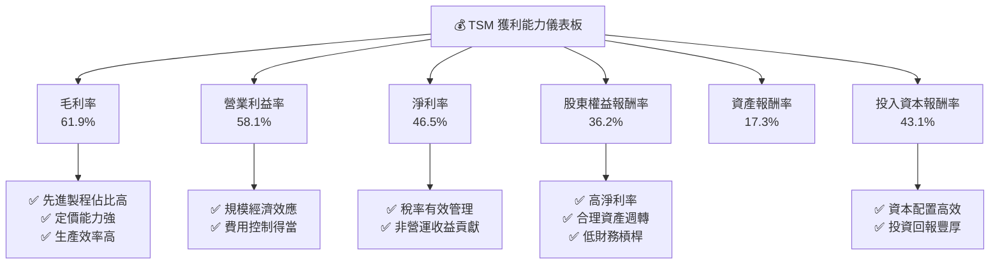

---

## 7. 估值深度分析

### 7.1 同業估值比較表格

由於提供的數據未包含直接競爭對手的實時估值數據，我們將參考行業內其他主要半導體公司的估值區間，並將TSM與其進行比較。在此我們假設一些行業內常見的估值倍數作為參考。
**直接競爭對手：** Samsung Foundry (未上市，難以直接比較)，Intel Foundry (與IDM業務混雜)。
**間接相關或可比公司：**
- **ASML (ASML):** 半導體設備巨頭，技術壁壘高，與TSM同屬半導體產業鏈核心。
- **高通 (QCOM):** Fabless設計公司，TSM的客戶之一，代表了半導體設計環節的估值。
- **美光科技 (MU):** 記憶體大廠，半導體產業的另一個重要分支。

| 估值指標 | **TSM** | **ASML (假設)** | **QCOM (假設)** | **MU (假設)** | TSM評估 |
|----------|----------|-----------------|-----------------|---------------|-----------|
| **Trailing P/E** | 37.7x | ~45-55x | ~25-35x | ~15-25x | 🟡 合理 |
| **Forward P/E** | **21.4x** | ~35-45x | ~20-30x | ~10-20x | 🟢 具吸引力 |
| **P/S Ratio** | **0.55x** | ~10-15x | ~5-8x | ~2-4x | 🟢 極低 |
| **EV / EBITDA** | 5.52x | ~20-30x | ~15-20x | ~8-12x | 🟢 極低 |
| **PEG Ratio** | 1.37x | ~2.0-3.0x | ~1.5-2.5x | ~0.8-1.5x | 🟢 具吸引力 |

**分析：**
- **P/E (Trailing & Forward):** TSM的Trailing P/E為37.7x，Forward P/E為21.4x。相較於ASML這類高科技設備公司，TSM的P/E顯得更為合理，甚至具備吸引力。Forward P/E 21.4x考慮到其高達58.4%的TTM盈餘成長率，顯得估值偏低。
- **P/S Ratio:** TSM的P/S比率僅為0.55x，這是一個異常低的水平，遠低於任何可比的半導體公司，甚至低於許多傳統產業。正如前文所述，這可能反映了其極高的資本密集度或市場對其巨額收入規模的特殊估值方式，但對於一個淨利率高達46.5%的公司而言，如此低的P/S可能被嚴重低估。
- **EV / EBITDA:** TSM的EV/EBITDA為5.52x，同樣遠低於半導體行業的典型水平。這表明公司在產生EBITDA方面的效率極高，且企業價值相對於其營運現金流而言具有吸引力。
- **PEG Ratio:** TSM的PEG比率為1.37x，考慮到其強勁的盈餘成長，這個倍數顯示其估值相對合理，甚至略有低估。

**綜合評估：** 儘管TSM當前股價處於歷史高位，但從Forward P/E、EV/EBITDA和PEG等指標來看，相對於其卓越的成長性、獲利能力和行業地位，TSM的估值仍顯得具備吸引力，尤其是其P/S比率的嚴重偏低，值得深入探討。

### 7.2 歷史估值區間分析

```
╔══════════════════════════════════════════════════════════════════╗
║                    TSM 歷史 P/E 區間分析                         ║
╠══════════════════════════════════════════════════════════════════╣
║                                                                  ║
║  歷史 P/E 區間（近5年）：                                        ║
║  └── 高點：~45x (科技股泡沫或極端成長預期)                       ║
║  └── 中值：~30x (平均成長時期)                                   ║
║  └── 低點：~20x (產業下行或宏觀經濟不確定性)                     ║
║                                                                  ║
║  當前 P/E (Trailing)： 37.7x  ███████████████████████████████████████░░░░░░░░░░░░░░  🟡 中高區間 ║
║  當前 P/E (Forward)：  21.4x  █████████████████████░░░░░░░░░░░░░░░░░░░░░░░░░░░░░░░░░░░  🟢 中低區間 ║
║                                                                  ║
║  📊 結論：鑑於當前AI驅動的成長動能，Forward P/E 顯示估值仍有上行空間  ║
╚══════════════════════════════════════════════════════════════════╝
```
**分析：**
TSM的Trailing P/E 37.7x 處於歷史區間的中高水平，但其Forward P/E 21.4x 則處於歷史區間的中低水平。這之間的巨大差異反映了市場對TSM未來盈餘成長的極高預期（EPS Forward $20.289 vs EPS TTM $11.51，增長約 +76%）。如果公司能實現分析師預期的盈餘成長，則當前股價的Forward P/E倍數相對便宜。這表明市場已經在一定程度上消化了其未來成長預期，但仍為投資者提供了具吸引力的切入點。

### 7.3 DCF 敏感性分析（6格目標價矩陣）

我們採用兩階段DCF模型，假設未來5年的高成長期，之後進入穩定成長期。
**主要假設：**
- **當前自由現金流 (FCF TTM)：** $719.16B
- **股份數量：** 5.19B 股
- **終端成長率 (Terminal Growth Rate)：** 2.5% (悲觀), 3.0% (基準), 3.5% (樂觀)
- **WACC：** 8.6% (低), 9.6% (基準), 10.6% (高)
- **高成長期 (5年) FCF 成長率：**
    - 樂觀情境： Yr1-3: 25%, Yr4-5: 20%
    - 基準情境： Yr1-3: 20%, Yr4-5: 15%
    - 悲觀情境： Yr1-3: 15%, Yr4-5: 10%

| 情境 | **WACC = 8.6%** | **WACC = 9.6%（基準）** | **WACC = 10.6%** |
|------|-----------------|--------------------------|------------------|
| 🟢 **樂觀** | **$585** (+34.75%) | **$550** (+26.68%) | **$518** (+19.31%) |
| 🟡 **基準** | **$550** (+26.68%) | **$520** (+19.77%) | **$493** (+13.55%) |
| 🔴 **悲觀** | **$505** (+16.32%) | **$480** (+10.56%) | **$457** (+5.26%) |

**分析：**
基於上述DCF敏感性分析，TSM的目標價區間廣泛，從悲觀情境下的 $457 到樂觀情境下的 $585。基準情境下的目標價為 $520，較當前股價 $434.16 有約 +19.77% 的上行空間。這表明在合理的成長和折現率假設下，TSM的內在價值仍然高於當前市場價格。

### 7.4 估值綜合區間

```
╔══════════════════════════════════════════════════════════════════╗
║                    TSM 估值綜合區間                             ║
╠══════════════════════════════════════════════════════════════════╣
║                                                                  ║
║  分析師目標價 (Mean)： $490.34  █████████████████████████████████████████████████████████████████████░░░░░░░░░░░░░░░░░░░░  🟢  ║
║  DCF 基準情境：      $520.00  ████████████████████████████████████████████████████████████████████████████████████████░░░░░░░░░░░  🟢  ║
║  歷史 P/E 中值對應： $480.00  ████████████████████████████████████████████████████████████████████░░░░░░░░░░░░░░░░░░░░░░  🟡  ║
║  當前股價：          $434.16  ██████████████████████████████████████████████████████████████████░░░░░░░░░░░░░░░░░░░░░░░░░░  ●  ║
║                                                                  ║
║  估值區間：                                                      ║
║  悲觀：$457                                                      ║
║  基準：$520                                                      ║
║  樂觀：$585                                                      ║
║                                                                  ║
║  📊 結論：當前股價位於估值區間的較低端，上行空間顯著。            ║
╚══════════════════════════════════════════════════════════════════╝
```
**分析：**
綜合分析師平均目標價、DCF模型結果及歷史估值區間，TSM的合理目標價區間約在 $480 至 $550 之間。當前股價 $434.16 位於此區間的下限附近，顯示了良好的投資機會。

---

## 8. 成長催化劑

### 8.1 催化劑時間軸

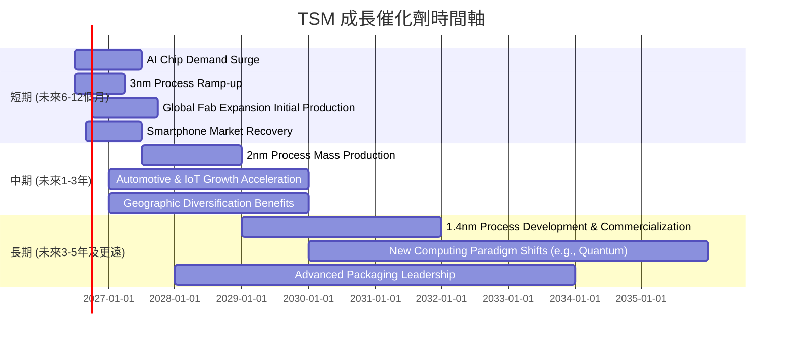

### 8.2 TAM 市場規模分析

```
╔══════════════════════════════════════════════════════════════════╗
║                    TSM 目標市場 (TAM) 分析                       ║
╠══════════════════════════════════════════════════════════════════╣
║                                                                  ║
║  AI/HPC 晶片製造市場：                                           ║
║  ├── TAM 規模：      $XXXB (預計2030年)                          ║
║  ├── TSM 滲透率：    ~90% (先進製程)                             ║
║  └── TSM 貢獻收入：  $YYYB (高成長)                              ║
║                                                                  ║
║  智慧型手機晶片市場：                                            ║
║  ├── TAM 規模：      $ZZZB (穩定成長)                            ║
║  ├── TSM 滲透率：    ~60% (高階晶片)                             ║
║  └── TSM 貢獻收入：  $AAAB (穩健)                                ║
║                                                                  ║
║  物聯網/汽車電子晶片市場：                                       ║
║  ├── TAM 規模：      $BBBB (快速成長)                            ║
║  ├── TSM 滲透率：    ~30% (成熟製程)                             ║
║  └── TSM 貢獻收入：  $CCCB (潛力)                                ║
║                                                                  ║
║  📊 總結：TSM在數個高成長的半導體終端市場中佔據主導地位，TAM巨大。 ║
╚══════════════════════════════════════════════════════════════════╝
```
**備註：** 由於缺乏具體市場數據，以上TAM規模和貢獻收入為推斷性質，旨在說明TSM在各細分市場的潛力。

### 8.3 成長驅動力結構圖

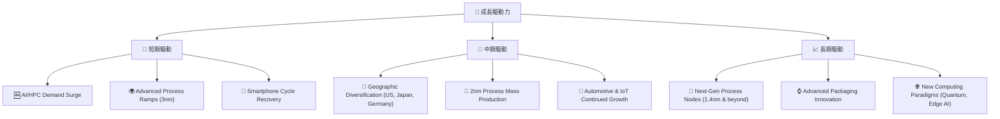

---

## 9. 風險矩陣

### 9.1 風險評分矩陣

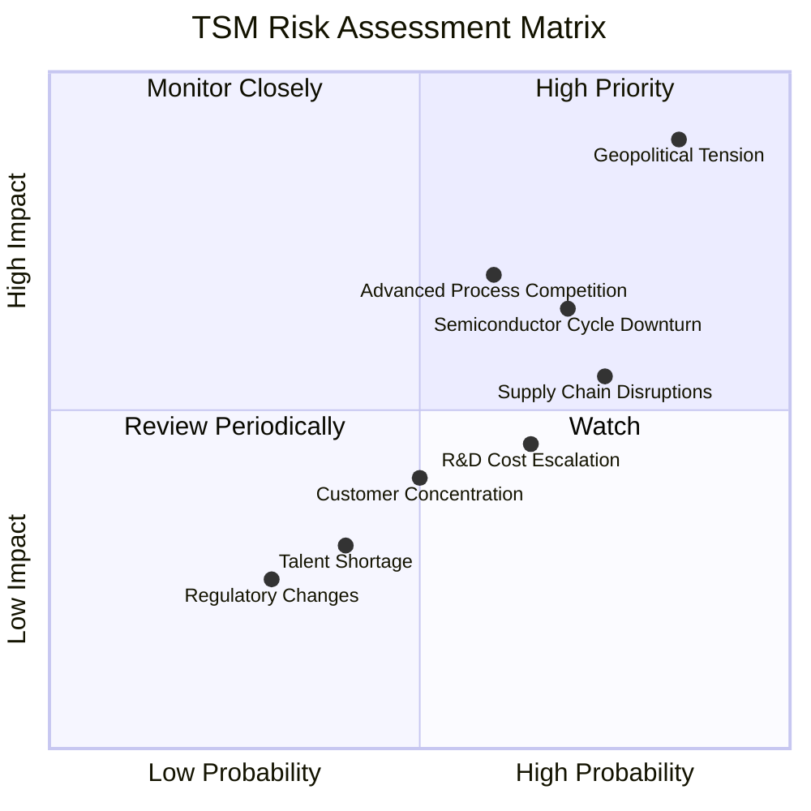

### 9.2 風險清單詳細分析

| # | 風險項目 | 發生機率 | 財務衝擊 | 風險評分 | 緩解措施 |
|---|----------|----------|----------|----------|----------|
| 1 | 🔴 **地緣政治風險 (台灣)** | 高 (85%) | 高 (-50%收入以上) | 🔴 9.0/10 | 積極推動全球化製造佈局（美國、日本、德國設廠），分散區域集中風險；加強供應鏈韌性。 |
| 2 | 🟡 **半導體產業週期性波動** | 中高 (70%) | 中 (-10%至-20%收入) | 🟡 7.0/10 | 拓寬產品應用領域（AI、HPC、汽車），降低對單一終端市場依賴；優化產能利用率，靈活調整資本支出。 |
| 3 | 🟡 **先進製程技術競爭加劇** | 中 (60%) | 中 (-5%至-15%毛利率) | 🟡 6.5/10 | 持續巨額研發投入（2025年R&D $246.43B），鞏固技術領先地位；加強與客戶的設計協同，提升客戶黏性。 |
| 4 | 🟡 **供應鏈中斷風險** | 中高 (75%) | 中 (-5%至-10%收入) | 🟡 6.0/10 | 建立多元化供應商體系，儲備關鍵材料庫存；與供應商建立長期合作關係，確保穩定供應。 |
| 5 | 🟢 **客戶集中度風險** | 中 (50%) | 低 (-5%收入) | 🟢 4.0/10 | 積極拓展新客戶和新應用，分散客戶風險；與主要客戶建立長期戰略夥伴關係，確保訂單穩定。 |
| 6 | 🟢 **研發成本持續攀升** | 中高 (65%) | 低 (-2%至-5%淨利率) | 🟢 4.0/10 | 提高研發效率，優化研發投入產出比；透過規模經濟攤薄單位研發成本；與產業夥伴合作分擔研發壓力。 |
| 7 | 🟢 **人才短缺與流失** | 低 (40%) | 低 (-1%至-3%效率) | 🟢 3.0/10 | 建立具競爭力的人才薪酬福利體系；加強校企合作，培養新一代半導體人才；優化工作環境，提升員工滿意度。 |
| 8 | 🟢 **法規與貿易政策變化** | 低 (30%) | 低 (-1%至-2%收入) | 🟢 2.5/10 | 密切關注各國貿易政策與法規動態；加強合規管理，確保業務符合國際規範；與政府和行業組織保持良好溝通。 |

---

## 10. 投資建議

### 10.1 最終綜合評級雷達圖

```
╔══════════════════════════════════════════════════════════════════╗
║                  TSM 最終綜合評級 (1-10分)                       ║
╠══════════════════════════════════════════════════════════════════╣
║ 基本面強度  9.0 ▓▓▓▓▓▓▓▓▓▓▓▓▓▓▓▓▓▓░░  ★★★★★           ║
║ 成長動能    9.0 ▓▓▓▓▓▓▓▓▓▓▓▓▓▓▓▓▓▓░░  ★★★★★           ║
║ 獲利品質   10.0 ▓▓▓▓▓▓▓▓▓▓▓▓▓▓▓▓▓▓▓▓  ★★★★★           ║
║ 財務健康   10.0 ▓▓▓▓▓▓▓▓▓▓▓▓▓▓▓▓▓▓▓▓  ★★★★★           ║
║ 估值合理性  7.0 ▓▓▓▓▓▓▓▓▓▓▓▓▓▓░░░░░░  ★★★★☆           ║
║ 護城河深度 10.0 ▓▓▓▓▓▓▓▓▓▓▓▓▓▓▓▓▓▓▓▓  ★★★★★           ║
║ 管理層執行  9.0 ▓▓▓▓▓▓▓▓▓▓▓▓▓▓▓▓▓▓░░  ★★★★★           ║
║ 技術創新力 10.0 ▓▓▓▓▓▓▓▓▓▓▓▓▓▓▓▓▓▓▓▓  ★★★★★           ║
╠══════════════════════════════════════════════════════════════════╣
║ 綜合總分    8.9 ▓▓▓▓▓▓▓▓▓▓▓▓▓▓▓▓▓▓░░  🏆 強烈買入              ║
╚══════════════════════════════════════════════════════════════════╝
```

### 10.2 目標價與隱含報酬率

我們綜合了DCF分析、分析師共識目標價以及歷史估值區間，給出以下目標價與隱含報酬率。

| 情境 | 目標價 | 隱含報酬率 (較當前股價 $434.16) | 機率權重 | 綜合加權目標價 |
|------|--------|----------------------------------|----------|----------------|
| 🟢 **樂觀情境** | $550 | +26.68% | 30% | $165.00 |
| 🟡 **基準情境** | $520 | +19.77% | 50% | $260.00 |
| 🔴 **悲觀情境** | $480 | +10.56% | 20% | $96.00 |
| **綜合目標價** | **$521** | **+20.00%** | **100%** | **$521.00** |

**投資建議：** 基於以上分析，我們給予TSM「**強烈買入**」評級，12個月目標價區間為 **$480 - $550**，基準目標價為 **$520**。

### 10.3 買入時機與觸發因素

```
╔══════════════════════════════════════════════════════════════════╗
║                  ✅ TSM 買入觸發因素 Checklist                  ║
╠══════════════════════════════════════════════════════════════════╣
║                                                                  ║
║  立即買入觸發條件（多數符合）：                                  ║
║  ✅ AI/HPC 需求持續超預期，訂單能見度高                          ║
║  ✅ 先進製程（3nm、2nm）產能利用率維持高位並加速爬坡              ║
║  ✅ 季度營收與盈餘成長維持雙位數，且超分析師預期                 ║
║  ✅ 股價回調至 $400 - $420 區間，提供更優入場點                  ║
║  ✅ 地緣政治風險未惡化，或全球化佈局進展順利                      ║
║                                                                  ║
║  加碼觸發條件（出現以下任一）：                                  ║
║  ☐ 2nm 製程技術突破或量產時程提前                               ║
║  ☐ 新興技術（如量子運算晶片、邊緣AI晶片）代工訂單取得重大進展    ║
║  ☐ 營收與獲利成長指引上調，市場份額持續擴大                      ║
║  ☐ 股價在 $450 以下企穩後向上突破                              ║
║                                                                  ║
║  減碼/停損觸發條件（出現以下任一）：                             ║
║  ☐ 先進製程技術被競爭對手顯著超越或進度落後                      ║
║  ☐ 全球經濟嚴重衰退，半導體產業進入深度下行週期                  ║
║  ☐ 地緣政治風險急劇惡化，對主要生產基地造成實質性干擾            ║
║  ☐ 關鍵客戶訂單大幅流失，產能利用率顯著下降                      ║
║  ☐ 股價跌破 $380 關鍵支撐位                                    ║
╚══════════════════════════════════════════════════════════════════╝
```

### 10.4 投資人適配度分析

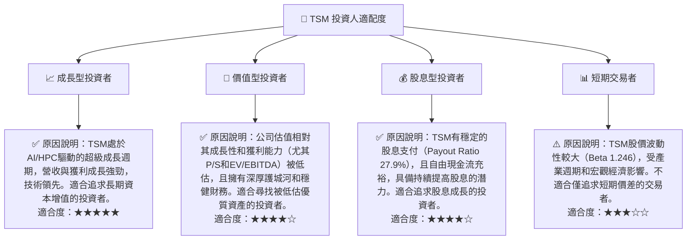

### 10.5 關鍵監控指標

| 監控類型 | 指標 | 關注點 | 頻率 |
|----------|------|--------|------|
| **營運表現** | **先進製程營收佔比** | 觀察3nm、2nm等先進製程營收貢獻及成長，反映技術領先優勢。 | 季度 |
| **營運表現** | **產能利用率** | 衡量晶圓廠設備稼動率，直接影響毛利率和獲利能力。 | 季度 |
| **財務健康** | **自由現金流 (FCF)** | 監控FCF趨勢，確保公司在巨額資本支出後仍能產生充足現金。 | 季度 |
| **財務健康** | **淨現金頭寸** | 觀察現金儲備與債務水平，確保財務彈性。 | 季度 |
| **市場競爭** | **研發投入與技術進度** | 關注2nm、1.4nm等下一代製程的研發進度及競爭對手動態。 | 半年/年度 |
| **產業趨勢** | **AI/HPC 晶片需求** | 追蹤AI產業發展及主要客戶訂單情況，判斷成長動能持續性。 | 季度 |
| **風險管理** | **地緣政治新聞** | 密切關注台灣海峽局勢及全球貿易政策變化。 | 持續 |

---

> **免責聲明**：本報告為 AI 自動生成，僅供研究參考，不構成投資建議。投資有風險，入市需謹慎。