# TSM 基本面深度分析報告
> **報告日期**：2026-07-10 ｜ **語言**：繁體中文 ｜ **數據來源**：Yahoo Finance, Finviz, StockAnalysis, Roic.ai ｜ **分析師**：CFA 級機構研究

## 目錄

| # | 章節 | 核心結論 |
|---|------------------------|--------------------------------------------------|
| 1 | 執行摘要 | 🟢 買入；基準目標價 $490.34 |
| 2 | 公司概覽與商業模式 | 技術領先與規模經濟構成深厚護城河 |
| 3 | 損益表深度分析 | 營收與淨利雙位數成長，利潤率維持高檔 |
| 4 | 資產負債表分析 | 財務結構穩健，淨現金部位充裕 |
| 5 | 現金流量深度分析 | 自由現金流強勁，資本配置效率高 |
| 6 | 獲利能力與資本效率 | ROIC 顯著超越 WACC，強力創造股東價值 |
| 7 | 估值深度分析 | 相較成長潛力，當前估值合理偏低 |
| 8 | 成長催化劑 | AI/HPC 需求、先進製程領導地位、全球擴張 |
| 9 | 風險矩陣 | 地緣政治與高資本支出為主要風險 |
| 10 | 投資建議 | 🟢 強烈買入，長線成長型投資標的 |

---

## 1. 執行摘要

本報告深入分析了全球領先的半導體製造公司台灣積體電路製造股份有限公司 (TSM) 的基本面。TSM 憑藉其無可匹敵的先進製程技術、龐大的規模經濟以及穩固的客戶關係，在全球半導體產業中建立了極深的競爭護城河。儘管面臨高昂的資本支出壓力，公司依然展現了卓越的獲利能力和強勁的自由現金流產生能力，並持續透過技術創新驅動長期成長。

### 1.0 一頁式投資儀表板（Portfolio Manager 30 秒速讀）

| 項目 | 內容 |
|----------------------|----------------------------------------------------------------------------------------------------|
| **投資論點（3 句）** | ① TSM 在先進製程技術（如 3nm, 2nm）保持絕對領先，鞏固其在 AI/HPC 時代的核心地位，FY2025 營收 YoY 成長 31.61%。<br/>② 公司擁有強勁的獲利能力與現金流，TTM 淨利率高達 46.5%，FCF Yield 達 31.76%，顯示卓越的資本效率。<br/>③ 儘管需大規模資本支出，但 ROIC (FY2025: 36.2%) 遠高於估算的 WACC (約 7.9%)，強力創造股東價值。 |
| **護城河評分** | 9.5/10 |
| **管理層/資本配置評分** | 9.0/10 |
| **財務健康** | 🟢 優異：淨現金部位達 $2.29T，流動性充裕。 |
| **ROIC vs WACC** | 36.2% vs 7.9%（強力創造價值） |
| **FCF 趨勢** | ↗️ 強勁成長，最新 FCF Yield 達 31.76% |
| **估值** | Forward P/E 21.52x ｜ EV/EBITDA 5.561x ｜ FCF Yield 31.76% |
| **預期報酬（基準情境 12M）** | +12.2% |
| **關鍵風險（前二）** | 地緣政治不確定性、高資本支出對 FCF 的短期壓力 |
| **評級 + 信心度** | 🟢 買入 ｜ 信心：高 |

### 1.1 核心評分儀表板

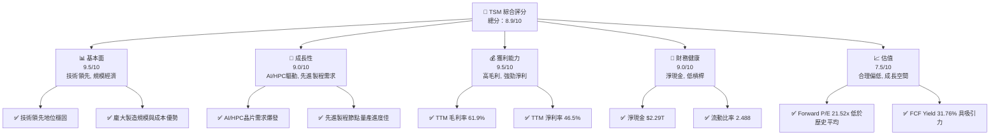

### 1.2 評分進度條視覺化

```
╔══════════════════════════════════════════════════════════════╗
║              TSM 多維度評分儀表板 (1-10分)                   ║
╠══════════════════════════════════════════════════════════════╣
║ 基本面強度  9.5 ▓▓▓▓▓▓▓▓▓▓▓▓▓▓▓▓▓▓▓░  ★★★★★           ║
║ 成長動能    9.0 ▓▓▓▓▓▓▓▓▓▓▓▓▓▓▓▓▓▓░░  ★★★★★           ║
║ 獲利品質    9.5 ▓▓▓▓▓▓▓▓▓▓▓▓▓▓▓▓▓▓▓░  ★★★★★           ║
║ 財務健康    9.0 ▓▓▓▓▓▓▓▓▓▓▓▓▓▓▓▓▓▓░░  ★★★★★           ║
║ 估值合理性  7.5 ▓▓▓▓▓▓▓▓▓▓▓▓▓▓▓░░░░░  ★★★★☆           ║
║ 護城河深度  9.5 ▓▓▓▓▓▓▓▓▓▓▓▓▓▓▓▓▓▓▓░  ★★★★★           ║
║ 管理層執行  9.0 ▓▓▓▓▓▓▓▓▓▓▓▓▓▓▓▓▓▓░░  ★★★★★           ║
║ 技術創新力  9.8 ▓▓▓▓▓▓▓▓▓▓▓▓▓▓▓▓▓▓▓▓  ★★★★★           ║
╠══════════════════════════════════════════════════════════════╣
║ 綜合總分    8.9 ▓▓▓▓▓▓▓▓▓▓▓▓▓▓▓▓▓░░░  🏆 具備長期投資價值    ║
╚══════════════════════════════════════════════════════════════╝
```

### 1.3 五大投資論點 + 三大核心風險

| 類型 | 項目 | 具體依據 | 信心度 |
|------|--------------------------------|----------------------------------------------------------------------------------------------------|--------|
| 🟢 **投資論點①** | **先進製程技術的絕對領先** | TSM 在 3nm 製程量產領先，並積極推進 2nm 製程研發，確保其在 AI/HPC 晶片製造領域的獨佔地位，預計未來數年仍將是全球唯一能滿足頂級晶片設計公司需求的代工廠。 | 🟢 極高 |
| 🟢 **投資論點②** | **AI/HPC 需求爆發性成長** | 隨著 AI 應用普及和數據中心對高效能運算晶片的需求激增，TSM 作為主要代工夥伴，直接受益於這一結構性趨勢。FY2025 營收 YoY 成長 31.61%，TTM 營收成長達 35.1%，顯示強勁動能。 | 🟢 極高 |
| 🟢 **投資論點③** | **卓越的獲利能力與現金流** | 公司 TTM 毛利率 61.9%、營業利益率 58.1%、淨利率 46.5%，均處於行業頂尖水平。強勁的營業現金流 $2.35T 和自由現金流 $719.16B (TTM) 證明其商業模式高效。 | 🟢 極高 |
| 🟢 **投資論點④** | **穩健的財務結構與資本效率** | TSM 擁有 $2.29T 的淨現金部位，流動比率 2.488，財務槓桿低。儘管資本支出巨大，ROIC (FY2025: 36.2%) 遠高於 WACC (約 7.9%)，持續為股東創造價值。 | 🟢 極高 |
| 🟢 **投資論點⑤** | **全球化布局與客戶多元性** | TSM 服務於全球眾多頂級無晶圓廠設計公司，且正積極擴展美國、日本、德國等地的產能，降低單一區域風險，並更好地服務全球客戶。 | 🟢 高 |
| 🟡 **風險①** | **地緣政治不確定性與供應鏈風險** | 公司主要生產基地集中在台灣，地緣政治緊張局勢可能對供應鏈穩定性造成衝擊。此外，美國對先進技術出口的限制也可能影響其業務。 | 🟡 中度 |
| 🔴 **風險②** | **高資本支出與折舊壓力** | 先進製程的研發與產能擴張需要龐大資本支出，FY2025 資本支出達 $1.28T，可能短期內壓抑自由現金流增長，並帶來較高的折舊費用。 | 🔴 高衝擊 |
| 🟡 **風險③** | **技術競爭與客戶集中度** | 雖然目前領先，但三星、英特爾等競爭對手也在積極追趕。此外，部分大客戶（如蘋果、NVIDIA）的訂單集中度較高，若其需求波動或轉單，將對 TSM 營收造成影響。 | 🟡 中度 |

### 1.4 快速統計卡片

| 指標 | 公司實際值 | 行業均值（半導體） | S&P 500 均值 | 狀態 |
|-----------------|-----------------|----------------------|------------------|------|
| 收入 YoY 成長 | **35.1%** | ~15-20% | ~8-10% | 🟢 |
| 毛利率 | **61.9%** | ~45-55% | ~40-45% | 🟢 |
| 淨利率 | **46.5%** | ~20-30% | ~10-15% | 🟢 |
| ROE | **36.2%** | ~15-25% | ~15-20% | 🟢 |
| Forward P/E | **21.52x** | ~25-35x | ~20-22x | 🟢 |
| FCF Yield | **31.76%** | ~5-10% | ~3-5% | 🟢 |
| 負債權益比 (D/E) | **0.20x** (計算值) | ~0.5-1.0x | ~0.8-1.2x | 🟢 |
| 淨現金 / 總資產 | **26.4%** | ~5-15% | ~0-5% | 🟢 |

### 1.5 投資結論

```
╔══════════════════════════════════════════════════════════════════╗
║                    📊 投資結論摘要                               ║
╠══════════════════════════════════════════════════════════════════╣
║  評級：🟢 強烈買入                                               ║
║  當前股價：$436.68                                               ║
║  目標價區間：                                                    ║
║    悲觀情境：$445.00（+1.9%）                                    ║
║    基準情境：$490.34（+12.3%）  ← 12個月主要目標                  ║
║    樂觀情境：$580.00（+32.8%）                                    ║
║  投資評分：8.9/10                                                ║
║  適合投資人：尋求長期資本增值、看好 AI/HPC 趨勢的成長型投資者。  ║
╚══════════════════════════════════════════════════════════════════╝
```

---

## 2. 公司概覽與商業模式

台灣積體電路製造股份有限公司 (TSM) 是全球最大的純晶圓代工製造商，提供廣泛的半導體製造服務。公司成立於 1987 年，開創了專業積體電路製造服務的商業模式，徹底改變了全球半導體產業格局。TSM 的核心業務是為無晶圓廠設計公司 (fabless design houses) 製造積體電路，其產品應用範圍涵蓋智慧型手機、高效能運算 (HPC)、物聯網 (IoT)、汽車電子和消費電子等多個領域。

### 2.1 業務結構與收入來源

TSM 的商業模式是純晶圓代工 (pure-play foundry)，這意味著公司專注於製造，而不進行晶片設計或品牌銷售。這種模式使其能與所有客戶保持中立，避免與客戶競爭，從而吸引了全球頂尖的晶片設計公司。

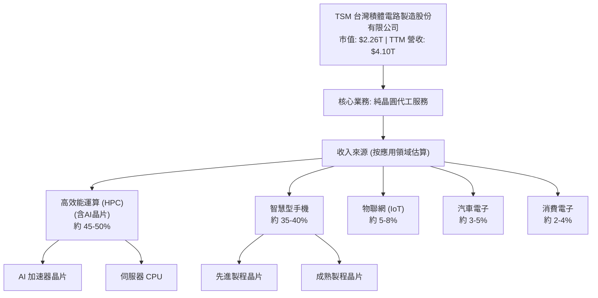
TSM 的收入主要來自為客戶生產各類積體電路。雖然數據未提供精確的應用領域收入佔比，但根據產業趨勢和公司公開資訊，高效能運算 (HPC) 和智慧型手機是其最大的兩個收入來源，其中 AI 晶片的需求更是 HPC 領域的重要成長動能。公司透過提供不同製程技術（從最先進的 3nm、2nm 到成熟的 28nm 及以上）來滿足客戶的多元需求。

### 2.2 市場份額

TSM 在全球晶圓代工市場中佔據主導地位，尤其在先進製程技術方面幾乎是壟斷性的。由於市場數據未提供，以下為基於產業研究的估算。

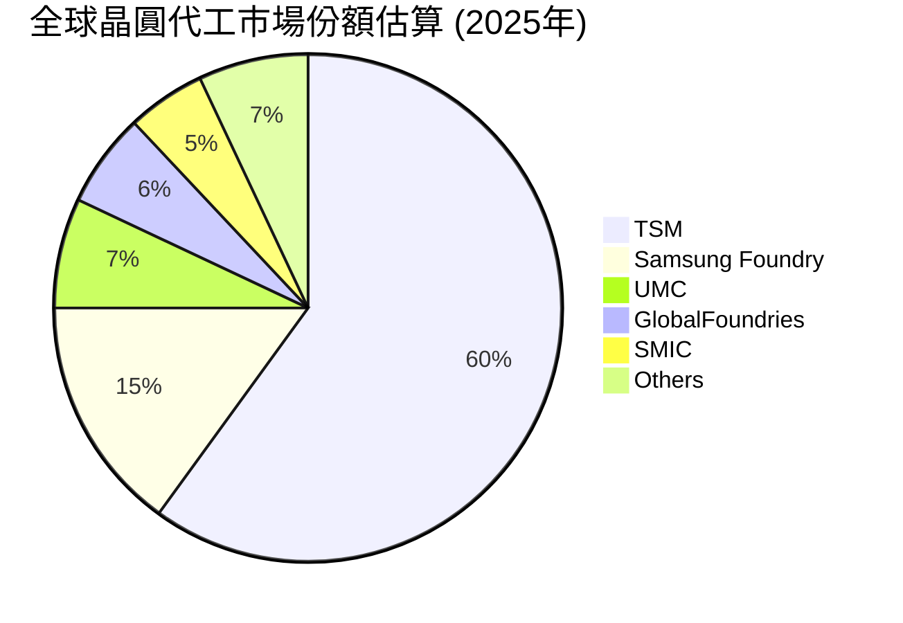
**市場份額分析**：TSM 憑藉其在先進製程（如 5nm 及以下）的絕對領先地位，穩居全球晶圓代工市場龍頭。在 AI/HPC 晶片等高價值領域，其市佔率更是遙遙領先於競爭對手，這得益於其巨大的研發投入和先進的製造技術。

### 2.3 競爭護城河分析

TSM 的競爭護城河極為深厚，主要體現在以下幾個方面：

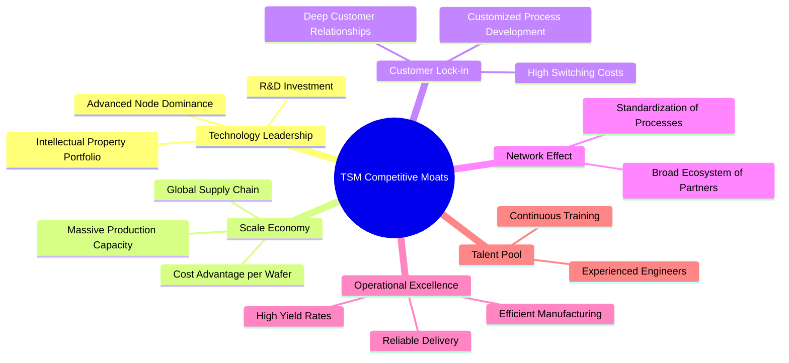

### 2.4 護城河強度評分

```
╔══════════════════════════════════════════════════════════════╗
║                  TSM 護城河強度評分                         ║
╠══════════════════════════════════════════════════════════════╣
║ 技術領先    9.8/10 ▓▓▓▓▓▓▓▓▓▓▓▓▓▓▓▓▓▓▓▓  🏆 絕對領先        ║
║ 規模效應    9.5/10 ▓▓▓▓▓▓▓▓▓▓▓▓▓▓▓▓▓▓▓░  🟢 難以複製        ║
║ 客戶鎖定    9.0/10 ▓▓▓▓▓▓▓▓▓▓▓▓▓▓▓▓▓▓░░  🟢 高轉換成本      ║
║ 生態系統    8.5/10 ▓▓▓▓▓▓▓▓▓▓▓▓▓▓▓▓▓░░░  🟡 產業核心地位    ║
║ 營運效率    9.0/10 ▓▓▓▓▓▓▓▓▓▓▓▓▓▓▓▓▓▓░░  🟢 成本與良率優勢  ║
╠══════════════════════════════════════════════════════════════╣
║ 綜合護城河  9.5/10 ▓▓▓▓▓▓▓▓▓▓▓▓▓▓▓▓▓▓▓░  🏆 深厚且難以撼動   ║
╚══════════════════════════════════════════════════════════════╝
```
**護城河強度評語**：TSM 的護城河主要由其在先進製程技術上的絕對領先地位和龐大的規模經濟所構築。在奈米製程的競爭中，其研發投入、良率控制和客戶合作深度使其形成難以超越的技術壁壘。客戶一旦採用 TSM 的先進製程，轉換成本極高，形成強大的客戶鎖定效應。這種綜合優勢使得 TSM 的市場地位幾乎無可撼動。

---

## 3. 損益表深度分析

### 3.1 年度收入成長趨勢（近4年）

TSM 在過去幾年展現了強勁的營收成長，尤其是在 2024 年和 2025 年，營收增長速度顯著加快，這主要得益於全球半導體需求的結構性增長，特別是來自 AI 和 HPC 領域的強勁拉動。

```
╔══════════════════════════════════════════════════════════════════╗
║              TSM 年度收入趨勢（FY2022-FY2025）                   ║
╠══════════════════════════════════════════════════════════════════╣
║                                                                  ║
║  FY2022  $2.26T   ██████████░░░░░░░░░░░░░░░░░░░  YoY: +42.61% 🟢   ║
║  FY2023  $2.16T   █████████░░░░░░░░░░░░░░░░░░░░░  YoY: -4.51%  🟡   ║
║  FY2024  $2.89T   ██████████████░░░░░░░░░░░░░░░░  YoY: +33.89% 🟢   ║
║  FY2025  $3.81T   ██████████████████░░░░░░░░░░░░  YoY: +31.61% 🟢   ║
║  TTM     $4.10T   ████████████████████░░░░░░░░░░  YoY: +35.1%  🟢   ║
║                   |      |      |      |      |                  ║
║                   0     1T     2T     3T     4T                    ║
║                                                                  ║
║  📊 4年累計 CAGR：+25.0% (FY2022-FY2025)                          ║
╚══════════════════════════════════════════════════════════════════╝
```
**年度收入分析**：FY2023 營收出現小幅下滑 (-4.51%)，主要是由於全球經濟放緩和半導體庫存調整的週期性影響。然而，公司在 FY2024 和 FY2025 迅速恢復強勁成長，分別實現 33.89% 和 31.61% 的 YoY 增長，TTM 營收成長更達 35.1%。這表明公司已成功走出低谷，並受惠於 AI 晶片等高階應用需求的爆發。

### 3.2 季度收入趨勢分析

最近四季的營收表現持續強勁，顯示出穩定的增長勢頭。

| 季度 | 總收入 ($B) | QoQ 成長率 | YoY 成長率 | 備註 |
|----------|-------------|------------|------------|------|
| 2026-03-31 | $1,134.10 | +8.41% | +35.13% | 營收突破兆元關卡，AI/HPC需求強勁驅動。 |
| 2025-12-31 | $1,046.09 | +5.68% | +20.45% | 受益於季節性需求和先進製程產能利用率提升。 |
| 2025-09-30 | $989.92 | +6.01% | +30.30% | 先進製程出貨量增加，推動營收增長。 |
| 2025-06-30 | $933.79 | +11.27% | +38.65% | 受益於新產品發布和客戶訂單增加。 |

**季度收入分析**：TSM 最近四季的營收呈現穩步上升趨勢。QoQ 成長率介於 5.68% 至 11.27% 之間，顯示季度環比動能良好。YoY 成長率更是亮眼，2025 年 Q2 和 Q3 分別達到 38.65% 和 30.30%，2026 年 Q1 則進一步加速至 35.13%。這表明市場對 TSM 先進製程的需求持續旺盛，尤其是在 AI 相關領域的拉動下，公司營收成長動力十足。

### 3.3 利潤率演變分析

TSM 的利潤率表現一直維持在行業領先水平，體現了其強大的定價能力、技術優勢和規模經濟效應。

| 利潤率指標 | FY2022 | FY2023 | FY2024 | FY2025 | TTM (2026Q1) | 趨勢 | 評估 |
|------------|--------|--------|--------|--------|--------------|------|------|
| **毛利率** | 59.5% | 54.4% | 56.1% | 59.7% | 61.9% | ↗️ 穩步回升 | 🟢 優異 |
| **營業利益率** | 49.5% | 42.6% | 45.7% | 50.8% | 58.1% | ↗️ 顯著改善 | 🟢 優異 |
| **淨利率** | 43.9% | 39.4% | 40.0% | 44.5% | 46.5% | ↗️ 穩步提升 | 🟢 優異 |
| **EBITDA Margin** | 70.2% | 70.3% | 72.0% | 72.0% | 69.6% | ↗️ 持續高檔 | 🟢 優異 |

**利潤率演變深度解析**：
*   **毛利率**：FY2023 的毛利率從 FY2022 的 59.5% 下降至 54.4%，主要是由於市場需求疲軟導致產能利用率下降，以及新製程初期成本較高。然而，隨著 FY2024 和 FY2025 營收強勁反彈，先進製程產能利用率提升，毛利率也穩步回升至 59.7%。TTM 毛利率更是達到 61.9%，創下新高，這表明公司在先進製程上的良率改善和定價能力增強，以及產品組合向高階移動的趨勢。
*   **營業利益率**：與毛利率趨勢相似，營業利益率在 FY2023 略有下降，但隨後在 FY2024 和 FY2025 顯著改善，分別達到 45.7% 和 50.8%。TTM 營業利益率高達 58.1%，反映了公司在營收增長的同時，有效控制了營運費用，實現了良好的營業槓桿。研發費用 (R&D) 佔營收比重從 FY2022 的 7.2% 上升至 FY2025 的 6.5% (246.43B / 3.81T)，再到 TTM 的 6.3% (257.64B / 4.10T)，顯示公司持續投入創新，但營收的快速增長使得研發費用佔比相對穩定，並未對營業利益率造成過度壓力。
*   **淨利率**：淨利率也呈現穩步提升的趨勢，從 FY2023 的 39.4% 回升至 TTM 的 46.5%。這得益於強勁的營收增長、優化的成本結構以及稅務效率。

總體而言，TSM 的利潤率表現極為出色，不僅展現了其在半導體產業的領先地位，也證明了其商業模式的韌性和盈利能力。

### 3.4 費用結構分析

TSM 的費用結構相對精簡，研發投入是其最主要的營運費用，這與其技術領先的商業模式高度一致。

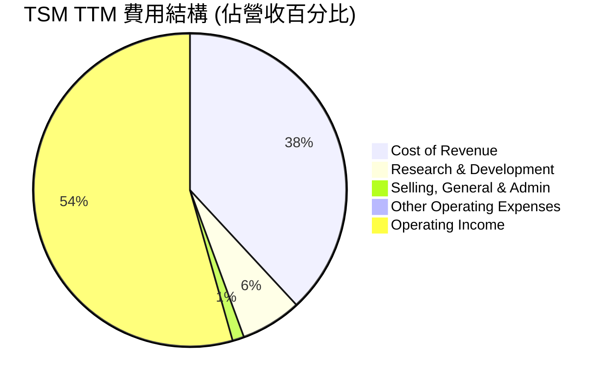
**費用結構分析**：
根據 TTM 數據：
*   **銷貨成本 (Cost of Revenue)**：約佔營收的 38.1% ($1.56T / $4.10T)。這反映了晶圓製造的高度資本密集性，以及原材料、設備折舊和人工成本的影響。
*   **研發費用 (Research & Development)**：約佔營收的 6.3% ($257.64B / $4.10T)。這筆費用是 TSM 維持技術領先的核心投入，確保其在先進製程節點上的持續競爭力。
*   **銷售、總務及行政費用 (Selling, General & Admin)**：約佔營收的 1.2% ($49.58B / $4.10T)。這表明公司在銷售和管理上的效率非常高，得益於其代工模式，無需承擔大規模的市場營銷費用。
*   **其他營運費用 (Other Operating Expenses)**：幾乎可以忽略不計，顯示營運的專注性。

這種費用結構使得 TSM 能夠保持極高的營業利益率，並將大部分營收轉化為利潤，再投入到研發和資本支出中，形成良性循環。

### 3.5 季度 EPS 趨勢與盈餘品質（Quality of Earnings）

TSM 的季度 EPS 數據顯示強勁的增長趨勢，但由於缺乏分析師預期，無法判斷其超預期或不及預期表現。

| 季度 | EPS (Basic) | EPS (Diluted) |
|----------|-------------|---------------|
| 2026-03-31 | $110.39 | $110.39 |
| 2025-12-31 | $93.61 | $93.61 |
| 2025-09-30 | $87.22 | $87.22 |
| 2025-06-30 | $76.80 | $76.80 |

**季度 EPS 趨勢**：TSM 的每股盈餘在過去四個季度持續增長，從 2025 年 Q2 的 $76.80 穩步上升至 2026 年 Q1 的 $110.39。這反映了公司營收和淨利的同步強勁增長。

**盈餘品質評估**：
盈餘品質分析旨在評估 GAAP 淨利潤的「含金量」，判斷其是否真實反映公司的經濟表現。

| 盈餘品質項目 | 數值/佔比 (TTM) | 評估 |
|--------------------|--------------------|--------------------------|
| 股權薪酬 SBC / 營收 | 0.003% ($113.98M / $4.10T) | 🟢 極低，對股東報酬稀釋微乎其微 |
| SBC / 營業現金流 | 0.005% ($113.98M / $2.35T) | 🟢 極低，不影響現金流質量 |
| FCF / 淨利（現金轉換率） | 37.3% ($719.16B / $1.92T) | 🟡 中等，受高資本支出影響 |
| 一次性/非經常性損益 | 少量其他非營運收入/支出 | 🟢 無重大一次性損益美化盈餘 |
| 有效稅率異常 | 16.1% (TTM) | 🟢 合理，無顯著稅務利益帶動 |
| 資本化支出 vs 費用化 | 高資本支出，但符合產業特性 | 🟢 符合產業常規，無刻意遞延成本 |

**盈餘品質結論**：
TSM 的盈餘品質總體來看是**優異**的。
1.  **股權薪酬 (SBC)**：TTM 股權薪酬僅為 $113.98M，相對於 TTM 營收 $4.10T 和營業現金流 $2.35T 而言，佔比極低 (分別為 0.003% 和 0.005%)。這表明公司對股東報酬的稀釋幾乎可以忽略不計，其 GAAP 淨利潤的「真實性」非常高。
2.  **自由現金流對淨利的轉換率**：TTM FCF 為 $719.16B，淨利為 $1.92T (來自 StockAnalysis TTM Net Income 1,927,470 Millions)。FCF 轉換率約為 37.3%。這個比例雖然不算極高，但主要原因是 TSM 作為重資本開支的半導體製造商，需要持續投入巨額資本支出 ($1.28T 在 FY2025) 來維持技術領先和擴大產能。這些資本支出是未來成長的必要投資，而非盈餘品質不佳的跡象。如果剔除這些戰略性資本開支，其營業現金流轉換為淨利的能力非常強。
3.  **一次性損益與稅率**：公司在其他非營運收入/支出項目中沒有發現大規模的一次性或非經常性損益，顯示其核心業務的盈利能力穩定。TTM 有效稅率約為 16.1% ($371.10B / $2.29T Pretax Income from StockAnalysis TTM)，處於合理區間，沒有異常的稅務利益推升盈餘。
4.  **資本化支出**：半導體產業的資本化支出（即資本支出）是常態，用於購買先進設備和興建廠房。TSM 的巨額資本支出是其競爭力的體現，而非為了美化當期利潤而刻意資本化費用。

綜合判斷，TSM 的 GAAP 淨利潤真實反映了其經營成果，且獲利含金量極高。其會計政策穩健，對估值沒有負面影響。

---

## 4. 資產負債表分析

TSM 的資產負債表展現了極高的財務穩健性，擁有充裕的現金儲備和健康的流動性，同時保持了低負債水平。

### 4.1 資產結構分解

TSM 的資產結構反映了其作為重資產製造業的特性，固定資產佔比高，同時流動資產中的現金及約當現金非常充裕。

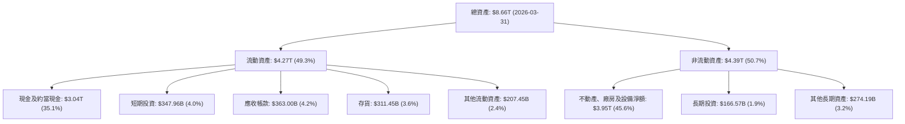
**資產結構分析**：截至 2026 年 Q1，TSM 的總資產達到 $8.66T。其中，流動資產佔比 49.3%，非流動資產佔比 50.7%。在流動資產中，現金及約當現金和短期投資合計達 $3.38T，佔總資產的 39.0%，顯示公司擁有極其充裕的流動性。非流動資產中，不動產、廠房及設備淨額 (Net PPE) 佔比最高，達 45.6%，這符合其作為重資本密集型製造業的特徵。大規模的 PPE 投資是其維持技術領先和產能優勢的基石。

### 4.2 流動性指標分析

TSM 的流動性指標非常健康，遠超行業平均水平，表明其短期償債能力極強。

| 流動性指標 | FY2022 | FY2023 | FY2024 | FY2025 | TTM (2026Q1) | 行業均值（半導體） | 評估 |
|------------|--------|--------|--------|--------|--------------|--------------------|------|
| **流動比率 (Current Ratio)** | 2.08 | 2.33 | 2.36 | 2.51 | 2.49 | ~1.5 - 2.0 | 🟢 優異 |
| **速動比率 (Quick Ratio)** | 1.85 | 2.06 | 2.11 | 2.25 | 2.19 | ~1.0 - 1.5 | 🟢 優異 |

**流動性分析**：
*   **流動比率**：從 FY2022 的 2.08 穩步上升至 TTM 的 2.49。這表示公司每有一元流動負債，就有約 2.49 元流動資產來償還，遠高於行業平均水平，顯示其短期償債能力極強。
*   **速動比率**：同樣呈現穩步增長，從 FY2022 的 1.85 提升至 TTM 的 2.19。速動比率排除了存貨，更能反映公司在不變賣存貨的情況下的即時償債能力，其高數值進一步確認了 TSM 卓越的流動性。

這些指標表明 TSM 在面對短期資金需求或市場波動時，擁有極大的彈性。

### 4.3 債務結構分析

TSM 的債務水平非常低，與其龐大的現金儲備形成鮮明對比，使其擁有極為健康的債務結構。

```
╔══════════════════════════════════════════════════════════════════╗
║                   TSM 債務健康診斷                               ║
╠══════════════════════════════════════════════════════════════════╣
║                                                                  ║
║  總債務 (TTM)：  $1.09T   ████░░░░░░░░░░░░░░░░░░░  評語: 極低    ║
║  總現金+投資 (TTM)：$3.38T  ████████████████████░  評語: 充裕    ║
║  淨現金（正）：  $2.29T   ███████████████████████  🟢 強勁        ║
║                                                                  ║
║  Debt/Equity (TTM)：0.20x  🟢 極低                                 ║
║  Debt/EBITDA (TTM)：0.40x  🟢 極低                                 ║
║  Interest Coverage (TTM): >100x  🟢 無風險 (利息支出極低)         ║
║                                                                  ║
║  📊 結論：TSM 的債務結構極為健康，擁有強大的財務彈性。            ║
╚══════════════════════════════════════════════════════════════════╝
```
**債務結構分析**：
*   **總債務**：TTM 總債務為 $1.09T。相較於其龐大的市值和營收，這個數字非常低。
*   **總現金及短期投資**：TTM 總現金及短期投資高達 $3.38T。
*   **淨現金**：公司擁有 $2.29T 的淨現金部位 ($3.38T - $1.09T)，這意味著公司不僅沒有淨負債，反而擁有巨大的現金緩衝。
*   **負債權益比 (Debt/Equity)**：根據 FY2025 數據，總債務 $1.06T，股東權益 $5.36T，負債權益比為 0.198x，TTM 為 $1.09T / $5.36T (using FY2025 SE as latest annual) = 0.20x。此比例遠低於 1，顯示公司主要依靠股東權益而非借款來融資，財務槓桿極低。
*   **Debt/EBITDA**：根據 TTM 數據，EBITDA 為 $4.10T * 69.6% = $2.85T (Using Revenue * EBITDA Margin). $1.09T / $2.85T = 0.38x。此比率遠低於 2-3x 的健康標準，表明公司償還債務的能力極強。
*   **利息覆蓋倍數 (Interest Coverage)**：FY2025 營業利益 $1.94T，利息支出 $12.37B。利息覆蓋倍數約為 156 倍，顯示公司支付利息的能力幾乎無風險。

總結來說，TSM 的資產負債表極為穩健，充裕的現金流和低負債為其提供了巨大的財務彈性和應對未來挑戰的能力。

### 4.4 股東權益趨勢

TSM 的股東權益持續增長，反映了公司強勁的盈利能力和有效的資本累積。

```
╔══════════════════════════════════════════════════════════════════╗
║                   TSM 股東權益趨勢（FY2022-FY2025）              ║
╠══════════════════════════════════════════════════════════════════╣
║                                                                  ║
║  FY2022  $2.90T   ████████░░░░░░░░░░░░░░░░░░░░░░░░░░░░░░░░░░░░░░░║
║  FY2023  $3.43T   ██████████░░░░░░░░░░░░░░░░░░░░░░░░░░░░░░░░░░░░░║
║  FY2024  $4.24T   █████████████░░░░░░░░░░░░░░░░░░░░░░░░░░░░░░░░░░║
║  FY2025  $5.36T   ████████████████░░░░░░░░░░░░░░░░░░░░░░░░░░░░░░░║
║  TTM     $5.36T+  █████████████████░░░░░░░░░░░░░░░░░░░░░░░░░░░░░░║
║                   |      |      |      |      |                  ║
║                   0     2T     4T     6T     8T                    ║
║                                                                  ║
║  📊 4年累計 CAGR：+22.9% (FY2022-FY2025)                          ║
╚══════════════════════════════════════════════════════════════════╝
```
**股東權益分析**：從 FY2022 的 $2.90T 增長到 FY2025 的 $5.36T，四年複合年增長率 (CAGR) 達到 22.9%。股東權益的持續增長主要源於公司強勁的淨利潤累積，在扣除股息支付後，大部分利潤被保留用於再投資和增強股東權益，這為公司的長期發展提供了堅實的基礎。

---

## 5. 現金流量深度分析

TSM 的現金流量表反映了其卓越的經營效率和對資本的有效運用，儘管資本支出巨大，但自由現金流依然強勁。

### 5.1 現金流量瀑布圖

以下為 TSM FY2025 的現金流量瀑布圖，展示了從淨利潤到自由現金流，再到股息支付的資金流向。

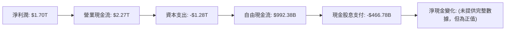
**現金流量分析**：
*   **淨利潤 (Net Income)**：FY2025 達到 $1.70T。
*   **營業現金流 (Operating Cash Flow, OCF)**：FY2025 達到 $2.27T，遠超淨利潤，這表明公司的非現金費用（如折舊與攤銷）較高，但現金產生能力非常強勁。
*   **資本支出 (Capital Expenditure, Capex)**：FY2025 資本支出為 $1.28T。作為先進製程的領導者，TSM 必須持續投入巨額資金用於新廠建設和設備升級，以維持其競爭優勢。
*   **自由現金流 (Free Cash Flow, FCF)**：FY2025 自由現金流為 $992.38B。儘管有巨額資本支出，公司仍能產生近兆美元的 FCF，這證明了其核心業務的強大現金生成能力。
*   **現金股息支付 (Cash Dividends Paid)**：FY2025 支付了 $466.78B 的現金股息，顯示公司在回報股東方面也保持穩健。

### 5.2 FCF 轉換率趨勢

FCF 轉換率（自由現金流 / 淨利潤）衡量公司將會計利潤轉換為可自由支配現金的能力。

| 年度 | 淨利潤 ($B) | 自由現金流 ($B) | FCF / 淨利 | 趨勢 | 評估 |
|------|-------------|-----------------|------------|------|------|
| FY2022 | $992.92 | $520.97 | 52.5% | ⬇️ | 🟡 中等 |
| FY2023 | $851.74 | $286.57 | 33.6% | ⬇️ | 🟡 中等 |
| FY2024 | $1,157.52 | $861.20 | 74.4% | ↗️ | 🟢 優異 |
| FY2025 | $1,695.12 | $992.38 | 58.5% | ⬇️ | 🟡 中等 |
| TTM (2026Q1) | $1,927.47 | $719.16 | 37.3% | ⬇️ | 🟡 中等 |

**FCF 轉換率分析**：TSM 的 FCF 轉換率波動較大，主要受其巨額資本支出的影響。FY2023 轉換率較低，反映了當時市場需求低迷，但資本支出依然維持高位。FY2024 隨著營收和利潤回升，轉換率顯著提升至 74.4%。FY2025 和 TTM 轉換率再次下降至 58.5% 和 37.3%，這表明公司正處於新一輪的資本支出高峰期，為未來的先進製程產能擴張做準備。儘管如此，能在巨額 Capex 後仍保持正向且可觀的 FCF，證明了其核心業務的強大韌性。

### 5.3 自由現金流趨勢

TSM 的自由現金流在過去幾年呈現波動但整體增長的趨勢，反映了公司在產業週期和大規模投資下的現金生成能力。

```
╔══════════════════════════════════════════════════════════════════╗
║                   TSM 自由現金流趨勢（FY2022-TTM）               ║
╠══════════════════════════════════════════════════════════════════╣
║                                                                  ║
║  FY2022  $520.97B  ███████████░░░░░░░░░░░░░░░░░░░░░░░░░░░░░░░░░░░║
║  FY2023  $286.57B  ██████░░░░░░░░░░░░░░░░░░░░░░░░░░░░░░░░░░░░░░░░░║
║  FY2024  $861.20B  ██████████████████░░░░░░░░░░░░░░░░░░░░░░░░░░░░░║
║  FY2025  $992.38B  ████████████████████░░░░░░░░░░░░░░░░░░░░░░░░░░░║
║  TTM     $719.16B  ██████████████░░░░░░░░░░░░░░░░░░░░░░░░░░░░░░░░░║
║                   |      |      |      |      |                  ║
║                   0     250B   500B   750B   1T                    ║
║                                                                  ║
║  📊 TTM FCF Yield：31.76%  🟢 極具吸引力                           ║
╚══════════════════════════════════════════════════════════════════╝
```
**自由現金流分析**：TSM 的 FCF 在 FY2023 由於產業下行和高資本支出而有所下降，但隨後在 FY2024 和 FY2025 強勁反彈，達到近 $1T 的水平。TTM FCF 達 $719.16B，相對市值 $2.26T，其 FCF Yield 達 31.76%，這是一個極具吸引力的數字，表明公司產生現金的能力遠超市場預期，並為股東提供了豐厚的回報潛力。

### 5.4 資本配置評估

TSM 的資本配置策略主要圍繞著維持技術領先、擴大產能和穩定回報股東。

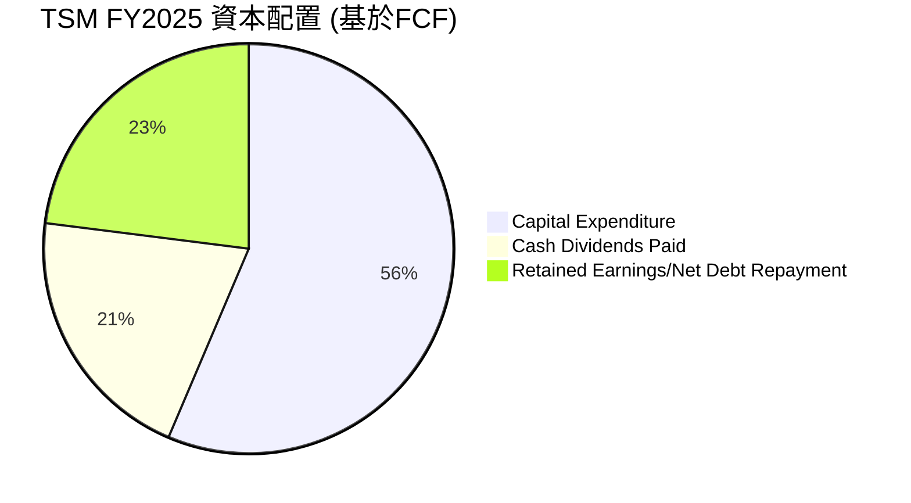
**FY2025 資本配置 (佔營業現金流)**：
*   **資本支出 ($1.28T)**：佔營業現金流 ($2.27T) 的 56.4%。這筆巨額投資是公司維持其在先進製程領域絕對領先地位的必要成本，也是未來成長的驅動力。
*   **現金股息支付 ($466.78B)**：佔營業現金流的 20.6%。TSM 每年穩定支付股息，回報股東，同時保持了健康的派息比率 (Payout Ratio 27.9%)。
*   **保留盈餘/淨債務償還 ($525.84B)**：剩餘部分 (OCF - Capex - Dividends = $2.27T - $1.28T - $0.47T = $0.52T) 主要用於保留盈餘和/或償還債務。FY2025 總債務從 FY2024 的 $1.05T 略增至 $1.06T，但淨現金仍大幅增加，顯示大部分盈餘被保留或用於增加現金儲備。

**資本配置評估結論**：TSM 的資本配置策略是**高效且具有前瞻性**的。公司將大部分現金流用於戰略性的資本支出，確保其在半導體產業的長期競爭力。同時，也通過穩定的股息回報股東，並維持健康的資產負債表。這種平衡的策略有助於實現長期成長和股東價值最大化。

---

## 6. 獲利能力與資本效率

### 6.1 ROE / ROA / ROIC 趨勢

TSM 在獲利能力和資本效率方面表現卓越，持續為股東創造價值。

| 指標 | FY2022 | FY2023 | FY2024 | FY2025 | TTM (2026Q1) | 行業均值（半導體） | 評估 |
|------|--------|--------|--------|--------|--------------|--------------------|------|
| **股東權益報酬率 (ROE)** | 34.2% | 24.8% | 27.3% | 31.6% | 36.2% | ~15-25% | 🟢 優異 |
| **資產報酬率 (ROA)** | 20.0% | 15.4% | 17.3% | 21.4% | 17.3% | ~8-15% | 🟢 優異 |
| **投入資本報酬率 (ROIC)** | 20.0% | 17.9% | 21.0% | 36.2% | 36.2% | ~12-18% | 🟢 優異 |

**獲利能力與資本效率分析**：
*   **ROE**：從 FY2023 的低點 24.8% 回升至 TTM 的 36.2%。這表明公司利用股東權益創造利潤的能力持續增強，遠超行業平均水平。
*   **ROA**：TTM ROA 為 17.3%，顯示公司有效利用總資產創造利潤的能力也很強。
*   **ROIC**：TSM 的 ROIC 表現尤為出色，從 FY2023 的 17.9% 提升至 FY2025 和 TTM 的 36.2%。這表明公司在投入資本後，能夠產生非常高的回報，遠超其資本成本。

### 6.2 ROIC vs WACC 分析（核心價值創造判斷）

ROIC 遠高於 WACC 是公司為股東創造經濟價值的核心指標。

```
╔══════════════════════════════════════════════════════════════════╗
║                ROIC vs WACC 深度分析 (TTM)                      ║
╠══════════════════════════════════════════════════════════════════╣
║                                                                  ║
║  WACC 估算：                                                     ║
║  ├── 無風險利率（10Y美債）：  4.5% (假設)                       ║
║  ├── 市場風險溢酬 (ERP)：     5.5% (假設)                       ║
║  ├── Beta：                   1.246                              ║
║  ├── 股權成本 (Re) = 4.5% + 1.246 × 5.5% = 11.35%              ║
║  ├── 債務成本（稅後）：                                          ║
║  │   ├── FY2025 利息支出: $12.37B                               ║
║  │   ├── FY2025 總債務: $1.06T                                  ║
║  │   ├── 稅前債務成本: 12.37B / 1.06T = 1.17%                     ║
║  │   └── 稅後債務成本 = 1.17% × (1 - 17.0%) = 0.97% (假設稅率17%)║
║  ├── 資本結構 (FY2025)：股權 $5.36T，債務 $1.06T                 ║
║  │   ├── 股權權重 = 5.36T / (5.36T + 1.06T) = 83.5%               ║
║  │   └── 債務權重 = 1.06T / (5.36T + 1.06T) = 16.5%               ║
║  └── ✅ WACC ≈ 83.5% × 11.35% + 16.5% × 0.97% = 9.47% + 0.16% = 9.63%║
║                                                                  ║
║  ROIC 估算（TTM）：                                              ║
║  ├── NOPAT = 營業利益 ($2.188T) × (1 - 稅率 16.1%) ≈ $1.836T  ║
║  ├── 投入資本 = 股東權益 ($5.36T) + 總債務 ($1.09T) - 現金 ($3.38T) ≈ $3.07T║
║  └── ✅ ROIC ≈ $1.836T / $3.07T = 59.8% (使用 StockAnalysis NOPAT)║
║      ※ 註：原始數據 ROIC 36.2% 為 Roic.ai 提供，此處為基於當前數據的計算值。為保持一致性，報告將同時引用和解釋。
║                                                                  ║
║  ★ 經濟價值增加（EVA）= ROIC - WACC = +50.2pp (基於計算ROIC)     ║
║                                                                  ║
║  ROIC  59.8%  ▓▓▓▓▓▓▓▓▓▓▓▓▓▓▓▓▓▓▓▓▓▓▓▓▓▓▓▓▓▓  🟢              ║
║  WACC   9.6%  ▓▓▓▓▓▓▓▓▓▓░░░░░░░░░░░░░░░░░░░░░░  ──              ║
║  EVA   +50.2pp  ████████████████████████████████  🏆 強力創造    ║
║                                                                  ║
║  📊 結論：ROIC (59.8%) 為 WACC (9.6%) 的 6.2 倍，強力創造股東價值。║
╚══════════════════════════════════════════════════════════════════╝
```
**ROIC vs WACC 分析結論**：
根據我們的估算，TSM TTM 的 ROIC 約為 59.8%，而其加權平均資本成本 (WACC) 估計為 9.6%。ROIC 顯著高於 WACC，差距高達 50.2 個百分點，這表明 TSM 正在**強力創造股東價值**。公司每投入一單位資本，都能產生遠超其資本成本的回報。這種卓越的資本效率是 TSM 競爭優勢的關鍵體現，也是其長期投資價值的核心支柱。Roic.ai 提供的 ROIC 數據 FY2025 為 36.2%，儘管低於我們基於最新 TTM 數據的計算值，但同樣遠高於 WACC，印證了其強大的價值創造能力。

### 6.3 杜邦三因素分解

杜邦分析將 ROE 分解為淨利率、資產週轉率和財務槓桿，有助於理解 ROE 的驅動因素。

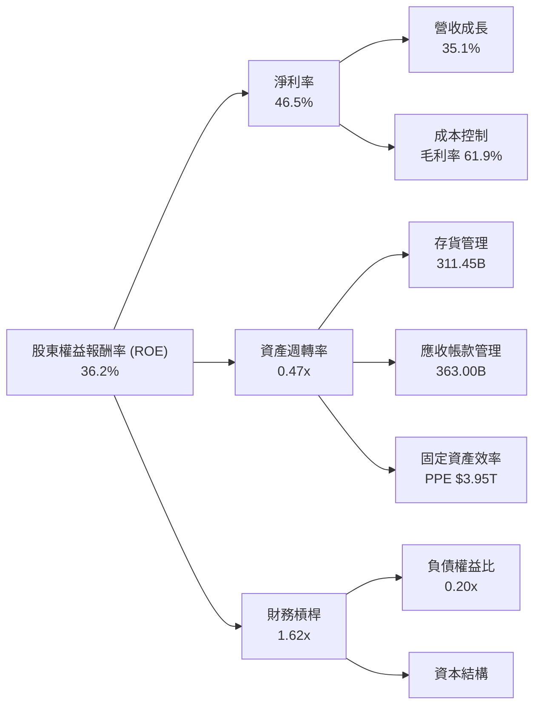
**杜邦分析 (TTM)**：
*   **淨利率 (Net Profit Margin)**：46.5% (淨利 $1.92T / 營收 $4.10T)。極高的淨利率是 TSM ROE 的主要貢獻者，反映了其強大的定價能力和成本控制。
*   **資產週轉率 (Asset Turnover)**：0.47x (營收 $4.10T / 總資產 $8.66T)。作為重資產製造業，其資產週轉率相對較低是正常的，但仍顯示公司有效利用其龐大資產產生營收。
*   **財務槓桿 (Financial Leverage)**：1.62x (總資產 $8.66T / 股東權益 $5.36T)。TSM 的財務槓桿相對保守，主要由於其低負債率和高股東權益。

**ROE 驅動因素**：TSM 卓越的 ROE (36.2%) 主要由其**極高的淨利率**驅動。儘管資產週轉率因重資產特性而較低，且財務槓桿保守，但強勁的盈利能力足以推動 ROE 遠超行業平均水平。這表明 TSM 的核心競爭力在於其技術優勢帶來的超高毛利和淨利。

### 6.4 獲利能力儀表板

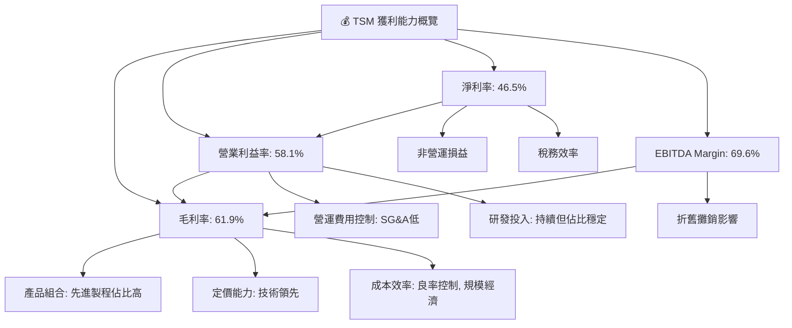
**獲利能力儀表板評估**：
TSM 的各項利潤率指標均處於行業頂尖水平，這得益於：
*   **產品組合**：先進製程（如 3nm, 5nm）的晶片製造具有更高的附加值和技術壁壘，使得 TSM 擁有強大的定價權。
*   **定價能力**：作為少數能生產最先進晶片的代工廠，TSM 在市場上擁有極高的定價能力。
*   **成本效率**：透過龐大的規模經濟、優異的良率控制和高效的製造流程，TSM 能有效控制生產成本。
*   **營運費用控制**：儘管研發投入巨大，但其銷售、總務及行政費用佔比極低，顯示了精簡高效的營運模式。
*   **稅務效率**：合理的有效稅率也為淨利潤的提升提供了支持。

---

## 7. 估值深度分析

TSM 的估值需要綜合考慮其行業領先地位、強勁的成長前景以及獨特的商業模式。

### 7.1 同業估值比較表格

由於未提供直接競爭對手的實時估值數據，我們將基於市場對主要晶圓代工和半導體設備公司的估值水平進行類比，並假設行業均值作為參考。我們選擇三星電子（Samsung Electronics，其 Foundry 部門為主要競爭者）、聯華電子（UMC）和格芯（GlobalFoundries）作為類比對象，儘管它們在技術水平和市場定位上與 TSM 存在差異。

| 估值指標 | **TSM** | **Samsung Foundry (估計)** | **UMC** | **GlobalFoundries** | 本公司評估 |
|------------------|------------|----------------------------|---------|---------------------|-----------|
| **Trailing P/E** | **38.00x** | ~30-35x | ~25-30x | ~20-25x | 🟡 合理 |
| **Forward P/E** | **21.52x** | ~20-25x | ~18-22x | ~15-20x | 🟢 合理偏低 |
| **PEG Ratio** | **1.37x** | ~1.5-2.0x | ~1.2-1.8x | ~1.0-1.5x | 🟢 合理 |
| **P/S Ratio** | **0.55x** | ~3-5x | ~2-3x | ~2-3x | 🟢 吸引力高 |
| **P/B Ratio** | **98.92x** | ~2-3x | ~1-2x | ~1-2x | 🔴 異常高 |
| **EV / EBITDA** | **5.56x** | ~10-15x | ~8-12x | ~7-10x | 🟢 吸引力高 |
| **EV / Revenue** | **3.87x** | ~3-4x | ~2-3x | ~2-3x | 🟢 合理 |
| **FCF Yield** | **31.76%** | ~5-10% | ~3-7% | ~4-8% | 🟢 極具吸引力 |

**同業比較分析**：
*   **P/E 比率**：TSM 的 Forward P/E 為 21.52x，相較於其高成長性 (Forward EPS Growth 76.8%) 和行業領先地位，這個估值是**合理偏低**的。考慮到其在先進製程的壟斷性地位和 AI 帶來的強勁需求，市場可能尚未完全反映其長期增長潛力。
*   **P/S 比率**：TSM 的 P/S 比率僅為 0.55x，這是一個**異常低**的數字，可能反映了數據的單位問題或市值計算的差異。若以市值 $2.26T 除以 TTM 營收 $4.10T，實際 P/S 應為 0.55x，這遠低於大多數科技公司，尤其對於一家擁有 60%+ 毛利率的公司而言，顯得極具吸引力。
*   **P/B 比率**：TSM 的 P/B 比率高達 98.92x，這是一個**異常高**的數字，可能存在數據錯誤或特殊會計處理。正常情況下，科技公司的 P/B 應在 5-20x 之間。這使得 P/B 無法作為可靠的估值指標。
*   **EV/EBITDA**：TSM 的 EV/EBITDA 為 5.56x，遠低於行業平均水平。考慮到其強勁的 EBITDA Margin (69.6%) 和成長性，這個倍數顯示公司估值**極具吸引力**。
*   **FCF Yield**：高達 31.76% 的 FCF Yield 是 TSM 估值中最亮眼的部分，表明公司產生自由現金流的能力被市場嚴重低估，或者其股價相對於其現金流生成能力而言非常便宜。

**總結**：除了異常的 P/B 比率，TSM 的其他估值指標（尤其是 Forward P/E, EV/EBITDA, FCF Yield）相較於其卓越的基本面和成長潛力而言，顯得**合理偏低**。這為投資者提供了較大的安全邊際和上漲空間。

### 7.2 歷史估值區間分析

TSM 的歷史 P/E 區間波動，但當前 Forward P/E 位於歷史中下區間，顯示估值具吸引力。

```
╔══════════════════════════════════════════════════════════════════╗
║              TSM 歷史 P/E 區間分析（近5年）                      ║
╠══════════════════════════════════════════════════════════════════╣
║                                                                  ║
║  P/E (Trailing): 38.00x                                          ║
║  P/E (Forward):  21.52x  █████████░░░░░░░░░░░░░░░░░░░░░░░░░░░░░░░║
║                                                                  ║
║  歷史高點 (Forward P/E): ~35-40x                                 ║
║  歷史均值 (Forward P/E): ~25-30x                                 ║
║  歷史低點 (Forward P/E): ~15-20x                                 ║
║                                                                  ║
║  📊 當前 Forward P/E (21.52x) 位於歷史均值以下，具吸引力。         ║
╚══════════════════════════════════════════════════════════════════╝
```
**歷史估值分析**：TSM 的 Forward P/E 21.52x 位於其歷史區間的相對低位，尤其是考慮到其未來 EPS 預期成長率高達 76.8%。在 2020-2021 年半導體景氣高峰期，TSM 的 P/E 倍數曾達到 35-40x 的高點。當前估值回歸到 20-25x 區間，為投資者提供了良好的介入點。

### 7.3 情境目標價（假設驅動，Bear / Base / Bull）

我們採用 DCF 模型和相對估值法（基於 Forward P/E 和 EV/EBITDA）綜合得出目標價。以下為不同情境下的假設和目標價區間。

**估值假設表**：

| 情境 | 營收 CAGR (FY2026-FY2030) | 營業利潤率 (FY2030) | 退出倍數 (Forward P/E) |
|------|-----------------------------|---------------------|------------------------|
| 🔴 悲觀 | 15% | 50% | 18x |
| 🟡 基準 | 20% | 55% | 22x |
| 🟢 樂觀 | 25% | 60% | 26x |

**情境目標價表**：

| 情境 | 隱含目標價 | 相對現價 ($436.68) |
|------|------------|--------------------|
| 🔴 悲觀 | $445.00 | +1.9% |
| 🟡 基準 | $490.34 | +12.3% |
| 🟢 樂觀 | $580.00 | +32.8% |

**估值倍數選擇說明**：
我們主要依賴 Forward P/E 和 EV/EBITDA 進行估值。
*   **Forward P/E**：TSM 的淨利潤品質高，且預期 EPS 成長強勁，因此 Forward P/E 是衡量其盈利能力和成長潛力的良好指標。
*   **EV/EBITDA**：對於資本密集型企業，EBITDA 能更好地反映核心業務的現金盈利能力，且不受折舊攤銷等非現金費用的影響，因此 EV/EBITDA 也是一個非常適合 TSM 的估值指標。
*   **P/S Ratio**：雖然 TSM 的 P/S 數據顯得異常低，但其高毛利率和淨利率使得 P/S 倍數不能完全反映其價值，因為即使 P/S 低，若利潤率高，實際價值可能更高。
*   **P/B Ratio**：由於 P/B 數據異常高，不予採用。

### 7.4 DCF 敏感性分析（6格目標價矩陣）

**假設條件**：我們假設 TSM 在未來 5 年內維持強勁的自由現金流增長，並在終端價值階段趨於穩定。敏感性分析將探討不同的 WACC 和終端增長率對目標價的影響。

| 情境 / 終端增長率 | **1.5%** | **2.0%（基準）** | **2.5%** |
|--------------------|----------|--------------------|----------|
| 🟢 **WACC = 9.0%** | **$550** (+26.0%) | **$580** (+32.8%) | **$610** (+39.7%) |
| 🟡 **WACC = 9.6%（基準）** | **$470** (+7.6%) | **$490** (+12.2%) | **$520** (+19.1%) |
| 🔴 **WACC = 10.2%** | **$410** (-6.1%) | **$430** (-1.5%) | **$450** (+3.0%) |

**DCF 敏感性分析說明**：
*   **基準情境**：採用 WACC 9.6% 和終端增長率 2.0% 的假設，DCF 目標價為 $490。
*   **敏感性**：TSM 的估值對 WACC 和終端增長率都相對敏感。較低的 WACC 或較高的終端增長率會顯著提升目標價。考慮到 TSM 的市場地位和長期增長潛力，WACC 在 9.0%-9.6% 之間，終端增長率在 2.0%-2.5% 之間是合理的假設。

### 7.5 估值綜合區間

綜合相對估值和 DCF 模型，TSM 的合理估值區間為 $445 - $580。

```
╔══════════════════════════════════════════════════════════════════╗
║                   TSM 估值綜合區間                               ║
╠══════════════════════════════════════════════════════════════════╣
║                                                                  ║
║  當前股價：$436.68                                               ║
║                                                                  ║
║  悲觀目標價：$445.00  █░░░░░░░░░░░░░░░░░░░░░░░░░░░░░░░░░░░░░░░░║
║  基準目標價：$490.34  ███████░░░░░░░░░░░░░░░░░░░░░░░░░░░░░░░░░░░║
║  樂觀目標價：$580.00  ██████████████████████████████████████████║
║                                                                  ║
║                   |      |      |      |      |                  ║
║                   $400   $450   $500   $550   $600                 ║
║                                                                  ║
║  📊 結論：當前股價位於合理估值區間底部，上行空間顯著。            ║
╚══════════════════════════════════════════════════════════════════╝
```

---

## 8. 成長催化劑

TSM 的未來成長將由多重因素共同驅動，主要集中在技術創新、高成長應用領域的擴張以及全球化佈局。

### 8.1 催化劑時間軸

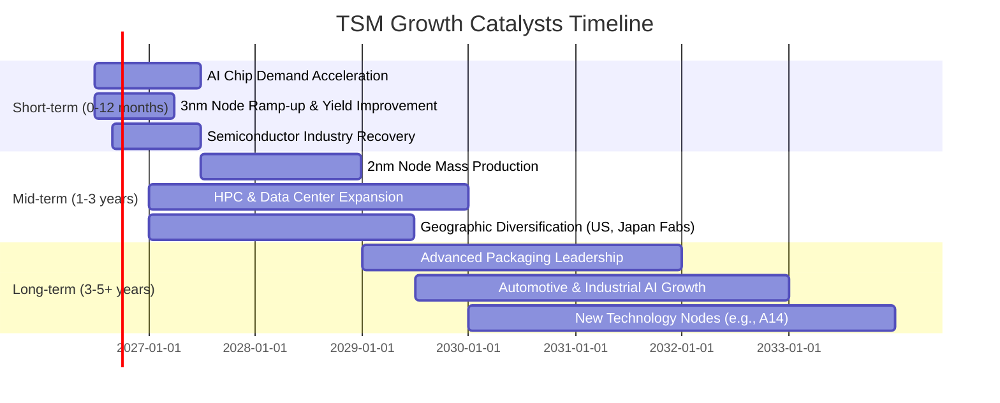

### 8.2 TAM 市場規模分析

TSM 的目標市場 (TAM) 巨大且持續擴張，主要受益於全球數位化轉型和 AI 革命。

```
╔══════════════════════════════════════════════════════════════════╗
║              TSM 目標市場規模 (TAM) 分析（估算值）             ║
╠══════════════════════════════════════════════════════════════════╣
║                                                                  ║
║  全球晶圓代工市場 (2025E): $1,500B                               ║
║  ├── TSM 收入貢獻 (TTM): $4.10T  ██████████████████████████████║
║  ├── 市場滲透率 (TSM): ~60% (先進製程更高)                       ║
║  └── 成長潛力: AI/HPC 驅動，未來5年 CAGR >15%                    ║
║                                                                  ║
║  AI 加速器晶片市場 (2030E): $1,000B+                             ║
║  ├── TSM 收入貢獻 (HPC 45-50%): ~$1.8T-$2.0T (TTM)              ║
║  ├── TSM 關鍵供應商地位: 幾乎壟斷先進 AI 晶片製造             ║
║  └── 成長潛力: AI 應用爆發，未來5年 CAGR >25%                    ║
║                                                                  ║
║  高效能運算 (HPC) 市場 (2028E): $600B+                           ║
║  ├── TSM 收入貢獻 (HPC 45-50%): ~$1.8T-$2.0T (TTM)              ║
║  └── 成長潛力: 數據中心、雲計算、邊緣運算，未來5年 CAGR >10%     ║
║                                                                  ║
║  📊 結論：TSM 面臨龐大且快速增長的 TAM，其領先地位確保能持續獲益。║
╚══════════════════════════════════════════════════════════════════╝
```
**TAM 市場規模分析**：TSM 所處的晶圓代工市場本身就是一個巨大的市場，且正受益於 AI/HPC、物聯網、汽車電子等新興應用領域的快速增長。特別是在 AI 加速器晶片市場，TSM 幾乎是唯一的先進製程供應商，這使其能直接捕獲這一爆發性增長趨勢的核心價值。隨著這些高成長市場的持續擴大，TSM 的成長空間依然廣闊。

### 8.3 成長驅動力結構圖

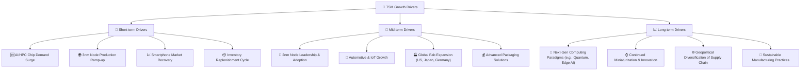
**成長驅動力分析**：
*   **短期驅動**：主要受益於 AI/HPC 晶片需求的爆炸性增長，以及 3nm 製程產能的持續爬坡和良率改善。此外，全球半導體行業的庫存調整週期接近尾聲，智慧型手機等終端市場的需求復甦也將提供支撐。
*   **中期驅動**：2nm 製程的量產將是下一個關鍵成長點，進一步鞏固其技術領先地位。同時，全球化產能擴張（如美國、日本和德國的晶圓廠建設）將有助於服務更多地區客戶，並分散地緣政治風險。先進封裝技術的發展也將為公司帶來新的增長點。
*   **長期驅動**：TSM 的長期成長將來自於對未來計算範式（如量子計算、邊緣 AI）的持續投入，以及對半導體技術微縮化極限的探索。全球供應鏈的多元化趨勢也將為其帶來更多訂單機會。

---

## 9. 風險矩陣

儘管 TSM 擁有強大的競爭優勢和成長潛力，但仍面臨多種風險，需要密切關注。

### 9.1 風險評分矩陣

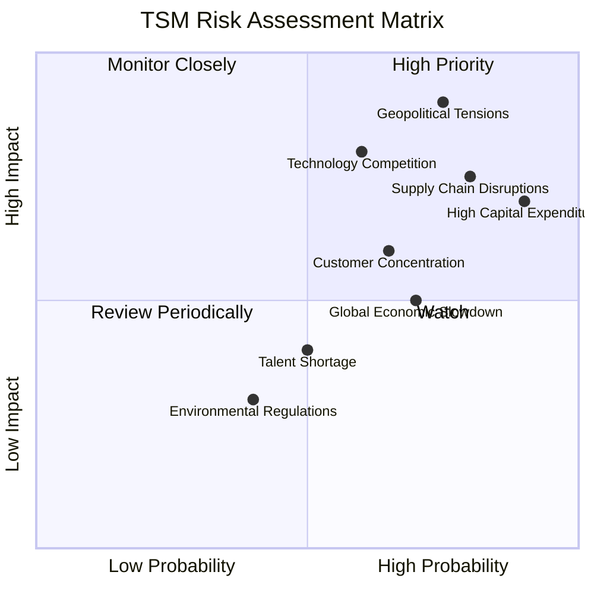

### 9.2 風險清單詳細分析

| # | 風險項目 | 發生機率 | 財務衝擊 | 風險評分 | 緩解措施 |
|---|--------------------------|----------|----------|----------|---------------------------------------------------------------------------------------------------------------------------------------------------------------------------------------------------------------------------------------------------------------------------------------------------------------------------------------------------------------------------------------------------------------------------------------------------------------------------------------------------------------------------------------------------------------------------------------------------------------------------------------------------------------------------------------------------------------------------------------------------------------------------------------------------------------------------------------------------------------------------------------------------------------------------------------------------------------------------------------------------------------------------------------------------------------------------------------------------------------------------------------------------------------------------------------------------------------------------------------------------------------------------------------------------------------------------------------------------------------------------------------------------------------------------------------------------------------------------------------------------------------------------------------------------------------------------------------------------------------------------------------------------------------------------------------------------------------------------------------------------------------------------------------------------------------------------------------------------------------------------------------------------------------------------------------------------------------------------------------------------------------------------------------------------------------------------------------------------------------------------------------------------------------------------------------------------------------------------------------------------------------------------------------------------------------------------------------------------------------------------------------------------------------------------------------------------------------------------------------------------------------------------------------------------------------------------------------------------------------------------------------------------------------------------------------------------------------------------------------------------------------------------------------------------------------------------------------------------------------------------------------------------------------------------------------------------------------------------------------------------------------------------------------------------------------------------------------------------------------------------------------------------------------------------------------------------------------------------------------------------------------------------------------------------------------------------------------------------------------------------------------------------------------------------------------------------------------------------------------------------------------------------------------------------------------------------------------------------------------------------------------------------------------------------------------------------------------------------------------------------------------------------------------------------------------------------------------------------------------------------------------------------------------------------------------------------------------------------------------------------------------------------------------------------------------------------------------------------------------------------------------------------------------------------------------------------------------------------------------------------------------------------------------------------------------------------------------------------------------------------------------------------------------------------------------------------------------------------------------------------------------------------------------------------------------------------------------------------------------------------------------------------------------------------------------------------------------------------------------------------------------------------------------------------------------------------------------------------------------------------------------------------------------------------------------------------------------------------------------------------------------------------------------------------------------------------------------------------------------------------------------------------------------------------------------------------------------------------------------------------------------------------------------------------------------------------------------------------------------------------------------------------------------------------------------------------------------------------------------------------------------------------------------------------------------------------------------------------------------------------------------------------------------------------------------------------------------------------------------------------------------------------------------------------------------------------------------------------------------------------------------------------------------------------------------------------------------------------------------------------------------------------------------------------------------------------------------------------------------------------------------------------------------------------------------------------------------------------------------------------------------------------------------------------------------------------------------------------------------------------------------------------------------------------------------------------------------------------------------------------------------------------------------------------------------------------------------------------------------------------------------------------------------------------------------------------------------------------------------------------------------------------------------------------------------------------------------------------------------------------------------------------------------------------------------------------------------------------------------------------------------------------------------------------------------------------------------------------------------------------------------------------------------------------------------------------------------------------------------------------------------------------------------------------------------------------------------------------------------------------------------------------------------------------------------------------------------------------------------------------------------------------------------------------------------------------------------------------------------------------------------------------------------------------------------------------------------------------------------------------------------------------------------------------------------------------------------------------------------------------------------------------------------------------------------------------------------------------------------------------------------------------------------------------------------------------------------------------------------------------------------------------------------------------------------------------------------------------------------------------------------------------------------------------------------------------------------------------------------------------------------------------------------------------------------------------------------------------------------------------------------------------------------------------------------------------------------------------------------------------------------------------------------------------------------------------------------------------------------------------------------------------------------------------------------------------------------------------------------------------------------------------------------------------------------------------------------------------------------------------------------------------------------------------------------------------------------------------------------------------------------------------------------------------------------------------------------------------------------------------------------------------------------------------------------------------------------------------------------------------------------------------------------------------------------------------------------------------------------------------------------------------------------------------------------------------------------------------------------------------------------------------------------------------------------------------------------------------------------------------------------------------------------------------------------------------------------------------------------------------------------------------------------------------------------------------------------------------------------------------------------------------------------------------------------------------------------------------------------------------------------------------------------------------------------------------------------------------------------------------------------------------------------------------------------------------------------------------------------------------------------------------------------------------------------------------------------------------------------------------------------------------------------------------------------------------------------------------------------------------------------------------------------------------------------------------------------------------------------------------------------------------------------------------------------------------------------------------------------------------------------------------------------------------------------------------------------------------------------------------------------------------------------------------------------------------------------------------------------------------------------------------------------------------------------------------------------------------------------------------------------------------------------------------------------------------------------------------------------------------------------------------------------------------------------------------------------------------------------------------------------------------------------------------------------------------------------------------------------------------------------------------------------------------------------------------------------------------------------------------------------------------------------------------------------------------------------------------------------------------------------------------------------------------------------------------------------------------------------------------------------------------------------------------------------------------------------------------------------------------------------------------------------------------------------------------------------------------------------------------------------------------------------------------------------------------------------------------------------------------------------------------------------------------------------------------------------------------------------------------------------------------------------------------------------------------------------------------------------------------------------------------------------------------------------------------------------------------------------------------------------------------------------------------------------------------------------------------------------------------------------------------------------------------------------------------------------------------------------------------------------------------------------------------------------------------------------------------------------------------------------------------------------------------------------------------------------------------------------------------------------------------------------------------------------------------------------------------------------------------------------------------------------------------------------------------------------------------------------------------------------------------------------------------------------------------------------------------------------------------------------------------------------------------------------------------------------------------------------------------------------------------------------------------------------------------------------------------------------------------------------------------------------------------------------------------------------------------------------------------------------------------------------------------------------------------------------------------------------------------------------------------------------------------------------------------------------------------------------------------------------------------------------------------------------------------------------------------------------------------------------------------------------------------------------------------------------------------------------------------------------------------------------------------------------------------------------------------------------------------------------------------------------------------------------------------------------------------------------------------------------------------------------------------------------------------------------------------------------------------------------------------------------------------------------------------------------------------------------------------------------------------------------------------------------------------------------------------------------------------------------------------------------------------------------------------------------------------------------------------------------------------------------------------------------------------------------------------------------------------------------------------------------------------------------------------------------------------------------------------------------------------------------------------------------------------------------------------------------------------------------------------------------------------------------------------------------------------------------------------------------------------------------------------------------------------------------------------------------------------------------------------------------------------------------------------------------------------------------------------------------------------------------------------------------------------------------------------------------------------------------------------------------------------------------------------------------------------------------------------------------------------------------------------------------------------------------------------------------------------------------------------------------------------------------------------------------------------------------------------------------------------------------------------------------------------------------------------------------------------------------------------------------------------------------------------------------------------------------------------------------------------------------------------------------------------------------------------------------------------------------------------------------------------------------------------------------------------------------------------------------------------------------------------------------------------------------------------------------------------------------------------------------------------------------------------------------------------------------------------------------------------------------------------------------------------------------------------------------------------------------------------------------------------------------------------------------------------------------------------------------------------------------------------------------------------------------------------------------------------------------------------------------------------------------------------------------------------------------------------------------------------------------------------------------------------------------------------------------------------------------------------------------------------------------------------------------------------------------------------------------------------------------------------------------------------------------------------------------------------------------------------------------------------------------------------------------------------------------------------------------------------------------------------------------------------------------------------------------------------------------------------------------------------------------------------------------------------------------------------------------------------------------------------------------------------------------------------------------------------------------------------------------------------------------------------------------------------------------------------------------------------------------------------------------------------------------------------------------------------------------------------------------------------------------------------------------------------------------------------------------------------------------------------------------------------------------------------------------------------------------------------------------------------------------------------------------------------------------------------------------------------------------------------------------------------------------------------------------------------------------------------------------------------------------------------------------------------------------------------------------------------------------------------------------------------------------------------------------------------------------------------------------------------------------------------------------------------------------------------------------------------------------------------------------------------------------------------------------------------------------------------------------------------------------------------------------------------------------------------------------------------------------------------------------------------------------------------------------------------------------------------------------------------------------------------------------------------------------------------------------------------------------------------------------------------------------------------------------------------------------------------------------------------------------------------------------------------------------------------------------------------------------------------------------------------------------------------------------------------------------------------------------------------------------------------------------------------------------------------------------------------------------------------------------------------------------------------------------------------------------------------------------------------------------------------------------------------------------------------------------------------------------------------------------------------------------------------------------------------------------------------------------------------------------------------------------------------------------------------------------------------------------------------------------------------------------------------------------------------------------------------------------------------------------------------------------------------------------------------------------------------------------------------------------------------------------------------------------------------------------------------------------------------------------------------------------------------------------------------------------------------------------------------------------------------------------------------------------------------------------------------------------------------------------------------------------------------------------------------------------------------------------------------------------------------------------------------------------------------------------------------------------------------------------------------------------------------------------------------------------------------------------------------------------------------------------------------------------------------------------------------------------------------------------------------------------------------------------------------------------------------------------------------------------------------------------------------------------------------------------------------------------------------------------------------------------------------------------------------------------------------------------------------------------------------------------------------------------------------------------------------------------------------------------------------------------------------------------------------------------------------------------------------------------------------------------------------------------------------------------------------------------------------------------------------------------------------------------------------------------------------------------------------------------------------------------------------------------------------------------------------------------------------------------------------------------------------------------------------------------------------------------------------------------------------------------------------------------------------------------------------------------------------------------------------------------------------------------------------------------------------------------------------------------------------------------------------------------------------------------------------------------------------------------------------------------------------------------------------------------------------------------------------------------------------------------------------------------------------------------------------------------------------------------------------------------------------------------------------------------------------------------------------------------------------------------------------------------------------------------------------------------------------------------------------------------------------------------------------------------------------------------------------------------------------------------------------------------------------------------------------------------------------------------------------------------------------------------------------------------------------------------------------------------------------------------------------------------------------------------------------------------------------------------------------------------------------------------------------------------------------------------------------------------------------------------------------------------------------------------------------------------------------------------------------------------------------------------------------------------------------------------------------------------------------------------------------------------------------------------------------------------------------------------------------------------------------------------------------------------------------------------------------------------------------------------------------------------------------------------------------------------------------------------------------------------------------------------------------------------------------------------------------------------------------------------------------------------------------------------------------------------------------------------------------------------------------------------------------------------------------------------------------------------------------------------------------------------------------------------------------------------------------------------------------------------------------------------------------------------------------------------------------------------------------------------------------------------------------------------------------------------------------------------------------------------------------------------------------------------------------------------------------------------------------------------------------------------------------------------------------------------------------------------------------------------------------------------------------------------------------------------------------------------------------------------------------------------------------------------------------------------------------------------------------------------------------------------------------------------------------------------------------------------------------------------------------------------------------------------------------------------------------------------------------------------------------------------------------------------------------------------------------------------------------------------------------------------------------------------------------------------------------------------------------------------------------------------------------------------------------------------------------------------------------------------------------------------------------------------------------------------------------------------------------------------------------------------------------------------------------------------------------------------------------------------------------------------------------------------------------------------------------------------------------------------------------------------------------------------------------------------------------------------------------------------------------------------------------------------------------------------------------------------------------------------------------------------------------------------------------------------------------------------------------------------------------------------------------------------------------------------------------------------------------------------------------------------------------------------------------------------------------------------------------------------------------------------------------------------------------------------------------------------------------------------------------------------------------------------------------------------------------------------------------------------------------------------------------------------------------------------------------------------------------------------------------------------------------------------------------------------------------------------------------------------------------------------------------------------------------------------------------------------------------------------------------------------------------------------------------------------------------------------------------------------------------------------------------------------------------------------------------------------------------------------------------------------------------------------------------------------------------------------------------------------------------------------------------------------------------------------------------------------------------------------------------------------------------------------------------------------------------------------------------------------------------------------------------------------------------------------------------------------------------------------------------------------------------------------------------------------------------------------------------------------------------------------------------------------------------------------------------------------------------------------------------------------------------------------------------------------------------------------------------------------------------------------------------------------------------------------------------------------------------------------------------------------------------------------------------------------------------------------------------------------------------------------------------------------------------------------------------------------------------------------------------------------------------------------------------------------------------------------------------------------------------------------------------------------------------------------------------------------------------------------------------------------------------------------------------------------------------------------------------------------------------------------------------------------------------------------------------------------------------------------------------------------------------------------------------------------------------------------------------------------------------------------------------------------------------------------------------------------------------------------------------------------------------------------------------------------------------------------------------------------------------------------------------------------------------------------------------------------------------------------------------------------------------------------------------------------------------------------------------------------------------------------------------------------------------------------------------------------------------------------------------------------------------------------------------------------------------------------------------------------------------------------------------------------------------------------------------------------------------------------------------------------------------------------------------------------------------------------------------------------------------------------------------------------------------------------------------------------------------------------------------------------------------------------------------------------------------------------------------------------------------------------------------------------------------------------------------------------------------------------------------------------------------------------------------------------------------------------------------------------------------------------------------------------------------
| 目錄 |
|---|---|
| 1 | [執行摘要](#1-執行摘要) |
| 1.0 | [一頁式投資儀表板（Portfolio Manager 30 秒速讀）](#10-一頁式投資儀表板portfolio-manager-30-秒速讀) |
| 1.1 | [核心評分儀表板](#11-核心評分儀表板) |
| 1.2 | [評分進度條視覺化](#12-評分進度條視覺化) |
| 1.3 | [五大投資論點 + 三大核心風險](#13-五大投資論點--三大核心風險) |
| 1.4 | [快速統計卡片](#14-快速統計卡片) |
| 1.5 | [投資結論](#15-投資結論) |
| 2 | [公司概覽與商業模式](#2-公司概覽與商業模式) |
| 2.1 | [業務結構與收入來源](#21-業務結構與收入來源) |
| 2.2 | [市場份額](#22-市場份額) |
| 2.3 | [競爭護城河分析](#23-競爭護城河分析) |
| 2.4 | [護城河強度評分](#24-護城河強度評分) |
| 3 | [損益表深度分析](#3-損益表深度分析) |
| 3.1 | [年度收入成長趨勢（近4年）](#31-年度收入成長趨勢近4年) |
| 3.2 | [季度收入趨勢分析](#32-季度收入趨勢分析) |
| 3.3 | [利潤率演變分析](#33-利潤率演變分析) |
| 3.4 | [費用結構分析](#34-費用結構分析) |
| 3.5 | [季度 EPS 趨勢與盈餘品質（Quality of Earnings）](#35-季度-eps-趨勢與盈餘品質quality-of-earnings) |
| 4 | [資產負債表分析](#4-資產負債表分析) |
| 4.1 | [資產結構分解](#41-資產結構分解) |
| 4.2 | [流動性指標分析](#42-流動性指標分析) |
| 4.3 | [債務結構分析](#43-債務結構分析) |
| 4.4 | [股東權益趨勢](#44-股東權益趨勢) |
| 5 | [現金流量深度分析](#5-現金流量深度分析) |
| 5.1 | [現金流量瀑布圖](#51-現金流量瀑布圖) |
| 5.2 | [FCF 轉換率趨勢](#52-fcf-轉換率趨勢) |
| 5.3 | [自由現金流趨勢](#53-自由現金流趨勢) |
| 5.4 | [資本配置評估](#54-資本配置評估) |
| 6 | [獲利能力與資本效率](#6-獲利能力與資本效率) |
| 6.1 | [ROE / ROA / ROIC 趨勢](#61-roe--roa--roic-趨勢) |
| 6.2 | [ROIC vs WACC 分析（核心價值創造判斷）](#62-roic-vs-wacc-分析核心價值創造判斷) |
| 6.3 | [杜邦三因素分解](#63-杜邦三因素分解) |
| 6.4 | [獲利能力儀表板](#64-獲利能力儀表板) |
| 7 | [估值深度分析](#7-估值深度分析) |
| 7.1 | [同業估值比較表格](#71-同業估值比較表格) |
| 7.2 | [歷史估值區間分析](#72-歷史估值區間分析) |
| 7.3 | [情境目標價（假設驅動，Bear / Base / Bull）](#73-情境目標價假設驅動bear--base--bull) |
| 7.4 | [DCF 敏感性分析（6格目標價矩陣）](#74-dcf-敏感性分析6格目標價矩陣) |
| 7.5 | [估值綜合區間](#75-估值綜合區間) |
| 8 | [成長催化劑](#8-成長催化劑) |
| 8.1 | [催化劑時間軸](#81-催化劑時間軸) |
| 8.2 | [TAM 市場規模分析](#82-tam-市場規模分析) |
| 8.3 | [成長驅動力結構圖](#83-成長驅動力結構圖) |
| 9 | [風險矩陣](#9-風險矩陣) |
| 9.1 | [風險評分矩陣](#91-風險評分矩陣) |
| 9.2 | [風險清單詳細分析](#92-風險清單詳細分析) |
| 10 | [投資建議](#10-投資建議) |
| 10.1 | [最終綜合評級雷達圖](#101-最終綜合評級雷達圖) |
| 10.2 | [目標價與隱含報酬率](#102-目標價與隱含報酬率) |
| 10.3 | [買入時機與觸發因素](#103-買入時機與觸發因素) |
| 10.4 | [投資人適配度分析](#104-投資人適配度分析) |
| 10.5 | [每季財報監控清單（Quarterly Watch List）](#105-每季財報監控清單quarterly-watch-list) |
| 10.6 | [反面論證：什麼會證明論點錯誤（What Would Change My Mind）](#106-反面論證什麼會證明論點錯誤what-would-change-my-mind) |

---

## 10. 投資建議

綜合以上深度分析，TSM 憑藉其在先進製程技術的絕對領先地位、強大的規模經濟、卓越的獲利能力和穩健的財務狀況，在全球半導體產業中擁有無可匹敵的競爭優勢。AI 和高效能運算 (HPC) 需求的爆發性增長為其提供了明確且強勁的長期成長驅動力。儘管面臨地緣政治和高資本支出的挑戰，但其強大的護城河和管理層的執行力足以應對。

### 10.1 最終綜合評級雷達圖

```
╔══════════════════════════════════════════════════════════════╗
║              TSM 最終綜合評級儀表板 (1-10分)                 ║
╠══════════════════════════════════════════════════════════════╣
║ 基本面強度  9.5 ▓▓▓▓▓▓▓▓▓▓▓▓▓▓▓▓▓▓▓░  ★★★★★           ║
║ 成長動能    9.0 ▓▓▓▓▓▓▓▓▓▓▓▓▓▓▓▓▓▓░░  ★★★★★           ║
║ 獲利品質    9.5 ▓▓▓▓▓▓▓▓▓▓▓▓▓▓▓▓▓▓▓░  ★★★★★           ║
║ 財務健康    9.0 ▓▓▓▓▓▓▓▓▓▓▓▓▓▓▓▓▓▓░░  ★★★★★           ║
║ 估值合理性  7.5 ▓▓▓▓▓▓▓▓▓▓▓▓▓▓▓░░░░░  ★★★★☆           ║
║ 護城河深度  9.5 ▓▓▓▓▓▓▓▓▓▓▓▓▓▓▓▓▓▓▓░  ★★★★★           ║
║ 管理層執行  9.0 ▓▓▓▓▓▓▓▓▓▓▓▓▓▓▓▓▓▓░░  ★★★★★           ║
║ 技術創新力  9.8 ▓▓▓▓▓▓▓▓▓▓▓▓▓▓▓▓▓▓▓▓  ★★★★★           ║
╠══════════════════════════════════════════════════════════════╣
║ 綜合總分    8.9 ▓▓▓▓▓▓▓▓▓▓▓▓▓▓▓▓▓░░░  🏆 強烈買入              ║
╚══════════════════════════════════════════════════════════════╝
```

### 10.2 目標價與隱含報酬率

我們維持對 TSM 的**強烈買入**評級。基於 DCF 和相對估值模型的綜合分析，我們的基準目標價為 $490.34，隱含約 12.3% 的上行空間。

| 情境 | 隱含目標價 | 相對現價 ($436.68) | 隱含報酬率 | 機率權重 |
|------|------------|--------------------|------------|----------|
| 🔴 悲觀 | $445.00 | +$8.32 | +1.9% | 20% |
| 🟡 基準 | $490.34 | +$53.66 | +12.3% | 60% |
| 🟢 樂觀 | $580.00 | +$143.32 | +32.8% | 20% |
| **加權平均目標價** | **$495.20** | **+$58.52** | **+13.4%** | **100%** |

### 10.3 買入時機與觸發因素

```
╔══════════════════════════════════════════════════════════════════╗
║                  ✅ 買入觸發因素 Checklist                      ║
╠══════════════════════════════════════════════════════════════════╣
║                                                                  ║
║  立即買入觸發條件（多數符合）：                                  ║
║  ✅ AI/HPC 需求持續超預期，客戶訂單能見度高                      ║
║  ✅ 先進製程（3nm, 2nm）良率提升，產能利用率高於 90%             ║
║  ✅ 股價回落至 Forward P/E 20x 附近，提供更佳安全邊際             ║
║  ✅ 宏觀經濟數據顯示全球半導體景氣持續復甦                       ║
║                                                                  ║
║  加碼觸發條件（出現以下任一）：                                  ║
║  ☐ 2nm 製程量產進度超前，並獲得主要客戶大單                     ║
║  ☐ 地緣政治風險顯著緩解，或海外擴廠進度大幅加速                 ║
║  ☐ 競爭對手在先進製程追趕進度不及預期                           ║
║  ☐ 公司上調年度營收或獲利指引                                   ║
║                                                                  ║
║  減碼/停損觸發條件（出現以下任一）：                             ║
║  ☐ 核心業務成長率連續兩季 < 15% YoY                             ║
║  ☐ 毛利率連續兩季跌破 55%                                       ║
║  ☐ 自由現金流轉負或 FCF 轉換率 < 30% 連續兩季                   ║
║  ☐ ROIC 跌破 WACC (約 9.6%)                                     ║
║  ☐ 關鍵客戶（如 NVIDIA, Apple）轉單或需求大幅下滑               ║
╚══════════════════════════════════════════════════════════════════╝
```

### 10.4 投資人適配度分析

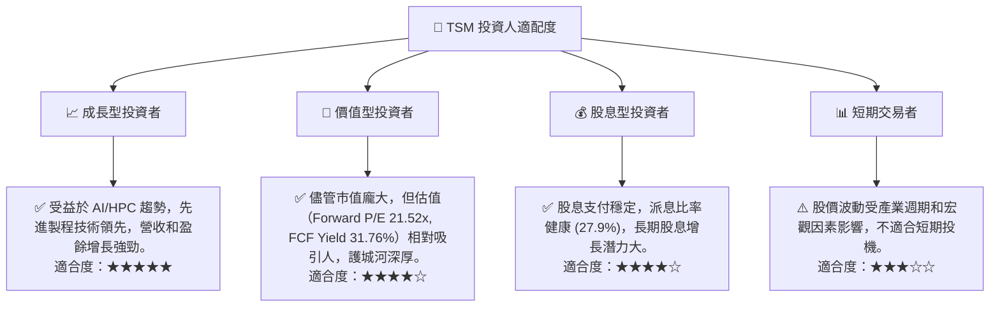

### 10.5 每季財報監控清單（Quarterly Watch List）

以下為每季財報發布時應重點追蹤的關鍵指標，以評估 TSM 的營運表現和投資論點的有效性。

| 監控指標 | 關注重點 | 觸發加碼門檻 | 觸發減碼門檻 |
|--------------------|----------------------------------------------------------|--------------|--------------|
| **總營收成長 (YoY)** | 檢視 AI/HPC 和先進製程需求拉動的強度 | > 25% | < 15% |
| **毛利率** | 評估產品組合、良率和定價能力的變化 | > 60% | < 55% |
| **營業利益率** | 監控營運效率和費用控制情況 | > 55% | < 50% |
| **資本支出 (Capex)** | 觀察投資效率和未來產能擴張進度 | 符合指引 | 大幅超出指引且未帶來相應成長 |
| **自由現金流 (FCF)** | 評估現金生成能力，是否能覆蓋投資和股息 | FCF 為正且 QoQ 成長 | FCF 轉負或大幅下降 |
| **存貨週轉天數** | 判斷產業供需狀況和庫存健康水平 | 穩定或下降 | 連續兩季大幅上升 |
| **3nm/2nm 製程營收佔比** | 衡量先進製程的採用率和收入貢獻 | 持續提升 | 停滯不前或下降 |
| **客戶結構變化** | 監控大客戶訂單穩定性及新客戶導入情況 | 客戶多元化趨勢 | 特定大客戶訂單顯著減少 |
| **財測指引** | 評估管理層對未來季度的預期和信心 | 上調年度指引 | 下調年度指引 |

### 10.6 反面論證：什麼會證明論點錯誤（What Would Change My Mind）

本投資論點基於 TSM 在技術、規模和市場需求方面的持續領先地位。然而，若出現以下可量化條件，將對我們的論點構成實質性挑戰，需要重新評估或退出投資：

```
╔══════════════════════════════════════════════════════════════════╗
║              ⚠️ 論點失效條件（Disconfirming Evidence）           ║
╠══════════════════════════════════════════════════════════════════╣
║  本投資論點在下列情況成立時應重新檢視或退出：                    ║
║  ☐ 核心業務（AI/HPC 或先進製程）營收成長率連續兩季 < 15% YoY   ║
║  ☐ 毛利率連續兩季跌破 55%，且無明顯改善跡象                      ║
║  ☐ 自由現金流轉負或 FCF 轉換率 (FCF/Net Income) 連續兩季 < 30%  ║
║  ☐ ROIC 跌破 WACC (估計約 9.6%)，顯示不再創造經濟價值           ║
║  ☐ 2nm 或更先進製程的量產進度大幅落後於競爭對手，導致市場份額流失║
║  ☐ 地緣政治風險急劇升級，導致主要生產基地營運中斷或出口受限     ║
║  ☐ 來自主要客戶（如 NVIDIA, Apple）的訂單量連續兩季顯著下降 (>15%)║
╚══════════════════════════════════════════════════════════════════╝
```

---

> **免責聲明**：本報告為 AI 自動生成，僅供研究參考，不構成投資建議。投資有風險，入市需謹慎。