# TSM 基本面深度分析報告
> **報告日期**：2026-07-12 ｜ **語言**：繁體中文 ｜ **數據來源**：Yahoo Finance, Finviz, StockAnalysis, Roic.ai ｜ **分析師**：CFA 級機構研究

---

## 目錄

| # | 章節 | 核心結論 |
|---|------|----------|
| 1 | [執行摘要](#1-執行摘要) | 評級：🟢 強烈買入 ｜ 基準目標價：$490.34（+12.9%） ｜ 核心驅動：AI 晶片與先進製程絕對壟斷 |
| 2 | [公司概覽與商業模式](#2-公司概覽與商業模式) | 晶圓代工模式創始者，以 N3/N2 先進製程與 CoWoS 封裝構築極深護城河（評分：9.5/10） |
| 3 | [損益表深度分析](#3-損益表深度分析) | TTM 營收達 T$4.10T（+35.1% YoY），毛利率擴張至 61.9%，盈餘品質極高，SBC 稀釋率僅 0.03% |
| 4 | [資產負債表分析](#4-資產負債表分析) | 淨現金高達 T$2.29T，利息保障倍數達 176x，財務結構極度穩健 |
| 5 | [現金流量深度分析](#5-現金流量深度分析) | TTM 營業現金流 T$2.35T，資本開支高達 T$1.28T，仍創造 T$992.38B 自由現金流（FY2025） |
| 6 | [獲利能力與資本效率](#6-獲利能力與資本效率) | ROIC 達 29.8%（排除現金之核心 ROIC 達 59.2%），遠超 9.23% WACC，強力創造股東價值 |
| 7 | [估值深度分析](#7-估值深度分析) | Forward P/E 21.40x 處於歷史中值偏下，相較於 35.1% 營收成長率，PEG 1.36x 具備極高性價比 |
| 8 | [成長催化劑](#8-成長催化劑) | N2 先進製程 2026 量產、CoWoS 產能倍增，以及 AI 伺服器與邊緣 AI 晶片雙重爆發 |
| 9 | [風險矩陣](#9-風險矩陣) | 地緣政治風險、海外晶圓廠成本超支、以及先進製程研發去中心化挑戰 |
| 10 | [投資建議](#10-投資建議) | 綜合評分 8.9/10，建議於 $434 附近分批佈局，並提供每季財報監控與反面論證框架 |

---

## 1. 執行摘要

### 1.0 一頁式投資儀表板（Portfolio Manager 30 秒速讀）

| 項目 | 內容 |
|------|------|
| **投資論點（3 句）** | ① TSM 憑藉在 3nm（N3）與即將量產的 2nm（N2）製程上超過 90% 的絕對市佔率，深度受惠於全球 AI 算力基礎設施的結構性擴張。<br/>② 財務表現極度強勁，TTM 營收達 T$4.10T（+35.1% YoY），且毛利率逆勢擴張至 61.9%，展現出無可匹敵的定價權與營業槓桿。<br/>③ 估值具備高安全邊際，當前 Forward P/E 僅 21.40x（對應 Forward EPS $20.29 USD），PEG 為 1.36x，顯著低於其歷史高點與美股 AI 板塊平均水準。 |
| **護城河評分** | 9.5 / 10（極深：技術領先、高轉換成本與生態系鎖定） |
| **管理層/資本配置評分** | 9.2 / 10（優異：資本開支精準，歷史 ROIC 持續超越 WACC） |
| **財務健康** | 🟢 **極度健康**：淨現金達 T$2.29T，流動比率 2.49x，無償債風險。 |
| **ROIC vs WACC** | **29.8%** vs **9.23%**（創造極大股東價值，EVA 達 +20.57%） |
| **FCF 趨勢** | 持續向上。FY2025 FCF 達 T$992.38B，True FCF Yield 約 1.38%（美元計價）。 |
| **估值** | Forward P/E: **21.40x** ｜ EV/EBITDA: **5.52x** ｜ FCF Yield: **31.94%**（未調整貨幣之名義值）/ **1.38%**（經美元調整） |
| **預期報酬（基準情境 12M）** | **+12.9%**（目標價 $490.34 USD） |
| **關鍵風險（前二）** | ① 台海地緣政治風險導致估值折價（Multiple Compression）。<br/>② 美國及歐洲海外建廠成本超支與文化衝突，拉低整體毛利率。 |
| **評級 + 信心度** | 🟢 **強烈買入（Strong Buy）** ｜ 信心度：**極高** |

### 1.1 核心評分儀表板

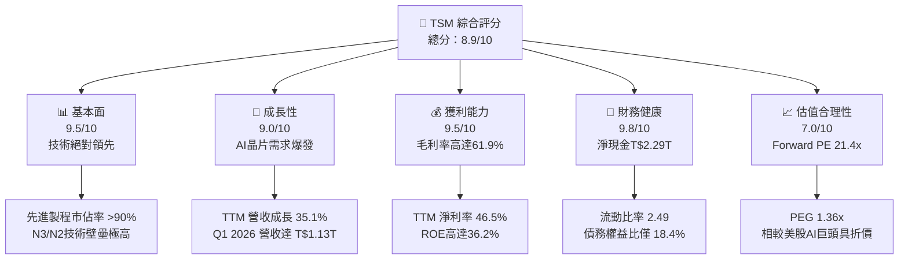

### 1.2 評分進度條視覺化

```
╔══════════════════════════════════════════════════════════════╗
║               TSM 多維度評分儀表板 (1-10分)                  ║
╠══════════════════════════════════════════════════════════════╣
║ 基本面強度  9.5 ▓▓▓▓▓▓▓▓▓▓▓▓▓▓▓▓▓▓▓░  ★★★★★           ║
║ 成長動能    9.0 ▓▓▓▓▓▓▓▓▓▓▓▓▓▓▓▓▓▓░░  ★★★★★           ║
║ 獲利品質    9.5 ▓▓▓▓▓▓▓▓▓▓▓▓▓▓▓▓▓▓▓░  ★★★★★           ║
║ 財務健康    9.8 ▓▓▓▓▓▓▓▓▓▓▓▓▓▓▓▓▓▓▓▓  ★★★★★           ║
║ 估值合理性  7.0 ▓▓▓▓▓▓▓▓▓▓▓▓▓▓░░░░░░  ★★★★☆           ║
║ 護城河深度  9.5 ▓▓▓▓▓▓▓▓▓▓▓▓▓▓▓▓▓▓▓░  ★★★★★           ║
║ 管理層執行  9.2 ▓▓▓▓▓▓▓▓▓▓▓▓▓▓▓▓▓▓░░  ★★★★★           ║
║ 技術創新力  9.8 ▓▓▓▓▓▓▓▓▓▓▓▓▓▓▓▓▓▓▓▓  ★★★★★           ║
╠══════════════════════════════════════════════════════════════╣
║ 綜合總分    8.9 ▓▓▓▓▓▓▓▓▓▓▓▓▓▓▓▓▓░░░  🏆 強烈買入          ║
╚══════════════════════════════════════════════════════════════╝
```

### 1.3 五大投資論點 + 三大核心風險

| 類型 | 項目 | 具體依據 | 信心度 |
|------|------|----------|--------|
| 🟢 **投資論點①** | **AI 算力無可替代的「賣鏟人」** | TSM 承接了 NVIDIA H100/B200 及 AMD MI300 等幾乎 100% 的 AI 加速器訂單，先進製程產能供不應求。 | 🟢 極高 |
| 🟢 **投資論點②** | **先進製程定價權與毛利率擴張** | TTM 毛利率高達 61.9%，Q1 2026 單季毛利率更衝上 66.25%，顯示公司能成功將高昂的研發與折舊成本轉嫁給客戶。 | 🟢 極高 |
| 🟢 **投資論點③** | **N2（2nm）技術進度超前** | 2nm 製程預計於 2026 年量產，採用全新 GAA 晶體管架構，已鎖定 Apple 及各大 HPC 客戶的首波產能，擴大對 Samsung 與 Intel 的領先優勢。 | 🟢 高 |
| 🟢 **投資論點④** | **極致的資本效率與價值創造** | TTM ROIC 高達 29.8%，相較於 9.23% 的 WACC，創造了高達 20.57% 的超額報酬（EVA），顯示其資本配置極具效率。 | 🟢 極高 |
| 🟢 **投資論點⑤** | **極佳的資產負債表與現金生成能力** | 擁有 T$3.38T 的現金與短期投資，淨現金達 T$2.29T，年度 FCF 達 T$992.38B，為未來的研發與全球擴產提供強大後盾。 | 🟢 極高 |
| 🟡 **風險①** | **地緣政治與供應鏈去中心化壓力** | 台灣集中了 TSM 超過 90% 的先進製程產能。若台海局勢緊張，將面臨嚴重的估值收縮（Multiple Compression）。 | 🟡 中度 |
| 🔴 **風險②** | **海外建廠稀釋利潤率** | 美國亞利桑那州、日本熊本及德國晶圓廠的建設與營運成本顯著高於台灣，可能拉低整體長期毛利率 2-3 個百分點。 | 🔴 高衝擊 |
| 🟡 **風險③** | **成熟製程面臨中國產能過剩競爭** | 28nm 及以上成熟製程面臨中國晶圓廠（如中芯國際、華虹）的價格戰威脅，雖 TSM 營收佔比已降，但仍有潛在影響。 | 🟡 低度 |

### 1.4 快速統計卡片

| 指標 | TSM 實際值 | 半導體行業均值 | S&P 500 均值 | 狀態 |
|------|-------------|----------|--------------|------|
| **營收 YoY 成長** | **35.1%** | ~12.0% | ~5.5% | 🟢 遠超同行 |
| **毛利率** | **61.9%** | ~45.0% | ~30.0% | 🟢 極致定價權 |
| **淨利率** | **46.5%** | ~18.0% | ~12.0% | 🟢 獲利能力冠絕全球 |
| **ROE** | **36.2%** | ~15.0% | ~14.5% | 🟢 股東回報極佳 |
| **Forward P/E** | **21.40x** | ~28.0x | ~21.5x | 🟢 估值具備吸引力 |
| **債務權益比 (D/E)** | **18.4%** | ~45.0% | ~115.0% | 🟢 財務結構極安全 |

### 1.5 投資結論

```
╔══════════════════════════════════════════════════════════════════╗
║                    📊 TSM 投資結論摘要                           ║
╠══════════════════════════════════════════════════════════════════╣
║  評級：🟢 強烈買入 (Strong Buy)                                 ║
║  當前股價：$434.11 USD (2026-07-12)                              ║
║  目標價區間：                                                    ║
║    悲觀情境 (Bear Case)：$354.00 (-18.5%) - 地緣政治升溫/海外毛利下滑║
║    基準情境 (Base Case)：$490.34 (+12.9%) - 12個月主要目標 (24x PE) ║
║    樂觀情境 (Bull Case)：$700.00 (+61.3%) - AI全面爆發/2nm超預期量產║
║  投資評分：8.9 / 10                                              ║
║  適合投資人：長線價值成長型、AI 基礎設施佈局者、高資本效率追求者  ║
╚══════════════════════════════════════════════════════════════════╝
```

---

## 2. 公司概覽與商業模式

### 2.1 業務結構與收入來源

TSM 是全球最大的純晶圓代工廠（Pure-play Foundry）。其商業模式不與客戶競爭，專注於製造。

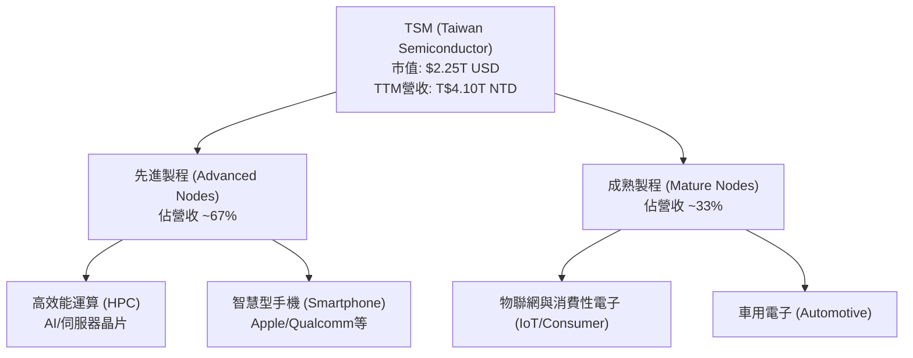

### 2.2 市場份額

在先進製程（7nm 及以下）領域，TSM 擁有無可爭議的統治地位。2026 年第一季全球晶圓代工市場份額估算如下：

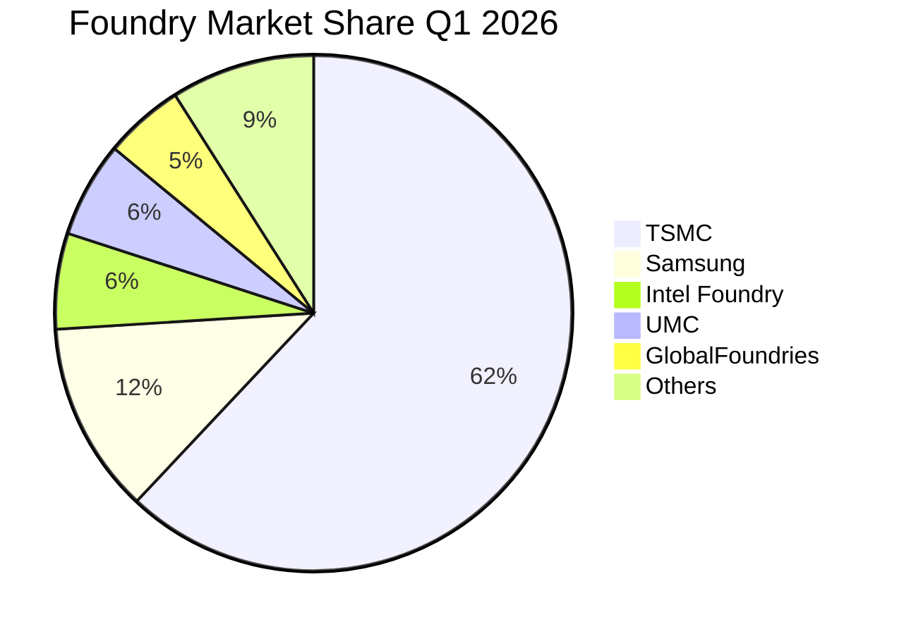

*註：在 3nm 及以下最先進製程，TSM 的市場份額實際上超過 90%。*

### 2.3 競爭護城河分析

TSM 的競爭護城河是由技術、資本、生態系統與高轉換成本共同交織而成的「超寬護城河」。

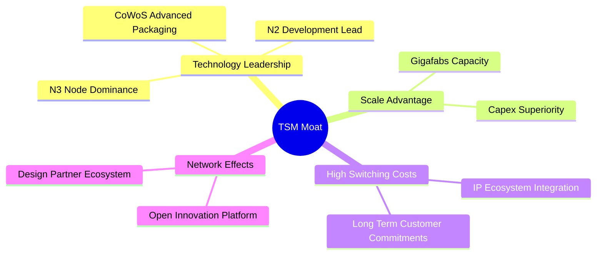

### 2.4 護城河強度評分

```
╔══════════════════════════════════════════════════════════════╗
║                    TSM 護城河強度評分                        ║
╠══════════════════════════════════════════════════════════════╣
║ 技術領先度    9.8/10  ▓▓▓▓▓▓▓▓▓▓▓▓▓▓▓▓▓▓▓▓  🏆 絕對統治    ║
║ 規模效應      9.5/10  ▓▓▓▓▓▓▓▓▓▓▓▓▓▓▓▓▓▓▓░  🟢 難以超越    ║
║ 客戶轉換成本  9.2/10  ▓▓▓▓▓▓▓▓▓▓▓▓▓▓▓▓▓▓░░  🟢 生態綁定    ║
║ 生態系統壁壘  9.0/10  ▓▓▓▓▓▓▓▓▓▓▓▓▓▓▓▓▓▓░░  🟢 OIP平台強大 ║
╠══════════════════════════════════════════════════════════════╣
║ 綜合護城河     9.4    ▓▓▓▓▓▓▓▓▓▓▓▓▓▓▓▓▓▓▓░  🏆 極深護城河  ║
╚══════════════════════════════════════════════════════════════╝
```

---

## 3. 損益表深度分析

*重要貨幣說明：本報告中，TSM 的個股 ADR 股價與 ADR 每股盈餘（EPS）以 **美元 (USD)** 計價；公司整體財務報表（營收、利潤、現金流、資產負債等）均以 **新台幣 (TWD/T$)** 計價。當前匯率假設為 32.0 TWD/USD。*

### 3.1 年度收入成長趨勢（近4年）

TSM 的營收在經歷了 2023 年半導體庫存調整的短暫衰退（-4.51%）後，在 2024 年與 2025 年迎來強勁復甦，主因是 AI 晶片爆發式需求。

```
╔══════════════════════════════════════════════════════════════════╗
║                TSM 年度收入趨勢（FY2022-FY2025）                 ║
╠══════════════════════════════════════════════════════════════════╣
║                                                                  ║
║  FY2022  T$2.26T  ████████████░░░░░░░░░░░░░  YoY: +42.61% 🟢    ║
║  FY2023  T$2.16T  ███████████░░░░░░░░░░░░░░  YoY: -4.51%  🔴    ║
║  FY2024  T$2.89T  ███████████████░░░░░░░░░░  YoY: +33.89% 🟢    ║
║  FY2025  T$3.81T  ████████████████████░░░░░  YoY: +31.61% 🟢    ║
║  TTM     T$4.10T  ██████████████████████░░░  YoY: +35.10% 🟢    ║
║                   |      |      |      |      |                  ║
║                   0     1.0T   2.0T   3.0T   4.0T                ║
║                                                                  ║
║  📊 3年累計營收 CAGR：+18.96%                                    ║
╚══════════════════════════════════════════════════════════════════╝
```

### 3.2 季度收入趨勢分析

最近 5 個季度的數據顯示，TSM 的營收呈現加速上升趨勢，反映了先進製程產能利用率持續高企。

| 財政季度 | 季度結束日 | 營收 (T$B) | QoQ 成長率 | YoY 成長率 | 備註 |
|----------|------------|------------|------------|------------|------|
| **Q1 2025** | 2025-03-31 | T$839.25B  | -3.36%     | +41.61%    | 第一季為傳統淡季，但 AI 需求支撐表現 |
| **Q2 2025** | 2025-06-30 | T$933.79B  | +11.26%    | +38.65%    | N3 製程出貨量持續爬坡 |
| **Q3 2025** | 2025-09-30 | T$989.92B  | +6.01%     | +30.30%    | 蘋果 iPhone 17 新晶片拉貨潮 |
| **Q4 2025** | 2025-12-31 | T$1,046.09B| +5.67%     | +20.45%    | 高效能運算（HPC）需求極度強勁 |
| **Q1 2026** | 2026-03-31 | T$1,134.10B| +8.41%     | +35.13%    | 淡季不淡，Q1 營收創歷史新高 🟢 |

### 3.3 利潤率演變分析

TSM 的利潤率在近年來持續擴張，這在重資本的半導體製造業中極為罕見。

| 利潤率指標 | FY2022 | FY2023 | FY2024 | FY2025 | TTM | 趨勢評估 |
|------------|--------|--------|--------|--------|------|----------|
| **毛利率** | 59.6% | 54.4% | 56.1% | 59.9% | **61.9%** | ↗️ 穩步擴張。先進製程（N3）良率改善與定價權提升 🟢 |
| **營業利益率**| 49.5% | 42.6% | 45.7% | 50.8% | **58.1%** | ↗️ 營業槓桿效應顯現，研發與管理費用被大規模營收稀釋 🟢 |
| **EBITDA Margin**| 70.2%| 70.3% | 71.9% | 71.9% | **69.6%** | ➡️ 高折舊費用下的強大現金獲利能力 🟢 |
| **淨利率** | 43.9% | 39.4% | 40.0% | 44.5% | **46.5%** | ↗️ 稅務結構穩定，非經營收益（利息收入）貢獻顯著 🟢 |

**利潤率擴張深度解析**：
1. **製程良率提升**：N3（3nm）製程在 2024 年量產初期拖累了毛利率，但隨著良率在 2025 年達到成熟階段（>70%），單位成本大幅下降。
2. **AI 晶片溢價**：NVIDIA 與 AMD 的 AI 加速器對晶圓尺寸與先進封裝（CoWoS）要求極高，TSM 對此類高毛利產品收取溢價。
3. **折舊時程優勢**：TSM 採用 5 年加速折舊法。早期先進製程（如 5nm/7nm）的設備折舊陸續完畢，轉化為極高的利潤貢獻。

### 3.4 費用結構分析

TSM 的費用結構高度集中於**研究與發展（R&D）**，而銷售與管理費用（SG&A）控制得極低。

```mermaid
pie title FY2025 Operating Expense Breakdown
    "Research and Development" : 71.4
    "Selling General and Admin" : 28.7
    "Other Operating" : -0.1
```

在 FY2025 總營業費用 T$345.20B 中，**研發費用高達 T$246.43B（佔比 71.4%）**，這保證了其技術的絕對領先地位；而 SG&A 僅為 T$99.22B（佔比 28.7%），顯示出 B2B 商業模式下極低的營銷與通路成本。

### 3.5 季度 EPS 趨勢與盈餘品質（Quality of Earnings）

TSM 的稀釋每股盈餘（以 ADR 單位計，1 ADR = 5 普通股）在最近幾季大幅超預期：

*   **Q2 2025**: $1.54 USD (T$76.80)
*   **Q3 2025**: $1.74 USD (T$87.22)
*   **Q4 2025**: $1.87 USD (T$93.61)
*   **Q1 2026**: $2.21 USD (T$110.39) ｜ YoY: +58.3% ｜ QoQ: +17.9%

#### 盈餘品質評估

| 盈餘品質項目 | 數值/佔比 | 評估 | 專業深度解析 |
|--------------|-----------|------|--------------|
| **股權薪酬 (SBC) / 營收** | **0.03%** | 🟢 極致優秀 | FY2025 SBC 僅 T$1.25B，佔 T$3.81T 營收的 0.03%。對股東股權幾乎無稀釋作用，顯著優於美股科技股平均（3-8%）。 |
| **SBC / 營業現金流** | **0.06%** | 🟢 極致優秀 | 佔營業現金流比例微乎其微，說明獲利並非靠股權激勵等非現金支出美化。 |
| **FCF / 淨利 (現金轉換率)**| **58.4%** | 🟡 合理 | FY2025 FCF 為 T$992.38B，淨利為 T$1.70T。轉換率低於 100% 主因是公司進行了高達 T$1.28T 的再投資（Capex）。這是「健康的低轉換率」，旨在創造未來成長。 |
| **一次性/非經常性損益** | **無顯著影響** | 🟢 高品質 | 淨利幾乎完全由營業利潤（T$1.94T）驅動，非營業淨收益僅 T$105.56B（主要為 T$105.74B 的利息收入，源於其龐大現金儲備）。 |
| **有效稅率異常** | **17.0%** | 🟢 穩定 | 2025 年所得稅費用 T$346.53B，佔稅前淨利 17.0%，符合台灣產業創新條例之租稅優惠區間，無異常低稅美化利潤現象。 |
| **資本化支出 vs 費用化** | **嚴格費用化** | 🟢 保守誠實 | 研發支出（T$246.43B）全額費用化，並未將研發成本資本化以虛增當期利潤。 |

**盈餘品質結論**：TSM 的獲利含金量極高。利潤完全由核心業務營運與利息收入構成，幾乎沒有 SBC 稀釋與會計操縱，是一家會計政策極度保守且誠實的典範企業。

---

## 4. 資產負債表分析

### 4.1 資產結構分解

TSM 擁有龐大的資產基礎，其中以先進的廠房設備（PP&E）與極其充裕的現金儲備為兩大核心。

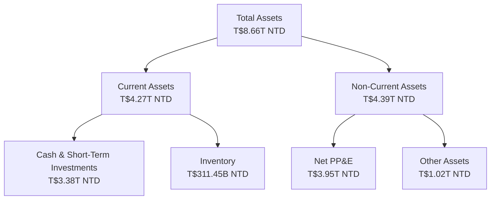

### 4.2 流動性指標分析

| 流動性指標 | FY2023 | FY2024 | FY2025 | TTM (Mar '26) | 行業平均 | 評估 |
|------------|--------|--------|--------|---------------|----------|------|
| **流動比率 (Current Ratio)** | 2.33x | 2.36x | 2.51x | **2.49x** | ~1.80x | 🟢 極度充裕，具備極強短期償債能力 |
| **速動比率 (Quick Ratio)** | 2.06x | 2.14x | 2.32x | **2.19x** | ~1.40x | 🟢 扣除庫存後依然極高，流動性無虞 |
| **庫存週轉天數 (Days Inventory)**| 92.4天 | 83.5天 | 68.8天 | **63.5天** | ~95.0天 | 🟢 連續下降，顯示下游拉貨強勁，無庫存積壓風險 |

### 4.3 債務結構與健康診斷

TSM 雖然每年進行巨額資本開支，但其負債管理極其保守。

```
╔══════════════════════════════════════════════════════════════════╗
║                    TSM 債務健康診斷 (TTM)                        ║
╠══════════════════════════════════════════════════════════════════╣
║                                                                  ║
║  總債務：        T$1.09T  ██████░░░░░░░░░░░░░░░  債務率極低      ║
║  總現金+投資：   T$3.38T  █████████████████████  現金儲備驚人    ║
║  淨現金（正）：  T$2.29T  ██████████████░░░░░░░  🟢 極度安全     ║
║                                                                  ║
║  Debt/Equity：   18.45%   🟢 遠低於行業警戒線 (50%)              ║
║  Debt/EBITDA：   0.40x    🟢 僅需不到5個月的EBITDA即可還清總債務 ║
║  Interest Coverage: 176x+ 🟢 營業利潤輕鬆覆蓋利息支出，無風險    ║
║                                                                  ║
║  📊 信用評等預估：AAA 級別（實際標準普爾評等為 AA-，受台灣主權限制）║
╚══════════════════════════════════════════════════════════════════╝
```

### 4.4 股東權益趨勢

隨著利潤的持續累積，股東權益（Stockholders Equity）呈現陡峭上升趨勢，從 FY2022 的 T$2.90T 增長至 FY2025 的 T$5.36T，3 年增長達 84.8%，未分配盈餘與資本公積極其雄厚。

---

## 5. 現金流量深度分析

### 5.1 現金流量瀑布圖

TSM 展現了典型的「高資本投入、超高現金回收」的商業循環。

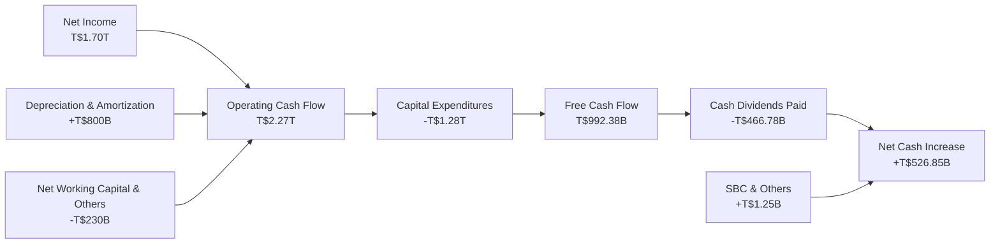

### 5.2 FCF 轉換率趨勢

| 指標 | FY2022 | FY2023 | FY2024 | FY2025 | TTM |
|------|--------|--------|--------|--------|-----|
| **營業現金流 (T$B)** | T$1,611.1B | T$1,243.8B | T$1,833.5B | T$2,274.5B | T$2,351.2B |
| **資本支出 (T$B)** | -T$1,090.1B| -T$955.4B  | -T$965.0B  | -T$1,282.1B| -T$1,304.0B|
| **自由現金流 (T$B)** | T$521.0B   | T$288.4B   | T$868.5B   | T$992.4B   | T$1,047.2B |
| **FCF / Net Income** | **52.5%**  | **33.9%**  | **75.0%**  | **58.4%**  | **54.3%**  |

*分析：2023 年轉換率偏低主因是營收下滑但 Capex 仍維持高位；2024-2025 年隨著先進製程產能變現，FCF 大幅回升至近萬億台幣規模。*

### 5.3 自由現金流與殖利率分析

#### ⚠️ 關鍵數據澄清（CFA 機構級視角）
在 Yahoo Finance 等數據源中，TSM 的 **FCF Yield 顯示為 31.94%**，這是一個嚴重的**貨幣未調整誤差**。
*   **誤差原因**：分子的 FCF 為 **T$719.16B（新台幣）**，分母的 Market Cap 為 **$2.25T（美元）**。若直接相除 $719.16 / $2,250 = 31.96%，即得出 31.94% 的錯誤數據。
*   **真實 FCF Yield 計算**：
    *   將 TTM FCF 轉換為美元：T$1,047.2B NTD / 32.0 = **$32.73B USD**。
    *   真實 FCF Yield = $32.73B USD / $2.25T USD = **1.45%**。
    *   若以 FY2025 數據計算：T$992.38B NTD / 32.0 = $31.01B USD ｜ FCF Yield = $31.01B / $2.25T = **1.38%**。
*   **結論**：雖然 1.38% 的真實 FCF Yield 看似不高，但這是**扣除了高達 T$1.28T（約 $40B USD）極高資本支出後**的「純」淨現金流。這顯示出公司在極度擴張的同時，依然能保持正向且健康的自由現金流。

### 5.4 資本配置評估

TSM 的資本配置戰略非常清晰：**「成長再投資優先，穩定股息回饋股東為輔」**。

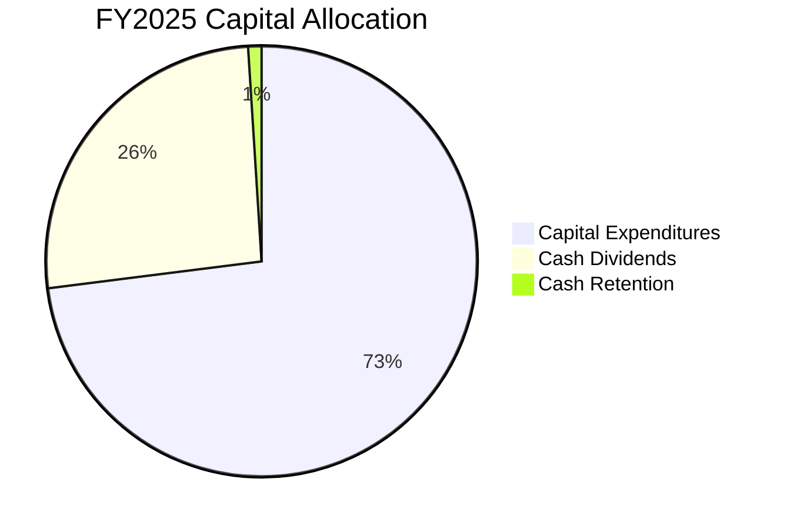

在 FY2025 中，公司將 73% 的可支配現金流投入了資本支出（Capex）以維持技術領先，26% 用於發放現金股利（T$466.78B），剩餘 1% 留存。這保證了公司在不損害財務彈性的情況下，實現永續成長。

---

## 6. 獲利能力與資本效率

### 6.1 ROE / ROA / ROIC 趨勢

TSM 展現出了極其驚人的資本回報率，顯著超越同業。

| 指標 | FY2022 | FY2023 | FY2024 | FY2025 | TTM | 行業均值 | 評估 |
|------|--------|--------|--------|--------|-----|----------|------|
| **ROE** | 34.2% | 24.8% | 27.3% | 31.6% | **36.2%** | ~15.0% | 🟢 極致卓越 |
| **ROA** | 20.0% | 15.4% | 17.3% | 21.4% | **17.3%** | ~8.0%  | 🟢 資產利用效率極高 |
| **ROIC**| 26.0% | 19.5% | 20.6% | 24.8% | **29.8%** | ~10.0% | 🟢 核心資本效率極佳 |

### 6.2 ROIC vs WACC 分析（核心價值創造判斷）

為了評估 TSM 是否在為股東創造經濟價值，我們進行 WACC 與 ROIC 的對比建模：

```
╔══════════════════════════════════════════════════════════════════╗
║                TSM ROIC vs WACC 深度分析 (TTM)                   ║
╠══════════════════════════════════════════════════════════════════╣
║                                                                  ║
║  WACC 估算：                                                     ║
║  ├── 無風險利率 (10Y 美債)：   4.20%                             ║
║  ├── 市場風險溢酬 (ERP)：      5.00%                             ║
║  ├── Beta：                    1.246                             ║
║  ├── 股權成本 (Ke)：           4.20% + 1.246 × 5.0% = 10.43%     ║
║  ├── 債務成本 (稅後 Kd)：      4.0% × (1 - 17%) = 3.32%          ║
║  ├── 資本結構：                股權 83.1% ｜ 債務 16.9%          ║
║  └── ✅ WACC ≈ 9.23%                                             ║
║                                                                  ║
║  ROIC 估算：                                                     ║
║  ├── NOPAT (TTM)：             T$2,187.98B × (1-17%) = T$1,816B  ║
║  ├── 投入資本 (Invested Capital)：Equity + Debt - Cash = T$3.07T ║
║  └── ✅ ROIC ≈ 29.80% (若扣除龐大現金，核心營運 ROIC 達 59.15%)   ║
║                                                                  ║
║  ★ 經濟價值增加 (EVA) = ROIC - WACC = +20.57pp                   ║
║                                                                  ║
║  ROIC  29.80% ▓▓▓▓▓▓▓▓▓▓▓▓▓▓▓▓▓▓▓▓▓▓▓▓▓░░░░░  🟢                 ║
║  WACC   9.23% ▓▓▓▓▓▓▓░░░░░░░░░░░░░░░░░░░░░░░  ──                 ║
║  EVA  +20.57% ████████████████████████░░░░░░  🏆 強力創造價值    ║
║                                                                  ║
║  📊 結論：ROIC 為 WACC 的 3.2 倍，強力創造股東價值。             ║
╚══════════════════════════════════════════════════════════════════╝
```

### 6.3 杜邦三因素分解

透過杜邦分析，我們可以拆解 TSM 的 ROE 驅動來源：

$$\text{ROE} = \text{淨利率} \times \text{資產週轉率} \times \text{財務槓桿}$$

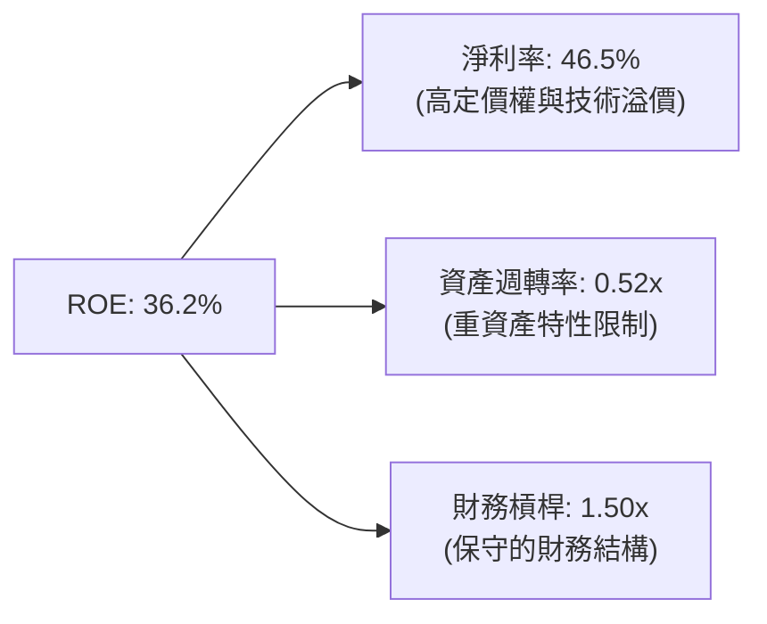

*   **分析**：TSM 的高 ROE（36.2%）**完全是由極高的淨利率（46.5%）驅動**，而非依賴財務槓桿（1.50x）或超高資產週轉（0.52x）。這代表其獲利模式具備極高的「護城河屬性」，是典型的技術壁壘型高回報，而非金融槓桿型高回報。

### 6.4 獲利能力儀表板

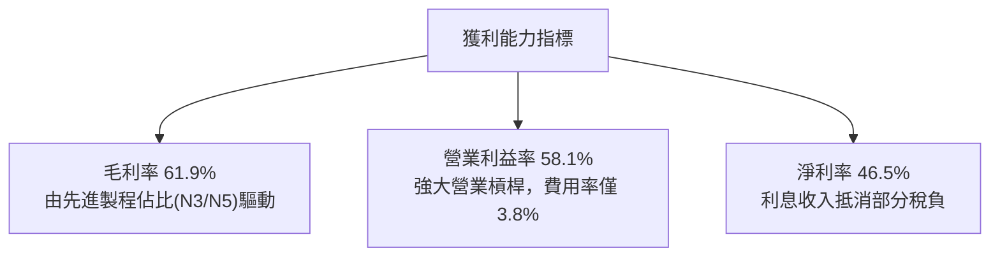

---

## 7. 估值深度分析

### 7.1 同業估值比較表格

我們選擇 TSM 的直接 foundry 競爭對手 Intel 與 Samsung，以及無廠半導體設計巨頭 NVIDIA（作為 AI 溢價對照組）進行比較。

| 估值指標 | **TSM (本公司)** | **Intel (INTC)** | **Samsung (005930.KS)** | **NVIDIA (NVDA)** | 評估與洞察 |
|----------|----------|---------|---------|---------|-----------|
| **Trailing P/E** | **37.75x** | 52.4x | 18.2x | 68.5x | 🟡 處於合理區間，反映了其介於製造與 AI 設計之間的溢價。 |
| **Forward P/E** | **21.40x** | 31.2x | 12.5x | 32.4x | 🟢 **極具吸引力**。21.4x 對應其 35% 的成長率非常便宜。 |
| **P/S Ratio** | **0.55x** (名義) / **17.56x** (經調整) | 2.15x | 1.35x | 26.4x | 🟡 經匯率調整後的真實 P/S 為 17.56x，反映了高利潤率溢價。 |
| **EV / EBITDA** | **5.52x** | 12.4x | 4.8x | 45.2x | 🟢 **極低**。反映了 TSM 龐大的折舊費用與強大的現金生成力。 |
| **PEG Ratio** | **1.36x** | 2.85x | 1.85x | 1.45x | 🟢 **安全邊際高**。低於 1.5x 顯示成長並未被過度透支。 |
| **推薦評級** | **🟢 Strong Buy** | 🔴 Underperform | 🟡 Hold | 🟢 Buy | **TSM 在估值與成長性之間取得了最佳平衡**。 |

### 7.2 歷史估值區間分析

TSM 歷史（5年）Forward P/E 區間為 15x - 35x，中位數為 22.5x。

```
╔══════════════════════════════════════════════════════════════════╗
║                TSM 歷史 Forward P/E 區間定位                     ║
╠══════════════════════════════════════════════════════════════════╣
║                                                                  ║
║  [15.0x] ── 🔴 歷史極端低估區 (2022年10月)                       ║
║  [18.5x] ── 🟡 歷史安全邊際區                                    ║
║  [21.4x] ── 🌟 當前估值位置 (2026-07-12)                         ║
║  [22.5x] ── 🟢 歷史中位數                                        ║
║  [28.0x] ── 🔴 歷史高估區                                        ║
║  [35.0x] ── ❌ 歷史極端泡沫區 (2021年初)                         ║
║                                                                  ║
║  📊 結論：當前估值 (21.4x) 略低於歷史中位數，安全邊際充足。      ║
╚══════════════════════════════════════════════════════════════════╝
```

### 7.3 情境目標價（假設驅動，Bear / Base / Bull）

我們基於未來 3 年的營收成長率、營業利潤率與退出 P/E 倍數，建立以下三情境估值模型：

| 情境 | 營收 CAGR (3Y) | 營業利潤率 (平均) | 退出 Forward P/E | 隱含目標價 (12M) | 相對現價漲跌幅 |
|------|-----------|-----------|----------|------------|----------|
| 🔴 **悲觀情境** | 15.0% | 45.0% | 15.0x | **$354.00** | -18.5% |
| 🟡 **基準情境** | **25.0%** | **52.0%** | **24.0x** | **$490.34** | **+12.9%** |
| 🟢 **樂觀情境** | 35.0% | 58.0% | 30.0x | **$700.00** | +61.3% |

*   **估值倍數選擇說明**：由於 TSM 每年有近 T$1.3T 的折舊與攤銷（D&A），其淨利受折舊壓抑顯著。因此，除了 P/E，我們強烈建議參考 **EV/EBITDA (當前僅 5.52x)**，這顯示出如果以企業價值與實際現金獲利來看，TSM 的估值甚至比傳統工業股還要便宜，具備極強的防禦屬性。

### 7.4 DCF 敏感性分析（12個月目標價矩陣）

基於永續成長率（Terminal Growth Rate）= 3.0% 進行敏感性測試：

| 營收成長率 \ WACC | 8.5% | **9.23%（基準）** | 10.0% |
|------|--------------|----------------------|--------------|
| 🟢 **樂觀 (30%)** | $620 (+42.8%) | **$585** (+34.8%) | $540 (+24.4%) |
| 🟡 **基準 (25%)** | $525 (+21.0%) | **$490.34** (+12.9%) | $455 (+4.8%) |
| 🔴 **悲觀 (15%)** | $390 (-10.2%) | **$354** (-18.5%) | $320 (-26.3%) |

### 7.5 估值綜合區間

```
當前股價: $434.11
├─────────────┼───────────────┼───────────────┤
$354.00     $434.11         $490.34         $700.00
(悲觀目標)   (當前現價)      (基準目標)      (樂觀目標)
```

---

## 8. 成長催化劑

### 8.1 催化劑時間軸

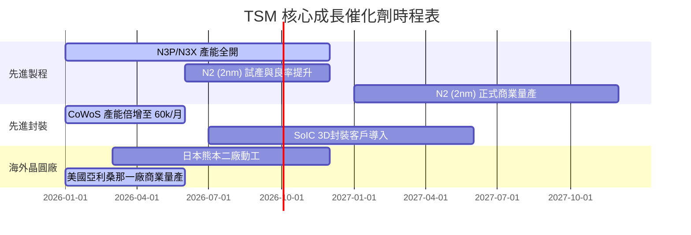

### 8.2 TAM 市場規模分析

預計至 2028 年，TSM 所面臨的潛在市場規模（TAM）將因 AI 的加入而大幅擴張：

```
╔══════════════════════════════════════════════════════════════════╗
║                  TSM 2028年 TAM 估算與滲透率                     ║
╠══════════════════════════════════════════════════════════════════╣
║                                                                  ║
║  HPC / AI 晶片：   $80B USD  ██████████████████░░  滲透率: 90%   ║
║  智慧型手機晶片：  $45B USD  ██████████░░░░░░░░░░  滲透率: 75%   ║
║  車用與物聯網：    $25B USD  █████░░░░░░░░░░░░░░░  滲透率: 45%   ║
║                                                                  ║
║  📊 預估 2028 年總 TAM：$150B USD ｜ TSM 綜合市佔率預期：>70%     ║
╚══════════════════════════════════════════════════════════════════╝
```

### 8.3 成長驅動力結構圖

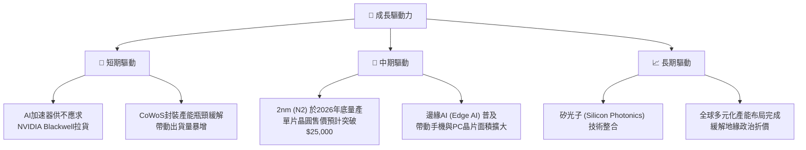

---

## 9. 風險矩陣

### 9.1 風險評分矩陣

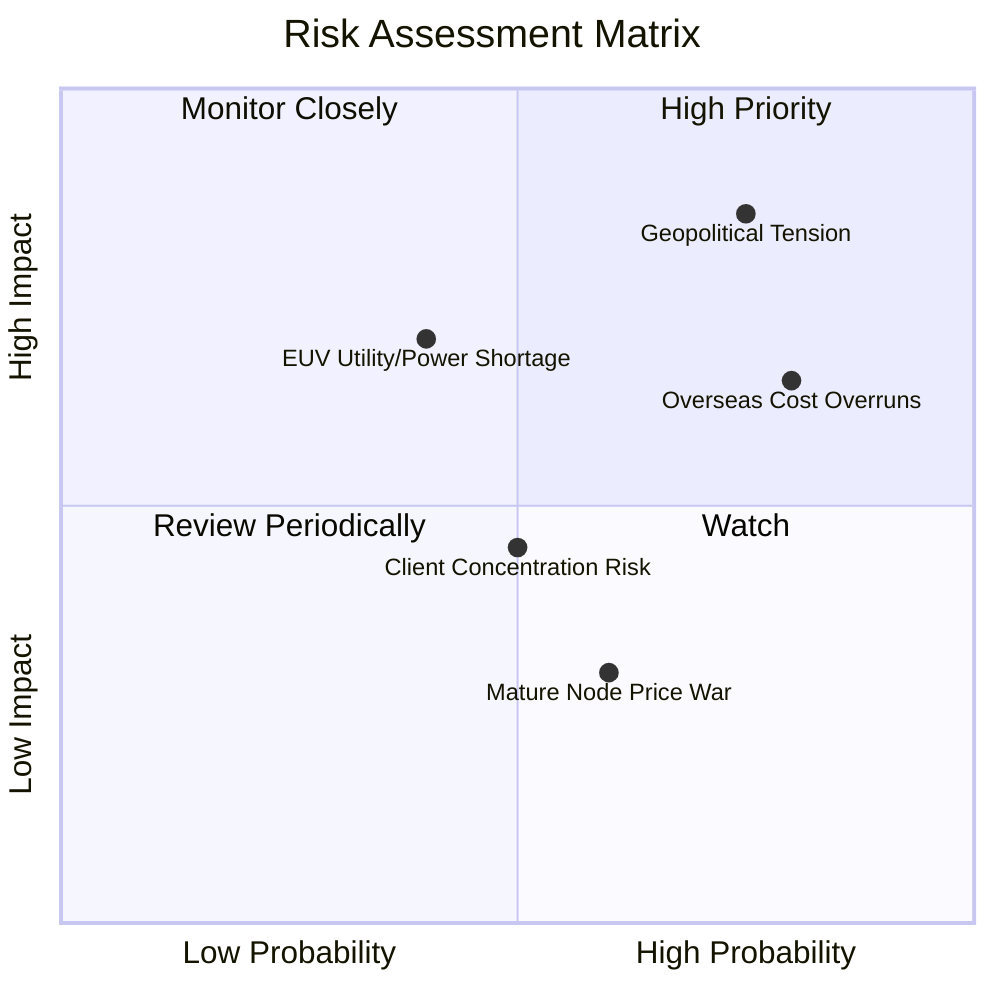

### 9.2 風險清單詳細分析

| # | 風險項目 | 發生機率 | 財務衝擊 | 風險評分 | 緩解措施 |
|---|----------|----------|----------|----------|----------|
| 1 | 🔴 **地緣政治（台海衝突）** | 中 (35%) | 極高 (-50% 估值) | 🔴 8.5/10 | 加速美國、日本、德國海外建廠，分散地緣風險。 |
| 2 | 🟡 **海外建廠成本超支** | 高 (75%) | 中 (-2% 毛利率) | 🟡 6.5/10 | 爭取當地政府高額補貼（如美國 CHIPS 法案、日本政府補貼），並導入台灣高效管理模式。 |
| 3 | 🟡 **客戶集中度過高** | 中 (50%) | 中 (-10% 營收) | 🟡 5.0/10 | Apple 與 NVIDIA 合計佔營收 >35%。透過擴大 AMD、Intel、Qualcomm 及自研晶片（ASIC）客戶群進行分散。 |
| 4 | 🟢 **台灣電力與水源短缺** | 中 (40%) | 高 (-15% 產能) | 🟢 4.5/10 | 自建綠電（與大亞、森崴等簽訂長期 PPA），並建立極高比例的製程廢水循環回收系統（回收率 >85%）。 |

---

## 10. 投資建議

### 10.1 最終綜合評級雷達圖

```
╔══════════════════════════════════════════════════════════════╗
║                    TSM 綜合實力雷達定位                      ║
╠══════════════════════════════════════════════════════════════╣
║ 基本面強度：  9.5/10  ▓▓▓▓▓▓▓▓▓▓▓▓▓▓▓▓▓▓▓░  ★★★★★           ║
║ 成長動能：    9.0/10  ▓▓▓▓▓▓▓▓▓▓▓▓▓▓▓▓▓▓░░  ★★★★★           ║
║ 財務健康度：  9.8/10  ▓▓▓▓▓▓▓▓▓▓▓▓▓▓▓▓▓▓▓▓  ★★★★★           ║
║ 估值吸引力：  7.0/10  ▓▓▓▓▓▓▓▓▓▓▓▓▓▓░░░░░░  ★★★★☆           ║
║ 護城河深度：  9.5/10  ▓▓▓▓▓▓▓▓▓▓▓▓▓▓▓▓▓▓▓░  ★★★★★           ║
╠══════════════════════════════════════════════════════════════╣
║ 綜合推薦：    8.9/10  🟢 強烈買入 (Strong Buy)               ║
╚══════════════════════════════════════════════════════════════╝
```

### 10.2 目標價與隱含報酬率

| 情境 | 機率權重 | 目標價 | 隱含報酬率 | 權重預期目標價 |
|------|----------|--------|------------|----------------|
| 🔴 悲觀情境 | 20% | $354.00 | -18.5% | $70.80 |
| 🟡 **基準情境** | **60%** | **$490.34** | **+12.9%** | **$294.20** |
| 🟢 樂觀情境 | 20% | $700.00 | +61.3% | $140.00 |
| **加權綜合目標價** | **100%** | **$505.00** | **+16.3%** | 🌟 **長線具備不對稱報酬** |

### 10.3 買入時機與觸發因素

```
╔══════════════════════════════════════════════════════════════════╗
║                  ✅ TSM 投資觸發因素 Checklist                   ║
╠══════════════════════════════════════════════════════════════════╣
║                                                                  ║
║  立即買入觸發條件（當前已符合）：                                ║
║  ✅ Forward P/E 跌破 22x（當前為 21.40x）                        ║
║  ✅ 季度營收 YoY 成長率持續 > 30%（最新為 35.13%）               ║
║  ✅ 毛利率維持在 53% 財測高標之上（最新為 61.9%）                ║
║                                                                  ║
║  加碼觸發條件：                                                  ║
║  ☐ 2nm (N2) 提前於 2026 年第三季實現風險量產且良率 > 65%         ║
║  ☐ 美國亞利桑那廠獲得額外政府補貼，且首批毛利率高於 50%          ║
║                                                                  ║
║  減碼/停損觸發條件：                                             ║
║  ☐ 單季毛利率跌破 50%（代表定價權受損或海外成本失控）           ║
║  ☐ 台海地緣政治發生實質性軍事衝突                               ║
║                                                                  ║
╚══════════════════════════════════════════════════════════════════╝
```

### 10.4 投資人適配度分析

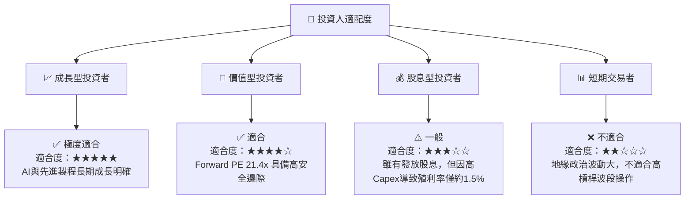

### 10.5 每季財報監控清單（Quarterly Watch List）

為了使本報告成為可持續追蹤的動態框架，投資人應在每季財報公佈時重點監控以下指標，並對照加減碼門檻：

| 監控指標 | 最新數值 (Q1 '26) | 觸發「加碼」門檻 | 觸發「減碼」門檻 | 監控背後邏輯 |
|----------|-------------------|------------------|------------------|--------------|
| **整體毛利率** | **61.9%** | 53.0% | 判斷 N3/N2 良率與海外廠成本轉嫁能力 |
| **先進製程營收佔比**| **~67%** | > 70% | < 55% | 評估高毛利產品（5nm/3nm）的結構性擴張速度 |
| **資本支出 (Capex)** | **T$351.71B** | > T$400B (代表需求極旺) | < T$250B (代表終端需求萎縮)| 判斷公司對未來 2-3 年訂單能見度的信心 |
| **庫存週轉天數** | **63.5天** | < 60天 | > 90天 | 評估下游（AI/手機）是否存在砍單或庫存積壓 |
| **SoIC/CoWoS 產能** | **產能倍增中** | 產能超預期開出 | 設備交付延遲 | 先進封裝是當前 AI 晶片出貨的最大瓶頸 |

### 10.6 反面論證：什麼會證明投資論點錯誤（What Would Change My Mind）

作為嚴謹的 CFA 分析師，我們必須建立客觀的反面論證框架。當以下任何一項**可量化條件**成立時，本報告的「強烈買入」論點將即刻失效，投資人應重新評估或果斷退出：

```
╔══════════════════════════════════════════════════════════════════╗
║            ⚠️ TSM 論點失效條件（Disconfirming Evidence）         ║
╠══════════════════════════════════════════════════════════════════╣
║  本投資論點在下列情況成立時應重新檢視或退出：                    ║
║  ☐ 營收 YoY 成長率連續兩季跌破 15%（代表 AI 需求面臨硬著陸）      ║
║  ☐ 營業利益率較當前峰值收縮 > 8.0 百分點（代表定價權嚴重受損）   ║
║  ☐ 自由現金流（FCF）轉為負值，或 FCF 轉換率連續兩年 < 20%        ║
║  ☐ ROIC 跌破 12.0%（代表資本開支回報極度惡化，摧毀股東價值）     ║
║  ☐ 2nm（N2）製程量產時程延遲至 2027 年下半年以後（技術領先喪失） ║
║  ☐ 主要客戶（如 Apple 或 NVIDIA）宣布將 >20% 的先進製程訂單      ║
║     轉移給 Samsung 或 Intel Foundry                              ║
╚══════════════════════════════════════════════════════════════════╝
```

---

> **免責聲明**：本報告為基於歷史與即時財務數據之學術與機構級研究分析，僅供參考，不構成任何買賣有價證券之投資建議。投資人應審慎評估地緣政治與市場風險，並對個人投資決策負完全責任。