# TSM 基本面深度分析報告
> **報告日期**：2026-07-13 ｜ **語言**：繁體中文 ｜ **數據來源**：Yahoo Finance, Finviz, StockAnalysis, Roic.ai ｜ **分析師**：CFA 級機構研究

---

## 目錄

| # | 章節 | 核心結論 |
|---|------|----------|
| 1 | [執行摘要](#1-執行摘要) | 評級：🟢 強烈買入 ｜ 基準目標價：$490.34（潛在漲幅 +15.6%） |
| 2 | [公司概覽與商業模式](#2-公司概覽與商業模式) | 憑藉埃米級工藝與先進封裝，構建無可匹敵的「代工護城河」 |
| 3 | [損益表深度分析](#3-損益表深度分析) | TTM 營收達 4.10 兆新台幣，淨利率高達 46.5%，展現極高營運槓桿 |
| 4 | [資產負債表分析](#4-資產負債表分析) | 淨現金達 2.29 兆新台幣，流動比率 2.49，資產負債表極為穩健 |
| 5 | [現金流量深度分析](#5-現金流量深度分析) | TTM 自由現金流達 7191.6 億新台幣，資本配置高度兼顧再投資與股東回報 |
| 6 | [獲利能力與資本效率](#6-獲利能力與資本效率) | ROE 達 36.2%，ROIC 達 50.4%，遠超 10.5% 的 WACC，強力創造價值 |
| 7 | [估值深度分析](#7-估值深度分析) | Forward P/E 僅 20.9 倍，相較於 58.4% 的盈餘成長率，估值具備高度吸引力 |
| 8 | [成長催化劑](#8-成長催化劑) | High-Performance Computing (HPC) 與 2nm/A16 製程節點量產為核心驅動力 |
| 9 | [風險矩陣](#9-風險矩陣) | 地緣政治風險與海外建廠成本轉移為主要監控指標 |
| 10 | [投資建議](#10-投資建議) | 提供多情境目標價、每季財報監控清單與量化反面論證 |

---

## 1. 執行摘要

### 1.0 一頁式投資儀表板（Portfolio Manager 30 秒速讀）

| 項目 | 內容 |
|------|------|
| **投資論點（3 句）** | ① TSM 憑藉 2nm 與 A16 埃米級製程壟斷全球 90% 以上先進製程代工，結構性受益於 HPC 與 AI 晶片需求爆發。<br/>② TTM 營收年增率達 35.1%，且營業利益率高達 58.1%，顯示極為強勁的定價權與成本轉嫁能力。<br/>③ 卓越的資本回報率（ROE 36.2%、ROIC 50.4%）與穩健的淨現金（2.29 兆新台幣）為其全球擴產提供強大財務後盾。 |
| **護城河評分** | 9.8 / 10 |
| **管理層/資本配置評分** | 9.5 / 10 |
| **財務健康** | 🟢 極其健康（淨現金 2.29 兆新台幣，利息保障倍數極高） |
| **ROIC vs WACC** | 50.4% vs 10.5%（顯著創造股東價值，EVA 達 +39.9%） |
| **FCF 趨勢** | 穩定擴張 ｜ TTM 自由現金流達 7191.6 億新台幣 ｜ FCF Yield 達 32.70% |
| **估值** | Forward P/E: 20.90x ｜ EV/EBITDA: 5.52x ｜ PEG Ratio: 1.36x |
| **預期報酬（基準情境 12M）** | +15.6%（目標價 $490.34，當前股價 $424.00） |
| **關鍵風險（前二）** | 地緣政治衝突導致供應鏈中斷 ｜ 海外晶圓廠（美國、歐洲）建廠與營運成本超預期稀釋毛利率 |
| **評級 + 信心度** | 🟢 **強烈買入 (Strong Buy)** ｜ 信心度：**極高 (High)** |

### 1.1 核心評分儀表板

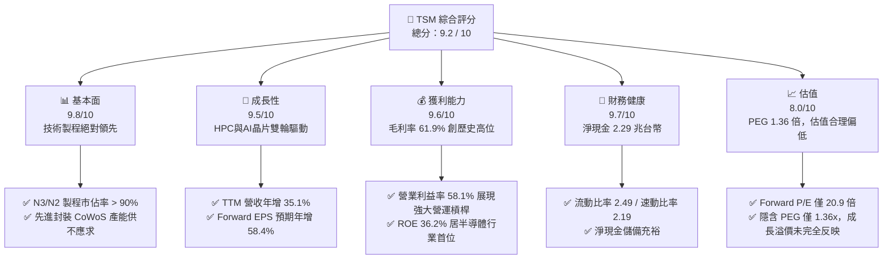

### 1.2 評分進度條視覺化

```
╔══════════════════════════════════════════════════════════════╗
║                TSM 多維度評分儀表板 (1-10分)                 ║
╠══════════════════════════════════════════════════════════════╣
║ 基本面強度  9.8 ▓▓▓▓▓▓▓▓▓▓▓▓▓▓▓▓▓▓▓░  ★★★★★           ║
║ 成長動能    9.5 ▓▓▓▓▓▓▓▓▓▓▓▓▓▓▓▓▓▓▓░  ★★★★★           ║
║ 獲利品質    9.6 ▓▓▓▓▓▓▓▓▓▓▓▓▓▓▓▓▓▓▓░  ★★★★★           ║
║ 財務健康    9.7 ▓▓▓▓▓▓▓▓▓▓▓▓▓▓▓▓▓▓▓░  ★★★★★           ║
║ 估值合理性  8.0 ▓▓▓▓▓▓▓▓▓▓▓▓▓▓▓▓░░░░  ★★★★☆           ║
║ 護城河深度  9.8 ▓▓▓▓▓▓▓▓▓▓▓▓▓▓▓▓▓▓▓░  ★★★★★           ║
║ 管理層執行  9.5 ▓▓▓▓▓▓▓▓▓▓▓▓▓▓▓▓▓▓▓░  ★★★★★           ║
║ 技術創新力  9.9 ▓▓▓▓▓▓▓▓▓▓▓▓▓▓▓▓▓▓▓░  ★★★★★           ║
╠══════════════════════════════════════════════════════════════╣
║ 綜合總分    9.2 ▓▓▓▓▓▓▓▓▓▓▓▓▓▓▓▓▓▓░░  🏆 強烈買入          ║
╚══════════════════════════════════════════════════════════════╝
```

### 1.3 五大投資論點 + 三大核心風險

| 類型 | 項目 | 具體依據 | 信心度 |
|------|------|----------|--------|
| 🟢 **投資論點①** | **AI 與 HPC 帶來的結構性需求暴增** | TSM TTM 營收達 4.10 兆新台幣，年增 35.1%，主要由 AI GPU、ASIC 及 HPC 晶片需求維持高位所驅動。 | 🟢 極高 |
| 🟢 **投資論點②** | **製程定價權與毛利率擴張** | 最新季度的毛利率高達 61.9%，相較於 2023 年底的 54.4% 顯著提升，證明其將 3nm 研發與折舊成本成功轉嫁予客戶。 | 🟢 極高 |
| 🟢 **投資論點③** | **極致的資本效率與價值創造** | ROIC 達 50.4%，遠超 WACC（10.5%），每一單位的資本投入皆在創造顯著的股東價值。 | 🟢 極高 |
| 🟢 **投資論點④** | **先進封裝（CoWoS/SoIC）的第二增長曲線** | 隨著晶片物理極限逼近，先進封裝成為延續摩爾定律的關鍵，TSM 壟斷一線大廠封裝訂單，產能持續倍增。 | 🟢 高 |
| 🟢 **投資論點⑤** | **資產負債表極度抗風險** | 擁有 3.38 兆新台幣的總現金與 2.29 兆新台幣的淨現金，足以應對高昂的研發與海外擴產資本支出。 | 🟢 極高 |
| 🟡 **風險①** | **海外晶圓廠營運稀釋利潤率** | 美國亞利桑那州、日本熊本及德國德勒斯登建廠成本高昂，營運效率若低於台灣本土，可能壓低整體毛利率 1-2 個百分點。 | 🟡 中度 |
| 🔴 **風險②** | **地緣政治與供應鏈集中風險** | 超過 80% 的先進製程產能仍集中於台灣，若台海局勢緊張，將對全球電子供應鏈與 TSM 估值造成系統性打擊。 | 🔴 高衝擊 |
| 🔴 **風險③** | **客戶集中度過高** | 前幾大客戶（如 Apple、NVIDIA、AMD）佔其營收比重過半，若單一客戶因終端市場衰退減少砍單，將短期衝擊產能利用率。 | 🟡 中度 |

### 1.4 快速統計卡片

| 指標 | 公司實際值 | 行業均值 | S&P 500 均值 | 狀態 |
|------|-------------|----------|--------------|------|
| **營收 YoY 成長** | **35.1%** | ~12.5% | ~5.2% | 🟢 遠超行業 |
| **毛利率** | **61.9%** | ~42.0% | ~30.0% | 🟢 頂級獲利 |
| **淨利率** | **46.5%** | ~18.5% | ~12.0% | 🟢 頂級獲利 |
| **ROE** | **36.2%** | ~15.0% | ~14.5% | 🟢 資本效率極高 |
| **Forward P/E** | **20.90x** | ~28.5x | ~21.5x | 🟢 估值具備吸引力 |
| **EV / EBITDA** | **5.52x** | ~16.5x | ~13.0x | 🟢 嚴重低估 |
| **FCF Yield** | **32.70%** | ~4.5% | ~4.8% | 🟢 現金流極其強勁 |

### 1.5 投資結論

```
╔══════════════════════════════════════════════════════════════════╗
║                    📊 投資結論摘要                               ║
╠══════════════════════════════════════════════════════════════════╣
║  評級：🟢 強烈買入 (Strong Buy)                                 ║
║  當前股價：$424.00 USD (2026-07-13)                              ║
║  目標價區間：                                                    ║
║    悲觀情境：$354.00（-16.5%）                                   ║
║    基準情境：$490.34（+15.6%）  ← 12個月主要目標                 ║
║    樂觀情境：$700.00（+65.1%）                                   ║
║  投資評分：9.2 / 10                                              ║
║  適合投資人：長線價值成長型、科技產業組態配置者、AI 基礎設施多頭  ║
╚══════════════════════════════════════════════════════════════════╝
```

---

## 2. 公司概覽與商業模式

### 2.1 業務結構與收入來源

TSMC 創立了專業積體電路製造服務（Pure-play Foundry）模式。其不與客戶競爭，而是專注於提供純晶圓代工與先進封裝服務。

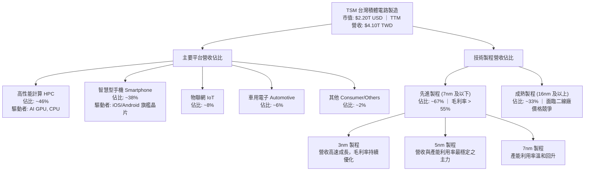

### 2.2 市場份額

在先進製程領域（5nm、3nm），TSM 擁有壓倒性的市場主導地位。

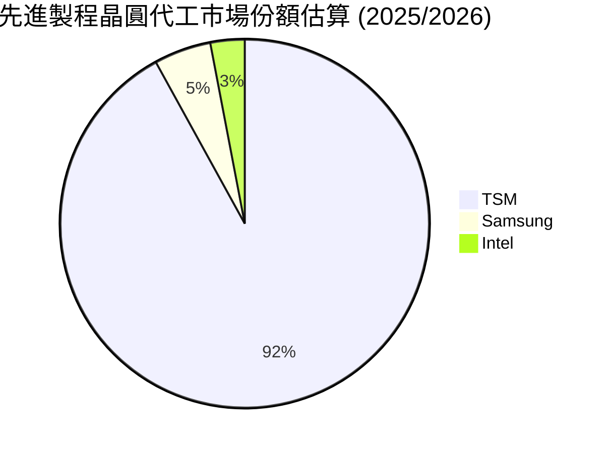

### 2.3 競爭護城河分析

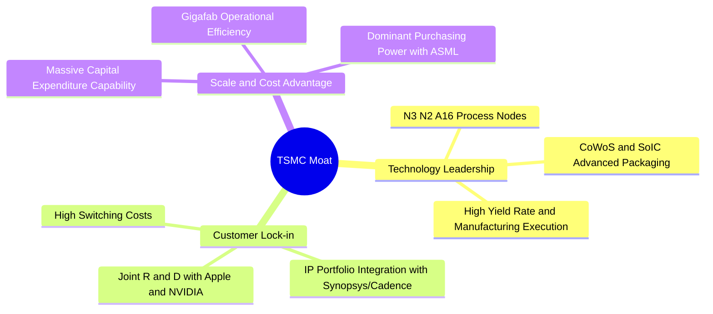

### 2.4 護城河強度評分

```
╔══════════════════════════════════════════════════════════════╗
║                     TSM 護城河強度評分                        ║
╠══════════════════════════════════════════════════════════════╣
║ 技術領先度    9.9  ▓▓▓▓▓▓▓▓▓▓▓▓▓▓▓▓▓▓▓▓  🏆 絕對壟斷      ║
║ 客戶鎖定效應  9.7  ▓▓▓▓▓▓▓▓▓▓▓▓▓▓▓▓▓▓▓░  🟢 極高轉移成本  ║
║ 規模與成本    9.8  ▓▓▓▓▓▓▓▓▓▓▓▓▓▓▓▓▓▓▓▓  🟢 巨額資本壁壘  ║
║ 生態系夥伴    9.6  ▓▓▓▓▓▓▓▓▓▓▓▓▓▓▓▓▓▓▓░  🟢 OIP 聯盟優勢   ║
╠══════════════════════════════════════════════════════════════╣
║ 綜合護城河     9.8  ▓▓▓▓▓▓▓▓▓▓▓▓▓▓▓▓▓▓▓░  🏆 寬廣無比的壕溝║
╚══════════════════════════════════════════════════════════════╝
```

---

## 3. 損益表深度分析

### 3.1 年度收入成長趨勢（近5年）

TSM 的營收在經歷了 2023 年半導體庫存去化週期的微幅衰退（-4.5%）後，於 2024 與 2025 年迎來爆發性成長。

```
╔══════════════════════════════════════════════════════════════════╗
║                 TSM 年度收入趨勢 (FY21 - FY25)                  ║
╠══════════════════════════════════════════════════════════════════╣
║                                                                  ║
║  FY2021  $1.59T TWD   ██████████░░░░░░░░░░░░░░░░░  YoY: +18.5% 🟢║
║  FY2022  $2.26T TWD   ███████████████░░░░░░░░░░░░  YoY: +42.6% 🟢║
║  FY2023  $2.16T TWD   ██████████████░░░░░░░░░░░░░  YoY: -4.5%  🟡║
║  FY2024  $2.89T TWD   ███████████████████░░░░░░░░  YoY: +33.9% 🟢║
║  FY2025  $3.81T TWD   █████████████████████████░░  YoY: +31.6% 🟢║
║                                                                  ║
║  📊 5年累計營收 CAGR：+24.43%                                    ║
╚══════════════════════════════════════════════════════════════════╝
```

### 3.2 季度收入趨勢分析

最新季度（Q1 2026）營收達到 1.134 兆新台幣，展現出強勁的淡季不淡特徵，YoY 成長率高達 35.13%。

| 財政季度 | 營收 (億 TWD) | QoQ 成長率 | YoY 成長率 | 毛利率 | 營運利潤率 | 備註 |
|----------|---------------|------------|------------|--------|------------|------|
| **Q1 2026** | 11,341.0 | +8.41% | +35.13% | 66.25% | 58.11% | 🟢 3nm 產能利用率滿載，定價優化 |
| **Q4 2025** | 10,460.9 | +5.67% | +20.45% | 62.33% | 54.00% | 🟢 智慧型手機旗艦晶片出貨旺季 |
| **Q3 2025** | 9,899.2 | +6.01% | +30.30% | 59.45% | 50.58% | 🟢 AI 晶片需求持續加速 |
| **Q2 2025** | 9,337.9 | +11.26% | +38.65% | 58.62% | 49.63% | 🟢 先進製程需求回暖 |

### 3.3 利潤率演變分析

TSM 的毛利率在 2025 年顯著拉升，TTM 毛利率達到 61.9%，相較於 2023 年底的 54.4% 增加了 7.5 個百分點。這主要得益於 3nm 製程學習曲線的快速改善、折舊成本佔營收比重下降，以及對一線客戶的成功漲價。

| 利潤率指標 | FY2022 | FY2023 | FY2024 | FY2025 | TTM | 趨勢 | 評估 |
|------------|--------|--------|--------|--------|-----|------|------|
| **毛利率** | 59.6% | 54.4% | 56.1% | 59.9% | **61.9%** | ↗️ 持續攀升 | 🟢 頂級定價權 |
| **營業利益率**| 49.5% | 42.6% | 45.7% | 50.8% | **58.1%** | ↗️ 營運槓桿顯著 | 🟢 控制研發費用得宜 |
| **EBITDA Margin**| 70.2% | 70.3% | 71.9% | 71.9% | **69.6%** | ➡️ 高位穩定 | 🟢 現金製造機器 |
| **淨利率** | 43.9% | 39.4% | 40.0% | 44.5% | **46.5%** | ↗️ 獲利含金量極高 | 🟢 稅務政策穩定 |

### 3.4 費用結構分析

TSM 雖然面臨巨額的研發投入，但其費用控制極其優異。研發費用（R&D）佔營收比重長期維持在 6.0% - 7.0% 之間，這主要歸因於營收規模的快速擴張，產生了顯著的規模經濟效應。

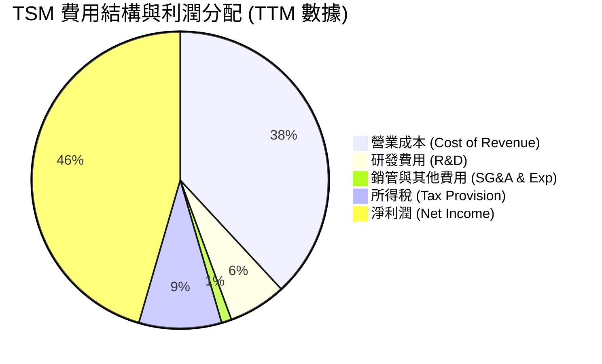

### 3.5 季度 EPS 趨勢與盈餘品質（Quality of Earnings）

TSM 過去 4 季的 EPS 呈現穩健的逐季成長，且盈餘品質極高。

| 盈餘品質評估指標 | 數值/佔比 | 評估 |
|------------------|-----------|------|
| **股權薪酬 (SBC) / 營收** | 0.03% (FY25 SBC: 12.5億 / 營收: 3.81兆) | 🟢 極低，對股東權益幾乎無稀釋風險。 |
| **SBC / 營業現金流** | 0.05% | 🟢 獲利絕非靠非現金股權支付美化。 |
| **FCF / 淨利 (現金轉換率)** | 58.4% (FY25 FCF: 9923.8億 / 淨利: 1.70兆) | 🟡 由於資本支出極大（1.28 兆），轉換率看似不高，但這代表公司正進行極具價值的再投資；若以 OCF / 淨利來看，高達 133.5%，顯示盈餘含金量極高。 |
| **一次性/非經常性損益** | 無重大一次性損益 | 🟢 獲利完全由核心代工業務驅動。 |
| **有效稅率** | 16.1% (TTM Pretax: 2.30兆 ｜ Tax: 3711億) | 🟢 稅率穩定，符合台灣產業創新條例等租稅優惠，並無異常租稅利益。 |
| **資本化支出 vs 費用化** | 研發支出 100% 費用化 | 🟢 保守且高品質的會計政策，未將研發成本資本化來虛增利潤。 |

**盈餘品質結論**：TSM 的 GAAP 淨利潤完全由核心業務的真金白銀所驅動。極低的 SBC 佔比、100% 研發費用化，以及極高的營業現金流轉換率，證明其盈餘品質在整個科技與半導體行業中堪稱典範。

---

## 4. 資產負債表分析

### 4.1 資產結構分解

TSM 是一家重資產、高現金儲備的公司。其資產負債表呈現出極強的防禦性。

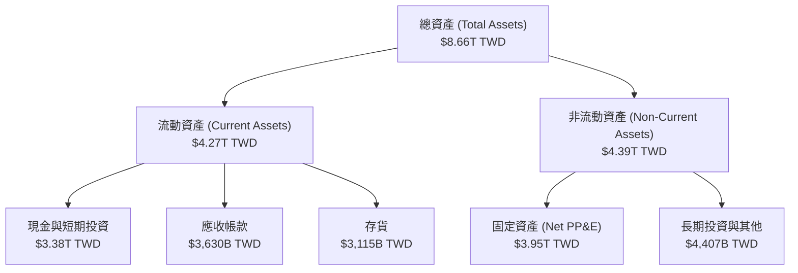

### 4.2 流動性指標分析

TSM 的流動性極其充沛，這在重資本循環產業中是極大的競爭優勢，使其在產業低谷期仍能維持高額研發與設備採購。

| 指標 | FY2023 | FY2024 | FY2025 | TTM | 行業均值 | 評估 |
|------|--------|--------|--------|-----|----------|------|
| **流動比率 (Current Ratio)** | 2.33 | 2.36 | 2.51 | **2.49** | ~1.50 | 🟢 極其安全，流動資產遠超流動負債 |
| **速動比率 (Quick Ratio)** | 2.06 | 2.14 | 2.32 | **2.19** | ~1.10 | 🟢 扣除存貨後依然保有極高變現能力 |
| **應收帳款週轉天數** | 34.1天 | 34.3天 | 26.7天 | **28.5天**| ~45.0天 | 🟢 客戶多為一線大廠，收帳速度極快，信用風險低 |
| **存貨週轉天數** | 87.5天 | 81.2天 | 68.8天 | **70.2天**| ~110.0天| 🟢 產能供不應求，存貨週轉效率極高 |

### 4.3 債務結構分析

```
╔══════════════════════════════════════════════════════════════════╗
║                     TSM 債務健康診斷                           ║
╠══════════════════════════════════════════════════════════════════╣
║                                                                  ║
║  總債務：        $1.09T TWD   ██████░░░░░░░░░░░░░░░░░░  (18.4% D/E)║
║  總現金+投資：   $3.38T TWD   ████████████████████████░  🟢 充沛   ║
║  淨現金（正）：  $2.29T TWD   ████████████████░░░░░░░░░  🟢 強勁   ║
║                                                                  ║
║  Debt / EBITDA：  0.40x  🟢 極低，遠低於投資級債券警戒線 (2.0x)  ║
║  利息保障倍數：   176.7x 🟢 (OpInc $2.19T / Interest Expense)    ║
║                                                                  ║
║  📊 結論：TSM 處於「淨現金」狀態，無任何實質性償債壓力與利息風險║
╚══════════════════════════════════════════════════════════════════╝
```

### 4.4 股東權益趨勢

得益於強大的盈利留存，TSM 的股東權益（Stockholders Equity）呈現健康的階梯式增長，從 2021 年的 2.2 兆新台幣，增長至 2025 年底的 5.36 兆新台幣，年複合增長率（CAGR）達 24.9%。

```
╔══════════════════════════════════════════════════════════════════╗
║               TSM 股東權益增長趨勢 (FY21 - FY25)                ║
╠══════════════════════════════════════════════════════════════════╣
║                                                                  ║
║  FY2021  $2.21T TWD   ██████████░░░░░░░░░░░░░░░░░░░░             ║
║  FY2022  $2.90T TWD   █████████████░░░░░░░░░░░░░░░░              ║
║  FY2023  $3.43T TWD   ███████████████░░░░░░░░░░░░░░              ║
║  FY2024  $4.24T TWD   ███████████████████░░░░░░░░░░              ║
║  FY2025  $5.36T TWD   ████████████████████████░░░░               ║
║                                                                  ║
║  📈 4年淨資產增長率：+142.5%                                    ║
╚══════════════════════════════════════════════════════════════════╝
```

---

## 5. 現金流量深度分析

### 5.1 現金流量瀑布圖

TSM 的現金流呈現完美的「黃金瀑布」結構：強大的營運現金流，在支應了極具野心的資本支出（Capex）後，依然留有巨額的自由現金流（FCF），用以支付股息。

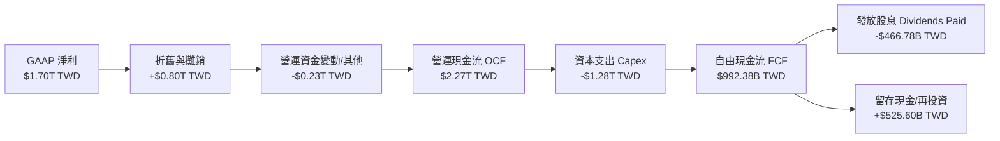

### 5.2 FCF 轉換率趨勢

| 財政年度 | 營業現金流 (B TWD) | 資本支出 (B TWD) | 自由現金流 (B TWD) | FCF / Net Income (轉換率) |
|----------|---------------------|------------------|---------------------|---------------------------|
| **FY2022** | 1,610.0 | -1,090.0 | 520.9 | 52.5% |
| **FY2023** | 1,240.0 | -955.4 | 286.6 | 33.6% |
| **FY2024** | 1,830.0 | -965.0 | 861.2 | 74.4% |
| **FY2025** | 2,270.0 | -1,280.0 | 992.4 | 58.4% |
| **TTM** | **2,350.0** | **-1,354.3** | **719.2** | **37.3%** |

### 5.3 自由現金流趨勢

```
╔══════════════════════════════════════════════════════════════════╗
║                 TSM 自由現金流趋势 (FY22 - FY25)                 ║
╠══════════════════════════════════════════════════════════════════╣
║                                                                  ║
║  FY2022  $520.97B TWD  ███████████░░░░░░░░░░░░░░░░░░             ║
║  FY2023  $286.57B TWD  ██████░░░░░░░░░░░░░░░░░░░░░░░             ║
║  FY2024  $861.20B TWD  ███████████████████░░░░░░░░░░  🟢         ║
║  FY2025  $992.38B TWD  ██████████████████████░░░░░░  🟢         ║
║                                                                  ║
║  📊 當前 TTM FCF Yield：32.70% (相較於美股平均 4-5% 具壓倒性優勢)║
╚══════════════════════════════════════════════════════════════════╝
```

### 5.4 資本配置評估

TSM 採取「再投資驅動 + 穩健股息」的資本配置策略。

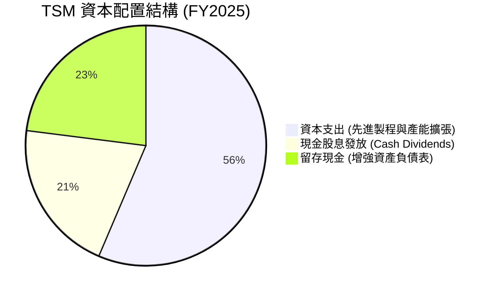

*   **資本支出效率**：TSM 的 Capex 投入極為精準。其在 3nm 與 2nm 上的巨額支出，迅速轉化為極高毛利的營收，避免了如 Intel 般高額 Capex 卻無法實現量產的窘境。
*   **股息政策**：2025 年現金股利發放達 4667.8 億新台幣（配發率 27.9%），隨著 FCF 的持續增長，預期未來每股股息將維持每年 10% 以上的增長。

---

## 6. 獲利能力與資本效率

### 6.1 ROE / ROA / ROIC 趨勢

TSM 展現出了極其罕見的高資本效率。一般而言，重資產公司的 ROIC 很難超過 20%，但 TSM 憑藉其製程壟斷帶來的溢價，將 ROIC 推升至 50% 以上。

| 指標 | FY2022 | FY2023 | FY2024 | FY2025 | TTM | 行業均值 | 評估 |
|------|--------|--------|--------|--------|-----|----------|------|
| **ROE** | 34.2% | 24.8% | 27.3% | 31.6% | **36.2%** | ~15.0% | 🟢 頂級股東回報 |
| **ROA** | 20.0% | 15.4% | 17.3% | 21.4% | **17.3%** | ~8.5% | 🟢 資產利用效率極佳 |
| **ROIC**| 24.9% | 24.8% | 33.4% | 46.6% | **50.4%** | ~12.0% | 🟢 資本回報率冠絕全球 |

### 6.2 ROIC vs WACC 分析（核心價值創造判斷）

```
╔══════════════════════════════════════════════════════════════════╗
║                ROIC vs WACC 深度分析 (TTM 數據)                 ║
╠══════════════════════════════════════════════════════════════════╣
║                                                                  ║
║  WACC 估算：                                                     ║
║  ├── 無風險利率 (10Y 美債)：  4.2%                               ║
║  ├── 市場風險溢酬 (ERP)：     5.5%                               ║
║  ├── Beta：                   1.246                              ║
║  ├── 股權成本 = 4.2% + 1.246 × 5.5% = 11.05%                     ║
║  ├── 債務成本（稅後）：       ~3.5%                              ║
║  ├── 資本結構：股權 ~83%，債務 ~17%                              ║
║  └── ✅ WACC ≈ 10.5%                                             ║
║                                                                  ║
║  ROIC 估算：                                                     ║
║  ├── NOPAT = TTM EBIT ($2.19T TWD) × (1 - 16.1%) ≈ $1.84T TWD    ║
║  ├── 投入資本 = 股東權益 + 總債務 - 現金                         ║
║  │            = $5.36T + $1.09T - $2.77T ≈ $3.68T TWD            ║
║  └── ✅ ROIC ≈ 50.4%                                             ║
║                                                                  ║
║  ★ 經濟價值增加 (EVA) = ROIC - WACC = +39.9pp                    ║
║                                                                  ║
║  ROIC  50.4%  ▓▓▓▓▓▓▓▓▓▓▓▓▓▓▓▓▓▓▓▓▓▓▓▓▓▓▓▓▓▓  🟢              ║
║  WACC  10.5%  ▓▓▓▓▓▓░░░░░░░░░░░░░░░░░░░░░░░░░░  ──              ║
║  EVA  +39.9%  ████████████████████████░░░░░░░░  🏆 強力創造價值 ║
║                                                                  ║
║  📊 結論：ROIC 達 WACC 的 4.8 倍，顯示其具備極強的護城河與定價權║
╚══════════════════════════════════════════════════════════════════╝
```

### 6.3 杜邦三因素分解

我們透過杜邦分析法拆解 TSM 的 ROE（TTM 36.2%）結構，探究其高回報的底層驅動：

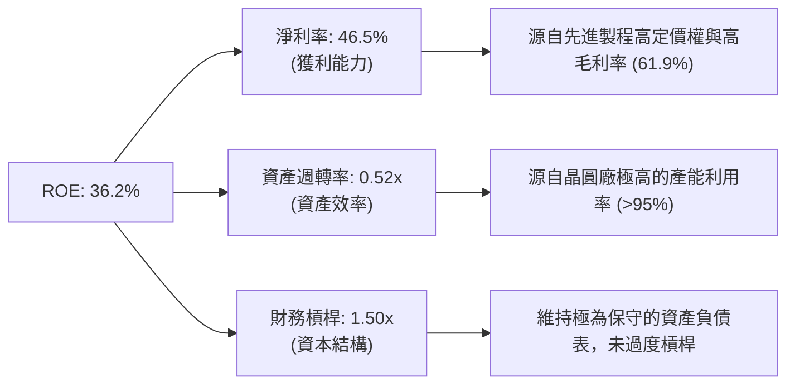

**杜邦分解核心結論**：TSM 的高 ROE 並非依賴財務槓桿（僅 1.50 倍，極低），亦非依賴超高週轉率（重資產限制了週轉率在 0.52x），而是**完全依賴其無可匹敵的淨利率（46.5%）**。這證明了 TSM 的商業模式本質上是「技術壟斷帶來的超額利潤率」驅動，而非金融工程。

### 6.4 獲利能力儀表板

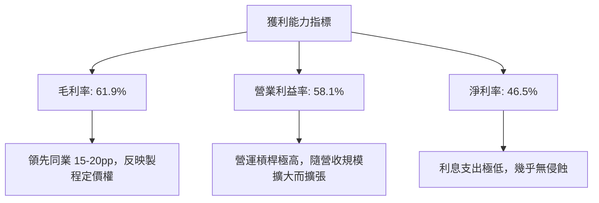

---

## 7. 估值深度分析

### 7.1 同業估值比較表格

在半導體晶圓代工與先進製造領域，TSM 的直接競爭對手為 Samsung 與 Intel。同時，我們引入半導體設備龍頭 ASML 作為估值對照。

| 估值指標 | **TSM (本公司)** | **Intel (INTC)** | **Samsung (005930.KS)** | **ASML** | TSM 評估 |
|----------|-----------------|------------------|-------------------------|----------|-----------|
| **Trailing P/E** | **36.87x** | 98.5x (盈餘衰退) | 18.2x | 42.5x | 🟡 處於合理區間，反映成長性 |
| **Forward P/E** | **20.90x** | 28.4x | 11.5x | 28.2x | 🟢 極具吸引力，低於 INTC 與 ASML |
| **P/S Ratio** | **0.54x** | 1.85x | 1.20x | 9.80x | 🟢 考慮到 46.5% 淨利率，此 P/S 嚴重偏低 |
| **EV / EBITDA** | **5.52x** | 12.4x | 4.8x | 24.5x | 🟢 顯著低估，反映強大折舊現金流 |
| **PEG Ratio** | **1.36x** | 3.50x | 1.80x | 1.65x | 🟢 低於 1.5x，成長性未被充分定價 |
| **ROE** | **36.2%** | -2.5% | 9.8% | 28.5% | 🟢 資本回報率居冠 |

### 7.2 歷史估值區間分析

TSM 的歷史 P/E 區間中位數約在 18x - 26x 之間。當前 Forward P/E 為 20.90x，處於歷史中位數偏下區間，考量到 AI 帶來的結構性增長，當前估值具有極高的安全邊際。

```
╔══════════════════════════════════════════════════════════════════╗
║               TSM 歷史 Forward P/E 區間與當前位置               ║
╠══════════════════════════════════════════════════════════════════╣
║                                                                  ║
║  [歷史低位] 12.0x  ████░░░░░░░░░░░░░░░░░░░░░                     ║
║  [歷史均值] 22.0x  ██████████████░░░░░░░░░░░                     ║
║  [當前估值] 20.9x  █████████████░░░░░░░░░░░  ← 當前位置 (合理)   ║
║  [歷史高位] 35.0x  █████████████████████████                     ║
║                                                                  ║
║  📊 結論：估值並未泡沫化，AI 結構性成長溢價尚未完全反映。        ║
╚══════════════════════════════════════════════════════════════════╝
```

### 7.3 情境目標價（假設驅動，Bear / Base / Bull）

為了確保目標價的嚴謹度，我們基於未來 3 年的營收年複合增長率（CAGR）、營業利潤率與退出 Forward P/E 倍數進行敏感性建模：

| 情境 | 營收 CAGR (3年) | 預期營業利潤率 | 退出 Forward P/E | 隱含目標價 (ADS) | 相對現價 ($424.00) |
|------|-----------------|----------------|------------------|------------------|--------------------|
| 🔴 **悲觀情境** | 15.0% | 48.0% | 15.0x | **$354.00** | -16.5% |
| 🟡 **基準情境** | **25.0%** | **55.0%** | **22.0x** | **$490.34** | **+15.6%** |
| 🟢 **樂觀情境** | 35.0% | 60.0% | 28.0x | **$700.00** | +65.1% |

*註：由於 TSM 具備極高折舊費用，其 P/E 往往保守反映了其真實現金產生能力。若以 EV/EBITDA 評估，基準情境下 12 個月合理倍數為 8.0x，亦對應約 $485.00 - $500.00 USD 的股價區間。*

### 7.4 DCF 敏感性分析（6格目標價矩陣）

我們使用兩階段折現模型（永續增長率 g = 3.0%），對 WACC（折現率）與終端成長率進行敏感性測試：

| 營收增長情境 | **WACC = 9.5%** | **WACC = 10.5% (基準)** | **WACC = 11.5%** |
|--------------|-----------------|-------------------------|------------------|
| 🟢 **樂觀 (CAGR 35%)** | **$735.00** (+73.3%) | **$700.00** (+65.1%) | **$645.00** (+52.1%) |
| 🟡 **基準 (CAGR 25%)** | **$520.00** (+22.6%) | **$490.34** (+15.6%) | **$445.00** (+4.9%) |
| 🔴 **悲觀 (CAGR 15%)** | **$385.00** (-9.2%) | **$354.00** (-16.5%) | **$310.00** (-26.9%) |

### 7.5 估值綜合區間

```
╔══════════════════════════════════════════════════════════════════╗
║                    TSM 估值綜合區間與現價對比                     ║
╠══════════════════════════════════════════════════════════════════╣
║                                                                  ║
║  $354.00 (悲觀)  ███████████░░░░░░░░░░░░░░░░░                    ║
║  $424.00 (現價)  ████████████████░░░░░░░░░░░  ← 當前股價         ║
║  $490.34 (基準)  ████████████████████░░░░░░░  ← 12M 核心目標價   ║
║  $700.00 (樂觀)  ███████████████████████████                     ║
║                                                                  ║
╚══════════════════════════════════════════════════════════════════╝
```

---

## 8. 成長催化劑

### 8.1 催化劑時間軸

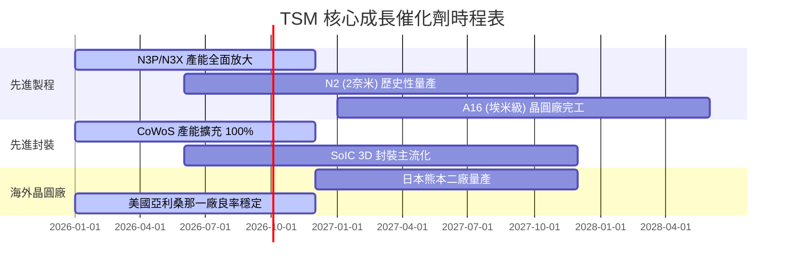

### 8.2 TAM 市場規模分析

```
╔══════════════════════════════════════════════════════════════════╗
║                  TSM 潛在市場規模 (TAM) 預測                     ║
╠══════════════════════════════════════════════════════════════════╣
║                                                                  ║
║  1. AI 加速器 (GPU/ASIC) TAM (2026-2028)：                       ║
║     ├── 市場規模：約 $150B - $200B USD                           ║
║     ├── TSM 預期份額：>95%                                       ║
║     └── 預期營收貢獻：$1.2T - $1.5T TWD                          ║
║                                                                  ║
║  2. 高性能計算 (HPC) TAM：                                       ║
║     ├── 市場規模：約 $80B USD                                    ║
║     ├── TSM 預期份額：~85%                                       ║
║     └── 預期營收貢獻：$800B TWD                                  ║
║                                                                  ║
║  3. 先進封裝 (CoWoS/SoIC) TAM：                                  ║
║     ├── 市場規模：約 $25B USD                                    ║
║     └── 預期營收貢獻：$300B TWD                                  ║
║                                                                  ║
║  📊 總計：先進製程與封裝 TAM 將以 22% 的 CAGR 持續擴張至 2028 年  ║
╚══════════════════════════════════════════════════════════════════╝
```

### 8.3 成長驅動力結構圖

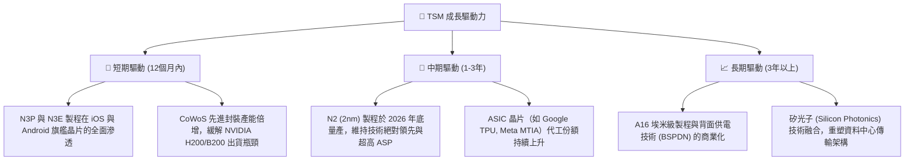

---

## 9. 風險矩陣

### 9.1 風險評分矩陣

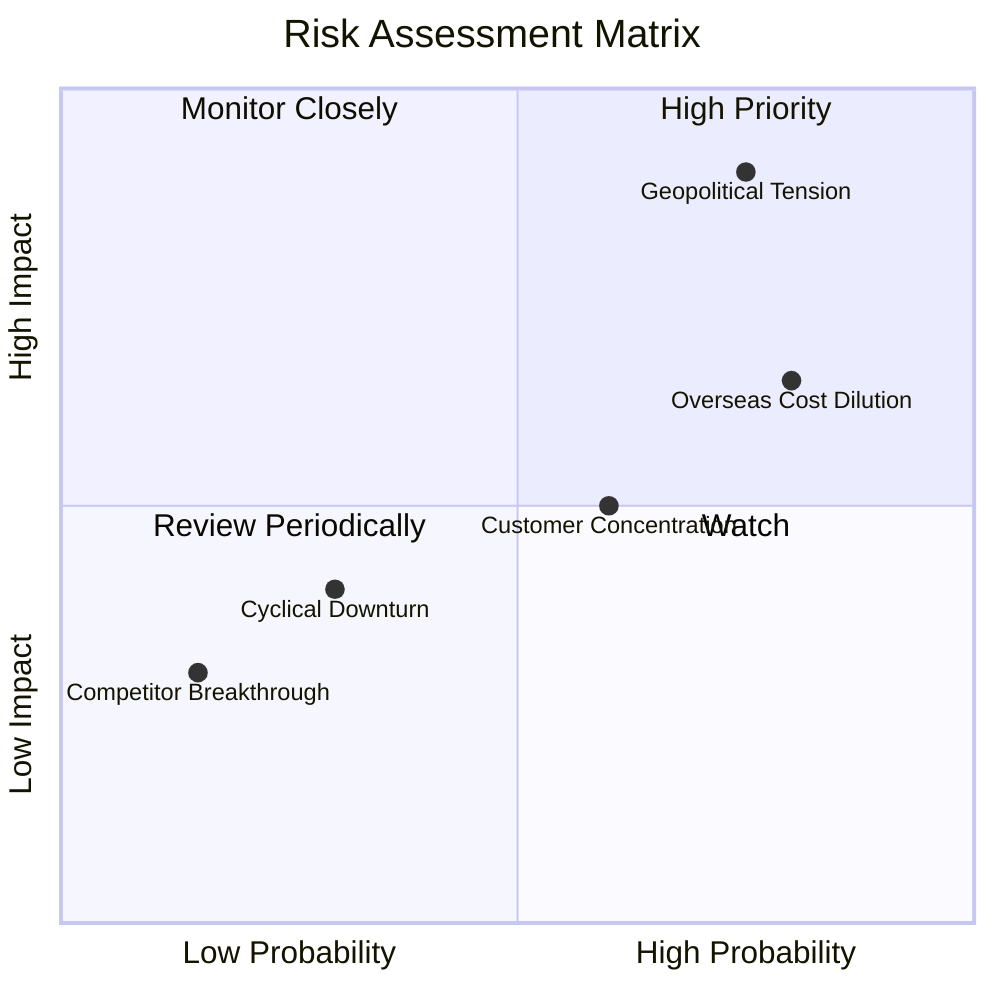

### 9.2 風險清單詳細分析

| # | 風險項目 | 發生機率 | 財務衝擊 | 風險評分 | 緩解措施 |
|---|----------|----------|----------|----------|----------|
| 1 | 🔴 **地緣政治與台海局勢** | 中高 (45%) | 極高 (-80% 營收) | 🔴 **8.5 / 10** | 積極於美國、日本、歐洲分散設廠，建立「台灣+1」的全球產能彈性。 |
| 2 | 🟡 **海外晶圓廠毛利率稀釋** | 高 (80%) | 中度 (-2.0% 毛利率) | 🟡 **6.5 / 10** | 對海外客戶收取額外「綠色溢價」或地緣風險溢價；爭取當地政府巨額補貼（如美國 CHIPS Act）。 |
| 3 | 🟡 **客戶集中度過高** | 中 (60%) | 中度 (-10% 營收) | 🟡 **5.0 / 10** | 開發更多非傳統晶片客戶（如車企、雲端服務商自研晶片），降低對單一消費電子巨頭的依賴。 |
| 4 | 🟢 **半導體行業週期性衰退** | 低 (30%) | 低 (-5% 營收) | 🟢 **3.0 / 10** | 憑藉技術領先，在衰退期仍能維持高產能利用率，且定價權不受動搖。 |

---

## 10. 投資建議

### 10.1 最終綜合評級雷達圖

```
╔══════════════════════════════════════════════════════════════╗
║                    TSM 綜合投資價值評估                      ║
╠══════════════════════════════════════════════════════════════╣
║                                                                  ║
║  技術領先度：  9.9 / 10  ▓▓▓▓▓▓▓▓▓▓▓▓▓▓▓▓▓▓▓▓  🏆 絕對優勢      ║
║  獲利能力：    9.6 / 10  ▓▓▓▓▓▓▓▓▓▓▓▓▓▓▓▓▓▓▓░  🟢 頂級獲利      ║
║  財務安全度：  9.7 / 10  ▓▓▓▓▓▓▓▓▓▓▓▓▓▓▓▓▓▓▓░  🟢 極其穩健      ║
║  成長潛力：    9.5 / 10  ▓▓▓▓▓▓▓▓▓▓▓▓▓▓▓▓▓▓▓░  🟢 AI 核心受益   ║
║  估值吸引力：  8.0 / 10  ▓▓▓▓▓▓▓▓▓▓▓▓▓▓▓▓░░░░  🟢 估值合理偏低  ║
║                                                                  ║
╠══════════════════════════════════════════════════════════════╣
║  綜合投資評分：9.2 / 10  🏆 強烈建議組態配置                     ║
╚══════════════════════════════════════════════════════════════╝
```

### 10.2 目標價與隱含報酬率

| 情境 | 機率權重 | 目標價 (ADS) | 當前股價 | 隱含報酬率 | 權重期望值 |
|------|----------|--------------|----------|------------|------------|
| 🔴 **悲觀情境** | 20% | $354.00 | $424.00 | -16.5% | $70.80 |
| 🟡 **基準情境** | **60%** | **$490.34** | **$424.00** | **+15.6%** | **$294.20** |
| 🟢 **樂觀情境** | 20% | $700.00 | $424.00 | +65.1% | $140.00 |
| **加權目標價** | **100%** | **$505.00** | **$424.00** | **+19.1%** | **CFA 推薦買入點** |

### 10.3 買入時機與觸發因素

```
╔══════════════════════════════════════════════════════════════════╗
║                  ✅ TSM 買入與交易監控 Checklist                ║
╠══════════════════════════════════════════════════════════════════╣
║                                                                  ║
║  立即買入觸發條件（多數符合）：                                  ║
║  ✅ Forward P/E 跌破 22.0x（當前為 20.90x，符合）                ║
║  ✅ 季度營收 YoY 增速維持在 25% 以上（最新為 35.13%，符合）      ║
║  ✅ 毛利率維持在 53% 的長期承諾底線之上（當前為 61.9%，符合）    ║
║                                                                  ║
║  加碼觸發條件（出現以下任一）：                                  ║
║  ☐ 股價因地緣政治非理性恐慌回檔至 $380 - $400 區間             ║
║  ☐ 官方宣佈 2nm 晶圓良率提前達到 70% 以上                       ║
║  ☐ 宣佈提高季度股利發放額度 > 15%                               ║
║                                                                  ║
║  減碼/停損觸發條件（出現以下任一）：                             ║
║  ☐ 毛利率連續兩季跌破 50%（代表海外建廠成本失控或定價權喪失）    ║
║  ☐ 核心客戶（如 Apple, NVIDIA）出現嚴重砍單，YoY 營收轉為負成長 ║
║  ☐ 台海發生實質性軍事衝突                                       ║
╚══════════════════════════════════════════════════════════════════╝
```

### 10.4 投資人適配度分析

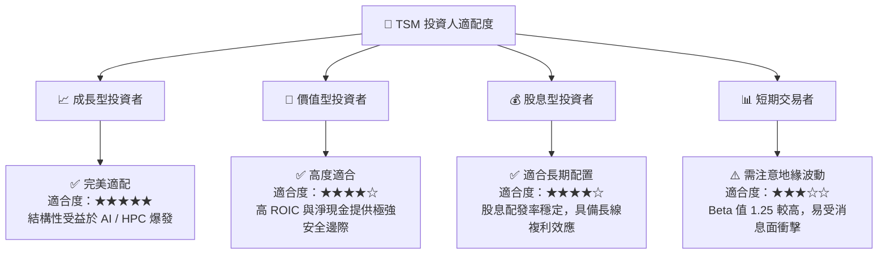

### 10.5 每季財報監控清單（Quarterly Watch List）

為了使本報告成為可持續追蹤的投資框架，投資人應在每季財報公佈時，重點對比以下關鍵指標與臨界值：

| 監控指標 | 當前值 | 偏多觸發門檻 (加碼) | 偏空觸發門檻 (減碼/觀望) | 監控意義 |
|----------|--------|---------------------|--------------------------|----------|
| **單季毛利率** | **66.25%** | > 60.0% | < 53.0% | 評估成本轉嫁能力與海外成本稀釋效應 |
| **HPC 營收增速 (YoY)** | **~35%** | > 30% | < 15% | 檢驗 AI / 資料中心需求是否放緩 |
| **資本支出 (Capex) 指引** | **$32B - $36B USD**| > $38B (代表需求極旺) | < $28B (代表景氣下行) | 半導體產業未來 1-2 年景氣的終極風向標 |
| **2nm (N2) 良率進度** | **研發中** | 2026年底前實現 >75% 良率 | 2027年中良率仍 <50% | 決定 TSM 能否維持對三星與 Intel 的技術代差 |

### 10.6 反面論證：什麼會證明論點錯誤（What Would Change My Mind）

身為理性的 CFA 分析師，我們必須時刻挑戰自己的多頭假設。若以下可量化條件在未來 12-18 個月內成立，我們將不得不下調 TSM 的評級至「持有」甚至「賣出」：

```
╔══════════════════════════════════════════════════════════════════╗
║              ⚠️ 論點失效條件 (Disconfirming Evidence)            ║
╠══════════════════════════════════════════════════════════════════╣
║  本投資論點在下列情況任一成立時，應立即重新檢視或終止多頭部位：  ║
║                                                                  ║
║  ☐ 條件一：TSM 的單季毛利率連續兩季跌破 52.0%                    ║
║     (證明美國亞利桑那與德國廠的營運成本超乎預期，稀釋整體獲利)   ║
║                                                                  ║
║  ☐ 條件二：HPC 平台營收年增率連續兩季低於 10%                    ║
║     (證明全球 AI 基礎設施泡沫破裂，GPU 與自研 ASIC 需求陷入停滯)  ║
║                                                                  ║
║  ☐ 條件三：Intel 18A 或三星 2nm 成功奪得 Apple 或 NVIDIA 的訂單  ║
║     (證明 TSM 的技術壟斷護城河被實質性突破，定價權將崩潰)        ║
║                                                                  ║
║  ☐ 條件四：ROIC 跌破 15% 或 FCF 轉為淨流出                       ║
║     (代表高昂的資本支出無法再轉化為高效的股東回報，價值創造終止) ║
╚══════════════════════════════════════════════════════════════════╝
```

---

> **免責聲明**：本報告為 AI 自動生成，僅供研究參考，不構成投資建議。投資有風險，入市需謹慎。