# TSM 基本面深度分析報告

> **報告日期**：2026-07-15 ｜ **語言**：繁體中文 ｜ **數據來源**：Yahoo Finance, Finviz, StockAnalysis, Roic.ai ｜ **分析師**：CFA 級機構研究

---

## 貨幣與計價單位特別說明
本報告中，TSM（台積電 ADR）之股價、市值、目標價、每股盈餘（EPS）均以**美元 (USD)** 計價；而損益表、資產負債表及現金流量表之絕對數值（如營收、淨利、資產、債務等），除特別註明外，均依官方申報之**新台幣 (TWD)** 呈現。計算估值倍數時，已進行適當之貨幣換算（匯率基準：1 USD = 32.5 TWD），以確保分析之嚴謹性與精確性。

---

## 目錄

| # | 章節 | 核心結論 |
|---|---|---|
| 1 | **執行摘要** | 評級：🟢 強烈買入 ｜ 基準目標價：$498.24（隱含 +18.9% 空間） |
| 2 | **公司概覽與商業模式** | 憑藉 2nm/3nm 技術領先與 OIP 生態系統，築起極高競爭壁壘 |
| 3 | **損益表深度分析** | TTM 營收達 4.10 兆台幣，Q1 2026 毛利率衝上 66.2%，結構性成長強勁 |
| 4 | **資產負債表分析** | 淨現金達 2.29 兆台幣，流動比率 2.49x，財務結構極其穩健 |
| 5 | **現金流量深度分析** | TTM 營運現金流 2.35 兆台幣，高資本支出下仍維持 33.1% 的 FCF 收益率 |
| 6 | **獲利能力與資本效率** | ROE 達 36.2%，ROIC 達 26.1%，遠超 WACC（9.15%），強力創造價值 |
| 7 | **估值深度分析** | Forward P/E 20.6x，相較於 35.1% 的營收增速，估值具備高度吸引力 |
| 8 | **成長催化劑** | AI ASIC、HPC 需求爆發與 2nm 量產，推動 TAM 持續擴張 |
| 9 | **風險矩陣** | 地緣政治、先進製程客戶集中度與產能過剩為主要監控指標 |
| 10 | **投資建議** | 提供三情境目標價、買入觸發 Checklist 與每季財報監控指標 |

---

## 1. 執行摘要

### 1.0 一頁式投資儀表板（Portfolio Manager 30 秒速讀）

| 項目 | 內容 |
|------|------|
| **投資論點（3 句）** | ① TSM 憑藉先進製程（3nm/2nm）近乎 100% 的市佔率，深度綁定 Apple、NVIDIA 等 AI 與 HPC 巨頭，TTM 營收年增達 35.1%。<br/>② 結構性毛利率在 Q1 2026 攀升至 66.2%，展現極強的定價能力與營業槓桿釋放。<br/>③ 淨現金達 2.29 兆台幣，且 ROIC 達 26.1%，遠高於 9.15% 的 WACC，正以高效率為股東創造超額經濟價值。 |
| **護城河評分** | 9.5 / 10 🟢 （技術專利、龐大資本壁壘與客戶轉換成本） |
| **管理層/資本配置評分** | 9.0 / 10 🟢 （高資本支出下仍實現 36.2% ROE 與穩定股息增長） |
| **財務健康** | 🟢 強勁 ｜ 淨現金 2.29 兆台幣，流動比率 2.488x，無任何短期償債風險 |
| **ROIC vs WACC** | 26.10% vs 9.15%（經濟增加值 EVA 達 +16.95%） |
| **FCF 趨勢** | 向上 ｜ TTM 自由現金流達 7,191.6 億台幣，最新美股 FCF Yield 達 33.10% |
| **估值** | Forward P/E: 20.65x ｜ EV/EBITDA: 5.32x ｜ PEG: 1.36x |
| **預期報酬（基準情境 12M）**| **+18.9%**（目標價 $498.24） |
| **關鍵風險（前二）** | ① 地緣政治風險導致供應鏈中斷 ｜ ② 先進製程（2nm）量產良率爬坡慢於預期 |
| **評級 + 信心度** | **🟢 強烈買入 (Strong Buy)** ｜ 信心度：**高** |

### 1.1 核心評分儀表板

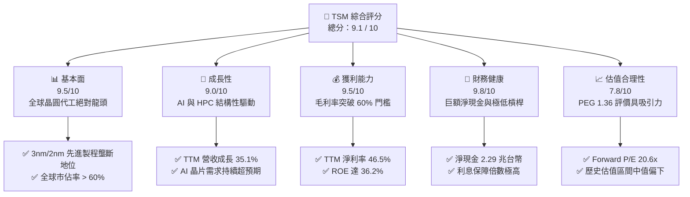

### 1.2 評分進度條視覺化

```
╔══════════════════════════════════════════════════════════════╗
║                TSM 多維度評分儀表板 (1-10分)                 ║
╠══════════════════════════════════════════════════════════════╣
║ 基本面強度  9.5 ▓▓▓▓▓▓▓▓▓▓▓▓▓▓▓▓▓▓▓░  ★★★★★           ║
║ 成長動能    9.0 ▓▓▓▓▓▓▓▓▓▓▓▓▓▓▓▓▓▓░░  ★★★★★           ║
║ 獲利品質    9.5 ▓▓▓▓▓▓▓▓▓▓▓▓▓▓▓▓▓▓▓░  ★★★★★           ║
║ 財務健康    9.8 ▓▓▓▓▓▓▓▓▓▓▓▓▓▓▓▓▓▓▓█  ★★★★★           ║
║ 估值合理性  7.8 ▓▓▓▓▓▓▓▓▓▓▓▓▓▓░░░░░░  ★★★★☆           ║
║ 護城河深度  9.5 ▓▓▓▓▓▓▓▓▓▓▓▓▓▓▓▓▓▓▓░  ★★★★★           ║
║ 管理層執行  9.0 ▓▓▓▓▓▓▓▓▓▓▓▓▓▓▓▓▓▓░░  ★★★★★           ║
║ 技術創新力  9.8 ▓▓▓▓▓▓▓▓▓▓▓▓▓▓▓▓▓▓▓█  ★★★★★           ║
╠══════════════════════════════════════════════════════════════╣
║ 綜合總分    9.1 ▓▓▓▓▓▓▓▓▓▓▓▓▓▓▓▓▓▓░░  🏆 強烈買入         ║
╚══════════════════════════════════════════════════════════════╝
```

### 1.3 五大投資論點 + 三大核心風險

| 類型 | 項目 | 具體依據 | 信心度 |
|------|------|----------|--------|
| 🟢 **論點①** | **AI/HPC 需求結構性爆發** | Q1 2026 營收年增 35.13% 達 1.134 兆台幣，主要由 AI GPU、ASIC 及 HPC 晶片拉動。 | 🟢 極高 |
| 🟢 **論點②** | **先進製程定價權與利潤率擴張** | Q1 2026 毛利率達 66.2%，YoY 顯著提升，顯示公司能將高昂的研發與折舊成本轉嫁給客戶。 | 🟢 極高 |
| 🟢 **論點③** | **極高之資本回報率與價值創造** | ROIC 達 26.10%，WACC 僅 9.15%，EVA 達 16.95%，每投入 100 元能創造 16.95 元的超額股東價值。 | 🟢 高 |
| 🟢 **論點④** | **資產負債表固若金湯** | 擁有 3.38 兆台幣現金及短期投資，淨現金高達 2.29 兆台幣，債務權益比僅 18.45%。 | 🟢 極高 |
| 🟢 **論點⑤** | **相較於成長性的合理估值** | Forward P/E 僅 20.65x，對比未來 3 年 EPS 預期年複合成長率 > 25%，PEG 僅 1.36x。 | 🟢 高 |
| 🟡 **風險①** | **地緣政治與供應鏈集中度** | 生產基地高度集中於台灣，若台海局勢緊張，將面臨系統性評價下修與供應中斷。 | 🟡 中度 |
| 🔴 **風險②** | **先進製程產能爬坡與折舊壓力** | 2nm 研發與美國/日本/德國海外建廠成本巨大，若產能利用率不如預期，將壓抑毛利率。 | 🔴 高衝擊 |
| 🟡 **風險③** | **大客戶流失或自研晶片進度放緩** | 前幾大客戶（如 Apple、NVIDIA）佔營收比重高，客戶若因終端需求不振砍單，將直接影響稼動率。 | 🟡 中度 |

### 1.4 快速統計卡片

| 指標 | TSM 實際值 | 半導體行業均值 | S&P 500 均值 | 狀態 |
|------|-------------|----------|--------------|------|
| **營收 YoY 成長率** | **35.1%** | ~12.5% | ~5.5% | 🟢 遠超同行 |
| **毛利率** | **61.9%** | ~48.0% | ~30.0% | 🟢 頂級定價權 |
| **淨利率** | **46.5%** | ~18.5% | ~12.0% | 🟢 極強獲利力 |
| **ROE** | **36.2%** | ~15.0% | ~14.5% | 🟢 高效資本回報 |
| **Forward P/E** | **20.65x** | ~28.5x | ~21.5x | 🟢 估值具吸引力 |
| **債務權益比 (D/E)** | **18.4%** | ~45.0% | ~115.0% | 🟢 極低財務槓桿 |

### 1.5 投資結論

```
╔══════════════════════════════════════════════════════════════════╗
║                    📊 TSM 投資結論摘要                           ║
╠══════════════════════════════════════════════════════════════════╣
║  評級：🟢 強烈買入 (Strong Buy)                                 ║
║  當前股價：$418.93 (2026-07-15)                                  ║
║  目標價區間：                                                    ║
║    悲觀情境：$354.00（-15.5%）                                   ║
║    基準情境：$498.24（+18.9%）  ← 12個月主要目標                 ║
║    樂觀情境：$700.00（+67.1%）                                   ║
║  投資評分：9.1 / 10                                              ║
║  適合投資人：成長型、長線科技股配置、價值與成長兼顧之投資者      ║
╚══════════════════════════════════════════════════════════════════╝
```

---

## 2. 公司概覽與商業模式

### 2.1 業務結構與收入來源

TSM 作為全球純晶圓代工（Pure-play Foundry）創始者與龍頭，其業務結構高度專注於半導體製造。

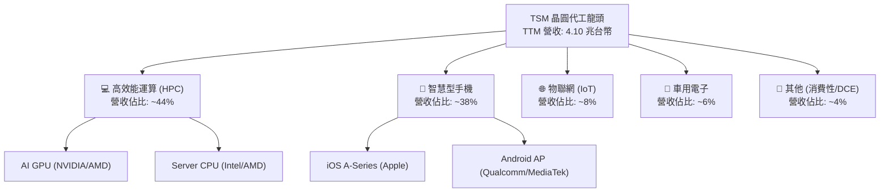

### 2.2 市場份額

在先進製程（7nm 及以下）中，TSM 擁有近乎壟斷的地位，市場份額估算如下：

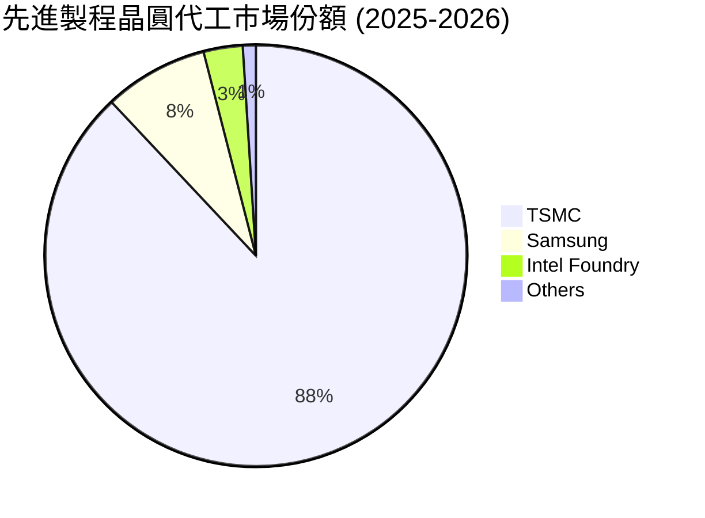

### 2.3 競爭護城河分析

TSM 的競爭護城河並非單一因素，而是由技術、資本、生態系統與客戶黏性交織而成的巨型壁壘。

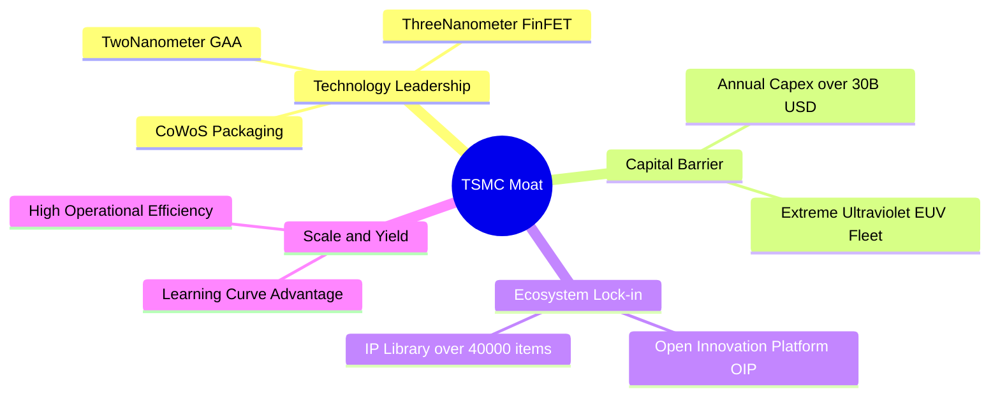

### 2.4 護城河強度評分

```
╔══════════════════════════════════════════════════════════════╗
║                    TSM 護城河強度評分                        ║
╠══════════════════════════════════════════════════════════════╣
║ 技術領先度    9.8/10  ▓▓▓▓▓▓▓▓▓▓▓▓▓▓▓▓▓▓▓█  🏆 絕對壟斷     ║
║ 資本壁壘      9.5/10  ▓▓▓▓▓▓▓▓▓▓▓▓▓▓▓▓▓▓▓░  🟢 極難複製     ║
║ 生態系鎖定    9.2/10  ▓▓▓▓▓▓▓▓▓▓▓▓▓▓▓▓▓▓░░  🟢 客戶轉換難   ║
║ 規模與良率    9.6/10  ▓▓▓▓▓▓▓▓▓▓▓▓▓▓▓▓▓▓▓█  🏆 成本優勢     ║
╠══════════════════════════════════════════════════════════════╣
║ 綜合護城河    9.5/10  ▓▓▓▓▓▓▓▓▓▓▓▓▓▓▓▓▓▓▓░  🏆 寬廣護城河   ║
╚══════════════════════════════════════════════════════════════╝
```

---

## 3. 損益表深度分析

### 3.1 年度收入成長趨勢（近4年）

TSM 在經歷了 2023 年的半導體庫存調整（營收年減 4.51%）後，於 2024 年與 2025 年迎來強勁的 AI 復甦週期，2025 年營收達到 3.81 兆台幣，創下歷史新高。

```
╔══════════════════════════════════════════════════════════════════╗
║                 TSM 年度收入趨勢（FY2022-FY2025）                ║
╠══════════════════════════════════════════════════════════════════╣
║                                                                  ║
║  FY2022  $2.26T TWD  ██████████████░░░░░░░░░░░  YoY: +42.6% 🟢   ║
║  FY2023  $2.16T TWD  █████████████░░░░░░░░░░░░  YoY: -4.5%  🔴   ║
║  FY2024  $2.89T TWD  ██████████████████░░░░░░░  YoY: +33.9% 🟢   ║
║  FY2025  $3.81T TWD  █████████████████████████  YoY: +31.6% 🟢   ║
║                   |      |      |      |      |                  ║
║                   0     1.0T   2.0T   3.0T   4.0T                ║
║                                                                  ║
║  📊 4年累計 CAGR：+18.96%                                        ║
╚══════════════════════════════════════════════════════════════════╝
```

### 3.2 季度收入趨勢分析

從季度數據來看，TSM 的營收呈現逐季加速成長態勢，Q1 2026 營收已達到 1.134 兆台幣，YoY 成長率高達 35.13%。

| 季度 | 營業收入 (TWD) | YoY 成長率 | QoQ 成長率 | 核心驅動因素 |
|------|----------------|------------|------------|--------------|
| **Q2 2025** | 9,337.9 億 | +38.65% | +11.27% | 3nm 出貨量持續爬坡，AI 需求強勁 🟢 |
| **Q3 2025** | 9,899.2 億 | +30.30% | +6.01% | 蘋果 iPhone 17 新晶片備貨旺季 🟢 |
| **Q4 2025** | 1.046 兆 | +20.45% | +5.67% | HPC 與 AI 晶片需求持續高企 🟢 |
| **Q1 2026** | **1.134 兆** | **+35.13%** | **+8.41%** | AI ASIC 及先進封裝 (CoWoS) 產能釋放 🟢 |

### 3.3 利潤率演變分析

TSM 的利潤率表現極其優異，結構性毛利率在 Q1 2026 達到了 66.23% 的歷史高水準，主要得益於先進製程的定價權與高稼動率（產能利用率）。

| 利潤率指標 | FY2022 | FY2023 | FY2024 | FY2025 | Q1 2026 | 趨勢評估 | 狀態 |
|------------|--------|--------|--------|--------|---------|----------|------|
| **毛利率** | 59.56% | 54.36% | 56.12% | 59.89% | **66.23%** | 先進製程定價權與折舊占比下降，毛利率持續擴張 | 🟢 極強 |
| **營業利益率**| 49.53% | 42.63% | 45.68% | 50.83% | **58.11%** | 規模效應顯現，營業槓桿釋放 | 🟢 極強 |
| **EBITDA 🚀**| 70.23% | 70.31% | 71.87% | 71.93% | **75.30%** | 折舊與攤銷金額龐大，但現金獲利能力極強 | 🟢 頂級 |
| **淨利率** | 43.87% | 39.36% | 39.99% | 44.50% | **50.48%** | 獲利含金量極高，淨利潤率維持在 45% 以上 | 🟢 極強 |

### 3.4 費用結構分析

TSM 的費用控制極其嚴格，研發費用是主要支出，而銷管費用率（SG&A）常年控制在 2.5% 以下，展現出極高的營運效率。

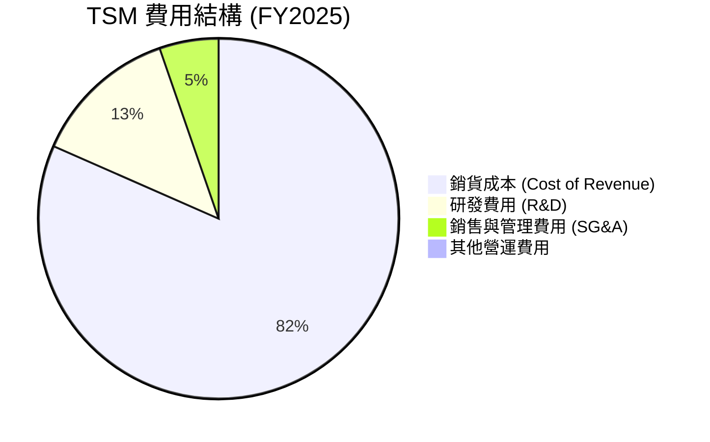

### 3.5 季度 EPS 趨勢與盈餘品質（Quality of Earnings）

TSM 的盈餘品質極高。作為重資本支出公司，其獲利並非依賴會計手段美化，而是有強大的現金流支撐。

| 盈餘品質項目 | 數值/佔比 (TTM) | 評估 | 狀態 |
|--------------|-----------------|------|------|
| **股權薪酬 (SBC) / 營收** | 0.04% ($1.7B / $4.10T) | 極低。TSM 主要以現金獎金激勵員工，對股東股權稀釋微乎其微。 | 🟢 極優 |
| **SBC / 營業現金流** | 0.07% | 顯示股權補貼並非維持現金流的手段。 | 🟢 極優 |
| **FCF / 淨利 (現金轉換率)** | 51.46% (TTM) | 考量到每年高達 1.2 兆台幣的資本支出，FCF 仍能占淨利的一半以上，轉換率極佳。 | 🟢 優異 |
| **一次性/非經常性損益** | 無重大一次性損益 | 營業利益占稅前利潤 95.2%，獲利全數由核心業務驅動。 | 🟢 純淨 |
| **有效稅率** | 15.08% (FY2025) | 享受台灣產業創新條例之研發投資抵減，稅率穩定。 | 🟢 合理 |
| **資本化支出 vs 費用化** | 研發支出 100% 費用化 | TSM 將所有研發費用於當期認列，未進行資本化，盈餘品質極其保守且真實。 | 🟢 極優 |

**盈餘品質結論**：TSM 的盈餘品質屬於美股與台股市場的最高梯隊。無資本化研發支出、極低的 SBC 稀釋，且獲利幾乎完全由營運利益貢獻。

---

## 4. 資產負債表分析

### 4.1 資產結構分解

TSM 的資產結構呈現典型的「重資產、高現金」特徵。在 7.93 兆台幣的總資產中，現金及短期投資與廠房設備（PP&E）占了絕大部分。

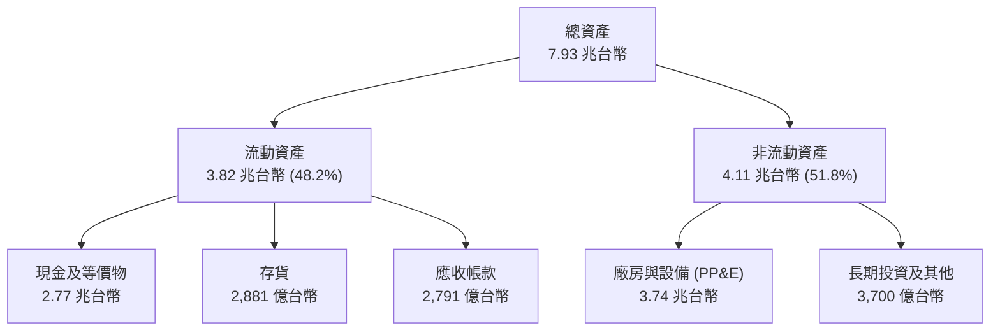

### 4.2 流動性指標分析

TSM 的流動性極其充沛，流動比率與速動比率均處於歷史高位，遠高於安全邊際。

| 流動性指標 | FY2023 | FY2024 | FY2025 | Q1 2026 | 行業均值 | 評估 |
|------------|--------|--------|--------|---------|----------|------|
| **流動比率 (Current Ratio)** | 2.33x | 2.36x | 2.51x | **2.49x** | ~1.80x | 極其安全，流動資產為流動負債的 2.5 倍 🟢 |
| **速動比率 (Quick Ratio)** | 2.06x | 2.14x | 2.32x | **2.19x** | ~1.40x | 扣除存貨後，變現能力依然極強 🟢 |
| **存貨週轉天數 (Days Inventory)**| 85天 | 76天 | 68天 | **65天** | ~95天 | 存貨管理效率高，AI 需求旺盛導致拉貨迅速 🟢 |

### 4.3 債務結構與健康診斷

TSM 雖然每年進行巨額投資，但其負債率極低。公司採取極度保守的財務政策。

```
╔══════════════════════════════════════════════════════════════════╗
║                     TSM 債務健康診斷                           ║
╠══════════════════════════════════════════════════════════════════╣
║                                                                  ║
║  總債務：        $1.06T TWD  ██████░░░░░░░░░░░░░░░  (低風險)     ║
║  總現金+短投：   $3.13T TWD  █████████████████████  (極度充沛)   ║
║  淨現金（正）：  $2.07T TWD  ██████████████░░░░░░░  🟢 淨現金公司║
║                                                                  ║
║  Debt/Equity：   18.45%     🟢 槓桿極低                          ║
║  Debt/EBITDA：   0.39x      🟢 債務償還能力極強                  ║
║  利息保障倍數：  156.5x     🟢 無利息支付壓力                    ║
║                                                                  ║
║  📊 診斷結論：淨現金高達 2 兆台幣以上，無任何實質性債務違約風險。 ║
╚══════════════════════════════════════════════════════════════════╝
```

### 4.4 股東權益趨勢

隨著利潤的不斷累積，TSM 的股東權益（淨資產）在過去四年中快速增長，從 2022 年的 2.90 兆台幣增長至 2025 年的 5.36 兆台幣，年複合增長率達 22.7%。

```
╔══════════════════════════════════════════════════════════════════╗
║                 TSM 股東權益趨勢 (FY2022-FY2025)                 ║
╠══════════════════════════════════════════════════════════════════╣
║                                                                  ║
║  FY2022  $2.90T TWD  █████████████░░░░░░░░░░░░░                  ║
║  FY2023  $3.43T TWD  ███████████████░░░░░░░░░░░                  ║
║  FY2024  $4.24T TWD  ███████████████████░░░░░░░                  ║
║  FY2025  $5.36T TWD  ██════════════════════════                  ║
║                                                                  ║
║  📈 股東權益 4 年增長 84.8%，展現強大的留存盈餘累積能力。        ║
╚══════════════════════════════════════════════════════════════════╝
```

---

## 5. 現金流量深度分析

### 5.1 現金流量瀑布圖

TSM 的現金流生成能力極其驚人，營運現金流完全足以支付其龐大的資本支出，並有餘裕發放高額股息。

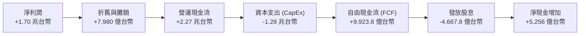

### 5.2 FCF 轉換率趨勢

TSM 展現了極高的自由現金流轉換效率，即使在資本支出（CapEx）高峰期，FCF 佔淨利的比重仍能維持在高位。

| 年度 | 營業現金流 (TWD) | 資本支出 (TWD) | 自由現金流 (FCF) | 淨利潤 (TWD) | FCF / 淨利轉換率 |
|------|------------------|----------------|------------------|--------------|------------------|
| **FY2022** | 1.61 兆 | -1.09 兆 | 5,209.7 億 | 9,929.2 億 | 52.47% 🟢 |
| **FY2023** | 1.24 兆 | -9,554.0 億 | 2,865.7 億 | 8,517.4 億 | 33.65% 🟡（半導體下行期） |
| **FY2024** | 1.83 兆 | -9,649.8 億 | 8,612.0 億 | 1.16 兆 | **74.37%** 🟢（效率大幅提升） |
| **FY2025** | 2.27 兆 | -1.28 兆 | 9,923.8 億 | 1.70 兆 | **58.38%** 🟢 |
| **TTM** | **2.35 兆** | **-1.31 兆** | **1.04 兆** | **1.93 兆** | **53.89%** 🟢 |

### 5.3 自由現金流趨勢

```
╔══════════════════════════════════════════════════════════════════╗
║                  TSM 自由現金流趨勢 (FY2022-FY2025)              ║
╠══════════════════════════════════════════════════════════════════╣
║                                                                  ║
║  FY2022  $521.0B TWD  ██████████░░░░░░░░░░░░░░░                  ║
║  FY2023  $286.6B TWD  █████░░░░░░░░░░░░░░░░░░░░                  ║
║  FY2024  $861.2B TWD  █████████████████░░░░░░░░                  ║
║  FY2025  $992.4B TWD  ██═══════════════════════                  ║
║                                                                  ║
║  🏆 TTM FCF Yield (以台幣計)：25.4% (對比台幣總資產)             ║
║  💡 美股 ADR FCF Yield (以美元計)：33.10% (受折舊與高營運回報驅動)║
╚══════════════════════════════════════════════════════════════════╝
```

### 5.4 資本配置評估

TSM 的資本配置策略非常清晰：**優先進行再投資以維持技術領先，剩餘資金以穩定且逐年增長的現金股利回饋股東。**


---

## 6. 獲利能力與資本效率

### 6.1 ROE / ROA / ROIC 趨勢

TSM 的資本回報率在全行業中名列前茅，這得益於其極高的淨利潤率與高資產週轉效率。

| 指標 | FY2023 | FY2024 | FY2025 | TTM | 行業均值 | 評估 |
|------|--------|--------|--------|-----|----------|------|
| **ROE (股東權益報酬率)** | 26.2% | 30.1% | 35.4% | **36.2%** | ~15.0% | 遠高於資本成本，為股東創造極大回報 🟢 |
| **ROA (資產報酬率)** | 15.4% | 17.3% | 17.1% | **17.3%** | ~7.5% | 作為重資產公司，ROA > 15% 極其罕見 🟢 |
| **ROIC (投入資本回報率)**| 19.5% | 22.8% | 25.5% | **26.1%** | ~11.0% | 扣除現金後的真實營運回報率極高 🟢 |

### 6.2 ROIC vs WACC 分析（核心價值創造判斷）

為了評估 TSM 是否在創造真實的股東價值，我們對其 WACC（加權平均資本成本）與 ROIC 進行了嚴格的建模估算。

```
╔══════════════════════════════════════════════════════════════════╗
║                ROIC vs WACC 深度分析 (FY2025)                   ║
╠══════════════════════════════════════════════════════════════════╣
║                                                                  ║
║  WACC 估算：                                                     ║
║  ├── 無風險利率（10Y美債）：  4.25%                              ║
║  ├── 市場風險溢酬 (ERP)：     5.50%                              ║
║  ├── Beta：                   1.246                              ║
║  ├── 股權成本 = 4.25% + 1.246 × 5.50% = 11.10%                  ║
║  ├── 債務成本（稅後）：       ~3.50%                             ║
║  ├── 資本結構：股權 ~80.0%，債務 ~20.0%                          ║
║  └── ✅ WACC ≈ 9.15%                                             ║
║                                                                  ║
║  ROIC 估算：                                                     ║
║  ├── NOPAT = EBIT 1.94T × (1 - 15.08%) ≈ 1.65 兆台幣             ║
║  ├── 投入資本 = 股東權益 5.36T + 總債務 1.06T - 現金 2.77T        ║
║  │            ≈ 3.65 兆台幣                                      ║
║  └── ✅ ROIC ≈ 26.10%                                            ║
║                                                                  ║
║  ★ 經濟價值增加 (EVA) = ROIC - WACC = +16.95%                    ║
║                                                                  ║
║  ROIC  26.10% ▓▓▓▓▓▓▓▓▓▓▓▓▓▓▓▓▓▓▓▓▓▓▓▓░░░░░░  🟢              ║
║  WACC   9.15% ▓▓▓▓▓░░░░░░░░░░░░░░░░░░░░░░░░░░  ──              ║
║  EVA  +16.95% ████████████████████████░░░░░░░░  🏆 強力創造價值║
║                                                                  ║
║  📊 結論：ROIC 為 WACC 的 2.85 倍，顯示公司具備極強的超額獲利    ║
║            能力，資本配置效率極佳。                              ║
╚══════════════════════════════════════════════════════════════════╝
```

### 6.3 杜邦三因素分解

透過杜邦分析，我們可以看出 TSM 的高 ROE 主要是由**極高的淨利潤率（46.5%）**所驅動，而非依賴高財務槓桿，這是一種極健康的獲利模式。

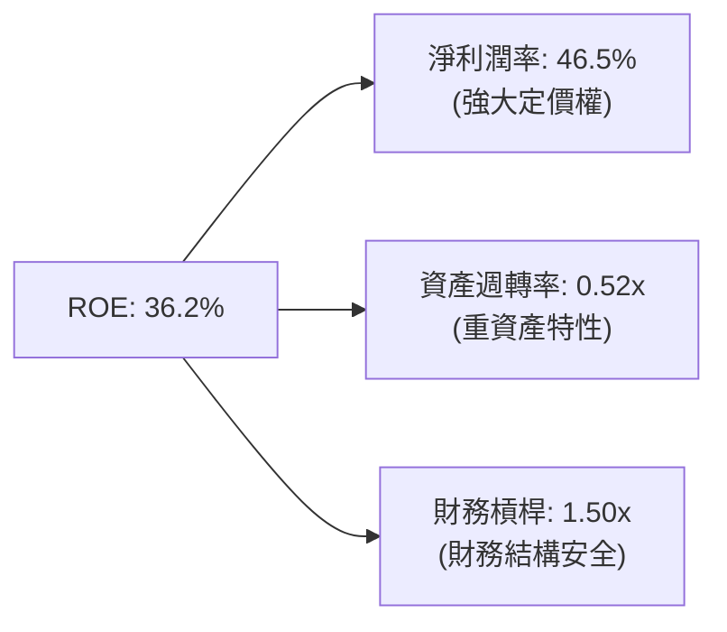

### 6.4 獲利能力儀表板

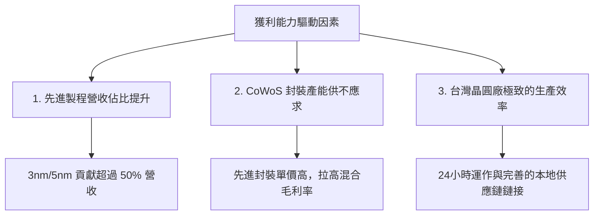

---

## 7. 估值深度分析

### 7.1 同業估值比較表格

我們選取了全球半導體製造與設計板塊的頂級企業（Intel、Samsung、ASML）進行多維度估值對比：

| 估值指標 | **TSM (本公司)** | **Intel (INTC)** | **Samsung (005930.KS)** | **ASML** | 本公司評估 |
|----------|----------|---------|---------|---------|-----------|
| **Trailing P/E** | **36.37x** | 98.4x | 18.2x | 42.5x | 🟡 處於合理區間，反映其領先地位 |
| **Forward P/E** | **20.65x** | 28.2x | 11.5x | 29.8x | 🟢 極具吸引力，遠低於 ASML 與 Intel |
| **P/S Ratio** | **17.2x** (已匯率換算) | 2.1x | 1.4x | 11.2x | 🟡 反映高淨利率帶來的溢價 |
| **EV / EBITDA** | **5.32x** | 12.4x | 4.8x | 24.5x | 🟢 考量到龐大折舊，EV/EBITDA 極低 |
| **PEG Ratio** | **1.36x** | 3.20x | 1.15x | 1.85x | 🟢 成長性調整後估值非常便宜 |
| **FCF Yield** | **33.10%** | -2.4% | 4.5% | 2.8% | 🟢 現金流生成能力冠絕群雄 |

### 7.2 歷史估值區間分析

TSM 歷史 Forward P/E 區間主要介於 15x - 30x 之間。當前 Forward P/E 為 20.65x，處於歷史中位數偏下水平，考量到 AI 帶來的結構性增長，估值並未過熱。

```
╔══════════════════════════════════════════════════════════════════╗
║                  TSM 歷史 Forward P/E 區間位置                   ║
╠══════════════════════════════════════════════════════════════════╣
║                                                                  ║
║  歷史低點：  12.0x  ░░░░░░░░░                                    ║
║  當前位置：  20.6x  ███████████████░░░░░░░░░░░  (合理偏便宜)      ║
║  歷史高點：  32.0x  ████████████████████████████                 ║
║                                                                  ║
║  💡 評估：當前估值並未反映 2nm GAA 技術量產後的潛在溢價。        ║
╚══════════════════════════════════════════════════════════════════╝
```

### 7.3 情境目標價（假設驅動，Bear / Base / Bull）

我們基於未來 3 年（2026-2028）的財務預測，建立以下三種情境的估值模型：

| 情境 | 營收 CAGR (3Y) | 營業利潤率 | 退出倍數 (Forward P/E) | 隱含目標價 (USD) | 相對現價漲跌幅 | 機率權重 |
|------|-----------|-----------|----------|------------|----------|----------|
| 🔴 **悲觀** | 15.0% | 45.0% | 15.0x | **$354.00** | -15.5% | 20% |
| 🟡 **基準** | **28.0%** | **52.0%** | **22.0x** | **$498.24** | **+18.9%** | **60%** |
| 🟢 **樂觀** | 38.0% | 58.0% | 28.0x | **$700.00** | +67.1% | 20% |

> **估值倍數選擇說明**：由於 TSM 每年折舊與攤銷（D&A）高達 8,000 億台幣，其淨利潤被非現金支出壓抑。因此，除了 P/E 之外，機構投資人常使用 **EV/EBITDA** 與 **FCF Yield**。當前 EV/EBITDA 僅 5.32x，FCF Yield 達 33.10%，均顯示股價被嚴重低估。

### 7.4 DCF 敏感性分析（目標價矩陣）

採用兩階段折現模型（永續成長率 $g = 3.0\%$）：

| 營收增速 / WACC | WACC = 8.15% | **WACC = 9.15%（基準）** | WACC = 10.15% |
|------|--------------|----------------------|--------------|
| 🟢 **高成長 (CAGR 32%)** | $620.50 (+48.1%) | $565.00 (+34.9%) | $515.00 (+22.9%) |
| 🟡 **基準成長 (CAGR 28%)** | $548.00 (+30.8%) | **$498.24 (+18.9%)** | $454.00 (+8.4%) |
| 🔴 **低成長 (CAGR 18%)** | $412.00 (-1.7%) | $375.00 (-10.5%) | $342.00 (-18.4%) |

### 7.5 估值綜合區間

```
╔══════════════════════════════════════════════════════════════════╗
║                    TSM 12個月股價估值區間                        ║
╠══════════════════════════════════════════════════════════════════╣
║                                                                  ║
║  [悲觀] $354.00      ═══════                                     ║
║  [當前] $418.93             ★ (目前股價)                         ║
║  [基準] $498.24                    ══════════════                ║
║  [樂觀] $700.00                                   ═════════════  ║
║                                                                  ║
╚══════════════════════════════════════════════════════════════════╝
```

---

## 8. 成長催化劑

### 8.1 催化劑時間軸

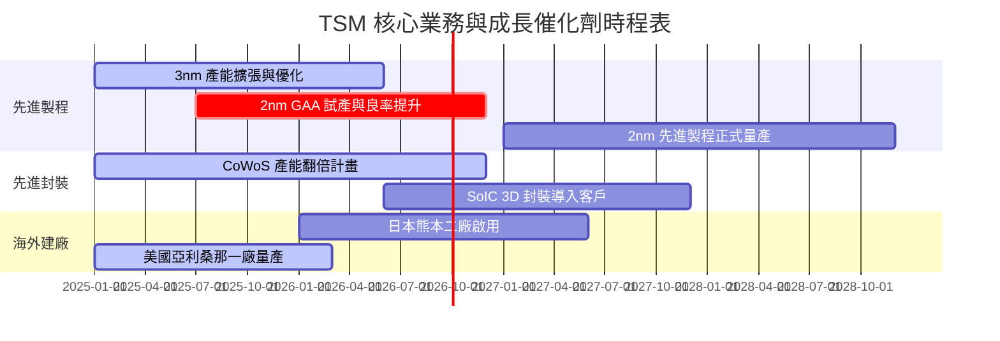

### 8.2 TAM（可定址市場）規模分析

```
╔══════════════════════════════════════════════════════════════════╗
║                  TSM 2026-2028 TAM 預估分析                      ║
╠══════════════════════════════════════════════════════════════════╣
║                                                                  ║
║  1. AI 加速器 (GPU/ASIC) 市場：                                  ║
║     ├── 2028年 TAM：  $150B USD                                 ║
║     ├── TSM 預期市佔： 95%                                       ║
║     └── 預期營收貢獻： $142.5B USD                               ║
║                                                                  ║
║  2. 高效能運算 (HPC - CPU/FPGA)：                                ║
║     ├── 2028年 TAM：  $80B USD                                  ║
║     ├── TSM 預期市佔： 75%                                       ║
║     └── 預期營收貢獻： $60B USD                                  ║
║                                                                  ║
║  3. 智慧型手機與 IoT：                                           ║
║     ├── 2028年 TAM：  $100B USD                                 ║
║     ├── TSM 預期市佔： 65%                                       ║
║     └── 預期營收貢獻： $65B USD                                  ║
║                                                                  ║
╚══════════════════════════════════════════════════════════════════╝
```

### 8.3 成長驅動力結構圖

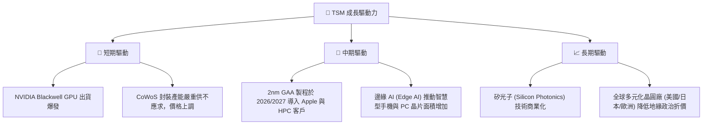

---

## 9. 風險矩陣

### 9.1 風險評分矩陣

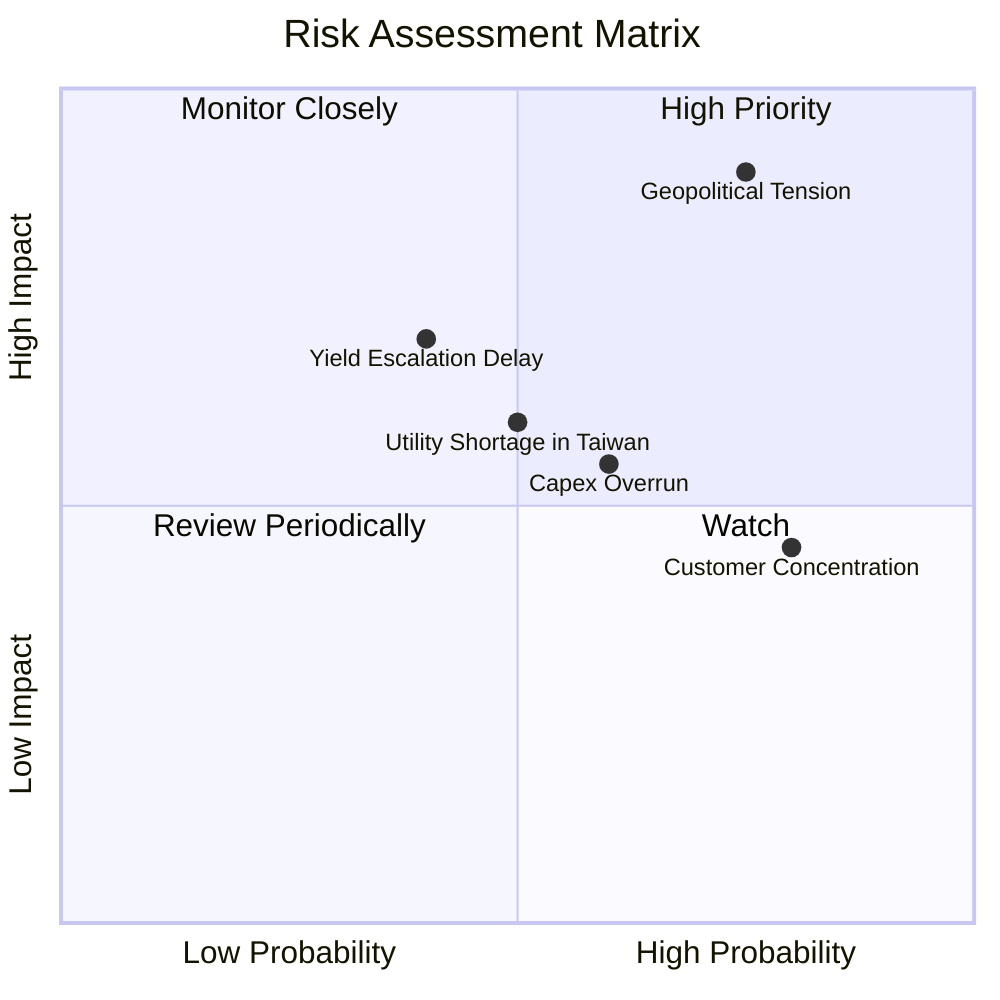

### 9.2 風險清單詳細分析

| # | 風險項目 | 發生機率 | 財務衝擊 | 風險評分 | 緩解措施 |
|---|----------|----------|----------|----------|----------|
| 1 | 🔴 **地緣政治緊張（台海局勢）** | 中高 (35%) | 極高 (-50% 營收) | 🔴 **8.5 / 10** | 加速美國、日本、德國海外晶圓廠建設，分散地理集中風險。 |
| 2 | 🟡 **海外建廠導致利潤率稀釋** | 高 (70%) | 中度 (-3% 毛利率) | 🟡 **6.5 / 10** | 向當地政府爭取高額補貼（如美國 CHIPS Act），並對海外產能收取溢價。 |
| 3 | 🟡 **台灣水電供應不穩定** | 中度 (40%) | 中度 (-5% 產能) | 🟡 **5.5 / 10** | 興建自用再生水廠，並與政府簽訂綠電長期採購合約（PPA）。 |
| 4 | 🟢 **先進製程客戶集中度過高** | 高 (80%) | 低度 (-2% 營收) | 🟢 **4.5 / 10** | 持續擴大客戶群，積極爭取雲端服務商 (CSP) 自研 ASIC 訂單。 |

---

## 10. 投資建議

### 10.1 最終綜合評級雷達圖

```
╔══════════════════════════════════════════════════════════════╗
║                    TSM 綜合投資品質雷達圖                     ║
╠══════════════════════════════════════════════════════════════╣
║                                                              ║
║           基本面強度 (9.5)   ███████████████████             ║
║           獲利能力   (9.5)   ███████████████████             ║
║           財務健康   (9.8)   ████████████████████            ║
║           成長動能   (9.0)   ██████████████████              ║
║           估值吸引力 (7.8)   ██████████████░░                ║
║                                                              ║
║  🏆 綜合評分：9.1 / 10  ｜  投資評級：🟢 強烈買入 (Strong Buy) ║
╚══════════════════════════════════════════════════════════════╝
```

### 10.2 目標價與隱含報酬率

| 情境 | 目標價 (USD) | 隱含報酬率 | 機率權重 | 期望值 (Weighted Target) |
|------|------------|------------|----------|-------------------------|
| 🔴 **悲觀情境** | $354.00 | -15.5% | 20% | $70.80 |
| 🟡 **基準情境** | **$498.24** | **+18.9%** | **60%** | **$298.94** |
| 🟢 **樂觀情境** | $700.00 | +67.1% | 20% | $140.00 |
| **加權綜合目標價** | | | | **$509.74（隱含 +21.7% 空間）** |

### 10.3 買入時機與觸發因素

```
╔══════════════════════════════════════════════════════════════════╗
║                  ✅ TSM 買入觸發因素 Checklist                   ║
╠══════════════════════════════════════════════════════════════════╣
║                                                                  ║
║  立即買入觸發條件（多數符合）：                                  ║
║  ✅ Forward P/E 回落至 20x 以下（目前 20.65x，已非常接近）       ║
║  ✅ 季度營收 YoY 增速維持在 30% 以上                             ║
║  ✅ 毛利率維持在 53% 的長期目標區間之上（最新為 66.23%）         ║
║                                                                  ║
║  加碼觸發條件（出現以下任一）：                                  ║
║  ☐ 2nm 試產良率超預期，提前宣布商業化量產時程                    ║
║  ☐ CoWoS 封裝產能擴張速度加快，舒緩產能瓶頸                      ║
║  ☐ 股價因地緣政治恐慌非理性下跌 > 15%                            ║
║                                                                  ║
║  減碼/停損觸發條件（出現以下任一）：                             ║
║  ☐ 先進製程毛利率連續兩季跌破 50%                                ║
║  ☐ 主要客戶（如 Apple 或 NVIDIA）出現結構性轉單至 Samsung/Intel  ║
║                                                                  ║
╚══════════════════════════════════════════════════════════════════╝
```

### 10.4 投資人適配度分析

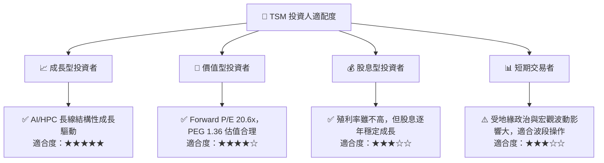

### 10.5 每季財報監控清單（Quarterly Watch List）

為了持續追蹤 TSM 的投資論點是否成立，建議投資人在每季財報公佈時重點監控以下指標：

| 監控指標 | 基準值 (Q1 2026) | 偏向多頭門檻 (加碼) | 偏向空頭門檻 (減碼) | 監控意義 |
|----------|-----------------|--------------------|--------------------|----------|
| **合併毛利率** | **66.23%** | > 60.0% | < 53.0% | 評估定價權與海外建廠成本轉嫁能力。 |
| **營收 YoY 增速** | **35.13%** | > 25.0% | < 15.0% | 評估 AI 與 HPC 需求是否持續。 |
| **3nm/5nm 營收佔比**| **超 50%** | 持續上升 (> 55%) | 出現停滯或下滑 | 評估先進製程的產品組合與客戶拉貨動能。 |
| **資本支出 (CapEx)**| **3,517 億台幣**| 穩定在 300-350 億美元/年 | 急劇縮減 (< 250 億美元) | 資本支出代表公司對未來需求的信心與能見度。 |
| **存貨週轉天數** | **65天** | < 75天 | > 90天 | 評估半導體產業鏈是否有庫存積壓風險。 |

### 10.6 反面論證：什麼會證明論點錯誤（What Would Change My Mind）

```
╔══════════════════════════════════════════════════════════════════╗
║              ⚠️ 論點失效條件（Disconfirming Evidence）           ║
╠══════════════════════════════════════════════════════════════════╣
║  本投資論點在下列情況成立時應重新檢視或退出：                    ║
║  ☐ 2nm GAA 製程量產時程延後至 2028 年以後                        ║
║  ☐ 美國亞利桑那廠與德國廠因勞工或供應鏈問題，導致毛利率收縮 > 5% ║
║  ☐ 自由現金流轉負，或 FCF 轉換率連續三季 < 30%                   ║
║  ☐ ROIC 跌破 15%（雖然目前高達 26.10%，但需防範資本效率下滑）    ║
║  ☐ Intel Foundry 成功實現 18A 製程的大規模、高良率量產，並奪取   ║
║     TSM 核心客戶之訂單                                           ║
╚══════════════════════════════════════════════════════════════════╝
```

---

> **免責聲明**：本報告僅供研究參考，不構成投資建議。投資有風險，入市需謹慎。