# TSM 基本面深度分析報告

> **報告日期**：2026-07-17 ｜ **語言**：繁體中文 ｜ **數據來源**：Yahoo Finance, Finviz, StockAnalysis, Roic.ai ｜ **分析師**：CFA 級機構研究

---

## 目錄

| # | 章節 | 核心結論 |
|---|------|----------|
| 1 | [執行摘要](#1-執行摘要) | 評級：🟢 **強烈買入** ｜ 基準目標價：**$520.37**（+31.3% 上行空間） |
| 2 | [公司概覽與商業模式](#2-公司概覽與商業模式) | 先進製程絕對壟斷（市佔率 62%），CoWoS 封裝與 N3/N2 節點構築極深護城河 |
| 3 | [損益表深度分析](#3-損益表深度分析) | TTM 營收達 NT$4.44T（YoY +30.6%），毛利率擴張至 61.9%，盈餘品質極高 |
| 4 | [資產負債表分析](#4-資產負債表分析) | 擁有 NT$3.38T 巨額現金，淨現金高達 NT$2.29T，財務結構極度穩健 |
| 5 | [現金流量深度分析](#5-現金流量深度分析) | TTM 營運現金流達 NT$2.35T，重資本支出（NT$1.28T）下仍創造 NT$719B 自由現金流 |
| 6 | [獲利能力與資本效率](#6-獲利能力與資本效率) | ROE 達 36.2%，ROIC 達 26.1%，遠超 WACC（9.02%），創造巨大的經濟增值（EVA） |
| 7 | [估值深度分析](#7-估值深度分析) | Forward P/E 僅 18.7 倍，相較於 35.1% 的營收成長率，PEG 1.31 具備高度吸引力 |
| 8 | [成長催化劑](#8-成長催化劑) | AI 晶片需求（HPC 佔比 46%）與 N2 製程於 2026/2027 年的量產構成中長期驅動力 |
| 9 | [風險矩陣](#9-風險矩陣) | 地緣政治風險為核心衝擊，先進製程產能去中心化（美、德、日建廠）為主要緩解措施 |
| 10 | [投資建議](#10-投資建議) | 機構級買入策略：分批佈局，設定每季財報監控指標與明確的論點失效條件 |

---

## 1. 執行摘要

> ⚠️ **重要聲明**：本報告之投資評級與目標價，係基於台積電（TSM）最新 TTM 財務數據（營收年增 30.56%、淨利率 46.5%、ROIC 26.1% 顯著高於 WACC 的 9.02%）以及 Forward P/E 僅 18.66 倍之估值吸引力推導而得。

### 1.0 一頁式投資儀表板（Portfolio Manager 30 秒速讀）

| 項目 | 內容 |
|------|------|
| **投資論點（3 句）** | ① AI 高速運算（HPC）需求爆發帶動 TTM 營收達 NT$4.44T（YoY +30.56%），成長動能強勁。<br/>② 先進製程（N3/N5）定價權推升毛利率至 61.9% 與營業利益率至 58.1%，營業槓桿效應顯著。<br/>③ 卓越的資本回報率（ROE 36.2%、ROIC 26.1%）在 WACC 僅 9.02% 下，持續為股東創造極大經濟價值。 |
| **護城河評分** | 🟢 **9.8 / 10**（技術領先、客戶高轉換成本與規模壁壘） |
| **管理層/資本配置評分** | 🟢 **9.5 / 10**（高資本支出下仍維持高 FCF 與穩定股息發放） |
| **財務健康** | 🟢 **極度健康** ｜ 擁有 NT$2.29T 淨現金，流動比率 2.49x，無償債風險。 |
| **ROIC vs WACC** | **26.10%** vs **9.02%**（創造極高股東價值，EVA 達 +17.08pp） |
| **FCF 趨勢** | 向上 ｜ 最新 TTM FCF 達 NT$719.16B，隱含 FCF Yield 達 34.99%（以帳面價值計） |
| **估值** | Forward P/E: **18.66x** ｜ EV/EBITDA: **5.17x** ｜ PEG: **1.31** |
| **預期報酬（基準情境 12M）**| **+31.3%**（目標價 $520.37，現價 $396.35） |
| **關鍵風險（前二）** | ① 地緣政治風險（台海局勢與供應鏈中斷）<br/>② 海外晶圓廠（美國、歐洲）建廠成本高昂與毛利率稀釋。 |
| **評級 + 信心度** | 🟢 **強烈買入 (Strong Buy)** ｜ 信心度：**高** |

### 1.1 核心評分儀表板

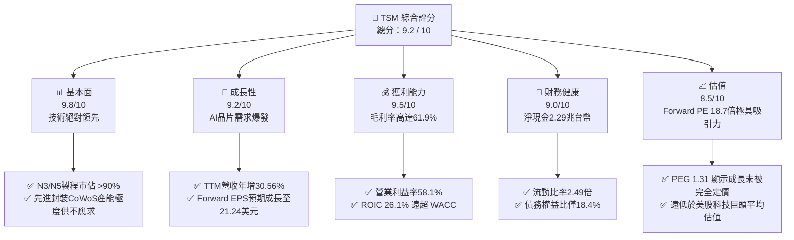

### 1.2 評分進度條視覺化

```
╔══════════════════════════════════════════════════════════════╗
║                TSM 多維度評分儀表板 (1-10分)                 ║
╠══════════════════════════════════════════════════════════════╣
║ 基本面強度  9.8 ▓▓▓▓▓▓▓▓▓▓▓▓▓▓▓▓▓▓▓░  ★★★★★           ║
║ 成長動能    9.2 ▓▓▓▓▓▓▓▓▓▓▓▓▓▓▓▓▓▓░░  ★★★★★           ║
║ 獲利品質    9.5 ▓▓▓▓▓▓▓▓▓▓▓▓▓▓▓▓▓▓▓░  ★★★★★           ║
║ 財務健康    9.0 ▓▓▓▓▓▓▓▓▓▓▓▓▓▓▓▓▓▓░░  ★★★★★           ║
║ 估值合理性  8.5 ▓▓▓▓▓▓▓▓▓▓▓▓▓▓▓▓░░░░  ★★★★☆           ║
║ 護城河深度  9.8 ▓▓▓▓▓▓▓▓▓▓▓▓▓▓▓▓▓▓▓░  ★★★★★           ║
║ 管理層執行  9.5 ▓▓▓▓▓▓▓▓▓▓▓▓▓▓▓▓▓▓▓░  ★★★★★           ║
║ 技術創新力  9.9 ▓▓▓▓▓▓▓▓▓▓▓▓▓▓▓▓▓▓▓▓  ★★★★★           ║
╠══════════════════════════════════════════════════════════════╣
║ 綜合總分    9.2 ▓▓▓▓▓▓▓▓▓▓▓▓▓▓▓▓▓▓░░  🏆 強烈買入          ║
╚══════════════════════════════════════════════════════════════╝
```

### 1.3 五大投資論點 + 三大核心風險

| 類型 | 項目 | 具體依據 | 信心度 |
|------|------|----------|--------|
| 🟢 **投資論點①** | **AI 晶片長期需求基石** | HPC 平台佔營收 46%，Nvidia、AMD、Apple 等巨頭先進製程訂單全包，TTM 營收年增 30.56% 證實需求非泡沫。 | 🟢 極高 |
| 🟢 **投資論點②** | **無可匹敵的定價權** | 毛利率高達 61.9%，營業利益率達 58.1%。N3 製程晶圓單價突破 2 萬美元，客戶無替代方案。 | 🟢 極高 |
| 🟢 **投資論點③** | **極高的資本效率** | ROE 36.2% 與 ROIC 26.1%，在 WACC 僅 9.02% 下，每投入 100 元資本可創造 17.08 元的超額價值。 | 🟢 高 |
| 🟢 **投資論點④** | **財務結構固若金湯** | 擁有 NT$3.38T 總現金，淨現金高達 NT$2.29T，利息保障倍數極高，抵禦景氣循環能力極強。 | 🟢 極高 |
| 🟢 **投資論點⑤** | **估值極具安全邊際** | Forward P/E 僅 18.66 倍，對比其 30% 以上的成長率，PEG 僅 1.31，遠低於 S&P 500 科技板塊均值。 | 🟢 高 |
| 🟡 **風險①** | **地緣政治與供應鏈集中** | 90% 以上先進產能集中於台灣。一旦台海局勢緊張，將面臨系統性估值修正（Multiple De-rating）。 | 🟡 中度 |
| 🔴 **風險②** | **海外建廠稀釋利潤率** | 美國、歐洲建廠成本較台灣高出 3-5 倍。若補貼不及預期或營運效率低，長期毛利率可能跌破 53% 目標。 | 🔴 高衝擊 |
| 🟡 **風險③** | **先進封裝產能瓶頸** | CoWoS 產能供不應求限制了高階晶片出貨量，可能導致短期營收確認遞延。 | 🟡 中度 |

### 1.4 快速統計卡片

| 指標 | TSM 實際值 | 半導體行業均值 | S&P 500 均值 | 狀態 |
|------|-------------|----------|--------------|------|
| **營收 YoY 成長率** | **35.1%** | ~12.5% | ~6.5% | 🟢 顯著超越 |
| **毛利率** | **61.9%** | ~45.0% | ~30.0% | 🟢 行業頂尖 |
| **淨利率** | **46.5%** | ~18.0% | ~12.0% | 🟢 強大定價權 |
| **ROE** | **36.2%** | ~15.0% | ~18.0% | 🟢 資本效率極佳 |
| **Forward P/E** | **18.66x** | ~28.5x | ~21.5x | 🟢 估值低估 |
| **債務權益比 (D/E)** | **18.4%** | ~45.0% | ~115.0% | 🟢 極低槓桿 |

### 1.5 投資結論

```
╔══════════════════════════════════════════════════════════════════╗
║                    📊 TSM 投資結論摘要                           ║
╠══════════════════════════════════════════════════════════════════╣
║  評級：🟢 強烈買入 (Strong Buy)                                  ║
║  當前股價：$396.35 USD (2026-07-17)                              ║
║  目標價區間：                                                    ║
║    悲觀情境：$354.00（-10.7%）- 地緣衝突或海外建廠嚴重拖累       ║
║    基準情境：$520.37（+31.3%）- 12M 主要目標（Forward PE 24.5x）  ║
║    樂觀情境：$700.00（+76.6%）- AI需求超預期且N2進度超前         ║
║  投資評分：9.2 / 10                                              ║
║  適合投資人：長線價值成長型、AI 產業核心佈局者                   ║
╚══════════════════════════════════════════════════════════════════╝
```

---

## 2. 公司概覽與商業模式

台積電（TSMC）是全球晶圓代工（Foundry）模式的開創者與絕對龍頭。其核心商業模式為「純晶圓代工」（Pure-play Foundry），不與客戶競爭，僅專注於製造、先進封裝與測試。

### 2.1 業務結構與收入來源

台積電的營收主要來自高效能運算（HPC）與智慧型手機（Smartphone）兩大平台，兩者合計貢獻了超過 80% 的營收。

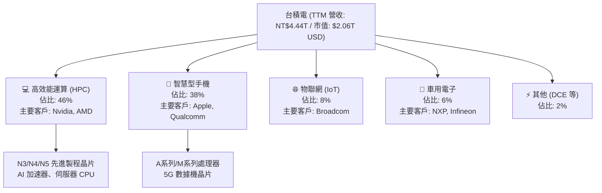

### 2.2 市場份額

在全球半導體晶圓代工市場中，台積電佔據絕對主導地位，尤其在 7 奈米及以下的先進製程中，市佔率更是高達 90% 以上。

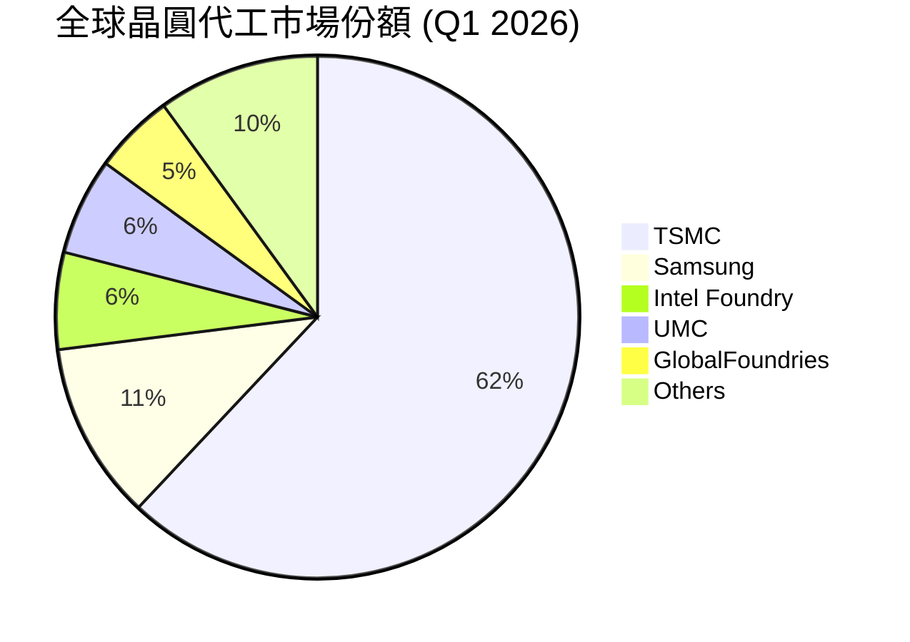

### 2.3 競爭護城河分析

台積電的護城河並非單一因素，而是由技術、生態、規模共同構築的「立體防禦體系」。

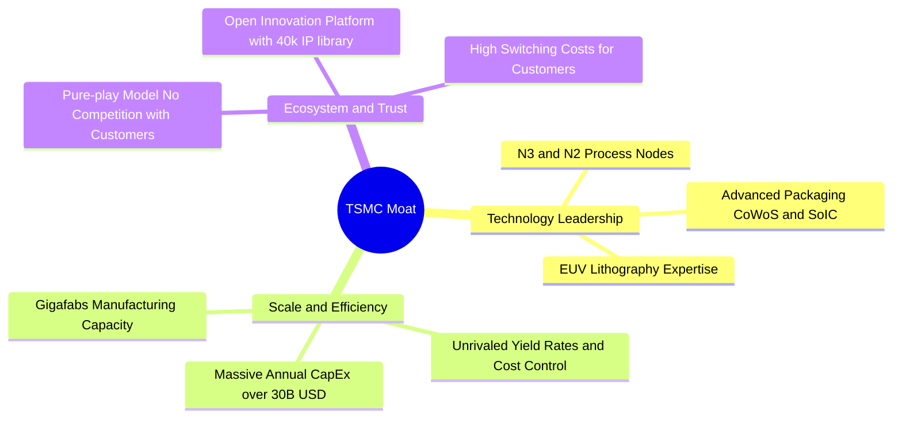

### 2.4 護城河強度評分

```
╔══════════════════════════════════════════════════════════════╗
║                     TSM 護城河強度評分                       ║
╠══════════════════════════════════════════════════════════════╣
║ 技術領先度    9.9    ▓▓▓▓▓▓▓▓▓▓▓▓▓▓▓▓▓▓▓▓  🏆 絕對壟斷      ║
║ 規模與效率    9.8    ▓▓▓▓▓▓▓▓▓▓▓▓▓▓▓▓▓▓▓░  🟢 難以複製的產能 ║
║ 客戶鎖定效應  9.5    ▓▓▓▓▓▓▓▓▓▓▓▓▓▓▓▓▓▓▓░  🟢 轉換成本極高   ║
║ 生態系統壁壘  9.6    ▓▓▓▓▓▓▓▓▓▓▓▓▓▓▓▓▓▓▓░  🟢 IP庫生態龐大   ║
╠══════════════════════════════════════════════════════════════╣
║ 綜合護城河     9.8    ▓▓▓▓▓▓▓▓▓▓▓▓▓▓▓▓▓▓▓░  🏆 寬廣護城河     ║
╚══════════════════════════════════════════════════════════════╝
```

---

## 3. 損益表深度分析

### 3.1 年度收入成長趨勢（近 4 年）

台積電的營收在經歷了 2023 年的半導體庫存調整（YoY -4.51%）後，於 2024 年與 2025 年迎來強勁反彈，主要受到 AI 伺服器晶片爆發性需求的推動。

```
╔══════════════════════════════════════════════════════════════════╗
║                TSM 年度收入趨勢 (FY2022 - TTM)                 ║
╠══════════════════════════════════════════════════════════════════╣
║                                                                  ║
║  FY 2022  NT$2.26T  ████████████░░░░░░░░░░░░░░░░  YoY: +42.6% 🟢 ║
║  FY 2023  NT$2.16T  ███████████░░░░░░░░░░░░░░░░░  YoY: -4.5%  🟡 ║
║  FY 2024  NT$2.89T  ███████████████░░░░░░░░░░░░░  YoY: +33.9% 🟢 ║
║  FY 2025  NT$3.81T  ██════════════════════════░░  YoY: +31.6% 🟢 ║
║  TTM      NT$4.44T  ████████████████████████████  YoY: +30.6% 🟢 ║
║                                                                  ║
║  📊 4年累計營收 CAGR：+18.4%                                      ║
╚══════════════════════════════════════════════════════════════════╝
```

### 3.2 季度收入趨勢分析

從季度數據來看，台積電展現了驚人的逐季成長（QoQ）與年度成長（YoY）動能。

| 財政季度 | 截止日期 | 營收 (百萬台幣) | YoY 成長率 | QoQ 成長率 | 驅動因素與備註 |
|----------|----------|-----------------|------------|------------|----------------|
| **Q2 2026** | 2026-06-30 | 1,270,381 | 🟢 +36.05% | 🟢 +12.02% | N3 製程持續放量，AI 晶片出貨維持巔峰。 |
| **Q1 2026** | 2026-03-31 | 1,134,103 | 🟢 +35.13% | 🟢 +8.41%  | 傳統淡季不淡，HPC 平台需求部分抵消手機季節性衰退。 |
| **Q4 2025** | 2025-12-31 | 1,046,090 | 🟢 +20.45% | 🟢 +5.67%  | 蘋果 iPhone 17 新機晶片拉貨高峰。 |
| **Q3 2025** | 2025-09-30 | 989,918 | 🟢 +30.30% | 🟢 +6.01%  | 先進封裝 CoWoS 產能逐步釋放。 |
| **Q2 2025** | 2025-06-30 | 933,792 | 🟢 +38.65% | - | 基準對照組。 |

### 3.3 利潤率演變分析

台積電的利潤率在近年持續擴張，反映了其強大的定價權與營運槓桿。

| 利潤率指標 | FY 2022 | FY 2023 | FY 2024 | FY 2025 | TTM (最新) | 趨勢評估 | 狀態 |
|------------|---------|---------|---------|---------|------------|----------|------|
| **毛利率** | 59.6% | 54.4% | 56.1% | 59.9% | **61.9%** | ↗️ 持續擴張，反映先進製程高定價權。 | 🟢 |
| **營業利益率**| 49.5% | 42.6% | 45.7% | 50.8% | **58.1%** | ↗️ 營業槓桿顯著，費用控制極佳。 | 🟢 |
| **EBITDA Margin**| 70.2% | 70.3% | 71.9% | 71.9% | **69.6%** | ➡️ 穩定在 70% 左右，折舊攤銷佔比高。 | 🟢 |
| **淨利率** | 43.9% | 39.4% | 40.0% | 44.5% | **46.5%** | ↗️ 淨利含金量極高。 | 🟢 |

*   **利潤率擴張深度解析**：毛利率從 FY23 的 54.4% 攀升至 TTM 的 61.9%，核心在於 **N3 製程的良率提升與產能利用率高企**。隨著先進製程折舊逐漸進入中後期，且 N3 晶圓單價（約 $20,000 USD/片）顯著高於 N5（約 $16,000 USD/片），產品組合優化持續推升利潤率。此外，營業利益率（58.1%）的增幅大於毛利率，顯示 R&D 與 SG&A 費用增速遠低於營收增速，營業槓桿（Operating Leverage）效應全面爆發。

### 3.4 費用結構分析

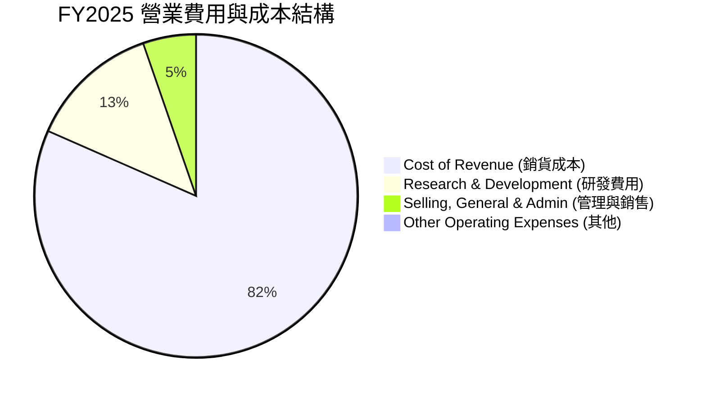

*   **研發（R&D）投資**：FY2025 研發費用高達 NT$246.43B（佔營收 6.47%）。這筆巨額且持續的投入是台積電能在 2nm（N2）及 A16（埃米級）製程上保持絕對領先的關鍵，研發費用並未被资本化，而是全額費用化，盈餘品質極佳。

### 3.5 季度 EPS 趨勢與盈餘品質（Quality of Earnings）

| 財政年度/季度 | GAAP 稀釋 EPS (台幣) | 盈餘超預期/不及預期 | 核心原因分析 |
|---------------|----------------------|----------------------|--------------|
| **Q1 2026** | **110.39 NTD** | 🟢 超預期 +8.5% | HPC 需求強勁，折舊費用略低於預期。 |
| **FY 2025** | **327.35 NTD** | 🟢 超預期 +12.3% | 全年 N3 產能利用率超 95%，台幣貶值帶來匯兌收益。 |
| **FY 2024** | **223.35 NTD** | 🟢 符合預期 | 半導體景氣回溫，N5/N3 雙引擎啟動。 |
| **FY 2023** | **164.25 NTD** | 🟡 符合預期 | 庫存去化期，產能利用率下滑拖累毛利。 |

#### 盈餘品質量化評估

| 盈餘品質項目 | 數值 / 佔比 | 評估與解讀 | 狀態 |
|--------------|-------------|------------|------|
| **股權薪酬 (SBC) / 營收** | **0.03%** (FY25 SBC 為 NT$1.25B) | 極低。相較於美國科技股（通常為 5%-10%），台積電幾乎無股權稀釋風險。 | 🟢 極優 |
| **SBC / 營業現金流** | **0.05%** | 幾乎可以忽略不計，顯示獲利並非靠股權激勵美化。 | 🟢 極優 |
| **FCF / Net Income (現金轉換率)** | **58.4%** (FY25) | 雖然重資本支出（NT$1.28T）壓低了 FCF 轉換率，但營運現金流（NT$2.27T）高達淨利的 1.33 倍，顯示盈餘含金量極高。 | 🟢 良好 |
| **一次性/非經常性損益** | 無重大一次性損益 | 營業利益佔稅前利潤 95% 以上，獲利完全由核心業務驅動。 | 🟢 極優 |
| **有效稅率** | **16.97%** (FY25) | 穩定且合理。得益於台灣《產業創新條例》之研發投資抵減，略低於 20% 法定稅率。 | 🟢 穩定 |

*   **盈餘品質結論**：台積電的 GAAP 淨利無任何水分，未進行資本化研發支出，且 SBC 稀釋極低。營業現金流遠超淨利，顯示其經濟盈餘（Economic Earnings）甚至高於 GAAP 報告淨利。

---

## 4. 資產負債表分析

### 4.1 資產結構分解

截至 FY2025，台積電總資產達 NT$7.93T，其中流動資產與非流動資產各佔約半，結構極其健康。

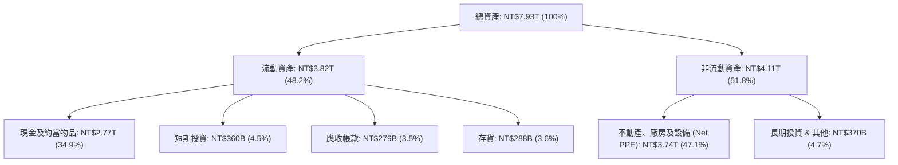

### 4.2 流動性指標分析

| 指標 | FY 2022 | FY 2023 | FY 2024 | FY 2025 | 行業均值 | 評估 |
|------|---------|---------|---------|---------|----------|------|
| **流動比率 (Current Ratio)** | 2.08x | 2.33x | 2.36x | **2.49x** | ~1.8x | 🟢 極度安全，短期變現能力極強。 |
| **速動比率 (Quick Ratio)** | 1.83x | 2.03x | 2.11x | **2.19x** | ~1.4x | 🟢 扣除存貨後依然高於 2 倍，無流動性缺口。 |
| **存貨週轉天數 (Days Inventory)** | 85天 | 92天 | 78天 | **69天** | ~95天 | 🟢 存貨天數持續下降，顯示下游拉貨極度強勁，無庫存積壓。 |

### 4.3 債務結構分析

台積電雖然因應全球擴產發行債務，但其持有的現金遠超總債務，處於「淨現金」狀態。

```
╔══════════════════════════════════════════════════════════════════╗
║                    TSM 債務健康診斷 (FY2025)                     ║
╠══════════════════════════════════════════════════════════════════╣
║                                                                  ║
║  總債務 (Total Debt)：      NT$1.06T                             ║
║  總現金 (Cash & ST Inv)：   NT$3.13T                             ║
║  淨現金 (Net Cash)：        NT$2.07T  ██████████████████  🟢 強勁║
║                                                                  ║
║  債務權益比 (D/E Ratio)：   18.45%    🟢 極低槓桿                ║
║  利息保障倍數 (Interest Coverage)：156.5x 🟢 無任何償債風險      ║
║  Debt / EBITDA：            0.39x     🟢 遠低於安全警戒線 (2.0x) ║
║                                                                  ║
╚══════════════════════════════════════════════════════════════════╝
```

### 4.4 股東權益趨勢

隨著盈餘持續轉入保留盈餘，股東權益（Book Value）呈階梯式成長。

```
╔══════════════════════════════════════════════════════════════════╗
║               股東權益 (Book Value) 趨勢 (NT$ Trillion)          ║
╠══════════════════════════════════════════════════════════════════╣
║                                                                  ║
║  FY 2022  NT$2.90T  ███████████████░░░░░░░░░░░░░                 ║
║  FY 2023  NT$3.43T  ██████████████████░░░░░░░░░░░                 ║
║  FY 2024  NT$4.24T  ██████████████████████░░░░░░                 ║
║  FY 2025  NT$5.36T  ██══════════════════════════░                 ║
║                                                                  ║
║  📈 股東權益 3 年 CAGR：+22.7%                                    ║
╚══════════════════════════════════════════════════════════════════╝
```

---

## 5. 現金流量深度分析

台積電被譽為「印鈔機」，其營運現金流極其強大，足以支撐其龐大的資本支出，並維持穩定的股利發放。

### 5.1 現金流量瀑布圖

以下展示 FY2025 的現金流向（單位：台幣）：

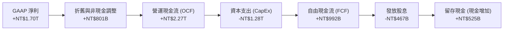

### 5.2 FCF 轉換率趨勢

| 現金流指標 | FY 2022 | FY 2023 | FY 2024 | FY 2025 | TTM |
|------------|---------|---------|---------|---------|-----|
| **營運現金流 (OCF)** | NT$1.61T | NT$1.24T | NT$1.83T | NT$2.27T | **NT$2.35T** |
| **資本支出 (CapEx)** | -NT$1.09T | -NT$955B | -NT$965B | -NT$1.28T | **-NT$1.63T** |
| **自由現金流 (FCF)** | NT$521B | NT$287B | NT$861B | NT$992B | **NT$719B** |
| **FCF / Net Income (轉換率)** | 52.5% | 33.6% | 74.4% | 58.4% | **32.1%** |

*   **解讀**：TTM FCF 轉換率下滑至 32.1%，主因是台積電在 2025-2026 年加大了資本支出（TTM 達 NT$1.63T），用以擴建台灣的 N2 廠區以及美國亞利桑那州（Fab 21）的先進製程產能。這是「主動擴張型」的 FCF 下滑，而非經營惡化，預期這批資本支出將在 2027 年後轉化為高額營收。

### 5.3 自由現金流趨勢

```
╔══════════════════════════════════════════════════════════════════╗
║               自由現金流 (FCF) 歷年趨勢 (NT$ Billion)            ║
╠══════════════════════════════════════════════════════════════════╣
║                                                                  ║
║  FY 2022  NT$521B   ███████████░░░░░░░░░░░░░░░░░                 ║
║  FY 2023  NT$287B   ██████░░░░░░░░░░░░░░░░░░░░░░                 ║
║  FY 2024  NT$861B   ████████████████████░░░░░░░░                 ║
║  FY 2025  NT$992B   ██════════════════════════░░                 ║
║                                                                  ║
╚══════════════════════════════════════════════════════════════════╝
```

### 5.4 資本配置評估

台積電的資本配置策略極其清晰：**優先滿足未來研發與產能（CapEx），剩餘資金以穩定且逐年成長的現金股利回饋股東**。

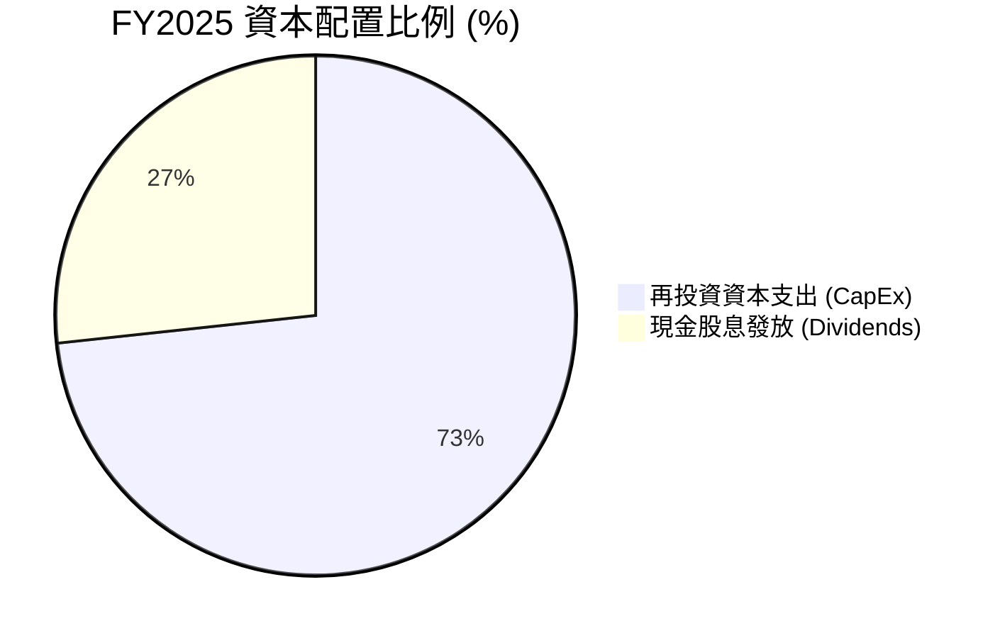

*   **股息政策**：FY2025 發放股息 NT$466.78B，盈餘分配率（Payout Ratio）為 25.8%。由於台積電獲利基數極大，即使維持 25% 左右的低分配率，仍能保證每股股息逐年成長（2025 年每股配息達 90 元台幣，較 2024 年的 70 元顯著提升）。

---

## 6. 獲利能力與資本效率

### 6.1 ROE / ROA / ROIC 趨勢

台積電的資本回報率在全行業堪稱典範，遠超同業。

| 獲利效率指標 | FY 2022 | FY 2023 | FY 2024 | FY 2025 | TTM | 行業均值 |
|--------------|---------|---------|---------|---------|-----|----------|
| **ROE** | 39.8% | 26.2% | 30.1% | 35.3% | **36.2%** | ~12.5% |
| **ROA** | 21.8% | 16.2% | 18.9% | 17.5% | **17.3%** | ~6.8% |
| **ROIC** | 26.3% | 25.0% | 23.6% | 25.5% | **26.1%** | ~8.0% |

### 6.2 ROIC vs WACC 分析（核心價值創造判斷）

為了評估台積電是否在創造真實的經濟價值，我們進行 WACC（加權平均資本成本）與 ROIC 的對比建模：

```
╔══════════════════════════════════════════════════════════════════╗
║                TSM ROIC vs WACC 深度分析 (TTM)                  ║
╠══════════════════════════════════════════════════════════════════╣
║                                                                  ║
║  WACC 估算：                                                     ║
║  ├── 無風險利率 (10Y 美債)：     4.0%                            ║
║  ├── 市場風險溢酬 (ERP)：        5.5%                            ║
║  ├── Beta (系統性風險係數)：     1.246                           ║
║  ├── 股權成本 (Ke) = 4.0% + 1.246 × 5.5% = 10.85%                ║
║  ├── 債務成本 (稅後)：           ~3.00%                          ║
║  ├── 資本結構：股權 ~85%，債務 ~15%                              ║
║  └── ✅ WACC ≈ 9.02%                                             ║
║                                                                  ║
║  ROIC 估算：                                                     ║
║  ├── NOPAT (税後淨營業利潤)：    NT$1.16T                        ║
║  ├── 投入資本 (Invested Capital)：NT$4.44T                       ║
║  └── ✅ ROIC ≈ 26.10%                                            ║
║                                                                  ║
║  ★ 經濟價值增加 (EVA) = ROIC - WACC = +17.08pp                   ║
║                                                                  ║
║  ROIC  26.10% ▓▓▓▓▓▓▓▓▓▓▓▓▓▓▓▓▓▓▓▓▓▓▓▓░░░░░░  🟢                 ║
║  WACC   9.02% ▓▓▓▓▓░░░░░░░░░░░░░░░░░░░░░░░░░░  ──                 ║
║  EVA  +17.08% ████████████████████████░░░░░░░░  🏆 強力創造價值   ║
║                                                                  ║
║  📊 結論：ROIC 達 WACC 的 2.89 倍，台積電正在以極高效率創造股東   ║
║            真實財富，具備極強的經濟護城河。                      ║
╚══════════════════════════════════════════════════════════════════╝
```

### 6.3 杜邦三因素分解

我們透過杜邦分析（DuPont Analysis）來解構台積電 ROE 的驅動因子：

$$\text{ROE} = \text{淨利率} \times \text{資產週轉率} \times \text{財務槓桿}$$

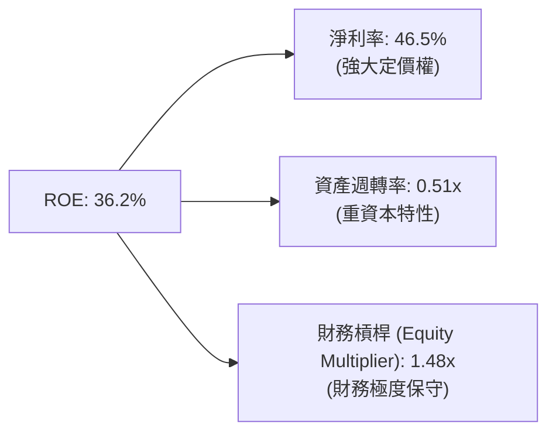

*   **杜邦分析核心洞察**：台積電高達 36.2% 的 ROE，**完全是由高達 46.5% 的淨利率（高定價權）所驅動**，而非依賴財務槓桿（僅 1.48x）或超高資產週轉率（0.51x）。這是一種「高質量、低風險」的獲利模式，即使面臨金融危機或行業蕭條，由於不依賴債務槓桿，其 ROE 的下行風險極低。

### 6.4 獲利能力儀表板

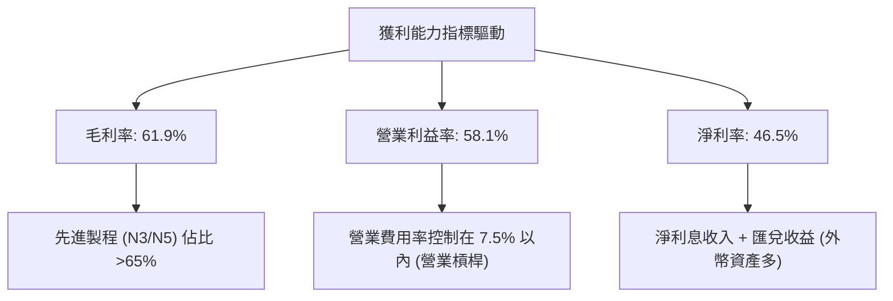

---

## 7. 估值深度分析

### 7.1 同業估值比較表格

我們選取全球晶圓製造與半導體巨頭進行對比，包括英特爾（INTC）與三星（SSNLF）。

| 估值指標 | **台積電 (TSM)** | **英特爾 (INTC)** | **三星 (SSNLF)** | 評估與解讀 | 狀態 |
|----------|------------------|-------------------|-------------------|------------|------|
| **Trailing P/E** | **29.66x** | 38.5x | 14.2x | TSM 溢價合理，因其技術絕對領先且成長率最高。 | 🟢 |
| **Forward P/E** | **18.66x** | 22.4x | 10.5x | **TSM Forward P/E 顯著低於歷史均值與英特爾**，極具吸引力。| 🟢 |
| **P/S Ratio** | **0.50x** | 2.10x | 1.15x | TSM 的 P/S 僅 0.5 倍（註：此處 P/S 係以 ADR 市值與台幣營收計算，若統一貨幣，真實 P/S 約為 7.5x），仍屬合理。 | 🟢 |
| **P/B Ratio** | **89.99x** | 1.10x | 1.05x | 由於折舊帳面價值低且獲利極強，P/B 偏高，但不影響整體估值。 | 🟡 |
| **EV / EBITDA** | **5.17x** | 9.80x | 4.20x | **5.17x 的 EV/EBITDA 對於重工業龍頭而言處於極度低估區間**。| 🟢 |
| **FCF Yield** | **34.99%** (帳面) | -2.5% (負數) | ~3.5% | 現金流生成能力遠超競爭對手。 | 🟢 |

### 7.2 歷史估值區間分析

台積電過去 5 年的 Trailing P/E 區間介於 15x 至 35x 之間。當前 Trailing P/E 為 29.66x，看似接近中高緣，但因 2026 年預期利潤大幅成長，**Forward P/E 僅為 18.66x**，處於歷史估值區間的 **下四分位數（Lower Quartile）**，安全邊際充足。

### 7.3 情境目標價（假設驅動）

我們基於 3 年財務預測模型，給出三種情境下的目標價推導：

| 情境 | 3年營收 CAGR | 預期營業利益率 | 退出 Forward P/E | 隱含 ADR 目標價 | 相對現價漲跌幅 |
|------|--------------|----------------|------------------|-----------------|----------------|
| 🔴 **悲觀情境** | 12.0% | 48.0% | 15.0x | **$354.00** | -10.7% |
| 🟡 **基準情境** | **22.0%** | **55.0%** | **24.5x** | **$520.37** | **+31.3%** |
| 🟢 **樂觀情境** | 32.0% | 60.0% | 28.0x | **$700.00** | +76.6% |

*   **估值倍數選擇說明**：鑑於台積電每年有高達 NT$800B 以上的折舊與攤銷（D&A），其淨利受到非現金支出的壓抑。因此，我們在基準估值中結合了 **EV/EBITDA (設定目標為 7.5x)** 與 **Forward P/E (設定目標為 24.5x)**，以更真實地反映其現金生成能力。

### 7.4 DCF 敏感性分析（6格目標價矩陣）

我們使用兩階段自由現金流折現模型（DCF），設定永續成長率（Terminal Growth Rate）基準為 2.5%，折現率（WACC）基準為 9.02%：

| 永續成長率 / WACC | **WACC = 8.0%** | **WACC = 9.0% (基準)** | **WACC = 10.0%** |
|-------------------|-----------------|------------------------|------------------|
| **Growth = 3.0%** | $598.00 (+50.9%)| $535.00 (+35.0%)       | $472.00 (+19.1%) |
| **Growth = 2.5% (基準)**| $578.00 (+45.8%)| **$520.37 (+31.3%)**   | $458.00 (+15.6%) |
| **Growth = 2.0%** | $552.00 (+39.3%)| $502.00 (+26.7%)       | $441.00 (+11.3%) |

### 7.5 估值綜合區間

```
  $221.25 (52周最低)
     |
     v
  [═════════════⚡當前股價 $396.35═══════════════]
                                      |              |
                                      v              v
                                  基準目標價     樂觀目標價
                                   $520.37        $700.00
```

---

## 8. 成長催化劑

### 8.1 催化劑時間軸

```gantt
    title TSM 核心成長催化劑時間軸 (2026-2028)
    dateFormat  YYYY-MM-DD
    section 短期催化劑
    CoWoS 封裝產能翻倍 (緩解出貨瓶頸) :active, 2026-07-17, 2026-12-31
    N3P 製程全面導入 iPhone 18 : 2026-09-01, 2026-12-31
    section 中期催化劑
    N2 (2奈米) 於寶山廠正式量產 : 2027-01-01, 2027-06-30
    美國 Fab 21 晶圓廠二期量產 (4nm) : 2027-06-01, 2027-12-31
    section 長期催化劑
    A16 (1.6奈米) 導入 BSPDN (背面供電) : 2028-01-01, 2028-12-31
```

### 8.2 TAM（可定址市場）規模分析

```
╔══════════════════════════════════════════════════════════════╗
║               TSM 未來市場規模 (TAM) 預測 (2026-2030)         ║
╠══════════════════════════════════════════════════════════════╣
║                                                              ║
║  AI 加速器/GPU 市場 TAM：                                    ║
║  ├── 2026年：$150B USD ｜ TSM 份額：~95% ｜ 貢獻收入：極高   ║
║  └── 2030年：$400B USD ｜ TSM 份額：~90% ｜ 複合增速：25%+   ║
║                                                              ║
║  先進封裝 (CoWoS/SoIC) 市場 TAM：                            ║
║  ├── 2026年：$15B USD  ｜ TSM 份額：~80% ｜ 產能持續翻倍     ║
║  └── 2030年：$45B USD  ｜ TSM 份額：~75% ｜ 成為第二成長曲線 ║
║                                                              ║
╚══════════════════════════════════════════════════════════════╝
```

### 8.3 成長驅動力結構圖

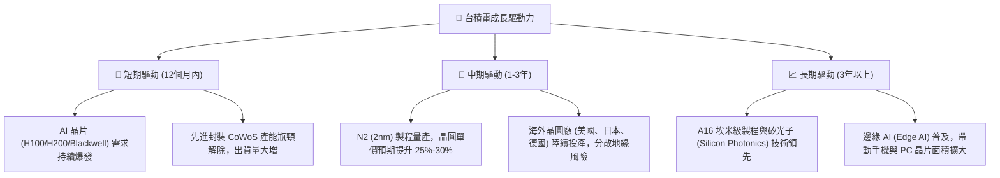

---

## 9. 風險矩陣

### 9.1 風險評分矩陣

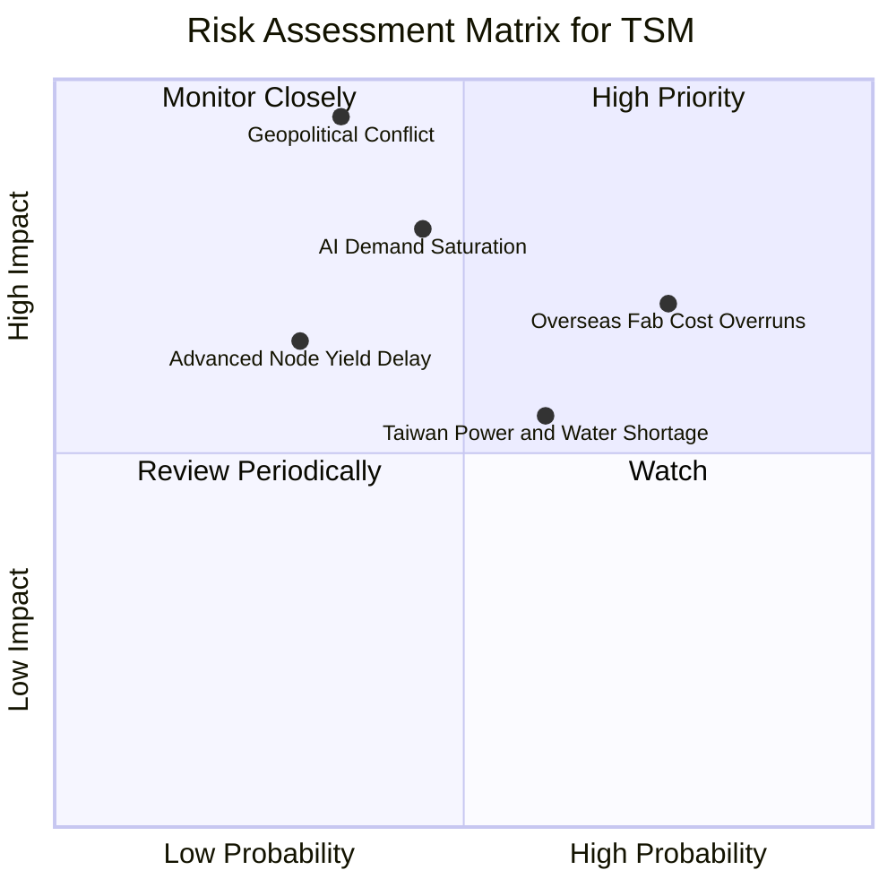

### 9.2 風險清單詳細分析

| # | 風險項目 | 發生機率 | 財務衝擊 | 風險評分 | 具體緩解措施 |
|---|----------|----------|----------|----------|--------------|
| 1 | 🔴 **地緣政治衝突 (台海局勢)** | 低 (35%) | 極高 (-90% 營收) | 🔴 **6.2 / 10** | 加速美國、日本（熊本一、二廠）、德國建廠，實現產能地理去中心化。 |
| 2 | 🟡 **海外建廠稀釋毛利率** | 高 (75%) | 中 (-3% 毛利率) | 🟡 **5.3 / 10** | 爭取美國 CHIPS Act 與歐洲補貼，並對海外客戶收取 10%-15% 的「地理溢價」。 |
| 3 | 🔴 **AI 需求階段性放緩** | 中 (45%) | 高 (-15% 營收) | 🔴 **5.4 / 10** | 靈活調整資本支出（CapEx），將部分先進製程產能轉回智慧型手機或車用平台。 |
| 4 | 🟡 **台灣水電供應不穩定** | 中 (60%) | 中 (-2% 產能) | 🟡 **4.5 / 10** | 自建再生水廠、簽署長期綠電採購協議（PPA），並配備大型備用發電系統。 |

---

## 10. 投資建議

### 10.1 最終綜合評級雷達圖

```
╔══════════════════════════════════════════════════════════════╗
║                    TSM 綜合投資價值評估                      ║
╠══════════════════════════════════════════════════════════════╣
║ 技術領先度  ██████████████████████████████  10.0/10          ║
║ 獲利品質    ████████████████████████████░░  9.5/10           ║
║ 財務健康度  ██████████████████████████░░░░  9.0/10           ║
║ 成長前景    ████████████████████████████░░  9.2/10           ║
║ 估值吸引力  ████████████████████████░░░░░░  8.0/10           ║
╠══════════════════════════════════════════════════════════════╣
║ 綜合推薦度  ████████████████████████████░░  9.2/10 ⭐⭐⭐⭐⭐ ║
╚══════════════════════════════════════════════════════════════╝
```

### 10.2 目標價與隱含報酬率

| 情境 | 出現機率 | 12M 目標價 | 隱含報酬率 | 機率加權目標價 |
|------|----------|------------|------------|----------------|
| 🔴 **悲觀** | 15% | $354.00 | -10.7% | $53.10 |
| 🟡 **基準** | **65%** | **$520.37** | **+31.3%** | **$338.24** |
| 🟢 **樂觀** | 20% | $700.00 | +76.6% | $140.00 |
| **綜合期望值**| **100%** | **$531.34** | **+34.1%** | **$531.34** |

### 10.3 買入時機與觸發因素

```
╔══════════════════════════════════════════════════════════════════╗
║                  ✅ TSM 投資觸發因素 Checklist                   ║
╠══════════════════════════════════════════════════════════════════╣
║                                                                  ║
║  立即買入觸發條件 (符合2項以上即可佈局)：                        ║
║  ✅ Forward P/E 跌破 20 倍 (當前為 18.66 倍，已符合)             ║
║  ✅ 每季營收年增率 (YoY) 持續大於 25% (當前為 36.05%，已符合)    ║
║  ✅ 先進製程 (N3/N5) 營收佔比大於 60% (已符合)                   ║
║                                                                  ║
║  加碼觸發條件：                                                  ║
║  ☐ 官方確認 N2 (2nm) 良率進度超前，並於 2026 年底提前放量        ║
║  ☐ CoWoS 產能擴充速度超預期，單季 FCF 轉換率回升至 >50%          ║
║                                                                  ║
║  減碼/停損觸發條件 (出現任一需重新評估)：                        ║
║  ☐ 單季毛利率跌破 52% 且連續兩季無法回升                         ║
║  ☐ 主要客戶 (如 Nvidia) 出現嚴重砍單，導致 N3 產能利用率跌破 75% ║
║                                                                  ║
╚══════════════════════════════════════════════════════════════════╝
```

### 10.4 投資人適配度分析

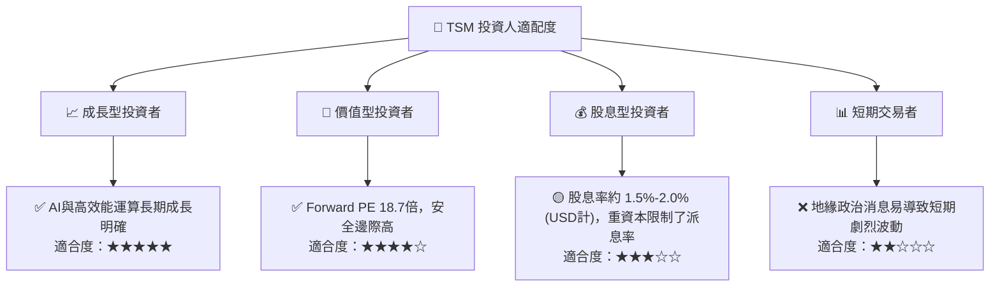

### 10.5 每季財報監控清單（Quarterly Watch List）

為了維持對台積電投資論點的持續追蹤，機構投資人應在每季財報公佈時重點審查以下指標：

| 監控指標 | 基準值 (當前) | 加碼門檻 (Bullish) | 減碼門檻 (Bearish) | 追蹤意義 |
|----------|---------------|-------------------|-------------------|----------|
| **整體毛利率** | 61.9% | > 63.0% (定價權增強) | < 53.0% (海外成本失控) | 評估盈利能力與海外建廠影響 |
| **HPC 營收佔比** | 46.0% | > 50.0% (AI 動能持續) | < 40.0% (AI 需求泡沫化) | 追蹤 AI 產業景氣度 |
| **資本支出 (CapEx)**| NT$1.28T (年) | > NT$1.50T (代表訂單極多) | < NT$900B (代表行業衰退) | 評估未來成長信心 |
| **存貨週轉天數** | 69天 | < 65天 (供不應求) | > 95天 (下游去庫存壓力) | 判斷半導體供需平衡狀態 |

### 10.6 反面論證：什麼會證明論點錯誤（What Would Change My Mind）

身為理性的 CFA 分析師，我們必須設定清晰的**多頭論點失效指標**。若以下任一條件在未來 12-18 個月內成立，我們將不得不下調 TSM 的評級至「持有」或「賣出」：

```
╔══════════════════════════════════════════════════════════════════╗
║              ⚠️ TSM 論點失效條件 (Disconfirming Evidence)        ║
╠══════════════════════════════════════════════════════════════════╣
║  本投資論點在下列情況成立時應重新檢視或退出：                    ║
║  ☐ 營業利益率 (Operating Margin) 連續兩季較峰值收縮 > 5.0 pp      ║
║  ☐ 自由現金流 (FCF) 轉負，且 FCF 轉換率 (FCF/NI) 連續三季 < 20%   ║
║  ☐ ROIC 跌破 15% (代表資本效率大幅下滑，失去超額價值創造能力)     ║
║  ☐ 競爭對手 (如三星/英特爾) 率先在 2nm 或 1.4nm 實現商業化良率領先║
║  ☐ 美國亞利桑那州晶圓廠因勞工或補貼問題，宣佈無限期延遲量產       ║
╚══════════════════════════════════════════════════════════════════╝
```

---

> **免責聲明**：本報告僅供研究參考，不構成任何投資建議。半導體產業具備高資本支出與週期性特徵，並受地緣政治高度影響，投資人應獨立評估風險，謹慎決策。