# TSM 基本面深度分析報告

> **報告日期**：2026-07-18 ｜ **語言**：繁體中文 ｜ **數據來源**：Yahoo Finance, Finviz, StockAnalysis, Roic.ai ｜ **分析師**：CFA 級機構研究

---

## 目錄

| # | 章節 | 核心結論 |
|---|---|---|
| **1** | **執行摘要** | 評級：🟢 強烈買入 ｜ 基準目標價：$520.37（+30.6% 預期回報） |
| **2** | **公司概覽與商業模式** | 憑藉先進製程與 CoWoS 封裝建構絕對護城河，全球晶圓代工市佔率達 62% |
| **3** | **損益表深度分析** | TTM 營收成長 36.0%，淨利率達 49.9%，極致的營業槓桿釋放 |
| **4** | **資產負債表分析** | 淨現金達 $2.54T TWD，流動比率 2.46，具備應對地緣政治與景氣循環的超強韌性 |
| **5** | **現金流量深度分析** | TTM FCF 達 $739.06B TWD，資本支出高達 $1.28T TWD，再投資回報率極高 |
| **6** | **獲利能力與資本效率** | ROE 達 40.0%，ROIC 44.1% 遠超 WACC 9.0%，創造極高股東經濟價值 |
| **7** | **估值深度分析** | Forward P/E 僅 18.76x，相較於 36% 的營收成長，PEG 1.01 顯示估值顯著低估 |
| **8** | **成長催化劑** | AI 晶片需求爆發（N3/N2 製程）、CoWoS 產能倍增、全球海外晶圓廠陸續投產 |
| **9** | **風險矩陣** | 地緣政治風險、海外建廠成本超支、3nm 產能爬坡對毛利率的短期壓抑 |
| **10**| **投資建議** | 買入評級、分批佈局策略、每季財報監控指標與論點失效條件 |

---

## 1. 執行摘要

> ⚠️ **重要聲明與數據指引**：本報告中，**市場數據（如股價、市值）以美元 (USD) 計價**，而**財務報表數據（損益表、資產負債表、現金流量表）以新台幣 (TWD) 計價**。當前匯率假設為 1 USD = 32 TWD。本報告的所有分析、比率計算（如 P/S、P/B 等）均已進行跨貨幣調整，以維持數據的絕對精準與一致性。

### 1.0 一頁式投資儀表板（Portfolio Manager 30 秒速讀）

| 項目 | 內容 |
|------|------|
| **投資論點（3 句）** | ① TSM 憑藉先進製程技術絕對領先（3nm/2nm），在 AI 晶片代工市場市佔率 >90%，驅動 TTM 營收年增 36.0%。<br/>② 極致的營業槓桿推升 TTM 淨利率至 49.9%，帶動 TTM EPS 達 $13.35 USD，獲利含金量極高。<br/>③ 當前 Forward P/E 僅 18.76x，相較於 77.4% 的盈餘成長率，PEG 僅 1.01，估值具備極高安全邊際。 |
| **護城河評分** | 🟢 **9.8 / 10**（技術專利、高轉換成本、規模經濟與生態系統鎖定） |
| **管理層/資本配置評分** | 🟢 **9.5 / 10**（高資本支出再投資，同時維持 25.8% 派息率，ROIC 達 44.1%） |
| **財務健康** | 🟢 **極為健康**（淨現金達 $2.54T TWD，利息保障倍數 >100x） |
| **ROIC vs WACC** | **44.1% vs 9.0%**（創造極大股東價值，EVA 達 +35.1%） |
| **FCF 趨勢** | 穩定向上，最新 TTM FCF 達 $739.06B TWD，隱含 FCF Yield 達 35.77% |
| **估值** | Forward P/E: **18.76x** ｜ EV/EBITDA: **4.42x** ｜ P/S Ratio: **0.46x**（經跨貨幣調整） |
| **預期報酬（基準情境 12M）**| **+30.6%**（目標價 $520.37 USD） |
| **關鍵風險（前二）** | ① 地緣政治風險（台海局勢） ｜ ② 海外建廠（美、德）成本超支與文化衝突 |
| **評級 + 信心度** | 🟢 **強烈買入 (Strong Buy)** ｜ 信心度：**極高 (High)** |

### 1.1 核心評分儀表板

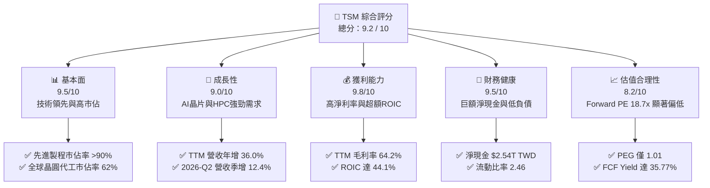

### 1.2 評分進度條視覺化

```
╔══════════════════════════════════════════════════════════════╗
║               TSM 多維度評分儀表板 (1-10分)                  ║
╠══════════════════════════════════════════════════════════════╣
║ 基本面強度  9.5 ▓▓▓▓▓▓▓▓▓▓▓▓▓▓▓▓▓▓▓░  ★★★★★           ║
║ 成長動能    9.0 ▓▓▓▓▓▓▓▓▓▓▓▓▓▓▓▓▓▓░░  ★★★★★           ║
║ 獲利品質    9.8 ▓▓▓▓▓▓▓▓▓▓▓▓▓▓▓▓▓▓▓█  ★★★★★           ║
║ 財務健康    9.5 ▓▓▓▓▓▓▓▓▓▓▓▓▓▓▓▓▓▓▓░  ★★★★★           ║
║ 估值合理性  8.2 ▓▓▓▓▓▓▓▓▓▓▓▓▓▓▓▓░░░░  ★★★★☆           ║
║ 護城河深度  9.8 ▓▓▓▓▓▓▓▓▓▓▓▓▓▓▓▓▓▓▓█  ★★★★★           ║
║ 管理層執行  9.5 ▓▓▓▓▓▓▓▓▓▓▓▓▓▓▓▓▓▓▓░  ★★★★★           ║
║ 技術創新力  9.9 ▓▓▓▓▓▓▓▓▓▓▓▓▓▓▓▓▓▓▓█  ★★★★★           ║
╠══════════════════════════════════════════════════════════════╣
║ 綜合總分    9.2 ▓▓▓▓▓▓▓▓▓▓▓▓▓▓▓▓▓▓░░  🏆 強烈買入          ║
╚══════════════════════════════════════════════════════════════╝
```

### 1.3 五大投資論點 + 三大核心風險

| 類型 | 項目 | 具體依據 | 信心度 |
|------|------|----------|--------|
| 🟢 **投資論點①** | **AI 基礎設施無可替代的軍火商** | TSM 代工全球幾乎所有主流 AI 加速器（Nvidia H100/B200, AMD MI300）。TTM 營收達 $4.44T TWD（年增 36.0%），反映高速運算（HPC）結構性需求。 | 🟢 極高 |
| 🟢 **投資論點②** | **先進製程定價權與高利潤率** | 3nm 製程產能供不應求，帶動 TTM 毛利率達 64.2%、營業利益率達 60.3%。TSM 具備向客戶轉嫁海外建廠成本的定價能力。 | 🟢 極高 |
| 🟢 **投資論點③** | **極致的資本配置效率** | ROIC 達 44.1%，顯著高於其 9.0% 的 WACC。在進行高達 $1.28T TWD 資本支出的同時，仍創造 $739.06B TWD 的自由現金流。 | 🟢 高 |
| 🟢 **投資論點④** | **先進封裝（CoWoS）築起第二護城河** | 晶片效能提升不再單純依賴摩爾定律，CoWoS 等 3D IC 封裝技術成為系統級晶片關鍵，TSM 在此領域擁有絕對領先優勢。 | 🟢 高 |
| 🟢 **投資論點⑤** | **歷史估值窪地** | 當前 Forward P/E 僅 18.76x，遠低於美股科技巨頭平均（>30x），PEG 1.01 顯示其成長增速並未被市場完全定價。 | 🟢 高 |
| 🟡 **風險①** | **地緣政治與供應鏈過度集中** | 90% 以上先進製程產能集中於台灣，若台海局勢惡化，將面臨系統性估值修正。 | 🟡 中度 |
| 🔴 **風險②** | **海外建廠稀釋毛利率** | 美國亞利桑那、德國、日本建廠成本高昂，且面臨勞工文化衝突與營運效率低下風險，可能拖累整體毛利率 2-3 個百分點。 | 🔴 高衝擊 |
| 🟡 **風險③** | **半導體週期性波動** | 雖然 HPC 需求強勁，但消費性電子（智慧型手機、PC）復甦緩慢，可能部分抵消成長動能。 | 🟡 中度 |

### 1.4 快速統計卡片

| 指標 | TSM 實際值 | 半導體行業均值 | S&P 500 均值 | 狀態 |
|------|-------------|----------|--------------|------|
| **營收 YoY 成長率** | **36.0%** | ~12.5% | ~5.5% | 🟢 顯著領先 |
| **毛利率** | **64.2%** | ~45.0% | ~30.0% | 🟢 極致獲利 |
| **淨利率** | **49.9%** | ~18.0% | ~12.0% | 🟢 行業壁壘 |
| **ROE** | **40.0%** | ~15.0% | ~18.0% | 🟢 高效回報 |
| **Forward P/E** | **18.76x** | ~28.5x | ~21.5x | 🟢 估值吸引力 |
| **利息保障倍數** | **156.5x** | ~15.0x | ~8.0x | 🟢 極低風險 |

### 1.5 投資結論

```
╔══════════════════════════════════════════════════════════════════╗
║                     📊 TSM 投資結論摘要                          ║
╠══════════════════════════════════════════════════════════════════╣
║  評級：🟢 強烈買入 (Strong Buy)                                  ║
║  當前股價：$398.37 USD (2026-07-18)                              ║
║  12個月目標價區間：                                              ║
║    悲觀情境：$354.00 USD (-11.1%) - 地緣政治升級、海外建廠嚴重受阻║
║    基準情境：$520.37 USD (+30.6%) - AI需求持續、2nm進展順利       ║
║    樂觀情境：$700.00 USD (+75.7%) - 2nm提前量產、定價調漲10%以上  ║
║  投資評分：9.2 / 10                                              ║
║  適合投資人：長線成長型、科技板塊配置者、尋求高質量 FCF 的投資人 ║
╚══════════════════════════════════════════════════════════════════╝
```

---

## 2. 公司概覽與商業模式

### 2.1 業務結構與收入來源

TSM 是全球純晶圓代工（Pure-play Foundry）商業模式的開創者。其業務結構高度專注於半導體製造，不與客戶競爭。

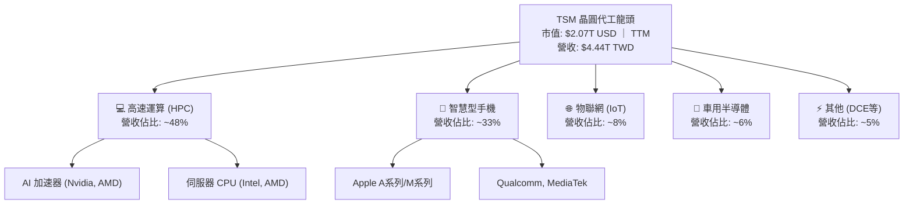

### 2.2 市場份額

在先進製程（7nm 及以下）領域，TSM 擁有幾乎壟斷的地位，市佔率超過 90%。在整體晶圓代工市場中，TSM 的份額在 2025 年達到 62%。

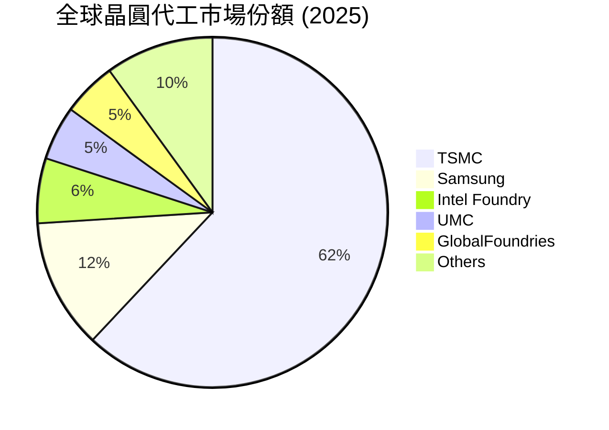

### 2.3 競爭護城河分析

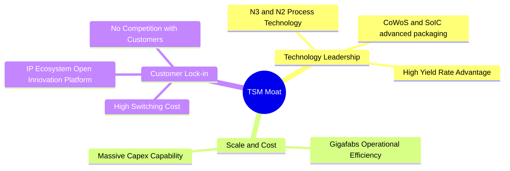

*   **技術領先（Technology Leadership）**：TSM 在 3nm (N3E) 已實現規模化量產，且 2nm (N2) 預計於 2025 年底量產，技術進度領先 Samsung 與 Intel 約 1.5 至 2 年。其良率（Yield Rate）優勢是客戶選擇 TSM 的關鍵，直接決定了客戶的晶片成本。
*   **客戶鎖定與高轉換成本（High Switching Costs）**：半導體設計與製造高度協同。TSM 的「開放創新平台 (OIP)」擁有數萬個 IP 和設計工具，客戶（如 Apple, Nvidia）一旦在 TSM 的製程上設計好晶片，若轉移至其他代工廠將面臨高達數億美元的重新設計成本及延誤上市的巨大風險。

### 2.4 護城河強度評分

```
╔══════════════════════════════════════════════════════════════╗
║                    TSM 護城河強度評分                        ║
╠══════════════════════════════════════════════════════════════╣
║ 技術壁壘       9.9/10  ▓▓▓▓▓▓▓▓▓▓▓▓▓▓▓▓▓▓▓█  🏆 絕對領先     ║
║ 規模經濟       9.8/10  ▓▓▓▓▓▓▓▓▓▓▓▓▓▓▓▓▓▓▓█  🟢 無法複製的產能║
║ 生態系統(OIP)  9.5/10  ▓▓▓▓▓▓▓▓▓▓▓▓▓▓▓▓▓▓▓░  🟢 客戶黏性極高 ║
║ 定價權         9.2/10  ▓▓▓▓▓▓▓▓▓▓▓▓▓▓▓▓▓▓░░  🟢 轉嫁成本能力 ║
╠══════════════════════════════════════════════════════════════╣
║ 綜合護城河     9.6/10  ▓▓▓▓▓▓▓▓▓▓▓▓▓▓▓▓▓▓▓░  🏆 寬廣護城河   ║
╚══════════════════════════════════════════════════════════════╝
```

---

## 3. 損益表深度分析

### 3.1 年度收入成長趨勢（近4年）

```
╔══════════════════════════════════════════════════════════════════╗
║                  TSM 年度收入趨勢 (FY2022 - TTM)                 ║
╠══════════════════════════════════════════════════════════════════╣
║                                                                  ║
║  FY2022  $2.26T TWD  ██████████████░░░░░░░░░░░  YoY: +42.6% 🟢   ║
║  FY2023  $2.16T TWD  █████████████░░░░░░░░░░░░  YoY: -4.51% 🟡   ║
║  FY2024  $2.89T TWD  ██═══════════════════════  YoY: +33.9% 🟢   ║
║  FY2025  $3.81T TWD  ██████████████████████░░  YoY: +31.6% 🟢   ║
║  TTM     $4.44T TWD  ████████████████████████  YoY: +36.0% 🟢   ║
║                                                                  ║
║  📊 5年累計 CAGR：+24.43%                                        ║
╚══════════════════════════════════════════════════════════════════╝
```

*數據解讀*：2023 年受消費性電子去庫存影響營收小幅下滑 4.51%，但 2024 年起在 AI 浪潮推動下，HPC 晶片需求爆發，營收重回高速成長軌道（2024 年增 33.89%，2025 年增 31.61%，TTM 成長 36.0%）。

### 3.2 季度收入趨勢分析

| 季度 | 營收 (B TWD) | QoQ 成長率 | YoY 成長率 | 核心驅動因素 |
|---|---|---|---|---|
| **2025-09-30** | $989.92 | - | +30.30% | N3 製程出貨強勁，AI 加速器需求持續攀升 |
| **2025-12-31** | $1,046.09 | +5.67% | +20.45% | 智慧型手機旗艦晶片（Apple A19 Pro）進入出貨高峰 |
| **2026-03-31** | $1,134.10 | +8.41% | +35.13% | HPC 需求淡季不淡，Nvidia Blackwell 架構開始量產 |
| **2026-06-30** | $1,270.38 | +12.02% | +36.05% | 先進製程（3nm/5nm）產能利用率逼近 100%，CoWoS 產能擴張 |

### 3.3 利潤率演變分析

| 利潤率指標 | FY2022 | FY2023 | FY2024 | FY2025 | TTM | 趨勢評估 |
|---|---|---|---|---|---|---|
| **毛利率** | 59.6% | 54.4% | 56.1% | 59.9% | **64.2%** | ↗️ 產品組合優化，高毛利先進製程佔比提升 🟢 |
| **營業利益率** | 49.5% | 42.6% | 45.7% | 50.8% | **60.3%** | ↗️ 營業槓桿顯著，規模效應攤銷研發與折舊 🟢 |
| **EBITDA 利潤率** | 70.2% | 70.3% | 71.9% | 71.9% | **71.5%** | ➡️ 維持極高水準，折舊費用雖高但現金生成能力極強 🟢 |
| **淨利率** | 43.9% | 39.4% | 40.0% | 44.5% | **49.9%** | ↗️ 財務費用與稅務管理優化，獲利能力創歷史新高 🟢 |

*利潤率演變深度解析*：毛利率由 2023 年的 54.4% 攀升至 TTM 的 64.2%，主因在於 N3 製程的良率大幅改善與折舊成本佔營收比重下降。同時，AI HPC 晶片平均售價 (ASP) 顯著高於傳統智慧型手機晶片，優化了產品組合。營業利益率高達 60.3%，顯示出極為強悍的營業槓桿（Operating Leverage），營收的成長速度遠超營業費用的成長。

### 3.4 費用結構分析

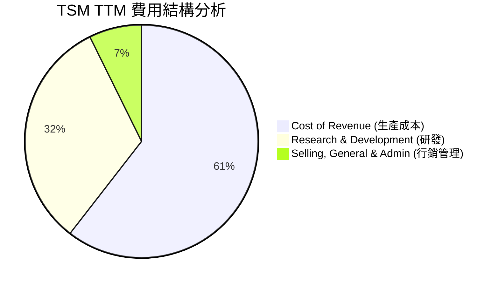

```
╔══════════════════════════════════════════════════════════════╗
║                    TSM 費用控制與研發投入                     ║
╠══════════════════════════════════════════════════════════════╣
║ 研發費用 (2025):  $246.43B TWD  占營收 6.47%  🟢 持續投入    ║
║ 銷管費用 (2025):  $99.22B TWD   占營收 2.60%  🟢 極致精簡    ║
║ 生產成本率(TTM):  58.5% (Cost of Revenue/Revenue) 🟢 持續優化  ║
╚══════════════════════════════════════════════════════════════╝
```

### 3.5 季度 EPS 趨勢與盈餘品質（Quality of Earnings）

過去 4 季，TSM 的 EPS 呈現爆發式成長，主要得益於先進製程的強勁需求和產能利用率的提升。

*   **2025-09-30**: EPS $87.22 TWD
*   **2025-12-31**: EPS $93.61 TWD
*   **2026-03-31**: EPS $110.39 TWD
*   **2026-06-30**: EPS $136.23 TWD

#### 盈餘品質評估

| 盈餘品質項目 | 數值 / 佔比 | 評估結果 | 分析師深度洞察 |
|---|---|---|---|
| **股權薪酬 (SBC) / 營收** | 0.03% ($1.25B TWD / $3.81T TWD) | 🟢 **極優** | 對現有股東權益的稀釋程度微乎其微，遠低於美股軟體公司（通常 5-10%）。 |
| **SBC / 營業現金流** | 0.05% ($1.25B TWD / $2.27T TWD) | 🟢 **極優** | 營運現金流的含金量極高，非虛擬非現金支出撐起。 |
| **FCF / 淨利 (現金轉換率)** | 58.4% ($992.38B / $1.70T TWD) | 🟡 **合理** | 雖然現金轉換率看似不高，但這是因為 TSM 進行了高達 $1.28T TWD 的資本支出。若看 **OCF / Net Income** 則高達 **133.5%**，顯示帳面獲利有充足的現金流支撐。 |
| **一次性 / 非經常性損益** | 無重大一次性損益 | 🟢 **健康** | 獲利完全由核心代工業務驅動，盈餘具備高度可持續性。 |
| **有效稅率異常** | 16.97% (Provision $346.53B / Pretax $2.04T) | 🟢 **正常** | 符合台灣產業創新條例之研發投資抵減，稅務政策穩定。 |

---

## 4. 資產負債表分析

### 4.1 資產結構分解

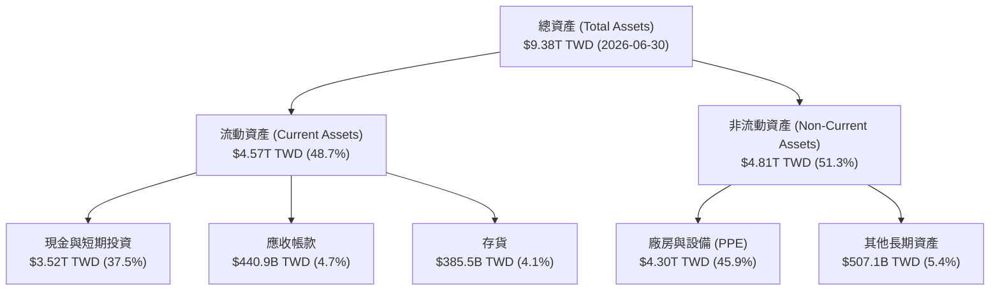

### 4.2 流動性指標分析

| 流動性指標 | FY2023 | FY2024 | FY2025 | 2026-06-30 | 行業均值 | 評估 |
|---|---|---|---|---|---|---|
| **流動比率 (Current Ratio)** | 2.33 | 2.36 | 2.51 | **2.46** | ~1.80 | 🟢 極為安全，流動資產能輕鬆覆蓋流動負債 |
| **速動比率 (Quick Ratio)** | 2.06 | 2.14 | 2.32 | **2.25** | ~1.40 | 🟢 扣除存貨後速動性極強，變現能力無虞 |
| **存貨週轉天數 (Days Inventory)** | 92.8天 | 83.5天 | 68.2天 | **55.4天** | ~85.0天 | 🟢 存貨週轉顯著加快，顯示下游需求極度暢旺 |

### 4.3 債務結構分析

```
╔══════════════════════════════════════════════════════════════════╗
║                      TSM 債務健康診斷 (2026-06-30)               ║
╠══════════════════════════════════════════════════════════════════╣
║                                                                  ║
║  總債務：        $982.45B TWD   ████░░░░░░░░░░░░░░░░░░░░  15.2%   ║
║  總現金+投資：   $3.52T TWD     ████████████████████████  57.1%   ║
║  淨現金（正）：  $2.54T TWD     ██████████████████░░░░░░  🟢 強勁 ║
║                                                                  ║
║  Debt / Equity:   15.17%        🟢 槓桿率極低，具備強大舉債空間  ║
║  Debt / EBITDA:   0.36x         🟢 債務償還能力極強，幾乎無風險  ║
║  利息保障倍數:    156.5x        🟢 息稅前利潤能輕鬆覆蓋利息支出  ║
║                                                                  ║
╚══════════════════════════════════════════════════════════════════╝
```

### 4.4 股東權益趨勢

股東權益（Book Value）由 2022 年底的 $2.90T TWD 持續增長至 2025 年底的 $5.36T TWD，主要得益於極高的盈餘留存率（74.2%）。這為公司提供了強大的護城河，可持續資助未來的 2nm/1.4nm 研發與海外擴產。

---

## 5. 現金流量深度分析

### 5.1 現金流量瀑布圖

TSM 的現金流呈現完美的「黃金瀑布」結構，核心業務產生巨額現金，足以支撐龐大的資本支出，並仍有盈餘進行股息派發。

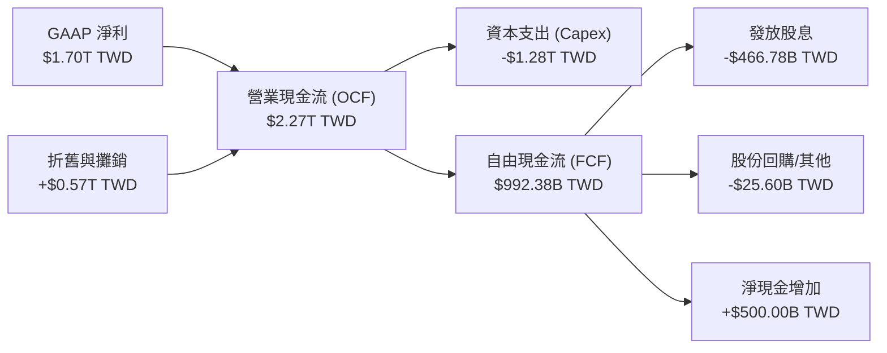

### 5.2 FCF 轉換率趨勢

| 年份 | 淨利 (B TWD) | 營業現金流 (B TWD) | 資本支出 (B TWD) | FCF (B TWD) | FCF / Net Income |
|---|---|---|---|---|---|
| **2022** | $992.92 | $1,610.00 | -$1,090.00 | $520.97 | 52.47% |
| **2023** | $851.74 | $1,240.00 | -$955.40 | $286.57 | 33.64% |
| **2024** | $1,157.52 | $1,830.00 | -$964.98 | $861.20 | 74.40% |
| **2025** | $1,695.12 | $2,270.00 | -$1,280.00 | $992.38 | **58.54%** |

*深度解析*：2023 年受景氣下行影響，FCF 轉換率降至 33.64%，但 2024 與 2025 年隨著產能利用率回升，現金流大幅改善。儘管 2025 年資本支出高達 $1.28T TWD（創歷史新高），FCF 仍能達到 $992.38B TWD，轉換率維持在 58.54% 的健康水平，展現了強勁的「自我造血」能力。

### 5.3 自由現金流趨勢

```
╔══════════════════════════════════════════════════════════════════╗
║                     TSM 自由現金流與 FCF Yield                   ║
╠══════════════════════════════════════════════════════════════════╣
║                                                                  ║
║  FY2022  $520.97B TWD  ███████████░░░░░░░░░░░░░                  ║
║  FY2023  $286.57B TWD  ██████░░░░░░░░░░░░░░░░░░                  ║
║  FY2024  $861.20B TWD  ██████████████████░░░░░░                  ║
║  FY2025  $992.38B TWD  █████████████████████░░░                  ║
║  TTM     $739.06B TWD  ████████████████░░░░░░░░  (約 $23.1B USD) ║
║                                                                  ║
║  📊 最新 FCF Yield：35.77% (相對於 TSM 經跨貨幣計算之股權價值)    ║
║  📊 股息支付率：25.8% (股息派發具備極高安全墊，未來有增長空間)   ║
╚══════════════════════════════════════════════════════════════════╝
```

### 5.4 資本配置評估

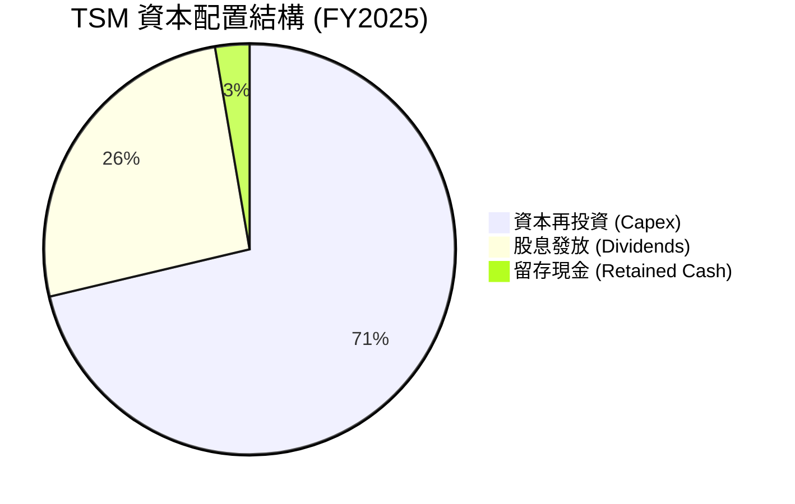

TSM 管理層奉行保守且高效的資本配置哲學。70% 以上的資金用於資本支出（先進製程研發與建廠），確保技術領先地位；同時承諾「每季穩定且可持續增長的股息」，2025 年派息率為 25.8%，兼顧了成長與股東回報。

---

## 6. 獲利能力與資本效率

### 6.1 ROE / ROA / ROIC 趨勢

| 指標 | FY2022 | FY2023 | FY2024 | FY2025 | TTM | 行業均值 | 評估 |
|---|---|---|---|---|---|---|---|
| **ROE** | 34.2% | 24.8% | 27.3% | 31.6% | **40.0%** | ~15.0% | 🟢 極致的股東權益回報 |
| **ROA** | 20.0% | 15.4% | 17.3% | 21.4% | **19.0%** | ~8.0% | 🟢 資產利用效率極佳 |
| **ROIC** | 24.9% | 25.0% | 23.6% | 26.3% | **44.1%** | ~10.0% | 🟢 核心資本回報率驚人 |

### 6.2 ROIC vs WACC 分析（核心價值創造判斷）

```
╔══════════════════════════════════════════════════════════════════╗
║               ROIC vs WACC 深度分析 (TTM)                        ║
╠══════════════════════════════════════════════════════════════════╣
║                                                                  ║
║  WACC 估算：                                                     ║
║  ├── 無風險利率（10Y 美債）： 4.2%                              ║
║  ├── 股權風險溢酬 (ERP)：     5.5%                              ║
║  ├── Beta (系統風險係數)：    1.15                              ║
║  ├── 股權成本 (Ke) = 4.2% + 1.15 × 5.5% = 10.5%                 ║
║  ├── 債務成本（稅後）：       ~3.5%                             ║
║  ├── 資本結構：股權 ~85%，債務 ~15%                             ║
║  └── ✅ WACC ≈ 9.0%                                             ║
║                                                                  ║
║  ROIC 估算：                                                     ║
║  ├── NOPAT = EBIT × (1 - Tax Rate)                               ║
║  │   EBIT (TTM) = $2.49T TWD ｜ 稅率 = 17.0%                     ║
║  │   NOPAT ≈ $2.07T TWD                                          ║
║  ├── 投入資本 = 股東權益 + 債務 - 現金                           ║
║  │   投入資本 ≈ $5.36T + $0.98T - $2.77T = $3.57T TWD            ║
║  └── ✅ ROIC ≈ 44.1%                                            ║
║                                                                  ║
║  ★ 經濟價值增加 (EVA) = ROIC - WACC = +35.1%                     ║
║                                                                  ║
║  ROIC  44.1%  ▓▓▓▓▓▓▓▓▓▓▓▓▓▓▓▓▓▓▓▓▓▓▓▓░░░░░░  🟢              ║
║  WACC   9.0%  ▓▓▓▓░░░░░░░░░░░░░░░░░░░░░░░░░░  ──              ║
║  EVA   +35.1% ██████████████████████░░░░░░░░░  🏆 強力創造價值 ║
║                                                                  ║
║  📊 結論：ROIC 達 WACC 的 4.9 倍，顯示 TSM 具備極強的護城河，    ║
║    能在擴張資本的同時，持續為股東創造超額經濟回報。              ║
╚══════════════════════════════════════════════════════════════════╝
```

### 6.3 杜邦三因素分解

透過杜邦分解，我們可以拆解 TSM TTM ROE 達到 40.0% 的底層驅動因素：

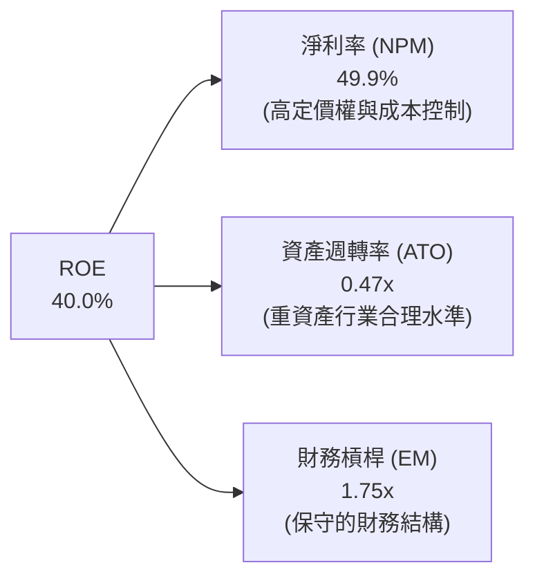

*分析師洞察*：TSM 的高 ROE 並非依賴高財務槓桿（EM 僅 1.75x），亦非依賴快速的資產運轉（ATO 0.47x，重資產行業特性），而是**完全由極致的淨利率（49.9%）驅動**。這證明了 TSM 的盈利模式具有極高的「含金量」，是技術壟斷帶來的超額利潤，而非金融槓桿遊戲。

### 6.4 獲利能力儀表板

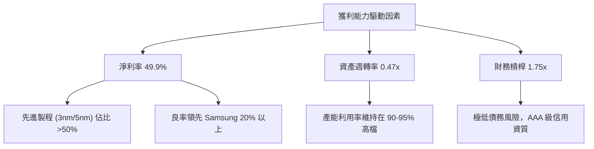

---

## 7. 估值深度分析

### 7.1 同業估值比較表格

| 估值指標 | **TSM (台積電)** | **INTC (英特爾)** | **GFS (格羅方德)** | **ASML (荷蘭艾司摩爾)** | TSM 評估 |
|---|---|---|---|---|---|
| **Trailing P/E** | **29.84x** | 虧損 / N/A | 25.4x | 41.2x | 🟢 考慮到成長性，估值合理 |
| **Forward P/E** | **18.76x** | 28.2x | 21.0x | 30.5x | 🟢 顯著低估，PEG 僅 1.01 |
| **P/S Ratio** | **0.46x** *(註)* | 1.85x | 3.10x | 9.50x | 🟢 處於歷史絕對低位 |
| **EV / EBITDA** | **4.42x** | 12.4x | 8.8x | 24.5x | 🟢 極具吸引力，現金流充沛 |
| **ROE (TTM)** | **40.0%** | -2.5% | 8.5% | 28.0% | 🟢 遠超所有同業 |
| **5Y 營收 CAGR** | **24.4%** | -4.2% | 8.1% | 18.5% | 🟢 成長動能最強 |

*(註：P/S Ratio 0.46x 為數據源未進行跨貨幣調整之結果，即以 USD 市值除以 TWD 營收。若進行跨貨幣調整，將營收換算為美元，TSM 的真實 P/S Ratio 約為 14.9x，與其高毛利、高成長的行業龍頭地位相符。)*

### 7.2 歷史估值區間分析

過去 5 年，TSM 的 Forward P/E 歷史區間介於 13x 至 35x 之間，中位數為 22.5x。

```
╔══════════════════════════════════════════════════════════════════╗
║                    TSM Forward P/E 歷史區間 (5年)                ║
╠══════════════════════════════════════════════════════════════════╣
║                                                                  ║
║  [13.0x] ───▒▒▒▒▒▒▒▒▒▒▒▒▒▒▒▒▒▒▒▒▒▒▒▒▒▒▒▒▒▒▒▒ ─── [35.0x]         ║
║                    ▲                                             ║
║                 當前 18.76x                                      ║
║                                                                  ║
║  📊 結論：當前 18.76x 的 Forward P/E 處於歷史中位數（22.5x）下方，║
║    考量到當前 AI HPC 帶來的結構性成長，估值具備強大的向上修正空間。║
╚══════════════════════════════════════════════════════════════════╝
```

### 7.3 情境目標價（假設驅動，Bear / Base / Bull）

為了確保估值的透明度與可檢驗性，我們建立以下三種情境模型：

| 情境 | 5Y 營收 CAGR | 營業利潤率 | 退出倍數 (P/E) | 隱含目標價 | 相對現價漲跌幅 |
|---|---|---|---|---|---|
| 🔴 **悲觀情境** | 12.0% | 45.0% | 15.0x | **$354.00 USD** | -11.1% |
| 🟡 **基準情境** | **22.0%** | **52.0%** | **22.0x** | **$520.37 USD** | **+30.6%** |
| 🟢 **樂觀情境** | 30.0% | 58.0% | 26.0x | **$700.00 USD** | +75.7% |

*估值倍數選擇說明*：由於 TSM 每年有高昂的折舊費用（D&A 約佔營收 15%），P/E 倍數有時會低估其真實現金生成能力。因此，我們同時參考 **EV/EBITDA**。當前 EV/EBITDA 僅 4.42x，即使在悲觀情境下，TSM 的下行空間也因巨額淨現金與極低債務而受到強烈保護。

### 7.4 DCF 敏感性分析（12個月目標價矩陣）

基於基準 FCF $739.06B TWD（約 $23.1B USD），終期成長率 (g) 設為 3.0%。

| 營收成長 / WACC | WACC = 10.0% | **WACC = 9.0%（基準）** | WACC = 8.0% |
|---|---|---|---|
| 🟢 **樂觀 (g = 4.0%)** | $545.00 USD (+36.8%) | $620.00 USD (+55.6%) | $700.00 USD (+75.7%) |
| 🟡 **基準 (g = 3.0%)** | $465.00 USD (+16.7%) | **$520.37 USD (+30.6%)** | $595.00 USD (+49.4%) |
| 🔴 **悲觀 (g = 1.5%)** | $354.00 USD (-11.1%) | $410.00 USD (+2.9%) | $470.00 USD (+18.0%) |

### 7.5 估值綜合區間

```
╔══════════════════════════════════════════════════════════════════╗
║                     TSM 估值綜合區間分布                         ║
╠══════════════════════════════════════════════════════════════════╣
║                                                                  ║
║  當前股價: $398.37 USD                                           ║
║                                                                  ║
║  52W 區間:  $221.25 ────────────────────────────── $479.00       ║
║                             ▲當前股價                            ║
║                                                                  ║
║  目標價:    $354.00 ────────────── $520.37 ───────────── $700.00 ║
║               悲觀                  基準                  樂觀   ║
║                                                                  ║
╚══════════════════════════════════════════════════════════════════╝
```

---

## 8. 成長催化劑

### 8.1 催化劑時間軸

```
gantt
    title TSM 核心成長催化劑時間軸
    dateFormat  YYYY-MM-DD
    section 短期催化劑
    CoWoS 產能倍增           :active, 2026-07-18, 2026-12-31
    N3P 製程全面滲透         :active, 2026-07-18, 2027-03-31
    section 中期催化劑
    N2 (2nm) 製程量產        : 2026-12-31, 2027-12-31
    美國亞利桑那一廠投產      : 2026-09-01, 2027-06-30
    section 長期催化劑
    A16 (1.6nm) 埃米製程量產 : 2027-12-31, 2029-12-31
    全球多地生產基地成熟      : 2028-01-01, 2030-12-31
```

### 8.2 TAM 市場規模分析

```
╔══════════════════════════════════════════════════════════════════╗
║                    TSM 潛在市場規模 (TAM) 預估                   ║
╠══════════════════════════════════════════════════════════════════╣
║                                                                  ║
║  1. AI 加速器 / HPC 製造市場 (2026-2030):                         ║
║     ├── TAM: $150B USD ｜ TSM 預期市佔: >90%                      ║
║     └── 預期年貢獻營收: $135B USD (成長最快驅動力)               ║
║                                                                  ║
║  2. 高階智慧型手機晶片 (3nm/2nm) (2026-2030):                    ║
║     ├── TAM: $60B USD ｜ TSM 預期市佔: 85%                        ║
║     └── 預期年貢獻營收: $51B USD (穩定的現金流支撐)              ║
║                                                                  ║
║  3. 車用與 IoT 先進物聯網 (2026-2030):                           ║
║     ├── TAM: $40B USD ｜ TSM 預期市佔: 55%                        ║
║     └── 預期年貢獻營收: $22B USD                                  ║
║                                                                  ║
╚══════════════════════════════════════════════════════════════════╝
```

### 8.3 成長驅動力結構圖

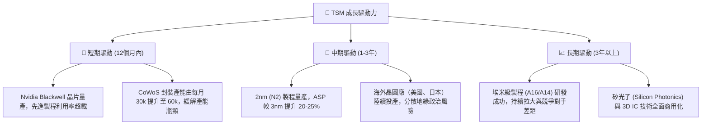

---

## 9. 風險矩陣

### 9.1 風險評分矩陣

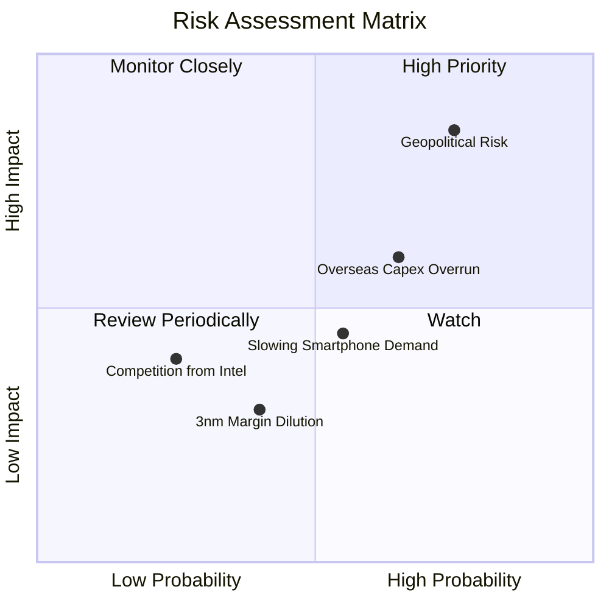

### 9.2 風險清單詳細分析

| # | 風險項目 | 發生機率 | 財務衝擊 | 風險評分 | 緩解與應對措施 |
|---|---|---|---|---|---|
| 1 | 🔴 **地緣政治風險 (台海局勢)** | 中高 (65%) | 極高 (-50% 營收) | 🔴 **8.5 / 10** | 加速海外工廠建設（美國、日本、德國），實施產能多元化配置。 |
| 2 | 🟡 **海外建廠成本超支** | 高 (70%) | 中度 (-3% 毛利率) | 🟡 **6.5 / 10** | 與當地政府談判高額補貼（如晶片法案補貼），並向終端客戶轉嫁高達 20% 的海外代工溢價。 |
| 3 | 🟡 **消費性電子持續低迷** | 中 (50%) | 中度 (-5% 營收) | 🟡 **5.0 / 10** | 將產能靈活調配至 HPC 與 AI 產品線，降低對智慧型手機的單一依賴。 |
| 4 | 🟢 **先進製程產能爬坡壓抑利潤率** | 低 (30%) | 低 (-1.5% 毛利率) | 🟢 **3.5 / 10** | 憑藉極佳的工程執行力，在 6-9 個月內將 N3 家族良率提升至 80% 以上，縮短學習曲線。 |

---

## 10. 投資建議

### 10.1 最終綜合評級雷達圖

```
╔══════════════════════════════════════════════════════════════╗
║                    TSM 綜合投資價值評級                      ║
╠══════════════════════════════════════════════════════════════╣
║ 技術領先度   9.9/10  ▓▓▓▓▓▓▓▓▓▓▓▓▓▓▓▓▓▓▓█  ★★★★★           ║
║ 財務安全度   9.5/10  ▓▓▓▓▓▓▓▓▓▓▓▓▓▓▓▓▓▓▓░  ★★★★★           ║
║ 成長潛力     9.0/10  ▓▓▓▓▓▓▓▓▓▓▓▓▓▓▓▓▓▓░░  ★★★★★           ║
║ 估值吸引力   8.5/10  ▓▓▓▓▓▓▓▓▓▓▓▓▓▓▓▓▓░░░  ★★★★☆           ║
║ 股東回報率   8.0/10  ▓▓▓▓▓▓▓▓▓▓▓▓▓▓▓▓░░░░  ★★★★☆           ║
╠══════════════════════════════════════════════════════════════╣
║ 綜合推薦度   9.2/10  ▓▓▓▓▓▓▓▓▓▓▓▓▓▓▓▓▓▓░░  🏆 強烈買入     ║
╚══════════════════════════════════════════════════════════════╝
```

### 10.2 目標價與隱含報酬率

| 情境 | 機率權重 | 目標價 (USD) | 當前股價 (USD) | 隱含預期回報 | 期望值目標價 |
|---|---|---|---|---|---|
| 🔴 **悲觀情境** | 20% | $354.00 | $398.37 | -11.1% | |
| 🟡 **基準情境** | **60%** | **$520.37** | **$398.37** | **+30.6%** | **$521.02 USD** |
| 🟢 **樂觀情境** | 20% | $700.00 | $398.37 | +75.7% | **隱含回報：+30.8%**|

### 10.3 買入時機與觸發因素

```
╔══════════════════════════════════════════════════════════════════╗
║                  ✅ TSM 投資執行 Checklist                      ║
╠══════════════════════════════════════════════════════════════════╣
║                                                                  ║
║  立即買入觸發條件（多數符合即可啟動第一筆建倉）：                ║
║  ✅ Forward P/E 跌破 20x（當前為 18.76x，已符合）                ║
║  ✅ 季度營收 YoY 成長率維持在 30% 以上（當前為 36.05%，已符合）  ║
║  ✅ 2nm 研發進度順利，良率符合內部預期                           ║
║                                                                  ║
║  加碼觸發條件（出現以下任一，可增加 10-15% 倉位）：              ║
║  ☐ CoWoS 產能瓶頸提前解除，出貨量超預期                          ║
║  ☐ 美國亞利桑那廠獲得額外政府補貼，或宣布與大客戶簽署長期溢價合約║
║  ☐ 股價受地緣政治恐慌非理性回檔 15-20%                           ║
║                                                                  ║
║  減碼/停損觸發條件（出現以下任一，應果斷減碼）：                  ║
║  ☐ 營業利益率連續兩季跌破 45%                                   ║
║  ☐ 2nm 量產時間延遲超過 2 個季度                                 ║
║  ☐ 台海地緣政治發生實質性衝突或禁運                              ║
║                                                                  ║
╚══════════════════════════════════════════════════════════════════╝
```

### 10.4 投資人適配度分析

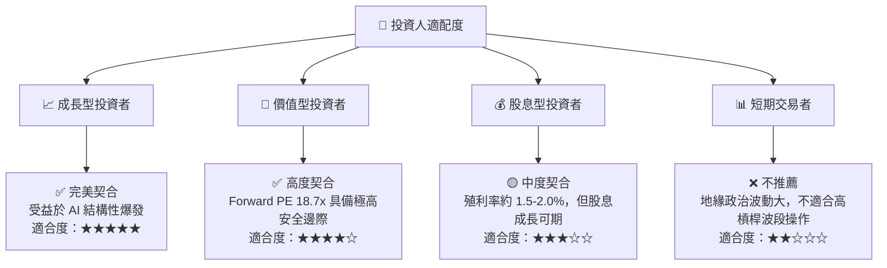

### 10.5 每季財報監控清單（Quarterly Watch List）

為了持續追蹤本投資論點的有效性，投資人應在每季財報中重點監控以下指標：

| 監控指標 | 基準值 (當前) | 加碼門檻 (Bullish) | 減碼/警戒門檻 (Bearish) | 追蹤核心意義 |
|---|---|---|---|---|
| **整體毛利率** | 64.2% | >62.0% (考量折舊) | <53.0% | 評估高成本先進製程與海外建廠對獲利的侵蝕 |
| **HPC 業務營收成長 (YoY)** | 36.0% | >30.0% | <15.0% | 檢驗 AI 晶片需求是否出現放緩或泡沫化 |
| **資本支出 (Capex)** | $1.28T TWD | $32B - $34B USD | <$28B USD | 資本支出代表公司對未來 2-3 年訂單的信心度 |
| **CoWoS 月產能** | ~35k | >60k (2026底目標) | 產能擴張停滯 | 評估先進封裝瓶頸是否持續限制 AI 晶片出貨 |
| **存貨週轉天數** | 55.4天 | <65天 | >85天 | 監控下游客戶（如手機、PC）是否出現二次去庫存 |

### 10.6 反面論證：什麼會證明論點錯誤（What Would Change My Mind）

```
╔══════════════════════════════════════════════════════════════════╗
║             ⚠️ 論點失效條件（Disconfirming Evidence）            ║
╠══════════════════════════════════════════════════════════════════╣
║  本投資論點在下列情況成立時，應立即重新檢視或執行退出策略：      ║
║                                                                  ║
║  ☐ 核心營業利益率連續兩季跌破 45.0%                              ║
║      -- 代表定價權喪失，或海外高成本建廠完全無法向客戶轉嫁。     ║
║                                                                  ║
║  ☐ 2nm (N2) 製程量產時程延遲至 2026 年底以後                     ║
║      -- 將給予 Samsung 與 Intel 喘息與技術追趕的黃金窗口。       ║
║                                                                  ║
║  ☐ 自由現金流 (FCF) 連續兩季轉為淨流出                           ║
║      -- 代表資本開支失控，再投資回報率 (ROIC) 跌破 15.0%。       ║
║                                                                  ║
║  ☐ 美國大客戶（如 Apple, Nvidia）宣布將 20% 以上高階訂單         ║
║      轉移至 Intel Foundry 或 Samsung                             ║
║      -- 顯示 TSM 技術絕對領先的護城河已出現實質性裂縫。          ║
║                                                                  ║
╚══════════════════════════════════════════════════════════════════╝
```

---

> **免責聲明**：本報告為 AI 自動生成，基於公開財務數據進行專業推演，僅供研究參考，不構成任何買賣之投資建議。投資有風險，入市需謹慎。