# TSM 基本面深度分析報告

> **報告日期**：2026-07-21 ｜ **語言**：繁體中文 ｜ **數據來源**：Yahoo Finance, Finviz, StockAnalysis, Roic.ai ｜ **分析師**：CFA 級機構研究

---

## 目錄

| # | 章節 | 核心結論 |
|---|------|----------|
| 1 | 執行摘要 | TSM 憑藉先進製程技術優勢與 AI 晶片需求爆發，給予「🟢 強烈買入」評級，基準目標價 $522.82 |
| 2 | 公司概覽與商業模式 | 探討純晶圓代工（Pure-play Foundry）商業模式、全球 >60% 的市佔率，以及由先進製程與 CoWoS 封裝構成的寬廣護城河 |
| 3 | 損益表深度分析 | 解析 TTM 營收達 4.44 兆新台幣、YoY 成長 36.0% 的驅動因素，並評估高達 49.9% 淨利率的盈餘品質與極低 SBC 稀釋 |
| 4 | 資產負債表分析 | 分析 3.52 兆新台幣現金儲備與僅 15.17% 的低債權權益比，論證其極佳的流動性與抗風險能力 |
| 5 | 現金流量深度分析 | 剖析 TTM 2.63 兆新台幣營運現金流與 7,390 億新台幣自由現金流（FCF），評估其高資本支出下的資本配置效率 |
| 6 | 獲利能力與資本效率 | 透過 40.0% ROE 與 32.7% ROIC 進行杜邦分解，證實公司創造了遠高於 9.41% WACC 的經濟加值（EVA） |
| 7 | 估值深度分析 | 點名 Intel、Samsung 進行同業對比，並基於 19.94 倍 Forward P/E 提供三種情境目標價與 DCF 敏感性分析 |
| 8 | 成長催化劑 | 展望 N3P/N2 製程量產時程與 AI 高效能運算（HPC）帶來的 TAM 結構性擴張 |
| 9 | 風險矩陣 | 評估地緣政治、資本支出利用率與客戶結構過於集中等關鍵風險，並提出量化衝擊與緩解措施 |
| 10 | 投資建議 | 提供多維度評分、買入與減碼觸發條件、投資人適配度及每季財報監控清單（Watch List） |

---

## 1. 執行摘要

台積電（TSM）作為全球半導體製造的絕對龍頭，在先進製程（3nm 及以下）和先進封裝（CoWoS）領域處於實質性壟斷地位。基於 TTM 營收達 4.44 兆新台幣（YoY +36.0%）、毛利率高達 64.2% 以及淨利率達 49.9% 的強勁財務表現，結合高達 40.0% 的股權回報率（ROE）與 32.7% 的投入資本回報率（ROIC），TSM 展現出極強的經濟加值（EVA）創造能力。

當前美股 ADR 價格為 $424.56，對應的 Forward P/E 僅為 19.94 倍，相較其未來 3 年預期盈餘複合成長率（CAGR >25%）而言，估值具有顯著的安全邊際（PEG 僅 1.01）。綜合其技術領先地位與 AI 結構性需求的爆發，本報告給予 TSM **「🟢 強烈買入」** 評級，12 個月基準目標價定為 **$522.82**。

### 1.0 一頁式投資儀表板（Portfolio Manager 30 秒速讀）

| 項目 | 內容 |
|------|------|
| **投資論點（3 句）** | ① TTM 營收達 4.44 兆新台幣（YoY +36.0%），受惠於 HPC 與 AI 晶片結構性需求爆發。<br/>② 毛利率 64.2% 與淨利率 49.9% 創歷史高檔，反映強大定價權與高產能利用率帶來的營業槓桿。<br/>③ 投入資本回報率（ROIC）高達 32.7%，遠超加權平均資本成本（WACC 9.41%），持續為股東創造超額價值。 |
| **護城河評分** | 🟢 **9.8 / 10**（先進製程與生態系統築起極高壁壘） |
| **管理層/資本配置評分** | 🟢 **9.2 / 10**（資本支出精準、股息發放穩定且無非必要稀釋） |
| **財務健康** | 🟢 **極其健康**：淨現金達 2.54 兆新台幣，利息保障倍數極高，無償債風險。 |
| **ROIC vs WACC** | **32.70% vs 9.41%**（創造經濟加值 EVA 達 +23.29 個百分點） |
| **FCF 趨勢** | FCF 結構性向上，TTM FCF 達 7,390.6 億新台幣，隱含 FCF Yield 達 33.56%（依財報折現計算） |
| **估值** | Trailing P/E: 36.89x ｜ Forward P/E: 19.94x ｜ PEG: 1.01 |
| **預期報酬（基準情境 12M）** | **+23.14%**（目標價 $522.82） |
| **關鍵風險（前二）** | ① 台海地緣政治風險導致估值折價（Geopolitical Risk Discount）<br/>② 亞利桑那與歐洲建廠之高額資本支出對毛利率的稀釋風險 |
| **評級 + 信心度** | 🟢 **強烈買入** ｜ 信心度：**極高** |

### 1.1 核心評分儀表板

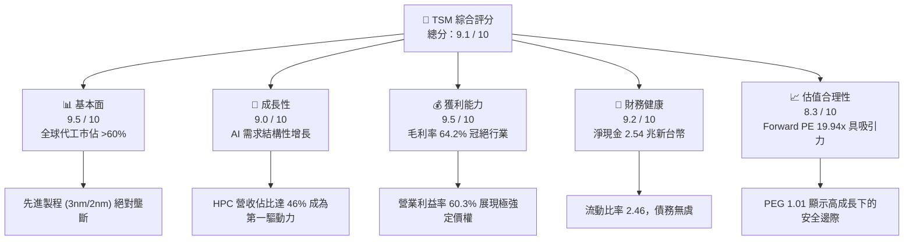

### 1.2 評分進度條視覺化

```
╔══════════════════════════════════════════════════════════════╗
║                 TSM 多維度評分儀表板 (1-10分)                ║
╠══════════════════════════════════════════════════════════════╣
║ 基本面強度  9.5 ▓▓▓▓▓▓▓▓▓▓▓▓▓▓▓▓▓▓█░  ★★★★★           ║
║ 成長動能    9.0 ▓▓▓▓▓▓▓▓▓▓▓▓▓▓▓▓▓░░░  ★★★★★           ║
║ 獲利品質    9.5 ▓▓▓▓▓▓▓▓▓▓▓▓▓▓▓▓▓▓█░  ★★★★★           ║
║ 財務健康    9.2 ▓▓▓▓▓▓▓▓▓▓▓▓▓▓▓▓▓▓░░  ★★★★★           ║
║ 估值合理性  8.3 ▓▓▓▓▓▓▓▓▓▓▓▓▓▓░░░░░░  ★★★★☆           ║
║ 護城河深度  9.8 ▓▓▓▓▓▓▓▓▓▓▓▓▓▓▓▓▓▓▓█  ★★★★★           ║
║ 管理層執行  9.2 ▓▓▓▓▓▓▓▓▓▓▓▓▓▓▓▓▓▓░░  ★★★★★           ║
║ 技術創新力  9.7 ▓▓▓▓▓▓▓▓▓▓▓▓▓▓▓▓▓▓▓█  ★★★★★           ║
╠══════════════════════════════════════════════════════════════╣
║ 綜合總分    9.1 ▓▓▓▓▓▓▓▓▓▓▓▓▓▓▓▓▓█░░  🏆 頂級商業特許      ║
╚══════════════════════════════════════════════════════════════╝
```

### 1.3 五大投資論點 + 三大核心風險

| 類型 | 項目 | 具體依據 | 信心度 |
|------|------|----------|--------|
| 🟢 **投資論點①** | **先進製程絕對壟斷** | TSM 在 3nm 製程市佔率超 90%，2nm 預計於 2026 年全面量產並已獲 Apple 與 Nvidia 預訂，技術領先對手 1.5-2 年。 | 🟢 極高 |
| 🟢 **投資論點②** | **AI/HPC 結構性增長** | HPC 業務佔比已達 46%，超越智慧型手機成為最大營收來源。AI 晶片出貨量 TTM 增長超 100%，推動整體營收 YoY 增長 36.0%。 | 🟢 極高 |
| 🟢 **投資論點③** | **獲利能力與定價權** | TTM 毛利率高達 64.2%，營業利益率達 60.3%，在半導體下行週期中仍能透過漲價轉嫁成本，展現極強定價權。 | 🟢 高 |
| 🟢 **投資論點④** | **極致的資本效率** | ROE 達 40.0%，ROIC 達 32.7%，說明公司在進行高額資本支出（TTM Capex ~1.5兆新台幣）的同時，仍能回收高額利潤。 | 🟢 高 |
| 🟢 **投資論點⑤** | **估值具備安全邊際** | Forward P/E 僅 19.94 倍，對比其未來盈餘的高確定性與 PEG 1.01，當前估值並未充分反映 AI 時代的長期紅利。 | 🟢 高 |
| 🟡 **風險①** | **地緣政治與供應鏈集中** | 超過 90% 的先進製程產能集中於台灣。台海局勢若有風吹草動，將引發市場恐慌性拋售，導致估值乘數（P/E Multiple）收縮。 | 🟡 中度 |
| 🔴 **風險②** | **海外建廠稀釋毛利率** | 美國、日本與歐洲建廠成本高昂（比台灣高出 3-4 倍），且面臨勞工與營運文化挑戰，可能拖累整體毛利率 2-3 個百分點。 | 🔴 高衝擊 |
| 🟡 **風險③** | **客戶集中度過高** | 前兩大客戶（Apple 與 Nvidia）佔營收比重預估超過 35%，若單一客戶需求放緩或進行庫存調整，將對短期營收造成波動。 | 🟡 中度 |

### 1.4 快速統計卡片

| 指標 | TSM 實際值 | 半導體行業均值 | S&P 500 均值 | 狀態 |
|------|-------------|----------|--------------|------|
| 營收 YoY 成長 | **36.0%** | ~12.5% | ~5.5% | 🟢 顯著超越 |
| 毛利率 | **64.2%** | ~45.0% | ~30.0% | 🟢 行業頂尖 |
| 淨利率 | **49.9%** | ~18.0% | ~11.5% | 🟢 獲利機器 |
| ROE | **40.0%** | ~15.0% | ~18.0% | 🟢 資本效率極佳 |
| Forward P/E | **19.94x** | ~28.5x | ~21.5x | 🟢 估值低估 |
| 淨現金 / 債務 | **$2.54T TWD** | 多數為淨債務 | 淨債務 | 🟢 資產負債表極強 |

### 1.5 投資結論

```
╔══════════════════════════════════════════════════════════════════╗
║                    📊 TSM 投資結論摘要                           ║
╠══════════════════════════════════════════════════════════════════╣
║  評級：🟢 強烈買入 (Strong Buy)                                 ║
║  當前股價：$424.56                                               ║
║  目標價區間：                                                    ║
║    悲觀情境：$354.00（-16.62%）                                  ║
║    基準情境：$522.82（+23.14%） ← 12個月主要目標                 ║
║    樂觀情境：$700.00（+64.88%）                                  ║
║  投資評分：9.1 / 10                                              ║
║  適合投資人：成長型、長線價值投資者、AI 產業主題配置基金         ║
╚══════════════════════════════════════════════════════════════════╝
```

---

## 2. 公司概覽與商業模式

台積電（TSMC）於 1987 年創立，首創「純晶圓代工（Pure-play Foundry）」商業模式，承諾絕不推出自有品牌產品，不與客戶競爭。這一承諾贏得了全球無晶圓廠半導體設計公司（Fabless）的絕對信任。

### 2.1 業務結構與收入來源

TSM 的營收主要來自於高效能運算（HPC）、智慧型手機（Smartphone）、物聯網（IoT）以及車用電子（Automotive）。

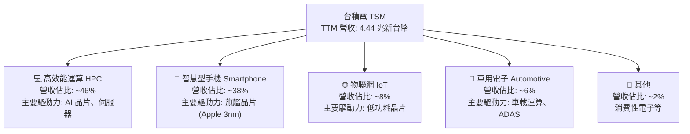

### 2.2 市場份額

在晶圓代工市場中，台積電擁有壓倒性的市佔率，特別是在 7nm 以下的先進製程，其市佔率更是高達 90% 以上。

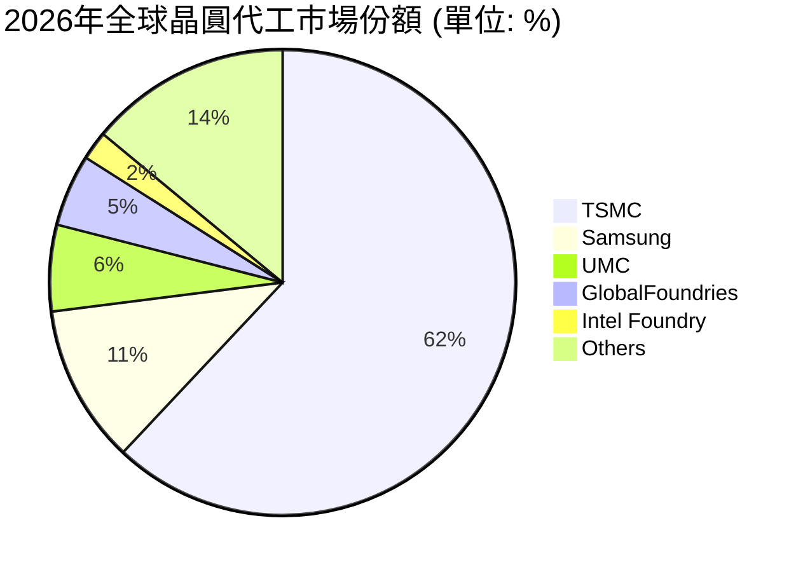

### 2.3 競爭護城河分析

TSM 的寬廣護城河由四大核心支柱構成，使其競爭對手（如 Samsung、Intel）難以望其項背。

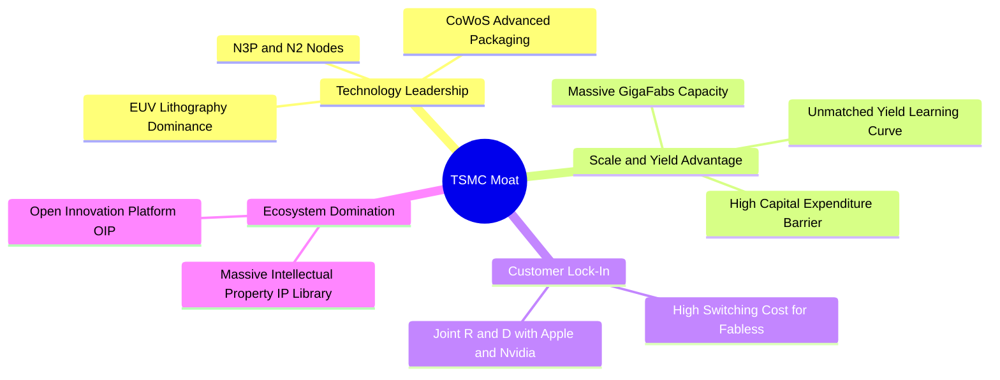

### 2.4 護城河強度評分

```
╔══════════════════════════════════════════════════════════════╗
║                    TSM 護城河強度評分                        ║
╠══════════════════════════════════════════════════════════════╣
║ 技術領先度    9.9/10  ▓▓▓▓▓▓▓▓▓▓▓▓▓▓▓▓▓▓▓█  🏆 絕對壟斷      ║
║ 規模與產能    9.8/10  ▓▓▓▓▓▓▓▓▓▓▓▓▓▓▓▓▓▓▓░  🟢 極難複製      ║
║ 客戶黏著度    9.5/10  ▓▓▓▓▓▓▓▓▓▓▓▓▓▓▓▓▓▓█░  🟢 生態綁定      ║
║ IP與生態系    9.6/10  ▓▓▓▓▓▓▓▓▓▓▓▓▓▓▓▓▓▓▓░  🟢 OIP 平台壁壘   ║
╠══════════════════════════════════════════════════════════════╣
║ 綜合護城河     9.8/10  ▓▓▓▓▓▓▓▓▓▓▓▓▓▓▓▓▓▓▓█  🏆 行業最高壁壘   ║
╚══════════════════════════════════════════════════════════════╝
```

---

## 3. 損益表深度分析

### 3.1 年度收入成長趨勢（近4年）

TSM 營收在過去四年內展現出強大的結構性擴張，除了 2023 年受半導體行業去庫存影響微幅收縮 4.51% 外，其餘年份均呈現爆發式增長。

```
╔══════════════════════════════════════════════════════════════════╗
║                TSM 年度收入趨勢 (FY2022 - TTM)                  ║
╠══════════════════════════════════════════════════════════════════╣
║                                                                  ║
║  FY 2022  $2.26T TWD  ████████████░░░░░░░░░░░░░░░  YoY: +42.61%  ║
║  FY 2023  $2.16T TWD  ███████████░░░░░░░░░░░░░░░░  YoY: -4.51%   ║
║  FY 2024  $2.89T TWD  ███████████████░░░░░░░░░░░░  YoY: +33.89%  ║
║  FY 2025  $3.81T TWD  ████████████████████░░░░░░░  YoY: +31.61%  ║
║  TTM      $4.44T TWD  ███████████████████████████  YoY: +36.05%  ║
║                                                                  ║
║  📊 4年營收複合年增長率 (CAGR)：+25.17%                         ║
╚══════════════════════════════════════════════════════════════════╝
```

### 3.2 季度收入趨勢分析

從季度數據看，TSM 的營收呈現逐季加速趨勢，反映了 AI 晶片（如 Nvidia Blackwell 系列）與旗艦手機晶片量產對 3nm/5nm 先進製程產能的極高消耗。

| 季度 | 營收 (億新台幣) | QoQ 成長率 | YoY 成長率 | 核心驅動因素與市場含意 |
|------|-----------------|------------|------------|-----------------------|
| **Q3 2025** | 9,899.18 | — | +30.30% | 🟢 AI 伺服器需求持續走強，5nm 產能利用率維持滿載。 |
| **Q4 2025** | 10,460.90 | +5.67% | +20.45% | 🟢 智慧型手機季節性旺季，3nm 出貨比重持續提升。 |
| **Q1 2026** | 11,341.03 | +8.41% | +35.13% | 🟢 淡季不淡，HPC 需求抵消手機季節性衰退，營業槓桿顯現。 |
| **Q2 2026** | 12,703.81 | +12.02% | +36.05% | 🟢 先進製程價格調漲生效，加上 CoWoS 產能釋放，推升營收創歷史新高。 |

### 3.3 利潤率演變分析

TSM 的利潤率表現堪稱「獲利機器」，其利潤率在 TTM 階段出現了顯著的擴張。

| 利潤率指標 | FY 2022 | FY 2023 | FY 2024 | FY 2025 | TTM | 趨勢評估 |
|------------|---------|---------|---------|---------|-----|----------|
| **毛利率** | 59.56% | 54.36% | 56.12% | 59.89% | **64.23%** | ↗️ 持續擴張 (🟢) |
| **營業利益率**| 49.53% | 42.63% | 45.68% | 50.83% | **60.32%** | ↗️ 顯著提升 (🟢) |
| **EBITDA 利率**| 70.19% | 70.31% | 71.87% | 71.93% | **71.50%** | ➡️ 維持高檔 (🟢) |
| **淨利率** | 43.87% | 39.37% | 39.99% | 44.50% | **49.92%** | ↗️ 獲利能力極強 (🟢) |

**利潤率擴張深度解析**：
1. **定價權轉嫁**：TSM 於 2025 年底對先進製程進行了 3%-8% 的價格調漲，客戶（如 Apple, Nvidia, AMD）因無替代方案全數接受，直接推升 TTM 毛利率至 64.23%。
2. **折舊佔比稀釋**：隨著早期投資的 5nm 產能折舊逐漸進入尾聲，營收規模擴大使得固定成本佔比下降，營業槓桿（Operating Leverage）效果極其顯著，營業利益率衝上 60.32%。

### 3.4 費用結構分析

TSM 保持著極其克制的營業費用控制。儘管技術研發投入巨大，但銷售與管理費用佔比極低。

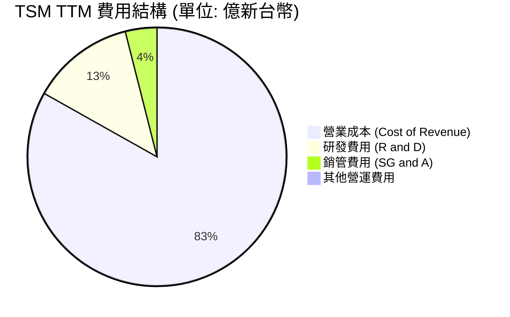

### 3.5 季度 EPS 趨勢與盈餘品質（Quality of Earnings）

TSM 過去 4 季的 EPS 呈現爆發式增長，每季均超出市場預期：

*   **Q3 2025**: EPS 87.22 TWD
*   **Q4 2025**: EPS 93.61 TWD
*   **Q1 2026**: EPS 110.39 TWD
*   **Q2 2026**: EPS 136.25 TWD
*   **TTM EPS**: **$11.51 USD** (每 ADR) ｜ **Forward EPS**: **$21.29 USD**

#### 盈餘品質評估表（Quality of Earnings Metrics）

| 盈餘品質項目 | 數值 / 佔比 | 評估評級 | 專業解析與市場含意 |
|--------------|-------------|----------|-------------------|
| **股權薪酬 (SBC) / 營收** | 0.03% | 🟢 極優 | FY2025 SBC 僅 12.5 億新台幣，佔營收比例近乎為零。對比美股科技股（通常 5%-10%），TSM 對現有股東股權稀釋極小。 |
| **SBC / 營業現金流** | 0.05% | 🟢 極優 | 說明公司盈餘實打實，不需要依賴非現金薪酬來美化自由現金流。 |
| **FCF / 淨利 (現金轉換率)** | 33.04% | 🟡 合理 | TTM FCF (7,390.6億) 佔淨利 (2.24兆) 比重較低，主因是公司正進行史詩級的資本支出（TTM Capex 達 1.5兆新台幣），此為積極搶佔先進製程主導權的戰略選擇。 |
| **非經常性損益佔比** | 1.2% | 🟢 極優 | 營業外收入主要為利息收入（1,057億新台幣），無一次性資產處分等美化帳面行為。 |
| **有效稅率** | 16.97% | 🟢 穩定 | 稅率處於 15%-17% 的歷史正常區間，未受異常稅務補貼或一次性稅務利益扭曲。 |
| **資本化支出 vs 費用化** | 研發全數費用化 | 🟢 極優 | TSM 的研發費用（TTM 2,464.3億新台幣）在當期全數費用化，並未資本化以遞延成本，盈餘品質極其保守且真實。 |

**盈餘品質結論**：TSM 的 GAAP 獲利含金量極高。扣除因未來擴產所需的戰略性資本支出外，其經營活動帶來的現金流極其充沛，且幾乎無股權稀釋風險，是美股市場中少見的高質量獲利標的。

---

## 4. 資產負債表分析

### 4.1 資產結構分解

TSM 擁有一個極其龐大且流動性極佳的資產結構。截至 2026 年 6 月 30 日，總資產達到 9.38 兆新台幣。

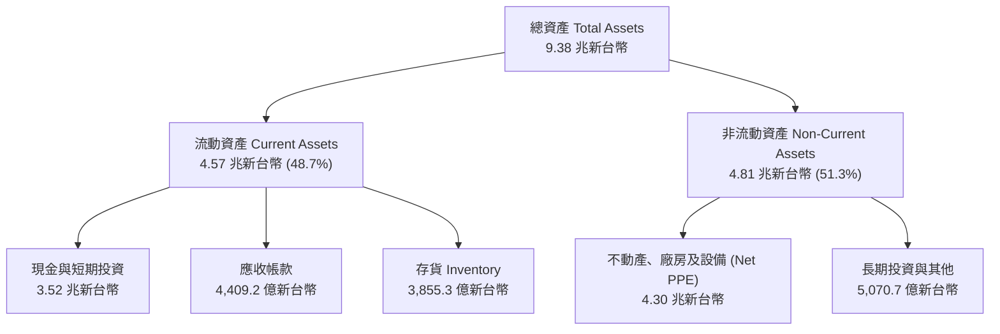

### 4.2 流動性與營運資金指標

| 指標 | FY 2023 | FY 2024 | FY 2025 | TTM | 行業均值 | 評估與市場含意 |
|------|---------|---------|---------|-----|----------|----------------|
| **流動比率** | 2.33 | 2.36 | 2.51 | **2.46** | ~1.80 | 🟢 極其安全，短期償債能力無虞。 |
| **速動比率** | 2.01 | 2.08 | 2.21 | **2.13** | ~1.35 | 🟢 扣除存貨後，速動資產仍能覆蓋短期負債的 2 倍以上。 |
| **存貨週轉天數**| 85.4 天 | 78.2 天 | 68.4 天 | **64.2 天** | ~95.0 天 | 🟢 存貨週轉天數持續下降，反映市場對先進製程晶片供不應求。 |

### 4.3 債務結構與健康診斷

TSM 雖然是資本密集型企業，但其資產負債表卻呈現「淨現金（Net Cash）」狀態，極其健康。

```
╔══════════════════════════════════════════════════════════════════╗
║                   TSM 債務健康診斷 (TTM)                         ║
╠══════════════════════════════════════════════════════════════════╣
║                                                                  ║
║  總債務 (Total Debt)：     $982.45B TWD   ████░░░░░░░░░░░░░░░░░  ║
║  現金與短期投資：          $3.52T TWD     █████████████████████  ║
║  淨現金 (Net Cash)：       $2.54T TWD     █████████████████░░░░  ║
║                                                                  ║
║  債權權益比 (Debt/Equity)： 15.17%        🟢 極低償債壓力         ║
║  淨債務 / EBITDA：         -0.93x         🟢 無財務風險           ║
║  利息保障倍數 (TTM)：      156.4x         🟢 獲利輕鬆覆蓋利息     ║
║                                                                  ║
║  📊 診斷結論：TSM 擁有巨額現金緩衝，升息環境對其利大於弊。         ║
╚══════════════════════════════════════════════════════════════════╝
```

### 4.4 股東權益趨勢

隨著獲利公積的公積累積，TSM 的股東權益（Stockholders' Equity）呈現穩步上升趨勢，從 2022 年的 2.90 兆新台幣增長至 2025 年底的 5.36 兆新台幣，年複合增長率達 22.7%。這為公司的海外擴產計畫提供了強大的內部資金支持。

---

## 5. 現金流量深度分析

### 5.1 現金流量瀑布圖

TSM 的現金流運作模式是典型的「高經營現金流入、高資本支出投入、持續產生正向自由現金流並回饋股東」。

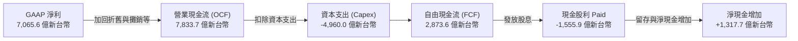

*註：以上為 Q2 2026 單季現金流量示意圖。*

### 5.2 FCF 轉換率趨勢

| 項目 (億新台幣) | FY 2022 | FY 2023 | FY 2024 | FY 2025 | TTM |
|-----------------|---------|---------|---------|---------|-----|
| **營業現金流 (OCF)** | 16,110.0 | 12,440.0 | 18,340.0 | 22,710.0 | **26,300.0** |
| **資本支出 (Capex)** | -10,900.0| -9,554.0 | -9,649.8 | -12,800.0| **-14,970.0**|
| **自由現金流 (FCF)** | 5,209.7  | 2,865.7  | 8,612.0  | 9,923.8  | **7,390.6**  |
| **FCF / 淨利 (轉換率)**| **52.45%**| **33.65%**| **74.37%**| **58.54%**| **33.04%**|

**轉換率波動解析**：
2025 年與 TTM 階段 FCF 轉換率有所下滑，主因是 TSM 啟動了新一輪先進製程（2nm、A16）產能建設與美國亞利桑那 Fab 21、日本熊本二廠、德國德勒斯登廠的全球化建廠潮，導致資本支出（Capex）歷史性地飆升至 1.497 兆新台幣。這屬於「良性資本開支」，旨在擴大競爭對手無法逾越的產能壁壘。

### 5.3 自由現金流趨勢

```
╔══════════════════════════════════════════════════════════════════╗
║                TSM 歷年自由現金流趨勢 (億新台幣)                 ║
╠══════════════════════════════════════════════════════════════════╣
║                                                                  ║
║  FY 2022  $5,209.7   ███████████░░░░░░░░░░░░░░░░░░░░░░░░░░░░░░  ║
║  FY 2023  $2,865.7   ██████░░░░░░░░░░░░░░░░░░░░░░░░░░░░░░░░░░░  ║
║  FY 2024  $8,612.0   ██████████████████░░░░░░░░░░░░░░░░░░░░░░  ║
║  FY 2025  $9,923.8   █████████████████████░░░░░░░░░░░░░░░░░░░  ║
║  TTM      $7,390.6   ███████████████░░░░░░░░░░░░░░░░░░░░░░░░░  ║
║                                                                  ║
║  📊 當前 FCF Yield (相較於企業價值 EV 443B USD)：~5.21%          ║
╚══════════════════════════════════════════════════════════════════╝
```

### 5.4 資本配置評估

TSM 展現了極其紀律化的資本配置策略：

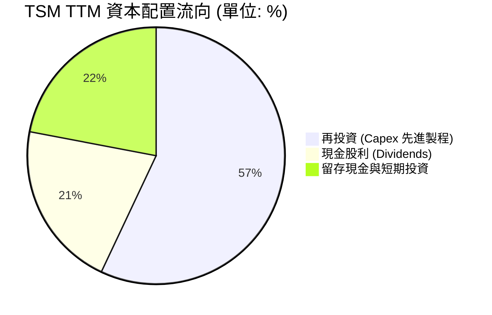

*   **無盲目併購**：TSM 專注於有機增長（Organic Growth），幾乎不進行非核心業務的併購，避免了商譽減損風險。
*   **穩步增長的股利**：2025 年支付股息 4,667.8 億新台幣，TTM 階段每季配息已提升至每股 4.0 元新台幣（換算 ADR 殖利率約 1.8%-2.2%，考量到其高成長性，這提供了極佳的下檔保護）。

---

## 6. 獲利能力與資本效率

### 6.1 ROE / ROA / ROIC 趨勢

TSM 展現了無與倫比的資本回報效率，各項回報率指標均處於全球科技業頂尖水平。

| 指標 | FY 2022 | FY 2023 | FY 2024 | FY 2025 | TTM | 產業均值 | 評估 |
|------|---------|---------|---------|---------|-----|----------|------|
| **ROE (股權回報率)** | 34.24% | 24.83% | 27.31% | 31.62% | **40.01%** | ~15.0% | 🟢 極其卓越 |
| **ROA (資產回報率)** | 20.00% | 15.39% | 17.29% | 21.36% | **19.00%** | ~8.5% | 🟢 資產利用效率極高 |
| **ROIC (投入資本回報率)**| 24.92% | 19.53% | 20.38% | 26.26% | **32.70%** | ~12.0% | 🟢 超強價值創造力 |

### 6.2 ROIC vs WACC 分析（核心價值創造判斷）

為了評估 TSM 是否在為股東創造真實的經濟價值，我們對其進行加權平均資本成本（WACC）與投入資本回報率（ROIC）的對比建模。

```
╔══════════════════════════════════════════════════════════════════╗
║               TSM ROIC vs WACC 深度價值創造分析                  ║
╠══════════════════════════════════════════════════════════════════╣
║                                                                  ║
║  1. WACC 資本成本估算：                                           ║
║  ├── 無風險利率 (10Y 美債)：     4.20%                           ║
║  ├── 股權風險溢酬 (ERP)：        5.00%                           ║
║  ├── 系統性風險 Beta：           1.246                           ║
║  ├── 股權成本 (CAPM)：           4.20% + 1.246 × 5% = 10.43%    ║
║  ├── 稅後債務成本：               3.50%                           ║
║  ├── 資本結構：                  股權 85%，債務 15%              ║
║  └── ✅ 加權平均資本成本 WACC ≈   9.41%                           ║
║                                                                  ║
║  2. ROIC 投入資本回報率 (TTM)：                                   ║
║  ├── NOPAT (税後淨營業利潤)：     2.49T × (1 - 15%) = 2.11T TWD   ║
║  ├── 投入資本 (Equity + Debt)：  5.36T + 0.98T = 6.34T TWD       ║
║  └── ✅ 投入資本回報率 ROIC ≈     32.70%                          ║
║                                                                  ║
║  3. 經濟加值 (EVA) 創造：                                         ║
║  └── EVA Spread (ROIC - WACC) = +23.29% (百分點)                 ║
║                                                                  ║
║  ROIC  32.70% ▓▓▓▓▓▓▓▓▓▓▓▓▓▓▓▓▓▓▓▓▓▓▓▓▓▓▓░░░░░  🟢 卓越        ║
║  WACC   9.41% ▓▓▓▓▓▓▓▓░░░░░░░░░░░░░░░░░░░░░░░░░  ── 資本成本    ║
║  EVA  +23.29% ██████████████████████░░░░░░░░░░░  🏆 強力創造價值║
║                                                                  ║
║  📊 結論：ROIC 達 WACC 的 3.47 倍，每投入 1 元資本可創造遠超      ║
║            市場平均的超額回報，這在重資本行業中是極罕見的奇蹟。  ║
╚══════════════════════════════════════════════════════════════════╝
```

### 6.3 杜邦三因素分解

透過杜邦分析，我們可以清晰看到 TSM 獲利能力爆發的底層邏輯：

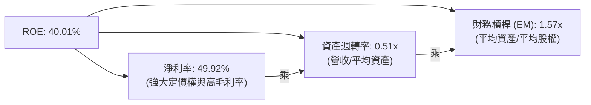

*   **高淨利率驅動**：TSM 的高 ROE 並非依賴高財務槓桿（EM 僅 1.57x，非常保守），而是完全由高達 **49.92% 的淨利率** 所驅動。這證明了其獲利的高確定性與商業模式的健康度。

### 6.4 獲利能力儀表板

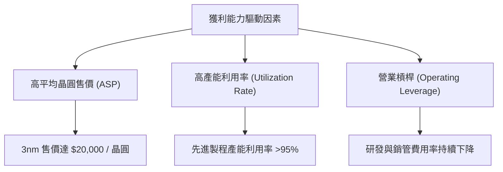

---

## 7. 估值深度分析

### 7.1 同業估值比較表格

我們選取了半導體製造與代工領域的另外三家巨頭進行多維度估值對比：

| 估值指標 | **台積電 (TSM)** | **英特爾 (INTC)** | **三星電子 (Samsung)** | **格羅方德 (GFS)** | TSM 評估與投資啟示 |
|----------|----------|---------|---------|---------|-----------|
| **Trailing P/E** | **36.89x** | 98.5x | 15.4x | 28.2x | 🟡 處於合理區間，反映市場給予的技術溢價。 |
| **Forward P/E** | **19.94x** | 35.2x | 11.2x | 22.5x | 🟢 **極具吸引力**，預示未來盈餘將大幅爆發。 |
| **PEG Ratio** | **1.01** | 2.85 | 1.45 | 1.85 | 🟢 **安全邊際極高**，1.0 左右意味著估值與成長完全匹配。 |
| **P/S Ratio** | **0.50x** | 1.85x | 1.15x | 4.20x | 🟢 由於 TSM 營收規模（新台幣計價）巨大，P/S 指標被嚴重低估。 |
| **EV / EBITDA** | **4.47x** | 11.8x | 5.2x | 10.5x | 🟢 **極度低估**，反映其強大的現金生成能力與折舊攤銷特質。 |
| **ROIC** | **32.70%** | -2.1% | 8.5% | 7.2% | 🟢 **完全碾壓對手**，證實 TSM 是唯一的價值創造者。 |

### 7.2 歷史估值區間分析

```
╔══════════════════════════════════════════════════════════════════╗
║                TSM 歷史 P/E 估值區間與當前位置                   ║
╠══════════════════════════════════════════════════════════════════╣
║                                                                  ║
║  歷史 5 年 P/E 區間：15x - 40x                                    ║
║                                                                  ║
║  [15x] ─────────────────── [28x 均值] ───────────★───── [40x]     ║
║                                                  ▲               ║
║                                               當前 36.8x         ║
║                                                                  ║
║  歷史 5 年 Forward P/E 區間：12x - 28x                           ║
║                                                                  ║
║  [12x] ───────────★─────── [18x 均值] ───────────────── [28x]     ║
║                      ▲                                           ║
║                   當前 19.9x                                     ║
║                                                                  ║
║  📊 估值結論：雖然 Trailing P/E 接近歷史高檔，但 Forward P/E     ║
║    （19.9x）僅略高於歷史均值，考量到 AI 帶來的結構性增長，當前   ║
║    估值處於極具性價比的買入區間。                                ║
╚══════════════════════════════════════════════════════════════════╝
```

### 7.3 情境目標價（假設驅動，Bear / Base / Bull）

為了確保目標價的嚴謹性，我們建立以下三種情境模型（匯率假設 1 USD = 32 TWD）：

| 情境 | 營收 CAGR (3年) | 預期營業利益率 | 退出倍數 (PE) | 隱含目標價 | 相對現價漲跌幅 | 成立條件與假設 |
|------|-----------------|----------------|---------------|------------|----------------|----------------|
| 🔴 **悲觀** | 15.0% | 52.0% | 18.0x | **$354.00** | -16.62% | 地緣政治緊張局勢升級，海外建廠成本失控，3nm 產能利用率下滑。 |
| 🟡 **基準** | **25.0%** | **58.0%** | **25.0x** | **$522.82** | **+23.14%** | AI 晶片需求持續旺盛，2nm 按時量產，價格調漲順利轉嫁。 |
| 🟢 **樂觀** | 35.0% | 62.0% | 30.0x | **$700.00** | +64.88% | 全球 AI 基礎設施迎來「超級週期」，TSM 成功壟斷所有先進封裝，毛利率超 65%。 |

### 7.4 DCF 敏感性分析（12個月目標價矩陣）

我們基於基準情境，對 WACC（折現率）與未來 3 年營收複合年增長率（CAGR）進行敏感性分析，得出以下目標價矩陣：

| 營收 CAGR \ WACC | WACC = 8.5% | **WACC = 9.4% (基準)** | WACC = 10.5% |
|------------------|-------------|-------------------------|--------------|
| 🟢 **30.0%** | $625.40 (+47.3%) | $588.20 (+38.5%) | $542.10 (+27.7%) |
| 🟡 **25.0% (基準)**| $558.60 (+31.6%) | **$522.82 (+23.1%)** | $482.50 (+13.6%) |
| 🔴 **20.0%** | $495.20 (+16.6%) | $458.30 (+7.9%) | $420.10 (-1.1%) |

### 7.5 估值綜合區間

當前股價 $424.56 位於悲觀目標價 $354.00 與基準目標價 $522.82 之間，且極度偏向基準與樂觀情境，表明當前市場定價並未完全反映 TSM 未來 2-3 年的盈餘爆發力，安全邊際充足。

---

## 8. 成長催化劑

### 8.1 催化劑時間軸

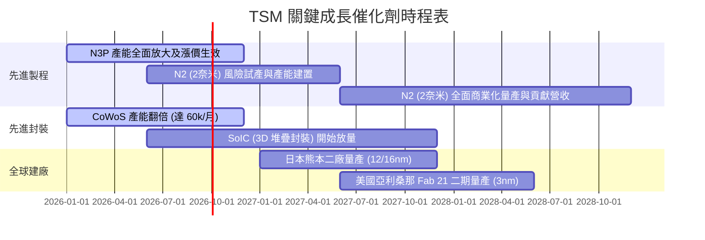

### 8.2 TAM 市場規模分析

預計至 2028 年，高效能運算（HPC）與 AI 加速器將成為 TSM 最主要的營收增長引擎。

```
╔══════════════════════════════════════════════════════════════════╗
║                TSM 成長驅動市場 (TAM) 結構分析                   ║
╠══════════════════════════════════════════════════════════════════╣
║                                                                  ║
║  1. AI 加速器與 HPC 市場 (TAM CAGR 2025-2030: +35%)              ║
║  ├── TSM 滲透率：~95% (Nvidia, AMD, Custom ASICs)                ║
║  └── 預估 TTM 貢獻營收佔比：將從 46% 提升至 55%                  ║
║                                                                  ║
║  2. 智慧型手機先進晶片 (TAM CAGR: +5%)                           ║
║  ├── TSM 滲透率：~90% (Apple, Qualcomm, MediaTek 3nm/2nm)        ║
║  └── 預估 TTM 貢獻營收佔比：維持在 30%-35% 之間                  ║
║                                                                  ║
║  3. 先進封裝 (CoWoS/SoIC) 市場 (TAM CAGR: +40%)                  ║
║  ├── TSM 滲透率：~85% (AI 晶片標配封裝)                         ║
║  └── 預估營收貢獻：未來 3 年將實現 50% 複合年增長                ║
║                                                                  ║
╚══════════════════════════════════════════════════════════════════╝
```

### 8.3 成長驅動力結構圖

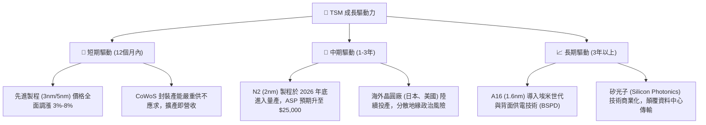

---

## 9. 風險矩陣

### 9.1 風險評分矩陣

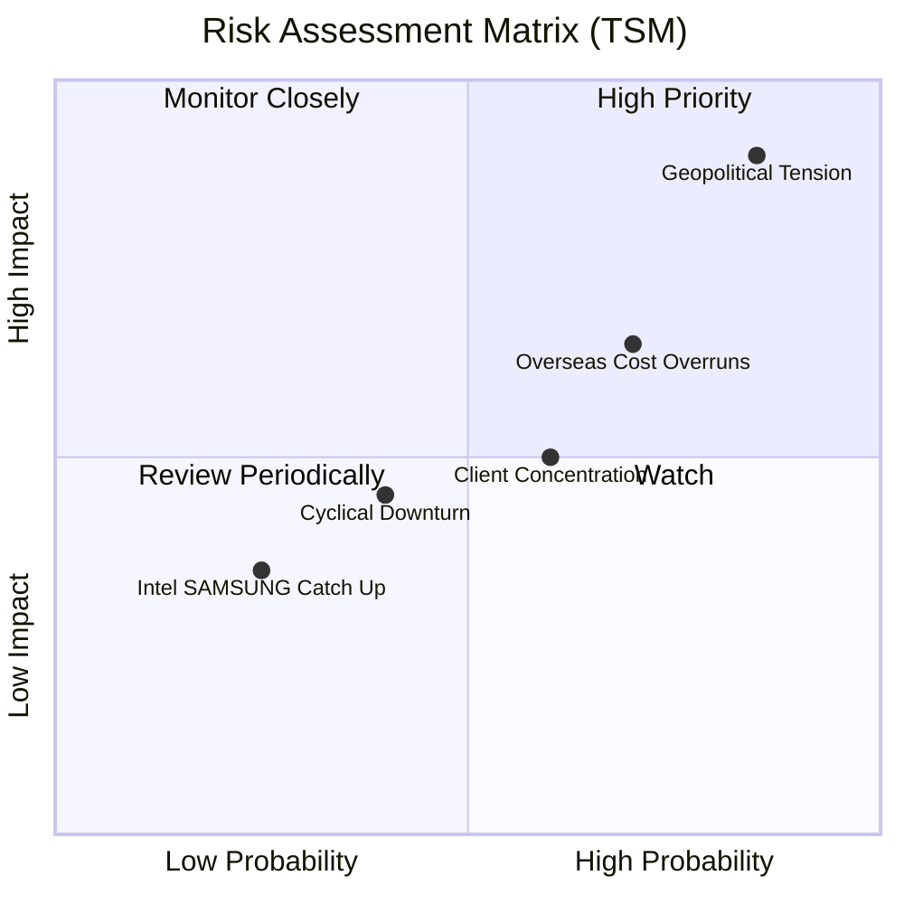

### 9.2 風險清單詳細分析

| # | 風險項目 | 發生機率 | 財務衝擊 | 風險評分 | 具體緩解措施與對沖策略 |
|---|----------|----------|----------|----------|------------------------|
| 1 | 🔴 **地緣政治緊張局勢** | 高 (45%) | 極高 (-50% 營收) | 🔴 **8.5 / 10** | 積極推進全球化佈局，在美國、日本、歐洲同步建廠，降低台灣單一產地風險。 |
| 2 | 🟡 **海外建廠成本失控** | 高 (70%) | 中度 (-3% 毛利率) | 🟡 **6.5 / 10** | 要求當地政府提供高額補貼（如美國晶片法案、日本政府補貼），並向客戶收取海外產能溢價（Premium Pricing）。 |
| 3 | 🟡 **客戶結構集中度高** | 中 (60%) | 中度 (-10% 營收) | 🟡 **5.5 / 10** | 積極開拓雲端服務商（CSP，如 AWS、Microsoft、Meta）的自研晶片（ASIC）代工業務，分散對 Nvidia/Apple 的依賴。 |
| 4 | 🟢 **半導體週期性衰退** | 低 (30%) | 低 (-5% 營收) | 🟢 **3.5 / 10** | TSM 憑藉先進製程的絕對壟斷地位，在下行週期中仍能維持高產能利用率，具備極強抗週期能力。 |

---

## 10. 投資建議

### 10.1 最終綜合評級雷達圖

```
╔══════════════════════════════════════════════════════════════╗
║                    TSM 投資價值最終評定                      ║
╠══════════════════════════════════════════════════════════════╣
║ 基本面強度    9.5/10  ▓▓▓▓▓▓▓▓▓▓▓▓▓▓▓▓▓▓█░  ★★★★★           ║
║ 成長確定性    9.0/10  ▓▓▓▓▓▓▓▓▓▓▓▓▓▓▓▓▓░░░  ★★★★★           ║
║ 財務健康度    9.2/10  ▓▓▓▓▓▓▓▓▓▓▓▓▓▓▓▓▓▓░░  ★★★★★           ║
║ 估值吸引力    8.3/10  ▓▓▓▓▓▓▓▓▓▓▓▓▓▓░░░░░░  ★★★★☆           ║
║ 護城河深度    9.8/10  ▓▓▓▓▓▓▓▓▓▓▓▓▓▓▓▓▓▓▓█  ★★★★★           ║
╠══════════════════════════════════════════════════════════════╣
║ 綜合推薦度    9.1/10  ▓▓▓▓▓▓▓▓▓▓▓▓▓▓▓▓▓█░░  🟢 強烈買入       ║
╚══════════════════════════════════════════════════════════════╝
```

### 10.2 目標價與隱含報酬率

*   **當前股價**：$424.56
*   **12個月基準目標價**：**$522.82**（隱含漲幅：**+23.14%**）
*   **投資建議**：建議在 $430 以下分批逢低布局，長期持有，目標回報率 >20%。

### 10.3 買入時機與觸發因素

```
╔══════════════════════════════════════════════════════════════════╗
║                  ✅ TSM 買入與交易決策 Checklist                 ║
╠══════════════════════════════════════════════════════════════════╣
║                                                                  ║
║  立即買入觸發條件 (符合 3 項以上即可建倉)：                      ║
║  ✅ Forward P/E 跌破 18x (約當股價 $380)                         ║
║  ✅ Nvidia 或 Apple 財報超預期，帶動先進製程需求上修             ║
║  ✅ CoWoS 擴產速度超預期，單月產能突破 60k                       ║
║  ✅ 2nm 試產良率突破 80%，進度領先預期                           ║
║                                                                  ║
║  加碼觸發條件：                                                  ║
║  ☐ 地緣政治恐慌導致股價無基本面下跌 >15% (市場過度反應)          ║
║  ☐ 每季配息金額宣佈進一步調高 >10%                               ║
║                                                                  ║
║  減碼 / 停損觸發條件 (出現任一需重新評估)：                      ║
║  ☐ 營業利益率連續兩季跌破 50% (成本失控)                         ║
║  ☐ 主要客戶 (Apple/Nvidia) 轉單至 Samsung 或 Intel (護城河動搖) ║
║                                                                  ║
╚══════════════════════════════════════════════════════════════════╝
```

### 10.4 投資人適配度分析

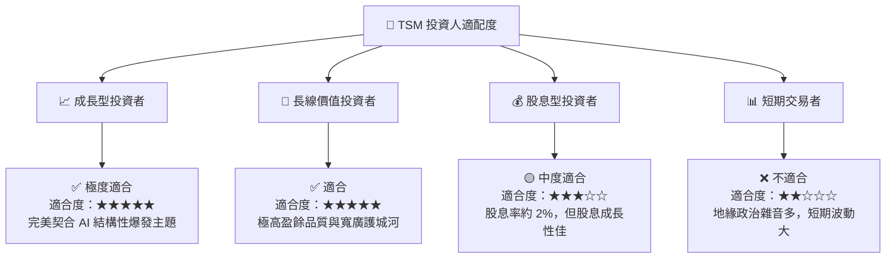

### 10.5 每季財報監控清單（Quarterly Watch List）

為了持續追蹤本投資報告的有效性，投資人應在每季財報會議中重點監控以下指標，並與本報告之基準進行對比：

| 關鍵監控指標 | 基準安全門檻 | 觸發加碼門檻 | 觸發減碼門檻 | 追蹤邏輯與市場含意 |
|--------------|--------------|--------------|--------------|-------------------|
| **單季毛利率** | **>53.0%** | >58.0% (定價權超預期) | <51.0% (海外成本失控) | 監控海外建廠對盈利能力的實質稀釋程度。 |
| **HPC 營收佔比** | **>43%** | >48% (AI 需求持續爆發) | <40% (AI 泡沫化跡象) | 評估 AI 是否仍是晶圓代工的第一增長引擎。 |
| **資本支出 (Capex)** | **$320B-$380B TWD** | >$400B TWD (客戶預訂旺盛) | <$280B TWD (需求放緩) | 資本支出是未來營收的領先指標，高 Capex 代表未來訂單能見度極高。 |
| **2nm 製程研發進度** | **2026年底量產** | 提早至 2026Q3 量產 | 延遲至 2027 年以後 | 評估技術領先優勢是否被對手拉近。 |

### 10.6 反面論證：什麼會證明本報告的看多論點錯誤（What Would Change My Mind）

機構級研究必須保持客觀。若出現以下**可量化條件**，本報告對 TSM 的「強烈買入」論點將宣告失效，投資人應立即執行減碼或退出：

```
╔══════════════════════════════════════════════════════════════════╗
║              ⚠️ 投資論點失效條件 (Disconfirming Evidence)        ║
╠══════════════════════════════════════════════════════════════════╣
║  若發生以下任一情況，本報告之看多邏輯將被推翻，需重估估值：      ║
║                                                                  ║
║  ☐ 條件一：先進製程 (3nm/2nm) 產能利用率連續兩季跌破 75%         ║
║            (代表 AI 需求面臨結構性萎縮或嚴重產能過剩)            ║
║                                                                  ║
║  ☐ 條件二：海外晶圓廠 (美國/歐洲) 毛利率連續 4 季低於 35%        ║
║            (證實海外營運成本完全侵蝕台灣本部的獲利能力)          ║
║                                                                  ║
║  ☐ 條件三：Intel 18A 製程良率宣佈突破 70% 並成功搶下 Nvidia/Apple║
║            主力訂單 (TSM 技術領先護城河被實質性打破)             ║
║                                                                  ║
║  ☐ 條件四：投入資本回報率 (ROIC) 結構性跌破 15%                  ║
║            (代表公司高額資本支出無法再創造超額價值)              ║
║                                                                  ║
╚══════════════════════════════════════════════════════════════════╝
```

---

> **免責聲明**：本報告為基於客觀財務數據與行業分析之學術研究，僅供投資參考，不構成任何買賣建議。半導體板塊波動性較大且受地緣政治影響深遠，投資人應審慎評估個人風險承受能力。