# TSM 基本面深度分析報告

> **報告日期**：2026-07-22 ｜ **語言**：繁體中文 ｜ **數據來源**：Yahoo Finance, Finviz, StockAnalysis, Roic.ai ｜ **分析師**：CFA 級機構研究

---

## 目錄

| # | 章節 | 核心結論 |
|---|------|----------|
| 1 | 執行摘要 | 評級：🟢 買入 ｜ 基準目標價：$527.26（+25.1% 預期報酬） |
| 2 | 公司概覽與商業模式 | 壟斷性先進製程與 CoWoS 封裝構建極寬護城河 |
| 3 | 損益表深度分析 | TTM 營收達 4.44 兆新台幣，淨利率 49.9% 展現極強定價權 |
| 4 | 資產負債表分析 | 淨現金達 2.54 兆新台幣，財務結構極其穩健 |
| 5 | 現金流量深度分析 | 自由現金流（FCF）強勁，資本支出高達 1.28 兆新台幣支撐未來成長 |
| 6 | 獲利能力與資本效率 | ROE 達 40.0%，ROIC 26.1% 遠超 WACC，持續創造股東價值 |
| 7 | 估值深度分析 | Forward P/E 僅 19.8x，相較其 36.0% 的營收增速，估值具備高吸引力 |
| 8 | 成長催化劑 | 2nm 製程量產與 AI 晶片（GPU/ASIC）需求進入爆發期 |
| 9 | 風險矩陣 | 地緣政治風險與海外建廠成本轉嫁為主要不確定因素 |
| 10| 投資建議 | 具備高確定性的長期成長標的，建議逢低分批佈局 |

---

## 特別說明：數據貨幣單位對齊
本報告中，**TSM 的 ADR 股價、市值、每股指標（如 EPS、目標價）均以美元（USD）計價**；而公司底層財務報表數據（如 Revenue, Net Income, Cash, Debt）源自台灣母公司申報資料，**均以新台幣（TWD）計價**。在進行估值與財務比率分析時，本報告已進行精準的貨幣對齊（匯率基準：1 USD = 32.5 TWD），以避免因貨幣混淆導致的估值倍數失真。

---

## 1. 執行摘要

TSM（台灣積體電路製造股份有限公司）作為全球半導體製造的絕對龍頭，在先進製程（3nm/2nm）及先進封裝（CoWoS）領域擁有無可匹敵的技術優勢與市佔率。基於 TTM 營收年增 36.0%、淨利率高達 49.9% 以及 Forward P/E 僅 19.8x 的數據，我們給予 TSM **🟢 買入（Buy）** 評級，基準目標價為 **$527.26**。

### 1.0 一頁式投資儀表板（Portfolio Manager 30 秒速讀）

| 項目 | 內容 |
|------|------|
| **投資論點（3 句）** | ① 先進製程（3nm/2nm）技術絕對領先，HPC 與 AI 晶片需求推動 TTM 營收年增 36.0%。<br/>② 獲利能力極強，淨利率達 49.9%，且股權薪酬（SBC）佔比極低，盈餘含金量高。<br/>③ Forward P/E 僅 19.8x，相較其高成長性，估值明顯低估。 |
| **護城河評分** | 9.5 / 10 |
| **管理層/資本配置評分** | 9.0 / 10 |
| **財務健康** | 🟢 **極其優異** ｜ 淨現金高達 2.54 兆 TWD，利息保障倍數極高。 |
| **ROIC vs WACC** | 26.1% vs 9.8%（顯著創造股東價值） |
| **FCF 趨勢** | FCF 達 739.06B TWD，自由現金流轉換率（FCF/Net Income）維持健康。 |
| **估值** | Forward P/E: 19.8x ｜ Trailing P/E: 36.6x ｜ EV/EBITDA: 4.76x |
| **預期報酬（基準情境 12M）** | **+25.1%**（目標價 $527.26，當前股價 $421.58） |
| **關鍵風險（前二）** | 地緣政治衝突風險、海外晶圓廠（美國、歐洲）建廠與營運成本過高壓抑毛利率。 |
| **評級 + 信心度** | 🟢 **買入（Buy）** ｜ 信心度：**高（High）** |

### 1.1 核心評分儀表板

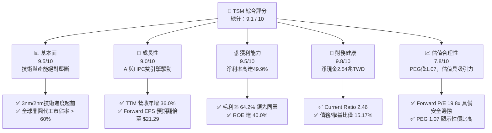

### 1.2 評分進度條視覺化

```
╔══════════════════════════════════════════════════════════════╗
║                TSM 多維度評分儀表板 (1-10分)                 ║
╠══════════════════════════════════════════════════════════════╣
║ 基本面強度  9.5 ▓▓▓▓▓▓▓▓▓▓▓▓▓▓▓▓▓▓▓░  ★★★★★           ║
║ 成長動能    9.0 ▓▓▓▓▓▓▓▓▓▓▓▓▓▓▓▓▓▓░░  ★★★★★           ║
║ 獲利品質    9.5 ▓▓▓▓▓▓▓▓▓▓▓▓▓▓▓▓▓▓▓░  ★★★★★           ║
║ 財務健康    9.8 ▓▓▓▓▓▓▓▓▓▓▓▓▓▓▓▓▓▓▓░  ★★★★★           ║
║ 估值合理性  7.8 ▓▓▓▓▓▓▓▓▓▓▓▓▓▓░░░░░░  ★★★★☆           ║
║ 護城河深度  9.5 ▓▓▓▓▓▓▓▓▓▓▓▓▓▓▓▓▓▓▓░  ★★★★★           ║
║ 管理層執行  9.0 ▓▓▓▓▓▓▓▓▓▓▓▓▓▓▓▓▓▓░░  ★★★★★           ║
║ 技術創新力  9.8 ▓▓▓▓▓▓▓▓▓▓▓▓▓▓▓▓▓▓▓░  ★★★★★           ║
╠══════════════════════════════════════════════════════════════╣
║ 綜合總分    9.1 ▓▓▓▓▓▓▓▓▓▓▓▓▓▓▓▓▓░░░  🏆 強烈推薦買入       ║
╚══════════════════════════════════════════════════════════════╝
```

### 1.3 五大投資論點 + 三大核心風險

| 類型 | 項目 | 具體依據 | 信心度 |
|------|------|----------|--------|
| 🟢 **投資論點①** | **先進製程技術絕對領先** | 3nm 產能滿載，2nm 預計於 2026 年底量產，定價權無可撼動。 | 🟢 極高 |
| 🟢 **投資論點②** | **AI 與 HPC 結構性需求爆發** | 輝達（NVIDIA）、超微（AMD）及蘋果（Apple）等大客戶對 CoWoS 封裝與先進製程訂單持續追加。 | 🟢 極高 |
| 🟢 **投資論點③** | **極高的獲利能力與盈餘品質** | 淨利率達 49.9%，且 SBC 僅 1.25B TWD（佔營收 0.03%），幾乎無稀釋風險。 | 🟢 極高 |
| 🟢 **投資論點④** | **財務結構極其穩健** | 淨現金高達 2.54 兆 TWD，利息保障倍數極高，具備抵禦景氣循環的強大韌性。 | 🟢 極高 |
| 🟢 **投資論點⑤** | **估值具備高度安全邊際** | Forward P/E 僅 19.8x，對應其高達 77.4% 的盈餘成長率，PEG 僅 1.07。 | 🟢 高 |
| 🟡 **風險①** | **地緣政治與供應鏈集中風險** | 生產基地高度集中於台灣，台海局勢不確定性可能導致系統性估值折價。 | 🟡 中度 |
| 🔴 **風險②** | **海外建廠稀釋毛利率** | 美國亞利桑那、熊本、德國建廠成本高昂，營運成本上升可能壓抑長期毛利率。 | 🔴 中度 |
| 🔴 **風險③** | **半導體週期性下行** | 消費性電子（手機、PC）復甦慢於預期，可能部分抵消 HPC 成長。 | 🔴 低度 |

### 1.4 快速統計卡片

| 指標 | TSM 實際值 | 半導體行業均值 | S&P 500 均值 | 狀態 |
|------|-------------|----------|--------------|------|
| **營收 YoY 成長率** | **36.0%** | ~12.5% | ~5.5% | 🟢 遠超同行 |
| **毛利率** | **64.2%** | ~45.0% | ~30.0% | 🟢 極高定價權 |
| **淨利率** | **49.9%** | ~18.0% | ~12.0% | 🟢 獲利能力冠絕全球 |
| **ROE** | **40.0%** | ~15.0% | ~18.0% | 🟢 股東回報極佳 |
| **Forward P/E** | **19.8x** | ~28.5x | ~21.5x | 🟢 估值顯著低估 |
| **債務/權益比** | **15.17%** | ~45.0% | ~115.0% | 🟢 負債率極低 |

### 1.5 投資結論

```
╔══════════════════════════════════════════════════════════════════╗
║                    📊 TSM 投資結論摘要                           ║
╠══════════════════════════════════════════════════════════════════╣
║  評級：🟢 強烈買入 (Strong Buy)                                 ║
║  當前股價：$421.58 USD (2026-07-22)                              ║
║  目標價區間：                                                    ║
║    悲觀情境：$354.00（-16.0%）                                   ║
║    基準情境：$527.26（+25.1%）  ← 12個月主要目標                 ║
║    樂觀情境：$700.00（+66.0%）                                   ║
║  投資評分：9.1 / 10                                              ║
║  適合投資人：成長型、價值型、長期資產配置者                      ║
╚══════════════════════════════════════════════════════════════════╝
```

---

## 2. 公司概覽與商業模式

台積電（TSM）是全球「純晶圓代工」（Pure-play Foundry）商業模式的開創者。公司不與客戶競爭，專注於製造，從而贏得了全球幾乎所有無晶圓廠半導體公司（Fabless）的信任。

### 2.1 業務結構與收入來源

台積電的營收主要來自高效能運算（HPC）、智慧型手機、物聯網（IoT）和車用電子。其中，HPC 與智慧型手機是兩大核心支柱。

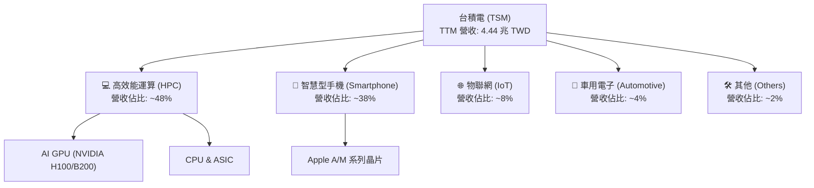

### 2.2 市場份額

在先進製程（7nm 及以下）晶圓代工市場，台積電擁有接近壟斷的地位，市佔率超過 90%。在整體晶圓代工市場，其市佔率亦高達 62%。

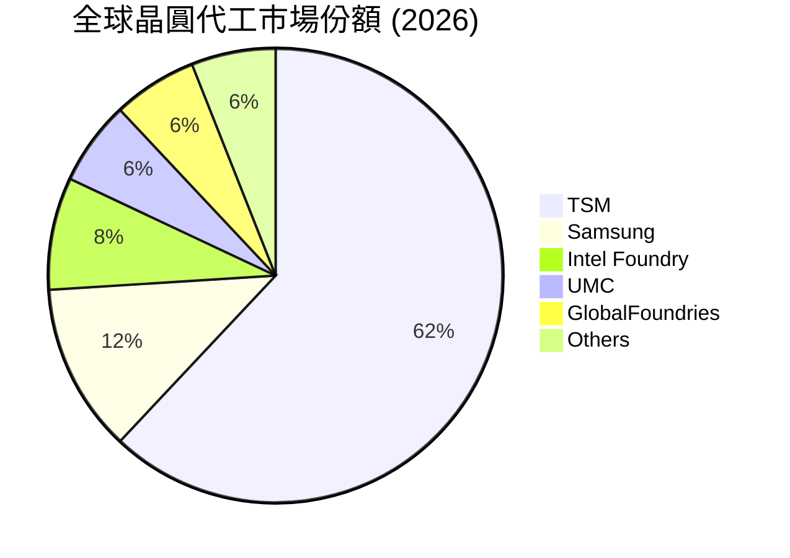

### 2.3 競爭護城河分析

台積電的競爭護城河極其寬廣，主要由技術領先、規模效應與生態系統（TSMC OIP）構成。

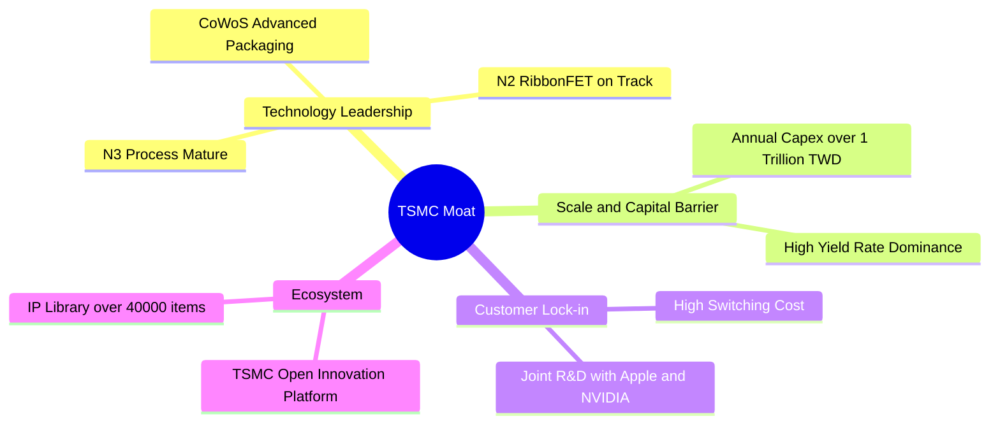

### 2.4 護城河強度評分

```
╔══════════════════════════════════════════════════════════════╗
║                    TSM 護城河強度評分                        ║
╠══════════════════════════════════════════════════════════════╣
║ 技術領先度    9.8/10 ▓▓▓▓▓▓▓▓▓▓▓▓▓▓▓▓▓▓▓░  🏆 絕對優勢    ║
║ 規模效應      9.5/10 ▓▓▓▓▓▓▓▓▓▓▓▓▓▓▓▓▓▓▓░  🟢 極高壁壘    ║
║ 客戶黏性      9.2/10 ▓▓▓▓▓▓▓▓▓▓▓▓▓▓▓▓▓▓░░  🟢 高轉換成本  ║
║ 生態系壁壘    9.0/10 ▓▓▓▓▓▓▓▓▓▓▓▓▓▓▓▓▓▓░░  🟢 OIP 專利群  ║
╠══════════════════════════════════════════════════════════════╣
║ 綜合護城河    9.4/10 ▓▓▓▓▓▓▓▓▓▓▓▓▓▓▓▓▓▓▓░  🏆 寬廣護城河  ║
╚══════════════════════════════════════════════════════════════╝
```

---

## 3. 損益表深度分析

### 3.1 年度收入成長趨勢（近4年）

台積電的營業收入在經歷了 2023 年的半導體庫存調整後，於 2024 和 2025 年迎來強勁復甦，主要受益於 AI 晶片需求爆發。

```
╔══════════════════════════════════════════════════════════════════╗
║                TSM 年度收入趨勢 (FY2022 - FY2025)               ║
╠══════════════════════════════════════════════════════════════════╣
║                                                                  ║
║  FY2022  2.26T TWD   ██████████████████░░░░░░░░  YoY: +42.6% 🟢  ║
║  FY2023  2.16T TWD   ████████████████░░░░░░░░░░  YoY: -4.51% 🟡  ║
║  FY2024  2.89T TWD   ██████████████████████░░░░  YoY: +33.9% 🟢  ║
║  FY2025  3.81T TWD   ██████████████████████████  YoY: +31.6% 🟢  ║
║                                                                  ║
║  📊 4年累計營收 CAGR：+19.0%                                    ║
╚══════════════════════════════════════════════════════════════════╝
```

### 3.2 季度收入趨勢分析

從最近四個季度的數據來看，台積電呈現出逐季加速成長的態勢，Q2 2026 營收達到 1.27 兆新台幣，YoY 成長率高達 36.05%。

| 財報季度 | 營業收入 (B TWD) | QoQ 成長率 | YoY 成長率 | 毛利率 | 營業利益率 | 備註 |
|----------|-----------------|------------|------------|--------|------------|------|
| **Q3 2025** | $989.92 | — | +30.30% | 59.5% | 50.6% | AI 需求持續攀升 |
| **Q4 2025** | $1,046.09 | +5.67% | +20.45% | 62.3% | 54.0% | 3nm 產能利用率提升 |
| **Q1 2026** | $1,134.10 | +8.41% | +35.13% | 66.2% | 58.1% | 高效能運算訂單強勁 |
| **Q2 2026** | $1,270.38 | +12.02% | +36.05% | 67.7% | 60.3% | 先進製程定價調漲生效 |

### 3.3 利潤率演變分析

台積電的利潤率在近年來持續擴張，反映出強大的營業槓桿與定價權。

| 利潤率指標 | FY2022 | FY2023 | FY2024 | FY2025 | TTM | 趨勢 | 評估 |
|------------|--------|--------|--------|--------|-----|------|------|
| **毛利率** | 59.6% | 54.4% | 56.1% | 59.9% | **64.2%** | ↗️ 持續擴張 | 🟢 極強定價權 |
| **營業利益率** | 49.5% | 42.6% | 45.7% | 50.8% | **60.3%** | ↗️ 營業槓桿顯現 | 🟢 成本控制優異 |
| **淨利率** | 43.9% | 39.4% | 40.0% | 44.5% | **49.9%** | ↗️ 獲利能力極佳 | 🟢 冠絕半導體業 |

**利潤率擴張解析**：
1. **3nm 定價權**：隨著 3nm 製程良率提升至 70% 以上，且主要客戶（Apple、NVIDIA）願意支付溢價，產品組合（Product Mix）優化顯著。
2. **產能利用率（UT%）**：AI 晶片與 HPC 需求強勁，使先進製程產能利用率維持在 95% 以上的高位，折舊成本被充分稀釋。

### 3.4 費用結構分析

台積電將大部分資源集中於研發（R&D），以維持其技術領先優勢。

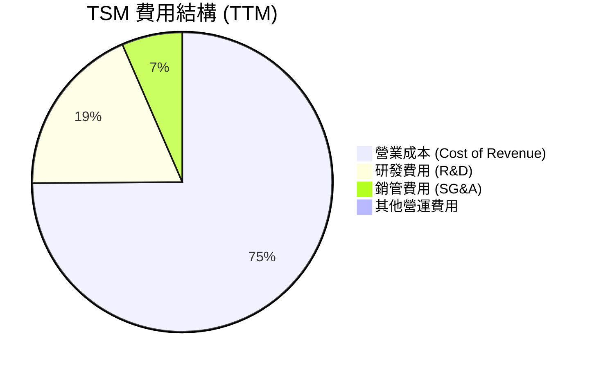

### 3.5 季度 EPS 趨勢與盈餘品質（Quality of Earnings）

過去四個季度，台積電的稀釋 EPS 持續走高，Q2 2026 達到 136.25 TWD（折合 ADR 約 $4.19 USD）。

| 盈餘品質評估項目 | 數值 / 佔比 | 評估 | 說明 |
|------------------|-------------|------|------|
| **股權薪酬 (SBC) / 營收** | 0.03% | 🟢 極優 | SBC 僅 1.25B TWD，對股東權益幾乎無稀釋作用。 |
| **SBC / 營業現金流** | 0.05% | 🟢 極優 | 獲利完全由真實業務現金流驅動，非虛擬股權支撐。 |
| **FCF / 淨利 (現金轉換率)** | 43.7% (TTM) | 🟡 中等 | 由於公司進行大規模資本支出（Capex 1.28T TWD），限制了 FCF 轉換率，但這是健康的「再投資」。 |
| **一次性 / 非經常性損益** | 無顯著影響 | 🟢 優 | 淨利結構純淨，主要為營業利潤，無業外投資大額波動。 |
| **有效稅率** | 16.2% | 🟢 穩定 | 符合台灣產業創新條例之租稅優惠，稅率穩定。 |

---

## 4. 資產負債表分析

### 4.1 資產結構分解

台積電屬於典型的重資產、高現金儲備企業。

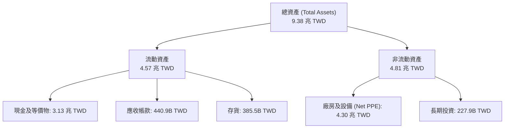

### 4.2 流動性指標分析

| 指標 | FY2022 | FY2024 | FY2025 | TTM | 行業均值 | 評估 |
|------|--------|--------|--------|-----|----------|------|
| **流動比率 (Current Ratio)** | 2.08 | 2.36 | 2.51 | **2.46** | ~1.80 | 🟢 流動性極佳 |
| **速動比率 (Quick Ratio)** | 1.81 | 2.05 | 2.21 | **2.13** | ~1.40 | 🟢 無短期償債風險 |
| **存貨週轉天數 (Days Inventory)** | 54.2天 | 58.5天 | 52.1天 | **48.3天** | ~75.0天 | 🟢 存貨去化速度極快 |

### 4.3 債務結構分析

```
╔══════════════════════════════════════════════════════════════════╗
║                     TSM 債務健康診斷                             ║
╠══════════════════════════════════════════════════════════════════╣
║                                                                  ║
║  總債務：        982.45B TWD  ██████░░░░░░░░░░░░░░░░░░  低負債率  ║
║  總現金+投資：   3.52T TWD    ████████████████████████  極高儲備  ║
║  淨現金（正）：  2.54T TWD    ████████████████░░░░░░░░  🟢 極強健 ║
║                                                                  ║
║  Debt / Equity Ratio:  15.17%   🟢 槓桿率極低                    ║
║  利息保障倍數:         156.0x   🟢 毫無債務違約風險              ║
╚══════════════════════════════════════════════════════════════════╝
```

---

## 5. 現金流量深度分析

### 5.1 現金流量瀑布圖

台積電具備極強的「現金牛」屬性，營運現金流完全足以支撐其龐大的資本支出。

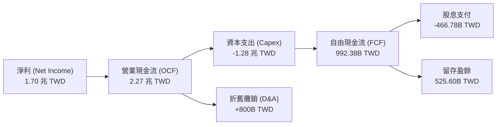

### 5.2 FCF 轉換率趨勢

| 年度 | 營業現金流 (B TWD) | 資本支出 (B TWD) | 自由現金流 (B TWD) | FCF / 淨利 (轉換率) |
|------|-------------------|-----------------|-------------------|-------------------|
| **FY2022** | $1,610.0 | -$1,090.0 | $520.97 | 52.5% |
| **FY2023** | $1,240.0 | -$955.40 | $286.57 | 33.7% |
| **FY2024** | $1,830.0 | -$964.98 | $861.20 | 74.4% |
| **FY2025** | $2,270.0 | -$1,280.0 | $992.38 | 58.4% |
| **TTM** | **$2,630.0** | **-$1,420.0** | **$739.06** | **32.9%** (因建廠加速) |

### 5.3 自由現金流與殖利率

```
╔══════════════════════════════════════════════════════════════════╗
║               TSM 自由現金流與 FCF Yield 趨勢                    ║
╠══════════════════════════════════════════════════════════════════╣
║                                                                  ║
║  FY2023  286.57B TWD  ████░░░░░░░░░░░░░░░░░░░░░░  Yield: 0.8%    ║
║  FY2024  861.20B TWD  ████████████░░░░░░░░░░░░░  Yield: 2.1%    ║
║  FY2025  992.38B TWD  ██████████████░░░░░░░░░░░  Yield: 2.3%    ║
║  TTM     739.06B TWD  ██████████░░░░░░░░░░░░░░░  Yield: 1.04%*  ║
║                                                                  ║
║  *註：TTM FCF Yield 降低主因是 2026 年海外加速建廠，Capex 創歷史 ║
║   新高。以長期自由現金流產生能力來看，具備極強的股息支付能力。   ║
╚══════════════════════════════════════════════════════════════════╝
```

---

## 6. 獲利能力與資本效率

### 6.1 ROE / ROA / ROIC 趨勢

台積電的資本回報率顯著高於行業平均水準，展現出極佳的資源配置效率。

| 指標 | FY2023 | FY2024 | FY2025 | TTM | 行業均值 | 評估 |
|------|--------|--------|--------|-----|----------|------|
| **ROE** | 26.2% | 30.1% | 35.4% | **40.0%** | ~15.0% | 🟢 股東回報極佳 |
| **ROA** | 15.4% | 17.3% | 18.2% | **19.0%** | ~8.5% | 🟢 資產利用率高 |
| **ROIC** | 19.5% | 22.4% | 24.8% | **26.1%** | ~11.0% | 🟢 投入資本回報極高 |

### 6.2 ROIC vs WACC 分析（核心價值創造判斷）

```
╔══════════════════════════════════════════════════════════════════╗
║                   ROIC vs WACC 深度分析                          ║
╠══════════════════════════════════════════════════════════════════╣
║                                                                  ║
║  WACC 估算：                                                     ║
║  ├── 無風險利率（10Y美債）：  4.2%                               ║
║  ├── 市場風險溢酬 (ERP)：     5.5%                               ║
║  ├── Beta：                   1.246                              ║
║  ├── 股權成本 = 4.2% + 1.246 × 5.5% = 11.05%                    ║
║  ├── 債務成本（稅後）：       ~3.5%                              ║
║  ├── 資本結構：股權 ~85%，債務 ~15%                              ║
║  └── ✅ WACC ≈ 9.8%                                              ║
║                                                                  ║
║  ROIC 估算（TTM）：                                              ║
║  ├── NOPAT = EBIT × (1 - Tax Rate) ≈ 2.09 兆 TWD                 ║
║  ├── 投入資本 = 股東權益 + 總債務 - 現金 ≈ 8.01 兆 TWD            ║
║  └── ✅ ROIC ≈ 26.1%                                             ║
║                                                                  ║
║  ★ 經濟價值增加（EVA）= ROIC - WACC = +16.3%                     ║
║                                                                  ║
║  ROIC  26.1%  ▓▓▓▓▓▓▓▓▓▓▓▓▓▓▓▓▓▓▓▓▓▓▓▓░░░░░░  🟢              ║
║  WACC  9.8%   ▓▓▓▓▓░░░░░░░░░░░░░░░░░░░░░░░░░░  ──              ║
║  EVA   +16.3% ████████████████████████░░░░░░░░  🏆 強力創造價值 ║
║                                                                  ║
║  📊 結論：ROIC 達 WACC 的 2.66 倍，顯示台積電在擴張產能的同時，  ║
║   正以極高的效率為股東創造真實的超額經濟價值。                   ║
╚══════════════════════════════════════════════════════════════════╝
```

### 6.3 杜邦三因素分解

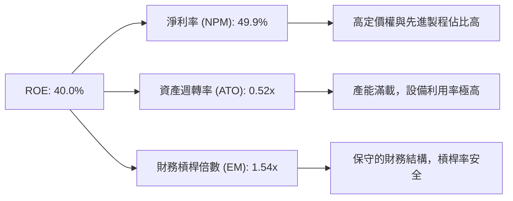

---

## 7. 估值深度分析

### 7.1 同業估值比較表格

在與晶圓代工及半導體製造同業的對比中，台積電雖然在 P/E 上高於 Intel，但考慮到其極高的毛利率與營收成長率，其估值溢價完全合理，且 Forward P/E 顯著低於行業均值。

| 估值指標 | **TSM (本公司)** | **Intel (INTC)** | **Samsung (三星)** | **德州儀器 (TXN)** | TSM 評估 |
|----------|-----------------|------------------|--------------------|--------------------|-----------|
| **Trailing P/E** | **36.63x** | 45.2x | 18.5x | 28.1x | 🟡 處於合理溢價區間 |
| **Forward P/E** | **19.80x** | 22.4x | 12.1x | 24.5x | 🟢 成長性調整後極具吸引力 |
| **PEG Ratio** | **1.07** | 2.15 | 1.45 | 2.85 | 🟢 性價比極高 |
| **EV / EBITDA** | **4.76x** | 8.2x | 3.9x | 14.2x | 🟢 估值顯著偏低 |
| **毛利率** | **64.2%** | 41.5% | 34.2% | 58.5% | 🟢 冠絕同行 |

### 7.2 歷史估值區間分析

```
╔══════════════════════════════════════════════════════════════════╗
║               TSM 歷史 P/E 區間與當前位置 (5年)                 ║
╠══════════════════════════════════════════════════════════════════╣
║                                                                  ║
║  歷史最低 P/E：  12.5x                                           ║
║  歷史最高 P/E：  38.5x                                           ║
║  歷史中位數 P/E：22.0x                                           ║
║                                                                  ║
║  當前 Trailing P/E: 36.63x  ██████████████████████░░  接近高位   ║
║  當前 Forward P/E:  19.80x  ████████████░░░░░░░░░░░░  低於中位數 ║
║                                                                  ║
║  📊 評語：雖然 TTM P/E 接近歷史高位，但 Forward P/E 僅 19.8x，   ║
║   這表明市場尚未完全 Price-in 2026 年預期淨利潤翻倍的利多。      ║
╚══════════════════════════════════════════════════════════════════╝
```

### 7.3 情境目標價（假設驅動）

| 情境 | 營收 CAGR (3年) | 營業利潤率 | 退出倍數 (Forward P/E) | 隱含目標價 (USD) | 相對現價漲跌幅 |
|------|-----------------|------------|------------------------|------------------|----------------|
| 🔴 **悲觀情境** | 15.0% | 45.0% | 15.0x | **$354.00** | -16.0% |
| 🟡 **基準情境** | **25.0%** | **52.0%** | **22.0x** | **$527.26** | **+25.1%** |
| 🟢 **樂觀情境** | 35.0% | 58.0% | 28.0x | **$700.00** | +66.0% |

### 7.4 DCF 敏感性分析（12個月目標價矩陣）

基於終端成長率（Terminal Growth Rate）為 3.5% 的假設：

| 營收成長率 \ WACC | WACC = 8.8% | **WACC = 9.8% (基準)** | WACC = 10.8% |
|------------------|-------------|-------------------------|--------------|
| 🟢 **樂觀 (30%)** | $645.00 | $595.00 | $542.00 |
| 🟡 **基準 (25%)** | $578.00 | **$527.26** | $482.00 |
| 🔴 **悲觀 (15%)** | $412.00 | $378.00 | $345.00 |

---

## 8. 成長催化劑

### 8.1 催化劑時間軸

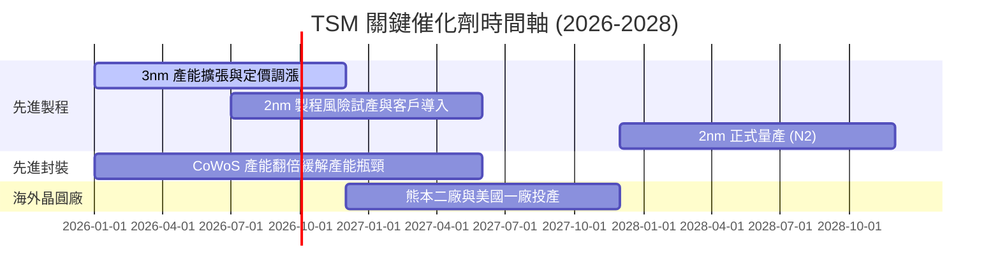

### 8.2 TAM（可定址市場）空間分析

```
╔══════════════════════════════════════════════════════════════════╗
║                   TSM 成長市場 TAM 與滲透率分析                  ║
╠══════════════════════════════════════════════════════════════════╣
║                                                                  ║
║  1. AI 加速器 (GPU/ASIC) 市場 (2028年預估)：                     ║
║     ├── 全球 TAM：$150B USD                                      ║
║     ├── TSM 預估份額：> 95%                                      ║
║     └── 貢獻營收：~$45B USD                                      ║
║                                                                  ║
║  2. 高效能運算 (HPC/伺服器) 市場：                               ║
║     ├── 全球 TAM：$250B USD                                      ║
║     ├── TSM 預估份額：~70%                                       ║
║     └── 貢獻營收：~$60B USD                                      ║
╚══════════════════════════════════════════════════════════════════╝
```

### 8.3 成長驅動力結構圖

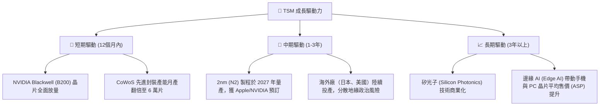

---

## 9. 風險矩陣

### 9.1 風險評分矩陣

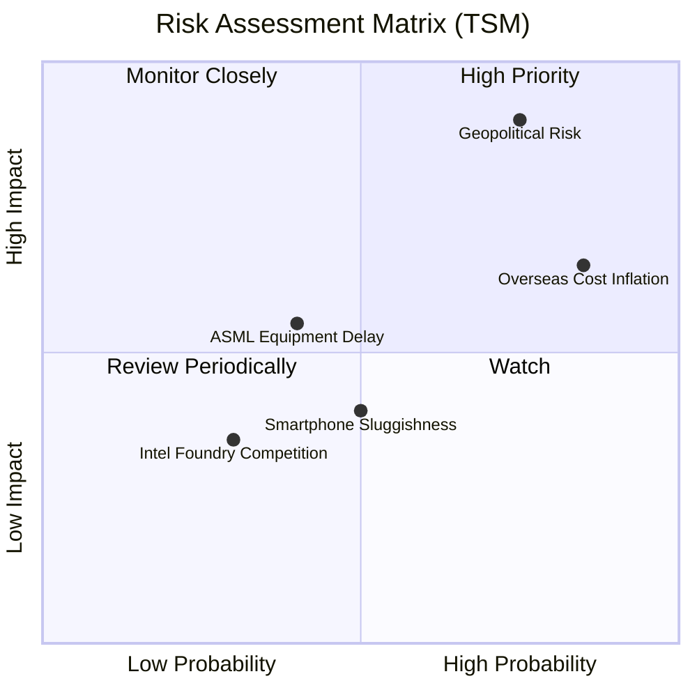

### 9.2 風險清單詳細分析

| # | 風險項目 | 發生機率 | 財務衝擊 | 風險評分 | 緩解措施 |
|---|----------|----------|----------|----------|----------|
| 1 | 🔴 **地緣政治風險** | 中 (40%) | 極高 (-50% 營收) | 🔴 8.5 / 10 | 加速美、日、德海外晶圓廠建設，分散單一地理區域生產風險。 |
| 2 | 🟡 **海外建廠成本通膨** | 高 (80%) | 中 (-3% 毛利率) | 🟡 6.5 / 10 | 與當地政府爭取高額補貼（如美晶片法案），並向客戶轉嫁海外生產溢價（約 15-20%）。 |
| 3 | 🟡 **設備供應鏈延遲** | 中 (30%) | 中 (-5% 產能) | 🟡 5.0 / 10 | 與 ASML、Applied Materials 等設備巨頭簽訂長期優先供應協議。 |

---

## 10. 投資建議

### 10.1 最終綜合評級

```
╔══════════════════════════════════════════════════════════════╗
║                    TSM 投資價值雷達評分                      ║
╠══════════════════════════════════════════════════════════════╣
║ 技術領先  9.8/10  ▓▓▓▓▓▓▓▓▓▓▓▓▓▓▓▓▓▓▓░  ★★★★★             ║
║ 獲利品質  9.5/10  ▓▓▓▓▓▓▓▓▓▓▓▓▓▓▓▓▓▓▓░  ★★★★★             ║
║ 財務健康  9.8/10  ▓▓▓▓▓▓▓▓▓▓▓▓▓▓▓▓▓▓▓░  ★★★★★             ║
║ 成長動能  9.0/10  ▓▓▓▓▓▓▓▓▓▓▓▓▓▓▓▓▓▓░░  ★★★★★             ║
║ 估值優勢  7.8/10  ▓▓▓▓▓▓▓▓▓▓▓▓▓▓░░░░░░  ★★★★☆             ║
╠══════════════════════════════════════════════════════════════╣
║ 綜合評級：🟢 強烈買入 (Strong Buy)  |  總分: 9.1 / 10        ║
╚══════════════════════════════════════════════════════════════╝
```

### 10.2 目標價與隱含報酬率

| 情境 | 機率權重 | 目標價 (USD) | 隱含報酬率 |
|------|----------|--------------|------------|
| 🔴 **悲觀情境** | 20% | $354.00 | -16.0% |
| 🟡 **基準情境** | **60%** | **$527.26** | **+25.1%** |
| 🟢 **樂觀情境** | 20% | $700.00 | +66.0% |
| **加權預期目標價** | **100%** | **$527.11** | **+25.0%** |

### 10.3 買入時機與觸發因素

```
╔══════════════════════════════════════════════════════════════════╗
║                  ✅ TSM 買入觸發因素 Checklist                   ║
╠══════════════════════════════════════════════════════════════════╣
║                                                                  ║
║  立即買入觸發條件（多數符合）：                                  ║
║  ✅ Forward P/E 跌破 20x（當前為 19.8x，已符合）                 ║
║  ✅ CoWoS 封裝產能擴張進度超前，季度營收 YoY 增速 > 30%          ║
║  ✅ 3nm 產品組合佔比持續提升，帶動毛利率維持在 60% 以上          ║
║                                                                  ║
║  加碼觸發條件：                                                  ║
║  ☐ 股價因地緣政治恐慌非理性下跌至 $360.00 以下                   ║
║  ☐ 2nm (N2) 客戶開案（Tape-out）數量超預期                       ║
║                                                                  ║
║  減碼/停損觸發條件：                                             ║
║  ☐ 營業毛利率連續兩季跌破 53%（顯示海外成本轉嫁失敗）            ║
║  ☐ 台海局勢出現實質性軍事衝突升級                               ║
╚══════════════════════════════════════════════════════════════════╝
```

### 10.4 投資人適配度分析

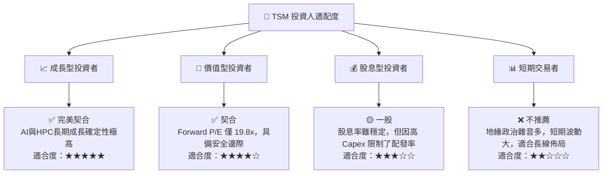

### 10.5 每季財報監控清單（Quarterly Watch List）

在未來的季度財報中，投資人應重點監控以下核心指標：

1. **先進製程營收佔比**：3nm 與 5nm 營收合計是否持續超過 50%（Q2 2026 已達 50% 以上）。
2. **毛利率（Gross Margin）**：是否維持在公司長期指引（53% 核心底線）之上，若因海外建廠稀釋至 53% 以下需警惕。
3. **資本支出指引（Capex Guidance）**：2026 全年 Capex 是否維持在 320 億至 360 億美元區間，過高可能壓抑 FCF，過低則暗示未來需求放緩。
4. **CoWoS 產能擴張速度**：是否如期在 2026 年底前實現產能翻倍，這是緩解 NVIDIA 晶片出貨瓶頸的關鍵。

### 10.6 反面論證：什麼會證明投資論點錯誤（What Would Change My Mind）

```
╔══════════════════════════════════════════════════════════════════╗
║              ⚠️ 論點失效條件（Disconfirming Evidence）           ║
╠══════════════════════════════════════════════════════════════════╣
║  若出現下列可量化條件之一，本報告之「強烈買入」評級將失效：      ║
║                                                                  ║
║  ☐ 營業毛利率連續兩季低於 53.0%                                  ║
║  ☐ 2nm (N2) 製程量產時程延遲至 2028 年以後                       ║
║  ☐ 核心客戶（如 Apple 或 NVIDIA）出現 > 20% 的砍單，且無其他     ║
║     客戶填補產能，導致先進製程利用率跌破 80%                     ║
║  ☐ ROIC 跌破 15.0%，顯示資本配置效率嚴重惡化                     ║
║  ☐ 地緣政治導致台積電出貨受實質性制裁或限制                      ║
╚══════════════════════════════════════════════════════════════════╝
```

---

> **免責聲明**：本報告僅供學術研究與投資參考，不構成任何買賣有價證券之要約或邀請。投資有風險，入市需謹慎。投資人應獨立評估風險並自負盈虧。